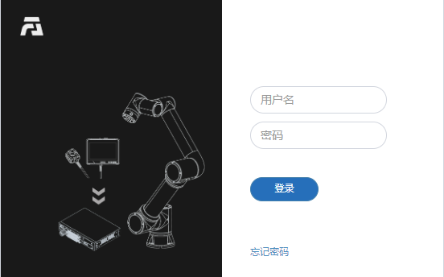
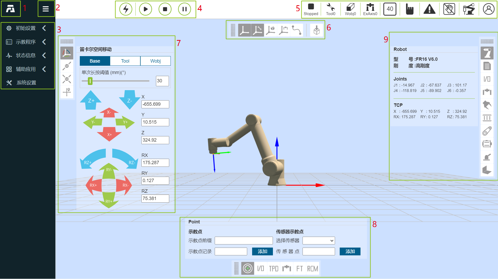

WebApp 存取登入
===================

.. toctree:: 
   :maxdepth: 6

存取登入WebApp介面
--------------------

1. 開啟控制箱並將網路線連接PC；
2. PC開啟chrome瀏覽器存取目標網址192.168.58.2；
3. 輸入使用者名稱和密碼點選登入即可登入WebApp。

初始用戶名為admin，密碼為123。

.. centered:: 圖表 2.1‑1 登入介面

簡單認識WebApp介面
--------------------

登入成功後系統進入“初始介面”，主要包含：

1. 法奧LOGO；
2. 選單列縮放按鈕；
3. 選單列；
4. 機器人控制區
5. 機器人狀態區；
6. 三維模擬機器人－三維場景操作；
7. 三維模擬機器人－機器人本體操作；
8. 機器人配套功能；
9. 機器人及配套功能狀態。

如下圖系統初始界面示意圖所示：

.. centered:: 圖表 2.2‑1 系统初始界面示意图

控制區
~~~~~~~~~

.. note:: 
   .. image:: teaching_pendant_software/003.png
      :width: 0.75in
      :height: 0.75in
      :align: left

   名稱：**使能按鈕**

   作用：使能機器人

.. note:: 
   .. image:: teaching_pendant_software/004.png
      :width: 0.75in
      :height: 0.75in
      :align: left

   名稱：**開始按鈕**

   作用：上傳並開始執行示教程序

.. note:: 
   .. image:: teaching_pendant_software/005.png
      :width: 0.75in
      :height: 0.75in
      :align: left

   名稱：**停止按鈕**

   作用：停止目前示教程序運行

.. note:: 
   .. image:: teaching_pendant_software/006.png
      :width: 0.75in
      :height: 0.75in
      :align: left

   名稱：**暫停/恢復按鈕**

   作用：暫停和恢復目前示教程序

.. important::
   暫停指令在程式的結尾，無法進行判斷。

狀態列
~~~~~~~~~~~~

.. note:: 
   .. image:: teaching_pendant_software/007.png
      :width: 0.75in
      :height: 0.75in
      :align: left

   名稱：**機器人狀態**

   作用：Stopped-停止，Running-運行，Pause-暫停，Drag-拖曳

.. note:: 
   .. image:: teaching_pendant_software/008.png
      :width: 0.75in
      :height: 0.75in
      :align: left

   名稱：**工具座標系編號**

   作用：展示目前應用的工具座標系編號

.. note:: 
   .. image:: teaching_pendant_software/027.png
      :width: 0.75in
      :height: 0.75in
      :align: left

   名稱：**工件座標系編號**

   作用：展示目前應用的工件座標系編號

.. note:: 
   .. image:: teaching_pendant_software/028.png
      :width: 0.75in
      :height: 0.75in
      :align: left

   名稱：**擴充軸座標系編號**

   作用：展示目前應用的擴展軸座標系編號
   
.. note:: 
   .. image:: teaching_pendant_software/009.png
      :width: 0.75in
      :height: 0.75in
      :align: left

   名稱：**運行速度百分比**

   作用：機器人當前模式運作時速度

.. note:: 
   .. image:: teaching_pendant_software/010.png
      :width: 0.75in
      :height: 0.75in
      :align: left

   名稱：**機器人運作正常狀態**

   作用：當前機器人正常運作

.. note:: 
   .. image:: teaching_pendant_software/011.png
      :width: 0.75in
      :height: 0.75in
      :align: left

   名稱：**機器人運作錯誤狀態**

   作用：當前機器人運作有錯誤

.. note:: 
   .. image:: teaching_pendant_software/012.png
      :width: 0.75in
      :height: 0.75in
      :align: left

   名稱：**自動模式**

   作用：機器人自動運作模式，開啟手動切自動模式全域速度調整並指定速度時，全域速度會自動調整為指定速度

.. note:: 
   .. image:: teaching_pendant_software/013.png
      :width: 0.75in
      :height: 0.75in
      :align: left

   名稱：**手動模式**

   作用：機器人手動模式，進行機器人示教操作

.. note:: 
   .. image:: teaching_pendant_software/014.png
      :width: 0.75in
      :height: 0.75in
      :align: left

   名稱：**機器人拖曳狀態**

   作用：當前機器人可拖曳

.. note:: 
   .. image:: teaching_pendant_software/015.png
      :width: 0.75in
      :height: 0.75in
      :align: left

   名稱：**機器人拖曳狀態**

   作用：當前機器人不可拖曳

.. note:: 
   .. image:: teaching_pendant_software/017.png
      :width: 0.75in
      :height: 0.75in
      :align: left

   名稱：**連線狀態**

   作用：機器人已連接

.. note:: 
   .. image:: teaching_pendant_software/016.png
      :width: 0.75in
      :height: 0.75in
      :align: left

   名稱：**未連線狀態**

   作用：機器人未連接

.. note:: 
   .. image:: teaching_pendant_software/018.png
      :width: 0.75in
      :height: 0.75in
      :align: left

   名稱：**帳戶資訊**

   作用：顯示用戶名及權限及登出用戶
