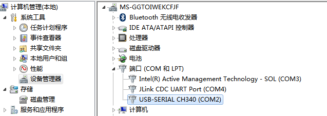
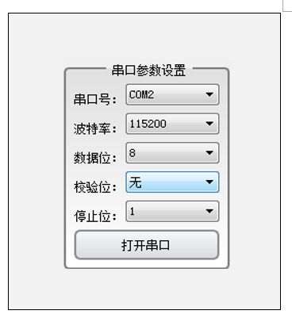
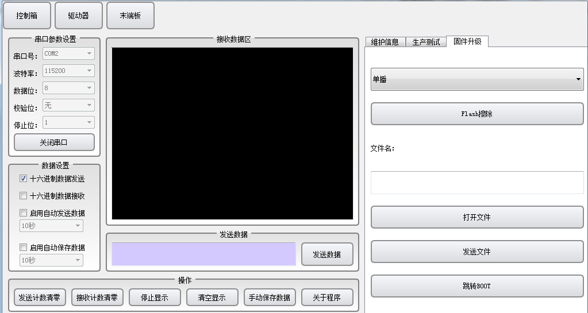
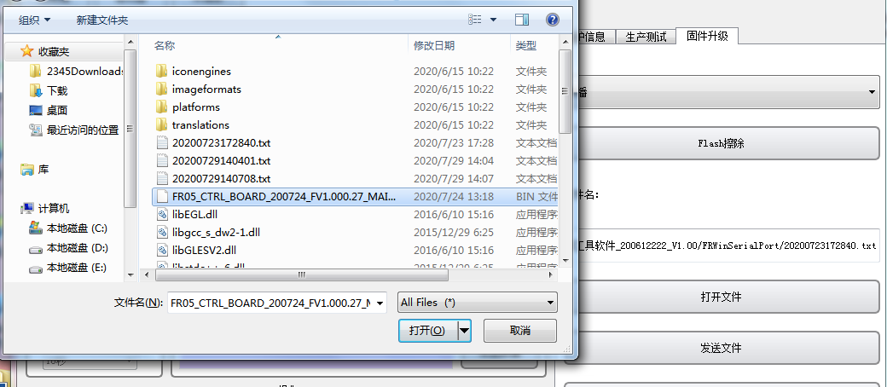
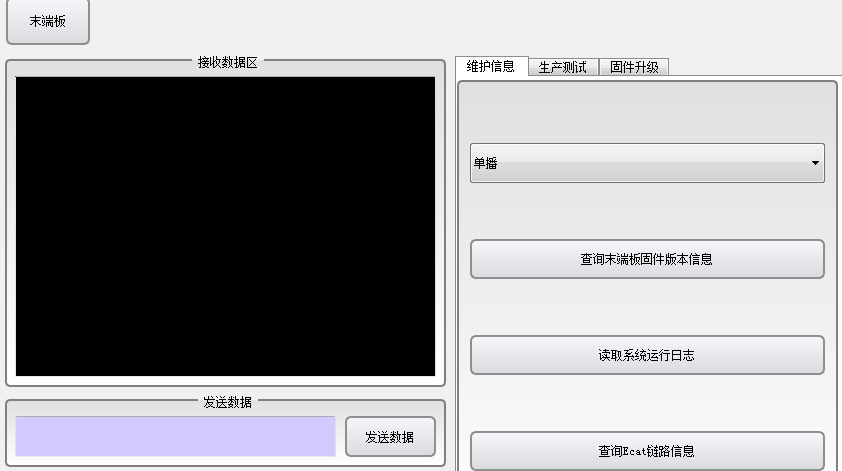
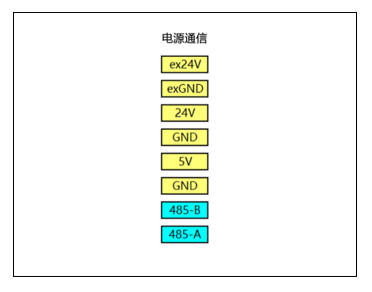

附錄
========

.. toctree:: 
  :maxdepth: 5

附錄1：運動控制器錯誤及處理方式
--------------------------------

+----------------------+-------------------------------------------------+----------------------------------------------------------------------------------------------------------------+-----------------------------------------------------------------------------+
|       錯誤分類       |               錯誤名(示教器顯示)                |                                                    處理方式                                                    |                                 處理後操作                                  |
+======================+=================================================+================================================================================================================+=============================================================================+
| 指令點錯誤           | 關節指令點錯誤                                  | 1.檢查指令點是否有誤;                                                                                          | 檢查確認，修改程序後，                                                      |
+                      +-------------------------------------------------+                                                                                                                +                                                                             +
|                      | 直線目標點錯誤                                  | 2.檢查工具是否與記錄，指令點時一致;                                                                            | 重新點擊START按鈕即可執行新程序                                             |
+                      +-------------------------------------------------+                                                                                                                +                                                                             +
|                      | 圓弧中間點錯誤                                  | 3.重新記錄指令點，修改示教程序;                                                                                |                                                                             |
+                      +-------------------------------------------------+                                                                                                                +                                                                             +
|                      | 圓弧目標點錯誤                                  |                                                                                                                |                                                                             |
+                      +-------------------------------------------------+                                                                                                                +                                                                             +
|                      | 圓弧指令點間距過小                              |                                                                                                                |                                                                             |
+                      +-------------------------------------------------+                                                                                                                +                                                                             +
|                      | 整圓/螺旋線中間點1錯誤(包含工具不符)            |                                                                                                                |                                                                             |
+                      +-------------------------------------------------+                                                                                                                +                                                                             +
|                      | 整圓/螺旋線中間點2錯誤(包含工具不符)            |                                                                                                                |                                                                             |
+                      +-------------------------------------------------+                                                                                                                +                                                                             +
|                      | 整圓/螺旋線中間點3錯誤(包含工具不符)            |                                                                                                                |                                                                             |
+                      +-------------------------------------------------+                                                                                                                +                                                                             +
|                      | 整圓/螺旋線指令點間距過小                       |                                                                                                                |                                                                             |
+                      +-------------------------------------------------+                                                                                                                +                                                                             +
|                      | TPD 指令點錯誤                                  |                                                                                                                |                                                                             |
+                      +-------------------------------------------------+                                                                                                                +                                                                             +
|                      | TPD 指令工具與目前工具不符                      |                                                                                                                |                                                                             |
+                      +-------------------------------------------------+----------------------------------------------------------------------------------------------------------------+-----------------------------------------------------------------------------+
|                      | TPD 目前指令與下一指令起始點偏差過大            | 1.檢查是否記錄TPD軌跡起點，示教程序中TPD                                                                       |                                                                             |
+                      +                                                 +                                                                                                                +                                                                             +
|                      |                                                 | 指令前是否有運動指令                                                                                           |                                                                             |
+                      +                                                 +                                                                                                                +                                                                             +
|                      |                                                 | (PTP/LIN)運動到TPD軌跡的起點;                                                                                  |                                                                             |
+                      +                                                 +                                                                                                                +                                                                             +
|                      |                                                 | 2、修改示教程序;                                                                                               |                                                                             |
+                      +-------------------------------------------------+----------------------------------------------------------------------------------------------------------------+-----------------------------------------------------------------------------+
|                      | 內外部工具切換錯誤                              | 1.重新記錄指令點，修改示教程序                                                                                 |                                                                             |
+                      +-------------------------------------------------+----------------------------------------------------------------------------------------------------------------+-----------------------------------------------------------------------------+
|                      | PTP關節指令超限                                 | 1.運動過程指令超出軟限位，需要修改程序;                                                                        | 反向點動，使機器人離開軟限位區域或切換到拖曳模式，拖曳機                    |
+                      +-------------------------------------------------+----------------------------------------------------------------------------------------------------------------+-----------------------------------------------------------------------------+
|                      | TPD關節指令超限                                 | 1.運動過程指令超出軟限位，需要修改程序;                                                                        | 器人離開軟限位區域;                                                         |
+                      +-------------------------------------------------+----------------------------------------------------------------------------------------------------------------+-----------------------------------------------------------------------------+
|                      | LIN\ARC下發關節指令超限                         | 1.運動過程指令超出軟限位，需要修改程序;                                                                        | 修改程序後，重新點選START按鈕即可執行新程序;                                |
+                      +-------------------------------------------------+----------------------------------------------------------------------------------------------------------------+-----------------------------------------------------------------------------+
|                      | JOG關節指令超限                                 | 1.運動過程指令超出軟限位;                                                                                      | 反向點動，使機器人離開軟限位區域或切換到拖曳模式，拖曳機器人離開軟限位區域; |
+                      +-------------------------------------------------+----------------------------------------------------------------------------------------------------------------+-----------------------------------------------------------------------------+
|                      | 笛卡兒空間內指令超速                            | 指令存在問題;                                                                                                  | 聯絡售後人員;                                                               |
+                      +-------------------------------------------------+                                                                                                                +                                                                             +
|                      | 關節空間內扭力指令超限                          |                                                                                                                |                                                                             |
+                      +-------------------------------------------------+                                                                                                                +                                                                             +
|                      | 軸1-軸6關節空間內指令速度超限                   |                                                                                                                |                                                                             |
+                      +-------------------------------------------------+----------------------------------------------------------------------------------------------------------------+-----------------------------------------------------------------------------+
|                      | 下一指令關節配置發生變化 (下一指令中存在奇異位) | 1.修改示教程序，運動停止時目前行的下一行程序修改為PTP指令;                                                     |                                                                             |
+                      +-------------------------------------------------+----------------------------------------------------------------------------------------------------------------+-----------------------------------------------------------------------------+
|                      | 當前指令關節配置發生變化(當前指令中存在奇異位)  | 1.自動模式時，修改示1教程序，運動停止時當前行程序修改為PTP指令;2.手動模式時，重新上電後切換關節座標再進行點動; |                                                                             |
+                      +-------------------------------------------------+----------------------------------------------------------------------------------------------------------------+-----------------------------------------------------------------------------+
|                      | 指令錯誤，ARCSTART和ARCEND間只允許LIN和ARC指令  | 1.檢查指令，修改示教程序;                                                                                      |                                                                             |
+                      +-------------------------------------------------+                                                                                                                +-----------------------------------------------------------------------------+
|                      | 指令錯誤，WEAVESTART和WEAVEEND間只允許LIN 指令  |                                                                                                                |                                                                             |
+                      +-------------------------------------------------+----------------------------------------------------------------------------------------------------------------+-----------------------------------------------------------------------------+
|                      | 擺焊參數錯誤                                    | 1.檢查擺焊參數，修改示教程序;                                                                                  |                                                                             |
+                      +-------------------------------------------------+----------------------------------------------------------------------------------------------------------------+-----------------------------------------------------------------------------+
|                      | 雷射感測器指令偏差過大                          | 1.使用雷射感測器配套軟體，檢查雷射感測器數據是否有跳變;                                                        |                                                                             |
+                      +-------------------------------------------------+----------------------------------------------------------------------------------------------------------------+-----------------------------------------------------------------------------+
|                      | 雷射感測器指令中斷，焊縫追蹤提前結束            | 1.使用雷射感測器配套軟體，檢查雷射感測器數據是否中斷;                                                          |                                                                             |
+                      +-------------------------------------------------+----------------------------------------------------------------------------------------------------------------+-----------------------------------------------------------------------------+
|                      | 外部軸指令速度超限                              | 1.指令存在問題;                                                                                                | 聯絡售後人員                                                                |
+                      +-------------------------------------------------+                                                                                                                +                                                                             +
|                      | 外部軸指令與回饋偏差過大                        |                                                                                                                |                                                                             |
+                      +-------------------------------------------------+----------------------------------------------------------------------------------------------------------------+-----------------------------------------------------------------------------+
|                      | 傳送帶追蹤-起始點與參考點姿態變化過大           | 1.重新標定傳送帶位姿點;                                                                                        |                                                                             |
+                      +-------------------------------------------------+----------------------------------------------------------------------------------------------------------------+-----------------------------------------------------------------------------+
|                      | 恆力控制-(XYZRXRYRZ)方向超過最大調整距離        | 1.調整恆力控制PID數值，修改示教程序;                                                                           |                                                                             |
+----------------------+-------------------------------------------------+----------------------------------------------------------------------------------------------------------------+-----------------------------------------------------------------------------+
| 驅動器故障           | 1-6軸驅動器故障                                 | 1.驅動器發生故障，查看驅動器故障表，檢查驅動器故障原因;                                                        | 重新上電                                                                    |
+----------------------+-------------------------------------------------+----------------------------------------------------------------------------------------------------------------+-----------------------------------------------------------------------------+
| 超出軟限位故障       | 1-6軸超出軟限位故障                             | 1.驅動器發生故障，查看驅動器故障表，檢查驅動器故障原因;                                                        | 切換到拖曳模式，拖曳機器人離開軟限位區域;                                   |
+----------------------+-------------------------------------------------+----------------------------------------------------------------------------------------------------------------+-----------------------------------------------------------------------------+
| 碰撞故障             | 1-6軸碰撞故障                                   | 1.運動過程發生碰撞;                                                                                            | 檢查碰撞原因,需要再開始運動時點選示教程式介面RESUME按鈕;                    |
+----------------------+-------------------------------------------------+----------------------------------------------------------------------------------------------------------------+-----------------------------------------------------------------------------+
| 文件錯誤             | zbt設定檔版本錯誤                               | 1.zbt.config 設定檔版本錯;                                                                                     | 聯絡售後人員                                                                |
+                      +-------------------------------------------------+----------------------------------------------------------------------------------------------------------------+-----------------------------------------------------------------------------+
|                      | zbt設定檔載入失敗                               | 1.zbt.config 設定檔載入錯誤;                                                                                   | 重新上電，仍報錯的話聯絡售後人員                                            |
+                      +-------------------------------------------------+----------------------------------------------------------------------------------------------------------------+-----------------------------------------------------------------------------+
|                      | user設定檔版本錯誤                              | 1.userconfig設定檔版本錯誤;                                                                                    | 聯絡售後人員                                                                |
+                      +-------------------------------------------------+----------------------------------------------------------------------------------------------------------------+-----------------------------------------------------------------------------+
|                      | user設定檔載入失敗                              | 1.userconfig 設定檔載入錯誤;                                                                                   | 重新上電，仍報錯的話聯絡售後人員                                            |
+                      +-------------------------------------------------+----------------------------------------------------------------------------------------------------------------+-----------------------------------------------------------------------------+
|                      | exaxis配置文件版本錯誤                          | 1.exaxis.config設定檔版本錯誤;                                                                                 | 聯絡售後人員                                                                |
+                      +-------------------------------------------------+----------------------------------------------------------------------------------------------------------------+-----------------------------------------------------------------------------+
|                      | exaxis設定檔載入失敗                            | 1.exaxis.config 設定檔載入錯誤;                                                                                | 重新上電，仍報錯的話聯絡售後人員                                            |
+                      +-------------------------------------------------+----------------------------------------------------------------------------------------------------------------+-----------------------------------------------------------------------------+
|                      | 機器人型號不一致，需要重新設定                  |                                                                                                                | 聯絡售後人員                                                                |
+----------------------+-------------------------------------------------+----------------------------------------------------------------------------------------------------------------+-----------------------------------------------------------------------------+
| IO錯誤               | 通道錯誤                                        | 檢查程式中IO指令通道是否設定錯誤;                                                                              | 檢查確認，修改程序後，重新點選START按鈕即可執行新程序;                      |
+                      +-------------------------------------------------+----------------------------------------------------------------------------------------------------------------+                                                                             +
|                      | 数值錯誤                                        | 檢查程式中IO指令通道是否設定錯誤;                                                                              |                                                                             |
+                      +-------------------------------------------------+----------------------------------------------------------------------------------------------------------------+                                                                             +
|                      | WaitDI 等待超時                                 | 1.檢查是否有有效的輸入訊號;                                                                                    |                                                                             |
+                      +-------------------------------------------------+                                                                                                                +                                                                             +
|                      | WaitAI 等待超時                                 |                                                                                                                |                                                                             |
+                      +-------------------------------------------------+                                                                                                                +                                                                             +
|                      | WaitToolDI 等待超時                             |                                                                                                                |                                                                             |
+                      +-------------------------------------------------+                                                                                                                +                                                                             +
|                      | WaitToolAI 等待超時                             |                                                                                                                |                                                                             |
+                      +-------------------------------------------------+----------------------------------------------------------------------------------------------------------------+-----------------------------------------------------------------------------+
|                      | 通道已配置功能錯誤                              | 1.目前通道已配置功能，示教編程中不能使用，需更換為其他通道;                                                    | 目前通道已配置功能，示教編程中不能使用，需更換為其他通道                    |
+                      +-------------------------------------------------+----------------------------------------------------------------------------------------------------------------+-----------------------------------------------------------------------------+
|                      | 起弧超時                                        | 1.檢查起弧成功訊號;                                                                                            | 目前通道已配置功能，示教編程中不能使用，需更換為其他通道                    |
+                      +-------------------------------------------------+----------------------------------------------------------------------------------------------------------------+-----------------------------------------------------------------------------+
|                      | 收弧超時                                        | 1.检查收弧成功信号;                                                                                            | 目前通道已配置功能，示教編程中不能使用，需更換為其他通道                    |
+                      +-------------------------------------------------+----------------------------------------------------------------------------------------------------------------+-----------------------------------------------------------------------------+
|                      | 尋位逾時                                        | 1.調整尋位參數，修改示教程序;                                                                                  | 目前通道已配置功能，示教編程中不能使用，需更換為其他通道                    |
+                      +-------------------------------------------------+----------------------------------------------------------------------------------------------------------------+-----------------------------------------------------------------------------+
|                      | 傳送帶IO檢測超時，可重設                        | 1.檢查IO觸發訊號;                                                                                              | 目前通道已配置功能，示教編程中不能使用，需更換為其他通道                    |
+                      +-------------------------------------------------+----------------------------------------------------------------------------------------------------------------+-----------------------------------------------------------------------------+
|                      | 起弧成功DI未配置                                | 1.檢查DI配置;                                                                                                  |                                                                             |
+----------------------+-------------------------------------------------+----------------------------------------------------------------------------------------------------------------+-----------------------------------------------------------------------------+
| 夾爪錯誤             | 夾爪運動超時錯誤                                | 1.等待夾爪運動完成訊號逾時;                                                                                    | 聯絡售後人員                                                                |
+                      +-------------------------------------------------+----------------------------------------------------------------------------------------------------------------+                                                                             +
|                      | 485超時                                         |                                                                                                                |                                                                             |
+                      +-------------------------------------------------+----------------------------------------------------------------------------------------------------------------+                                                                             +
|                      | 指令格式錯誤                                    |                                                                                                                |                                                                             |
+                      +-------------------------------------------------+----------------------------------------------------------------------------------------------------------------+                                                                             +
|                      | 運動延遲、運動前必須先激活                      |                                                                                                                |                                                                             |
+                      +-------------------------------------------------+----------------------------------------------------------------------------------------------------------------+                                                                             +
|                      | 運動時，激活位必須為激活                        |                                                                                                                |                                                                             |
+                      +-------------------------------------------------+----------------------------------------------------------------------------------------------------------------+                                                                             +
|                      | 溫度過高                                        |                                                                                                                |                                                                             |
+                      +-------------------------------------------------+----------------------------------------------------------------------------------------------------------------+                                                                             +
|                      | 電壓過低                                        |                                                                                                                |                                                                             |
+                      +-------------------------------------------------+----------------------------------------------------------------------------------------------------------------+                                                                             +
|                      | 正在自動釋放                                    |                                                                                                                |                                                                             |
+                      +-------------------------------------------------+----------------------------------------------------------------------------------------------------------------+                                                                             +
|                      | 內部故障                                        |                                                                                                                |                                                                             |
+                      +-------------------------------------------------+----------------------------------------------------------------------------------------------------------------+                                                                             +
|                      | 啟動失敗                                        |                                                                                                                |                                                                             |
+                      +-------------------------------------------------+----------------------------------------------------------------------------------------------------------------+                                                                             +
|                      | 過流                                            |                                                                                                                |                                                                             |
+                      +-------------------------------------------------+----------------------------------------------------------------------------------------------------------------+                                                                             +
|                      | 自動釋放結束                                    |                                                                                                                |                                                                             |
+----------------------+-------------------------------------------------+----------------------------------------------------------------------------------------------------------------+-----------------------------------------------------------------------------+
| 警告                 | 肩關節配置變化                                  | 暫未實現                                                                                                       |                                                                             |
+                      +-------------------------------------------------+                                                                                                                +                                                                             +
|                      | 肘關節配置變化                                  |                                                                                                                |                                                                             |
+                      +-------------------------------------------------+                                                                                                                +                                                                             +
|                      | 腕關節配置變化                                  |                                                                                                                |                                                                             |
+                      +-------------------------------------------------+----------------------------------------------------------------------------------------------------------------+-----------------------------------------------------------------------------+
|                      | RPY初始化失敗                                   | 1.RX、RY、RZ初始化失敗，移動機器人，使RY不等於+90°;                                                            | 移動機器人後，重新上電;                                                     |
+                      +-------------------------------------------------+----------------------------------------------------------------------------------------------------------------+-----------------------------------------------------------------------------+
|                      | 1min後切入普通示教模式警告                      |                                                                                                                |                                                                             |
+----------------------+-------------------------------------------------+----------------------------------------------------------------------------------------------------------------+-----------------------------------------------------------------------------+
| 活動從站數量錯誤     | 活動從站數量錯誤                                |                                                                                                                |                                                                             |
+----------------------+-------------------------------------------------+                                                                                                                +                                                                             +
| 從站錯誤             | 從站掉線                                        | 1.從站出現錯誤，檢查EtherCAT線是否正常;                                                                        | 重新上電，若未解決，聯絡售後人員;                                           |
+                      +-------------------------------------------------+                                                                                                                +                                                                             +
|                      | 從站狀態與設定值不一致                          |                                                                                                                |                                                                             |
+                      +-------------------------------------------------+                                                                                                                +                                                                             +
|                      | 從站未配置                                      |                                                                                                                |                                                                             |
+                      +-------------------------------------------------+                                                                                                                +                                                                             +
|                      | 從站配置錯誤                                    |                                                                                                                |                                                                             |
+                      +-------------------------------------------------+                                                                                                                +                                                                             +
|                      | 從站初始化錯誤                                  |                                                                                                                |                                                                             |
+                      +-------------------------------------------------+                                                                                                                +                                                                             +
|                      | 從站郵箱通訊初始化錯誤                          |                                                                                                                |                                                                             |
+----------------------+-------------------------------------------------+----------------------------------------------------------------------------------------------------------------+-----------------------------------------------------------------------------+
| 安全門警告           | 安全門觸發                                      |                                                                                                                |                                                                             |
+----------------------+-------------------------------------------------+----------------------------------------------------------------------------------------------------------------+-----------------------------------------------------------------------------+
| 運動警告             | LIN 指令姿態變化過大                            | 暫未實現;                                                                                                      |                                                                             |
+----------------------+-------------------------------------------------+----------------------------------------------------------------------------------------------------------------+-----------------------------------------------------------------------------+
| 干涉區警告           | 進入乾涉區                                      |                                                                                                                |                                                                             |
+----------------------+-------------------------------------------------+----------------------------------------------------------------------------------------------------------------+-----------------------------------------------------------------------------+
| 參數錯誤             | 工具號碼超限錯誤                                | 1.匯出備份包;                                                                                                  | 聯絡售後人員                                                                |
+                      +-------------------------------------------------+                                                                                                                +                                                                             +
|                      | 定位完成聞值錯誤                                |                                                                                                                |                                                                             |
+                      +-------------------------------------------------+                                                                                                                +                                                                             +
|                      | 負載重量錯誤                                    |                                                                                                                |                                                                             |
+                      +-------------------------------------------------+                                                                                                                +                                                                             +
|                      | 負載質心(X,Y,Z)錯誤                             |                                                                                                                |                                                                             |
+                      +-------------------------------------------------+                                                                                                                +                                                                             +
|                      | DI 濾波時間錯誤                                 |                                                                                                                |                                                                             |
+                      +-------------------------------------------------+                                                                                                                +                                                                             +
|                      | AxleDI 濾波時間錯誤                             |                                                                                                                |                                                                             |
+                      +-------------------------------------------------+                                                                                                                +                                                                             +
|                      | AI 濾波時間錯誤                                 |                                                                                                                |                                                                             |
+                      +-------------------------------------------------+                                                                                                                +                                                                             +
|                      | AxleAI 濾波時間錯誤                             |                                                                                                                |                                                                             |
+                      +-------------------------------------------------+                                                                                                                +                                                                             +
|                      | DI高低電平範圍錯誤                              |                                                                                                                |                                                                             |
+                      +-------------------------------------------------+                                                                                                                +                                                                             +
|                      | DO高低電平範圍錯誤                              |                                                                                                                |                                                                             |
+                      +-------------------------------------------------+                                                                                                                +                                                                             +
|                      | 工件號超限錯誤                                  |                                                                                                                |                                                                             |
+                      +-------------------------------------------------+                                                                                                                +                                                                             +
|                      | 外部軸號超限錯誤                                |                                                                                                                |                                                                             |
+                      +-------------------------------------------------+                                                                                                                +                                                                             +
|                      | 傳送帶追蹤-編碼器通道錯誤                       |                                                                                                                |                                                                             |
+                      +-------------------------------------------------+                                                                                                                +                                                                             +
|                      | 傳送帶追蹤工件軸號錯誤                          |                                                                                                                |                                                                             |
+----------------------+-------------------------------------------------+----------------------------------------------------------------------------------------------------------------+-----------------------------------------------------------------------------+
| 八點法               | 第1組資料姿態變化過大                           | 重新標定                                                                                                       |                                                                             |
+                      +-------------------------------------------------+                                                                                                                +                                                                             +
|                      | 數據錯誤，計算失敗                              |                                                                                                                |                                                                             |
+----------------------+-------------------------------------------------+----------------------------------------------------------------------------------------------------------------+-----------------------------------------------------------------------------+
| 按鈕盒確狀態回饋     | 記錄點訊號                                      |                                                                                                                |                                                                             |
+                      +-------------------------------------------------+----------------------------------------------------------------------------------------------------------------+-----------------------------------------------------------------------------+
|                      | 開始運行                                        |                                                                                                                |                                                                             |
+                      +-------------------------------------------------+----------------------------------------------------------------------------------------------------------------+-----------------------------------------------------------------------------+
|                      | 停止運行                                        |                                                                                                                |                                                                             |
+----------------------+-------------------------------------------------+----------------------------------------------------------------------------------------------------------------+-----------------------------------------------------------------------------+
| 外部軸超出軟限位故障 | 外部軸1-4軸超出軟限位故障                       | 1.運動過程超越軟限位;                                                                                          | 反向點動外部軸，離開軟限位區域;                                             |
+----------------------+-------------------------------------------------+----------------------------------------------------------------------------------------------------------------+-----------------------------------------------------------------------------+
| 示教器(樹莓派)通訊   | Webapp與示教器(樹莓派通訊失敗)                  | 1.檢查是否需要啟用示教器(樹                                                                                    |                                                                             |
+                      +                                                 +                                                                                                                +                                                                             +
|                      |                                                 | 莓派)，若不需要啟用，進入                                                                                      |                                                                             |
+                      +                                                 +                                                                                                                +                                                                             +
|                      |                                                 | Web頁面，系統設定一通用設定一示教器設置，關閉示教器                                                            |                                                                             |
+                      +                                                 +                                                                                                                +                                                                             +
|                      |                                                 | 啟用;                                                                                                          |                                                                             |
+                      +                                                 +                                                                                                                +                                                                             +
|                      |                                                 | 2.檢查示教器(樹莓派)與控制器網路線連接是否正常;                                                                |                                                                             |
+----------------------+-------------------------------------------------+----------------------------------------------------------------------------------------------------------------+-----------------------------------------------------------------------------+
| 原點錯誤             | 原點已改變，需要重新設定原點                    | 1.進入網頁頁面，輔助應用程式--機器人本體--作業原點,重新設定作業原點;                                           |                                                                             |
+----------------------+-------------------------------------------------+----------------------------------------------------------------------------------------------------------------+-----------------------------------------------------------------------------+

附錄2：伺服驅動器故障碼表
---------------------------

.. list-table::
   :widths: 20 40 80
   :header-rows: 0
   :align: center

   * - **故障碼**
     - **故障名稱**
     - **處理方法**

   * - 1
     - 軟體過流故障
     - | 1.檢查關節負載或阻力是否變大或異常
       | 2.若故障仍未排除，維修或更換驅動板

   * - 2
     - 過壓故障
     - 降低機器人運轉速度或加速度

   * - 3
     - 欠壓故障
     - | 1.檢查控制箱48V 電源電壓輸出是否異常
       | 2.檢查驅動板和關節外殼是否短路
       | 3.若故障仍未排除，維修或更換驅動板

   * - 4
     - 過熱故障
     - 減小機器人負載或降低機器人運作速度

   * - 5
     - 過載故障
     - 減小機器人負載或降低機器人運作速度

   * - 6
     - 超速故障
     - | 1.檢查磁編組件及馬達軸固定頂絲是否鬆動
       | 2.重新進行編碼器校零
       | 3.若故障仍未排除，維修或更換磁編組件

   * - 7
     - 參數異常故障
     - 維修或更換驅動板

   * - 8
     - 飛車故障
     - | 1.檢查磁編組件及馬達軸固定頂絲是否鬆動
       | 2.重新進行編碼器校零
       | 3.若故障仍未排除，維修或更換磁編組件

   * - 9
     - 位置誤差故障
     - | 1.檢查關節負載或阻力是否變大或異常
       | 2.若故障仍未排除，維修或更換驅動板

   * - 10
     - 位置溢出故障
     - | 1.檢查硬限位是否鬆動
       | 2.重新進行機器人校零

   * - 11
     - 硬體過流故障
     - 維修或更換驅動板

   * - 12
     - 驅動禁止故障
     - 未啟用

   * - 13
     - 馬達堵轉故障
     - | 1.檢查煞車電磁鐵是否吸合
       | 2.檢查是否撞到硬限位
       | 3.若故障仍未排除，維修或更換驅動板

   * - 14
     - 功率電源故障
     - 未啟用

   * - 15
     - STO 故障
     - 未啟用

   * - 16
     - 相電流 AD 歸零故障
     - 維修或更換驅動板

   * - 17
     - EEPROM 故障
     - 維修或更換驅動板

   * - 18
     - 霍爾故障
     - | 1.檢查霍爾線束是否插接牢固，有無短路、斷路
       | 2.若故障仍未排除，維修或更換關節

   * - 19
     - 編碼器故障
     - 維修或更換磁編組件

   * - 20
     - 編碼器歸零故障
     - | 1.重新進行編碼器校零
       | 2.若故障仍未排除，維修或更換磁編組件
   
   * - 21
     - 編碼器Z相信號遺失故障
     - 未啟用

   * - 22
     - 編碼器計數故障
     - 未啟用

   * - 23
     - 編碼器多圈資料溢位故障
     - 未啟用

   * - 24
     - 外部時鐘故障
     - 維修或更換驅動板

   * - 25
     - UVW 相序故障
     - 未啟用

   * - 26
     - FPGA故障
     - 未啟用

   * - 27
     - 回零故障
     - 未啟用

   * - 28
     - 磁編碼器故障
     - | 1.檢查磁編組件及馬達軸固定頂絲是否鬆脫
       | 2.若故障仍未排除，維修或更換磁編組件

   * - 29
     - 馬達動力線斷線故障
     - | 1.檢查馬達動力線是否插接牢固，有無短路、斷路
       | 2.若故障仍未排除，維修或更換驅動板

   * - 30
     - EtherCAT故障
     - | 1.檢查網路線是否插接牢固，有無短路、斷路
       | 2.若故障仍未排除，維修或更換驅動板

   * - 31
     - EtherCAT_SM_DOG故障
     - | 1.檢查網路線是否插接牢固，有無短路、斷路
       | 2.若故障仍未排除，維修或更換驅動板

   * - 32
     - EtherCAT_FATALSYNC故障
     - | 1.檢查網路線是否插接牢固，有無短路、斷路
       | 2.若故障仍未排除，維修或更換驅動板

   * - 33
     - EtherCAT_SYNC故障
     - | 1.檢查網路線是否插接牢固，有無短路、斷路
       | 2.若故障仍未排除，維修或更換驅動板

   * - 34
     - EtherCAT_RFT故障
     - | 1.檢查網路線是否插接牢固，有無短路、斷路
       | 2.若故障仍未排除，維修或更換驅動板

   * - 35
     - 驅動器軸位址故障
     - | 1.重新進行驅動器軸位址配置
       | 2.若故障仍未排除，維修或更換驅動板

   * - 36
     - 機器人校零故障
     - | 1.重新進行機器人校零
       | 2.先使用JLINK 擦除 FLASH，再重新下載程式併校零
       | 3.若故障仍未排除，維修或更換驅動板

   * - 37
     - 編碼器通訊故障
     - | 1.檢查編碼器線束是否插接牢固，有無短路、斷路
       | 2.若故障仍未排除，維修或更換磁編組件

   * - 40
     - 磁編模組故障-校零故障
     - | 1.重新進行磁編組件校零
       | 2.若故障仍未排除，維修或更換磁編組件

   * - 41
     - 磁編模組故障-多圈故障
     - | 1.檢查磁編組件及馬達軸固定頂絲是否鬆脫
       | 2.若故障仍未排除，維修或更換磁編組件

   * - 42
     - 磁編模組故障-多圈小磁編故障
     - | 1.檢查多圈小磁編晶片是否異常
       | 2.若故障仍未排除，維修或更換磁編組件

   * - 43
     - 磁編模組故障-多圈大磁編故障
     - | 1.檢查多圈大磁編晶片是否異常
       | 2.若故障仍未排除，維修或更換磁編組件

   * - 44
     - 磁編模組故障-單圈磁編故障
     - | 1.檢查單圈磁編晶片是否異常
       | 2.若故障仍未排除，維修或更換磁編組件

   * - 45
     - 磁編模組故障-光編故障
     - | 1.檢查光編碼盤是否有污染或未黏牢
       | 2.若故障仍未排除，維修或更換磁編組件

附錄3：末端板485升級
---------------------------

現場使用時，有可能更新固件，滿足新的要求，會提供新的升級檔案（XX_XX_MAIN.bin），透過485介面對末端板進行升級（需要藉助USB轉485模組）。升級步驟如下：

**Step1：485接線**，在機器人末端處有5Pin通訊航空接頭，航空接頭Pin腳分佈及其pin腳說明如圖表1所示。將機器人末端的485-A、485-B與USB轉485工具的A、B使用雙絞線連接。

.. figure:: appendix/001.png
   :align: center
   :width: 4in

.. centered:: 圖表 18.3-1 航空接頭Pin腳分佈

**Step2，硬體連接**，將USB轉485工具的USB端與PC連接，在PC設備管理器中，若辨識到USB&485工具，會出現如下介面。

.. centered:: 圖表 18.3-2 USB&485埠識別說明

**Step3：升級工具**，在完成接線後，打開“法奧串口調試助手”，點擊“末端板”按鈕，在“串口參數設定”功能中選擇上述識別的串口，波特率115200，數據位8位，校驗位無，停止位1，然後打開串口，成功之後會出現「串口開啟成功」的提示。

.. centered:: 圖表 18.3-3 串口參數設定

**Step4：韌體升級**，選擇“末端板”，點擊“韌體升級”，如圖表所示：

.. centered:: 圖表 18.3-4 末端板韌體升級

- 首先點擊“Flash擦除”，擦除成功之後，會在接收資料區提示擦除成功。

-  開啟檔案（待升級檔案），選擇存放的路徑，如下所示，選擇完成後，待升級檔案名稱會出現在檔案名稱顯示框中。

.. centered:: 圖表 18.3-5 選擇升級文件

- 點擊“傳送檔案”，當進度條顯示100%時，表示已經完成發送升級檔案。  點击“发送文件”，當进度条显示100%时，表示已经完成发送升級文件。

**Step5：升級驗證**，系統重啟上電，在“維護信息”欄，選擇“查詢末端板韌體版本信息”，在“接收數據區”會顯示固件版本信息，如果和升級的文件版本信息一致，說明昇級成功，否則升級失敗.

.. centered:: 圖表 18.3-6 查詢韌體版本信息

附錄4：控制箱485升級
------------------------

在機器人控制箱板有「電源通訊」接口，將USB&485工具A、B分別連接到其接口的「485-A」、「485-B」。

其升級過程操作同端板，軟體對應選擇即可，此處不在贅述。

.. centered:: 圖表 18.4-1 電源通訊介面

附錄5：備件、易損件清單
-----------------------------

.. list-table::
   :widths: 40 40 20
   :header-rows: 0
   :align: center

   * - **零件**
     - **編號**
     - **數量**

   * - M8*30 螺絲
     - 4.0.08.2006185
     - 4

   * - 圓柱銷A型8*20
     - 4.5.00.2013076
     - 2

   * - 保險絲5x206A
     - 
     - 1