工具應用
===============

.. toctree::
   :maxdepth: 6

機器人打包
-----------------

在「輔助應用」->「工具應用」的功能表列下，點擊「機器人打包」按鈕，進入機器人一鍵打包介面。

.. important::
   在操作打包功能之前，請先確認機器人周圍環境和狀態，防止發生碰撞。

   若出廠，則出廠前先進去系統設定-通用設定，進行恢復出廠設定。

**Step1**：在移至打包點前先將機器人移至零點。

**Step2**：點擊「移至零點」按鈕，確認機器人機械零點正確，各關節如圖中橙色圓圈位置缺口對齊。

**Step3**：點擊「移至打包點」按鈕，機器人按照包裝工藝各軸角度運行至打包點。

.. image:: application/001.png
   :width: 4in
   :align: center

.. centered:: 圖表 14.1‑1 機器人一鍵打包

資料備份
-----------

1. 在「輔助應用」->「工具應用」的功能表欄下，點選「資料備份」進入資料備份介面，如下圖所示

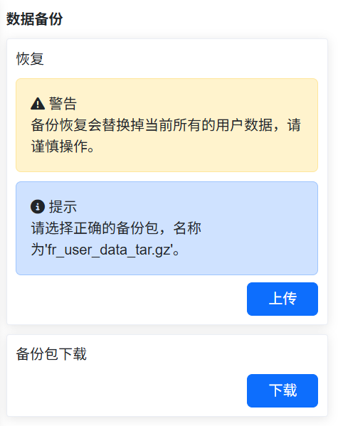

.. centered:: 圖表 14.2‑1 資料備份介面

2. 備份包資料中包含工具座標系資料，系統設定檔，示教點資料，使用者程式，範本程式和使用者設定檔，當使用者需要將本機器人相關資料移到另一台機器人上使用時，可透過此功能快速實現。

備份包完整性校驗功能
~~~~~~~~~~~~~~~~~~~~~~~~~~~~~~~~~~~~~~~~~~~~~~~~~~~~~~~~~~~~~~~~~

為避免在匯入備份包時可能存在由安裝方式等設定不一致所導致的潛在安全風險，新增備份包匯入時對備份包MD5校驗及關鍵參數的校驗功能。

備份包MD5校驗功能
++++++++++++++++++++++++++++++++++++++++++++++++++++
為確保匯入備份包完整性，上傳後將對備份包進行MD5校驗，若備份包損壞或被異常修改，則MD5校驗失敗，提示如下：

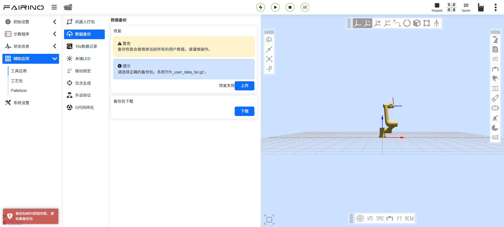

.. centered:: 圖表 14.2‑2 MD5校驗失敗

備份包關鍵參數校驗功能
++++++++++++++++++++++++++++++++++++++++++++++++++++

備份包匯入時加入校驗功能，備份包須與被匯入機器人進行關鍵參數對比，具體參數如下表所示。這些參數若設定不準確均會存在一定的安全風險，僅當完全一致後，備份包能夠正常匯入。

對比的5個關鍵參數表：

.. list-table::
   :widths: 15 40 100
   :header-rows: 0
   :class: sheet-center

   * - **序號**
     - **關鍵參數**
     - **具體釋義**

   * - 1
     - ROBOT_TYPE
     - 機器人型號

   * - 2
     - INSTALL_POS
     - 安裝方式

   * - 3
     - INSTALL_YANGLE
     - 基座傾斜角

   * - 4
     - INSTALL_ZANGLE
     - 基座旋轉角

   * - 5
     - NEW_TEACH_ENABLE
     - 動力學設定

若不一致將提示錯誤，此時，需要檢測被導入機器人中的關鍵參數是否與備份包一致。

.. image:: application/003.png
   :width: 6in
   :align: center

.. centered:: 圖表 14.2‑3 當關鍵參數不一致時，介面將提示錯誤

失敗/斷電異常回滾功能
+++++++++++++++++++++++++++++++++++++++++++++++++++++++++++++++

在備份包導入中途出現異常，或在恢復資料中途異常斷電情況下，導致資料恢復未能正常完成，為保障設備正常運行，在重新上電後，系統將自動還原至操作前狀態；

在重新上電後介面將提示，「前次資料恢復未完成，已自動還原，請重啟控制箱再次操作」。

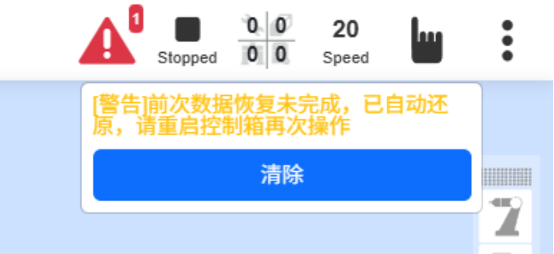

.. centered:: 圖表 14.2‑4 斷電重啟還原告警提示

10s資料記錄
------------

在「輔助應用」->「工具應用」的功能表列下，點擊「10s資料記錄」進入10s資料記錄功能介面。

首先選擇記錄類型，分為預設參數記錄和自選參數記錄，預設參數記錄為系統自動設定記錄的資料，自選參數記錄使用者可自行選擇需要記錄的參數資料，參數個數最多為15個。選定參數列表後，選擇記錄參數，點擊「右移」按鈕即可將參數設定到參數列表中。點擊「開始記錄」機器人開始記錄資料，點擊「停止記錄」機器人停止記錄數，點擊「下載資料」可下載最後10s的資料。

.. image:: application/004.png
   :width: 4in
   :align: center

.. centered:: 圖表 14.3‑1 10s資料記錄

末端LED
--------------

在「輔助應用」->「工具應用」的功能表列下，點擊「末端LED」進入末端LED顏色設定功能介面。

可設定LED顏色為綠色，藍色和白青色，使用者可以根據需求對自動模式，手動模式和拖動模式的LED顏色進行設定，不同模式不可設定同一種顏色。

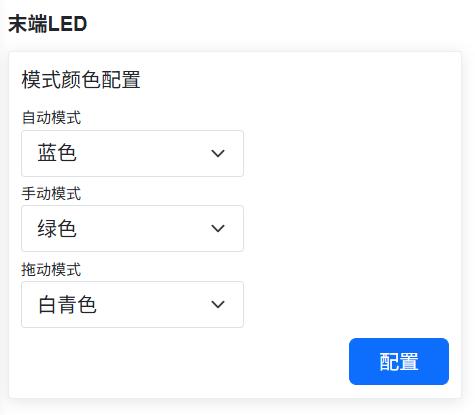

.. centered:: 圖表 14.4‑1 末端LED設定

拖動鎖定
--------------

在「輔助應用」->「工具應用」的功能表列下，點擊「拖動鎖定」進入拖動示教鎖定設定功能介面。

針對拖動示教增加了鎖定自由度功能，當拖動示教功能開關設定為使能狀態時，各自由度參數在使用者拖動機器人時生效。例如，當參數設定為X:10，Y:0，Z:10，RX:10，RY:10，RZ:10時，在拖動模式下拖拽機器人，可以限制機器人只移動Y方向，假如需要在拖動時保持機器人姿態不變，只移動X，Y，Z方向，可以將X，Y，Z設定為0，RX，RY，RZ設定為10。

.. image:: application/006.png
   :width: 4in
   :align: center

.. centered:: 圖表 14.5‑1 拖動示教鎖定設定

力感測器輔助拖動下正常觸發碰撞防護
~~~~~~~~~~~~~~~~~~~~~~~~~~~~~~~~~~~~~~~~~~~~~~~~~~~~~~~~~~~~~~~~~~~~~~~~~~

概述
++++++++++++++++++++++

當前FR機器人在力感測器輔助拖動的情況下無法觸發碰撞防護，增加在力感測器輔助拖動的情況下可以觸發碰撞防護，增加機器人安全性，降低操作風險。

碰撞防護
++++++++++++++++++++++

**Step1**：點擊「輔助應用」->「工具應用」->「拖動鎖定」，進入力感測器輔助鎖定設定介面，設定「狀態開關」、「碰撞檢測」為開啟，如下圖所示。

.. image:: application/007.png
   :width: 4in
   :align: center

.. image:: application/008.png
   :width: 4in
   :align: center

.. centered:: 圖表 14.5‑2 設定力感測器輔助鎖定

**Step2**：拖動機器人，在機器人運動過程中向關節處施加外力，觸發碰撞防護，web介面報錯「力感測器輔助拖動碰撞故障」，並可透過web介面快速恢復/關閉力感測器輔助拖動，如圖所示。點擊「恢復」，清除報錯並恢復開啟力感測器輔助拖動；點擊「關閉」，清除報錯並保持關閉力感測器輔助拖動。

.. centered:: 圖表 14.5‑2 力感測器輔助拖動下觸發碰撞

.. note::
   在力感測器輔助拖動下，機器人本身處於停止狀態，在拖動時關節轉矩指令與回饋存在差值，建議設定碰撞等級為7級及以上，碰撞等級設定過小會出現拖動時誤報碰撞錯誤。

關節扭矩感測器在整機上的參數標定
++++++++++++++++++++++++++++++++++++++++++++++++++++++++++++++++++++++++++++++

概述
************************

關節扭矩感測器靈敏度是指感測器對扭矩變化的響應能力，描述了感測器輸出電壓與其所量測的真實關節扭矩之間的比例關係；線性度衡量回歸模型對觀測數據的擬合程度；遲滯誤差即在相同的測試條件下，關節扭矩感測器原始數據進行正行程（從小到大）和反行程（從大到小）量測時，對於量測量之間的最大差值；重複性是當前測試結果與上一次測試結果的比值，用以判斷關節扭矩感測器的重複精度。
參數標定方法是使機器人運行既定軌跡，透過取得不同姿態下關節重力矩及關節扭矩感測器原始數據計算得到關節扭矩感測器的靈敏度、線性度、遲滯誤差及重複精度。

參數標定
********************************

**Step1**：設定工具座標系為「Tool0」，點擊「輔助應用」->「工具應用」->「拖動鎖定」，在關節扭矩感測器整機拖動模組點擊功能啟用。

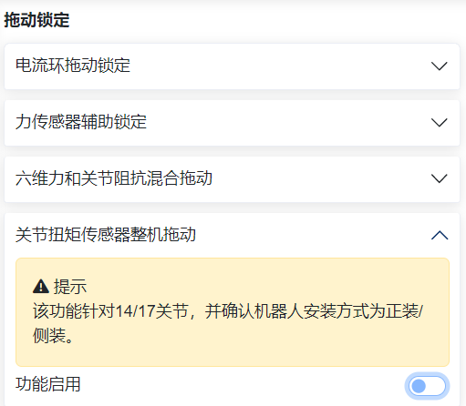

.. centered:: 圖表 14.5‑4 功能啟用

**Step2**：點擊「功能啟用」後進行靈敏度標定，點擊「生成程式」下發控制器內部Lua腳本，將機器人切換為自動模式並設定運行速度為「10」，點擊「運行」，等待機器人運動。

.. centered:: 圖表 14.5‑5 靈敏度標定

.. note:: 若關節扭矩感測器靈敏度已標定完成，可直接進行拖動功能參數設定。

**Step3**：機器人運行既定軌跡完成後，靈敏度、線性度、遲滯誤差及重複性標定結果自動顯示至web介面，點擊「設定」應用。

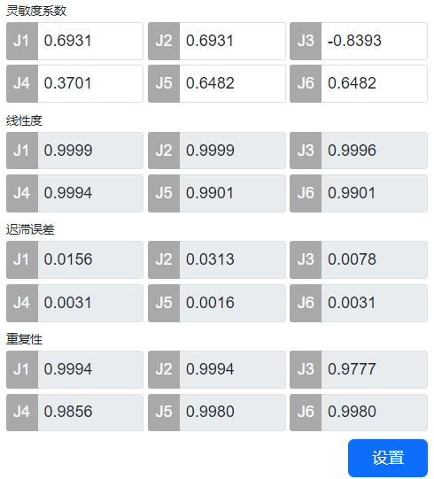

.. centered:: 圖表 14.5‑6 參數標定結果

利用雙編碼器的位置差進行力矩感知和補償
+++++++++++++++++++++++++++++++++++++++++++++++++++++++++++++++++++++++++++++++++++++++

概述
*****************************************

利用雙編碼器（電機側與連桿側）的位置差進行力矩感知估計，將這個估計的力矩用於前饋補償，機器人進行電流環拖動時減少啟動力矩。

操作流程
*****************************************

**Step1**：設定動力學配置為「動力學2.0」，點擊「輔助應用」->「工具應用」->「拖動鎖定」，在雙編碼器力矩補償模組點擊功能開關啟用。

.. image:: application/040.png
   :width: 4in
   :align: center

.. centered:: 圖表 14.5‑7 啟用功能

**Step2**：將「功能開關」設定為「開啟」，並設定各軸拖動增益為0.5，點擊「設定」應用，如圖所示。

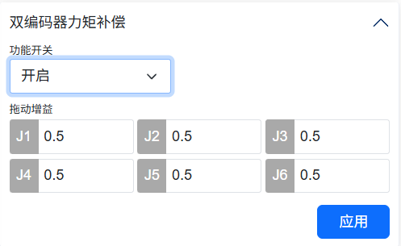

.. centered:: 圖表 14.5‑8 增益設定

.. note:: 拖動增益設定範圍：0-1，增益越大，補償力矩越大，電流環啟動力矩越小。

基於關節扭矩感測器的輔助拖動優化功能
+++++++++++++++++++++++++++++++++++++++++++++++++++++++++++++++++++++++++++++++++++++++

概述
*********************************

本使用者手冊用於描述基於關節扭矩感測器的輔助拖動優化功能的使用方法，共涉及3種拖動模式，較傳統拖動示教方法，可提高拖動的柔順性及降低各關節所需的拖動力。

基於關節扭矩感測器的輔助拖動優化功能
**************************************************************************************

零點標定及靈敏度標定
""""""""""""""""""""""""""""""""""""""""""""""""""""""""""""""""""""""""

**Step1**：若已完成零點標定和靈敏度標定（標定前的指示燈為綠色），則無需再次進行，僅當拖動存在飄動感時可重新進行零點標定，標定流程可見下文。

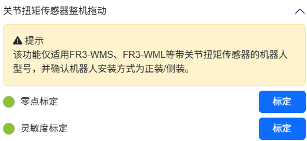

.. centered:: 圖表 14.5‑9 關節扭矩感測器零點及靈敏度標定完成時指示燈狀態

**Step2**：零點標定。點選「輔助應用」→「工具應用」→「拖動鎖定」，進入「關節扭矩感測器整機拖動」模組，點選零點標定「標定」按鈕進行關節扭矩感測器零點資料標定，當標定完成時將出現「√」，並更新零點標定結果。

.. image:: application/043.png
   :width: 4in
   :align: center

.. centered:: 圖表 14.5‑10 關節扭矩感測器零點標定

**Step3**：靈敏度標定（注意，標定時建議僅機器人本體，不應攜帶任何負載）。切換機器人運動模式為「自動模式」，並設定執行速度為「10%」，點選靈敏度標定「標定」按鈕等待機器人運動完成。機器人執行既定軌跡完成後，靈敏度係數、線性度，遲滯誤差及重複性標定結果自動顯示至web介面。

.. image:: application/044.png
   :width: 4in
   :align: center

.. centered:: 圖表 14.5‑11 關節扭矩感測器靈敏度標定

**Step4**：設定輔助拖動功能。共3種拖動模式，在完成「零點標定」及「靈敏度標定」的前提下可進行設定，當未設定時，預設為「模式三」，即在完成標定後，可直接在拖動模式下進行拖動示教。

輔助拖動功能-模式一
******************************************************************
**Step1**：選擇拖動模式為「模式一」。機器人運動模式為「手動模式」時，設定滑動視窗大小，增益係數和關節速度，並點選「設定」應用。此時，按住末端「拖動按鈕」或在拖動模式下，可實現拖動示教。

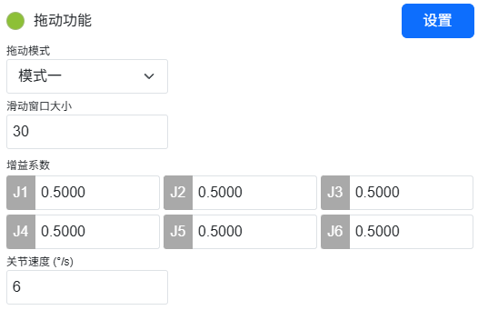

.. centered:: 圖表 14.5‑12 模式一：參數設定

.. note:: 
   (1) 滑動視窗大建議設定值為30，最大值為100；
   (2) 增益係數影響拖動時的手感，係數越大，拖動越靈敏，但易出現不穩定現象，建議J1-J6設定值為0.5；
   (3) 關節速度建議設定為6°/s，可緩解對點過衝現象。

輔助拖動功能-模式二
******************************************************************

**Step1**：選擇拖動模式為「模式二」。機器人運動模式為「手動模式」時，設定質量係數、阻尼係數、剛度係數及力控制閾值，點選「設定」應用。此時，在位置模式下，即可進行拖動示教。

.. image:: application/046.png
   :width: 4in
   :align: center

.. centered:: 圖表 14.5‑13 模式二：參數設定

.. note:: 
   (1) 質量係數影響拖動時的關節慣性力，建議J1-J3設定值為1.0，J4-J5設定值為0.5，J6設定值為0.1；
   (2) 阻尼係數影響拖動時的手感，阻尼越大，手感越重，建議J1-J3設定值為10.0，J4-J5設定值為5.0，J6設定值為1.0；
   (3) 剛度係數均設定為0；
   (4) 力控制閾值為拖動時的啟動力矩，建議J1-J3設定值為0.3，J4-J5設定值為0.2，J6設定值為0.1。

輔助拖動功能-模式三
******************************************************************

**Step1**：選擇拖動模式為「模式三」。機器人運動模式為「手動模式」時，設定各關節增益係數，點選「設定」應用。此時，按住末端「拖動按鈕」或在拖動模式下，可實現拖動示教。

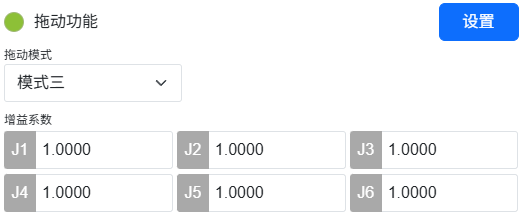

.. centered:: 圖表 14.5‑14 模式三：參數設定

.. note:: 
   (1) 增益係數影響低速拖動時的關節拖動力，當係數為0.1至1.0時，隨著係數的增加，低速拖動時阻力變大。當需精確對點作業時，建議J1-J6增益係數設定為1.0；當考慮整機拖動輕鬆及柔順性時，建議J1-J6增益係數設定為0.3。

交點生成（雷射取點運動）
-----------------------------------------

在焊接過程中，雷射取點運動可設定姿態，使機器人到達位置點時能達到預期的姿態。可以輕鬆應對角焊縫及坡口焊縫等特殊場景。

雷射取點運動功能操作流程
~~~~~~~~~~~~~~~~~~~~~~~~~

**Step1**：使用雷射感測器前，先將「焊槍」工具座標系應用到目前工具座標系。開啟示教頁面，依序點擊「初始設定」、「基礎」、「工具座標」，座標系名稱選擇「焊槍」並應用，系統狀態列中工具座標系顯示為Tool1。

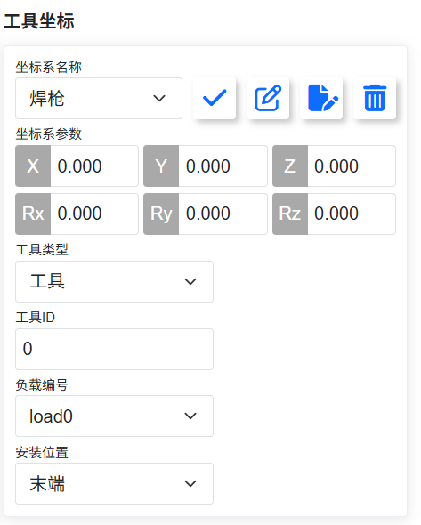

.. centered:: 圖表 14.6‑1 應用焊槍座標系

**Step2**：編寫雷射取點運動lua程式。依序點擊「示教程式」->「程式設計」->「新增按鈕」，新建使用者程式「testPointRecord.lua」。

.. figure:: application/011.png
   :align: center
   :width: 4in

.. centered:: 圖表 14.6‑2 新建雷射取點運動程式

**Step3**：設定參考姿態示教點（可選）。在手動模式下拖動機器人至所需的焊接姿態。在示教頁面上依序點擊「示教點記錄」、「命名記點」、儲存姿態示教點「referencePoint」。

.. figure:: application/012.png
   :align: center
   :width: 4in

.. centered:: 圖表 14.6‑3 儲存姿態參考示教點

**Step4**：產生雷射取點運動程式。依序點擊「示教程式」->「程式設計」->「焊接指令」、「雷射追蹤」、下滑內容至感測器取點運動下，選擇需要的「運動方式」、「除錯速度」以及姿態參考點，即可產生對應的雷射取點LUA程式。

如果不選擇姿態參考點，則預設保持取點時姿態進行運動，如果選擇姿態參考點，則以參考姿態運行至雷射取點處。

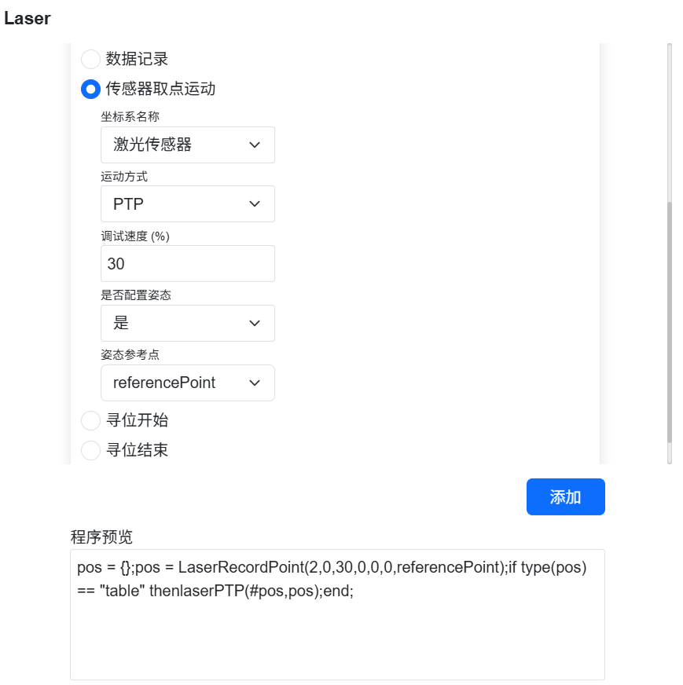

.. centered:: 圖表 14.6‑4 選擇姿態參考示教點

執行雷射取點運動。拖動機器人使雷射感測器光線指向想要示教的焊縫點，雷射感測器會取得焊縫位置，進行取點。執行雷射取點運動後，焊槍將以參考姿態運作到雷射感測器掃描的指向點。

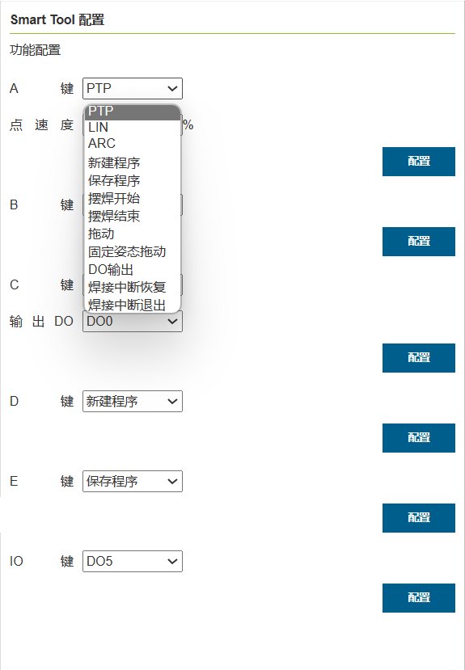

.. centered:: 圖表 14.6‑5 雷射取得焊縫位置

.. centered:: 圖表 14.6‑6 焊槍以參考姿態指向焊縫位置

尋位三點與四點求交點座標
~~~~~~~~~~~~~~~~~~~~~~~~~~~~

當角焊縫位置不方便直接示教時，協作機器人可以透過手動示教或尋位角焊縫兩邊板材平面位置的方式，計算得到兩平面上採集點的交點來產生角焊縫所在位置。

對於直角焊縫，可以選用三點尋位求交點座標方法；對於非直角焊縫，則採用四點尋位求交點座標方法。

提供指令和lua腳本兩種方式取得交點座標，進行尋位運動，同時可設定參考姿態，機器人攜帶焊槍可以以參考示教點姿態運動至交點處。

指令求交點
++++++++++++++++++

三點求交點座標
*********************

**Step1**：採集三個平面接觸點並儲存為示教點，設定參考示教點；

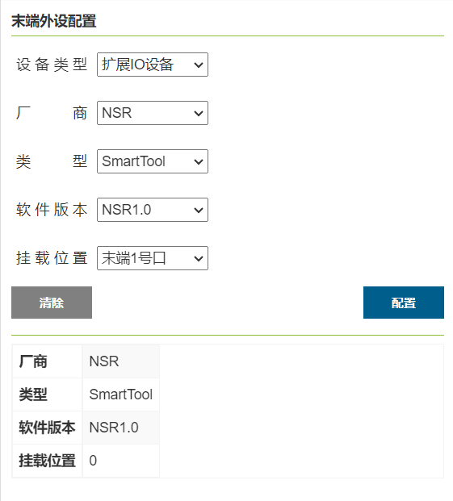

.. centered:: 圖表 14.6‑7 選取三個尋位點

採集的接觸點包含三個點，其中兩點位於同一平面，另一點位於垂直平面。

.. note:: 如果不選擇姿態參考點，則預設產生的交點姿態與P3點一致，如果選擇姿態參考點，和參考示教點姿態一致。

**Step2**：在示教頁面中，依序點擊「輔助應用」、「工具應用」、「交點產生」，找到三點與四點求交點座標功能模組。

.. figure:: application/017.png
   :align: center
   :width: 4in

.. centered:: 圖表 14.6‑8 選擇求交點座標的尋位點

**Step3**：下拉框選擇三點尋位，依序選擇採集的三個接觸點，點擊計算，檢視3D模型中產生交點的顯示是否有誤，將交點命名並儲存；

.. figure:: application/018.png
   :align: center
   :width: 4in

.. centered:: 圖表 14.6‑9 計算交點座標並儲存

**Step4**：儲存示教點，可以進行示教運動。

.. figure:: application/019.png
   :align: center
   :width: 6in

.. centered:: 圖表 14.6‑10 將交點座標儲存成示教點

四點求交點座標
*********************

**Step1**：採集四個平面接觸點並儲存為示教點，設定參考示教點。

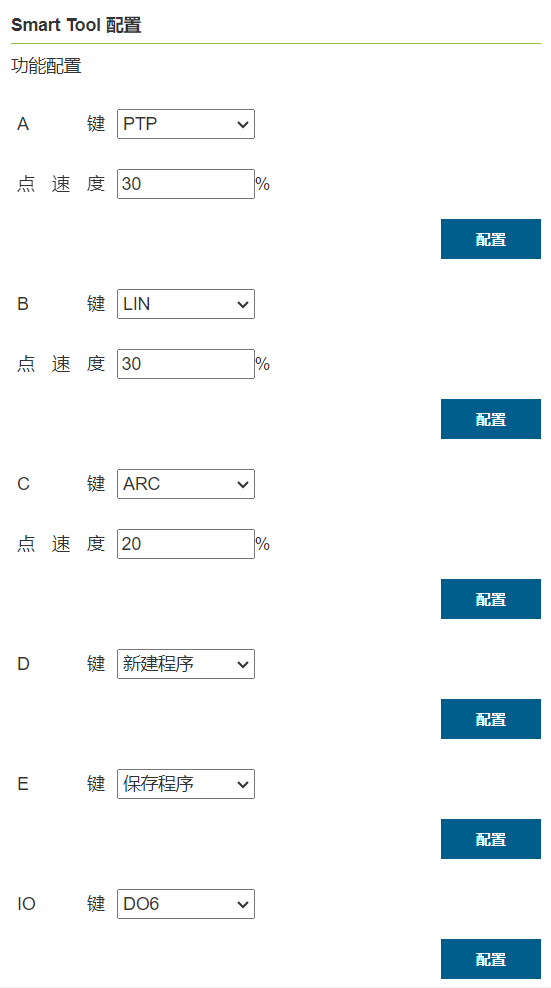

.. centered:: 圖表 14.6‑11 選取四個尋位點

採集的接觸點包含四個點，其中前兩點位於同一平面，後兩點位於垂直平面。

.. note:: 如果不選擇姿態參考點，則預設產生的交點姿態與P4點一致，如果選擇姿態參考點，和參考示教點姿態一致。

**Step2**：在示教頁面中，依序點擊「初始設定」、「外設」、「追蹤」、「感測器」，找到三點與四點求交點座標功能模組。

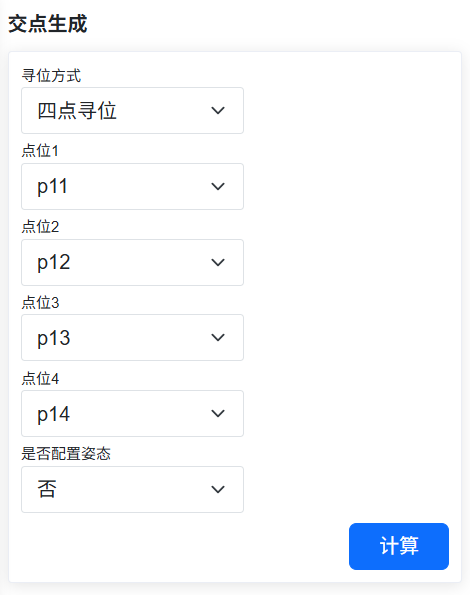

.. centered:: 圖表 14.6‑12 選擇求交點座標的尋位點和參考點

**Step3**：下拉框選擇四點尋位，依序選擇採集的四個接觸點，點擊計算，檢視3D模型中產生交點的顯示是否有誤，將交點命名並儲存；

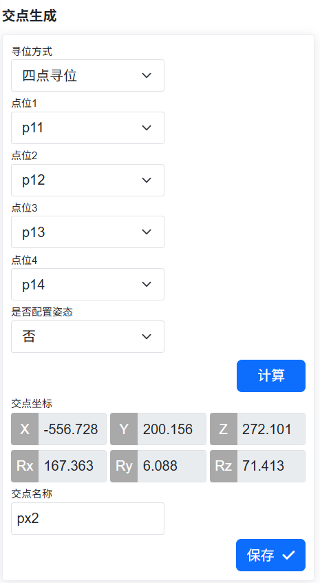

.. centered:: 圖表 14.6‑13 計算交點座標並儲存

**Step4**：儲存示教點，可以進行示教運動。

.. figure:: application/023.png
   :align: center
   :width: 6in

.. centered:: 圖表 14.6‑14 將交點座標儲存成示教點

Lua腳本求交點尋位運動
++++++++++++++++++++++++++++++++

三點求交點座標
*********************

**Step1**：採集三個平面接觸點並儲存為示教點，設定參考示教點。

.. centered:: 圖表 14.6‑15 選取三個尋位點

採集的接觸點包含三個點，其中兩點位於同一平面，另一點位於垂直平面。

.. note:: 如果不選擇姿態參考點，則預設產生的交點姿態與P3點一致，如果選擇姿態參考點，和參考示教點姿態一致。

**Step2**：編寫三點求交點尋位運動Lua程式。依序點擊「示教程式」->「程式設計」->「新建按鈕」，新建使用者程式「test3point.lua」。

.. figure:: application/024.png
   :align: center
   :width: 4in

.. centered:: 圖表 14.6‑16 新建三點求交點尋位運動程式

**Step3**：產生三點求交點尋位運動程式。依序點擊「示教程式」->「程式設計」->「焊接指令」->「雷射追蹤」、下滑內容至尋位求交點運動下，選擇「三點尋位」方式，下拉框依序選擇採集的接觸點「點位1」、「點位2」、「點位3」以及姿態參考點，選擇需要的「運動方式」和「除錯速度」，點擊「新增」、「應用」按鈕即可產生對應的三點求交點尋位運動程式。

.. figure:: application/025.png
   :align: center
   :width: 4in

.. centered:: 圖表 14.6‑17 三點求交點尋位運動

**Step4**：在自動模式下點擊執行按鈕，即可自動進行三點求交點計算，機器人拖動焊槍以參考姿態運動至交點位置。

四點求交點座標
*********************

**Step1**：採集四個平面接觸點並儲存為示教點，設定參考示教點。

.. centered:: 圖表 14.6‑18 選取四個尋位點

採集的接觸點包含四個點，其中兩點位於同一平面，後兩點位於另一平面。

.. note:: 如果不選擇姿態參考點，則預設產生的交點姿態與P4點一致，如果選擇姿態參考點，和參考示教點姿態一致。

**Step2**：編寫四點求交點尋位運動Lua程式。依序點擊「示教程式」->「程式設計」->「新建按鈕」，新建使用者程式「test4point.lua」。

.. centered:: 圖表 14.6‑19 新建四點求交點尋位運動程式

**Step3**：產生四點求交點尋位運動程式。依序點擊「示教程式」->「程式設計」->「焊接指令」->「雷射追蹤」->下滑內容至尋位求交點運動下，選擇「四點尋位」方式，下拉框依序選擇採集的接觸點「點位1」、「點位2」、「點位3」、「點位4」以及姿態參考點，選擇需要的「運動方式」和「除錯速度」，點擊「新增」、「應用」按鈕即可產生對應的四點求交點尋位運動程式。

.. figure:: application/027.png
   :align: center
   :width: 4in

.. centered:: 圖表 14.6‑20 四點求交點尋位運動

**Step4**：在自動模式下點擊執行按鈕，即可自動進行四點求交點計算，機器人拖動焊槍以參考姿態運動至交點位置。

外設協議
-----------

在「輔助應用」->「工具應用」的功能表列下，點擊「外設協議」進入外設協議設定功能介面。

該頁面是對外設協議的設定頁面，使用者可以根據目前使用的外設進行協議設定。

.. centered:: 圖表 14.7‑1 外設協議設定

在程式示教中增加基於Modbus-rtu通訊的讀寫暫存器lua介面， 輸入暫存器地址0x1000暫存器數量為50個，共100位元組資料內容；保持暫存器地址0x2000，暫存器數量為50個，共100位元組資料內容。

::

   ModbusRegRead（fun_code，reg_add，reg_num）：讀暫存器；

   fun_code： 功能碼，0x03-保持暫存器，0x04-輸入暫存器

   reg_add： 暫存器地址

   reg_num： 暫存器數量

::

   ModbusRegWrite（fun_code，reg_add，reg_num，reg_value）：寫暫存器；

   fun_code 功能碼，0x06-單個暫存器，0x10-多個暫存器

   reg_add： 暫存器地址

   reg_num： 暫存器數量

   reg_value： 位元組陣列

::

   ModbusRegGetData（reg_num）：取得暫存器資料；

   reg_num： 暫存器數量

   返回值說明：

   reg_value: 陣列變數

程式範例截圖：

.. image:: application/029.png
   :width: 4in
   :align: center

.. centered:: 圖表 14.7‑2 Modbus-rtu通訊lua程式範例

G程式碼轉機器人軌跡規劃功能
-----------------------------------------------------------------------------------

功能概述
~~~~~~~~~~~~~~~~~~~~~~~~~~~~~~

CAD軟體產生G程式碼轉機器人軌跡規劃功能是使用CAD軟體把直線、圓弧、整圓、樣條線路徑轉成副檔名為「.gcode」的G程式碼檔案，其中樣條線路徑的G程式碼是由若干個小直線程式碼組成的，將產生的G程式碼檔案在Web端匯入便能轉化產生LUA檔案。

G程式碼轉機器人軌跡規劃功能說明：

(1) Web端只能匯入副檔名為「.gcode」的G程式碼檔案，轉化成功後會產生與G程式碼檔案同名的LUA檔案。如果轉化前已經有同名的LUA檔案，轉化會失敗。

(2) 目前能夠對G程式碼中的快速移動G0、直線插補G1、順時針圓弧插補G2、逆時針圓弧插補G3指令進行轉化，其中G0對應MoveJ指令、G1對應MoveL指令、圓弧的G2/G3對應MoveC指令，整圓的G2/G3對應Circle指令。

(3) 目前僅能對XY平面的圓弧和圓路徑G程式碼進行轉化。

(4) G程式碼指令中設定主軸轉速的S對應MoveJ指令中的速度，主軸轉速的單位為轉/分鐘，對應移動速度的毫米/分鐘，進給速度F對應MoveL、MoveC、Circle中的速度。進給速度的單位為毫米/分鐘，與移動速度單位一致。G程式碼中的速度設定不能超過機器人的最大移動速度。

(5) 機器人在執行轉化產生的LUA檔案時，需要把Web介面右上角的速度百分比改為100。

操作流程
~~~~~~~~~~~~~~~~~~~~~~~~~~~~~~

機器人在工作路徑中姿態計算如下圖所示。

.. image:: application/030.png
   :width: 6in
   :align: center

.. centered:: 圖表 14.8-1 機器人姿態計算示意圖

其中，P-xyz為記錄的參考姿態示教點的姿態，O-xy為CAD圖紙的座標系。機器人在起點A處的姿態是參考姿態，根據參考姿態Z軸與CAD圖紙平面的夾角以及Z軸在CAD圖紙平面的投影與路徑起點處切線的夾角，計算路徑中間點B和終點C處的機器人姿態。

功能操作流程如下：

**Step 1**：使用具有CAM功能的CAD軟體，將加工路徑轉為G程式碼檔案，並且使用G程式碼模擬模擬器，如NC Viewer等，驗證刀具路徑是否正確。

**Step 2**：在G程式碼轉機器人軌跡規劃之前，首先對工具座標系和工作座標系進行標定，注意工作座標系需要與CAD軟體中工具機座標系重合。

.. image:: application/031.png
   :width: 4in
   :align: center

.. image:: application/032.png
   :width: 4in
   :align: center

.. centered:: 圖表 14.8-2 工具和工作座標系標定介面

**Step 3**：在標定後的工具座標系和工作座標系下記錄一個參考姿態示教點，機器人在工作路徑下的姿態會使用參考姿態點的姿態進行計算。

**Step 4**：依序點擊「輔助應用」、「工具應用」、「G程式碼轉化」按鈕，進入G程式碼檔案轉機器人運動LUA檔案介面。

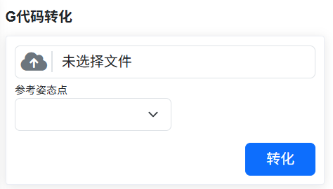

.. centered:: 圖表 14.8-3 G程式碼轉化介面

**Step 5**：點擊「選擇檔案」按鈕，找到需要轉化的G程式碼檔案，需要注意G程式碼檔案的檔案副檔名必須為「.gcode」；參考姿態點選擇Step2中記錄的參考姿態示教點，選擇成功後下方會顯示目前所選示教點的工具座標系和工作座標系。最後點擊「轉化」按鈕，轉化成功後，會提示G程式碼轉化成功。另外，如果已經有與G程式碼檔案重名的LUA檔案，點「轉化」按鈕會提示檔案名已存在。

.. image:: application/034.png
   :width: 6in
   :align: center

.. centered:: 圖表 14.8-4 G程式碼轉化成功介面

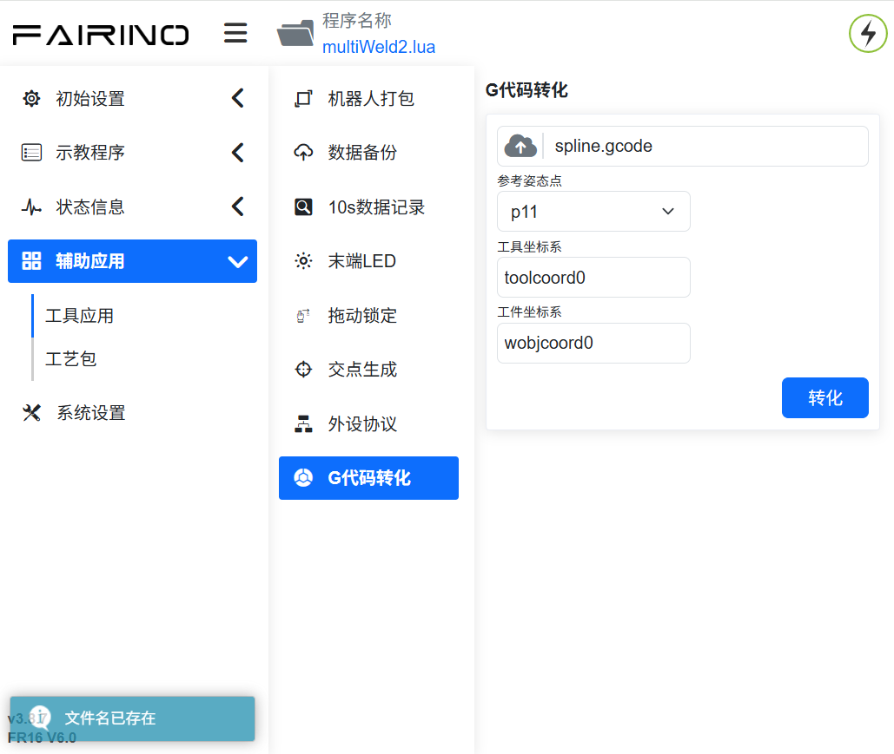

.. centered:: 圖表 14.8-5 G程式碼轉化失敗介面

**Step 6**：點擊「示教程式設計」->「程式設計」按鈕，開啟G程式碼轉化後產生的LUA檔案，機器人切換為自動模式，點擊開始按鈕，機器人便能復現G程式碼檔案裡的路徑。

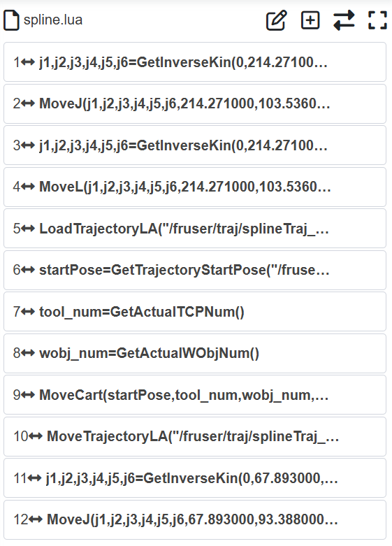

.. centered:: 圖表 14.8-6 開啟轉化後產生的LUA檔案
