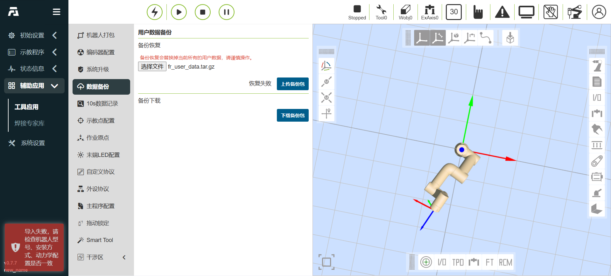
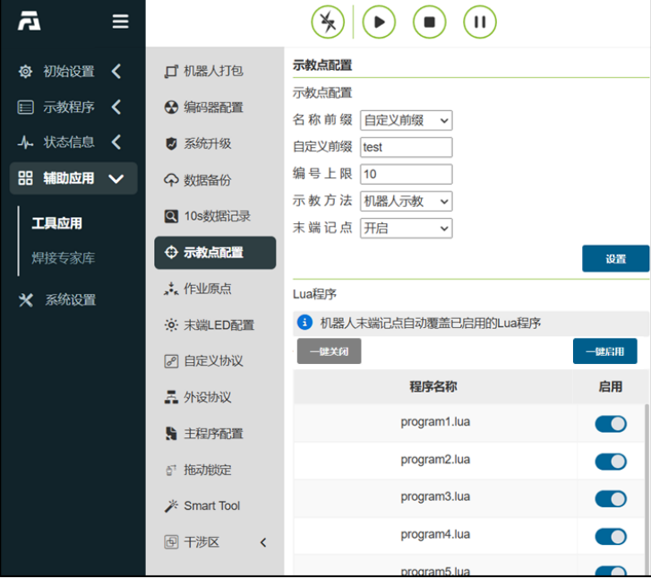
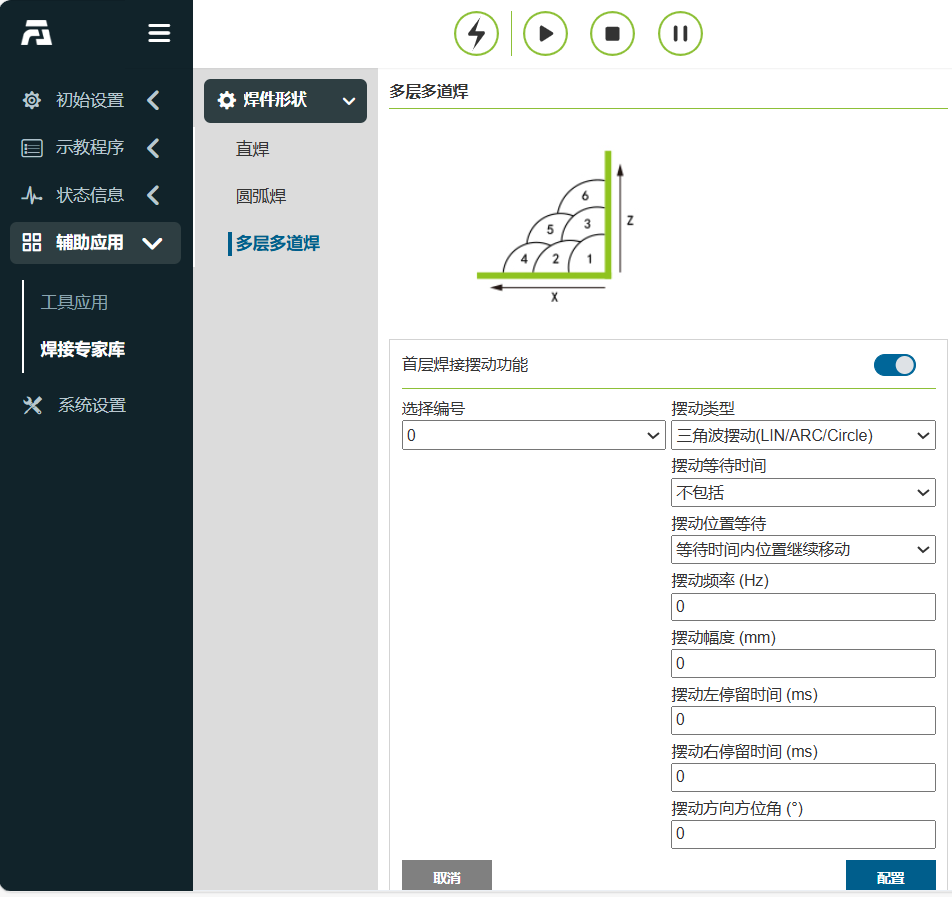
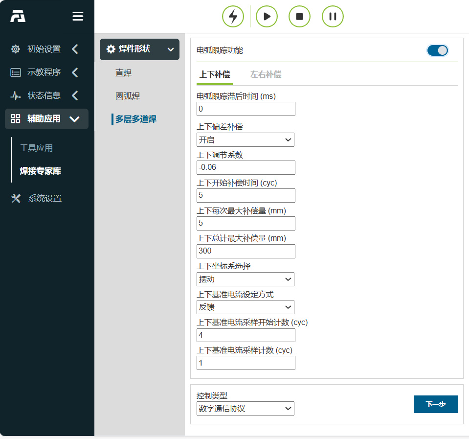
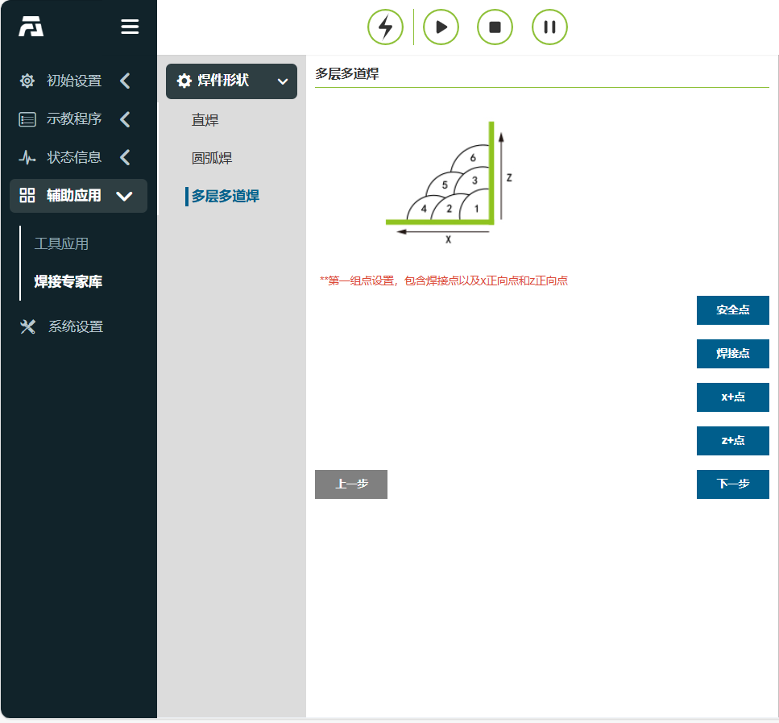
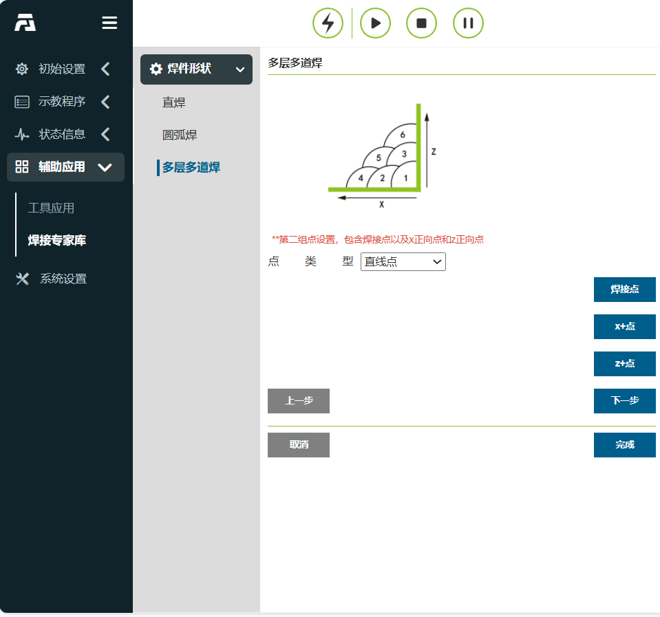
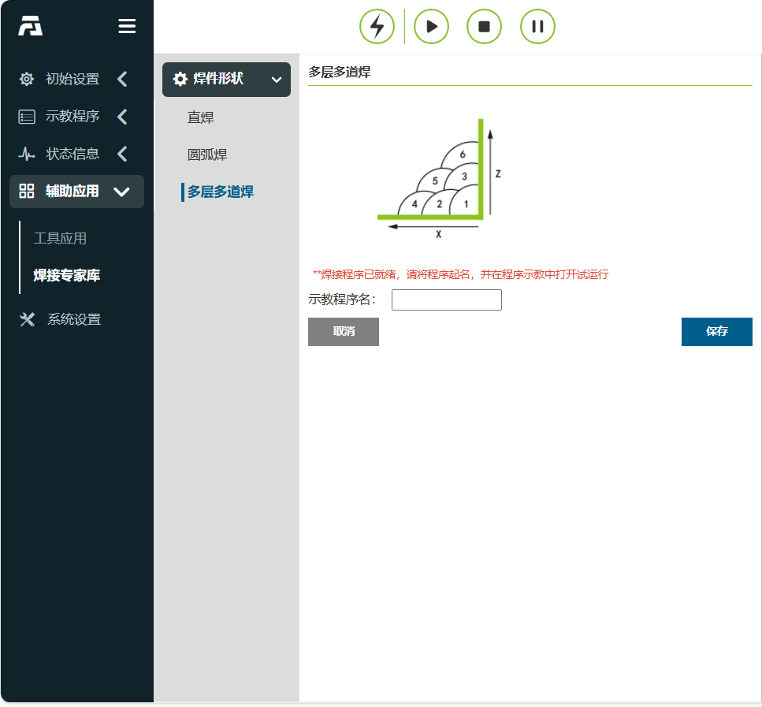
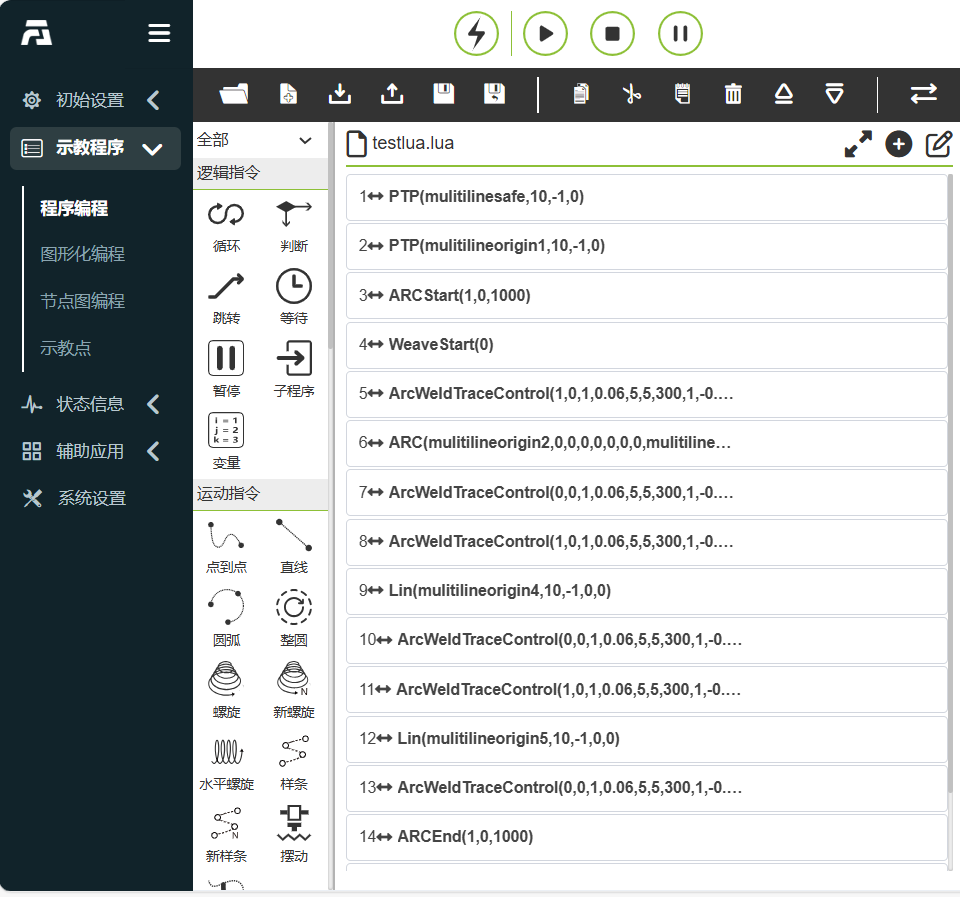

輔助應用 
===============

.. toctree:: 
   :maxdepth: 6

機器人打包
-----------------

在「輔助應用－工具應用」的選單列下，點選「機器人打包」按鈕，進入機器人一鍵打包介面。

.. important:: 
   在操作打包功能之前，請先確認機器人周圍環境和狀態，以防止碰撞。

   若出廠，則出廠前先進去系統設定-通用設置，進行恢復出廠設置。

**Step1**：在移至打包點前先將機器人移至零點。

**Step2**：點選「移至零點」按鈕，確認機器人機械零點正確，各關節如圖中橘色圓圈位置缺口對齊。

**Step3**：點選「移至打包點」按鈕，機器人依照包裝流程各軸角度運作至打包點。

.. image:: application/001.png
   :width: 4in
   :align: center

.. centered:: 圖表 14.1‑1 機器人一鍵打包

系統升級
-----------------

在「輔助應用－工具應用」的選單列下，點選「系統升級」按鈕，進入系統升級介面。系統升級分為軟體升級、驅動器升級和系統關機。

**軟體升級**：在軟體升級下點選“上傳檔案”，選擇USB隨身碟中的software.tar.gz升級包，點選上傳升級包，升級按鈕旁顯示“上傳中…上傳百分比”。
待後台文件下載完成，介面顯示“上傳完成，正在升級中”，進行文件MD5和版本號檢測，通過後，解密解壓升級文件，並提示"升級成功，請重新啟動控制箱！"，如果其中檢測，解壓縮或發生其他錯誤，升級按鈕旁顯示「升級失敗」。

.. image:: application/002.png
   :width: 3in
   :align: center

.. centered:: 圖表 14.2‑1 系統升級

.. important:: 
   軟體升級包名為確定的software.tar.gz，如果升級包名與之不一致，那麼會出現升級失敗，修改為確定的升級包名稱即可。
 
**韌體升級**：機器人進入BOOT模式後，上傳升級壓縮包，選擇需要升級的從站（控制箱從站，本體驅動器從站1~6，末端從站），進行升級操作，並顯示升級狀態。
 
.. image:: application/003.png
   :width: 3in
   :align: center

.. centered:: 圖表 14.2‑2 韌體升級

**從站配置檔升級**：機器人去使能後，上傳升級文件，選擇需要升級的從站（控制箱從站，本體驅動器從站1~6，末端從站），進行升級操作，並顯示升級狀態。

.. image:: application/004.png
   :width: 3in
   :align: center

.. centered:: 圖表 14.2‑3 從站設定檔升級

資料備份
-----------

在「輔助應用程式－工具應用程式」的選單列下，點選 「資料備份」進入資料備份介面，如下圖所示。

備份包數據中包含工具坐標系數據，系統配置文件，示教點數據，用戶程序，模板程序和用戶配置文件，當用戶需要將本機器人相關數據移到另一台機器人上使用時，可通過此功能快速實現。

.. image:: application/005.png
   :width: 3in
   :align: center

.. centered:: 圖表 14.3‑1 資料備份介面

為避免在匯入備份包時可能存在安裝方式等設定不一致所導致的安全隱患，新增備份包匯入時對關鍵參數的校驗功能。

備份包導入校驗功能
~~~~~~~~~~~~~~~~~~~~~~~~

備份包導入時加入校驗功能，備份包必須與被導入機器人進行關鍵參數對比，具體參數如下表所示。這些參數若設定不準確均會存在一定的安全隱患，僅當完全一致後，備份包能夠正常匯入。若不一致將提示錯誤，此時，需要偵測已匯入機器人中的關鍵參數是否與備份包一致。

對比的5個關鍵參數表：

.. list-table::
   :widths: 15 40 100
   :header-rows: 0
   :class: sheet-center

   * - **序號**
     - **關鍵參數**
     - **具體釋義**

   * - 1
     - ROBOT_TYPE
     - 機器人型號

   * - 2
     - INSTALL_POS
     - 安裝方式

   * - 3
     - INSTALL_YANGLE
     - 基座傾斜角

   * - 4
     - INSTALL_ZANGLE
     - 基座旋轉角

   * - 5
     - NEW_TEACH_ENABLE
     - 動力學配置

.. centered:: 圖表 14.3‑2 當關鍵參數不一致時，介面將提示錯誤

10s數據記錄
------------

在「輔助應用－工具應用」的選單列下，點選「10s資料記錄」進入10s資料記錄功能介面。

首先選擇記錄類型，分為預設參數記錄和自選參數記錄，預設參數記錄為系統自動設定記錄的數據，自選參數記錄使用者可自行選擇需要記錄的參數數據，參數數量最多為15個。選定參數清單後，選擇記錄參數，點選「右移」按鈕即可將參數配置到參數清單中。點擊「開始記錄」機器人開始記錄數據，點擊「停止記錄」機器人停止記錄數，點擊「下載數據」下載最後10s的數據。

.. image:: application/006.png
   :width: 3in
   :align: center

.. centered:: 圖表 14.4‑1 10s數據記錄

示教點配置
------------

在「輔助應用－工具應用」的選單列下，點選「示教點配置」進入示教點配置功能介面。

使用者在使用按鈕盒或其它IO訊號記錄示教點功能前，首先對示教點名稱前綴，編號上限和示教方法進行配置，名稱前綴支援自訂前綴和以當前程式名稱作為前綴兩種模式。例如，自訂名稱前綴“P”，編號上限“3”，示教方法“機器人示教”，記錄機器人當前末端（工具）點依次為：P1、P2、P3，再次記錄將覆蓋先前記錄點。

.. image:: application/007.png
   :width: 3in
   :align: center

.. centered:: 圖表 14.5‑1 示教點配置

末端記點自動覆蓋更新lua程序
~~~~~~~~~~~~~~~~~~~~~~~~~~~~~~~~~~~~

末端記點功能配置
+++++++++++++++++++++

1. 點選輔助應用-工具應用-示教點配置，進入示教點配置頁面。

.. centered:: 圖表 14.5‑2 示教點配置頁面

2. 開啟末端記點功能，點選設定。可透過開關，選擇需要更新點位的lua程式。
3. 設定完成，此時末端記點的名稱為test前綴，編號上限為10，選擇所有Lua程式啟用更新。關閉webApp，該功能依然生效。

末端按鈕記點自動更新Lua程序
+++++++++++++++++++++++++++++++

1. 點選機器人末端記點按鈕。

.. image:: application/058.png
   :width: 3in
   :align: center

.. centered:: 圖表 14.5‑3 末端記點按鈕

2. 此時末端LED閃爍情況：紫燈閃爍（開始）->藍燈常亮（記點並更新Lua中）->綠燈常亮（記點完成），選取的Lua程式對應名稱的點位資訊同步更新。

.. image:: application/059.png
   :width: 4in
   :align: center

.. centered:: 圖表 14.5‑3 末端记點并更新Lua程序LED变化

3. 記點失敗時末端LED閃爍狀況：紫燈閃爍（開始）->紅燈閃爍（記點失敗）->綠燈常亮（恢復正常）。

.. image:: application/060.png
   :width: 4in
   :align: center

.. centered:: 圖表 14.5‑4 末端記點失敗LED變化

功能使用實例
+++++++++++++++

1. 點選輔助應用-工具應用-示教點配置，自訂前綴：test，編號上限5，示教方法選擇機器人示教，末端記點功能開啟，點選設定。
2. 啟用需要更新點位的lua程式program1。

.. image:: application/061.png
   :width: 6in
   :align: center

.. centered:: 圖表 14.5‑5 示教點配置

3. 如下圖為program1程式及目前的運行軌跡。

.. image:: application/062.png
   :width: 6in
   :align: center

.. centered:: 圖表 14.5‑6 program1程式及目前的運行軌跡

4. 頁面切換為手動模式，拖曳機器人到新的點位，點擊末端記點按鈕，等待末端LED閃爍完成，紫燈閃爍（開始）->藍燈常亮（記點並更新Lua中）- >綠燈常亮（記點完成），此時所記點為test1。
5. 重複步驟4，依序記下test2、test3、test4、test5，完成5個點記錄，此時program1程式點位已同步更新。
6. 重新運行program1程序，此時運動軌跡已更新，運動軌跡如下圖。

.. image:: application/063.png
   :width: 3in
   :align: center

.. centered:: 圖表 14.5‑7 更新後的運行軌跡

作業原點
-----------

在「輔助應用－工具應用」的功能表列下，點選「作業原點」進入作業原點設定功能介面。

此頁面顯示作業原點的名稱和關節位置訊息，作業原點命名為固定名pHome，點選「設定」以目前機器人位姿作為作業原點，點選「移至該點」機器人會移動到作業原點。此外DI配置中增加移動至作業原點可設定選項，DO配置中增加到達作業原點可設定選項。

.. image:: application/008.png
   :width: 3in
   :align: center

.. centered:: 圖表 14.6‑1 作業原點

末端LED配置
--------------

在「輔助應用－工具應用」的選單列下，點選「末端LED配置」進入末端LED顏色配置功能介面。

可配置LED顏色為綠色，藍色和白青色，使用者可依需求對自動模式，手動模式和拖曳模式的LED顏色進行配置，不同模式不可配置同一種顏色。

.. image:: application/009.png
   :width: 3in
   :align: center

.. centered:: 圖表 14.7‑1 末端LED配置

週邊協議
-----------

在「輔助應用－工具應用」的功能表列下，點選「外設協定」進入外設協定配置功能介面。

此頁面是對外設協定的設定頁面，使用者可以根據目前使用的周邊進行協定配置。

.. image:: application/010.png
   :width: 3in
   :align: center

.. centered:: 圖表 14.8‑1 外設協定配置

在程式示教中增加基於Modbus-rtu通訊的讀寫寄存器lua接口， 輸入寄存器地址0x1000寄存器數量為50個，共100字節數據內容；保持寄存器地址0x2000，寄存器數量為50個，共100個字節數據內容。

::

   ModbusRegRead（fun_code，reg_add，reg_num）：讀取暫存器；

   fun_code： 功能碼，0x03-保持暫存器，0x04-輸入暫存器

   reg_add： 暫存器位址

   reg_num： 暫存器數量

::

   ModbusRegWrite（fun_code，reg_add，reg_num，reg_value）：寫入暫存器；

   fun_code 功能碼，0x06-單一暫存器，0x10-多個暫存器

   reg_add： 暫存器位址

   reg_num： 暫存器數量

   reg_value： 位元組數組

::

   ModbusRegGetData（reg_num）：取得暫存器資料；

   reg_num： 暫存器數量

   傳回值說明：

   reg_value: 數組變數

程式範例截圖：

.. image:: application/011.png
   :width: 3in
   :align: center

.. centered:: 圖表 14.8‑2 Modbus-rtu通訊lua程式範例 

主程式配置
------------------

在「輔助應用－工具應用」的功能表列下，點選「主程式設定」進入主程式設定功能介面。

配置主程式可以與DI配置主程式啟動配合使用，配置的主程式需要先試運行以確保安全，在機器人設定中配置對應DI為啟動主程式訊號功能後，使用者可以控制此DI訊號實現運行主程序。

.. image:: application/012.png
   :width: 3in
   :align: center

.. centered:: 圖表 14.9‑1 主程式配置

拖曳鎖定
--------------

在「輔助應用－工具應用」的選單列下，點選「拖曳鎖定」進入拖曳示教鎖定設定功能介面。

針對拖曳示教增加了鎖定自由度功能，當拖曳示教功能開關設定為啟用狀態時，各自由度參數在使用者拖曳機器人時生效。例如，當參數設定為X:10，Y:0，Z:10，RX:10，RY:10，RZ:10時，在拖曳模式下拖曳機器人，可以限制機器人只移動Y方向，假如需要拖曳時保持機器人姿態不變，只移動X，Y，Z方向，可以將X，Y，Z設定為0，RX，RY，RZ設定為10。

.. image:: application/013.png
   :width: 3in
   :align: center

.. centered:: 圖表 14.10‑1 拖曳示教鎖定配置

Smart Tool
------------------

在「輔助應用－工具應用」的選單列下，點選「Smart Tool」進入Smart Tool設定功能介面。

依序配置A-E鍵位和IO鍵。 Smart Tool配置完成後，任務管理器內部會維護每個按鈕對應的功能，當偵測到某按鈕被按下時，自動執行該按鈕對應功能項目。

A-E鍵位功能：

- **運動指令**：選擇PTP、LIN、ARC運動指令時，需輸入對應點速度。配置成功後，示教程式新增一條相關運動指令。設定ARC運動指令時，需先設定PTP/LIN指令。

- **DO輸出**：選擇「DO輸出」時，顯示下拉方塊可選擇輸出DO0⁓DO7選項。

.. image:: application/014.png
   :width: 4in
   :align: center

.. centered:: 圖表 14.11‑1 Smart Tool配置（A-E鍵位）

IO鍵位功能：

- **IO訊號配置**：下拉框可選擇DO0⁓DO7選項、CO0⁓CO7選項、End-DO0、End-DO1和擴充IO（Aux-DO0⁓Aux-DO127）；

- **組合指令**：選擇「IO訊號」後，在特定條件下顯示「焊接機選擇」與「點速度」配置項，產生不同程式指令。

.. important::
  - 當IO訊號配置為DO0~DO7或CO0~CO7（未配置"起弧"）時，程式加入SetDO；此時隱藏「焊接選擇」和「點速度」。
  - 當IO訊號配置為End-DO0、End-DO1時，程式加入SetToolDO；此時隱藏「焊接選擇」和「點速度」。
  - 當IO訊號配置為擴展IO（未配置"焊接機起弧"）時，程式添加SetAuxDO；此時隱藏「焊接選擇」和「點速度」。
  - 當IO訊號配置為CO0~CO7（配置"起弧"）時，"焊接機選擇"為"無"時，程式會新增SetDO；此時隱藏「焊接選擇」和「點速度」。
  - 當IO訊號配置項為擴充IO（配置""焊接機起弧"）時，"焊接機選擇"為"無"時，程式新增SetAuxDO；此時隱藏「焊接選擇」與「點速度」。
  - 當IO訊號配置為CO0~CO7（配置"起弧"）或擴展IO（配置"焊接機起弧"）時，"焊接機選擇"為"焊接"時，首次按下程式新增ARCStart，第二次程序添加ARCEnd，第三次程序添加ArcStart,第四次程序添加ARCStart,交替往復以上操作；此時隱藏“焊接選擇”和“點速度”。
  - 當IO訊號配置為CO0~CO7（配置"起弧"）或擴展IO（配置"焊接機起弧"）時，"焊接機選擇"為"LIN+焊接"時，首次按下程式新增LIN和ARCStart ，第二次程序添加LIN和ARCEnd，第三次程序添加LIN和ARCStart,第四次程序添加LIN和ARCEnd,交替往復以上操作；此時顯示“焊接選擇”和“點速度”。
  - 當IO訊號配置為CO0~CO7（配置"起弧"）或擴展IO（配置"焊機起弧"）時，"焊機選擇"為"LIN+焊接+擺動"時，首次按下程式添加LIN、 ARCStart和WeaveStart，第二次程序添加LIN、ARCEnd和WeaveEnd，第三次程序添加LIN、ARCStart和WeaveStart,第四次程序添加LIN、ARCEnd和WeaveEnd,交替往復以上操作；此時隱藏「焊接選擇」和「點速度」。

  
.. image:: application/015.png
   :width: 4in
   :align: center

.. centered:: 圖表 14.11‑2 Smart Tool配置（IO鍵位）

SmartTool+力道感測器組合
--------------------------

在「初始設定－週邊裝置－末端工具」功能表列中，點選「適配裝置」進入末端週邊設定介面。

設備類型選擇“擴充IO設備”，擴充IO設備設定資訊分為廠商、類型、軟體版本和掛載位置。不同廠商對應不同的類型，目前廠商為NSR和FR。

使用者可依具體的生產需求來配置對應的設備訊息，配置成功後展示設備資訊表格。若使用者需要變更配置，可先選擇對應的編號，點選「清除」按鈕，來清除對應的訊息，並重新依照需求配置設備資訊。

.. important:: 點選清除配置前，對應的裝置應處於未啟動狀態。

.. image:: application/016.png
   :width: 4in
   :align: center

.. centered:: 圖表 14.12‑1 NSR介面

.. image:: application/017.png
   :width: 4in
   :align: center

.. centered:: 圖表 14.12‑2 FR介面

NSR
~~~~~~~~~~~~
NSR對應的類型為：SmartTool

1. 硬體安裝

1)將SmartTool 把手拆開，取出中間的工裝，安裝在機器人末端。

.. image:: application/018.png
   :width: 3in
   :align: center

.. centered:: 圖表 14.12‑3 安裝SmartTool 手把中間的工裝

2)工裝安裝完成後，將SmartTool手把拼接好，拼接成功後將連接線與機器人末端連接。

.. image:: application/019.png
   :width: 3in
   :align: center

.. centered:: 圖表 14.12‑4 SmartTool 手把安裝成功

2. 設備資訊配置

.. important:: 請確保您的SmartTool手柄已經固定安裝於機器人末端並正確連接機器人末端。

1)在「輔助應用程式－工具應用程式」功能表列中點選Smart Tool功能選單，進入此功能設定頁面。根據需求對末端手柄上的各個按鍵功能進行自訂，包括（新程式、保持程式、PTP、Lin、ARC、擺焊開始、擺焊結束和IO連接埠）；

.. image:: application/020.png
   :width: 4in
   :align: center

.. centered:: 圖表 14.12‑5 SmartTool手把按鍵功能配置介面

2)SmartTool手把按鍵功能配置完成後，在擴充IO設備配置廠商為“NSR”，選擇“類型”、“軟體版本”和“掛在位置”訊息，點選“設定”按鈕；

.. image:: application/021.png
   :width: 4in
   :align: center

.. centered:: 圖表 14.12‑6 NSR设备信息配置界面

3)配置設備資訊成功後，查看表格資料。

3. 應用

設備資訊配置成功後，開啟「示教程式－程式編程」介面，新建「testSmartTool.lua」程式。依需求按下SmartTool手把按鍵（按鍵功能設定範例：A鍵－PTP、B鍵－LIN、C鍵－ARC、D鍵－新程式、E鍵－保存程式、IO鍵－CO0 ），此時機器人接收回饋，並對程式進行對應的操作。示教程序如下圖：

.. image:: application/022.png
   :width: 4in
   :align: center

.. centered:: 圖表 14.12‑7 按下A鍵的testSmartTool.lua程序

.. image:: application/023.png
   :width: 4in
   :align: center

.. centered:: 圖表 14.12‑8 按下B鍵的testSmartTool.lua程序

.. image:: application/024.png
   :width: 4in
   :align: center

.. image:: application/025.png
   :width: 4in
   :align: center

.. centered:: 圖表 14.12‑9 按下C鍵的testSmartTool.lua程序

.. image:: application/026.png
   :width: 4in
   :align: center

.. centered:: 圖表 14.12‑10 按下D鍵的testSmartTool.lua程序

.. image:: application/027.png
   :width: 4in
   :align: center

.. centered:: 圖表 14.12‑11 按下E鍵的testSmartTool.lua程序

.. image:: application/028.png
   :width: 4in
   :align: center

.. centered:: 圖表 14.12‑12 按下IO鍵的testSmartTool.lua程序

FR
~~~~~~~~~~~~

FR對應的類型為「SmartTool 」與力傳感器組合使用，協作機器人可適配鑫精誠、NSR和港智創信的三種力傳感器，使用不同傳感器時只需要加載對應的通信協議即可，具體如下：

- SmartTool + XJC-6F-D82（鑫精誠）。
- SmartTool + NSR-FT Sensor A（NSR）。
- SmartTool + GZCX-6F-75A（港智創信）。

1. 硬體安裝

1) 將SmartTool把手安裝於機器人末端並正確連接機器人末端（詳細安裝參考NSR的硬體安裝）。

2) SmartTool手把安裝完畢後，將力道感測器（以港智創信為例）安裝於SmartTool手把末端，並將連接線與SmartTool把手連接。

.. image:: application/029.png
   :width: 3in
   :align: center

.. centered:: 圖表 14.12‑13 港智創信力感知器安裝於SmartTool手把末端

2. 設備配置

.. important:: 請確保您的SmartTool手柄已經固定安裝於機器人末端並正確連接機器人末端以及力傳感器已經固定安裝於SmartTool手柄末端並正確連接SmartTool手柄。

1) 配置SmartTool手把（參考NSR的SmartTool按鍵功能配置）。

2) SmartTool手把按鍵功能配置完成後，在擴展IO設備配置廠商為“FR”，選擇“類型”、“軟體版本”和“掛在位置”訊息，點選“配置”按鈕；

.. image:: application/030.png
   :width: 4in
   :align: center

.. centered:: 圖表 14.12‑14 FR設備資訊配置介面

3) 配置設備資訊成功後，選擇已配置的力傳感器，點擊“激活”按鈕啟動力傳感器，激活成功後點擊“零點矯正”按鈕進行力傳感器的清零，查看表格數據；

.. image:: application/031.png
   :width: 4in
   :align: center

.. centered:: 圖表 14.12‑15 力傳感器校零

4) 根據目前末端安裝，在「末端負載」介面配置負載數據，在「工具座標」介面配置工具座標的數據、工具類型和安裝位置。

.. image:: application/032.png
   :width: 4in
   :align: center

.. centered:: 圖表 14.12‑16 “末端負載”配置

.. image:: application/033.png
   :width: 4in
   :align: center

.. centered:: 圖表14.12‑17 “工具座標”配置

3. 應用

設備資訊配置成功後，可獨立實現SmartTool按鍵功能和力傳感器的功能，例如：測量力的大小及受力方向和基於力傳感器的輔助拖曳鎖定。

.. image:: application/034.png
   :width: 6in
   :align: center

.. centered:: 圖表 14.12‑18 測量力的大小及受力方向

干涉區配置
--------------

在「輔助應用－工具應用」的功能表列下，點選「干涉區配置」進入乾涉區設定功能介面。

首先我們需要對乾涉方式和進入乾涉區操作進行配置，干涉方式分為“軸干涉”和“立方體干涉”，當開啟後，會顯示啟動標誌。首先進行進入乾涉區運動配置「繼續運動」或「停止」。

.. image:: application/035.png
   :width: 3in
   :align: center

.. centered:: 圖表 14.13‑1 干涉區配置

接下來設定進入乾涉區拖曳配置，使用者可依需求設定拖曳模式下進入乾涉區後策略，不限制拖曳，阻抗回呼切換回手動模式。

.. image:: application/036.png
   :width: 3in
   :align: center

.. centered:: 圖表 14.13‑2 干涉區拖曳配置

選擇軸干涉，需要對軸干涉的參數進行配置，檢測方法分為「指令位置」和「回授位置」兩種，干涉區模式分為「範圍內干涉」和「範圍外干涉」兩種，接下來設定每個關節的範圍以及各個關節範圍是否使能，可以輸入數值，也可以透過「機器人示教」按鈕將目前機器人的位置記錄到當中，最後點擊應用即可。

.. image:: application/037.png
   :width: 3in
   :align: center

.. centered:: 圖表 14.13‑3 軸干涉配置

選擇立方體干涉，需要對立方體干涉的參數進行配置，檢測方法分為「指令位置」和「回饋位置」兩種，干涉區模式分為「範圍內干涉」和「範圍外干涉」兩種，參考座標系分為“基坐標”和“工件坐標”，根據實際使用選擇設定。接下來設進行範圍設置，範圍設置分為兩種方法，首先看第一種方法“兩點法”，即立方體的兩個對角的頂點組成，我們可以通過輸入或機器人示教記錄位置。最後點擊應用程式即可。

.. image:: application/038.png
   :width: 3in
   :align: center

.. centered:: 圖表 14.13‑4 立方體干涉配置

接下來看第二種方法“中心點+邊長”，即立方體的中心位置點和立方體的邊長構成乾涉區，我們可以透過輸入或機器人示教記錄位置。最後點擊應用程式即可。

.. image:: application/039.png
   :width: 3in
   :align: center

.. centered:: 圖表 14.13‑5 立方體干涉配置

焊接專家庫
----------------

點選「輔助應用」中的「焊接專家庫」的選單欄，進入焊接專家庫功能介面。

直焊
~~~~~~~~~~~~

點選“銲件形狀”下的“直焊”，進入直焊指導介面。在各項機器人基礎設定配置完成的基礎上，我們可以透過幾個簡單的步驟快速產生焊接示教程序。主要包含以下五個步驟，由於功能間存在互斥，因此實際產生一個焊接示教程序的步驟少於五步。

步驟一，是否使用擴展軸，如果使用擴展軸需要配置擴展軸相關坐標係以及使能擴展軸。

.. image:: application/040.png
   :width: 3in
   :align: center

.. centered:: 圖表 14.14‑1 擴充軸配置

步驟二，標定起點，起點安全點，終點，終點安全點。若第一步選擇了擴充軸，會載入擴充軸移動功能，配合相關點的標定。

.. image:: application/041.png
   :width: 3in
   :align: center

.. centered:: 圖表 14.14‑2 標定相關點

步驟三，選擇是否需要雷射，如果是的話，需要編輯雷射尋位指令的參數。

.. image:: application/042.png
   :width: 3in
   :align: center

.. centered:: 圖表 14.14‑3 雷射尋位配置

步驟四，選擇是否需要擺焊，如果需要擺焊，則需要編輯擺焊相關參數。

.. image:: application/043.png
   :width: 3in
   :align: center

.. centered:: 圖表 14.14‑4 擺焊配置

步驟五，為程式命名，並在程式示教介面中自動開啟該程式。

.. image:: application/044.png
   :width: 3in
   :align: center

.. centered:: 圖表 14.14‑5 保存程式

圓弧焊
~~~~~~~~~~~~

點選“銲接件形狀”下的“圓弧焊”，進入圓弧焊指導介面。在各項機器人基礎設定配置完成的基礎上，我們可以透過兩個簡單的步驟快速產生焊接示教程序。主要包含以下兩個步驟。

步驟一，標定起點，起點安全點，圓弧過渡點，終點和終點安全點。

.. image:: application/045.png
   :width: 3in
   :align: center

.. centered:: 圖表 14.14‑6 標定點

步驟二，為程式命名，並在程式示教介面中自動開啟該程式。

.. image:: application/046.png
   :width: 3in
   :align: center

.. centered:: 圖表 14.14‑7 保存程式

多層多道焊
~~~~~~~~~~~~

當焊腳尺寸大於10mm的焊接時，通常會採用多層多道焊接功能。此功能能夠模板化配置焊接程序，在多層多道焊接的第一道焊接過程種加入電弧追蹤功能，並在後續的多道直線焊接過程中修正焊接偏差，從而提高焊接品質。

電弧追蹤多層多道焊接功能操作流程如下：

1) 設定工具座標系，填入焊槍的工具尺寸與姿態。

.. note::
   介面數值僅為範例，以實際工具狀態為準。

.. image:: application/047.png
   :width: 6in
   :align: center

.. centered:: 圖表 14.14-8 設定工具座標系

2) 點擊“輔助應用”，選擇“焊接專家庫”，在“銲件形狀”種選擇“多層多道焊接”。

.. image:: application/048.png
   :width: 6in
   :align: center

.. centered:: 圖表 14.14-9 開啟多層多道焊接介面

3) 若要使用電弧追蹤功能，請務必開啟「首層焊接擺動功能」開關，並配置對應的擺動參數。

.. image:: application/049.png
   :width: 6in
   :align: center

.. centered:: 圖表 14.14-10 開啟首層焊接擺動功能

4) 點選「配置」按鈕， 編輯擺動參數，之後點選「配置」。

.. note::
   若需要電弧追蹤進行左右補償的情況，僅可選擇「三角波擺動」與「正弦波擺動」類型，擺動頻率不得低於0.5Hz，擺動幅度不得小於3mm，擺動左右等待時間需一致，擺動方位角需為0。

.. centered:: 圖表 14.14-11 配置擺動參數

5) 開啟「電弧追蹤功能」開關，編輯對應的上下與左右補償參數，之後點選「下一步」進入多層多道焊接設定頁面。

.. note::
   電弧追蹤參數根據實際焊接情況參考《電弧追蹤功能操作手冊》或聯絡相關技術人員進行配置。

.. centered:: 圖表 14.14-12 配置電弧追蹤參數

6) 此處「焊接點」為焊接開始位置；「X+點」為自訂偏壓座標系相對焊接點X+方向上的一點；「Z+點」為自訂偏壓座標系相對焊接點Z+方向上的一點；「安全點」為上一次焊接完成到下一次焊接開始的過渡位置。示教並設定完成後點選「下一步」選取焊接結束點相關位置。

.. centered:: 圖表 14.14-13 多層多道焊接直線開始點位置設置

7) 選擇“直線點”，此處“焊接點”為焊接結束位置；“X+點”為自訂偏移座標系相對“焊接點”X+方向上的一點；“Z+點”為自訂偏移座標系相對“焊接點”Z+方向上的一點。示教並設定完成後點選「下一步」設定多層多道焊接參數。

.. centered:: 圖表 14.14-14 多層多道焊接直線結束點位置設置

8) 在此頁面能夠設定多層多道焊接的數量，以及分佈位置。點選參數表「On/Off」框選擇啟動的多層多道焊接位置對應值，在「X」「Z」「B」列填入期望的在自訂座標系中的對應偏移位置與角度。設定完成後點選「完成」按鈕進入下一步。

.. image:: application/054.png
   :width: 6in
   :align: center

.. centered:: 圖表 14.14-15 多層多道焊接參數設定

9) 至此已完成全部參數配置，輸入希望儲存的程式名，點選「儲存」按鈕可自動生產對應的多層多道焊接程式。

.. centered:: 圖表 14.14-16 多層多道焊接程序生成

10) 點選「開啟程序」按鈕，讀取上一步驟儲存的lua程序，程式內容如下圖所示。

.. centered:: 圖表 14.14-17 電弧追蹤多層多道焊接程序範例
