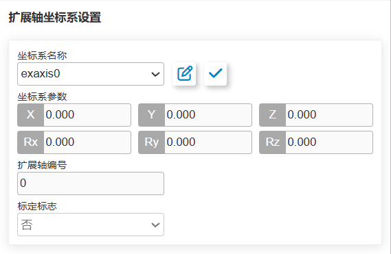
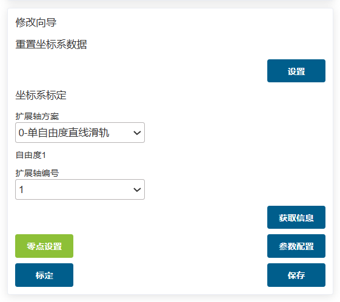
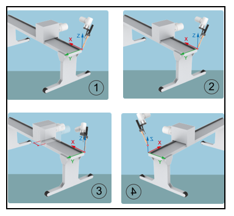
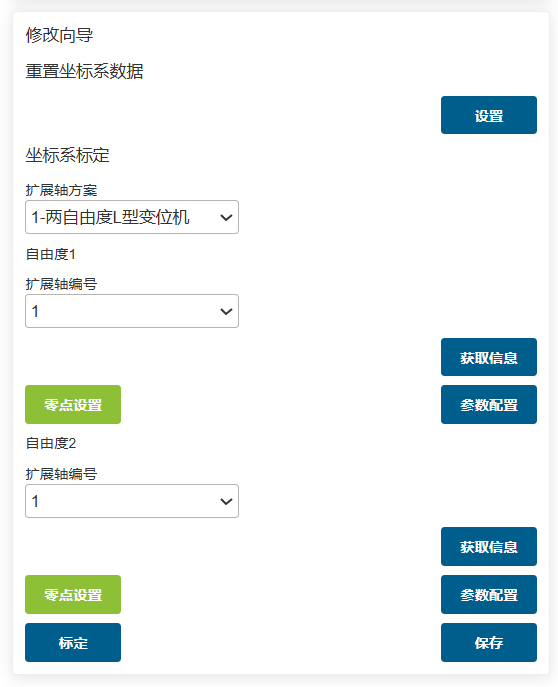
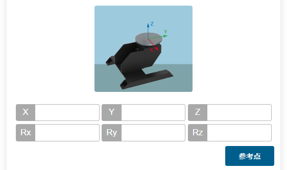
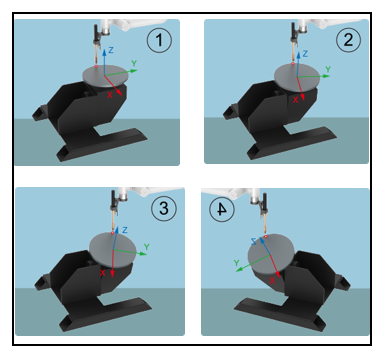
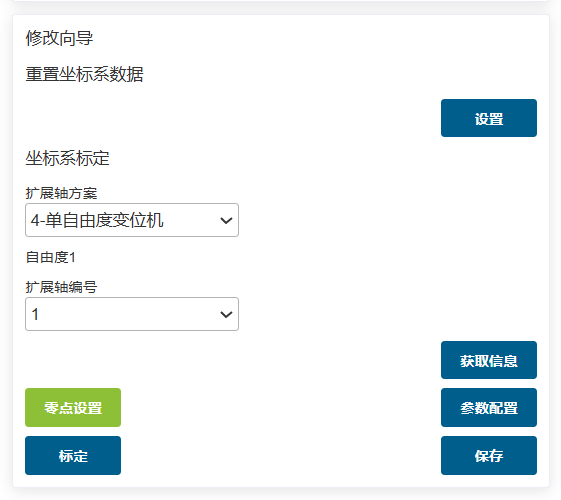
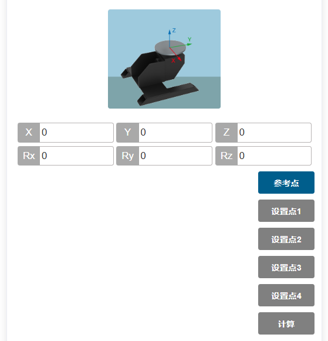

基礎設定 
===============

.. toctree:: 
   :maxdepth: 6

座標系
--------------

工具座標
~~~~~~~~~~~~~

在「初始設定－基礎——座標系」的選單列下，點選「工具」進入工具座標頁面 。

工具座標可實現工具座標的修改、清空與應用。在工具座標系的下拉清單中，選擇對應的座標系後會在下方顯示對應座標值（座標系名稱可自訂），工具類型以及安裝位置（僅在感測器類型工具下顯示），選擇某一座標系後點選「套用」按鈕，目前使用的工具座標系變成所選的座標，如下所示。

.. image:: base/001.png
   :width: 4in
   :align: center
   
.. centered:: 圖表 6.1‑1 設定工具座標

在QNX下：

- 工具座標係有15個編號。

在Linux下：

- 工具座標係有20個編號。

點選「修改」可根據提示對該編號的工具座標系進行重新設定。工具標定方法分為四點法和六點法，四點法只標定工具TCP，即工具中心點的位置，其姿態默認與末端姿態一致，六點法則在四點法的基礎上增加了兩點，用於標定工具的姿態，這裡我們以六點法為例進行講解。

.. image:: base/002.png
   :width: 4in
   :align: center

.. centered:: 圖表 6.1‑2 設定工具座標

在機器人空間選擇一個固定的點，將工具以三個不同的姿態移至固定點，依序設定1-3點。如下圖左上方圖所示。將工具垂直移至固定點設定點4，如下圖右上方所示。保持此姿態不變，利用基底座標移動，在水平方向移動一段距離，設定點5，此方向即設定的工具座標系X軸正方向。回到固定點，垂直往上移動一段距離，設定點6，此方向即工具座標系Z軸正方向，工具座標系Y正方向則由右手定則決定。點選計算按鈕計算工具位姿，若需重新設置，點選取消按修改鈕重新進行新建工具座標系步驟。

.. image:: base/003.png
   :width: 3in
   :align: center

.. centered:: 圖表 6.1‑3 六點法示意圖

完成最後步驟後，點選「完成」可返回工具座標介面，點選「儲存」即可儲存剛才建立的工具座標系。

.. important:: 
  1. 末端安裝工具後，必須要進行工具座標系的標定及應用，否則會導致機器人執行運動指令時工具中心點的位置和姿態不符合預期值。
  2. 工具座標系一般使用toolcoord1~toolcoord14，應用toolcoord0代表工具TCP的位置中心在末端法蘭中心，在進行工具座標系標定時，首先需將工具座標系應用至toolcoord0，然後選擇其他工具座標系進行標定及應用。

外部工具座標
~~~~~~~~~~~~~

在「初始設定－基礎－座標系」的選單列下，點選「外部工具」進入外部工具座標系介面。

外部工具座標系設定介面中可實現外部工具座標的修改、清空與應用。

外部工具座標系的下拉清單中共有15個編號，從etoolcoord0~etoolcoord14，選擇對應的座標系後會在下方顯示對應座標值，選擇某一座標系後點選「套用」按鈕，目前使用的工具座標系變成所選的座標，如下圖所示。

.. image:: base/004.png
   :width: 4in
   :align: center

.. centered:: 圖表 6.1‑4 外部工具座標

點擊「修改」可根據提示對該編號的工具座標系進行重新設置，如下圖所示。

.. image:: base/005.png
   :width: 4in
   :align: center

.. centered:: 圖表 6.1‑5 六點法示意圖

**1.三點法確定外部TCP**

- **設定點1**：已測量工具的TCP移至外部TCP，點選設定點1按鈕；

- **設定點2**：由點1沿外部TCF座標系X軸移動一段距離，點選設定點2按鈕；

- **設定點3**：回到點1，由點1沿外部TCF座標系Z軸移動一段距離，點選設定點3按鈕；

- **計算**：點選計算按鈕得到外部TCF；

**2.六點法確定工具TCF**

- **設定點1-4**：在機器人空間選擇一個固定的點，將工具從四個不同的角度移至所選的點上，依序設定1-4點；

- **設定點5**：回到固定的點沿工具TCF座標系X軸移動一段距離，點選設定點5按鈕；

- **設定點6**：回到固定的點沿工具TCF座標系Y軸移動一段距離，點選設定點6按鈕；

- **計算**：點選計算按鈕得到工具TCF；

若需重新設置，點選取消按鈕重新進去新工具座標系步驟。

完成最後步驟後，點選「完成」可返回工具座標介面，點選「儲存」即可儲存剛才建立的工具座標系。

.. important::
   1. 使用外部工具必須要進行外部工具座標系的標定及應用，否則會導致機器人執行運動指令時工具中心點的位置與姿態不符合預期值。
   2. 外部工具座標系一般使用etoolcoord1~etoolcoord14，應用etoolcoord0代表外部工具TCP的中心位置在末端法蘭中心，在進行工具座標系標定時，首先需將工具座標系應用至etoolcoord0，然後選擇其他工具座標系進行標定。

工件座標
~~~~~~~~~~~~~

在「初始設定－基礎－座標系」的選單列下，點選「工件」進入工件座標介面。工件座標可實現工件座標的修改、清空與應用。工件座標系的下拉清單中共有15個編號，選擇對應的座標系（wobjcoord0~
wobjcoord14），後面會在下方的「座標系座標」中顯示對應座標值，選擇某一座標係後點選「套用」按鈕，目前使用的工件座標系變成所選的座標，如下圖所示。

.. image:: base/006.png
   :width: 4in
   :align: center

.. centered:: 圖表 6.1‑6 設定工件座標

工件座標系一般是基於工具基礎上進行標定的，需要在已建立工具座標系的基礎上進行工件座標系的建立。點選「修改」可根據提示對此編號的工件座標系進行重新設定。固定好工件，選擇標定方法“原點-X軸-Z軸”或“原點-X軸-XY+平面”，兩種標定方法前兩點的選取都是一致的，第三點有所區別，選第一種方法標定的是工件座標系的Z方向，選第二種方法標定的是XY+平面上一點，依圖示標定即可。點選計算按鈕計算工件位姿，若需重新設置，點選取消按修改鈕重新進行新工件座標系步驟。

.. image:: base/007.png
   :width: 3in
   :align: center

.. centered:: 圖表 6.1‑7 三點法示意圖

完成最後步驟後，點選「完成」可返回工件座標介面，點選「儲存」即可儲存剛才建立的工件座標系。

.. important::
  1. 工件座標係是基於工具基礎上進行標定的，需要在已建立工具座標系的基礎上進行工件座標系的建立。
  2. 工件座標系一般使用wobjcoord1~wobjcoord14，應用wobjcoord0代表工件座標係原點在基底座標原點，在進行工件座標系標定時，首先需將工件座標系應用至wobjcoord0，再選擇其他工件座標系進行標定及應用。

擴展軸座標
~~~~~~~~~~~~~

在「初始設定－基礎－座標系」的選單列下，點選「擴展軸」進入擴展軸座標系介面。擴展軸座標系設定介面中可實現擴展軸座標的修改、清空與應用。

擴展軸座標系的下拉清單中共有5個編號，從eaxis0~eaxis4，選擇對應的座標係後會在下方顯示對應座標值，選擇某一座標係後點選「應用」按鈕，目前使用的擴充軸座標系變成所選的座標，如下圖所示。

.. centered:: 圖表 6.1‑8 擴展軸座標

點擊「修改」可根據提示對該編號的擴展軸標系進行重新設置，如下圖所示。標定之前先清空需要標定的擴展軸座標系，應用此擴展軸座標系。

先看第一種擴展軸方案-直線導軌的標定方法。選擇擴展軸的編號，獲取資訊可以獲取對應擴展軸的驅動器信息，我們可以根據該資訊進行參數配置。

配置完後設定DH參數，直線導軌方案預設為0。設定機器人相對擴展軸位置，直線導軌為擴展軸上。若不標定，點選儲存即可，此時擴充軸只能非同步運動。

.. centered:: 圖表 6.1‑9 直線導軌配置

若需跟機器人同步運動，點選標定，進入標定界面，在擴展軸零點處，點擊操作區Eaxis使能擴展軸，將機器人末端中心（應用工具坐標系下用工具末端點）以兩個不同姿勢對準擴展軸上固定一點，分別設定點1和點2。

去除使能，將擴展軸移動一段距離，使能後，同樣將機器人末端中心點對準之前固定點，設定點3。去除使能，將擴展軸移至零點，使能擴展軸。將機器人末端中心點移至固定點垂直往上空間一點，設定點4，計算座標系並儲存。

.. centered:: 圖表 6.1‑10 直線導軌標定

接下來來看第二種擴展軸方案-變位機的標定方法。變位機由兩個擴展軸組成，選擇擴展軸的編號，獲取信息可以獲取對應擴展軸的驅動器信息，我們可以根據該信息進行參數配置。

配置完後設定DH參數，根據圖示測量出變位機的DH參數，並輸入到輸入框中。設定機器人相對擴展軸位置，變位機為擴展軸外。若不標定，點選儲存即可，此時擴充軸只能非同步運動。

.. centered:: 圖表 6.1‑11 變位機配置

若需跟機器人同步運動，點選標定，進入標定界面，在擴展軸零點處，點選操作區Eaxis使能擴展軸，在變位機上建立坐標系，選擇一點，輸入該點在該坐標系下的笛卡爾位姿，例如選擇Y正向一點，測出Y為100mm，則輸入如圖所示數值，點選參考點，即可設定參考點。後續四個標定點都需將機器人末端中心（應用工具座標系下用工具末端點）對準該參考點。

.. centered:: 圖表 6.1‑12 變位機參考點配置

將機器人末端中心（應用工具座標繫下用工具末端點）對準此參考點，設定點1，點選操作區Eaxis點動兩軸一小段距離，將機器人末端中心對準參考點，設定點2，繼續點動兩軸，機器人末端中心對準參考點，設定點3，最後繼續點動兩軸，將機器人末端中心對準參考點，設定點4，點選計算，得到座標系結果，點選儲存，應用即可。

.. centered:: 圖表 6.1‑13 變位機標定

接下來來看第三種擴充軸方案-單軸變位機的標定方法。該變位機由一個旋轉擴展軸組成，選擇擴展軸的編號，獲取信息可以獲得對應擴展軸的驅動器信息，我們可以根據該信息進行參數配置。 DH參數設定為0。設定機器人相對擴展軸位置，變位機為擴展軸外。若不標定，點選儲存即可，此時擴充軸只能非同步運動。

.. centered:: 圖表 6.1‑14 單軸變位機配置

若需跟機器人同步運動，點選標定，進入標定界面，在擴展軸零點處，點選操作區Eaxis使能擴展軸，在變位機上建立坐標系，選擇一點，輸入該點在該坐標系下的笛卡爾位姿，點選“參考點”，即可設定參考點。

後續四個標定點都需將機器人末端中心（應用工具座標系下用工具末端點）對準該參考點。將機器人末端中心（應用工具座標繫下用工具末端點）對準該參考點，設定點1，點選操作區Eaxis點動旋轉軸一小段距離，將機器人末端中心對準參考點，設定點2，繼續點動旋轉軸，機器人末端中心對準參考點，設定點3，最後繼續點動旋轉軸，將機器人末端中心對準參考點，設定點4，點選計算，得到座標系結果，點選儲存，應用即可。

.. centered:: 圖表 6.1‑15 單軸變位機標定

.. important::
 1. 擴展軸座標係是基於工具基礎上進行標定的，需要在已建立工具座標系的基礎上進行擴展軸座標系的建立。
 2. 擴展軸系一般使用exaxis1~ exaxis4，應用exaxis0代表無擴展軸坐標系，在進行擴展軸坐標系標定時，首先需將擴展軸坐標系應用至exaxis0，然後選擇其他擴展軸坐標系進行標定及應用。

負載
--------------

末端
~~~~~~~~~~~~~

在「初始設定－基礎－負載」的選單列下，點選「末端」進入末端負載介面。

在配置末端負載時請將所使用的末端工具的質量以及對應的質心座標分別輸入「負載質量」和「負載質心座標X、Y和Z」輸入框中並套用。

.. important:: 
    負載質量不可超過機器人的最大負載範圍。具體機器人型號對應的負載範圍請參考2.1. 基本參數，質心座標設定範圍為0-1000，單位mm。

.. image:: base/016.png
   :width: 4in
   :align: center

.. centered:: 圖表 6.2‑1 負載設定示意圖

.. important:: 
   機器人末端安裝負載後，必須正確設定末端負載重量以及質心座標，否則會影響機器人的拖曳功能以及碰撞偵測功能使用。

使用者對工具品質或質心不確定的情況下，可以點選「自動辨識」進入負載辨識功能對工具資料測定。

在進行測定之前，請確保負載已安裝後選擇版本。點選「工具資料測定」按鍵，進入負重運動測試介面。

.. image:: base/017.png
   :width: 4in
   :align: center

.. centered:: 圖表 6.2‑2 負載辨識關節設置

點選「負載辨識啟動」進行測試，如遇緊急狀況請及時停止運動。

.. image:: base/018.png
   :width: 4in
   :align: center

.. centered:: 圖表 6.2‑3 負載辨識啟動

運動結束後，點選「取得辨識結果」按鍵，取得計算出的工具數據，並顯示在頁面上，如需套用至負荷數據中，點選應用即可。

.. image:: base/019.png
   :width: 4in
   :align: center

.. centered:: 圖表 6.2‑4 負荷辨識結果

關節
--------------

軟限位
~~~~~~~~~~~~~

在「初始設定－基礎－關節」的選單列下，點選「軟限位」進入軟限位介面。

機器人行程內可能存在其它設備，限位角度可對機器人進行軟限位，使機器人運動不超過某個座標值，防止機器人碰撞。觸發軟限位機器人停止為機器人自動觸發，無停止距離。

管理員可使用預設值也可輸入角度值。輸入角度值，可分別對機器人關節正負角度進行限位，當輸入值超出2.1-基本參數中的機器人基本參數表格所列出的機器人關節軟限位角度值，會將限位角度調整為所能設定最大值。當機器人報出超出指令超限時，需要進入拖曳模式，將機器人關節拖曳到限位角度之內。介面如下圖所示：

.. image:: base/020.png
   :width: 4in
   :align: center

.. centered:: 圖表 6.3‑1 機器人限位示意圖

碰撞等級
~~~~~~~~~~~~~

在「初始設定－基礎－關節」的選單列下，點選「碰撞等級」進入碰撞等級介面。

碰撞等級分為一到十級，一到三級檢測比較靈敏，機器人需要在建議速度下運作。同時可以選擇自訂百分比設置，100%即對應十級。碰撞策略可以設定機器人碰撞後的處理方式，分為報錯停止和繼續移動，使用者可以根據特定使用需求來設定。如下圖所示：

.. image:: base/021.png
   :width: 4in
   :align: center

.. centered:: 圖表 6.3‑2 碰撞等級示意圖

碰撞後響應策略
++++++++++++++++

.. important:: 注意：此碰撞後響應策略功能只在Linux版本下使用。

在原有運動中碰撞策略的基礎上，增加“重力矩模式”和“振盪響應模式”，旨在確保人機協作的安全。

兩種策略在觸發時，均會從自動模式或手動模式，切換至拖曳模式，重力矩模式會根據碰撞力大小及方向遠離碰撞點，而振盪響應模式則會在遠離碰撞點後，回到碰撞位置。同時，新增靜止下的碰撞偵測。

碰撞策略
++++++++++++++++

重力矩模式
**********************

碰撞策略中的重力矩模式，設定步驟如下。

**步驟1**：在“初始設定－基礎－關節”選單列下，點選“碰撞等級”，進入對應介面。

**步驟2**：在“碰撞策略”一欄中， 點擊下拉框選擇“重力矩模式”，介面如下圖所示；然後，點擊“應用”按鈕，功能即可啟用。

.. note:: 在機器人運作中，若負載質量變化較大，不建議使用該策略；若運轉速度過快，不建議使用該策略。

.. image:: base/022.png
   :width: 4in
   :align: center

.. centered:: 圖表 6.3-3 碰撞策略之重力矩模式

振盪響應模式
**********************

碰撞策略中的振盪響應模式，設定步驟如下。

**步驟1**：在“初始設定－基礎－關節”選單列下，點選“碰撞等級”，進入對應介面。

**步驟2**：在“碰撞策略”一欄中， 點擊下拉框選擇“振盪響應模式”，介面如下圖所示；然後，點擊“應用”按鈕，功能即可啟用。

.. note:: 在機器人運作中，若運轉速度過快，不建議使用該策略。

.. image:: base/023.png
   :width: 4in
   :align: center

.. centered:: 圖表 6.3-4 碰撞策略之振盪響應模式

靜態下碰撞偵測
++++++++++++++++

靜態下碰撞偵測的設定步驟如下。

**步驟1**：在“初始設定－基礎－關節”選單列下，點選“碰撞等級”，進入對應介面。

**步驟2**：將靜態下碰撞偵測的開關打開，如下圖所示。當偵測到關節扭矩指令與扭矩回饋差距過大，機器人將進入拖曳模式，避免產生持續的擠壓力。

.. image:: base/024.png
   :width: 4in
   :align: center

.. centered:: 圖表 6.3-5 靜態下碰撞偵測

摩擦力補償
~~~~~~~~~~~~~

在「初始設定－基礎－關節」的選單列下，點選「摩擦力補償」進入摩擦力補償設定介面。

**摩擦力補償係數**：摩擦力補償所針對的使用場景僅在拖曳模式下，摩擦力補償係數可設定範圍為0~1，數值越高，拖曳時補償的力就越大。摩擦力補償係數根據安裝方式的不同需求單獨設定每個軸的補償係數。

**摩擦力補償開關**：使用者可依實際機器人及使用習慣開啟或關閉摩擦力補償。

.. image:: base/025.png
   :width: 4in
   :align: center

.. centered:: 圖表 6.3-6 摩擦力補償設定

.. important::
 機器人摩擦力補償功能需要謹慎使用，依實際情況，設定合理的補償係數，一般建議中間值0.5左右。

I/O設定
-----------

I/O配置
~~~~~~~~~

點選選單列“初始設定——基礎——I/O設定”，點選“DI”、“DO”子選單進入DI和DO設定介面。其中控制箱CI0-CI7和CO0-CO7可配置，末端DI0和DI1可設定。

在生產中協作機器人需要連接外設時或因故障或其它因素突然停止，需要輸出DO訊號，實現聲光警報提示，輸入可設定功能如下表格所示：

.. centered:: 表格 6.4‑1 控制箱輸入可設定功能

.. list-table:: 
   :widths: 15 80
   :header-rows: 1
   :align: center

   * - 功能編號
     - 功能名稱
   * - 0
     - 無
   * - 1
     - 起弧成功訊號
   * - 2
     - 焊接準備訊號
   * - 3
     - 傳送帶偵測
   * - 4
     - 暫停
   * - 5
     - 恢復
   * - 6
     - 啟動
   * - 7
     - 停止
   * - 8
     - 暫停/恢復
   * - 9
     - 啟動/停止
   * - 10
     - 腳踏拖曳開關
   * - 11
     - 移至作業原點
   * - 12
     - 手自動切換
   * - 13
     - 焊絲尋位成功
   * - 14
     - 運動中斷
   * - 15
     - 啟動主程式
   * - 16
     - 啟動倒帶
   * - 17
     - 啟動確認
   * - 18
     - 雷射檢測訊號 X
   * - 19
     - 雷射檢測訊號 Y
   * - 20
     - 外部急停輸入訊號1（僅在QNX下可設定）
   * - 21
     - 外部急停輸入訊號2（僅在QNX下可設定）
   * - 22
     - 一級縮減模式（僅在QNX下可配置）
   * - 23
     - 二級縮減模式（僅在QNX下可配置）
   * - 24
     - 三級縮減模式（停止）（僅在QNX下可設定）
   * - 25
     - 恢復焊接
   * - 26
     - 終止焊接
   * - 27
     - 輔助拖曳開啟
   * - 28
     - 輔助拖曳關閉
   * - 29
     - 輔助拖曳開啟/關閉

輸出可設定功能如下表格所示：

.. centered:: 表格 6.4‑2 控制箱輸出可設定功能

.. list-table:: 
   :widths: 15 80
   :header-rows: 1
   :align: center

   * - 功能編號
     - 功能名稱
   * - 0
     - 無
   * - 1
     - 報錯
   * - 2
     - 運動
   * - 3
     - 噴塗啟停
   * - 4
     - 噴塗清槍
   * - 5
     - 起弧
   * - 6
     - 送氣
   * - 7
     - 正向送絲
   * - 8
     - 反向送絲
   * - 9
     - JOB 輸入口 1
   * - 10
     - JOB 輸入口 2
   * - 11
     - JOB 輸入口 3
   * - 12
     - 傳送帶啟停
   * - 13
     - 暫停
   * - 14
     - 到達作業原點
   * - 15
     - 進入乾涉區
   * - 16
     - 焊絲尋位啟動停止控制
   * - 17
     - 機器人啟動完成
   * - 18
     - 程式啟動停止
   * - 19
     - 自動手動模式
   * - 20
     - 急停輸出訊號1（僅在QNX下可設定）
   * - 21
     - 急停輸出訊號2（僅在QNX下可設定）
   * - 22
     - Lua腳本程式運行/停止
   * - 23
     - 安全狀態輸出（僅在QNX下可設定）
   * - 24
     - 保護性停止狀態輸出（僅在QNX下可設定）
   * - 25
     - 機器人運動中（僅在QNX下可設定）
   * - 26
     - 機器人縮減模式（僅在QNX下可配置）
   * - 27
     - 機器人非縮減模式（僅在QNX下可配置）
   * - 28
     - 預留
   * - 29
     - 指令點錯誤
   * - 30
     - 驅動器錯誤
   * - 31
     - 超出軟限位錯誤
   * - 32
     - 碰撞錯誤
   * - 33
     - 活動從站數量錯誤
   * - 34
     - 從站錯誤
   * - 35
     - IO錯誤
   * - 36
     - 夾爪錯誤
   * - 37
     - 檔案錯誤
   * - 38
     - 奇異位姿勢錯誤
   * - 39
     - 驅動器通訊錯誤
   * - 40
     - 參數錯誤
   * - 41
     - 外部軸超出軟限位錯誤

.. centered:: 表格 6.4‑3 末端輸入可設定功能

.. list-table:: 
   :widths: 15 80
   :header-rows: 1
   :align: center

   * - 功能編號
     - 功能名稱
   * - 0
     - 無
   * - 1
     - 拖曳模式
   * - 2
     - 示教點記錄
   * - 3
     - 手自動切換
   * - 4
     - TPD 軌跡記錄啟動/停止
   * - 5
     - 暫停
   * - 6
     - 恢復
   * - 7
     - 啟動
   * - 8
     - 停止
   * - 9
     - 暫停/恢復
   * - 10
     - 啟動/停止
   * - 11
     - 輔助拖曳開啟
   * - 12
     - 輔助拖曳關閉
   * - 13
     - 輔助拖曳開啟/關閉

其中控制箱預設配置：CO0為1-機器人報錯，CO1為2-機器人運動中。

.. image:: base/026.png
   :width: 6in
   :align: center

.. centered:: 圖表 6.4‑1 控制箱DI和DO配置

**末端DI預設配置**：DI0拖曳示教，DI1示教點記錄。

.. image:: base/027.png
   :width: 4in
   :align: center

.. centered:: 圖表 6.4‑2 末端DI配置

配置完成後，可在對應狀態下，於控制箱I/O頁面中查看對應的輸出DO狀態。

.. important::
 已配置DI、DO禁止在程式編程中使用。

**縮減模式配置（一級、二級、三級）**：一級和二級縮減模式可以配置關節速度和末端TCP速度，三級縮減模式是停止可以不用配置速度。

.. image:: base/032.png
   :width: 4in
   :align: center

.. image:: base/033.png
   :width: 4in
   :align: center

.. centered:: 圖表 6.4‑3 縮減模式配置

I/O別名配置
~~~~~~~~~~~~~~~~~~~~

點擊選單列“初始設定——基礎——I/O設定”，點擊“別名”子選單進入設定介面，根據實際使用場景配置控制箱和末端IO訊號的給定意義名稱。配置成功後，有關IO訊號內容的模組顯示對應別名，模組如下：

.. image:: base/028.png
   :width: 4in
   :align: center

.. centered:: 圖表 6.4‑4 IO別名配置

I/O濾波
~~~~~~~~~~

點選選單列“初始設定－基礎－I/O設定”，點選“濾波”子選單進入IO濾波時間設定介面，濾波時間設定界麵包括：

- 控制箱DI濾波時間
- 末端板DI濾波時間
- 控制箱AI0濾波時間
- 控制箱AI1濾波時間
- 末端板AI0濾波時間
- 按鈕盒DI濾波時間
- 擴展DI濾波時間
- 擴展AI0濾波時間
- 擴展AI1濾波時間
- 擴展AI2濾波時間
- 擴展AI3濾波時間
- Smart DI 濾波時間

使用者可以依照自己的需求來設定對應的參數，點選對應的設定按鈕即可。如下圖所示：

.. image:: base/029.png
   :width: 4in
   :align: center

.. centered:: 圖表 6.4‑4 濾波介面

.. important::
 I/O濾波時間範圍為[0~200]，單位ms。

輸出重設配置
~~~~~~~~~~~~~

點選選單列“初始設定－基礎－I/O設定”，點選“輸出重設”子選單進入設定介面，根據實際使用過程中是否重設的需求，設定不同輸出在停止/暫停後是否需要重設。目前輸出包括：

- 控制箱DO
- 控制箱AO
- 末端版DO
- 末端版AO
- 擴充DO
- 擴充AO
- SmartTool DO

.. image:: base/030.png
   :width: 4in
   :align: center

.. centered:: 圖表 6.4‑6 輸出重設配置

工具TCP自動標定
-----------------------------------

概述
~~~~~~~~~

機器人工具TCP（Tool Center Position, TCP）自動標定使用光電感測器設備（雙對管十字交叉型）對機器人工具TCP進行快速校準。透過在機器人運動期間統計工具在光電感測器設備中觸發I/O訊號的時刻，建立機器人末端法蘭與工具座標系間的轉換關係來精確標定機器人工具座標系。

感測器設備座標系標定操作流程
~~~~~~~~~~~~~~~~~~~~~~~~~~~~~~~~~~~~~~~~~~~~~~

安裝機器人
++++++++++++++++++++++++++

安裝絕對定位精度在1.2 mm內的機器人於作業工作台，並在機器人末端法蘭安裝標定感測器設備座標系的專用特製工具。

.. image:: base/034.png
   :width: 2in
   :align: center

.. centered:: 圖表 6.5‑1 機器人安裝範例

安裝感測器設備
+++++++++++++++++++++++++++++++++

將光電感測器設備的兩組棕、藍及黑色訊號線，分別接線至機器人控制箱兩組24V、0V及CI0、CI1埠（任意可用的可設定數位訊號輸入埠即可），控制箱上電啟動機器人並點亮光電感測器設備的X、Y軸光束。

.. image:: base/035.png
   :width: 2in
   :align: center

.. centered:: 圖表 6.5‑2 光電感測器設備範例

設定機器人工具TCP自動標定係統座標系
++++++++++++++++++++++++++++++++++++++++++++++++++++++++++++

根據機器人工具TCP自動標定係統，首先粗定位光電感測器設備放置於機器人靈活工作空間，並使光電感測器設備座標系與機器人基座標系方位大致相同。

如上圖所示，其中單位軸、及屬於{b}表示為機器人基座標系、單位軸、及屬於{e}表示為末端法蘭座標系及單位軸、及屬於{s}為感測器座標系。

.. image:: base/036.png
   :width: 4in
   :align: center

.. centered:: 圖表 6.5‑3 機器人工具TCP自動標定係統座標系設置

（1）將機器人末端法蘭的姿態調整為Rx、Ry及Rz分別為180°、0°及0°，並確保此姿態在調整後的整個標定感測器設備座標系的運動過程中維持不變；

（2）使機器人工具TCP在機器人基底座標系與感測器座標系的X、Y軸方向上共同執行MoveL運動；

（3）觀察機器人在運動期間，一旦滿足當光電感測器設備的X、Y軸光束始終維持觸發I/O訊號的狀態，即可將光電感測器設備的安裝位置精確定位為當前所處位置。

根據Web介面標定感測器座標系
+++++++++++++++++++++++++++++++++++++++++++++

在機器人Web控制介面中，依序點選“初始設定”-“基礎”-“座標系”-“工具”，進入“工具座標系設定”介面；

在“坐標系名稱”下拉式選單中選擇參考座標系，並選擇對應的“工具類型”和“安裝位置”，然後點擊“修改”，進入“修改精靈”介面；

選擇“光電自動標定”，進入光電自動標定介面，點選“配置”，進入“光電校準設備配置”介面，若目前有以往設置，請點選“修改”。

.. image:: base/037.png
   :width: 4in
   :align: center

.. centered:: 圖表 6.5‑4 進入光電自動標定介面範例

設定I/O
***********************

選擇X軸光束和Y軸光束的控制箱輸入埠號，然後點選“設定”，設定成功後則會在「設定I/O」標識前出現綠色勾號標記。

.. image:: base/038.png
   :width: 4in
   :align: center

.. centered:: 圖表 6.5‑5 设置光电传感器设备的X、Y轴光束I/O端口示例

示教中心點
******************************

拖曳機器人使工具TCP將光電感測器設備的X、Y軸光束I/O訊號同時觸發，然後沿著基坐標系Z+軸方向移至感測器設備測量平面（X、Y軸光束交會處）上方5 mm附近。

.. warning:: 注意在此過程中，機器人末端法蘭姿態為Rx、Ry及Rz分別為180°、0°及0°保持不變，然後點擊“記錄”，設定成功後則會在“示教中心點」標識前出現綠色勾號標記。

.. image:: base/039.png
   :width: 4in
   :align: center

.. centered:: 圖表 6.5‑6 示教機器人工具TCP位於感測器設備測量平面中心

設定參數
****************************

設定「運動半徑」、「角速度」及「下移距離」三個自訂參數。

（1）“運動半徑”參數為機器人工具進行圓週運動的半徑，參考所用感測器設備的有效測量半徑為35 mm，建議設為“10-15 mm”，過大易使工具與感測器發生干涉、過小易使感測器X、Y軸光束I/O訊號發生干涉；

（2）“角速度”參數為機器人工具進行圓週運動的勻速角速度，建議設為“10-40 deg/s”，過大易使工具末端產生衝擊顫動及感測器I/O訊號的數據掉幀；

（3）“下移距離”參數為機器人執行兩次圓週運動的圓心間的歐式距離，參考所用感測器設備的有效測量高度為25 mm，建議設為“5-15mm”，過大易使工具與感測器發生干涉。

然後點選“設定”，設定成功後會在“設定參數”標識前出現綠色勾號標記。

.. image:: base/040.png
   :width: 4in
   :align: center

.. centered:: 圖表 6.5‑7 自訂參數設定範例

運行
*********************

在自動模式下，點選“運行”，即啟動感測器裝置座標系的標定操作。待操作完成後，介面顯示所標定感測器座標系的x、y及z座標值和Rx、Ry及Rz的姿態角度，然後點選「完成」儲存目前資料並退出目前介面。

.. image:: base/041.png
   :width: 4in
   :align: center

.. centered:: 圖表 6.5‑8 感測器設備座標系標定結果範例

.. warning:: 注意當前操作，建議機器人每次生產任務的生命週期（機器人電源關閉-啟動操作）均進行該操作，以防止作業期間出現的高頻振動導致感測器設備安裝位置發生小量偏移及誤操作導致的控制器內感測器設備座標系標定資料釋放所引發的錯誤。

工具座標系標定操作流程
~~~~~~~~~~~~~~~~~~~~~~~~~~~~~~~~~~~~~~~~~~~~~~

完成「光電校準設備配置」介面後，在該標識前出現綠色打勾標記，即表示為感測器設備座標系設定成功。拆下機器人末端法蘭的專用特製工具，安裝待標定的未知工具。點選“校準”，即啟動工具TCP自動標定操作，待操作完成後，介面顯示工具座標系標定結果。

.. image:: base/042.png
   :width: 4in
   :align: center

.. centered:: 圖表 6.5‑9 工具TCP標定結果範例

點擊“儲存”，則在“目前工具座標系”介面的“座標系名稱”下拉選單中，所選的參考座標系中更新目前工具TCP的標定結果。

在“目前工具座標系”介面中，點選“套用”，則在目前參考工具座標系中套用目前工具TCP標定結果。

.. important::
 需要注意的是：

 （1）在點擊「校準」前，可透過觀察標定的感測器裝置座標系x、y及z座標結果是否與實際感測器裝置安裝位置有明顯誤差來避免在標定工具座標系過程中發生錯誤。若情況發生，原因可能是機器人工具TCP自動標定係統座標系設定錯誤，需要調整感測器設備的安裝位置後，重新標定感測器設備座標系；

 （2）點選「校準」後，可透過觀察機器人執行兩次圓週運動後調整末端法蘭姿態是否發生明顯大幅度調整（>90°）來避免在標定工具座標系過程中發生錯誤。若情況發生，原因可能是「運動半徑」參數設定太小，導致感測器設備I/O訊號干涉，則需要修改「運動半徑」參數後，重新點選「校準」；

 （3）建議標定工具類型末端為圓柱體、主軸方向與末端法蘭主軸方向大致平行、半徑在10 mm內，工具末端可測量長度應在5 - 15 mm內（非工具整體長度），則不易與感測器設備產生干涉。

基於平板工具的TCP標定
-----------------------------------

概述
~~~~~~~~~

使用「四點法」進行工具的TCP標定時，需要手動控制機器人運動，並透過肉眼實現點與點的精確重合，標定效率和精度都受操作人員熟練度的影響。

基於平板工具的TCP標定原理如下：利用機器人工具與平板任意位置多次觸碰，並透過建立標定模型以求解工具的TCP。整個標定過程會自動完成，可提高標定的效率和減少對人工的依賴。

基於平板工具的TCP標定功能操作流程
~~~~~~~~~~~~~~~~~~~~~~~~~~~~~~~~~~~~

固定標定平板於機器人作業空間內，平板不可有晃動，且平板的導電性好，將工具末端近似垂直標定板，並位於平板上方50mm處。

.. image:: base/043.png
   :width: 4in
   :align: center

.. centered:: 圖表 6.6‑1 標定佈局示意

依序點選「示教程式」—「程式編程」按鈕，選擇「FR_CalibrateTheToolTcpPlane.lua」標定檔並開啟。

.. image:: base/044.png
   :width: 4in
   :align: center

.. centered:: 圖表 6.6‑2 開啟標定文件

依序點選「初始設定」—「基礎」—「座標系」—「工具」按鈕，會進入「目前座標系」介面。在「座標系名稱」中選擇要進行標定的座標系（以toolcord1座標系為例），點選「修改」按鈕，即可進入TCP標定方法選擇介面。

.. image:: base/001.png
   :width: 4in
   :align: center

.. centered:: 圖表 6.6‑3 工具座標系設定

在“修改精靈”中，選擇“平板工具標定”，即可進入平板工具標定介面。

.. image:: base/045.png
   :width: 4in
   :align: center

.. centered:: 圖表 6.6‑4 標定方法選擇

在「平板工具標定」介面中，點選「進入」按鈕，可以進行平板工具配置，點選「記錄」按鈕，記錄標定參考點。配置完成後，點選「完成」按鈕，將會回到「平板工具標定」介面。

.. image:: base/046.png
   :width: 4in
   :align: center

.. centered:: 圖表 6.6‑5 平板工具配置

在「平板工具標定」介面點選「執行」按鈕，機器人將自動進行工具的TCP標定，標定完成後，將顯示工具的TCP座標，點選「儲存」按鈕，會將標定結果回到「目前工具座標系”介面中。

.. image:: base/047.png
   :width: 4in
   :align: center

.. centered:: 圖表 6.6‑6 標定結果

在「目前工具座標系」介面點選「套用」按鈕，即可儲存工具的TCP標定結果並套用。

.. image:: base/048.png
   :width: 4in
   :align: center

.. centered:: 圖表 6.6‑7 標定結果應用