基礎設定
===============

.. toctree::
   :maxdepth: 6

安裝
--------------

機器人安裝方式設定和展示
~~~~~~~~~~~~~~~~~~~~~~~~~~~

在Web端示教頁面，點選「初始設定」→「基礎」→「安裝」，其頁面佈局如下所示。具體的說明如下：

1. 快速安裝用於機械臂常見的安裝設定，從左到右分別對應：正裝、側裝和倒裝。當點選對應的按鈕後，介面將自動下發並更改基座傾斜和旋轉角。
2. 若所需的安裝方式不符合快速安裝，則可透過自行設定基座傾斜及旋轉角進行配置。
3. 不論是快速安裝還是自行設定基座傾斜及旋轉角，均需要點選應用後方可生效。

.. note:: 請確保所設定的安裝方式與實際機械臂一致後，再進行拖動操作，否則會有安全隱患。

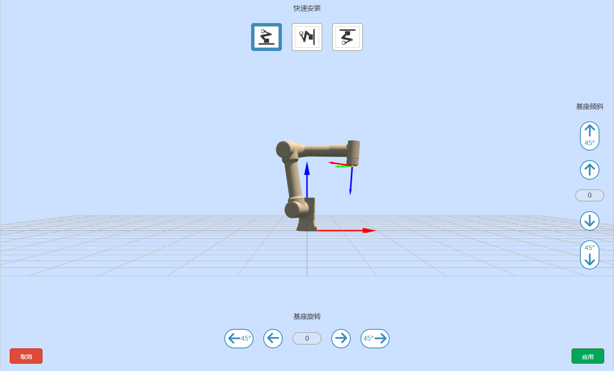

.. centered:: 圖表 6.1‑1 360度自由安裝

.. important::
   機器人安裝完成後，必須正確設定機器人的安裝方式，否則會影響機器人的拖動功能以及碰撞偵測功能使用。

座標系
--------------

工具座標
~~~~~~~~~~~~~

在「初始設定」->「基礎」選單列下，點選「工具座標」進入工具座標頁面 。

工具座標可實現工具座標的修改、清空、重新命名與應用。在工具座標系的下拉式清單中，選擇對應的座標系後會在下文顯示對應座標值（座標系名稱可自訂），工具類型以及安裝位置（僅在感測器類型工具下顯示），選擇某一座標系後點選「應用」按鈕，目前使用的工具座標系變為所選擇的座標，如下所示。

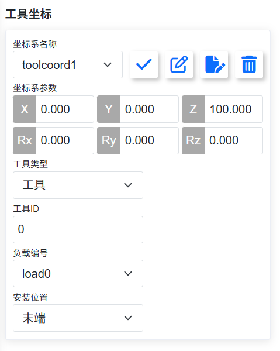

.. centered:: 圖表 6.2‑1-1 設定工具座標

點選「重新命名」按鈕，可進行座標系名稱重新命名，再次點選或應用完成修改，如下圖。

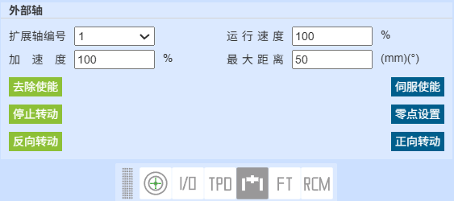

.. centered:: 圖表 6.2‑1-2 座標系名稱重新命名

點選「修改」可根據提示對該編號的工具座標系進行重新設定。工具標定方法分為四點法和六點法，四點法只標定工具TCP，即工具中心點的位置，其姿態預設與末端姿態一致，六點法則在四點法的基礎上增加了兩點，用於標定工具的姿態，這裡我們以六點法為例進行講解。

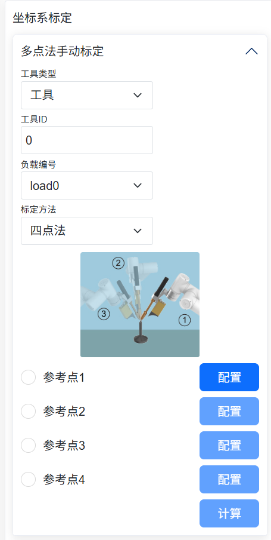

.. centered:: 圖表 6.2‑2 設定工具座標

在機器人空間選擇一個固定的點，將工具以三個不同的姿態移至固定點，依序設定1-3點。如下圖左上方所示。將工具垂直移至固定點設定點4，如下圖右上方所示。保持該姿態不變，利用基座標移動，在水平方向移動一段距離，設定點5，該方向即設定的工具座標系X軸正方向。回到固定點，垂直往上移動一段距離，設定點6，該方向即工具座標系Z軸正方向，工具座標系Y正方向則透過右手定則確定。點選計算按鈕計算工具姿態，若需重新設定，點選取消按修改鈕重新進行新建工具座標系步驟。

.. image:: base/003.png
   :width: 3in
   :align: center

.. centered:: 圖表 6.2‑3 六點法示意圖

完成最後步驟後，點選「完成」可返回工具座標介面，點選「儲存」即可儲存剛才建立的工具座標系。

.. important::
   1. 末端安裝工具後，必須要進行工具座標系的標定及應用，否則會導致機器人執行運動指令時工具中心點的位置和姿態不符合預期值。
   2. 工具座標系一般使用toolcoord1~toolcoord19，應用toolcoord0代表工具TCP的位置中心在末端法蘭中心，在進行工具座標系標定時，首先需將工具座標系應用至toolcoord0，然後選擇其他工具座標系進行標定及應用。

外部工具座標
~~~~~~~~~~~~~

在「初始設定」->「基礎」選單列下，點選「外部工具座標」進入外部工具座標系介面。

外部工具座標系設定介面中可實現外部工具座標的修改、清空與應用。

外部工具座標系的下拉式清單中共有15個編號，從etoolcoord0~etoolcoord14，選擇對應的座標系後會在下文顯示對應座標值，選擇某一座標系後點選「應用」按鈕，目前使用的工具座標系變為所選擇的座標，如下圖所示。

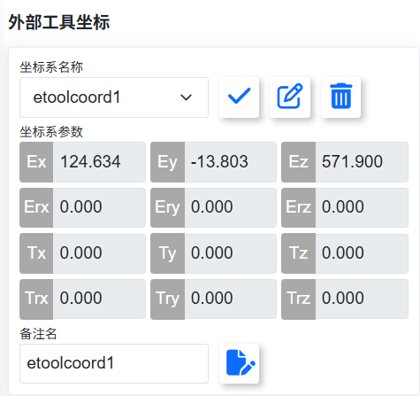

.. centered:: 圖表 6.2‑4 外部工具座標

點選「修改」可根據提示對該編號的工具座標系進行重新設定，如下圖所示。

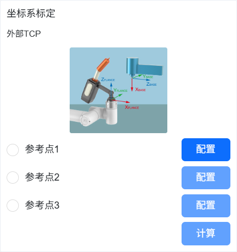

.. centered:: 圖表 6.2‑5 六點法示意圖

**1.三點法確定外部TCP**

- **設定點1**：已量測工具的TCP移動至外部TCP，點選設定點1按鈕；

- **設定點2**：由點1沿外部TCF座標系X軸移動一段距離，點選設定點2按鈕；

- **設定點3**：回到點1，由點1沿外部TCF座標系Z軸移動一段距離，點選設定點3按鈕；

- **計算**：點選計算按鈕得到外部TCF；

**2.六點法確定工具TCF**

- **設定點1-4**：在機器人空間選擇一個固定的點，將工具從四個不同的角度移至所選的點上，依序設定1-4點；

- **設定點5**：回到固定的點沿工具TCF座標系X軸移動一段距離，點選設定點5按鈕；

- **設定點6**：回到固定的點沿工具TCF座標系Y軸移動一段距離，點選設定點6按鈕；

- **計算**：點選計算按鈕得到工具TCF；

若需重新設定，點選取消按鈕重新進去新建工具座標系步驟。

完成最後步驟後，點選「完成」可返回工具座標介面，點選「儲存」即可儲存剛才建立的工具座標系。

.. important::
   1. 使用外部工具必須要進行外部工具座標系的標定及應用，否則會導致機器人執行運動指令時工具中心點的位置和姿態不符合預期值。
   2. 外部工具座標系一般使用etoolcoord1~etoolcoord14，應用etoolcoord0代表外部工具TCP的中心位置在末端法蘭中心，在進行工具座標系標定時，首先需將工具座標系應用至etoolcoord0，然後選擇其他工具座標系進行標定。

工件座標
~~~~~~~~~~~~~

在「初始設定」->「基礎」選單列下，點選「工件座標」進入工件座標介面。工件座標可實現工件座標的修改、清空與應用。工件座標系的下拉式清單中共有15個編號，選擇對應的座標系（wobjcoord0~
wobjcoord14），後會在下文的「座標系座標」中顯示對應座標值，選擇某一座標系後點選「應用」按鈕，目前使用的工件座標系變為所選擇的座標，如下圖所示。

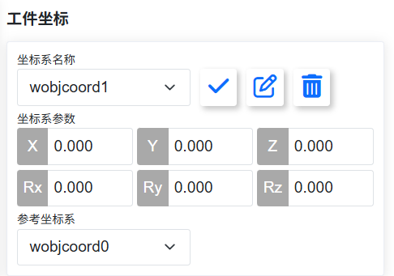

.. centered:: 圖表 6.2‑6 設定工件座標

工件座標系一般是基於工具基礎上進行標定的，需要在已建立工具座標系的基礎上進行工件座標系的建立。點選「修改」可根據提示對該編號的工件座標系進行重新設定。固定好工件，選擇標定方法「原點-X軸-Z軸」或「原點-X軸-XY+平面」，兩種標定方法前兩點的選取都是一致的，第三點有所區別，選第一種方法標定的是工件座標系的Z方向，選第二種方法標定的是XY+平面上一點，根據圖示標定即可。點選計算按鈕計算工件姿態，若需重新設定，點選取消按修改鈕重新進行新建工件座標系步驟。

.. image:: base/007.png
   :width: 3in
   :align: center

.. centered:: 圖表 6.2‑7 三點法示意圖

完成最後步驟後，點選「完成」可返回工件座標介面，點選「儲存」即可儲存剛才建立的工件座標系。

.. important::
   1. 工件座標系是基於工具基礎上進行標定的，需要在已建立工具座標系的基礎上進行工件座標系的建立。
   2. 工件座標系一般使用wobjcoord1~wobjcoord14，應用wobjcoord0代表工件座標系原點在基座標原點，在進行工件座標系標定時，首先需將工件座標系應用至wobjcoord0，然後選擇其他工件座標系進行標定及應用。

負載
--------------

末端
~~~~~~~~~~~~~

在「初始設定」->「基礎」->「負載」的選單列下，點選「軌跡辨識」進入軌跡辨識介面。

在配置末端負載時請將所使用的末端工具的質量以及對應的質心座標分別輸入「負載質量」和「負載質心座標X、Y和Z」輸入框中並應用。

.. important::
    負載質量不可超過機器人的最大負載範圍。具體機器人型號對應的負載範圍請參考2.1. 基本參數，質心座標設定範圍為0-1000，單位mm。

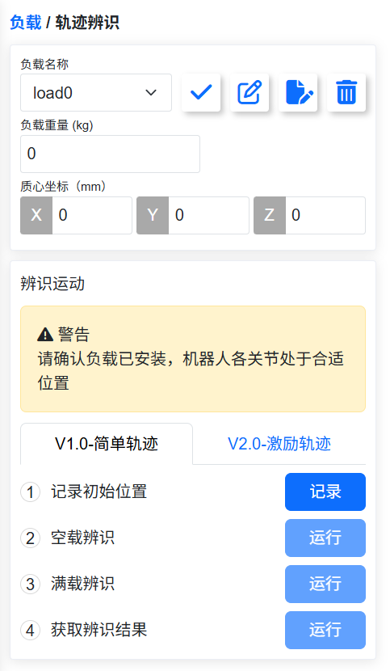

.. centered:: 圖表 6.3‑1 負載設定示意圖

.. important::
   機器人末端安裝負載後，必須正確設定末端負載重量以及質心座標，否則會影響機器人的拖動功能以及碰撞偵測功能使用。

使用者對工具質量或質心不確定的情況下，可以透過點選「自動辨識」進入負載辨識功能對工具資料測定。

在進行測定之前，確保負載已安裝後選擇版本。點選「工具資料測定」按鍵，進入負載運動測試介面。

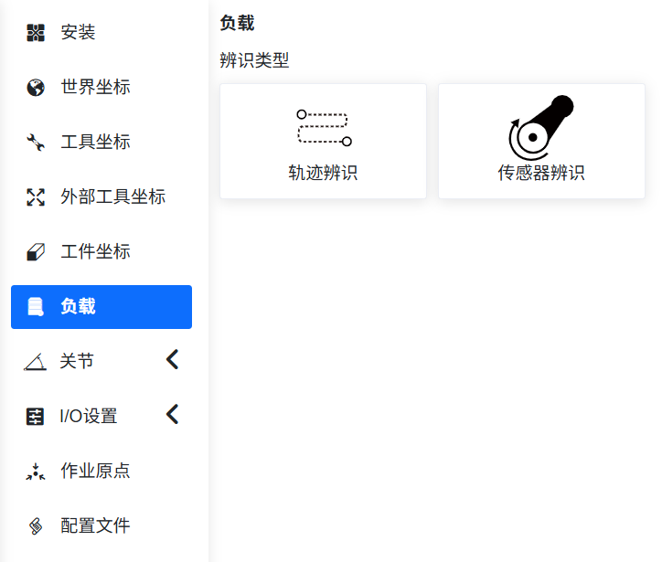

.. centered:: 圖表 6.3‑2 負載辨識關節設定

點選「負載辨識啟動」進行測試，如遇緊急情況請及時停止運動。

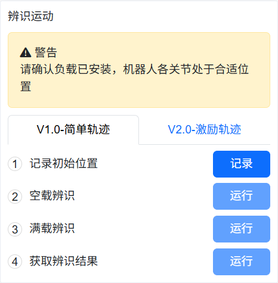

.. centered:: 圖表 6.3‑3 負載辨識啟動

運動結束後，點選「取得辨識結果」按鍵，取得計算出的工具資料，並顯示在頁面上，如需應用到負載資料中，點選應用即可。

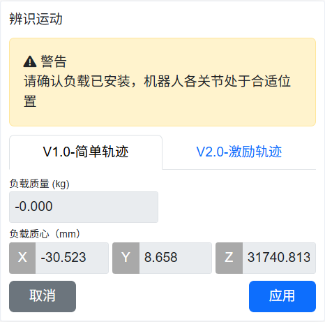

.. centered:: 圖表 6.3‑4 負載辨識結果

關節
--------------

軟限位
~~~~~~~~~~~~~

在「初始設定」->「基礎」->「關節」的選單列下，點選「軟限位」進入軟限位介面。

機器人行程內可能存在其它設備，限位角度可對機器人進行軟限位，使機器人運動不超過某個座標值，防止機器人碰撞。觸發軟限位機器人停止為機器人自動觸發，無停止距離。

管理員可使用預設值也可輸入角度值。輸入角度值，可分別對機器人關節正負角度進行限位，當輸入值超出2.1-基本參數中的機器人基本參數表格所列出的機器人關節軟限位角度值，會將限位角度調整為所能設定最大值。當機器人報出超出指令超限時，需要進入拖動模式，將機器人關節拖動至限位角度之內。介面如下圖所示：

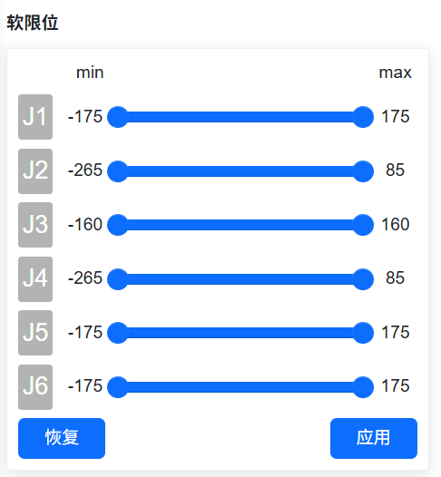

.. centered:: 圖表 6.4‑1-1 機器人限位示意圖

關節軟限位保護
+++++++++++++++++++++++++++++++++++

概述
************************

關節軟限位保護功能是一種透過即時監測機械臂關節運動狀態，動態限制操作者在拖動示教過程中超出設定軟限位範圍的主動防護機制。該功能使得軟限位在拖動示教下同樣存在意義，從而提升人機協作安全性。

關節軟限位保護
************************

關節軟限位保護功能需要確保軟體包與韌體版本匹配，從而取得最佳體驗。

軟限位設定及功能啟停
""""""""""""""""""""""""""""""""""""

**Step1**：登入web介面，依序點選「初始設定」->「基礎」->「關節」->「軟限位」，進入機器人軟限位設定模組。

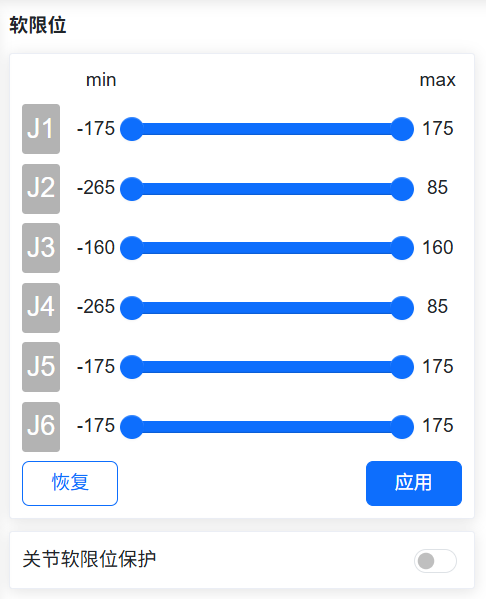

.. centered:: 圖表 6.4‑1-2 機器人軟限位設定模組

**Step2**：基於機器人實際的工作範圍，合理設定各關節軟限位。此時，需要檢查目前機器人各關節的角位置是否在預設軟限位範圍內，若是則可點選「應用」下發預設軟限位；若不是，則需將各關節移動至預設範圍內，否則當點選「應用」時將提示超限，見下圖所示。此時，可朝進入軟限位範圍方向單軸點動或拖動超限關節，從而清除錯誤。

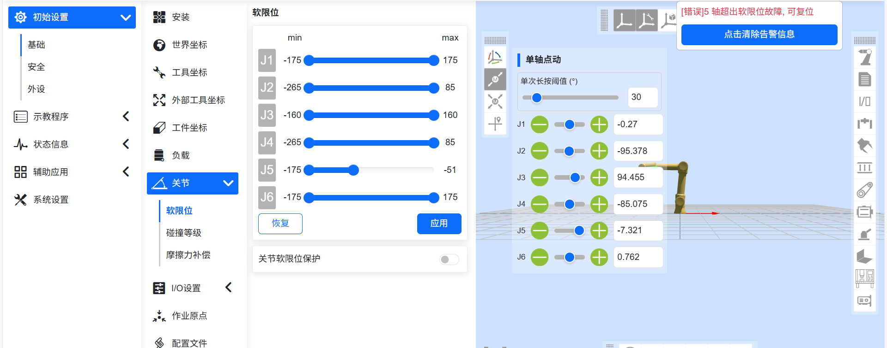

.. centered:: 圖表 6.4‑1-3 機器人各關節實際角位置超出所設軟限位範圍時報錯

**Step3**：當軟限位範圍設定成功後，點選「關節軟限位保護」滑塊，可開啟該功能，具體見下圖所示。此時，拖動模式下，所設軟限位將起到限制作用，同時，在拖動至軟限位附近時，將感受到阻力。

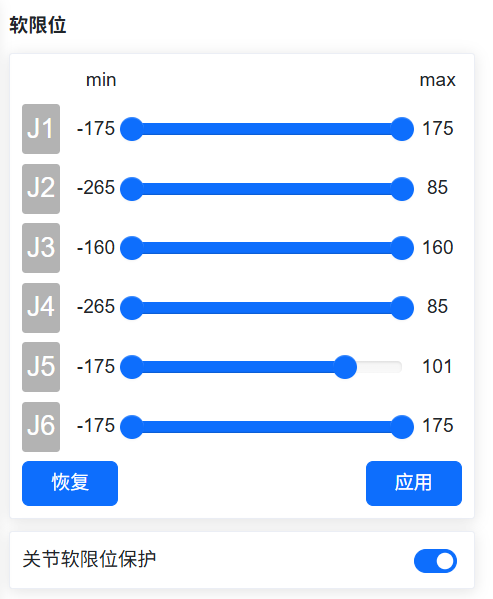

.. centered:: 圖表 6.4‑1-4 開啟關節軟限位保護功能

**Step4**：若需關閉關節軟限位保護功能，可透過點選「關節軟限位保護」滑塊實現。

碰撞等級
~~~~~~~~~~~~~

在「初始設定」->「基礎」->「關節」的選單列下，點選「碰撞等級」進入碰撞等級介面。

碰撞等級分為一到十級，一到三級偵測比較靈敏，機器人需要在推薦速度下運行。同時可以選擇自訂百分比設定，100%即對應十級。碰撞策略可以設定機器人碰撞後的處理方式，分為報錯停止和繼續運動，使用者可以根據具體使用需求來設定。如下圖所示：

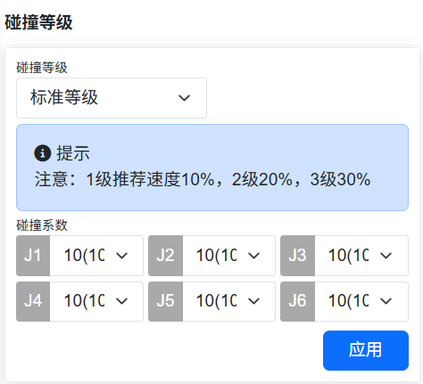

.. centered:: 圖表 6.4‑2 碰撞等級示意圖

碰撞後回應策略
++++++++++++++++

.. important:: 注意：該碰撞後回應策略功能只在LA版本下使用。

在原有運動中碰撞策略的基礎上，增加「重力矩模式」和「振盪回應模式」，旨在保證人機協作的安全。

兩種策略在觸發時，均會從自動模式或手動模式，切換至拖動模式，重力矩模式會根據碰撞力大小及方向遠離碰撞點，而振盪回應模式則會在遠離碰撞點後，回到碰撞位置。同時，新增靜止下的碰撞偵測。

碰撞策略
++++++++++++++++

FT_Guard指令用於實現基於力感測器的碰撞偵測。之前的碰撞策略為「碰撞停止」、「碰撞暫停」和「繼續運動」。為了避免碰撞後機器人與物體產生擠壓力，增加策略「重力矩模式」、「振盪回應模式」和「碰撞回彈模式」。

三種策略在觸發時，均會從自動模式或手動模式，切換至拖動模式，之後再切換至手動模式。其中重力矩模式會根據碰撞力大小及方向遠離碰撞點；振盪回應模式會在遠離碰撞點後，回到碰撞位置；碰撞回彈模式會根據設定的參數，加速遠離碰撞點。

重力矩模式
**********************

碰撞策略中的重力矩模式，設定步驟如下。

**Step1**：在「初始設定」->「基礎」->「關節」選單列下，點選「碰撞等級」，進入對應介面。

**Step2**：在「碰撞策略」一欄中， 點選下拉式方塊選擇「重力矩模式」，介面如下圖所示；然後，點選「應用」按鈕，功能即可啟用。

.. note:: 在機器人運行中，若負載質量變化較大，不建議使用該策略；若運行速度過快，不建議使用該策略。

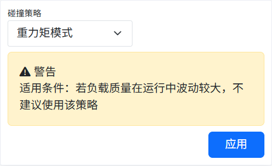

.. centered:: 圖表 6.4-3 碰撞策略之重力矩模式

振盪回應模式
**********************

碰撞策略中的振盪回應模式，設定步驟如下。

**Step1**：在「初始設定」->「基礎」->「關節」選單列下，點選「碰撞等級」，進入對應介面。

**Step2**：在「碰撞策略」一欄中， 點選下拉式方塊選擇「振盪回應模式」，介面如下圖所示；然後，點選「應用」按鈕，功能即可啟用。

.. note:: 在機器人運行中，若運行速度過快，不建議使用該策略。

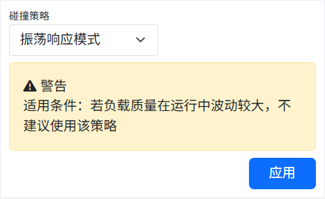

.. centered:: 圖表 6.4-4 碰撞策略之振盪回應模式

碰撞回彈模式
**********************

碰撞策略中的碰撞回彈模式，設定步驟如下。

**Step1**：在初始設定中的「機器人設定」選單列下，點選「碰撞等級」，進入對應介面。

**Step2**：在「碰撞策略」一欄中， 點選下拉式方塊選擇「碰撞回彈模式」，依序設定安全時間1000ms，安全距離150mm，安全速度150mm/s，各關節安全係數為5，具體介面如下圖所示。

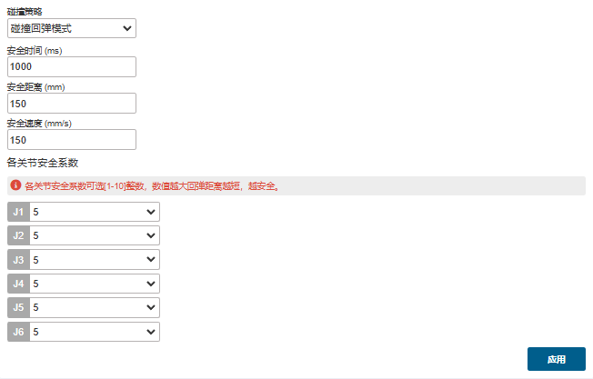

.. centered:: 圖表 6.4-5 碰撞策略之碰撞回彈模式

各項參數的含義：
  - 安全時間：表示從自動模式切換至拖動模式後，在拖動模式下的持續時間，範圍是[1000-2000]ms；
  - 安全距離：表示碰撞後機器人遠離碰撞點的位置，範圍是[150-200]mm；
  - 安全速度：表示碰撞後機器人遠離碰撞點的最大TCP速度，超出速度限制後，會約束反彈力，範圍是[50-250]mm/s；
  - 安全係數：表示反彈力的衰減速度，係數越小，衰減越快，反彈速度越快，反之越慢；範圍是[1-10]，無因次。

FT_Guard指令
**********************

FT_Guard指令用於實現力感測器的碰撞偵測。首先選擇偵測的方向，也可設定所有方向。之後取得目前力感測器資料作為初始值，再設定最大閾值和最小閾值確定碰撞力觸發的上下限，即可完成碰撞偵測功能設定。以Z向配置為例，詳細設定見下圖。

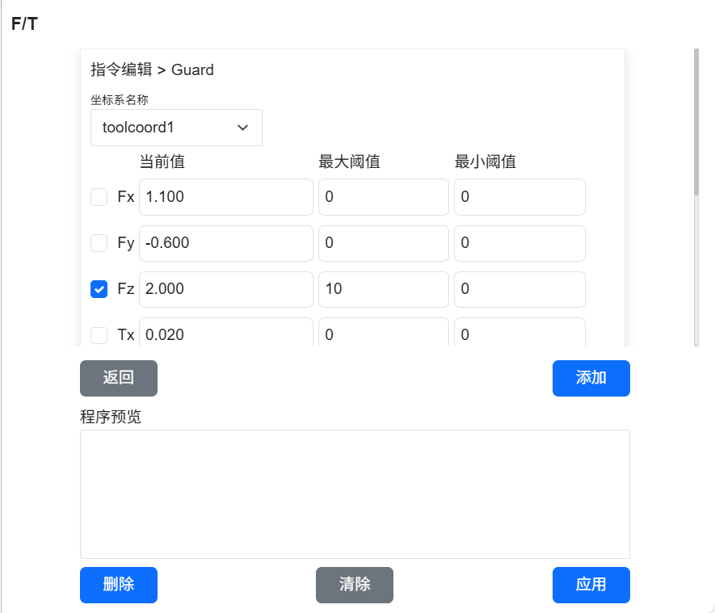

.. centered:: 圖表 6.4-6 FT_Guard指令參數配置

FT_Guard指令通常與運動指令搭配使用，可用PTP或Lin等指令，簡單示例如圖所示。

.. image:: base/051.png
   :width: 5in
   :align: center

.. centered:: 圖表 6.3-7 FT_Guard與運動指令結合示例

第一行為設定力感測器碰撞偵測開啟，最後一行為關閉力感測器碰撞偵測功能。

靜態下碰撞偵測
++++++++++++++++

靜態下碰撞偵測的設定步驟如下。

**Step1**：在「初始設定」->「基礎」->「關節」選單列下，點選「碰撞等級」，進入對應介面。

**Step2**：將靜態下碰撞偵測的開關打開，如下圖所示。當偵測到關節扭矩指令與扭矩回饋差距過大，機器人將進入拖動模式，避免產生持續的擠壓力。

.. centered:: 圖表 6.4-8 靜態下碰撞偵測

拖動前的力矩偵測功能
++++++++++++++++++++++++++++++++++++++

概述
***********************
在機器人進入拖動模式之前，需要進行力矩偵測。該功能的作用是防止由於操作者設定了錯誤的負載參數或選擇了錯誤的安裝方式，導致機器人進入拖動模式後出現上抬或下墜等異常現象。若偵測到關節力矩超出允許範圍，控制器會立即報錯，並禁止機器人進入拖動模式。

拖動前力矩偵測
**************************************

**Step1**：點選「初始設定」->「基礎」-> 「關節」->「碰撞等級」，進入碰撞等級設定介面，開啟拖動前力矩偵測功能，如圖2-1所示。

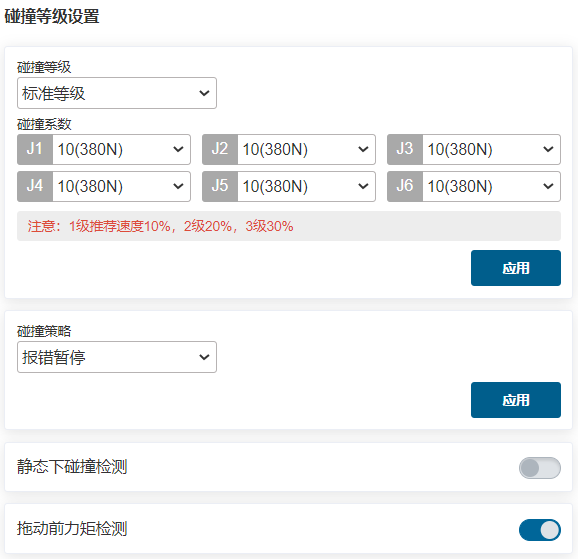

.. centered:: 圖表 6.4-9 拖動前力矩偵測功能開啟

**Step2**：切換拖動模式。Web介面透過點選機器人狀態區—機器人拖動狀態、長按按鈕盒「示教模式」按鈕、長按機器人末端拖動按鈕進入拖動模式，若控制器報錯且機器人未切換至拖動模式，如圖2-2所示，檢查機器人負載配置及安裝方式是否正確。

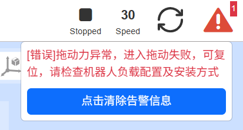

.. centered:: 圖表 6.4-10 力矩超限，控制器報錯

**Step3**：檢查負載配置及安裝方式。點選「初始設定」->「基礎」-> 「負載」->「末端」，查看web介面末端負載配置與實際安裝負載是否相同；點選「初始設定」->「基礎」-> 「安裝」->「自由安裝」，查看web介面安裝方式與實際安裝方式是否相同。

摩擦力補償
~~~~~~~~~~~~~

在「初始設定」->「基礎」->「關節」的選單列下，點選「摩擦力補償」進入摩擦力補償設定介面。

**摩擦力補償係數**：摩擦力補償所針對的使用場景僅在拖動模式下，摩擦力補償係數可設定範圍為0~1，數值越高，拖動時補償的力就越大。摩擦力補償係數根據安裝方式的不同需要單獨設定每個軸的補償係數。

**摩擦力補償開關**：使用者可根據實際機器人及使用習慣開啟或關閉摩擦力補償。

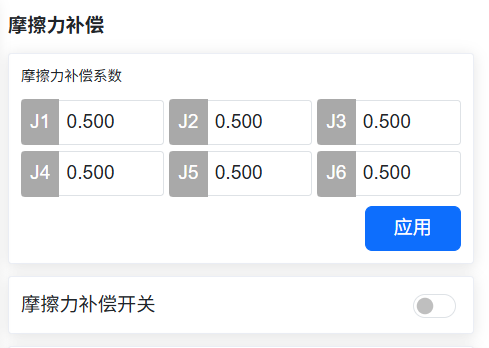

.. centered:: 圖表 6.4-11 摩擦力補償設定

.. important::
   機器人摩擦力補償功能需要謹慎使用，根據實際情況，設定合理的補償係數，一般推薦中間值0.5左右。

拖動力補償
~~~~~~~~~~~~~~~~~~~~~~~~~~~~~

概述
+++++++++++++++++++++++++++++

拖動力優化是在目前電流環拖動的基礎上，根據機器人運動趨勢，補償一定的力矩，用於克服建模不準確等引入的力矩誤差，使機器人拖動柔順。

機器人拖動力優化
++++++++++++++++++++++++++++++++++++++++++++++++++++++++++

拖動力優化功能需要確保軟體版本和韌體版本匹配，從而獲得較好體驗。

拖動力優化功能配置
***************************************************
**Step1**：登入web介面，依序點選「初始設定」->「基礎」->「關節」->「摩擦力補償」，進入拖動力補償設定模組，見圖所示。

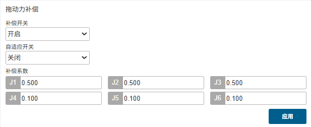

.. centered:: 圖表 6.4-12 拖動力補償設定模組

**Step2**：補償開關選擇「開啟」，自適應開關選擇「關閉」，配置參數如圖2-1所示，點選「應用」，功能開啟成功。按下拖動按鈕，就可以拖動機器人，拖動手感相較於功能開啟前，比較柔順。

**Step3**：參數調整，補償係數的範圍是[0-1]。若參數拖動略重，可以對應軸的參數進行加大調整；若拖動過程中出現不能停止現象或出現關節振動現象，需要對應軸的參數進行調小處理。同時，在拖動過程中會出現阻尼感，用於減速，使機器人停止。

**Step4**：若需關閉拖動力補償功能，可透過補償開關選擇「關閉」實現。

I/O設定
-----------

LUA程式暫停
~~~~~~~~~~~~~~~~~~~~~~~~~~~~~

機器人LUA程式運行中點選「暫停/恢復」按鈕可暫停LUA程式執行，機器人運行狀態變為「Pause」狀態。再次點選該按鈕，程式將從暫停的位置繼續執行，機器人運行狀態再次變為「Running」狀態。

所有啟動的後台程式在上述過程中也將同步暫停和恢復。不同類型的LUA指令在暫停時的表現有所差異：

**①運動類指令**：暫停時機器人立即停止運動，恢復時機器人恢復運動，並運動到該指令的目標位置。

**②SetDO、GetDI、GetInverseKinRef等邏輯指令**：在指令執行過程中觸發程式暫停，則該類指令執行完成後等待LUA程式退出暫停狀態再執行下一條指令。

**③WaitDI、ModbusMasterWaitDI等待指令**：在等待過程中觸發程式暫停，暫停時間不佔用等待逾時時間。

**④sleep_ms、WaitMs睡眠指令**：在睡眠過程中觸發程式暫停，暫停時間不佔用設定的睡眠時間。

.. image:: base/066.png
   :width: 4in
   :align: center

.. centered:: 圖表 6.5‑1 LUA程式暫停狀態

.. image:: base/067.png
   :width: 4in
   :align: center

.. centered:: 圖表 6.5‑2 LUA程式運行中狀態

I/O配置
~~~~~~~~~

點選選單列「初始設定」->「基礎」->「I/O設定」，點選「DI」、「DO」子選單進入DI和DO配置介面。其中控制箱CI0-CI7和CO0-CO7可配置，末端DI0和DI1可配置。

DI配置
++++++++++++++++

在生產中協作機器人需要連接外設時或因故障或者其他因素突然停止，需要輸出DO訊號，實現聲光報警提示，輸入可配置功能如下表格所示：

.. centered:: 表格 6.5‑1 控制箱輸入可配置功能

.. list-table::
   :widths: 15 30 100
   :header-rows: 1
   :align: center

   * - 功能編號
     - 功能名稱
     - 功能描述
   * - 0
     - 無
     - 無
   * - 1
     - 起弧成功訊號
     - 焊機起弧成功，機器人輸出起弧訊號至焊機
   * - 2
     - 焊接準備訊號
     - 機器人焊機準備成功訊號
   * - 3
     - 輸送帶偵測
     - 輸送帶偵測開關DI配置訊號
   * - 4
     - 暫停
     - 機器人焊接過程中暫停運動訊號
   * - 5
     - 恢復
     - 機器人焊接過程中電弧意外中斷或操作人員主動暫停焊接時會觸發焊接中斷，焊接中斷後外部向機器人輸入該訊號從無效變為有效時，機器人自動從原來中斷的位置自動恢復焊接
   * - 6
     - 啟動
     - 在DI配置可配置輸入中，選擇CIO為「啟動」，點選「應用」。可配置輸入有效狀態選擇「高電位有效」，則當CI0電位從低電位變為高電位時，觸發「啟動」功能，可啟動目前示教程式介面打開的程式，若未打開介面，則運行上次儲存的程式；可配置輸入有效狀態選擇「低電位有效」，則當CI0電位從高電位變為低電位時，觸發「啟動」功能，可啟動目前示教程式介面打開的程式，若未打開介面，則運行上次儲存的程式
   * - 7
     - 停止
     - 機器人焊接過程中停止運動訊號
   * - 8
     - 暫停/恢復
     - 機器人運動後，循環觸發暫停/恢復運動訊號
   * - 9
     - 啟動/停止
     - 機器人運動後，循環觸發啟動/停止運動訊號
   * - 10
     - 腳踏拖動開關
     - 機器人腳踏拖動開關運動訊號
   * - 11
     - 移至作業原點
     - 以目前機器人姿態作為作業原點，機器人運動至作業原點訊號
   * - 12
     - 手自動切換（脈衝訊號）
     - 在DI配置可配置輸入中，選擇CIO為「手自動切換（脈衝訊號）」，點選「應用」。可配置輸入有效狀態選擇「高電位有效」，則當CI0電位從低電位變為高電位時，觸發「手自動切換（脈衝訊號）」功能，機器人切換一次運行狀態；可配置輸入有效狀態選擇「低電位有效」，則當CI0電位從高電位變為低電位時，觸發「手自動切換（脈衝訊號）」功能，機器人切換一次運行狀態
   * - 13
     - 焊絲尋位成功
     - 機器人焊絲尋位成功訊號
   * - 14
     - 運動中斷
     - 機器人運動程式中斷訊號
   * - 15
     - 啟動主程式
     - 啟動機器人主程式訊號
   * - 16
     - 啟動倒帶
     - 機器人程式運行後，程式倒帶啟動訊號。
   * - 17
     - 啟動確認
     - 機器人程式啟動確認訊號
   * - 18
     - 雷射偵測訊號 X
     - 機器人雷射感測器偵測訊號X
   * - 19
     - 雷射偵測訊號 Y
     - 機器人雷射感測器偵測訊號Y
   * - 20
     - 外部緊急停止輸入訊號1
     - 機器人外部緊急停止輸入訊號1，①僅在QX下顯示。②LA下可在「初始設定」->「安全」->"I/O安全"->「DIO安全功能配置」介面進行相關配置
   * - 21
     - 外部緊急停止輸入訊號2
     - 機器人外部緊急停止輸入訊號2，①僅在QX下顯示。②LA下可在「初始設定」->「安全」->"I/O安全"->「DIO安全功能配置」介面進行相關配置
   * - 22
     - 一級縮減模式
     - 機器人一級縮減模式，①僅在QX下顯示。②LA下可在「初始設定」->「安全」->"I/O安全"->「DIO安全功能配置」介面進行相關配置
   * - 23
     - 二級縮減模式
     - 機器人二級縮減模式，①僅在QX下顯示。②LA下可在「初始設定」->「安全」->"I/O安全"->「DIO安全功能配置」介面進行相關配置
   * - 24
     - 三級縮減模式（停止）
     - 機器人三級縮減模式（停止），①僅在QX下顯示。②LA下可在「初始設定」->「安全」->"I/O安全"->「DIO安全功能配置」介面進行相關配置
   * - 25
     - 恢復焊接
     - 機器人發生焊接中斷後，恢復焊接操作訊號
   * - 26
     - 終止焊接
     - 機器人焊接過程中，終止焊接操作訊號
   * - 27
     - 輔助拖動開啟
     - 控制箱DI功能配置力感測器拖動功能開啟訊號
   * - 28
     - 輔助拖動關閉
     - 控制箱DI功能配置力感測器拖動功能關閉訊號
   * - 29
     - 輔助拖動開啟/關閉
     - 控制箱DI功能配置力感測器拖動功能，循環開啟/關閉訊號
   * - 30
     - 清除所有錯誤
     - 清除機器人觸發的所有錯誤訊號
   * - 31
     - 手自動切換（高低電位）
     - 在DI配置可配置輸入中，選擇CIO為「手自動切換（高低電位）」，點選「應用」。可配置輸入有效狀態選擇「高電位有效」，則當CI0切換為高電位時，觸發「手自動切換（高低電位）」功能，機器人狀態切換為自動狀態；可配置輸入有效狀態選擇「低電位有效」，則當CI0切換為低電位時，觸發「手自動切換（高低電位）」功能，機器人狀態切換為自動狀態
   * - 32
     - 致能
     - 控制機器人致能
   * - 33
     - 去致能
     - 控制機器人去致能
   * - 34
     - 致能/去致能(上升下降緣)
     - 訊號輸入有效狀態上升下降緣分別觸發機器人致能和去致能動作

末端輸入有效狀態
****************************************

.. centered:: 表格 6.5‑2 末端輸入可配置功能

.. list-table::
   :widths: 15 30 100
   :header-rows: 1
   :align: center

   * - 功能編號
     - 功能名稱
     - 功能描述
   * - 0
     - 無
     - 無
   * - 1
     - 拖動模式
     - 機器人末端啟用拖動模式信號
   * - 2
     - 示教點記錄
     - 機器人末端啟用示教點記錄信號，儲存當前機器人點位數據
   * - 3
     - 手自動切換
     - 機器人手自動切換觸發信號
   * - 4
     - TPD 軌跡記錄啟動/停止
     - 機器人開始TPD運動後，軌跡記錄啟動/停止信號
   * - 5
     - 暫停
     - 機器人運動暫停信號
   * - 6
     - 恢復
     - 機器人恢復運動信號
   * - 7
     - 啟動
     - 機器人程式啟動信號
   * - 8
     - 停止
     - 機器人程式停止信號
   * - 9
     - 暫停/恢復
     - 機器人運動後，循環觸發暫停/恢復運動信號
   * - 10
     - 啟動/停止
     - 機器人運動後，循環觸發啟動/停止運動信號
   * - 11
     - 輔助拖動開啟
     - 控制箱DI功能配置力感測器拖動功能開啟信號
   * - 12
     - 輔助拖動關閉
     - 控制箱DI功能配置力感測器拖動功能關閉信號
   * - 13
     - 輔助拖動開啟/關閉
     - 控制箱DI功能配置力感測器拖動功能，循環開啟/關閉信號

其中控制箱預設配置：CO0為1-機器人報錯，CO1為2-機器人運動中。

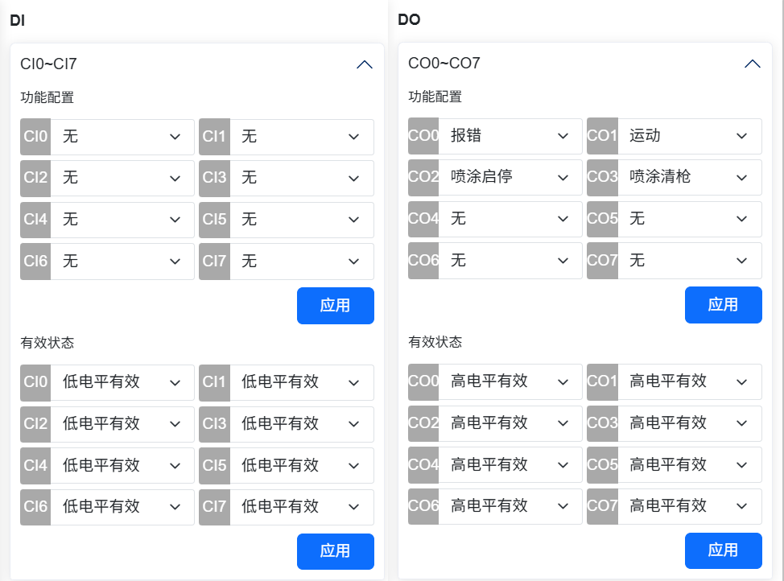

.. centered:: 圖表 6.5‑3 控制箱DI和DO配置

**末端DI預設配置**：DI0拖動示教，DI1示教點記錄。

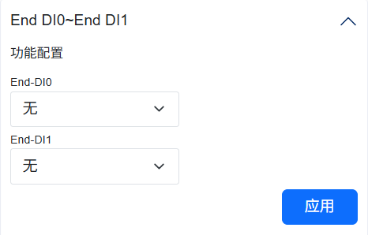

.. centered:: 圖表 6.5‑4 末端DI配置

配置完成後，可在對應狀態下，於控制箱I/O頁面中查看相應的輸出DO狀態。

.. important::
   已配置DI、DO禁止在程式編程中使用。

**縮減模式配置（一級、二級、三級）**：一級和二級縮減模式可以配置關節速度和末端TCP速度，三級縮減模式是停止可以不用配置速度。

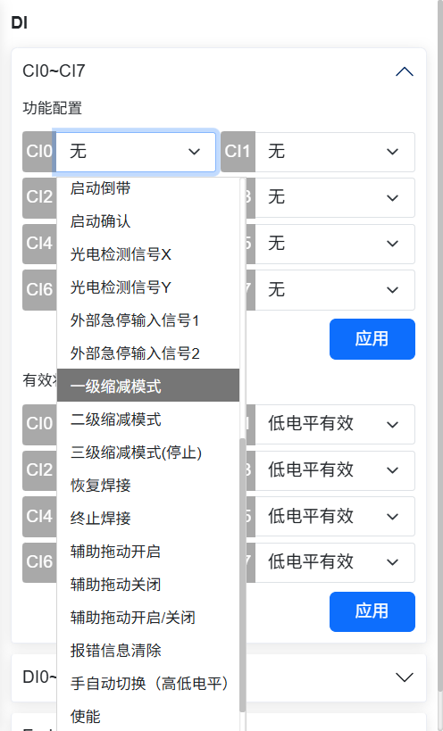

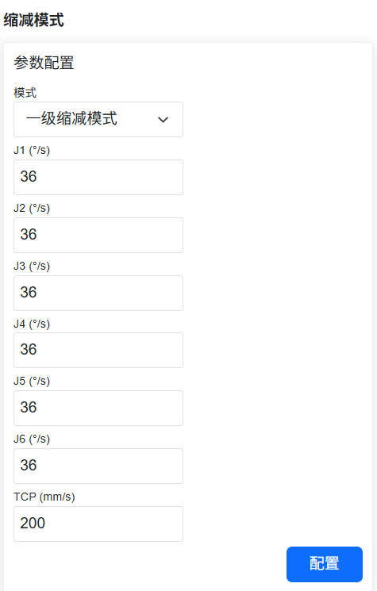

.. centered:: 圖表 6.5‑5 縮減模式配置

DO配置
++++++++++++++++

輸出可配置功能如下表格所示：

.. centered:: 表格 6.5‑3 控制箱輸出可配置功能

.. list-table::
   :widths: 15 30 100
   :header-rows: 1
   :align: center

   * - 功能編號
     - 功能名稱
     - 功能描述
   * - 0
     - 無
     - 無
   * - 1
     - 報錯
     - DO輸出報錯信號
   * - 2
     - 運動
     - 機器人運動信號
   * - 3
     - 噴塗啟停
     - 機器人噴塗啟停操作信號
   * - 4
     - 噴塗清槍
     - 機器人噴塗清槍操作信號
   * - 5
     - 起弧
     - 機器人控制焊機起弧的DO輸出端口，當機器人程式執行起弧指令時，焊機起弧對應DO輸出端口自動輸出有效
   * - 6
     - 送氣
     - 機器人控制焊機送氣的DO輸出端口，當機器人執行焊接送氣指令時，送氣對應的DO輸出端口自動輸出有效
   * - 7
     - 正向送絲
     - 機器人控制焊機正向送絲的DO輸出端口，當機器人執行正向送絲指令時，正向送絲對應的DO輸出端口自動輸出有效
   * - 8
     - 反向送絲
     - 機器人控制焊機反向送絲的DO輸出端口，當機器人執行反向送絲指令時，反向送絲對應的DO輸出端口自動輸出有效
   * - 9
     - JOB 輸入口 1
     - JOB輸入端口1信號
   * - 10
     - JOB 輸入口 2
     - JOB輸入端口2信號
   * - 11
     - JOB 輸入口 3
     - JOB輸入端口3信號
   * - 12
     - 傳送帶啟停
     - 傳送帶運動啟停操作信號
   * - 13
     - 暫停
     - 機器人運動暫停信號
   * - 14
     - 到達作業原點
     - 機器人運動至作業原點信號
   * - 15
     - 進入干涉區
     - 機器人運動至干涉區信號
   * - 16
     - 焊絲尋位啟停控制
     - 機器人焊絲尋位啟停控制操作信號
   * - 17
     - 機器人啟動完成
     - 機器人啟動完成信號
   * - 18
     - 程式啟動停止
     - 機器人運動程式啟動停止信號
   * - 19
     - 自動手動模式
     - 機器人手自動模式切換信號
   * - 20
     - 急停輸出信號1
     - 機器人急停輸出信號1，①僅在QX下顯示。②LA下可在“初始設定”->“安全”->"I/O安全"->“DIO安全功能配置”介面進行相關配置
   * - 21
     - 急停輸出信號2
     - 機器人急停輸出信號2，①僅在QX下顯示。②LA下可在“初始設定”->“安全”->"I/O安全"->“DIO安全功能配置”介面進行相關配置
   * - 22
     - Lua腳本程式執行/停止
     - 機器人運動Lua腳本程式執行/停止信號
   * - 23
     - 安全狀態輸出
     - 機器人安全狀態輸出信號，①僅在QX下顯示。②LA下可在“初始設定”->“安全”->"I/O安全"->“DIO安全功能配置”介面進行相關配置
   * - 24
     - 保護性停止狀態輸出
     - 機器人保護性停止狀態輸出信號，①僅在QX下顯示。②LA下可在“初始設定”->“安全”->"I/O安全"->“DIO安全功能配置”介面進行相關配置
   * - 25
     - 機器人運動中
     - 機器人運動中狀態信號，①僅在QX下顯示。②LA下可在“初始設定”->“安全”->"I/O安全"->“DIO安全功能配置”介面進行相關配置
   * - 26
     - 機器人縮減模式
     - 機器人縮減模式信號，①僅在QX下顯示。②LA下可在“初始設定”->“安全”->"I/O安全"->“DIO安全功能配置”介面進行相關配置
   * - 27
     - 機器人非縮減模式
     - 機器人非縮減模式信號，①僅在QX下顯示。②LA下可在“初始設定”->“安全”->"I/O安全"->“DIO安全功能配置”介面進行相關配置
   * - 28
     - 預留
     - 預留
   * - 29
     - 指令點錯誤
     - 關節指令點錯誤信號
   * - 30
     - 驅動器錯誤
     - 驅動器錯誤信號
   * - 31
     - 超出軟限位錯誤
     - 機器人超出軟限位錯誤信號，需調整相應關節軟限位
   * - 32
     - 碰撞錯誤
     - 機器人發生碰撞錯誤信號
   * - 33
     - 活動從站數量錯誤
     - 活動從站數量錯誤異常信號
   * - 34
     - 從站錯誤
     - 從站發生異常錯誤信號
   * - 35
     - I/O錯誤
     - I/O錯誤信號
   * - 36
     - 夾爪錯誤
     - 夾爪相關配置異常信號
   * - 37
     - 檔案錯誤
     - 配置檔案載入錯誤信號
   * - 38
     - 奇異位姿錯誤
     - 機器人運動過程中，運動至奇異位姿錯誤信號
   * - 39
     - 驅動器通信錯誤
     - 機器人驅動器通信異常錯誤信號
   * - 40
     - 參數錯誤
     - DO高低電平範圍錯誤錯誤
   * - 41
     - 外部軸超出軟限位錯誤
     - 外部軸1-4軸超出軟限位故障信號
   * - 42
     - 規劃與超時警告
     - 機器人規劃與超時警報狀態
   * - 43
     - 安全門警告
     - 安全門觸發狀態
   * - 44
     - 運動警告
     - 運動警告狀態
   * - 45
     - 干涉區警告
     - 機器人進入干涉區警告狀態
   * - 46
     - 安全牆警告
     - 機器人進入安全牆警告狀態
   * - 47
     - 機器人使能
     - 機器人使能狀態

控制箱DO高低有效可配置功能
~~~~~~~~~~~~~~~~~~~~~~~~~~~~~~~~~

概述
++++++++++++

控制箱上電啟動直到機器人使能的整個過程中，DO可根據具體使用場景配置為所需的輸出狀態，使用更加靈活和便捷。

操作步驟
++++++++++++

進入初始設定->基礎->I/O設定->DO介面，將上電期間控制箱DO輸出配置為所需的高/低電平。

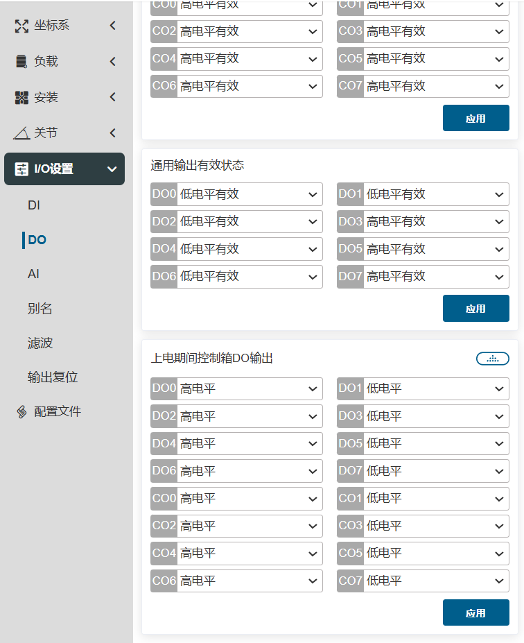

.. centered:: 圖表 6.5‑6 上電期間控制箱DO輸出配置

I/O別名配置
~~~~~~~~~~~~~~~~~~~~

點選選單列“初始設定”->“基礎”->“I/O設定”，點選“別名”子選單進入配置介面，根據實際使用場景配置控制箱和末端IO信號的給定含義名稱。配置成功後，有關IO信號內容的模組顯示對應別名，模組如下：

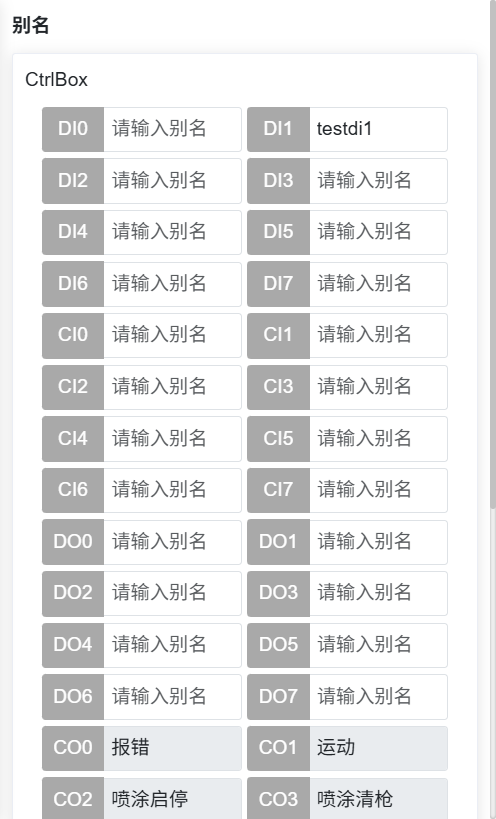

.. centered:: 圖表 6.5‑7 IO別名配置

I/O濾波
~~~~~~~~~~

點選選單列“初始設定”->“基礎”->“I/O設定”，點選“濾波”子選單進入IO濾波時間設定介面，濾波時間設定介面包括：

- 控制箱DI濾波時間
- 末端板DI濾波時間
- 控制箱AI0濾波時間
- 控制箱AI1濾波時間
- 末端板AI0濾波時間
- 按鈕盒DI濾波時間
- 擴充DI濾波時間
- 擴充AI0濾波時間
- 擴充AI1濾波時間
- 擴充AI2濾波時間
- 擴充AI3濾波時間
- Smart DI 濾波時間

使用者可以檢視所有濾波參數值表並根據自己的需求來設定對應的參數，選擇相應的參數輸入參數值設定即可。如下圖所示：

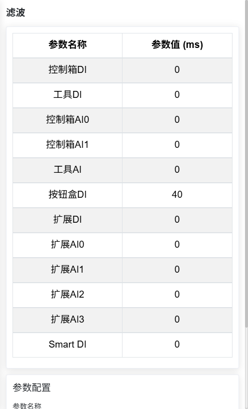

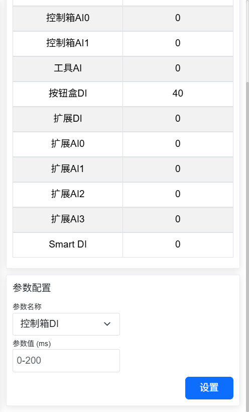

.. centered:: 圖表 6.5‑8 濾波介面

.. important::
   I/O濾波時間範圍為[0~200]，單位ms。

輸出復位配置
~~~~~~~~~~~~~

點選選單列“初始設定”->“基礎”->“I/O設定”，點選“輸出復位”子選單進入配置介面，根據實際使用過程中是否復位的需求，配置不同輸出在停止/暫停後是否需要復位。目前輸出包括：

- 控制箱DO
- 控制箱AO
- 末端版DO
- 末端版AO
- 擴充DO
- 擴充AO
- SmartTool DO

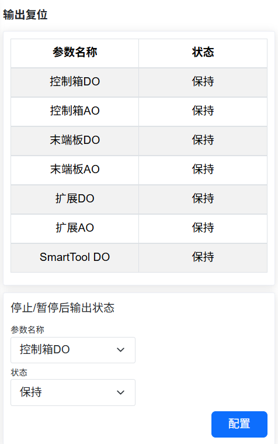

.. centered:: 圖表 6.5‑9 輸出復位配置

作業原點
-----------

在“初始設定”->“基礎”的選單列下，點選“作業原點”進入作業原點配置功能介面。

該頁面顯示作業原點的名稱和關節位置資訊，作業原點命名為固定名pHome，點選“設定”以當前機器人位姿作為作業原點，點選“移至該點”機器人會運動到作業原點。此外DI配置中增加移動至作業原點可配置選項，DO配置中增加到達作業原點可配置選項。

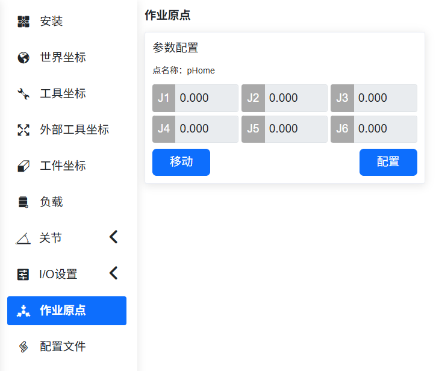

.. centered:: 圖表 6.6‑1 作業原點

.. 配置導入導出
.. ~~~~~~~~~~~~~~~

.. 在“初始設定”中的“機器人設定”的選單列下，點選“配置導入導出”進入配置導入導出介面。

.. **導入機器人配置檔案**：使用者導入檔名為user.config的機器人配置檔案，該檔案包含機器人設定功能中的各個參數。點選“選擇檔案”按鈕，選中修改完且內容符合規範的配置檔案，點選“導入”按鈕，當出現導入完成的提示時，檔案中的參數即被成功設定。

.. **導出機器人配置檔案**：點選“導出”按鈕，即可將機器人配置檔案user.config導出到本機。

.. **導入控制器資料庫**：使用者導入檔名為fr_controller_data.db的控制器資料庫檔案。點選“選擇檔案”按鈕，選中修改完且內容符合規範的資料庫檔案，點選“導入”按鈕，當出現導入完成的提示時，檔案中的參數即被成功設定。

.. **控制器資料庫**：點選“導出”按鈕，即可將機器人控制器資料庫檔案導出到本機。

.. .. image:: base/031.png
..    :width: 3in
..    :align: center

.. .. centered:: 圖表 6.5-1 配置導入導出

工具TCP自動標定
-----------------------------------

概述
~~~~~~~~~

機器人工具TCP（Tool Center Position, TCP）自動標定使用光電感測器設備（雙對管十字交叉型）對機器人工具TCP進行快速校準。透過在機器人運動期間統計工具在光電感測器設備中觸發I/O信號的時刻，建立機器人末端法蘭與工具座標系間的轉換關係來精確標定機器人工具座標系。

感測器設備座標系標定操作流程
~~~~~~~~~~~~~~~~~~~~~~~~~~~~~~~~~~~~~~~~~~~~~~

安裝機器人
++++++++++++++++++++++++++

安裝絕對定位精度在1.2 mm內的機器人於作業工作台，並在機器人末端法蘭安裝標定感測器設備座標系的專用特製工具。

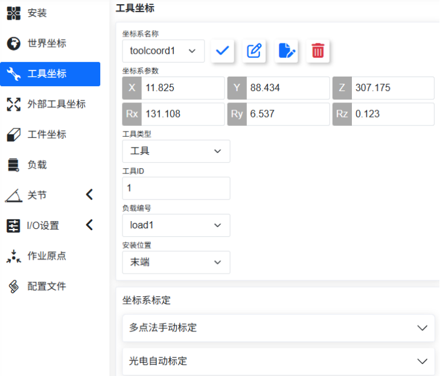

.. centered:: 圖表 6.7‑1 機器人安裝範例

安裝感測器設備
+++++++++++++++++++++++++++++++++

將光電感測器設備的兩組棕、藍及黑色信號線，分別接線至機器人控制箱兩組24V、0V和CI0、CI1端口（任意可用的可配置數位信號輸入端口即可），控制箱上電啟動機器人並點亮光電感測器設備的X、Y軸光束。

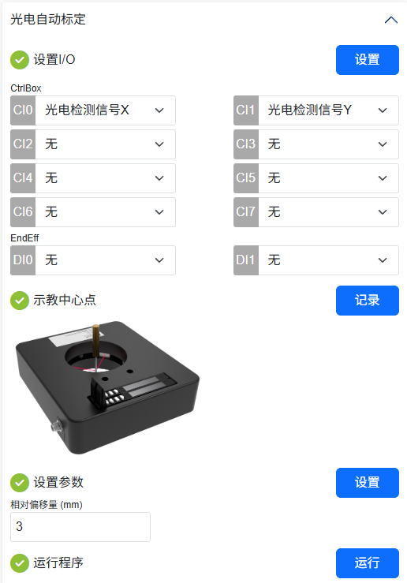

.. centered:: 圖表 6.7‑2 光電感測器設備範例

設定機器人工具TCP自動標定系統座標系
++++++++++++++++++++++++++++++++++++++++++++++++++++++++++

根據機器人工具TCP自動標定系統，首先粗定位光電感測器設備放置於機器人靈活工作空間，並使光電感測器設備座標系與機器人基座標系方位大致相同。

如上圖所示，其中單位軸、及屬於{b}表示為機器人基座標系、單位軸、及屬於{e}表示為末端法蘭座標系及單位軸、及屬於{s}為感測器座標系。

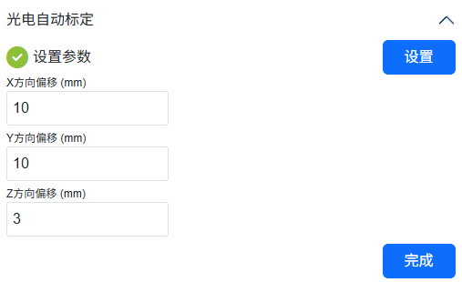

.. centered:: 圖表 6.7‑3 機器人工具TCP自動標定系統座標系設定

（1）將機器人末端法蘭的姿態調整為Rx、Ry及Rz分別為180°、0°及0°，並確保這一姿態在調整後的整個標定感測器設備座標系的運動過程中維持不變；

（2）使機器人工具TCP在機器人基座標系與感測器座標系的X、Y軸方向上共同執行MoveL運動；

（3）觀察機器人在運動期間，一旦滿足當光電感測器設備的X、Y軸光束始終維持觸發I/O信號的狀態，即可將光電感測器設備的安裝位置精確定位為當前所處位置。

根據Web介面標定感測器座標系
+++++++++++++++++++++++++++++++++++++++++

在機器人Web控制介面中，依次點選“初始設定”-“基礎”-“座標系”-“工具”，進入“工具座標系設定”介面；

在“座標系名稱”下拉選單中選擇參考座標系，並選擇相應的“工具類型”和“安裝位置”，然後點選“修改”，進入“修改精靈”介面；

選擇“光電自動標定”，進入光電自動標定介面，點選“配置”，進入“光電校準設備配置”介面，若當前存在以往設定，則點選“修改”。

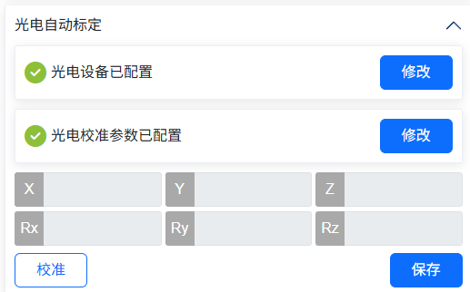

.. centered:: 圖表 6.7‑4 進入光電自動標定介面範例

設定I/O
***********************

選擇X軸光束和Y軸光束的控制箱輸入端口號，然後點選“設定”，設定成功後則會在“設定I/O”標識前出現綠色勾號標記。

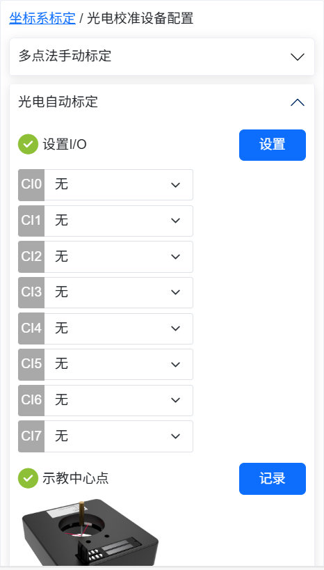

.. centered:: 圖表 6.7‑5 設定光電感測器設備的X、Y軸光束I/O端口範例

示教中心點
******************************

拖動機器人使工具TCP將光電感測器設備的X、Y軸光束I/O信號同時觸發，然後沿著基座標系Z+軸方向移至感測器設備量測平面（X、Y軸光束交匯處）上方5 mm附近。

.. warning:: 注意在此過程中，機器人末端法蘭姿態為Rx、Ry及Rz分別為180°、0°及0°保持不變，然後點選“記錄”，設定成功後則會在“示教中心點”標識前出現綠色勾號標記。

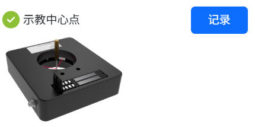

.. centered:: 圖表 6.7‑6 示教機器人工具TCP位於感測器設備量測平面中心

設定參數
****************************

設定“運動半徑”、“角速度”及“下移距離”三個自訂參數。

（1）“運動半徑”參數為機器人工具進行圓周運動的半徑，參考所用感測器設備的有效量測半徑為35 mm，建議設為“10-15 mm”，過大易使工具與感測器發生干涉、過小易使感測器X、Y軸光束I/O信號發生干涉；

（2）“角速度”參數為機器人工具進行圓周運動的勻速角速度，建議設為“10-40 deg/s”，過大易使工具末端產生衝擊顫動及感測器I/O信號的資料掉幀；

（3）“下移距離”參數為機器人執行兩次圓周運動的圓心間的歐式距離，參考所用感測器設備的有效量測高度為25 mm，建議設為“5-15mm”，過大易使工具與感測器發生干涉。

然後點選“設定”，設定成功後會在“設定參數”標識前出現綠色勾號標記。

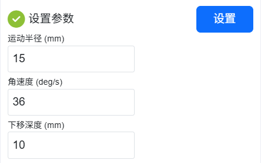

.. centered:: 圖表 6.7‑7 自訂參數設定範例

執行
*********************

在自動模式下，點選“執行”，即啟動感測器設備座標系的標定操作。待操作完成後，介面顯示出所標定感測器座標系的x、y及z座標值和Rx、Ry及Rz的姿態角度，然後點選“完成”儲存當前資料並退出目前介面。

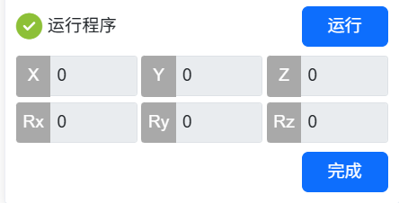

.. centered:: 圖表 6.7‑8 感測器設備座標系標定結果範例

.. warning:: 注意當前操作，建議機器人每次生產任務的生命週期（機器人電源關閉-啟動操作）均進行該操作，以防止作業期間出現的高頻振動導致感測器設備安裝位置發生小量偏移及誤操作導致的控制器內感測器設備座標系標定資料釋放而引發的錯誤。

工具座標系標定操作流程
~~~~~~~~~~~~~~~~~~~~~~~~~~~~~~~~~~~~~~~~~~~~~~

完成“光電校準設備配置”介面後，在該標識前出現綠色打勾標記，即表示為感測器設備座標系設定成功。卸下機器人末端法蘭的專用特製工具，安裝待標定的未知工具。點選“校準”，即啟動工具TCP自動標定操作，待操作完成後，介面顯示工具座標系標定結果。

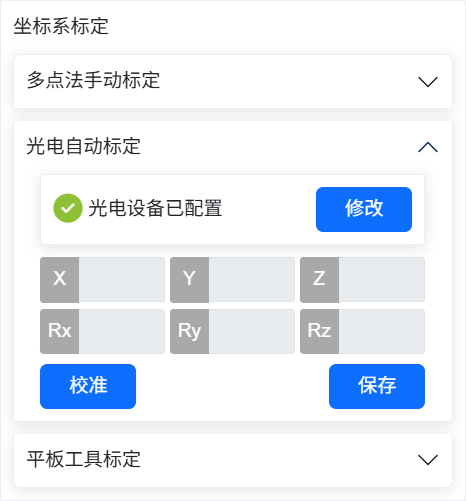

.. centered:: 圖表 6.7‑9 工具TCP標定結果範例

點選“儲存”，則在“目前工具座標系”介面的“座標系名稱”下拉選單中，所選擇的參考座標系中更新目前工具TCP的標定結果。

在“目前工具座標系”介面中，點選“應用”，則在目前參考工具座標系中應用目前工具TCP標定結果。

.. important::
  需要注意的是：

  （1）在點選“校準”前，可透過觀察標定的感測器設備座標系x、y及z座標結果是否與實際感測器設備安裝位置有明顯誤差來避免標定工具座標系過程中發生錯誤。若情況發生，原因則可能是機器人工具TCP自動標定系統座標系設定錯誤，需要調整感測器設備的安裝位置後，重新標定感測器設備座標系；

  （2）點選“校準”後，可透過觀察機器人執行兩次圓周運動後調整末端法蘭姿態是否發生明顯大幅度調整（>90°）來避免標定工具座標系過程中發生錯誤。若情況發生，原因則可能是“運動半徑”參數設定過小，導致感測器設備I/O信號發生干涉，則需要修改“運動半徑”參數後，重新點選“校準”；

  （3）建議標定工具類型末端為圓柱體、主軸方向與末端法蘭主軸方向大致平行、半徑在10 mm內，工具末端可量測長度應在5 - 15 mm內（非工具整體長度），則不易與感測器設備產生干涉。

基於平板工具的TCP標定
-----------------------------------

概述
~~~~~~~~~

使用“四點法”進行工具的TCP標定時，需要手動控制機器人運動，並透過肉眼實現點與點的精确重合，標定效率和精度都受操作人員熟練度的影響。

基於平板工具的TCP標定原理如下：利用機器人工具與平板任意位置多次觸碰，並透過建立標定模型以求解工具的TCP。整個標定過程自動完成，可提高標定的效率和減少對人工的依賴。

基於平板工具的TCP標定功能操作流程
~~~~~~~~~~~~~~~~~~~~~~~~~~~~~~~~~~~~

固定標定平板於機器人作業空間內，平板不可有晃動，且平板的導電性要好，將工具末端近似垂直標定板，並位於平板上方50mm處。

.. image:: base/043.png
   :width: 4in
   :align: center

.. centered:: 圖表 6.8‑1 標定佈局示意

依次點選“示教程式”—“程式編程”按鈕，選擇“FR_CalibrateTheToolTcpPlane.lua”標定檔案並開啟。

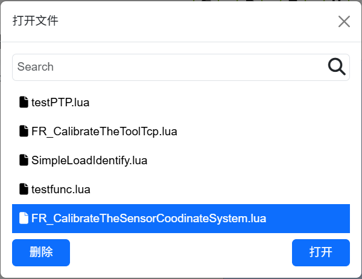

.. centered:: 圖表 6.8‑2 開啟標定檔案

依次點選“初始設定”->“基礎”->“座標系”—“工具”按鈕，會進入“目前座標系”介面。在“座標系名稱”中選擇要進行標定的座標系（以toolcord1座標系為例），點選“修改”按鈕，即可進入TCP標定方法選擇介面。

.. centered:: 圖表 6.8‑3 工具座標系設定

在“修改精靈”中，選擇“平板工具標定”，即可進入平板工具標定介面。

.. centered:: 圖表 6.8‑4 標定方法選擇

在“平板工具標定”介面中，點選“進入”按鈕，可以進行平板工具配置，點選“記錄”按鈕，記錄標定參考點。配置完成後，點選“完成”按鈕，將會返回“平板工具標定”介面。

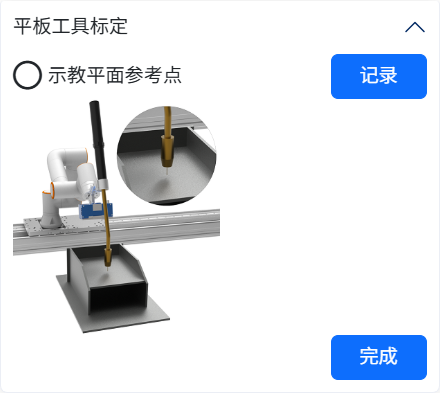

.. centered:: 圖表 6.8‑5 平板工具配置

在“平板工具標定”介面點選“執行”按鈕，機器人將自動進行工具的TCP標定，標定完成後，將顯示工具的TCP座標，點選“儲存”按鈕，會將標定結果返回到“目前工具座標系”介面中。

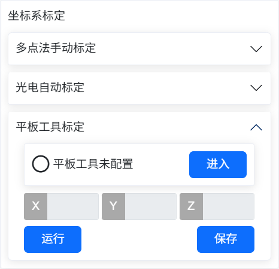

.. centered:: 圖表 6.8‑6 標定結果

在“目前工具座標系”介面點選“應用”按鈕，即可儲存工具的TCP標定結果並應用。

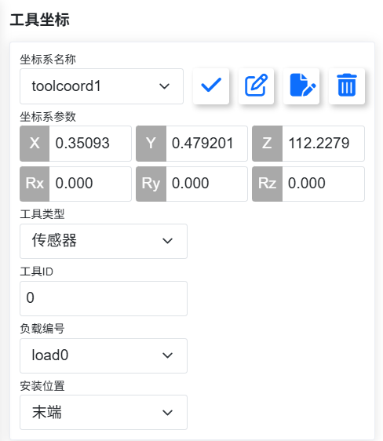

.. centered:: 圖表 6.8‑7 標定結果應用

控制箱模擬量回饋電弧追蹤功能
--------------------------------------------------------------

概述
~~~~~~~~~~~~~~~~

控制箱模擬量回饋電弧追蹤功能採集焊機電壓、電流模擬信號實現電弧追蹤補償，功能的實現由配置控制箱模擬量對應的AI、AO通道完成。

.. image:: base/059.png
   :width: 4in
   :align: center

.. centered:: 圖表 6.9‑1 基於模擬信號通信的電弧追蹤功能拓撲圖
.. centered:: a表示電腦；b表示機器人及控制箱；c表示焊機

控制箱模擬量AI配置流程
~~~~~~~~~~~~~~~~~~~~~~~~~~~~~~~~~~~~~~~~~~~~~~~~~~~~~~~~~~~~

在機器人Web控制介面，依次點選“初始設定”->“基礎”->“I/O設定”->“AI”，進入“AI配置”介面。

在“AI配置”介面的“電弧追蹤通道”欄，在“焊接電流控制AI”和“焊接電壓控制AI”下拉框，分別選擇“Ctrl-AI0”和“Ctrl-AI1”作為電流、電壓的模擬量通道，分別點選“配置”，完成控制箱模擬量AI配置。

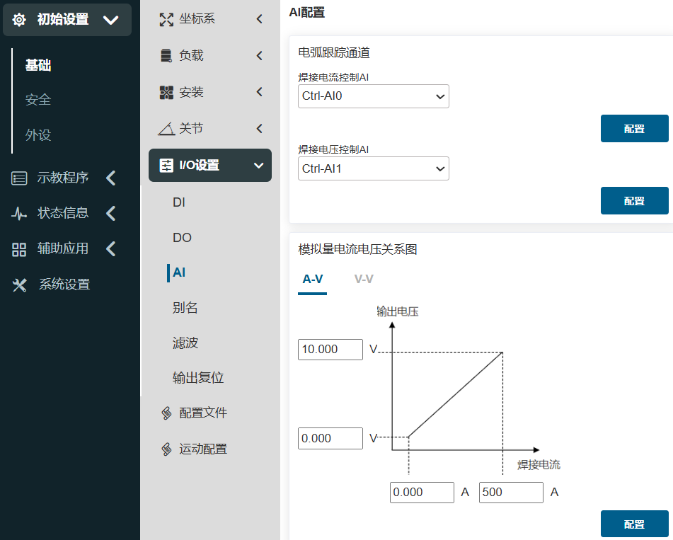

.. centered:: 圖表 6.9‑2 AI通道配置

在上圖所示AI通道配置中的“模擬量電流電壓關係圖”欄，“A-V”和“V-V”介面的參數配置，需參考所使用的焊機模擬量接收與輸出表/圖。

例如，配置控制箱電流模擬量AI的焊接電流的下限與上限分別為0A和500A；配置控制箱電流模擬量AI的輸出電壓的下限與上限分別為0V和5V，作為AI通道配置中的“模擬量電流電壓關係圖”欄的“A-V”介面的配置參數，點選“配置”，完成配置控制箱模擬量電流AI通道。

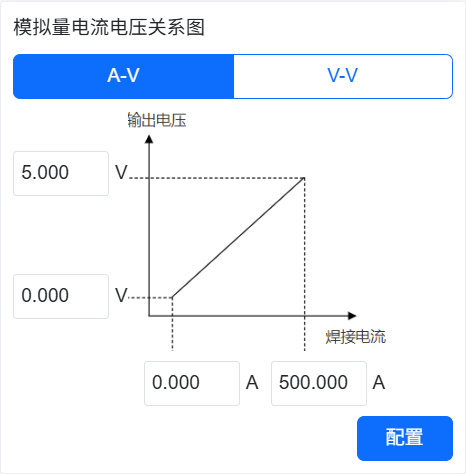

.. centered:: 圖表 6.9‑3 控制箱模擬量電流AI配置

例如，配置控制箱電壓模擬量AI的焊接電壓的下限與上限分別為0V和50V；配置控制箱電壓模擬量AI的輸出電壓的下限與上限分別為1.018V和10V，作為AI通道配置中“模擬量電流電壓關係圖”欄的“V-V”介面的配置參數，點選“配置”，完成配置控制箱模擬量電壓AI通道。

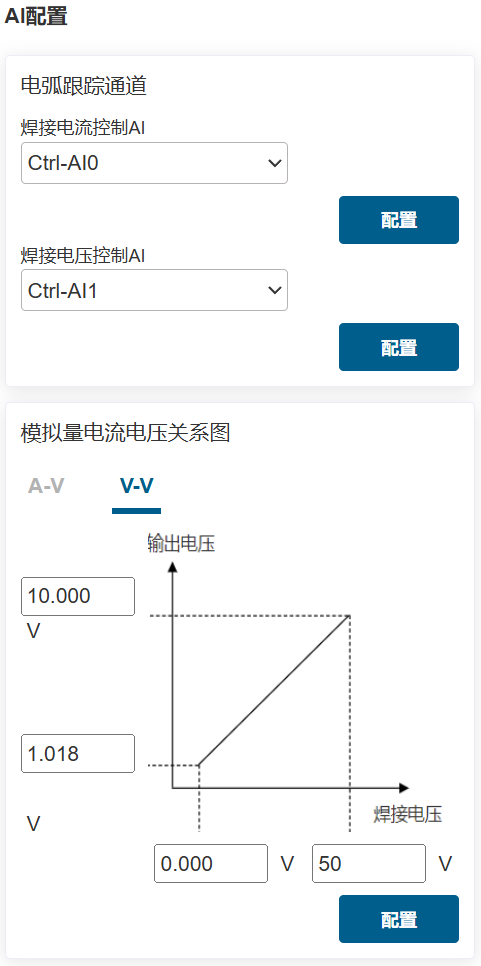

.. centered:: 圖表 6.9‑4 控制箱模擬量電壓AI配置

控制箱模擬量AO配置流程
~~~~~~~~~~~~~~~~~~~~~~~~~~~~~~~~~~~~~~~~~~~~~~~~~~~~~~~~~~~~~

在機器人Web控制介面，依次點選“初始設定”->“外設”->“焊機”，進入“焊機配置”介面。

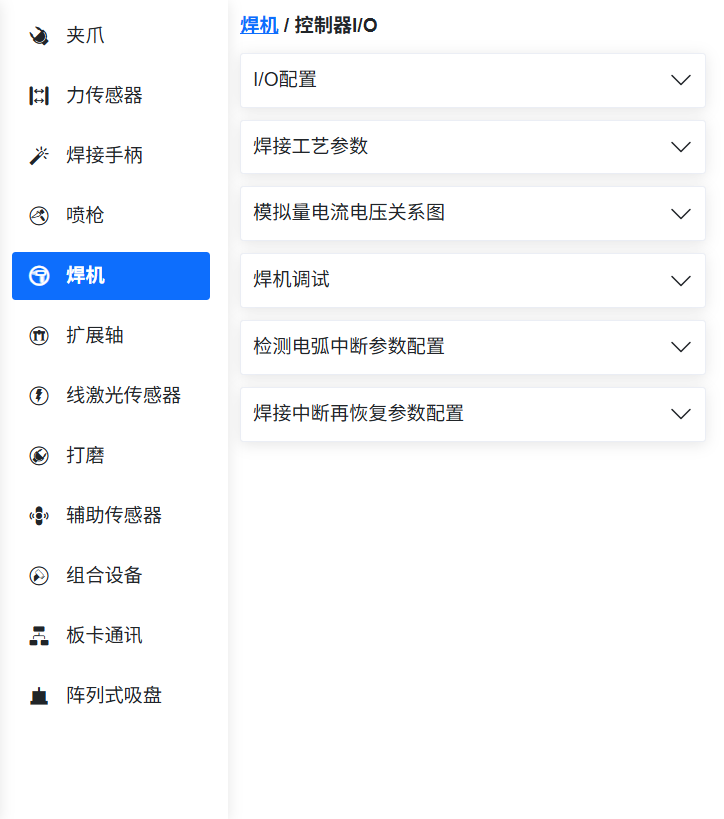

.. centered:: 圖表 6.9‑5 焊機配置

在“焊機配置”介面“焊接功能I/O配置”欄，“DI”和“DO”介面的參數配置，可以自訂配置控制箱CI、CO通道；在“控制類型”下拉框中選擇“控制器I/O”，進入配置控制器模擬量AO通道流程。

在“焊機配置”介面“模擬量電流電壓關係圖”欄，“A-V”和“V-V”介面的參數配置，需參考所使用的焊機模擬量接收與輸出表/圖。

例如，配置控制箱電流模擬量AO的焊接電流的下限與上限分別為0A和495A；配置控制箱電流模擬量AO的輸出電壓的下限與上限分別為1V和10V，作為控制箱AO通道配置中模擬量電流的配置參數，
並在“焊機電流控制AO”下拉框中選擇“Ctrl-AO0”，點選“配置”，完成配置控制箱模擬量電流AO通道。

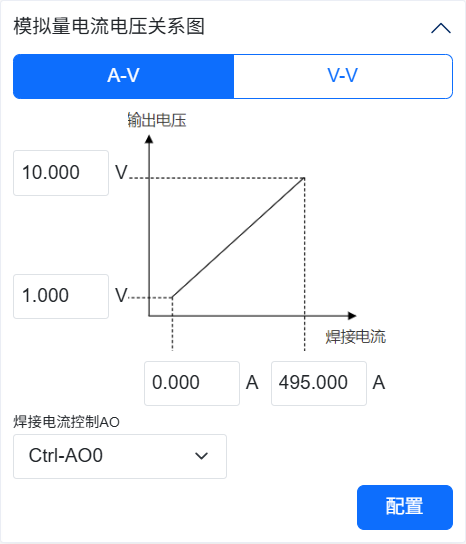

.. centered:: 圖表 6.9‑6 控制箱模擬量電流AO配置

例如，配置控制箱電壓模擬量AO的焊接電壓的下限與上限分別為10V和45V；配置控制箱電壓模擬量AO的輸出電壓的下限與上限分別為1V和10V，作為控制箱AO通道配置中模擬量電壓的配置參數。

並在“焊機電壓控制AO”下拉框中選擇“Ctrl-AO1”，點選“配置”，完成配置控制箱模擬量電壓AO通道。

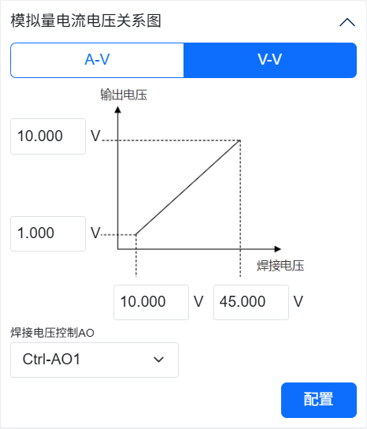

.. centered:: 圖表 6.9‑7 控制箱模擬量電壓AO配置

直線齒條導軌碰撞檢測
----------------------------------------------------------------------

概述
~~~~~~~~~~~~~~~~

直線齒條導軌碰撞檢測功能用於實現在非同步或同步運行時，導軌或機器人與環境物體發生碰撞時的報警並緊急停機。透過監控導軌轉矩回饋變化情況，基於設定閾值判斷是否發生碰撞，若發生則導軌立即停止運動，從而避免導軌及機器人對被撞物體施加持續力，可進一步提升人機協作安全性。

直線齒條導軌碰撞檢測功能
~~~~~~~~~~~~~~~~~~~~~~~~~~~~~~~~~~~~~~~~~~~~~~~~~~~~

直線齒條導軌碰撞檢測功能，需要在導軌啟動後執行 "Rail_Adaptation_Program.lua" 程式，確保功能可以適應不同的導軌及負載情況，從而獲取最佳的碰撞檢測性能。若未進行適應，則碰撞檢測性能將明顯下降，且觸發碰撞的外力較大。

直線齒條導軌參數設定並使能
+++++++++++++++++++++++++++++++++++++++++++++++++++++++++++++

**步驟1**：登入 web 介面，依序點擊「初始設定」→「外設」→「擴展軸」，進入擴展軸座標系設定模組，見圖 2-1 所示。

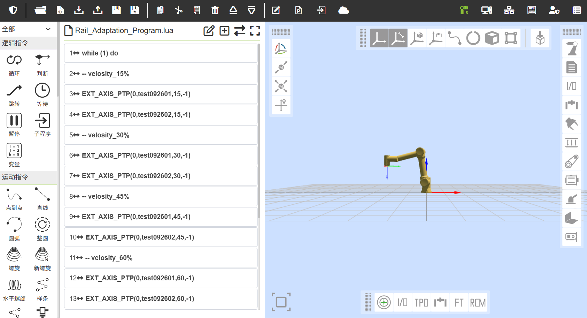

.. centered:: 圖表 6.10‑1 擴展軸座標系設定模組

**步驟2**：基於擴展軸與機器人的實際工作情況，進行參數設定並按需進行標定。在圖 2-1 中，點擊編輯，擴展軸座標系名稱設定為 "exaxis1"，方案選擇為 "0-單自由度直線滑軌"，擴展軸編號選擇為 "1"。若導軌與機器人僅非同步運行，則可不進行標定，若需同步運行，則必須進行標定，標定流程可參考相應使用者手冊或詢問專業人員。當參數設定完後，點擊「儲存」，並應用相應座標系，具體見圖 2-2 所示。

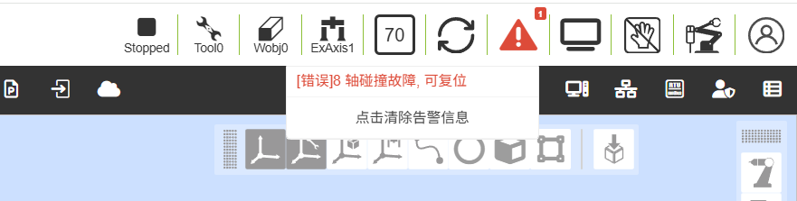

.. centered:: 圖表 6.10‑2 擴展軸座標系參數設定

**步驟3**：建立擴展軸與機器人的 UDP 通訊，並確保擴展軸 PLC 程式可將擴展軸驅動馬達經減速機後的轉矩回饋資料回傳至機器人控制器。依序點擊「初始設定」→「外設」→「擴展軸」，進入 UDP 通訊設定頁面，選擇步驟 2 中設定的座標系並應用，點擊 UDP 通訊設定「編輯」圖示，進行通訊設定並載入。其中，PLC 和筆記型電腦 IP 位址需與控制器網段一致，具體可見圖 2-3 所示。需要注意地是，需要確保擴展軸 PLC 程式可將擴展軸驅動馬達經減速機後的轉矩回饋資料回傳至機器人控制器，且取樣週期盡可能為 1ms，最大不能超過 4ms，否則碰撞檢測功能將失效。

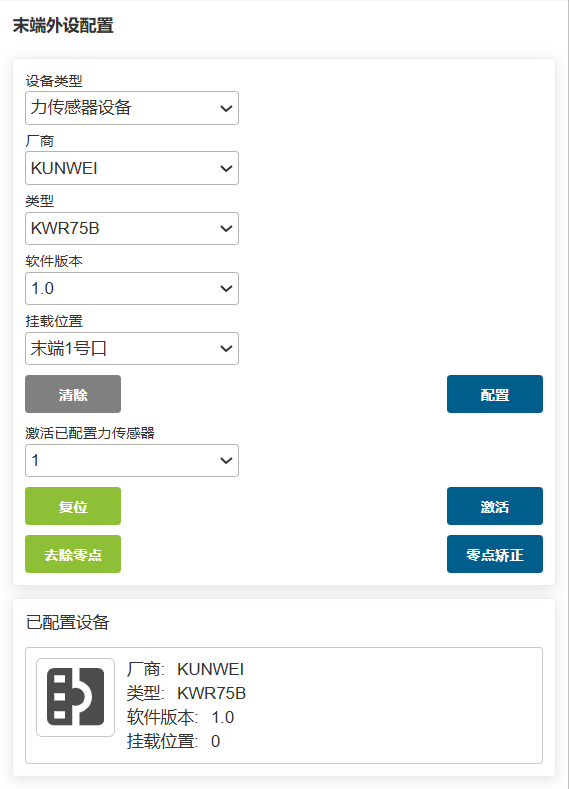

.. centered:: 圖表 6.10‑3 UDP 通訊設定頁面

**步驟4**：進行 UDP 擴展軸參數設定。UDP 擴展軸參數設定頁面見圖 2-4 所示，軸類型選擇為「直線導軌」，軸方向為「正」，其餘參數需按實際情況進行配置。其中，導程和編碼器解析度是固定不變的，受導軌影響；運行速度和加速度的上限受馬達性能影響，本功能測試所用上限即圖 2-4 中所示，使用者進行不同上限的配置時請聯絡專業人員。

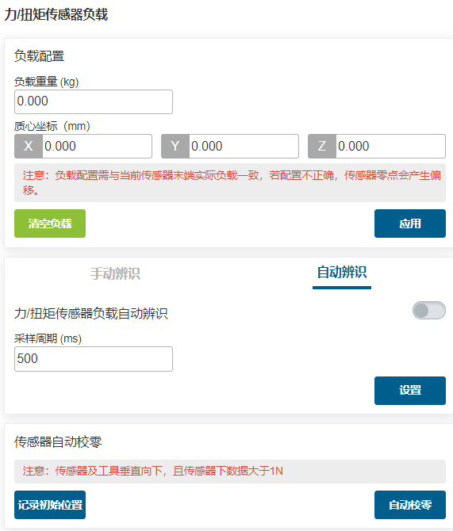

.. centered:: 圖表 6.10‑4 UDP 擴展軸參數設定

**步驟5**：使能直線齒條導軌，並移動導軌至起點。透過圖 2-4 中「去除使能」按鈕或圖 2-5 中的「伺服使能」按鈕使能直線齒條導軌。若導軌上滑塊遠離起點，則可透過「反向轉動」或「正向轉動」將滑塊移動至起點（需要注意的是，運行速度需要遠離 15%）。當移動到起點後，然後點擊「零點設定」並以「目前位置回零」方式進行回零。

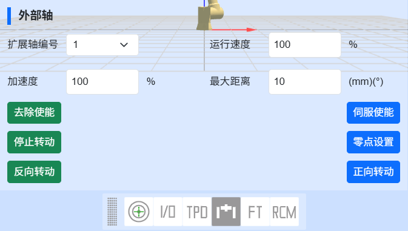

.. centered:: 圖表 6.10‑5 使能直線齒條導軌並移動

啟用直線齒條導軌碰撞檢測功能
+++++++++++++++++++++++++++++++++++++++++++++++++++++++++++++

**步驟1**：確保導軌及機器人安裝方式均為正裝。在開啟直線齒條導軌碰撞檢測功能前，需要檢查安裝方式是否為正裝。具體地，先確保導軌和機器人安裝方式為正裝，然後，依序點擊「初始設定」→「基礎」→「安裝」，進入自由安裝頁面，若「基座旋轉」和「基座傾斜」均為 0 則軟體設定為正裝，否則須將其改為 0，若不為 0 介面將提示錯誤，具體見圖 2-6 所示。

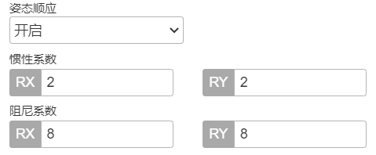

.. centered:: 圖表 6.10‑6 若安裝方式非正裝，將提示錯誤

**步驟2**：啟用直線齒條導軌碰撞檢測功能並設定參數。依序點擊「初始設定」→「基礎」→「關節」→「碰撞等級」，進入碰撞等級設定頁面。點擊「直線齒條導軌碰撞檢測」功能滑塊後，設定齒輪半徑及滑塊質量，其中齒輪半徑可由導程和減速比計算得到，滑塊質量不包括機器人及其攜帶的末端負載。導軌等級共 11 個選項，其中 Level1 最易觸發碰撞，Level10 則最難。控制器剛上電，未執行適應程式前，碰撞等級先設定為「關閉」。

.. image:: base/084.png
   :width: 4in
   :align: center

.. centered:: 圖表 6.10‑7 直線齒條導軌碰撞檢測功能

**步驟3**：執行 "Rail_Adaptation_Program.lua" 程式，從而適應目前導軌。控制器重啟後，均需執行 "Rail_Adaptation_Program.lua" 程式（目的是防止機器人類型等因素發生變更時影響導軌動態特性）。在執行程式前，需確保導軌碰撞等級為「關閉」，自動模式下，以介面速度 100% 運行 lua 程式，待程式執行一個循環後適應完成，可停止運行。

.. image:: base/085.png
   :width: 5in
   :align: center

.. centered:: 圖表 6.10‑8 執行 "Rail_Adaptation_Program.lua" 程式，從而適應目前導軌

**步驟4**：合理設定導軌碰撞等級並執行任務。使用者可根據馬達驅動器性能及任務運行速度合理設定導軌碰撞等級。若導軌與機器人為非同步運行，當碰撞機器人或導軌時可觸發「8軸碰撞故障，可復位」，此時，導軌停止運行，具體見圖 2-9 所示。若導軌與機器人為同步運行時，碰撞機器人可觸發警報，並使得導軌停止運行，機器人則按設定碰撞策略進行反應。

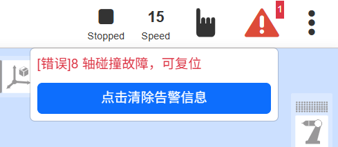

.. centered:: 圖表 6.10‑9 導軌觸發碰撞故障

力感測器帶載校零及開放姿態順應的導納參數
------------------------------------------------------------------------------------------

概述
~~~~~~~~~~~~~~~~

力感測器帶載校零功能是用於實現機器人帶著快換頭，在不拆除快換頭情況，更換負載時可快速清除感測器的零漂資料：開放姿態順應時的導納參數，用於客戶根據恆力控制中實際力矩的大小進行姿態的調節。

力感測器帶載校零
~~~~~~~~~~~~~~~~~~~~~~~~~~~~~~~~

**步驟1**：安裝並啟動力感測器。在「初始設定」->「外設」->「力感測器」的功能表欄下，點擊「已適配裝置」進入設定介面。力感測器設定完成後，選擇設定完成的力感測器編號，點擊「復位」按鈕，頁面彈出命令傳送成功後，再點擊「啟動」按鈕，可查看力感測器資訊表中的啟動狀態，來判斷是否啟動成功；此外，力感測器會有初始值，使用者根據使用需求選擇「零點校正」和「去除零點」，如圖 2-1 所示。力感測器零點校正需要確保力感測器水平垂直向下，且感測器下未配置負載。

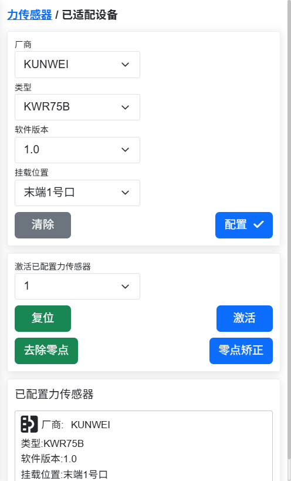

.. centered:: 圖表 6.11‑1 力感測器配置資訊

**步驟2**：力感測器負載辨識。在「初始設定」->「基礎」->「負載」功能表欄下，點擊「自動辨識」，進入力/扭矩感測器負載介面。進行感測器自動校零，記錄初始位置後，切換機器人為自動模式，點擊「自動校零」，如圖 2-2 所示。

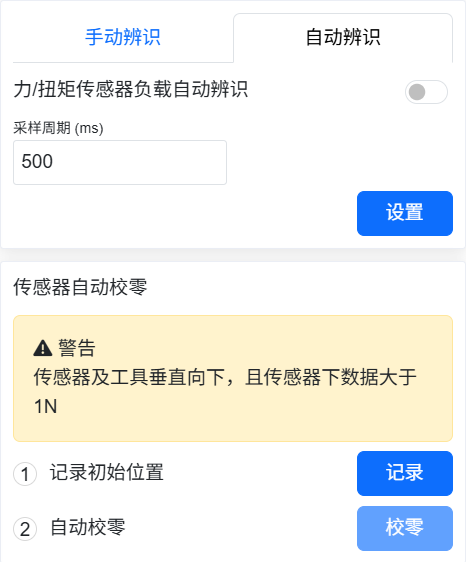

.. centered:: 圖表 6.11‑2 力感測器負載辨識

**步驟3**：若力感測器末端實際負載拆換，在負載配置模組輸入負載重量及質心座標，點擊「應用」更新負載配置並完成力感測器帶載校零。

開放姿態順應的導納參數
~~~~~~~~~~~~~~~~~~~~~~~~~~~~~~~~~~~~~~~~~~~~~~~~~~~~~~~~~~~~~~~~

**步驟1**：點擊「初始設定」->「基礎」-> 「工具座標」，進入工具座標系設定介面，選擇「座標系名稱」並設定末端工具對應的座標系參數，如圖 3-1 所示。

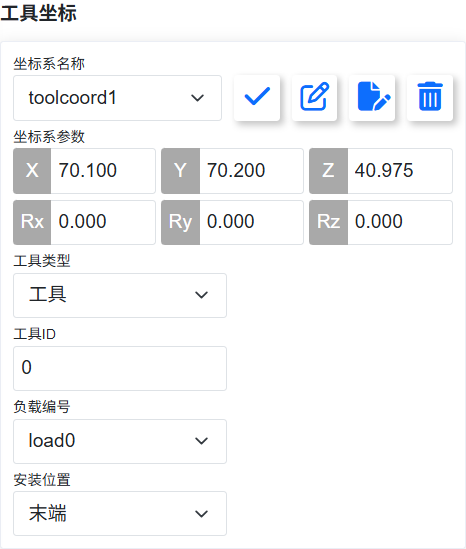

.. centered:: 圖表 6.11‑3 工具座標系設定

**步驟2**：點擊「示教程式」->「程式設計」，編寫恆力控制 lua 腳本，選擇「力控集」->「Control」，新增力控運動指令，姿態順應設定「開啟」，設定慣性係數及阻尼係數，最大調整角度設定為姿態順應角度的閾值，如圖 3-2 所示。

.. centered:: 圖表 6.11‑4 開放姿態順應的導納參數

**步驟3**：web 介面點擊「FT」，設定力感測器參考座標系，選擇參考座標系為「自訂座標系」並設定對應的座標系參數為 "0"，如圖 3-3 所示。

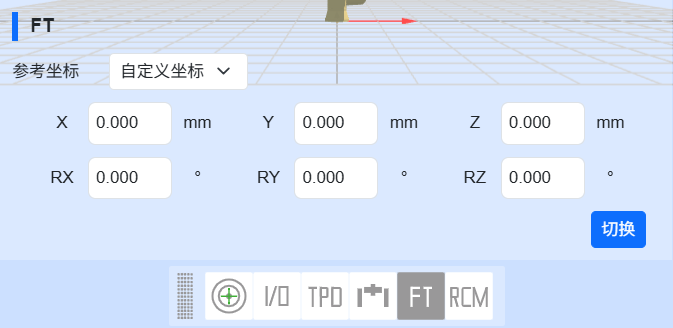

.. centered:: 圖表 6.11‑5 設定力感測器的參考座標系

**步驟4**：運行腳本，查看姿態順應效果，慣性參數調節加速度響應和抗擾能力，慣性越大，機器人遲滯越明顯；阻尼係數影響姿態順應時的平滑度，阻尼越大，姿態順應越困難。
