程式設計 
===============

.. toctree:: 
   :maxdepth: 6

簡介
~~~~~~~

點選左側指令可以為程式樹新增程式節點。程式運行時，目前執行的程式節點綠色高亮顯示。

在手動模式下，點擊節點右側第一個圖示可以使機器人單獨執行該指令，第二個圖示為編輯該節點內容。

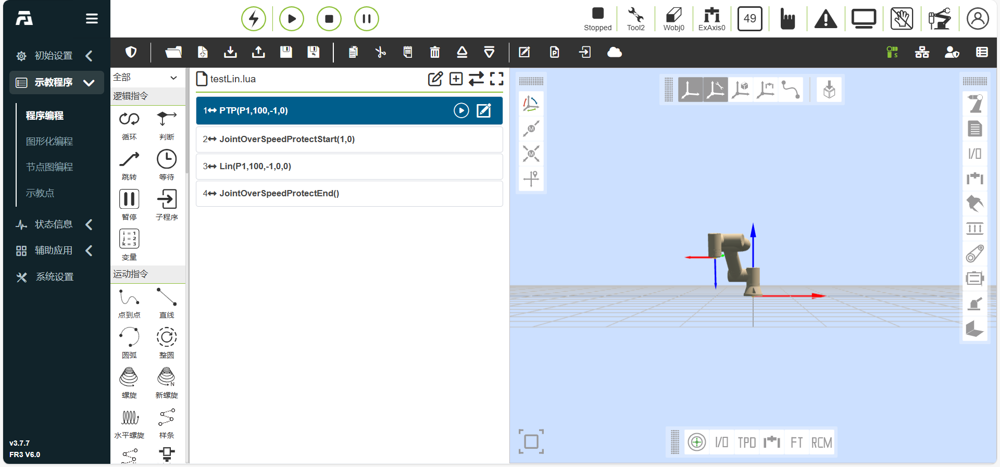

.. centered:: 圖表 9.1-1 程式樹介面

點選「⇄」切換模式，可以將示教程序文字變成編輯狀態。

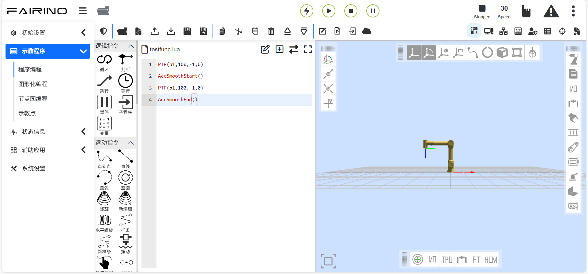

.. centered:: 圖表 9.1‑2 示教程序編輯狀態

程式名稱右側圖示說明如下：

.. note:: 
   .. image:: coding/003.png
      :height: 0.75in
      :align: left

   名稱：**展開/縮放**

   作用：展開/縮放程式樹介面

.. note:: 
   .. image:: coding/004.png
      :height: 0.75in
      :align: left

   名稱：**新增示教點**

   作用：新增目前程式的局部示教點

.. note:: 
   .. image:: coding/005.png
      :height: 0.75in
      :align: left

   名稱：**重新命名**
   
   作用：重新命名目前程式

工具列
~~~~~~~~~~

使用程式樹頂部的工具列修改程式樹。

.. note:: 
   .. image:: coding/006.png
      :height: 0.75in
      :align: left

   名稱：**打開**

   作用：開啟使用者程式文件

.. note:: 
   .. image:: coding/007.png
      :height: 0.75in
      :align: left

   名稱：**新建**

   作用：選擇範本新建程式文件
   
.. note:: 
   .. image:: coding/008.png
      :height: 0.75in
      :align: left

   名稱：**導入**

   作用：匯入檔案到使用者程式資料夾中

.. note:: 
   .. image:: coding/009.png
      :height: 0.75in
      :align: left

   名稱：**導出**

   作用：匯出使用者程式文件到本地點。

.. note:: 
   .. image:: coding/010.png
      :height: 0.75in
      :align: left

   名稱：**儲存**

   作用：儲存文件編輯內容

.. note:: 
   .. image:: coding/011.png
      :height: 0.75in
      :align: left

   名稱：**另存為**

   作用：給檔案重新命名存放到使用者程式或範本程式資料夾中。

.. note:: 
   .. image:: coding/012.png
      :height: 0.75in
      :align: left

   名稱：**複製**

   作用：複製一個節點，並允許將其用於其他操作（例如：將其貼上到程式樹的其他位置）。

.. note:: 
   .. image:: coding/013.png
      :height: 0.75in
      :align: left

   名稱：**貼上**

   作用：允許您貼上先前剪下或複製的節點。

.. note:: 
   .. image:: coding/014.png
      :height: 0.75in
      :align: left

   名稱：**剪切**

   作用：剪下一個節點，並允許將其用於其他操作（例如：將其貼到程式樹的其他位置）。

.. note:: 
   .. image:: coding/015.png
      :height: 0.75in
      :align: left

   名稱：**刪除**

   作用：從程式樹中刪除一個節點。

.. note:: 
   .. image:: coding/016.png
      :height: 0.75in
      :align: left

   名稱：**刪除**

   作用：從程式樹中刪除一個節點。

.. note:: 
   .. image:: coding/017.png
      :height: 0.75in
      :align: left

   名稱：**下移**

   作用：向下移動該節點。

.. note:: 
   .. image:: coding/018.png
      :height: 0.75in
      :align: left

   名稱：**切換編輯模式**

   作用：程式樹模式和lua編輯模式互相切換。

頂部右側圖示說明如下：

.. note:: 
   .. image:: coding/240.png
      :height: 0.75in
      :align: left

   名稱：**程式編程新增/編輯**

   作用：新增/編輯目前程式命令的內容

.. note:: 
   .. image:: coding/241.png
      :height: 0.75in
      :align: left

   名稱：**機器人模型**

   作用：返回機器人3D模型介面

.. note:: 
   .. image:: coding/242.png
      :height: 0.75in
      :align: left

   名稱：**NewDofile子程式介面**

   作用：當程式指令中存在NewDofile指令時，點選進入選擇子程序名稱查看子程序內容。

.. note:: 
   .. image:: coding/243.png
      :height: 0.75in
      :align: left

   名稱：**Modbus TCP設定**

   作用：配置Modbus TCP通訊的參數

.. note:: 
   .. image:: coding/244.png
      :height: 0.75in
      :align: left

   名稱：**Modbus TCP設定**

   作用：配置Modbus TCP通訊的參數

.. note:: 
   .. image:: coding/245.png
      :height: 0.75in
      :align: left

   名稱：**Modbus TCP設定**

   作用：配置Modbus TCP通訊的參數

程式命令
~~~~~~~~~~~

左側主要是程式指令的添加，點選各關鍵字上方圖示進入右側程式指令添加的詳細介面。程序命令加入文件的操作主要分為兩種：

- 1、開啟相關指令點選應用按鍵即可將該指令加入程式；
- 2.先點選「新增」按鍵，此時指令並未儲存到程式檔案中，需要再點選「應用」方可將指令儲存到檔案中。

第二種方式多出現在同類型指令多條下發的情況，我們對該類型命令增加添加按鍵和顯示已添加指令內容功能，點擊添加按鍵可添加一條指令，已添加指令顯示所有已添加的指令，點選「應用」即可將新增的指令儲存到右側已開啟的檔案中。

邏輯指令介面
~~~~~~~~~~~~~

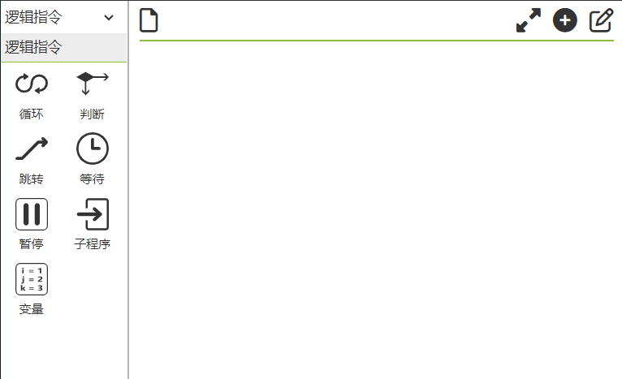

.. centered:: 圖表 9.4 邏輯指令介面

循環命令
++++++++++++++++

點選「循環」圖示進入While指令編輯介面。

選擇While指令的循環場景，場景如下：

- 始終循環
- 有限次數循環：輸入循環次數與變數名稱
- 表達式為真時循環：點選輸入框彈出表達式編輯器，根據使用情形選擇對應表達式

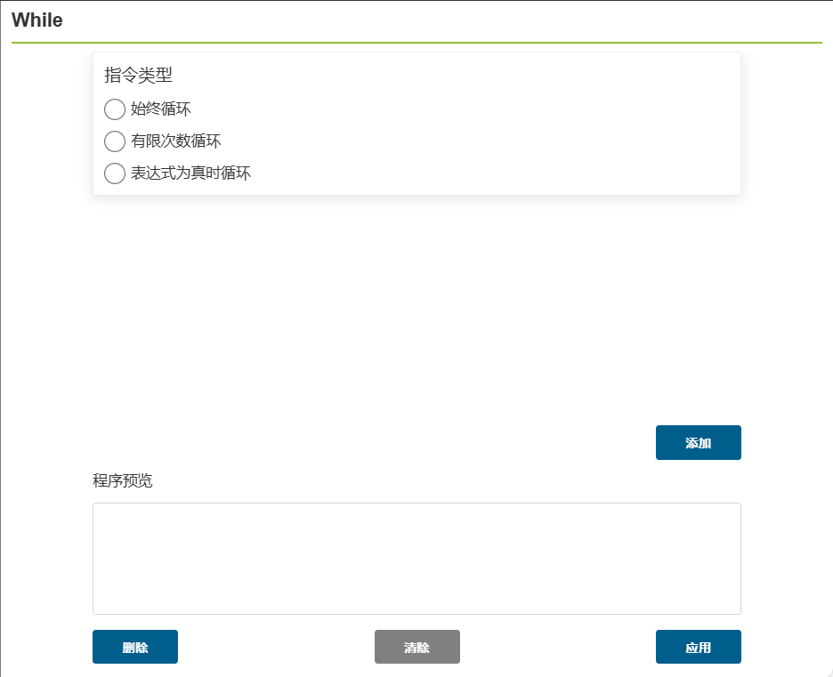

.. centered:: 圖表 9.4-1-1 While指令介面

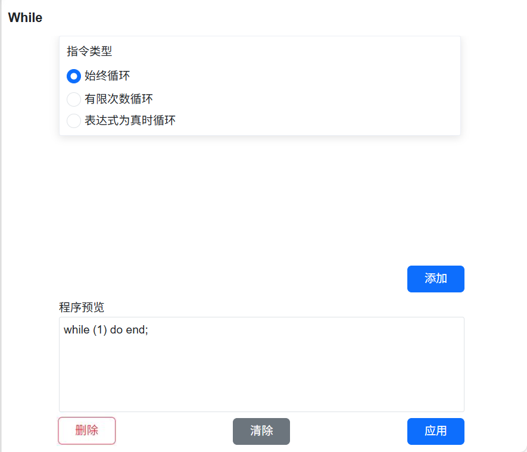

.. centered:: 圖表 9.4-1-2 While指令——始終循環

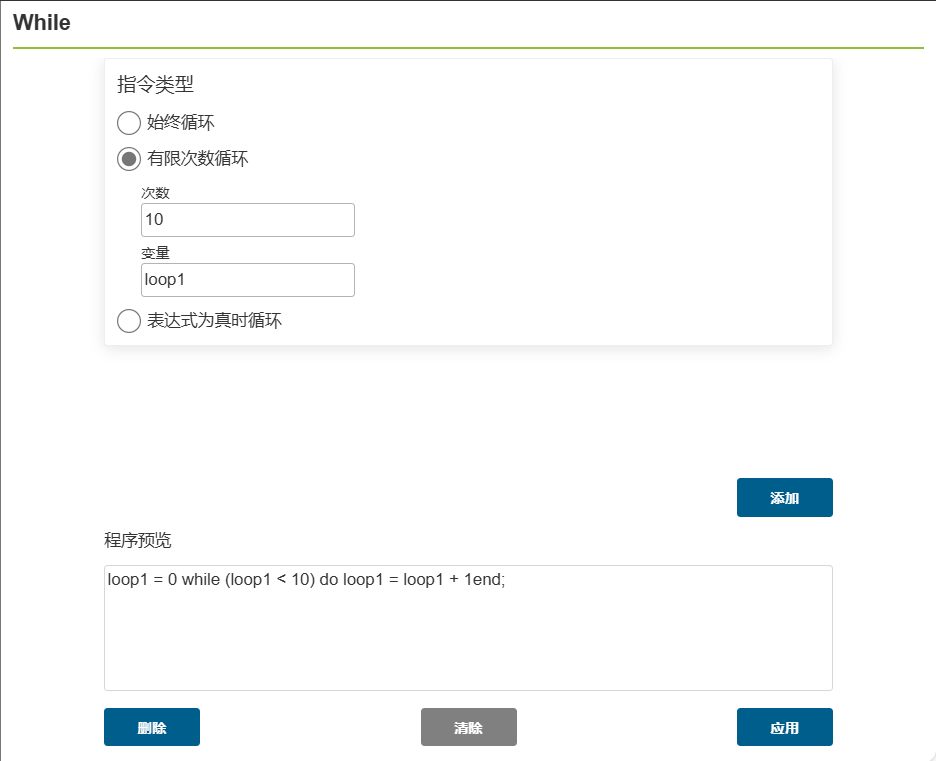

.. centered:: 圖表 9.4-1-3 While指令——有限次數循環

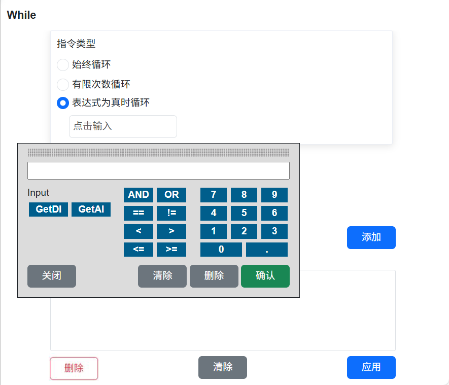

.. centered:: 圖表 9.4-1-4 While指令——表達式編輯器

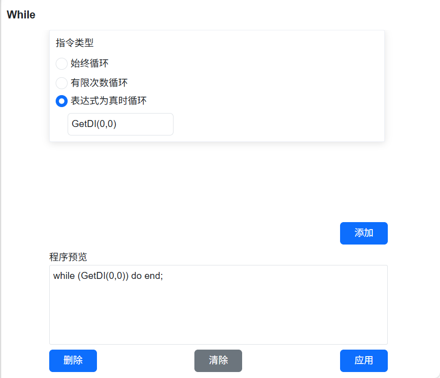

.. centered:: 圖表 9.4-1-5 While指令——表達式為真時循環

為方便操作，可任意輸入do內容，在程式中編輯其他指令插入取代。

判斷命令
++++++++++++++++

點選「判斷」按鈕進入if…else指令編輯介面。

此指令包含以下按鈕：

- 新增else if：當不存在「else」表達式時，點擊該按鈕新增「else if」表達式
- 移除else if：當存在「else if」表達式時，點選該按鈕刪除「else if」表達式
- 新增 else：點擊該按鈕新增「else」表達式
- 移除else：點選該按鈕刪除「else」表達式

點選對應按鈕新增後，點選輸入框彈出表達式編輯器，根據使用情形選擇對應表達式。新增完畢後點選「新增」、「應用」即可。

指令需要一定編程基礎，如需協助，請聯絡我們。

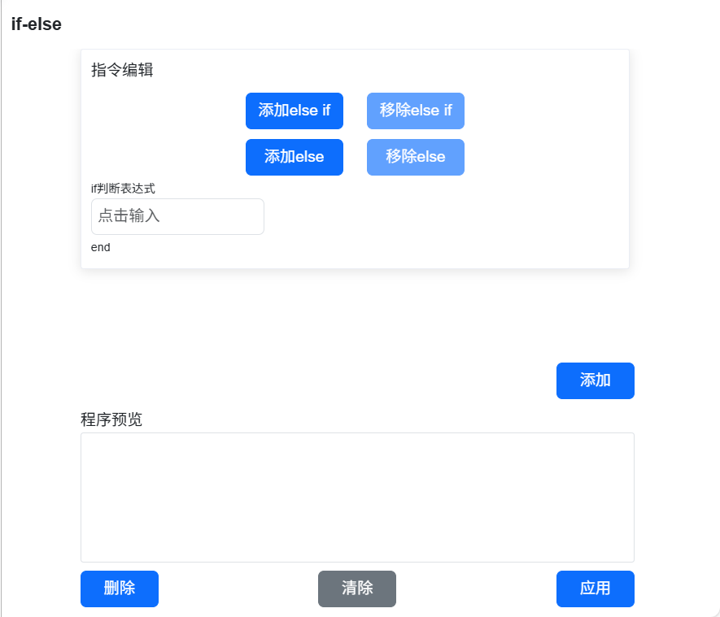

.. centered:: 圖表 9.4-2 if…else指令介面

跳躍命令
++++++++++++++++

點選「跳轉」按鈕進入Goto指令編輯介面。

Goto指令為跳轉指令，在右側輸入框輸入語句，編輯完畢後點選「新增」、「應用」即可。 （指令需要一定程式設計基礎，如需協助，請聯絡我們）

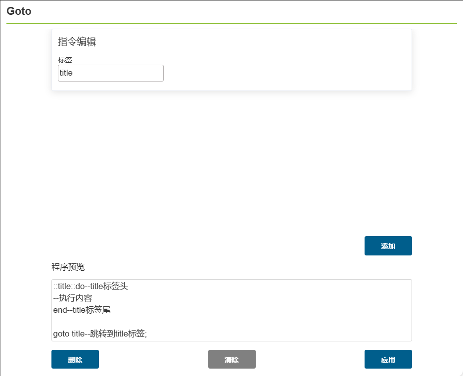

.. centered:: 圖表 9.4-3 Goto指令介面

等待命令
++++++++++++++++

點選「等待」圖示進入Wait指令編輯介面。

該指令為延時指令，分為「WaitMs」、「WaitDI」和「WaitAI」三個部分。

「WaitTime」指令延時等待時間單位為毫秒，輸入需要等待的毫秒數，點選「新增」、「應用」即可。

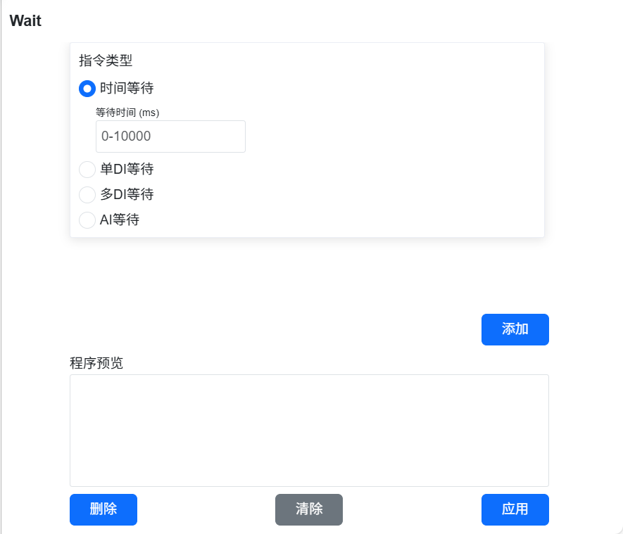

.. centered:: 圖表 9.4-4 WaitTime指令介面

「WaitDI」指令，即單DI等待，選擇需要等待的IO連接埠號碼、等待狀態、等待最大時間和等待逾時處理方式，點選「新增」、「應用」即可。

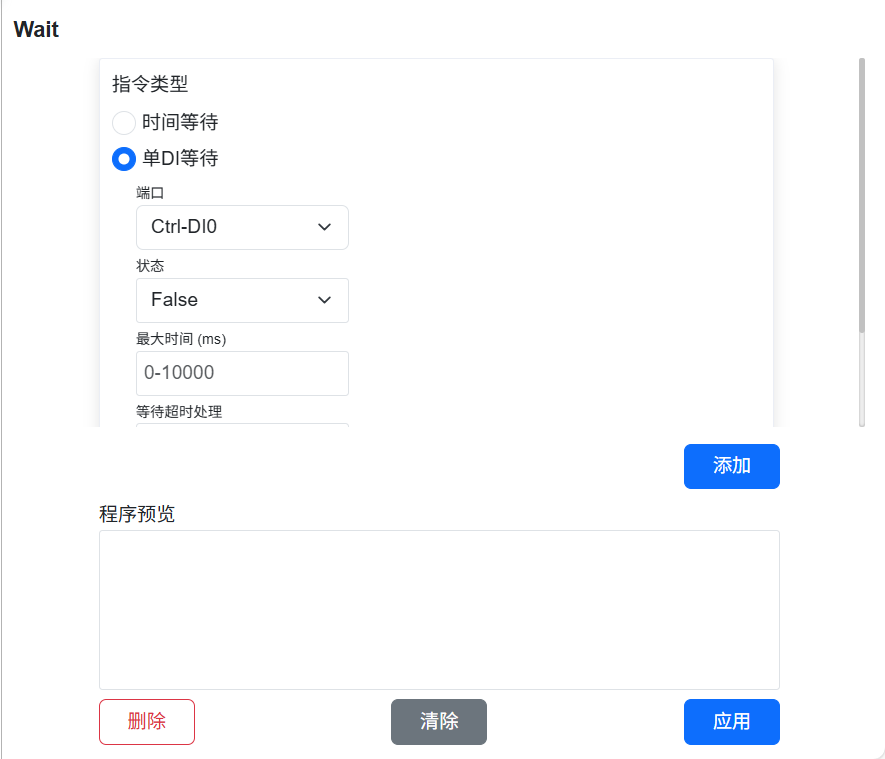

.. centered:: 圖表 9.4-5 WaitDI指令介面

「WaitMultiDI」指令，即多DI等待，先選擇多DI成立條件，其次勾選需要等待的DI埠和狀態，最後設定等待最大時間和等待逾時處理方式，點選「新增」、「應用」即可。

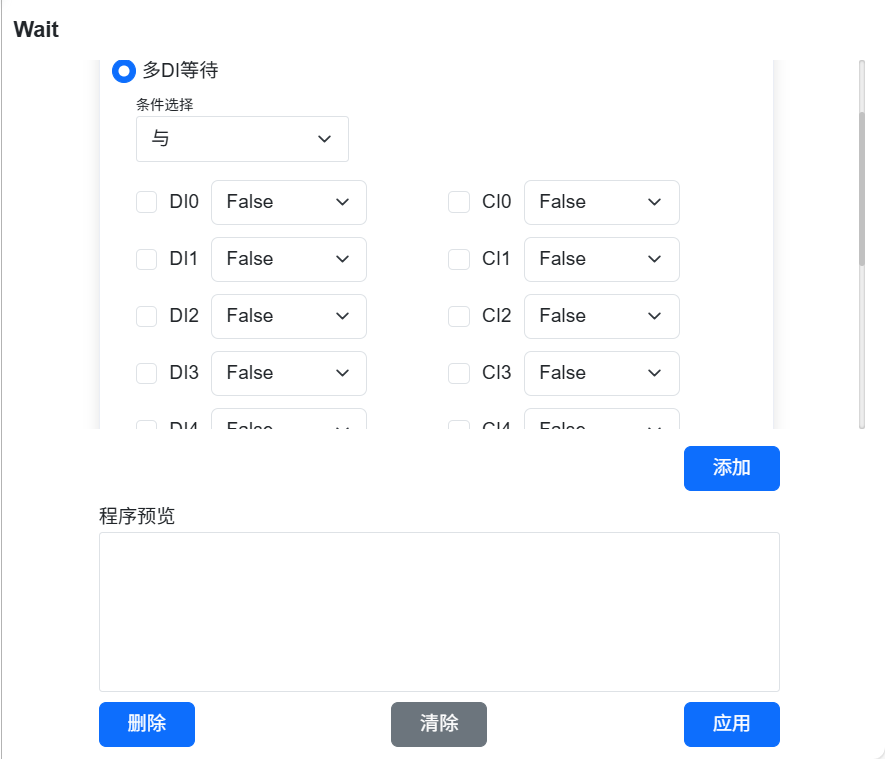

.. centered:: 圖表 9.4-6 WaitMultiDI指令介面

「WaitAI」指令，選擇需要等待的類比量、數值、等待的最大時間以及等待超時處理方式，點擊「新增」、「應用」即可。

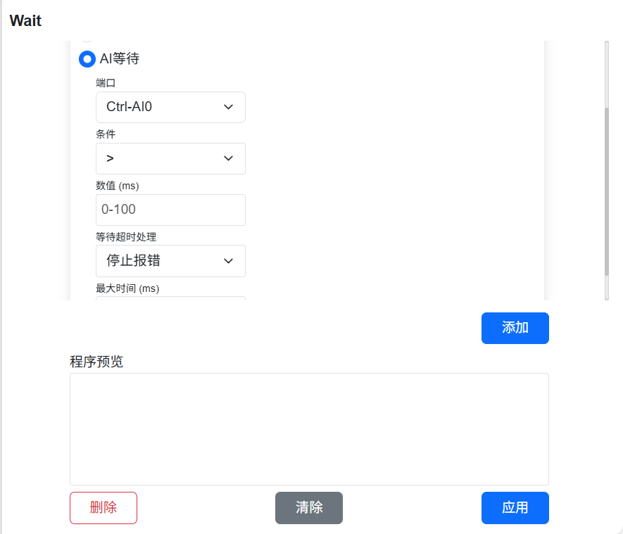

.. centered:: 圖表 9.4-7 WaitAI指令介面

暫停命令
++++++++++++++++

點選「暫停」圖示進入Pause指令編輯介面。

該指令為暫停指令，在程式中插入該指令，當程式執行到該指令時，機器人會處於暫停狀態，若想繼續運行，點擊控制區「暫停/恢復」按鍵即可。

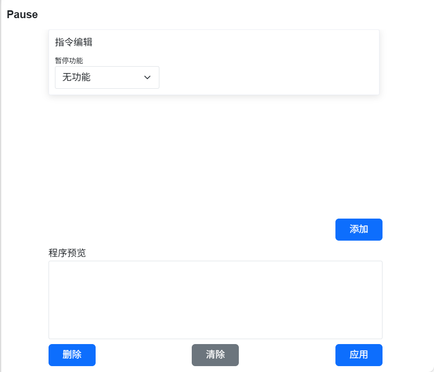

.. centered:: 圖表 9.4-8 Pause指令介面

子程序命令
++++++++++++++++

點選「子程式」圖示進入Dofile指令編輯介面。

Dofile指令呼叫的是控制器內部程序，使用Dofile指令需要儲存被呼叫的子程序，而主程式若未改變可不用再儲存。 Dofile指令支援二級調用，需要注意兩個參數設置，一是該調用處於第幾層，二是該調用的ID編號，ID編號原則上同一程式不能出現相同ID。

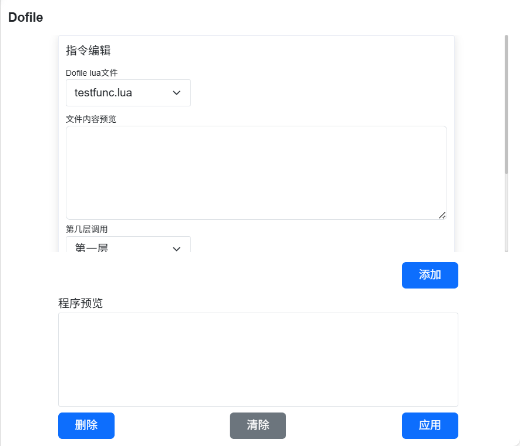

.. centered:: 圖表 9.4-9 Dofile指令介面

變數命令
++++++++++++++++

點選「變數」圖示進入Var指令編輯介面。

指令為變數系統指令，分為Lua變數定義，變數查詢和Sys變數重新命名，取得值，設定值兩部分，Lua變數定義可以宣告一個變數並賦予初始值，與while，if-else等指令配合使用，Lua變數查詢指令可以即時查詢輸入的變數名稱的值，顯示在狀態列。 Sys變數個數是固定的，可以重新命名，取得變數值以及設定變數值，該變數保存的值不隨系統關機而清除。

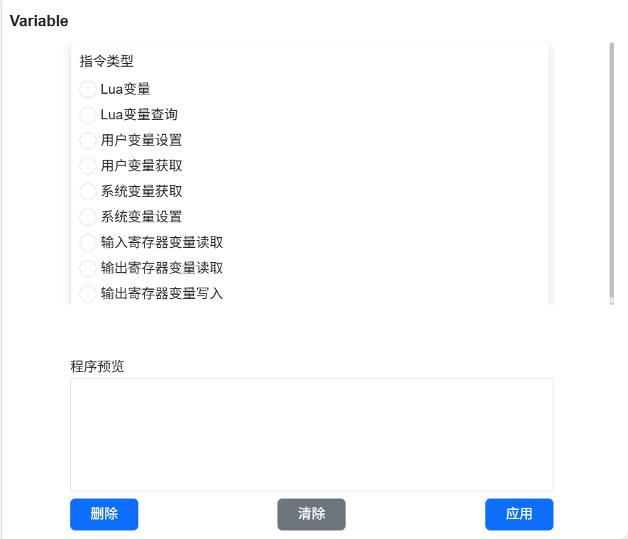

.. centered:: 圖表 9.4-10 Var指令介面

.. important:: 變數命名必須以字母或底線開頭，不能以數字或其他特殊字元開頭。

運動指令介面
~~~~~~~~~~~~~

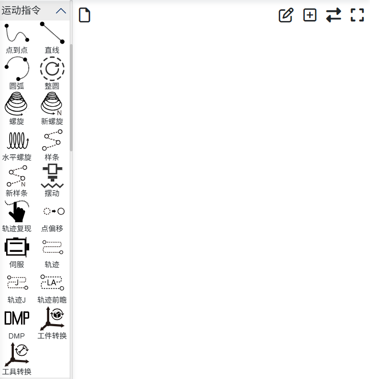

.. centered:: 圖表 9.5 運動指令介面

點到點命令
++++++++++++++++

點選「點到點」圖示進入PTP指令編輯介面。

可以選擇需要到達的點，平滑過渡時間設置可以實現該點到下一點的運動是連續的，是否偏移設置，可以選擇基於基坐標系偏移和基於工具坐標偏移，並彈出x，y， z，rx，ry，rz偏移量設置，PTP具體路徑為運動控制器自動規劃的最優路徑，點擊「新增」、「應用」後可儲存該條指令。

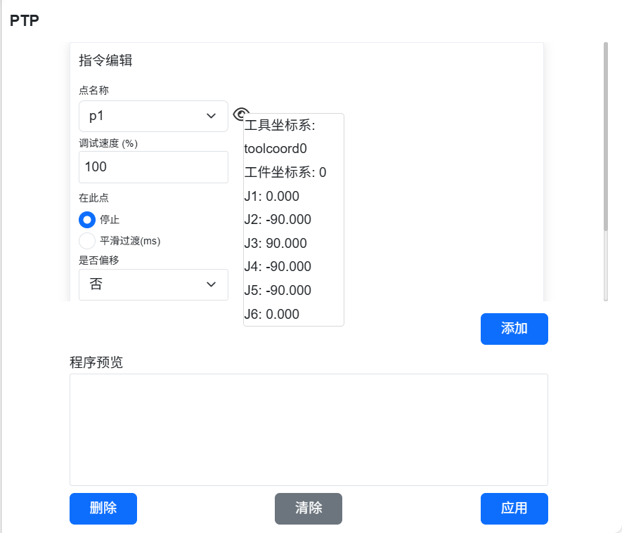

.. centered:: 圖表 9.5-1 PTP指令介面

直線命令
++++++++++++++++

點選「直線」圖示進入Lin指令編輯介面。

此指令功能與「PTP」指令相似，但該指令所到達點的路徑為直線。

.. centered:: 圖表 9.5-2 Lin指令介面

.. important:: 當選擇點名稱為「seamPos」時，直線指令會應用於焊接場景中使用雷射感測器。由於焊接使用中的運行累計誤差，故增加“是否偏移”和“偏移量”。

 **是否偏移**：否、基底座標系偏移、工具座標系偏移、雷射原始資料偏移；

 **偏移量**：∆x、∆y、∆z、∆rx、∆ry、∆rz，範圍：-300~300；

   .. image:: coding/033.png
      :width: 6in
      :align: center

   .. centered:: 圖表 9.5-2-1 Lin指令介面（焊接場景）

LIN指令關節超速處理功能
***************************

使用笛卡爾空間直線運動指令LIN時，約束的規劃條件是線速度，但實際運行時受到工作空間的影響，在滿足線速度要求時關節角速度可能已經超過限制。本功能實現了可選處理策略以應對LIN運動中關節超速的情況。

**Step1**：點選直線運動指令按鈕；

.. centered:: 圖表 9.5-3-1 點擊直線運動指令按鈕

**Step2**：選擇直線運動指令目標路點；

.. image:: coding/035.png
   :width: 6in
   :align: center

.. centered:: 圖表 9.5-3-2 選擇直線運動目標路點

**Step3**：打開關節超速保護開關；

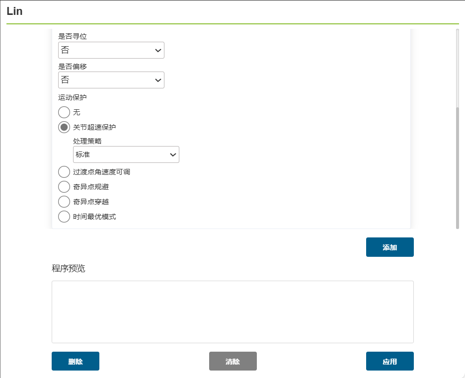

.. centered:: 圖表 9.5-3-3 打開關節超速保護開關按鈕

**Step4**：選擇關節超速處理策略(選擇超速報錯或自適應降速，其他均為預設策略無保護)；

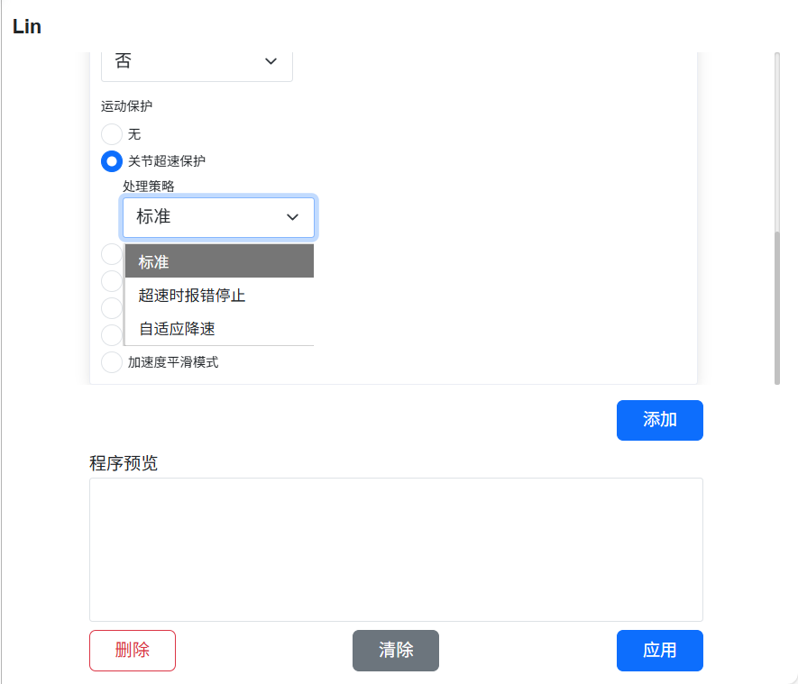

.. centered:: 圖表 9.5-3-4 關節超速處理策略

**Step5**：
 設定處理策略及處理策略參數，點選新增按鈕即可新增lua指令；

 自適應降速策略下，減速閾值為線速度減少值相對設定線速度的百分比，當減速值超過設定閾值時，機器人會錯誤停止。

.. centered:: 圖表 9.5-3-5 關節超速處理策略選擇與設定

**Step6**：新增的lua指令，形式如圖所示；

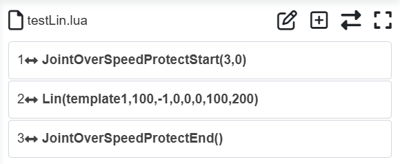

.. centered:: 圖表 9.5-3-6 lua指令

**超速保護開始**：JointOverSpeedProtectStart（a，b）；
 a：策略號碼（參考下拉框順序）

 b：閾值百分比（0~100，僅自適應降速時起效）

**超速保護結束**：JointOverSpeedProtectEnd（）；

.. note:: “奇異點穿越”運動保護請參考自動模式下奇異點穿越功能說明。

包角姿態過渡角速度可調功能
***************************

當焊接過程中遇到要求包角焊接的工件時，或在一段特定直線規劃（姿態變化大且位置變化小，但要求線速度不能加快的情況下快速過渡）時，可以使用本功能完成。

**Step1**：設定工具座標系，標定焊槍的工具尺寸與姿態。

.. note:: 介面數值僅為範例，以實際工具狀態為準。

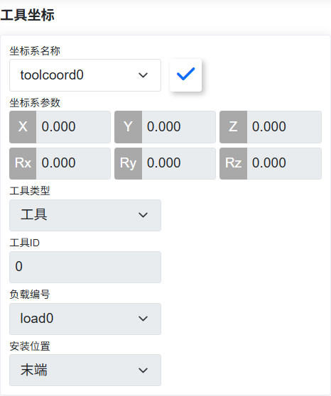

.. centered:: 圖表 9.5-3-7 設定工具座標系

**Step2**：點選“示教程式”，選擇“程式編程”，在“運動指令”分類中選擇“直線”。

.. centered:: 圖表 9.5-3-8 直線指令設定介面

**Step3**：設定包角焊接每段直線的起始點為過渡點，開啟「過渡點角速度可調」按鈕，設定最大加速度百分比（預設最大角速度100%為360°/s）。

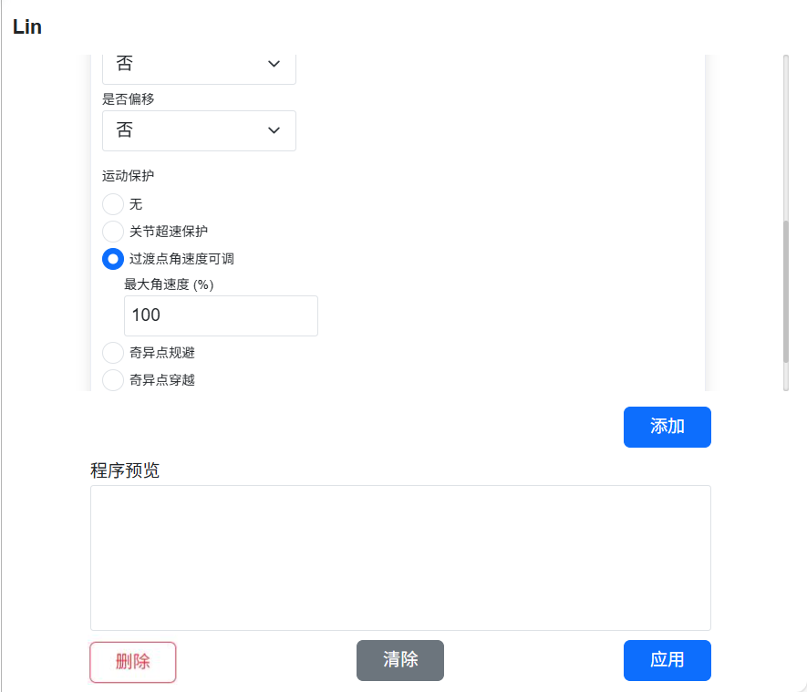

.. centered:: 圖表 9.5-3-9 過渡點角速度調整參數配置介面

**Step4**：點選「新增」按鈕，產生包含過渡姿態角速度調整的直線指令。

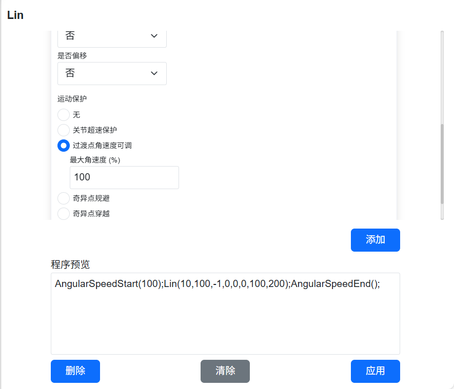

.. centered:: 圖表 9.5-3-10 新增過渡點直線運動指令

**Step5**：機器人在起點處完成姿態過渡，正常執行直線指令移動到該段終點，關閉「過渡點角速度可調」按鈕，新增終止路點。

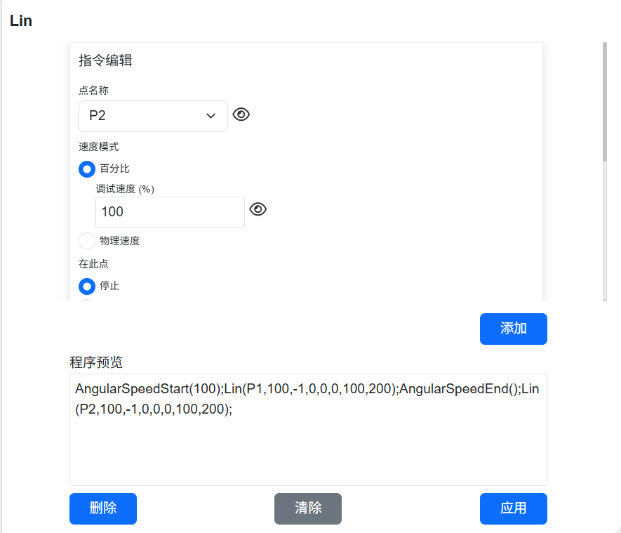

.. centered:: 圖表 9.5-3-11 插入直線終點

**Step6**：點選「應用」按鈕，產生對應LUA指令。

.. image:: coding/251.png
   :width: 6in
   :align: center

.. centered:: 圖表 9.5-3-12 產生包含過渡點的直線LUA指令

一組完整的包角焊接通常具有多個過渡點，在圖7所示的包角的情況下，在焊接過程中有兩個位置變化小且姿態變化大的姿態過渡點。

點1是焊接第一段的起點，點2是焊接第一段的終點；

點3是焊接第二段的起點，點4是焊接第二段的終點；

點5是焊接第三段的起點，點6是焊接第三段的終點。

姿態過渡發生在上一段焊接的終點到下一段焊接的起點，所以需要在下一段焊接的起點增加姿態角速度調整指令，這樣在包角姿態過渡期間最大線速度保持不變、最大角速度增加，使包角焊接過程流暢運作。

.. image:: coding/252.png
   :width: 4in
   :align: center

.. centered:: 圖表 9.5-3-13 包角焊接流程範例

圓弧指令
++++++++++++++++

點選「圓弧」圖示進入Arc指令編輯介面。

「Arc」指令為圓弧運動，包含三個點，第一點為圓弧起始點，第二點為圓弧中間過渡點，第三點為終點。

過渡點和終點都可以對是否偏移進行設置，可以選擇基於基坐標系偏移和基於工具坐標偏移，並彈出x，y，z，rx，ry，rz偏移量設置，終點可以設置平滑過渡半徑，實現運動連續效果。

.. important::
 圓弧運動需要先加入PTP或Lin指令先運動到起始點。

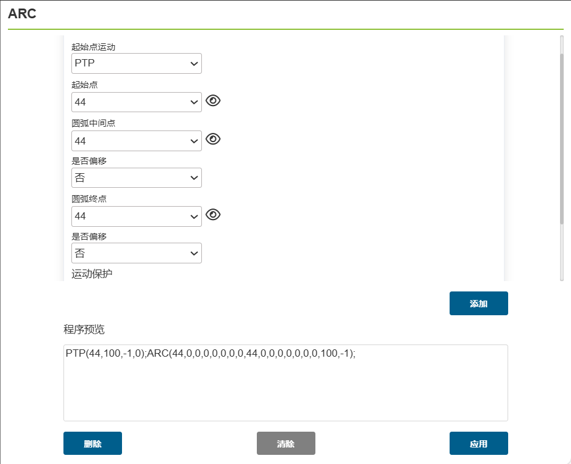

.. centered:: 圖表 9.5-4 Arc指令介面

整圓命令
++++++++++++++++

點選「整圓」圖示進入Circle指令編輯介面。

協作機器人透過加入整圓指令可以進行整圓軌跡運動，在加入整圓指令前需要先示教出整圓軌跡上的3個路徑點，假設整圓軌跡上三個路徑點分別為「P1」、 “P2”、“P3”，其中「P1」為整圓軌跡起點，「P2」和「P3」分別為整圓軌跡中間點1和中間點2，分別移動機器人至上述三個點，並加入示教點位名稱分別為「P1 」、「P2」、「P3」。

.. important::
   整圓軌跡運動需要先加入PTP或Lin指令先移動到起始點。

.. image:: coding/042.png
   :width: 3in
   :align: center

.. centered:: 圖表 9.5-5 整圓軌跡

.. image:: coding/043.png
   :width: 3in
   :align: center

.. image:: coding/044.png
   :width: 3in
   :align: center

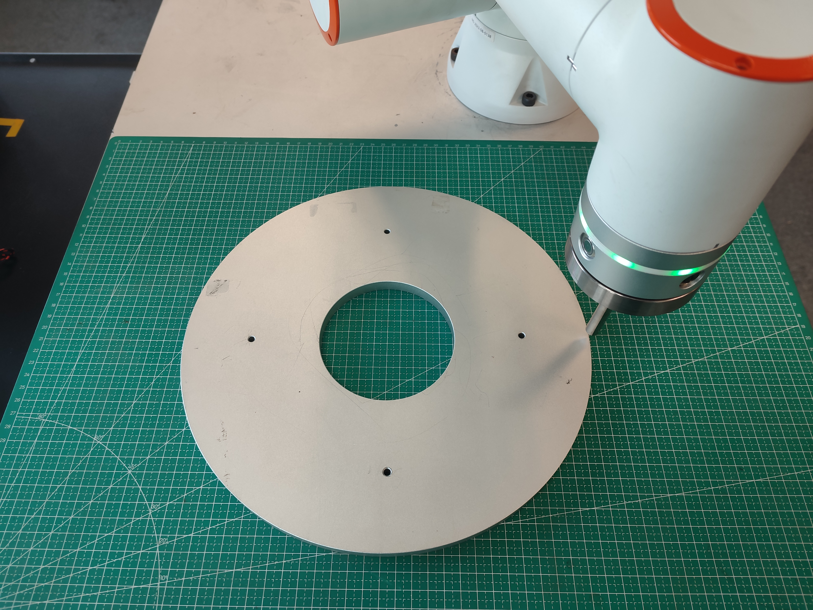

.. centered:: 圖表 9.5-6 示教「P1」、「P2」、「P3」點

整圓指令添加
**************

**Step1**：新使用者程式“testCircle.lua”，點選“整圓”按鈕，開啟整圓指令新增頁面。

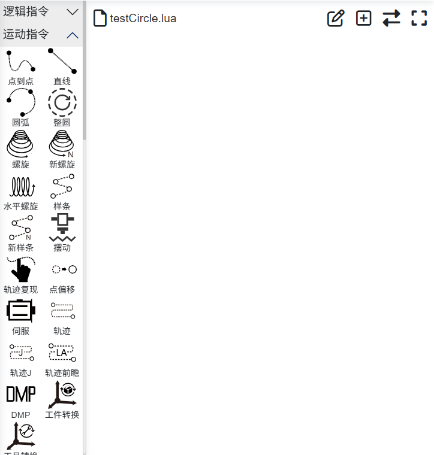

.. centered:: 圖表 9.5-7 示教「P1」、「P2」、「P3」點

整圓指令添加
**************

**Step1**：新使用者程式“testCircle.lua”，點選“整圓”按鈕，開啟整圓指令新增頁面。

.. centered:: 圖表 9.5-8 起始點運動方式和起始點“P1”

**Step3**：在整圓指令新增頁面中選擇「整圓中間點1」為「P2」點。

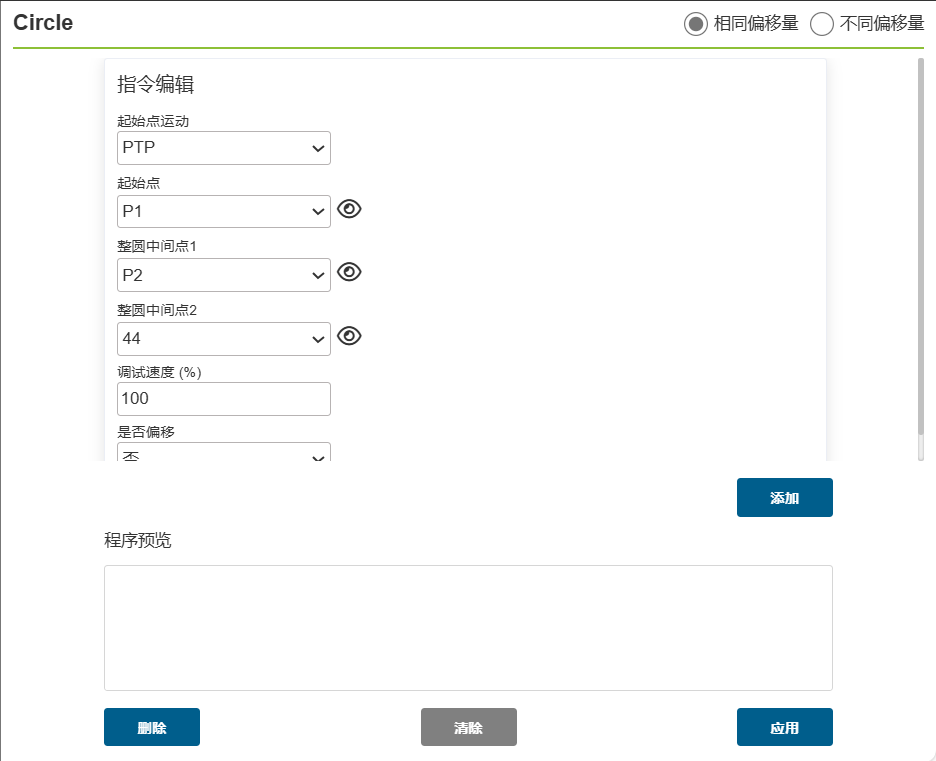

.. centered:: 圖表 9.5-9 整圓中間點1

**Step4**：選擇「整圓中間點2」為「P3」點，依序點選「新增」按鈕和「應用」按鈕。

.. centered:: 圖表 9.5-10 整圓中間點2

**Step5**：此時「testCircle.lua」已增加整圓運動指令。

.. image:: coding/049.png
   :width: 6in
   :align: center

.. centered:: 圖表 9.5-11 整圓運動指令添加

將機器人切換到自動模式，在確保安全的前提下啟動程序，機器人即按整圓軌跡進行運動。

整圓軌跡偏移
**************

協作機器人的整圓運動支援將整圓軌跡中間點1和整圓軌跡中間點2的位置偏移，偏移類型包括以下兩種類型；

**整圓兩個軌跡中間點相同偏移量**：整圓軌跡中間點1（“P2”點）和整圓軌跡中間點2（“P3”點）採用相同的偏移量∆(dx , dy, dz, drx, dry, drz)進行偏移。

**整圓兩個軌跡中間點不同偏移量**：整圓軌跡中間點1（「P2」點）和整圓軌跡中間點2（「P3」點）分別採用兩個不同的偏移量∆1(dx1, dy1, dz1, drx1, dry1, drz1)和∆2(dx2, dy2, dz2, drx2, dry2, drz2)進行偏移。

以下分別示範「相同偏移量」和「不同偏移量」的用法。

1. 相同偏移量

所示，開啟整圓指令新增頁面，“偏移類型”選擇“相同偏移量”，同樣選擇起始點運動方式和起始點為“P1”，整圓中間點1為“P2”點。

.. image:: coding/051.png
   :width: 6in
   :align: center

.. centered:: 圖表 9.5-12 整圓相同偏移量

整圓中間點2選擇“P3”，“是否偏移”選擇“基座標偏移”。

.. note:: 您可以根據實際的工作情況選擇「工具座標偏移」。

輸入偏移量dx為10mm，依序點選頁面下方的「新增」按鈕和「應用」按鈕。

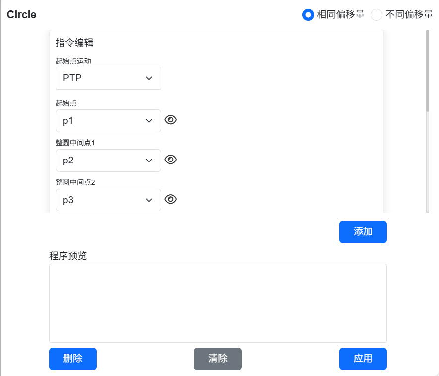

.. centered:: 圖表 9.5-13 設定偏移量

此時一條整圓起始點為“P1”，兩個中間點“P2”和“P3”均沿基座標系的X軸方向偏移10mm的整圓指令已經添加到“testCircle.lua”程式中。

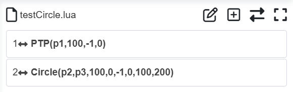

.. centered:: 圖表 9.5-14 整圓相同偏移量程序

將機器人切換至自動模式，在保證安全的情況下啟動程序，機器人的實際運動軌跡中穿過“P1”、“P2”和“P3”的圓，其中“P2”為原“P2”點沿X方向偏移10mm後的點，其中「P3」為原「P3」點沿X方向偏移10mm後的點。

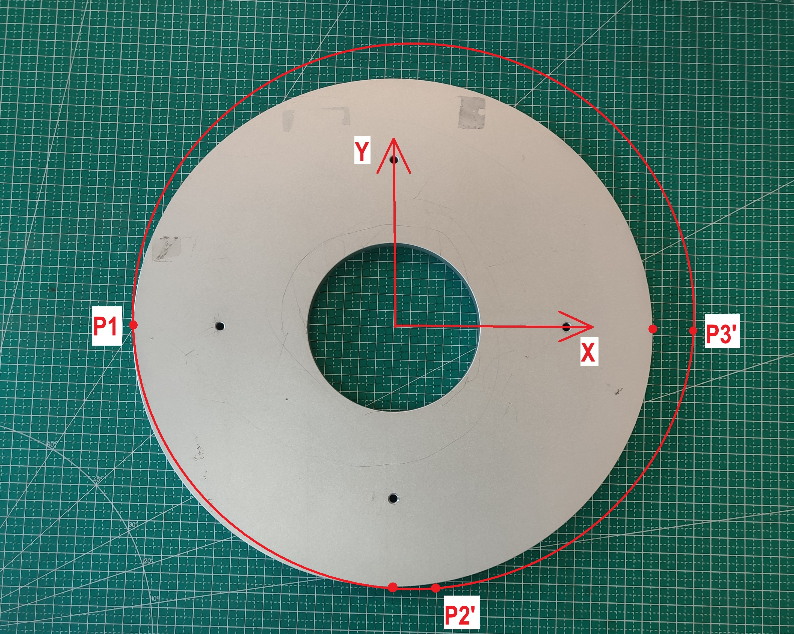

.. centered:: 圖表 9.5-15 相同偏移量X10mm軌跡

2. 不同偏移量

打開整圓指令新增頁面，“偏移類型”選擇“不同偏移量”，同樣選擇起始點運動方式和起始點為“P1”，整圓中間點1為“P2”點，“是否偏移”選擇為“基座標偏移”。

.. note::
 您可以根據實際的工作情況選擇“工具座標偏移”。

輸入偏移量dy為10mm。

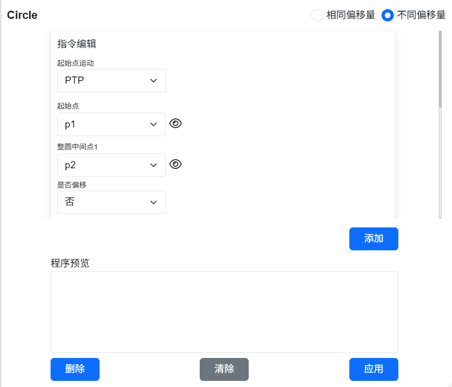

.. centered:: 圖表 9.5-16 不同偏移量

整圓中間點選擇“P3”，“是否偏移”選擇“基座標偏移”。

.. note:: 您可以根據實際的工作情況選擇「工具座標偏移」。

輸入偏移量dx為10mm，依序點選頁面下方的「新增」按鈕和「應用」按鈕。

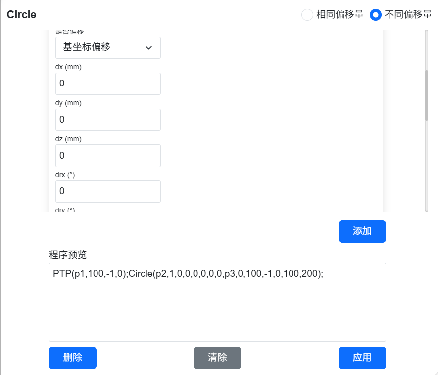

.. centered:: 圖表 9.5-17 不同偏移量設定中間點2偏移

此時一條整圓起始點為“P1”，中間點“P2”沿基座標系Y方向偏移10mm和“P3”沿基座標系的X軸方向偏移10mm的整圓指令已經添加到“testCircle.lua”程式中。

.. image:: coding/057.png
   :width: 6in
   :align: center

.. centered:: 圖表 9.5-18 整圓兩點不同偏移程序

將機器人切換至自動模式，在保證安全的情況下啟動程序，機器人的實際運動軌跡中穿過“P1”、“P2'”和“P3'”的圓，其中“P2'”為原始“P2 」點沿Y方向偏移10mm後的點，其中「P3'」為原「P3」點沿X方向偏移10mm後的點。

.. image:: coding/058.png
   :width: 3in
   :align: center

.. centered:: 圖表 9.5-19 整圓兩點不同偏移程序

螺旋指令
++++++++++++++++

點選「螺旋」圖示進入Spiral指令編輯介面。

「Spiral」指令為螺旋線運動，包含三個點，該三個點組成一個圓，在第三點設定頁面，包含螺旋圈數，姿態修正角，半徑增量和轉軸方向增量這幾個參數設置，螺旋圈數即該螺旋線的運動圈數，姿態修正角修正的是螺旋線結束時的姿態與螺旋線第一點的姿態，半徑增量即每一圈半徑的增量，轉軸方向增量即螺旋軸方向的增量。設定
是否偏移，該偏移量生效於整個螺旋線的軌跡。

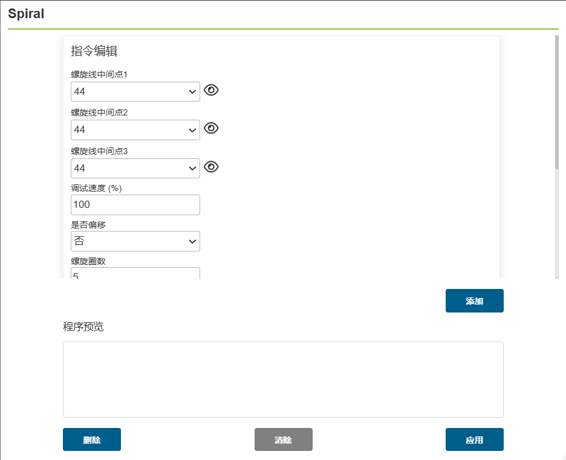

.. centered:: 圖表 9.5-20 Spiral指令介面

新螺旋指令
++++++++++++++++

點選「新螺旋」圖示進入N-Spiral指令令編輯介面

「N-Spiral」指令為最佳化版螺旋線運動，指令只需要一個點加各參數的配置來實現螺旋線運動。機器人以目前位置為起點，使用者設定調試速度，是否偏移，螺旋圈數，螺旋傾角，初始半徑，半徑增量，轉軸方向增量和旋轉方向這幾個參數，螺旋圈數即該螺旋線的運動圈數，螺旋傾角即工具Z軸與水平方向的夾角，姿態修正角修正的是螺旋線結束時的姿態與螺旋線第一點的姿態，初始半徑即第一圈半徑大小，半徑增量即每一圈半徑的增量，轉軸方向增量即螺旋軸方向的增量，旋轉方向即順時針和逆時針。

.. centered:: 圖表 9.5-21N-Spiral指令介面

水平螺旋指令
++++++++++++++++

點選「水平螺旋」圖示進入H-Spiral指令令編輯介面

「H-Spiral」指令為水平空間螺旋線移動，指令設定於單段運動（直線）指令之後。

 - 螺旋半徑: 0~100mm
 - 螺旋角速度: 0~2rev/s
 - 旋轉方向: 螺旋順/逆時針
 - 螺旋傾角: 0~40°

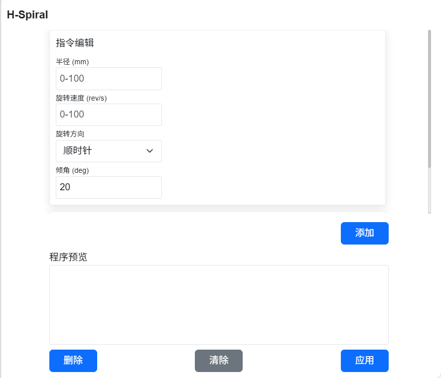

.. centered:: 圖表 9.5-22 H-Spiral指令介面

樣條命令
++++++++++++++++

點選「樣條」圖示進入Spline指令編輯介面。

指令分為樣條組起始，樣條段和樣條組結束三部分，樣條組開始是樣條運動的起始標誌，樣條段包含SPL、SLIN和SCIRC段，點選對應圖示進入指令添加界面，樣條組結束是樣條運動的結束標誌。

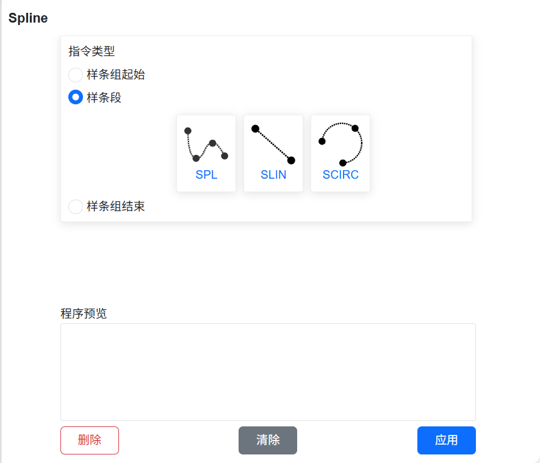

.. centered:: 圖表 9.5-23 Spline指令介面

新樣條命令
++++++++++++++++

點選「新樣條」圖示進入N-Spline指令編輯介面。

此指令為Spline指令演算法最佳化指令，後續會取代現有的Spline指令。

指令分為多點軌跡起始，多點軌跡段和多點軌跡結束三個部分，多點軌跡開始是多點軌跡運動的起始標誌，多點軌跡段即設定各個軌跡點。

點選圖示進入點位新增介面，多點軌跡結束是多點軌跡運動的結束標誌，在此可以設定控制模式和調試速度。

- 控制模式：圓弧過渡點/給定路徑點
- 全域平均銜接時間：整數型，大於10，預設值為2000

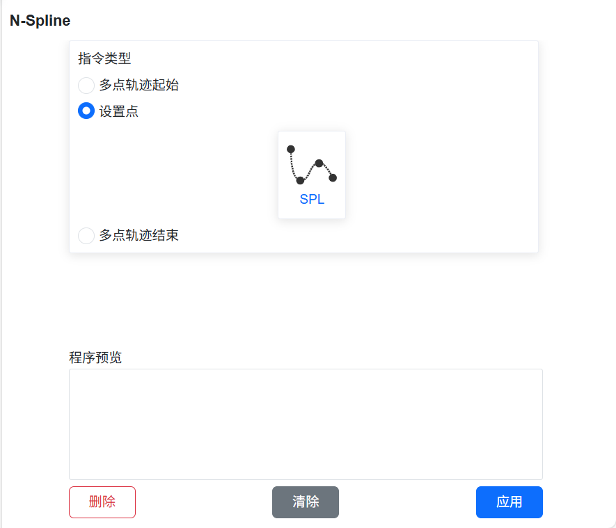

.. centered:: 圖表 9.5-24 N-Spline指令介面

擺動命令
++++++++++++++++

點選「擺動」圖示進入Weave指令編輯介面。 “Weave”指令包含兩個部分：

- 選擇配置好參數的擺焊編號，點選「開始擺焊」和「停止擺焊」並應用可將相關指令新增至程式。

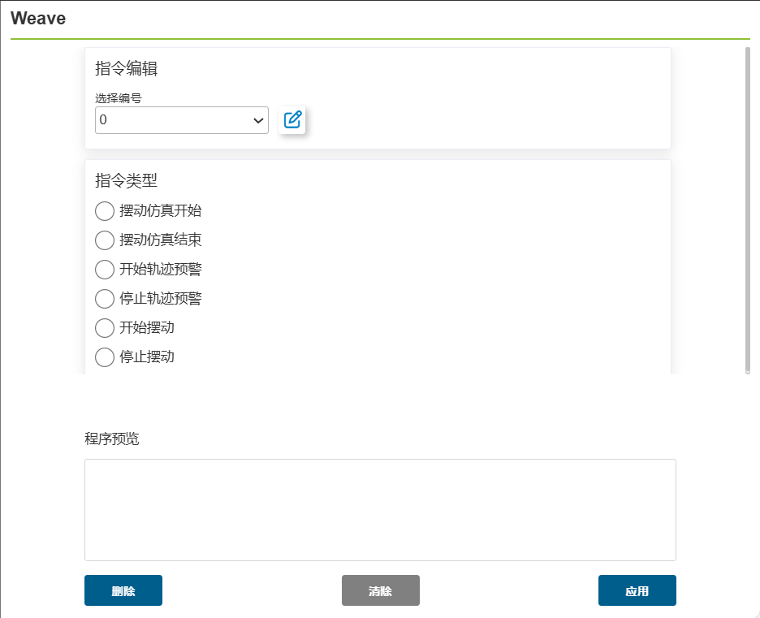

.. centered:: 圖表 9.5-25 Weave指令介面

- 點擊“配置與測試”，可根據使用場景選擇擺動類型，對擺焊的參數進行配置，配置完成後可透過開始擺焊測試和停止擺焊測試按鍵測試該擺焊軌跡。目前擺動類型有：

 - 三角波擺動（LIN/ARC）
 - 垂直L型三角波擺動（LIN/ARC）
 - 圓形擺動-順時針（LIN）
 - 圓形擺動-逆時針（LIN）
 - 正弦波擺動（LIN/ARC）
 - 垂直L型正弦波擺動（LIN/ARC）
 - 立焊三角擺動

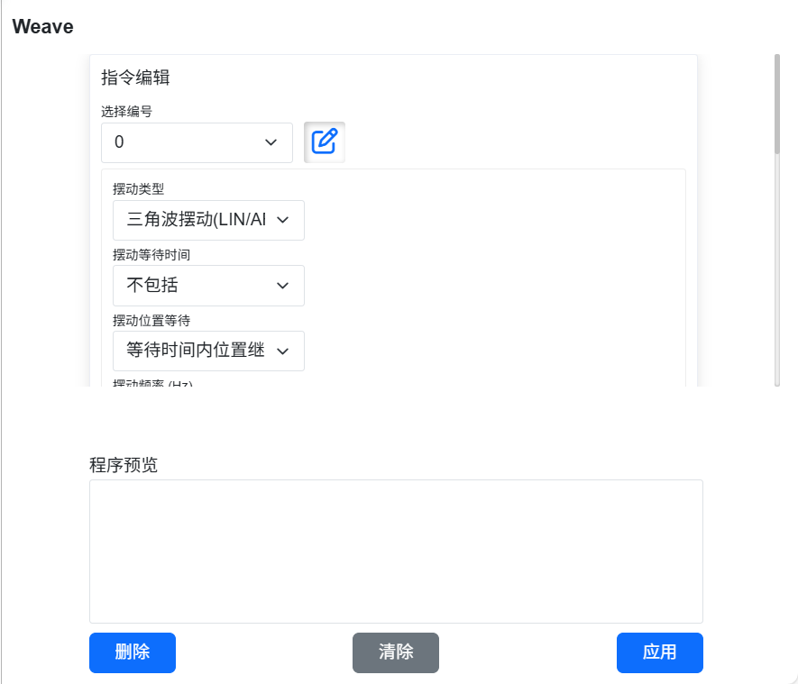

.. centered:: 圖表 9.5-26 Weave設定與測試指令介面

斜鋸齒擺動功能
*********************

使用斜鋸齒擺動功能能使機器人工具末端在笛卡爾空間內形成傾斜鋸齒狀擺動軌跡。斜鋸齒擺動疊加於直線規劃，傾斜量受方位角參數控制，在指定的擺焊平面上擺焊的方位角的傾斜度（單位deg）；

值為正時，左端點向前進方向傾斜，為負時，右端點向前進方向傾斜；若為90deg或-90deg時，可沿著前進方向擺動。

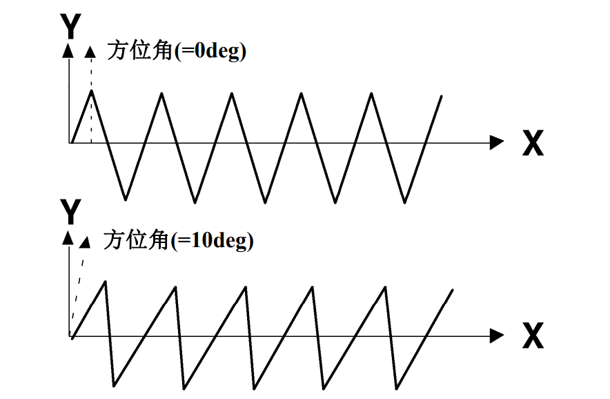

.. centered:: 圖表 9.5-26-1 擺動方位角影響

**Step1**：編輯設定基本直線運動。

.. image:: coding/067.png
   :width: 4in
   :align: center

.. centered:: 圖表 9.5-26-2 基本直線運動lua程式範例

**Step2**：點選新增擺動指令。

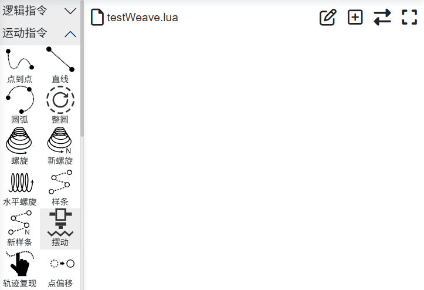

.. centered:: 圖表 9.5-26-3 點擊新增擺動指令

**Step3**：擺動指令參數配置頁面點擊“配置”按鈕，“擺動類型”下拉框選擇“三角波擺動”或“正弦波擺動”，輸入相應“擺動方向方位角”，點擊“應用”。

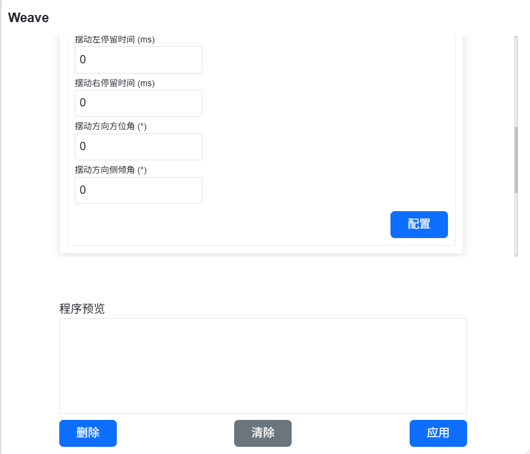

.. centered:: 圖表 9.5-26-4 擺動參數配置

**Step4**：點選「開始擺動」按鈕，將擺動指令新增至直線運動上方；點選「結束擺動」按鈕，將擺動指令新增至直線運動下方。

.. image:: coding/070.png
   :width: 4in
   :align: center

.. centered:: 圖表 9.5-26-5 新增擺動指令後lua程序

**Step5**：點擊“開始運行”，機器人末端軌跡如圖所示。

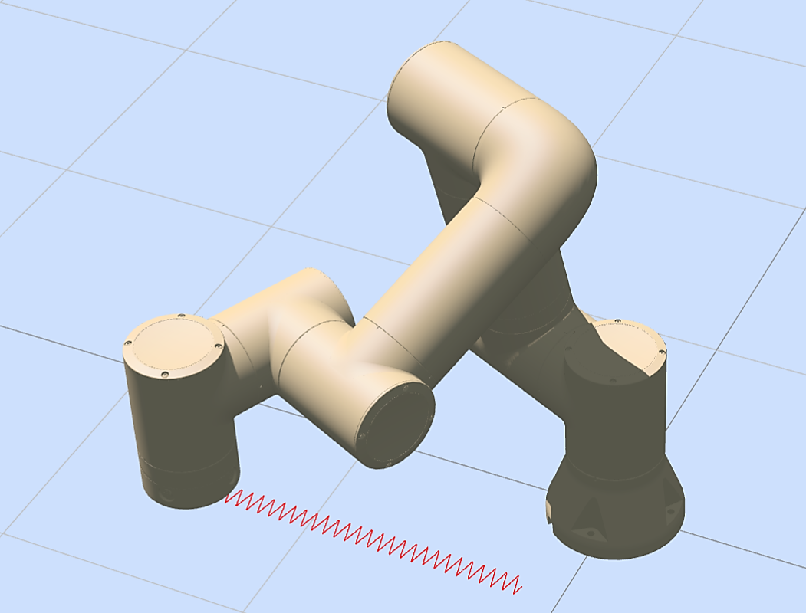

.. image:: coding/072.png
   :width: 3in
   :align: center

.. centered:: 圖表 9.5-26-6 鋸齒擺動（左） 斜鋸齒擺動（右）

軌跡復現指令
++++++++++++++++

點選「軌跡復現」按鈕進入TPD指令編輯介面。

在該指令中，使用者首先需要有記錄好的軌跡。

關於軌跡記錄：在準備記錄軌跡之前，先儲存下軌跡的起始點。在機器人處於拖曳模式下，輸入檔案名，選擇週期（假設數值為x，即每隔x毫秒記錄一個點，建議4毫秒記錄一個點），點開始記錄，使用者可以根據需求拖曳機器人進行指定運動，記錄完成後，點選停止記錄，即可儲存先前機器人的運動軌跡。當一筆運動無法完全記錄，會提
示記錄點數超限提示，使用者需要將運動分成幾次進行記錄。

進行程式編程時，先用PTP指令到達對應軌跡起始點，然後在TPD軌跡復現指令中選擇軌跡，選擇是否平滑，設定調試速度，依序點擊“新增”、“應用”，即可插入程式。軌跡載入指令主要用於預先讀取軌跡文件，提取成軌跡指令，更好的應用於傳送帶追蹤場景。

.. note::
 關於TPD詳細操作可見示教程式設計（TPD）功能操作說明模組。

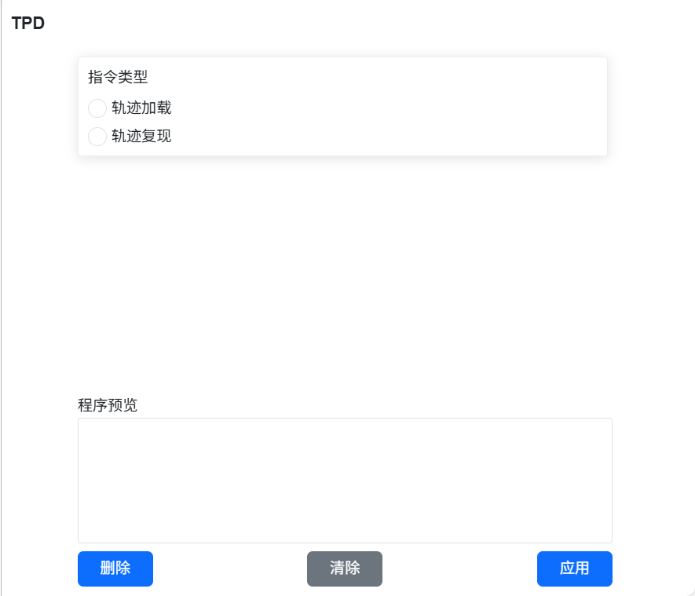

.. centered:: 圖表 9.5-27 TPD指令介面

點偏移指令
++++++++++++++++

點選「點偏移」圖示進入Offset指令編輯介面。

此指令為整體偏移指令，輸入各個偏移量，將開啟指令和關閉指令加入程式中，在開始和關閉中間的運動指令會基於基底座標（或工件座標）進行偏移。

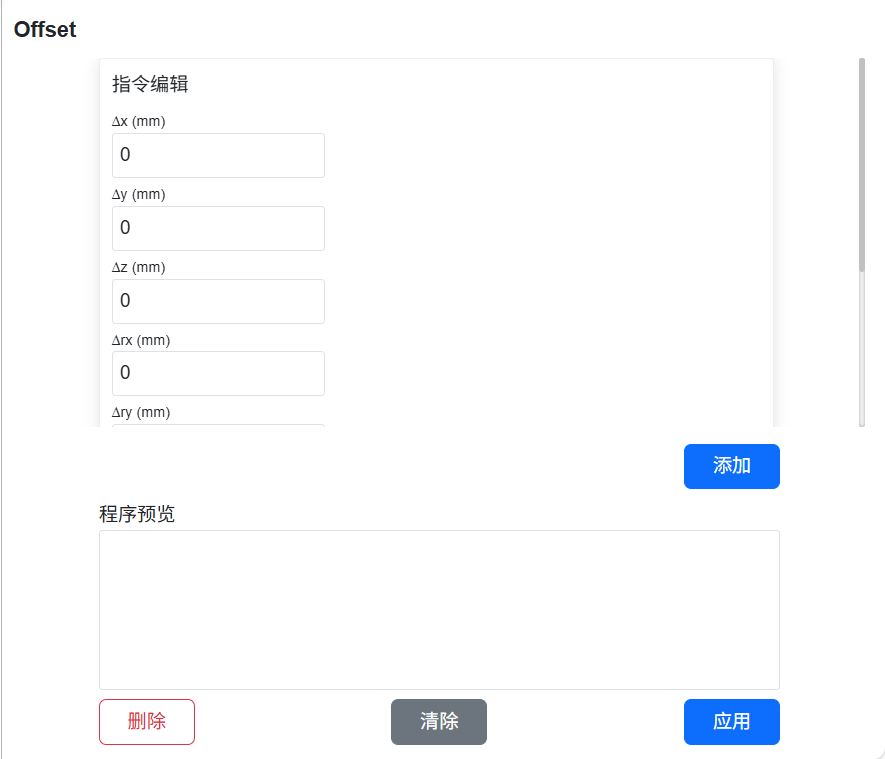

.. centered:: 圖表 9.5-28 Offset指令介面

伺服命令
++++++++++++++++

點選「伺服」圖示進入ServoCart指令編輯介面。

ServoCart伺服控制（笛卡爾空間運動）指令，該指令可以透過絕對位姿控製或基於當前位姿偏移來控制機器人運動。

.. centered:: 圖表 9.5-29 ServoCart指令介面

絕對位姿控製程式實例：

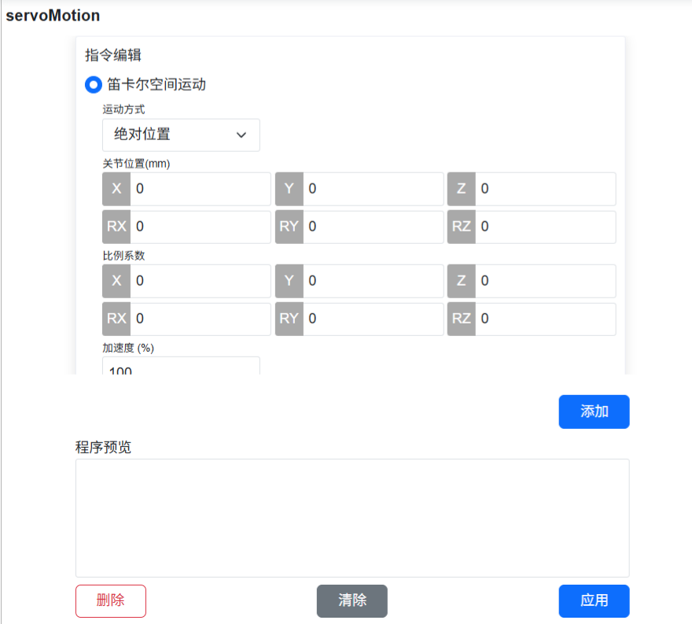

此例中，x，y，z，rx，ry，rz（笛卡爾位置）是獲取的機器人當前位置，此外，用戶可以透過讀取軌跡數據文件，socket通訊發送軌跡數據等方式，控制機器人運動。

基於目前位姿偏移（基底座標偏移）控製程式實例：

.. image:: coding/077.png
   :width: 6in
   :align: center

軌跡命令
++++++++++++++++

點選「軌跡」圖示進入Trajctory指令編輯介面。

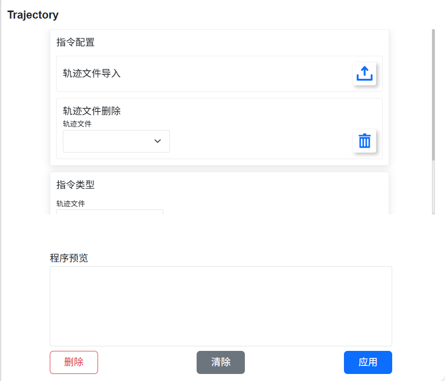

.. centered:: 圖表 9.5-30 Trajctory指令介面

軌跡J命令
++++++++++++++++

點選「軌跡J」圖示進入TrajctoryJ指令編輯介面。

Trajctory指令和TrajctoryJ指令適用於相機直接給定軌蹟的通用接口，滿足在已有固定格式的離散的軌跡點文件時，可導入系統使得機器人按照導入文件的軌跡進行運動。

1. 軌跡檔案匯入功能：選擇本機電腦檔案匯入機器人控制系統。

2. 軌跡預載：選擇已匯入的軌跡檔案透過指令載入。

3. 軌跡運動：透過預先載入的軌跡檔案和選擇的調試速度組合指令下發機器人運動。

4. 列印軌跡點編號：在機器人運作軌跡的過程中列印軌跡點編號，以便查看目前運動的進度。

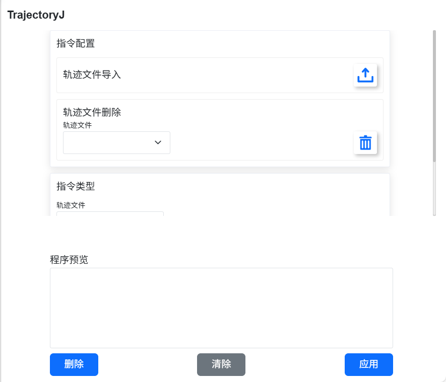

.. centered:: 圖表 9.5-31 TrajctoryJ指令介面

DMP指令
++++++++++++++++

點選“DMP”圖示進入DMP指令編輯介面。

DMP是一種軌跡模仿學習的方法，需要事先規劃參考軌跡。在命令編輯介面。選擇示教點作為新的起點，點選「新增」、「應用」後可儲存該指令。 DMP具體路徑為以新的起點模仿參考軌跡的新軌跡。

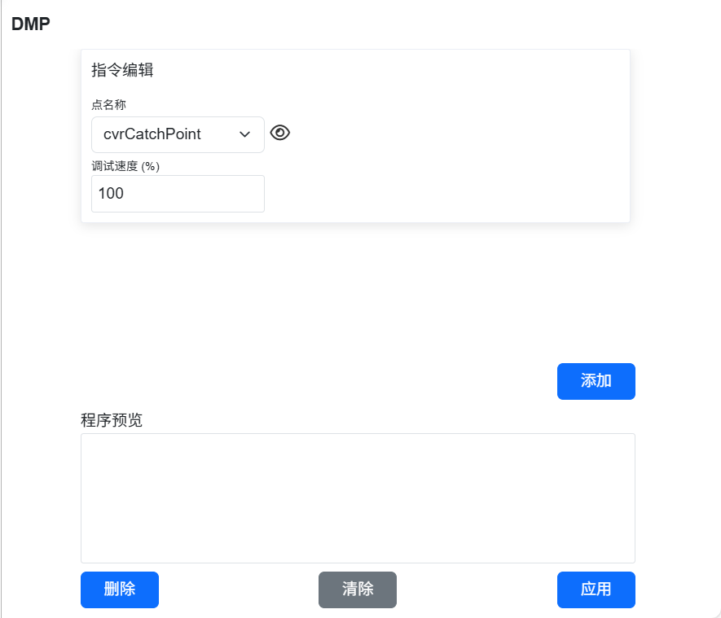

.. centered:: 圖表 9.5-32 DMP指令介面

工件轉換指令
++++++++++++++++

點選「工件轉換」圖示進入WPTrsf指令編輯介面。

選擇要進行自動轉換的工件座標系，點選「新增」、「應用」後可儲存指令，指令實作在執行內部的PTP、LIN指令時，工件座標系下點位自動轉換。使用範例區域展示並提示了指令的正確使用方式組合，具體指令在新增後可依據實際場景自行調整組合。

.. centered:: 圖表 9.5-33 WPTrsf指令介面

工具轉換命令
++++++++++++++++

點選「工具轉換」圖示進入ToolTrsf指令編輯介面。

新增PTP、Lin指令後，選擇要進行自動轉換的工具座標系，點選「新增」、「應用」後可儲存指令，指令內點位笛卡爾座標根據目前設定的工件座標系進行自動轉換。

.. note:: 使用範例區域展示並提示了指令的正確使用方式組合，具體指令在新增後可依據實際場景自行調整組合。

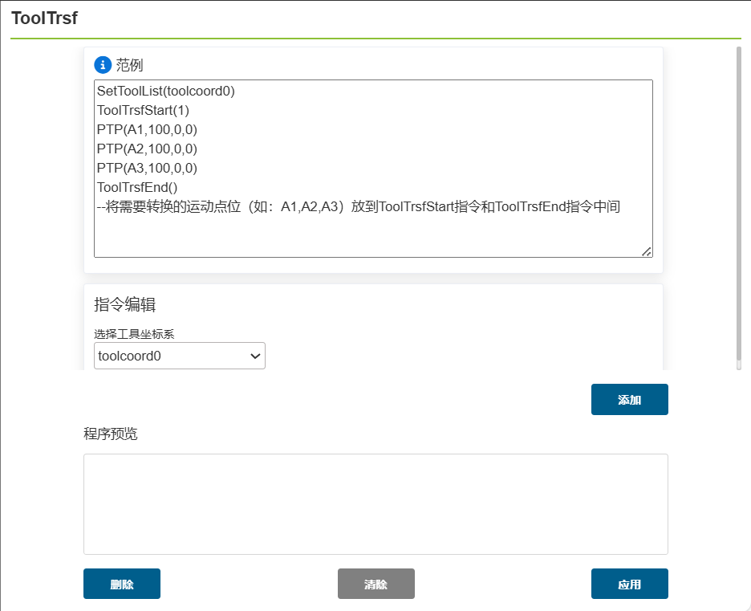

.. centered:: 圖表 9.5-34 ToolTrsf指令介面

控制指令介面
~~~~~~~~~~~~~

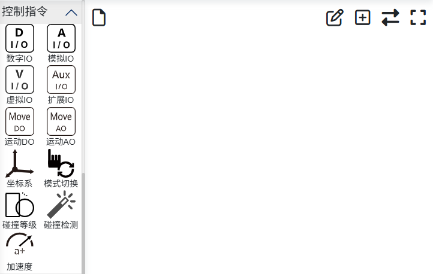

.. centered:: 圖表 9.6控制指令介面

數位IO指令
++++++++++++++++

點選「數位IO」圖示進入IO指令編輯介面。

「IO」指令分為設定IO（SetDO/SPLCSetDO）和取得IO（GetDI/SPLCGetDI）兩部分。

「SetDO/SPLCSetDO」指令可設定指定的輸出DO狀態，包含16路控制箱數位輸出及2路工具數位輸出，狀態選項「False」為閉，「True」為開，是否阻塞選項選擇「阻塞」表示運動停止後設定DO狀態，選擇「非阻塞」選項表示在上一條運動過程中設定DO狀態。平滑軌跡選項選擇「Break」表示在平滑過渡半徑結束後設定DO狀態，選擇「Serious」表示在平滑過渡半徑運動過程中設定DO狀態。當指令是加入在輔助執行緒中，是否應用執行緒需要選擇是，其他地方使用該指令選擇否。點選「新增」、「應用」即可。

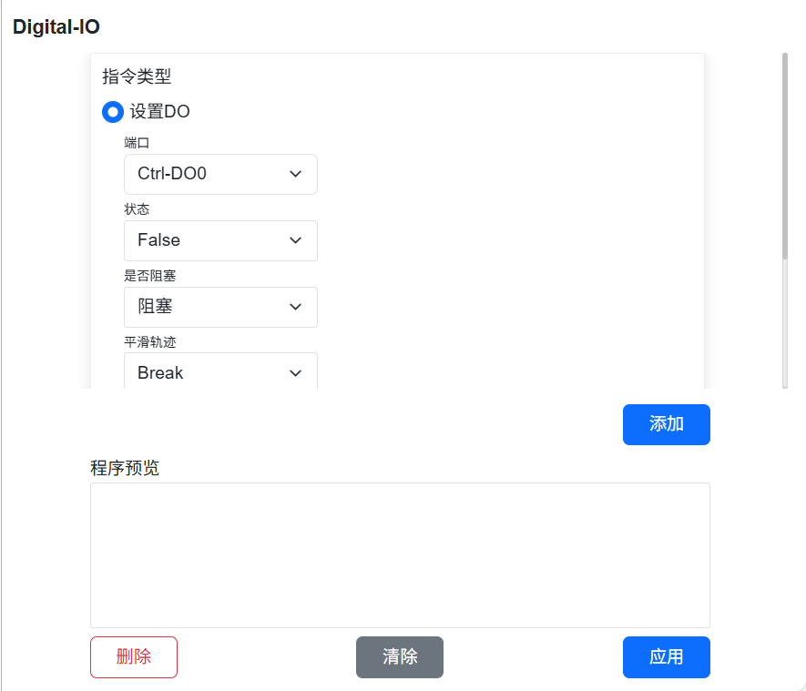

.. centered:: 圖表 9.6-1 SetDO指令介面

在「GetDI/SPLCGetDI」指令中，選擇想要取得連接埠號碼的數值，是否阻塞選項選擇「阻塞」表示運動停止後取得DI狀態，選擇「非阻塞」選項表示在上一條動作中取得DI狀態。當指令是加入在輔助執行緒中，是否應用執行緒需要選擇是，其他地方使用該指令選擇否。選擇完畢後點選「新增」、「應用」按鈕即可。

.. centered:: 圖表 9.6-2 GetDI指令介面

模擬AI命令
++++++++++++++++

點選「模擬AI」圖示進入AI指令編輯介面。

在此指令中，分為設定類比輸出（SetAO/SPLCSetAO）和取得類比輸入（GetAI/SPLCGetAI）兩部分功能。

「SetAO/SPLCSetAO」選擇需要設定的類比輸出，輸入需要設定的值，範圍為0-10，是否阻塞選項選擇「阻塞」表示運動停止後設定AO狀態，選擇「非阻塞」選項表示在上一條移動過程中設定AO狀態。當指令是加入在輔助執行緒中，是否應用執行緒需要選擇是，其他地方使用該指令選擇否。點選「新增」、「應用」即可。

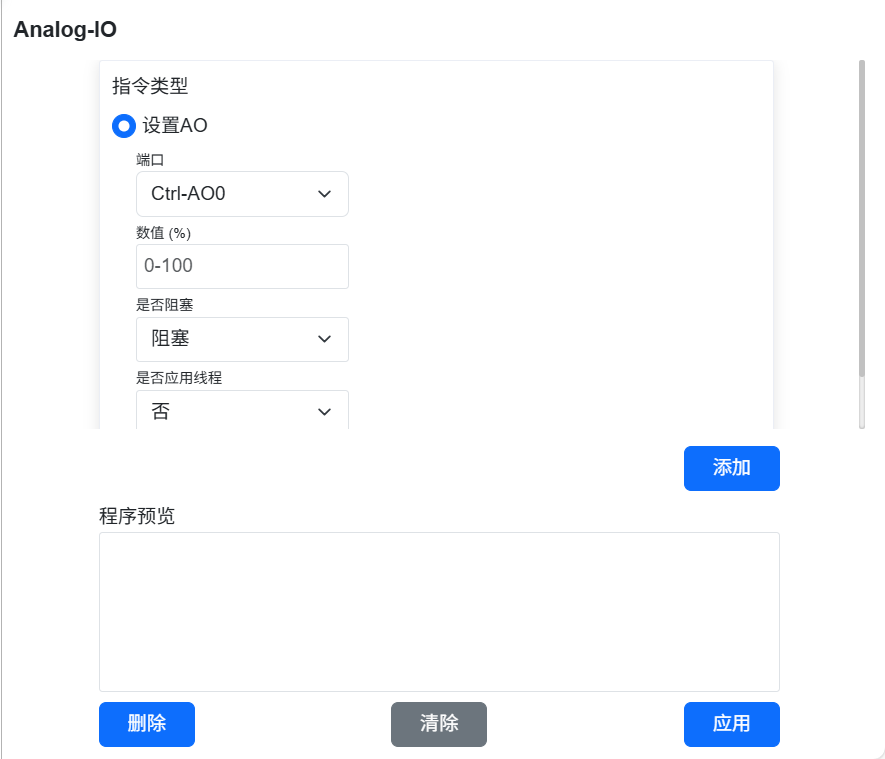

.. centered:: 圖表 9.6-3 SetAO指令介面

「GetAI/SPLCGetAI」選擇需要取得的類比輸入，是否阻塞選項選擇「阻塞」表示運動停止後取得AI狀態，選擇「非阻塞」選項表示在上一條運動過程中取得AI狀態。當指令是加入在輔助執行緒中，是否應用執行緒需要選擇是，其他地方使用該指令選擇否。點選「新增」、「應用」即可。

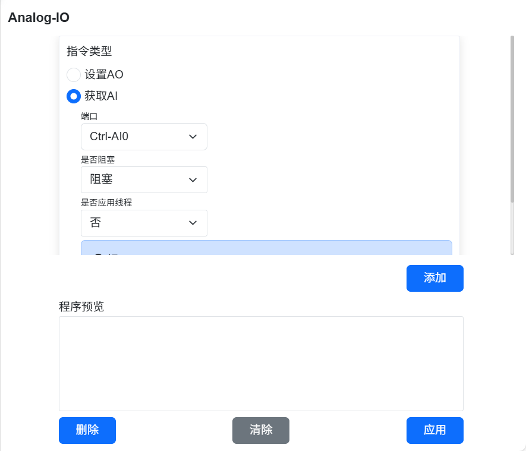

.. centered:: 圖表 9.6-4 GetAI指令介面

虛擬IO命令
++++++++++++++++

點選「虛擬IO」圖示進入Vir-IO指令編輯介面。

此指令虛擬的IO控制指令，可實現設定模擬外部DI和AI狀態，取得模擬DI和AI狀態。

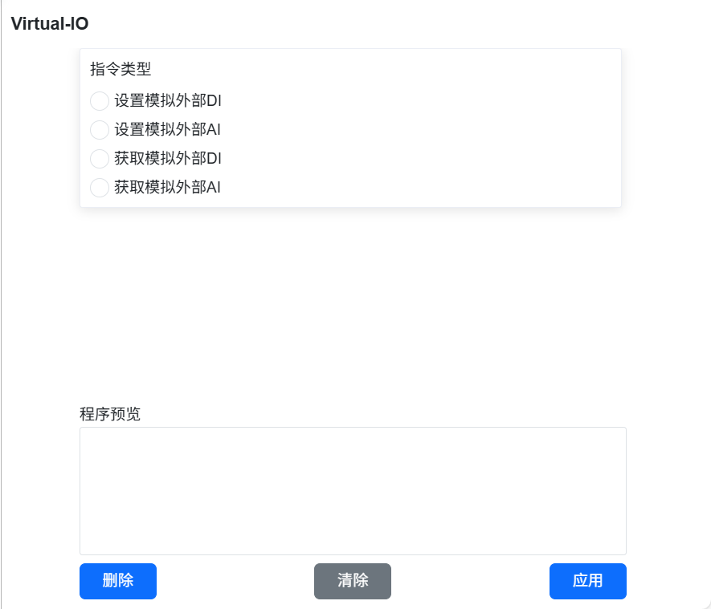

.. centered:: 圖表 9.6-5 Vir-IO指令介面

擴充IO命令
++++++++++++++++

點選「擴充IO」圖示進入Aux-IO指令編輯介面。

Aux-IO是機器人與PLC通訊控制外部擴充IO的指令功能，需要機器人與PLC建立UDP通訊，在原有的16路輸入輸出基礎上，可以擴展128路輸入輸出，該指令用法與前文所講的通用IO用法類似。使用此功能，有一定技術難度，前請聯絡我們諮詢。

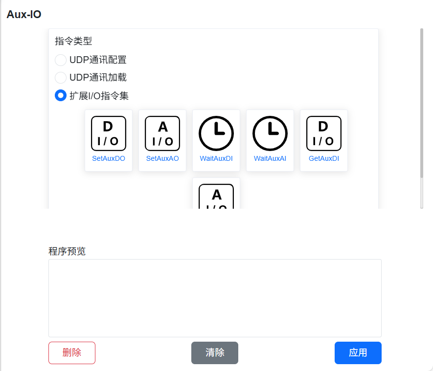

.. centered:: 圖表 9.6-6 Vir-IO指令界面

運動DO命令
++++++++++++++++

點選「運動DO」圖示進入MoveDO指令編輯介面。

此指令分為連續輸出模式和單次輸出模式。

- 連續輸出模式：實現直線運動過程中，根據設定的間隔，連續輸出DO訊號功能。

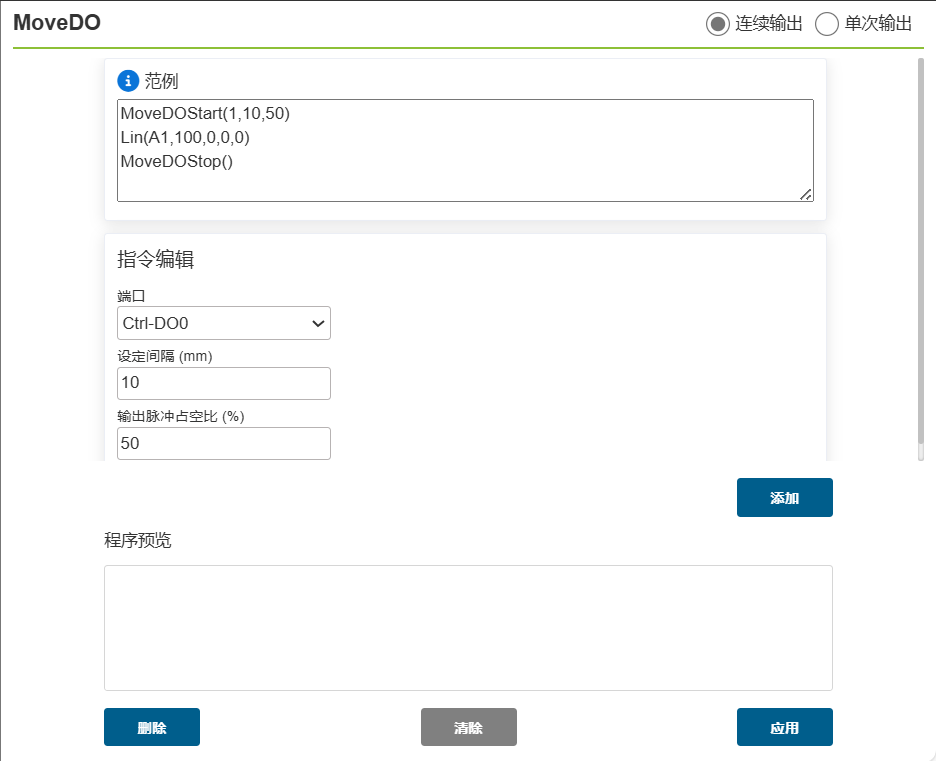

.. centered:: 圖表 9.6-7 MoveDO指令連續輸出介面

- 單次輸出模式：可進行等速段輸出及自由配置兩種選擇。運動開始後輸出置位時間，運動結束前輸出重設時間，範圍[0, 1000]。

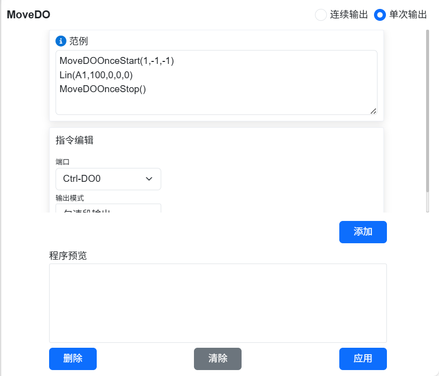

.. centered:: 圖表 9.6-8 MoveDO指令單次輸出介面

運動AO指令
++++++++++++++++

點選「運動AO」圖示進入MoveAO指令編輯介面。

1. 概述

此指令配合運動指令使用時，可實現在運動過程中，依即時TCP速度按比例輸出AO訊號。

2. 運動AO指令說明

運動AO指令位於示教模擬-程式示教指令編輯區域中，圖示為控制指令-運動AO。

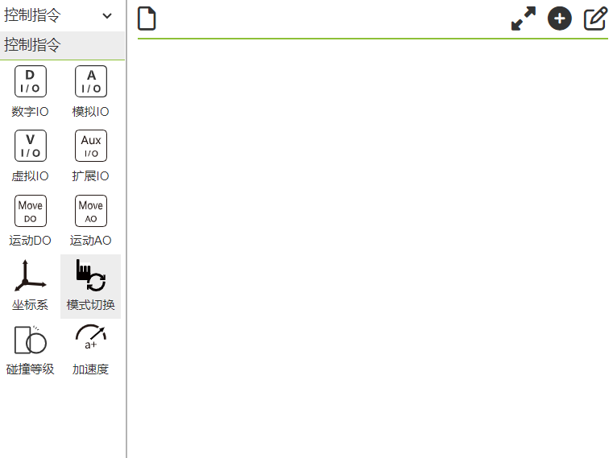

.. centered:: 圖表 9.6-9 運動AO指令

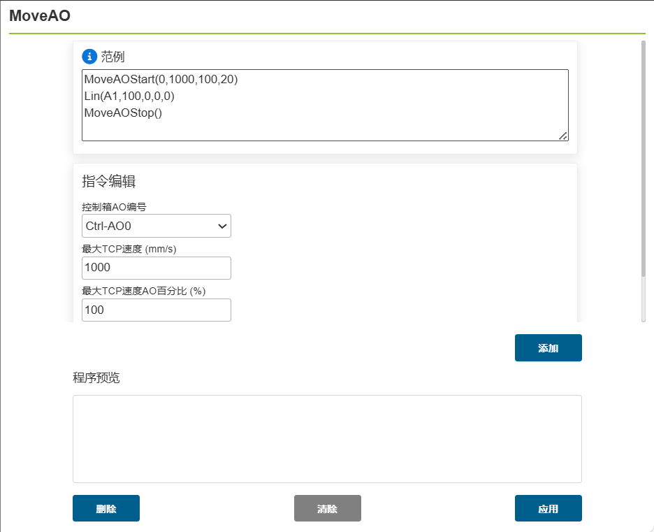

.. centered:: 圖表 9.6-10 動作AO指令明細

- AO編號：下拉清單選擇，Ctrl-AO0對應控制箱AO0，Ctrl-AO1對應控制箱AO1，End-AO0對應末端AO0。

- 最大TCP速度：機器人最大TCP速度值；作用：與即時TCP速度形成比例。

- 最大TCP速度AO百分比：機器人最大TCP速度值對應的AO百分比；作用：設定AO輸出的上限值。

- 死區補償值AO百分比：當比例閥存在死區時，可設定此參數以確保AO輸出；作用：設定AO輸出的下限值。

.. important::
 計算公式：輸出AO百分比=即時TCP速度/設定最大TCP速度*設定最大TCP速度AO百分比。

 此指令所配對的運動指示如下：PTP/LIN/ARC/CIRCLE/SPLINE/NSPLINE/SERVOJ。

座標系命令
++++++++++++++++

點選「座標系」圖示進入ToolList指令編輯介面。

選擇工具座標系名稱，點選「應用」以新增指令到程式中，當程式執行該語句，就會設定機器人的工具座標系。

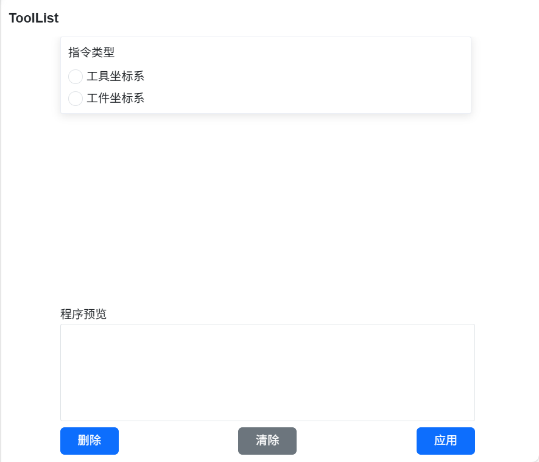

.. centered:: 圖表 9.6-11 ToolList指令介面

模式切換命令
++++++++++++++++

點選「模式切換」圖示進入Mode指令編輯介面。

該指令可切換機器人到手動模式，通常在一個程式結尾處添加，以便使用者在程式運行結束後，使機器人自動切換到手動模式，拖曳機器人。

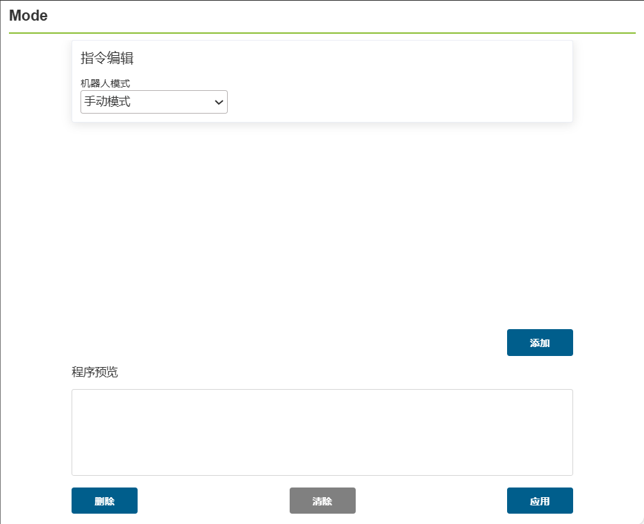

.. centered:: 圖表 9.6-12 Mode指令介面

碰撞等級命令
++++++++++++++++

點選「碰撞等級」圖示進入Collision指令編輯介面。

此指令碰撞等級設置，透過此指令可在程式運作中即時調整各軸碰撞等級，更靈活的部署應用場景。

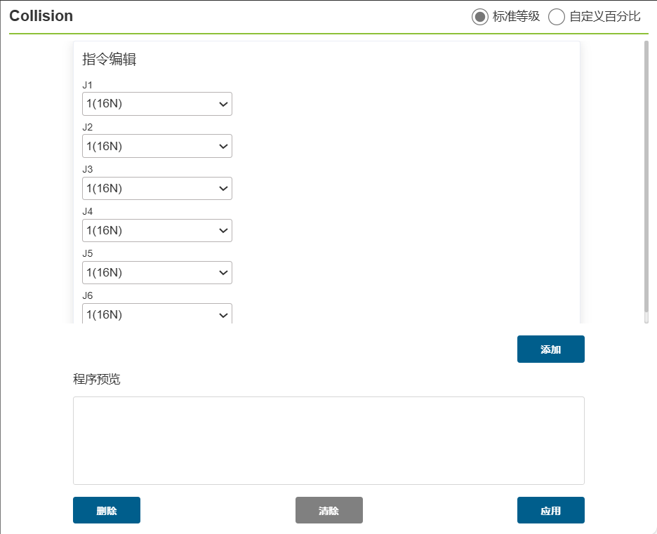

.. centered:: 圖表 9.6-13 Collision指令介面

加速度命令
++++++++++++++++

點選「加速度」圖示進入Acc指令編輯介面。

Acc指令是實現機器人加速度可單獨設定功能，透過調節運動指令加速度縮放因子，可增加或減少加減速時間，實現機器人動作節拍時間可調。

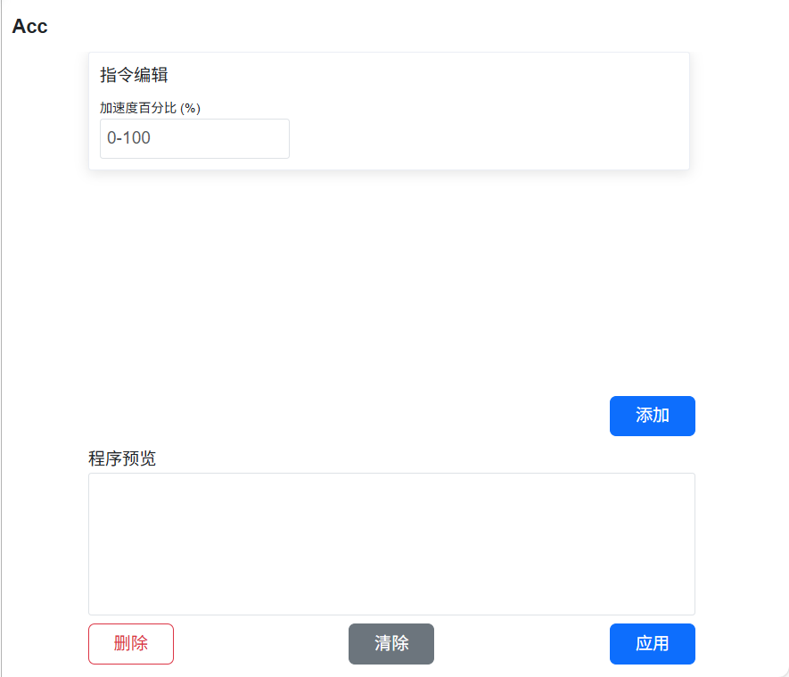

.. centered:: 圖表 9.6-14 Acc指令介面

外設指令介面
~~~~~~~~~~~~~

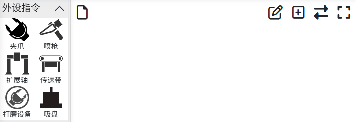

.. centered:: 圖表 9.7 外設指令介面

夾爪命令
++++++++++++++++

點選「夾爪」圖示進入Gripper指令編輯介面。

在這個指令中，分為夾爪運動控制指令和夾爪啟動/重設指令，夾爪控制指令中，顯示完成配置並且已啟動的夾爪編號，使用者可以透過編輯框編輯，或滑動條滑動至所需的值來完成對夾爪開閉、開閉速度和開閉力矩的設置，數值為百分比，是否阻塞功能選項，選擇阻塞即夾爪運動需等待上一條運動指令執行完才執行，選擇非阻塞即夾爪運動與上一條運動指令並行。點選「新增」、「應用」按鈕，即可將設定的數值儲存至示教文件中。夾爪重設/啟動指令，顯示已配置的夾爪編號，可以新增重設/啟動指令到程式中。

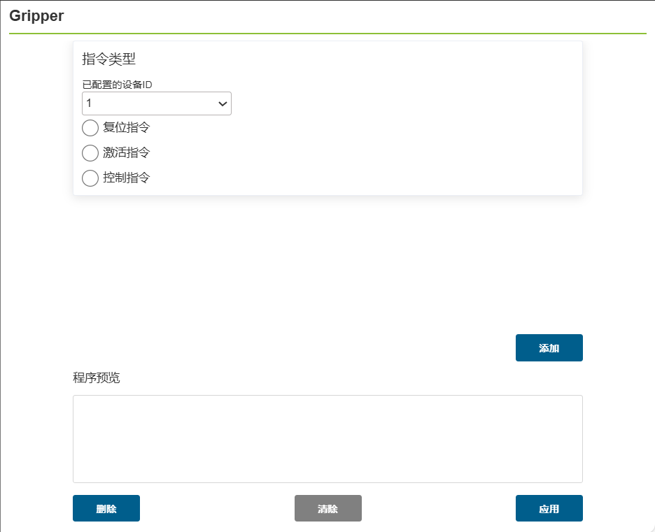

.. centered:: 圖表 9.7-1 Gripper指令介面

噴槍命令
++++++++++++++++

點選「噴槍」圖示進入Spray指令編輯介面。

該指令為噴塗相關指令，控制噴槍「開始噴塗」、「停止噴塗」、「開始清槍」和「停止輕槍」。編輯此程式指令時，需確認已配置好噴槍外設，詳見機器人週邊章節。

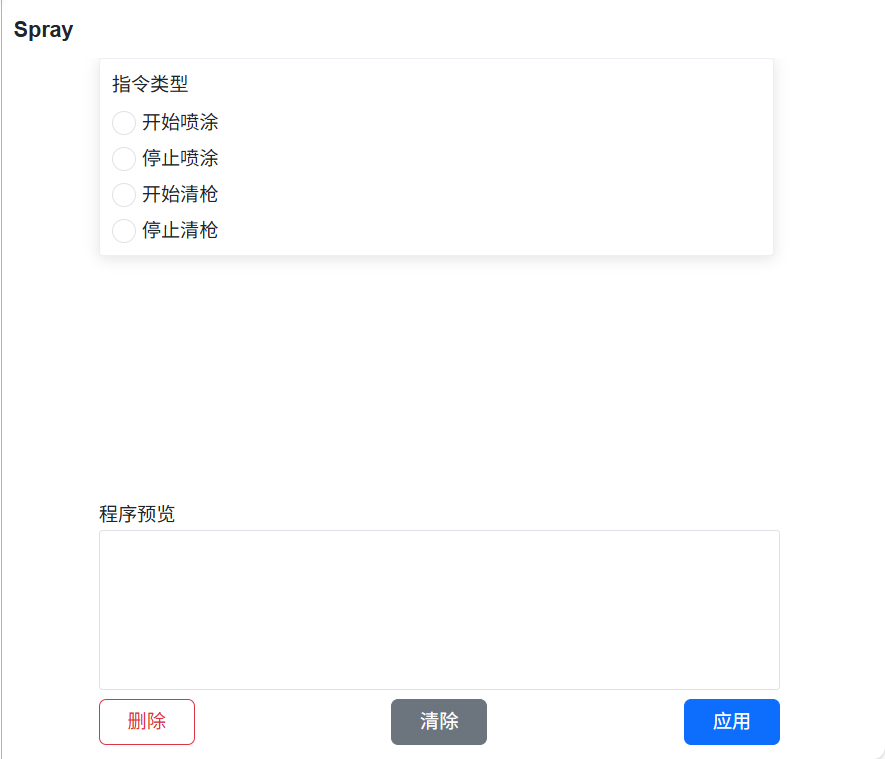

.. centered:: 圖表 9.7-2 Spray指令介面

外部軸指令
++++++++++++++++

點選「外部軸」圖示進入EAxis指令編輯介面。 ，選擇組合模式：

- 控制器+伺服驅動器(485)
- 控制器+PLC(UDP)

選擇控制器+PLC(UDP)，該指令針對使用外部軸的場景，與PTP指令組合使用，可將空間上一點X軸方向上的移動分解到外部軸運動。選擇外部軸編號，運動方式選同步，選擇需要到達的點，點選「新增」、「應用」後可儲存該條指令。

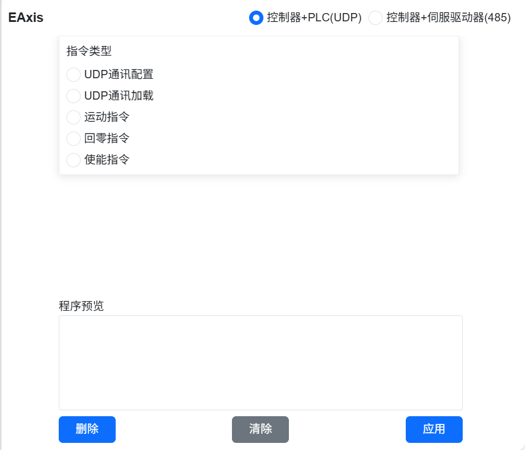

.. centered:: 圖表 9.7-3 EAxis指令介面

選擇控制器+伺服驅動器(485)，此指令可對擴展軸參數進行配置。根據不同的控制模式設定不同的參數。已配置好的擴充軸，可對其零點設定。

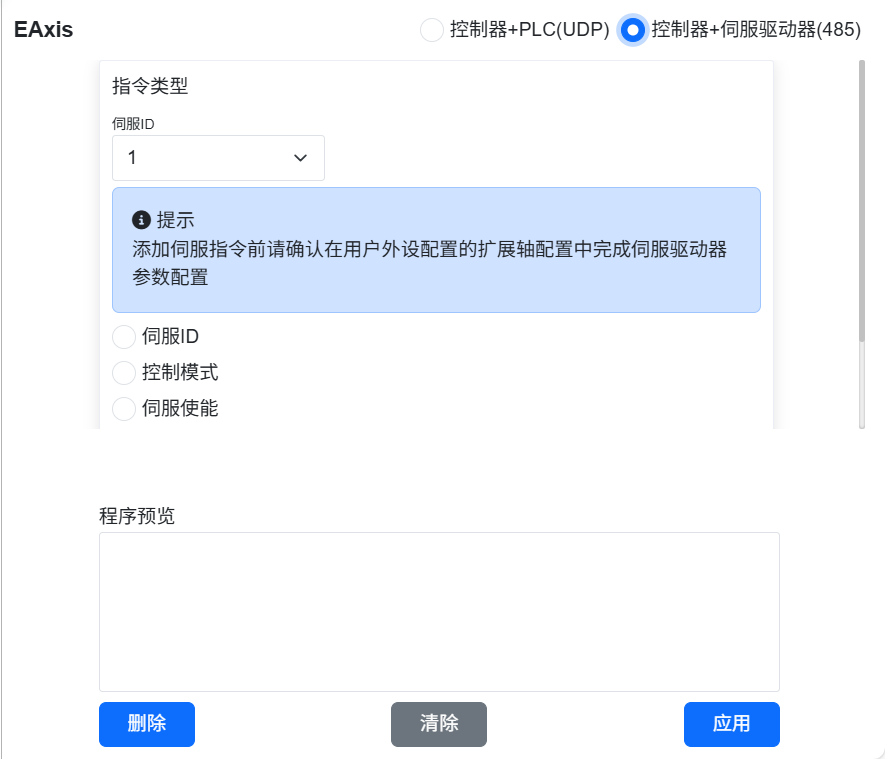

.. centered:: 圖表 9.7-4 擴展軸指令介面

傳送帶命令
++++++++++++++++

點選「傳送帶」圖示進入Convey指令編輯介面。

指令包含位置即時偵測，IO即時偵測，追蹤開啟和追蹤關閉四個​​指令。詳見機器人週邊章節。

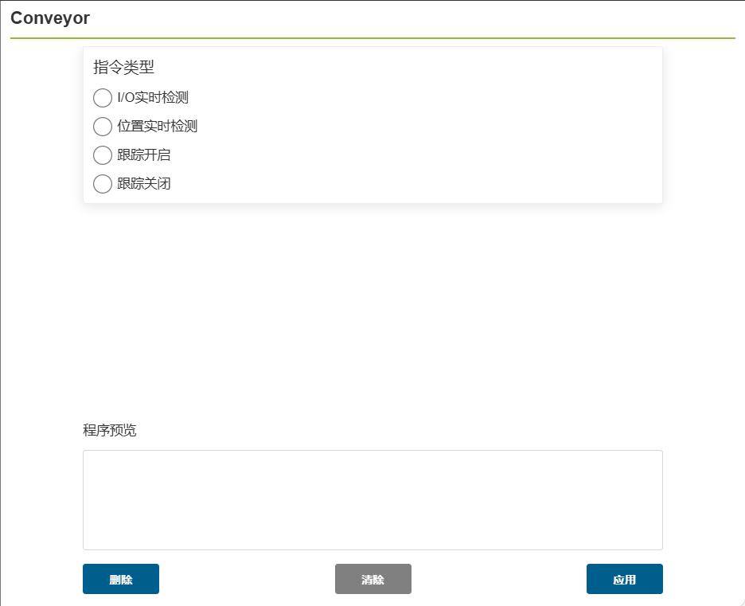

.. centered:: 圖表 9.7-5 Conveyor指令介面

打磨設備命令
++++++++++++++++

點選「打磨設備」圖示進入Polish指令編輯介面。

此指令可設定打磨設備的轉速、接觸力、伸出距離和控制模式等。

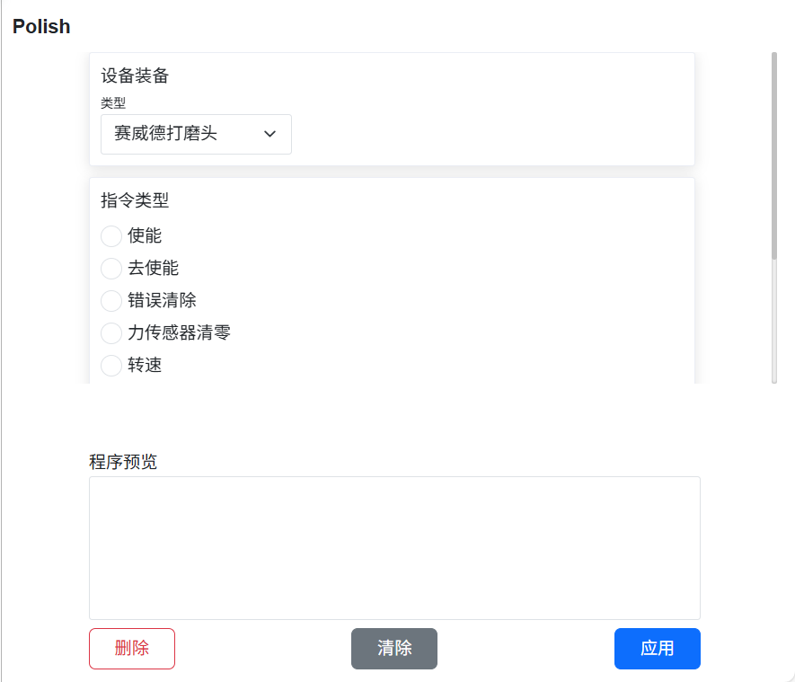

.. centered:: 圖表 9.7-6 Polish命令介面

焊接指令介面
~~~~~~~~~~~~~

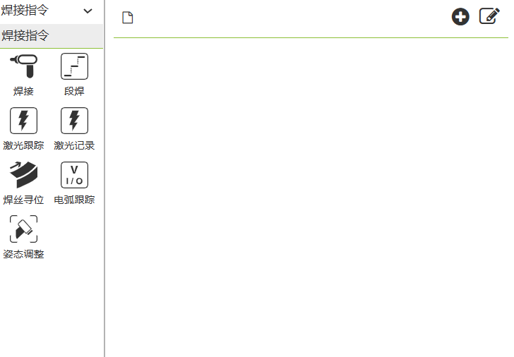

.. centered:: 圖表 9.8 焊接指令介面

焊接命令
++++++++++++++++

點選「焊接」圖示進入Weld指令編輯介面。

此指令主要用於焊接機外設，在新增指令前請確認在使用者外設中焊接機配置是否完成，詳見機器人週邊章節。

- 焊接電壓範圍： 0~700V
- 焊接電流範圍： 0~1000A

.. important:: 配置輸出AO、焊接電流、焊接電壓時，需選擇I/O型式。若選擇控制器I/O，則需選擇與輸出AO。

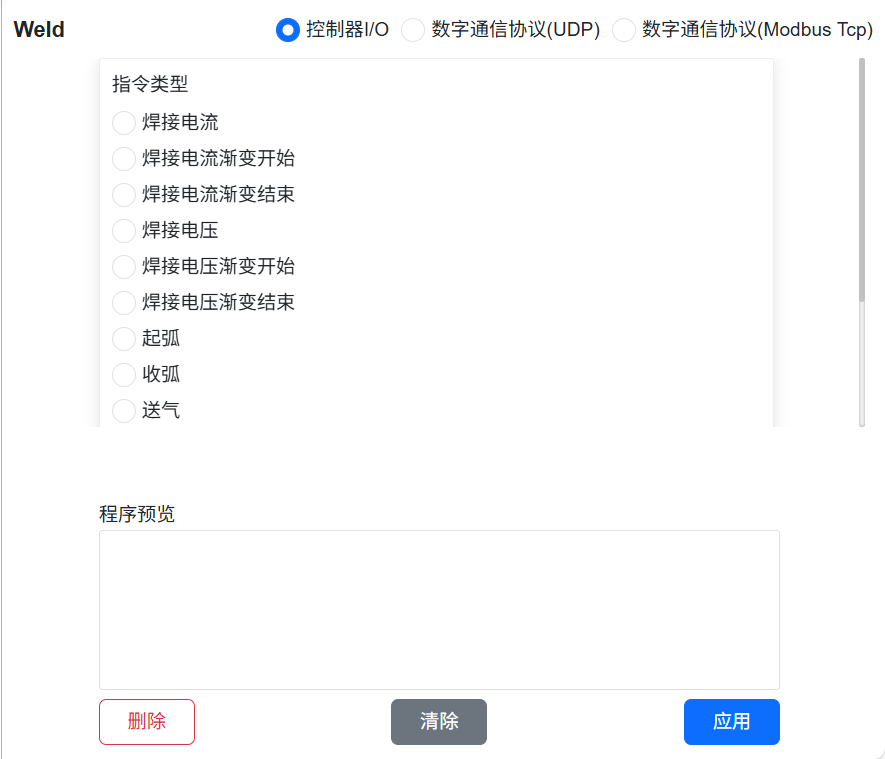

.. centered:: 圖表 9.8-1 Weld指令介面

段焊命令
++++++++++++++++

點選「段焊」圖示進入Segment指令編輯介面。

協作機器人透過新增段焊指令可以進行段焊操作，在新增段焊指令前需要先選擇段焊模式，並示教起始點和終點。段焊模式分為不變化姿態和變化姿態，機器人根據所選段焊接模式，來考慮焊接軌跡過程中是否變化姿態。

示教起始點位“segment01”和終點“segment02”，確認焊接軌跡起始點和終點位置，如下圖。

.. image:: coding/106.png
   :width: 3in
   :align: center

.. centered:: 圖表 9.8-2-1 起始點位元“segment01”

.. image:: coding/107.png
   :width: 3in
   :align: center

.. centered:: 圖表 9.8-2-2 終點“segment02”

段焊指令添加
**************

**Step1**：新使用者程式“testSegment1.lua”，點選“段焊”按鈕，開啟段焊指令新增頁面。

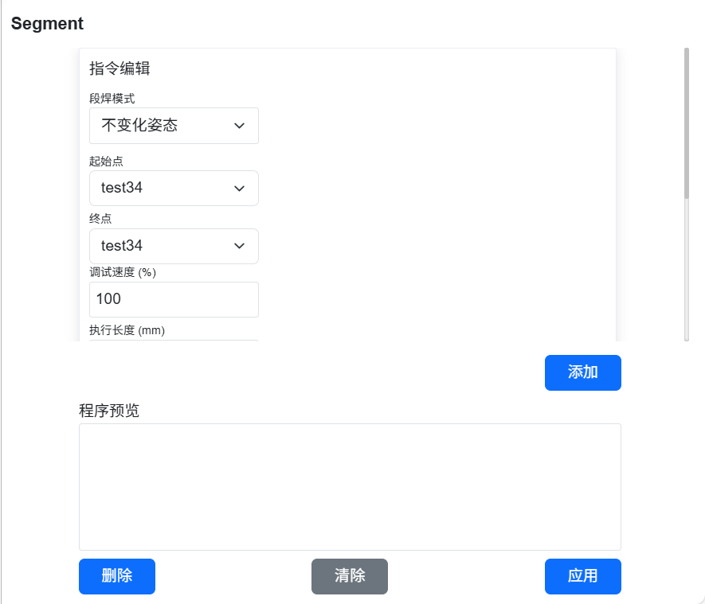

.. centered:: 圖表 9.8-2-3 新增段焊指令按鈕

**Step2**：在段焊指令新增頁面中選擇“起始點”為“segment01”，選擇“終點”為“segment02”。

.. centered:: 圖表 9.8-2-4 段焊起始點、終點

**Step3**：配置偵錯速度、執行長度、非執行長度、功能模式、擺動選擇和取整規則，依序點選「新增」按鈕和「應用」按鈕。

**Step4**：此時「testSegment1.lua」已經增加段焊運動指令。

.. image:: coding/110.png
   :width: 6in
   :align: center

.. centered:: 圖表 9.8-2-5 段焊運動指令添加

段焊運動軌跡姿態變化
**********************

協作機器人的段焊運動可選擇段焊模式，模式類型包括以下兩種類型；

**不變化姿態**：機器人在焊接軌跡過程中始終保持焊接軌跡起始點姿態運作。

**變化姿態**：機器人在焊接軌跡過程中，計算每一段軌跡的笛卡爾位姿和關節位置，在段焊運行過程中變化姿態。

以下分別示範「不變化姿態」和「變化姿態」的用法。

1. 不變化姿態

開啟段焊指令新增頁面，“段焊模式”選擇“不變化姿態”，同樣選擇起始點”為“segment01”，“終點”為“segment02”，執行長度設定100，非執行長度設定成50，並選擇其他相關配置後儲存程式。

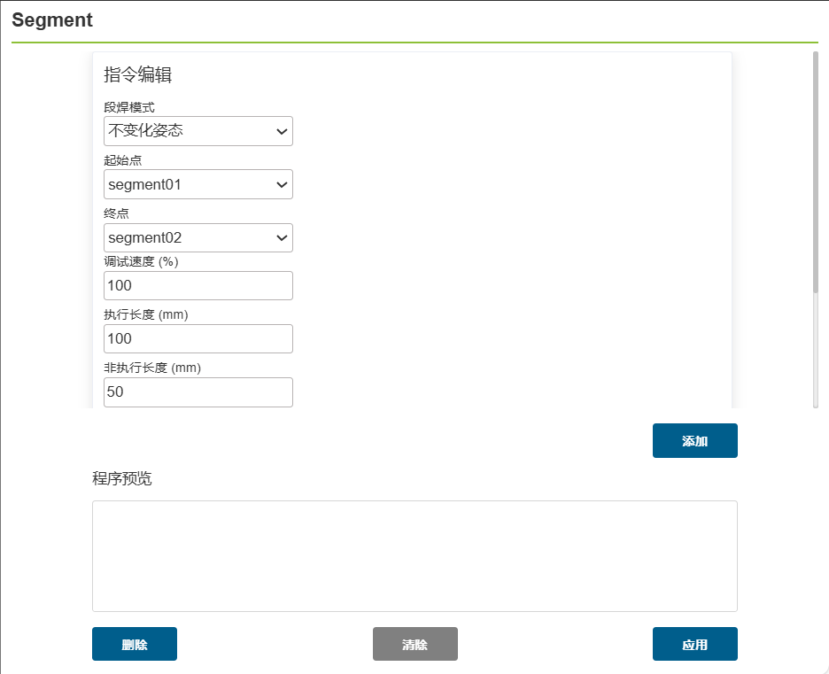

.. centered:: 圖表 9.8-2-6 不變化姿態段焊接模式

2. 變化姿態

開啟段焊指令新增頁面，“段焊模式”選擇“變化姿態”，同樣選擇起始點”為“segment01”，“終點”為“segment02”，執行長度設定100，非執行長度設定成50，並選擇其他相關配置後儲存程式。

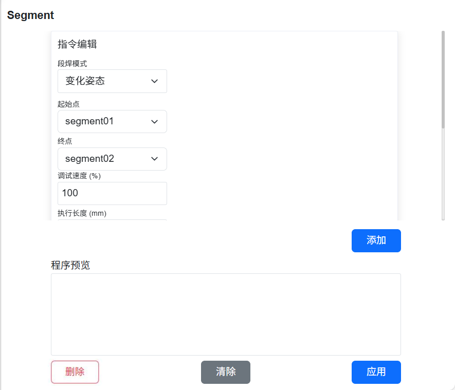

.. centered:: 圖表 9.8-2-7 變化姿態段焊接模式

3. 段焊運作類型

運行程序，機器人段焊運作分為以下幾種：

1) 若功能模式選擇第一段執行功能，擺動選擇執行段擺動，取整規則不取整。則機器人100mm執行擺動運動，50mm執行直線運動交替進行，到終點時停止；

.. centered:: 圖表 9.8-2-8 第一段執行擺動功能不取整

2) 若功能模式選擇第一段不執行功能，擺動選擇不執行段擺動，取整規則不取整。則機器人50mm執行擺動運動，100mm執行直線運動交替進行，到終點時停止；

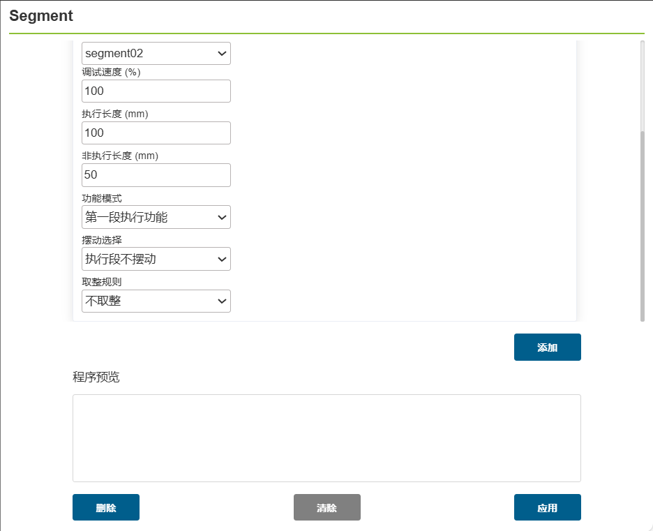

.. centered:: 圖表 9.8-2-9 第一段不執行擺動功能不取整

3) 若功能模式選擇第一段執行功能，擺動選擇執行段擺動，取整規則取整。則機器人100mm執行擺動運動，50mm執行直線運動交替進行，最後一段整體循環結束後，如果剩餘距離小於150mm，則停止擺動；

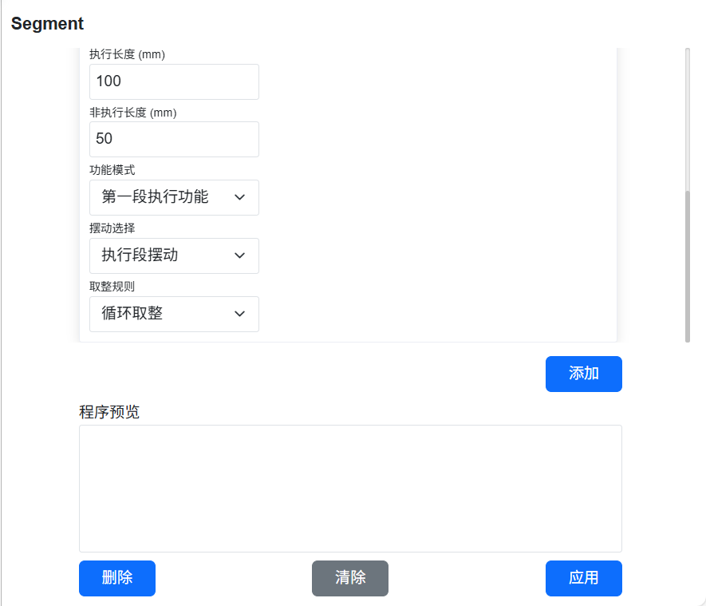

.. centered:: 圖表 9.8-2-10 第一段執行擺動功能循環取整

4) 若功能模式選擇第一段執行功能，擺動選擇不執行段擺動，取整規則取整。則機器人50mm執行擺動運動，100mm執行直線運動交替進行，最後一段整體循環結束後，如果剩餘距離小於150mm，則停止擺動；

.. centered:: 圖表 9.8-2-11 第一段不執行擺動功能循環取整

5) 若功能模式選擇第一段執行功能，擺動選擇執行段擺動，取整規則單段取整。則機器人100mm執行擺動運動，50mm執行直線運動交替進行，最後一段循環結束後，如果下一段是100mm執行擺動規劃且剩餘距離小於100mm，則停止擺動；如果下一段是50mm執行直線運動規劃且剩餘距離小於50mm，則運動停止；

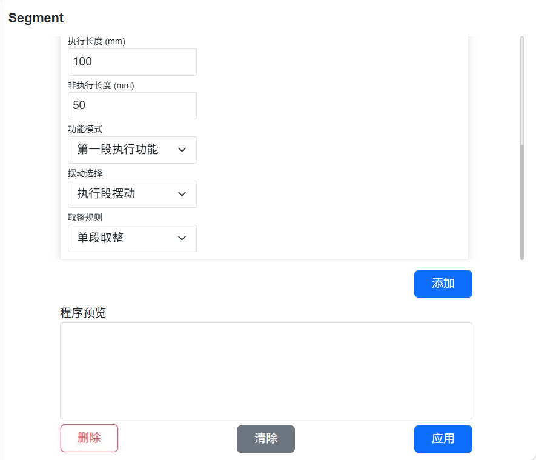

.. centered:: 圖表 9.8-2-12 第一段執行擺動功能單段取整

6) 若功能模式選擇第一段執行功能，擺動選擇不執行段擺動，取整規則單段取整。則機器人50mm執行擺動運動，100mm執行直線運動交替進行，最後一段循環結束後，如果下一段是50mm執行擺動規劃且剩餘距離小於50mm，則停止擺動；如果下一段是100mm執行直線運動規劃且剩餘距離小於100mm，則運動停止。

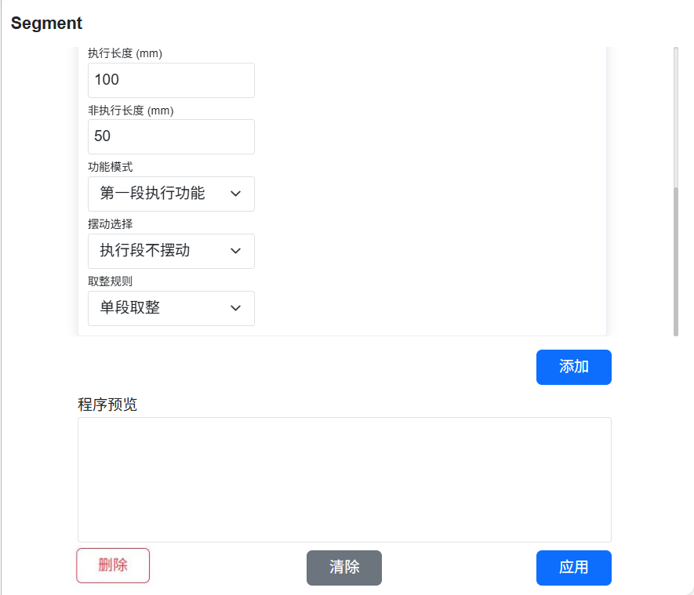

.. centered:: 圖表 9.8-2-13 第一段不執行擺動功能單段取整

4. 姿態對比

配置不同段焊接模式時，機器人焊接軌跡運作中的姿態也會不同，運作過程中姿態比較如下：

.. image:: coding/119.png
   :width: 3in
   :align: center

.. centered:: 圖表 9.8-2-14 焊接軌跡初始姿態

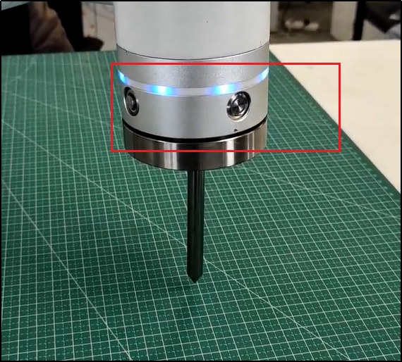

.. centered:: 圖表 9.8-2-15 運轉過程中不變化姿態

.. image:: coding/121.png
   :width: 3in
   :align: center

.. centered:: 圖表 9.8-2-16 運轉過程中變化姿態

段焊實際場景
**************
在實際測試環境中，機器人需要安裝焊槍等配置，根據創建的段焊指令，在焊接板上進行焊接操作，實際場景圖如下：

.. image:: coding/122.png
   :width: 3in
   :align: center

.. centered:: 圖表 9.8-2-17 段焊實際場景

雷射追蹤指令
++++++++++++++++

點選「雷射追蹤」圖示進入Laser指令編輯介面。

該指令包含雷射指令、追蹤指令和尋位指令三部分，在加入指令前，請確認使用者周邊裝置中雷射追蹤感測器是否已經配置成功。詳見機器人週邊章節。

感測器載入模組中，根據功能選擇顯示對應「感測器指令」介面後，進行感測器指令配置：

**睿牛/創想**：輸入焊接類型，範圍：0~49整數

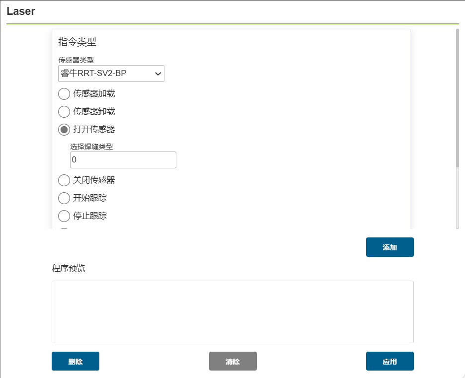

.. centered:: 圖表 9.8-3-1 Laser指令介面(焊縫型)

**全視**：輸入任務編號，範圍：0~255整數

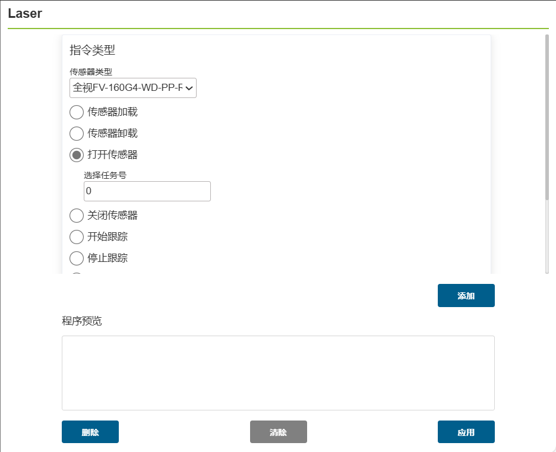

.. centered:: 圖表 9.8-3-2 Laser指令介面(任務號)

雷射記錄指令
++++++++++++++++

點選「雷射記錄」圖示進入LT-Rec指令編輯介面。

該指令實現雷射追蹤記錄起點、終點取出功能，使機器人可以自動移動到起點位置，適用於從工件外部開始運動並進行雷射追蹤記錄的場合，同時上位機可取得記錄資料中起點、終點的信息，用於後續運動。

實現雷射追蹤復現速度可調功能，使機器人可以用一個很快的速度進行記錄，然後按照正常焊接速度進行復現，可以提高作業效率。

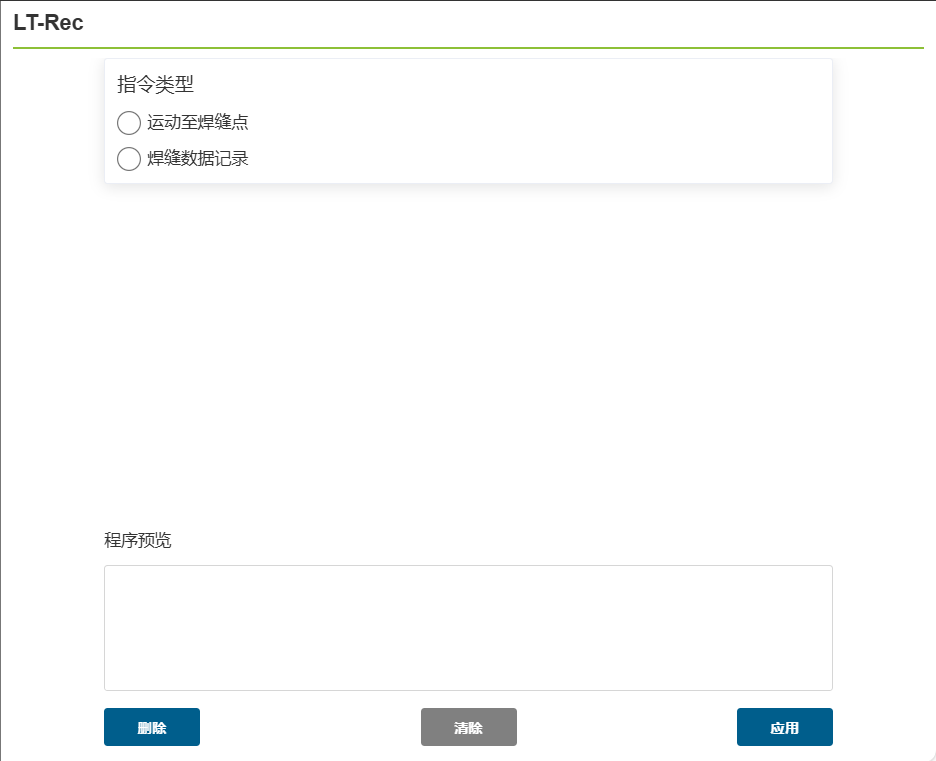

.. centered:: 圖表 9.8-4 LT-Rec指令介面

焊絲尋位命令
++++++++++++++++

點選「焊絲尋位」圖示進入W-Search指令編輯介面。

此指令為焊絲尋位指令，包含尋位開始，尋位結束和計算偏移量三個指令，該指令一般應用於焊接場景中，需要焊機與機器人IO和運動指令結合使用。

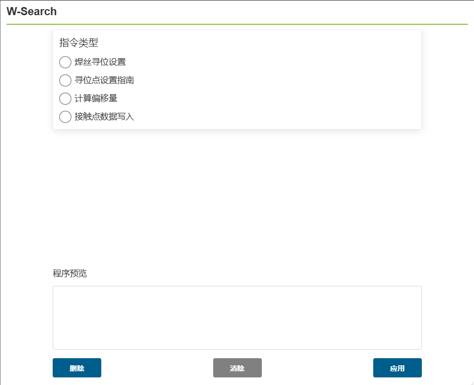

.. centered:: 圖表 9.8-5 W-Search指令介面

在編寫程式中，通常會先設定尋位開始指令，之後再加入兩條LIN指令，確定尋位的方向，而尋位成功後，取得計算出來的偏移量，將該偏移量經由整體偏移指令，生效到真正的焊接運動指令中，程序示例如下。

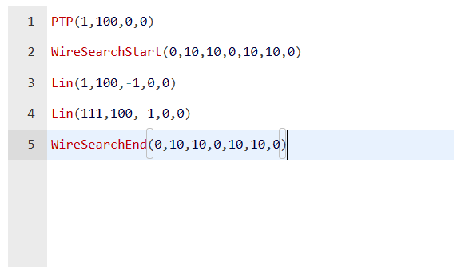

.. centered:: 圖表 9.8-5-1 W-Search範例（1D）

電弧跟蹤指令
++++++++++++++++

點選「電弧追蹤」圖示進入Weld-Trc指令編輯介面。

該指令實現機器人焊縫追蹤利用焊縫的偏差檢測進行補償軌跡，可以使用電弧感測器來檢測焊縫偏差。

**Step1**：上下補償基準電流設定方式：回饋，設定上下基準電流開始計數與上下基準電流計數

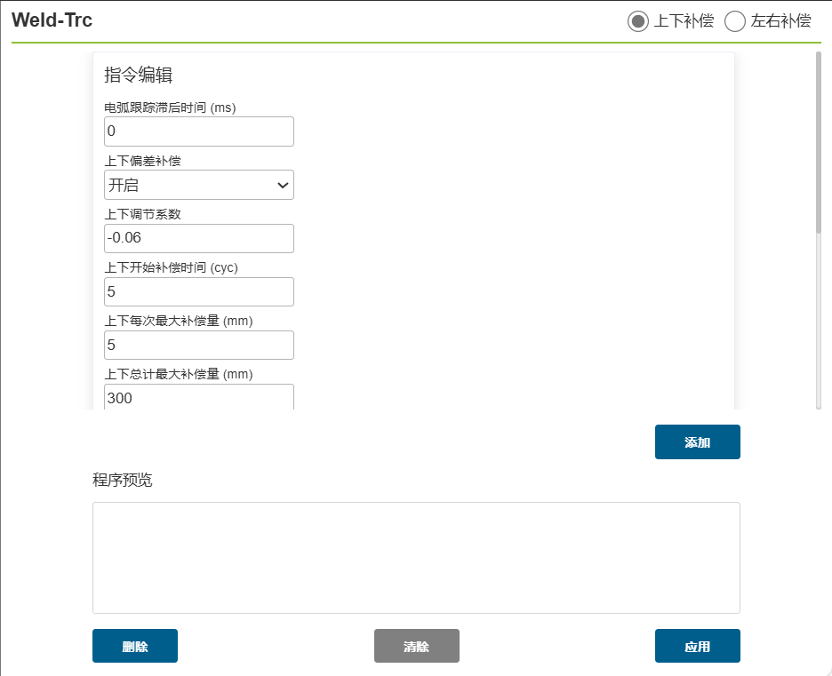

.. centered:: 圖表 9.8-6-1 Weld-Trc指令介面-回饋

**Step2**：上下補償基準電流設定方式：常數，設定上下基準電流

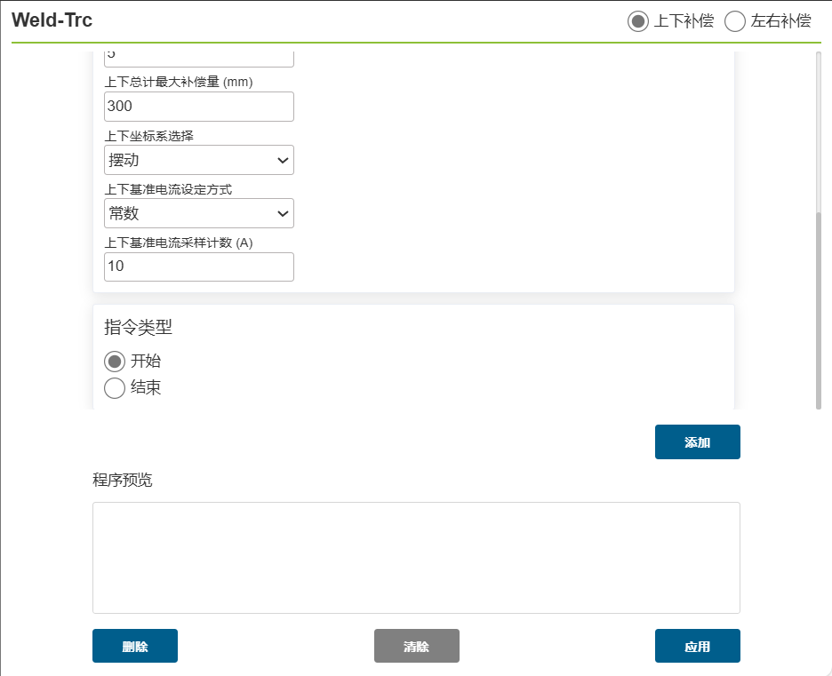

.. centered:: 圖表 9.8-6-2 Weld-Trc指令介面-常數

**Step3**：左右補償參數互動頁面

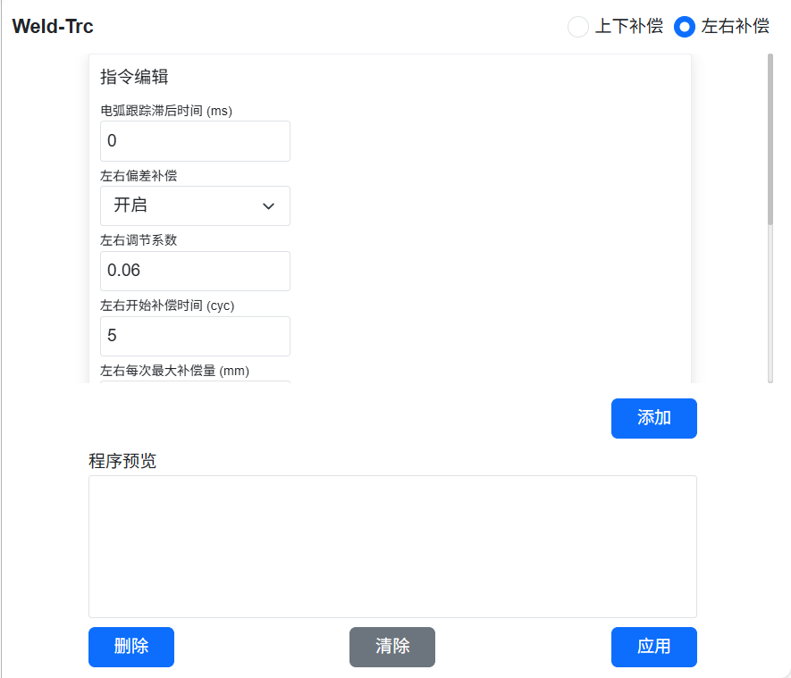

.. centered:: 圖表 9.8-6-3 Weld-Trc指令介面-左右補償參數

機器人電弧追蹤系統構成
+++++++++++++++++++++++

協作機器人電弧追蹤焊接過程中，焊接機將即時焊接電流訊號回饋至PLC，再由PLC透過UDP通訊回饋至機器人；機器人依據即時回饋焊接電流數值進行焊接軌跡位置補償，實現電弧追蹤效果。上述焊接機和PLC之間電流訊號回饋有兩種方式：

①CANopen或其他匯流排通訊：若您的焊接機支援CANopen、EtherCAT、ModbusTCP等匯流排通訊協定（如奧太NBC-500RP、麥格米特A2系列等），PLC與焊接機間可直接透過相關通訊協定進行數據通訊，相應焊接電流訊號可直接透過通訊傳輸至PLC中，再由PLC透過UDP通訊回饋至機器人。

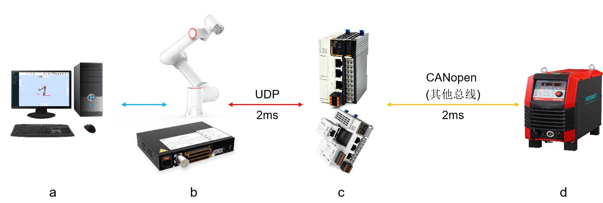

.. centered:: 圖表 9.8-6-4 機器人電弧追蹤系統構成拓樸圖（PLC與焊接機匯流排通訊）
.. centered:: a-電腦；b-機器人及控制箱；c-PLC及匯流排通訊模組；d-焊接機

②IO類比量：PLC也可以直接擷取類比量訊號，再將類比訊號以一定的轉換關係轉換成電流數值回饋至機器人；若您的焊接機具有即時焊接電流類比輸出通道，可直接將此通道接取至PLC的類比量輸入模組中；若您的焊接機不具有即時焊接電流類比輸出通道，可外接一個霍爾電流感測器，感測器擷取即時焊接電流訊號，並將焊接電流訊號轉成類比訊號輸出至PLC類比輸入模組。

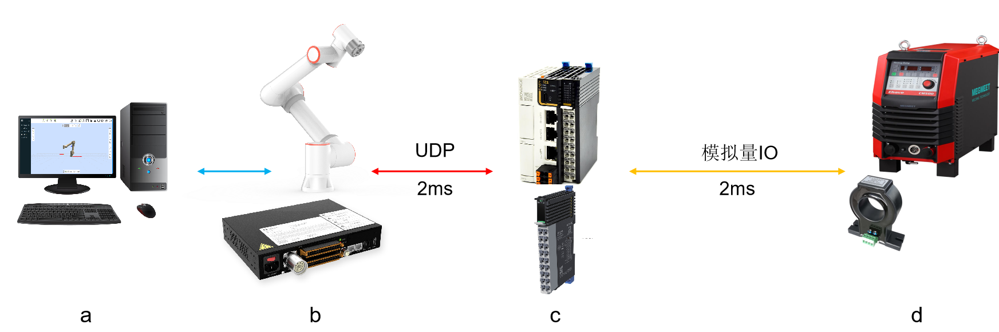

.. centered:: 圖表 9.8-6-5 機器人電弧追蹤系統構成拓樸圖（PLC擷取類比量訊號）
.. centered:: a-計算機；b-機器人及控制箱；c-PLC及類比量輸入模組；d-焊接機及霍爾電流感測器

焊機型號與設定
****************************************

.. centered:: 表格 9.8-1 焊接機型號與設定

.. list-table::
   :widths: 70
   :header-rows: 0
   :align: center

   * - **目前已測試可適配焊機型號**

   * - 麥格米特ArtsenII CM350焊接機
  
.. centered:: 表格 9.8-2 麥格米特ArtsenII CM350焊接機

.. list-table::
   :widths: 100 100
   :header-rows: 0
   :align: center

   * - **功能號**
     - **設定參數**

   * - F18
     - 20

   * - F19
     - 56

PLC型號與設定
************************
.. centered:: 表格 9.8-3 PLC型號與設定

.. list-table::
   :widths: 70
   :header-rows: 0
   :align: center

   * - **PLC型號與設定**

   * - 匯川Easy521
  
.. centered:: 表格 9.8-4 PLC關鍵設定

.. list-table::
   :widths: 70 70
   :header-rows: 0
   :align: center

   * - **設定項**
     - **設定內容**

   * - 通訊協定
     - CANOPEN

   * - 反饋電流取樣源
     - 焊機CANOPEN回饋數據

   * - 同步週期
     - 2ms

:download:`附件：PLC程式 <../_static/_doc/麦格米特焊机plc.zip>`

電弧追蹤功能
*********************

**1）功能介面參數簡介**

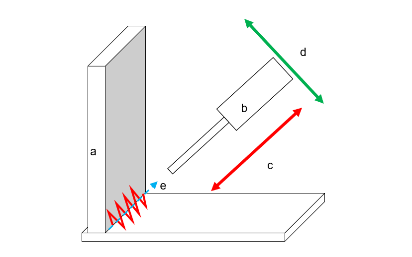

.. centered:: 圖表 9.8-7-1 電弧跟踪典型場景

電弧追蹤功能的典型場景包含：a.焊接工件（焊接坡口為直角或銳角），b.焊槍，e為坡口中心線。

電弧追蹤功能能夠透過採集的焊接電流資訊與機器人設定的擺動參數，實現對焊接坡口：c.上下（深度）方向追蹤和d.左右（中心）方向追蹤。

**2）通訊配置**

開啟WebApp，依序點選「初始設定」、「使用者週邊配置」、「焊接機配置」。

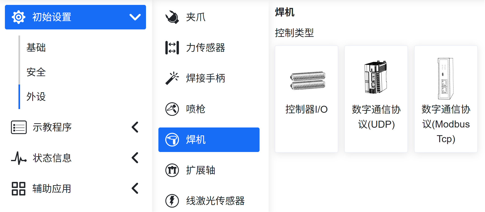

.. centered:: 圖表 9.8-7-2 打開焊機配置

選擇控制類型為“數位通訊協定”，配置UDP通訊參數，其中各項參數的含義如下：

**IP位址**：UDP通訊PLC端的IP位址；

**連接埠號碼**：PLC端UDP通訊埠號碼；

**通訊週期**：機器人與PLC進行UDP通訊的週期，預設為2ms；

**丟包偵測週期、丟包次數**：在丟包偵測週期內的丟包個數超過設定值時，機器人報「UDP通訊丟包異常」錯誤，同時通訊自動切斷。

**通訊中斷確認時長**：機器人在該時長內未收到一幀完整的PLC回饋資料包即報「UDP通訊中斷」錯誤警報，同時切斷UDP通訊。

**通訊中斷自動重連**：機器人偵測到UDP通訊中斷後是否自動進行重連恢復；

**重連週期、重連次數**：使能UDP通訊中斷自動重連且偵測到UDP通訊中斷後，機器人以設定的週期進行重連，當重連次數達到最大設定值仍未連接成功時，機器人警報「UDP通訊中斷」錯誤警報，同時切斷UDP通訊。

配置完成上述參數後，依序點選「配置」和「載入」按鈕。

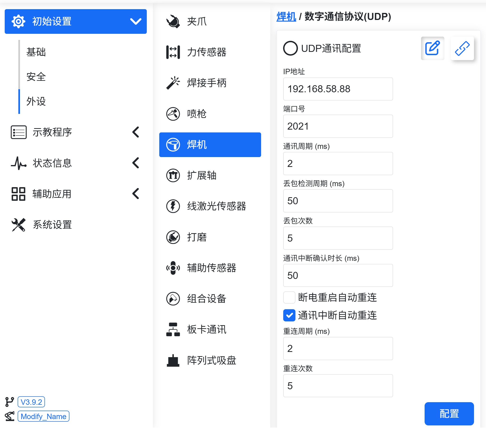

.. centered:: 圖表 9.8-7-3 選擇控制類型

**3）通道配置**

依序點選“初始設定”、“基礎”、“I/O設定”、“AI”，依照實際配置選擇對應的擴充AI頻道，點選“應用”按鈕。

.. note::
 機器人與PLC間UDP通訊協定請見《8.5.5 附件一：機器人UDP通訊協定》，協定中PLC向機器人回饋資料包含序號70~73的4個類比輸入通道，對應圖4-4中的Aux-AI0 ~3；

 焊接過程中PLC擷取即時焊接電流訊號，並將其轉成0~4095數值訊號賦值給某個類比量輸入通道，預設為“Aux-AI0”，機器人端擷取對應類比輸入通道數值進行電弧追蹤操作；

 若您需要變更電弧追蹤通道為“Aux-AI1”、“Aux-AI2”或“Aux-AI3”，則需要同步更新PLC端程序，將擷取的即時焊接電流賦值給對應的類比量輸入埠）。

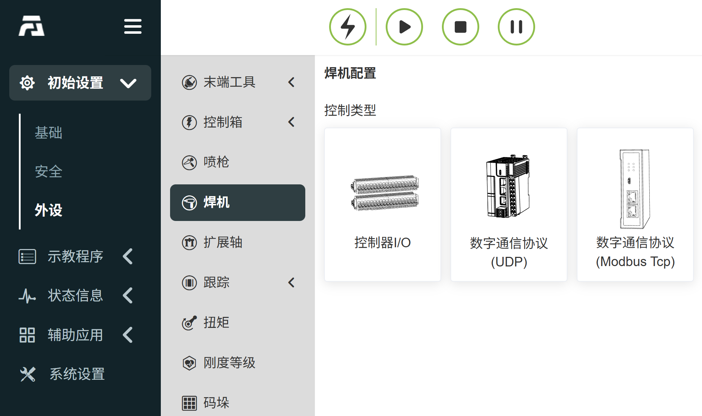

.. centered:: 圖表 9.8-7-4 電弧追蹤通道配置

**4）功能指令使用簡介**

電弧追蹤功能能夠適配於擺動焊接運動中，在擺動焊接起弧後插入電弧追蹤開始指令、在擺動焊接滅弧前插入電弧追蹤結束指令。

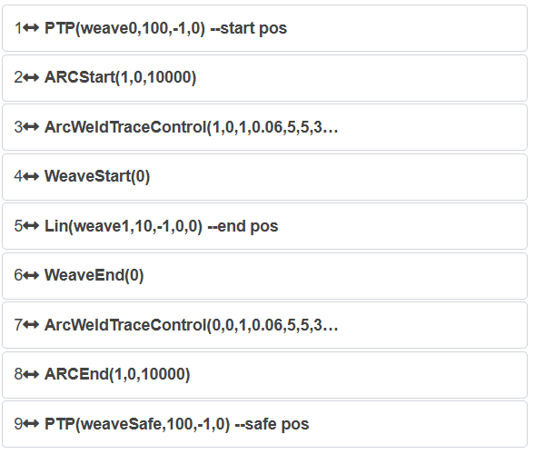

.. centered:: 圖表 9.8-7-5 典型電弧追蹤示例程

**5）功能介面參數簡介**

.. centered:: 表格 9.8-5 電弧追蹤上下補償模組

.. list-table::
   :widths: 70 70 70
   :header-rows: 0
   :align: center

   * - **參數名稱**
     - **意義**
     - **備註**

   * - 電弧追蹤滯後時間
     - 回授電流滯後的時間
     - 預設0ms，請勿調整

   * - 上下偏差補償
     - 上下補償開關
     - 可選擇“開啟”或“關閉”

   * - 上下調節係數
     - 電流與補償距離的關係係數（調節靈敏度）
     - 焊接趨於短路過渡狀態，電流訊號雜訊比逐漸變低，建議調低靈敏度

   * - 上下開始補償時間
     - 最快開始上下補償的週期
     - 與擺動頻率相關，起弧後3~4s電流趨於穩定時開啟較好。若擺動頻率為1Hz，參數可為4；若頻率2Hz，參數可為8，以此類推

   * - 上下每次最大補償量
     - 每個上下補償週期的最大補償量
     - 根據焊接場景設定，擺動頻率越快補償量越小

   * - 上下總計最大補償量
     - 單次完整焊接過程最大累積補償量
     - 根據焊接場景設定，焊接偏差越大設定相應越大

   * - 上下座標系選擇
     - 補償值所補償在的座標系
     - 若有焊接擺動可選用“擺動”，否則選擇“工具”或“機座”

   * - 上下基準電流設定方式
     - 基準電流取得方式選擇
     - 可選擇「回饋」透過讀取回饋電流來獲得；或「常數」透過直接填寫電流值來獲得

   * - 上下基準電流取樣開始計數
     - 延遲開始採集基準電流的週期數
     - 與擺動頻率相關，起弧後3~4s電流趨於穩定時開啟較好。若擺動頻率為1Hz，參數可為4；若頻率2Hz，參數可為8，以此類推

   * - 上下基準電流取樣計數
     - 基準電流回饋模式，採集基準電流的統計週期
     - 預設1cyc

   * - 上下基準
     - 基準電流常數模式，基準電流數值
     - 可手動填寫以達到預期的補償高度

.. centered:: 表格 9.8-6 電弧追踪左右補償模組

.. list-table::
   :widths: 70 70 70
   :header-rows: 0
   :align: center

   * - **參數名稱**
     - **意義**
     - **參數說明**

   * - 電弧追蹤滯後時間
     - 回授電流滯後的時間
     - 預設0ms，請勿調整

   * - 左右偏差補償
     - 左右補償開關
     - 可選擇“開啟”或“關閉”

   * - 左右調節係數
     - 電流與補償距離的關係係數（調節靈敏度）
     - 焊接趨於短路過渡狀態，電流訊號雜訊比逐漸變低，建議調低靈敏度

   * - 左右開始補償時間
     - 最快開始左右補償的週期
     - 與擺動頻率相關，起弧後3~4s電流趨於穩定時開啟較好。若擺動頻率為1Hz，參數可為4；若頻率2Hz，參數可為8，以此類推

   * - 左右每次最大補償量
     - 每個左右補償週期的最大補償量
     - 根據焊接場景設定，擺動頻率越快補償量越小

   * - 左右總計最大補償量
     - 單次完整焊接過程最大累積補償量
     - 根據焊接場景設定，焊接偏差越大設定相應越大

**6）適用範圍**

.. centered:: 表格 9.8-7 上下補償開啟左右補償關閉

.. list-table::
   :widths: 70 70
   :header-rows: 0
   :align: center

   * - **關鍵參數**
     - **參數範圍**

   * - 擺動頻率Hz
     - 0(不使用焊接擺動)，0.5 到 2(使用焊接擺動)

   * - 擺動幅度mm
     - 0(不使用焊接擺動)，3 到 7(使用焊接擺動)

   * - 設定電壓V
     - >17

   * - 設定電流A
     - >160

.. centered:: 表格 9.8-8 上下補償關閉左右補償開啟

.. list-table::
   :widths: 70 70
   :header-rows: 0
   :align: center

   * - **關鍵參數**
     - **參數範圍**

   * - 擺動頻率Hz
     - 0.5 到 2

   * - 擺動幅度mm
     - 3 到 7

   * - 設定電壓V
     - >17

   * - 設定電流A
     - >160

.. centered:: 表格 9.8-9 上下、左右補償均開啟

.. list-table::
   :widths: 70 70
   :header-rows: 0
   :align: center

   * - **關鍵參數**
     - **參數範圍**

   * - 擺動頻率Hz
     - 0.5 到 2

   * - 擺動幅度mm
     - 3 到 7

   * - 設定電壓V
     - >19

   * - 設定電流A
     - >210

**7）注意事項**

1) 左右補償電弧追蹤功能只可適配直線軌跡搭配對稱的三角波或正弦波擺動情況。
2) 使用補償功能焊接起始位置一定需要準確處於焊縫上方（焊槍軸線處於角焊縫中心），焊槍距離焊縫不可過近，否則有撞焊槍的風險。
3) 需工件坡口兩邊材料一致。
4) 工件座標尺寸與姿態需使用6點法精確標定。
5) 設定軌跡與焊接的偏差越大，每次最大補償量與總最大補償量相應越大。
6) 設定軌跡與焊接的終止點偏差不應大於100mm/m，偏差過大可能會導致焊絲甚至焊槍撞工件，使焊接位置偏離預設軌跡(擺動不到位)，導致電弧追蹤功能無法正常起效。
7) 若選擇較小設定電流電壓進行焊接時，電弧追蹤上下左右調節係數應相應減小，以減少反饋電流毛邊導致的不穩定補償。
8) 當選取不同座標系進行電弧追蹤時，上下與左右補償係數的正負號可能需要調整，除了透過對應座標系方向進行判斷外還可透過試焊的方式判別。若在傾斜平板上示教擺動焊接軌跡（左圖）後，啟用電弧追蹤後焊接軌跡（右圖）順基於擺動平面傾斜梯度下降方向運動，同時結束時焊槍高度與起始時接近，則調節係數的符號正確。

.. image:: coding/284.png
   :width: 6in
   :align: center

.. centered:: 圖表 9.8-7-6 設定傾斜擺動軌跡（左），當符號正確時焊接軌跡（右）

姿態調整指令
++++++++++++++++

點選「姿態調整」圖示進入Adjust指令編輯介面。

指令針對焊接追蹤自適應調整焊槍姿態場景，記錄好三個對應的姿態點後，根據機器人實際運動方向，添加姿態自適應調整指令。詳見機器人週邊章節。

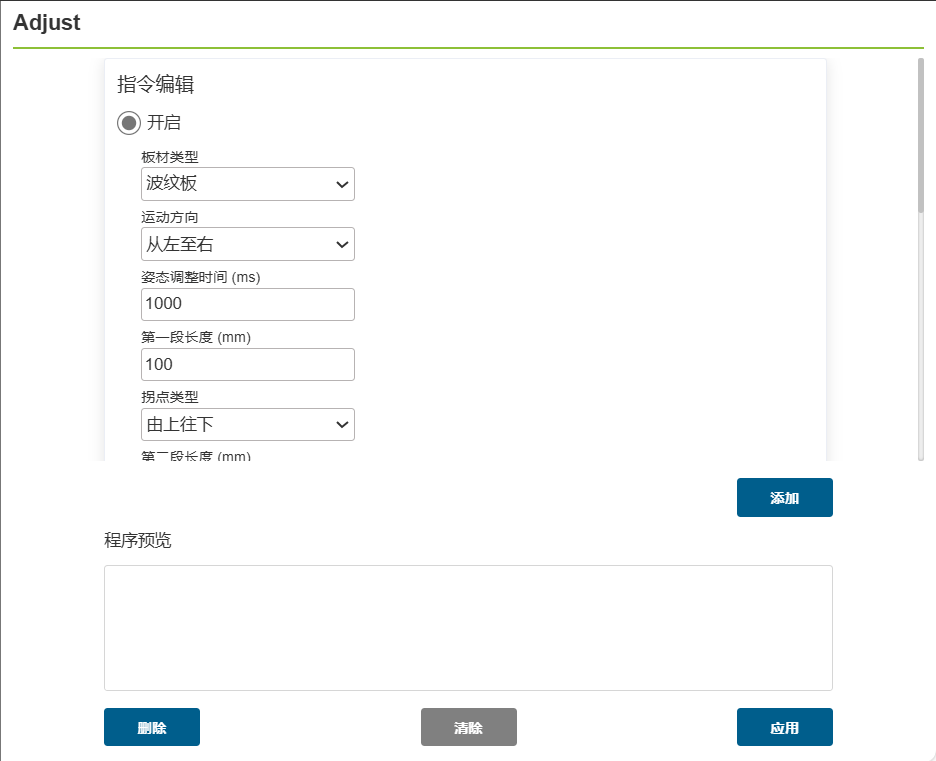

.. centered:: 圖表 9.8-8 Adjust指令介面

力控指令介面
~~~~~~~~~~~~~

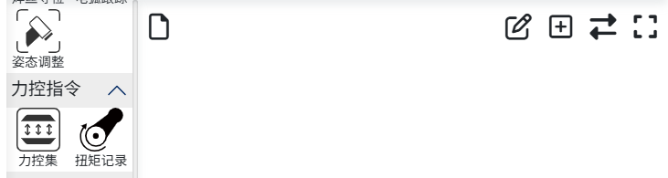

.. centered:: 圖表 9.9 力控指令介面

力控集命令
++++++++++++++++

點選「力控集」圖示進入F/T指令編輯介面。

指令包含FT_Guard(碰撞偵測)，FT_Control(恆力控制)，FT_Compliance(柔順控制)，FT_Spiral(螺旋插入)，FT_Rot(旋轉插入)，FT_Lin(直線插入)，FT_FindSurface(表面定位) ，FT_CalCenter(中心定位)八個指令，詳見機器人外設章節。

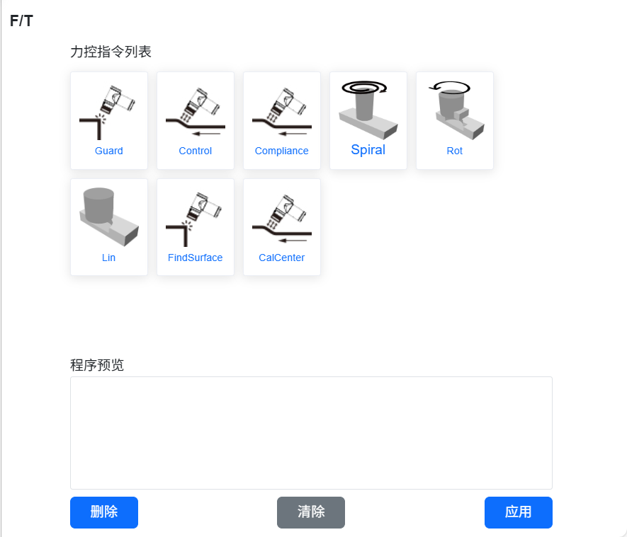

.. centered:: 圖表 9.9-1 F/T指令介面

扭力記錄命令
++++++++++++++++

點選「扭力記錄」圖示進入Torque指令編輯介面。

此指令為扭力記錄指令，實現扭力即時記錄碰撞偵測功能。點選「扭力記錄啟動」按鈕，持續記錄運動指令運作過程中的碰撞情況，記錄的即時扭力作為碰撞偵測判斷的理論值，以減少誤報錯機率。當超出設定閾值範圍時，記錄碰撞偵測持續時間。點擊「扭力記錄停止」按鈕，停止記錄。點擊“扭力記錄重設”，狀態恢復預設狀態。

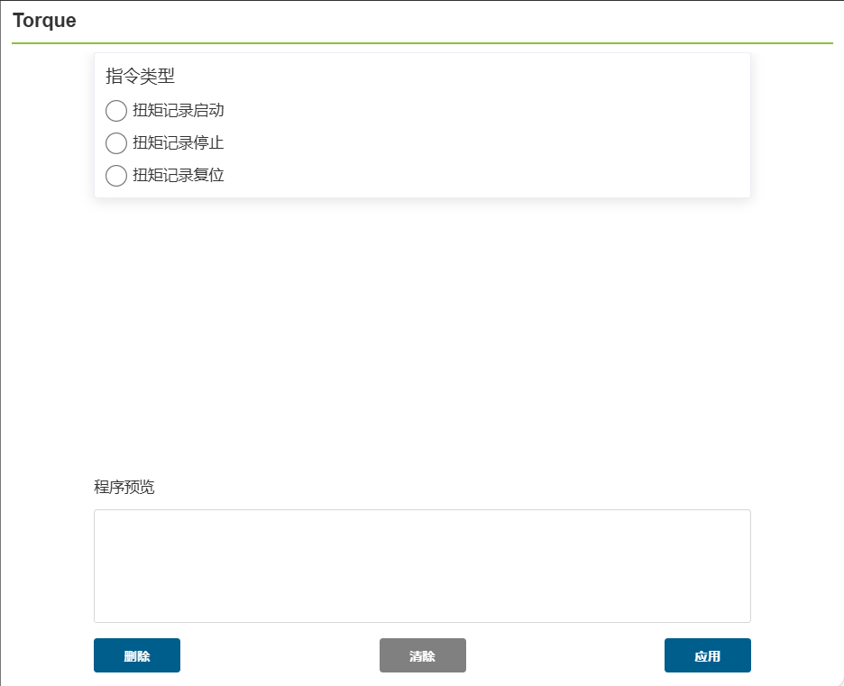

.. centered:: 圖表 9.9-2 Torque指令介面

視覺指令介面
~~~~~~~~~~~~~

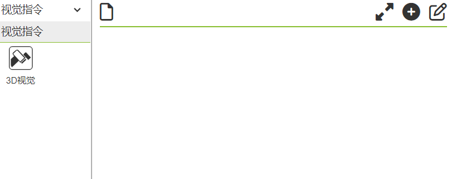

.. centered:: 圖表 9.10 視覺指令介面

3D視覺指令
++++++++++++++++

點選「3D視覺」圖示進入3D指令編輯介面。

此指令為3D視覺程式實例產生指令，使用者可以根據產生的程式進行參考，與其他視覺設備進行通訊工作，包含相機標定和相機抓取兩個程式案例參考。

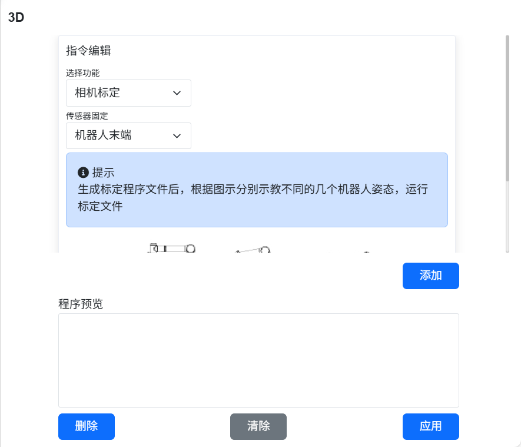

.. centered:: 圖表 9.10-1 3D指令介面

碼垛指令介面
~~~~~~~~~~~~~

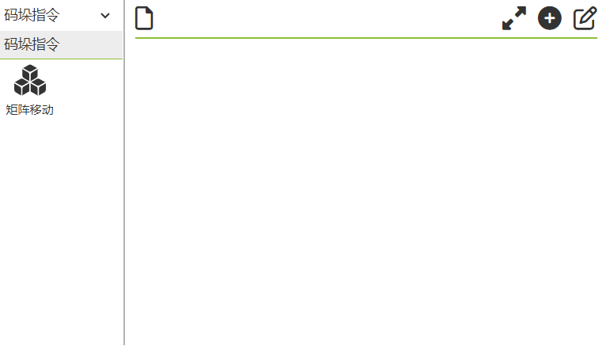

.. centered:: 圖表 9.11 碼垛指令介面

矩陣移動指令
++++++++++++++++

點選「矩陣移動」圖示進入Pallet指令編輯介面。

此指令為碼垛程式產生指令。

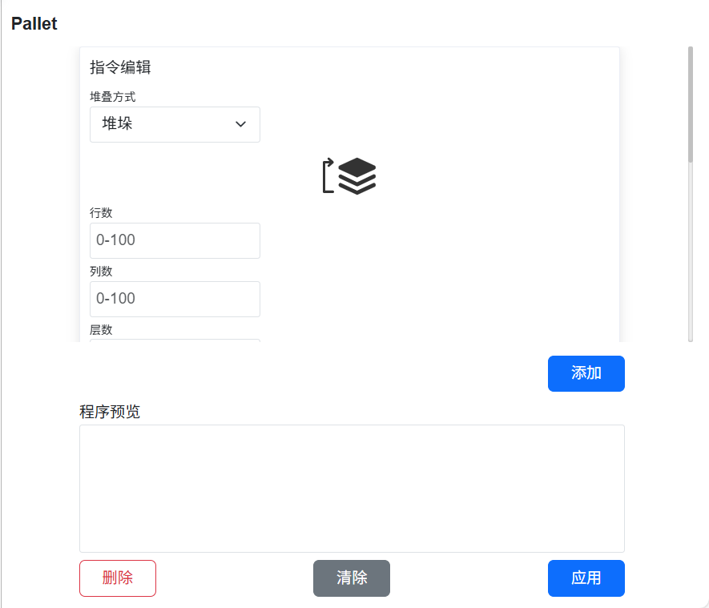

.. centered:: 圖表 9.11-1 Pallet指令介面

此功能透過設定三點座標及行列層和層高等數值，來控制機器手規則移動，適用於常見的碼垛應用。第一步選擇機器人運動方式，“PTP”或“Line”，第二步設定機器人運動路徑，“頭到尾走法”或“弓字形走法”，第三步設定堆疊方式，“堆垛”或“卸垛”。

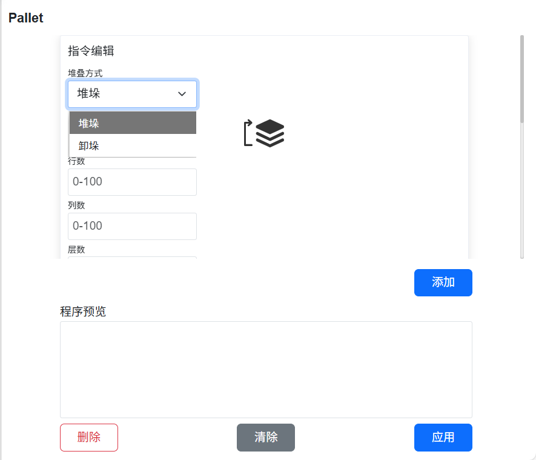

.. centered:: 圖表 9.11‑2 矩陣移動

第四步依路徑示教三個點，第一點為第一排起點，整個運動過程手臂姿態由該點決定，第二點為第一排終點，第三點為最後一排終點。第五步設點行數和列數，第六步設定層數和每一層高度。

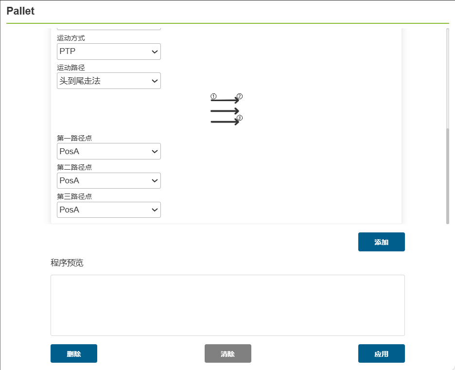

.. centered:: 圖表 9.11‑3 矩陣移動

通訊指令介面
~~~~~~~~~~~~~

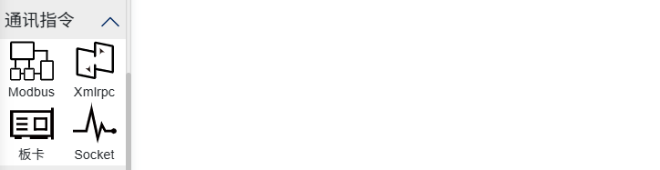

.. centered:: 圖表 9.12 通訊指令介面

Modbus指令
++++++++++++++++

點選「Mobus」圖示進入Modbus指令編輯介面。

此指令功能為基於ModbusTCP協定的匯流排功能，使用者可以透過相關指令控制機器人與ModbusTCP client或server通訊（主站與從站通訊），對線圈，離散量，暫存器進行讀寫操作。

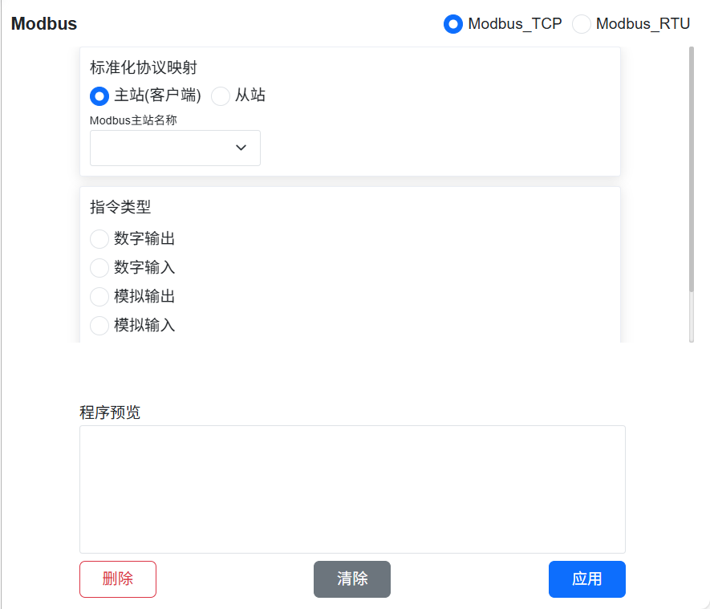

.. centered:: 圖表 9.12-1 modbus指令主站介面

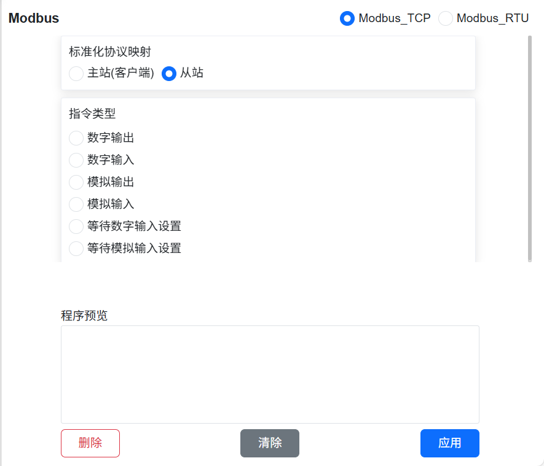

.. centered:: 圖表 9.12-2 modbus指令從站介面

關於ModbusTCP更多操作功能，請聯絡我們諮詢。

Xmlrpc指令
++++++++++++++++

點選「Xmlroc」圖示進入Xmlrpc指令編輯介面。

XML-RPC是一種透過sockets使用xml在程式之間傳輸資料的遠端過程呼叫方法。透過這種方法，機器人控制器可以在遠端的程式/服務呼叫功能函數（可帶參數）並取得傳回的結構性資料。機器人控制器負責處理編寫XML-RPC客戶端訊息以及處理資料類型與XML之間轉換的所有細節。

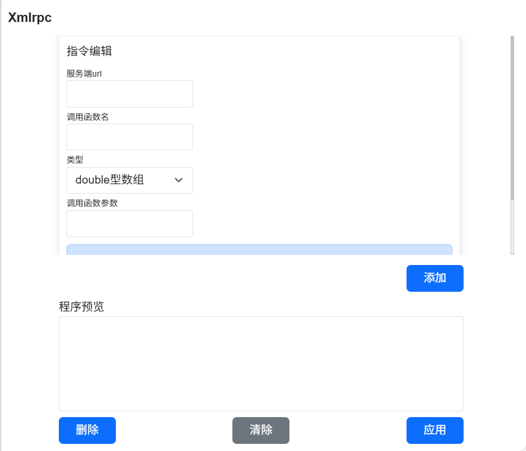

.. centered:: 圖表 9.12-3 Xmlrpc指令介面

.. important::
 1) 控制器作為客戶端連接遠端自訂連接埠；

 2) 控制器作為客戶端呼叫遠端功能函數；

 3) 支援呼叫遠端不同功能函數；

 4) 支援字串數組參數傳入與字元數組結果返回，數組元素個數可自訂；

 支援double型數組參數傳入與double型數組結果返回，數組元素個數個數可自訂；

::

 XmlrpcClientCall(serverUrl，methodName，tableType，param)

 serverUrl 服務端url，例如："http://192.168.58.29:50000/RPC2"

 methodName 呼叫函數名，“example.add”

 tableType 1-double型數組，2-string型數組

 param 呼叫函數參數

::

 XmlrpcClientCall(error， result)

 error 0-無錯誤，1-錯誤

 result 若參數傳入為double型數組，則result為double型數組，

 若參數傳入為string型數組，則result為string型數組

輔助指令介面
~~~~~~~~~~~~~

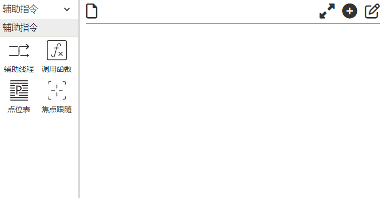

.. centered:: 圖表 9.13 輔助指令介面

輔助線程命令
++++++++++++++++

點選「輔助線程」圖示進入Thread指令編輯介面。

Thread命令為輔助線程功能，用戶可以定義一個輔助線程與主線程同時運行，輔助線程主要與外部設備進行數據交互，支持socket通信，機器人DI狀態獲取，機器人DO狀態設置，機器人狀態信息獲取，與主線程數據交互，主線程透過輔助線程獲取的數據用於控制機器人運動邏輯的判斷，用戶程式範例截圖：

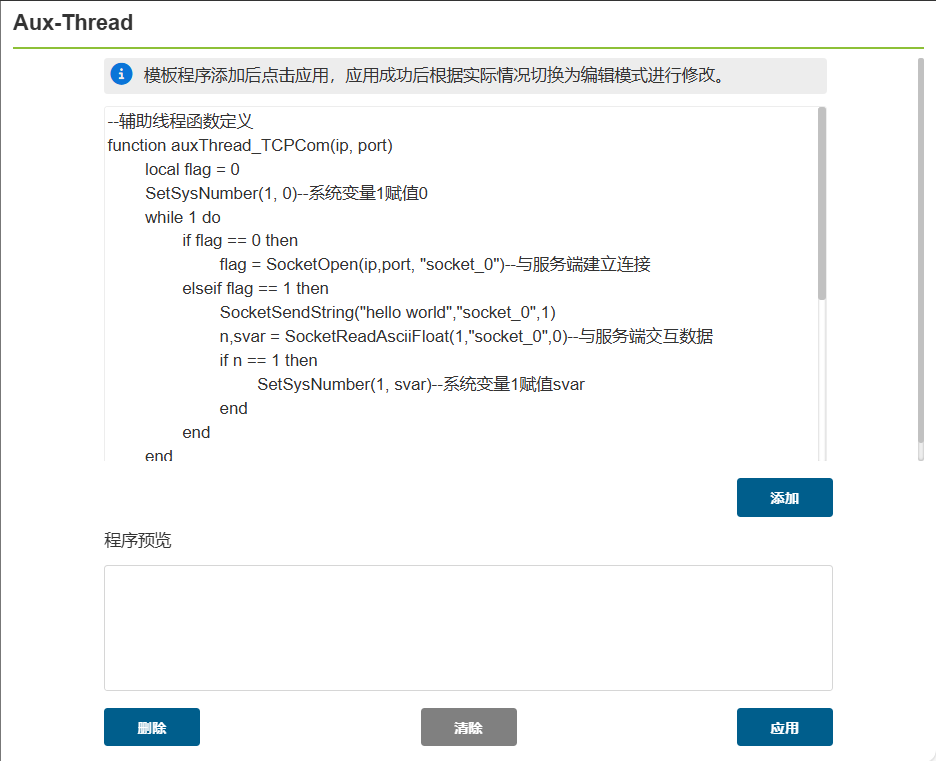

.. centered:: 圖表 9.13-1 Thread程式範例

呼叫函數命令
++++++++++++++++

點選「呼叫函數」圖示進入Function指令編輯介面。

此指令為呼叫函數介面功能，將機器人介面函數提供給客戶選擇，並提示客戶該函數所需的參數，方便客戶編寫腳本指令，更多函數陸續新增中。

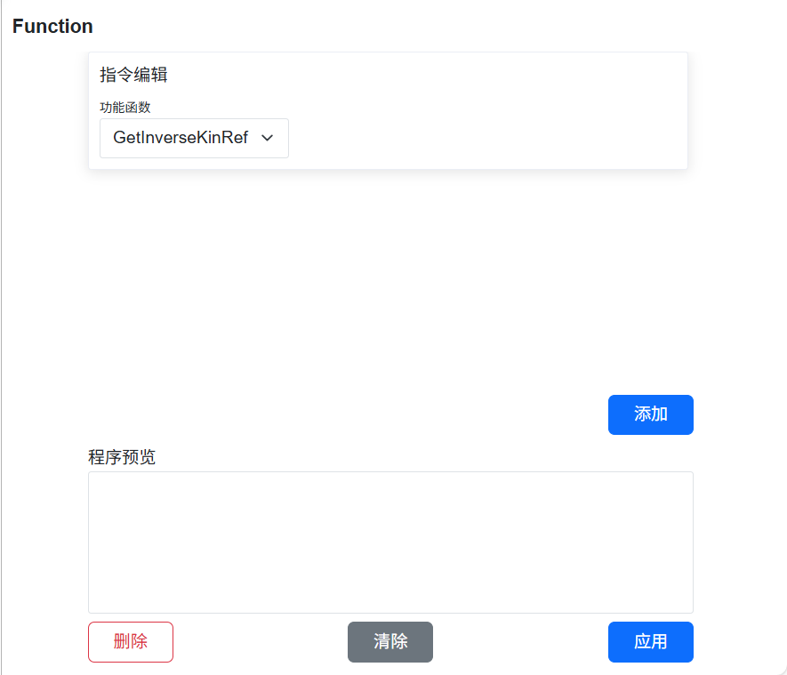

.. centered:: 圖表 9.13-2 Function指令介面

點位表命令
++++++++++++++++

點選「點位表」圖示進入PT-Mode指令編輯介面。

此指令主要用於系統模式和點位表模式之間的模式切換，透過切換點位表來應用不同點位表內的示教點位。詳情請見章節11——示教點。

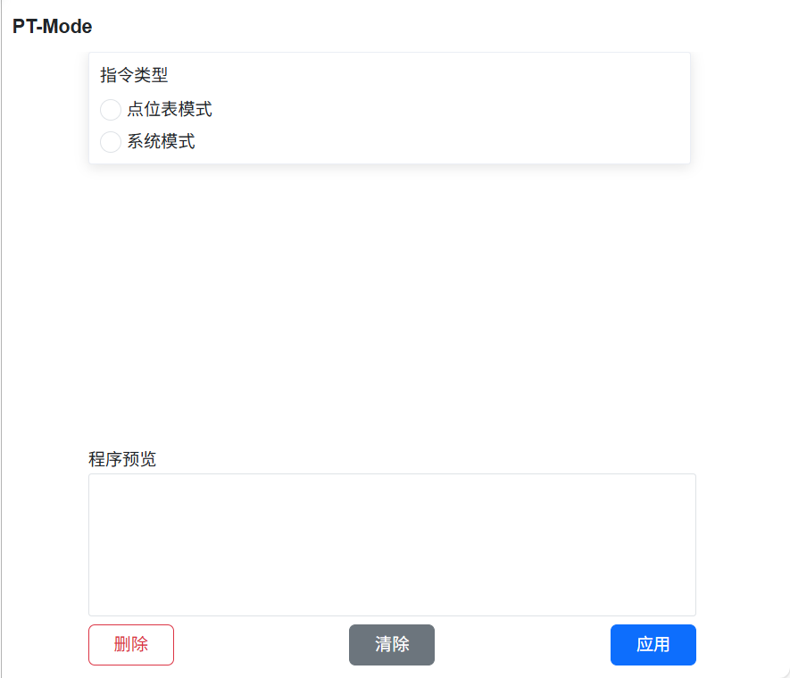

.. centered:: 圖表 9.13-3 點位表指令介面

示教程序未保存驗證
~~~~~~~~~~~~~~~~~~~

在程式示教頁面，開啟/新建程式後，若示教程式發生改動未儲存程式。

若點選“開啟”、“新建”、“匯出”、“重新命名”等相關文件操作，則觸發“是否儲存此程式”彈出框，提示“目前程式已發生改變，是否儲存此程式的變更？” ，如下圖。

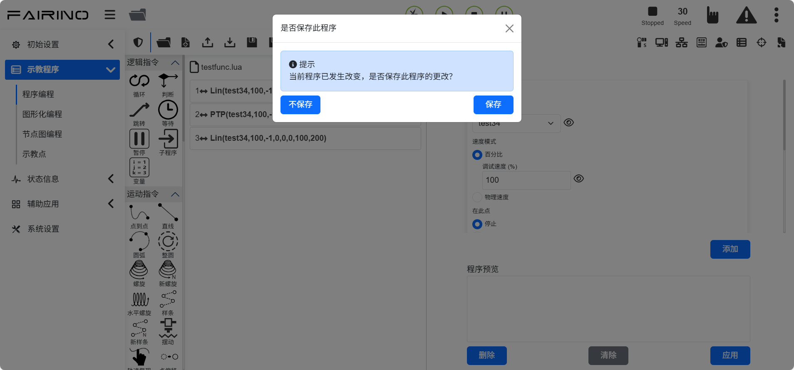

.. centered:: 圖表 9.14-1 目前頁面程式未儲存驗證

**Step1**：點擊「不儲存」按鈕，程式恢復未修改先前數據，並繼續執行先前的相關文件操作。

**Step2**：點選「儲存」按鈕，未儲存的lua程式儲存成功，並繼續執行先前的相關檔案操作。

若離開程式示教頁面，切換到其他頁面時，同樣觸發「是否儲存此程式」提示，且仍停留在目前示教程式頁面，如下圖。

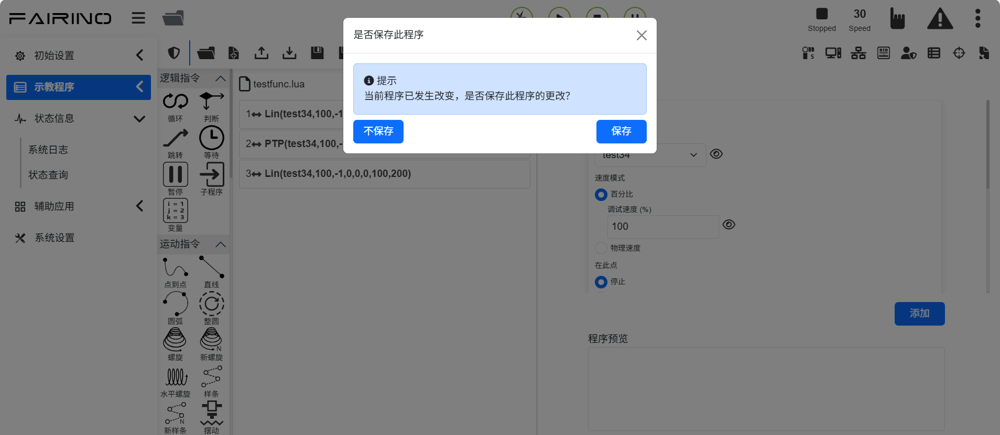

.. centered:: 圖表 9.14-2 切換頁面程式未儲存驗證

**Step1**：點選「不儲存」按鈕，跳到先前選擇的頁面。

**Step2**：點選「儲存」按鈕，未儲存的lua程式儲存成功，並跳到先前選擇的頁面。

示教程序加密
~~~~~~~~~~~~~~

示教程序分為加密和不加密的狀態。加密等級分為一級加密和二級加密，其中一級加密保護程度最高，二級次之。
所有示教程序在「系統設定--自訂資訊」中以表格形式進行程式加密資訊展示與設定。表格右側配有加密等級說明。

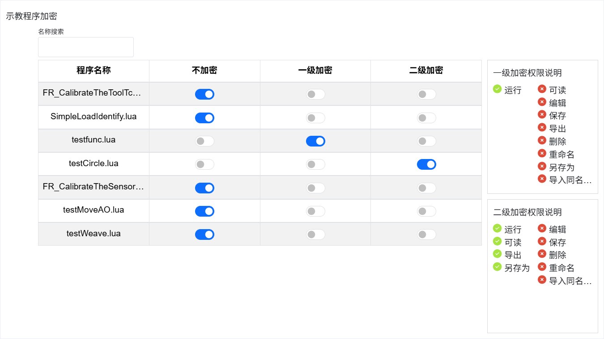

.. centered:: 圖表 9.15-1 示教程序加密

當程式為一級加密狀態時，開啟該程式後：
操作列中對應的“匯出”、“儲存”、“另存為”、“複製”、“剪下”、“貼上”、“刪除”、“上移”、“下移”和“編輯模式切換”等按鈕圖示都會變灰，點擊圖示無效並會提示目前程式處於加密狀態。
程式「重新命名」圖示將會隱藏。
新增指令列和程式編輯區域都會不可見且提示已處於一級加密鎖定。

.. centered:: 圖表 9.15-2 程式一級加密介面

當程式為二級加密時，在「程式示教」頁面開啟該程式後：
操作列中對應的「儲存」、「複製」、「剪下」、「貼上」、「刪除」、「上移」和「下移」等按鈕圖示都會變灰。點擊圖示無效並會提示目前程式處於加密狀態。
程式「重新命名」圖示將會隱藏。
新增指令列不可見且提示已處於二級加密鎖定。
程式編輯區域可正常瀏覽閱讀程序。

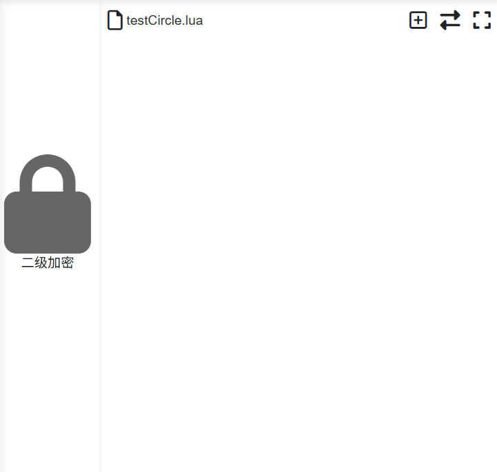

.. centered:: 圖表 9.15-3 程式二級加密介面

一級加密和二級加密都可以使用「匯出」功能，在匯入時會進行驗證操作，如果存在同名程式為加密文件，則會中斷匯入操作並提示不可匯入覆蓋加密程式。

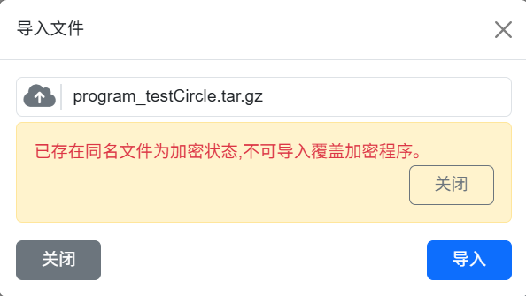

.. centered:: 圖表 9.15-4 程式導入

局部示教點位
~~~~~~~~~~~~~~

局部示教點位元和目前示教程序綁定。新增程序指令時，只能應用於目前示教程序，不可用於其它示教程序。

**新增**：點選程式檔案名稱最右側的「新增局部示教點」圖標，進行局部示教點的新增。 (局部示教點位詳情記錄請翻閱機器人操作中的示教點記錄)

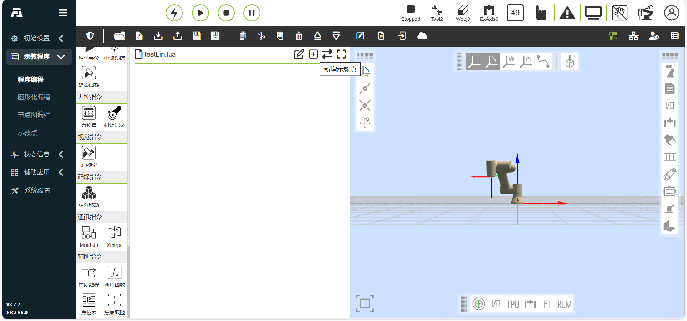

.. centered:: 圖表 9.16-1 新增局部示教點

**刪除**：點選表格序號欄選擇需要刪除的局部示教點後，點選局部示教點位標題右上角的「刪除」圖標，進行局部示教點的刪除。

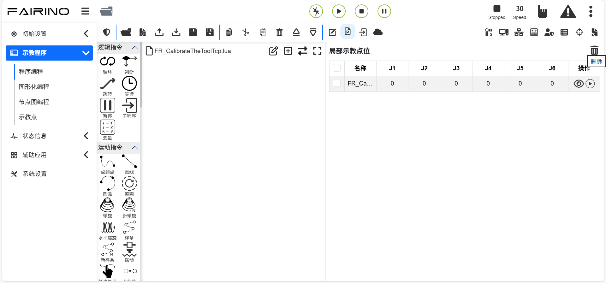

.. centered:: 圖表 9.16-2 刪除局部示教點

**運行**：點擊局部示教點位表格資料操作列中的「開始運行」圖標，進行局部示教點的單點運行，將機器人移動到該點的位置。

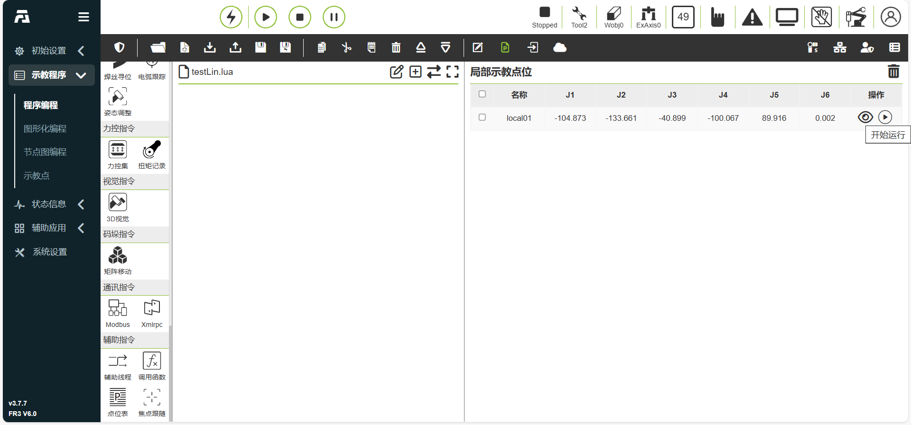

.. centered:: 圖表 9.16-3 運行局部示教點

**詳情**：點擊局部示教點位表格資料操作列中的「詳情」圖標，查看局部示教點的詳情。

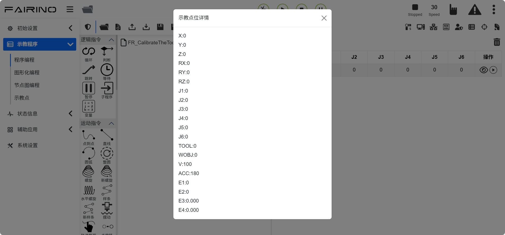

.. centered:: 圖表 9.16-4 局部示教點詳情

目前程式備份
~~~~~~~~~~~~~~

使用者修改示教程式點擊儲存後，觸發目前程式的「備份」功能(備份時間為1年)，將目前程式的初始內容進行儲存顯示在右側，方便使用者比較修改的內容。
使用者選擇日期可以查看對應的程式備份內容，點擊右上角「刪除」圖示可以刪除目前程式備份內容。目前程式備份的內容只可查看，無法修改。

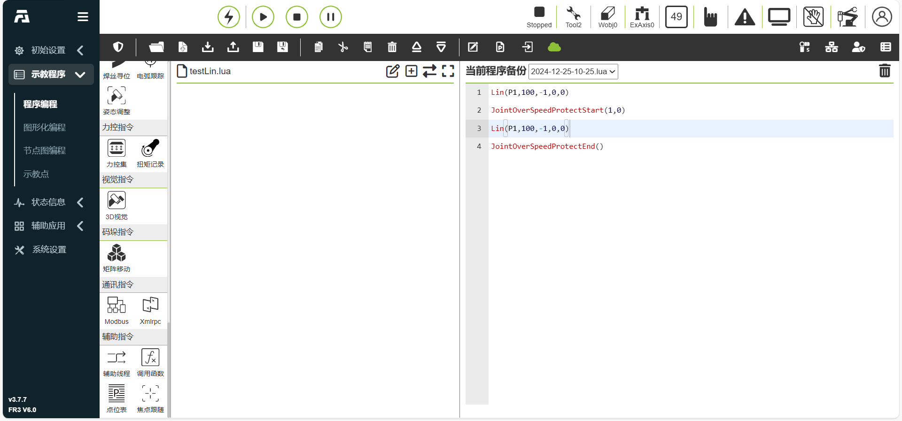

.. centered:: 圖表 9.17 目前程式備份

Modbus TCP通訊
~~~~~~~~~~~~~~~~~
ModbusTCP是工業生產中常用的通訊協議，法奧協作機器人提供ModbusTCP主站和ModbusTCP從站兩種方式與您的設備進行通訊。

協作機器人最多支援8個ModbusTCP主站同時與外部設備進行通信，每個主站最多支援128個寄存器；協作機器人ModbusTCP從站具有128個線圈、128個離散輸入、64個保持寄存器和64個輸入暫存器(保持暫存器和輸入暫存器資料型別包含無符號、有符號和浮點型三種類型)，同時協作機器人部分ModbusTCP從站輸入暫存器位址專用於回饋目前機器人的關節位置、運動速度等訊息，部分線圈暫存器位址專用於控制機器人啟動程式、停止程式、設定控制箱DO等功能。

機器人ModbusTCP從站僅支援與一個主站建立連接，機器人可同時作為主站和從站與不同的設備通訊。下面是詳細使用方法。

ModbusTCP主站
+++++++++++++++++

在使用協作機器人做ModbusTCP主站與您的設備進行通訊前，請先檢查您的設備與機器人的網路連接，並確認網路介面在同一網段。

使用機器人ModbusTCP主站有以下步驟：

- 新增主站；
- 新增寄存器；
- 通訊測試；
- 編寫使用者程式；
- 執行使用者程式。

新增ModbusTCP主站
********************

開啟WebApp，依序點選“示教模擬”、“程式示教”，新使用者程式“testModbusMaster.lua”。

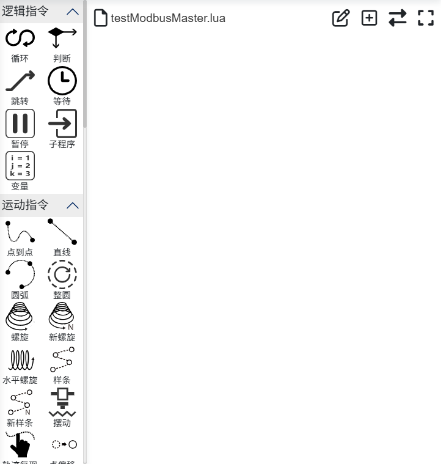

.. centered:: 圖表 9.18-1 建立ModbusTCP主站使用者程序

點選「ModbusTCP設定」按鈕，開啟ModbusTCP功能設定頁面。

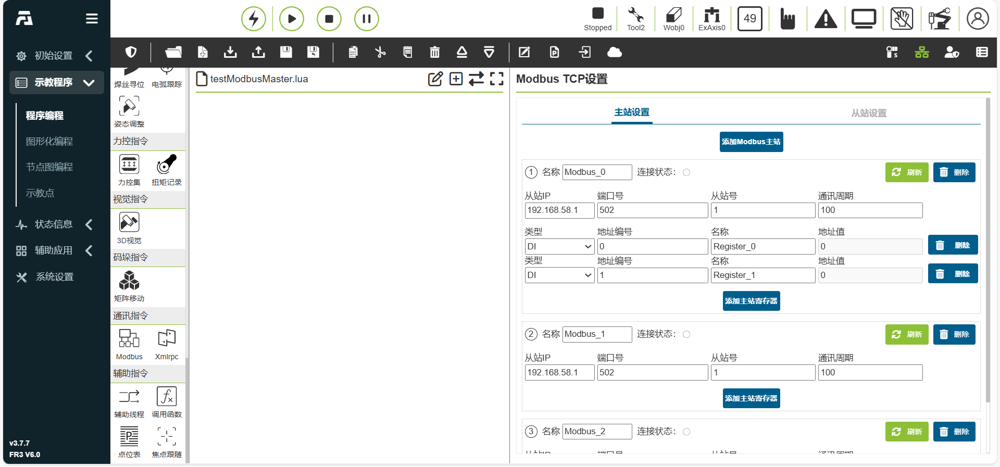

.. centered:: 圖表 9.18-2 打開ModbusTCP設定

依序點選“主站設定”、“新增Modbus主站”，即完成新增一個ModbusTCP主站。

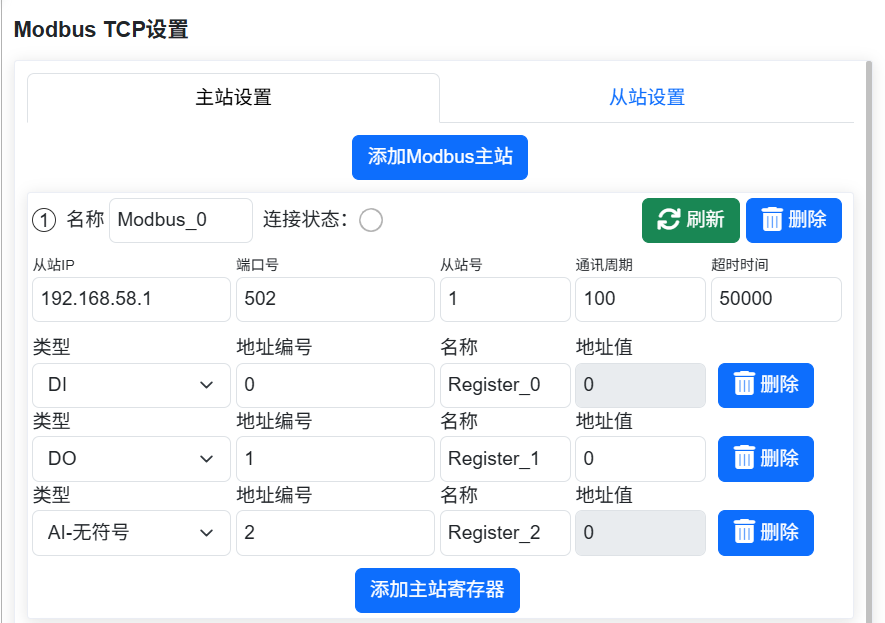

.. centered:: 圖表 9.18-3 新增“ModbusTCP主站”

根據您的設備情況依序輸入“名稱”、“從站ip”、“連接埠號”、“從站號”和“通訊週期”，上述參數的具體含義如下：

**名稱**：機器人ModbusTCP主站名稱，機器人最大支援創建8個主站與相應從站建立連接，不同主站可設定唯一的名稱進行區分，如“PLC”、“相機”、“數據採集卡」、「FRRobot1」等；

**從站ip**：機器人ModbusTCP主站要連接的從站IP位址；

.. note:: 先透過網路線連接機器人與從站設備，並確保機器人與從站設備的IP位址在同一網段。

**連接埠號碼**：要連接的ModbusTCP從站連接埠號碼；

**從站號**：要連接的ModbusTCP從站號；

**通訊週期**：機器人ModbusTCP主站查詢從站狀態的週期(ms)，該週期僅影響“ModbusTCP設定”頁面查看從站寄存器資料的更新速度，而不影響用戶lua程式中讀取或寫入ModbusTCP從站暫存器數值的速度。

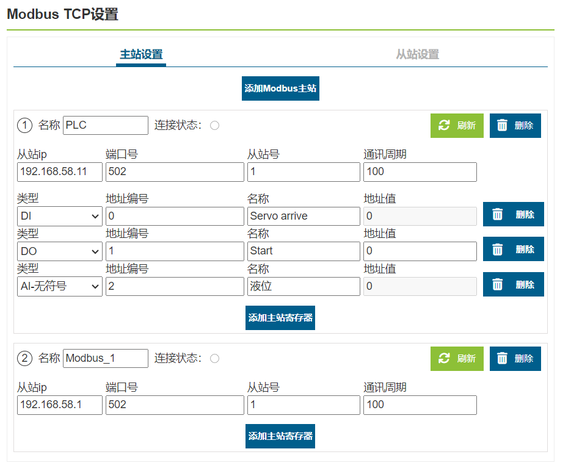

.. centered:: 圖表 9.18-4 設定ModbusTCP主站參數

正確輸入上述參數後，機器人ModbusTCP主站自動與配置的從站建立連接，連接成功後，頁面上的「連接狀態」指示燈亮起。

.. note::
 若您已經確認ModbusTCP主站的相關參數進行了正確的配置，但機器人與您的設備沒有成功連接，請檢查以下配置：

 ①機器人與從站設備的實體網路連接；

 ②機器人示教器和控制箱兩個網路實體連接埠的IP位址不同，請確認是否連接到正確的網路連接埠；

 ③請確認機器人網路連接埠與從站設備的網路連接埠是否在同一網段，如機器人的IP位址為192.168.58.2，則從站設備的IP位址必須為192.168.58.0~192.168.58.255，且不能與機器人IP位址相同；

 ④檢查從站設備的連接埠號碼與設定的連接埠號碼是否相同。若連線狀態指示燈處於閃爍狀態，表示該主站中的暫存器位址有誤，請檢查暫存器類型和位址是否正確。

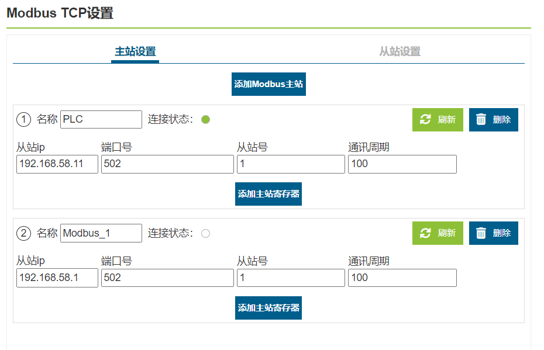

.. centered:: 圖表 9.18-5 ModbusTCP主站連線狀態

至此我們已經完成一個機器人ModbusTCP主站的創建，若您再次點擊“添加Modbus主站”，即可再次創建一個新的ModbusTCP主站，機器人最多支持8個主站同時與外部設備通信，雙擊Modbus主站右上角的「刪除」按鈕，即可刪除該Modbus主站。

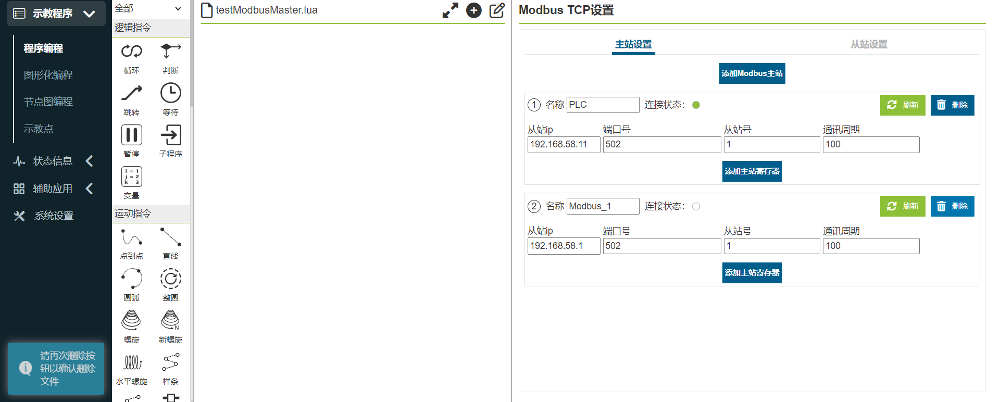

.. centered:: 圖表 9.18-6 再次新增ModbusTCP主站

ModbusTCP主站新增暫存器
***************************

點選「新增主站暫存器」按鈕即可為該主站新增一個暫存器。

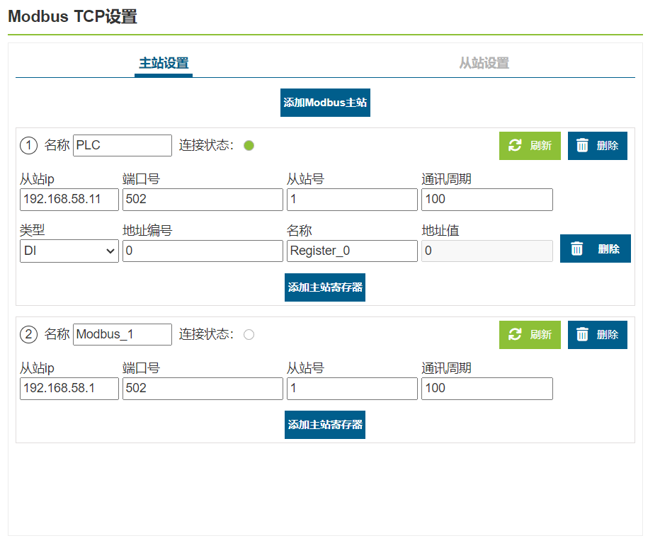

.. centered:: 圖表 9.18-7 新增ModbusTCP主站暫存器

依序選擇主站暫存器類型、輸入位址編號及名稱，各參數意義如下：

**類型**：暫存器類型，DI-離散輸入；DO-線圈；AI無符號-無符號型輸入暫存器(0-65535)；AI有符號-有符號型輸入暫存器(-32768-32767)；AI浮點型-浮點數型輸入暫存器(浮點型暫存器資料長度32位，佔用兩個有符號或無符號型寄存器)；AO無符號-無符號型保持寄存器(0-65535)；AI有符號-有符號型保持寄存器(-32768-32767)；AI浮點型-浮點數型保持寄存器(浮點型寄存器數據長度32位，佔用兩個有符號或無符號型寄存器)，其中AI、AO中的浮點型寄存器為大端顯示；

**位址編號**：要讀取或寫入的ModbusTCP從站暫存器位址；

**名稱**：寄存器的別名，機器人ModbusTCP主站最多可設置128個不同的寄存器，每個寄存器可根據實際意義設置不同的名稱進行區分，如“開始”，“伺服到位”、“液位」等。

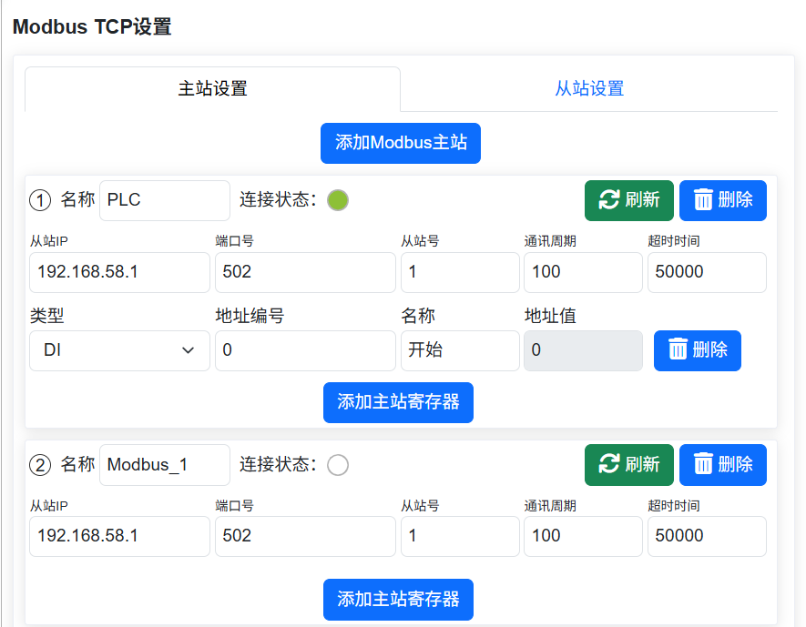

.. centered:: 圖表 9.18-8 設定ModbusTCP主站暫存器參數

再次點選「新增主站暫存器」按鈕即可再新增一個主站暫存器，雙擊暫存器右側的「刪除」按鈕，即可刪除該暫存器，如下圖為每種類型都新增了一個暫存器。

.. note:: 若新增主站寄存後，主站連線狀態指示燈閃爍，則表示該主站暫存器位址無法讀取，請檢查該暫存器類型和位址是否正確。

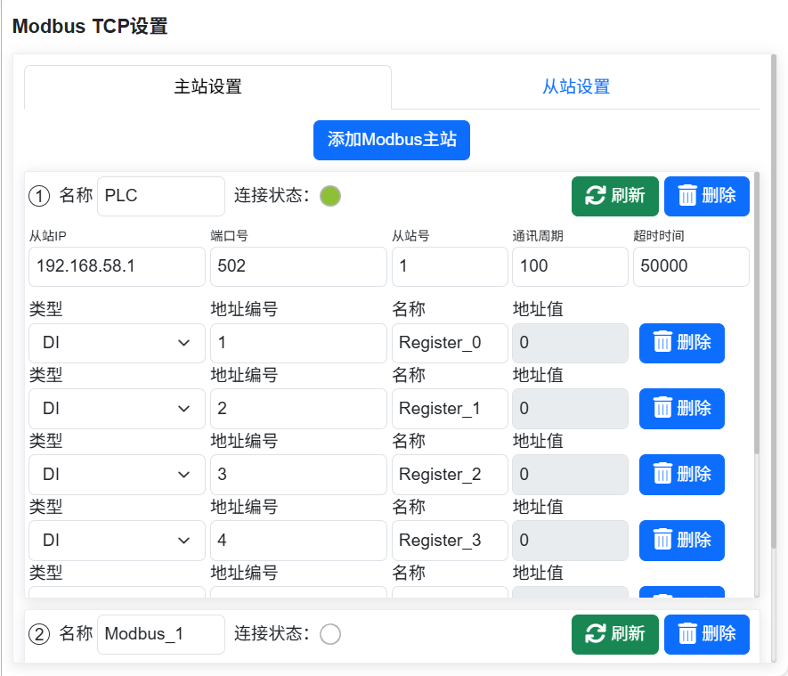

.. centered:: 圖表 9.18-9 新增多個主站暫存器

ModbusTCP主站通訊測試
***********************

在通訊測試前，請先檢查ModbusTCP主站「連線狀態」指示燈是否處於常亮狀態，若指示燈常亮則表示目前連線已成功。

機器人Modbus主站暫存器有「位址值」數值框用來顯示目前暫存器的值，其中DI(離散輸入)和AI(輸入暫存器)類型的暫存器為唯讀類型，對應的位址值為灰色不可編輯數值框。

當從站對應位址的數值改變時，機器人主站對應暫存器位址值同步顯示目前的數值，而DO(線圈)和AO(保持暫存器)為可讀可寫暫存器，因此它的位址為白色可編輯數值框框，既可以讀取ModbusTCP從站對應暫存器的數值，也可以在機器人Modbus主站設定頁面修改此暫存器數值。

.. centered:: 圖表 9.18-10 Modbus主站位址值

1. 主站DI、AI類型暫存器數值監控

在外部ModbusTCP從站設備上將DI(離散輸入)暫存器的255號位址值設為1，將AI(輸入暫存器)的257號位址值改為123，258號暫存器位址值改為-123，259號暫存器位址值改為123.3。此時機器人Modbus主站設定頁面對應暫存器的位址值將進行對應的顯示。

.. note::
 由於設定位址259的暫存器為浮點型暫存器，因此它實際佔用了259和260兩個16位元暫存器來儲存一個浮點數，因此您不能再單獨設定一個暫存器來操作AI的260號暫存器，否則會產生數值錯誤。

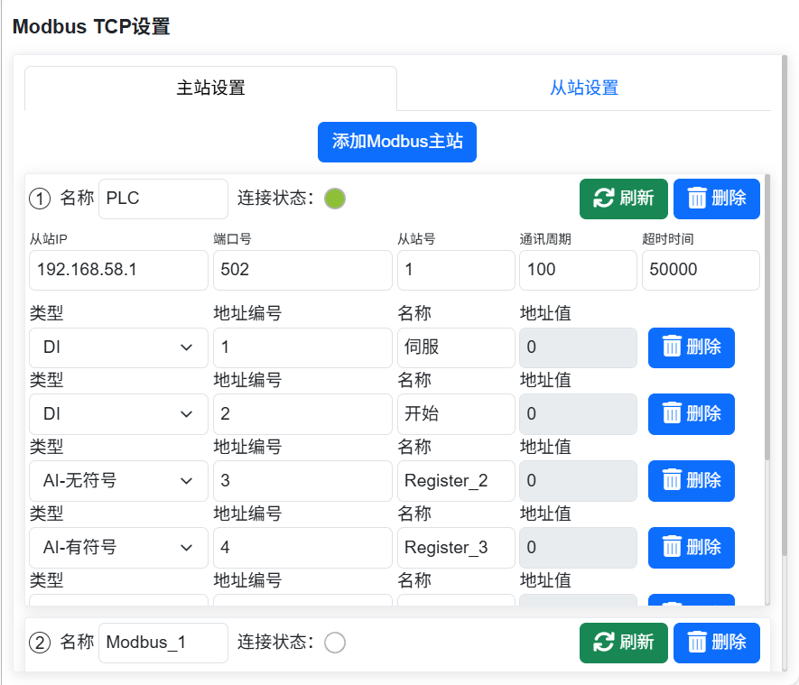

.. centered:: 圖表 9.18-11 Modbus主站顯示DI、AI暫存器數值

2. 主站DO、AO類型暫存器數值寫入

在機器人Modbus主站設定頁面中將名稱為「開始」的DO(線圈)類型暫存器的255號位址值輸入框中輸入1，名稱為「目標位置A」、「目標位置B」和「目標位置C 」的AO (保持暫存器)的260、261、262號暫存器位址值輸入框中分別輸入65535、-32768和128.78，此時Modbus從站的對應暫存器位址已寫入對應的數值。

.. centered:: 圖表 9.18-12 Modbus主站寫入DO、AO暫存器

3. 主站DO、AO類型暫存器數值監控

在ModbusTCP從站更改DO(線圈)、AO(保持暫存器)的值，ModbusTCP主站設定頁面的暫存器位址值不會立即更新顯示，需要點選主站配置右上角的「刷新」按鈕，此時頁面上DO、AO暫存器位址值才會更新。

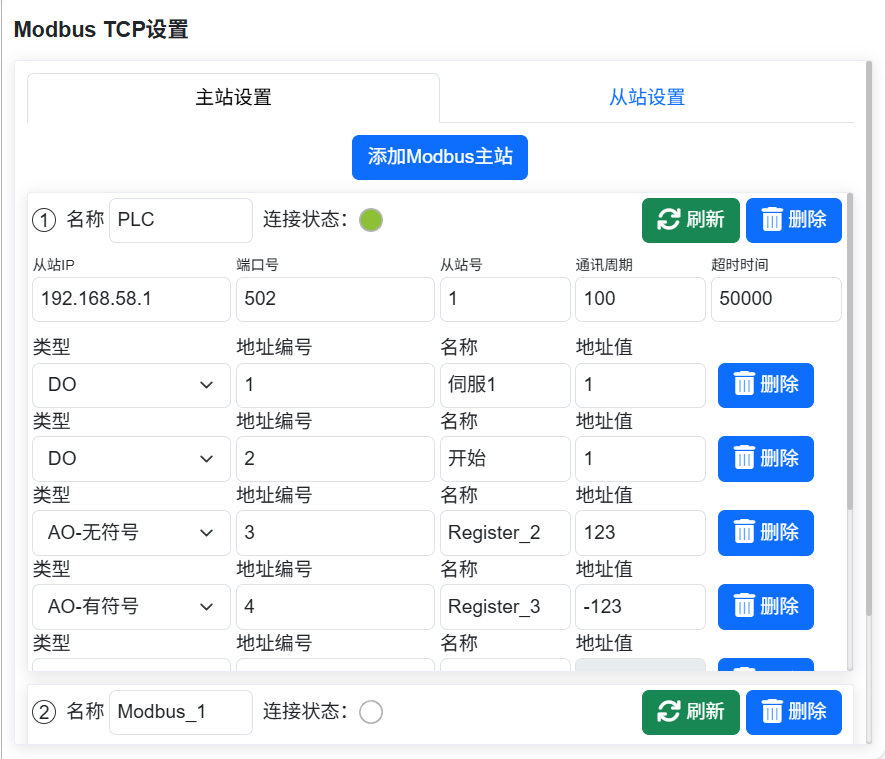

.. centered:: 圖表 9.18-13 刷新ModbusTCP主站DO、AO位址值

編寫ModbusTCP主站程序
++++++++++++++++++++++++++

依序點選“全部”、“通訊指令”，開啟通訊指令新增頁面。

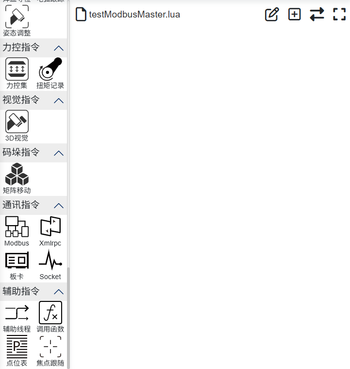

.. centered:: 圖表 9.18-14 開啟通訊指令新增頁面

點選“Modbus”。

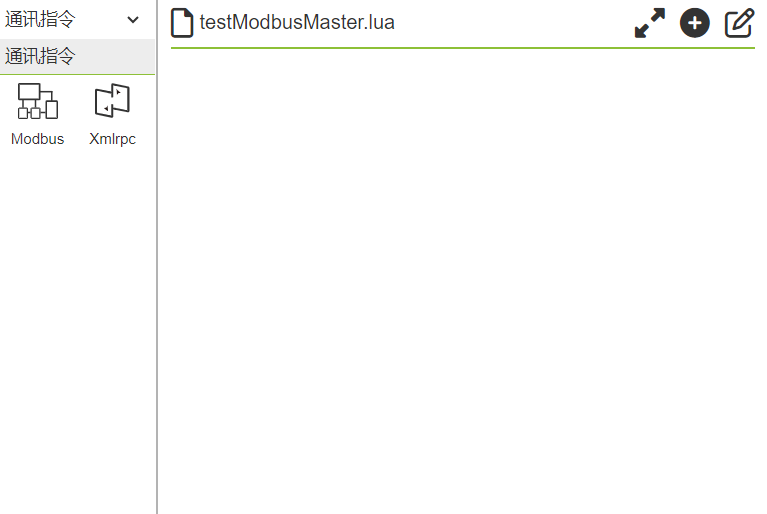

.. centered:: 圖表 9.18-15 選擇Modbus

點選“Modbus_TCP”。

.. image:: coding/178.png
   :width: 6in
   :align: center

.. centered:: 圖表 9.18-16 選擇Modbus_TCP

選擇“主站(客戶端)”，開啟ModbusTCP主站指令新增頁面。

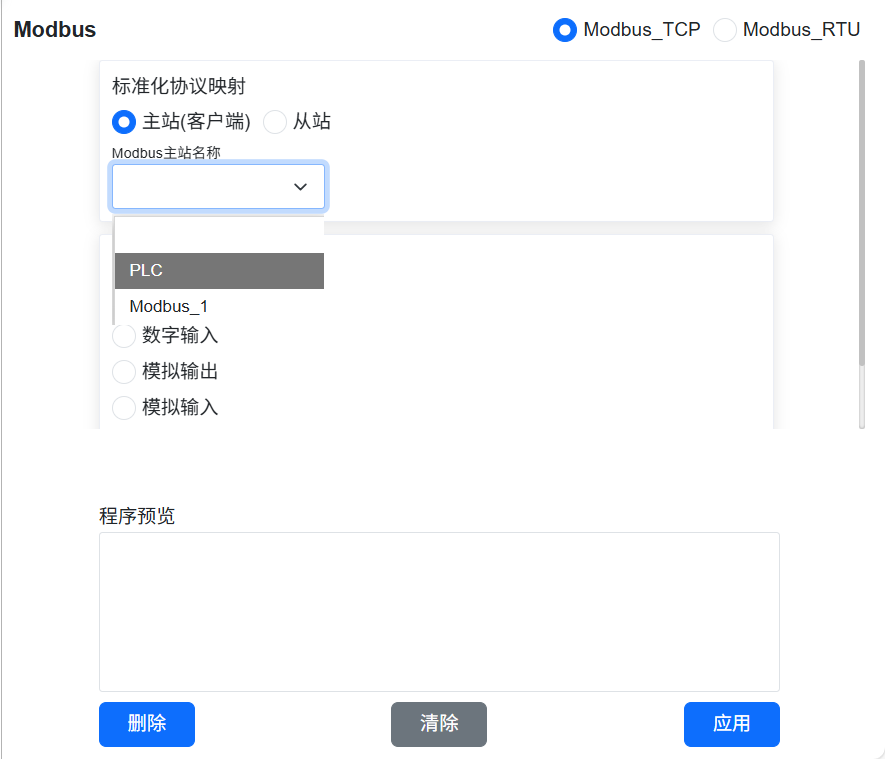

.. centered:: 圖表 9.18-17 ModbusTCP主站指令添加

1. 寫單一數位輸出DO(線圈)

選擇“Modbus主站名稱”為先前在Modbus主站設定頁面新增的主站“PLC”，DO名稱為“開始”，暫存器數量為1，暫存器值為1，點選“寫入數字輸出”按鈕。最後翻至該頁面最底端，點選「應用」按鈕。

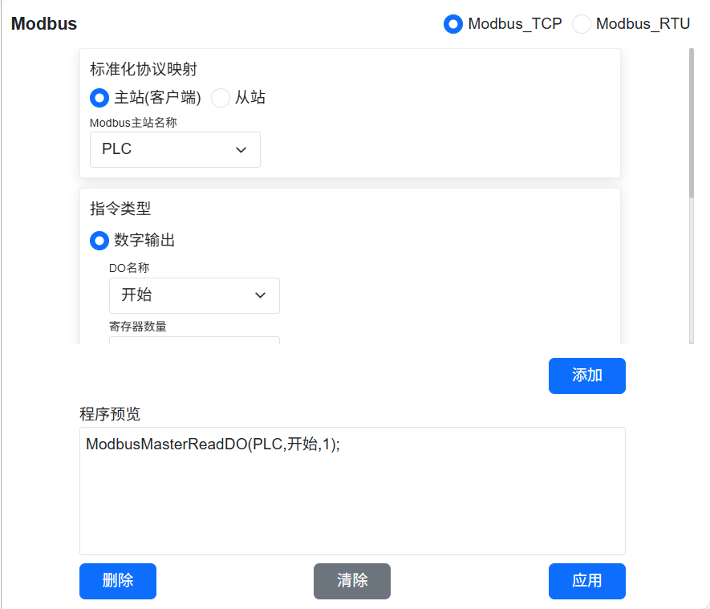

.. centered:: 圖表 9.18-18 添加寫入單一數位輸出

此時機器人程式「testModbusMaster.lua」中已經加入一條機器人Modbus主站寫單一數位輸出的指令，將機器人切換到自動模式，點選啟動按鈕，機器人將主站「PLC」對應的線圈暫存器「啟動」的地址值寫為1。

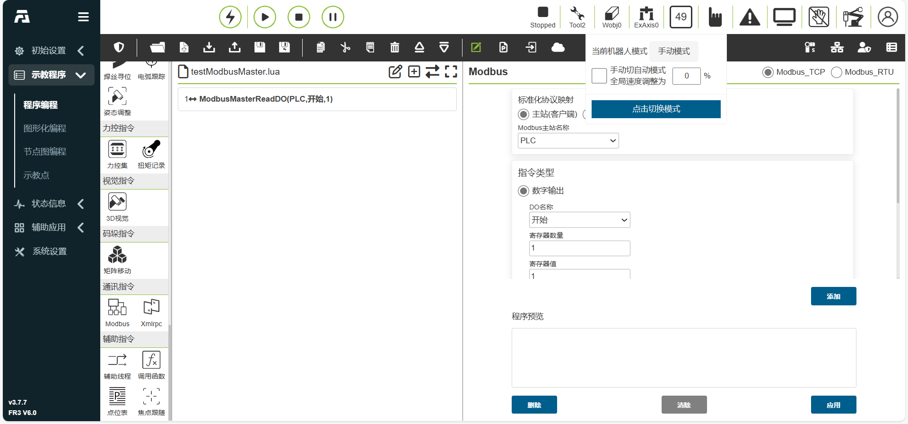

.. centered:: 圖表 9.18-19 寫單一線圈LUA程式

2. 寫多個數位輸出DO(線圈)

開啟ModbusTCP主站指令新增頁面，選擇“Modbus主站名稱”為先前在Modbus主站設定頁面新增的主站“PLC”，DO名稱為“開始”，暫存器數量為5，暫存器值為1,0, 1,0,1，其中暫存器值的數量要與設定的暫存器數量對應，且多個暫存器值之間以英文逗號隔開，點選「寫數字輸出」按鈕。最後翻至該頁面最底端，點選「應用」按鈕。

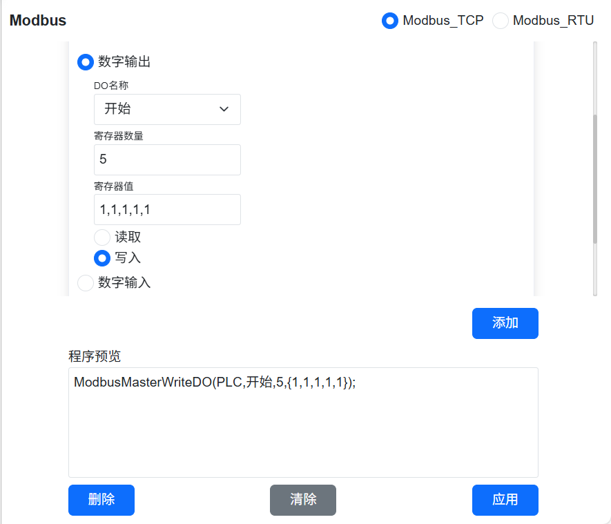

.. centered:: 圖表 9.18-20 配置寫多個數位輸出

此時機器人程式“testModbusMaster.lua”中已經添加一條機器人Modbus主站寫多個數字輸出的指令，將機器人切換到自動模式，點擊啟動按鈕，機器人將主站“PLC”對應的線圈寄存器“啟動”及其後面4個線圈的值分別寫成1、0、1、0、1。
   
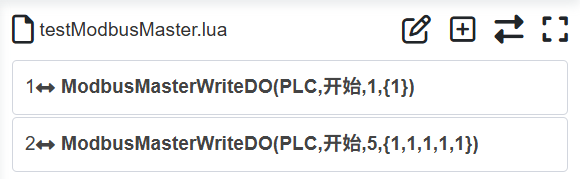

.. centered:: 圖表 9.18-21 寫多個線圈LUA程式

3. 讀取單一數位輸出DO(線圈)

開啟ModbusTCP主站指令新增頁面，選擇“Modbus主站名稱”為先前在Modbus主站設定頁面新增的主站“PLC”，DO名稱為“開始”，暫存器數量為1，暫存器值不需要填寫，點擊「讀數字輸出」。最後翻至該頁面最底端，點選「應用」按鈕。
   
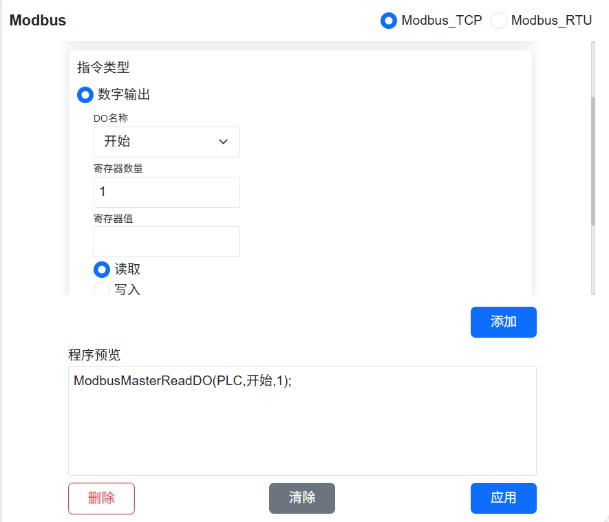

.. centered:: 圖表 9.18-22 配置讀單一數位輸出

此時機器人程式「testModbusMaster.lua」中已經加入一條機器人Modbus主站讀單一數位輸出的指令。
      
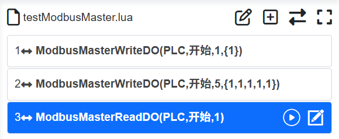

.. centered:: 圖表 9.18-23 讀取單一線圈程序

通常讀Modbus暫存器後將讀到的數值存入變數裡，因此需要定義一個變數用來儲存讀取的數值。點擊“切換模式”按鈕，將機器人lua程式切換至可編輯狀態，在“ModbusMasterReadDO”指令前編寫填加傳回值變數“startValue”，執行程式後讀到的數值將存在“startValue”裡。
      
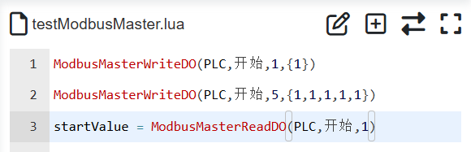

.. centered:: 圖表 9.18-24 讀單一數字輸出存入變數

線圈類型的暫存器值只有0和1兩個數值，在機器人程式中可以透過判斷暫存器數值不同來進行不同的操作。點擊「切換模式」按鈕將機器人示教程式切換至不可編輯模式，新增兩個關節運動指令分別移動到兩個不同的點位「P1」和「P2」。
      
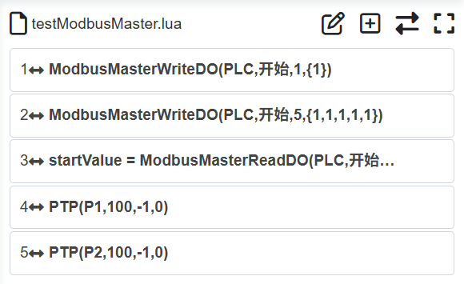

.. centered:: 圖表 9.18-25 新增不同點位的運動指令

再次將程式切換至可編輯模式，並編寫線圈值「startValue」的判斷條件，當「startValue」值為1時，機器人移動到「P1」點，否則機器人移動到「P2」點。
      
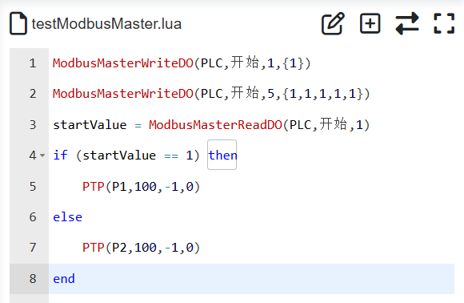

.. centered:: 圖表 9.18-26 根據線圈值不同運動到不同的點位

最後再將機器人程式切換至不可編輯模式，將機器人切換到自動模式，在確認安全的前提下啟動運作程序。由於程式的前兩行都將名稱為「開始」線圈DO值設為1，因此執行程式後機器人將移動到「P1」點。
      
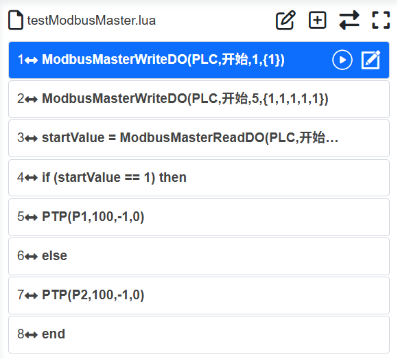

.. centered:: 圖表 9.18-27 讀取單一線圈暫存器數值並運動

4. 讀取多個數字DO(線圈)

開啟ModbusTCP主站指令新增頁面，選擇“Modbus主站名稱”為先前在Modbus主站設定頁面新增的主站“PLC”，DO名稱為“開始”，暫存器數量為6，暫存器值不需要填寫，點擊「讀數字輸出」。最後翻至該頁面最底端，點選「應用」按鈕。
      
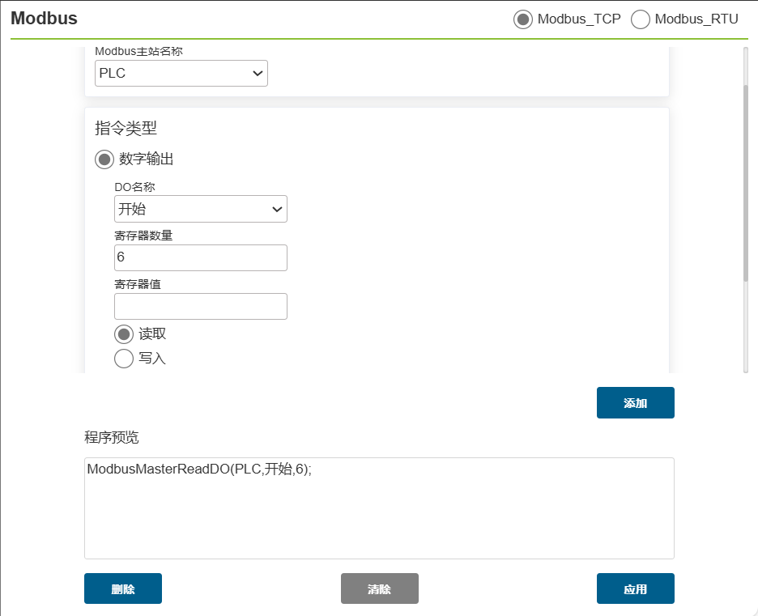

.. centered:: 圖表 9.18-28 配置讀多個數字輸出

此時機器人程式「testModbusMaster.lua」中已經加入一條機器人Modbus主站讀多個數位輸出的指令。
         
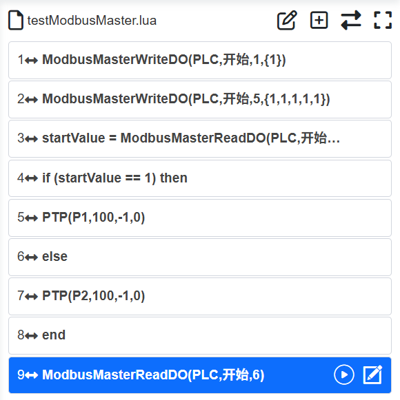

.. centered:: 圖表 9.18-29 讀多個數位輸出程序

點選「切換模式」按鈕，將機器人lua程式切換至可編輯狀態，由於讀取的數量為6個，因此需要在「ModbusMasterReadDO」指令前編寫填加6個傳回值變「value1,value2,value3,value4 ,value5,value6”，執行程式後讀到的6個暫存器數值將分別存在上述6個變數裡，同樣您可以判斷“value1”~“value6”的值使機器人進行不同的動作。
         
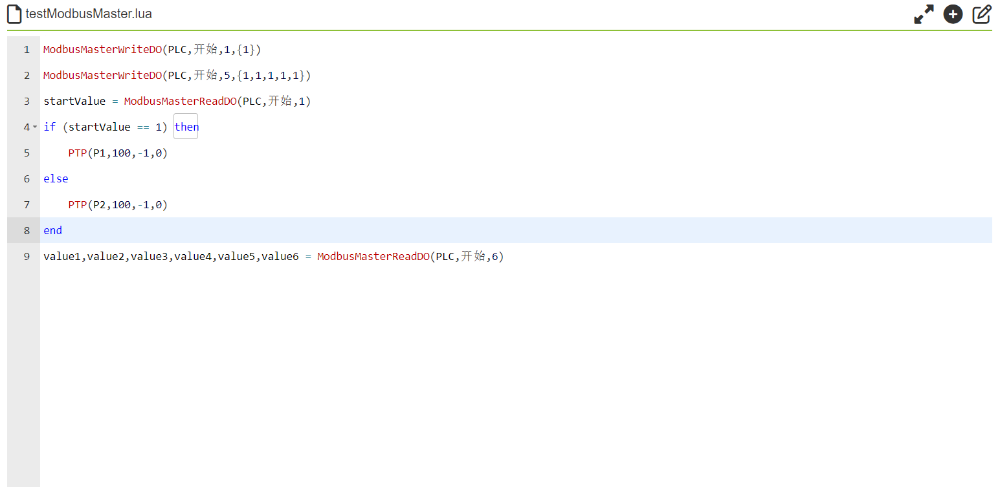

.. centered:: 圖表 9.18-30 讀取多個數字輸出存入變數

5. 讀數位輸入DI(離散輸入)

開啟ModbusTCP主站指令新增頁面，選擇“Modbus主站名稱”為先前在Modbus主站設定頁面新增的主站“PLC”，DI名稱為“伺服到位”，暫存器數量為2，點選“讀取數位輸入” 。最後翻至該頁面最底端，點選「應用」按鈕。
         
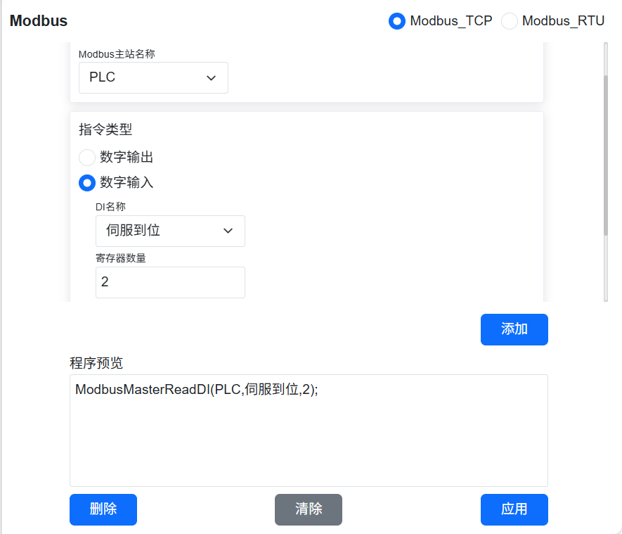

.. centered:: 圖表 9.18-31 配置讀數字輸入

此時機器人程式「testModbusMaster.lua」中已經加入一條機器人Modbus主站讀數位輸入的指令。
            

.. centered:: 圖表 9.18-32 讀數字輸入程式指令

點擊“切換模式”按鈕，將機器人lua程式切換至可編輯狀態，在“ModbusMasterReadDO”指令前編寫傳回值變數“state1,state2”，執行程式後讀到的兩個數字輸入數值將分別存在變數“state1 」和「state2」裡，您可以透過判斷變數數值進而控制機器人做不同的操作。
            
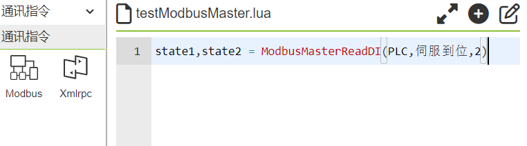

.. centered:: 圖表 9.18-33 讀數字輸入存入變數

6. 類比輸入AI(輸入暫存器)和類比輸出AO(保持暫存器)的讀寫操作

類比輸入AI(輸入暫存器)、類比輸出AO(保持暫存器)的讀寫操作與數位輸入DI(離散輸入)、數位輸出DO(線圈)的操作基本上一致，差別在於後者的資料範圍僅限於0或1，而前者的資料範圍較大，因此具體的操作可參考數位輸入和數位輸出程式的編寫，在此僅展示類比輸入AI的讀取操作和類比輸出AO的讀寫操作程式範例。
            
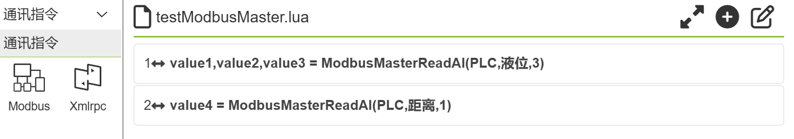

.. centered:: 圖表 9.18-34 讀模擬輸入AI
            
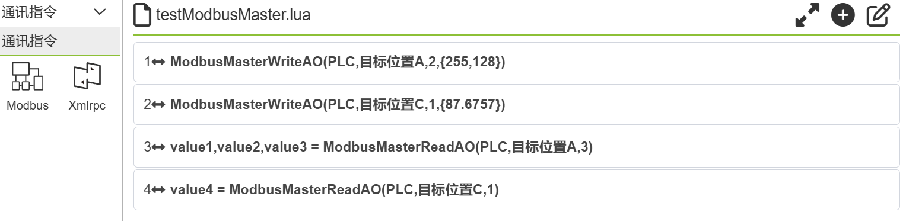

.. centered:: 圖表 9.18-35 讀寫類比輸出AO

7. 等待數字輸入

開啟ModbusTCP主站指令新增頁面，找到「等待數位輸入設定」即等待DI離散輸入設置，選擇DI名稱為配置的「伺服就位」暫存器，等待狀態為「True」，逾時時間為5000ms。點選「新增」按鈕，最後點選「應用」按鈕。
            
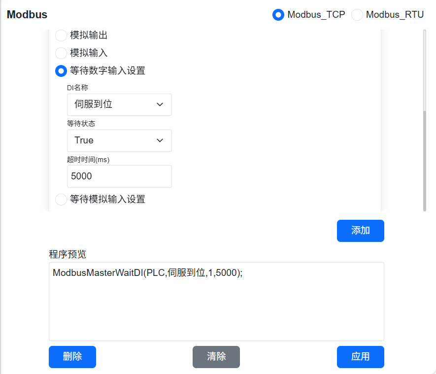

.. centered:: 圖表 9.18-36 新增等待DI輸入指令

此時機器人程式「testModbusMaster.lua」中已經加入一條機器人Modbus主站等待數位輸入DI的指令，啟動程式後，機器人會一直等待「PLC」主站的「伺服到位」暫存器值變成true，也就是數值1，由於設定的超時時間為5s，因此當機器人等待5s後「伺服到位」訊號仍為0時，機器人程式將會報超時錯誤，程式也自動停止運作。
            
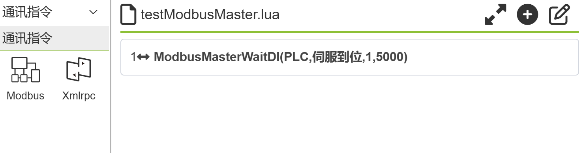

.. centered:: 圖表 9.18-37 等待數位輸入DI程序

8. 等待類比輸入

開啟ModbusTCP主站指令新增頁面，找到“等待類比輸入設定”即等待AI輸入暫存器設置，選擇AI名稱為配置的“液位”暫存器，等待狀態為“>”，暫存器值為255，逾時時間為5000ms 。點選「新增」按鈕，最後點選「應用」按鈕。
            

.. centered:: 圖表 9.18-38 新增等待模擬輸入

此時機器人程式「testModbusMaster.lua」中已經加入一條機器人Modbus主站等待AI輸入暫存器值的指令，啟動程式後，機器人會一直等待「PLC」主站的「液位」暫存器數值大於255，由於設定的超時時間為5s，因此當機器人等待5s後「液位」訊號仍不大於255時，機器人程式將會報超時錯誤，程式也會自動停止運作。
            
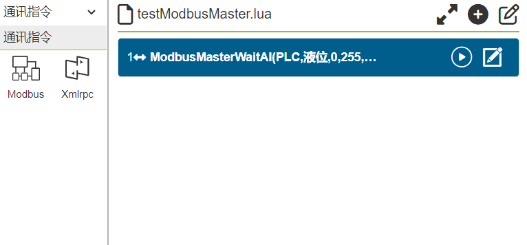

.. centered:: 圖表 9.18-39 等待AI輸入寄存器程序

ModbusTCP從站
++++++++++++++++++

機器人ModbusTCP從站提供通用數位輸入(線圈)，通用數位輸出(離散輸入)，通用類比輸入(保持暫存器)和通用類比輸出(輸入暫存器)四種類型的暫存器，其中通用數位輸入和類比輸入主要用於機器人讀取外部ModbusTCP主站資料從而控制機器人操作，而通用數位輸出和類比輸出主要用於機器人向外部ModbusTCP主站設備發送資料訊號，由外部主站設備讀取相關寄存器數值進而控制其設備運行。除上述通用輸入輸出外，機器人還提供部分「功能數位輸入(線圈)」用於外部主站設備控制機器人啟動程序、停止程序等操作，提供部分輸入寄存器用於顯示當前機器人的狀態信息，包括機器人目前笛卡爾位置、機器人目前運作狀態等(具體定義請查看附件一：ModbusTCP從站位址對映表)。機器人ModbusTCP從站使用過程主要包括：①參數配置；②通訊測試；③程式編寫。

ModbusTCP從站通訊參數配置
*******************************

開啟WebApp，依序點選“示教模擬”、“程式示教”，新使用者程式“testModbusSlave.lua”。
            
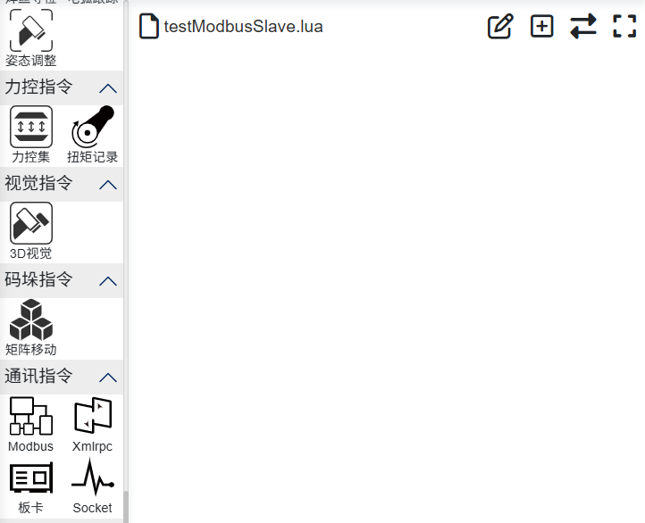

.. centered:: 圖表 9.18-40 創建ModbusTCP從站用戶程序

點選「ModbusTCP設定」按鈕，開啟ModbusTCP功能設定頁面。
            

.. centered:: 圖表 9.18-41 打開ModbusTCP設定

依序點擊“從站設定”，輸入機器人從站的IP，連接埠號碼和從站號，其中“IP”為機器人從站ip位址，法奧協作機器人具有示教器和控制箱兩個網路端口，兩個連接埠的IP位址不同，根據外部設備連接機器人從站的網路連接埠輸入正確的IP位址（建議您使用控制箱上的網路連接埠），變更機器人ModbusTCP從站IP位址、連接埠號碼或從站號後需要重新啟動機器人使其生效。
            
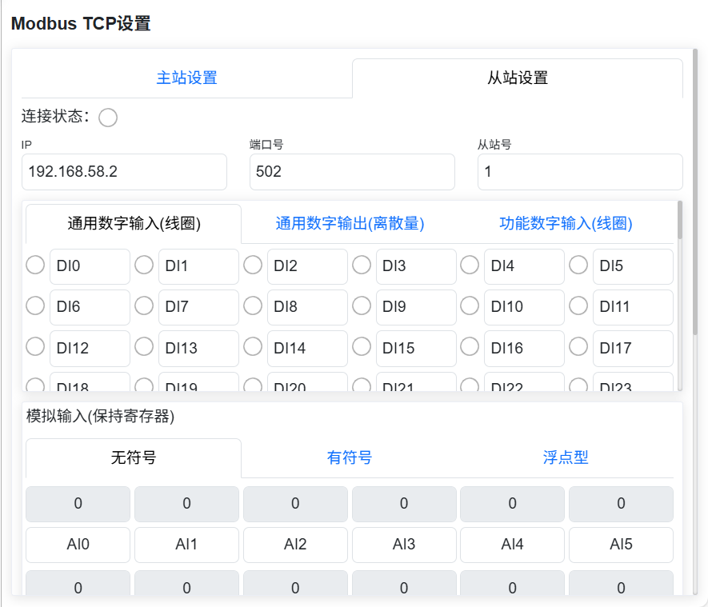

.. centered:: 圖表 9.18-42 ModbusTCP從站設置

ModbusTCP從站參數設定完成並重新啟動機器人後，外部主站設備即可透過設定的參數與機器人從站建立連接，連接成功後，機器人從站設定頁面「連接狀態」指示燈會亮起。
            
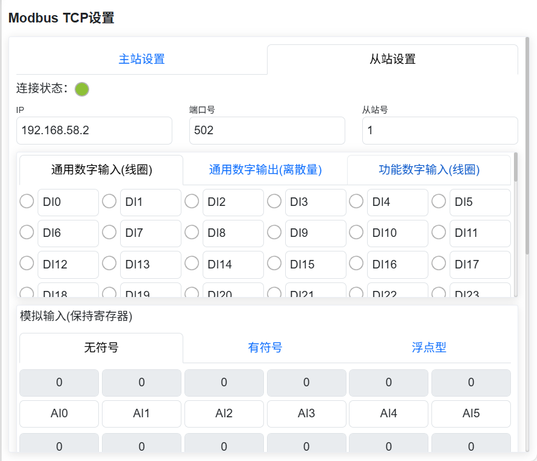

.. centered:: 圖表 9.18-43 從站連接狀態指示燈

ModbusTCP從站通訊測試
*****************************

1. 通用數位輸入(線圈)

機器人ModbusTCP從站提供128個線圈暫存器，它們的暫存器位址為100~127。

.. note:: 具體定義請查看附件一：ModbusTCP從站位址對映表。

機器人ModbusTCP從站的通用寄存器均可設定別名，修改機器人從站線圈寄存器DI0的名稱為“A到位”，DI1的名稱為“B到位”，根據地址映射表，“A到位”和“B到位”的Modb us線圈位址分別為100和101，在外部ModbusTCP主站裝置上將機器人從站線圈暫存器位址100和101都置1，此時機器人ModbusTCP從站監控頁面上兩點暫存器指示燈亮起。
            
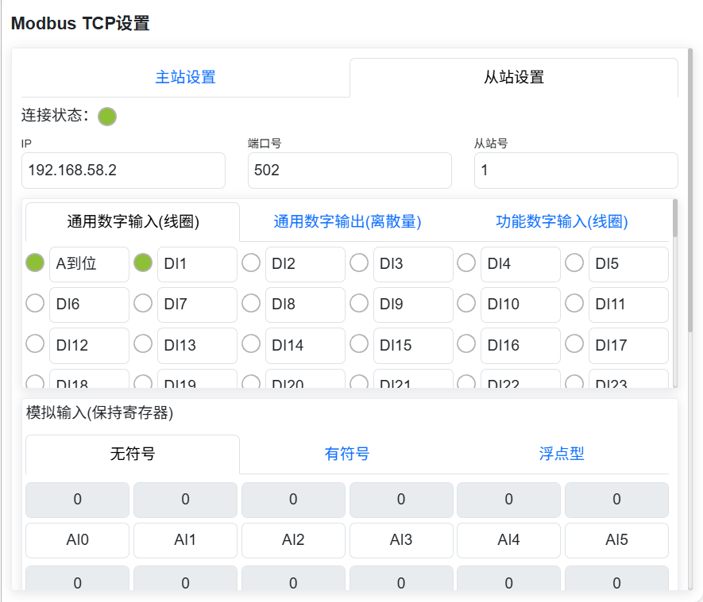

.. centered:: 圖表 9.18-44 ModbusTCP從站線圈狀態監控

2. 通用數位輸出(離散輸入)

機器人ModbusTCP從站提供128個離散輸入暫存器，它們的暫存器位址為100~127。

.. note:: 具體定義請查看附件一：ModbusTCP從站位址對映表。

同樣機器人ModbusTCP從站的離散輸入寄存器也可以設定別名，點擊“通用數字輸出(離散輸入)”修改機器人從站離散輸入寄存器DO0的名稱為“A啟動”，DO1的名稱為“B啟動”，根據地址映射表，「A啟動」與「B啟動」的Modbus離散輸入位址分別為100和101，點選「A啟動」對應離散輸入指示燈，該指示燈亮起，對應暫存器位址100的數值變為1，從外部ModbusTCP主站設備上可讀到該暫存器數值。

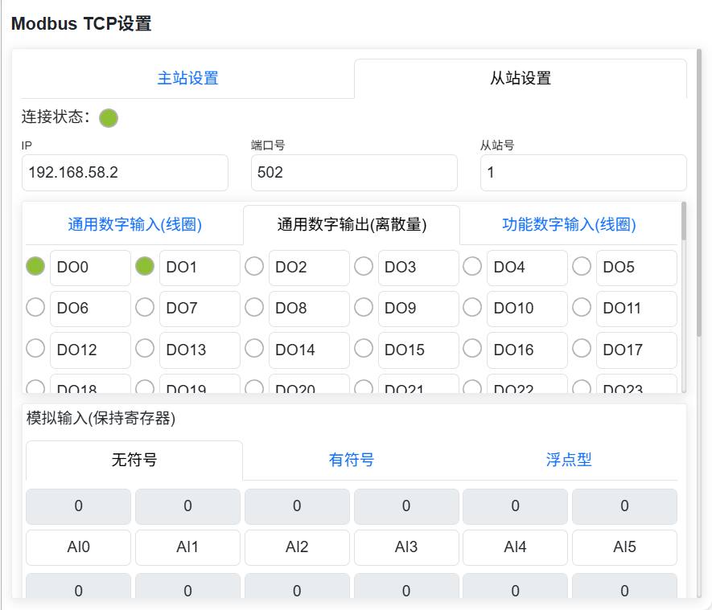

.. centered:: 圖表 9.18-45 ModbusTCP從站離散輸入控制

1. 類比輸入(保持暫存器)

機器人提供無符號、有符號和浮點型三種類型的保持寄存器共64個，AI0~AI63的位址為100~195

.. note:: text
 具體定義請查看附件一：ModbusTCP從站位址對映表，其中無符號類型暫存器資料範圍為0~65535，有符號型暫存器資料範圍為-32768~32767，浮點型暫存器為大端顯示。

 更改AI0和AI1的名稱分別為“電壓”和“電流”，從ModbusTCP從站地址映射表中查出兩個寄存器的地址分別為100和101，因此當連接的主站設備修改保持寄存器100和101寄存器位址值時，機器人ModbusTCP從站監控頁面「電壓」和「電流」暫存器位址值相應同步更新顯示，機器人的類比輸入主要用於機器人讀取外部主站設備數值訊號。

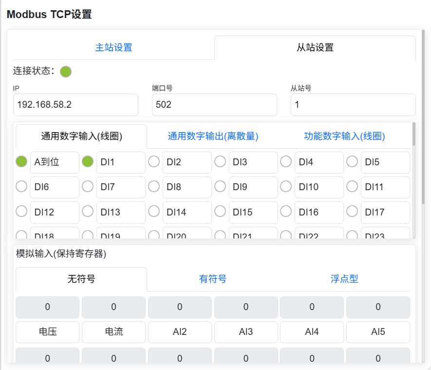

.. centered:: 圖表 9.18-46 ModbusTCP從站類比輸入監控

4. 類比輸出(輸入暫存器)

機器人提供無符號、有符號和浮點型三種類型的輸入暫存器共64個，AO0~AO63的位址為100~195

.. note:: text
 具體定義請查看附件一：ModbusTCP從站位址對映表，其中無符號類型暫存器資料範圍為0~65535，有符號型暫存器資料範圍為-32768~32767，浮點型暫存器為大端顯示。

 更改AO0和AO1的名稱分別為“目標位置A”和“目標位置B”，輸入量寄存器數值分別為2000和1500，從ModbusTCP從站地址映射表中查出兩個寄存器的地址分別為100和101，因此當連接的主站設備讀取輸入暫存器100和101暫存器位址值時，即可得到所設定的數值，機器人從站類比輸出主要用於機器人傳遞數值訊號到外部主站設備。

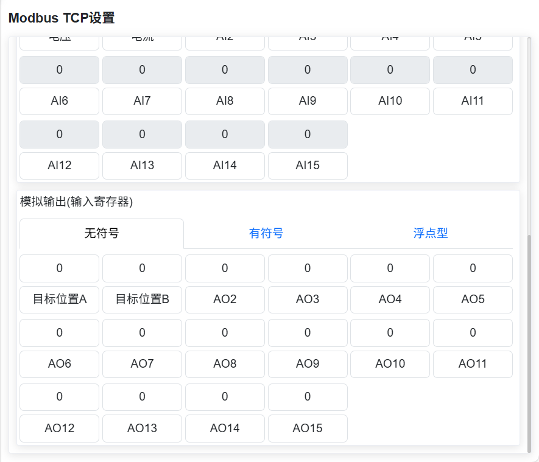

.. centered:: 圖表 9.18-47 Modbus從站修改類比輸入

ModbusTCP從站程式編寫
**************************

依序點選“全部”、“通訊指令”，開啟通訊指令新增頁面。

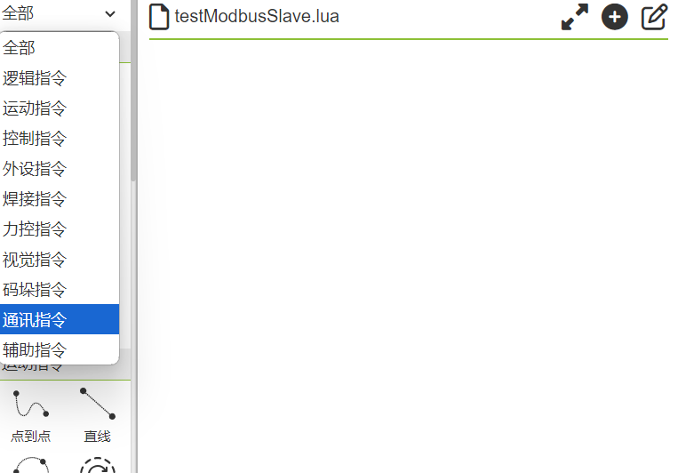

.. centered:: 圖表 9.18-48 開啟通訊指令新增頁面

點選“Modbus”。

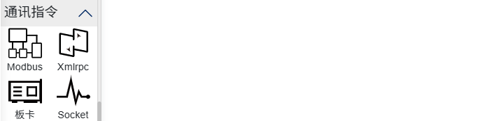

.. centered:: 圖表 9.18-49 選擇Modbus

點選“Modbus_TCP”。

.. image:: coding/178.png
   :width: 6in
   :align: center

.. centered:: 圖表 9.18-50 選擇Modbus_TCP

選擇“從站”，開啟ModbusTCP從站指令新增頁面。

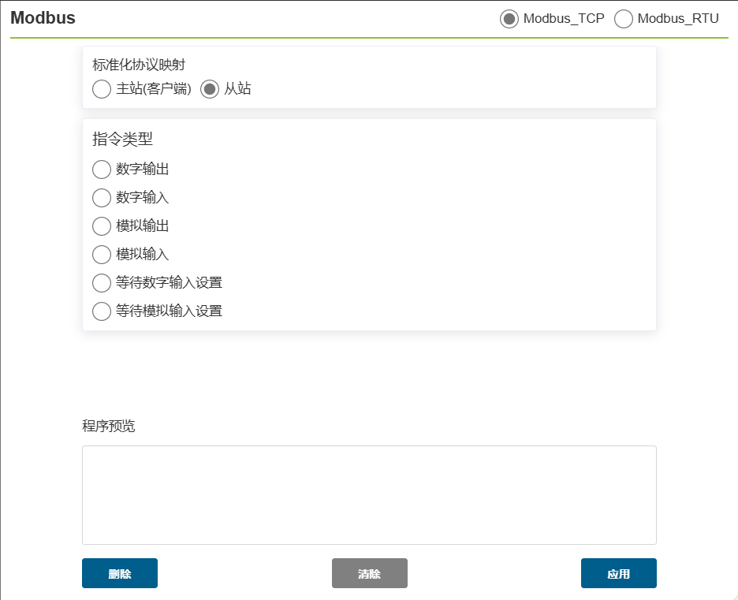

.. centered:: 圖表 9.18-51 ModbusTCP從站指令添加

1. 寫單一數位輸出DO(離散輸入)

選擇DO名稱為“A啟動”，暫存器數量為1，暫存器值為0，點選“寫入單一數字輸出”。最後翻至該頁面最底端，點選「應用」按鈕。

.. centered:: 圖表 9.18-52 新增寫入單一數位輸出指令

此時機器人程式「testModbusSlave.lua」中已經加入一條機器人Modbus從站寫單一數字輸出的指令，將機器人切換到自動模式，點擊啟動按鈕，機器人將名稱為「A啟動」對應的數字輸出的位址值寫為0。
   
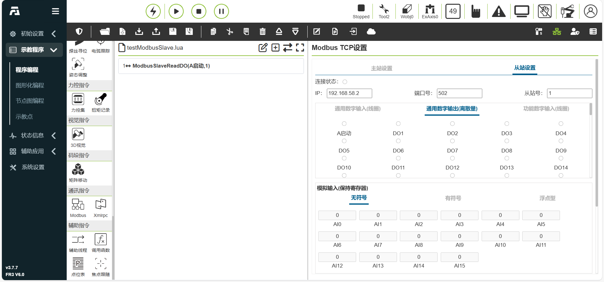

.. centered:: 圖表 9.18-53 寫單一數字輸出LUA程式

2. 寫多個數位輸出DO(離散輸入)

開啟ModbusTCP從站指令新增頁面，找到“數字輸出設定”，選擇DO名稱為“A啟動”，暫存器數量為5，暫存器值為1,0,1,0,1，其中暫存器值的個數要與設定的暫存器數量對應，且多個暫存器值之間以英文逗號隔開，點選「寫數字輸出」。最後翻至該頁面最底端，點選「應用」按鈕。
   

.. centered:: 圖表 9.18-54 配置寫多個數位輸出

此時機器人程式「testModbusSlave.lua」中已經加入一條機器人Modbus從站寫多個數字輸出的指令，將機器人切換到自動模式，點擊啟動按鈕，機器人將從站「A啟動」其後面4個離散輸入暫存器的值分別寫成1、0、1、0、1。
      
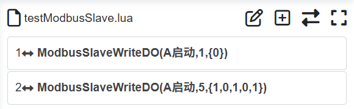

.. centered:: 圖表 9.18-55 寫多個數字輸出LUA程式

3. 讀取單一數位輸出DO(離散輸入)

開啟ModbusTCP主站指令新增頁面，找到“數字輸出設定”，DO名稱為“A啟動”，暫存器數量為1，暫存器值不需要填寫，點選“讀取數字輸出”。最後翻至該頁面最底端，點選「應用」按鈕。
      

.. centered:: 圖表 9.18-56 配置讀單一數位輸出

此時機器人程式「testModbusSlave.lua」中已經增加一條機器人Modbus從站讀單一數字輸出的指令。
         
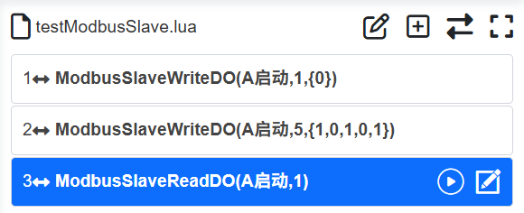

.. centered:: 圖表 9.18-57 讀單一數位輸出程序

通常讀Modbus暫存器後將讀到的數值存入變數裡，因此需要定義一個變數用來儲存讀取的數值。點擊“切換模式”按鈕，將機器人lua程式切換至可編輯狀態，在“ModbusSlaveReadDO”指令前編寫填加傳回值變數“AStartValue”，執行程式後讀到的數值將存在“AStartValue”裡。
         
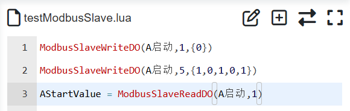

.. centered:: 圖表 9.18-58 讀單一數字輸出存入變數

線圈類型的暫存器值只有0和1兩個數值，在機器人程式中可以透過判斷暫存器數值不同來進行不同的操作。點擊「切換模式」按鈕將機器人示教程式切換至不可編輯模式，新增兩個關節運動指令分別移動到兩個不同的點位「P1」和「P2」。
         
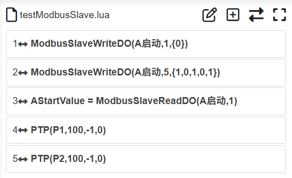

.. centered:: 圖表 9.18-59 新增不同點位的運動指令

再次將程式切換至可編輯模式，並編寫數位輸出值「AStartValue」的判斷條件，當「AStartValue」值為1時，機器人移動到「P1」點，否則機器人移動到「P2」點。
         
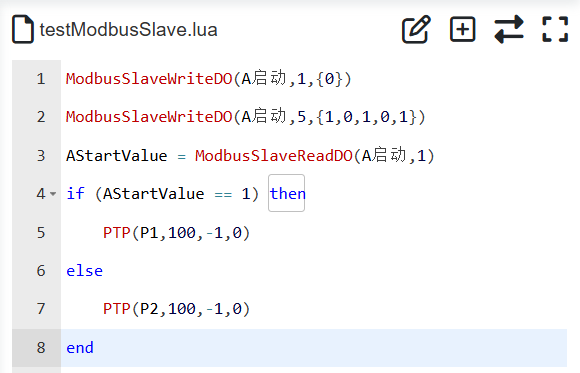

.. centered:: 圖表 9.18-60 根據數字輸出值不同運動到不同的點位

最後再將機器人程式切換至不可編輯模式，將機器人切換到自動模式，在確認安全的前提下啟動運作程序。由於程式的第二行將名稱為「A啟動」數位輸出DO值設為1，因此執行程式後機器人將移動到「P1」點。
         
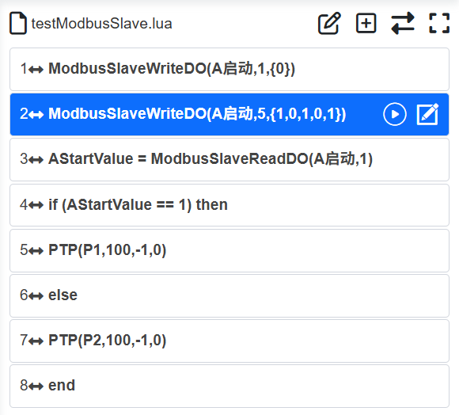

.. centered:: 圖表 9.18-61 讀取單一線圈暫存器數值並運動

4. 讀取多個數字輸出DO(離散輸入)

開啟ModbusTCP主站指令新增頁面，找到“數字輸出設定”，選擇DO名稱為“A啟動”，暫存器數量為2，暫存器值不需要填寫，點選“讀取數字輸出”。最後翻至該頁面最底端，點選「應用」按鈕。
         
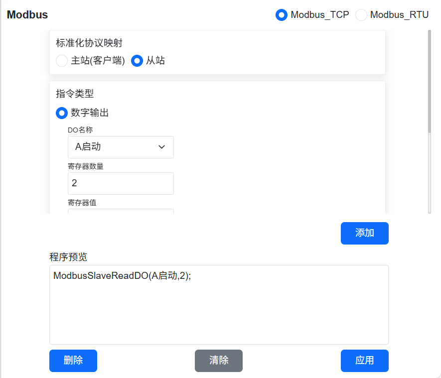

.. centered:: 圖表 9.18-62 配置讀多個數字輸出

此時機器人程式「testModbusSlave.lua」中已經加入一條機器人Modbus從站讀多個數字輸出的指令。
            
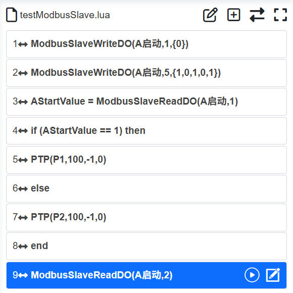

.. centered:: 圖表 9.18-63 讀多個數位輸出程序

點擊“切換模式”按鈕，將機器人lua程式切換至可編輯狀態，由於讀取的數量為2個，因此需要在“ModbusSlaveReadDO”指令前編寫填加2個傳回值變“value1,value2”，執行程序後來讀到的2個數字輸出暫存器數值將分別存在上述2個變數裡，同樣您可以判斷「value1」、「value6」的值使機器人進行不同的動作。
            
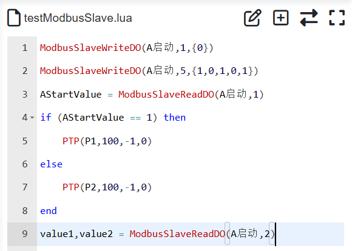

.. centered:: 圖表 9.18-64 讀取多個數字輸出存入變數

5. 讀數位輸入DI(線圈)

開啟ModbusTCP從站指令新增頁面，找到“數字輸入設定”，選擇DI名稱為“A到位”，暫存器數量為2，點選“讀取數字輸入”。最後翻至該頁面最底端，點選「應用」按鈕。
            
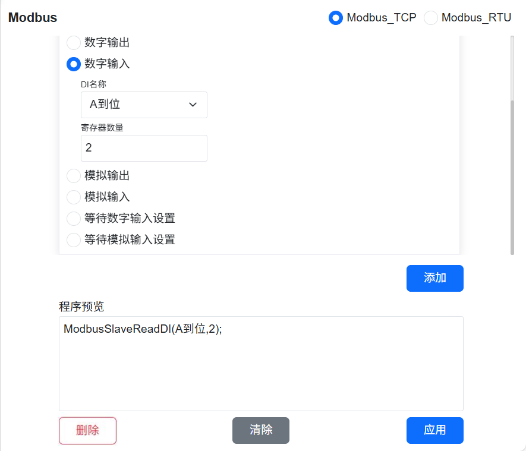

.. centered:: 圖表 9.18-65 配置讀數字輸入

此時機器人程式「testModbusSlave.lua」中已經增加一條機器人Modbus從站讀數位輸入的指令。
               

.. centered:: 圖表 9.18-66 讀數字輸入程式指令

點擊“切換模式”按鈕，將機器人lua程式切換至可編輯狀態，在“ModbusSlaveReadDI”指令前編寫傳回值變數“AState,BState”，執行程式後讀到的兩個數字輸入數值將分別存在變數“AState 」和「BState」裡，您可以透過判斷變數數值進而控制機器人做不同的操作。
              
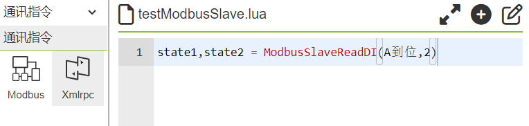

.. centered:: 圖表 9.18-67 讀數字輸入程序

6. 類比輸出AO(輸入暫存器)和類比輸入AI(保持暫存器)的讀寫操作

類比輸出(輸入暫存器)、類比輸入(保持暫存器)的讀寫操作與數位輸出(離散輸入)、數位輸入(線圈)的操作基本上一致，差別在於後者的資料範圍僅限於0或1，而前者的資料範圍較大，因此具體的操作可參考數位輸出和數位輸入程式的編寫，在此僅展示類比輸入的讀取操作和類比輸出的讀寫操作程式範例。
              
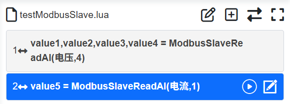

.. centered:: 圖表 9.18-68 讀類比輸入
              
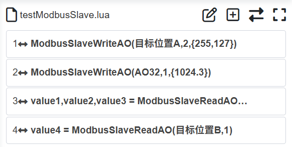

.. centered:: 圖表 9.18-69 讀寫模擬輸出

7. 等待數字輸入

開啟ModbusTCP從站指令新增頁面，找到“等待數位輸入設定”，選擇DI名稱為配置的“A到位”暫存器，等待狀態為“True”，逾時時間為5000ms。點選「新增」按鈕，最後點選「應用」按鈕。
              
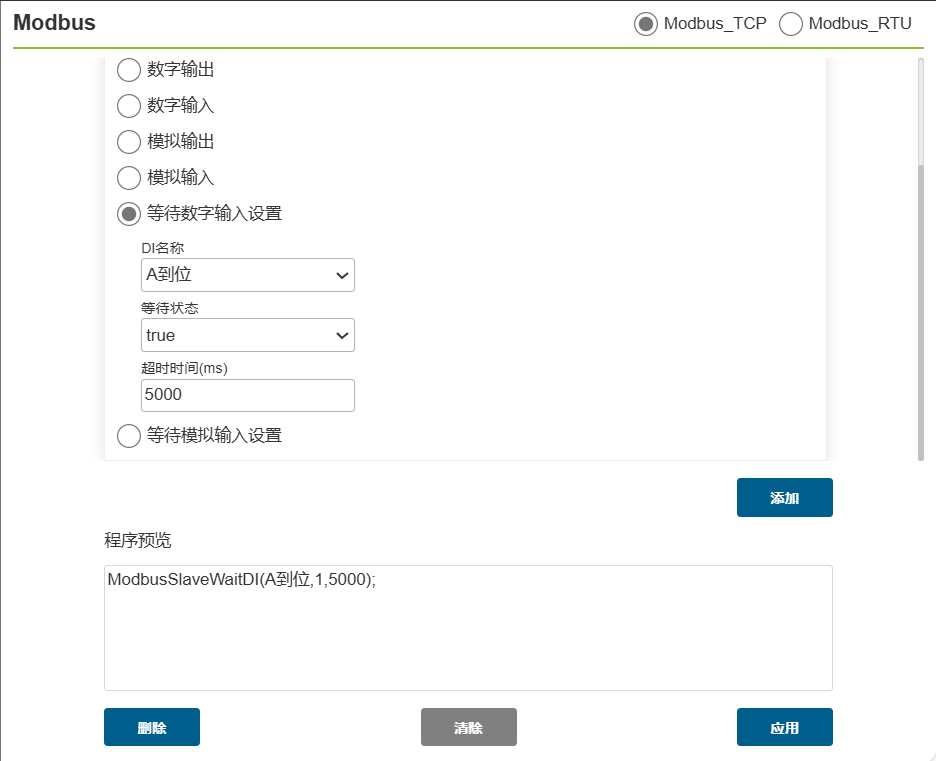

.. centered:: 圖表 9.18-70 新增等待數位輸入指令

此時機器人程式「testModbusSlave.lua」中已經加入一條機器人Modbus從站等待數位輸入的指令，啟動程式後，機器人會一直等待從站的「A到位」線圈暫存器值變為true，也就是數值1，由於設定的超時時間為5s，因此當機器人等待5s後「A到位」訊號仍為0時，機器人程式將會報超時錯誤，程式也會自動停止運作。
              

.. centered:: 圖表 9.18-71 等待數字輸入程式

8. 等待類比輸入

開啟ModbusTCP從站指令新增頁面，找到“等待類比輸入設定”選擇AI名稱為配置的“電壓”暫存器，等待狀態為“>”，暫存器值為255，逾時時間為5000ms。點選「新增」按鈕，最後點選「應用」按鈕。

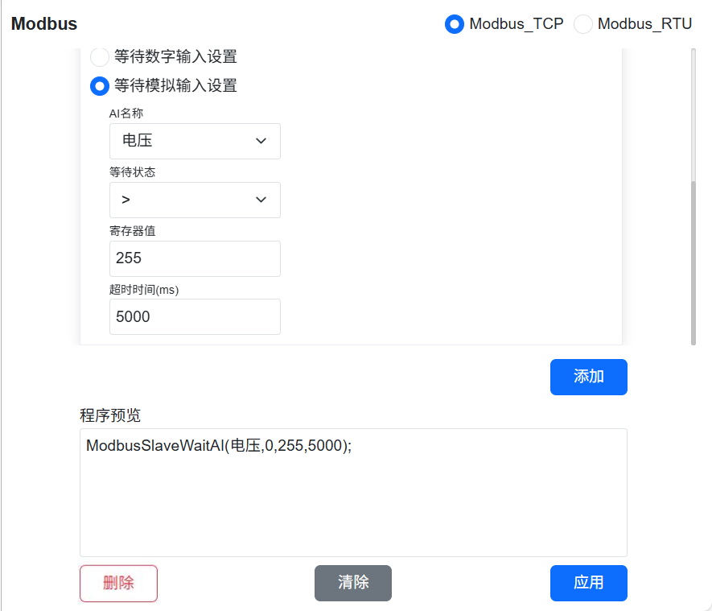

.. centered:: 圖表 9.18-72 新增等待模擬輸入指令

此時機器人程式「testModbusSlave.lua」中已經加入一條機器人Modbus從站等待類比輸入值的指令，啟動程式後，機器人會一直等待從站的「電壓」暫存器數值大於255，由於設定的超時時間為5s ，因此當機器人等待5s後「電壓」訊號仍不大於255時，機器人程式將會報逾時錯誤，程式也自動停止運作。
              

.. centered:: 圖表 9.18-73 等待模擬輸入暫存器程序

ModbusTCP從站機器人狀態回饋與控制
***********************************

協作機器人ModbusTCP從站輸入暫存器位址310~473用於回饋機器人即時狀態(具體位址定義見附件一：ModbusTCP從站位址對映表)，您只需要用主站裝置讀取對應暫存器的數值即可取得對應暫存器的數值即可取得對應暫存器的機器人即時狀態數據。

協作機器人ModbusTCP從站線圈寄存器位址300~599用於主站設備對機器人進行控制(具體位址定義見附件一：ModbusTCP從站位址映射表)，以線圈位址502為例，該位址功能表示「啟動程序」。

當機器人處於自動模式下，主站設備將位址502的值從0置1時，機器人自動開始運行目前配置的程式；再以線圈位址300為例，它用於控制機器人控制箱DO0的輸出，當外部主站將線圈位址300從0置1時，控制箱DO0自動輸出有效，同樣外部主站將線圈位址300從1置0時，控制箱DO0輸出無效。在ModbusTCP從站設定頁面點選“功能數字輸入(線圈)”，即可監控目前所有的功能數位輸入狀況。
              
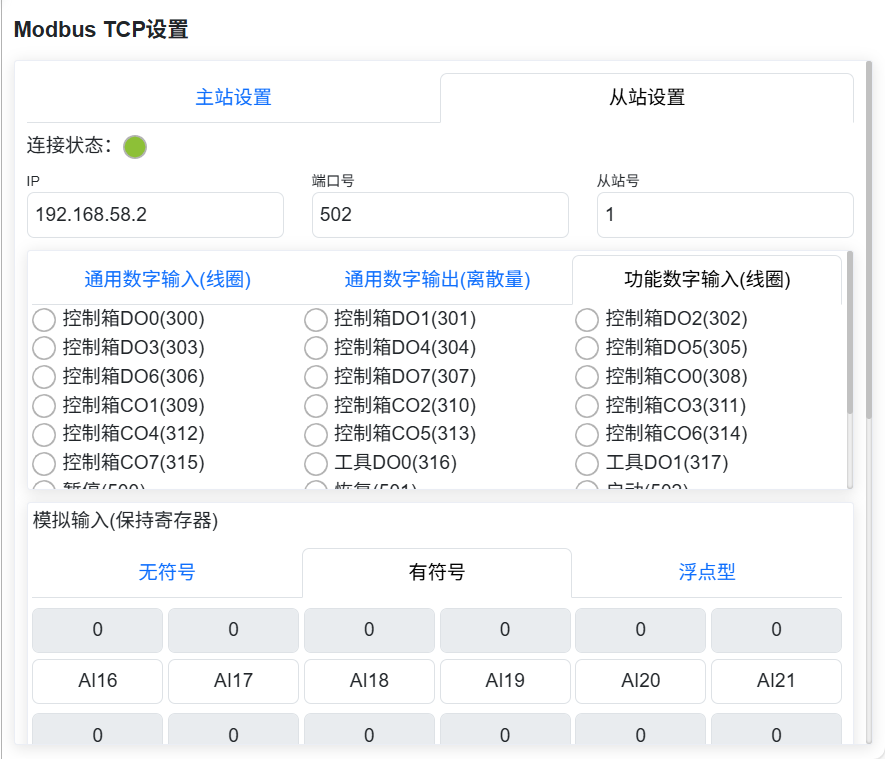

.. centered:: 圖表 9.18-74 機器人從站功能數位輸入
                 
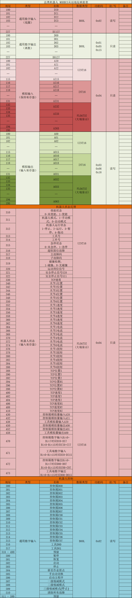

.. centered:: 图表 9.18-74 Modbus從站位址映射表

附件一：:download:`Modbus從站位址映射表 <../_static/_doc/Modbus从站地址映射表.xlsx>`

機器人後台程式
~~~~~~~~~~~~~~~~~

機器人後台程式功能
+++++++++++++++++++++++

機器人後台程序就是機器人在前台運動程序運行過程中，同時後台也可以運行的一種用於處理信號邏輯關係的控製程序，二者在運行關係上相互獨立。

後台程式可以監控前台的運作狀態，同時也可以向前台發送控制訊號。後台程式也可以透過I/O通信，與外部設備連接對機器人週邊設備進行運行監視與控制。後台邏輯程式可運作指令與前台示教程式不同，其不能控制任何運動軸。因此在編程時不能含有任何機器人軸運動指令。只保留邏輯控制功能及 I/O 通訊功能。

使用後台程式時，程式從頭到尾周而復始的循環掃描。系統內後台程式運作週期為1毫秒，可在背景程式中新增延時函數控制運作週期。後台程序執行過程中不受急停、暫停、警報的影響。

.. note:: 最多同時執行8個後台程式。

電源切斷後，下次通電時，後台邏輯程式將自動加載，按照設定的狀態進行運作。

機器人後台程式保存
************************************

後台程式創建、編輯及保存只能在後台程式介面下使用。

**Step1**：開啟機器人後台程式介面。開啟示教頁面，依序點選「示教程式」、「程式編程」。選擇左上方指令後台程序，即可進入後台程式介面。

.. note:: 後台程式只包含邏輯判斷、賦值指令，前台控制指令，I/O介面指令及Modbus通訊指令。

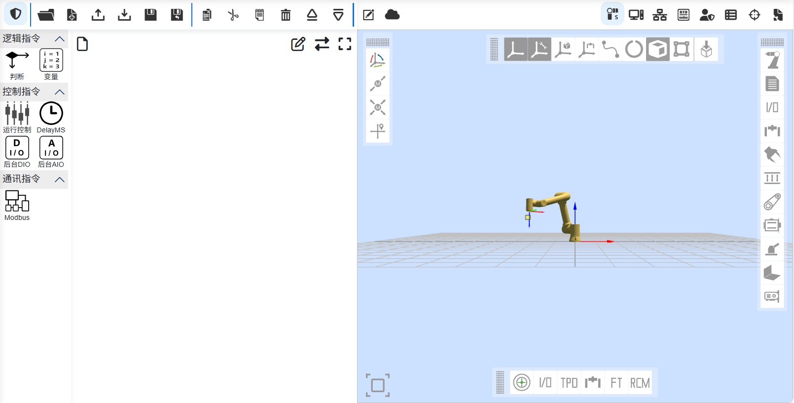

.. centered:: 圖表 9.19-1 後台程式介面

**Step2**：手動模式下，開啟後台示教程式檔案。點選“新建”，新建示教程式文件，進行程式編輯，點選“儲存”進行文件儲存。

.. note:: 後台程式運作週期為1毫秒，程式內可使用提供的延時函數，如下圖程式第4行，增加1秒延時來控制運作週期。

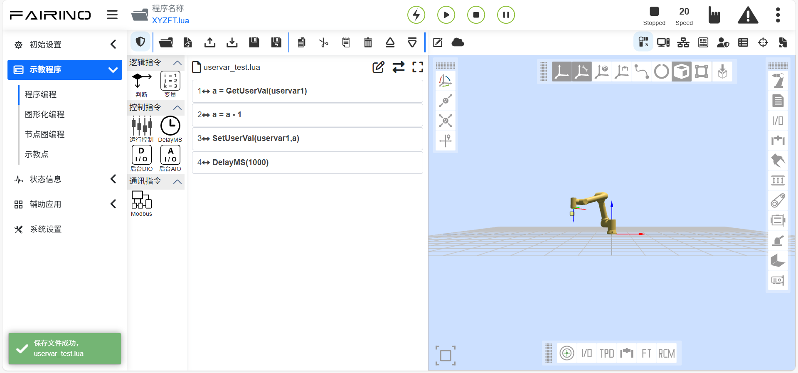

.. centered:: 圖表 9.19-2 後台程式檔案新建及儲存

機器人後台程式管理
****************************

儲存成功的後台程序，可以在後台程序管理介面進行建立、暫停、恢復及刪除。後台程式管理介面可以直覺的看見所有已經建立的後台程式的運作狀態。綠色即為正在運行，紅色表示暫停狀態。

**Step1**：建立後台程式。點擊後台程序管理按鈕，透過下拉方塊選擇已經儲存的後台程序，點擊“開始運行”，即可運行相應的後台程序。

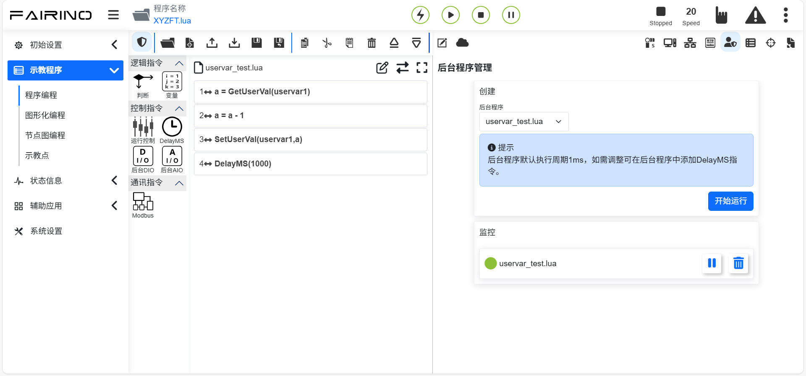

.. centered:: 圖表 9.19-3 建立後台程式

**Step2**：恢復、暫停後台程式。在後台程式管理介面中，對監控程式點選「恢復」和「暫停」按鈕，即可恢復和暫停對應的後台程式。點選「刪除」按鈕，即可刪除對應的後台程式。

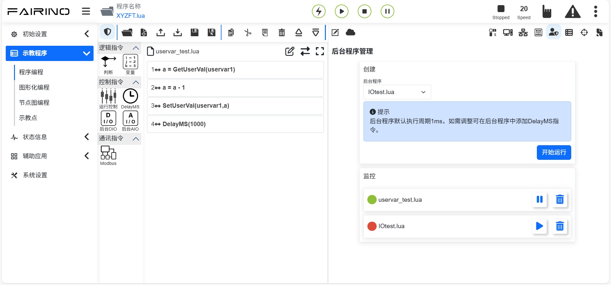

.. centered:: 圖表 9.19-4 後台程式暫停、恢復、刪除

機器人用戶變數使用
+++++++++++++++++++++++

.. note:: 協作機器人新增使用者變數功能，適用於機器人後台程式與前台程序，或不同後台程式間的資料互動。

機器人用戶變數管理
*************************************

使用使用者變數前，可先將使用者變數依喜好重新命名。開啟示教頁面，依序點擊“示教程式”、“程式編程”、“使用者變數管理”，該頁面在前台程式、和後台程式內均可使用。點擊變數名即可直接更改變數名。

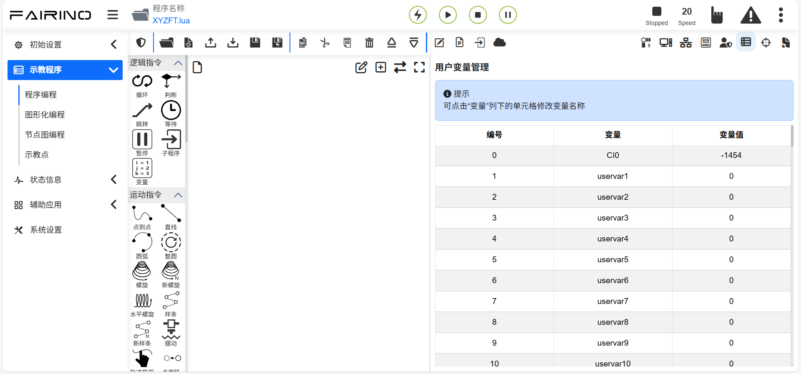

.. centered:: 圖表 9.19-5 使用者變數管理

機器人用戶變數使用
*************************

使用者變數在前、背景程式中使用時僅可使用使用者變數讀寫介面操作。

**Step1**：手動模式下，開啟示教程式檔案。開啟示教頁面，依序點選“示教程式”、“程式編程”，點選“新建”，新建示教程式檔案。

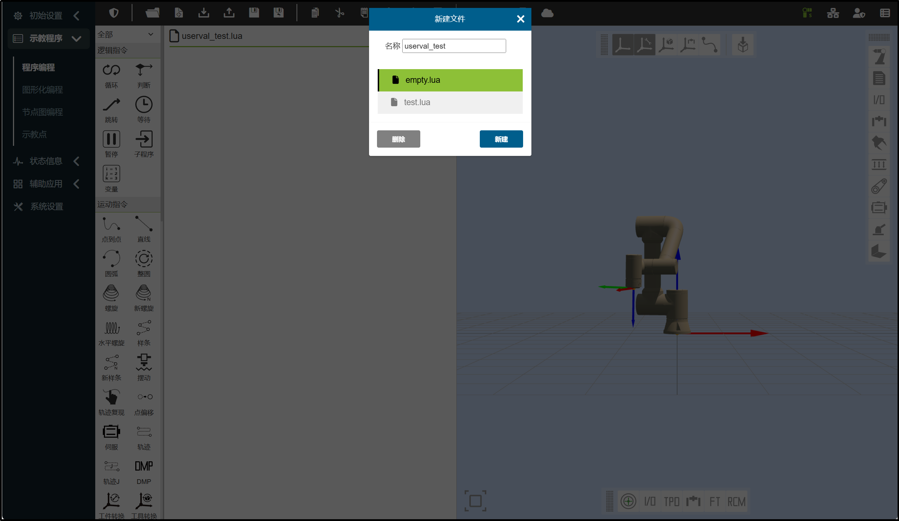

.. centered:: 圖表 9.19-6 新示教程式文件

**Step2**：使用使用者變數讀取介面。點選“變數”指令，選擇“使用者變數”，點選取得變數值下拉框，選擇需要讀取的使用者變量，點選“新增”、“應用”按鈕，即可撰寫使用者變數讀取介面程式。

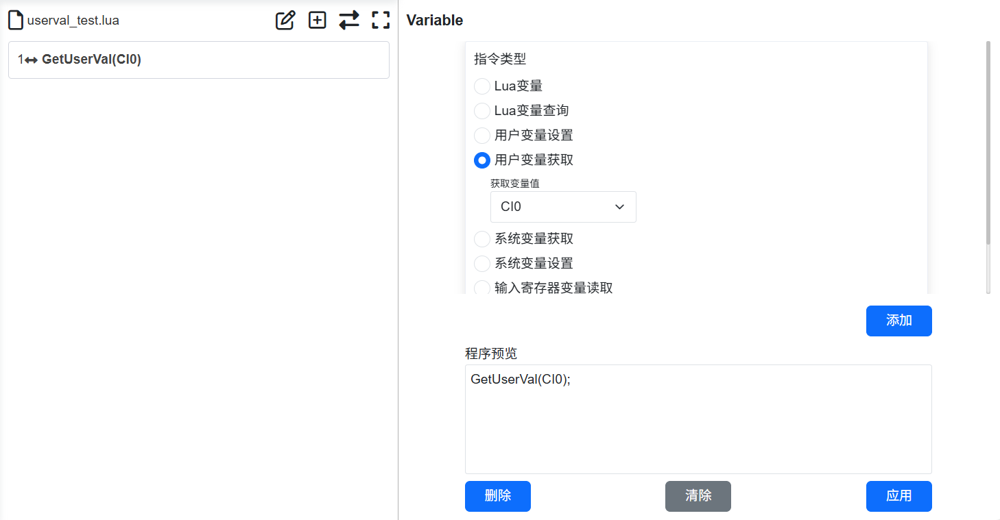

.. centered:: 圖表 9.19-7 使用用戶變數讀接口

**Step3**：使用使用者變數寫入介面。點擊“變數”指令，選擇“使用者變數”，點擊設定變數值下拉框，選擇需要設定的使用者變量，填寫對應的設定值，該值支援常數和變數值。點選「新增」、「應用」按鈕，即可編寫使用者變數寫入介面程式。

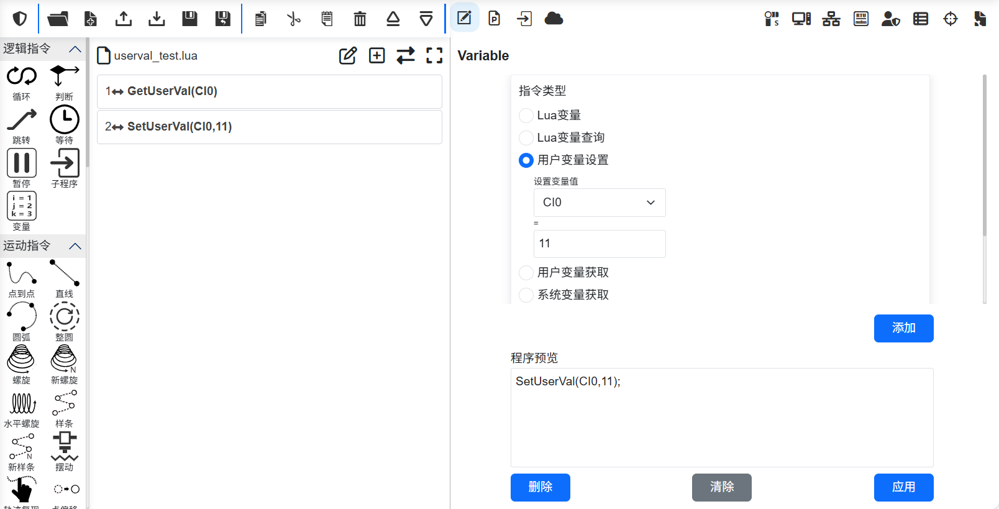

.. centered:: 圖表 9.19-8 使用使用者變數寫接口

XY方向橫向恆力打磨
~~~~~~~~~~~~~~~~~~~~~~~~

概述
+++++++++++++++

XY方向橫向恆力打磨原理如下：橫向恆力打磨是指在指定的工件表面上，以恆定的力施加打磨工具（如砂輪、打磨盤等），並沿XY方向控制工具的移動，使得在接觸點始終維持恆定的打磨力。

XY方向橫向恆力打磨功能操作流程
+++++++++++++++++++++++++++++++++

利用力傳感器進行恆力打磨，需要在力傳感器下安裝打磨工具，並配置工具坐標系，依次點擊“初始設置”->“基礎”->“坐標系”->“工具”按鈕，會進入“工具座標系設定”介面。在「座標系名稱」中選擇要進行設定的座標系（以toolcoord0座標系為例），依照末端工具的尺寸設定。

.. centered:: 圖表 9.20-1 設定工具座標系

力控參考座標系設定。在web介面中，依序點選“FT”->“參考座標系”，選擇“自訂座標系”，並將各參數設為“0”。當力感測器工作時，不同的參考座標系會影響感測器獲取外力的大小。

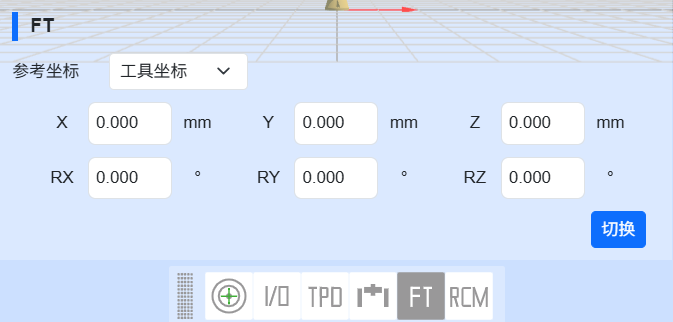

.. centered:: 圖表 9.20-2 設定參考座標系

固定待打磨平板於機器人作業空間內，平板不可有晃動，將工具末端近似垂直打磨板，示教始末點位。

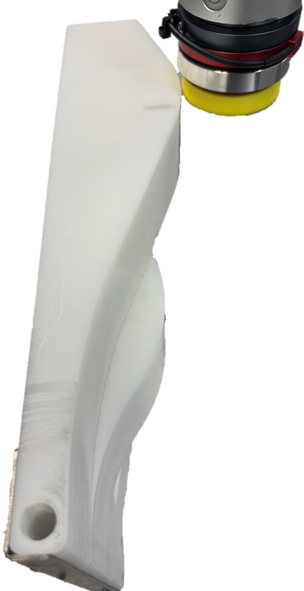

.. centered:: 圖表 9.20-3 打磨佈局示意

依序點選「示教程式」->「程式編程」->「力控集」按鈕，新增「FT_Control」指令。 「FT_Control」指令為力控運動指令，可以使機器人在設定力的附近移動。

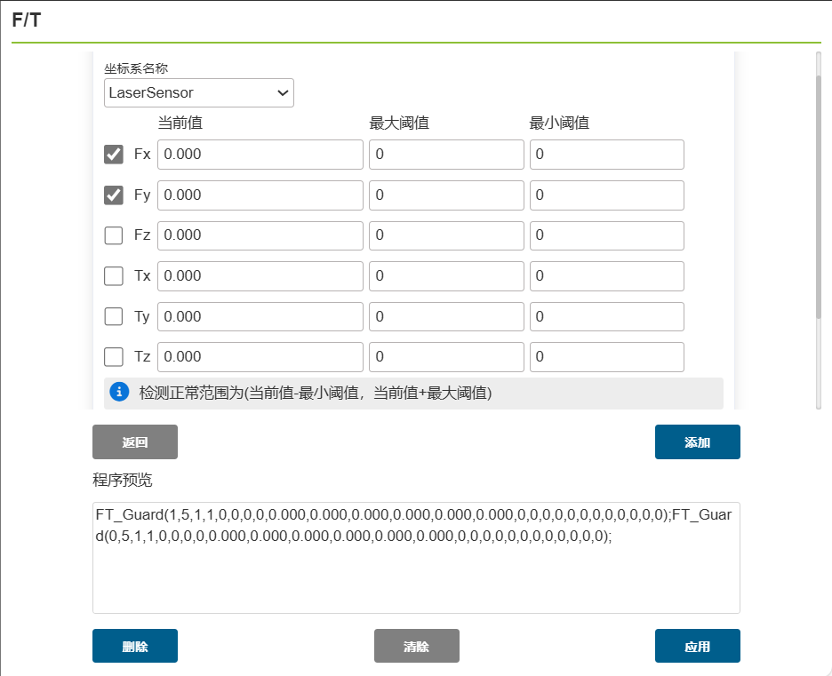

.. centered:: 圖表 9.20-4 新增力控指令

.. image:: coding/264.png
   :width: 6in
   :align: center

.. centered:: 圖表 9.20-5 力控打磨指令範例

參數的具體作用：

**座標系名稱**：設定感測器座標系時對應的名稱；

**勾選力方向偵測**：設定偵測閾值：選擇控制力的方向，在橫向打磨中，勾選Fx、Fy並設定對應的期望恆力；

**PID參數**：設定力和力矩的PID比例係數，一般設定F_P_gain為0.001；

**最大調整距離**：對應X,Y,Z方向的最大移動距離；

**最大調整角度**：對應RX,RY,RZ的最大轉動角度；

**打磨盤半徑**：由實際末端打磨工具的半徑決定。

軌跡自動規避奇異點功能
~~~~~~~~~~~~~~~~~~~~~~~~~~~~

概述
+++++++++++++++

當機器人在LIN、ARC指令軌跡中遇到經過機器人無法經過的奇異範圍時，機器人會報錯，提示下一位姿奇異或出現奇異警告。若想要能夠抵達會經過奇異範圍的下一路徑點時，可以使用本功能透過關節空間或笛卡爾空間來規避奇異點達到下一目標位姿。

.. image:: coding/265.png
   :width: 4in
   :align: center

.. centered:: 圖表 9.21-1 機器人奇異點簡易示意圖

上圖為機器人奇異點的示意圖，機器人奇異包含肩、肘、腕三種奇異，圖中A為5關節中心WCP（Wrist Center Point），用於判斷肩部奇異；B為肩奇異範圍，形似圓柱體，其半徑為機器人DH參數d4的長度，當WCP進入圓柱體B時機器人進入奇異狀態；C為機器人肘奇異邊界，當J3=0或180°時機器人處於肘奇異點狀態；D為機器人內部空間，在內部空間任意位置當J5=0或180°時處於腕奇異狀態。

.. note:: 奇異是機器人物理結構決定的運動特性，實際運作時應盡量避免，透過算法規避時會導致末端位姿與速度甚至構型配置的變化，需考慮規避的副作用是否影響需求再進行選擇。

軌跡自動規避奇異點功能操作流程
+++++++++++++++++++++++++++++++++++

在新建的程式中，點選新增機器人LIN/ARC類型的運動指令。

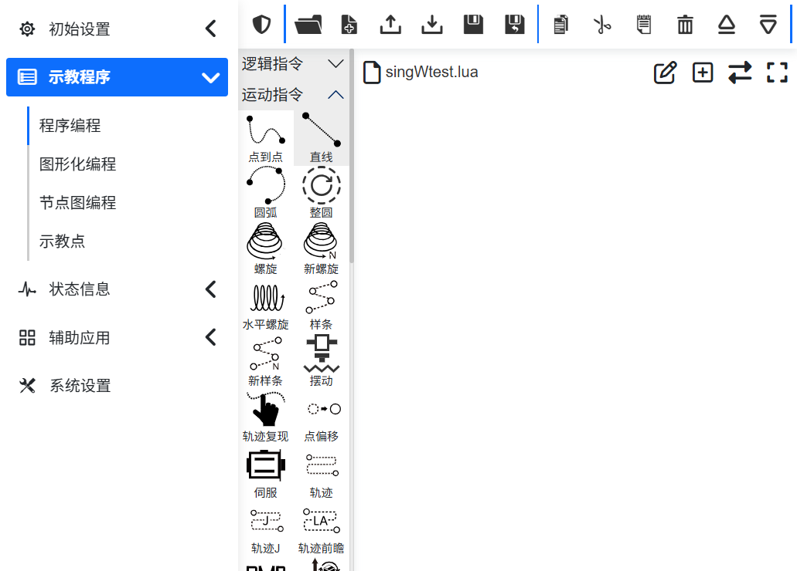

.. centered:: 圖表 9.21-2 新增LIN/ARC運動指令

點選「直線」指令，選擇途徑機器人奇異點的路點，在指令參數配置介面「運動保護」子選項中點選「奇異點規避」按鈕。

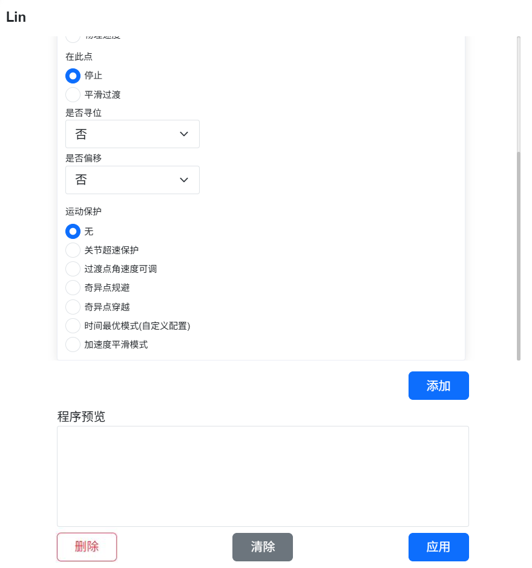

.. centered:: 圖表 9.21-3 開啟奇異點規避功能

「奇異點規避」參數包括「保護模式」、「肩奇異調整」、「肘奇異調整」與「腕奇異調整」相關參數。其中，“保護模式”分為“關節模式”和“笛卡爾模式”，意味著機器人可以從關節空間跨越奇異或從笛卡爾空間繞過奇異；“奇異調整”的參數指定了判定奇異的範圍與奇異規避的最大偏差，對於肩與肘奇異單位是mm，對於腕奇異單位是°。

.. note:: 關節空間會選取關節間最近的軌跡因此不會出現限位的情況，笛卡爾空間規避時可能出現關節限位的情況，需在示教時關注與調整。

選取與設定完奇異點規避參數後，即可點選「新增」按鈕新增指令，之後點選「應用」將lua指令新增至程式。

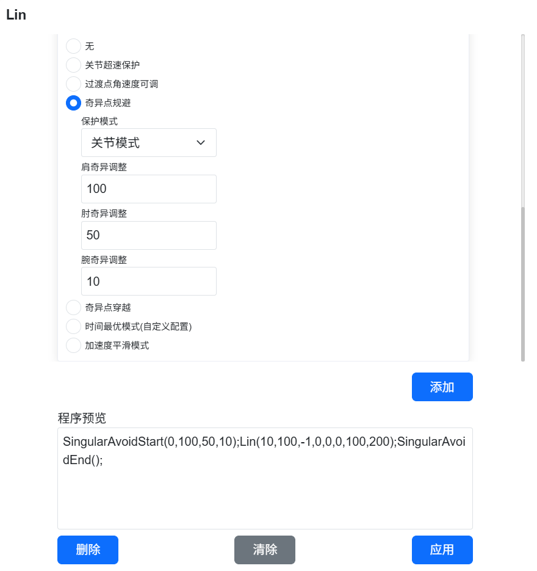

.. centered:: 圖表 9.21-4 配置奇異點規避參數，新增lua指令

示教完成一段典型的LIN奇異規避運動lua程序如下所示：

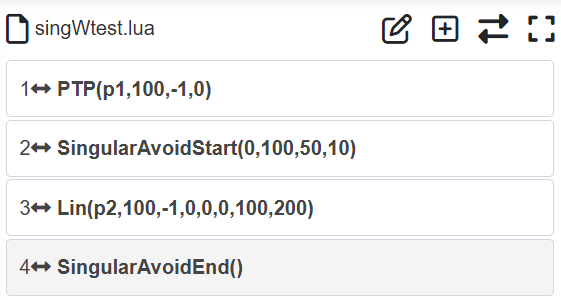

.. centered:: 圖表 9.21-5 包含奇異點規避指令的lua程序

實現規避的效果如下圖所示，紅色為機器人末端軌跡線：

.. image:: coding/270.png
   :width: 4in
   :align: center

.. image:: coding/271.png
   :width: 4in
   :align: center

.. centered:: 圖表 9.21-6 肩關節奇異規避軌跡範例（上：笛卡兒空間，下：關節空間）

.. image:: coding/272.png
   :width: 4in
   :align: center

.. image:: coding/273.png
   :width: 4in
   :align: center

.. centered:: 圖表 9.21-7 肘關節奇異規避軌跡範例（上：笛卡兒空間，下：關節空間）

.. image:: coding/274.png
   :width: 4in
   :align: center

.. centered:: 圖表 9.21-8 腕關節奇異規避軌跡範例（關節空間）

目前本功能支持規避LIN/ARC運動時經過單種奇異點的情況，若運動起止點處於設定的奇異範圍內、運動時途經不止一種奇異甚至同時發生兩種及以上奇異的情況時，界面將會顯示「[警告]奇異位姿」彈跳窗，提示目前奇異情況無法規避。

.. centered:: 圖表 9.21-9 警告當前奇異情況無法規避

自動模式下奇異點穿越功能
~~~~~~~~~~~~~~~~~~~~~~~~~~~~

概述
++++++++++++

當機器人在運行LIN或ARC指令並經過奇異點時，機器人的速度將會發生突變，導致運動控制不穩定，甚至對設備造成損害。透過奇異點穿越功能，可使機器人能夠平穩通過奇異點，本手冊以透過腕奇異的LIN指令為例，說明自動模式下奇異點穿越功能的使用方法。

操作流程
++++++++++++++++

1. 示教機器人執行LIN指令的兩個運動控制點（本手冊分別命名為wristlin1和wristlin2）。

2. 依序點選「示教程式」->「程式編程」按鈕，選擇「運動指令」中的「點到點」指令，新增第一個運動點。

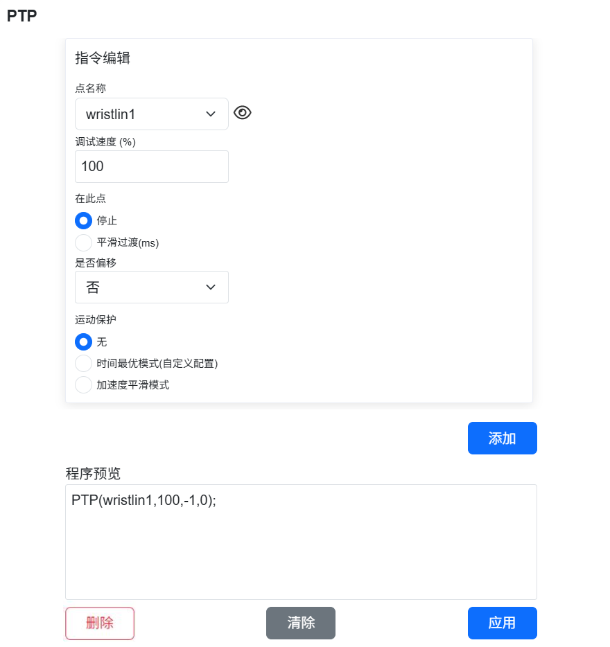

.. centered:: 圖表 9.22-1 加入第一個運動點

3. 選擇“運動指令”中的“直線”指令，新增第二個運動點，在“運動保護”中選擇“奇異點穿越”，並分別設定肩奇異、肘奇異和腕奇異的調整範圍。

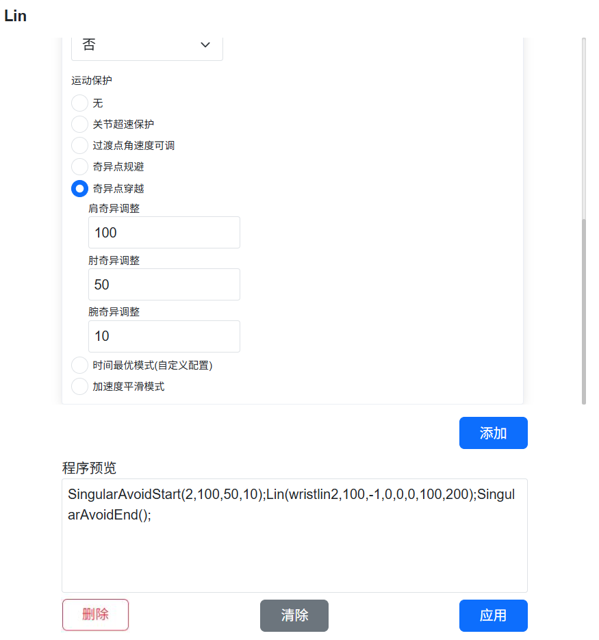

.. centered:: 圖表 9.22-2 設置奇異點穿越參數

4. 產生lua程式並執行，自動模式下奇異點穿越的典型LIN指令程式。

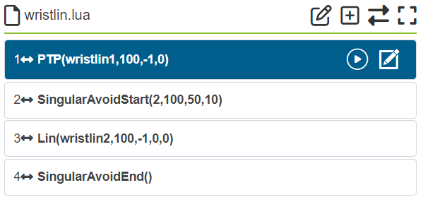

.. centered:: 圖表 9.22-3 典型奇異點穿越LIN指令

5. 觀察機器人的運動結果，並可透過調整機器人的運動速度和奇異設定範圍，以獲得不同的運動精度和衝擊。

精確度衝擊對照表
++++++++++++++++++++++++++++++++++

1. 腕奇異是機器人最容易觸發的奇異類型，整理了腕奇異LIN指令和ARC指令的精確度和衝擊對照表，其中LIN/ARC指令的對照表如下所示（〇表示觸發了碰撞警告）。
   
.. centered:: 表格 9.22-3-1 腕奇異LIN指令的誤差（單位：mm）

.. list-table::
   :widths: 35 20 20 20 20 20 20
   :header-rows: 0
   :class: sheet-center

   * - **奇異範圍/界面速度**
     - **2**
     - **20**
     - **40**
     - **60**
     - **80**
     - **100**

   * - 2 mm
     - 0.19					
     - 0.20
     - 0.20 
     - 0.21 
     - 〇  
     - 〇  

   * - 4 mm
     - 0.14					
     - 0.14
     - 0.14
     - 0.14
     - 0.14  
     - 0.14  

   * - 6 mm
     - 0.40				
     - 0.40
     - 0.41
     - 0.41
     - 0.42  
     - 0.42  

   * - 8 mm
     - 0.82				
     - 0.83
     - 0.83
     - 0.84
     - 0.83  
     - 0.84  

   * - 10 mm
     - 1.38				
     - 1.38
     - 1.39
     - 1.39
     - 1.39
     - 1.41  
   
.. centered:: 表格 9.22-3-2 腕奇異LIN指令的線加加速度（單位：m/s\ :sup:`3`）

.. list-table::
   :widths: 35 20 20 20 20 20 20
   :header-rows: 0
   :class: sheet-center

   * - **奇異範圍/界面速度**
     - **2**
     - **20**
     - **40**
     - **60**
     - **80**
     - **100**

   * - 2 mm
     - 0.605						
     - 12.040
     - 11.370
     - 2743.000		
     - 〇  
     - 〇  

   * - 4 mm
     - 0.916								
     - 34.620
     - 110.900	
     - 241.300	
     - 303.900  
     - 400.700  

   * - 6 mm
     - 0.906									
     - 59.700
     - 139.600
     - 343.700
     - 445.600  
     - 582.900  

   * - 8 mm
     - 1.073									
     - 67.480
     - 199.600
     - 438.300
     - 553.400 
     - 623.900  

   * - 10 mm
     - 1.013								
     - 69.490
     - 195.800	
     - 556.600
     - 649.300
     - 953.300  
   
.. centered:: 表格 9.22-3-3 腕奇異LIN指令的角加加速度（單位：°/s\ :sup:`3`）

.. list-table::
   :widths: 35 20 20 20 20 20 20
   :header-rows: 0
   :class: sheet-center

   * - **奇異範圍/界面速度**
     - **2**
     - **20**
     - **40**
     - **60**
     - **80**
     - **100**

   * - 2 mm
     - 1122									
     - 25140
     - 24780
     - 54890		
     - 〇  
     - 〇  

   * - 4 mm
     - 305													
     - 9035
     - 26030
     - 39330
     - 60510
     - 80330

   * - 6 mm
     - 219														
     - 8161
     - 19450
     - 84700
     - 109300
     - 143400 

   * - 8 mm
     - 478													
     - 6651
     - 19780
     - 121600
     - 150500
     - 162100 

   * - 10 mm
     - 281												
     - 5296
     - 14470
     - 161600
     - 177300
     - 256000
   
.. centered:: 表格 9.22-3-4 腕奇異ARC指令的誤差（單位：mm）

.. list-table::
   :widths: 35 20 20 20 20 20 20
   :header-rows: 0
   :class: sheet-center

   * - **奇異範圍/界面速度**
     - **2**
     - **20**
     - **40**
     - **60**
     - **80**
     - **100**

   * - 2 mm
     - 1.06									
     - 1.06
     - 1.05
     - 1.05		
     - 〇  
     - 〇  

   * - 4 mm
     - 1.58														
     - 1.59
     - 1.60
     - 1.62
     - 〇  
     - 〇 

   * - 6 mm
     - 3.31																			
     - 3.34
     - 3.35
     - 3.32
     - 3.39
     - 3.33 

   * - 8 mm
     - 5.81																		
     - 5.83
     - 5.87
     - 5.87
     - 5.87
     - 5.96 

   * - 10 mm
     - 9.06																	
     - 9.09
     - 9.12
     - 9.17
     - 9.17
     - 9.22
   
.. centered:: 表格 9.22-3-5 腕奇異ARC指令的線加加速度（單位：m/s\ :sup:`3`）

.. list-table::
   :widths: 35 20 20 20 20 20 20
   :header-rows: 0
   :class: sheet-center

   * - **奇異範圍/界面速度**
     - **2**
     - **20**
     - **40**
     - **60**
     - **80**
     - **100**

   * - 2 mm
     - 13.970										
     - 643.000	
     - 2230.000	
     - 3408.000	
     - 〇  
     - 〇  

   * - 4 mm
     - 0.635																	
     - 24.850
     - 42.480
     - 76.990
     - 〇  
     - 〇 

   * - 6 mm
     - 3.000																						
     - 19.960
     - 45.350
     - 57.120
     - 77.050
     - 59.800	 

   * - 8 mm
     - 1.494																						
     - 27.830
     - 90.290
     - 124.200
     - 148.400
     - 168.000

   * - 10 mm
     - 0.460																					
     - 31.870
     - 112.600
     - 211.000
     - 229.300
     - 117.500
   
.. centered:: 表格 9.22-3-6 腕奇異ARC指令的角加加速度（單位：°/s\ :sup:`3`）

.. list-table::
   :widths: 35 20 20 20 20 20 20
   :header-rows: 0
   :class: sheet-center

   * - **腕奇異ARC指令的角加加速度（單位：°/s\ :sup:`3`）**
     - **2**
     - **20**
     - **40**
     - **60**
     - **80**
     - **100**

   * - 2 mm
     - 3378													
     - 85380
     - 228600	
     - 351900
     - 〇  
     - 〇  

   * - 4 mm
     - 1098																				
     - 31360
     - 71460
     - 104800
     - 〇  
     - 〇 

   * - 6 mm
     - 390																											
     - 15770
     - 43650
     - 79330
     - 93930
     - 124200 

   * - 8 mm
     - 315																											
     - 10270
     - 28770
     - 57000
     - 75840
     - 94050

   * - 10 mm
     - 504																										
     - 6108
     - 21470
     - 34920
     - 47280
     - 97160

2. 因肩奇異和肘奇異分別對應機器人的最小工作邊界和最大工作邊界，不能以精確度作為衡量指標。因此，整理了肩奇異的衝擊對照表，肘奇異的衝擊對照表如下，其中〇表示觸發了碰撞警告）。

.. centered:: 表格 9.22-3-7 肩奇異的線加加速度（單位：m/s\ :sup:`3`）

.. list-table::
   :widths: 35 20 20 20 20 20 20
   :header-rows: 0
   :class: sheet-center

   * - **奇異範圍/界面速度**
     - **2**
     - **20**
     - **40**
     - **60**
     - **80**
     - **100**

   * - 40 mm
     - 1.166																
     - 99.730
     - 253.200	
     - 273.500
     - 〇  
     - 〇  

   * - 70 mm
     - 1.047																								
     - 92.440
     - 328.900
     - 634.500
     - 878.400  
     - 1499.000	 

   * - 100 mm
     - 1.060																															
     - 90.250
     - 273.900
     - 506.600
     - 926.300
     - 1555.000	 

.. centered:: 表格 9.22-3-8 肩奇異的角加加速度（單位：°/s\ :sup:`3`）

.. list-table::
   :widths: 35 20 20 20 20 20 20
   :header-rows: 0
   :class: sheet-center

   * - **奇異範圍/界面速度**
     - **2**
     - **20**
     - **40**
     - **60**
     - **80**
     - **100**

   * - 40 mm
     - 396																		
     - 89.83
     - 824
     - 348
     - 〇  
     - 〇  

   * - 70 mm
     - 428																													
     - 121
     - 681
     - 167
     - 1783 
     - 35690 

   * - 100 mm
     - 440																																				
     - 151
     - 473
     - 246
     - 1495
     - 39280

.. centered:: 表格 9.22-3-9 肘奇異的線加加速度（單位：m/s\ :sup:`3`）

.. list-table::
   :widths: 35 20 20 20 20 20 20
   :header-rows: 0
   :class: sheet-center

   * - **奇異範圍/界面速度**
     - **2**
     - **20**
     - **40**
     - **60**
     - **80**
     - **100**

   * - 40 mm
     - 0.905																						
     - 14.430
     - 52.080
     - 87.380
     - 129.400  
     - 657.000  

   * - 70 mm
     - 1.144																																		
     - 24.320
     - 79.580
     - 270.300
     - 793.300 
     - 1478.000 

   * - 100 mm
     - 1.852																																									
     - 27.930
     - 112.700
     - 328.100
     - 583.000
     - 758.600

.. centered:: 表格 9.22-3-10 肘奇異的的角加加速度（單位：°/s\ :sup:`3`）

.. list-table::
   :widths: 35 20 20 20 20 20 20
   :header-rows: 0
   :class: sheet-center

   * - **奇異範圍/界面速度**
     - **2**
     - **20**
     - **40**
     - **60**
     - **80**
     - **100**

   * - 40 mm
     - 347																										
     - 128
     - 148
     - 142
     - 63
     - 38050 

   * - 70 mm
     - 424																																						
     - 132
     - 141
     - 21780
     - 56190
     - 95610 

   * - 100 mm
     - 46																																														
     - 1443
     - 6194
     - 19940
     - 35170
     - 46770

即時前瞻軌跡規劃功能
~~~~~~~~~~~~~~~~~~~~~~~~~~~~

概述
++++++++++++

即時前瞻軌跡規劃是基於當前和未來的路徑訊息，動態調整機器人速度和加速度等運動參數，以確保運動的平滑性、連續性和精準性。透過預測機器人未來位置和姿態，前瞻控制能夠在路徑的關鍵點前做出反應，從而避免因速度和加速度的突變而導致運動不平穩或軌跡誤差。

操作流程
++++++++++++

**Step1**：準備好「txt」格式的軌跡點文件，其中每個軌跡點以笛卡爾位姿表示。

**Step2**：依序點選「示教程式」->「程式編程」按鈕，選擇「運動指令」中的「軌跡前瞻」指令，在「指令配置」中進行軌跡檔案的匯入與刪除。

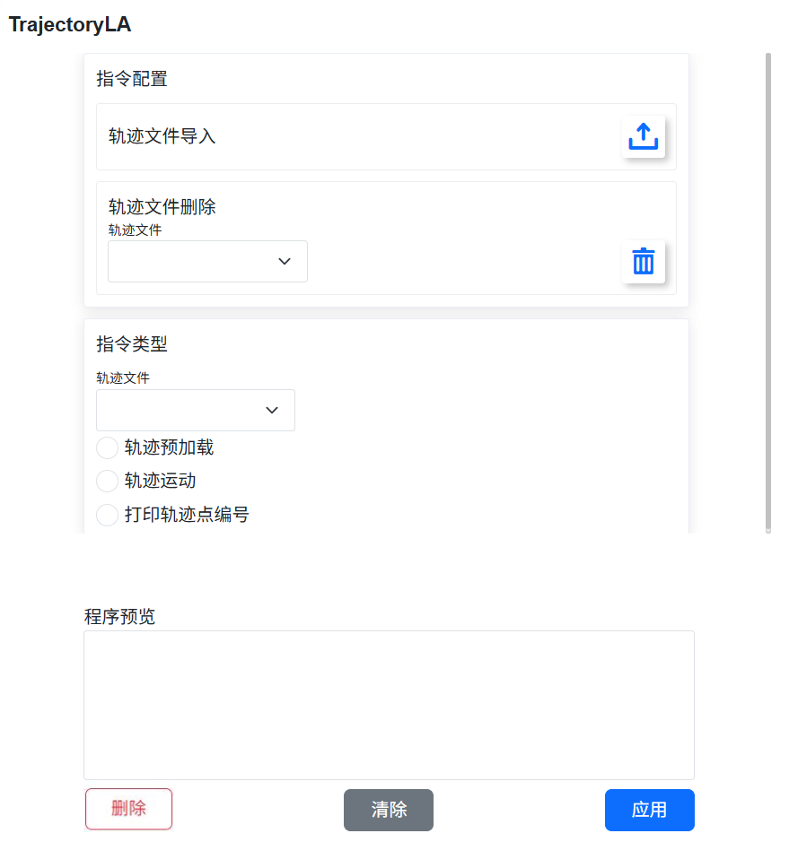

.. centered:: 圖表 9.23-1 軌跡檔案匯入與刪除

**Step3**：選擇要運行的軌跡文件，添加「軌跡預加載」指令：
首先在「曲線擬合方式」中選擇對軌跡點的擬合方式，包括「直線連接」、「直線擬合」、「B樣條曲線」、「多項式優化方法」等，當選擇「直線擬合」時，需額外設置誤差限制，其他方式無需進行此設置；
其次設置平滑方式和平滑精度；
最後設置運行過程中的最大速度、最大加速度和最大加加速度，並可通過「勻速運動」選擇是否開啟勻速前瞻，當開啟時，機器人將會以勻速進行前瞻。

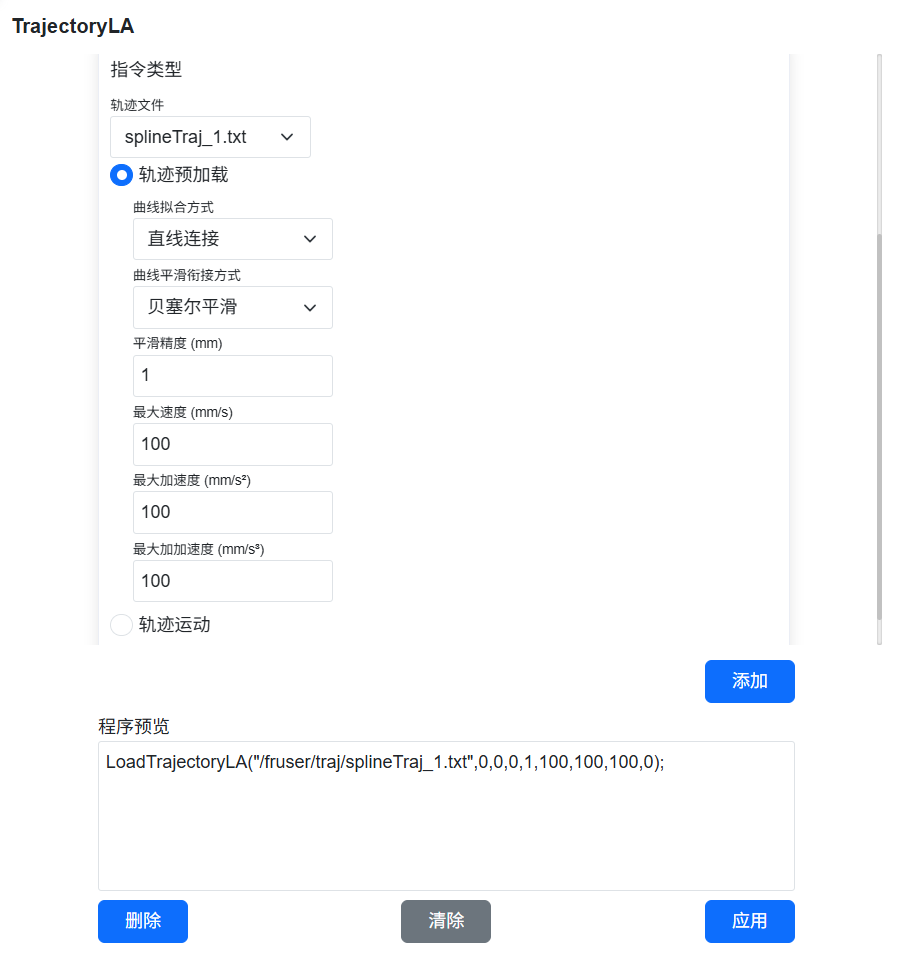

.. centered:: 圖表 9.23-2 設置軌跡預「直線擬合」加載參數

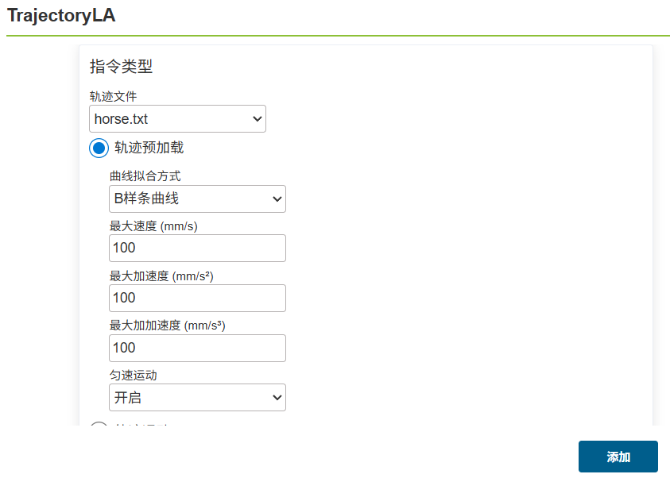

.. centered:: 圖表 9.23-3 設置軌跡預加載參數

**Step4**：添加「軌跡運動」指令並生成lua程序，通過運行lua程序即可對導入的軌跡文件進行實時前瞻軌跡規劃，實時前瞻軌跡規劃的典型程序如下圖。

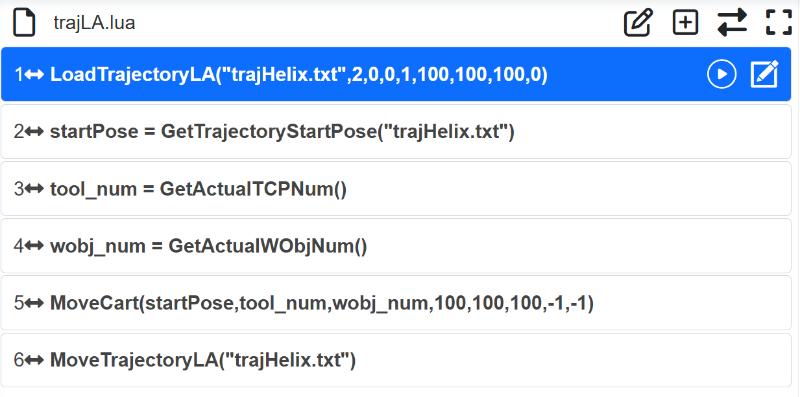

.. centered:: 圖表 9.23-4 實時前瞻軌跡規劃的典型程序（B樣條曲線）

**Step5**：針對lua程式中的「LoadTrajectory」命令列，點選編輯按鈕，可實現設定參數的修改，以實現不同的軌跡規劃效果。

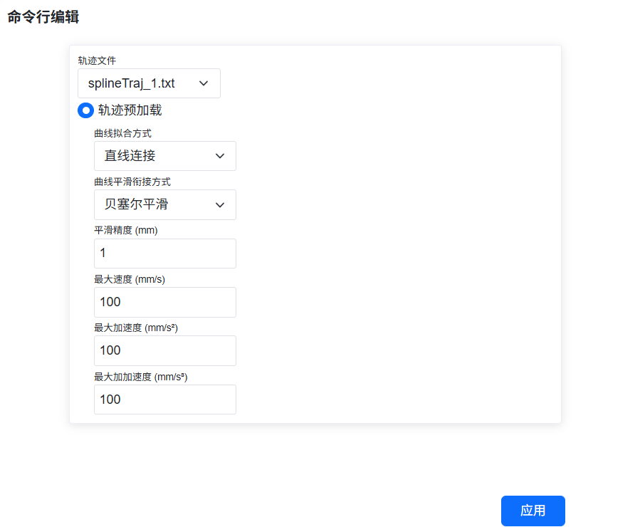

.. centered:: 圖表 9.23-5 修改設定參數

擺幅單調漸變電弧追蹤功能
~~~~~~~~~~~~~~~~~~~~~~~~~~~~~~~~~~~~

擺動運動可實現「突變」與「漸層」兩種擺幅切換方式。

「突變」方式是指前段擺動參數與後一段擺動參數直接切換的方式，可透過設定兩段相鄰但參數不同的擺動運動實現，也可在擺動運動運行過程中實時下發新擺動編號實現（詳見功能對應手冊部分，此處不贅述）。

「漸變」方式是指在目前段擺動運動中，起始處設定的擺動幅度逐漸改變至結束處所設定的擺動幅度。

擺動參數漸變切換方式只支援直線擺動過程中進行。

簡介
+++++++++++++

擺幅單調漸變擺動運動軌跡如下圖所示。

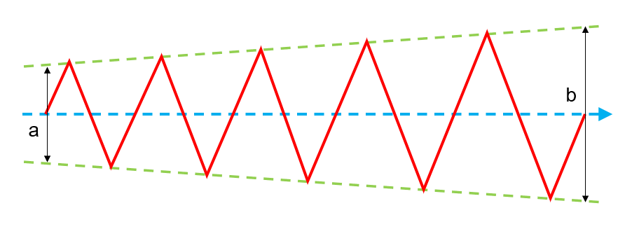

其中，藍線為擺動運動方向，a為起始點擺動幅度，b為結束點擺動幅度，擺動幅度在運動過程中逐漸過渡變化。

.. note:: 需注意，目前僅支援起始點與終止點為同類型、擺幅不同（由a變為b）其餘參數一致的漸變擺動，執行擺動前建議核對擺動參數。

設定一段擺幅漸層擺盪操作流程如下：

**Step 1**：點擊“示教程式”，“程式編程”，選擇並點擊“運動指令”下屬的“擺動”按鈕進入擺動指令設定頁面。

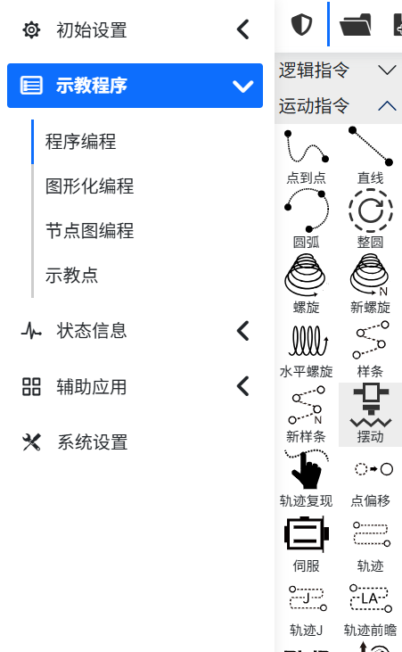

.. centered:: 圖表 9.24-1 點選擺動功能按鈕

**Step 2**：在指令編輯中選擇擺動起始時的擺動參數編號，點選「開始擺動」後點選「新增」按鈕。
   
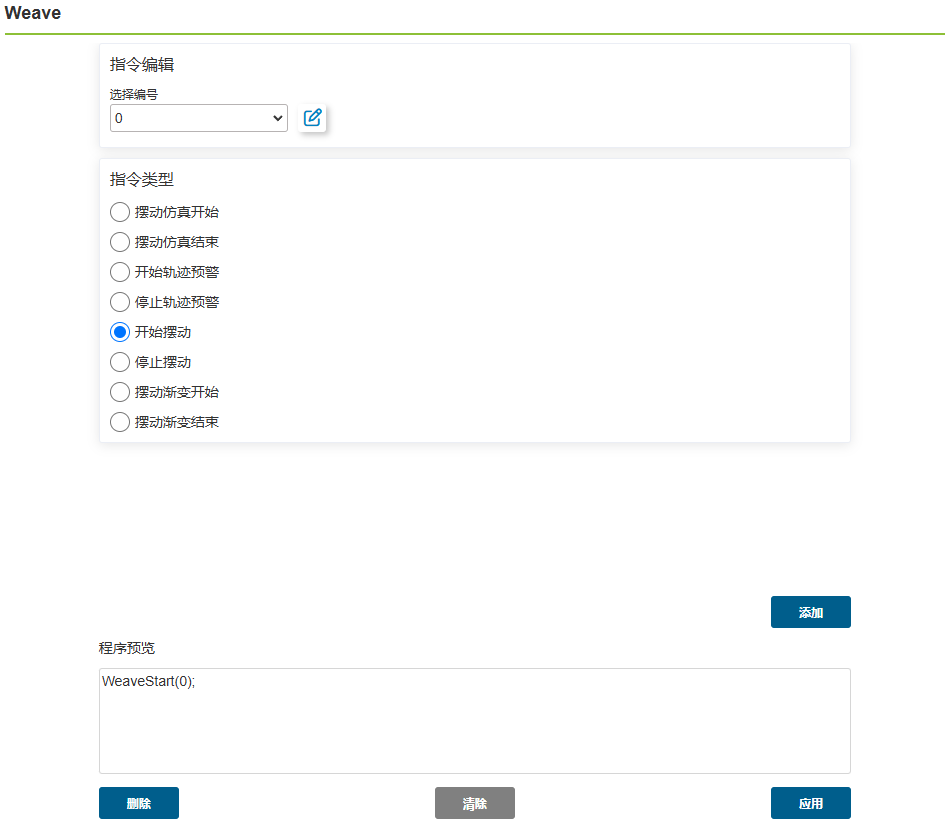

.. centered:: 圖表 9.24-2 新增起始擺動參數

**Step 3**：選擇擺動漸變的目標編號，點選“擺動漸變開始”，點擊“新增”按鈕。
   
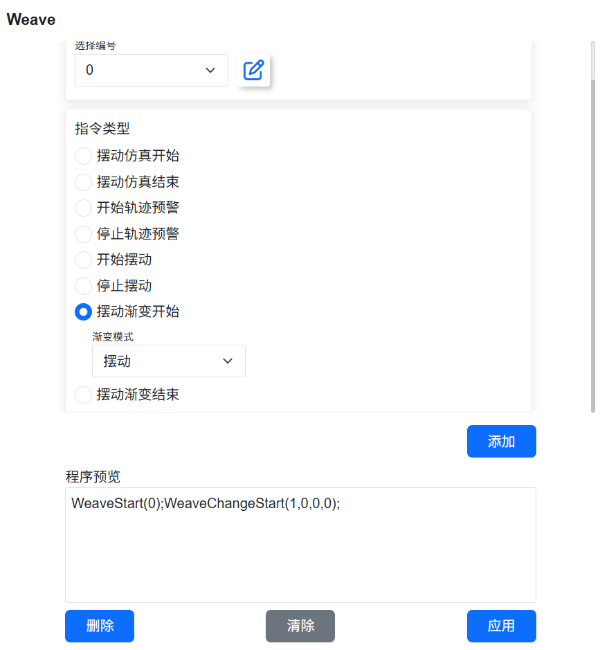

.. centered:: 圖表 9.24-3 新增漸變擺動參數

**Step 4**：新增對應直線運動後，點選「擺動漸層結束」點選新增，在點選「停止擺動」並新增，完成一段擺幅漸層擺動運動的設置，點選「套用」新增至LUA程式。
   
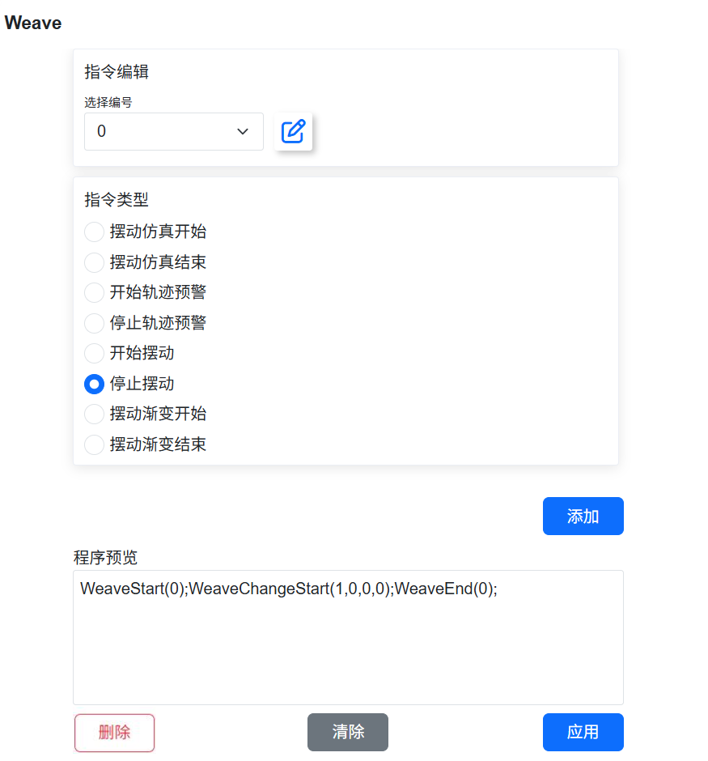

.. centered:: 圖表 9.24-4 實現一段完整的擺幅漸層運動LUA指令

偏壓電弧追蹤功能
~~~~~~~~~~~~~~~~~~~~~~~~~~

在電弧追蹤焊接過程，機器人預設根據電流資訊調整焊槍擺動中心追蹤工件坡口中心保持一致，而部分製程要求下希望焊槍擺動中心相對工件坡口中心存在一定偏壓。
   
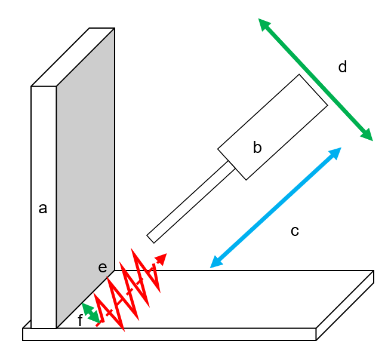

.. centered:: 圖表 9.25-1 偏壓電弧跟踪典型場景

偏壓電弧追蹤功能的典型場景包含：a.焊接工件（焊接坡口為直角或銳角），b.焊槍，e.坡口中心線。電弧跟踪功能實現對焊接坡口：c.上下（深度）方向跟踪和d.左右（中心）方向跟踪，f.左右方向跟踪偏置距離。

為實現偏壓電弧跟踪，可選兩種設定左右偏移量的方式，分別為「採樣」和「百分比」調整方式。

採樣偏壓電弧跟踪
+++++++++++++++++++++++++++++

採樣方法是在擺動焊接起弧後，採集某一周期內擺動時左右電流值作為基準，在後續焊接過程中採樣電流與基準電流進行比較得出跟踪方向。

採樣方法要求示教擺焊起始位置至需求的偏壓量，偏壓量不得大於擺幅，焊接處需覆蓋拼接坡口。

採樣偏移指令設定流程如下：
   
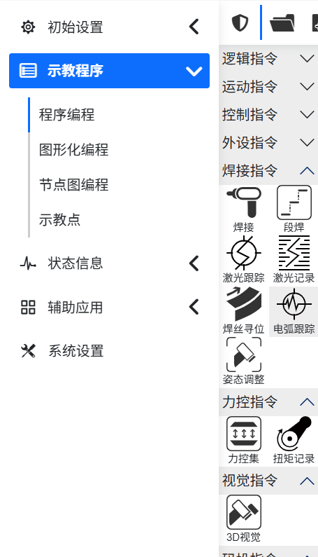

.. centered:: 圖表 9.25-2 點擊電弧追蹤指令按鈕

**Step 1**：點擊“示教程式”，“程式編程”，選擇並點擊“焊接指令”下屬的“電弧追蹤”按鈕進入電弧追蹤指令配置頁面。
   
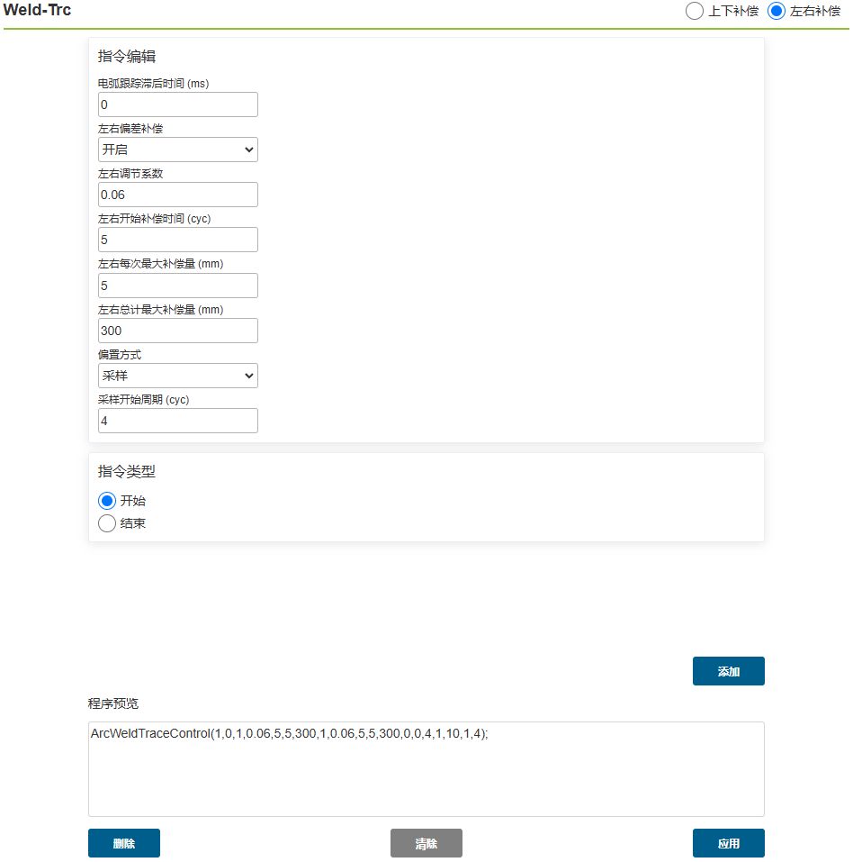

.. centered:: 圖表 9.25-3 採樣偏壓電弧追蹤配置頁面

**Step 2**：偏壓電弧追蹤作用於左右補償，點擊“左右補償”子頁面，在偏移方式中下拉選擇“採樣”，設定採樣開始週期（採樣開始週期需小於左右補償開始時間），指令類型選擇“開始”，點擊新增按鈕產生LUA指令。
   

.. centered:: 圖表 9.25-4 新增採樣偏壓電弧追蹤結束指令

**Step 3**：在新增完擺動運動指令後，點選選擇電弧追蹤指令類型“結束”，點選新增產生對應LUA指令。

百分比偏置電弧跟踪
+++++++++++++++++++++++

百分比偏壓是在電弧追蹤過程中將輸入的取樣電流進行百分比增益，使左右擺動週期的電流產生偏差，機器人自動對偏差後的訊號進行補償。

.. note:: 要注意擺幅越小、坡口夾角越大，左右電流的偏差越小，調整百分比越小。建議以每1%作為調整間隔進行調試。

百分比偏移指令設定流程如下：
   

.. centered:: 圖表 9.25-5 點擊電弧追蹤指令按鈕

**Step 1**：點選“示教程式”，“程式編程”，選擇並點擊“焊接指令”下屬的“電弧追蹤”按鈕進入電弧追蹤指令配置頁面。
   
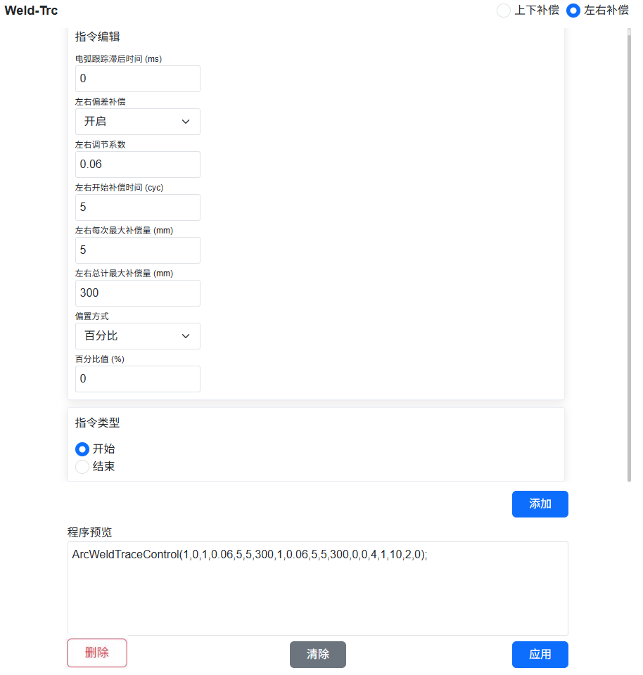

.. centered:: 圖表 9.25-6 採樣偏壓電弧追蹤配置頁面

**Step 2**：偏壓電弧追蹤作用於左右補償，點擊“左右補償”子頁面，在偏壓方式中下拉選擇“百分比”，設定百分比值（正值對前半週期電流增益、向後半週期所在方向進行補償，負值則相反），指令類型選擇“開始”，點擊添加按鈕生成LUA指令。
   
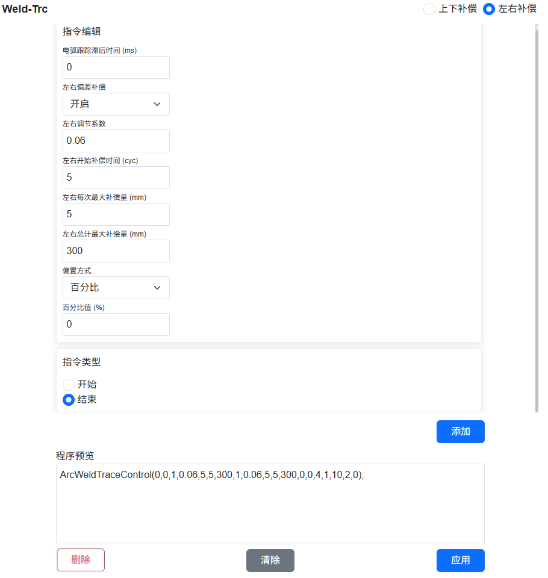

.. centered:: 圖表 9.25-7 新增百分比偏壓電弧追蹤結束指令

**Step 3**：在新增完擺動運動指令後，點選選擇電弧追蹤指令類型“結束”，點選新增產生對應LUA指令。

一段偏置追蹤的典型LUA程式結構如下所示：
   
.. image:: coding/304.png
   :width: 6in
   :align: center

.. centered:: 圖表 9.25-8 一段典型的偏壓電弧追蹤LUA程序

自訂碰撞偵測閾值功能
~~~~~~~~~~~~~~~~~~~~~~~~~~~~~~~

概述
++++++++

自訂碰撞偵測閾值功能是對目前手動設定碰撞等級功能的完善。若目前碰撞等級的設定不符合使用場景，使用者可以根據實際情況，設定自訂碰撞偵測閾值。碰撞偵測閾值分為關節偵測閾值和TCP偵測閾值。

功能設定說明
++++++++++++++++++++++++++++

**Step1**：點選“示教程式”，選擇“程式編程”，開啟對應介面。

**Step2**：點選上方“新建”按鈕，輸入“example”，選擇“empty.lua”，建立新的lua腳本，如圖1所示。
   

.. centered:: 圖表 9.26-1 新建lua腳本

關節偵測閾值功能設定說明
***********************************

參數設定說明
""""""""""""""""""""

**Step1**：在控制指令介面，選擇「碰撞偵測」功能，如圖2所示。點選“碰撞偵測開啟”，在偵測狀態列下，選擇“僅關節”。根據實際需要，對J1-J6的輸入值進行修改，數值範圍為，單位為NM。在這種模式下，修改X-RZ方向的TCP閾值不生效。根據實際需要，是否阻塞選擇“非阻塞”或“阻塞”。點選新增按鈕，開啟指令新增完成。

**Step2**：點選“碰撞偵測關閉”，點選新增按鈕，關閉指令新增完成。程式預覽介面如圖3所示，點選「應用」按鈕，完成功能新增。

.. note:: 自訂碰撞偵測閾值功能為一組指令，開啟後需及時關閉。

**Step3**：在碰撞偵測功能內，加入對應的運動指令，如圖4所示。
   
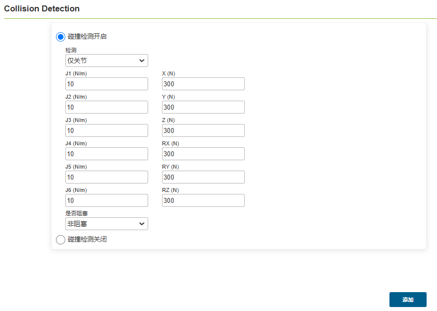

.. centered:: 圖表 9.26-2 關節偵測閾值設定介面
   
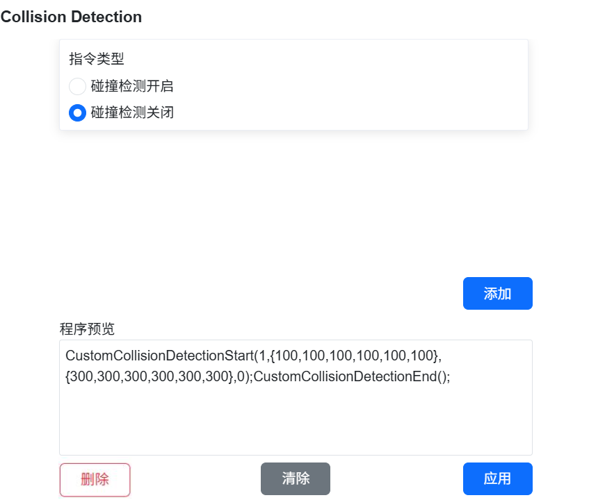

.. centered:: 圖表 9.26-3 程式預覽介面
   
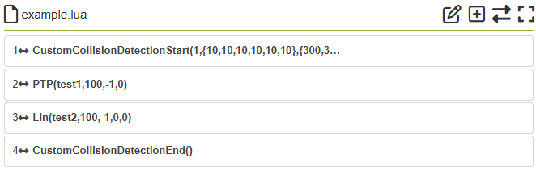

.. centered:: 圖表 9.26-4 lua腳本程式範例介面

TCP偵測閾值功能設定說明
**********************************

參數設定說明
""""""""""""""""""""

**Step1**：在控制指令介面，選擇「碰撞偵測」功能，如圖5所示。點選“碰撞偵測開啟”，在偵測狀態列下，選擇“僅TCP”。根據實際需要，X-RZ方向的輸入值進行修改，數值範圍為，單位是N。在這種模式下，修改J1-J6的關節閾值不生效。根據實際需要，是否阻塞選擇“非阻塞”或“阻塞”。點選新增按鈕，開啟指令新增完成。

**Step2**：點選“碰撞偵測關閉”，點選新增按鈕，關閉指令新增完成。程式預覽介面如圖6所示，點選「應用」按鈕，完成功能新增。

.. note:: 自訂碰撞偵測閾值功能為一組指令，開啟後需及時關閉。
   
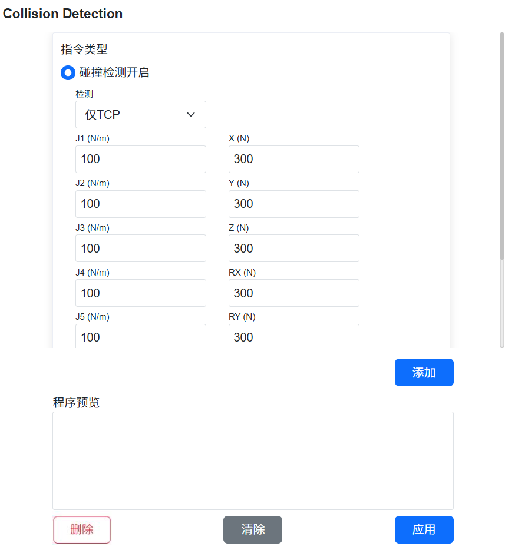

.. centered:: 圖表 9.26-5 TCP偵測閾值設定介面
   
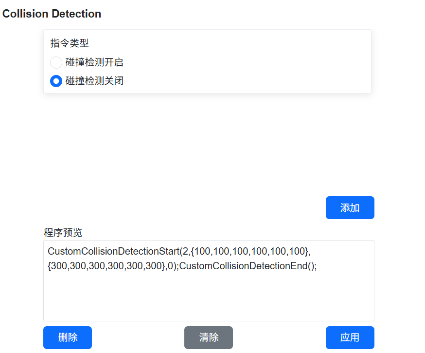

.. centered:: 圖表 9.26-6 程式預覽介面

**Step3**：在碰撞偵測功能內，加入對應的運動指令，如圖7所示。
   
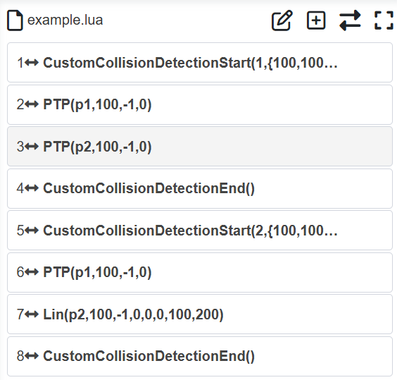

.. centered:: 圖表 9.26-7 lua腳本程式範例介面

關節與TCP偵測閾值功能設定說明
*********************************

參數設定說明
""""""""""""""""""""

**Step1**：在控制指令介面，選擇「碰撞偵測」功能，如圖8所示。點選“碰撞偵測開啟”，在偵測狀態列下，選擇“關節與TCP”。根據實際需要，對J1-J6和X-RZ方向的輸入值進行修改。其中J1-J6的數值範圍為，單位是NM；X-RZ方向的輸入值為，單位是N。根據實際需要，是否阻塞選擇“非阻塞”或“阻塞”。點選新增按鈕，開啟指令新增完成。
   
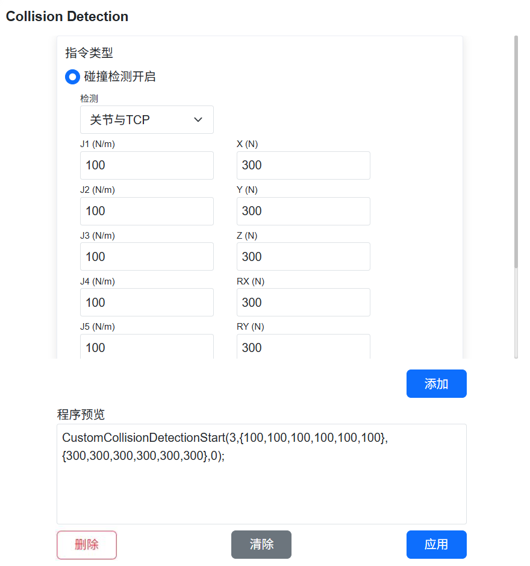

.. centered:: 圖表 9.26-8 關節與TCP檢測閾值設定介面

**Step2**：點選“碰撞偵測關閉”，點選新增按鈕，關閉指令新增完成。程式預覽介面如圖9所示，點選「應用」按鈕，完成功能新增。

.. note:: 自訂碰撞偵測閾值功能為一組指令，開啟後需及時關閉。
   
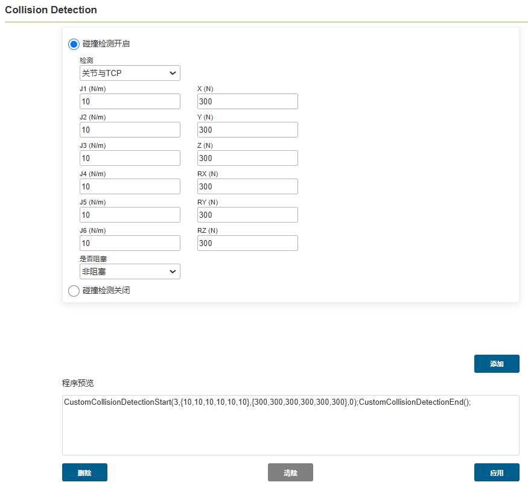

.. centered:: 圖表 9.26-9 程式預覽介面

**Step3**：在碰撞偵測功能內，加入對應的運動指令，如圖10所示。
   
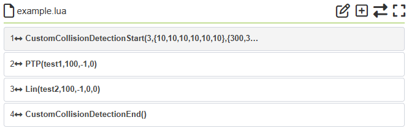

.. centered:: 圖表 9.26-10 lua腳本程式範例介面

檢測閾值的建議設定
***********************

關節檢測閾值
""""""""""""""""""""

建議的關節偵測閾值相當於設定碰撞等級為10級。數值越大，碰撞檢測越不靈敏，數值範圍為，單位為NM。表中數據僅供參考，實際數值需根據機器人運轉速度和負載情況進行調整。

.. centered:: 表格 9.26-1 關節建議閾值

.. list-table::
   :widths: 30 20 20 20 20 20 20
   :header-rows: 0
   :class: sheet-center
   :align: center

   * - **機器人類型**
     - **J1**
     - **J2**
     - **J3**
     - **J4**
     - **J5**
     - **J6**

   * - **FR3**
     - 0.4					
     - 0.7
     - 0.6 
     - 0.3 
     - 0.3 
     - 0.3 

   * - **FR3-WMS**
     - 0.4					
     - 0.7
     - 0.6 
     - 0.3 
     - 0.3 
     - 0.3 

   * - **FR3-WML**
     - 0.4					
     - 0.7
     - 0.6 
     - 0.3 
     - 0.3 
     - 0.3 

   * - **FR3-C**
     - 0.4					
     - 0.7
     - 0.6 
     - 0.3 
     - 0.3 
     - 0.3 

   * - **FR5**
     - 0.6					
     - 1
     - 0.8 
     - 0.3 
     - 0.3 
     - 0.3 

   * - **FR10**
     - 2.5					
     - 3.6
     - 0.8 
     - 0.6 
     - 0.6 
     - 0.6  

   * - **FR16**
     - 2.5					
     - 3.6
     - 0.8 
     - 0.6 
     - 0.6 
     - 0.6 

   * - **FR20**
     - 5					
     - 8
     - 4.5
     - 0.9 
     - 0.9
     - 0.9 

   * - **FR30**
     - 5					
     - 8
     - 4.5
     - 0.9 
     - 0.9
     - 0.9 

TCP偵測閾值
""""""""""""""""""""

TCP偵測閾值數值越大，碰撞偵測越不靈敏，數值範圍為，單位為N。表中數據僅供參考，實際數值需根據機器人運轉速度和負載情況進行調整。

.. centered:: 表格 9.26-2 TCP偵測閾值

.. list-table::
   :widths: 30 20 20 20 20 20 20
   :header-rows: 0
   :class: sheet-center
   :align: center

   * - **機器人類型**
     - **X**
     - **Y**
     - **Z**
     - **RX**
     - **RY**
     - **RZ**

   * - **FR3**
     - 300					
     - 300
     - 300
     - 20 
     - 20
     - 20

   * - **FR3-WMS**
     - 300					
     - 300
     - 300
     - 20 
     - 20
     - 20

   * - **FR3-WML**
     - 300					
     - 300
     - 300
     - 20 
     - 20
     - 20

   * - **FR3-C**
     - 300					
     - 300
     - 300
     - 20 
     - 20
     - 20

   * - **FR5**
     - 300					
     - 300
     - 300
     - 20 
     - 20
     - 20

   * - **FR10**
     - 500					
     - 500
     - 500
     - 35 
     - 35
     - 35 

   * - **FR16**
     - 500					
     - 500
     - 500
     - 35 
     - 35
     - 35 

   * - **FR20**
     - 800					
     - 800
     - 800
     - 60 
     - 60
     - 60 

   * - **FR30**
     - 800					
     - 800
     - 800
     - 60 
     - 60
     - 60 

T形速度特性優化+blending平滑功能
~~~~~~~~~~~~~~~~~~~~~~~~~~~~~~~~~~~~~~~~~~~~~~~~~~~~~~~

概述
++++++++++++++

在兩段軌跡之間進行blending，可避免因完全停止而帶來的頻繁啟停問題，從而提升機器人的運動效率。本功能主要針對PTP、LIN、ARC和CIRCLE指令間進行blending，均可通過兩種方式實現：使用Lua指令方式、使用運動配置開關方式。

操作流程
++++++++++++++++++++++++++++

PTP-PTP的blending
***************************************

使用Lua指令方式
""""""""""""""""""""""""""""""""""""""""""

**Step1**：選擇要執行PTP-PTP功能的示教點，本手冊以“A0”~“A5”作為示教點的名稱。

**Step2**：點擊“示教程序”—>“程序編程”按鈕，選擇“運動指令”中的“點到點”指令，在“指令編輯”中選擇示教點並設置調試速度，運動保護選擇“加速度平滑模式”，在需要平滑的點處設置“平滑過渡”參數。

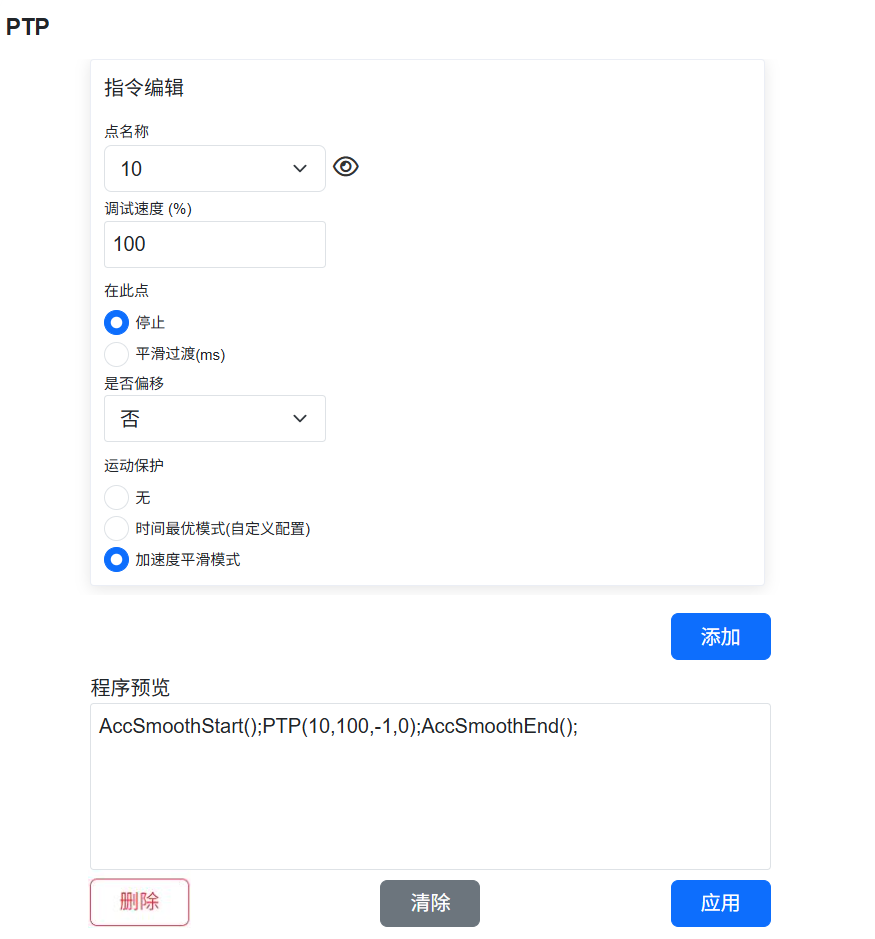

.. centered:: 圖表 9.27-1 加速度平滑PTP指令的blending指令設置

**Step3**：添加多條PTP指令，生成Lua程序並運行，即可實現對PTP-PTP的blending功能，該方式僅對AccSmoothStart()和AccSmoothEnd()之間的指令使用優化後的T形速度運動，對其餘指令使用原T形速度運動。

.. centered:: 圖表 9.27-2 Lua指令方式進行PTP-PTP間blending典型程序

使用運動配置開關方式
"""""""""""""""""""""""""""""""""""""""""""""""""""""""

**Step1**：點擊“初始設置”—>“安全”—>“運動配置”按鈕，打開“加速度平滑模式”的開關。

.. image:: coding/317.png
   :width: 6in
   :align: center

.. centered:: 圖表 9.27-3 加速度平滑模式配置開關設置

**Step2**：選擇要執行PTP-PTP功能的示教點，本手冊以“A0”~“A5”作為示教點的名稱。

**Step3**：點擊“示教程序”—>“程序編程”按鈕，選擇“運動指令”中的“點到點”指令，在“指令編輯”中選擇示教點並設置調試速度，運動保護選擇“無”，在需要平滑的點處設置“平滑過渡”參數。

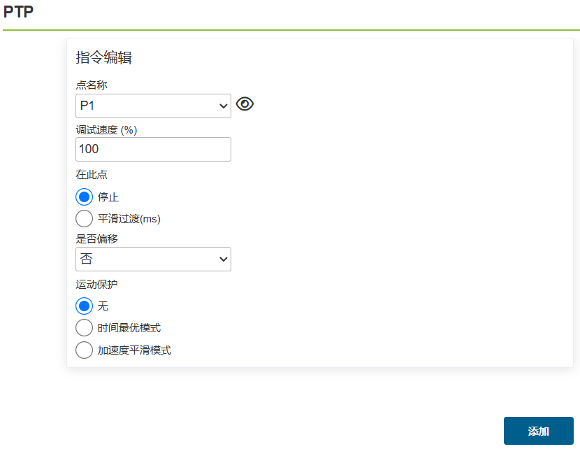

.. centered:: 圖表 9.27-4 常規PTP指令的blending指令設置

**Step4**：添加多條PTP指令，生成Lua程序並運行，即可實現對PTP-PTP的blending功能，典型程序和常規PTP-PTP程序相同，該方式會對所有指令使用優化後的T形速度運動。

.. centered:: 圖表 9.27-5 使用配置開關進行PTP-PTP間blending的典型程序

PTP-LIN的blending
***************************************

使用Lua指令方式
""""""""""""""""""""""""""""""""""""""""""

**Step1**：選擇要執行PTP-LIN功能的示教點，本手冊以“A0”~“A5”作為示教點的名稱。

**Step2**：點擊“示教程序”—>“程序編程”按鈕，選擇“運動指令”中的“點到點”指令，在“指令編輯”中選擇示教點並設置調試速度，運動保護選擇“加速度平滑模式”，在需要平滑的點處設置“平滑過渡”參數。

.. centered:: 圖表 9.27-6 加速度平滑PTP指令的blending指令設置

**Step3**：添加多條PTP和LIN指令，生成Lua程序並運行，即可實現對PTP-LIN的blending功能，該方式僅對AccSmoothStart()和AccSmoothEnd()之間的指令使用優化後的T形速度運動，對其餘指令使用原T形速度運動。

.. image:: coding/415.png
   :width: 4in
   :align: center

.. centered:: 圖表 9.27-7 Lua指令方式進行PTP-LIN間blending典型程序

使用運動配置開關方式
"""""""""""""""""""""""""""""""""""""""""""""""""""""""

**Step1**：點擊“初始設置”—>“安全”—>“運動配置”按鈕，打開“加速度平滑模式”的開關。

.. image:: coding/317.png
   :width: 6in
   :align: center

.. centered:: 圖表 9.27-8 加速度平滑模式配置開關設置

**Step2**：選擇要執行PTP-LIN功能的示教點，本手冊以“A0”~“A5”作為示教點的名稱。

**Step3**：點擊“示教程序”—>“程序編程”按鈕，選擇“運動指令”中的“點到點”指令，在“指令編輯”中選擇示教點並設置調試速度，運動保護選擇“無”，在需要平滑的點處設置“平滑過渡”參數。

.. centered:: 圖表 9.27-9 常規PTP指令的blending指令設置

**Step4**：添加多條PTP和LIN指令，生成Lua程序並運行，即可實現對PTP-LIN的blending功能，典型程序和常規PTP-LIN程序相同，該方式會對所有指令使用優化後的T形速度運動。

.. image:: coding/397.png
   :width: 4in
   :align: center

.. centered:: 圖表 9.27-10 使用配置開關進行PTP-LIN間blending的典型程序

PTP-ARC的blending
***************************************

使用Lua指令方式
""""""""""""""""""""""""""""""""""""""""""

**Step1**：選擇要執行PTP-ARC功能的示教點，本手冊以“A0”~“A8”作為示教點的名稱。

**Step2**：點擊“示教程序”—>“程序編程”按鈕，選擇“運動指令”中的“點到點”指令，在“指令編輯”中選擇示教點並設置調試速度，運動保護選擇“加速度平滑模式”，在需要平滑的點處設置“平滑過渡”參數。

.. centered:: 圖表 9.27-11 加速度平滑PTP指令的blending指令設置

**Step3**：添加多條PTP和ARC指令，生成Lua程序並運行，即可實現對PTP-ARC的blending功能，該方式僅對AccSmoothStart()和AccSmoothEnd()之間的指令使用優化後的T形速度運動，對其餘指令使用原T形速度運動。

.. image:: coding/398.png
   :width: 4in
   :align: center

.. centered:: 圖表 9.27-12 Lua指令方式進行PTP-ARC間blending典型程序

使用運動配置開關方式
"""""""""""""""""""""""""""""""""""""""""""""""""""""""

**Step1**：點擊“初始設置”—>“安全”—>“運動配置”按鈕，打開“加速度平滑模式”的開關。

.. image:: coding/317.png
   :width: 6in
   :align: center

.. centered:: 圖表 9.27-13 加速度平滑模式配置開關設置

**Step2**：選擇要執行PTP-ARC功能的示教點，本手冊以“A0”~“A8”作為示教點的名稱。

**Step3**：點擊“示教程序”—>“程序編程”按鈕，選擇“運動指令”中的“點到點”指令，在“指令編輯”中選擇示教點並設置調試速度，運動保護選擇“無”，在需要平滑的點處設置“平滑過渡”參數。

.. centered:: 圖表 9.27-14 常規PTP指令的blending指令設置

**Step4**：添加多條PTP和ARC指令，生成Lua程序並運行，即可實現對PTP-ARC的blending功能，典型程序和常規PTP-ARC程序相同，該方式會對所有指令使用優化後的T形速度運動。

.. image:: coding/399.png
   :width: 4in
   :align: center

.. centered:: 圖表 9.27-15 使用配置開關進行PTP-ARC間blending的典型程序

PTP-CIRCLE的blending
***************************************

使用Lua指令方式
""""""""""""""""""""""""""""""""""""""""""

**Step1**：選擇要執行PTP-CIRCLE功能的示教點，本手冊以“A0”~“A8”作為示教點的名稱。

**Step2**：點擊“示教程序”—>“程序編程”按鈕，選擇“運動指令”中的“點到點”指令，在“指令編輯”中選擇示教點並設置調試速度，運動保護選擇“加速度平滑模式”，在需要平滑的點處設置“平滑過渡”參數。

.. centered:: 圖表 9.27-16 加速度平滑PTP指令的blending指令設置

**Step3**：添加多條PTP和CIRCLE指令，生成Lua程序並運行，即可實現對PTP-CIRCLE的blending功能，該方式僅對AccSmoothStart()和AccSmoothEnd()之間的指令使用優化後的T形速度運動，對其餘指令使用原T形速度運動。

.. image:: coding/400.png
   :width: 4in
   :align: center

.. centered:: 圖表 9.27-17 Lua指令方式進行PTP-CIRCLE間blending典型程序

使用運動配置開關方式
"""""""""""""""""""""""""""""""""""""""""""""""""""""""

**Step1**：點擊“初始設置”—>“安全”—>“運動配置”按鈕，打開“加速度平滑模式”的開關。

.. image:: coding/317.png
   :width: 6in
   :align: center

.. centered:: 圖表 9.27-18 加速度平滑模式配置開關設置

**Step2**：選擇要執行PTP-CIRCLE功能的示教點，本手冊以“A0”~“A8”作為示教點的名稱。

**Step3**：點擊“示教程序”—>“程序編程”按鈕，選擇“運動指令”中的“點到點”指令，在“指令編輯”中選擇示教點並設置調試速度，運動保護選擇“無”，在需要平滑的點處設置“平滑過渡”參數。

.. centered:: 圖表 9.27-19 常規PTP指令的blending指令設置

**Step4**：添加多條PTP和CIRCLE指令，生成Lua程序並運行，即可實現對PTP-CIRCLE的blending功能，典型程序和常規PTP-CIRCLE程序相同，該方式會對所有指令使用優化後的T形速度運動。

.. image:: coding/401.png
   :width: 4in
   :align: center

.. centered:: 圖表 9.27-20 使用配置開關進行PTP-CIRCLE間blending的典型程序

LIN-PTP的blending
***************************************

使用Lua指令方式
""""""""""""""""""""""""""""""""""""""""""

**Step1**：選擇要執行LIN-PTP功能的示教點，本手冊以“A0”~“A5”作為示教點的名稱。

**Step2**：點擊“示教程序”—>“程序編程”按鈕，選擇“運動指令”中的“直線”指令，在“指令編輯”中選擇示教點並設置調試速度，運動保護選擇“加速度平滑模式”，在需要平滑的點處設置“過渡半徑”和“過渡方式”參數，過渡方式可選擇“角點過渡”和“內切過渡”。

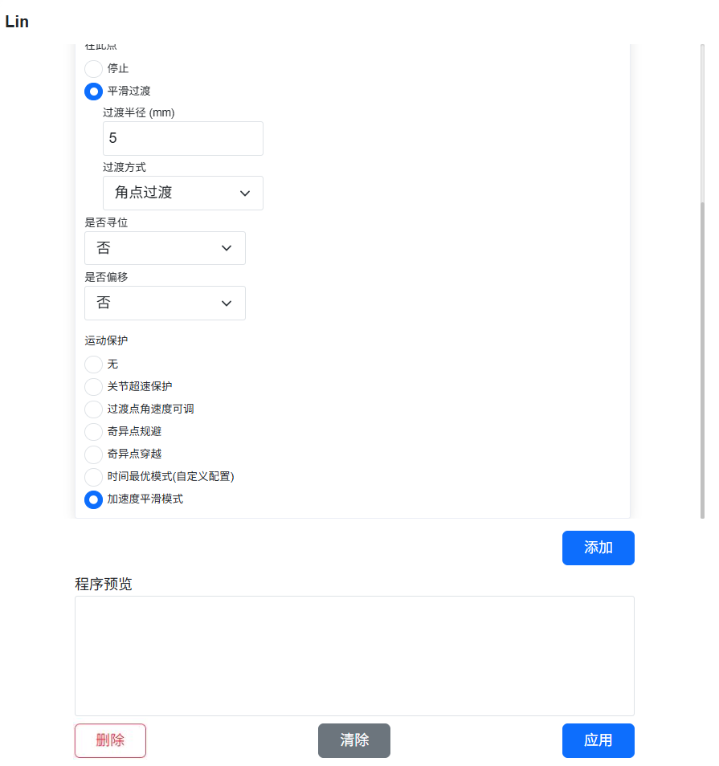

.. centered:: 圖表 9.27-21 加速度平滑PTP指令的blending指令設置

**Step3**：添加多條LIN和PTP指令，生成Lua程序並運行，即可實現對LIN-PTP的blending功能，該方式僅對AccSmoothStart()和AccSmoothEnd()之間的指令使用優化後的T形速度運動，對其餘指令使用原T形速度運動。

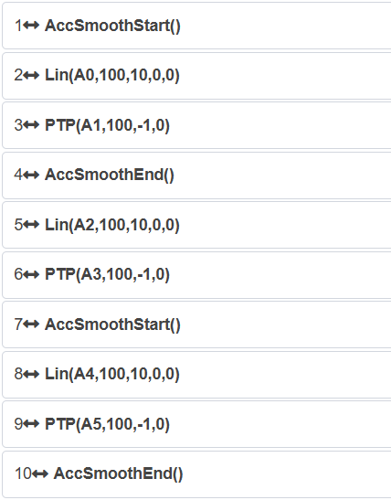

.. centered:: 圖表 9.27-22 Lua指令方式進行LIN-PTP間blending典型程序

使用運動配置開關方式
"""""""""""""""""""""""""""""""""""""""""""""""""""""""

**Step1**：點擊“初始設置”—>“安全”—>“運動配置”按鈕，打開“加速度平滑模式”的開關。

.. image:: coding/317.png
   :width: 6in
   :align: center

.. centered:: 圖表 9.27-23 加速度平滑模式配置開關設置

**Step2**：選擇要執行LIN-PTP功能的示教點，本手冊以“A0”~“A5”作為示教點的名稱。

**Step3**：點擊“示教程序”—>“程序編程”按鈕，選擇“運動指令”中的“直線”指令，在“指令編輯”中選擇示教點並設置調試速度，運動保護選擇“無”，在需要平滑的點處設置“過渡半徑”和“過渡方式”參數，過渡方式可選擇“角點過渡”和“內切過渡”。

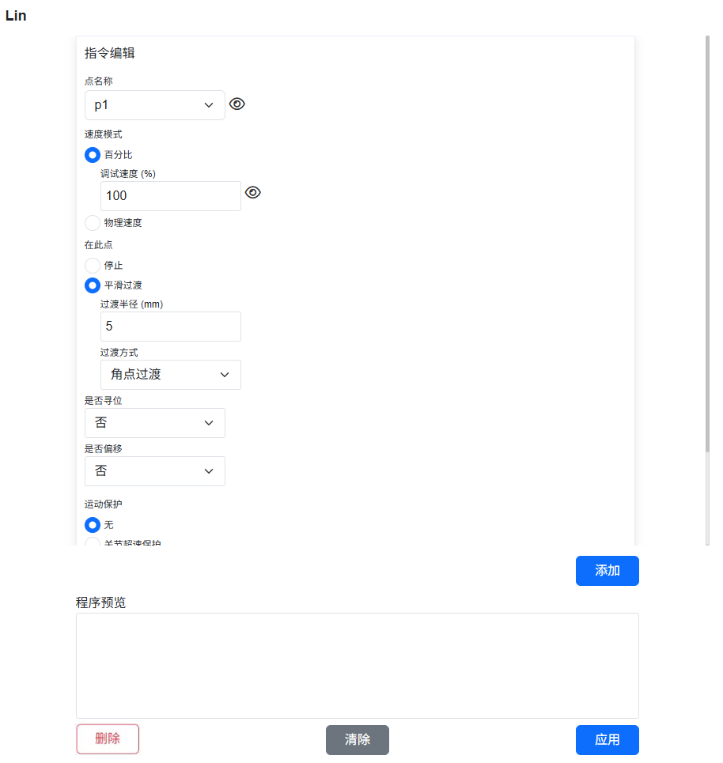

.. centered:: 圖表 9.27-24 常規LIN指令的blending指令設置

**Step4**：生成Lua程序並運行，即可實現對LIN-PTP的blending功能，典型程序和常規LIN-PTP程序相同，該方式會對所有指令使用優化後的T形速度運動。

.. image:: coding/405.png
   :width: 4in
   :align: center

.. centered:: 圖表 9.27-25 使用配置開關進行LIN-PTP間blending的典型程序

LIN-LIN的blending
***************************************

使用Lua指令方式
""""""""""""""""""""""""""""""""""""""""""

**Step1**：選擇要執行LIN-LIN功能的示教點，本手冊以“A0”~“A5”作為示教點的名稱。

**Step2**：點擊“示教程序”—>“程序編程”按鈕，選擇“運動指令”中的“直線”指令，在“指令編輯”中選擇示教點並設置調試速度，運動保護選擇“加速度平滑模式”，在需要平滑的點處設置“過渡半徑”和“過渡方式”參數，過渡方式可選擇“角點過渡”和“內切過渡”。

.. centered:: 圖表 9.27-26 加速度平滑LIN指令的blending指令設置

**Step3**：添加多條LIN和LIN指令，生成Lua程序並運行，即可實現對LIN-LIN的blending功能，該方式僅對AccSmoothStart()和AccSmoothEnd()之間的指令使用優化後的T形速度運動，對其餘指令使用原T形速度運動。

.. image:: coding/416.png
   :width: 4in
   :align: center

.. centered:: 圖表 9.27-27 Lua指令方式進行LIN-LIN間blending典型程序

使用運動配置開關方式
"""""""""""""""""""""""""""""""""""""""""""""""""""""""

**Step1**：點擊“初始設置”—>“安全”—>“運動配置”按鈕，打開“加速度平滑模式”的開關。

.. image:: coding/317.png
   :width: 6in
   :align: center

.. centered:: 圖表 9.27-28 加速度平滑模式配置開關設置

**Step2**：選擇要執行LIN-LIN功能的示教點，本手冊以“A0”~“A5”作為示教點的名稱。

**Step3**：點擊“示教程序”—>“程序編程”按鈕，選擇“運動指令”中的“直線”指令，在“指令編輯”中選擇示教點並設置調試速度，運動保護選擇“無”，在需要平滑的點處設置“過渡半徑”和“過渡方式”參數，過渡方式可選擇“角點過渡”和“內切過渡”。

.. centered:: 圖表 9.27-29 常規LIN指令的blending指令設置

**Step4**：生成Lua程序並運行，即可實現對LIN-LIN的blending功能，典型程序和常規LIN-LIN程序相同，該方式會對所有指令使用優化後的T形速度運動。

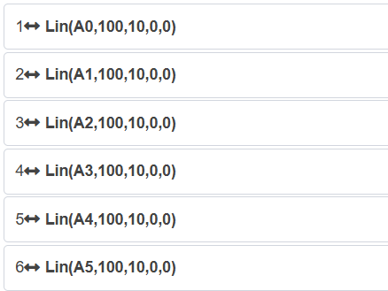

.. centered:: 圖表 9.27-30 使用配置開關進行LIN-LIN間blending的典型程序

LIN-ARC的blending
***************************************

使用Lua指令方式
""""""""""""""""""""""""""""""""""""""""""

**Step1**：選擇要執行LIN-ARC功能的示教點，本手冊以“A0”~“A8”作為示教點的名稱。

**Step2**：點擊“示教程序”—>“程序編程”按鈕，選擇“運動指令”中的“直線”指令，在“指令編輯”中選擇示教點並設置調試速度，運動保護選擇“加速度平滑模式”，在需要平滑的點處設置“過渡半徑”和“過渡方式”參數，過渡方式可選擇“角點過渡”和“內切過渡”。

.. centered:: 圖表 9.27-31 加速度平滑LIN指令的blending指令設置

**Step3**：添加多條LIN和ARC指令，生成Lua程序並運行，即可實現對LIN-ARC的blending功能，該方式僅對AccSmoothStart()和AccSmoothEnd()之間的指令使用優化後的T形速度運動，對其餘指令使用原T形速度運動。

.. image:: coding/406.png
   :width: 4in
   :align: center

.. centered:: 圖表 9.27-32 Lua指令方式進行LIN-ARC間blending典型程序

使用運動配置開關方式
"""""""""""""""""""""""""""""""""""""""""""""""""""""""

**Step1**：點擊“初始設置”—>“安全”—>“運動配置”按鈕，打開“加速度平滑模式”的開關。

.. image:: coding/317.png
   :width: 6in
   :align: center

.. centered:: 圖表 9.27-33 加速度平滑模式配置開關設置

**Step2**：選擇要執行LIN-ARC功能的示教點，本手冊以“A0”~“A8”作為示教點的名稱。

**Step3**：點擊“示教程序”—>“程序編程”按鈕，選擇“運動指令”中的“直線”指令，在“指令編輯”中選擇示教點並設置調試速度，運動保護選擇“無”，在需要平滑的點處設置“過渡半徑”和“過渡方式”參數，過渡方式可選擇“角點過渡”和“內切過渡”。

.. centered:: 圖表 9.27-34 常規LIN指令的blending指令設置

**Step4**：生成Lua程序並運行，即可實現對LIN-LIN的blending功能，典型程序和常規LIN-LIN程序相同，該方式會對所有指令使用優化後的T形速度運動。

.. image:: coding/407.png
   :width: 4in
   :align: center

.. centered:: 圖表 9.27-35 使用配置開關進行LIN-ARC間blending的典型程序

LIN-CIRCLE的blending
***************************************

使用Lua指令方式
""""""""""""""""""""""""""""""""""""""""""

**Step1**：選擇要執行LIN-CIRCLE功能的示教點，本手冊以“A0”~“A8”作為示教點的名稱。

**Step2**：點擊“示教程序”—>“程序編程”按鈕，選擇“運動指令”中的“直線”指令，在“指令編輯”中選擇示教點並設置調試速度，運動保護選擇“加速度平滑模式”，在需要平滑的點處設置“過渡半徑”和“過渡方式”參數，過渡方式可選擇“角點過渡”和“內切過渡”。

.. centered:: 圖表 9.27-36 加速度平滑LIN指令的blending指令設置

**Step3**：添加多條LIN和CIRCLE指令，生成Lua程序並運行，即可實現對LIN-CIRCLE的blending功能，該方式僅對AccSmoothStart()和AccSmoothEnd()之間的指令使用優化後的T形速度運動，對其餘指令使用原T形速度運動。

.. image:: coding/408.png
   :width: 4in
   :align: center

.. centered:: 圖表 9.27-37 Lua指令方式進行LIN-CIRCLE間blending典型程序

使用運動配置開關方式
"""""""""""""""""""""""""""""""""""""""""""""""""""""""

**Step1**：點擊“初始設置”—>“安全”—>“運動配置”按鈕，打開“加速度平滑模式”的開關。

.. image:: coding/317.png
   :width: 6in
   :align: center

.. centered:: 圖表 9.27-38 加速度平滑模式配置開關設置

**Step2**：選擇要執行LIN-CIRCLE功能的示教點，本手冊以“A0”~“A8”作為示教點的名稱。

**Step3**：點擊“示教程序”—>“程序編程”按鈕，選擇“運動指令”中的“直線”指令，在“指令編輯”中選擇示教點並設置調試速度，運動保護選擇“無”，在需要平滑的點處設置“過渡半徑”和“過渡方式”參數，過渡方式可選擇“角點過渡”和“內切過渡”。

.. centered:: 圖表 9.27-39 常規LIN指令的blending指令設置

**Step4**：添加多條LIN和CIRCLE指令，生成Lua程序並運行，即可實現對LIN-CIRCLE的blending功能，典型程序和常規LIN-ARC程序相同，該方式會對所有指令使用優化後的T形速度進行運動。

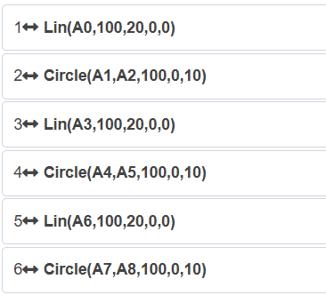

.. centered:: 圖表 9.27-40 使用配置開關進行LIN-CIRCLE間blending的典型程序

ARC-PTP的blending
***************************************

使用Lua指令方式
""""""""""""""""""""""""""""""""""""""""""

**Step1**：選擇要執行ARC-PTP功能的示教點，本手冊以“A0”~“A9”作為示教點的名稱。

**Step2**：點擊“示教程序”—>“程序編程”按鈕，選擇“運動指令”中的“圓弧”指令，在“指令編輯”中選擇示教點並設置調試速度，運動保護選擇“加速度平滑模式”，在需要平滑的點處設置“平滑過渡”參數。

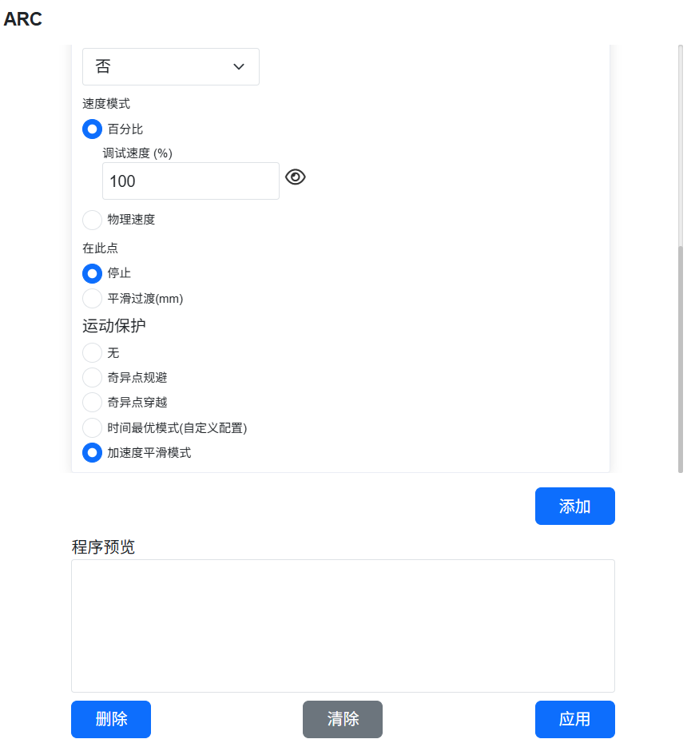

.. centered:: 圖表 9.27-41 加速度平滑ARC指令的blending指令設置

**Step3**：添加多條ARC和PTP指令，生成Lua程序並運行，即可實現對ARC-PTP的blending功能，該方式僅對AccSmoothStart()和AccSmoothEnd()之間的指令使用優化後的T形速度運動，對其餘指令使用原T形速度運動。

.. image:: coding/411.png
   :width: 4in
   :align: center

.. centered:: 圖表 9.27-42 Lua指令方式進行ARC-PTP間blending典型程序

使用運動配置開關方式
"""""""""""""""""""""""""""""""""""""""""""""""""""""""

**Step1**：點擊“初始設置”—>“安全”—>“運動配置”按鈕，打開“加速度平滑模式”的開關。

.. image:: coding/317.png
   :width: 6in
   :align: center

.. centered:: 圖表 9.27-43 加速度平滑模式配置開關設置

**Step2**：選擇要執行ARC-PTP功能的示教點，本手冊以“A0”~“A9”作為示教點的名稱。

**Step3**：點擊“示教程序”—>“程序編程”按鈕，選擇“運動指令”中的“圓弧”指令，在“指令編輯”中選擇示教點並設置調試速度，運動保護選擇“無”，在需要平滑的點處設置“平滑過渡”參數。

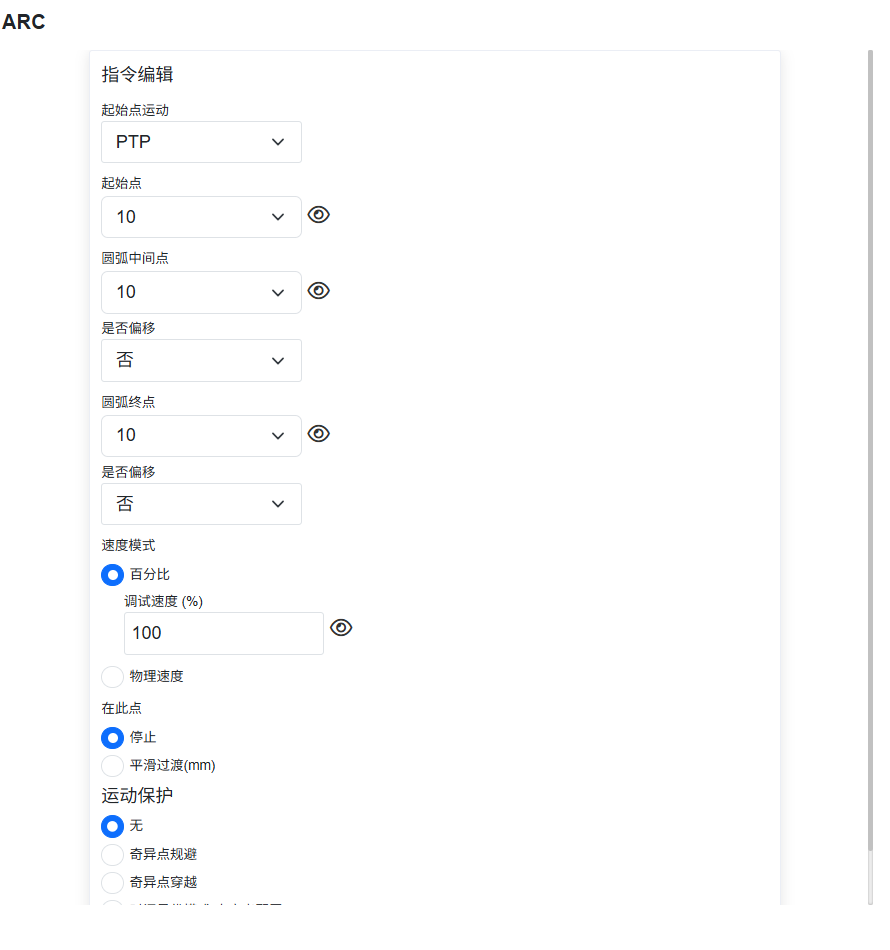

.. centered:: 圖表 9.27-44 常規ARC指令的blending指令設置

**Step4**：添加多條ARC和PTP指令，生成Lua程序並運行，即可實現對ARC-PTP的blending功能，典型程序和常規ARC-PTP程序相同，該方式會對所有指令使用優化後的T形速度運動。

.. image:: coding/412.png
   :width: 4in
   :align: center

.. centered:: 圖表 9.27-45 使用配置開關進行ARC-PTP間blending的典型程序

ARC-LIN的blending
***************************************

使用Lua指令方式
""""""""""""""""""""""""""""""""""""""""""

**Step1**：選擇要執行ARC-LIN功能的示教點，本手冊以“A0”~“A9”作為示教點的名稱。

**Step2**：點擊“示教程序”—>“程序編程”按鈕，選擇“運動指令”中的“圓弧”指令，在“指令編輯”中選擇示教點並設置調試速度，運動保護選擇“加速度平滑模式”，在需要平滑的點處設置“平滑過渡”參數。

.. centered:: 圖表 9.27-46 加速度平滑ARC指令的blending指令設置

**Step3**：添加多條ARC和LIN指令，生成Lua程序並運行，即可實現對ARC-LIN的blending功能，該方式僅對AccSmoothStart()和AccSmoothEnd()之間的指令使用優化後的T形速度運動，對其餘指令使用原T形速度運動。

.. image:: coding/413.png
   :width: 4in
   :align: center

.. centered:: 圖表 9.27-47 Lua指令方式進行ARC-LIN間blending典型程序

使用運動配置開關方式
"""""""""""""""""""""""""""""""""""""""""""""""""""""""

**Step1**：點擊“初始設置”—>“安全”—>“運動配置”按鈕，打開“加速度平滑模式”的開關。

.. image:: coding/317.png
   :width: 6in
   :align: center

.. centered:: 圖表 9.27-48 加速度平滑模式配置開關設置

**Step2**：選擇要執行ARC-LIN功能的示教點，本手冊以“A0”~“A9”作為示教點的名稱。

**Step3**：點擊“示教程序”—>“程序編程”按鈕，選擇“運動指令”中的“圓弧”指令，在“指令編輯”中選擇示教點並設置調試速度，運動保護選擇“無”，在需要平滑的點處設置“平滑過渡”參數。

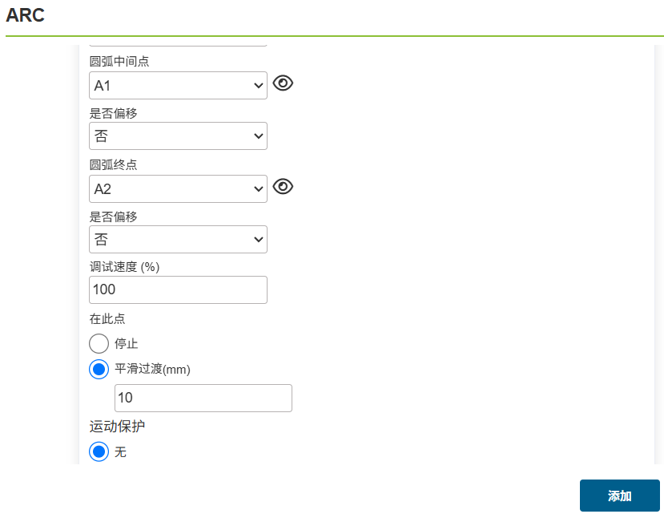

.. centered:: 圖表 9.27-49 常規ARC指令的blending指令設置

**Step4**：添加多條ARC和LIN指令，生成Lua程序並運行，即可實現對ARC-LIN的blending功能，典型程序和常規ARC-LIN程序相同，該方式會對所有指令使用優化後的T形速度運動。

.. image:: coding/414.png
   :width: 4in
   :align: center

.. centered:: 圖表 9.27-50 使用配置開關進行ARC-LIN間blending的典型程序

ARC-ARC的blending
***************************************

使用Lua指令方式
""""""""""""""""""""""""""""""""""""""""""

**Step1**：選擇要執行ARC-ARC功能的示教點，本手冊以“A0”~“A12”作為示教點的名稱。

**Step2**：點擊“示教程序”—>“程序編程”按鈕，選擇“運動指令”中的“圓弧”指令，在“指令編輯”中選擇示教點並設置調試速度，運動保護選擇“加速度平滑模式”，在需要平滑的點處設置“平滑過渡”參數。

.. centered:: 圖表 9.27-51 加速度平滑ARC指令的blending指令設置

**Step3**：添加多條ARC指令，生成Lua程序並運行，即可實現對ARC-ARC的blending功能，該方式僅對AccSmoothStart()和AccSmoothEnd()之間的指令使用優化後的T形速度運動，對其餘指令使用原T形速度運動。

.. image:: coding/420.png
   :width: 4in
   :align: center

.. centered:: 圖表 9.27-52 Lua指令方式進行ARC-ARC間blending典型程序

使用運動配置開關方式
"""""""""""""""""""""""""""""""""""""""""""""""""""""""

**Step1**：點擊“初始設置”—>“安全”—>“運動配置”按鈕，打開“加速度平滑模式”的開關。

.. image:: coding/317.png
   :width: 6in
   :align: center

.. centered:: 圖表 9.27-53 加速度平滑模式配置開關設置

**Step2**：選擇要執行ARC-ARC功能的示教點，本手冊以“A0”~“A12”作為示教點的名稱。

**Step3**：點擊“示教程序”—>“程序編程”按鈕，選擇“運動指令”中的“圓弧”指令，在“指令編輯”中選擇示教點並設置調試速度，運動保護選擇“無”，在需要平滑的點處設置“平滑過渡”參數。

.. centered:: 圖表 9.27-54 常規ARC指令的blending指令設置

**Step4**：添加多條ARC指令，生成Lua程序並運行，即可實現對ARC-ARC的blending功能，典型程序和常規ARC-ARC程序相同，該方式會對所有指令使用優化後的T形速度運動。

.. image:: coding/421.png
   :width: 4in
   :align: center

.. centered:: 圖表 9.27-55 使用配置開關進行ARC-ARC間blending的典型程序

ARC-CIRCLE的blending
***************************************

使用Lua指令方式
""""""""""""""""""""""""""""""""""""""""""

**Step1**：選擇要執行ARC-CIRCLE功能的示教點，本手冊以“A0”~“A12”作為示教點的名稱。

**Step2**：點擊“示教程序”—>“程序編程”按鈕，選擇“運動指令”中的“圓弧”指令，在“指令編輯”中選擇示教點並設置調試速度，運動保護選擇“加速度平滑模式”，在需要平滑的點處設置“平滑過渡”參數。
   

.. centered:: 圖表 9.27-56 加速度平滑ARC指令的blending指令設置

**Step3**：添加多條ARC和CIRCLE指令，生成Lua程序並運行，即可實現對ARC-CIRCLE的blending功能，該方式僅對AccSmoothStart()和AccSmoothEnd()之間的指令使用優化後的T形速度運動，對其餘指令使用原T形速度運動。
   
.. image:: coding/422.png
   :width: 4in
   :align: center

.. centered:: 圖表 9.27-57 Lua指令方式進行ARC-CIRCLE間blending典型程序

使用運動配置開關方式
"""""""""""""""""""""""""""""""""""""""""""""""""""""""

**Step1**：點擊“初始設置”—>“安全”—>“運動配置”按鈕，打開“加速度平滑模式”的開關。
   
.. image:: coding/317.png
   :width: 6in
   :align: center

.. centered:: 圖表 9.27-58 加速度平滑模式配置開關設置

**Step2**：選擇要執行ARC-CIRCLE功能的示教點，本手冊以“A0”~“A12”作為示教點的名稱。

**Step3**：點擊“示教程序”—>“程序編程”按鈕，選擇“運動指令”中的“圓弧”指令，在“指令編輯”中選擇示教點並設置調試速度，運動保護選擇“無”，在需要平滑的點處設置“平滑過渡”參數。
   

.. centered:: 圖表 9.27-59 常規ARC指令的blending指令設置

**Step4**：添加多條ARC和CIRCLE指令，生成Lua程序並運行，即可實現對ARC-CIRCLE的blending功能，典型程序和常規ARC-CIRCLE程序相同，該方式會對所有指令使用優化後的T形速度運動。
   
.. image:: coding/423.png
   :width: 4in
   :align: center

.. centered:: 圖表 9.27-60 使用配置開關進行ARC-CIRCLE間blending的典型程序
   
CIRCLE-PTP的blending
***************************************

使用Lua指令方式
""""""""""""""""""""""""""""""""""""""""""

**Step1**：選擇要執行CIRCLE-PTP功能的示教點，本手冊以“A0”~“A9”作為示教點的名稱。

**Step2**：點擊“示教程序”—>“程序編程”按鈕，選擇“運動指令”中的“整圓”指令，在“指令編輯”中選擇示教點並設置調試速度，運動保護選擇“加速度平滑模式”，在需要平滑的點處設置“平滑過渡”參數。
   
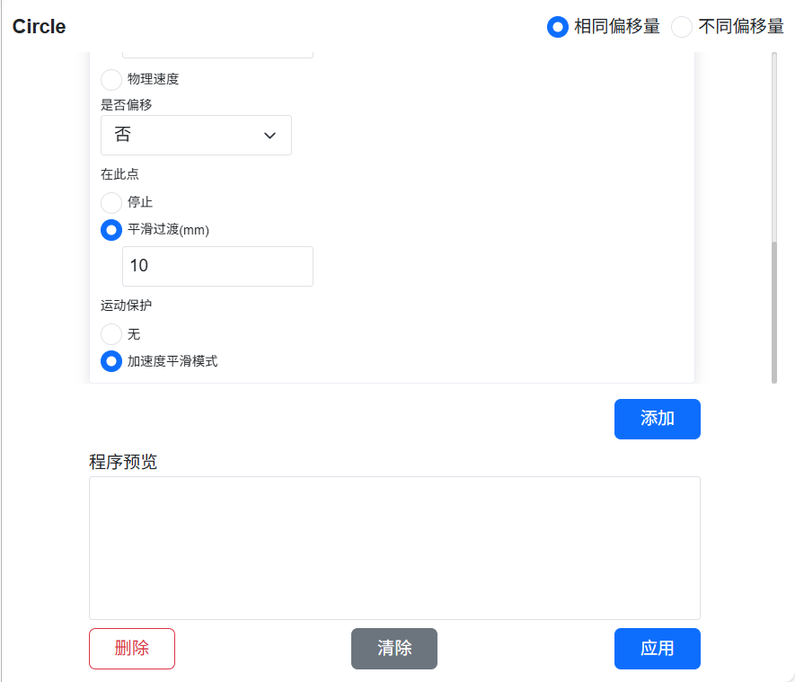

.. centered:: 圖表 9.27-61 加速度平滑CIRCLE指令的blending指令設置

**Step3**：添加多條CIRCLE和PTP指令，生成Lua程序並運行，即可實現對CIRCLE-PTP的blending功能，該方式僅對AccSmoothStart()和AccSmoothEnd()之間的指令使用優化後的T形速度運動，對其餘指令使用原T形速度運動。
   
.. image:: coding/425.png
   :width: 4in
   :align: center

.. centered:: 圖表 9.27-62 Lua指令方式進行CIRCLE-PTP間blending典型程序

使用運動配置開關方式
"""""""""""""""""""""""""""""""""""""""""""""""""""""""

**Step1**：點擊“初始設置”—>“安全”—>“運動配置”按鈕，打開“加速度平滑模式”的開關。
   
.. image:: coding/317.png
   :width: 6in
   :align: center

.. centered:: 圖表 9.27-63 加速度平滑模式配置開關設置

**Step2**：選擇要執行CIRCLE-PTP功能的示教點，本手冊以“A0”~“A9”作為示教點的名稱。

**Step3**：點擊“示教程序”—>“程序編程”按鈕，選擇“運動指令”中的“整圓”指令，在“指令編輯”中選擇示教點並設置調試速度，運動保護選擇“無”，在需要平滑的點處設置“平滑過渡”參數。
   
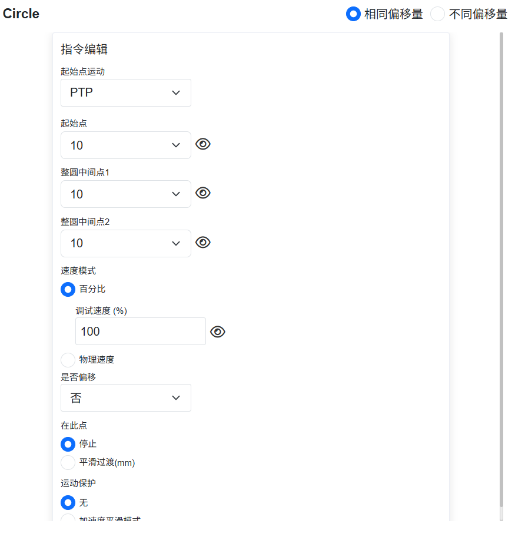

.. centered:: 圖表 9.27-64 常規CIRCLE指令的blending指令設置

**Step4**：添加多條CIRCLE和PTP指令，生成Lua程序並運行，即可實現對CIRCLE-PTP的blending功能，典型程序和常規CIRCLE-PTP程序相同，該方式會對所有指令使用優化後的T形速度運動。
   
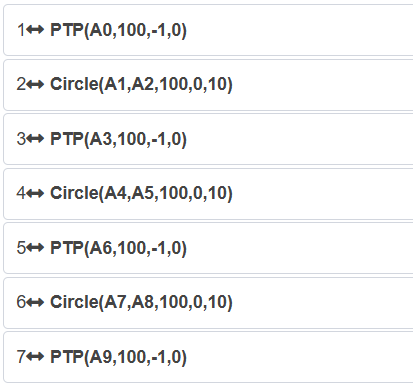

.. centered:: 圖表 9.27-65 使用配置開關進行CIRCLE-PTP間blending的典型程序
   
CIRCLE-LIN的blending
***************************************

使用Lua指令方式
""""""""""""""""""""""""""""""""""""""""""

**Step1**：選擇要執行CIRCLE-LIN功能的示教點，本手冊以“A0”~“A12”作為示教點的名稱。

**Step2**：點擊“示教程序”—>“程序編程”按鈕，選擇“運動指令”中的“整圓”指令，在“指令編輯”中選擇示教點並設置調試速度，運動保護選擇“加速度平滑模式”，在需要平滑的點處設置“平滑過渡”參數。
   

.. centered:: 圖表 9.27-66 加速度平滑CIRCLE指令的blending指令設置

**Step3**：添加多條CIRCLE和LIN指令，生成Lua程序並運行，即可實現對CIRCLE-LIN的blending功能，該方式僅對AccSmoothStart()和AccSmoothEnd()之間的指令使用優化後的T形速度運動，對其餘指令使用原T形速度運動。
   
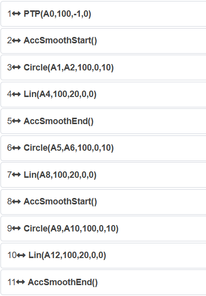

.. centered:: 圖表 9.27-67 Lua指令方式進行CIRCLE-LIN間blending典型程序

使用運動配置開關方式
"""""""""""""""""""""""""""""""""""""""""""""""""""""""

**Step1**：點擊“初始設置”—>“安全”—>“運動配置”按鈕，打開“加速度平滑模式”的開關。
   
.. image:: coding/317.png
   :width: 6in
   :align: center

.. centered:: 圖表 9.27-68 加速度平滑模式配置開關設置

**Step2**：選擇要執行CIRCLE-LIN功能的示教點，本手冊以“A0”~“A12”作為示教點的名稱。

**Step3**：點擊“示教程序”—>“程序編程”按鈕，選擇“運動指令”中的“整圓”指令，在“指令編輯”中選擇示教點並設置調試速度，運動保護選擇“無”，在需要平滑的點處設置“平滑過渡”參數。
   

.. centered:: 圖表 9.27-69 常規CIRCLE指令的blending指令設置

**Step4**：添加多條CIRCLE和LIN指令，生成Lua程序並運行，即可實現對CIRCLE-LIN的blending功能，典型程序和常規CIRCLE-LIN程序相同，該方式會對所有指令使用優化後的T形速度運動。
   
.. image:: coding/429.png
   :width: 4in
   :align: center

.. centered:: 圖表 9.27-70 使用配置開關進行CIRCLE-LIN間blending的典型程序
   
CIRCLE-ARC的blending
***************************************

使用Lua指令方式
""""""""""""""""""""""""""""""""""""""""""

**Step1**：選擇要執行CIRCLE-ARC功能的示教點，本手冊以“A0”~“A12”作為示教點的名稱。

**Step2**：點擊“示教程序”—>“程序編程”按鈕，選擇“運動指令”中的“整圓”指令，在“指令編輯”中選擇示教點並設置調試速度，運動保護選擇“加速度平滑模式”，在需要平滑的點處設置“平滑過渡”參數。
   

.. centered:: 圖表 9.27-71 加速度平滑CIRCLE指令的blending指令設置

**Step3**：添加多條CIRCLE和ARC指令，生成Lua程序並運行，即可實現對CIRCLE-ARC的blending功能，該方式僅對AccSmoothStart()和AccSmoothEnd()之間的指令使用優化後的T形速度運動，對其餘指令使用原T形速度運動。
   
.. image:: coding/430.png
   :width: 4in
   :align: center

.. centered:: 圖表 9.27-72 Lua指令方式進行CIRCLE-ARC間blending典型程序

使用運動配置開關方式
"""""""""""""""""""""""""""""""""""""""""""""""""""""""

**Step1**：點擊“初始設置”—>“安全”—>“運動配置”按鈕，打開“加速度平滑模式”的開關。
   
.. image:: coding/317.png
   :width: 6in
   :align: center

.. centered:: 圖表 9.27-73 加速度平滑模式配置開關設置

**Step2**：選擇要執行CIRCLE-ARC功能的示教點，本手冊以“A0”~“A12”作為示教點的名稱。

**Step3**：點擊“示教程序”—>“程序編程”按鈕，選擇“運動指令”中的“整圓”指令，在“指令編輯”中選擇示教點並設置調試速度，運動保護選擇“無”，在需要平滑的點處設置“平滑過渡”參數。
   

.. centered:: 圖表 9.27-74 常規CIRCLE指令的blending指令設置

**Step4**：添加多條CIRCLE和ARC指令，生成Lua程序並運行，即可實現對CIRCLE-ARC的blending功能，典型程序和常規CIRCLE-ARC程序相同，該方式會對所有指令使用優化後的T形速度運動。
   
.. image:: coding/431.png
   :width: 4in
   :align: center

.. centered:: 圖表 9.27-75 使用配置開關進行CIRCLE-ARC間blending的典型程序
   
CIRCLE-CIRCLE的blending
***************************************

使用Lua指令方式
""""""""""""""""""""""""""""""""""""""""""

**Step1**：選擇要執行CIRCLE-CIRCLE功能的示教點，本手冊以“A0”~“A12”作為示教點的名稱。

**Step2**：點擊“示教程序”—>“程序編程”按鈕，選擇“運動指令”中的“整圓”指令，在“指令編輯”中選擇示教點並設置調試速度，運動保護選擇“加速度平滑模式”，在需要平滑的點處設置“平滑過渡”參數。
   

.. centered:: 圖表 9.27-76 加速度平滑CIRCLE指令的blending指令設置

**Step3**：添加多條CIRCLE指令，生成Lua程序並運行，即可實現對CIRCLE-CIRCLE的blending功能，該方式僅對AccSmoothStart()和AccSmoothEnd()之間的指令使用優化後的T形速度運動，對其餘指令使用原T形速度運動。
   
.. image:: coding/432.png
   :width: 4in
   :align: center

.. centered:: 圖表 9.27-77 Lua指令方式進行CIRCLE-CIRCLE間blending典型程序

使用運動配置開關方式
"""""""""""""""""""""""""""""""""""""""""""""""""""""""

**Step1**：點擊“初始設置”—>“安全”—>“運動配置”按鈕，打開“加速度平滑模式”的開關。
   
.. image:: coding/317.png
   :width: 6in
   :align: center

.. centered:: 圖表 9.27-78 加速度平滑模式配置開關設置

**Step2**：選擇要執行CIRCLE-CIRCLE功能的示教點，本手冊以“A0”~“A12”作為示教點的名稱。

**Step3**：點擊“示教程序”—>“程序編程”按鈕，選擇“運動指令”中的“整圓”指令，在“指令編輯”中選擇示教點並設置調試速度，運動保護選擇“無”，在需要平滑的點處設置“平滑過渡”參數。
   

.. centered:: 圖表 9.27-79 常規CIRCLE指令的blending指令設置

**Step4**：添加多條CIRCLE指令，生成Lua程序並運行，即可實現對CIRCLE-CIRCLE的blending功能，典型程序和常規CIRCLE-CIRCLE程序相同，該方式會對所有指令使用優化後的T形速度運動。
   
.. image:: coding/433.png
   :width: 4in
   :align: center

.. centered:: 圖表 9.27-80 使用配置開關進行CIRCLE-CIRCLE間blending的典型程序

擴展軸非同步運動的Blending
***************************************

使用Lua指令方式
""""""""""""""""""""""""""""""""""""""""""

**Step1**：選擇執行擴展軸非同步運動blending功能的示教點，本手冊以“A0”~“A5”作為示教點的名稱。

**Step2**：點擊“示教程序”—>“程序編輯”按鈕，選擇“外設指令”中的“擴展軸”指令，“運動方式”選為“非同步”，選擇示教點並設置調試速度，運動保護選擇“加速度平滑模式”，在需要平滑的點處設置“平滑過渡”參數。
   
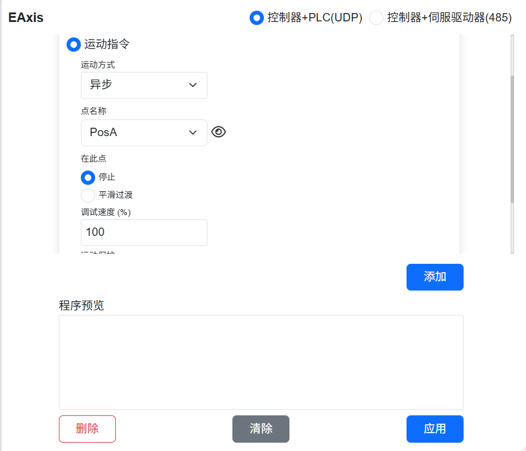

.. centered:: 圖表 9.27-81 擴展軸非同步運動的blending指令設置

**Step3**：添加運動指令，生成Lua程序並運行，即可實現擴展軸非同步運動的blending功能，該方式僅對`AccSmoothStart()`和`AccSmoothEnd()`之間的指令使用S型速度規劃並進行blending，對其餘指令使用T形速度規劃。
   
.. image:: coding/436.png
   :width: 4in
   :align: center

.. centered:: 圖表 9.27-82 Lua指令方式進行擴展軸非同步運動blending典型程序

使用運動配置開關方式
"""""""""""""""""""""""""""""""""""""""""""""""""""""""

**Step1**：點擊“初始設置”—>“安全”—>“運動配置”按鈕，開啟“加速度平滑模式”的開關。
   
.. image:: coding/317.png
   :width: 6in
   :align: center

.. centered:: 圖表 9.27-83 加速度平滑模式配置開關設置

**Step2**：選擇執行擴展軸非同步運動blending功能的示教點，本手冊以“A0”~“A5”作為示教點的名稱。

**Step3**：點擊“示教程序”—>“程序編輯”按鈕，選擇“外設指令”中的“擴展軸”指令，“運動方式”選為“非同步”，選擇示教點並設置調試速度，運動保護選擇“無”，在需要平滑的點處設置“平滑過渡”參數。
   
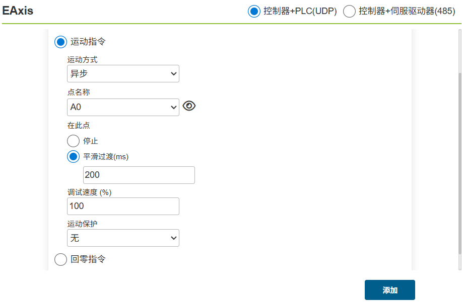

.. centered:: 圖表 9.27-84 常規擴展軸非同步運動的blending指令設置

**Step4**：添加多條運動指令，生成Lua程序並運行，即可實現擴展軸非同步運動的blending功能，典型程序和常規擴展軸運動程序相同，該方式會對所有使用S型速度規劃並進行blending運動。
   
.. image:: coding/438.png
   :width: 4in
   :align: center

.. centered:: 圖表 9.27-85 使用配置開關進行擴展軸非同步運動blending典型程序
   
擴展軸同步運動的Blending
***************************************

使用Lua指令方式
""""""""""""""""""""""""""""""""""""""""""

**Step1**：選擇執行擴展軸同步運動blending功能的示教點，本手冊以“A0”~“A5”作為示教點的名稱。

**Step2**：點擊“示教程序”—>“程序編輯”按鈕，選擇“外設指令”中的“擴展軸”指令，“運動方式”選為“同步”，選擇示教點並設置調試速度，運動保護選擇“加速度平滑模式”，在需要平滑的點處設置“平滑過渡”參數。
   
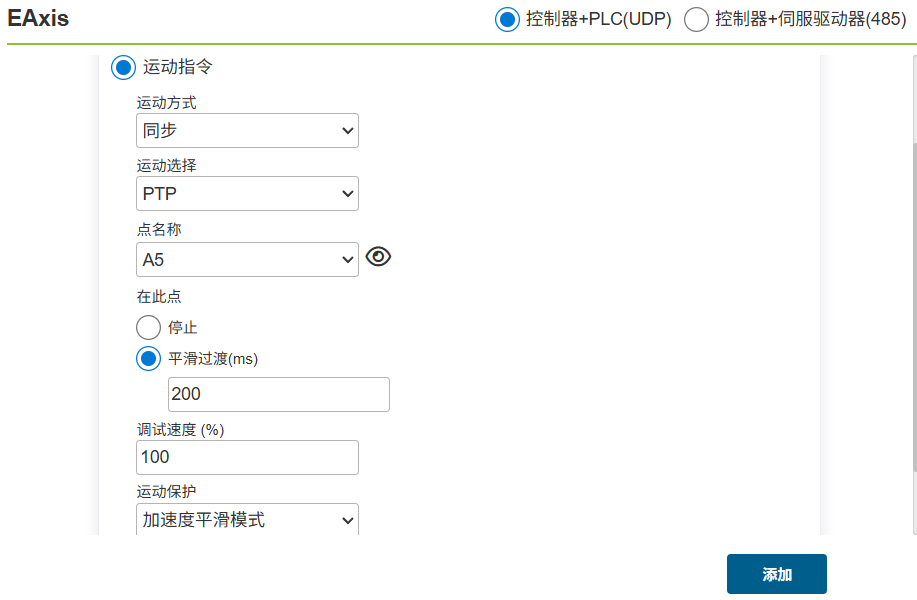

.. centered:: 圖表 9.27-86 擴展軸同步運動的blending指令設置

**Step3**：添加運動指令，生成Lua程序並運行，即可實現擴展軸同步運動的blending功能，該方式僅對`AccSmoothStart()`和`AccSmoothEnd()`之間的指令使用S型速度規劃並進行blending，對其餘指令使用T形速度規劃。
   
.. image:: coding/440.png
   :width: 4in
   :align: center

.. centered:: 圖表 9.27-87 Lua指令方式進行擴展軸同步運動blending典型程序

使用運動配置開關方式
"""""""""""""""""""""""""""""""""""""""""""""""""""""""

**Step1**：點擊“初始設置”—>“安全”—>“運動配置”按鈕，開啟“加速度平滑模式”的開關。
   
.. image:: coding/317.png
   :width: 6in
   :align: center

.. centered:: 圖表 9.27-88 加速度平滑模式配置開關設置

**Step2**：選擇執行擴展軸同步運動blending功能的示教點，本手冊以“A0”~“A5”作為示教點的名稱。

**Step3**：點擊“示教程序”—>“程序編輯”按鈕，選擇“外設指令”中的“擴展軸”指令，“運動方式”選為“同步”，選擇示教點並設置調試速度，運動保護選擇“無”，在需要平滑的點處設置“平滑過渡”參數。
   
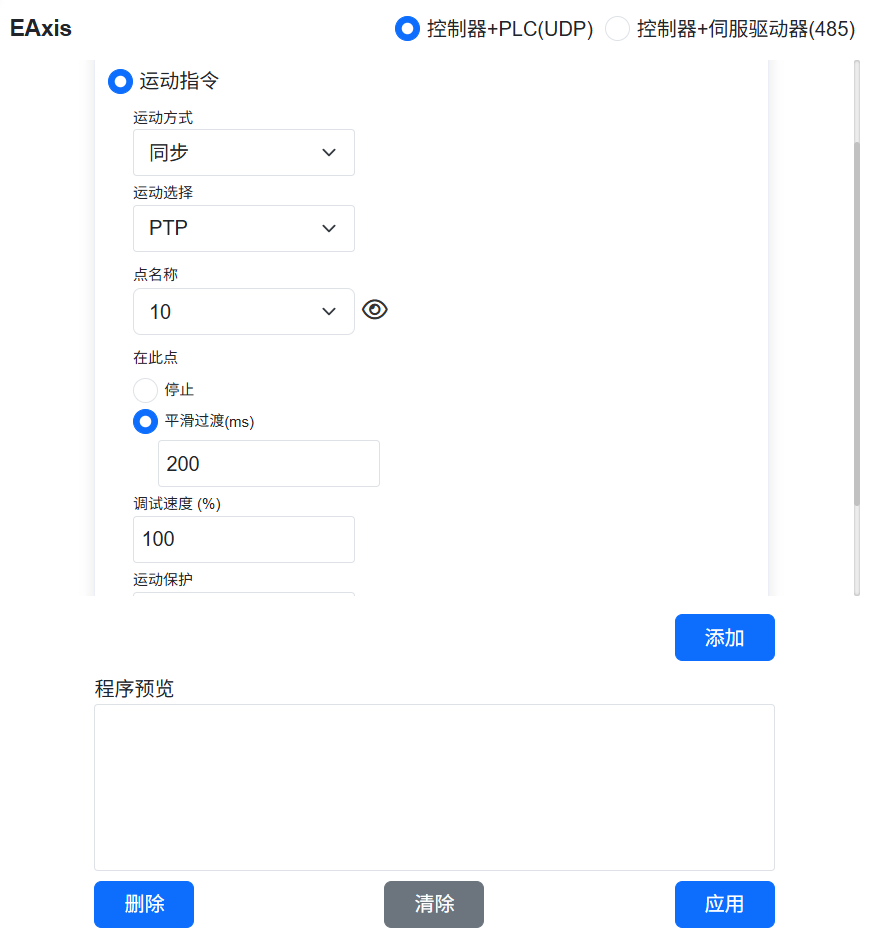

.. centered:: 圖表 9.27-89 常規擴展軸同步運動的blending指令設置

**Step4**：添加多條運動指令，生成Lua程序並運行，即可實現擴展軸同步運動的blending功能，典型程序和常規擴展軸運動程序相同，該方式會對所有使用S型速度規劃並進行blending運動。
   
.. image:: coding/442.png
   :width: 4in
   :align: center

.. centered:: 圖表 9.27-90 使用配置開關進行擴展軸同步運動blending典型程序

擺動側傾角功能
~~~~~~~~~~~~~~~~~~~~~~~~~~~~~~~~~~~~~~~~~~~~~~~~~~~~~~~

概述
++++++++++++++

機器人擺動側傾角功能支援機器人末端工具在擺動運動過程中繞擺動座標系Rx方向自定義擺動角度，實現在搭接焊等作業過程中減少角焊縫與兩側被連接材料之間接觸長度的差異。

操作流程
++++++++++++++++++++++++++++

在機器人Web控制介面，依次點擊「示教程式」→「程式編輯」，進入「運動指令」介面，如下圖。
   
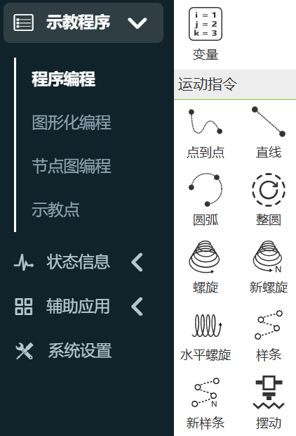

.. centered:: 圖表 9.28-1 運動指令介面

在「運動指令」介面，點擊「擺動」，進入「Weave」指令編輯介面。
   
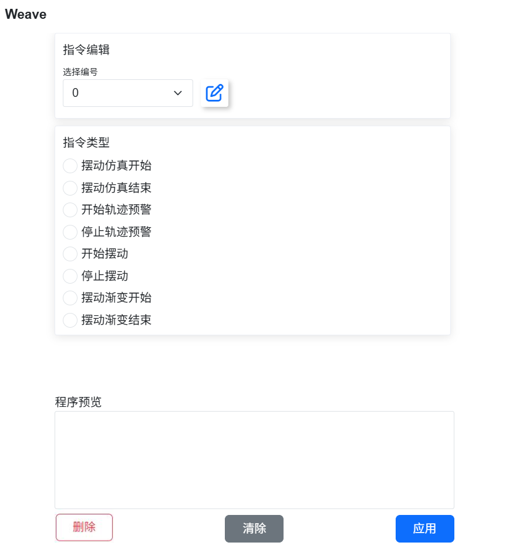

.. centered:: 圖表 9.28-2 Weave指令編輯介面

在「Weave」指令編輯介面，點擊「選擇編號」下拉框，可選擇不同編號的擺動參數配置；點擊「選擇編號」下拉框右側「按鈕」，可修改該編號下的擺動參數配置。
   
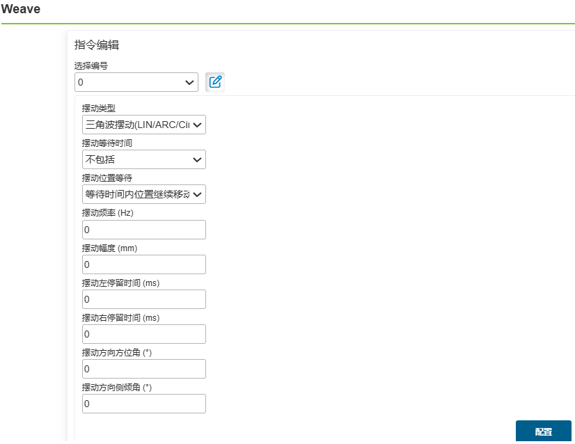

.. centered:: 圖表 9.28-3 擺動參數配置

擺動參數配置中「擺動方向側傾角」欄，可輸入自定義繞擺動座標系Rx方向旋轉的角度，點擊「配置」，完成擺動參數配置。

.. note:: 注意：「擺動方向側傾角」參數適用於「擺動類型」參數中的「三角波擺動」、「正弦波擺動」、「圓形擺動-順時針」及「圓形擺動-逆時針」。

以下以Lin運動為例，實現擺動側傾角功能：

**步驟1**：在「Weave」指令編輯介面中的「選擇編號」下拉框，選擇已配置完畢擺動側傾角參數的配置編號；在「指令類型」欄中，點擊「開始擺動」，點擊「新增」，表示開啟擺動功能。
   
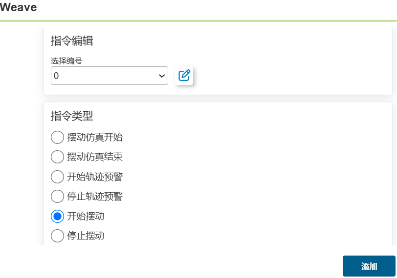

.. centered:: 圖表 9.28-4 新增開始擺動

**步驟2**：在「運動指令」介面，點擊「直線」，可建立Lin直線運動（此為基本運動指令，不再贅述）。

**步驟3**：在「Weave」指令編輯介面，在「指令類型」欄中，點擊「結束擺動」，點擊「新增」，表示關閉擺動功能。
   
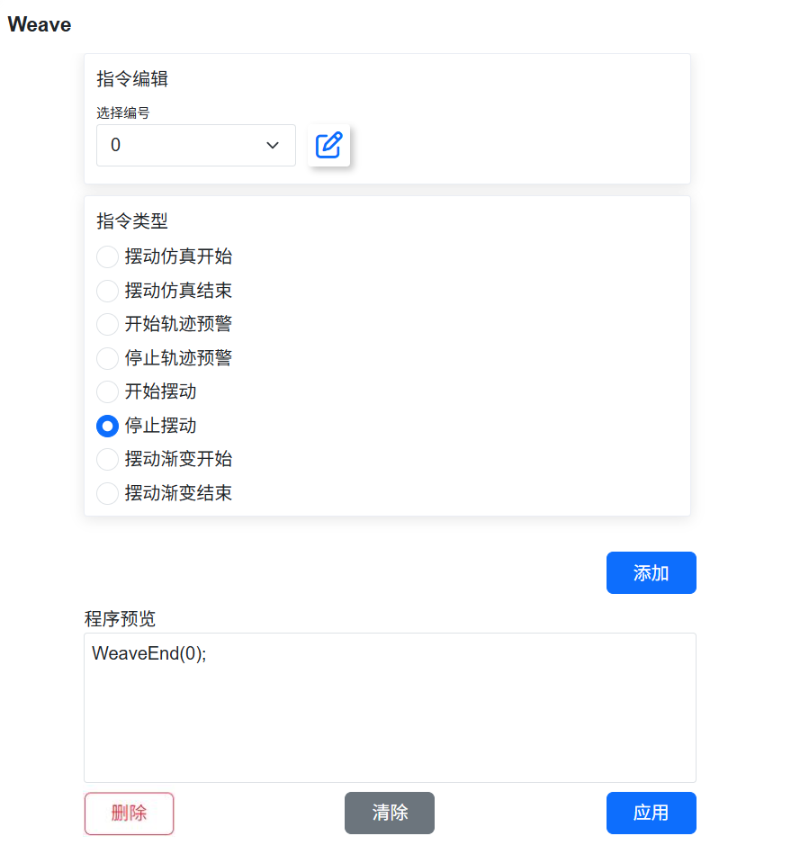

.. centered:: 圖表 9.28-5 新增停止擺動

**步驟4**：完成步驟1~3後，在「Weave」指令編輯介面「程式預覽」欄中，可檢查步驟1~3是否設定正確。
   
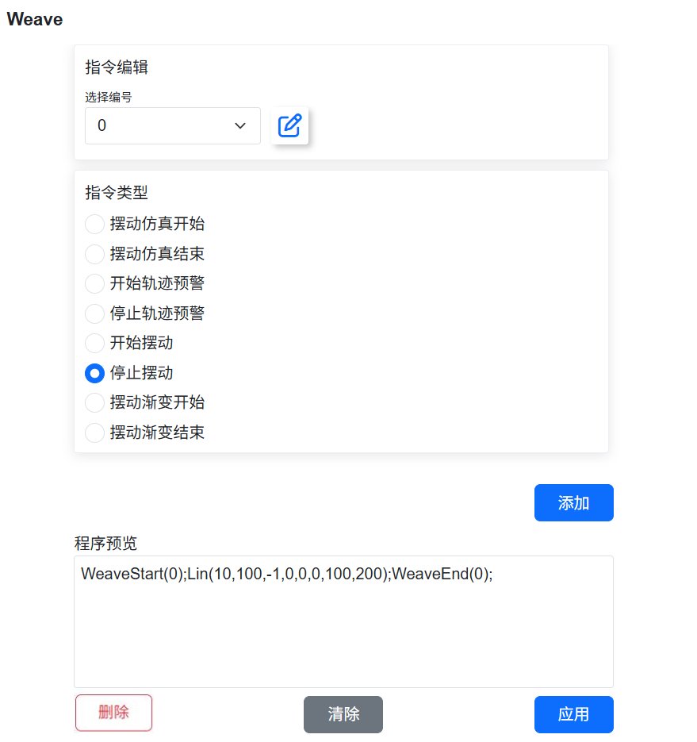

.. centered:: 圖表 9.28-6 擺動程式預覽

**步驟5**：在「程式預覽」欄中檢查程式設定完畢後，點擊「套用」，將自動生成可執行的LUA程式。
   
.. image:: coding/326.png
   :width: 4in
   :align: center

.. centered:: 圖表 9.28-7 典型LUA擺動運動程式

焊接工藝參數漸變功能(電流、電壓、沿焊縫前進速度)
~~~~~~~~~~~~~~~~~~~~~~~~~~~~~~~~~~~~~~~~~~~~~~~~~~~~~~~

概述
++++++++++++++

焊接工藝參數漸變（電流、電壓及沿焊縫前進速度）功能支援自定義焊接過程中工藝參數的變化範圍。

電流電壓參數漸變流程
++++++++++++++++++++++++++++++++++

電流參數漸變
*****************************

在機器人Web控制介面，依次點擊「示教程式」->「程式編輯」，進入「焊接指令」介面如下圖。
   
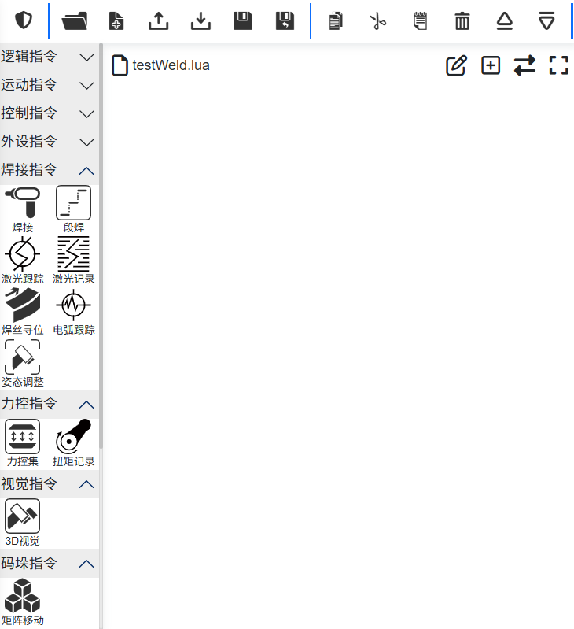

.. centered:: 圖表 9.29-1 焊接指令介面

在「焊接指令」介面，點擊「焊接」，進入「Weld」指令配置介面。
   

.. centered:: 圖表 9.29-2 Weld指令配置介面

在「Weld」指令配置介面的「指令類型」欄中，點擊「焊接電流漸變開始」，配置「開始電流」、「結束電流」、「焊接電流控制AO」及「平滑選擇」參數。

例如，配置「開始電流」為260 A、「結束電流」為220 A、「焊接電流控制AO」為「Ctrl-AO0」控制箱模擬量通道及「平滑選擇」為「Break」，點擊「添加」，即配置完畢，在「程式預覽」欄中，檢查指令參數是否存在錯誤配置。
   
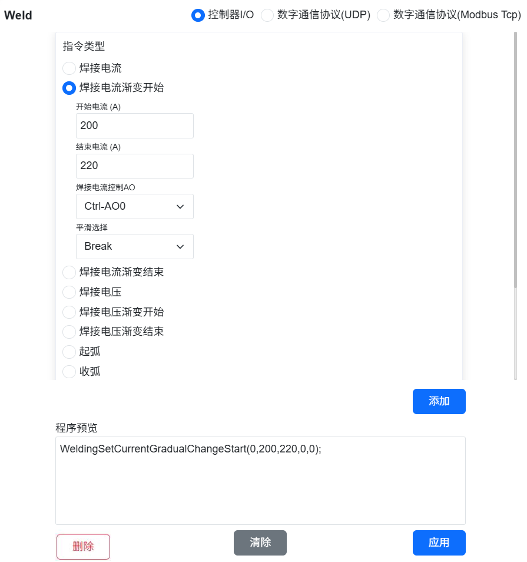

.. centered:: 圖表 9.29-3 焊接電流漸變開始指令參數

在「Weld」指令配置介面的「指令類型」欄中，點擊「焊接電流漸變結束」，無需配置參數，點擊「添加」，即配置完畢，在「程式預覽」欄中，檢查指令參數是否存在錯誤配置。
   
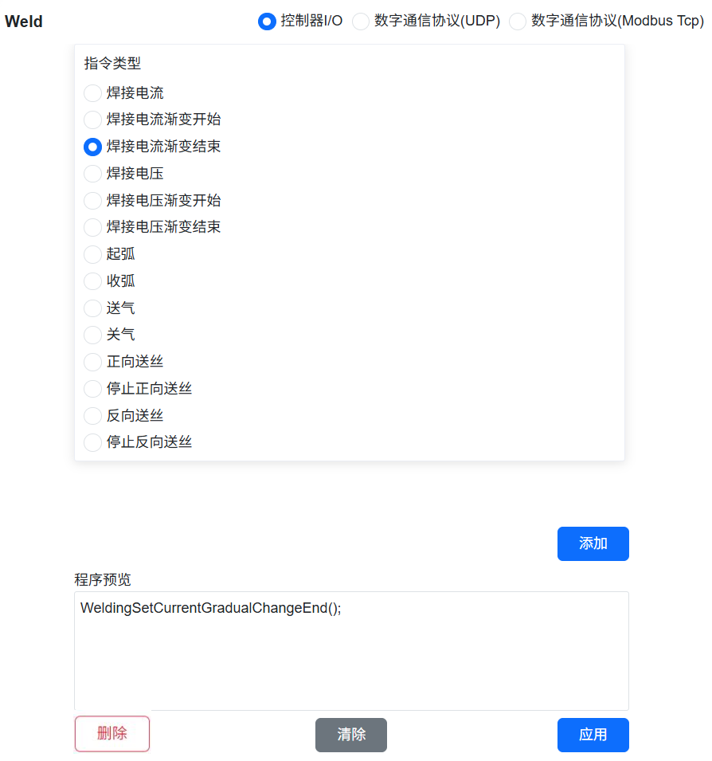

.. centered:: 圖表 9.29-4 焊接電流漸變結束指令參數

配置完畢「焊接電流漸變開始」指令與「焊接電流漸變結束」指令參數後，點擊「應用」，自動生成可執行的LUA程式。

.. note:: 在配置「焊接電流漸變開始」指令與「焊接電流漸變結束」指令參數過程中，需配置運動指令，以一段電弧跟蹤運動指令結合電流參數漸變的典型LUA程式為例。
   
.. image:: coding/331.png
   :width: 4in
   :align: center

.. centered:: 圖表 9.29-5 一段典型電流參數漸變的電弧跟蹤LUA程式

電壓參數漸變
**********************************

「Weld」指令配置介面的「指令類型」欄中，點擊「焊接電壓漸變開始」，配置「開始電壓」、「結束電壓」、「焊接電壓控制AO」及「平滑選擇」參數。

例如，配置「開始電壓」為25 V、「結束電壓」為22 V、「焊接電壓控制AO」為「Ctrl-AO1」控制箱模擬量通道及「平滑選擇」為「Break」，點擊「添加」，即配置完畢，在「程式預覽」欄中，檢查指令是否存在錯誤配置，如下圖。
   
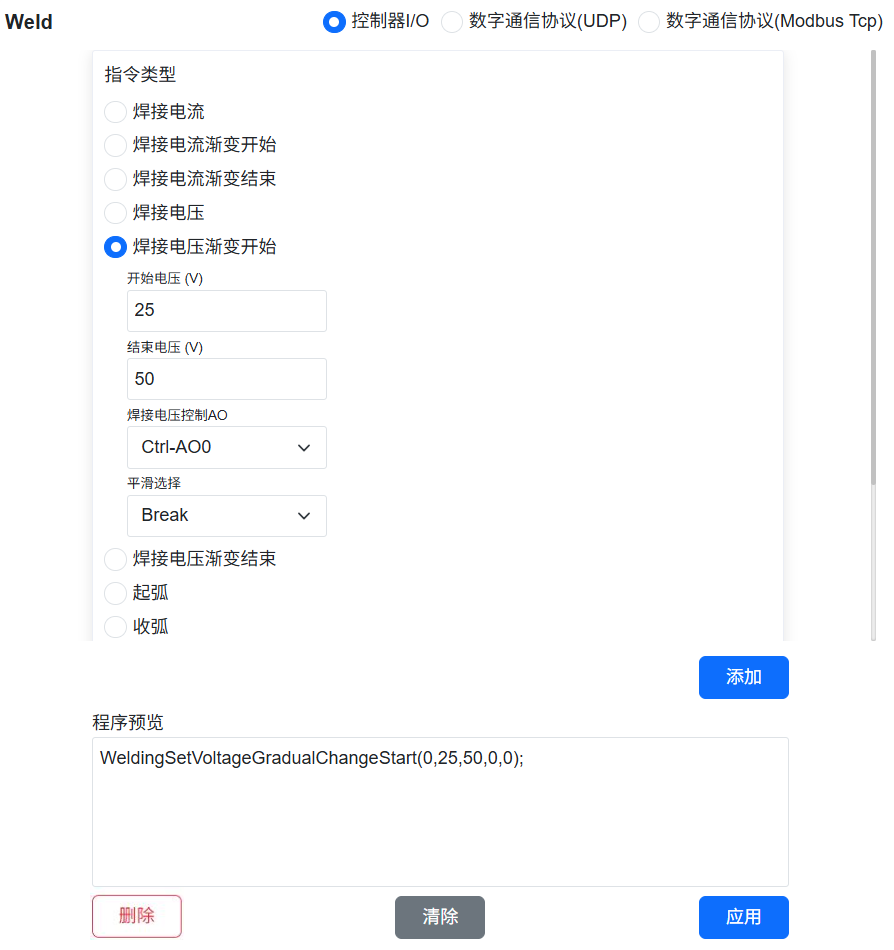

.. centered:: 圖表 9.29-6 焊接電壓漸變開始指令參數

在「Weld」指令配置介面的「指令類型」欄中，點擊「焊接電壓漸變結束」，無需配置參數，點擊「添加」，即配置完畢，在「程式預覽」欄中，檢查指令是否存在錯誤配置。
   
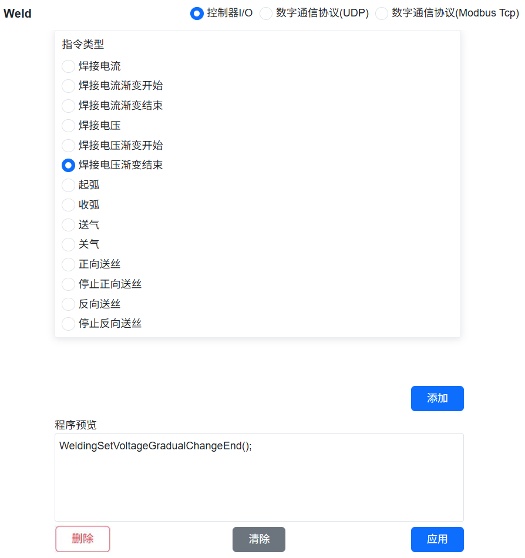

.. centered:: 圖表 9.29-7 焊接電壓漸變結束指令參數

配置完畢「焊接電壓漸變開始」指令與「焊接電壓漸變結束」指令參數後，點擊「應用」，自動生成可執行的LUA程式。
   
.. image:: coding/334.png
   :width: 4in
   :align: center

.. centered:: 圖表 9.29-8 一段典型電壓參數漸變的電弧跟蹤LUA程式

前進速度參數漸變流程
+++++++++++++++++++++++++++++++++++++++++++++++

在機器人Web控制介面，依次點擊「示教程式」->「程式編輯」，進入「運動指令」介面。
   
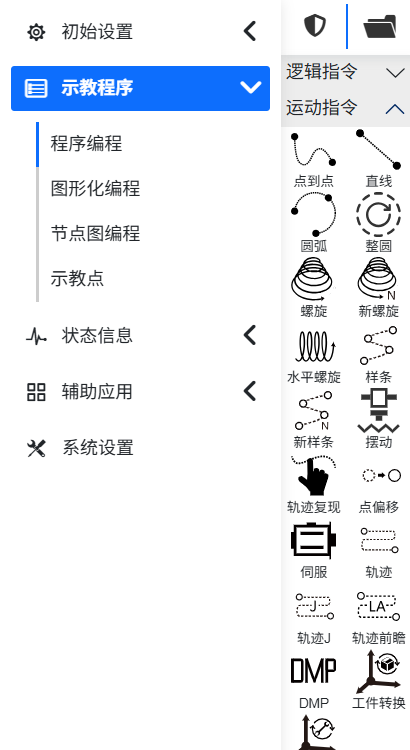

.. centered:: 圖表 9.29-9 運動指令介面

在「運動指令」介面，點擊「擺動」，進入「Weave」指令配置介面。
   
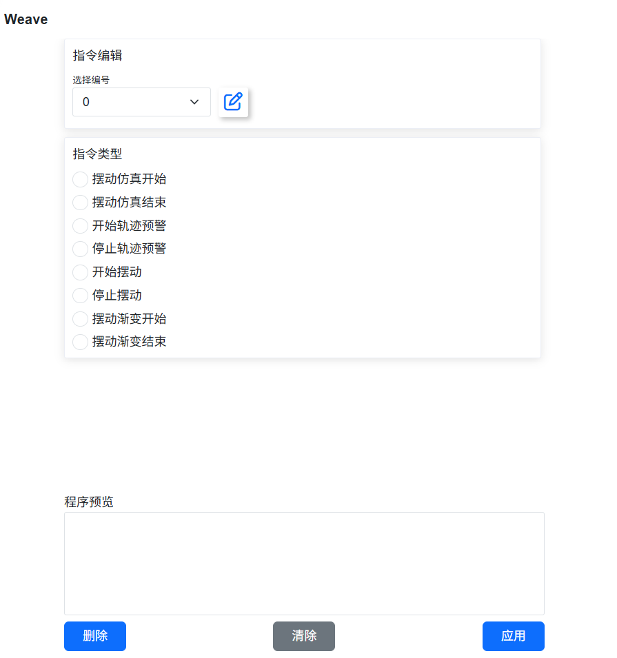

.. centered:: 圖表 9.29-10 Weave指令配置介面

在「Weave」指令配置介面的「指令類型」欄中，點擊「擺動漸變開始」，配置「開始速度」、「結束速度」及「漸變模式」參數。

例如，配置「漸變模式」為「擺動+前進速度」、「開始速度」為24 cm/min及「結束速度」為30 cm/min，點擊「添加」，即配置完畢，在「程式預覽」欄中，檢查指令是否存在錯誤配置。
   
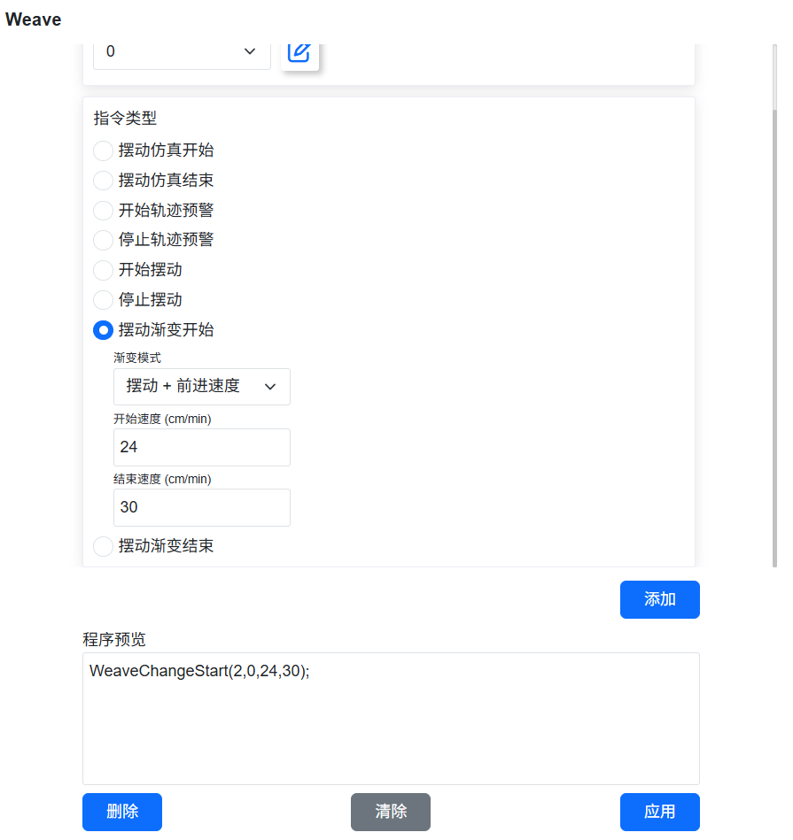

.. centered:: 圖表 9.29-11 擺動+前進速度漸變開始指令參數

在「Weave」指令介面的「指令類型」欄中，點擊「擺動漸變結束」，無需配置參數，點擊「添加」，即配置完畢，在「程式預覽」欄中，檢查指令是否存在錯誤配置。
   
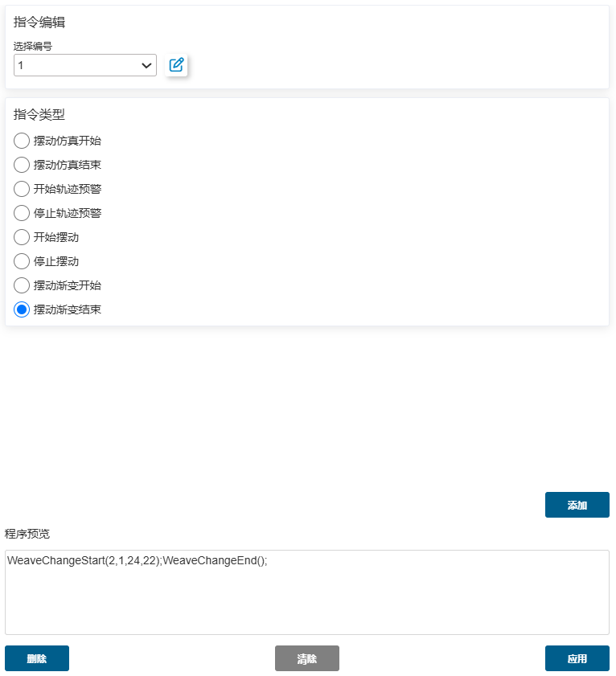

.. centered:: 圖表 9.29-12 擺動+前進速度漸變結束指令參數

配置完畢「擺動漸變開始」指令與「擺動漸變結束」指令參數後，點擊「應用」，自動生成可執行的LUA程式。

.. note:: 配置「擺動漸變開始」指令與「擺動漸變結束」指令參數過程中，需配置運動指令，以一段電弧跟蹤運動指令結合前進速度參數漸變的典型LUA程式為例。
   
.. image:: coding/339.png
   :width: 4in
   :align: center

.. centered:: 圖表 9.29-13 一段典型前進速度參數漸變的電弧跟蹤LUA程式

.. note:: 「Weld」指令配置介面與「Weave」指令配置介面，進行焊接工藝參數漸變指令參數配置時，均需首先確定控制箱與焊機的通信方式，對於模擬量通信和數字量通信，分別點擊「控制器I/O」或「數字通訊協定」。

機器人ModbusRTU通信
~~~~~~~~~~~~~~~~~~~~~~~~~~~~~~~~~~~~~~~~~~~~~~~~~~~~~~~

概述
++++++++++++++

ModbusRTU是工業生產中常用的通信協議，法奧協作機器人提供ModbusRTU主站和ModbusRTU從站兩種方式與您的設備進行通信。協作機器人最多支持8個ModbusRTU主站同時與外部設備進行通信，每個主站最多支持128個寄存器；協作機器人ModbusRTU從站具有64個線圈、64個離散輸入、32個保持寄存器和32個輸入寄存器(保持寄存器和輸入寄存器數據類型包含有符號和浮點型兩種類型)。

同時協作機器人部分ModbusRTU從站輸入寄存器地址專用於反饋當前機器人的關節位置、運動速度等信息，部分線圈寄存器地址專用於控制機器人啟動程序、停止程序、設置控制箱DO等功能，機器人ModbusRTU從站僅支持與一個主站建立連接。下面是詳細使用方法。

機器人ModbusRTU主站相關操作說明
++++++++++++++++++++++++++++++++++++++++++++++++++++++++++++++++++++++

在使用協作機器人做ModbusRTU主站與您的設備進行通信前，請先檢查您的設備與機器人的485硬件連接。使用機器人ModbusRTU主站有以下幾個步驟：①添加主站；②添加寄存器；③通信測試；④編寫用戶程序；⑤執行用戶程序；

添加ModbusRTU主站
*******************************************
打開WebApp，依次點擊「示教模擬」、「程序示教」，新建用戶程序「testModbusRTUMaster.lua」。
   
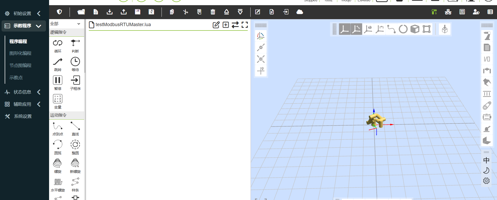

.. centered:: 圖表 9.30-1 創建ModbusRTU主站用戶程序

點擊「ModbusRTU設置」按鈕，打開ModbusRTU功能配置頁面。
   
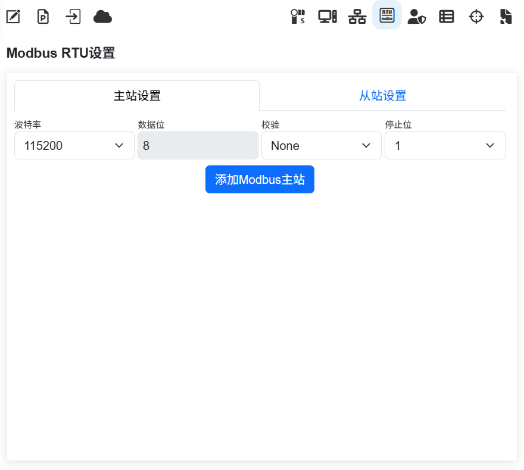

.. centered:: 圖表 9.30-2 打開ModbusRTU設置

依次點擊「主站設置」、「添加Modbus主站」，即完成添加一個ModbusRTU主站。
   
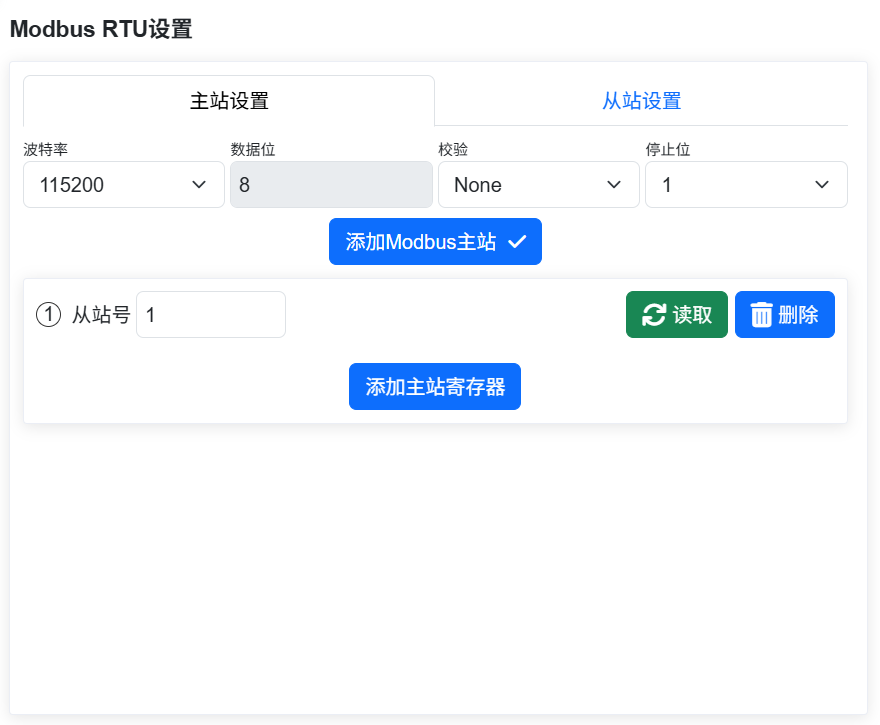

.. centered:: 圖表 9.30-3 添加「ModbusRTU主站」

根據您的從站設備情況依次選擇 「波特率」、「數據位」、「校驗」和「停止位」，上述參數的具體含義如下：

**波特率**： ModbusRTU用於通信的波特率，支持：9600、14400、19200、38400、56000、67600、115200、128000，默認為115200，設置為與從站一致。

**數據位**：目前僅支持設置為8位，設置為與從站一致。

**校驗**：校驗方式，支持None、Odd、Even，默認為None，設置為與從站一致；

**停止位**：支持0.5、1、1.5、2，默認為1，設置為與從站一致。
   

.. centered:: 圖表 9.30-4 設置ModbusRTU主站參數

正確輸入上述參數後，機器人ModbusRTU主站即可進行與從站的通信。(若您已經確認對ModbusRTU主站的相關參數進行了正確的配置，但機器人與您的設備通信成功，請檢查以下配置：

①機器人與從站設備的物理485連接；②檢查從站設備的通信配置，並建議先用串口調試助手測試通信鏈路是否正確。如在PC端配置與機器人一致的ModbusRTU參數，在機器人web界面新建一個寄存器並進行0x03讀保持寄存器的操作，查看串口調試助手是否能夠收到數據。如下圖所示，通過0x03指令讀取0x1000地址的寄存器，PC端可正常收到數據，說明通信配置正確。
   
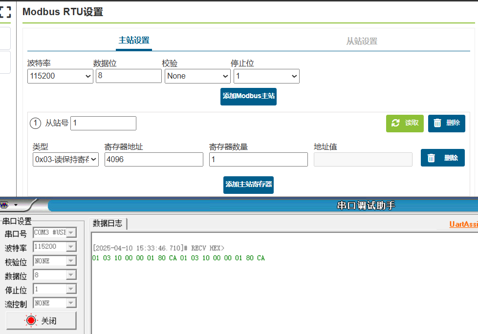

.. centered:: 圖表 9.30-5 驗證Modbus連接狀態

至此我們已經完成一個機器人ModbusRTU主站的創建，若您再次點擊「添加Modbus主站」，即可再次創建一個新的ModbusRTU主站(圖2-6)，機器人最多支持8個主站同時與外部設備通信，雙擊Modbus主站右上角的「刪除」按鈕，即可刪除該Modbus主站。
   

.. centered:: 圖表 9.30-6 再次添加ModbusRTU主站

ModbusRTU主站添加寄存器
*******************************************

點擊「添加主站寄存器」按鈕即可為該主站添加一個寄存器。
   
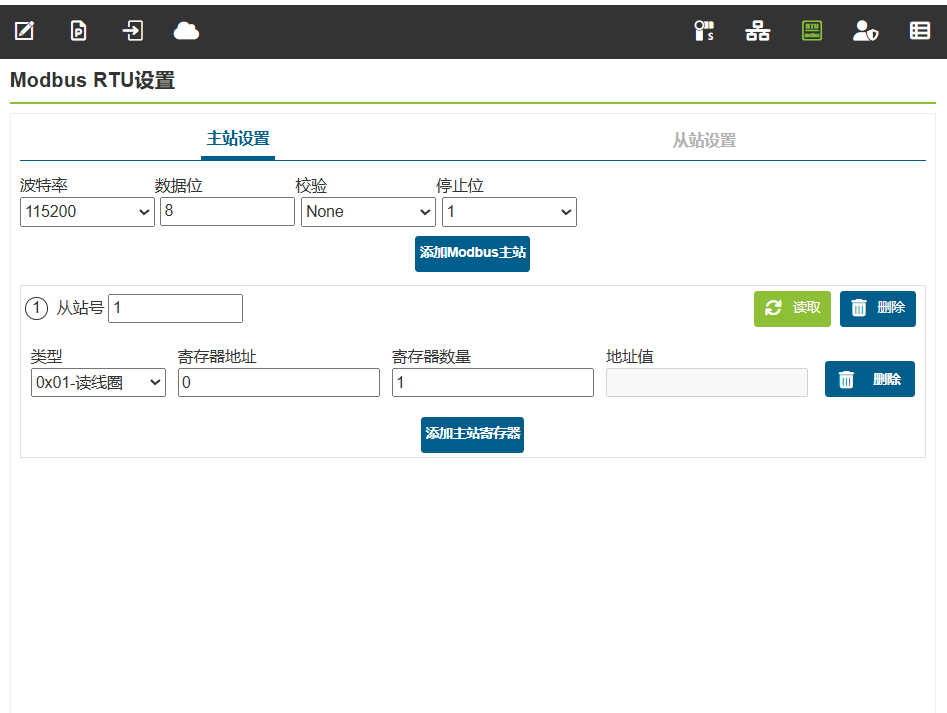

.. centered:: 圖表 9.30-7 添加ModbusRTU主站寄存器

依次選擇主站寄存器類型、輸入地址編號和名稱，各參數意義如下：

**類型**：modbus功能碼，0x01-讀線圈；0x02-讀離散量；0x03 -讀保持寄存器(有符號型-32768-32767)；0x03-讀保持寄存器(浮點型寄存器數據長度32位，佔用兩個寄存器，4個字節)；0x04 -讀輸入寄存器(有符號型-32768-32767)；0x04-讀輸入寄存器(浮點型寄存器數據長度32位，佔用兩個寄存器，4個字節)；0x05-寫單個線圈；0x06-寫單個保持寄存器；0x0F-寫多個線圈；0x03 -讀保持寄存器(有符號型-32768-32767)；0x03-讀保持寄存器(浮點型寄存器數據長度32位，佔用兩個寄存器，4個字節)；其中讀寫的浮點型寄存器為大端顯示。

**寄存器地址**：要讀取或寫入的ModbusRTU從站寄存器地址；

**寄存器數量**：多讀或多寫時需要操作的寄存器數量（0x05、0x06數量只能為1），最大支持12個寄存器操作。

**地址值**：讀取顯示值，或寫入操作值（寫入多個值時用英文逗號「,」隔開）
   

.. centered:: 圖表 9.30-8 設置ModbusRTU主站寄存器參數

再次點擊「添加主站寄存器」按鈕即可再添加一個主站寄存器，雙擊寄存器右側的「刪除」按鈕，即可刪除該寄存器，如下圖為支持的功能碼寄存器。
   
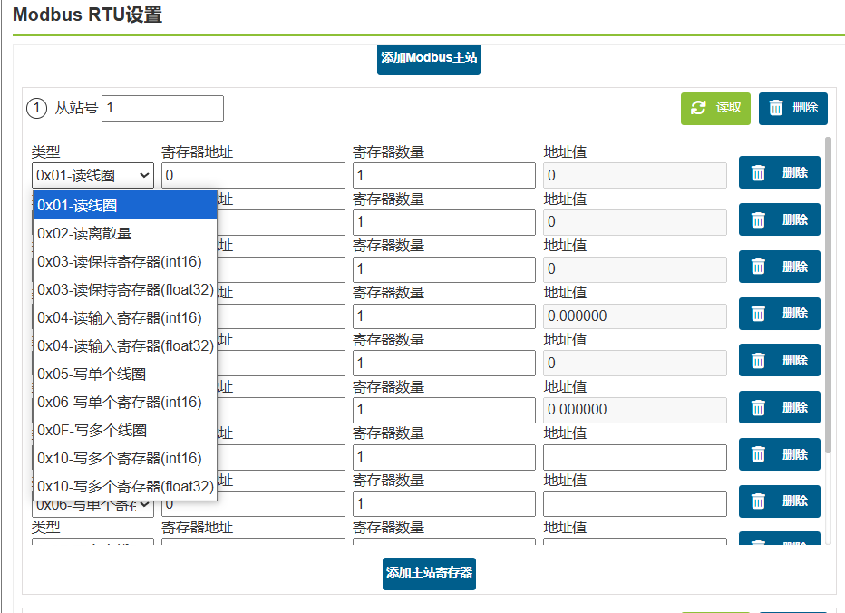

.. centered:: 圖表 9.30-9 添加多個主站寄存器

ModbusRTU主站通信測試
**********************************************************

機器人Modbus主站寄存器有「地址值」數值框用於顯示當前寄存器的值，其中0x01、0x02、0x03、0x04類型的寄存器為只讀類型，對應的地址值為灰色不可編輯數值框，當從站相應地址的數值改變時，機器人主站通過點擊讀取按鈕即可讀取對應寄存器地址值並同步顯示當前的數值。0x05、0x06、0x0F、0x10功能碼為寫入操作，它的地址為白色可編輯數值框，可以在機器人Modbus主站設置頁面修改該寄存器數值。
   
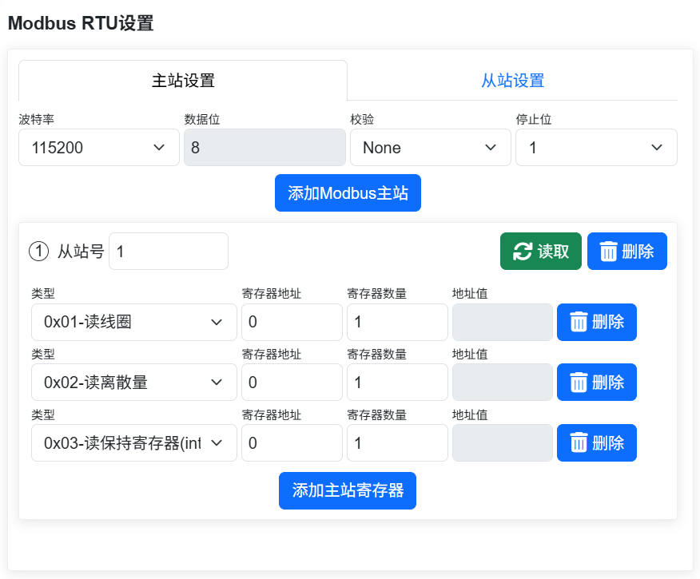

.. centered:: 圖表 9.30-10 Modbus主站地址值

主站讀取寄存器測試
""""""""""""""""""""""""""""""""""
對在外部ModbusRTU從站設備上，對地址為0x4000的線圈連續讀取10個，對地址為0x3000的離散量連續讀取12個，對地址為0x2010的保持寄存器採用int16連續讀兩個，對地址為0x1029的輸入寄存器讀一個浮點數。此時機器人Modbus主站設置頁面對應寄存器的地址值將進行相應的顯示，發送的數據幀如下圖(由於設置地址0x1029的寄存器讀取方式為浮點型，因此它實際讀取了0x1029和0x102A兩個16位寄存器來存儲一個浮點數，但是讀取數量設置為1即可)。
   
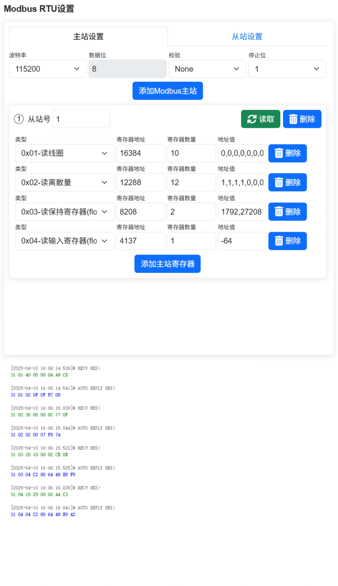

.. centered:: 圖表 9.30-11 Modbus主站顯示讀取的寄存器數值（指令幀截圖）

主站寫入寄存器測試
""""""""""""""""""""""""""""""""""

在機器人ModbusRTU主站設置頁面中，對地址0x1000寫單個線圈，寫入值為1；對0x1001地址寫單個寄存器，值為2001；對地址為0x2000寫5個線圈，值為1,1,0,1,1；對地址0x2010寫2個保持寄存器，數據類型為int16，值為3001、3002；對地址為0x1029寫一個浮點型的保持寄存器（實際為兩個16位寄存器），值為21.55；Modbus從站的相應寄存器地址已被寫入相應的數值。
   
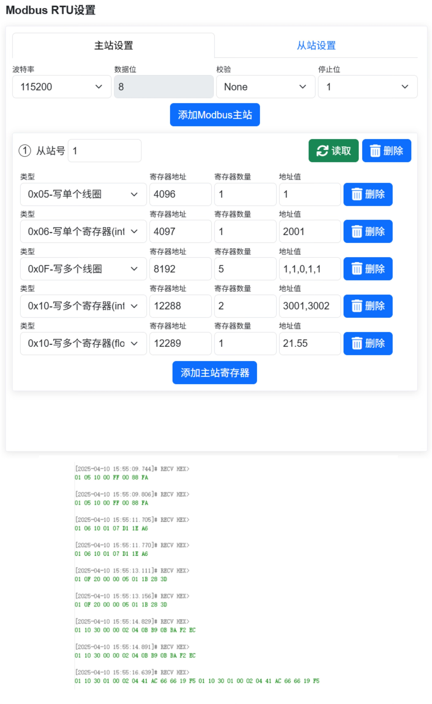

.. centered:: 圖表 9.30-12 ModbusRTU主站寫操作（指令幀截圖）

編寫ModbusRTU主站程序
************************************************

依次點擊「全部」、「通訊指令」，打開通訊指令添加頁面。
   
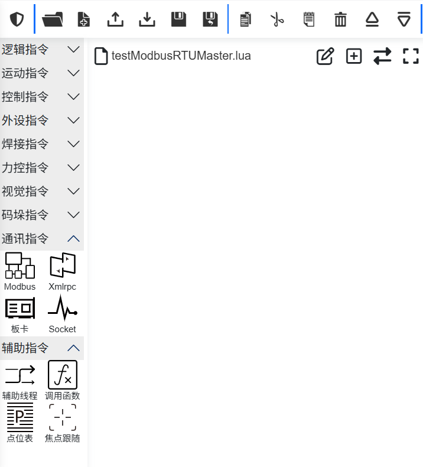

.. centered:: 圖表 9.30-13 打開通訊指令添加頁面

點擊「Modbus」。
   
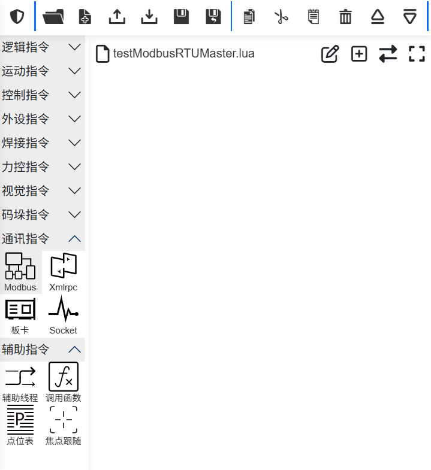

.. centered:: 圖表 9.30-14 選擇Modbus

點擊「Modbus_RTU」，選擇「主站(客戶端)」，打開ModbusRTU主站指令添加頁面。
   

.. centered:: 圖表 9.30-15 選擇Modbus_RTU

寫單個線圈
""""""""""""""""""""""""""""

選擇「寫寄存器」，功能碼為0x05-單個線圈，寄存器、線圈地址為0x1000，寄存器值、線圈數量為1，字節數組為{1}，點擊「添加」按鈕。最後翻至該頁面最底端，點擊「應用」按鈕(圖2-16)。
   
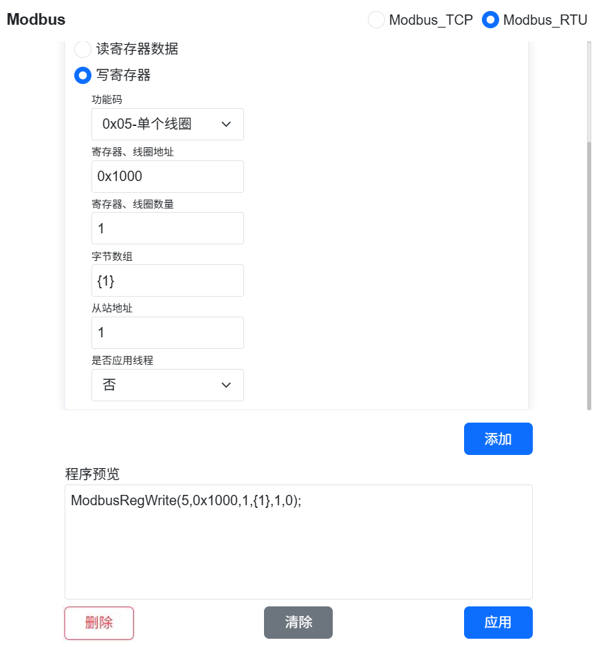

.. centered:: 圖表 9.30-16 寫單個線圈

此時機器人程序「testModbusRTUSlave.lua」中已經添加一條機器人Modbus主站寫單個數字輸出的指令，將機器人切換到自動模式，點擊啟動按鈕，機器人將主站將對應的線圈寄存器0x1000的地址值寫為1。
   
.. image:: coding/356.png
   :width: 6in
   :align: center

.. centered:: 圖表 9.30-17 寫單個線圈LUA程序

寫多個線圈
""""""""""""""""""""""""""""""""""""""""
選擇「寫寄存器」，功能碼為0x0F-多個線圈，寄存器、線圈地址為0x1010，寄存器值、線圈數量為3，字節數組為{1,0,1}，點擊「添加」按鈕。最後翻至該頁面最底端，點擊「應用」按鈕(圖2-18)。
   
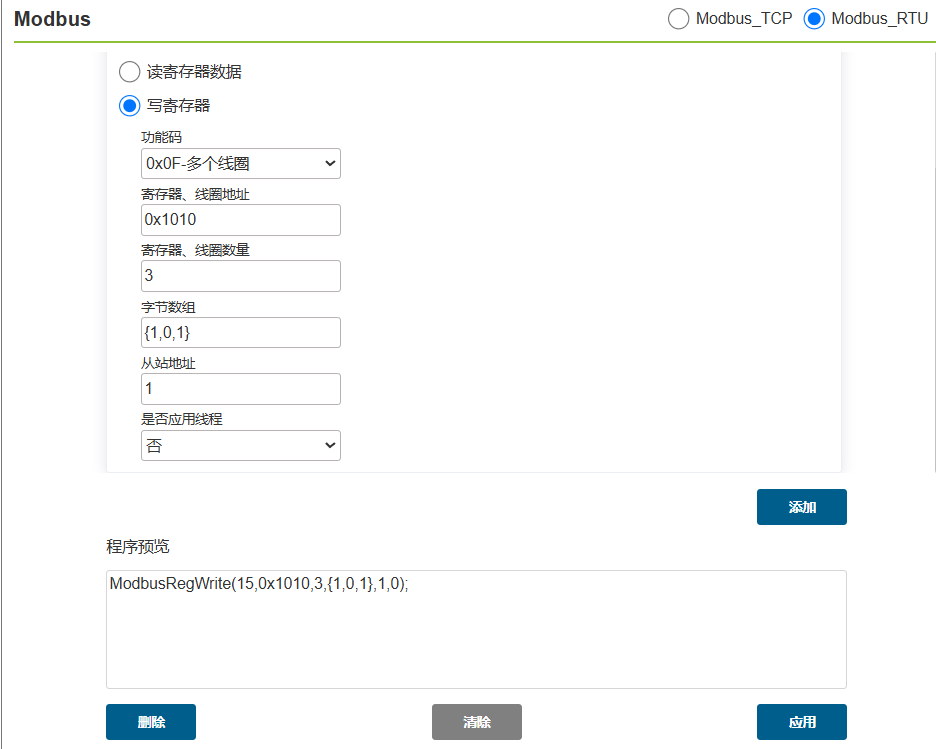

.. centered:: 圖表 9.30-18 寫多個線圈

此時機器人程序「testModbusRTUSlave.lua」中已經添加一條機器人Modbus主站寫單個數字輸出的指令，將機器人切換到自動模式，點擊啟動按鈕，機器人將主站將對應的線圈寄存器0x1000的地址值寫為1。
   
.. image:: coding/358.png
   :width: 4in
   :align: center

.. centered:: 圖表 9.30-19 寫多個線圈LUA程序

讀線圈、離散量
""""""""""""""""""""""""""""""

選擇「讀寄存器指令」，功能碼為0x01-線圈（如果需要讀離散量則選擇0x02-離散量），寄存器、線圈地址為0x2000，寄存器、線圈數量為3，點擊「添加」按鈕。同時選擇「讀寄存器數據」，寄存器、線圈、離散量數量為3，點擊「添加」按鈕。最後翻至該頁面最底端，點擊「應用」按鈕(圖2-20)。
   
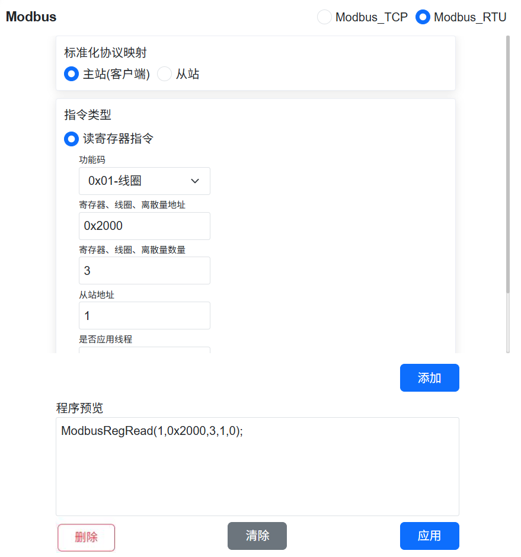
   

.. centered:: 圖表 9.30-20 讀線圈

此時機器人程序「testModbusRTUSlave.lua」中已經添加兩條機器人Modbus主站讀線圈的指令。
   
.. image:: coding/360.png
   :width: 6in
   :align: center

.. centered:: 圖表 9.30-21 讀單個線圈程序

通常讀Modbus寄存器後將讀到的數值存入變量裡，因此需要定義一個變量用於存儲讀取的數值。點擊「切換模式」按鈕，將機器人lua程序切換至可編輯狀態，在「ModbusRegRead」指令前編寫填加返回值變量「value1」、「value2」、「value3」，執行程序後讀到的數值將存在「value1」、「value2」、「value3」裡。
   
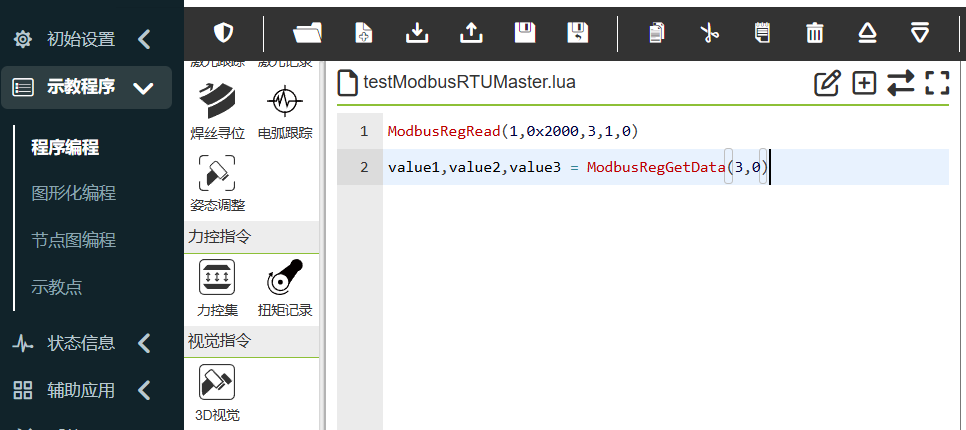

.. centered:: 圖表 9.30-22 讀多個線圈值存入變量

線圈和離散輸入類型的寄存器值只有0和1兩種數值，在機器人程序中可以通過判斷寄存器數值不同來進行不同的操作。

讀保持寄存器、輸入寄存器
""""""""""""""""""""""""""""""""""""""""""""""
選擇「讀寄存器指令」，功能碼為0x03-線圈（如果需要讀輸入寄存器則選擇0x04-輸入寄存器），寄存器、線圈地址為0x4000，寄存器、線圈數量為5，點擊「添加」按鈕。同時選擇「讀寄存器數據」，寄存器、線圈、離散量數量為5，點擊「添加」按鈕。最後翻至該頁面最底端，點擊「應用」按鈕(圖2-23)。
   
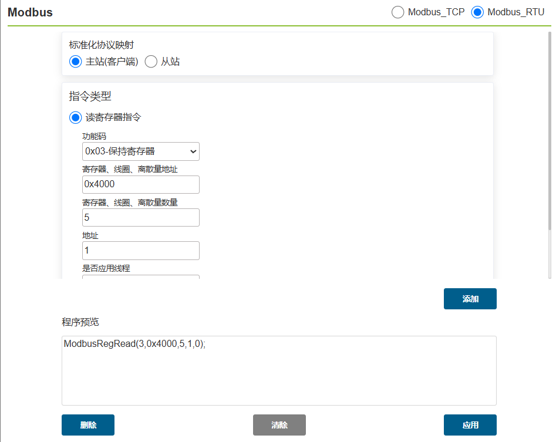
   
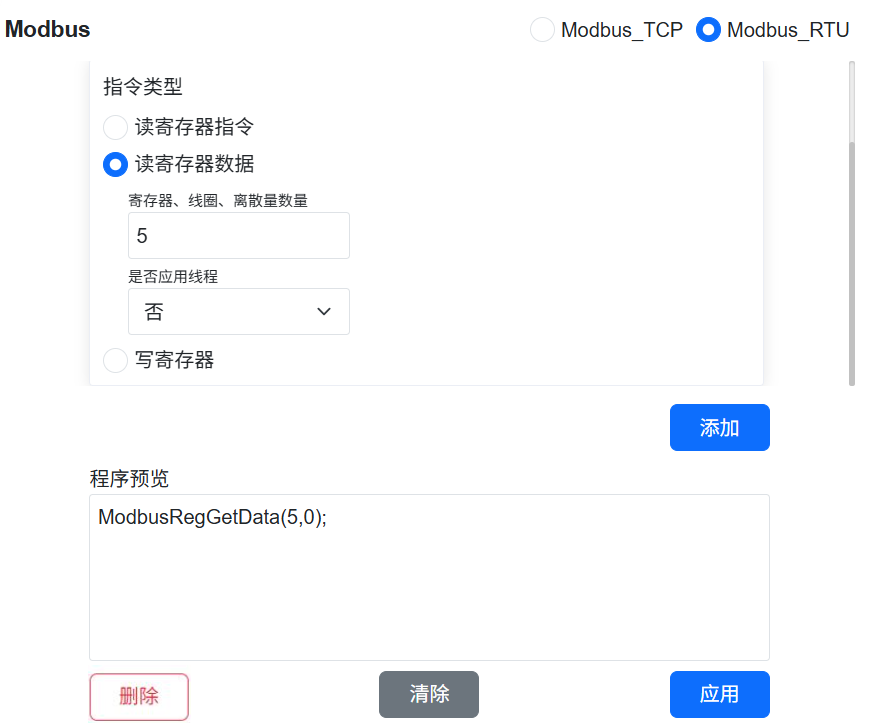

.. centered:: 圖表 9.30-23 讀保持寄存器

此時機器人程序「testModbusRTUSlave.lua」中已經添加兩條機器人Modbus主站讀線圈的指令。
   
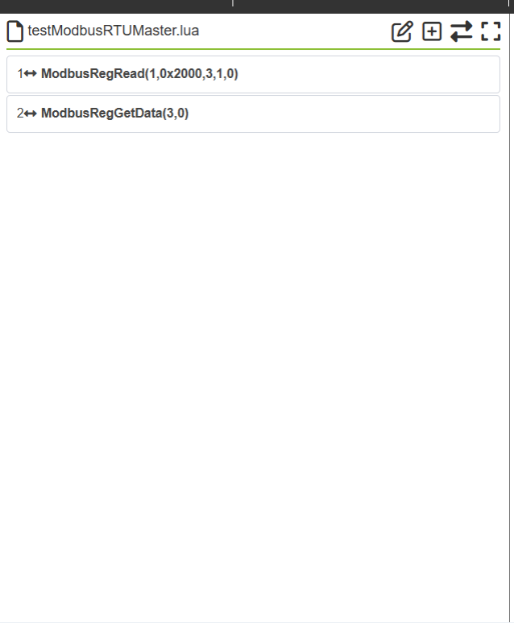

.. centered:: 圖表 9.30-24 讀單個線圈程序

通常讀Modbus寄存器後將讀到的數值存入變量裡，因此需要定義變量用於存儲讀取的數值。點擊「切換模式」按鈕，將機器人lua程序切換至可編輯狀態，在「ModbusRegRead」指令前編寫填加返回值變量「value1」、「value2」、「value3」 、「value4」 、「value5」，執行程序後讀到的數值將存在「value1」、「value2」、「value3」 、「value4」 、「value5」裡。
   
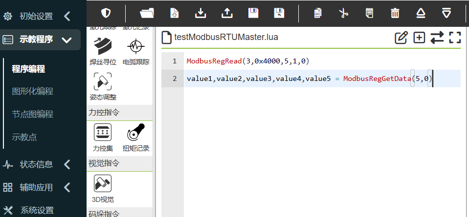

.. centered:: 圖表 9.30-25 讀多個保持寄存器值存入變量

機器人ModbusRTU從站相關操作說明
+++++++++++++++++++++++++++++++++++++++++++++++++++

機器人ModbusRTU從站提供通用數字輸入(線圈)，通用數字輸出(離散輸入)，通用模擬輸入(保持寄存器)和通用模擬輸出(輸入寄存器)四種類型的寄存器，其中通用數字輸入和模擬輸入主要用於機器人讀取外部ModbusRTU主站數據從而控制機器人操作，而通用數字輸出和模擬輸出主要用於機器人向外部ModbusRTU主站設備發送數據信號，由外部主站設備讀取相關寄存器數值進而控制其設備運行。

除上述通用輸入輸出外，機器人還提供部分「功能數字輸入(線圈)」用於外部主站設備控制機器人啟動程序、停止程序等操作，提供部分輸入寄存器用於顯示當前機器人的狀態信息，包括機器人當前笛卡爾位置、機器人當前運行狀態等(具體定義請查看附件一：ModbusRTU從站地址映射表)。機器人ModbusRTU從站使用過程主要包括：①參數配置；②通訊測試；③程序編寫。

ModbusRTU從站通訊參數配置
******************************************************

打開WebApp，依次點擊「示教模擬」、「程序示教」，新建用戶程序「testModbusRTUSlave.lua」。
   
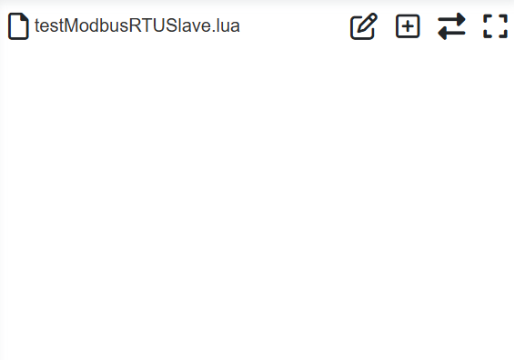

.. centered:: 圖表 9.30-26 創建ModbusRTU從站用戶程序

點擊「ModbusRTU設置」按鈕，打開ModbusRTU功能配置頁面。
   
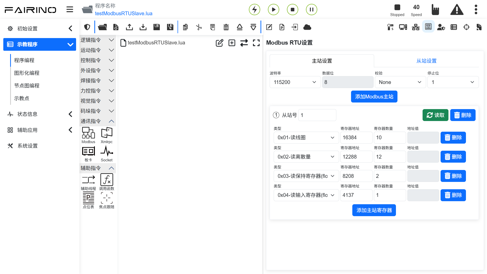

.. centered:: 圖表 9.30-27 打開ModbusRTU設置

依次點擊「從站設置」，輸入機器人從站的波特率、數據位、校驗、停止位和從站號，其中「波特率」、「數據位」、「校驗」、「停止位」為機器人作為ModbusRTU從站的參數配置。「從站號」為外部主站發送指令的從站設備號。
   
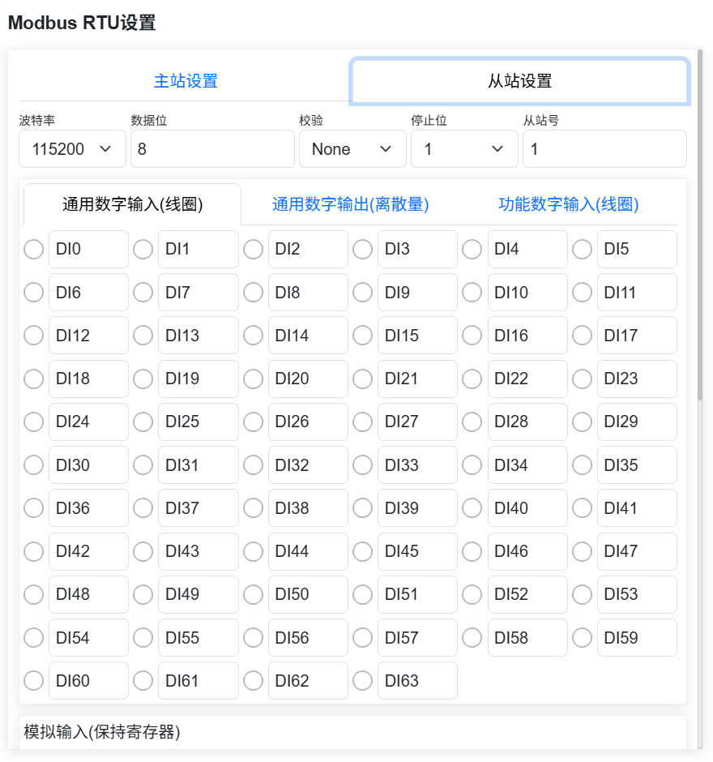

.. centered:: 圖表 9.30-28 ModbusRTU從站設置

ModbusRTU從站通訊測試
****************************************

通用數字輸入(線圈)
""""""""""""""""""""""""""""""""""""""""""""""
機器人ModbusRTU從站提供64個線圈寄存器，它們的寄存器地址為0x4000~0x403F(具體定義請查看附件一：ModbusRTU從站地址映射表)。機器人ModbusRTU從站的通用寄存器均可設置別名，修改機器人從站線圈寄存器DI0的名稱為「A到位」，DI1的名稱為「B到位」，根據地址映射表，「A到位」和「B到位」的Modbus線圈地址分別為0x4000和0x4001，在外部ModbusRTU主站設備上將機器人從站線圈寄存器地址0x4000和0x4001都置1，此時機器人ModbusRTU從站監控頁面上兩寄存器指示燈亮起。
   
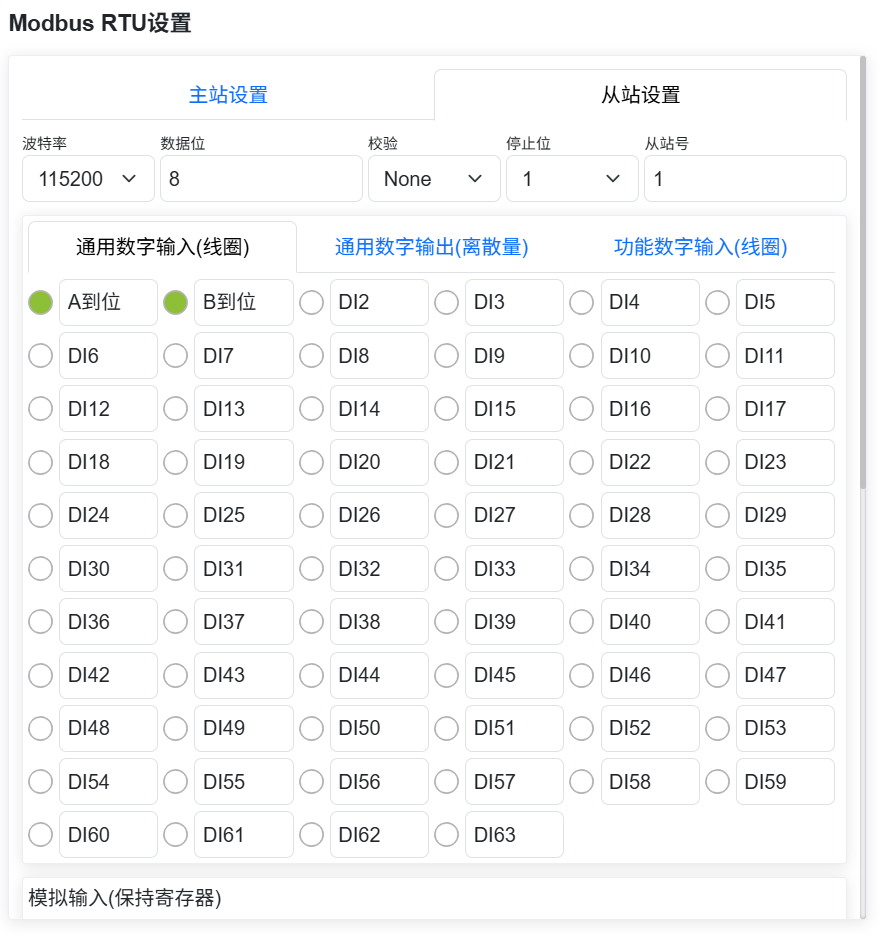

.. centered:: 圖表 9.30-29 ModbusRTU從站線圈狀態監控（指令幀截圖）

通用數字輸出(離散輸入)
""""""""""""""""""""""""""""""""""""""""""""""

機器人ModbusRTU從站提供64個離散輸入寄存器，它們的寄存器地址為0x3000-0x303F(具體定義請查看附件一：ModbusRTU從站地址映射表)。同樣機器人ModbusRTU從站的離散輸入寄存器也可以設置別名，點擊「通用數字輸出(離散輸入)」修改機器人從站離散輸入寄存器DO0的名稱為「A啟動」，DO1的名稱為「B啟動」，根據地址映射表，「A啟動」和「B啟動」的Modbus離散輸入地址分別為0x3000和0x3001，點擊「A啟動」對應離散輸入指示燈，該指示燈亮起，相應寄存器地址0x3000的數值變為1，從外部ModbusRTU主站設備上可讀到該寄存器數值。
   
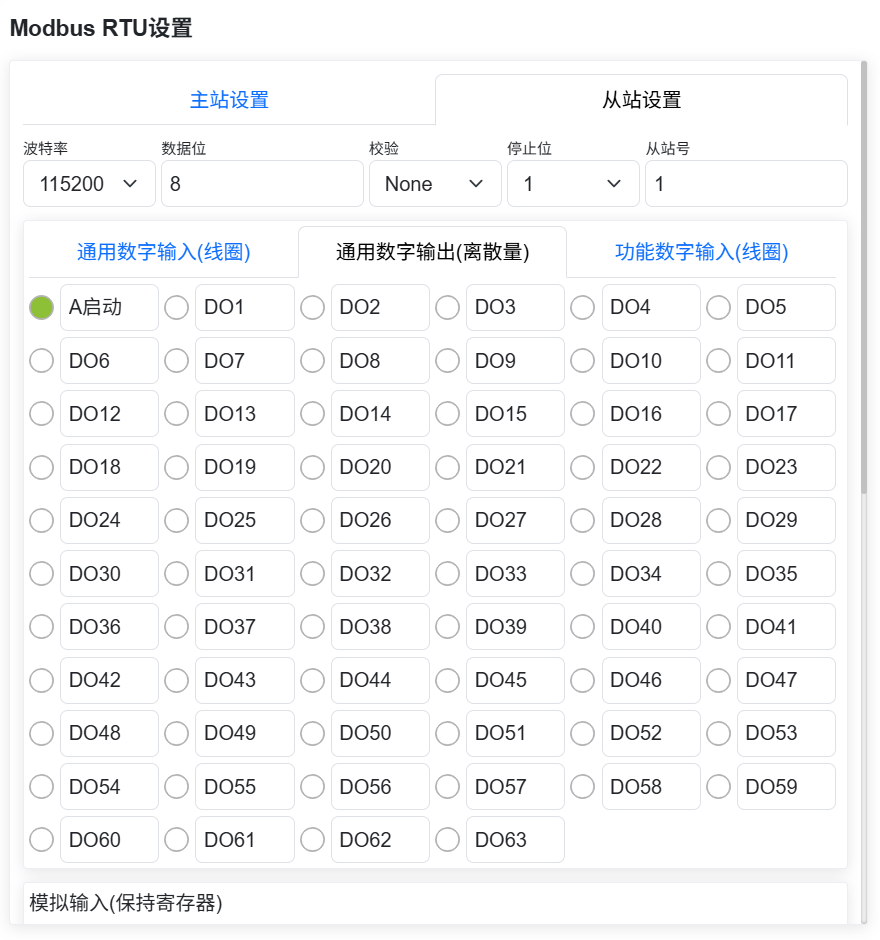

.. centered:: 圖表 9.30-30 ModbusRTU從站離散輸入控制

模擬輸入(保持寄存器)
""""""""""""""""""""""""""""""""""""""""
機器人提供無符號、有符號和浮點型三種類型的保持寄存器共32個，AI0~AI32的地址為0x2000-0x202F(具體定義請查看附件一：ModbusRTU從站地址映射表)，其中有符號型寄存器數據範圍為-32768~32767，浮點型寄存器為大端顯示。更改AI0和AI1的名稱分別為「電壓」和「電流」，從ModbusRTU從站地址映射表中查出兩寄存器的地址分別為0x2000和0x2001，因此當連接的主站設備修改保持寄存器0x2000和0x2001寄存器地址值時，機器人ModbusRTU從站監控頁面「電壓」和「電流」寄存器地址值相應同步更新顯示，機器人的模擬輸入主要用於機器人獲取外部主站設備數值信號。
   
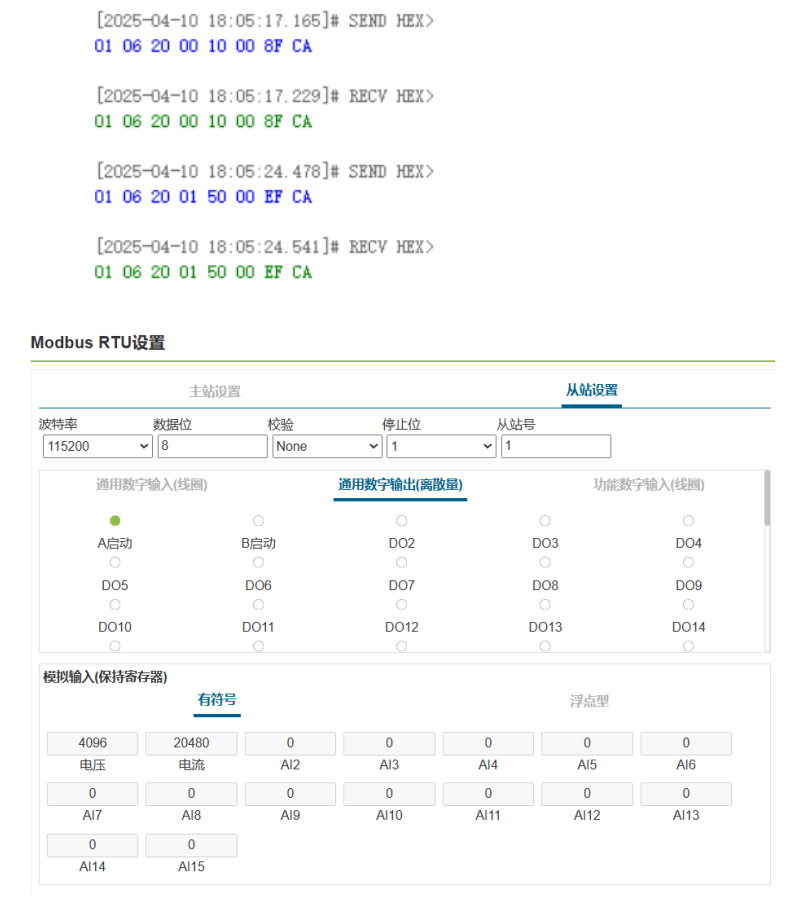

.. centered:: 圖表 9.30-31 ModbusRTU從站模擬輸入監控（指令幀截圖）

模擬輸出(輸入寄存器)
""""""""""""""""""""""""""""""""""""""""
機器人提供無符號、有符號和浮點型三種類型的輸入寄存器共64個，AO0~AO63的地址為0x1000-0x100F、0x104D-0x106C(具體定義請查看附件一：ModbusRTU從站地址映射表)，其中有符號型寄存器數據範圍為-32768~32767，浮點型寄存器為大端顯示。更改AO0和AO1的名稱分別為「目標位置A」和「目標位置B」，輸入量寄存器數值分別為2000和1500，從ModbusRTU從站地址映射表中查出兩寄存器的地址分別為0x1000和0x1001，因此當連接的主站設備讀取輸入寄存器0x1000和0x1001寄存器地址值時，即可得到所設置的數值，機器人從站模擬輸出主要用於機器人向外部主站設備傳遞數值信號。
   
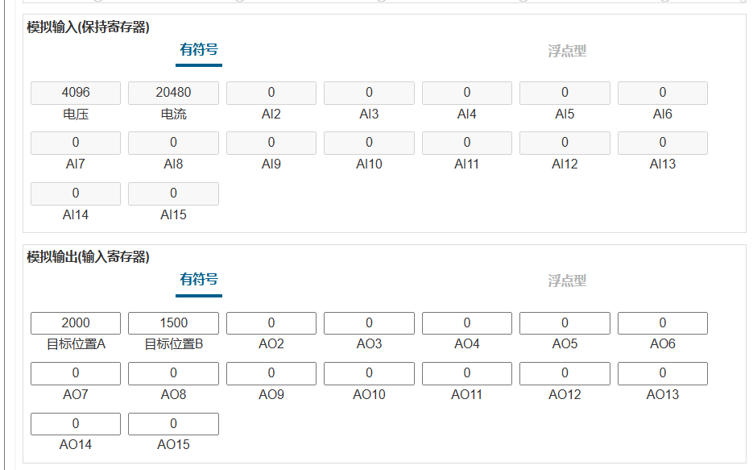

.. centered:: 圖表 9.30-32 Modbus從站修改模擬輸入

ModbusRTU從站程序編寫
**************************************************
依次點擊「全部」、「通訊指令」，打開通訊指令添加頁面。
   
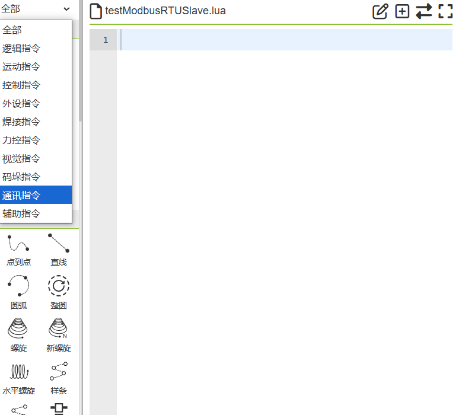

.. centered:: 圖表 9.30-33 打開通訊指令添加頁面

點擊「Modbus」。
   
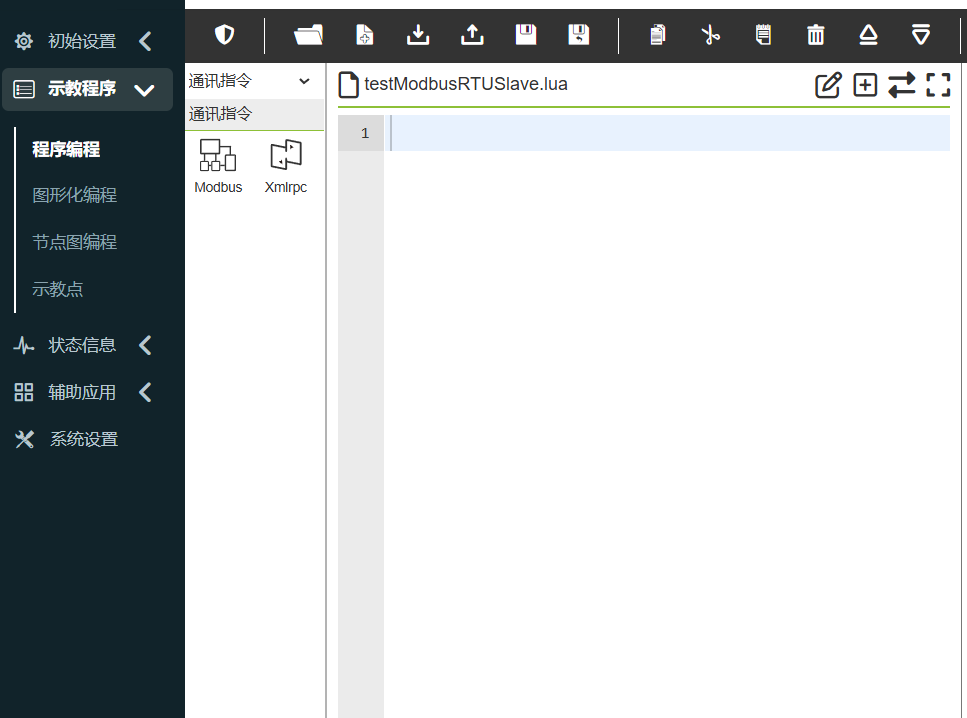

.. centered:: 圖表 9.30-34 選擇Modbus

點擊「Modbus_RTU」 ，選擇「從站」，打開ModbusRTU從站指令添加頁面(圖60)。。
   

.. centered:: 圖表 9.30-35 選擇Modbus_RTU、從站

寫單個數字輸出DO(離散輸入)
""""""""""""""""""""""""""""""""""""""""""""""""
選擇DO名稱為「A啟動」，寄存器數量為1，寄存器值為0，點擊「寫單個數字輸出」。最後翻至該頁面最底端，點擊「應用」按鈕。
   
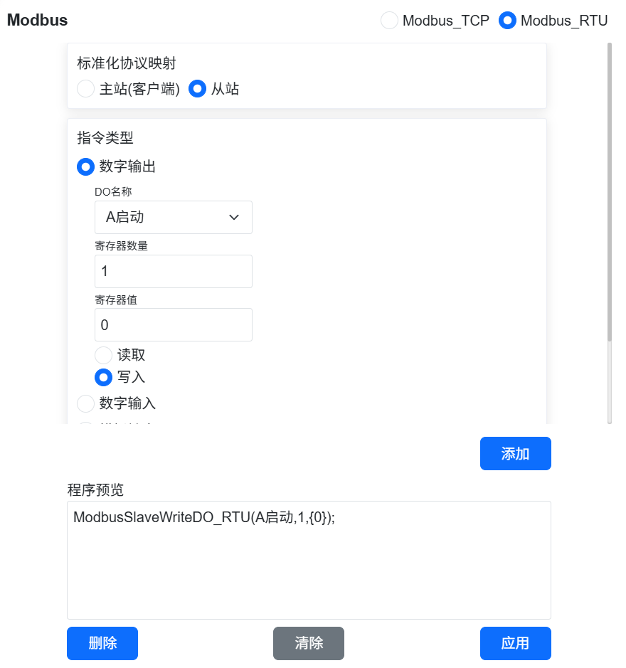

.. centered:: 圖表 9.30-36 添加寫單個數字輸出指令、應用寫單個數字輸出指令

此時機器人程序「testModbusRTUSlave.lua」中已經添加一條機器人Modbus從站寫單個數字輸出的指令，將機器人切換到自動模式，點擊啟動按鈕，機器人將名稱為「A啟動」對應的數字輸出的地址值寫為0。
   

.. centered:: 圖表 9.30-37 寫單個數字輸出LUA程序

寫多個數字輸出DO(離散輸入)
""""""""""""""""""""""""""""""""""""""""""""""""""""""""
打開ModbusRTU從站指令添加頁面，找到「數字輸出設置」，選擇DO名稱為「A啟動」，寄存器數量為5，寄存器值為1,0,1,0,1，其中寄存器值的個數要與設置的寄存器數量對應，且多個寄存器值之間用英文逗號隔開，點擊「寫數字輸出」。最後翻至該頁面最底端，點擊「應用」按鈕。
   
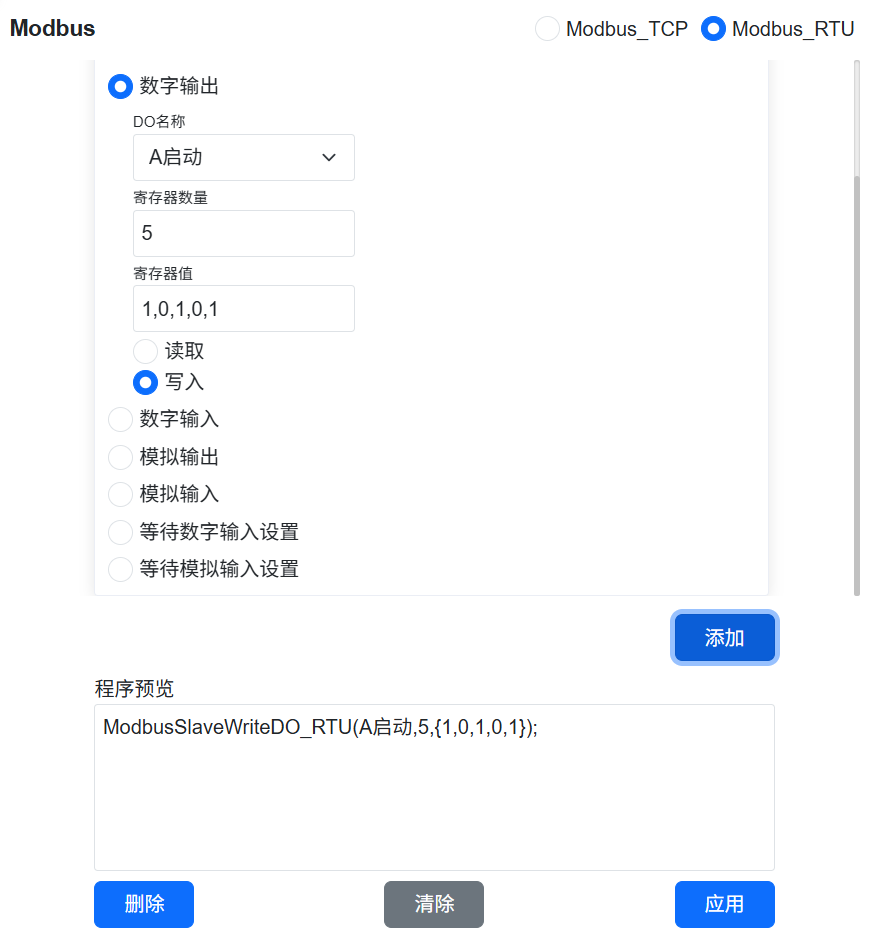

.. centered:: 圖表 9.30-38 配置寫多個數字輸出、應用寫多個數字輸出

此時機器人程序「testModbusRTUSlave.lua」中已經添加一條機器人Modbus從站寫多個數字輸出的指令，將機器人切換到自動模式，點擊啟動按鈕，機器人將從站「A啟動」其後面4個離散輸入寄存器的值分別寫為1、0、1、0、1。
   
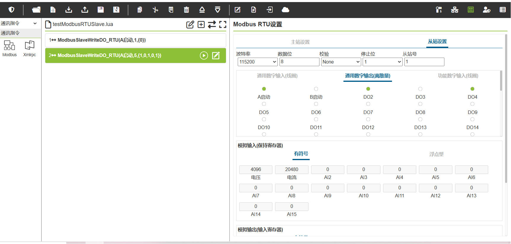

.. centered:: 圖表 9.30-39 寫多個數字輸出LUA程序

讀單個數字輸出DO(離散輸入)
""""""""""""""""""""""""""""""""""""""""""""""
打開ModbusRTU主站指令添加頁面，找到「數字輸出設置」，DO名稱為「A啟動」，寄存器數量為1，寄存器值不需要填寫，點擊「讀數字輸出」。最後翻至該頁面最底端，點擊「應用」按鈕。
   

.. centered:: 圖表 9.30-40 配置讀單個數字輸出、應用讀單個數字輸出

此時機器人程序「testModbusRTUSlave.lua」中已經添加一條機器人Modbus從站讀單個數字輸出的指令。
   
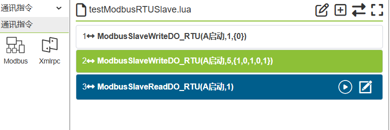

.. centered:: 圖表 9.30-41 讀單個數字輸出程序

通常讀Modbus寄存器後將讀到的數值存入變量裡，因此需要定義一個變量用於存儲讀取的數值。點擊「切換模式」按鈕，將機器人lua程序切換至可編輯狀態，在「ModbusSlaveReadDO_RTU」指令前編寫填加返回值變量「AStartValue」，執行程序後讀到的數值將存在「AStartValue」裡。
   
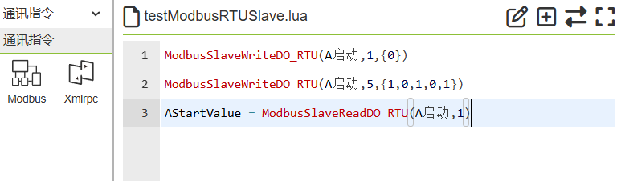

.. centered:: 圖表 9.30-42 讀單個數字輸出存入變量

線圈類型的寄存器值只有0和1兩種數值，在機器人程序中可以通過判斷寄存器數值不同來進行不同的操作。

讀多個數字輸出DO(離散輸入)
""""""""""""""""""""""""""""""""""""""""""""""""

打開ModbusRTU主站指令添加頁面，找到「數字輸出設置」，選擇DO名稱為「A啟動」，寄存器數量為2，寄存器值不需要填寫，點擊「讀數字輸出」。最後翻至該頁面最底端，點擊「應用」按鈕。
   
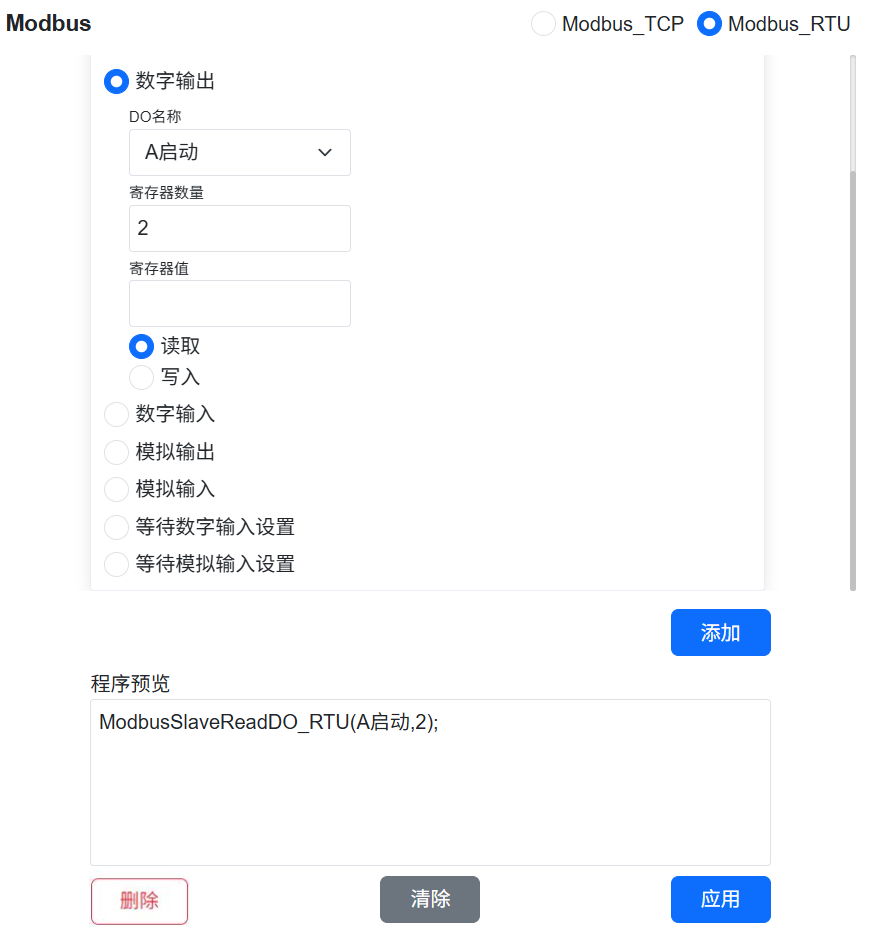

.. centered:: 圖表 9.30-43 配置讀多個數字輸出、應用讀多個數字輸出

此時機器人程序「testModbusRTUSlave.lua」中已經添加一條機器人Modbus從站讀多個數字輸出的指令。
   
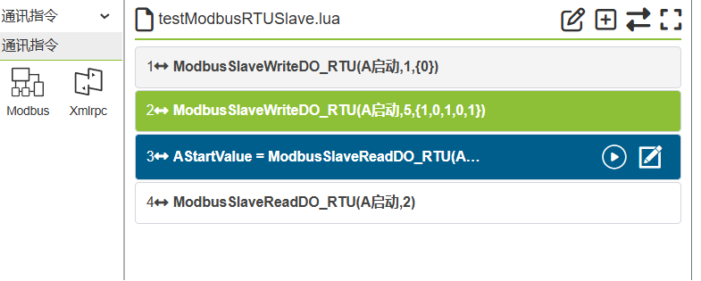

.. centered:: 圖表 9.30-44 讀多個數字輸出程序

點擊「切換模式」按鈕，將機器人lua程序切換至可編輯狀態，由於讀取的數量為2個，因此需要在「ModbusSlaveReadDO_RTU」指令前編寫填加2個返回值變「value1,value2」，執行程序後讀到的2個數字輸出寄存器數值將分別存在上述2個變量裡，同樣您可以判斷「value1」、「value2」的值使機器人進行不同的動作。
   
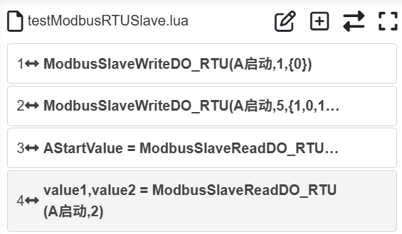

.. centered:: 圖表 9.30-45 讀多個數字輸出存入變量

讀數字輸入DI(線圈)
"""""""""""""""""""""""""""""""""""""""""""

打開ModbusRTU從站指令添加頁面，找到「數字輸入設置」，選擇DI名稱為「A到位」，寄存器數量為2，點擊「讀數字輸入」。最後翻至該頁面最底端，點擊「應用」按鈕。
   
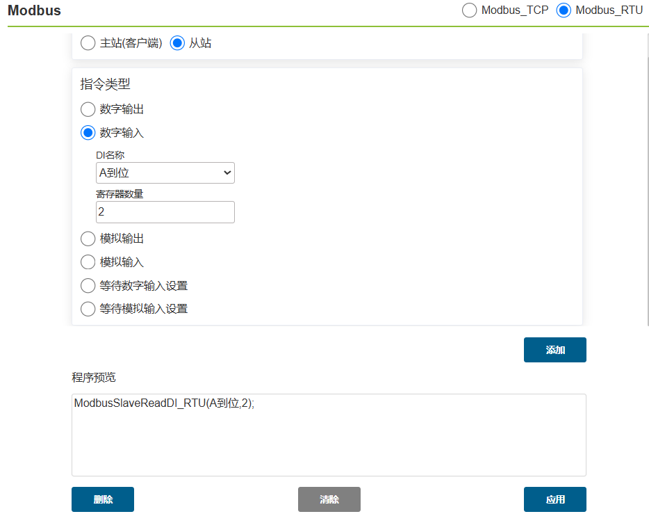

.. centered:: 圖表 9.30-46 配置讀數字輸入、應用讀數字輸入

此時機器人程序「testModbusRTUSlave.lua」中已經添加一條機器人Modbus從站讀數字輸入的指令。
   
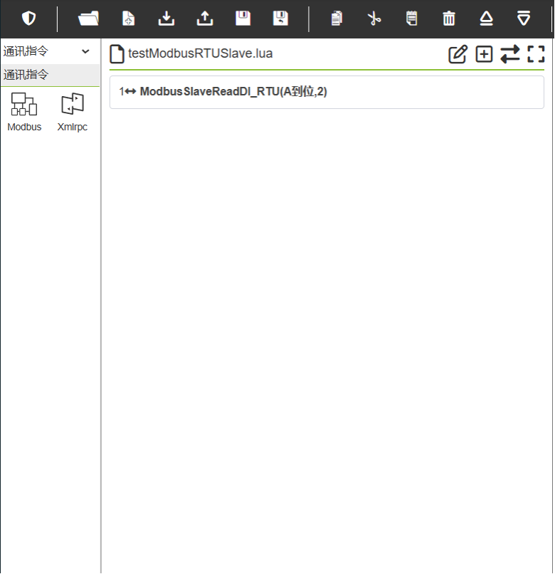

.. centered:: 圖表 9.30-47 讀數字輸入程序指令

點擊「切換模式」按鈕，將機器人lua程序切換至可編輯狀態，在「ModbusSlaveReadDI_RTU」指令前編寫返回值變量「AState,BState」，執行程序後讀到的兩個數字輸入數值將分別存在變量「AState」和「BState」裡，您可以通過判斷變量數值進而控制機器人做不同的操作。
   
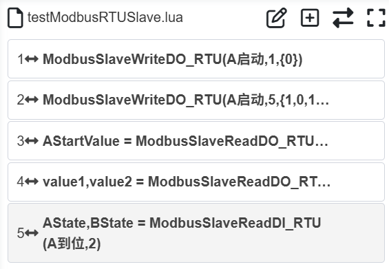

.. centered:: 圖表 9.30-48 讀數字輸入程序

模擬輸出AO(輸入寄存器)和模擬輸入AI(保持寄存器)的讀寫操作
""""""""""""""""""""""""""""""""""""""""""""""""""""""""""""""""""""""""""""""""""""""""""""""""""""""""""""""""""

模擬輸出(輸入寄存器)、模擬輸入(保持寄存器)的讀寫操作與數字輸出(離散輸入)、數字輸入(線圈)的操作基本一致，區別在於後者的數據範圍僅限於0或1，而前者的數據範圍更大，因此具體的操作可參考數字輸出和數字輸入程序的編寫，在此僅展示模擬輸入的讀操作(圖3-24)和模擬輸出的讀寫操作(圖3-25)程序示例。
   
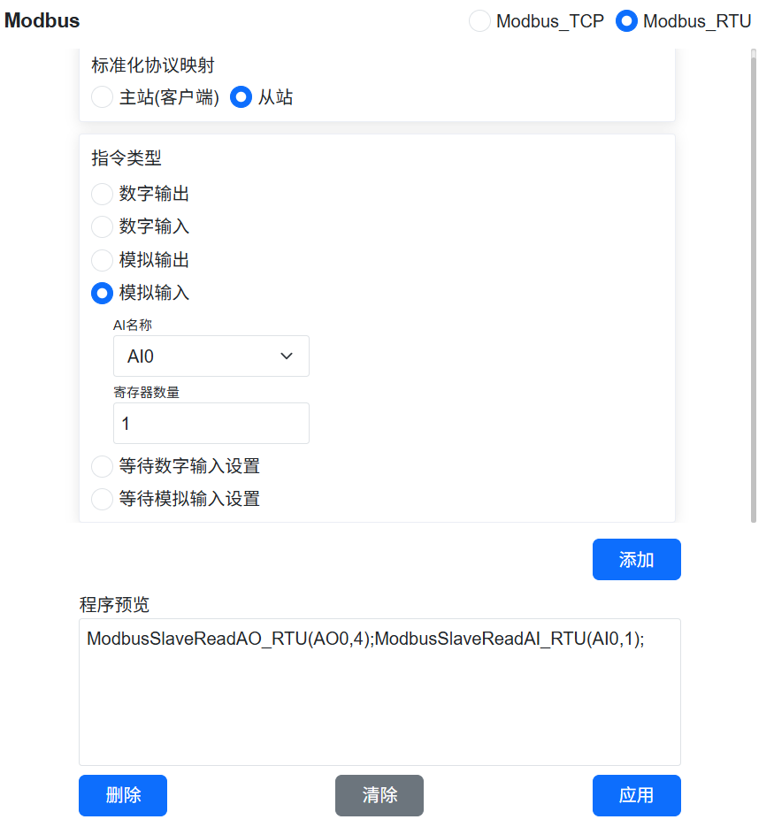

.. centered:: 圖表 9.30-49 讀模擬輸入
   
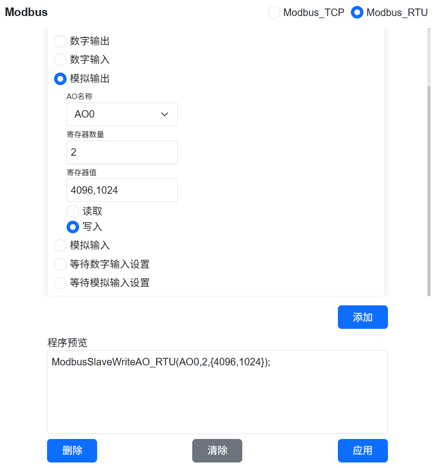

.. centered:: 圖表 9.30-50 讀寫模擬輸出

等待數字輸入
""""""""""""""""""""""""""""""""""""""""""""""""""""""
打開ModbusRTU從站指令添加頁面，找到「等待數字輸入設置」，選擇DI名稱為配置的「A到位」寄存器，等待狀態為「True」，超時時間為5000ms。點擊「添加」按鈕，最後點擊「應用」按鈕。
   
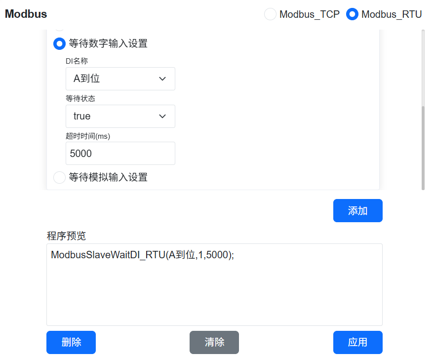

.. centered:: 圖表 9.30-51 添加等待數字輸入指令

此時機器人程序「testModbusRTUSlave.lua」中已經添加一條機器人Modbus從站等待數字輸入的指令，啟動程序後，機器人會一直等待從站的「A到位」線圈寄存器值變為true，也就是數值1，由於設置的超時時間為5s，因此當機器人等待5s後「A到位」信號仍為0時，機器人程序將會報超時錯誤，程序也自動停止運行。
   
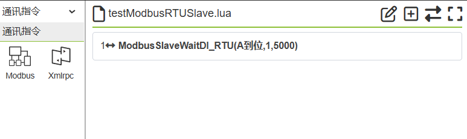

.. centered:: 圖表 9.30-52 等待數字輸入程序

等待模擬輸入
""""""""""""""""""""""""""""""""""
打開ModbusRTU從站指令添加頁面，找到「等待模擬輸入設置」選擇AI名稱為配置的「電流」寄存器，等待狀態為「>」，寄存器值為255，超時時間為5000ms。點擊「添加」按鈕，最後點擊「應用」按鈕。
   
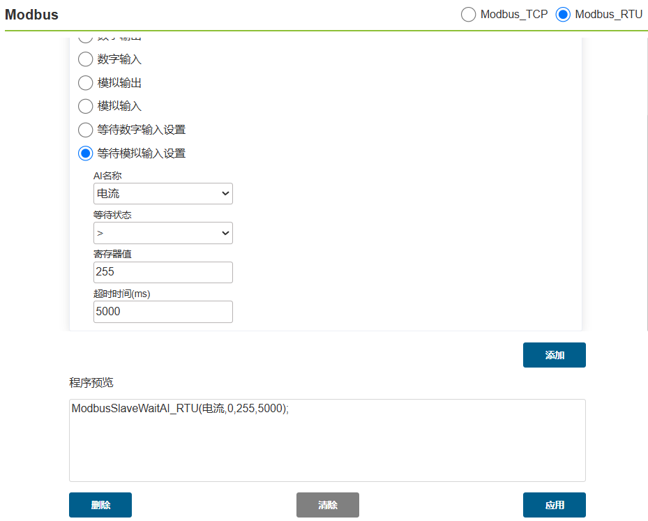

.. centered:: 圖表 9.30-53 添加等待模擬輸入指令

此時機器人程序「testModbusRTUSlave.lua」中已經添加一條機器人Modbus從站等待模擬輸入值的指令，啟動程序後，機器人會一直等待從站的「電流」寄存器數值大於255，由於設置的超時時間為5s，因此當機器人等待5s後「電流」信號仍不大於255時，機器人程序將會報超時錯誤，程序也自動停止運行。
   
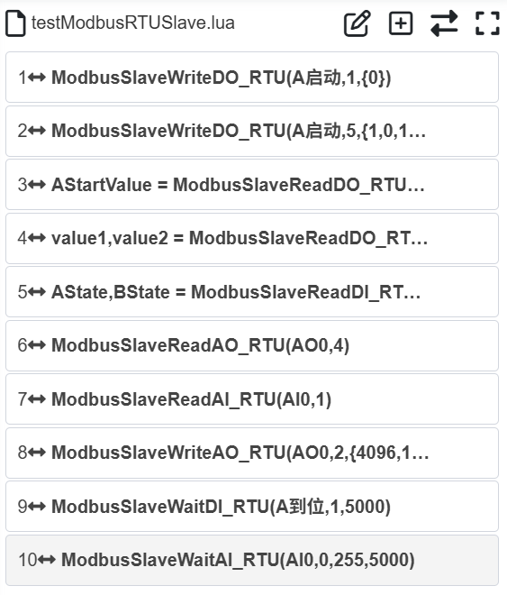

.. centered:: 圖表 9.30-54 等待模擬輸入寄存器程式

ModbusRTU從站機器人狀態反饋與控制
***********************************************************************************
協作機器人ModbusRTU從站輸入寄存器地址0x1010-0x104C用於反饋機器人實時狀態（具體地址定義見附件一：ModbusRTU從站地址映射表），您只需要用主站設備讀取對應寄存器的數值即可獲取對應的機器人實時狀態數據。

協作機器人ModbusRTU從站線圈寄存器地址0x4040-0x405C用於主站設備對機器人進行控制（具體地址定義見附件一：ModbusRTU從站地址映射表）。以線圈地址0x4054為例，該地址功能表示「啟動程式」，當機器人處於自動模式下，主站設備將地址0x4054的值從0置1時，機器人自動開始運行當前配置的程式；再以線圈地址0x4040為例，它用於控制機器人控制箱DO0的輸出，當外部主站將線圈地址0x4040從0置1時，控制箱DO0自動輸出有效，同樣外部主站將線圈地址0x4040從1置0時，控制箱DO0輸出無效。在ModbusRTU從站設置頁面點擊「功能數字輸入(線圈)」，即可監控當前所有的功能數字輸入情況。

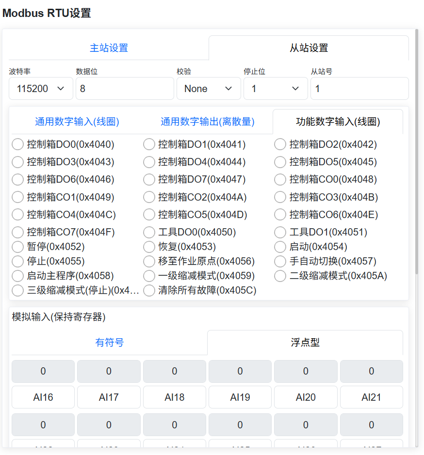

.. centered:: 圖表 9.30-55 機器人從站功能數字輸入

附件一：Modbus從站地址映射表

.. list-table::
   :widths: 15 20 25 15 20 10
   :header-rows: 0
   :align: center

   * - **第三方控制器下發地址**
     - **類型**
     - **名稱**
     - **數據類型**
     - **功能碼**
     - **讀/寫**

   * - 0x3000
     - 通用數字輸出（離散）
     - DO0
     - BOOL 
     - 0x02 
     - 唯讀  

   * - 0x3001
     - 通用數字輸出（離散）
     - DO1
     - BOOL 
     - 0x02 
     - 唯讀  

   * - 0x3002
     - 通用數字輸出（離散）
     - DO2
     - BOOL 
     - 0x02 
     - 唯讀  

   * - 0x3003
     - 通用數字輸出（離散）
     - DO3
     - BOOL 
     - 0x02 
     - 唯讀  

   * - ...
     - 通用數字輸出（離散）
     - ...
     - BOOL 
     - 0x02 
     - 唯讀  

   * - 0x303F
     - 通用數字輸出（離散）
     - DO127
     - BOOL 
     - 0x02 
     - 唯讀  

   * - 0x4000
     - 通用數字輸入（線圈）
     - DI0
     - BOOL 
     - 0x01、0x05、0x0F 
     - 讀寫  

   * - 0x4001
     - 通用數字輸入（線圈）
     - DI1
     - BOOL 
     - 0x01、0x05、0x0F 
     - 讀寫  

   * - 0x4002
     - 通用數字輸入（線圈）
     - DI2
     - BOOL 
     - 0x01、0x05、0x0F 
     - 讀寫  

   * - 0x4003
     - 通用數字輸入（線圈）
     - DI3
     - BOOL 
     - 0x01、0x05、0x0F 
     - 讀寫  

   * - ...
     - 通用數字輸入（線圈）
     - ...
     - BOOL 
     - 0x01、0x05、0x0F 
     - 讀寫  

   * - 0x403F
     - 通用數字輸入（線圈）
     - DI64
     - BOOL 
     - 0x01、0x05、0x0F 
     - 讀寫  

   * - 0x4040
     - 機器人控制
     - 控制箱DO0
     - BOOL 
     - 0x01、0x05、0x0F 
     - 讀寫  

   * - 0x4041
     - 機器人控制
     - 控制箱DO1
     - BOOL 
     - 0x01、0x05、0x0F 
     - 讀寫  

   * - 0x4042
     - 機器人控制
     - 控制箱DO2
     - BOOL 
     - 0x01、0x05、0x0F 
     - 讀寫  

   * - 0x4043
     - 機器人控制
     - 控制箱DO3
     - BOOL 
     - 0x01、0x05、0x0F 
     - 讀寫  

   * - 0x4044
     - 機器人控制
     - 控制箱DO4
     - BOOL 
     - 0x01、0x05、0x0F 
     - 讀寫  

   * - 0x4045
     - 機器人控制
     - 控制箱DO5
     - BOOL 
     - 0x01、0x05、0x0F 
     - 讀寫  

   * - 0x4046
     - 機器人控制
     - 控制箱DO6
     - BOOL 
     - 0x01、0x05、0x0F 
     - 讀寫  

   * - 0x4047
     - 機器人控制
     - 控制箱DO7
     - BOOL 
     - 0x01、0x05、0x0F 
     - 讀寫  

   * - 0x4048
     - 機器人控制
     - 控制箱CO0
     - BOOL 
     - 0x01、0x05、0x0F 
     - 讀寫  

   * - 0x4049
     - 機器人控制
     - 控制箱CO1
     - BOOL 
     - 0x01、0x05、0x0F 
     - 讀寫  

   * - 0x404A
     - 機器人控制
     - 控制箱CO2
     - BOOL 
     - 0x01、0x05、0x0F 
     - 讀寫  

   * - 0x404B
     - 機器人控制
     - 控制箱CO3
     - BOOL 
     - 0x01、0x05、0x0F 
     - 讀寫  

   * - 0x404C
     - 機器人控制
     - 控制箱CO4
     - BOOL 
     - 0x01、0x05、0x0F 
     - 讀寫  

   * - 0x404D
     - 機器人控制
     - 控制箱CO5
     - BOOL 
     - 0x01、0x05、0x0F 
     - 讀寫  

   * - 0x404E
     - 機器人控制
     - 控制箱CO6
     - BOOL 
     - 0x01、0x05、0x0F 
     - 讀寫  

   * - 0x404F
     - 機器人控制
     - 控制箱CO7
     - BOOL 
     - 0x01、0x05、0x0F 
     - 讀寫  

   * - 0x4050
     - 機器人控制
     - 工具DO0
     - BOOL 
     - 0x01、0x05、0x0F 
     - 讀寫  

   * - 0x4051
     - 機器人控制
     - 工具DO1
     - BOOL 
     - 0x01、0x05、0x0F 
     - 讀寫  

   * - 0x4052
     - 機器人控制
     - 暫停
     - BOOL 
     - 0x01、0x05、0x0F 
     - 讀寫  

   * - 0x4053
     - 機器人控制
     - 恢復
     - BOOL 
     - 0x01、0x05、0x0F 
     - 讀寫  

   * - 0x4054
     - 機器人控制
     - 啟動
     - BOOL 
     - 0x01、0x05、0x0F 
     - 讀寫  

   * - 0x4055
     - 機器人控制
     - 停止
     - BOOL 
     - 0x01、0x05、0x0F 
     - 讀寫  

   * - 0x4056
     - 機器人控制
     - 移至作業原點
     - BOOL 
     - 0x01、0x05、0x0F 
     - 讀寫  

   * - 0x4057
     - 機器人控制
     - 手自動切換
     - BOOL 
     - 0x01、0x05、0x0F 
     - 讀寫  

   * - 0x4058
     - 機器人控制
     - 啟動主程序
     - BOOL 
     - 0x01、0x05、0x0F 
     - 讀寫  

   * - 0x4059
     - 機器人控制
     - 一級縮減模式
     - BOOL 
     - 0x01、0x05、0x0F 
     - 讀寫  

   * - 0x405A
     - 機器人控制
     - 二級縮減模式
     - BOOL 
     - 0x01、0x05、0x0F 
     - 讀寫  

   * - 0x405B
     - 機器人控制
     - 三級縮減模式(停止)
     - BOOL 
     - 0x01、0x05、0x0F 
     - 讀寫  

   * - 0x405C
     - 機器人控制
     - 清除所有故障
     - BOOL 
     - 0x01、0x05、0x0F 
     - 讀寫  

   * - 0x405D
     - 機器人控制
     - 預留
     - BOOL 
     - 0x01、0x05、0x0F 
     - 讀寫  

   * - 0x405E
     - 機器人控制
     - 預留
     - BOOL 
     - 0x01、0x05、0x0F 
     - 讀寫  

   * - 0x1000
     - 模擬輸入
     - AO0
     - INT16 
     - 0x04
     - 唯讀  

   * - 0x1001
     - 模擬輸入
     - AO1
     - INT16 
     - 0x04
     - 唯讀  

   * - 0x1002
     - 模擬輸入
     - AO2
     - INT16 
     - 0x04
     - 唯讀  

   * - ...
     - 模擬輸入
     - ...
     - INT16 
     - 0x04
     - 唯讀  

   * - 0x100F
     - 模擬輸入
     - AO15
     - INT16 
     - 0x04
     - 唯讀  

   * - 0x1010
     - 機器人狀態
     - 使能狀態 0-未使能，1-使能
     - UINT16 
     - 0x04
     - 唯讀  

   * - 0x1011
     - 機器人狀態
     - 機器人模式，1-手動模式，0-自動模式
     - UINT16 
     - 0x04
     - 唯讀  

   * - 0x1012
     - 機器人狀態
     - 機器人運行狀態 1-停止，2-運行，3-暫停，4-拖動
     - UINT16 
     - 0x04
     - 唯讀  

   * - 0x1013
     - 機器人狀態
     - 工具號
     - UINT16 
     - 0x04
     - 唯讀  

   * - 0x1014
     - 機器人狀態
     - 工件號
     - UINT16 
     - 0x04
     - 唯讀  

   * - 0x1015
     - 機器人狀態
     - 急停狀態 0-未急停，1-急停
     - UINT16 
     - 0x04
     - 唯讀  

   * - 0x1016
     - 機器人狀態
     - 超軟限位故障
     - UINT16 
     - 0x04
     - 唯讀  

   * - 0x1017
     - 機器人狀態
     - 主故障碼
     - UINT16 
     - 0x04
     - 唯讀  

   * - 0x1018
     - 機器人狀態
     - 子故障碼
     - UINT16 
     - 0x04
     - 唯讀  

   * - 0x1019
     - 機器人狀態
     - 碰撞檢測，1-碰撞，0-無碰撞
     - UINT16 
     - 0x04
     - 唯讀  

   * - 0x101A
     - 機器人狀態
     - 運動到位信號
     - UINT16 
     - 0x04
     - 唯讀  

   * - 0x101B
     - 機器人狀態
     - 安全停止信號SI0
     - UINT16 
     - 0x04
     - 唯讀  

   * - 0x101C
     - 機器人狀態
     - 安全停止信號SI1
     - UINT16 
     - 0x04
     - 唯讀  

   * - 0x101D
     - 機器人狀態
     - 控制箱模擬量輸入AI0
     - UINT16 
     - 0x04
     - 唯讀  

   * - 0x101E
     - 機器人狀態
     - 控制箱模擬量輸入AI1
     - UINT16 
     - 0x04
     - 唯讀  

   * - 0x101F
     - 機器人狀態
     - 工具模擬量輸入AI0
     - UINT16 
     - 0x04
     - 唯讀  

   * - 0x1020
     - 機器人狀態
     - 控制箱模擬量輸出AO0
     - UINT16 
     - 0x04
     - 唯讀  

   * - 0x1021
     - 機器人狀態
     - 控制箱模擬量輸出AO1
     - UINT16 
     - 0x04
     - 唯讀  

   * - 0x1022
     - 機器人狀態
     - 工具模擬量輸出AO0
     - UINT16 
     - 0x04
     - 唯讀  

   * - 0x1023
     - 機器人狀態
     - 控制箱數字輸入Bit0-Bit7對應DI0-DI7 Bit8-Bit15對應CI0-CI7
     - UINT16 
     - 0x04
     - 唯讀  

   * - 0x1024
     - 機器人狀態
     - 工具端數字輸入 Bit0-Bit15對應DI0-DI15
     - UINT16 
     - 0x04
     - 唯讀  

   * - 0x1025
     - 機器人狀態
     - 控制箱數字輸出Bit0-Bit7對應DO0-DO7 Bit8-Bit15對應CO0-CO7
     - UINT16 
     - 0x04
     - 唯讀  

   * - 0x1026
     - 機器人狀態
     - 工具端數字輸出 Bit0-Bit15對應DO0-DO15
     - UINT16 
     - 0x04
     - 唯讀  

   * - 0x1027
     - 機器人狀態
     - TCP速度
     - FLOAT32 (大端顯示) 
     - 0x04
     - 唯讀  

   * - 0x1028
     - 機器人狀態
     - TCP速度
     - FLOAT32 (大端顯示) 
     - 0x04
     - 唯讀  

   * - 0x1029
     - 機器人狀態
     - 關節1位置
     - FLOAT32 (大端顯示) 
     - 0x04
     - 唯讀  

   * - 0x102A
     - 機器人狀態
     - 關節1位置
     - FLOAT32 (大端顯示) 
     - 0x04
     - 唯讀  

   * - 0x102B
     - 機器人狀態
     - 關節2位置
     - FLOAT32 (大端顯示) 
     - 0x04
     - 唯讀  

   * - 0x102C
     - 機器人狀態
     - 關節2位置
     - FLOAT32 (大端顯示) 
     - 0x04
     - 唯讀  

   * - 0x102D
     - 機器人狀態
     - 關節3位置
     - FLOAT32 (大端顯示) 
     - 0x04
     - 唯讀  

   * - 0x102E
     - 機器人狀態
     - 關節3位置
     - FLOAT32 (大端顯示) 
     - 0x04
     - 唯讀  

   * - 0x102F
     - 機器人狀態
     - 關節4位置
     - FLOAT32 (大端顯示) 
     - 0x04
     - 唯讀  

   * - 0x1030
     - 機器人狀態
     - 關節4位置
     - FLOAT32 (大端顯示) 
     - 0x04
     - 唯讀  

   * - 0x1031
     - 機器人狀態
     - 關節5位置
     - FLOAT32 (大端顯示) 
     - 0x04
     - 唯讀  

   * - 0x1032
     - 機器人狀態
     - 關節5位置
     - FLOAT32 (大端顯示) 
     - 0x04
     - 唯讀  

   * - 0x1033
     - 機器人狀態
     - 關節6位置
     - FLOAT32 (大端顯示) 
     - 0x04
     - 唯讀  

   * - 0x1034
     - 機器人狀態
     - 關節6位置
     - FLOAT32 (大端顯示) 
     - 0x04
     - 唯讀  

   * - 0x1035
     - 機器人狀態
     - 關節1速度
     - FLOAT32 (大端顯示) 
     - 0x04
     - 唯讀  

   * - 0x1036
     - 機器人狀態
     - 關節1速度
     - FLOAT32 (大端顯示) 
     - 0x04
     - 唯讀  

   * - 0x1037
     - 機器人狀態
     - 關節2速度
     - FLOAT32 (大端顯示) 
     - 0x04
     - 唯讀  

   * - 0x1038
     - 機器人狀態
     - 關節2速度
     - FLOAT32 (大端顯示) 
     - 0x04
     - 唯讀  

   * - 0x1039
     - 機器人狀態
     - 關節3速度
     - FLOAT32 (大端顯示) 
     - 0x04
     - 唯讀  

   * - 0x103A
     - 機器人狀態
     - 關節3速度
     - FLOAT32 (大端顯示) 
     - 0x04
     - 唯讀  

   * - 0x103B
     - 機器人狀態
     - 關節4速度
     - FLOAT32 (大端顯示) 
     - 0x04
     - 唯讀  

   * - 0x103C
     - 機器人狀態
     - 關節4速度
     - FLOAT32 (大端顯示) 
     - 0x04
     - 唯讀  

   * - 0x103D
     - 機器人狀態
     - 關節5速度
     - FLOAT32 (大端顯示) 
     - 0x04
     - 唯讀  

   * - 0x103E
     - 機器人狀態
     - 關節5速度
     - FLOAT32 (大端顯示) 
     - 0x04
     - 唯讀  

   * - 0x103F
     - 機器人狀態
     - 關節6速度
     - FLOAT32 (大端顯示) 
     - 0x04
     - 唯讀  

   * - 0x1040
     - 機器人狀態
     - 關節6速度
     - FLOAT32 (大端顯示) 
     - 0x04
     - 唯讀  

   * - 0x1041
     - 機器人狀態
     - TCP位置X
     - FLOAT32 (大端顯示) 
     - 0x04
     - 唯讀  

   * - 0x1042
     - 機器人狀態
     - TCP位置X
     - FLOAT32 (大端顯示) 
     - 0x04
     - 唯讀  

   * - 0x1043
     - 機器人狀態
     - TCP位置Y
     - FLOAT32 (大端顯示) 
     - 0x04
     - 唯讀  

   * - 0x1044
     - 機器人狀態
     - TCP位置Y
     - FLOAT32 (大端顯示) 
     - 0x04
     - 唯讀  

   * - 0x1045
     - 機器人狀態
     - TCP位置Z
     - FLOAT32 (大端顯示) 
     - 0x04
     - 唯讀  

   * - 0x1046
     - 機器人狀態
     - TCP位置Z
     - FLOAT32 (大端顯示) 
     - 0x04
     - 唯讀  

   * - 0x1047
     - 機器人狀態
     - TCP位置RX
     - FLOAT32 (大端顯示) 
     - 0x04
     - 唯讀  

   * - 0x1048
     - 機器人狀態
     - TCP位置RX
     - FLOAT32 (大端顯示) 
     - 0x04
     - 唯讀  

   * - 0x1049
     - 機器人狀態
     - TCP位置RY
     - FLOAT32 (大端顯示) 
     - 0x04
     - 唯讀  

   * - 0x104A
     - 機器人狀態
     - TCP位置RY
     - FLOAT32 (大端顯示) 
     - 0x04
     - 唯讀  

   * - 0x104B
     - 機器人狀態
     - TCP位置RZ
     - FLOAT32 (大端顯示) 
     - 0x04
     - 唯讀  

   * - 0x104C
     - 機器人狀態
     - TCP位置RZ
     - FLOAT32 (大端顯示) 
     - 0x04
     - 唯讀  

   * - 0x104D
     - 模擬輸入
     - AO16
     - FLOAT32 (大端顯示) 
     - 0x04
     - 唯讀  

   * - 0x104E
     - 模擬輸入
     - AO16
     - FLOAT32 (大端顯示) 
     - 0x04
     - 唯讀  

   * - 0x104F
     - 模擬輸入
     - AO17
     - FLOAT32 (大端顯示) 
     - 0x04
     - 唯讀  

   * - 0x1050
     - 模擬輸入
     - AO17
     - FLOAT32 (大端顯示) 
     - 0x04
     - 唯讀  

   * - ...
     - 模擬輸入
     - ...
     - FLOAT32 (大端顯示) 
     - 0x04
     - 唯讀  

   * - 0x106B
     - 模擬輸入
     - AO31
     - FLOAT32 (大端顯示) 
     - 0x04
     - 唯讀  

   * - 0x106C
     - 模擬輸入
     - AO31
     - FLOAT32 (大端顯示) 
     - 0x04
     - 唯讀  

   * - 0x2000
     - 模擬輸出
     - AI0
     - INT16 
     - 0x03、0x06、0x10
     - 讀寫  

   * - 0x2001
     - 模擬輸出
     - AI1
     - INT16 
     - 0x03、0x06、0x10
     - 讀寫  

   * - 0x2002
     - 模擬輸出
     - AI2
     - INT16 
     - 0x03、0x06、0x10
     - 讀寫  

   * - ...
     - 模擬輸出
     - ...
     - INT16 
     - 0x03、0x06、0x10
     - 讀寫  

   * - 0x200F
     - 模擬輸出
     - AI15
     - INT16 
     - 0x03、0x06、0x10
     - 讀寫  

   * - 0x2010
     - 模擬輸出
     - AI16
     - FLOAT32(大端顯示) 
     - 0x03、0x06、0x10
     - 讀寫  

   * - 0x2011
     - 模擬輸出
     - AI16
     - FLOAT32(大端顯示) 
     - 0x03、0x06、0x10
     - 讀寫  

   * - 0x2012
     - 模擬輸出
     - AI17
     - FLOAT32(大端顯示) 
     - 0x03、0x06、0x10
     - 讀寫  

   * - 0x2013
     - 模擬輸出
     - AI17
     - FLOAT32(大端顯示) 
     - 0x03、0x06、0x10
     - 讀寫  

   * - ...
     - 模擬輸出
     - ...
     - FLOAT32(大端顯示) 
     - 0x03、0x06、0x10
     - 讀寫  

   * - 0x202E
     - 模擬輸出
     - AI31
     - FLOAT32(大端顯示) 
     - 0x03、0x06、0x10
     - 讀寫  

   * - 0x202F
     - 模擬輸出
     - AI31
     - FLOAT32(大端顯示) 
     - 0x03、0x06、0x10
     - 讀寫
 
基於六維力傳感器姿態順應功能保護
~~~~~~~~~~~~~~~~~~~~~~~~~~~~~~~~~~~~~~~~~~~~~~~~~~~~~~~~~~~~~~~~~~~~~

概述
++++++++++++++

當前FR機器人在恆力FT_Control下的姿態順應功能未進行最大調整角度限制，六維力傳感器受到外力矩後機器人末端會持續偏移，在此情況下容易發生危險。

在FT_Control姿態順應功能的基礎上增加最大調整角度限制，設置自定義閾值，使姿態順應功能更平滑。

操作流程
++++++++++++++++++++++++++++++++++++++++

**Step1**：點擊「初始設置」->「基礎」-> 「座標系」->「工具」，進入工具座標系設置界面，選擇「座標系名稱」並設置末端工具對應的座標系參數。
   
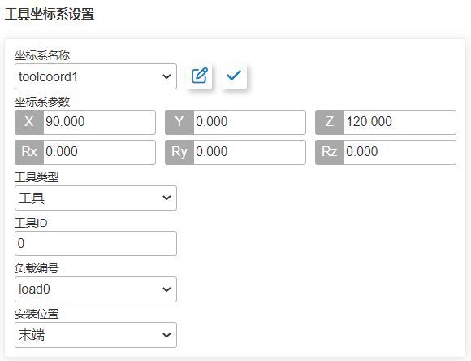

.. centered:: 圖表 9.31-1 工具座標系設置

**Step2**：點擊「示教程式」->「程式編輯」，編寫恆力控制lua腳本，選擇「力控集」->「Control」，添加力控運動指令，姿態順應設置「開啟」，最大調整角度設置為姿態順應角度的閾值。
   
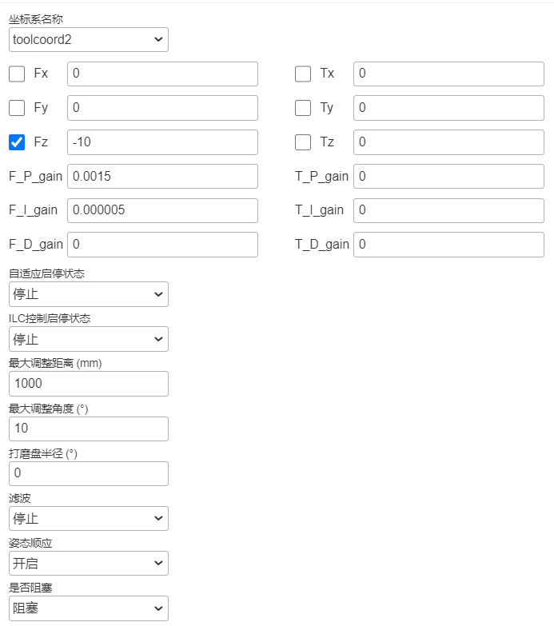

.. centered:: 圖表 9.31-2 力控運動指令

**Step3**：web界面點擊「FT」，設置六維力傳感器參考座標系，選擇參考座標系為「自定義座標系」並設置對應的座標系參數。
姿態順應角度調整繞工具座標系轉動，設置參考座標參數為「0」；姿態順應角度調整繞末端法蘭座標系轉動，設置參考座標參數為末端工具對應的座標系參數。
   
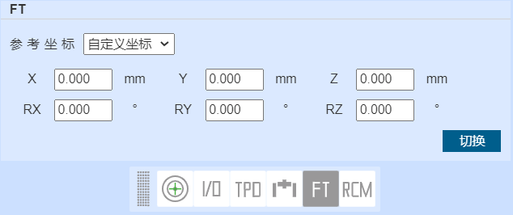

.. centered:: 圖表 9.31-3 設置六維力傳感器參考座標系

**Step4**：運行腳本，查看姿態順應效果，恆力下的姿態順應調整角度會限制在自定義的最大調整角度範圍內。