自訂協定從站指令 
===========================

.. toctree:: 
   :maxdepth: 6

概述
-------------------

為了方便PLC透過不同的工業匯流排協定（CC-Link、Profinet、Ethernet/IP和EtherCAT）對機器人進行運動控制，在整合式mini控制箱上增加赫優訊闆卡模組，實現功能如下：

1) CC-Link slave 協定支援；
2) Profinet slave 協定支援；
3) Ethernet/IP slave 協定支援；
4) EtherCAT slave 協定支援(EnTalk板卡不支援)；

環境配置
--------------------------

赫優訊闆卡硬體環境搭建
~~~~~~~~~~~~~~~~~~~~~~~~~~~~~~~~~~

1. 將赫優訊闆卡安裝到整合式mini控制箱，如圖所示。

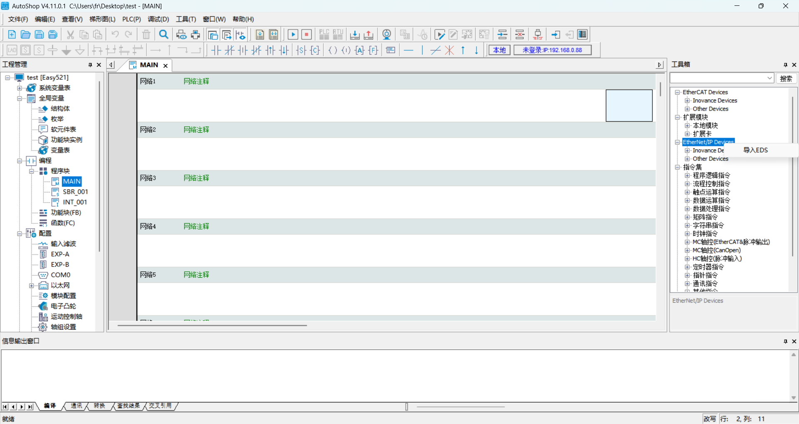

.. centered:: 圖表 17.2-1 赫優訊闆卡安裝

.. image:: custom_protocol_slave/002.png
   :width: 4in
   :align: center

.. centered:: 圖表 17.2-2 赫優訊闆卡網口

2. 機器人控制箱和PLC接線如下圖所示。

.. image:: custom_protocol_slave/003.png
   :width: 4in
   :align: center

.. centered:: 圖表 17.2-3 控制箱&三菱PLC接線圖

.. image:: custom_protocol_slave/004.png
   :width: 4in
   :align: center

.. centered:: 圖表 17.2-4 控制箱&西門子PLC接線圖

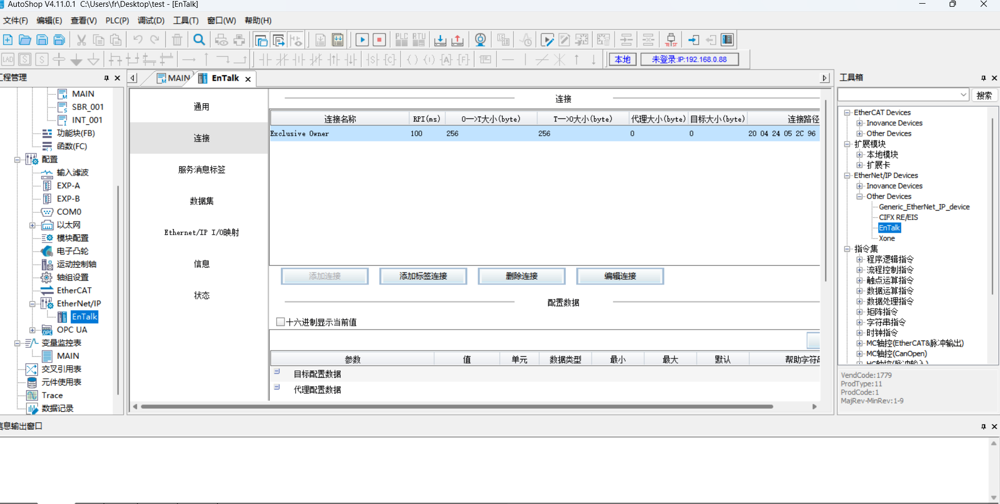

.. centered:: 圖表 17.2-5 控制箱&歐姆龍PLC接線圖

.. image:: custom_protocol_slave/006.png
   :width: 4in
   :align: center

.. centered:: 圖表 17.2-6 控制箱&歐姆龍PLC接線圖

.. note::
 1：機器人控制箱（闆卡網口）；
 2：交換器；
 3：筆記本PC；
 4：三菱PLC（CC-link網口）；
 5：西門子PLC（Profinet網路埠）；
 6：歐姆龍PLC（Ethernet/IP網路埠）；
 7：歐姆龍PLC（EtherCAT網口）；

.. important:: 當協定切換為EtherCAT匯流排時，闆卡的網口需要區分為EtherCAT_IN和EtherCAT_OUT，此時，歐姆龍PLC的EtherCAT網口需要與卡的EtherCAT_IN網口透過一條網線直連。

EnTalk板卡硬件環境搭建
~~~~~~~~~~~~~~~~~~~~~~~~~~~~~~~~~~~~~~~

1. 將板卡安裝到集成式mini控制箱，如圖所示。

.. image:: custom_protocol_slave/044.png
   :width: 4in
   :align: center

.. centered:: 圖表 17.2-7 EnTalk板卡網口

2. 機器人控制箱和PLC接線如下圖所示。

.. image:: custom_protocol_slave/003.png
   :width: 4in
   :align: center

.. centered:: 圖表 17.2-8 控制箱&三菱PLC接線圖

.. image:: custom_protocol_slave/004.png
   :width: 4in
   :align: center

.. centered:: 圖表 17.2-9 控制箱&西門子PLC接線圖

.. centered:: 圖表 17.2-10 控制箱&匯川PLC接線圖

.. note:: 
    1：機器人控制箱（板卡網口）；
    2：交換機；
    3：筆記本PC；
    4：三菱PLC（CC-link網口）；
    5：西門子PLC（Profinet網口）；
    6：匯川PLC（Ethernet/IP網口）；

3. EnTalk板卡進行協議切換時，需進行固件升級。升級步驟：
   - 將連接板卡的PC IP修改為「192.168.0.xxx」
   - 打開「網關工具集」軟件
   - 選擇需要連接的PC網卡設備
   - 點擊右下角「開始」按鈕
   - 點擊右上角「搜索」按鈕搜索板卡設備

.. image:: custom_protocol_slave/045.png
   :width: 6in
   :align: center

.. centered:: 圖表 17.2-11 連接板卡設備

4. 點擊左下角「升級」按鈕
   - 選中板卡設備
   - 點擊右上角「...」按鈕選擇需要的協議固件
   - 點擊「升級」按鈕等待完成

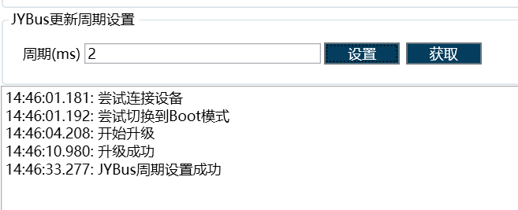

.. centered:: 圖表 17.2-12 板卡協議切換

.. note:: 板卡協議切換後IP地址變更如下表。

.. centered:: 表格 17.2-1 板卡IP地址

.. list-table:: 
   :widths: 20 80
   :header-rows: 1
   :align: center

   * - **協議**
     - **IP地址**

   * - CC-link
     - 192.168.0.113

   * - Ethernet/IP
     - 192.168.0.112

   * - Profinet
     - 192.168.0.2

配置為CC-link時，控制器會將板卡IP修改為「192.168.0.113」。

配置為Ethernet/IP時，控制器會將板卡IP修改為「192.168.0.112」。

切換為Profinet且從站設備名稱與主站一致時，主站會自動配置從站IP地址。

軟體環境搭建
~~~~~~~~~~~~~~~~~~~~~~~~~~~~~~~~~~

1. 瀏覽器IP輸入192.168.58.2，帳號為admin，密碼為123，點選“登入”，進入機器人控制箱Web介面。

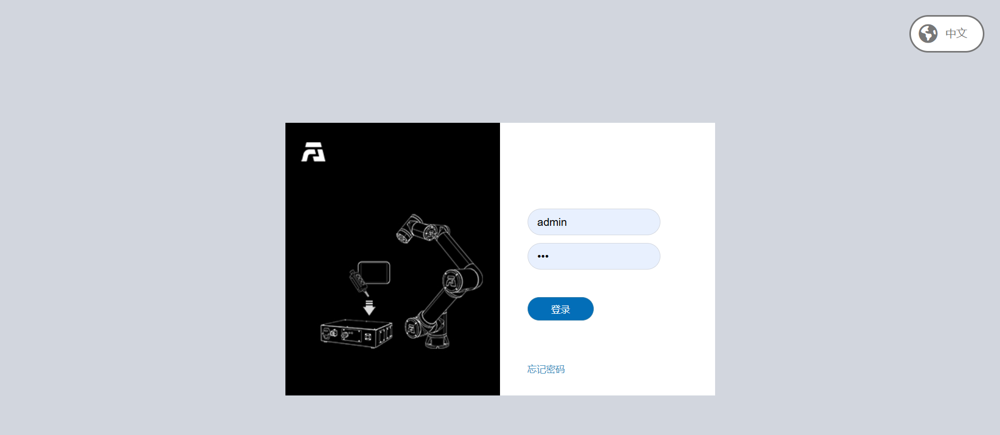

.. centered:: 圖表 17.2-13 Web登入介面

2. 點選輔助應用->工具應用->系統升級介面，選擇software.tar.gz文件，上傳升級包。

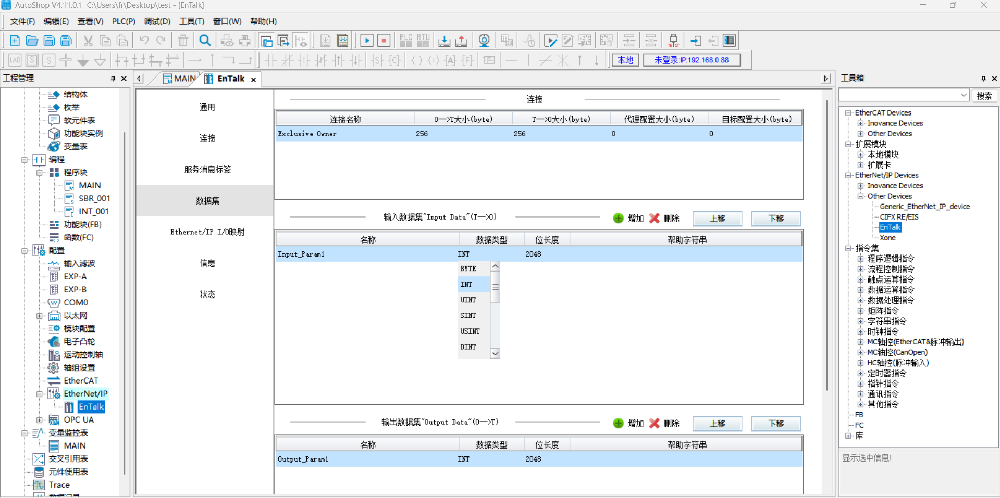

.. centered:: 圖表 17.2-14 軟體升級

.. note:: QX控制箱web版本需要3.8.0以上，LA控制箱web版本需要3.8.0以上。

3. 進入周邊->遠端控制， 控制模式選擇“Profinet控制”，廠商選擇“Hilscher”，循環週期選擇“4ms”，點選“設定”。

.. image:: custom_protocol_slave/009.png
   :width: 4in
   :align: center

.. centered:: 圖表 17.2-15 介面配置

4. 點選右上角「本地模式」->切換遠端模式。

.. image:: custom_protocol_slave/010.png
   :width: 4in
   :align: center

.. centered:: 圖表 17.2-16 切換遠端模式

5. 選擇控制器從站協議，以及是否需要自啟動功能，點擊「設定」按鈕。注意：切換不同的協議，需要先點擊「卸載」按鈕，再進行其他協議的配置。

.. image:: custom_protocol_slave/011.png
   :width: 6in
   :align: center

.. centered:: 圖表 17.2-17 配置通訊協議

.. note:: 切換不同的協議，需要重新啟動控制箱再進行協議的設定。

PLC環境搭建
~~~~~~~~~~~~~~~~~~~~~~~~~~~~~~~~~~

實現各協定從站指令所搭建的測試環境如下表所示，其中包括各協議中所使用PLC的型號，韌體版本及測試軟體。

.. list-table:: 
   :widths: 100 100 100 100 100
   :header-rows: 1
   :align: center

   * - 協定
     - 品牌
     - 型號
     - 韌體
     - 軟體

   * - Profinet
     - 西門子
     - CPU 1515-2 PN
     - 6ES75152AM020AB0
     - TIA Portal V17

   * - CC-link
     - 三菱
     - FX5S-30TR/DS
     - 30MR/ES V1.3
     - GX Works3 V1.097B

   * - Ethernet/IP
     - 歐姆龍
     - MX102-1100
     - V1.3
     - Sysmac Studio V1.50

   * - EtherCAT
     - 歐姆龍
     - MX102-1100
     - V1.3
     - Sysmac Studio V1.50

西門子Profinet
++++++++++++++++++++++++++++++++++

1. GSD檔（XML檔）導入

開啟西門子程式設計軟體TIA Portal V17，新建PLC工程，選擇“設備與網路”，右側“硬體目錄”選擇雙擊6ES7 515-2AM02-0AB0新增PLC模組。

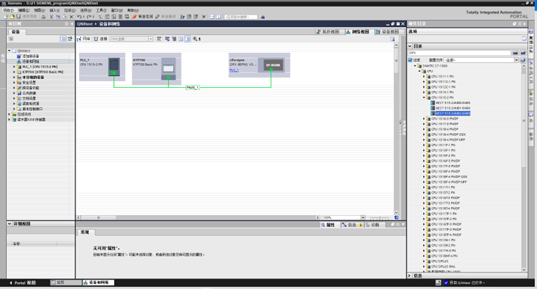

在 TIA PORTAL 軟體中選單列選擇「選項」->「管理通用站描述檔(GSD)」可安裝或刪除已安裝完成的 GSD 檔案。

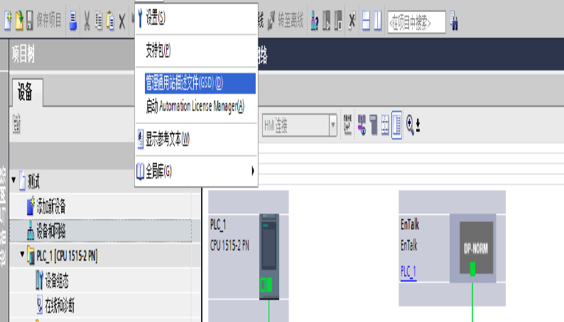

以安裝赫優訊 GSD 檔案為例，如上選擇“管理通用站描述檔(GSD)”，出現“管理通用站描述檔”視窗。

從「來源路徑」選擇要安裝 GSD 文件的資料夾，從所顯示 GSD 文件的清單中選擇要安裝的一個或多個文件，按一下「安裝」按鈕。如下圖所示。

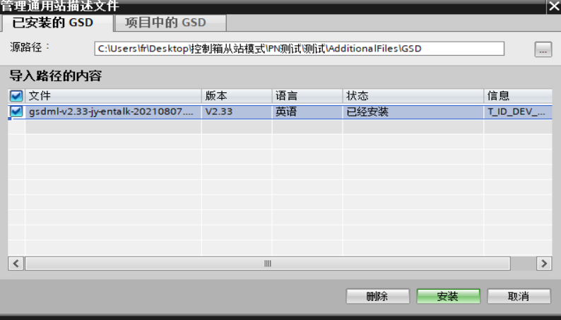

安裝成功後，可在硬體目錄下，其它現場設備找到安裝的 GSD 檔案的設備，如下圖所示。

.. image:: custom_protocol_slave/015.png
   :width: 4in
   :align: center

2. 運行程式

開啟工程“QNXtest”。

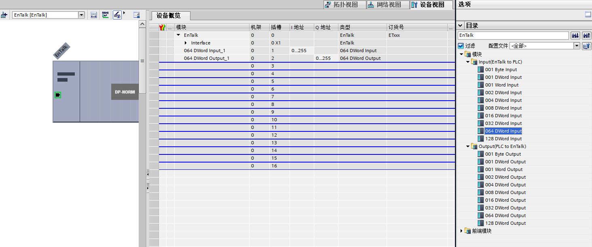

編譯程式：左側項目樹雙擊進入“設備和網路”，右鍵單擊“PLC_1”模組，下拉式選單選擇編譯，單機“硬體和軟體（僅更改）”。編譯完成後將在軟體視圖下方提示「編譯完成」。

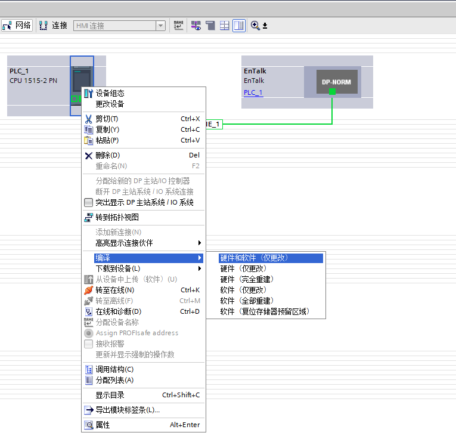

.. image:: custom_protocol_slave/018.png
   :width: 6in
   :align: center

下載程式到設備：左側項目樹雙擊進入“設備和網路”，右鍵單擊“PLC_1”模組，下拉式選單選擇“下載到設備”，單機“硬體和軟體（僅更改）”。

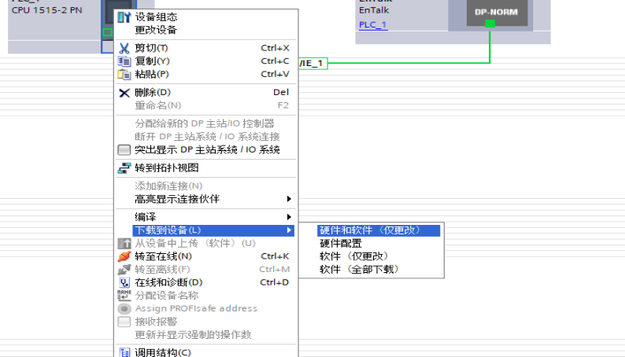

搜尋並下載設備：彈跳窗後如下圖配置PG/PC介面類型，點選開始搜索，選擇需要下載程式的設備，點選下載。

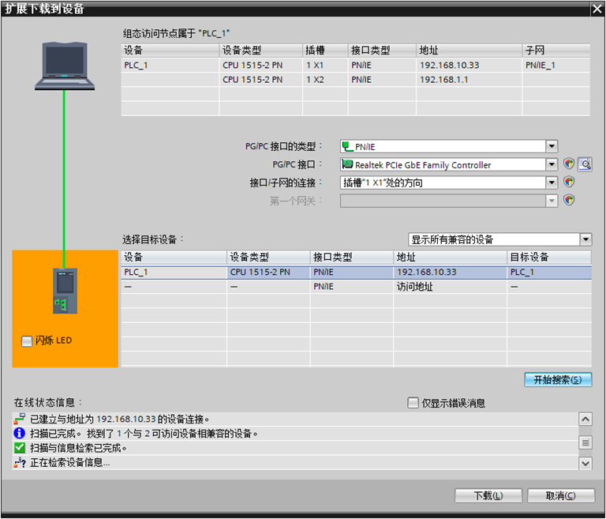

.. image:: custom_protocol_slave/021.png
   :width: 6in
   :align: center

三菱CC-link
++++++++++++++++++++++++++++++++++

1. CC-Link IEF Basic設置

開啟使用CC-link：左側導覽功能表列選擇“乙太網路連接埠”，設定PLC ip位址，確保與赫優訊闆卡位址同網段。點選“CC-link IEF Basic使用有無”，選擇 “使用”。

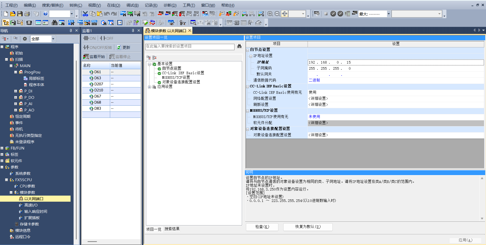

CC-Link 網路配置設定：同樣在CC-Link IEF Basic設置，選擇“網路配置設定”，模組選擇赫優訊CIFX Digital I/O模組。拖曳到視圖左下方，完成硬體配置。

.. image:: custom_protocol_slave/023.png
   :width: 6in
   :align: center

CC-Link 刷新設定：同樣在CC-Link IEF Basic設置，點選刷新設置，自訂傳輸設定：256位元組接收，256位元組發送。

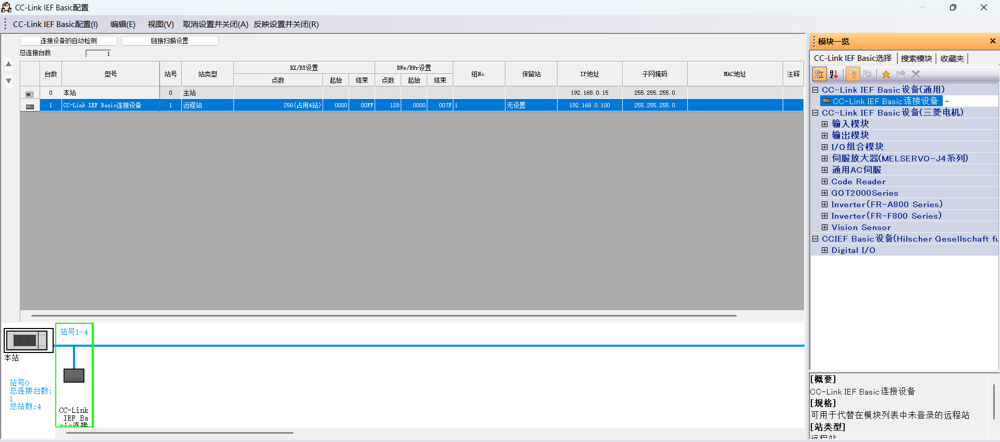

2. 程式下載

開啟測試程式後，點選「線上」→「寫入至可程式控制器」進入下載介面。

.. image:: custom_protocol_slave/025.png
   :width: 6in
   :align: center

開啟下載介面後，點選左上方“參數+程式”，再點選右下角“執行”進行下載，等待下載完成。

.. image:: custom_protocol_slave/026.png
   :width: 6in
   :align: center

HMI設定（CC-link仿真）
~~~~~~~~~~~~~~~~~~~~~~~~~~~~~~~~~~~~~~~

1. 登入HMI介面後啟用「Enable Task」建立PLC與控制器通訊連線。

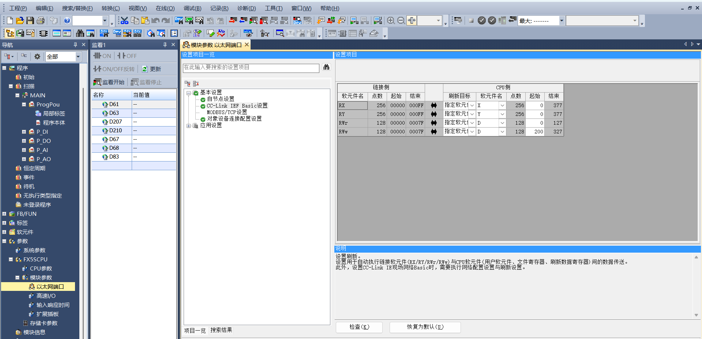

2. 點選01_MC_EnableRobot介面後再點選「EnableRobot」啟用機器人，使用過程中如有報錯，點選「Reset」重設。

.. image:: custom_protocol_slave/028.png
   :width: 6in
   :align: center

3. 點選「02_MC_ToolData」進入工具資訊介面，左邊輸入參數後點選WriteToolData寫入工具資訊；右邊點選ReadToolData讀取現有工具資訊。
   
.. image:: custom_protocol_slave/029.png
   :width: 6in
   :align: center

4. 點選「03_MC_FrameData」進入工件資訊介面，左邊輸入參數後點選WriteFrameData寫入工件資訊；右邊點選ReadFrameData讀取現有工件資訊。
   
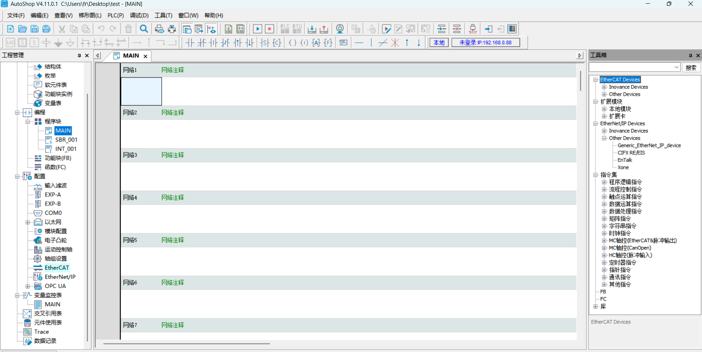

5. 點選「04_MC_LoadData」進入負載資訊介面，左邊輸入參數後點選WriteLoadData寫入負載資訊；右邊點選ReadLoadData讀取現有負載資訊。
   
.. image:: custom_protocol_slave/031.png
   :width: 6in
   :align: center

6. 點選「05_MC_RobotReferenceDynamics」進入機器人最大速度和最大加速度介面，左邊輸入參數後點選WriteRobotRefD寫入最大速度和最大加速度資訊；右邊點選ReadRobotRefD讀取最大速度和最大加速資訊。
   
.. image:: custom_protocol_slave/032.png
   :width: 6in
   :align: center

7. 點選「06_MC_Robot DefaultDynamics」進入機器人預設速度與預設加速度介面，左邊輸入參數後點選WriteRobotDefD寫入預設速度與預設加速資訊；右邊點選ReadRobotDefD讀取預設速度與預設加速資訊。
   
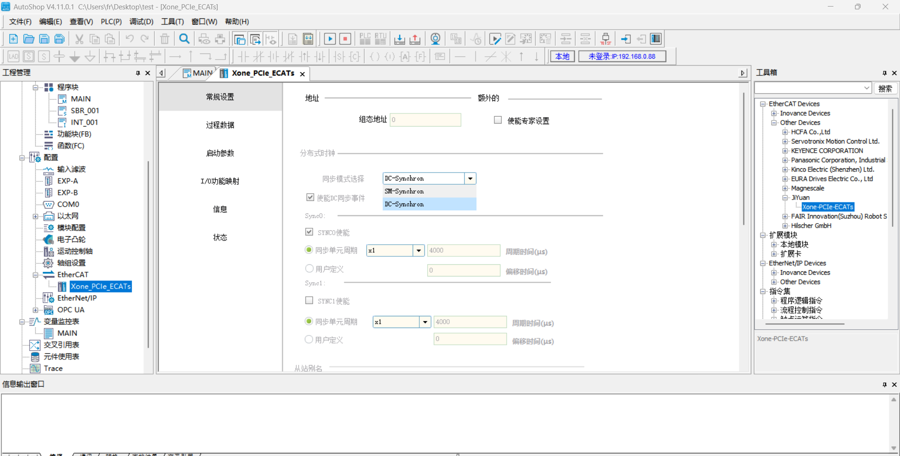

8. 點選「07_MC_RobotSwLimits」進入座標限位介面，左邊輸入最大限位與最小限位參數值後點選WriteRobotSwLimits寫入限位參數資訊；右邊點選ReadRobotSwLimits讀取現有限位元參數資訊。
   
.. image:: custom_protocol_slave/034.png
   :width: 6in
   :align: center

9. 點選「08_MC_ReadActualPosition」進入讀取實際位置介面，點選讀取ReadPosition讀取現有位置資訊。
   
.. image:: custom_protocol_slave/035.png
   :width: 6in
   :align: center

10. 點選「09_MC_MoveLinearAbsolute」進入線性運動介面，輸入座標參數後點選MoveLinearAbsolute使機器人以目標位置線性移動。
   
.. image:: custom_protocol_slave/036.png
   :width: 6in
   :align: center

11. 點選「10_MC_MoveAxesAbsolute」進入軸座標運動介面，輸入座標參數後點選MoveAxesAbsolute使機器人以輸入的軸座標為終點向目標位置移動。
   
.. image:: custom_protocol_slave/037.png
   :width: 6in
   :align: center

12. 點選「11_MC_MoveDirectAbsolute」進入直接運動介面，輸入座標參數後點選MoveDirectAbsolute使機器人以輸入參數為終點直接向目標位置移動。
   
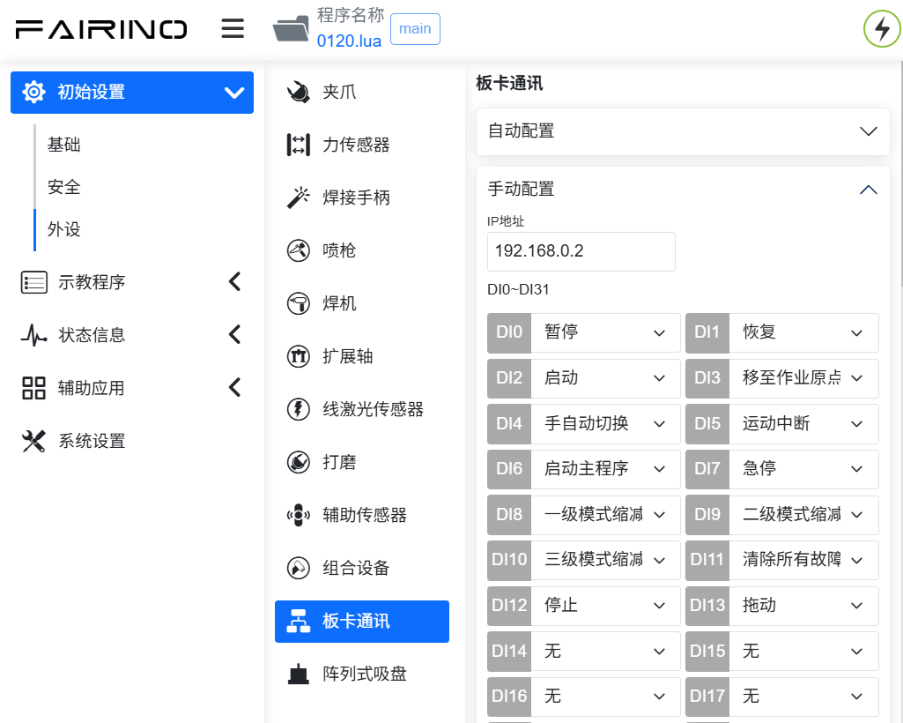

13. 點選「12_MC_Groups」進入直接運動操作介面，其中，點選GroupInterrupt可以讓機器人在運動過程中中斷移動，點選GroupContinue使機器人繼續往目標位置移動。點擊GroupStop停止（結束）正在進行的位置移動動作。如過程中觸犯警報或錯誤，點選GroupReset重設機器人錯誤。
   
.. image:: custom_protocol_slave/039.png
   :width: 6in
   :align: center

14. 點選「13_MC_PositionConversion」進入位置換算介面，XtoJ1可進行笛卡爾位姿到關節角度的轉換，J1toX可進行關節角度到笛卡爾位姿的轉換。
   
.. image:: custom_protocol_slave/040.png
   :width: 6in
   :align: center

15. 點選「14_MC_GroupJog」進入機器人點動介面，配置完畢後下拉座標軸選擇需要點動的軸，再選擇軸的旋轉方向。點選JogMove進行點動。右邊MC_ChangeSpeedOverride可調整機械手臂的移動速度。
   
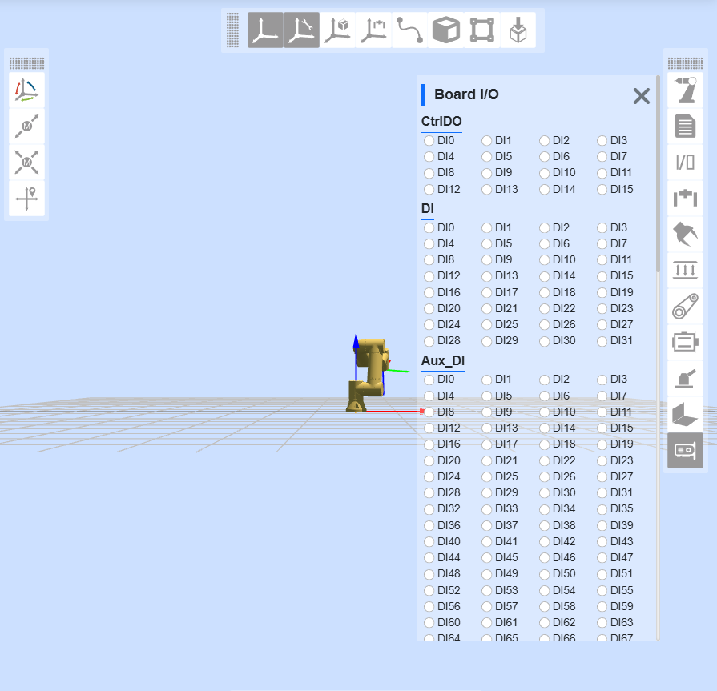

HMI設定（Profinet仿真）
~~~~~~~~~~~~~~~~~~~~~~~~~~~~~~~~~~~~~~~

1. 開啟程式後點選選擇項目樹中的“HMI_1[ktp700 Basic PN]”，之後在選單列中點選“線上”→“模擬”→“啟動”。等待軟體編譯並模擬。

2. 模擬後功能與威綸通螢幕（CC-link）內容一致。可參考上述內容設定。
   
.. image:: custom_protocol_slave/042.png
   :width: 6in
   :align: center   

.. image:: custom_protocol_slave/043.png
   :width: 6in
   :align: center

機器人從站模式相關操作說明
---------------------------------------------------------

加載從站模式
~~~~~~~~~~~~~~~~~~~~~~~~~~~~~~~~~

**步驟 1**：打開WebApp，進入初始設定->外設->板卡通訊->手動配置。

.. image:: custom_protocol_slave/047.png
   :width: 6in
   :align: center

.. centered:: 圖表 17.3-1 板卡通訊手動配置

首先，對Entalk板卡IP地址進行配置，如不填寫，則板卡按照預設IP: 192.168.0.100進行啟動配置。目前IP配置僅適用於EIP、CC-link協議，PN協議由PLC主站掃描從站設備分配IP。

.. note:: 頁面上更改IP地址後，需要加載從站模式方可生效。

依次選擇DI、DO、AO所需映射功能（見附錄一），各參數意義如下：

- DI為機器人控制：機器人從站接受外部信號輸入，執行映射的功能；
  
- DO為機器人狀態輸出：機器人從站反饋狀態信號至主站；
  
- AO為機器人狀態反饋：機器人從站反饋狀態數據至主站，AO0~AO15為有符號整型(int16)，AO16~AO31為單精度浮點數(float)。

**步驟 2**：點擊“配置”按鈕，生成開放協議lua文件。

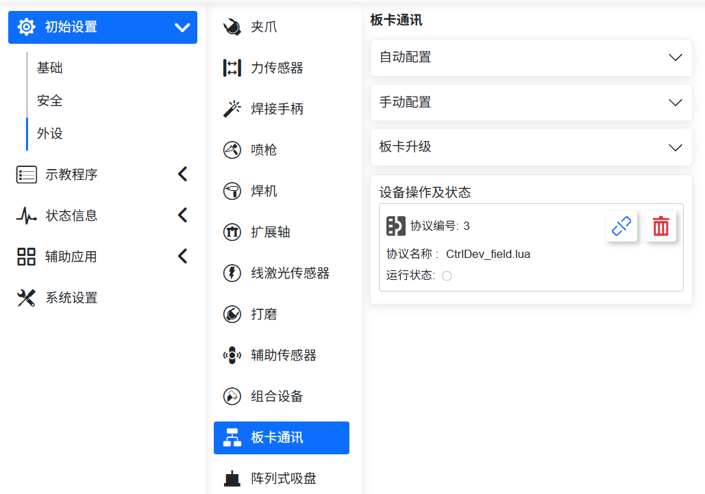

.. centered:: 圖表 17.3-2 設備操作及狀態

.. note:: 開放協議lua文件支持下載，可在自動配置界面導入開放協議lua文件。

生成程序示例如下：

.. code-block:: console
   :linenos:

   local id = 3 
   local ctrlDI = {0, 0, 0, 0, 0, 0}
   local funcDI = {0, 0, 0, 0, 0, 0, 0, 0, 0, 0, 0, 0, 0, 0, 0, 0}
   local DOState = {0, 0, 0, 0, 0, 0, 0, 0}
   local AOState = {0, 0, 0, 0, 0, 0, 0, 0, 0, 0, 0, 0, 0, 0, 0, 0, 0, 0, 0, 0, 0, 0, 0, 0, 0, 0, 0, 0, 0, 0, 0, 0}
   -- 啟動板卡通訊進程
   LoadFieldBusSlave()
   sleep_ms(8000)
   while(1) do
      -- 設置DO狀態
      CtrlBoxDO, CtrlBoxCO, CtrlBoxDI, CtrlBoxCI, errState, motionState, moveToOriginState, robotStartDoneState, modeChangeState, programStartStopState, emergencyState, reduceState, collision, enablestate, safetyStop0, safetyStop1, pauseState, interfereState = GetRobotFuncDOState()
      DOState[1] = CtrlBoxDO
      DOState[2] = CtrlBoxCO
      DOState[3] = CtrlBoxDI
      DOState[4] = CtrlBoxCI
      local ctrlWord0 = 0
      ctrlWord0 = SetBitWithIndex(ctrlWord0, 0, errState)
      ctrlWord0 = SetBitWithIndex(ctrlWord0, 1, motionState)
      ctrlWord0 = SetBitWithIndex(ctrlWord0, 2, moveToOriginState)
      ctrlWord0 = SetBitWithIndex(ctrlWord0, 3, robotStartDoneState)
      ctrlWord0 = SetBitWithIndex(ctrlWord0, 4, modeChangeState)
      ctrlWord0 = SetBitWithIndex(ctrlWord0, 5, programStartStopState)
      ctrlWord0 = SetBitWithIndex(ctrlWord0, 6, emergencyState)
      ctrlWord0 = SetBitWithIndex(ctrlWord0, 7, reduceState)
      DOState[5] = ctrlWord0
      local ctrlWord1 = 0
      ctrlWord1 = SetBitWithIndex(ctrlWord1, 0, collision)
      ctrlWord1 = SetBitWithIndex(ctrlWord1, 1, enablestate)
      ctrlWord1 = SetBitWithIndex(ctrlWord1, 2, safetyStop0)
      ctrlWord1 = SetBitWithIndex(ctrlWord1, 3, safetyStop1)
      ctrlWord1 = SetBitWithIndex(ctrlWord1, 4, pauseState)
      ctrlWord1 = SetBitWithIndex(ctrlWord1, 5, interfereState)
      DOState[6] = ctrlWord1
      SetFieldBusDOState(DOState)

      -- 設置AO狀態
      mainErrCode, subErrCode, TCPSpeed, axisPos1, axisPos2, axisPos3, axisPos4, axisPos5, axisPos6, jointVelFeedback1, jointVelFeedback2, jointVelFeedback3, jointVelFeedback4, jointVelFeedback5, jointVelFeedback6, jointCurFeedback1, jointCurFeedback2, jointCurFeedback3,jointCurFeedback4,jointCurFeedback5,jointCurFeedback6, jointTorqueFeedback1, jointTorqueFeedback2,jointTorqueFeedback3,jointTorqueFeedback4, jointTorqueFeedback5, jointTorqueFeedback6, cartPosx, cartPosy, cartPosz, cartPosrx, cartPosry, cartPosrz = GetRobotFuncAOState()
      AOState[1] = mainErrCode
      AOState[2] = subErrCode
      AOState[17] = axisPos1
      AOState[18] = axisPos2
      AOState[19] = axisPos3
      AOState[20] = axisPos4
      AOState[21] = axisPos5
      AOState[22] = axisPos6
      AOState[23] = cartPosx
      AOState[24] = cartPosy
      AOState[25] = cartPosz
      AOState[26] = cartPosrx
      AOState[27] = cartPosry
      AOState[28] = cartPosrz
      SetFieldBusAOState(AOState)
      sleep_ms(10) 

      -- 設置DI狀態
      -- 配置DI功能並實時更新
      ctrlDI[1],ctrlDI[2],ctrlDI[3],ctrlDI[4],ctrlDI[5],ctrlDI[6] = GetFieldBusDIState()
      funcDI[1] = ctrlDI[1] 
      funcDI[2] = ctrlDI[2] 
      funcDI[3] = GetBitWithIndex(ctrlDI[3], 0)
      funcDI[4] = GetBitWithIndex(ctrlDI[3], 1)
      funcDI[5] = GetBitWithIndex(ctrlDI[3], 2)
      funcDI[6] = GetBitWithIndex(ctrlDI[3], 3)
      funcDI[7] = GetBitWithIndex(ctrlDI[3], 4)
      funcDI[8] = GetBitWithIndex(ctrlDI[3], 5)
      funcDI[9] = GetBitWithIndex(ctrlDI[3], 6)
      funcDI[10] = GetBitWithIndex(ctrlDI[3], 7)
      funcDI[11] = GetBitWithIndex(ctrlDI[4], 0)
      funcDI[12] = GetBitWithIndex(ctrlDI[4], 1)
      funcDI[13] = GetBitWithIndex(ctrlDI[4], 2)
      funcDI[14] = GetBitWithIndex(ctrlDI[4], 3)
      funcDI[15] = GetBitWithIndex(ctrlDI[4], 4)
      funcDI[16] = GetBitWithIndex(ctrlDI[4], 5)
      SetRobotFuncDIState(funcDI)
      local stopFlag = GetOpenLUAStopFlag(id)
      if(stopFlag ~= 0) then 
         UnloadFieldBusSlave()
         break
      end
      sleep_ms(10)
   end

**步驟 3**：點擊加載按鈕，加載機器人從站模式。

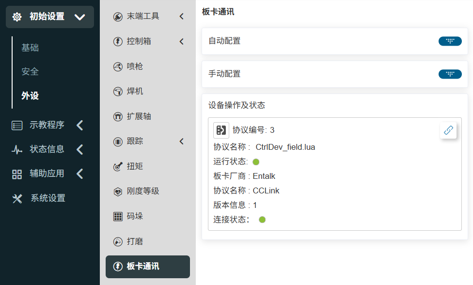

.. centered:: 圖表 17.3-3 加載從站模式

.. note:: 機器人從站模式加載成功後，支持開機自啟動功能。如需使用遠程模式，請先卸載從站模式。

**步驟 4**：點擊右側狀態欄按鈕，監控DI、DO、AI、AO交互信息，各參數介紹如下：

- CtrlDO為主站設備控制機器人控制箱DO的信號輸入值；
  
- DI為外部主站控制信號輸入值；
  
- DO為機器人從站反饋信號輸出值；
  
- AI為外部主站輸入值，AI0~AI15為int16類型，AI16~AI31為float類型；
  
- AO為機器人從站輸出值，AO0~AO15為int16類型，AO16~AO31為float類型。

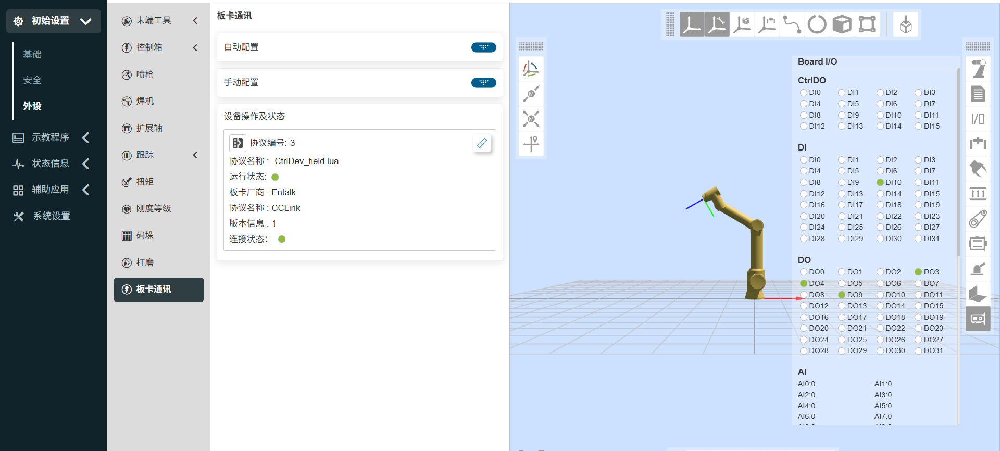

.. centered:: 圖表 17.3-4 DI、DO、AI、AO交互信息

**步驟5**：加載完成後，可通過示教程序->通訊指令->板卡指令生成板卡lua指令，實現設置從站DO/AO，獲取從站DI/AI，等待從站DI/AI。

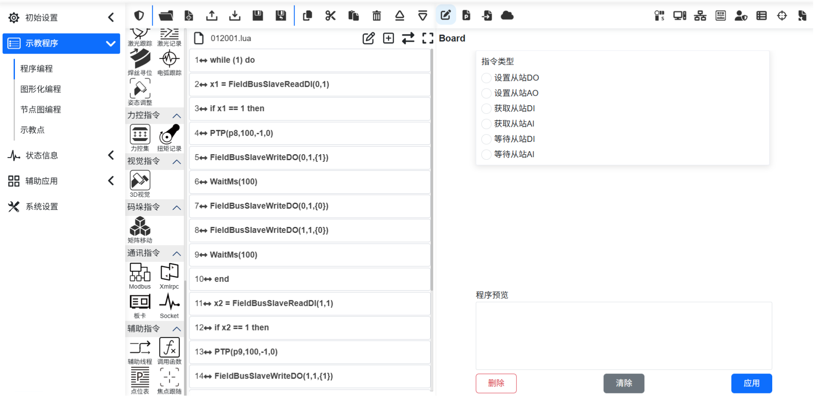

.. centered:: 圖表 17.3-5 板卡lua指令

:download:`附件一：從站模式地址映射表 <../_static/_doc/控制箱从站模式地址对照表.xlsx>`

附錄
-------------------

指令列表
~~~~~~~~~~~~~~~~~~~~~~~~~~~

.. list-table:: 
   :widths: 20 80
   :header-rows: 1
   :align: center

   * - 命令碼
     - 指令描述

   * - 0x1000
     - 機器人使能

   * - 0x1001
     - 重置所有錯誤

   * - 0x1002
     - 機器人停止運動

   * - 0x1003
     - 讀取實際位置

   * - 0x1004
     - 設定機器人速度

   * - 0x1005
     - 機器人繼續運動

   * - 0x1006
     - 機器人暫停運動

   * - 0x1007
     - 根據joint位置計算出笛卡爾位置

   * - 0x1008
     - 根據笛卡爾位置計算joint位置

   * - 0x2000
     - 寫工具訊息

   * - 0x2001
     - 讀工具訊息

   * - 0x2002
     - 寫工件訊息

   * - 0x2003
     - 讀工件訊息

   * - 0x2004
     - 寫負載訊息

   * - 0x2005
     - 讀負載訊息

   * - 0x2006
     - 寫reference dynamic訊息

   * - 0x2007
     - 讀reference dynamic訊息

   * - 0x2008
     - 寫default dynamic訊息

   * - 0x2009
     - 讀default dynamic訊息

   * - 0x2010
     - 寫軟限位訊息

   * - 0x2011
     - 讀軟限位訊息

   * - 0x3000
     - MoveAxes（基於關節角度）

   * - 0x3001
     - MoveLinear

   * - 0x3002
     - MoveDirect（基於笛卡爾座標系）

   * - 0x3003
     - jog運動

   * - 0x3004
     - jog停止