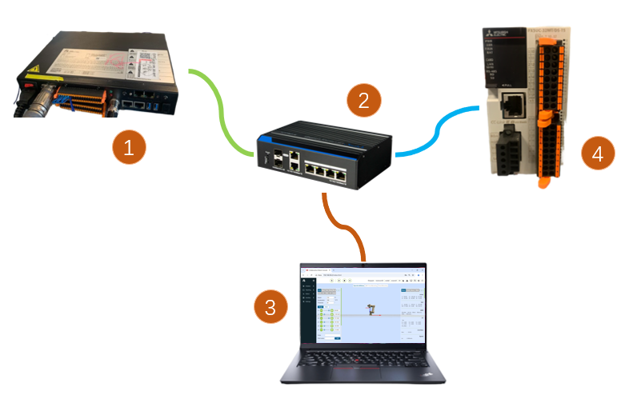

機器人從站模式
===============================================================

.. toctree:: 
   :maxdepth: 6

概述
-------------------

為了便於PLC透過不同的工業匯流排協議（CC-Link、Profinet、Ethernet/IP、EtherCAT）對機器人進行運動控制，在集成式mini控制箱上增加FRJ-PCIeN-EIP/CC/PN-RJ-V10板卡、FRJ-PCIeN-EC/PN/EIP/CC-RJ-V20板卡設備，開發機器人從站模式，實現功能如下：

- 1.主站設備向機器人從站發送輸入信號，可以控制機器人執行相應動作，例如：控制機器人控制箱DO的輸出、控制機器人運動等；

- 2.主站設備讀取對應位址的數值即可獲取對應的機器人即時狀態數據，例如：機器人關節數據、TCP位置、機器人是否運動到位等。

環境配置
--------------------------

板卡型號、軟體版本描述如下：

.. list-table:: 
   :widths: 20 50 30
   :header-rows: 1
   :align: center

   * - **協議類型**
     - **板卡型號**
     - **機器人軟體版本**

   * - CC-Link IEF Basic
     - FRJ-PCIeN-EIP/CC/PN-RJ-V10板卡
     - V3.8.4及以上

   * - CC-Link IEF Basic
     - FRJ-PCIeN-EC/PN/EIP/CC-RJ-V20板卡
     - V3.9.6及以上

   * - Profinet
     - FRJ-PCIeN-EIP/CC/PN-RJ-V10板卡
     - V3.8.4及以上

   * - Profinet
     - FRJ-PCIeN-EC/PN/EIP/CC-RJ-V20板卡
     - V3.9.6及以上

   * - Ethernet/IP
     - FRJ-PCIeN-EIP/CC/PN-RJ-V10板卡
     - V3.8.4及以上

   * - Ethernet/IP
     - FRJ-PCIeN-EC/PN/EIP/CC-RJ-V20板卡
     - V3.9.6及以上

   * - EtherCAT
     - FRJ-PCIeN-EC/PN/EIP/CC-RJ-V20板卡
     - V3.9.6及以上

板卡安裝
~~~~~~~~~~~~~~~~~~~~~~~~~~~~~~~~~~~~~~~~~~~~~~~~~~~~~~

(1) 查驗物料：FRJ-PCIeN 板卡、配套鈑金件外形參照如下所示。

.. image:: remote_mode/001.png
   :width: 4in
   :align: center

.. centered:: 圖表 19.2-1 安裝鈑金（正面）

.. image:: remote_mode/002.png
   :width: 4in
   :align: center

.. centered:: 圖表 19.2-2 安裝鈑金（背面）

.. image:: remote_mode/003.png
   :width: 4in
   :align: center

.. centered:: 圖表 19.2-3 FRH-PCIeN-EC/EIP/CC/PN-RJ-V10板卡

.. image:: remote_mode/004.png
   :width: 4in
   :align: center

.. centered:: 圖表 19.2-4 FRJ-PCIeN-EIP/CC/PN-RJ-V10板卡

(2) 將板卡安裝到集成式mini控制箱，如圖所示。

.. image:: remote_mode/005.png
   :width: 4in
   :align: center

.. centered:: 圖表 19.2-5 鈑金安裝示意圖

.. image:: remote_mode/008.png
   :width: 4in
   :align: center

.. centered:: 圖表 19.2-6 核心主板安裝示意圖

.. image:: remote_mode/009.png
   :width: 4in
   :align: center

.. centered:: 圖表 19.2-7 RJ45 網口擴展卡安裝示意圖

.. note:: 註：所有螺釘均需擰緊。

(3) 機器人控制箱和PLC接線如下圖所示。

.. centered:: 圖表 19.2-8 控制箱&三菱PLC接線圖    

.. image:: remote_mode/011.png
   :width: 4in
   :align: center

.. centered:: 圖表 19.2-9 控制箱&西門子PLC接線圖

.. image:: remote_mode/012.png
   :width: 4in
   :align: center

.. centered:: 圖表 19.2-10 控制箱&匯川PLC接線圖

.. image:: remote_mode/013.png
   :width: 4in
   :align: center

.. centered:: 圖表 19.2-11 控制箱&匯川PLC接線圖

.. note:: 
    1：機器人控制箱（板卡網口）；
    2：交換機；
    3：筆記本PC；
    4：三菱PLC（CC-Link IEF Basic網口）；
    5：西門子PLC（Profinet網口）；
    6：匯川PLC（Ethernet/IP）；
    7：匯川PLC（EtherCAT網口）；
        
PLC環境搭建
~~~~~~~~~~~~~~~~~~~~~~~~~~~~~~~~~~~~~~~~~~~~~~~~~~~~~~~~

實現各協議從站指令所搭建的測試環境如下表所示，其中包括各協議中所使用PLC的型號，韌體版本及測試軟體。

.. centered:: 表 2-1 測試環境

.. list-table:: 
   :widths: 20 40 40
   :header-rows: 1
   :align: center

   * - 協議
     - Profinet
     - CC-link

   * - 品牌
     - 西門子
     - 三菱

   * - 型號
     - CPU 1515-2 PN
     - FX5S-30TR/DS

   * - 韌體
     - 6ES75152AM020AB0
     - 30MR/ES V1.3

   * - 軟體
     - TIA Portal V17
     - GXWorks3V1.097B

   * - 板卡IP位址
     - IP可配置
     - IP可配置

   * - PLC IP位址
     - IP無需同網段
     - IP同網段
		
.. list-table:: 
   :widths: 20 40 40
   :header-rows: 1
   :align: center

   * - 協議
     - Ethernet/IP
     - EtherCAT

   * - 品牌
     - 匯川
     - 匯川

   * - 型號
     - Easy521-0808TN
     - Easy521-0808TN

   * - 韌體
     - /
     - /

   * - 軟體
     - AutoShop 4.11.0.1
     - AutoShop 4.11.0.1

   * - 板卡IP位址
     - IP可配置
     - IP可配置

   * - PLC IP位址
     - IP同網段
     - IP同網段
		
匯川Ethernet/IP
+++++++++++++++++++++++++++++++++++++++++++++++++++++

(1) EDS檔案匯入

打開匯川編程軟體AutoShop，新建PLC工程，右側工具箱欄選擇「EtherNet/IP Devices」。

滑鼠左鍵點擊「EtherNet/IP」後，右鍵彈出「匯入EDS」對話框，左鍵確定，找到放置板卡EDS檔案的資料夾。匯入成功後「EtherNet/IP Devices」目錄下會出現板卡的名稱，關閉工程重新打開，匯入EDS檔案完成。

.. image:: custom_protocol_slave/001.png
   :width: 6in
   :align: center

.. image:: custom_protocol_slave/002.png
   :width: 6in
   :align: center

(2) EtherNet/IP 參數設置

雙擊左側工具欄下「EtherNet/IP」下的從站，彈出參數設置窗口：

.. image:: custom_protocol_slave/003.png
   :width: 6in
   :align: center

填寫板卡IP位址：

.. image:: custom_protocol_slave/004.png
   :width: 6in
   :align: center

單擊選擇「連接」，進行數據輸入輸出字節大小設置：

.. image:: custom_protocol_slave/005.png
   :width: 6in
   :align: center

點擊「編輯連接」，進入彈窗，將輸入輸出字節數均改為256：

.. image:: custom_protocol_slave/006.png
   :width: 6in
   :align: center

單擊選擇「數據集」，將輸入輸出數據類型設置為「INT」，位長度設置為「2048」：

.. image:: custom_protocol_slave/007.png
   :width: 6in
   :align: center

.. image:: custom_protocol_slave/008.png
   :width: 6in
   :align: center

.. image:: custom_protocol_slave/009.png
   :width: 6in
   :align: center

對「數據集」參數設置成功後，單擊選擇「EtherNet/IP I/O映射」分別輸入D0和D200，D0和D200分別對應PLC端接收和發送陣列的起始位址。

.. image:: custom_protocol_slave/010.png
   :width: 6in
   :align: center

.. image:: custom_protocol_slave/011.png
   :width: 6in
   :align: center

(3) 程式下載

打開測試程式，將PLC IP位址修改為與板卡同網段，下載程式後運行。

西門子Profinet
++++++++++++++++++++++++++++++++++++++++++++++++++++++++

(1) GSD檔案（XML檔案）匯入

打開西門子編程軟體TIA Portal V17，新建PLC工程，選擇「設備與網路」，右側「硬體目錄」選擇雙擊6ES7 515-2AM02-0AB0添加PLC模塊。

.. image:: custom_protocol_slave/012.png
   :width: 6in
   :align: center

在 TIA PORTAL 軟體中功能表欄選擇「選項」->「管理通用站描述檔案(GSD)」可安裝或刪除已經安裝完成的 GSD 檔案。

.. image:: custom_protocol_slave/013.png
   :width: 6in
   :align: center

安裝 GSD 檔案，如上選擇「管理通用站描述檔案(GSD)」，出現「管理通用站描述檔案」窗口。

從「源路徑」選擇要安裝 GSD 檔案的資料夾，從所顯示 GSD 檔案的列表中選擇要安裝的一個或多個檔案，單擊「安裝」按鈕。如下圖所示。

.. image:: custom_protocol_slave/014.png
   :width: 6in
   :align: center

安裝成功後，可在硬體目錄下，其它現場設備找到安裝的 GSD 檔案的設備，如下圖所示。

.. image:: custom_protocol_slave/015.png
   :width: 6in
   :align: center

分配IO：目錄尋找模塊拖動Input與Output。

.. image:: custom_protocol_slave/016.png
   :width: 6in
   :align: center

編譯程式：左側項目樹雙擊進入「設備和網路」，右擊「PLC_1」模塊，下拉功能表選擇編譯，單機「硬體和軟體（僅更改）」。編譯完成後將在軟體視圖下方提示「編譯完成」：

.. image:: custom_protocol_slave/017.png
   :width: 6in
   :align: center

.. image:: custom_protocol_slave/018.png
   :width: 6in
   :align: center

下載程式到設備：左側項目樹雙擊進入「設備和網路」，右擊「PLC_1」模塊，下拉功能表選擇「下載到設備」，單機「硬體和軟體（僅更改）」：

.. image:: custom_protocol_slave/019.png
   :width: 6in
   :align: center

搜索並下載設備：彈窗後如下圖配置PG/PC接口類型，點擊開始搜索，選擇需要下載程式的設備，點擊下載：

.. image:: custom_protocol_slave/020.png
   :width: 6in
   :align: center

.. image:: custom_protocol_slave/021.png
   :width: 6in
   :align: center

三菱CC-link
+++++++++++++++++++++++++++++++++++++++++++++++++

(1) CC-Link IEF Basic設置

開啟使用CC-link：左側導航功能表欄選擇「乙太網埠」，設置PLC ip位址，保證與驥遠板卡位址同網段。點擊「CC-link IEF Basic使用有無」，選擇 「使用」：

.. image:: custom_protocol_slave/022.png
   :width: 6in
   :align: center

CC-Link 網路配置設置：同樣在CC-Link IEF Basic設置，選擇「網路配置設置」，模塊選擇CC-Link IEF Basic通用模塊。拖拽到視圖左下方，完成硬體配置：

.. image:: custom_protocol_slave/023.png
   :width: 6in
   :align: center
   
.. image:: custom_protocol_slave/024.png
   :width: 6in
   :align: center

設置從站的點數和IP位址：

.. image:: custom_protocol_slave/025.png
   :width: 6in
   :align: center
   
.. image:: custom_protocol_slave/026.png
   :width: 6in
   :align: center

CC-Link 刷新設置：同樣在CC-Link IEF Basic設置，點擊刷新設置，自定義傳輸設置：256字節接收，256字節發送。
   
.. image:: custom_protocol_slave/027.png
   :width: 6in
   :align: center

(2) 程式下載

打開測試程式後，點擊「線上」->「寫入至可程式控制器」進入下載界面。
   
.. image:: custom_protocol_slave/028.png
   :width: 6in
   :align: center

打開下載界面後，點擊左上方「參數+程式」，再點擊右下角「執行」進行下載，等待下載完成。
   
.. image:: custom_protocol_slave/029.png
   :width: 6in
   :align: center

匯川EtherCAT
++++++++++++++++++++++++++++++++++++++++++++++

(1) XML檔案匯入

打開匯川編程軟體AutoShop，新建PLC工程，右側工具箱欄選擇「EtheCATDevices」：
   
.. image:: custom_protocol_slave/030.png
   :width: 6in
   :align: center

滑鼠左鍵點擊「EtheCATDevices」後，右鍵彈出「匯入設備XML」對話框，左鍵確定，找到放置板卡XML檔案的資料夾。

匯入成功後「EtherCAT Devices」目錄下會出現板卡的名稱，這時關閉工程重新打開後完成XML檔案匯入流程。
   
.. image:: custom_protocol_slave/031.png
   :width: 6in
   :align: center

(2) 添加EtherCAT從站

右側工具欄→「EtehrCAT Devices」→「Other Devices」→「JIYuan」→「Xone-PCIe-ECATs」，滑鼠雙擊「Xone-PCIe-ECATs」，添加EtherCAT從站，此時可以看到左側工程項目下EtherCAT主站下添加從站成功。
   
.. image:: custom_protocol_slave/032.png
   :width: 6in
   :align: center
   
.. image:: custom_protocol_slave/033.png
   :width: 6in
   :align: center

(3) 添加PDO
   
.. image:: custom_protocol_slave/034.png
   :width: 6in
   :align: center
   
.. image:: custom_protocol_slave/035.png
   :width: 6in
   :align: center

(4) EtherCAT位址映射

左側工具欄雙擊變數表，新建輸入為256位元組的陣列，軟元件位址為D0。新建輸出為256位元組的陣列，軟元件位址為D200。
   
.. image:: custom_protocol_slave/036.png
   :width: 6in
   :align: center

左側工具欄「EtherCAT」下雙擊「Xone-PCIe-ECATs」，在彈出對話框中單擊 「I/O功能映射」，單擊方框進行變數位址綁定，在彈出對話框中單擊「變數表」，在選擇需要對應的輸入\輸出，單擊確定，其他位址按順序綁定操作同上。
   
.. image:: custom_protocol_slave/037.png
   :width: 6in
   :align: center

(5) 程式下載

打開測試程式，將PLC IP位址改為與板卡同網段，下載程式後運行。

機器人從站模式相關操作說明
--------------------------------------------------------------------------------------

載入從站模式
~~~~~~~~~~~~~~~~~~~~~~~~~~~~~~~~~~~~~~~~~~

(1) 打開WebApp，進入初始設置->外設->板卡通訊->手動配置。
   
.. image:: custom_protocol_slave/038.png
   :width: 6in
   :align: center

首先，對板卡IP位址進行配置，如不填寫，則板卡按照預設IP: 192.168.0.100進行啟動配置。目前IP配置僅適用於EIP、CC-link協議，PN協議由PLC主站掃描從站設備分配IP。

.. note:: 頁面上更改IP位址後，需要載入從站模式方可生效。
   
接著，依次選擇DI、DO、AO所需映射功能（見附錄），各參數意義如下：

- DI為機器人控制：機器人從站接受外部信號輸入，執行映射的功能；
- DO為機器人狀態輸出：機器人從站反饋狀態信號至主站；
- AO為機器人狀態反饋：機器人從站反饋狀態數據至主站，AO0~AO15為有符號整形(int16)，AO16~AO31為單精度浮點數(float)。

(2) 點擊「配置」按鈕，生成開放協議lua檔案。
   
.. image:: custom_protocol_slave/039.png
   :width: 6in
   :align: center

.. note:: 開放協議lua檔案支持下載，可在自動配置界面匯入開放協議lua檔案。

生成程式示例如下：

.. code-block:: console
   :linenos:

   local id = 3 
   local ctrlDI = {0, 0, 0, 0, 0, 0}
   local funcDI = {0, 0, 0, 0, 0, 0, 0, 0, 0, 0, 0, 0, 0, 0, 0, 0}
   local DOState = {0, 0, 0, 0, 0, 0, 0, 0}
   local AOState = {0, 0, 0, 0, 0, 0, 0, 0, 0, 0, 0, 0, 0, 0, 0, 0, 0, 0, 0, 0, 0, 0, 0, 0, 0, 0, 0, 0, 0, 0, 0, 0}
   -- Launch the board communication process
   SetFieldBusIP("192.168.0.99")
   LoadFieldBusSlave()
   sleep_ms(8000)
   while(1) do
      -- Set the DO status
      CtrlBoxDO, CtrlBoxCO, CtrlBoxDI, CtrlBoxCI, errState, motionState, moveToOriginState, robotStartDoneState, modeChangeState, programStartStopState, emergencyState, reduceState, collision, enablestate, safetyStop0, safetyStop1, pauseState, interfereState = GetRobotFuncDOState()
      DOState[1] = CtrlBoxDO
      DOState[2] = CtrlBoxCO
      DOState[3] = CtrlBoxDI
      DOState[4] = CtrlBoxCI
      local ctrlWord0 = 0
      ctrlWord0 = SetBitWithIndex(ctrlWord0, 0, errState)
      ctrlWord0 = SetBitWithIndex(ctrlWord0, 1, motionState)
      ctrlWord0 = SetBitWithIndex(ctrlWord0, 2, moveToOriginState)
      ctrlWord0 = SetBitWithIndex(ctrlWord0, 3, robotStartDoneState)
      ctrlWord0 = SetBitWithIndex(ctrlWord0, 4, modeChangeState)
      ctrlWord0 = SetBitWithIndex(ctrlWord0, 5, programStartStopState)
      ctrlWord0 = SetBitWithIndex(ctrlWord0, 6, emergencyState)
      ctrlWord0 = SetBitWithIndex(ctrlWord0, 7, reduceState)
      DOState[5] = ctrlWord0
      local ctrlWord1 = 0
      ctrlWord1 = SetBitWithIndex(ctrlWord1, 0, collision)
      ctrlWord1 = SetBitWithIndex(ctrlWord1, 1, enablestate)
      ctrlWord1 = SetBitWithIndex(ctrlWord1, 2, safetyStop0)
      ctrlWord1 = SetBitWithIndex(ctrlWord1, 3, safetyStop1)
      ctrlWord1 = SetBitWithIndex(ctrlWord1, 4, pauseState)
      ctrlWord1 = SetBitWithIndex(ctrlWord1, 5, interfereState)
      DOState[6] = ctrlWord1
      SetFieldBusDOState(DOState)

      -- Set the AO status
      mainErrCode, subErrCode, TCPSpeed, axisPos1, axisPos2, axisPos3, axisPos4, axisPos5, axisPos6, jointVelFeedback1, jointVelFeedback2, jointVelFeedback3, jointVelFeedback4, jointVelFeedback5, jointVelFeedback6, jointCurFeedback1, jointCurFeedback2, jointCurFeedback3,jointCurFeedback4,jointCurFeedback5,jointCurFeedback6, jointTorqueFeedback1, jointTorqueFeedback2,jointTorqueFeedback3,jointTorqueFeedback4, jointTorqueFeedback5, jointTorqueFeedback6, cartPosx, cartPosy, cartPosz, cartPosrx, cartPosry, cartPosrz = GetRobotFuncAOState()
      AOState[1] = mainErrCode
      AOState[2] = subErrCode
      AOState[17] = axisPos1
      AOState[18] = axisPos2
      AOState[19] = axisPos3
      AOState[20] = axisPos4
      AOState[21] = axisPos5
      AOState[22] = axisPos6
      AOState[23] = cartPosx
      AOState[24] = cartPosy
      AOState[25] = cartPosz
      AOState[26] = cartPosrx
      AOState[27] = cartPosry
      AOState[28] = cartPosrz
      SetFieldBusAOState(AOState)
      sleep_ms(10) 

      -- Set the DI status
      -- Configue the DI function and update it in real-time
      ctrlDI[1],ctrlDI[2],ctrlDI[3],ctrlDI[4],ctrlDI[5],ctrlDI[6] = GetFieldBusDIState()
      funcDI[1] = ctrlDI[1] 
      funcDI[2] = ctrlDI[2] 
      funcDI[3] = GetBitWithIndex(ctrlDI[3], 0)
      funcDI[4] = GetBitWithIndex(ctrlDI[3], 1)
      funcDI[5] = GetBitWithIndex(ctrlDI[3], 2)
      funcDI[6] = GetBitWithIndex(ctrlDI[3], 3)
      funcDI[7] = GetBitWithIndex(ctrlDI[3], 4)
      funcDI[8] = GetBitWithIndex(ctrlDI[3], 5)
      funcDI[9] = GetBitWithIndex(ctrlDI[3], 6)
      funcDI[10] = GetBitWithIndex(ctrlDI[3], 7)
      funcDI[11] = GetBitWithIndex(ctrlDI[4], 0)
      funcDI[12] = GetBitWithIndex(ctrlDI[4], 1)
      funcDI[13] = GetBitWithIndex(ctrlDI[4], 2)
      funcDI[14] = GetBitWithIndex(ctrlDI[4], 3)
      funcDI[15] = GetBitWithIndex(ctrlDI[4], 4)
      funcDI[16] = GetBitWithIndex(ctrlDI[4], 5)
      SetRobotFuncDIState(funcDI)
      local stopFlag = GetOpenLUAStopFlag(id)
      if(stopFlag ~= 0) then 
         UnloadFieldBusSlave()
         break
      end
      sleep_ms(10)
   end

(3) 點擊加載按鈕，加載機器人從站模式。
   
.. image:: custom_protocol_slave/040.png
   :width: 6in
   :align: center

.. note:: 機器人從站模式加載成功後，支援開機自啟動功能。如需使用遠程模式，請先卸載從站模式。

(4) 點擊右側板卡狀態欄按鈕，監控DI、DO、AI、AO交互信息，各參數介紹如下：

- CtrlDO：外部主站下發控制箱DO/CO信號輸入值；
- DI：外部主站控制信號輸入值；
- Aux_DI：通訊板卡擴展DI；
- DO：機器人從站反饋信號輸出值；
- Aux_DO：通訊板卡擴展DO；
- AI：外部主站輸入值；
- AI0~AI15：int16類型；
- AI16~AI31：float類型；
- AO：機器人從站輸出值；
- AO0~AO15：int16類型；
- AO16~AO31：float類型。

.. note:: DI、DO、AI、AO各參數信息詳見《RD36-機器人從站模式位址對照表-V1.0-20260605》。
   
.. image:: custom_protocol_slave/041.png
   :width: 4in
   :align: center

(5) 加載完成後，可透過示教程式->通訊指令->板卡生成板卡lua指令，實現設置從站DO、AO，獲取從站DI、AI，等待從站DI、AI。
   
.. image:: custom_protocol_slave/042.png
   :width: 6in
   :align: center

板卡韌體升級及通訊週期配置
--------------------------------------------------------------------------

FRJ-PCIeN-EIP/CC/PN-RJ-V10板卡
~~~~~~~~~~~~~~~~~~~~~~~~~~~~~~~~~~~~~~~~~~~~~~~~~~~~~~~~~~~~~~~~~~~~~~~~~~~~~~~~~~
板卡進行協議切換時，需進行韌體升級，使用上位機升級FRJ-PCIeN-EIP/CC/PN-RJ-V10板卡韌體，步驟如下：

(1) 打開WinPcap_4_1_3.exe，安裝網卡驅動包。

(2) 將PC（Win11系統）網口與板卡網口直連，打開Device Assistant v1.1.0.exe，雙擊「乙太網」，點擊左上角「刷新」按鈕，可以掃描到目前連接的板卡設備。
   
.. image:: custom_protocol_slave/043.png
   :width: 6in
   :align: center
      
.. image:: custom_protocol_slave/044.png
   :width: 6in
   :align: center

(3) 雙擊掃描到的板卡設備，進入韌體更新界面。將PC和獲取到的板卡ip配置在同網段，點擊「韌體更新」功能表欄右側「…」按鈕，上傳待升級的韌體，點擊「更新」按鈕，左下角文本框提示「升級成功」列印即可。
      
.. image:: custom_protocol_slave/045.png
   :width: 6in
   :align: center

(4) 板卡升級成功會執行復位操作，等待板卡復位完成（5s），輸入需要的通訊週期（支援1~100ms），點擊「設置」按鈕，左下角提示「週期設置成功」列印後，重啟控制箱即可。
      
.. image:: custom_protocol_slave/046.png
   :width: 6in
   :align: center

FRJ-PCIeN-EC/PN/EIP/CC-RJ-V20板卡
~~~~~~~~~~~~~~~~~~~~~~~~~~~~~~~~~~~~~~~~~~~~~~~~~~~~~~~~~~~~~~~~~~~~~~~~~~~~~~~~~~

板卡進行協議切換時，需進行韌體升級，登錄機器人界面升級FRJ-PCIeN-EC/PN/EIP/CC-RJ-V20板卡韌體，步驟如下：

(1) 網址輸入192.168.58.2進入機器人界面，點擊 「初始設置」->「外設」->「板卡通訊」界面，可以獲取到FRJ-PCIeN-EC/PN/EIP/CC-RJ-V20板卡韌體版本號。選擇待升級的bin檔案，點擊上傳，等待韌體升級成功後，重啟控制箱即可。
      
.. image:: custom_protocol_slave/047.png
   :width: 6in
   :align: center

.. note:: FRJ-PCIeN-EC/PN/EIP/CC-RJ-V20板卡升級韌體需卸載已運行的開放協議。

(2) 網址輸入192.168.58.2進入機器人界面，點擊 「初始設置」->「外設」->「板卡通訊」界面，可以獲取到板卡通訊週期。輸入所需通訊週期（1~100ms），點擊「配置」按鈕，等待配置成功後，重啟控制箱即可。
      
.. image:: custom_protocol_slave/048.png
   :width: 6in
   :align: center

.. note:: FRJ-PCIeN-EC/PN/EIP/CC-RJ-V20板卡配置通訊週期需卸載已運行的開放協議。

:download:`板卡通訊韌體及配置文件 <../_static/_doc/板卡通讯固件及配置文件.zip>`

:download:`各協議PLC測試程序匯總 <../_static/_doc/各协议PLC测试程序汇总.zip>`   