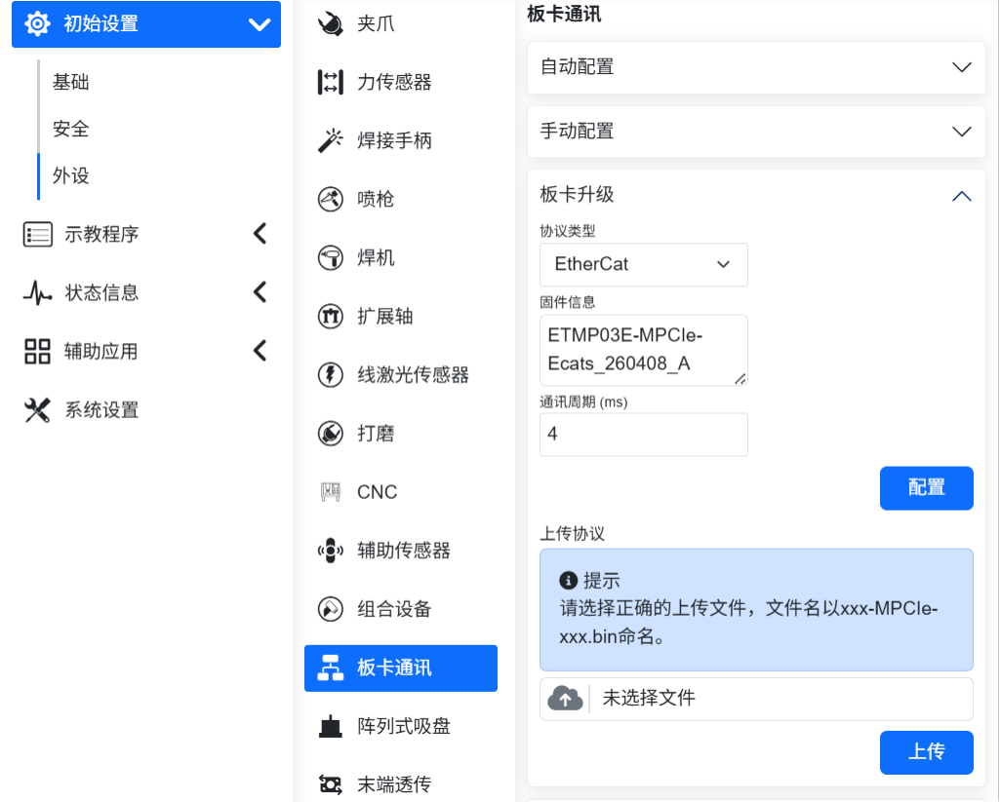
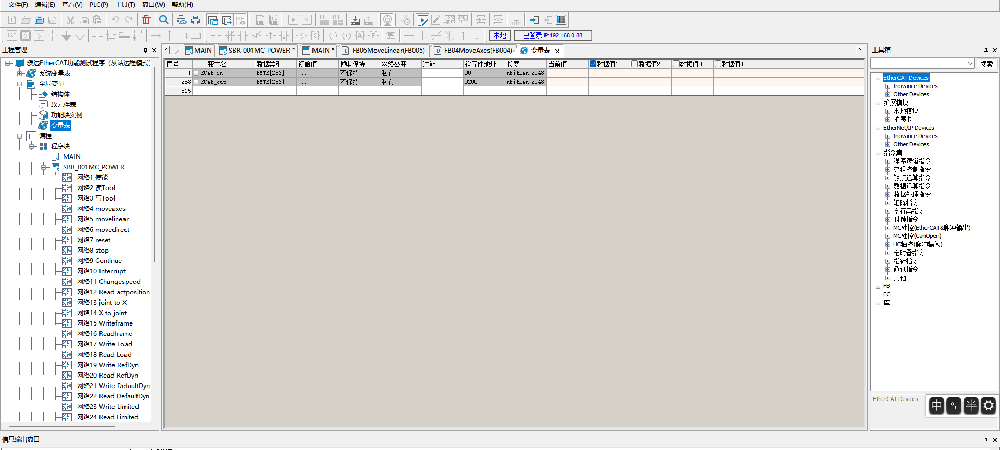
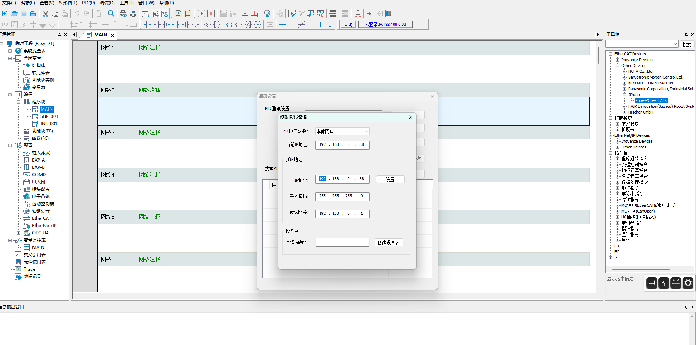
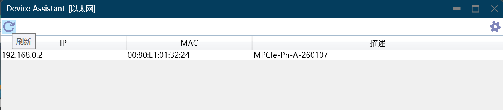

自定義協議從站指令
===========================

.. toctree::
   :maxdepth: 6

概述
-------------------

為了便於PLC透過不同的工業總線協議（CC-Link IEF Basic、Profinet、Ethernet/IP和EtherCAT）對機器人進行運動控制，在整合式mini控制箱上增加FRH-PCIeN-EC/EIP/CC/PN-RJ-V10板卡、FRJ-PCIeN-EIP/CC/PN-RJ-V10板卡、FRJ-PCIeN-EC-RJ-V10板卡設備。

環境配置
--------------------------

板卡型號、軟體版本描述如下：

.. list-table:: 
   :widths: 20 50 30
   :header-rows: 1
   :align: center

   * - **協定類型**
     - **板卡型號**
     - **機器人軟體版本**

   * - CC-Link IEF Basic
     - FRJ-PCIeN-EIP/CC/PN-RJ-V10板卡
     - V3.8.4及以上

   * - CC-Link IEF Basic
     - FRJ-PCIeN-EC-RJ-V10板卡
     - V3.9.5及以上

   * - Profinet
     - FRJ-PCIeN-EIP/CC/PN-RJ-V10板卡
     - V3.8.4及以上

   * - Profinet
     - FRJ-PCIeN-EC-RJ-V10板卡
     - V3.9.5及以上

   * - Ethernet/IP
     - FRJ-PCIeN-EIP/CC/PN-RJ-V10板卡
     - V3.8.4及以上

   * - Ethernet/IP
     - FRJ-PCIeN-EC-RJ-V10板卡
     - V3.9.5及以上

   * - EtherCAT
     - FRJ-PCIeN-EC-RJ-V10板卡
     - V3.9.5及以上

FRH-PCIeN-EC/EIP/CC/PN-RJ-V10板卡硬體環境搭建
~~~~~~~~~~~~~~~~~~~~~~~~~~~~~~~~~~~~~~~~~~~~~~~~~~~~

1. 將FRH-PCIeN-EC/EIP/CC/PN-RJ-V10板卡安裝到整合式mini控制箱，如圖所示。

.. image:: custom_protocol_slave/001.png
   :width: 4in
   :align: center

.. centered:: 圖表 17.2-1 FRH-PCIeN-EC/EIP/CC/PN-RJ-V10板卡安裝

.. image:: custom_protocol_slave/002.png
   :width: 4in
   :align: center

.. centered:: 圖表 17.2-2 FRH-PCIeN-EC/EIP/CC/PN-RJ-V10板卡網口

2. 機器人控制箱和PLC接線如下圖所示。

.. image:: custom_protocol_slave/003.png
   :width: 4in
   :align: center

.. centered:: 圖表 17.2-3 控制箱&三菱PLC接線圖

.. image:: custom_protocol_slave/004.png
   :width: 4in
   :align: center

.. centered:: 圖表 17.2-4 控制箱&西門子PLC接線圖

.. image:: custom_protocol_slave/005.png
   :width: 4in
   :align: center

.. centered:: 圖表 17.2-5 控制箱&歐姆龍PLC接線圖

.. image:: custom_protocol_slave/006.png
   :width: 4in
   :align: center

.. centered:: 圖表 17.2-6 控制箱&歐姆龍PLC接線圖

.. note::
    1：機器人控制箱（板卡網口）；
    2：交換機；
    3：筆記型電腦；
    4：三菱PLC（CC-Link IEF Basic網口）；
    5：西門子PLC（Profinet網口）；
    6：歐姆龍PLC（Ethernet/IP網口）；
    7：歐姆龍PLC（EtherCAT網口）；

.. important:: 當協議切換為EtherCAT總線時，板卡的網口需要區分為EtherCAT_IN和EtherCAT_OUT，此時，歐姆龍PLC的EtherCAT網口需要與板卡的EtherCAT_IN網口透過一根網線直連。

FRJ-PCIeN板卡硬體環境搭建
~~~~~~~~~~~~~~~~~~~~~~~~~~~~~~~~~~~~~~~

1. 將板卡安裝到整合式mini控制箱，如圖所示。

.. image:: custom_protocol_slave/044.png
   :width: 4in
   :align: center

.. centered:: 圖表 17.2-7 FRJ-PCIeN板卡網口

2. 機器人控制箱和PLC接線如下圖所示。

.. image:: custom_protocol_slave/003.png
   :width: 4in
   :align: center

.. centered:: 圖表 17.2-8 控制箱&三菱PLC接線圖

.. image:: custom_protocol_slave/004.png
   :width: 4in
   :align: center

.. centered:: 圖表 17.2-9 控制箱&西門子PLC接線圖

.. image:: custom_protocol_slave/005.png
   :width: 4in
   :align: center

.. centered:: 圖表 17.2-10 控制箱&匯川PLC接線圖

.. note::
    1：機器人控制箱（板卡網口）；
    2：交換機；
    3：筆記型電腦；
    4：三菱PLC（CC-Link IEF Basic網口）；
    5：西門子PLC（Profinet網口）；
    6：匯川PLC（Ethernet/IP）；

FRJ-PCIeN-EIP/CC/PN-RJ-V10板卡韌體升級
++++++++++++++++++++++++++++++++++++++++++++++++++++++++++++++++++++++++++++++++++++++++++++++++++++++

板卡進行協定切換時，需進行韌體升級。在進行韌體升級時，需將板卡的IP位址和筆記本PC的IP位址配置在同一個網段，然後打開「閘道工具集」軟體->選擇需要連接的PC網卡設備->點擊右下角「開始」按鈕->點擊右上角「搜尋」按鈕，搜尋板卡設備。

.. image:: custom_protocol_slave/045.png
   :width: 6in
   :align: center

.. centered:: 圖表 17.2-11 連接板卡裝置

點選左下角「升級」按鈕->選中板卡裝置->點選右上角「…」按鈕，選擇需要的協議韌體->點選「升級」按鈕，等待韌體升級完成即可。

.. image:: custom_protocol_slave/046.png
   :width: 6in
   :align: center

.. centered:: 圖表 17.2-12 板卡協議切換

.. note:: 板卡進行協議切換後，板卡的IP地址會進行改變，具體如下表所示。

.. centered:: 表格 17.2-1 板卡IP地址

.. list-table::
   :widths: 20 80
   :header-rows: 1
   :align: center

   * - **協議**
     - **IP地址**

   * - CC-Link IEF Basic
     - 192.168.0.113

   * - Ethernet/IP
     - 192.168.0.112

   * - Profinet
     - 192.168.0.2

當協議配置為CC-Link IEF Basic時，控制器會將板卡IP修改為「192.168.0.113」。

當協議配置為Ethernet/IP時，控制器會將板卡IP修改為「192.168.0.112」。

當協議切換為Profinet時，並且從站裝置名稱與主站一致時，主站會自動配置從站的 IP 地址。

FRJ-PCIeN-EC-RJ-V10板卡韌體升級
++++++++++++++++++++++++++++++++++++++++++++++++++++++++++++++++++++++++++++++++++++++

網址輸入192.169.58.2進入機器人界面，點擊「初始設置」->「外設」->「板卡通訊」界面，可以獲取到FRJ-PCIeN-EC-RJ-V10板卡韌體版本號。選擇待升級的bin文件，點擊上傳，等待韌體升級成功後，重啟控制箱即可。

.. centered:: 圖表 17.2-13 板卡韌體升級

.. note:: FRJ-PCIeN-EC-RJ-V10板卡升級韌體需卸載已運行的開放協議。

軟體環境搭建
~~~~~~~~~~~~~~~~~~~~~~~~~~~~~~~~~~

1. 瀏覽器IP輸入192.168.58.2，帳號為admin，密碼為123，點選「登入」，進入機器人控制箱Web介面。

.. image:: teaching_pendant_software/001.png
   :width: 6in
   :align: center

.. centered:: 圖表 17.2-14 Web登入介面

2. 點選系統設定->關於介面，點選軟體升級按鈕，選擇software.tar.gz檔案，上傳升級包。

.. image:: custom_protocol_slave/008.png
   :width: 6in
   :align: center

.. centered:: 圖表 17.2-15 軟體升級

.. note:: QX控制箱web版本需要3.8.0及以上，LA控制箱web版本需要3.8.0及以上。

3. 點選右上角擴充按鈕，切換「本機模式」->「遠端模式」。

.. image:: custom_protocol_slave/010.png
   :width: 4in
   :align: center

.. centered:: 圖表 17.2-16 切換遠端模式

4. 選擇控制器從站協議，以及是否需要自啟動功能，點選「設定」按鈕。注意：切換不同的協議，需要先點選「卸載」按鈕，再進行其他協議的配置。

.. image:: custom_protocol_slave/011.png
   :width: 6in
   :align: center

.. centered:: 圖表 17.2-17 配置通訊協議

.. note:: 切換不同的協議，需要重啟控制箱再進行協議的配置。

PLC環境搭建
~~~~~~~~~~~~~~~~~~~~~~~~~~~~~~~~~~

實現各協議從站指令所搭建的測試環境如下表所示，其中包括各協議中所使用PLC的型號，韌體版本及測試軟體。

.. list-table::
   :widths: 100 100 100 100 100
   :header-rows: 1
   :align: center

   * - 協議
     - 品牌
     - 型號
     - 韌體
     - 軟體

   * - Profinet
     - 西門子
     - CPU 1515-2 PN
     - 6ES75152AM020AB0
     - TIA Portal V17

   * - CC-Link IEF Basic
     - 三菱
     - FX5S-30TR/DS
     - 30MR/ES V1.3
     - GX Works3 V1.097B

   * - Ethernet/IP
     - 歐姆龍
     - MX102-1100
     - V1.3
     - Sysmac Studio V1.50

   * - EtherCAT
     - 匯川
     - Easy521-0808TN
     - /
     - AutoShop 4.10.2.4

西門子Profinet
++++++++++++++++++++++++++++++++++

1. GSD檔案（XML檔案）匯入

開啟西門子程式設計軟體TIA Portal V17，新增PLC工程，選擇「裝置與網路」，右側「硬體目錄」選擇雙擊6ES7 515-2AM02-0AB0新增PLC模組。

.. image:: custom_protocol_slave/012.png
   :width: 6in
   :align: center

在 TIA PORTAL 軟體中選單列選擇「選項」->「管理通用站描述檔案(GSD)」可安裝或刪除已經安裝完成的 GSD 檔案。

.. image:: custom_protocol_slave/013.png
   :width: 6in
   :align: center

以安裝FRH-PCIeN-EC/EIP/CC/PN-RJ-V10板卡 GSD 檔案為例，如上選擇「管理通用站描述檔案(GSD)」，出現「管理通用站描述檔案」視窗。

從「源路徑」選擇要安裝 GSD 檔案的資料夾，從所顯示 GSD 檔案的清單中選擇要安裝的一個或者多個檔案，單擊「安裝」按鈕。如下圖所示。

.. image:: custom_protocol_slave/014.png
   :width: 6in
   :align: center

安裝成功後，可在硬體目錄下，其它現場裝置找到安裝的 GSD 檔案的裝置，如下圖所示。

.. image:: custom_protocol_slave/015.png
   :width: 4in
   :align: center

2. 執行程式

開啟工程「QNXtest」。

.. image:: custom_protocol_slave/016.png
   :width: 6in
   :align: center

編譯程式：左側專案樹雙擊進入「裝置和網路」，右擊「PLC_1」模組，下拉選單選擇編譯，單擊「硬體和軟體（僅變更）」。編譯完成後將在軟體檢視下方提示「編譯完成」。

.. image:: custom_protocol_slave/017.png
   :width: 6in
   :align: center

.. image:: custom_protocol_slave/018.png
   :width: 6in
   :align: center

下載程式到裝置：左側專案樹雙擊進入「裝置和網路」，右擊「PLC_1」模組，下拉選單選擇「下載到裝置」，單擊「硬體和軟體（僅變更）」。

.. image:: custom_protocol_slave/019.png
   :width: 6in
   :align: center

搜尋並下載裝置：彈窗後如下圖配置PG/PC介面類型，點選開始搜尋，選擇需要下載程式的裝置，點選下載。

.. image:: custom_protocol_slave/020.png
   :width: 6in
   :align: center

.. image:: custom_protocol_slave/021.png
   :width: 6in
   :align: center

三菱CC-Link IEF Basic
++++++++++++++++++++++++++++++++++

1. CC-Link IEF Basic設定

開啟使用CC-Link IEF Basic：左側導航選單列選擇「乙太網端口」，設定PLC ip地址，保證與FRH-PCIeN-EC/EIP/CC/PN-RJ-V10板卡地址同網段。點選「CC-Link IEF Basic使用有無」，選擇 「使用」。

.. image:: custom_protocol_slave/022.png
   :width: 6in
   :align: center

CC-Link IEF Basic 網路配置設定：同樣在CC-Link IEF Basic設定，選擇「網路配置設定」，模組選擇FRH-PCIeN-EC/EIP/CC/PN-RJ-V10板卡CIFX Digital I/O模組。拖拽到檢視左下方，完成硬體配置。

.. image:: custom_protocol_slave/023.png
   :width: 6in
   :align: center

CC-Link IEF Basic 重新整理設定：同樣在CC-Link IEF Basic設定，點選重新整理設定，自訂傳輸設定：256位元組接收，256位元組傳送。

.. image:: custom_protocol_slave/024.png
   :width: 6in
   :align: center

2. 程式下載

開啟測試程式後，點選「線上」→「寫入至可程式設計控制器」進入下載介面。

.. image:: custom_protocol_slave/025.png
   :width: 6in
   :align: center

開啟下載介面後，點選左上方「參數+程式」，再點選右下角「執行」進行下載，等待下載完成。

.. image:: custom_protocol_slave/026.png
   :width: 6in
   :align: center

匯川EtherCAT
++++++++++++++++++++++++++++++++++

1. XML檔案匯入

開啟匯川程式設計軟體AutoShop，新增PLC工程，右側工具箱欄選擇「EtheCATDevices」：

.. image:: custom_protocol_slave/052.png
   :width: 6in
   :align: center

滑鼠左鍵點選「EtheCATDevices」後，右鍵彈出「匯入裝置XML」對話方塊，左鍵確定，找到放置板卡XML檔案的資料夾。

匯入成功後「EtherCAT Devices」目錄下會出現板卡的名稱，這時關閉工程重新開啟後完成XML檔案匯入流程。

.. image:: custom_protocol_slave/053.png
   :width: 6in
   :align: center

2. XML檔案匯入

左側工具列雙擊變數表，新建輸入為256位元組的陣列，軟元件地址為D0。新建輸出為256位元組的陣列，軟元件地址為D200。

左側工具列「EtherCAT」下雙擊「Xone-PCIe-ECATs」，在彈出對話方塊中單擊 「I/O功能映射」，單擊方框進行變數地址綁定，在彈出對話方塊中單擊「變數表」，在選擇需要對應的輸入\輸出，單擊確定，其他地址按順序綁定操作同上。

.. image:: custom_protocol_slave/055.png
   :width: 6in
   :align: center

3. 程式下載

開啟測試程式，將PLC IP地址改為「192.168.0.88」，預設是「192.168.1.88」。

.. image:: custom_protocol_slave/056.png
   :width: 6in
   :align: center

點選「修改IP/裝置名」進入IP修改設定介面，將IP地址和閘道修改為「192.168.0.88」：

點選「修改IP」，彈出對話方塊後點選「是」確認，修改IP地址成功。

.. image:: custom_protocol_slave/058.png
   :width: 6in
   :align: center

通訊成功，下載PLC程式。

.. image:: custom_protocol_slave/059.png
   :width: 6in
   :align: center

HMI設置（CC-Link IEF Basic仿真）
~~~~~~~~~~~~~~~~~~~~~~~~~~~~~~~~~~~~~~~~~

1. 登入HMI介面後啟用“Enable Task”建立PLC與控制器通訊連接。

.. image:: custom_protocol_slave/027.png
   :width: 6in
   :align: center

2. 點擊01_MC_EnableRobot介面後再點擊“EnableRobot”啟用機器人，使用過程中如有報錯，點擊“Reset”復位。

.. image:: custom_protocol_slave/028.png
   :width: 6in
   :align: center

3. 點擊“02_MC_ToolData”進入工具資訊介面，左邊輸入參數後點擊WriteToolData寫入工具資訊；右邊點擊ReadToolData讀取現有工具資訊。
   
.. image:: custom_protocol_slave/029.png
   :width: 6in
   :align: center

4. 點擊“03_MC_FrameData”進入工件資訊介面，左邊輸入參數後點擊WriteFrameData寫入工件資訊；右邊點擊ReadFrameData讀取現有工件資訊。
   
.. image:: custom_protocol_slave/030.png
   :width: 6in
   :align: center

5. 點擊“04_MC_LoadData”進入負載資訊介面，左邊輸入參數後點擊WriteLoadData寫入負載資訊；右邊點擊ReadLoadData讀取現有負載資訊。
   
.. image:: custom_protocol_slave/031.png
   :width: 6in
   :align: center

6. 點擊“05_MC_RobotReferenceDynamics”進入機器人最大速度和最大加速度介面，左邊輸入參數後點擊WriteRobotRefD寫入最大速度和最大加速度資訊；右邊點擊ReadRobotRefD讀取最大速度和最大加速度資訊。
   
.. image:: custom_protocol_slave/032.png
   :width: 6in
   :align: center

7. 點擊“06_MC_Robot DefaultDynamics”進入機器人預設速度和預設加速度介面，左邊輸入參數後點擊WriteRobotDefD寫入預設速度和預設加速度資訊；右邊點擊ReadRobotDefD讀取預設速度和預設加速度資訊。
   
.. image:: custom_protocol_slave/033.png
   :width: 6in
   :align: center

8. 點擊“07_MC_RobotSwLimits”進入座標限位介面，左邊輸入最大限位和最小限位參數值後點擊WriteRobotSwLimits寫入限位參數資訊；右邊點擊ReadRobotSwLimits讀取現有限位參數資訊。
   
.. image:: custom_protocol_slave/034.png
   :width: 6in
   :align: center

9. 點擊“08_MC_ReadActualPosition”進入讀取實際位置介面，點擊讀取ReadPosition讀取現有位置資訊。
   
.. image:: custom_protocol_slave/035.png
   :width: 6in
   :align: center

10. 點擊“09_MC_MoveLinearAbsolute”進入線性運動介面，輸入座標參數後點擊MoveLinearAbsolute使機器人以目標位置線性移動。
   
.. image:: custom_protocol_slave/036.png
   :width: 6in
   :align: center

11. 點擊“10_MC_MoveAxesAbsolute”進入軸座標運動介面，輸入座標參數後點擊MoveAxesAbsolute使機器人以輸入的軸座標為終點向目標位置移動。
   
.. image:: custom_protocol_slave/037.png
   :width: 6in
   :align: center

12. 點擊“11_MC_MoveDirectAbsolute”進入直接運動介面，輸入座標參數後點擊MoveDirectAbsolute使機器人以輸入參數為終點直接向目標位置移動。
   
.. image:: custom_protocol_slave/038.png
   :width: 6in
   :align: center

13. 點擊“12_MC_Groups”進入直接運動操作介面，其中，點擊GroupInterrupt可以使機器人在運動過程中中斷移動，點擊GroupContinue使機器人繼續向目標位置移動。點擊GroupStop停止（結束）正在進行的位置移動動作。如在過程中觸犯警報或錯誤，點擊GroupReset復位機器人錯誤。
   
.. image:: custom_protocol_slave/039.png
   :width: 6in
   :align: center

14. 點擊“13_MC_PositionConversion”進入位置換算介面，XtoJ1可進行笛卡爾位姿到關節角度的轉換，J1toX可進行關節角度到笛卡爾位姿的轉換。
   
.. image:: custom_protocol_slave/040.png
   :width: 6in
   :align: center

15. 點擊“14_MC_GroupJog”進入機器人點動介面，配置完畢後下拉座標軸選擇需要點動的軸，再選擇軸的旋轉方向。點擊JogMove進行點動。右邊MC_ChangeSpeedOverride可調整機械臂的移動速度。
   
.. image:: custom_protocol_slave/041.png
   :width: 6in
   :align: center

HMI設置（Profinet仿真）
~~~~~~~~~~~~~~~~~~~~~~~~~~~~~~~~~~~~~~~~~

1. 開啟程式後單擊選擇專案樹中的“HMI_1[ktp700 Basic PN]”，之後在選單列中點擊“在線”→“仿真”→“啟動”。等待軟體編譯並仿真。

2. 仿真後功能與威綸通螢幕（CC-Link IEF Basic）內容一致。可參考上述內容設置。
   
.. image:: custom_protocol_slave/042.png
   :width: 6in
   :align: center   
   
.. image:: custom_protocol_slave/043.png
   :width: 6in
   :align: center

機器人從站模式相關操作說明
---------------------------------------------------------

載入從站模式
~~~~~~~~~~~~~~~~~~~~~~~~~~~~~~~~~

**Step 1**：開啟WebApp，進入初始設定->外設->板卡通訊->手動配置。

.. image:: custom_protocol_slave/047.png
   :width: 6in
   :align: center

.. centered:: 圖表 17.3-1 板卡通訊手動配置

首先，對FRJ-PCIeN板卡IP位址進行配置，如不填寫，則板卡按照預設IP: 192.168.0.100進行啟動配置。目前IP配置僅適用於EIP、CC-Link IEF Basic協議，PN協議由PLC主站掃描從站設備分配IP。

.. note:: 頁面上更改IP位址後，需要載入從站模式方可生效。

依序選擇DI、DO、AO所需映射功能（見附錄一），各參數意義如下：

- DI為機器人控制：機器人從站接受外部訊號輸入，執行映射的功能；
  
- DO為機器人狀態輸出：機器人從站回饋狀態訊號至主站；
  
- AO為機器人狀態回饋：機器人從站回饋狀態數據至主站，AO0~AO15為有符號整型(int16)，AO16~AO31為單精度浮點數(float)。

**Step 2**：點擊“配置”按鈕，生成開放協議lua檔案。

.. image:: custom_protocol_slave/048.png
   :width: 6in
   :align: center

.. centered:: 圖表 17.3-2 設備操作及狀態

.. note:: 開放協議lua檔案支援下載，可在自動配置介面匯入開放協議lua檔案。

生成程式示例如下：

.. code-block:: console
   :linenos:

   local id = 3 
   local ctrlDI = {0, 0, 0, 0, 0, 0}
   local funcDI = {0, 0, 0, 0, 0, 0, 0, 0, 0, 0, 0, 0, 0, 0, 0, 0}
   local DOState = {0, 0, 0, 0, 0, 0, 0, 0}
   local AOState = {0, 0, 0, 0, 0, 0, 0, 0, 0, 0, 0, 0, 0, 0, 0, 0, 0, 0, 0, 0, 0, 0, 0, 0, 0, 0, 0, 0, 0, 0, 0, 0}
   -- Launch the board communication process
   LoadFieldBusSlave()
   sleep_ms(8000)
   while(1) do
      -- Set the DO status
      CtrlBoxDO, CtrlBoxCO, CtrlBoxDI, CtrlBoxCI, errState, motionState, moveToOriginState, robotStartDoneState, modeChangeState, programStartStopState, emergencyState, reduceState, collision, enablestate, safetyStop0, safetyStop1, pauseState, interfereState = GetRobotFuncDOState()
      DOState[1] = CtrlBoxDO
      DOState[2] = CtrlBoxCO
      DOState[3] = CtrlBoxDI
      DOState[4] = CtrlBoxCI
      local ctrlWord0 = 0
      ctrlWord0 = SetBitWithIndex(ctrlWord0, 0, errState)
      ctrlWord0 = SetBitWithIndex(ctrlWord0, 1, motionState)
      ctrlWord0 = SetBitWithIndex(ctrlWord0, 2, moveToOriginState)
      ctrlWord0 = SetBitWithIndex(ctrlWord0, 3, robotStartDoneState)
      ctrlWord0 = SetBitWithIndex(ctrlWord0, 4, modeChangeState)
      ctrlWord0 = SetBitWithIndex(ctrlWord0, 5, programStartStopState)
      ctrlWord0 = SetBitWithIndex(ctrlWord0, 6, emergencyState)
      ctrlWord0 = SetBitWithIndex(ctrlWord0, 7, reduceState)
      DOState[5] = ctrlWord0
      local ctrlWord1 = 0
      ctrlWord1 = SetBitWithIndex(ctrlWord1, 0, collision)
      ctrlWord1 = SetBitWithIndex(ctrlWord1, 1, enablestate)
      ctrlWord1 = SetBitWithIndex(ctrlWord1, 2, safetyStop0)
      ctrlWord1 = SetBitWithIndex(ctrlWord1, 3, safetyStop1)
      ctrlWord1 = SetBitWithIndex(ctrlWord1, 4, pauseState)
      ctrlWord1 = SetBitWithIndex(ctrlWord1, 5, interfereState)
      DOState[6] = ctrlWord1
      SetFieldBusDOState(DOState)

      -- Set the AO status
      mainErrCode, subErrCode, TCPSpeed, axisPos1, axisPos2, axisPos3, axisPos4, axisPos5, axisPos6, jointVelFeedback1, jointVelFeedback2, jointVelFeedback3, jointVelFeedback4, jointVelFeedback5, jointVelFeedback6, jointCurFeedback1, jointCurFeedback2, jointCurFeedback3,jointCurFeedback4,jointCurFeedback5,jointCurFeedback6, jointTorqueFeedback1, jointTorqueFeedback2,jointTorqueFeedback3,jointTorqueFeedback4, jointTorqueFeedback5, jointTorqueFeedback6, cartPosx, cartPosy, cartPosz, cartPosrx, cartPosry, cartPosrz = GetRobotFuncAOState()
      AOState[1] = mainErrCode
      AOState[2] = subErrCode
      AOState[17] = axisPos1
      AOState[18] = axisPos2
      AOState[19] = axisPos3
      AOState[20] = axisPos4
      AOState[21] = axisPos5
      AOState[22] = axisPos6
      AOState[23] = cartPosx
      AOState[24] = cartPosy
      AOState[25] = cartPosz
      AOState[26] = cartPosrx
      AOState[27] = cartPosry
      AOState[28] = cartPosrz
      SetFieldBusAOState(AOState)
      sleep_ms(10) 

      -- Set the DI status
      -- Configue the DI function and update it in real-time
      ctrlDI[1],ctrlDI[2],ctrlDI[3],ctrlDI[4],ctrlDI[5],ctrlDI[6] = GetFieldBusDIState()
      funcDI[1] = ctrlDI[1] 
      funcDI[2] = ctrlDI[2] 
      funcDI[3] = GetBitWithIndex(ctrlDI[3], 0)
      funcDI[4] = GetBitWithIndex(ctrlDI[3], 1)
      funcDI[5] = GetBitWithIndex(ctrlDI[3], 2)
      funcDI[6] = GetBitWithIndex(ctrlDI[3], 3)
      funcDI[7] = GetBitWithIndex(ctrlDI[3], 4)
      funcDI[8] = GetBitWithIndex(ctrlDI[3], 5)
      funcDI[9] = GetBitWithIndex(ctrlDI[3], 6)
      funcDI[10] = GetBitWithIndex(ctrlDI[3], 7)
      funcDI[11] = GetBitWithIndex(ctrlDI[4], 0)
      funcDI[12] = GetBitWithIndex(ctrlDI[4], 1)
      funcDI[13] = GetBitWithIndex(ctrlDI[4], 2)
      funcDI[14] = GetBitWithIndex(ctrlDI[4], 3)
      funcDI[15] = GetBitWithIndex(ctrlDI[4], 4)
      funcDI[16] = GetBitWithIndex(ctrlDI[4], 5)
      SetRobotFuncDIState(funcDI)
      local stopFlag = GetOpenLUAStopFlag(id)
      if(stopFlag ~= 0) then 
         UnloadFieldBusSlave()
         break
      end
      sleep_ms(10)
   end

**Step 3**：點擊載入按鈕，載入機器人從站模式。

.. image:: custom_protocol_slave/049.png
   :width: 6in
   :align: center

.. centered:: 圖表 17.3-3 載入從站模式

.. note:: 機器人從站模式載入成功後，支援開機自動啟動功能。如需使用遠端模式，請先卸載從站模式。

**Step 4**：點擊右側狀態欄按鈕，監控DI、DO、AI、AO互動資訊，各參數介紹如下：

- CtrlDO為主站設備控制機器人控制箱DO的訊號輸入值；
  
- DI為外部主站控制訊號輸入值；
  
- DO為機器人從站回饋訊號輸出值；
  
- AI為外部主站輸入值，AI0~AI15為int16類型，AI16~AI31為float類型；
  
- AO為機器人從站輸出值，AO0~AO15為int16類型，AO16~AO31為float類型。

.. image:: custom_protocol_slave/050.png
   :width: 6in
   :align: center

.. centered:: 圖表 17.3-4 DI、DO、AI、AO互動資訊

**Step 5**：載入完成後，可透過教導程式->通訊指令->板卡生成板卡lua指令，實現設定從站DO、AO，取得從站DI、AI，等待從站DI、AI。

.. image:: custom_protocol_slave/051.png
   :width: 6in
   :align: center

.. centered:: 圖表 17.3-5 板卡生成板卡lua指令

:download:`附件一：從站模式地址映射表 <../_static/_doc/控制箱从站模式地址对照表.xlsx>`

板卡通訊周期配置
---------------------------------------------------------

FRJ-PCIeN-EIP/CC/PN-RJ-V10板卡
~~~~~~~~~~~~~~~~~~~~~~~~~~~~~~~~~~~~~~~~~~~~~~~~~~~~~~~~~~~

透過上位機可以配置板卡的通訊周期，目前僅提供PN協議韌體，後續相容EIP、CClink ie basic、ECAT協議。

(1) 將PC（Win11系統）網口與板卡網口直連，打開Device Assistant v1.1.0，雙擊「乙太網路」，點選左上角「重新整理」按鈕，可以掃描到目前連接的板卡設備。

.. image:: custom_protocol_slave/060.png
   :width: 6in
   :align: center

(2) 在韌體更新介面，上傳新版本PN韌體，點選「更新」按鈕，左下角提示「升級成功」列印即可。

.. image:: custom_protocol_slave/062.png
   :width: 6in
   :align: center

(3) 輸入需要的通訊周期（支援1~100ms），點選「設定」按鈕，左下角提示「周期設定成功」列印即可。

.. image:: custom_protocol_slave/063.png
   :width: 6in
   :align: center

FRJ-PCIeN-EC-RJ-V10板卡
~~~~~~~~~~~~~~~~~~~~~~~~~~~~~~~~~~~~~~~~~~~~~~~~~~~~~~~~~~~

網址輸入192.169.58.2進入機器人界面，點擊「初始設置」->「外設」->「板卡通訊」界面，可以獲取到板卡通訊週期。輸入所需通訊週期（1~100ms），點擊「配置」按鈕，等待配置成功後，重啟控制箱即可。

.. note:: FRJ-PCIeN-EC-RJ-V10板卡配置通訊週期需卸載已運行的開放協議。

附錄
-------------------

指令列表
~~~~~~~~~~~~~~~~~~~~~~~~~~~

.. list-table:: 
   :widths: 20 80
   :header-rows: 1
   :align: center

   * - 命令碼
     - 指令描述

   * - 0x1000
     - 機器人啟用

   * - 0x1001
     - 重置所有錯誤

   * - 0x1002
     - 機器人停止運動

   * - 0x1003
     - 讀取實際位置

   * - 0x1004
     - 設定機器人速度

   * - 0x1005
     - 機器人繼續運動

   * - 0x1006
     - 機器人暫停運動

   * - 0x1007
     - 根據joint位置計算出笛卡爾位置

   * - 0x1008
     - 根據笛卡爾位置計算出joint位置

   * - 0x2000
     - 寫工具資訊

   * - 0x2001
     - 讀工具資訊

   * - 0x2002
     - 寫工件資訊

   * - 0x2003
     - 讀工件資訊

   * - 0x2004
     - 寫負載資訊

   * - 0x2005
     - 讀負載資訊

   * - 0x2006
     - 寫reference dynamic資訊

   * - 0x2007
     - 讀reference dynamic資訊

   * - 0x2008
     - 寫default dynamic資訊

   * - 0x2009
     - 讀default dynamic資訊

   * - 0x2010
     - 寫軟限位資訊

   * - 0x2011
     - 讀軟限位資訊

   * - 0x3000
     - MoveAxes（基於關節角度）

   * - 0x3001
     - MoveLinear

   * - 0x3002
     - MoveDirect（基於笛卡爾座標系）

   * - 0x3003
     - jog運動

   * - 0x3004
     - jog停止
