圖形化程式設計 
===============

.. toctree:: 
   :maxdepth: 6

簡介
----------

由於示教器一般不會外接鍵鼠等周邊，在示教器端存取機器人WebAPP時，使用者可透過圖形化程式功能進行機器人示教程式編輯。功能標準化函數實作使用Blockly函式庫，可以整合在WebAPP系統中，根據需要實作自訂程式碼區塊，並且拖曳程式完成後轉換為LUA程式透過現有指令協定下發運行。

透過使用圖形編程，能夠做到簡單易懂，易於操作，語言漢化操作。

頁面分為三個區域：“操作列”、“toolbox工具列”和“workspace程式碼編輯區”，整體的版面設計如圖如下：

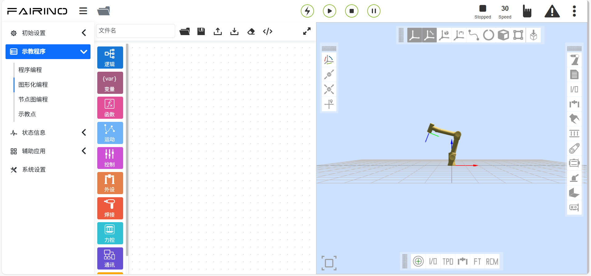

.. centered:: 圖表 10.1‑1 圖形化程式設計介面

**操作欄**

1) **載入**：負責workspace的重新載入；
2) **導入**：負責導入相關圖形化程式設計程式；
3) **匯出**：負責匯出已儲存的工作區中的圖形化程式設計程式「儲存」按鈕功能為程式碼區塊編輯完成後儲存為對應的示教程式；
4) **儲存**：負責儲存已編輯好的圖形化程式碼區塊；
5) **清空**：負責快速清空程式碼編輯區；
6) **代碼**：負責將代碼區塊轉譯成Lua代碼。

**Toolbox**

1) 包含所有指令和邏輯程式碼的程式碼區塊，可以拖曳到workspace建立程式碼區塊並編輯；
2) Toolbox工具列部分會根據指令類型進一步分類；
3) 邏輯類別指令：if-else，while等；
4) 基礎運動類指令：PTP，LIN，ARC等依據應用場景指令分類：塗膠，焊接，傳送帶等。在使用的過程中可以方便地找到所需程式碼區塊。

**Workspace**：在程式碼編輯區中可以編輯和展示圖形化的程式碼區塊。

邏輯類別圖形化程式命令
--------------------------
邏輯類別圖形化程式指令包含 迴圈、數字等邏輯指令。

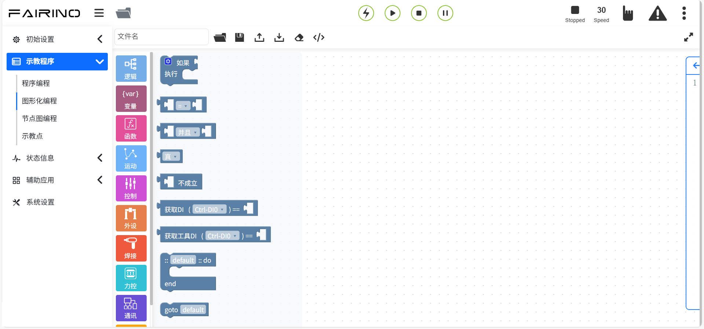

.. centered:: 圖表 10.2 邏輯類圖形化程式設計

If/Else判斷指令
~~~~~~~~~~~~~~~~~~~~~
拖曳「If/Else判斷指令」程式碼區塊,進入圖形化編輯介面工作區。 （指令需要一定程式設計基礎，如需協助，請聯絡我們）

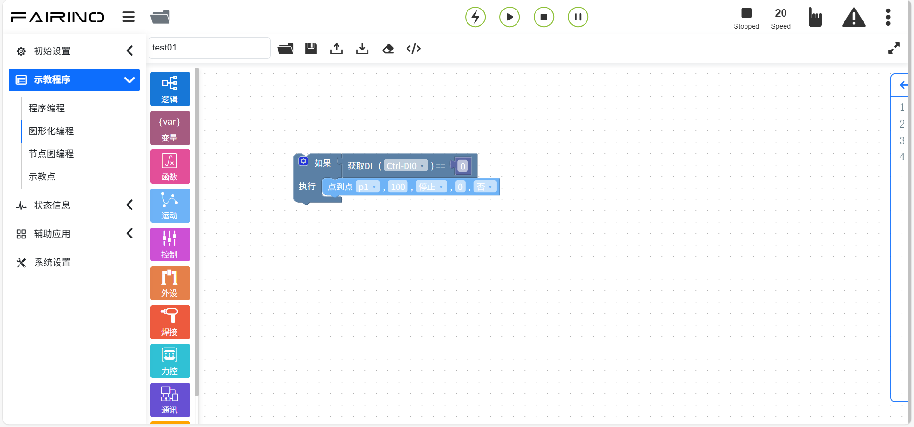

.. centered:: 圖表 10.2-1 If/Else判斷指令碼區塊

While指令
~~~~~~~~~~~~~~~~~~~~~
拖曳「While指令」程式碼區塊,進入圖形化編輯介面工作區。 （指令需要一定程式設計基礎，如需協助，請聯絡我們）

在While後方新增輸入等待條件，在while內部新增運動指令碼區塊，點選儲存即可。 （為方便操作，可任意輸入do內容，在程式中編輯其他指令插入取代）

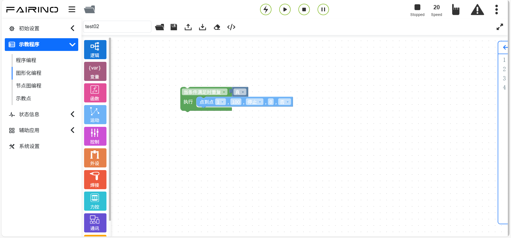

.. centered:: 圖表 10.2-2 While指令代碼區塊

跳躍指令
~~~~~~~~~~~~~~~~~~~~~
拖曳「跳轉指令」程式碼區塊,進入圖形化編輯介面工作區。 （指令需要一定程式設計基礎，如需協助，請聯絡我們）

- 跳轉名稱：輸入跳轉名稱，來決定跳轉位置

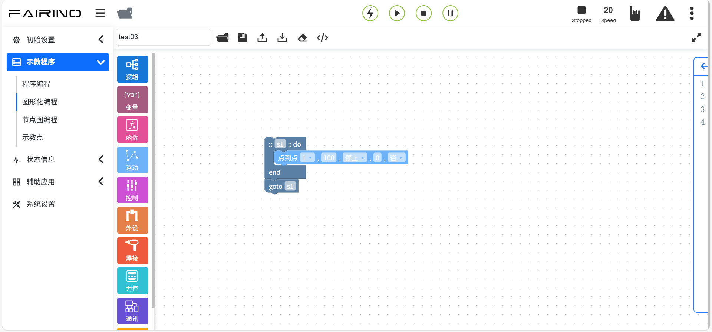

.. centered:: 圖表 10.2-3 跳轉指令程式碼區塊

.. important:: 跳躍名稱不能以數字開頭。

變數類別圖形化程式命令
--------------------------
變數類別圖形化程式設計指令包含建立變數指令。

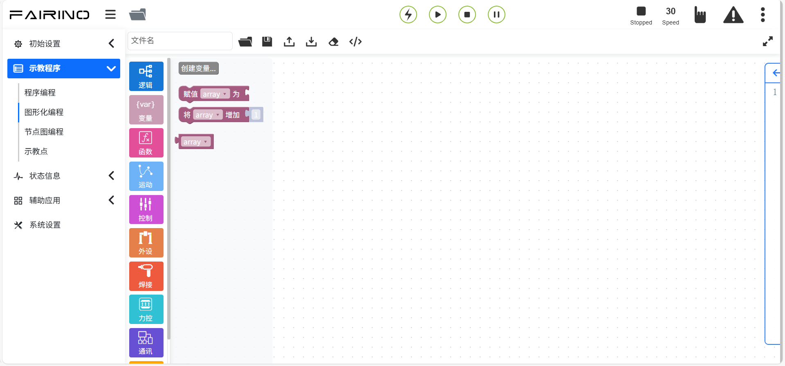

.. centered:: 圖表 10.3 變數類別圖形化程式設計

變數指令
~~~~~~~~~~~~~~~~~~~~~
點選「建立」按鈕，可輸入需定義得變數名稱。

拖曳「變數指令」程式碼區塊,進入圖形化編輯介面工作區。

“變數”指令節點,參數：

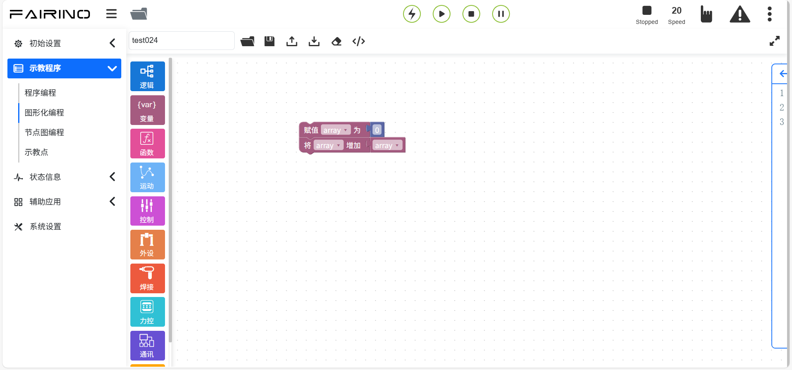

.. centered:: 圖表 10.3-1 變數指令碼區塊

函數類別圖形化程式命令
--------------------------
函數類別圖形化程式指令包含建立函數指令。

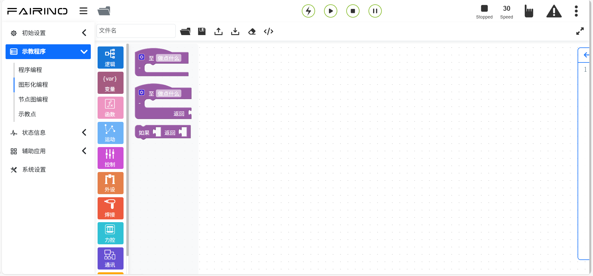

.. centered:: 圖表 10.4 函數類別圖形化程式設計

函數方法指令
~~~~~~~~~~~~~~~~~~~~~
拖曳「函數方法指令」程式碼區塊,進入圖形化編輯介面工作區。

“函數方法”指令節點,參數：

- 函數名稱：運行的函數名稱

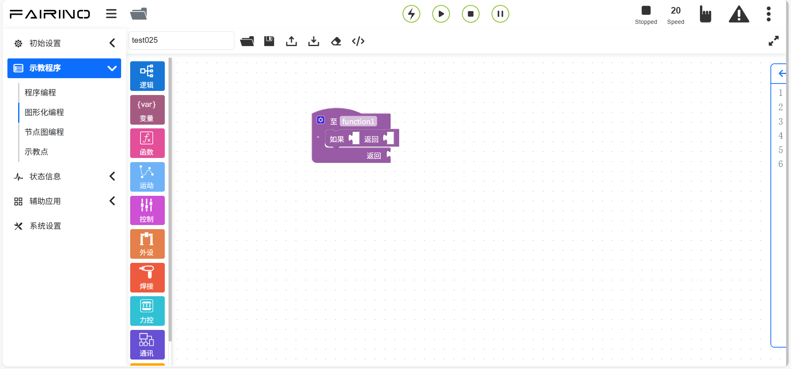

.. centered:: 圖表 10.4-1 函數方法指令程式碼區塊

運動類圖形化程式指令
--------------------------
運動類圖形化程式指令包含 PTP、Lin 、ARC等運動指令。

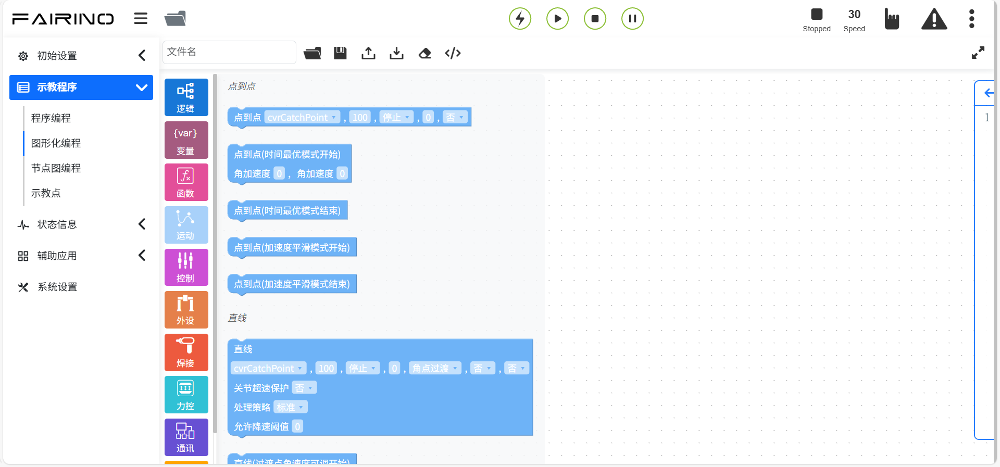

.. centered:: 圖表 10.5 運動類圖形化編程

點到點指令
~~~~~~~~~~~~~~~~~~~~~
拖曳「點到點指令」程式碼區塊,進入圖形化編輯介面工作區。

可以選擇需要到達的點，平滑過渡時間設置可以實現該點到下一點的運動是連續的，是否偏移設置，可以選擇基於基坐標系偏移和基於工具坐標偏移，並彈出x,y, z,rx,ry,rz偏移量設置，PTP具體路徑為運動控制器自動規劃的最優路徑。

“點到點”指令節點,參數：

- 點名稱：示教點位

- 調試速度(%)：0 ~ 100

- 停止：false/true

- 平滑過渡(ms)：平滑過渡時間 0 ~ 500

- 是否偏移 否/基底座標偏移/工具座標偏移 選擇否時，dx~drz參數值不生效

- dx~drz：偏移量

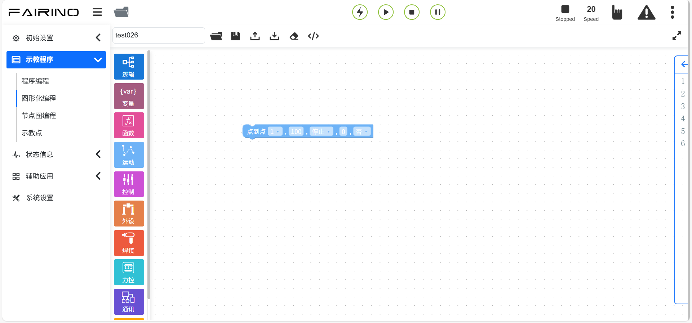

.. centered:: 圖表 10.5-1 點到點指令程式碼區塊

直線指令
~~~~~~~~~~~~~~~~~~~~~
拖曳「直線指令」程式碼區塊,進入圖形化編輯介面工作區。

此指令功能與「點到點」指令相似，但該指令所到達點的路徑為直線。

“直線”指令節點,參數：

- 點名稱：示教點位

- 調試速度(%)：0 ~ 100

- 停止：false/true，選擇true時，平滑過渡參數值不生效

- 平滑過渡(mm)：平滑過渡半徑 0 ~ 1000

- 是否尋位元：false/true

- 尋位點變數：REF0~99/RES0~99，是否尋位選擇false時，參數不生效

- 是否偏移： 否

- 關節超速保護：否/是

- 處理策略：標準/超速時報錯誤停止/自適應降速

- 允許降速閾值：0~100

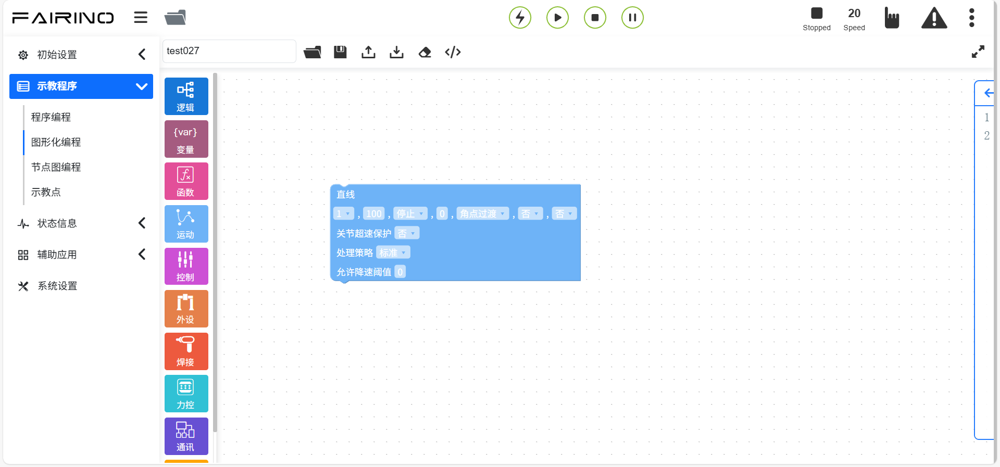

.. centered:: 圖表 10.5-2 直線指令程式碼區塊

直線（過渡點角速度可調）指令
~~~~~~~~~~~~~~~~~~~~~~~~~~~~~~~~~~~~~~~~~~~~~~~~~~~ ~~~~~
拖曳「直線（過渡點角速度可調）指令」程式碼區塊,進入圖形化編輯介面工作區。

此指令功能與「點到點」指令相似，但指令包含過渡點角速度可調。

「直線（過渡點角速度可調）」指令節點,參數：

- 點名稱：示教點位

- 調試速度(%)：0 ~ 100

- 停止：false/true，選擇true時，平滑過渡參數值不生效

- 平滑過渡(mm)：平滑過渡半徑 0 ~ 1000

- 是否尋位元：false/true

- 尋位點變數：REF0~99/RES0~99，是否尋位選擇false時，參數不生效

- 是否偏移： 否

- 過渡點角速度可調：否/是

- 最大角速度：0~300

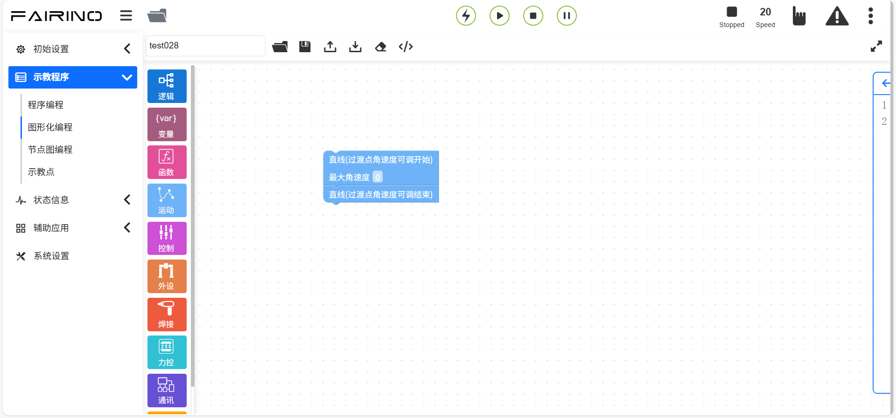

.. centered:: 圖表 10.5-3 直線（過渡點角速度可調）指令程式碼區塊

直線(seamPos)指令
~~~~~~~~~~~~~~~~~~~~~
拖曳「直線(seamPos)指令」程式碼區塊,進入圖形化編輯介面工作區。

此指令功能應用於焊接場景中使用雷射感測器。

“直線(seamPos)”指令節點,參數：

- 點名稱：示教點位

- 調試速度(%)：0 ~ 100

- 停止：false/true，選擇true時，平滑過渡參數值不生效

- 平滑過渡(mm)：平滑過渡半徑 0 ~ 1000

- 焊縫快取資料選擇：執行規劃資料/執行記錄數據

- 板材類型：波紋板/瓦楞板/圍籬板/油桶/波紋甲殼鋼

- 是否偏移： 否/基底座標偏移/工具座標偏移/雷射原始資料偏移 選擇否時，dx~drz參數值不生效

- dx~drz：偏移量

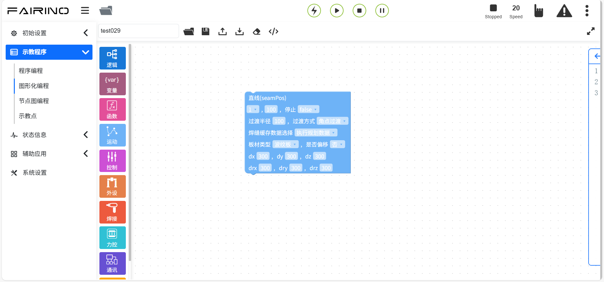

.. centered:: 圖表 10.5-4 直線(seamPos)指令碼塊

圓弧指令
~~~~~~~~~~~~~~~~~~~~~
拖曳「圓弧指令」程式碼區塊,進入圖形化編輯介面工作區。

圓弧運動包含兩個點，第一點為圓弧中間過渡點，第二點為終點，過渡點和終點都可以對是否偏移進行設置，可以選擇基於基坐標系偏移和基於工具坐標偏移，設定x,y,z,rx,ry,rz偏移量，終點可以設定平滑過渡半徑，實現運動連續效果。

“圓弧”指令節點,參數：

- 圓弧中間點：示教點位

- 是否偏移： 否/基底座標偏移/工具座標偏移 選擇否時，dx~drz參數值不生效

- dx~drz：偏移量

- 圓弧終點：示教點位

- 是否偏移： 否/基底座標偏移/工具座標偏移 選擇否時，dx~drz參數值不生效

- dx~drz：偏移量

- 調試速度(%)：0 ~ 100

- 停止：false/true，選擇true時，平滑過渡參數值不生效

- 平滑過渡(mm)：平滑過渡半徑 0 ~ 1000

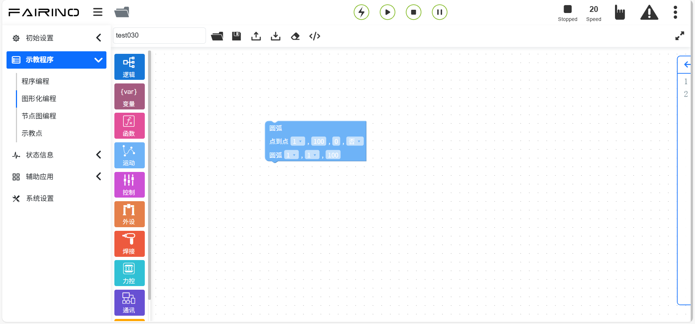

.. centered:: 圖表 10.5-5 圓弧指令碼區塊

整圓指令
~~~~~~~~~~~~~~~~~~~~~
拖曳「整圓指令」程式碼區塊,進入圖形化編輯介面工作區。

點選「整圓」指令節點,進入節點圖編輯介面。

整圓運動包含兩個點，第一點為整圓中間過渡點1，第二點為整圓中間過渡點2，過渡點2可以設定是否偏移，該偏移量同時生效於過渡點1和過渡點2

“整圓”指令節點,參數：

- 整圓中間點1：示教點位

- 整圓中間點2：示教點位

- 調試速度(%)：0 ~ 100

- 是否偏移： 否/基底座標偏移/工具座標偏移 選擇否時，dx~drz參數值不生效

- dx~drz：偏移量

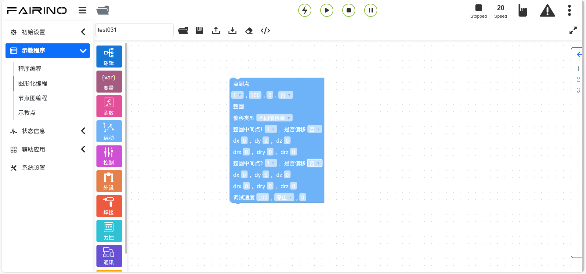

.. centered:: 圖表 10.5-6 整圓指令程式碼區塊

螺旋指令
~~~~~~~~~~~~~~~~~~~~~
拖曳「螺旋指令」程式碼區塊,進入圖形化編輯介面工作區。

螺旋線運動包含三個點，該三個點組成一個圓，在第三點設置頁面，包含螺旋圈數，姿態修正角，半徑增量和轉軸方向增量這幾個參數設置，螺旋圈數即此螺旋線的運動圈數，姿態修正角修正的是螺旋線結束時的姿態與螺旋線第一點的姿態，半徑增量即每一圈半徑的增量，轉軸方向增量即螺旋軸方向的增量。設定 是否偏移，該偏移量生效於整個螺旋線的軌跡。

“螺旋”指令節點,參數：

- 螺旋線中間點1：示教點位

- 螺旋線中間點2：示教點位

- 螺旋線中間點3：示教點位

- 調試速度(%)：0 ~ 100

- 是否偏移： 否/基底座標偏移/工具座標偏移 選擇否時，dx~drz參數值不生效

- dx~drz：偏移量

- 螺旋圈數：0 ~ 100

- 姿態角修正rx(°)：-1000 ~ 1000

- 姿態角修正ry(°)：-1000 ~ 1000

- 姿態角修正rz(°)：-1000 ~ 1000

- 半徑增量(mm)：-100 ~ 100

- 轉軸方向增量(mm)：-100 ~ 100

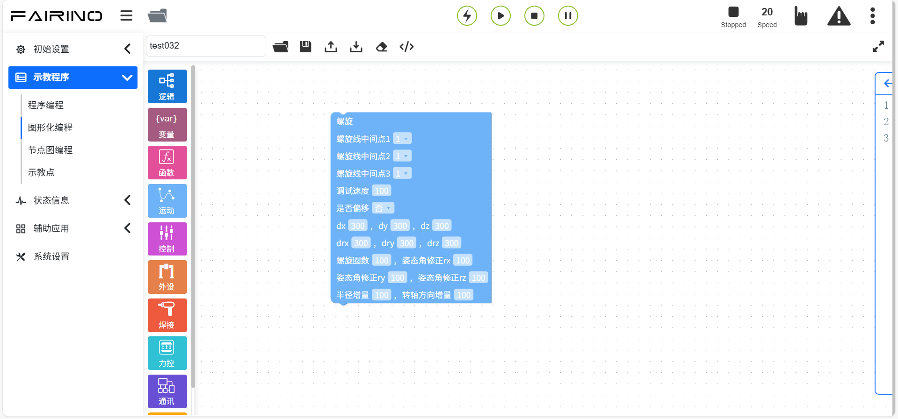

.. centered:: 圖表 10.5-7 螺旋指令代碼區塊

新螺旋指令
~~~~~~~~~~~~~~~~~~~~~
拖曳「新螺旋指令」程式碼區塊,進入圖形化編輯介面工作區。

點選「新螺旋」指令節點,進入節點圖編輯介面。

新螺旋運動為優化版螺旋線運動，指令只需要一個點加各參數的配置來實現螺旋線運動。機器人以目前位置為起點，使用者設定調試速度，是否偏移，螺旋圈數，螺旋傾角，初始半徑，半徑增量，轉軸方向增量和旋轉方向這幾個參數，螺旋圈數即該螺旋線的運動圈數，螺旋傾角即工具Z軸與水平方向的夾角，姿態修正角修正的是螺旋線結束時的姿態與螺旋線第一點的姿態，初始半徑即第一圈半徑大小，半徑增量即每一圈半徑的增量，轉軸方向增量即螺旋軸方向的增量，旋轉方向即順時針和逆時針。

“新螺旋”指令節點,參數：

- 螺旋線起點：示教點位

- 調試速度(%)：0 ~ 100

- 是否偏移： 否/基底座標偏移/工具座標偏移 選擇否時，dx~drz參數值不生效

- dx~drz：偏移量

- 螺旋圈數：0 ~ 100

- 螺旋傾角(°)：-100 ~ 100

- 初始半徑：0 ~ 100

- 半徑增量(mm)：-100 ~ 100

- 轉軸方向增量(mm)：-100 ~ 100

- 旋轉方向：順時針/逆時針

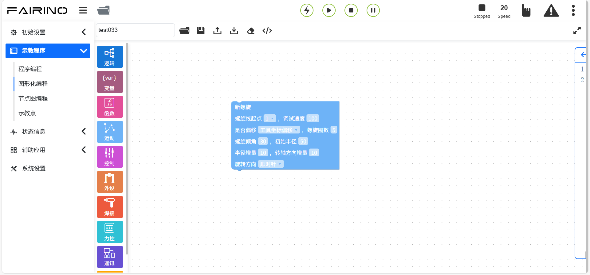

.. centered:: 圖表 10.5-8 新螺旋指令代碼區塊

水平螺旋指令
~~~~~~~~~~~~~~~~~~~~~
拖曳「水平螺旋指令」程式碼區塊,進入圖形化編輯介面工作區。

「H-Spiral」指令為水平空間螺旋線移動，指令設定於單段運動（直線）指令之後。

“水平螺旋”指令節點,參數：

- 螺旋半徑: 0~100mm

- 螺旋角速度: 0~2rev/s

- 旋轉方向: 螺旋順/逆時針

- 螺旋傾角: 0~40°

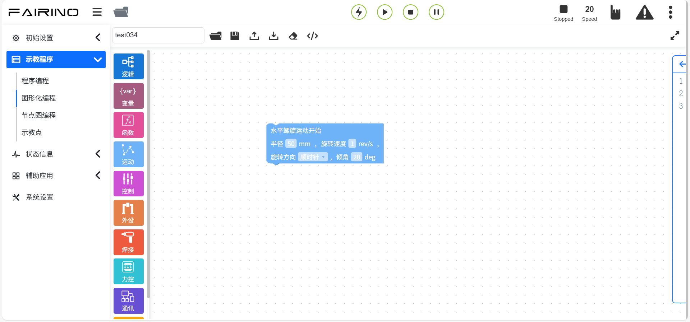

.. centered:: 圖表 10.5-9 水平螺旋指令碼區塊

樣條指令
~~~~~~~~~~~~~~~~~~~~~
拖曳「樣條指令」程式碼區塊,進入圖形化編輯介面工作區。

指令分為樣條組起始，樣條段和樣條組結束三部分，樣條組開始是樣條運動的起始標誌，樣條段目前節點圖只包含SPL段，樣條組結束是樣條運動的結束標誌。

“樣條-SPTP”指令節點,參數：

- 點名稱：示教點位

- 調試速度(%)：0 ~ 100

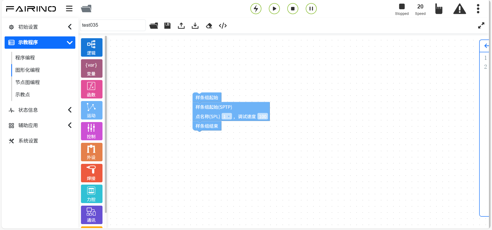

.. centered:: 圖表 10.5-10 樣條指令碼區塊

新樣條指令
~~~~~~~~~~~~~~~~~~~~~
拖曳「新樣條指令」程式碼區塊,進入圖形化編輯介面工作區。

該指令為樣條指令演算法最佳化指令，後續會取代現有的樣條指令，該指令分為多點軌跡起始，多點軌跡段和多點軌跡結束三部分，多點軌跡開始是多點軌跡運動的起始標誌，多點軌跡段即設定各個軌跡點，點選圖示進入點位新增介面，多點軌跡結束是多點軌跡運動的結束標誌，在此可以設定控制模式和調試速度，控制模式分為給定控制點和給定路徑點。

“新樣條”指令節點,參數：

- 控制模式：示教點位

- 全域平均銜接時間：整數型，大於10，預設值為2000ms

“新樣條-SPL”指令節點,參數：

- 點名稱：示教點位

- 調試速度(%)：0 ~ 100

- 平滑過渡半徑：0 ~ 1000

- 是否最後一點：否/是

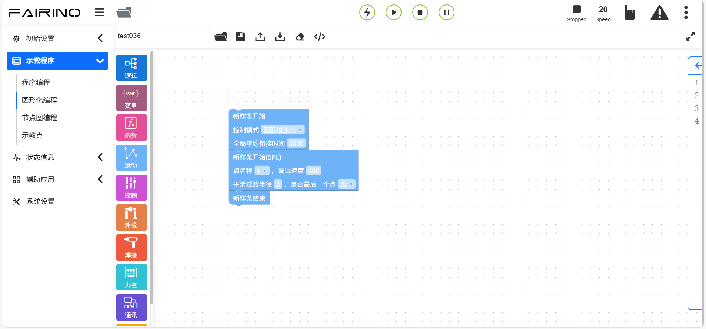

.. centered:: 圖表 10.5-11 新樣條指令碼區塊

擺動指令
~~~~~~~~~~~~~~~~~~~~~
拖曳「擺動指令」程式碼區塊,進入圖形化編輯介面工作區。

“擺動”指令節點,參數：

- 編號：0~7

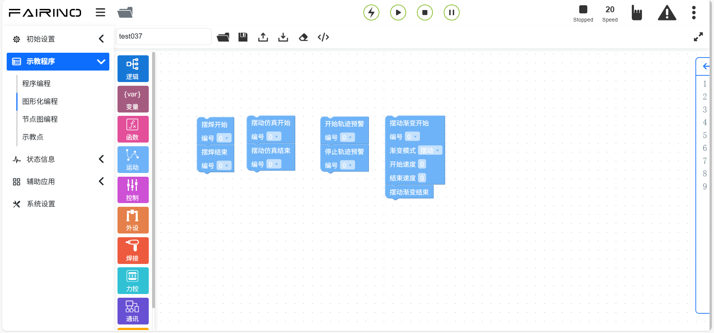

.. centered:: 圖表 10.5-12 擺動指令程式碼區塊

點偏移指令
~~~~~~~~~~~~~~~~~~~~~
拖曳「點偏移指令」程式碼區塊,進入圖形化編輯介面工作區。

此指令為整體偏移指令，輸入各個偏移量，運動指令會基於基底座標（或工件座標）進行偏移。

“點偏移”指令節點,參數：

- ∆x：偏移量，-300~300

- ∆y：偏移量，-300~300

- ∆z：偏移量，-300~300

- ∆rx：偏移量，-300~300

- ∆ry：偏移量，-300~300

- ∆rz：偏移量，-300~300

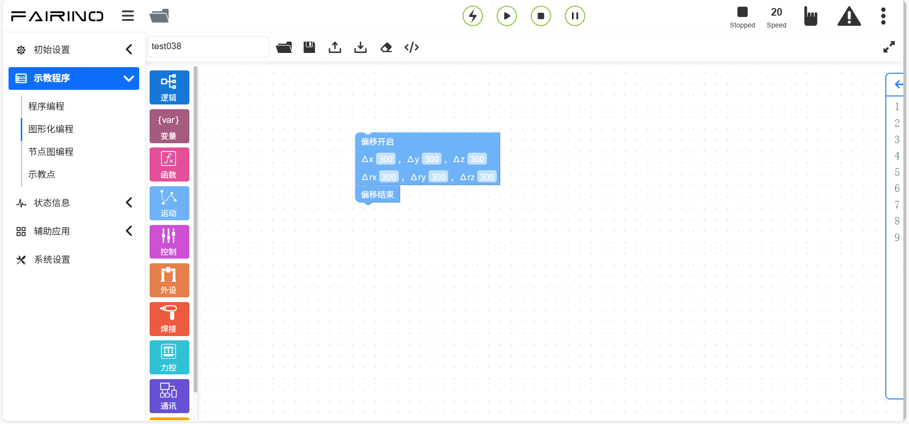

.. centered:: 圖表 10.5-13 點偏移指令碼區塊

伺服指令
~~~~~~~~~~~~~~~~~~~~~
拖曳「伺服指令」程式碼區塊,進入圖形化編輯介面工作區。

伺服控制（笛卡爾空間運動）指令，該指令可以透過絕對位姿控製或基於當前位姿偏移來控制機器人運動。

“伺服”指令節點,參數：

- 運動方式：絕對位置/基底座標偏移/工具座標偏移

- x：偏移量，-300~300

- y：偏移量，-300~300

- z：偏移量，-300~300

- rx：偏移量，-300~300

- ry：偏移量，-300~300

- rz：偏移量，-300~300

- 比例係數x：0~1

- 比例係數y：0~1

- 比例係數z：0~1

- 比例係數rx：0~1

- 比例係數ry：0~1

- 比例係數rz：0~1

- 加速度(%)：0~100

- 速度(%)：0~100

- 指令週期(s)：0.001~0.016

- 濾波時間(s)：0~1

- 比例放大：0~100

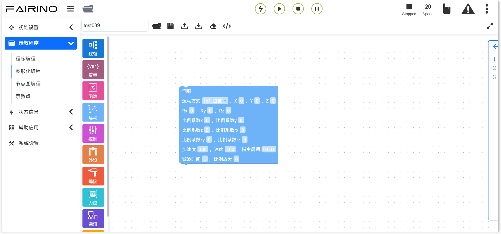

.. centered:: 圖表 10.5-14 伺服指令程式碼區塊

軌跡指令
~~~~~~~~~~~~~~~~~~~~~
拖曳「軌跡指令」程式碼區塊,進入圖形化編輯介面工作區。

在該指令中，使用者首先需要有記錄好的軌跡。

“軌跡”指令節點,參數：

- 選擇軌跡檔：記錄好的軌跡

- 偵錯速度(%)：0 ~ 100，預設值為25

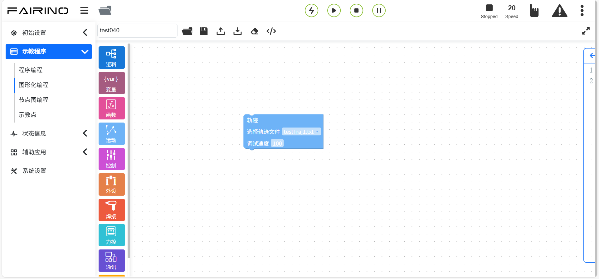

.. centered:: 圖表 10.5-15 軌跡指令程式碼區塊

軌跡J指令
~~~~~~~~~~~~~~~~~~~~~
拖曳「軌跡J指令」程式碼區塊,進入圖形化編輯介面工作區。

在該指令中，使用者首先需要有記錄好的軌跡，可以在示教程式介面預先匯入軌跡檔。軌跡指令和軌跡J指令適用於相機直接給定軌蹟的通用接口，滿足在已有固定格式的離散的軌跡點文件時，可導入系統使得機器人按照導入文件的軌跡進行運動。

“軌跡J”指令節點,參數：

- 選擇軌跡檔：記錄好的軌跡

- 偵錯速度(%)：0 ~ 100，預設值為25

- 軌跡模式：路徑點/控制點

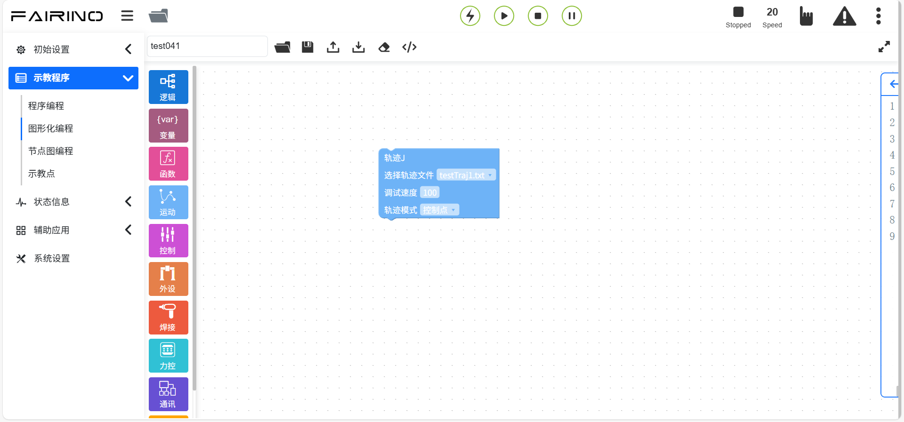

.. centered:: 圖表 10.5-16 軌跡J指令碼塊

軌跡復現指令
~~~~~~~~~~~~~~~~~~~~~
拖曳「軌跡復現指令」程式碼區塊,進入圖形化編輯介面工作區。

在該指令中，使用者首先需要有記錄好的軌跡。

進行程式編程時，先用點到點指令到達對應軌跡起始點，然後在軌跡複現指令中選擇軌跡，選擇平滑軌跡，設定調試速度。軌跡載入指令主要用於預先讀取軌跡文件，提取成軌跡指令，更好的應用於傳送帶追蹤場景。

“軌跡復現”指令節點,參數：

- 軌跡名稱：記錄好的軌跡

- 平滑軌跡：否/是

- 偵錯速度(%)：0 ~ 100，預設值為25

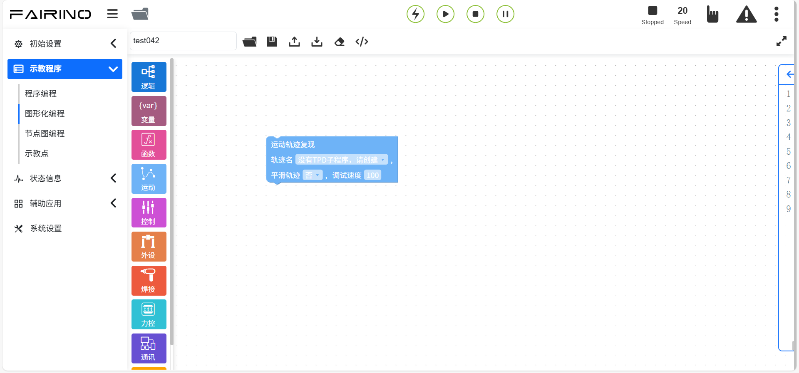

.. centered:: 圖表 10.5-17 軌跡復現指令碼區塊

DMP指令
~~~~~~~~~~~~~~~~~~~~~
拖曳「DMP指令」程式碼區塊,進入圖形化編輯介面工作區。

DMP是一種軌跡模仿學習的方法，需要事先規劃參考軌跡。在指令編輯介面 ，選擇示教點作為新的起點，點選「新增」、「應用」後可儲存指令。 DMP具體路徑為以新的起點模仿參考軌跡的新軌跡。

“DMP”指令節點,參數：

- 點名稱：示教點

- 偵錯速度(%)：0 ~ 100，預設值為100

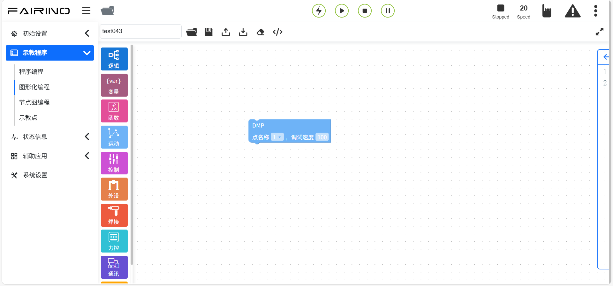

.. centered:: 圖表 10.5-18 DMP指令碼區塊

工具轉換指令
~~~~~~~~~~~~~~~~~~~~~
拖曳「工具轉換指令」程式碼區塊,進入圖形化編輯介面工作區。

選擇要進行自動轉換的工具座標系，點選「新增」、「應用」後可儲存該指令，工具座標系下點位自動轉換。

“工具轉換”指令節點,參數：

- 工具座標系：工具座標系列表

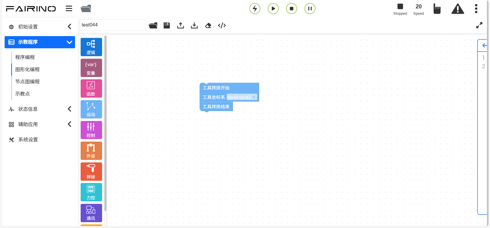

.. centered:: 圖表 10.5-19 工具轉換指令程式碼區塊

工件轉換指令
~~~~~~~~~~~~~~~~~~~~~
拖曳「工件轉換指令」程式碼區塊,進入圖形化編輯介面工作區。

選擇要進行自動轉換的工件座標系，點選「新增」、「應用」後可儲存指令，工件座標系下點位自動轉換。

“工件轉換”指令節點,參數：

- 工件座標系：工件座標系列表

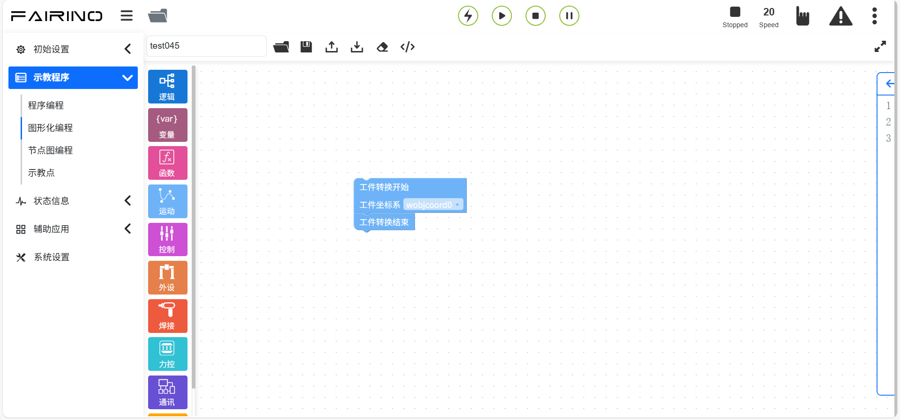

.. centered:: 圖表 10.5-20 工件轉換指令程式碼區塊

控制類別圖形化程式命令
--------------------------
控制類別圖形化程式指令包含Wait、IO等控制指令。

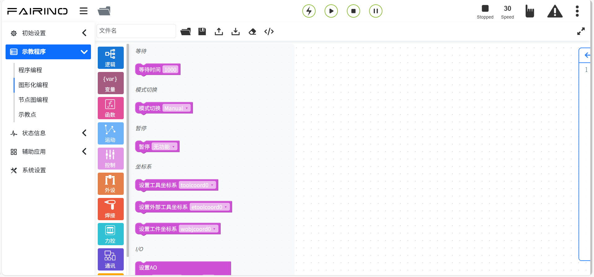

.. centered:: 圖表 10.6 控制類別圖形化程式命令

等待指令
~~~~~~~~~~~~~~~~~~~~~
拖曳「等待指令」程式碼區塊,進入圖形化編輯介面工作區。

該指令為延時指令，分為「WaitMs」、「WaitDI」、「WaitMultiDI」和「WaitAI」四個部分。

1. “等待”指令節點,參數：

- 等待時間(ms): 延遲等待時間單位為毫秒，輸入需要等待的毫秒數

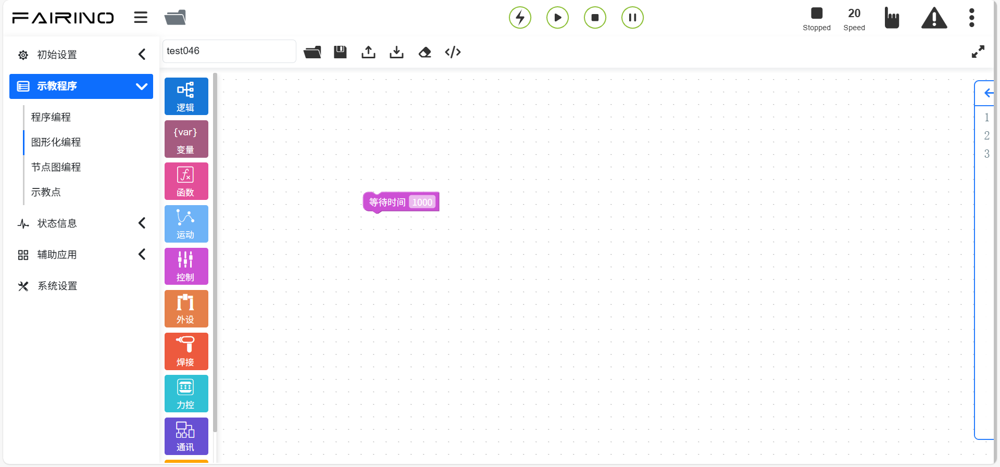

.. centered:: 圖表 10.6-1 等待指令程式碼區塊

2. “等待DI”指令節點,參數：

- DI埠號： Ctrl-DI0 ~ Ctrl-CI7(WaitDI,[0~15]), End-DI0 ~ End-DI1(WaitToolDI,[0~1])

- 狀態： false/true

- 最大時間(ms)： 0 ~ 10000

- 等待逾時處理：停止報錯/繼續執行/一直等待

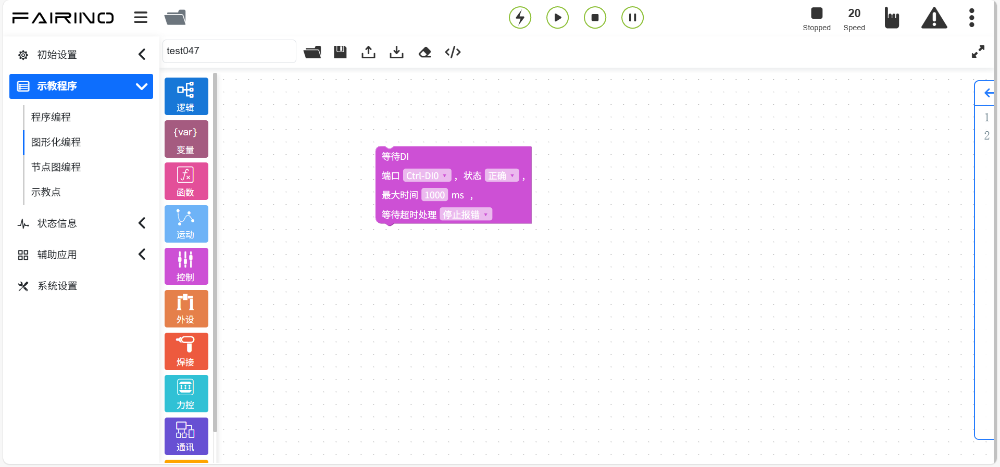

.. centered:: 圖表 10.6-2 等待DI指令程式碼區塊

3. “等待多條DI”指令節點，參數:

- 條件： 與/或

- 條件選擇：選擇位元的狀態開啟的連接埠號，以逗號隔開，例DI0,DI1

- 真值對應埠：選擇真值的埠號，以逗號隔開，例DI0,DI1

- 最大時間(ms)：0 ~ 10000,最大等待時間

- 等待逾時處理：停止報錯/繼續執行/一直等待

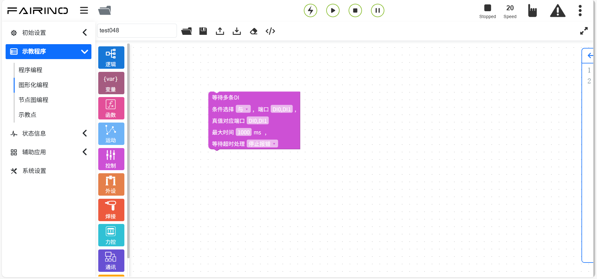

.. centered:: 圖表 10.6-3 等待多條DI指令碼區塊

4. “等待AI”指令節點，參數:

- 條件： 與/或

- AI埠號： Ctrl-AI0 ~ Ctrl-AI1(WaitAI,[0~1]), End-AI0(WaitToolAI,[0])

- 條件：大於/小於

- 數值(%)：1 ~ 100

- 最大時間(ms)：0 ~ 10000

- 等待超時處理：停止報錯/繼續執行/一直等待,等待超時處理一直等待時，最大時間預設為0

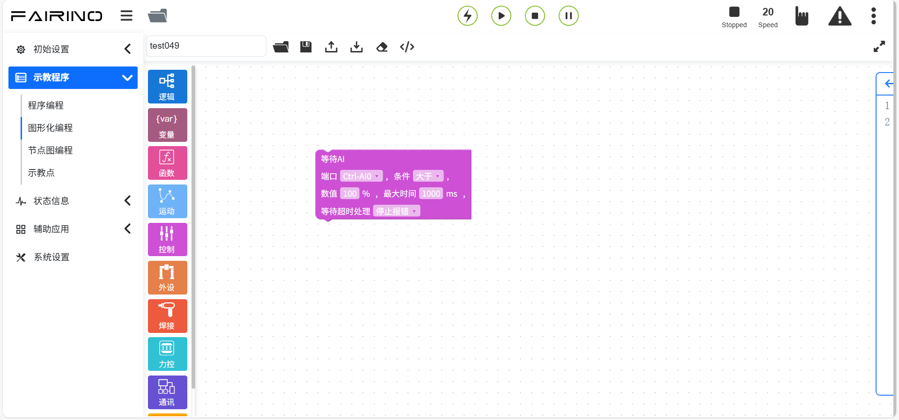

.. centered:: 圖表 10.6-4 等待AI指令代碼塊

模式切換指令
~~~~~~~~~~~~~~~~~~~~~
拖曳「模式切換指令」程式碼區塊,進入圖形化編輯介面工作區。

該指令可切換機器人到手動模式，通常在一個程式結尾處添加，以便用戶在程式運行結束後，使機器人自動切換到手動模式，拖曳機器人。

“模式切換”指令節點,參數：

- 模式切換：手動模式

.. centered:: 圖表 10.6-5 模式切換指令代碼區塊

暫停指令
~~~~~~~~~~~~~~~~~~~~~
拖曳「暫停指令」程式碼區塊,進入圖形化編輯介面工作區。

該指令為暫停指令，在程式中插入該指令，當程式執行到該指令時，機器人會處於暫停狀態，若想繼續運行，點擊控制區「暫停/恢復」按鍵即可。

“暫停”指令節點,參數：

- 暫停類型：無功能、汽缸未到位等

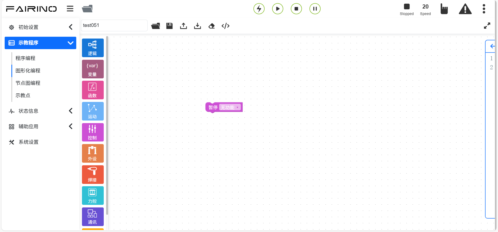

.. centered:: 圖表 10.6-6 暫停指令程式碼區塊

座標係指令
~~~~~~~~~~~~~~~~~~~~~
拖曳「設定工具座標系」/「設定工件座標系」程式碼區塊,進入圖形化編輯介面工作區。

1. “設定工具座標系”指令節點,參數：

- 工具座標系名稱：toolcoord1 ~ toolcoord19(SetToolList,[0~19]), etoolcoord0 ~ etoolcoord14(SetExToolList, [0~14])

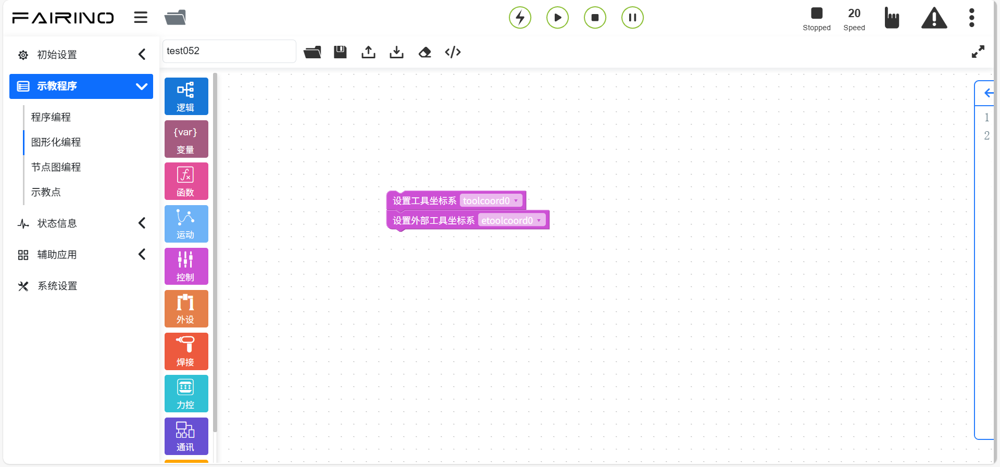

.. centered:: 圖表 10.6-7 設定工具座標係指令碼區塊

2. “設定工件座標系”指令節點,參數：

- 工件座標系名稱：wobjcoord1 ~ wobjcoord14

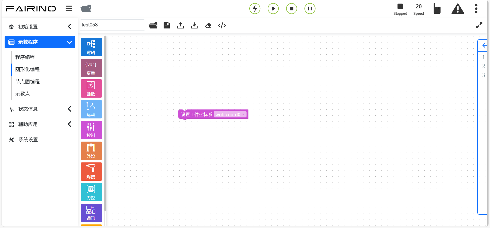

.. centered:: 圖表 10.6-8 設定工件座標係指令碼區塊

模擬AI指令
~~~~~~~~~~~~~~~~~~~~~
拖曳「設定AO」/「取得AI」程式碼區塊,進入圖形化編輯介面工作區。

在此指令中，分為設定類比輸出（SetAO/SPLCSetAO）和取得類比輸入（GetAI/SPLCGetAI）兩部分功能。

1. “設定AO”指令節點,參數：

- 埠：Ctrl-AO0 ~ Ctrl-AO1(阻塞:SetAO,非阻塞:SPLCSetAO,[0~1]), End-AO0(阻塞:SetToolAO,非阻塞:SPLCSetToolAO,[0])

- 數值(%)：0 ~ 100

- 是否阻塞：阻塞/非阻塞

- 是否應用線程：否/是

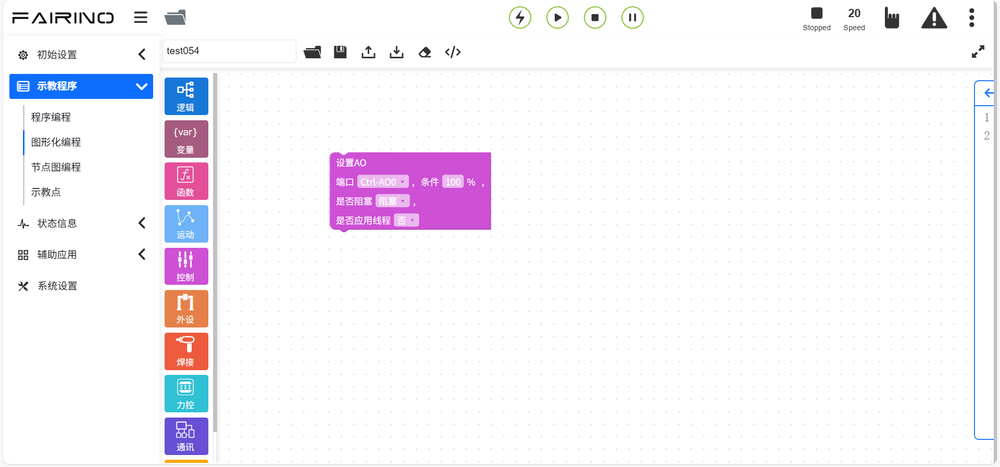

.. centered:: 圖表 10.6-9 設定AO指令代碼塊

2. “取得AI”指令節點,參數：

- 連接埠：Ctrl-AI0 ~ Ctrl-DI1(阻塞:GetAI,非阻塞:SPLCGetAI,[0~1]), End-AI0(阻塞:GetToolAI,非阻塞:SPLCGetToolAI,[0])

- 條件：大於/小於

- 數值(%)：0 ~ 100

- 最大時間(ms)：0 ~ 10000

- 是否阻塞：阻塞/非阻塞

- 是否應用線程：否/是

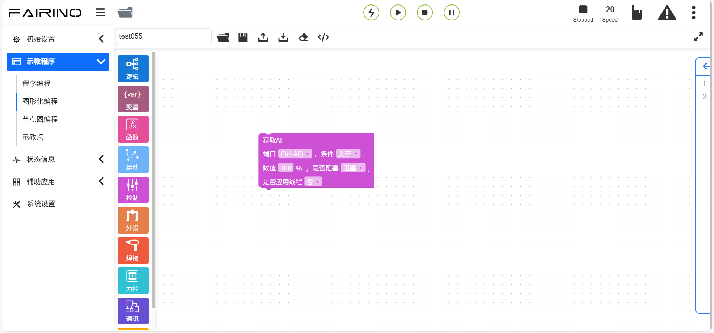

.. centered:: 圖表 10.6-10 取得AI指令代碼塊

數位IO指令
~~~~~~~~~~~~~~~~~~~~~
拖曳「設定DO」/「取得DI」程式碼區塊,進入圖形化編輯介面工作區。

指令為IO指令，分為設定IO（SetDO/SPLCSetDO）及取得IO（GetDI/SPLCGetDI）兩部分。

1. “設定DO”指令節點,參數：

- 連接埠：Ctrl-DO0 ~ Ctrl-CO7(阻塞:SetDO,非阻塞:SPLCSetDO,[0~15]), End-DO0 ~ End-DO1(阻塞:SetToolDO,非阻塞:SPLCSetToolDO,[0~1])

- 狀態：false/true

- 是否阻塞：阻塞/非阻塞

- 平滑軌跡：Break/Serious

- 是否應用線程：否/是

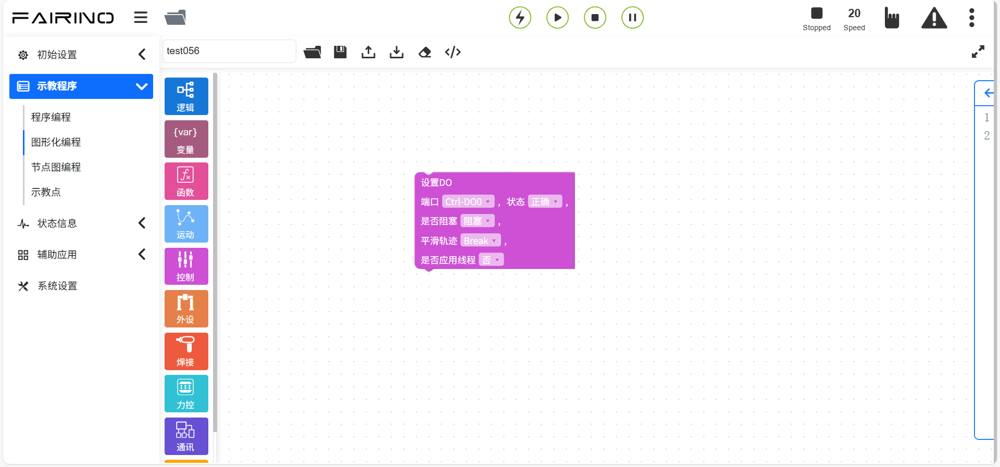

.. centered:: 圖表 10.6-11 設定DO指令代碼區塊

2. “取得DI”指令節點,參數：

- 連接埠：Ctrl-DI0 ~ Ctrl-CI7(阻塞:GetDI,非阻塞:SPLCGetDI,[0~15]), End-DI0 ~ End-DI1(阻塞:GetToolDI,非阻塞:SPLCGetToolDI,[0~1])

- 是否阻塞：阻塞/非阻塞

- 狀態：false/true

- 最大等待時間(ms)：0 ~ 10000

- 是否應用線程：否/是

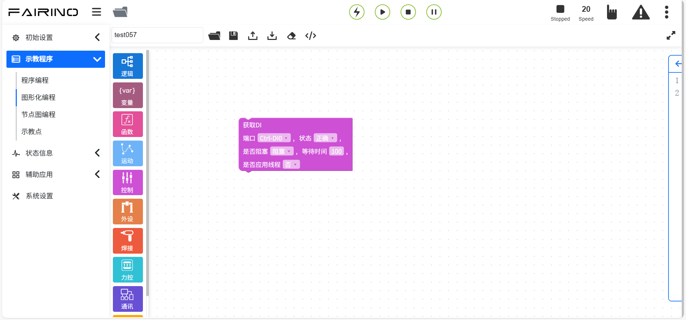

.. centered:: 圖表 10.6-12 取得DI指令程式碼區塊

運動DO指令
~~~~~~~~~~~~~~~~~~~~~
拖曳「運動DO指令」程式碼區塊,進入圖形化編輯介面工作區。

此指令實現直線運動過程中，根據設定的間隔，連續輸出DO訊號功能。

1. “運動DO連續輸出”指令節點,參數：

- 連接埠：Ctrl-DO0 ~ Ctrl-DO0(MoveDOStart,[0~15]), End-DO1(MoveDOStart,[0~1])

- 設定間隔(mm)：0 ~ 500

- 輸出脈衝佔空比(%)：0 ~ 99

2. “運動DO單次輸出”指令節點,參數：

- 埠：Ctrl-DO0 ~ Ctrl-DO0(MoveDOOnceStart,[0~15]), End-DO1(MoveDOOnceStart,[0~1])

- 輸出模式：等速段輸出/自由配置

- 置位時間(ms)：0 ~ 1000 (勻速段輸出模式預設為-1)

- 重設時間(ms)：0 ~ 1000 (勻速段輸出模式預設為-1)

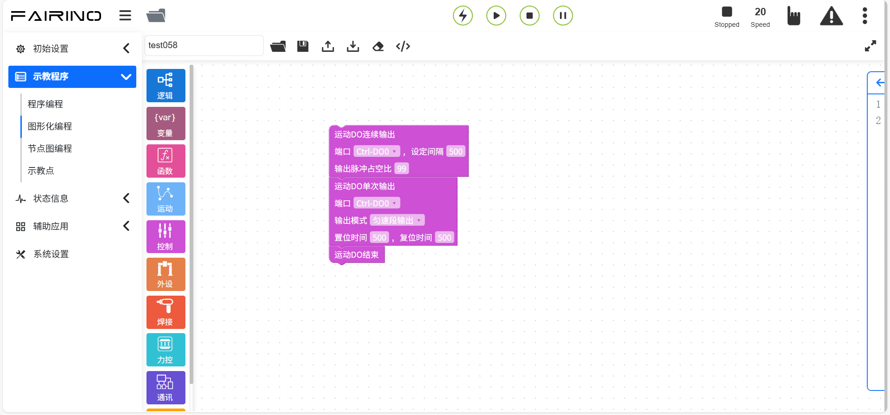

.. centered:: 圖表 10.6-13 “運動DO單次/連續輸出”指令碼區塊

運動AO指令
~~~~~~~~~~~~~~~~~~~~~
拖曳「運動AO指令」程式碼區塊,進入圖形化編輯介面工作區。

此指令配合運動指令使用時，可實現在運動過程中，依即時TCP速度按比例輸出AO訊號。

“運動AO”指令節點,參數：

- 控制箱AO編號：Ctrl-AO0 ~ Ctrl-AO1(MoveAOStart,[0~1]), End-AO0(MoveToolAOStart,0)

- 最大TCP速度：0 ~ 100

- 最大TCP速度AO百分比：0 ~ 100

- 死區補償值AO百分比：0 ~ 100

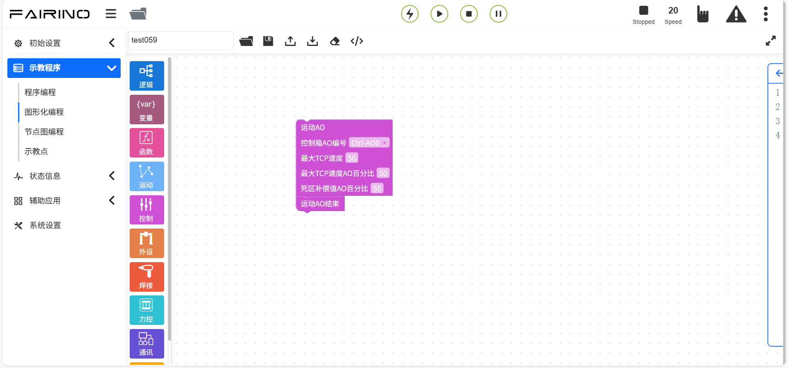

.. centered:: 圖表 10.6-14 “運動AO”指令代碼塊

碰撞等級指令
~~~~~~~~~~~~~~~~~~~~~
拖曳「碰撞等級指令」程式碼區塊,進入圖形化編輯介面工作區。

此指令碰撞等級設置，透過此指令可在程式運作中即時調整各軸碰撞等級，更靈活的部署應用場景。

“碰撞等級”指令節點,參數：

- 標準等級：標準等級/自訂百分比

- joint1-joint6(N)：0 ~ 100，碰撞閾值，陣列型

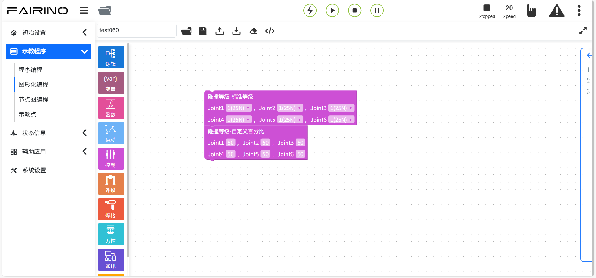

.. centered:: 圖表 10.6-15 碰撞等級指令碼區塊

加速度指令
~~~~~~~~~~~~~~~~~~~~~
拖曳「加速度指令」程式碼區塊,進入圖形化編輯介面工作區。

「加速度」指令是實現機器人加速度可單獨設定功能，透過調節運動指令加速度縮放因子，可以增加或減少加減速時間，實現機器人動作節拍時間可調。

“加速度”指令節點,參數：

- 加速度百分比(%)：0 ~ 100

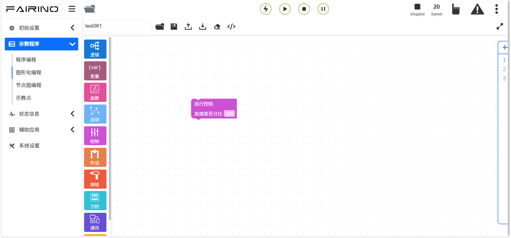

.. centered:: 圖表 10.6-16 加速度指令碼區塊

週邊類別圖形化程式命令
--------------------------
外設類圖形化編程指令包含夾爪、噴槍、擴展軸等周邊指令。

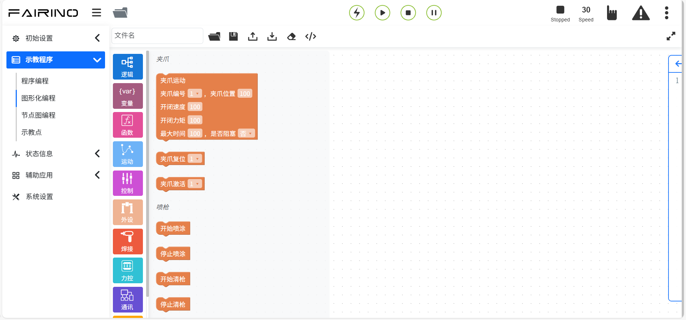

.. centered:: 圖表 10.7 週邊類別圖形化程式命令

夾爪指令
~~~~~~~~~~~~~~~~~~~~~
拖曳「夾爪運動」、「夾爪啟動」和「夾爪重設」代碼區塊,進入圖形化編輯介面工作區。

指令中，顯示完成配置並且已啟動的夾爪編號，對夾爪開閉、開閉速度和開閉力矩的設置，數值為百分比，是否阻塞功能選項，選擇阻塞即夾爪運動需等待上一條運動指令執行完才執行，選擇非阻塞即夾爪運動與上一條運動指令並行。

1. “夾爪運動”節點,參數：

- 夾爪編號：已啟動的夾爪編號

- 夾爪位置：0~100

- 開閉速度：0~100

- 開閉力矩：0~100

- 最大時間(ms)：0~30000

- 是否阻塞：false/true

.. centered:: 圖表 10.7-1 夾爪運動指令代碼塊

夾爪重設指令，顯示已經配置的夾爪編號，可以新增夾爪重設指令到程式中。

2. “夾爪復位”節點,參數：

- 夾爪編號：已啟動的夾爪編號

.. centered:: 圖表 10.7-2 夹爪重設指令碼區塊

夾爪啟動指令，顯示已經配置的夾爪編號，可以新增夾爪啟動指令到程式中。

3. “夾爪活化”節點,參數：

- 夾爪編號：已啟動的夾爪編號

.. centered:: 圖表 10.7-3 夾爪激活指令代碼塊

噴槍指令
~~~~~~~~~~~~~~~~~~~~~
拖曳「噴槍指令」程式碼區塊,進入圖形化編輯介面工作區。

該指令為噴塗相關指令，控制噴槍「開始噴塗」、「停止噴塗」、「開始清槍」和「停止清槍」。編輯該程式相關節點時，需確認已配置好噴槍外設，否則無法儲存。詳見機器人週邊章節。

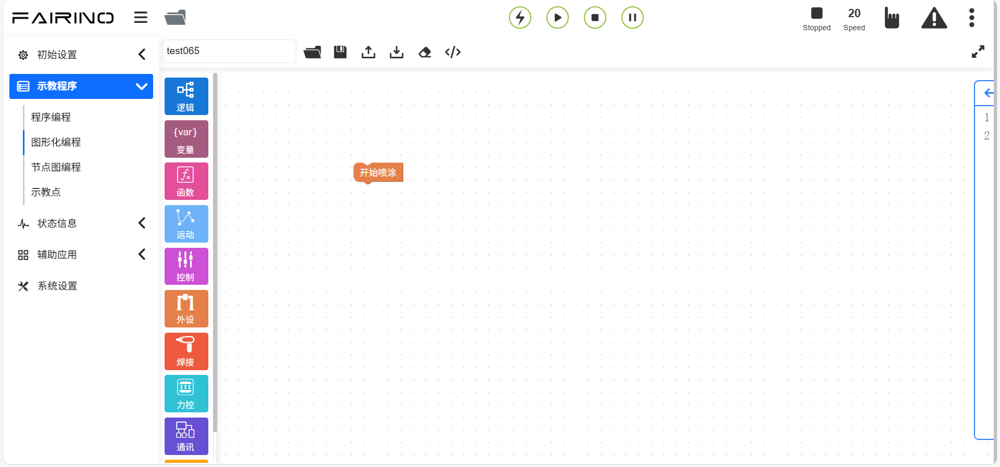

.. centered:: 圖表 10.7-4 開始噴塗指令代碼塊

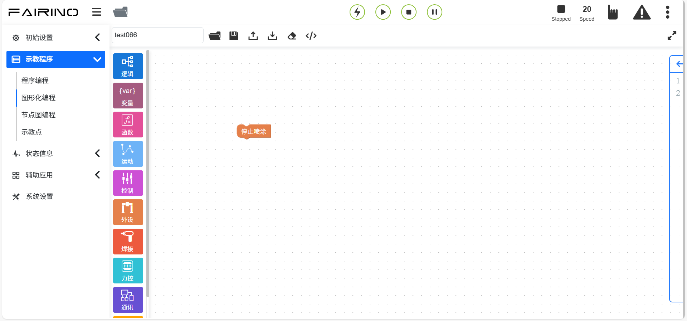

.. centered:: 圖表 10.7-5 停止噴塗指令代碼塊

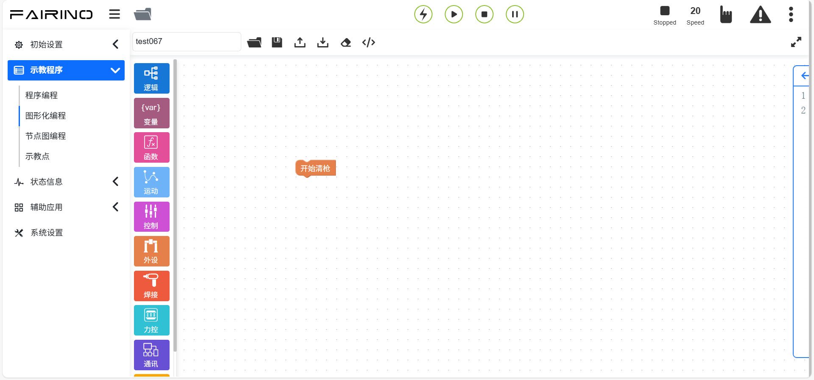

.. centered:: 圖表 10.7-6 開始清槍指令代碼區塊

.. centered:: 圖表 10.7-7 停止清槍指令代碼區塊

擴展軸指令（控制器+PLC）
~~~~~~~~~~~~~~~~~~~~~~~~~~
拖曳「擴充軸指令」程式碼區塊,進入圖形化編輯介面工作區。

此指令針對使用外部軸的場景，與PTP指令組合使用，可將空間上一點X軸方向上的移動分解到外部軸運動。選擇外部軸編號，運動方式選同步，選擇需要到達的點。

分為UDP通訊載入/設定、非同步運動、同步PTP/LIN運動、同步ARC運動、回零指令和啟用指令。

「UDP通訊配置」指令節點,輸入IP位址、連接埠號碼及通訊週期；

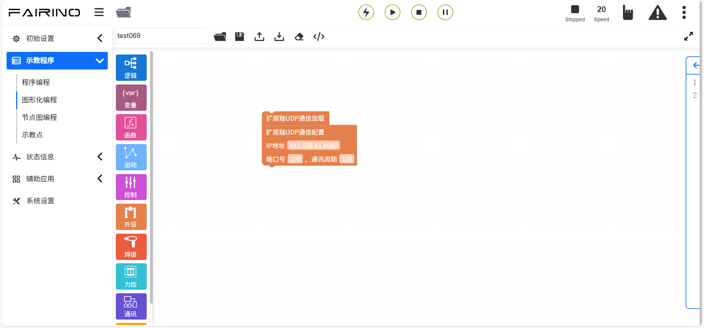

.. centered:: 圖表 10.7-8 UDP通訊設定指令碼區塊

“非同步運動”指令節點,參數：

- 點名稱：示教點位

- 調試速度(%)：0~100

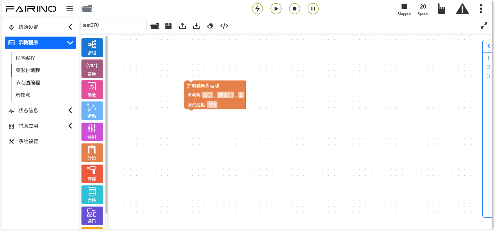

.. centered:: 圖表 10.7-9 非同步運動指令碼區塊

「同步PTP/LIN運動」指令節點,參數：

- 運動選擇：PTP/LIN

- 點名稱：示教點位

- 調試速度(%)：0~100

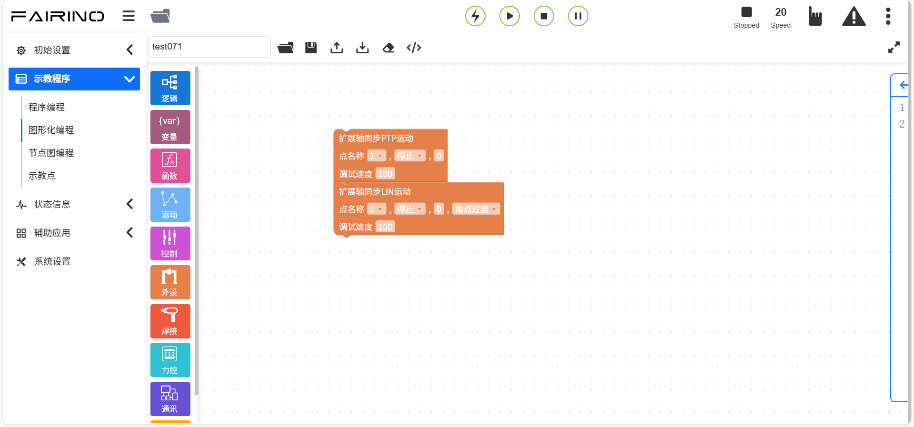

.. centered:: 圖表 10.7-10 「同步PTP/LIN運動」指令碼區塊

「同步ARC運動」指令節點,預設運動方式為ARC,參數：

點名稱：示教點位

調試速度(%)：0~100

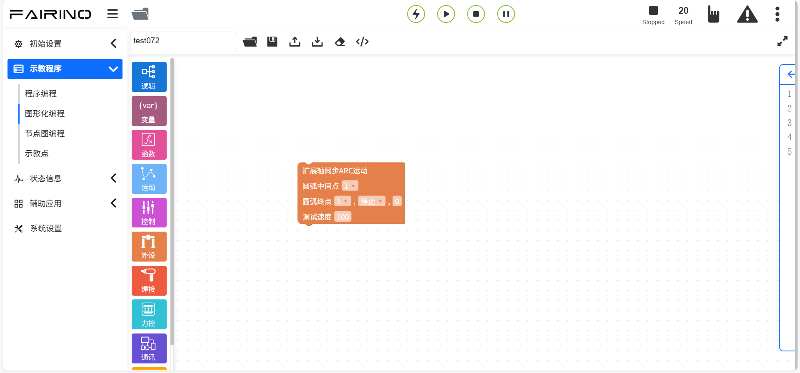

.. centered:: 圖表 10.7-11 “同步ARC運動”指令程式碼區塊

“擴展軸回零”指令節點,,參數：

- 擴充軸編號：1~4

- 回零方式：目前位置回零/負限位回零/正限位回零

- 尋零速度：0~2000，預設為5

- 零點箍位速度：0~2000，預設為1

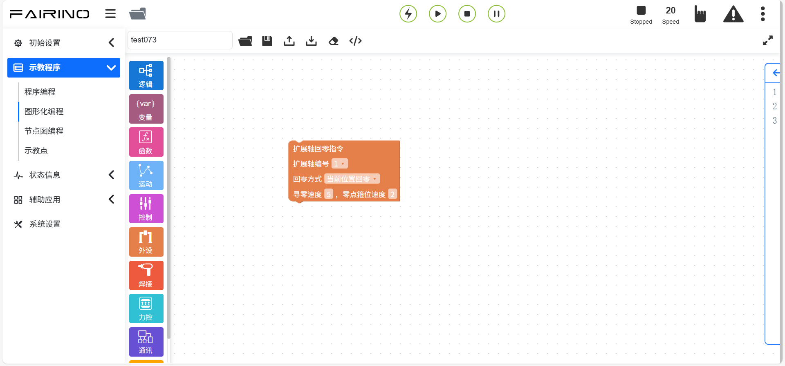

.. centered:: 圖表 10.7-12 擴展軸回零指令代碼塊

“擴展軸使能”指令節點,,參數：

- 擴充軸編號：1~4

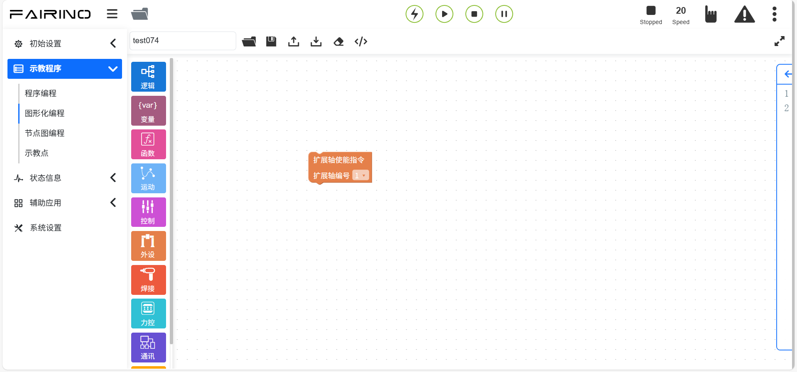

.. centered:: 圖表 10.7-13 擴展軸使能指令代碼塊

擴展軸指令（控制器+伺服驅動器）
~~~~~~~~~~~~~~~~~~~~~~~~~~~~~~~~~~~~
拖曳「擴充軸指令」程式碼區塊,進入圖形化編輯介面工作區。

此指令可對擴展軸參數進行配置。根據不同的控制模式設定不同的參數。已配置好的擴展軸，可對其零點設定。

分為伺服ID、控制模式、伺服啟用和伺服回零；控制模式中又分為位置模式和速度模式，這兩個節點需要結合控制模式使用，否則單獨添加無法生效。

“伺服ID”指令節點,,參數：

- 伺服ID：1~15

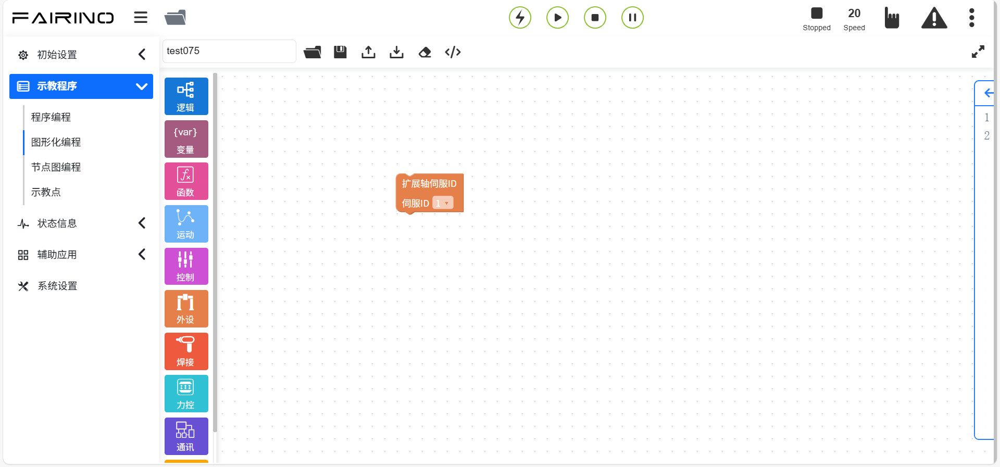

.. centered:: 圖表 10.7-14 伺服ID指令代碼塊

“控制模式”指令節點,參數：

- 伺服ID：1~15

- 控制模式：位置模式/速度模式

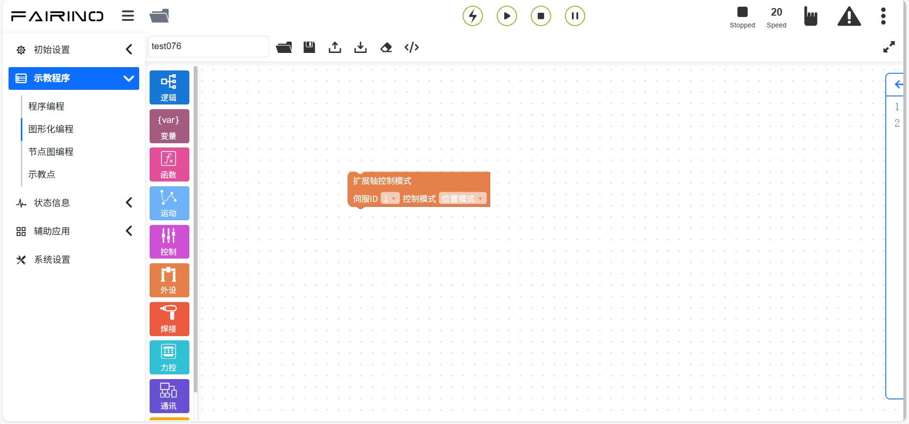

.. centered:: 圖表 10.7-15 控制模式指令碼區塊

「伺服啟用」指令節點,參數：

- 伺服ID：1~15

- 伺服啟用：伺服啟用/去除啟用

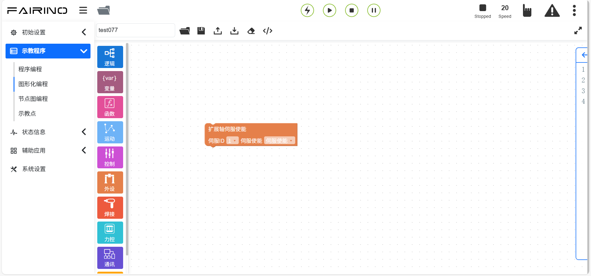

.. centered:: 圖表 10.7-16 伺服使能指令代碼塊

“伺服回零”指令節點,參數：

- 伺服ID：1~15

- 回零方式：目前位置回零/負限位回零/正限位回零

- 尋零速度：0~2000，預設為5

- 零點箍位速度：0~2000，預設為1

- 加速度百分比：1~100，預設為100

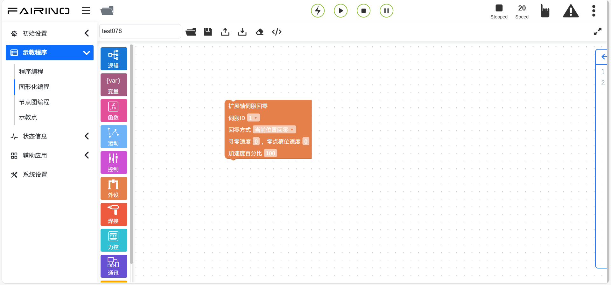

.. centered:: 圖表 10.7-17 伺服回零指令碼塊

“位置模式”指令節點,參數：

- 伺服ID：1~15

- 目標位置：無限制

- 尋零速度：無限制

- 加速度百分比：1~100，預設為100
  
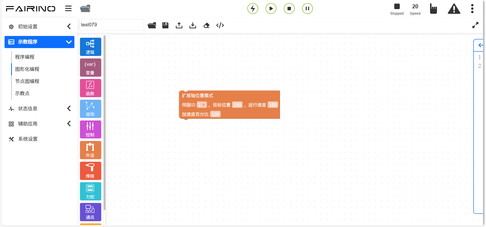

.. centered:: 圖表 10.7-18 位置模式指令碼區塊

“速度模式”指令節點,參數：

- 伺服ID：1~15

- 目標速度：無限制

- 加速度百分比：1~100，預設為100
  
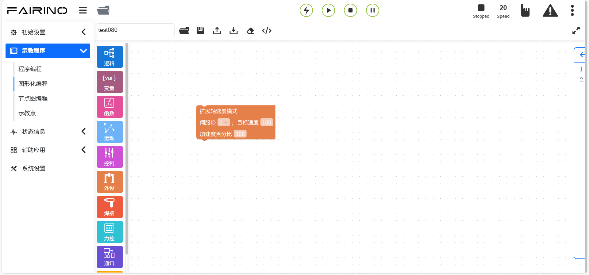

.. centered:: 圖表 10.7-19 速度模式指令碼區塊

傳送帶指令
~~~~~~~~~~~~~~~~~~~~~
指令包含IO即時偵測，位置即時偵測，追蹤開啟和追蹤關閉四個​​指令。詳見機器人週邊章節。

“IO即時檢測”指令節點,參數：

- 最大等待時間：0~10000

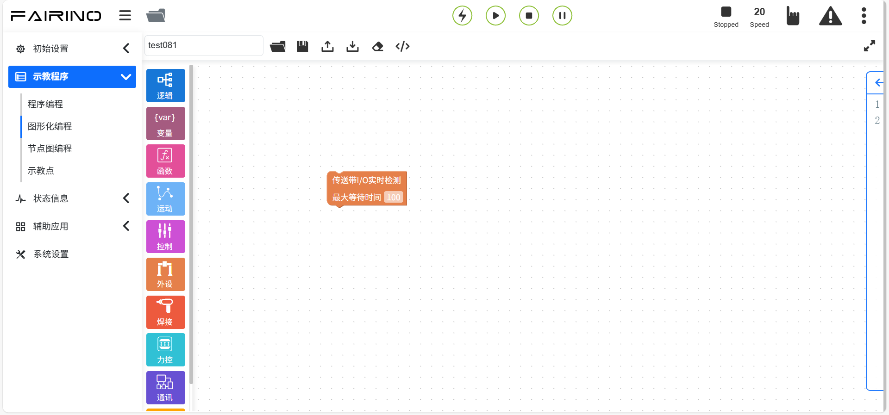

.. centered:: 圖表 10.7-20 IO即時檢測指令碼塊

“位置即時偵測”指令節點,參數：

- 工作模式：追蹤抓取/追蹤運動/TPD追蹤

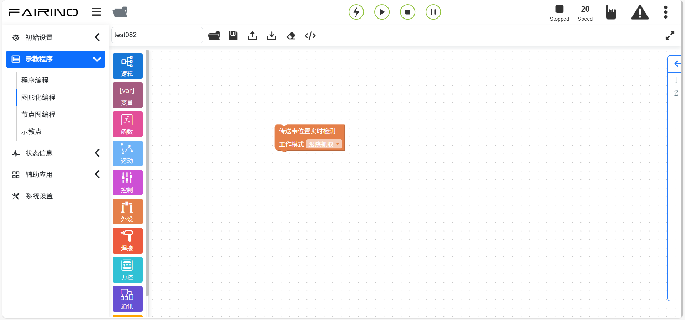

.. centered:: 圖表 10.7-21 位置即時偵測指令碼區塊

「追蹤開啟」、「追蹤關閉」指令節點,參數：

工作模式：追蹤抓取/追蹤運動/TPD追蹤

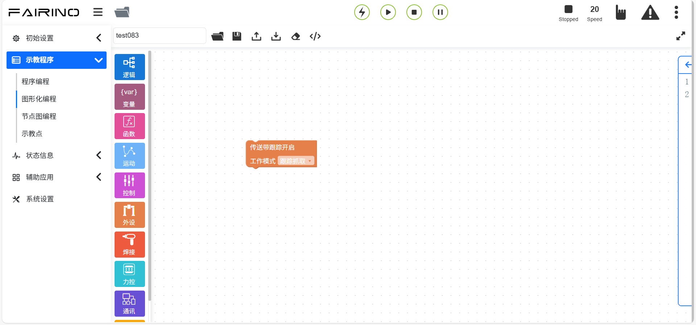

.. centered:: 圖表 10.7-22 追蹤開啟/關閉指令碼區塊

打磨指令
~~~~~~~~~~~~~~~~~~~~~
拖曳「打磨指令」程式碼區塊,進入圖形化編輯介面工作區。

此指令用於打磨場景的使用，使用時需要先卸載驅動再加載驅動，然後設定打磨設備使能。

進而設定打磨設備的轉速、接觸力、伸出距離和控制模式，同時可以對打磨設備錯誤清除和設備力傳感器清零。

.. centered:: 圖表 10.7-23 通訊驅動加載/卸載指令代碼塊

“設備啟用”指令節點,參數：

- 設備使能：上使能/下使能

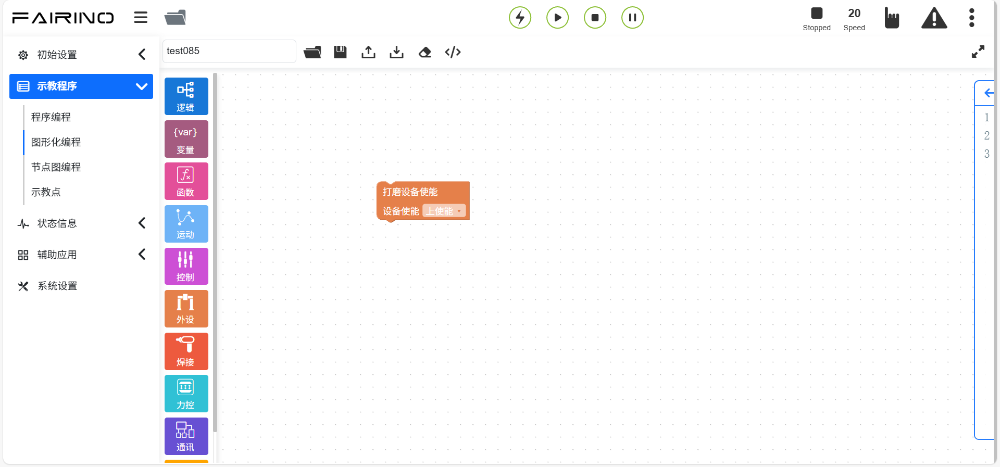

.. centered:: 圖表 10.7-24 設備啟用指令代碼塊

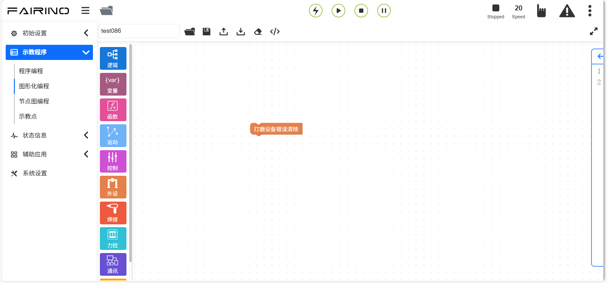

.. centered:: 圖表 10.7-25 設備錯誤清除指令碼區塊

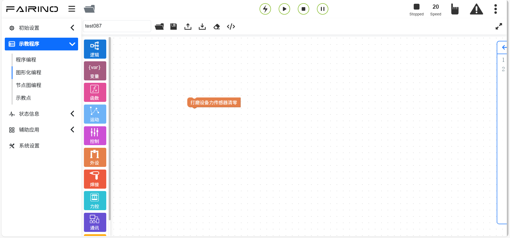

.. centered:: 圖表 10.7-26 設備力傳感器清零指令代碼塊

“轉速”指令節點,參數：

- 轉速：0~5500

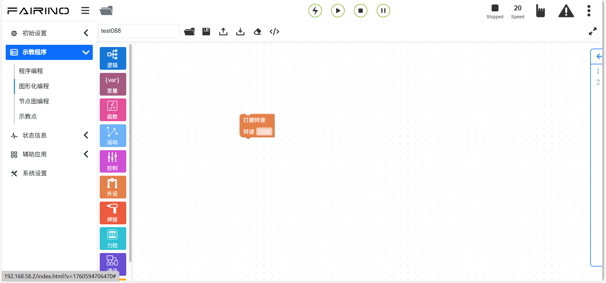

.. centered:: 圖表 10.7-27 設備轉速指令代碼塊

「設定力」指令節點,參數：

- 設定力：0~200

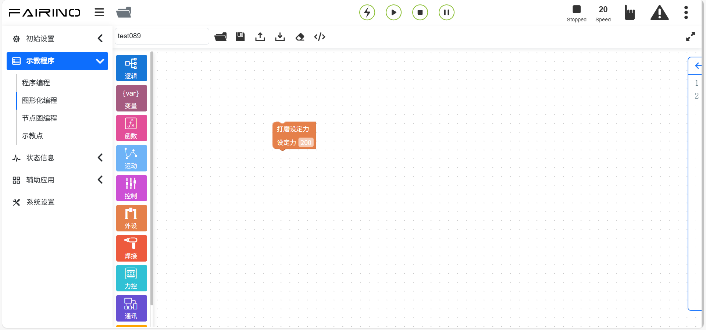

.. centered:: 圖表 10.7-28 設定力指令碼區塊

「伸出距離」指令節點,參數：

- 伸出距離：0~12

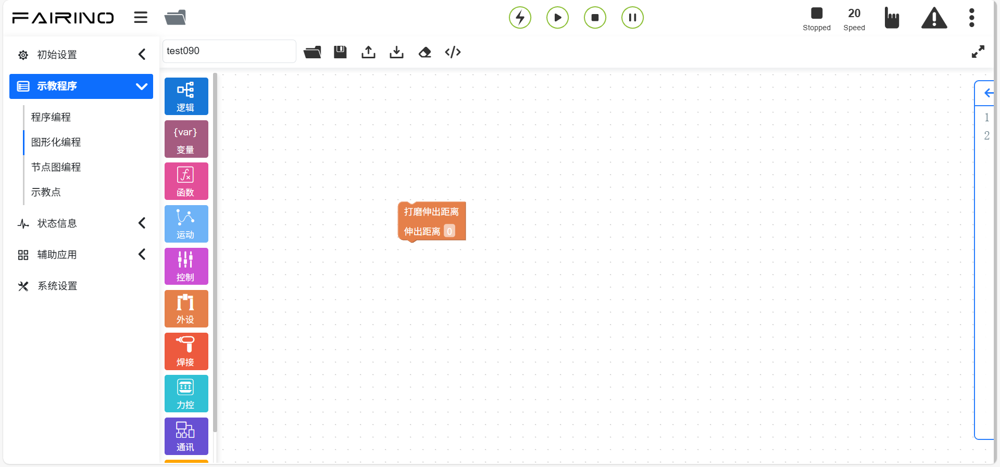

.. centered:: 圖表 10.7-29 伸出距離指令碼區塊

「打磨接觸力」指令節點,參數：

- 接觸力：0~10000

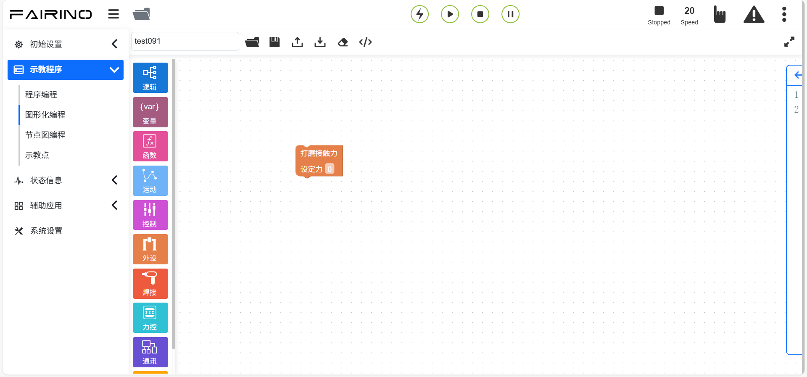

.. centered:: 圖表 10.7-30 打磨接觸力指令程式碼區塊

「設定力過渡時間」指令節點,參數：

- 設定力過渡時間：0~10000

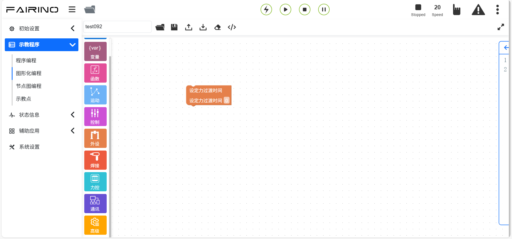

.. centered:: 圖表 10.7-31 設定力過渡時間指令程式碼區塊

“工件重量”指令節點,參數：

- 工件重量：0~10000

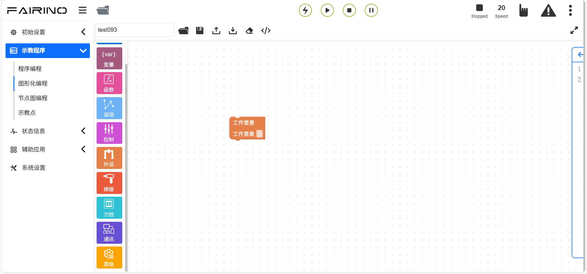

.. centered:: 圖表 10.7-32 工件重量指令程式碼區塊

“控制模式”指令節點,參數：

- 控制模式：回零模式/位置模式/力矩模式

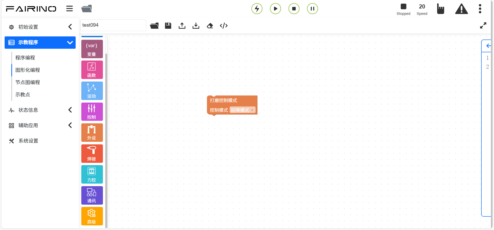

.. centered:: 圖表 10.7-33 控制模式指令碼區塊

焊接類圖形化程式命令
--------------------------
焊接類圖形化程式指令包含尋位、段焊、焊接、雷射追蹤等焊接指令。

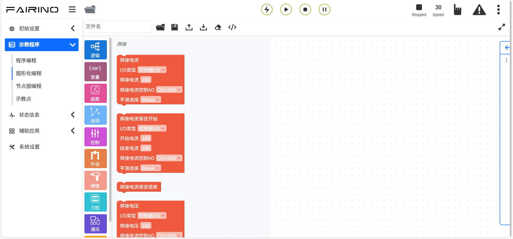

.. centered:: 圖表 10.8 焊接類圖形化程式命令

段焊指令
~~~~~~~~~~~~~~~~~~~~~
拖曳「段焊指令」程式碼區塊,進入圖形化編輯介面工作區。

此指令為焊接專用指令，主要用於一段焊，一段不焊的循環間斷焊接場景。在起點與終點之間，使用該指令，選擇段焊模式，選擇起點和終點，設定調試速度，設定起弧的DO端口，執行長度，非執行長度，根據實際應用場景設定功能模式，擺動選擇和取整規則即可實現段焊功能，詳細操作可見程序示教頁段焊指令。

1. “收弧/起弧”指令節點,參數：

- I/O類型：控制器IO/擴充IO

- 焊接工藝編號： 0 ~ 7

- 最大等待時間(ms)：0 ~ 10000

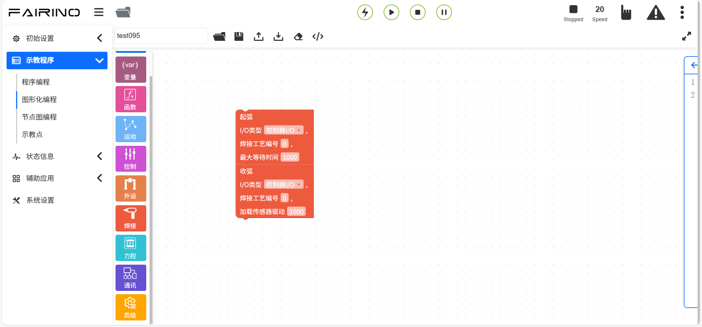

.. centered:: 圖表 10.8-1 “收弧/起弧”指令碼區塊

2. “段焊”指令節點,參數：

- 段焊模式：不變化姿態/變化姿態

- 起始點：示教點位

- 終點：示教點位

- 調試速度(%)：0~100，預設為100

- 執行長度：0~1000

- 非執行長度：0~1000

- 功能模式：0~100，預設為100

- 擺盪選擇：執行段落不擺動/執行段落擺動

- 取整規則：不取整/循環取整/單段取整

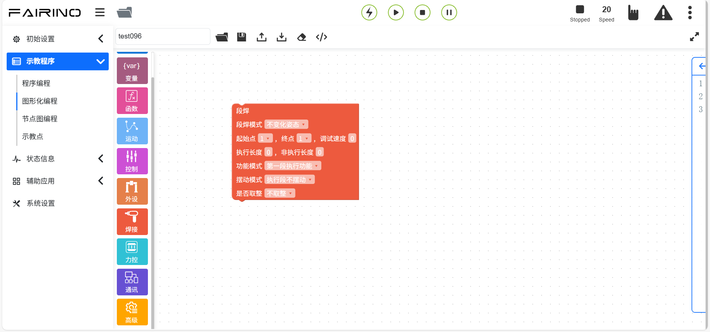

.. centered:: 圖表 10.8-2 段焊指令代碼區塊

焊接指令
~~~~~~~~~~~~~~~~~~~~~
拖曳「焊接指令」程式碼區塊,進入圖形化編輯介面工作區。

此指令主要用於焊接機外設，在新增指令前請確認在使用者外設中焊接機配置是否完成，詳見機器人週邊章節。

1. “焊機電壓”指令節點,參數：

焊機電壓：最小值為0

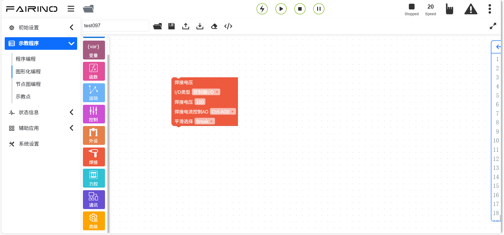

.. centered:: 圖表 10.8-3 焊機電壓指令代碼區塊

2. “焊接機電流”指令節點,參數：

焊接機電流：最小值為0

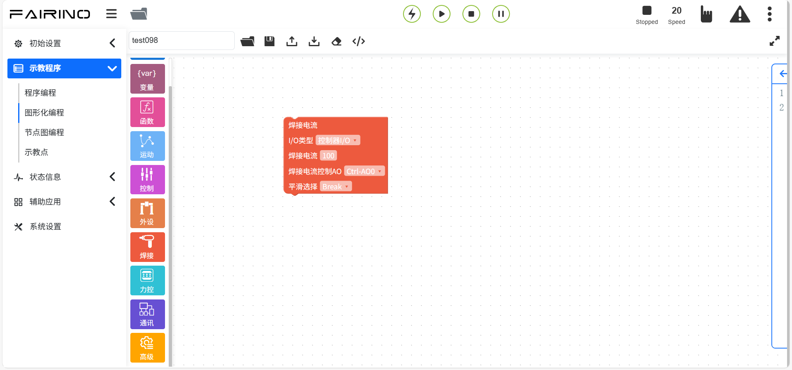

.. centered:: 圖表 10.8-4 焊機電流指令代碼塊

3. 「送氣/關氣」指令節點,參數：

- I/O類型：控制器IO/擴充IO

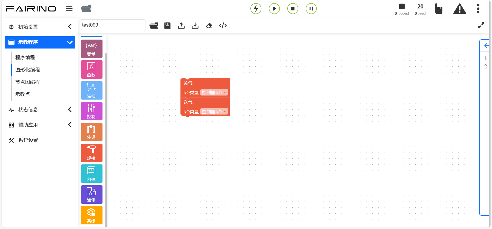

.. centered:: 圖表 10.8-5 「送氣/關氣」指令碼區塊

4. 「正向送絲/停止正向送絲」指令節點,參數：

- I/O類型：控制器IO/擴充IO

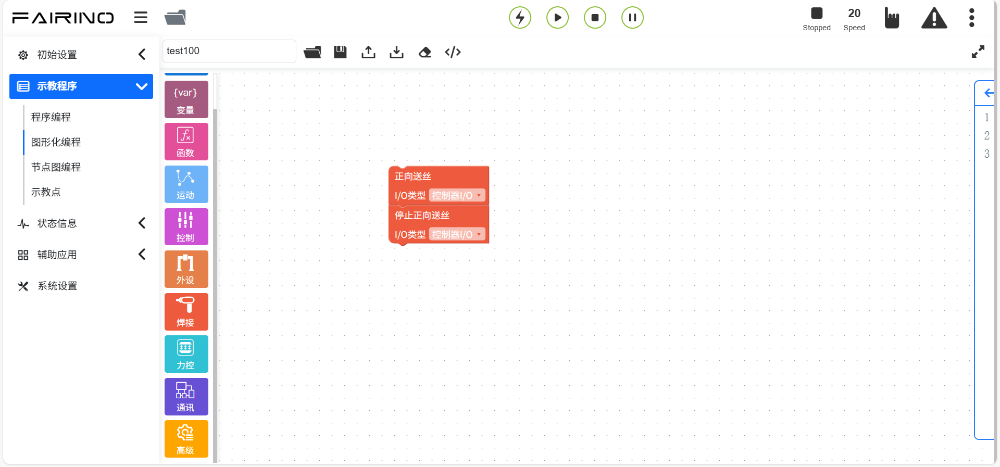

.. centered:: 圖表 10.8-6 「正向送絲/停止正向送絲」指令碼區塊

5. “反向送絲/停止反向送絲”指令節點,參數：

- I/O類型：控制器IO/擴充IO

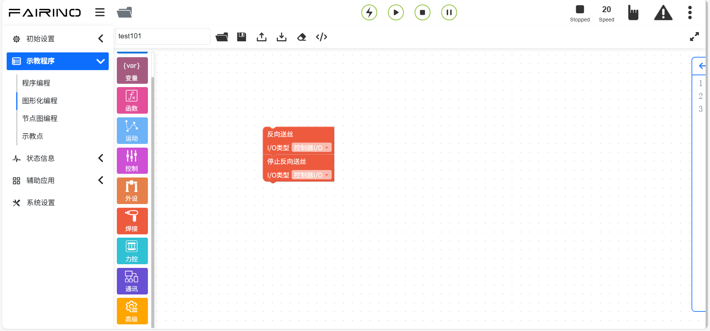

.. centered:: 圖表 10.8-7 「反向送絲/停止反向送絲」指令碼區塊

雷射追蹤指令
~~~~~~~~~~~~~~~~~~~~~
拖曳「雷射追蹤指令」程式碼區塊,進入圖形化編輯介面工作區。

該指令包含雷射指令、追蹤指令和尋位指令三部分，在加入指令前，請確認使用者周邊裝置中雷射追蹤感測器是否已經配置成功。詳見機器人週邊章節。

1. “開啟/關閉感測器”指令節點，參數：

- 選擇焊縫類型：0 ~ 49

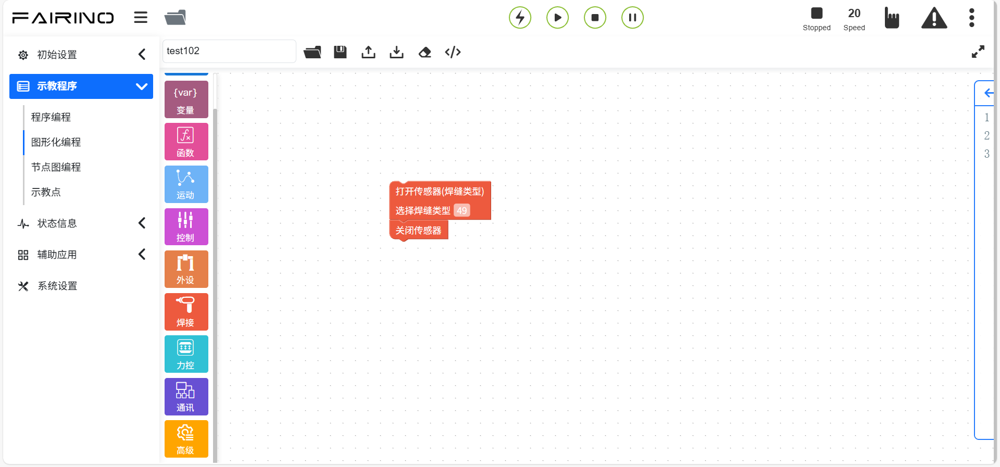

.. centered:: 圖表 10.8-8「打開/關閉感應器->焊接類型」指令代碼塊

- 選擇任務編號：0 ~ 255

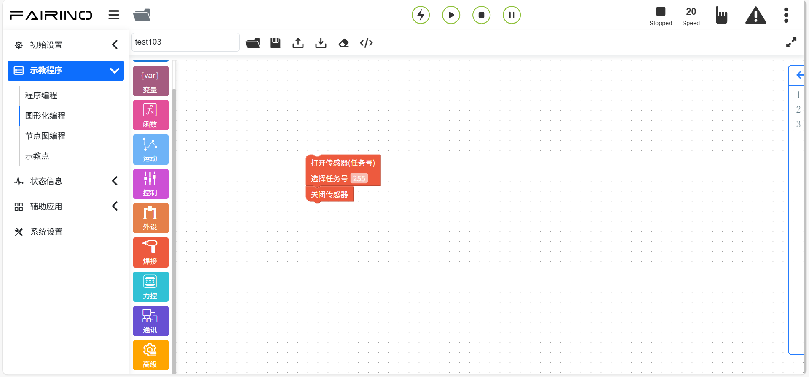

.. centered:: 圖表 10.8-9 「開啟/關閉感測器->任務號」指令碼區塊

- 解：0 ~ 5

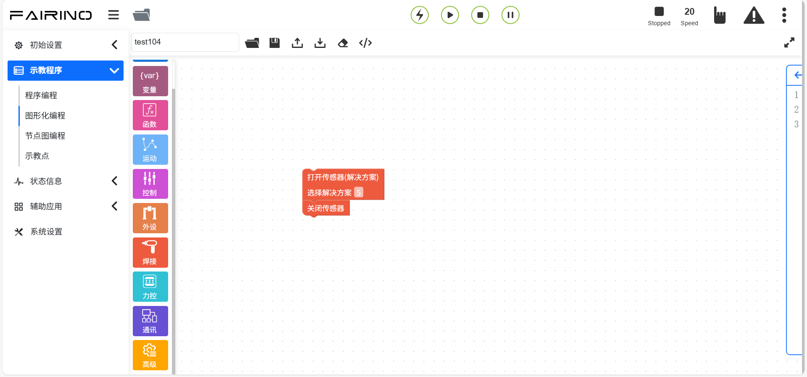

.. centered:: 圖表 10.8-10 「開啟/關閉感測器—解決方案」指令碼區塊

2. “載入/卸載感測器”指令節點，參數：

- 功能選擇：睿牛RRT-SV2-BP/創想CXZK-RBTA4L

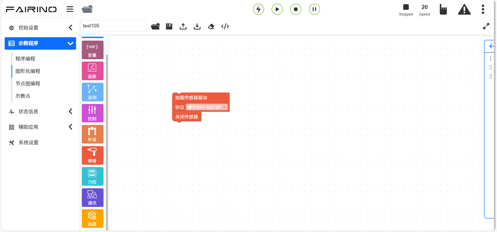

.. centered:: 圖表 10.8-11 “載入/卸載感應器”指令程式碼區塊

3. “開始/停止雷射追蹤”指令節點，參數

- 座標系名稱：自訂配置座標系

.. centered:: 圖表 10.8-12 “開始/停止雷射追蹤”指令代碼區塊

4. “資料記錄”指令節點，參數：

- 功能選擇：停止記錄/即時追蹤/開始記錄/軌跡復現

- 等待時間(ms)： 0 ~ 10000

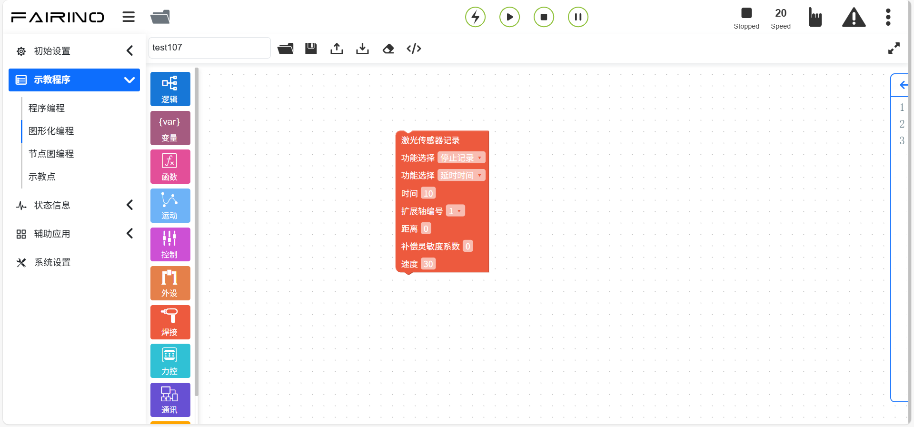

.. centered:: 圖表 10.8-13 “資料記錄”指令程式碼區塊

5. “感測器取點運動”指令節點，參數：

- 座標系名稱：自訂配置座標系

- 運動方式： PTP/Lin

- 調試速度(%)： 0 ~ 100

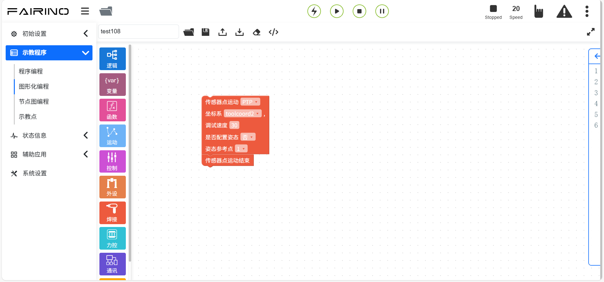

.. centered:: 圖表 10.8-14 “感測器取點運動”指令程式碼區塊

6. “雷射追蹤復現”指令節點，參數：

.. centered:: 圖表 10.8-15 “雷射追蹤復現”指令程式碼區塊

7. 「尋位開始/結束」指令節點，參數：

- 座標系名稱：自訂配置座標系

- 方向： -x/-x/-y/-y/-z/-z/指定方向

- 方向點：未選擇「指定方向」時，參數失效

- 速度(%)：0 ~ 100

- 長度(mm)：0 ~ 1000

- 最大尋位時間(ms)：0 ~ 10000

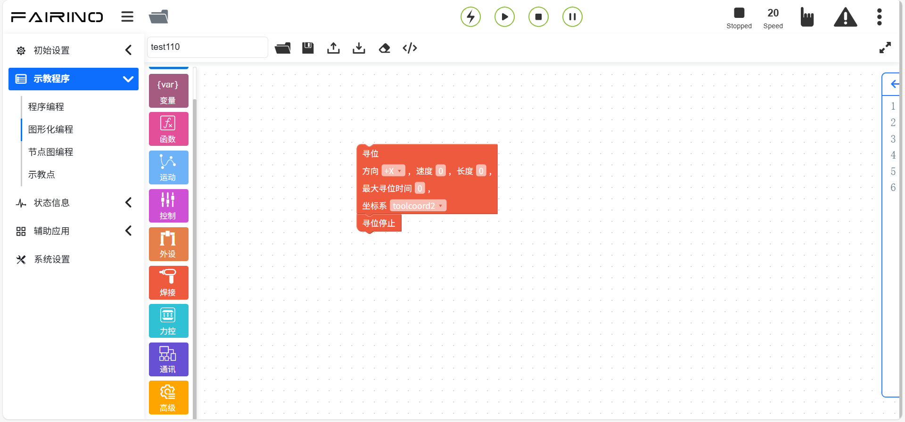

.. centered:: 圖表 10.8-16 「尋位元開始/結束」指令程式碼區塊

雷射記錄指令
~~~~~~~~~~~~~~~~~~~~~
拖曳「雷射記錄指令」程式碼區塊,進入圖形化編輯介面工作區。

該指令實現雷射追蹤記錄起點、終點取出功能，使機器人可以自動移動到起點位置，適用於從工件外部開始運動並進行雷射追蹤記錄的場合，同時上位機可取得記錄資料中起點、終點的信息，用於後續運動。

實現雷射追蹤復現速度可調功能，使機器人可以用一個很快的速度進行記錄，然後按照正常焊接速度進行復現，可以提高作業效率。

1. “焊縫資料記錄”指令節點,參數：

- 功能選擇：停止記錄/即時追蹤/開始記錄/軌跡復現

- 等待時間(ms)：0~10000，預設為10

- 速度(%)：0~100，預設為30，選擇軌跡復現時，此參數生效

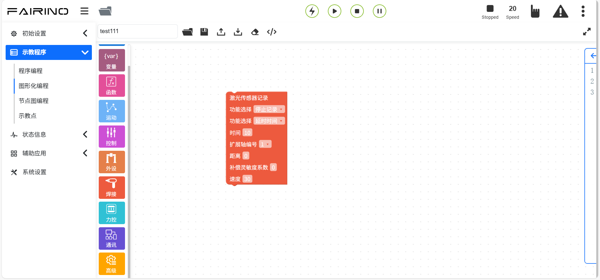

.. centered:: 圖表 10.8-17 焊縫資料記錄指令代碼區塊

2. 「取得焊接起點/終點」指令節點,參數：

- 運動方式：PTP/LIN

- 速度(%)：0~100，預設為30

.. centered:: 圖表 10.8-18 「取得焊縫起點/終點」指令碼區塊

焊絲尋位指令
~~~~~~~~~~~~~~~~~~~~~
拖曳「焊絲尋位指令」代碼區塊,進入圖形化編輯介面工作區。

此指令一般應用於焊接場景中，需要焊接機與機器人IO和運動指令結合使用。分為尋位開始、尋位結束、尋位點設定、計算偏移量和接觸點資料寫入。

「焊絲尋位開始/結束」指令節點,參數：

- 基準位置：不更新/更新

- 尋位速度：0~100

- 尋位距離：0~1000

- 自動返回標誌：不自動返回/自動返回

- 自動返回速度：0~100

- 自動返回距離：0~1000

- 尋位方式：示教點尋位/帶偏移量尋位

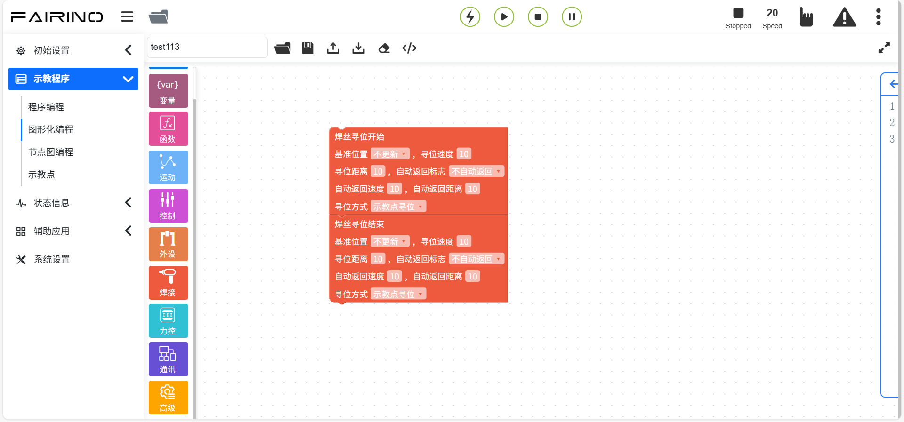

.. centered:: 圖表 10.8-19 「焊絲尋位開始/結束」指令碼區塊

尋位點設定根據焊接類型和計算方法添加點位。

- 當類型為角焊縫，計算方法為1D（xyz中的一個）時，點位添加從a點、b點中選擇；

- 當類型為角焊縫，計算方法為2D（xyz中的兩個）時，點位添加從a點、b點、e點、f點中選擇；

- 當類型為角焊縫，計算方法為3D（xyz）時，點位添加從a點、b點、c點、d點、e點、f點中選擇；

- 當類型為角焊縫，計算方法為2D-（xyz中的兩個，rxryrz中的一個）時，點位添加從a點、b點、c點、d點、e點、f點中選擇；

- 當類型為內外徑，計算方法為2D2D（xyz中的兩個）時，點位添加從a點、b點中選擇；

- 當類型為點，計算方法為3D（xyz）時，點位加入從a點、b點、c點、d點、e點、f點中選擇；

- 當類型為相機，計算方法為3D-（xyzrxryrz）時，點位添加從a點、b點中選擇；

- 當類型為面，計算方法為3D-（xyzrxryrz）時，點位添加從a點、b點中選擇；

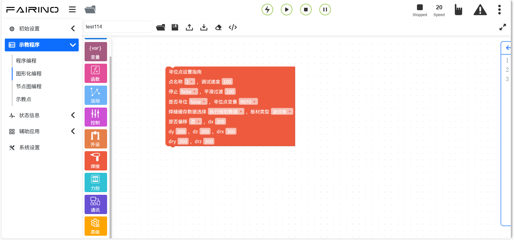

.. centered:: 圖表 10.8-20 「尋位點設定指南」指令碼區塊

計算偏移量根據焊接類型和計算方法設定基準點和接觸點。

- 當類型為角焊縫，計算方法為1D（xyz中的一個）時，設定基準點1、接觸點1；

- 當類型為角焊縫，計算方法為2D（xyz中的兩個）時，設定基準點1、基準點2、接觸點1、接​​觸點2；

- 當類型為角焊縫，計算方法為3D（xyz）時，設定基準點1、基準點2、基準點3、接觸點1、接​​觸點2、接觸點3；

- 當類型為角焊縫，計算方法為2D-（xyz中的兩個，rxryrz中的一個）時，設定基準點1、基準點2、基準點3、接觸點1、接​​觸點2、接觸點3；

- 當類型為內外徑，計算方法為2D2D（xyz中的兩個）時，設定基準點1、基準點2、基準點3、接觸點1、接​​觸點2、接觸點3；

- 當類型為點，計算方法為3D（xyz）時，設定接觸點1、接​​觸點2；

- 當類型為相機，計算方法為3D-（xyzrxryrz）時，設定接觸點1、接​​觸點2；

- 當類型為面，計算方法為3D-（xyzrxryrz）時，設定接觸點1、接​​觸點2、接觸點3、接觸點4、接觸點5、接觸點6；

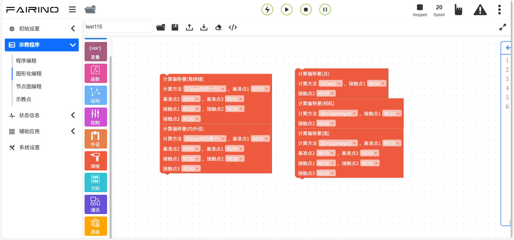

.. centered:: 圖表 10.8-21 “計算偏移量”指令程式碼區塊

「接觸點資料寫入」指令節點,參數：

- 接觸點名稱：RES0~99

- 接觸點名稱：資料格式為{0,0,0,0,0,0}；

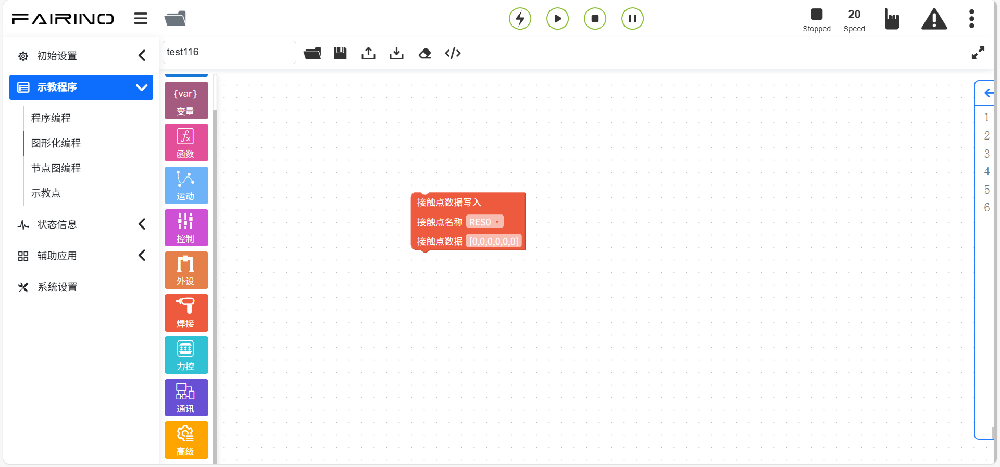

.. centered:: 圖表 10.8-22 “接觸點資料寫入”指令程式碼區塊

電弧追蹤指令
~~~~~~~~~~~~~~~~~~~~~
拖曳「電弧追蹤指令」程式碼區塊,進入圖形化編輯介面工作區。

該指令實現機器人焊縫追蹤利用焊縫的偏差檢測進行補償軌跡，可以使用電弧感測器來檢測焊縫偏差。

“電弧追蹤開啟/關閉”指令節點,參數：

- 電弧追蹤滯後時間(ms)：參考值 50

- 偏差補償：關閉/開啟

- 調節係數：0 ~ 300

- 補償時間(cyc)：0 ~ 300

- 每次最大補償量(mm)：0 ~ 300

- 總計最大補償量(mm)：0 ~ 300

- 上下座標系選擇：擺動

- 上下基準電流設定方式：回授/常數

- 上下基準位電流(A)：0 ~ 300

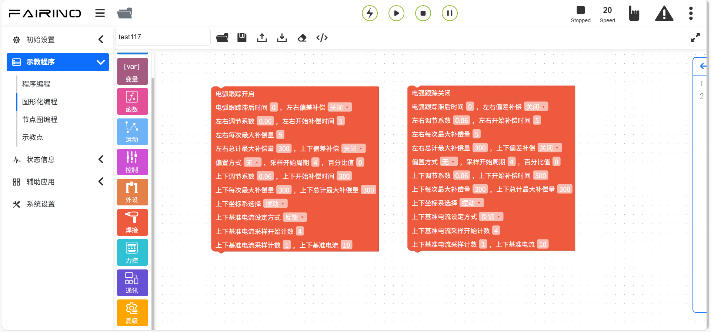

.. centered:: 圖表 10.8-23 電弧追蹤指令碼區塊

姿態調整指令
~~~~~~~~~~~~~~~~~~~~~
拖曳「姿態調整指令」程式碼區塊,進入圖形化編輯介面工作區。

此指令針對焊接追蹤自適應調整焊槍姿態場景，需要先示教PosA、PosB、PosC三個點位，否則無法新增節點。

記錄好三個對應的姿態點後，根據機器人實際運動方向，加入姿態自適應調整指令。詳見機器人週邊章節。

“開啟姿態調整”指令節點,參數：

- 板材類型： 波紋板/瓦楞板/圍籬板/波紋甲殼鋼

- 移動方向：由左至右/由右至左

- 姿態調整時間(ms)：0 ~ 1000

- 第一段長度(mm)：

- 拐點類型：由上往下/由下往上

- 第二段長度(mm)：

- 第三段長度(mm)：

- 第四段長度(mm)：

- 第五段長度(mm)：

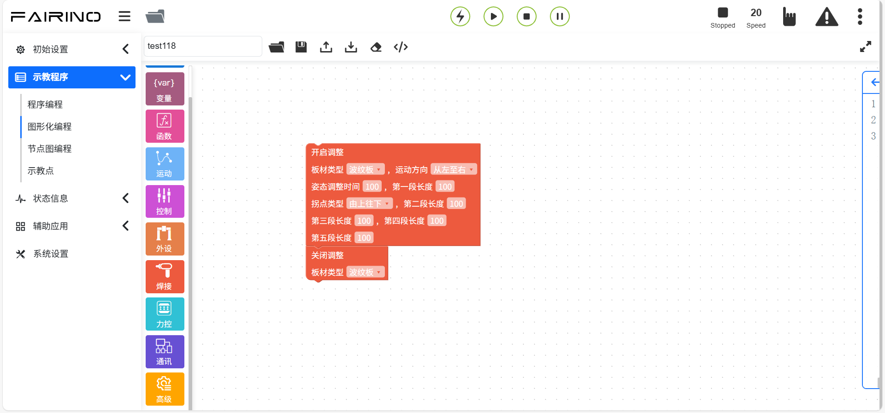

.. centered:: 圖表 10.8-24 姿態調整指令碼區塊

力控類圖形化程式命令
--------------------------
力控類圖形化程式指令包含力控集、扭力記錄等力控指令。

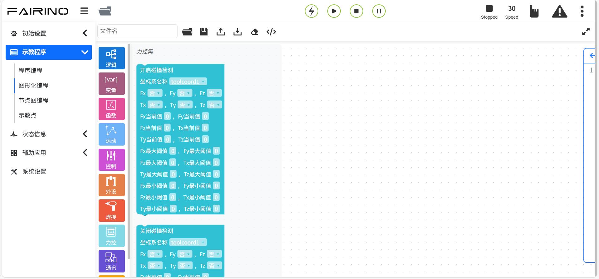

.. centered:: 圖表 10.9 力控類圖形化程式命令

力控指令
~~~~~~~~~~~~~~~~~~~~~
拖曳「力控指令」程式碼區塊,進入圖形化編輯介面工作區。

此指令包含FT_Guard(碰撞偵測)，FT_Control(恆力控制)，FT_Compliance(柔順控制)，FT_Spiral(螺旋插入)，FT_Rot(旋轉插入)，FT_Lin(直線插入)，FT_FindSurface(表面定位) ，FT_CalCenter(中心定位)八個指令，詳見機器人外設章節。

1. “開啟/關閉碰撞偵測”指令節點,參數:

- 座標系名稱：自訂配置的座標系

- Fx-Tx真值：true/false

- Fx-Tx當前值：依實際情況輸入

- Fx-Tx最大閾值：依實際情況輸入

- Fx-Tx最小閾值：依實際情況輸入

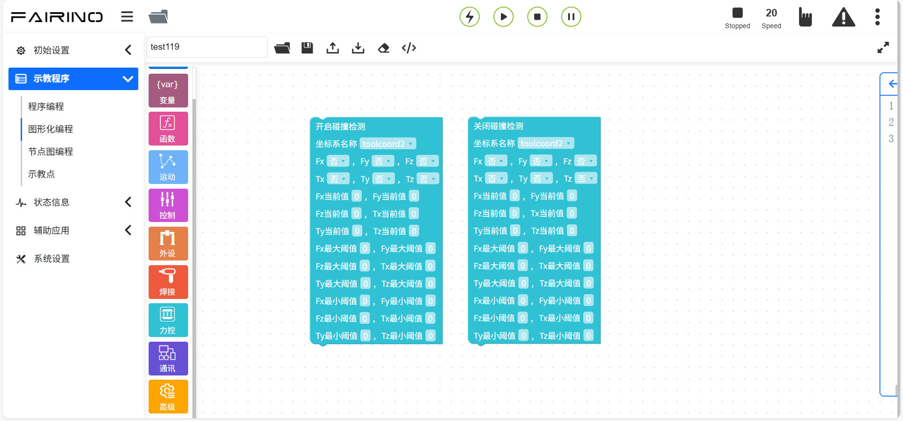

.. centered:: 圖表 10.9-1 開啟/關閉碰撞偵測指令碼區塊

2. “開啟/關閉控制”指令節點,參數：

- 座標系名稱：自訂配置的座標系

- Fx-Tx真值：true/false

- Fx-Tx當前值：依實際情況調整

- F_P_gain - F_D_gain：依實際情況調整，不能為0

- 自適應啟動停止狀態：停止/開啟

- ILC控制啟動/停止狀態：停止/訓練/實操

- 最大調整距離(mm)：0 ~ 1000

- 最大調整角度(°)：0 ~ 1000

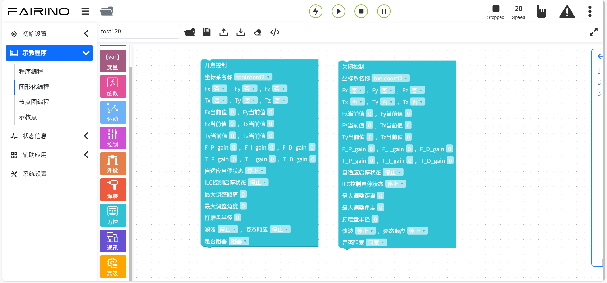

.. centered:: 圖表 10.9-2 開啟/關閉控制指令碼區塊

3. “開啟/關閉柔順控制”指令節點,參數：

- 下發位置調節係數：0 ~ 1

- 柔順開啟力閾值(N)：0 ~ 100

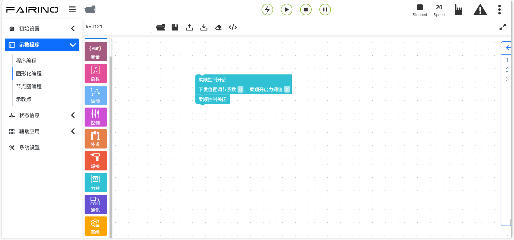

.. centered:: 圖表 10.9-3 開啟/關閉柔順控制指令程式碼區塊

4. “螺旋插入”指令節點,參數：

- 座標系名稱：工具座標系/基底座標

- 每圈半徑進給量(mm)：0 ~ 100,參考值：0.7

- 力或力矩閾值(N/Nm)：0 ~ 100,參考值：50

- 最大探索時間(ms)：0 ~ 60000, 參考值：60000

- 線速度最大值(mm/s)：0 ~ 100，參考值：5

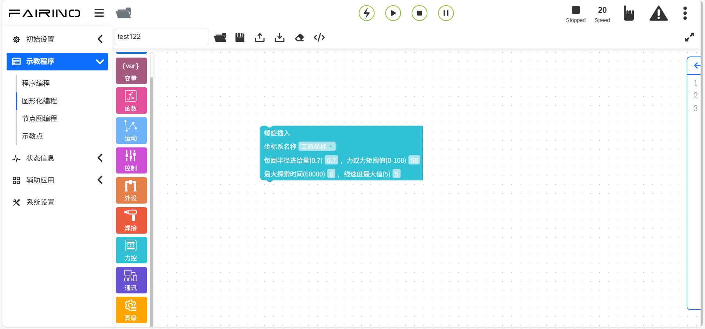

.. centered:: 圖表 10.9-4 螺旋插入指令碼區塊

5. “旋轉插入”指令節點,參數:

- 座標系名稱：工具座標系/基底座標

- 旋轉角速度(°/s)：0 ~ 100,參考值：0.7

- 觸發力或終止力矩(N/Nm)：0 ~ 100,參考值：50

- 最大旋轉角度(°)：0 ~ 100,參考值：5

- 力的方向：方向z/方向mz

- 最大旋轉角加速度(°/s^2)：0 ~ 100

- 插入方向：正/負

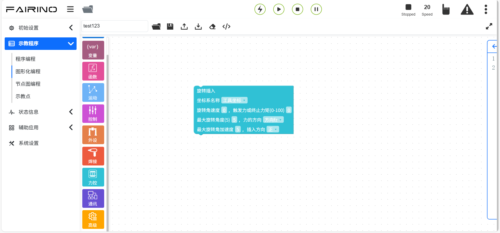

.. centered:: 圖表 10.9-5 旋轉插入指令碼區塊

6. “直線插入”指令節點,參數：

- 座標系名稱：工具座標系/基底座標

- 動作終止力閾值(N)：0 ~ 100

- 直線速度(mm/s)：0 ~ 100,參考值：1

- 直線加速度(°/s^2)：0 ~ 100

- 最大插入距離(mm)：0 ~ 100

- 插入方向：正/負

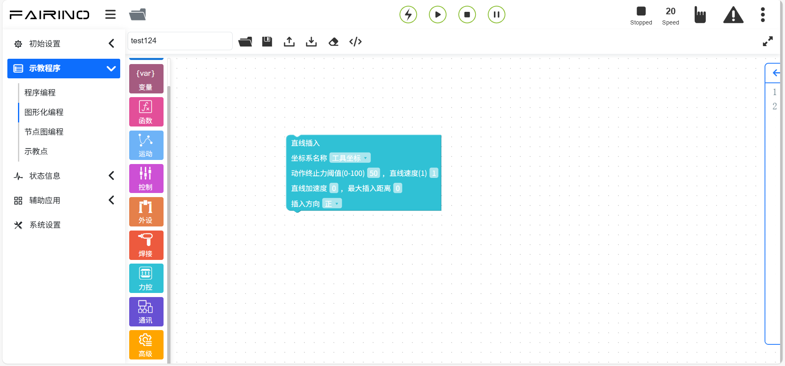

.. centered:: 圖表 10.9-6 直線插入指令程式碼區塊

7. “表面定位”指令節點,參數：

- 座標系名稱：工具座標系/基底座標

- 移動方向：正/負

- 移動軸：X/Y/Z

- 探索直線速度(mm/s)：0 ~ 100

- 探索加速度(mm/s^2)：0 ~ 100

- 最大探索距離(mm)：0 ~ 100

- 動作終止力閾值(N)：0 ~ 100

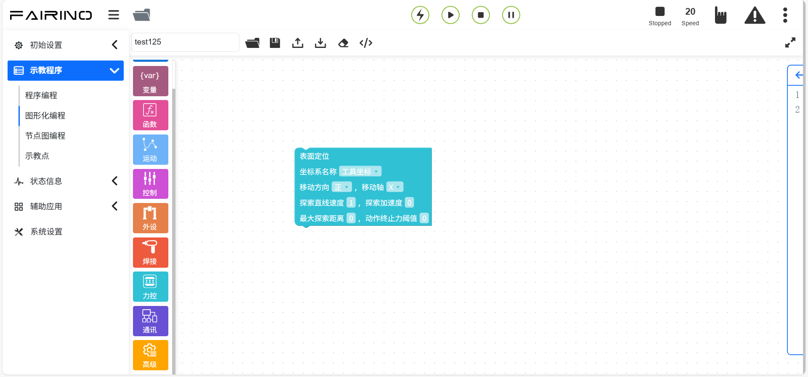

.. centered:: 圖表 10.9-7 表面定位指令代碼區塊

8. “中間平面開始/結束計算”指令節點。

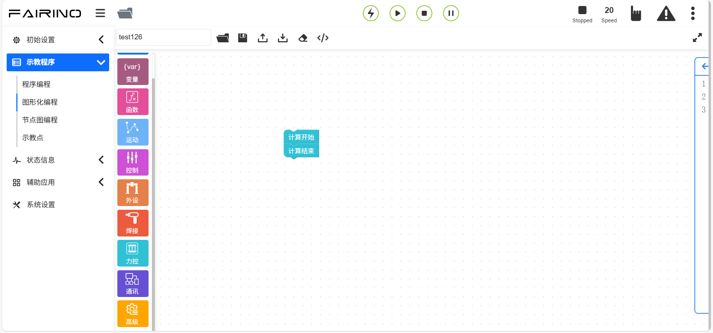

.. centered:: 圖表 10.9-8 中間平面開始/結束計算指令程式碼區塊

扭力記錄指令
~~~~~~~~~~~~~~~~~~~~~
拖曳「扭力記錄指令」程式碼區塊,進入圖形化編輯介面工作區。

該指令為扭矩記錄指令，包含“扭矩記錄開始/“扭矩記錄停止”和“扭矩記錄重設”三種指令。

實現扭力即時記錄碰撞偵測功能。

點選「扭力記錄啟動」按鈕，持續記錄運動指令運作過程中的碰撞情況，記錄的即時扭力作為碰撞偵測判斷的理論值，以減少誤報錯機率。

當超出設定閾值範圍時，記錄碰撞偵測持續時間。

點擊「扭力記錄停止」按鈕，停止記錄。點擊“扭力記錄重設”，狀態恢復預設狀態。

1. “扭矩記錄開始”指令節點,參數：

- 平滑選擇：不平滑(原始資料)/平滑(平滑後資料)

- 關節負閾值(Nm)：-100 ~ 0

- 關節正閾值(Nm)：0 ~ 100

- 關節持續偵測碰撞時間(ms)：0 ~ 1000

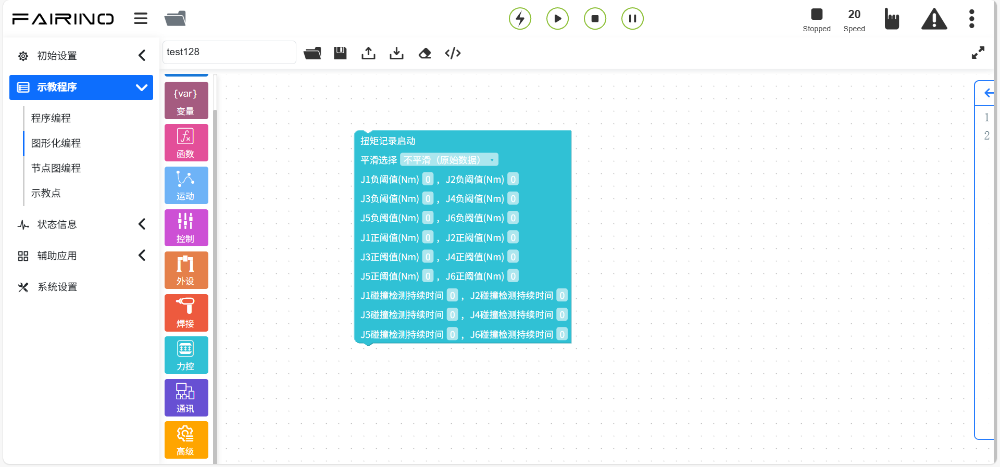

.. centered:: 圖表 10.9-9 扭力記錄開始指令代碼區塊

2. “扭矩記錄結束”指令節點

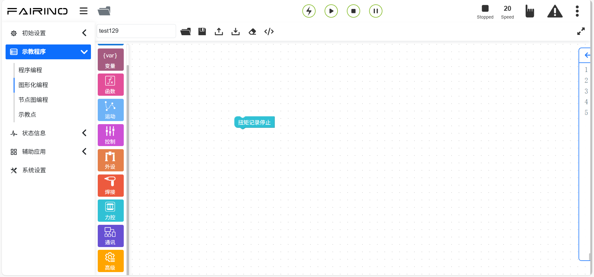

.. centered:: 圖表 10.9-10 扭力記錄結束指令代碼區塊

3. “扭矩記錄重設”指令節點

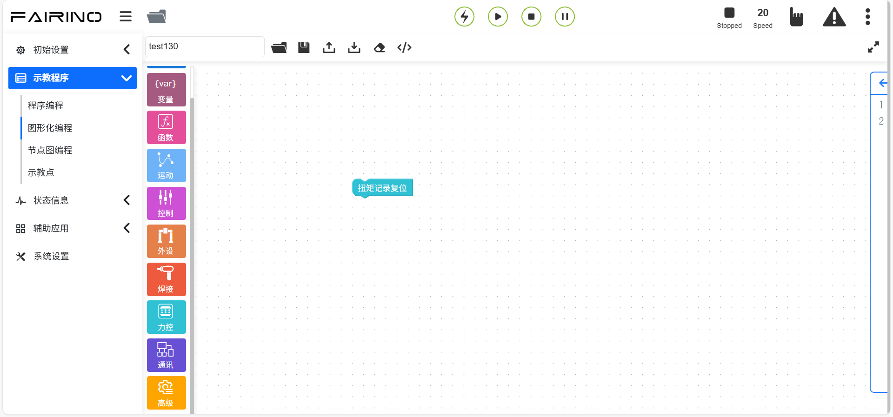

.. centered:: 圖表 10.9-11 扭力記錄重設指令碼區塊

通訊類圖形化程式命令
--------------------------
通訊類圖形化程式指令包含modbus主站設定（客戶端）、modbus從站設定、讀取暫存器等通訊指令。

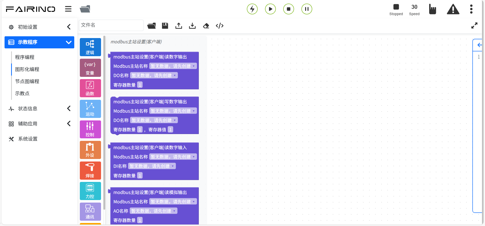

.. centered:: 圖表 10.10 通訊類圖形化程式命令

Modbus指令
~~~~~~~~~~~~~~~~~~~~~
拖曳「Modbus指令」程式碼區塊,進入圖形化編輯介面工作區。

此指令功能為基於ModbusTCP協定的匯流排功能，使用者可以透過相關指令控制機器人與ModbusTCP client或server通訊（主站與從站通訊），對線圈，離散量，暫存器進行讀寫操作。關於ModbusTCP更多操作功能，前請聯絡我們諮詢。

使用modbus節點功能前，需要先在示教程式ModbusTCP配置中配置主站、從站以及DI、DO、AI、AO名稱。

1. 主站數位輸出設定,參數：

- Modbus主站名稱：依實際狀況配置

- DO名稱：依實際情況配置

- 暫存器數量：整數型 0 ~ 128

- 暫存器值：根據暫存器數量來定，可輸入多個數值。例如數量為3，值為1,0,1

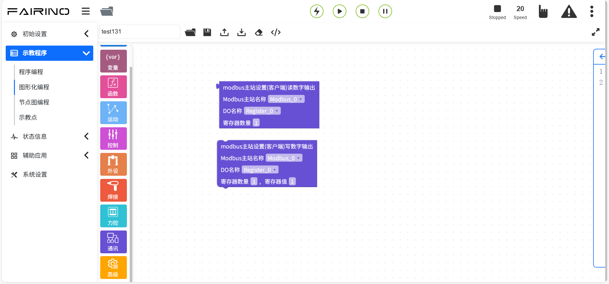

.. centered:: 圖表 10.10-1 主站“讀/寫數字輸出”指令代碼塊

2. 主站數字輸入設定,參數：

- Modbus主站名稱：依實際狀況配置

- DI名稱：依實際情況配置

- 暫存器數量：整數型 0 ~ 128

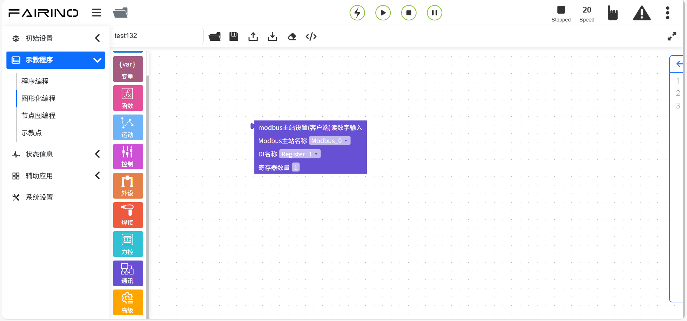

.. centered:: 圖表 10.10-2 主站「讀數字輸入」指令代碼區塊

3. 主站模擬輸出設定,參數：

- Modbus主站名稱：依實際狀況配置

- AO名稱：依實際情況配置

- 暫存器數量：整數型 0 ~ 128

- 暫存器值：根據暫存器數量來定，可輸入多個數值。例如數量為3，值為1,0,1

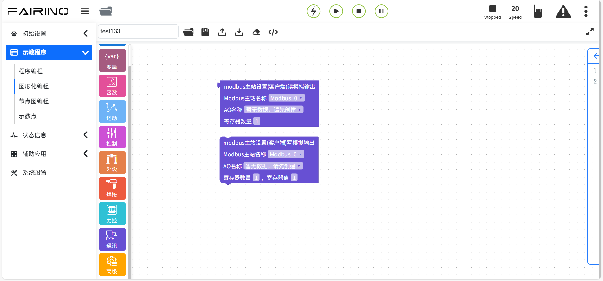

.. centered:: 圖表 10.10-3 主站“讀/寫模擬輸出”指令代碼塊

4. 主站模擬輸入設定,參數：

- Modbus主站名稱：依實際狀況配置

- AI名稱：依實際情況配置

- 暫存器數量：整數型 0 ~ 128

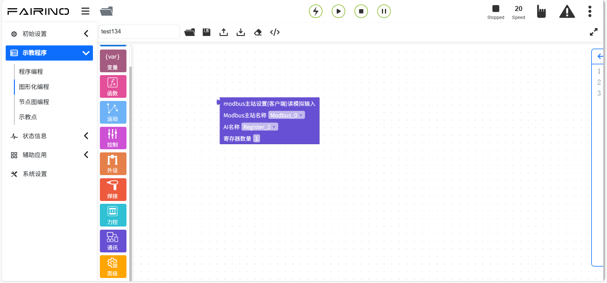

.. centered:: 圖表 10.10-4 主站“讀模擬輸入”指令代碼塊

5. 主站等待數字輸入設定,參數：

- Modbus主站名稱：依實際狀況配置

- DI名稱：依實際情況配置

- 等待狀態：true/false

- 超時時間(ms)：整數型 0 ~ 128

.. centered:: 圖表 10.10-5 主站「等待數字輸入」指令代碼區塊

6. 主站等待類比字輸入設定,參數：

- Modbus主站名稱：依實際狀況配置

- AI名稱：依實際情況配置

- 等待狀態：大於/小於

- 暫存器數量：整數型 0 ~ 128

- 暫存器值：根據暫存器數量來定，可輸入多個數值。

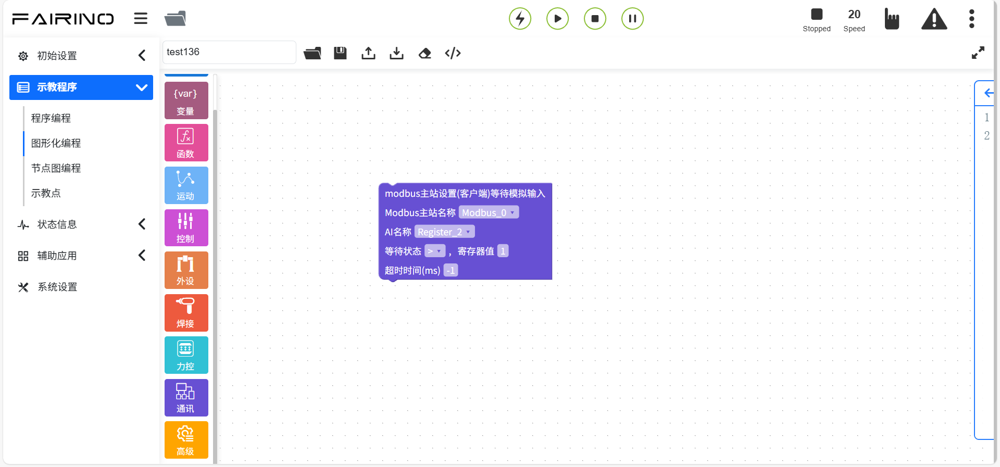

.. centered:: 圖表 10.10-6 主站「等待模擬輸入指令碼區塊

7. 從站數字輸出設定,參數：

- DO名稱：依實際情況配置

- 暫存器數量：整數型 0 ~ 128

- 暫存器值：根據暫存器數量來定，可輸入多個數值。例如數量為3，值為1,0,1

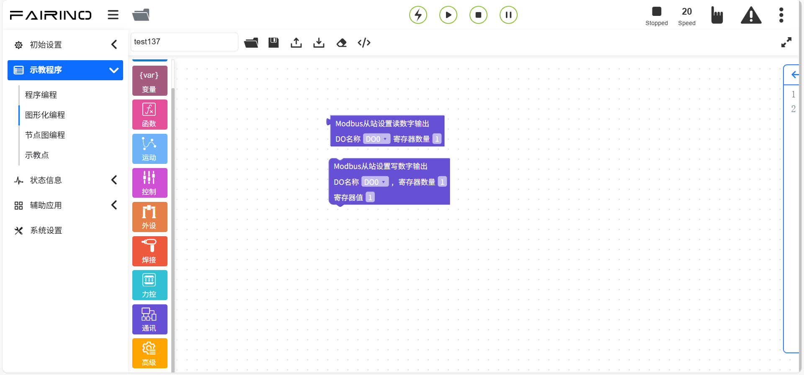

.. centered:: 圖表 10.10-7 從站“讀/寫數字輸出”指令代碼塊

8. 從站數字輸入設定,參數：

- DI名稱：依實際情況配置

- 暫存器數量：整數型 0 ~ 128

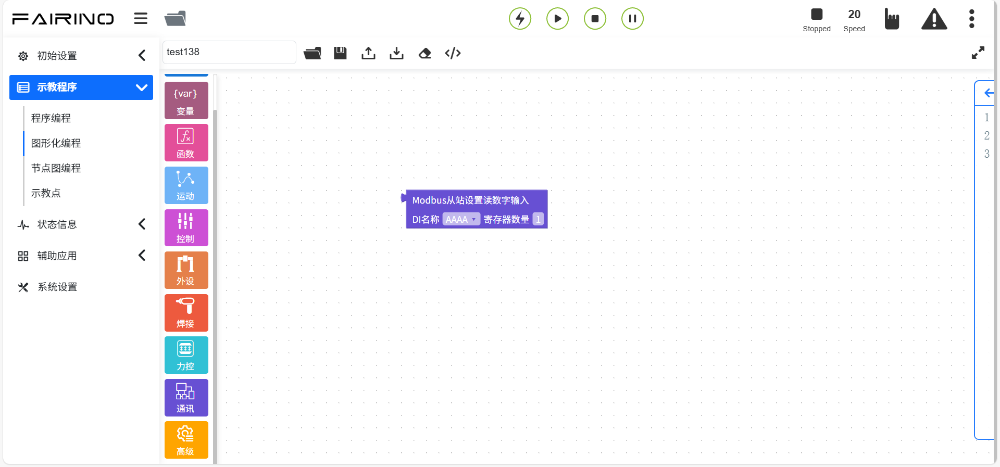

.. centered:: 圖表 10.10-8 從站“讀數字輸入”指令代碼塊

9. 從站模擬輸出設定,參數：

- AO名稱：依實際情況配置

- 暫存器數量：整數型 0 ~ 128

- 暫存器值：根據暫存器數量來定，可輸入多個數值。例如數量為3，值為1,0,1

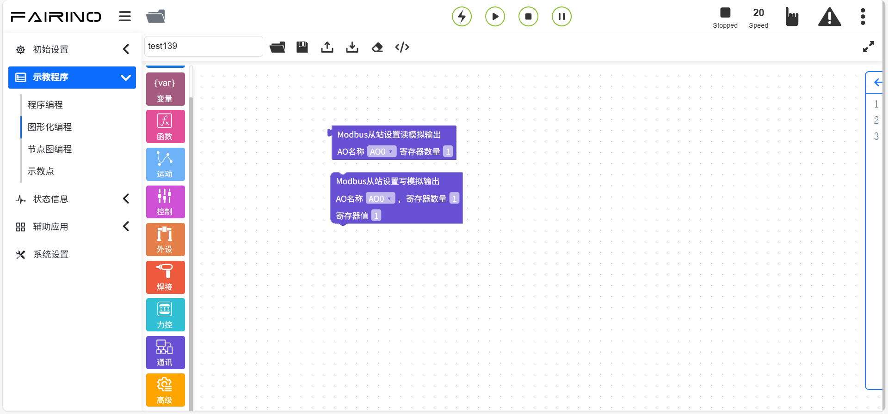

.. centered:: 圖表 10.10-9 從站“讀/寫模擬輸出”指令代碼塊

10. 從站模擬輸入設定,參數：

- AI名稱：依實際情況配置

- 暫存器數量：整數型 0 ~ 128

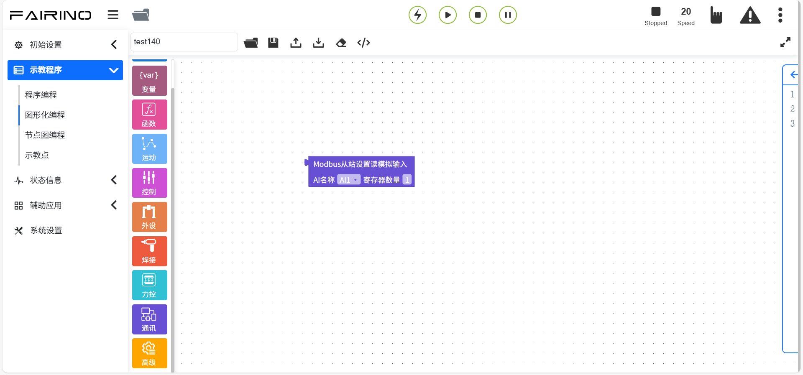

.. centered:: 圖表 10.10-10 從站“讀取模擬輸入”指令代碼塊

11. 從站等待數字輸入設定,參數：

- DI名稱：依實際情況配置

- 等待狀態：true/false

- 超時時間(ms)：整數型

.. centered:: 圖表 10.10-11 從站“等待數字輸入”指令代碼塊

12. 從站等待類比輸入設定,參數：

- AI名稱：依實際情況配置

- 等待狀態：大於/小於

- 暫存器數量：整數型 0 ~ 128

- 暫存器值：根據暫存器數量來定，可輸入多個數值。

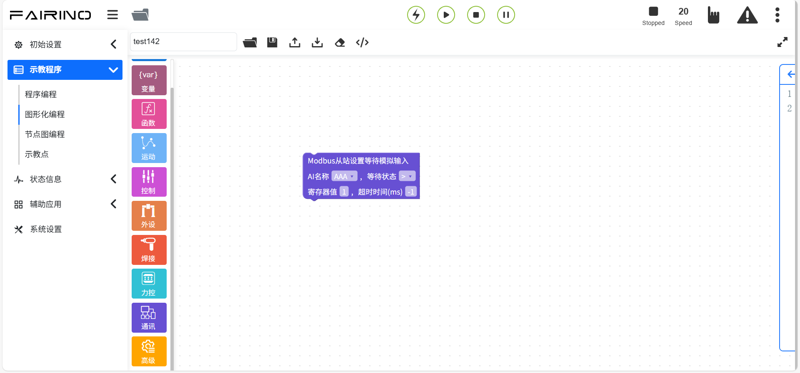

.. centered:: 圖表 10.10-12 從站“等待類比輸入”指令程式碼區塊

13. 讀取暫存器指令,參數：

- 功能碼：0x01-線圈/0x02-離散量/0x03-保持暫存器/0x04-輸入暫存器

- 暫存器、線圈、離散量位址：依實際情況輸入

- 暫存器、線圈、離散量數：0 ~ 255

- 地址：依實際情況輸入

- 是否應用線程：否/是

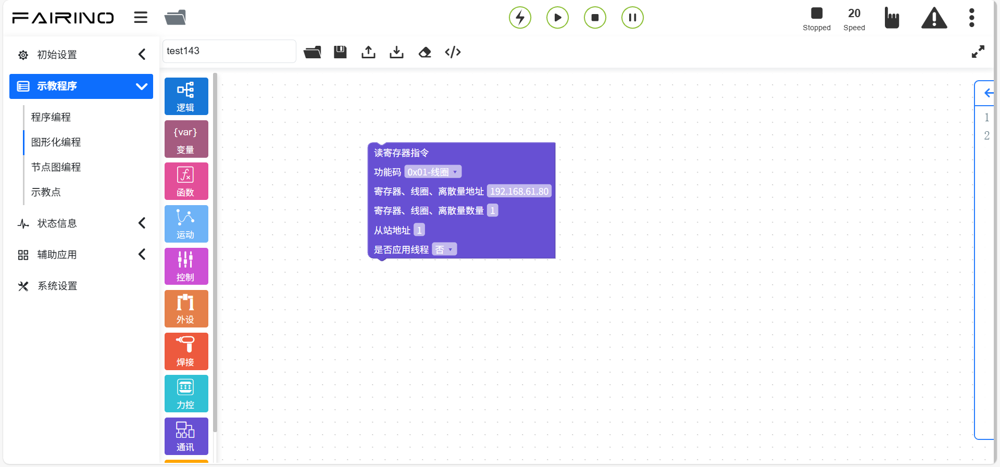

.. centered:: 圖表 10.10-13 「讀取暫存器」指令程式碼區塊

14. 讀暫存器資料指令,參數：

- 暫存器、線圈、離散量數：0 ~ 255

- 是否應用線程：否/是

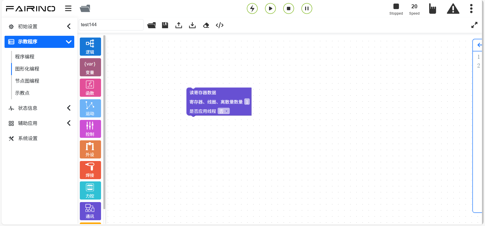

.. centered:: 圖表 10.10-14 「讀暫存器資料」指令碼區塊

15. 寫入暫存器指令,參數：

- 功能碼：0x01-線圈/0x02-離散量/0x03-保持暫存器/0x04-輸入暫存器

- 暫存器、線圈位址：依實際情況輸入

- 暫存器、線圈數量：0 ~ 255

- 位元組數組：依實際情況輸入

- 地址：依實際情況輸入

- 是否應用線程：否/是

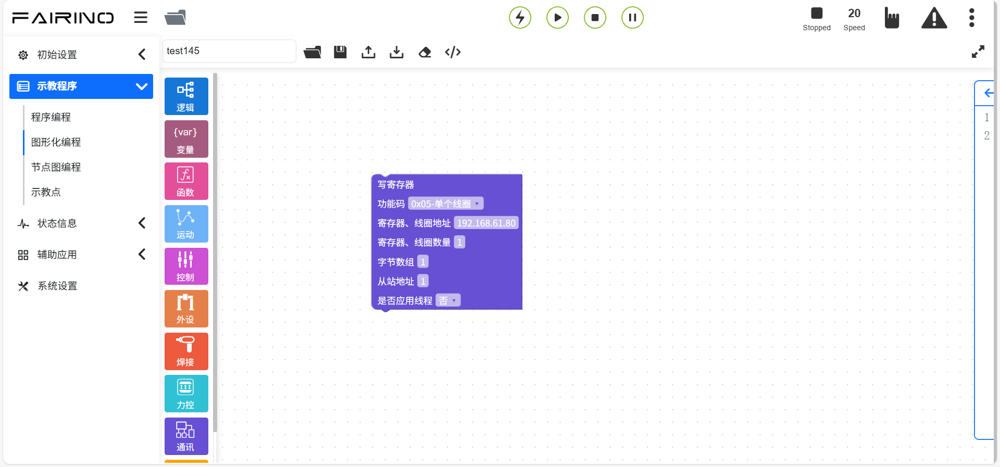

.. centered:: 圖表 10.10-15 「寫入暫存器指令」指令程式碼區塊

高階類別圖形化程式命令
--------------------------
高階類別圖形化程式指令包含dofile呼叫子程式、輔助執行緒、折疊指令等進階指令。

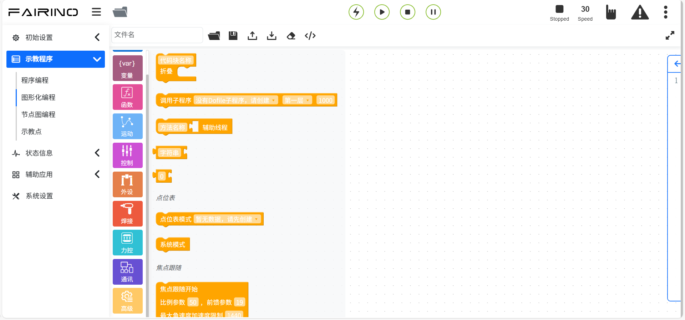

.. centered:: 圖表 10.11 高階類別圖形化程式命令

折疊指令
~~~~~~~~~~~~~~~~~~~~~
拖曳「折疊指令」程式碼區塊,進入圖形化編輯介面工作區。

此指令提供多行程式碼區塊折疊顯示，方便使用者閱讀程式碼區塊。

“折疊”指令節點,參數：

- 程式碼區塊名稱：命名折疊程式碼區塊名稱

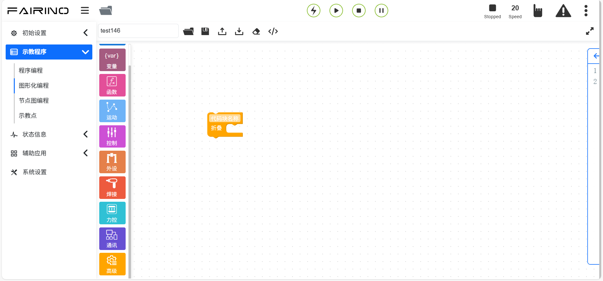

.. centered:: 圖表 10.11-1 折疊指令程式碼區塊

呼叫子程序指令
~~~~~~~~~~~~~~~~~~~~~
拖曳「呼叫子程式指令」程式碼區塊,進入圖形化編輯介面工作區。

該指令為呼叫子程序指令，在程式中插入該指令，當程式執行到該指令時，機器人會處於暫停狀態，若想繼續運行，點擊控制區「暫停/恢復」按鍵即可。

“呼叫子程序”指令節點,參數：

- dofile檔案：建立產生的檔案名

- 第幾層呼叫：第一層/第二層

- id編號：所屬層級對應位置id

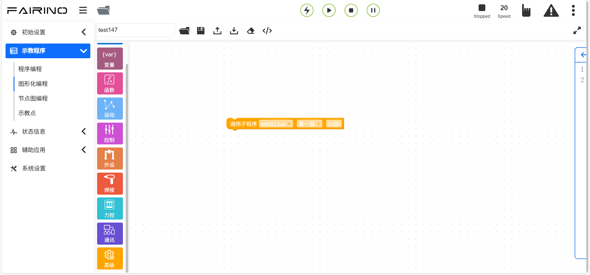

.. centered:: 圖表 10.11-2 呼叫子程式指令碼區塊

輔助線程指令
~~~~~~~~~~~~~~~~~~~~~
拖曳「輔助線程」程式碼區塊,進入圖形化編輯介面工作區。

Thread命令為輔助線程功能，用戶可以定義一個輔助線程與主線程同時運行，輔助線程主要與外部設備進行數據交互，支持socket通信，機器人DI狀態獲取，機器人DO狀態設置，機器人狀態信息獲取，與主線程資料交互，主線程透過輔助線程獲取的數據用於控制機器人運動邏輯的判斷。

“輔助線程”指令節點,參數：

- 方法名稱：輔助線程名稱

- 呼叫函數：輔助執行緒呼叫函數值

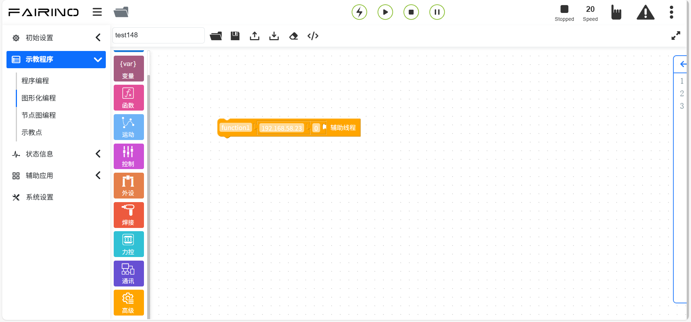

.. centered:: 圖表 10.11-3 輔助線程程式碼區塊

點位表指令
~~~~~~~~~~~~~~~~~~~~~
拖曳「點位表」程式碼區塊,進入圖形化編輯介面工作區。

此指令主要用於系統模式和點位表模式之間的模式切換，透過切換點位表來應用不同點位表內的示教點位。詳情請見章節12——示教點。

“點位表”指令節點,參數：

- 點位表模式：切換不同得點位表名稱

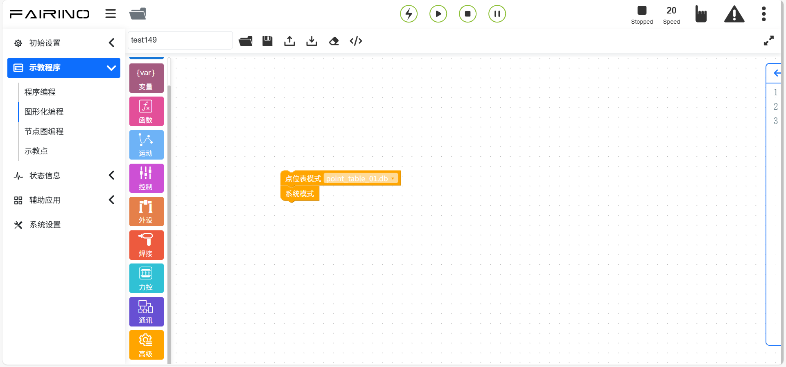

.. centered:: 圖表 10.11-4 點位表代碼區塊

焦點跟隨指令
~~~~~~~~~~~~~~~~~~~~~
拖曳「焦點跟隨」程式碼區塊,進入圖形化編輯介面工作區。

該指令主要用於機器人運動過程中，始終聚焦在一個點上跟隨移動。

“焦點跟隨”指令節點,參數：

- 參數比例：0~100，預設值50
- 前饋參數：0~1000，預設值19
- 最大角速度加速度限制：0~10000，預設值1440
- 最大角速度限制：0~1000，預設值180
- 鎖定X軸指向：參考輸入向量/水平/垂直

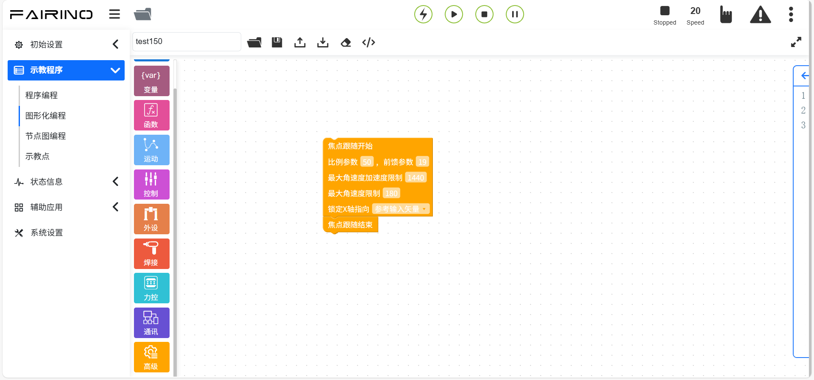

.. centered:: 圖表 10.11-5 焦點跟隨程式碼區塊

圖形化程式命令使用範例
-------------------------
選擇圖形化程式設計類型後，點選需要使用的圖形程式碼區塊，即可在工作區進行拖曳和拼接操作。

例如選擇PTP和Lin運動指令以及控制指令Waitms進行拼接，外層可嵌套一個折疊高階指令並輸入註解名稱，則可實現程式碼區塊折疊操作。

其中點選下拉方塊可選擇指令參數類型，輸入框可填入指令參數資料。圖形化程式命令範例如下：

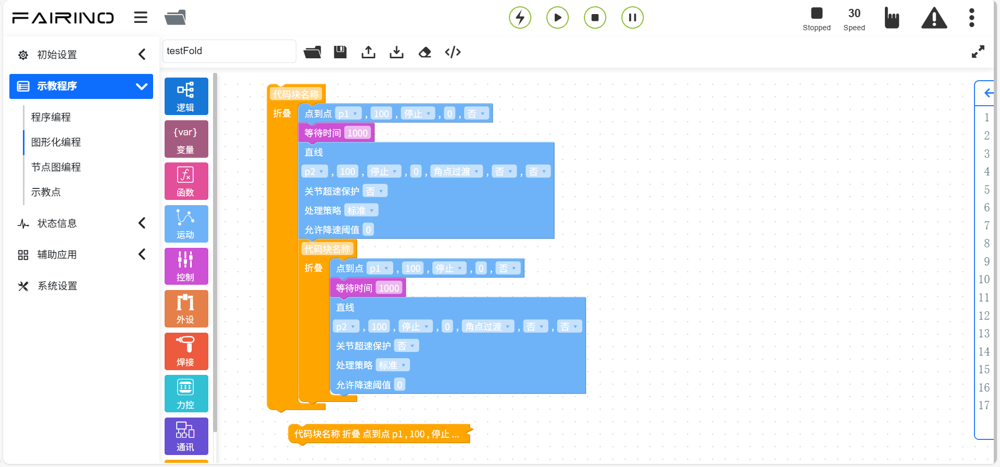

.. centered:: 圖表 10.12-1 圖形化程式命令範例

圖形化程式指令拼接和參數填入完成後，填寫工作區名稱，點選「儲存」圖示即可儲存本次程式。選擇編寫完成的“工作區”，點擊開始運行，即可執行本段程式。

圖形化程式碼區塊模組化
~~~~~~~~~~~~~~~~~~~~~~~~~~~~~~
為了提高圖形化程式碼可閱讀性，增加了圖形化程式碼區塊模組化功能，即進階指令：折疊指令碼區塊。

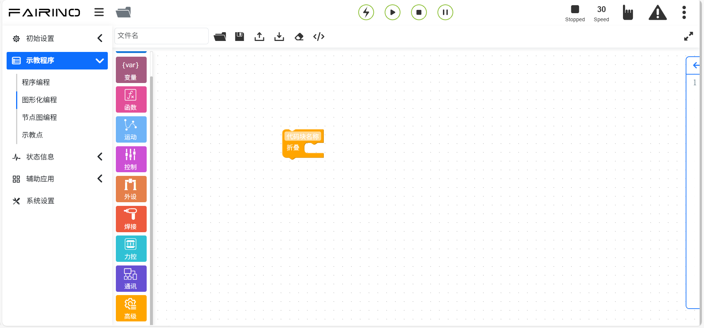

.. centered:: 圖表 10.12-2 折疊指令程式碼區塊

1. 寫一段程式碼區塊指令，在外層加入折疊指令程式碼區塊，在輸入框內編寫該段指令的備註。

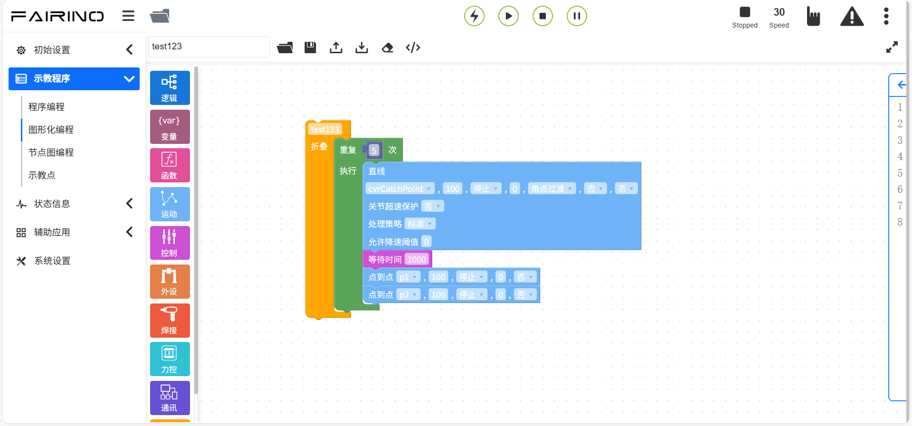

.. centered:: 圖表 10.12-3 折疊指令效果圖

2. 右鍵操作列右鍵"折疊塊"，該段指令代碼塊折疊，該代碼塊折疊成一行顯示，且折疊下可正確執行程序。

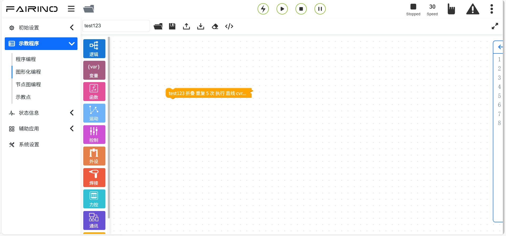

.. centered:: 圖表 10.12-4 折疊後效果圖

3. 捲動滑鼠，可實現頁面縮放功能，具體效果如下：

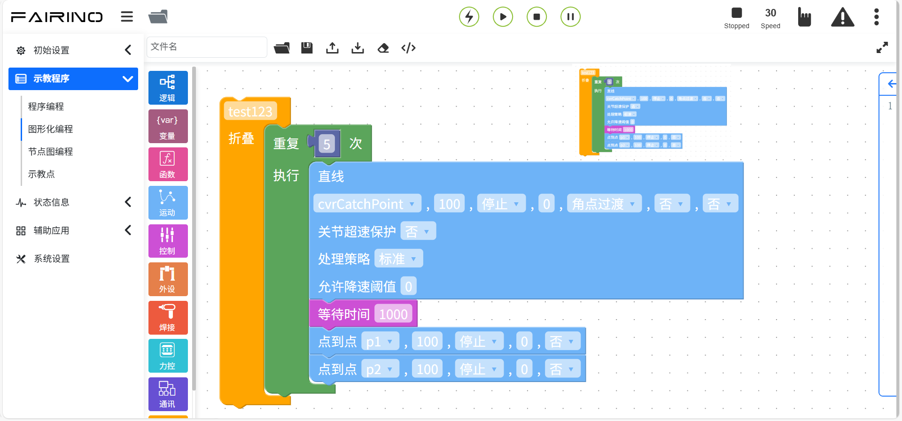

.. centered:: 圖表 10.12-5 頁面縮放功能效果圖

圖形化程式設計同名覆蓋
~~~~~~~~~~~~~~~~~~~~~~~~~~~~~~
在圖形化程式頁面，新建/載入檔案後，更改工作區名稱後點選儲存。若已變更的工作區名稱檔案已存在，則觸發「示教點已存在」彈出框，如下圖。

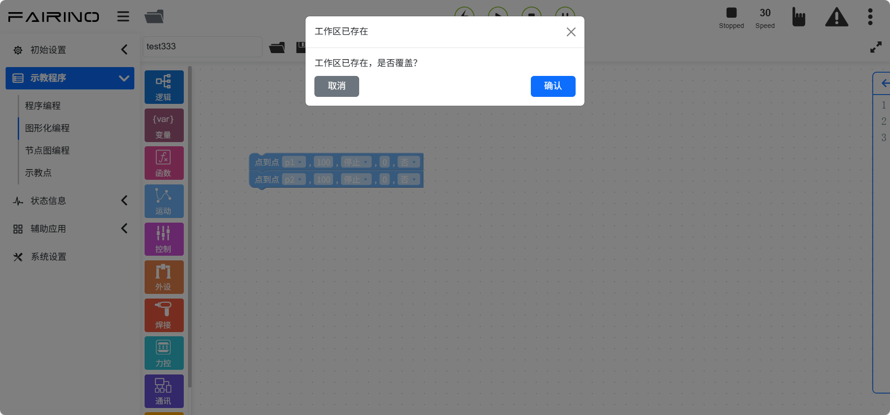

.. centered:: 圖表 10.12-6 圖形化編程程序覆蓋

**Step1**：點選「取消」按鈕，繼續執行先前的操作。

**Step2**：點選「同步更新示教程式」複選框，再點選「覆蓋」按鈕，則目前圖形化程式頁面的lua程式覆寫更改後工作區檔案名稱的lua程式。

圖形化程式設計程式未儲存驗證
~~~~~~~~~~~~~~~~~~~~~~~~~~~~~~

在圖形化程式頁面，開啟/新建程式後，若圖形化程式設計程式發生變更未儲存程式。

若點選“開啟”檔案操作，則觸發“是否儲存此程式”彈出框，提示“目前程式已發生改變，是否儲存此程式的變更？”，如下圖。

.. centered:: 圖表 10.12-7 目前頁面程式未儲存驗證

**Step1**：點選「不儲存」按鈕，繼續執行先前的「開啟」檔案操作。

**Step2**：點選「儲存」按鈕，未儲存的lua程式儲存成功，並繼續執行先前的「開啟」檔案操作。

若離開圖形化程式頁面，切換到其他頁面時，同樣觸發「是否儲存此程式」提示，且仍停留在目前圖形化程式頁面，如下圖。

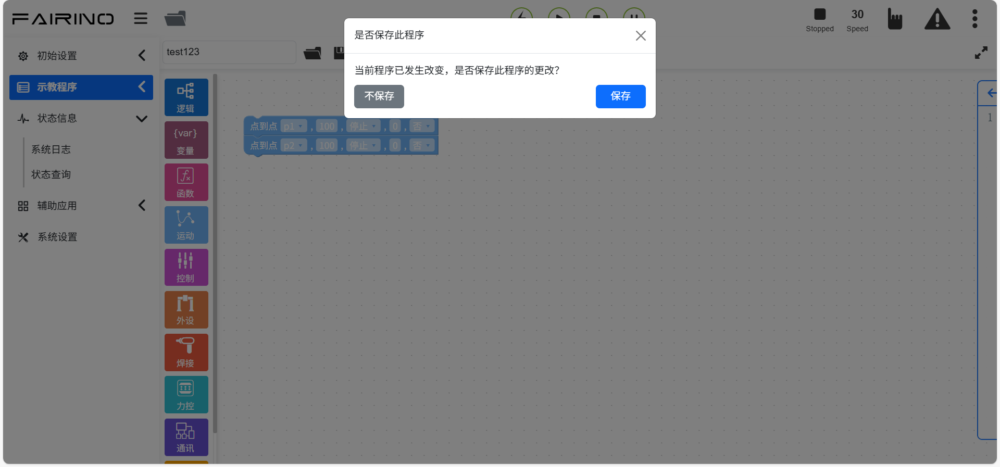

.. centered:: 圖表 10.12-8 切換頁面程式未儲存驗證

**Step1**：點選「不儲存」按鈕，跳到先前選擇的頁面。

**Step2**：點選「儲存」按鈕，未儲存的lua程式儲存成功，並跳到先前選擇的頁面。若已儲存的程式名稱已存在，提示示教點位已存在，是否覆蓋。進行取消/覆蓋操作後，請跳到先前選取的頁面。