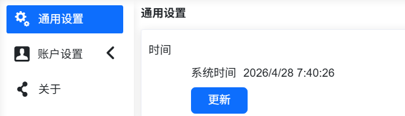

機器人安裝上電 
===================

.. toctree:: 
   :maxdepth: 6

安裝機器手臂
----------------

協作機器人安裝在安裝座上時，使用合規數量螺栓（強度不低於8.8級）將機器人鎖緊固定在安裝座上；建議安裝座上使用兩個合規銷孔配合銷釘進行機器人定位，以提高機器人安裝精度，防止因為碰撞等使機器人發生移動。當機器人有較高運行精度要求時，請務必增加銷釘對機器人進行定位。

.. centered:: 表格 1.1-1 機器人安裝零件標準

.. list-table::
   :widths: 80 50 50 50
   :header-rows: 0
   :align: center

   * - **協作機器人型號**
     - **螺栓**
     - **螺栓扭力**
     - **銷孔規格**

   * - FR3
     - 4顆M6
     - ≥10Nm
     - φ5mm

   * - FR3-WMS
     - 4顆M6
     - ≥10Nm
     - φ5mm

   * - FR3-WML
     - 4顆M6
     - ≥10Nm
     - φ5mm

   * - FR3-C
     - 4顆M6
     - ≥10Nm
     - φ5mm

   * - FR5-C
     - 4顆M6
     - ≥10Nm
     - φ5mm

   * - FR5
     - 4顆M8
     - ≥20Nm
     - φ8mm

   * - FR10
     - 4顆M8
     - ≥25Nm
     - φ8mm

   * - FR16
     - 4顆M8
     - ≥25Nm
     - φ8mm

   * - FR20
     - 6顆M10
     - ≥45Nm
     - φ8mm

   * - FR30
     - 6顆M10
     - ≥45Nm
     - φ8mm

   * - FR30L
     - 6顆M10
     - ≥45Nm
     - φ8mm

.. important:: 
  推薦機器人安裝座符合以下幾個要求，以確保機器人安裝牢固且穩定：

 （1）機器人安裝座需要足夠堅固且有足夠的承載能力，至少應該承載5倍的機器人重量，至少能承受10倍的1軸扭力。

 （2）機器人安裝座應表面平整，以確保與機器人接觸面緊密接觸；

 （3）機器人安裝座應剛度足夠強壯，固定牢固，不會和機器人發生共振；

 （4）當機器人和其他部件同時移動時，安裝座與其他運動部件應隔離開，不要固定在一起避免運動過程中的振動幹擾；

 （5）如果機器人安裝在移動平台或外部軸上，移動平台或外部軸的加速度應盡量低；

連接控制箱
----------------

本系列機器人可配置三種不同電源輸入的控制箱，控制箱電源輸入資訊詳見控制箱銘牌資訊。機器人需要電氣接地。機械手控制系統的外部連線均使用可插拔可快速安裝的插頭進行連接。

A. 30-60VDC
B. 176-264VAC~50-60Hz
C. 100-240VAC~50-60HZ

.. note:: 交流輸入的控制箱區分窄電壓和寬電壓兩個版本，控制箱接線端子和外形一致，單獨通過外形不能區分，請通過控制箱銘牌進行確認，確認無誤後再上電運行。

協作機器人接線面板如下圖表：

.. image:: installation/037.png
   :width: 6in
   :align: center

.. centered:: 圖表 1.2-1 控制箱接線面板

按鈕盒介面預設為示教器控制端口，IP位址為192.168.58.2，使用網路線連接按鈕盒介面與電腦，電腦IP位址設為192.168.58.10或與之同一網段，開啟Google瀏覽器輸入192.168.58.2即可造訪示教器頁面。

認識按鈕盒及末端LED
---------------------

按鈕盒
~~~~~~~~~

60按鈕盒(POE)(BX01)
++++++++++++++++++++++++++++++

.. figure:: installation/058.png
	:align: center
	:width: 6in

.. centered:: 图表 1.3-1 60按鈕盒(POE)(BX01)

60按鈕盒(POE)(BX02)-V1.0
++++++++++++++++++++++++++++++

.. image:: installation/059.png
   :width: 6in
   :align: center

.. centered:: 圖表 1.3-2 控制箱接線面板

.. centered:: 表格 1.3-1 控制箱接線面板按鍵說明

.. list-table::
   :widths: 50 200
   :header-rows: 0
   :align: center

   * - **按鍵名**
     - **功能**
  
   * - 急停開關
     - 當按下急停開關，機器人進入緊急停止狀態

   * - 開始停止
     - 開始/停止運行程序

   * - 網口
     - 連接web示教器

   * - 關機
     - 暫未啟用

   * - 記錄點
     - 記錄示教點

   * - 示教模式
     - 進入/退出搭配示教器狀態

   * - 運作模式
     - 自動/手動模式切換

   * - 拖曳模式
     - 進入/退出拖曳模式

60按鈕盒(POE)(BX02)-V2.0
++++++++++++++++++++++++++++++

.. image:: installation/079.png
 :width: 6in
 :align: center

.. centered:: 圖表 1.3-3 控制箱接線面板

.. centered:: 表格 1.3-2 控制箱接線面板按鍵說明

.. list-table::
 :widths: 50 200
 :header-rows: 0
 :align: center

 * - **按鍵名**
   - **功能**

 * - 急停開關
   - 當按下急停開關，機器人進入緊急停止狀態

 * - 開始停止
   - 開始/停止運行程序

 * - 網口
   - 連接web示教器

 * - IP重設
   - 重置網口IP

 * - 記錄點
   - 記錄示教點

 * - 一鍵清除
   - 清除所有可恢復的報錯

 * - 運作模式
   - 自動/手動模式切換

 * - 拖曳模式
   - 進入/退出拖曳模式

末端LED
~~~~~~~~~

.. centered:: 表格 1.3-4 末端LED定義

.. list-table::
   :widths: 120 100
   :header-rows: 0
   :align: center

   * - **功能**
     - **LED顏色**

   * - 通信未建立時
     - 「滅」「紅」「綠」「藍」交替

   * - 自動模式
     - 藍色長亮

   * - 手動模式
     - 綠色長亮

   * - 拖曳模式
     - 白青色長亮

   * - 按鈕盒記錄點（僅在使用按鈕盒時）
     - 紫色閃爍兩下

   * - 進入未搭配按鈕盒狀態（僅在使用按鈕盒時）
     - 青藍閃爍兩下

   * - 開始運作（僅在使用按鈕盒時）
     - 藍色閃爍兩下

   * - 停止運作（僅在使用按鈕盒時）
     - 紅色閃爍兩下

   * - 報錯（僅在使用按鈕盒時）
     - 紅色長亮

   * - 校零完成
     - 白青色閃爍三下

   * - 去使能
     - 黃色閃爍兩下

上電使能
----------------

上電前，請確認按鈕盒急停按鈕處理鬆開狀態，按下控制箱紅色開關按鈕上電，使能成功後末端LED燈處於綠色常亮狀態。

電源關閉
----------------

.. important:: 
  使用本設備時，請務必確保在關閉電源之前，停止所有運作中的程序，停用狀態查詢功能，確認運作狀態為「Stopped」。此操作旨在保護設備及儲存資料的安全，避免因突然斷電而導致的資料遺失或系統損壞。

.. image:: installation/078.png
   :width: 6in
   :align: center

.. centered:: 圖表 1.5-1 關閉電源按鈕

控制箱紐扣電池
----------------------------------------------------------------

時間遺失的常見原因
~~~~~~~~~~~~~~~~~~~~~~~~~~~~~~~~~~~~~~~~~~~~~~~~~~~~~~~~~~~~~~~~~~~~~~~~

本設備使用外部紐扣電池作為即時時鐘（RTC）的後備電源，用於在主電源斷電時維持時間計數。

若出現時間遺失（即重新上電後顯示錯誤日期），通常由以下一種或多種原因引起：

.. list-table::
   :widths: 40 40 60
   :header-rows: 0
   :align: center

   * - **原因分類**
     - **具體描述**
     - **排查建議**

   * - 紐扣電池電量耗盡
     - 設備3個月以上未上電使用，導致電池能量自然消耗完畢。
     - 使用萬用錶測量電池電壓（需拆下測量），若電壓低於2.5V則需充電。

   * - 電池損壞
     - 電池使用壽命已到。
     - 查看電池是否出現漏液鼓包情況，需要更換電池。電池型號：MS621FE-FL11E，3V/5.5mAH，可充電使用。

   * - 電池端子接觸不良
     - 電池端子氧化、變形，或設備受到震動導致電池瞬間脫離觸點。
     - 檢查電池與端子插接是否牢固，清潔觸點，重新安裝電池並確保卡緊。

   * - 未安裝電池或電池裝反
     - 用戶未安裝備用電池，或安裝時正負極方向錯誤。
     - | 確認電池已安裝且極性正確（正極朝上）。
       .. image:: installation/131.png
          :width: 2in
          :align: center

   * - 電池充電電路故障
     - 可充電紐扣電池無法正常蓄電。
     - 需由專業維修人員檢測充電回路。

.. warning:: 本設備使用的紐扣電池型號為[MS621FE-FL11E，3V/5.5mAH，可充電使用]，請務必根據型號選擇正確的處理方式，嚴禁安裝不可充電電池。

時間異常識別和手動校準
~~~~~~~~~~~~~~~~~~~~~~~~~~~~~~~~~~~~~~~~~~~~~~~~~~~~~~~~~~~~~~~~~~~~~~~~~~~

1)異常識別方法
   
機器人重新上電後，首先查看設備頁面當前顯示的時間。將其與電腦的系統時間進行比對：

- 若兩者一致，表示時間正常，無需後續操作。

.. image:: installation/132.png
   :width: 4in
   :align: center

.. centered:: 圖表 1.6-1 系統時間異常情況

- 若兩者不一致（例如日期錯誤、時分秒偏差較大），則判定為時間異常，請繼續執行下面的校準步驟。
  
2)校準步驟

如已確認時間異常，請按以下操作同步系統時間：

- 打開瀏覽器進入 WebApp，依次導航至：「系統設定 -> 通用設定 -> 時間」界面。

.. centered:: 圖表 1.6-2 系統時間更新界面

- 點擊界面中的「更新」按鈕，系統將自動完成時間同步。同步後返回機器人頁面，時間即可恢復正常。

紐扣電池充電與維護注意事項
~~~~~~~~~~~~~~~~~~~~~~~~~~~~~~~~~~~~~~~~~~~~~~~~~~~~~~~~~~~~~~~~~~~~~~~~~~~~~~~~~~~~~

1)充電條件

- 設備主電源接通（220V AC）後，充電電路自動激活。
- 環境溫度應在 0℃ ~ 45℃ 範圍內，高溫會降低充電效率並縮短電池壽命。

2)充電時間

- 完全放電的電池大約需要 [5小時] 才能充滿。期間時間保持功能正常。

3)禁止事項

- 請勿使用外部充電器直接對設備內的紐扣電池充電。
- 請勿將不可充電電池裝入帶設備中，否則可能引起危險。

電池更換與廢棄
~~~~~~~~~~~~~~~~~~~~~~~~~~~~~~~~~~~~~~~~~~~~~~~~~~~~~~~~~~~~~~~~~~~
1)更換週期

- 通常可使用 [5 年] 以上，若出現時間頻繁遺失請更換。

2)更換步驟

- 斷開設備主電源。
- 打開上蓋。
- 取出舊電池，注意極性方向。
- 焊接同型號合格新電池（正極朝上）。
- 闔上蓋，重新上電並校對當前時間。

3)廢棄處置

- 請勿將電池投入火中或與水接觸。
- 按照當地法規分類回收廢舊電池（紐扣電池通常含有鋰或重金屬）。

技術支援
~~~~~~~~~~~~~~~~~~~~~~~~~~~~~~~~~~~~~~~~~~~~~~~~~~~~~~~~~~~

若按照以上步驟操作後問題仍未解決，請聯繫我們的技術支援團隊，並提供以下信息：

- 設備型號與序列號。
- 使用的電池型號（請查看電池表面刻字）。
- 故障現象（例如：斷電後立即遺失 / 放置一晚後遺失）。