硬體安裝 
===================

.. toctree:: 
	:maxdepth: 5

安全須知
------------

簡介
~~~~~

本說明書會使用到以下警示，這些警示的作用是確保人身及設備的安全，當您在閱讀本說明書時，必須遵守並執行本手冊其他章節中的所有組裝說明和指南，這一點非常重要。應特別注意與警告標誌相關的文字。

.. important:: 
  - 如果機器人（機器人本體、控制箱、示教器或按鈕盒）因人為原因而損壞、更改或修改，法奧意威拒絕承擔所有責任；
  - 法奧意威對因客戶編寫的程式出錯而對機器人或任何其他設備造成的任何損壞概不負責。

人員安全
~~~~~~~~~~~~~~~~~~~~~~~~~~~~~

在運行機器人系統時，首先必須確保作業人員的安全，以下列出一般性的注意事項，請妥善採取確保作業人員安全的相應措施。

1. 使用機器人系統的各作業人員，應透過法奧意威（蘇州）機器人系統有限公司主辦的訓練課程接受訓練。使用者需確保其充分掌握安全、規範的操作流程，具備機器人操作資格。訓練詳情請向本公司查詢，電子郵件為 jiling@frtech.fr。

2. 使用機器人系統的各作業人員請不要穿寬鬆的衣服，不要戴珠寶。操作機器人時請確保長髮束在腦後。

3. 在設備運作之中，即使機器人看起來已經停止，也有可能是因為機器人在等待啟動訊號而處在即將動作的狀態。即使在這樣的狀態下，也應該將機器人視為正在動作中。

4. 應在地板上畫上線條來標清機器人的動作範圍，使操作者了解機器人包含握持工具（機械手、工具等）的動作範圍。

5. 確保在機器人操作區域附近建立安全措施（例如，護欄、繩索、或防護螢幕），保護操作者及週邊人群。應視需要設置鎖具，使得負責操作的作業人員以外者不能接觸機器人電源。

6. 在使用操作面板和示教器時，由於戴上手套可能會出現操作上的失誤，請務必在取下手套後進行作業。

7. 在人被機器人夾住或圍在裡面等緊急和異常情況下，透過用力（至少700 N）推動或拉動機器人手臂，迫使關節移動。無電力驅動情況下手動移動機器人手臂僅限於緊急情況，並且可能會損壞關節。

危險識別
~~~~~~~~~~~~~~~~~~~~~~~~~~~~~~~

風險評估應考慮正常使用期間操作人員與機器人之間所有潛在的接觸以及可預見的誤操作。操作人員的頸部、臉部和頭部不應暴露，以免發生碰觸。在不使用外圍安全防護裝置的情況下使用機器人需要先進行風險評估，以判斷相關危險是否會構成不可接受的風險，例如

- 使用尖銳的末端執行器或工具連接器可能有危險；

- 處理毒性或其他有害物質可能有危險；

- 操作者手指有被機器人底座或關節夾住的危險；

- 被機器人碰撞發生的危險；

- 機器人或連接到末端的工具固定不到位存在的危險；

- 機器人有效負載與堅固表面之間的衝擊所造成的危險。

整合商必須透過風險評估來衡量此類危險及其相關的風險等級，並且確定和實施相應的措施，以將風險降低至可接受的水平。請注意，特定機器人設備可能還有其他重大危險。

透過將FR機器人所應用的固有安全設計措施與整合商和最終用戶所實施的安全規範或風險評估相結合，將與FR協作性操作相關的風險盡可能降低至合理可行的水平。透過此文件可將機器人在安裝前存在的任何剩餘風險傳達給整合商和最終用戶。如果整合商的風險評估測定其特定應用中存在可能對使用者構成不可接受風險的危險，整合商必
須採取適當的風險降低措施，以消除或最大限度降低這些危險，直到將風險降低至可接受的水平為止。在採取適當的風險降低措施（如有需要）之前使用是不安全的。

如果對機器人進行非協同性安裝（例如，使用危險工具時），風險評估可能推斷整合商需要在其編程時連接額外的安全設備（例如，安全啟動設備）確保人員及設備安全。

銘牌資訊
~~~~~~~~~~~~~~

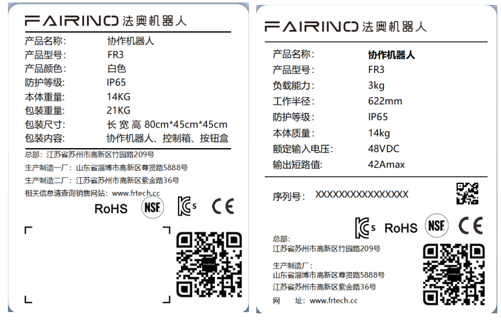

.. centered:: 圖表 3.1-1 FR3型號協作機器人

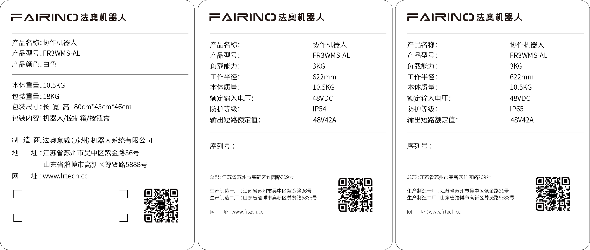

.. centered:: 圖表 3.1-2 FR3-WMS型號協作機器人

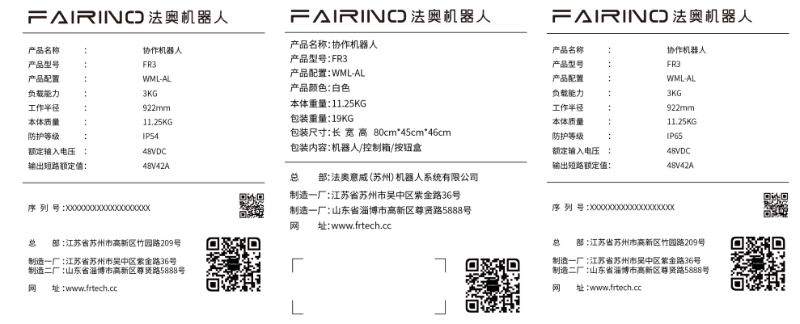

.. centered:: 圖表 3.1-3 FR3-WML型號協作機器人

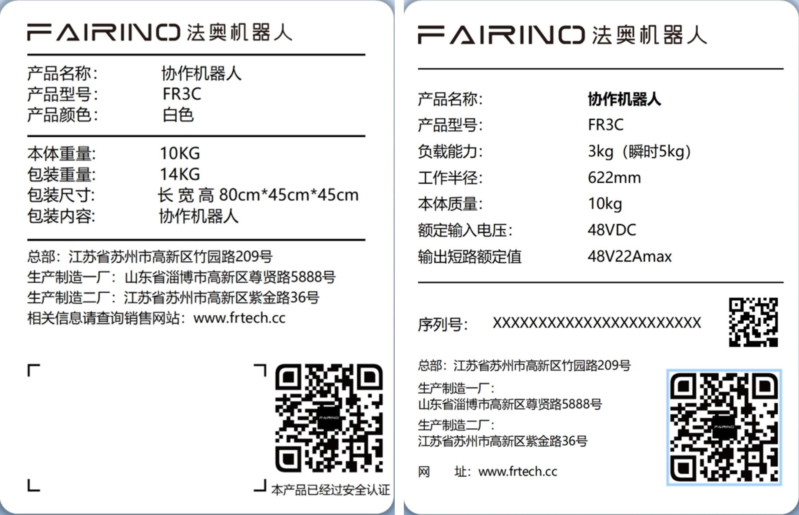

.. centered:: 圖表 3.1-4 FR3-C型號協作機器人

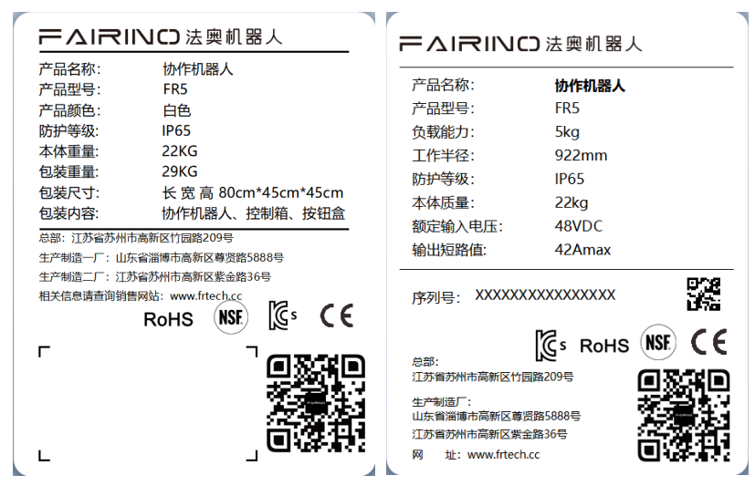

.. centered:: 圖表 3.1-5 FR5型號協作機器人

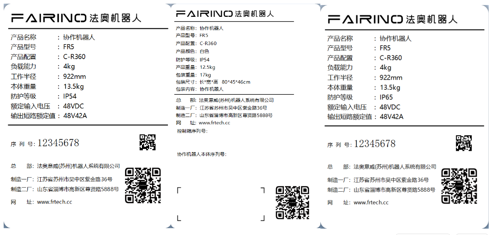

.. centered:: 圖表 3.1-6 FR5-C型號協作機器人

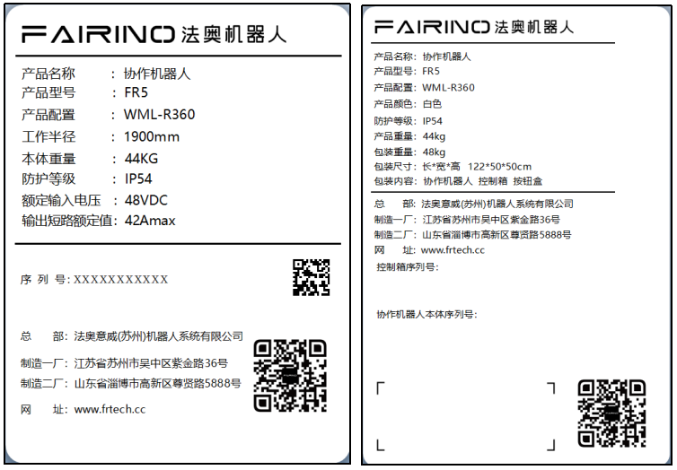

.. centered:: 圖表 3.1-7 FR5-WML型號協作機器人

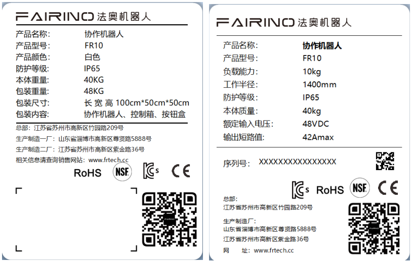

.. centered:: 圖表 3.1-8 FR10型號協作機器人

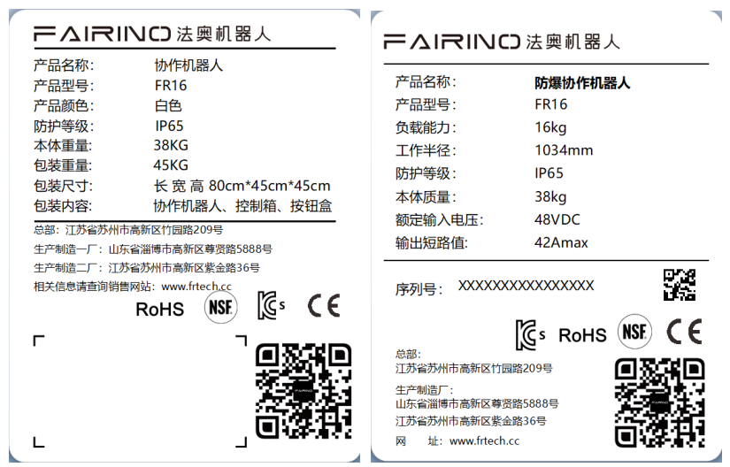

.. centered:: 圖表 3.1-9 FR16型號協作機器人

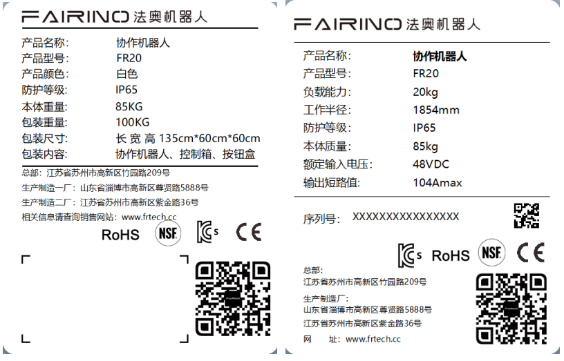

.. centered:: 圖表 3.1-10 FR20型號協作機器人

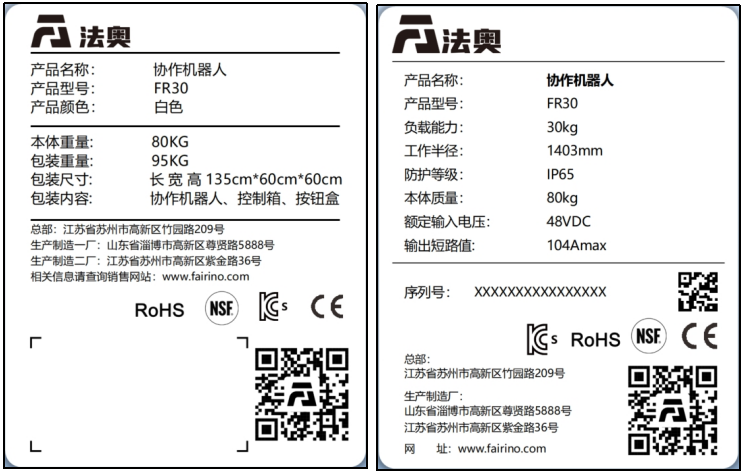

.. centered:: 圖表 3.1-11 FR30型號協作機器人

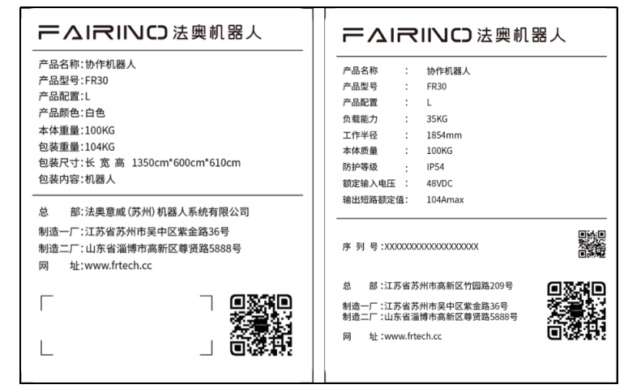

.. centered:: 圖表 3.1-12 FR30L型號協作機器人

有效性和責任
~~~~~~~~~~~~~~~~

本手冊中的資訊不包含設計、安裝和操作一個完整的機器人應用，也不包含所有可能對此完整的系統的安全造成影響的周邊設備。此完整系統的設計和安裝需符合該機器人安裝所在國的標準和規範中所建立的安全要求。

法奧意威的整合商有責任確保遵循相關國家的法律法規，確保完整的機器人應用中不存在任何重大危險。這包括但不限於以下內容：

- 對完整的機器人系統做一個風險評估

- 將風險評估定義的其他機械和附加安全設備連接在一起

- 在軟體中建立適當的安全性設置

- 確保使用者不會對任何安全措施加以修改

- 確認整個機器人系統的設計和安裝準確無誤

- 明確使用說明

- 在機器人上標明整合商的相關標誌和聯絡資訊

- 收集技術文件中的所有文檔，包括本手冊

責任有限
~~~~~~~~~~~~~~

本手冊所包含的任何安全資訊都不得視為通用的機器人安全保證，即使遵守所有安全說明，依然有可能造成人員傷害或設備損壞。

手冊中的警告標誌
~~~~~~~~~~~~~~~~~~~~~~~~~~~~~

下面的標誌定義了本手冊中所包含的危險等級規定說明。產品上也使用了同樣的警告標誌。

.. important:: 
	.. figure:: installation/008.png
		:width: 60
		:height: 50
		:align: left

	危險：這指的是即將引發危險的用電情況，如果不避免，可導致死亡或嚴重傷害。

.. important:: 
	.. figure:: installation/009.png
		:width: 60
		:height: 50
		:align: left

	觸電危險：這指的是即將引發危險的觸電情況，如果不避免，可導致人員觸電死亡或嚴重傷害。

.. important:: 
	.. figure:: installation/010.png
		:width: 60
		:height: 50
		:align: left

	燙傷危險：這指的是可能引發危險的熱表面，如果不避免接觸了，可造成人員傷害。
	
使用前評估
~~~~~~~~~~~~~~~

首次使用機器人或進行任何修改之後，機器人預設速度低於250mm/s，請勿登入管理員修改速度進入高速模式，之後必須進行以下測試。確認所有安全輸入和輸出是正確的，並且連接正確。測試所有連接的安全輸入和輸出（包括多台機器或機器人共有的設備）是否功能正常。因此您必須：

- 測試緊急停止按鈕和輸入是否可以停止機器人並啟動煞車。

- 測試防護輸入是否可以停止機器人的移動。如果配置了防護重置，請在恢復運動之前檢查是否需要啟動。

- 測試操作模式是否可以切換操作模式，請參閱使用者介面右上角的圖示。

- 測試3 檔位使動裝置是否必須按下才能在手動模式下啟動動作，且機器人處於減速控制下（機器人軟體版本V3.0前不支援該功能）。

- 測試系統緊急停止輸出是否能夠將整個系統帶到安全狀態。

緊急停止
~~~~~~~~~~~~~~

緊急停止按鈕為0類停機，按下緊急停止按鈕，立即停止機器人的所有動作。

下表顯示觸發0類停機的停止距離和停止時間。這些測量結果對應於機器人的以下配置：

- 延伸：100%（機器手臂完全水平展開）

- 速度：100%（機器人一般速度設為100%，以180°/s的關節速度移動）

- 有效負載：最大有效負載

關節1，關節6測試機器人水平移動，旋轉軸垂直於地面。關節2，關節3，關節4，關節5測試機器人遵循垂直軌跡，旋轉軸平行於地面，並在機器人向下移動時停止。

.. centered:: 表格 3.1-1 0類停止距離(rad)
.. list-table::
   :widths: 10 15 15 15 15 15 15
   :header-rows: 0
   :class: sheet-center

   * - 
     - **關節1**
     - **關節2**
     - **關節3**
     - **關節4**
     - **關節5**
     - **關節6**

   * - **FR3**
     - 0.47
     - 0.60
     - 0.56
     - 0.29
     - 0.10
     - 0.06

   * - **FR3-WMS**
     - 0.47
     - 0.60
     - 0.56
     - 0.29
     - 0.10
     - 0.06

   * - **FR3-WML**
     - 0.51
     - 0.63
     - 0.60
     - 0.33
     - 0.16
     - 0.10

   * - **FR3-C**
     - 0.47
     - 0.60
     - 0.56
     - 0.29
     - 0.10
     - 0.06

   * - **FR5**
     - 0.51
     - 0.63
     - 0.60
     - 0.33
     - 0.16
     - 0.10

   * - **FR5-C**
     - 0.51
     - 0.63
     - 0.60
     - 0.33
     - 0.16
     - 0.10

   * - **FR10**
     - 0.64
     - 0.70
     - 0.69
     - 0.42
     - 0.25
     - 0.13

   * - **FR16**
     - 0.60
     - 0.67
     - 0.65
     - 0.39
     - 0.22
     - 0.12

   * - **FR20**
     - 0.69
     - 0.75
     - 0.80
     - 0.48
     - 0.31
     - 0.22

   * - **FR30L**
     - 0.69
     - 0.75
     - 0.80
     - 0.48
     - 0.31
     - 0.22

.. centered:: 表格 3.1-2 0類停止時間(ms)
.. list-table::
   :widths: 10 15 15 15 15 15 15
   :header-rows: 0
   :class: sheet-center

   * - 
     - **關節1**
     - **關節2**
     - **關節3**
     - **關節4**
     - **關節5**
     - **關節6**

   * - **FR3**
     - 400
     - 470
     - 450
     - 280
     - 120
     - 90

   * - **FR3-WMS**
     - 400
     - 470
     - 450
     - 280
     - 120
     - 90

   * - **FR3-WML**
     - 400
     - 470
     - 450
     - 280
     - 120
     - 90

   * - **FR3-C**
     - 400
     - 470
     - 450
     - 280
     - 120
     - 90

   * - **FR5**
     - 420
     - 500
     - 480
     - 310
     - 150
     - 120

   * - **FR5-C**
     - 420
     - 500
     - 480
     - 310
     - 150
     - 120

   * - **FR10**
     - 460
     - 540
     - 510
     - 330
     - 170
     - 140

   * - **FR16**
     - 440
     - 530
     - 490
     - 320
     - 160
     - 130

   * - **FR20**
     - 540
     - 600
     - 700
     - 400
     - 260
     - 170

   * - **FR30L**
     - 540
     - 600
     - 700
     - 400
     - 260
     - 170

緊急停止後，關閉電源，旋轉緊急停止按鈕，打開電源即可重新啟動機器人。

同時機器人安全停止和軟限位停止的停止時間和停止距離，請見下表。這些測量結果對應於機器人的以下配置：

- 延伸：100%（機器手臂完全水平展開）

- 速度：100%（機器人一般速度設為100%，以180°/s的關節速度移動）

- 有效負載：最大有效負載

關節1，關節6測試機器人水平移動，旋轉軸垂直於地面。關節2，關節3，關節4，關節5測試機器人遵循垂直軌跡，旋轉軸平行於地面，並在機器人向下移動時停止。

.. centered:: 表格 3.1-3 安全停止距離(rad)
.. list-table::
   :widths: 10 15 15 15 15 15 15
   :header-rows: 0
   :class: sheet-center

   * - 
     - **關節1**
     - **關節2**
     - **關節3**
     - **關節4**
     - **關節5**
     - **關節6**

   * - **FR3**
     - 0.49
     - 0.63
     - 0.58
     - 0.32
     - 0.12
     - 0.09

   * - **FR3-WMS**
     - 0.49
     - 0.63
     - 0.58
     - 0.32
     - 0.12
     - 0.09

   * - **FR3-WML**
     - 0.54
     - 0.65
     - 0.63
     - 0.35
     - 0.19
     - 0.12

   * - **FR3-C**
     - 0.49
     - 0.63
     - 0.58
     - 0.32
     - 0.12
     - 0.09

   * - **FR5**
     - 0.54
     - 0.65
     - 0.63
     - 0.35
     - 0.19
     - 0.12

   * - **FR5-C**
     - 0.54
     - 0.65
     - 0.63
     - 0.35
     - 0.19
     - 0.12

   * - **FR10**
     - 0.66
     - 0.73
     - 0.71
     - 0.45
     - 0.27
     - 0.14

   * - **FR16**
     - 0.63
     - 0.69
     - 0.68
     - 0.41
     - 0.25
     - 0.14

   * - **FR20**
     - 0.71
     - 0.78
     - 0.82
     - 0.51
     - 0.33
     - 0.25

   * - **FR30L**
     - 0.71
     - 0.78
     - 0.82
     - 0.51
     - 0.33
     - 0.25

.. centered:: 表格 3.1-4 安全停止時間(ms)
.. list-table::
   :widths: 10 15 15 15 15 15 15
   :header-rows: 0
   :class: sheet-center

   * - 
     - **關節1**
     - **關節2**
     - **關節3**
     - **關節4**
     - **關節5**
     - **關節6**

   * - **FR3**
     - 410
     - 490
     - 410
     - 300
     - 130
     - 110

   * - **FR3-WMS**
     - 410
     - 490
     - 410
     - 300
     - 130
     - 110

   * - **FR3-WML**
     - 410
     - 490
     - 410
     - 300
     - 130
     - 110

   * - **FR3-C**
     - 410
     - 490
     - 410
     - 300
     - 130
     - 110

   * - **FR5**
     - 450
     - 520
     - 510
     - 330
     - 180
     - 140

   * - **FR5-C**
     - 450
     - 520
     - 510
     - 330
     - 180
     - 140

   * - **FR10**
     - 480
     - 570
     - 530
     - 360
     - 190
     - 170

   * - **FR16**
     - 470
     - 550
     - 520
     - 340
     - 190
     - 150

   * - **FR20**
     - 560
     - 630
     - 720
     - 430
     - 280
     - 200

   * - **FR30L**
     - 560
     - 630
     - 720
     - 430
     - 280
     - 200

.. centered:: 表格 3.1-5 軟限位停止距離(rad)
.. list-table::
   :widths: 10 15 15 15 15 15 15
   :header-rows: 0
   :class: sheet-center

   * - 
     - **關節1**
     - **關節2**
     - **關節3**
     - **關節4**
     - **關節5**
     - **關節6**

   * - **FR3**
     - 0.52
     - 0.65
     - 0.61
     - 0.34
     - 0.15
     - 0.11

   * - **FR3-WMS**
     - 0.52
     - 0.65
     - 0.61
     - 0.34
     - 0.15
     - 0.11

   * - **FR3-WML**
     - 0.56
     - 0.68
     - 0.65
     - 0.38
     - 0.21
     - 0.15

   * - **FR3-C**
     - 0.52
     - 0.65
     - 0.61
     - 0.34
     - 0.15
     - 0.11

   * - **FR5**
     - 0.56
     - 0.68
     - 0.65
     - 0.38
     - 0.21
     - 0.15

   * - **FR5-C**
     - 0.56
     - 0.68
     - 0.65
     - 0.38
     - 0.21
     - 0.15

   * - **FR10**
     - 0.69
     - 0.75
     - 0.74
     - 0.47
     - 0.30
     - 0.18

   * - **FR16**
     - 0.65
     - 0.72
     - 0.70
     - 0.44
     - 0.27
     - 0.17

   * - **FR20**
     - 0.74
     - 0.80
     - 0.85
     - 0.53
     - 0.36
     - 0.27

   * - **FR30L**
     - 0.74
     - 0.80
     - 0.85
     - 0.53
     - 0.36
     - 0.27

.. centered:: 表格 3.1-6 軟限位停止時間(ms)
.. list-table::
   :widths: 10 15 15 15 15 15 15
   :header-rows: 0
   :class: sheet-center

   * - 
     - **關節1**
     - **關節2**
     - **關節3**
     - **關節4**
     - **關節5**
     - **關節6**

   * - **FR3**
     - 430
     - 500
     - 430
     - 310
     - 150
     - 120

   * - **FR3-WMS**
     - 430
     - 500
     - 430
     - 310
     - 150
     - 120

   * - **FR3-WML**
     - 430
     - 500
     - 430
     - 310
     - 150
     - 120

   * - **FR3-C**
     - 430
     - 500
     - 430
     - 310
     - 150
     - 120

   * - **FR5**
     - 460
     - 540
     - 520
     - 350
     - 190
     - 160

   * - **FR5-C**
     - 460
     - 540
     - 520
     - 350
     - 190
     - 160

   * - **FR10**
     - 500
     - 580
     - 550
     - 370
     - 210
     - 180

   * - **FR16**
     - 480
     - 570
     - 530
     - 360
     - 200
     - 170

   * - **FR20**
     - 580
     - 640
     - 740
     - 440
     - 300
     - 210

   * - **FR30L**
     - 580
     - 640
     - 740
     - 440
     - 300
     - 210

.. important:: 
	根據IEC 60204-1 和ISO 13850，緊急停止設備不是安全防護裝置。它們是補充性防護措施，並不用於防止傷害。

無電力驅動的移動
~~~~~~~~~~~~~~~~~~~~~~~~~~~~

如果發生必須移動機器人關節但無法為機器人供電或其他緊急情況，請聯絡機器人經銷商，必要時可以使用暴力手段強制移動機器人以解救受困者。

設備運輸
---------

運輸
~~~~~~

機器人和控制箱已作為成套設備校準。請勿將它們分開，那樣將需要重新校準。

只能將機器人放在原包裝中運送。如果今後要搬運機器人的話，請將包裝材料保存在乾燥處。

將機器人從包裝移動到安裝空間時，同時托住機器人的兩個手臂。扶住機器人直到機器人機座的所有安裝螺栓全部緊固好。

搬運
~~~~~~

協作機器人依型號不同，總質量（含包裝）範圍在15kg-80 kg，當人力對協作機器人進行搬運或轉移時，需要多人協助抬起，不建議單人搬運，在運輸過程中務必平穩，避免設備傾翻或滑落。

.. warning:: 
  - 若採用專業設備進行搬運，請務必由具有相應操作資格的專業人員使用吊車或堆高機對協作機器人進行運輸或搬運，否則有可能會造成人員傷害或其他事故。
  - 若採用人工搬運，請注意搬運途中人身安全；
  - 協作機器人包含精密零件，在運輸或搬運過程中應該避免劇烈的振動或晃動，否則有可能降低設備的性能。

存放
~~~~~~~

協作機器人應在-25~60℃，無凝霜環境下存放。

維護、檢查、報廢處理
---------------------

維護處置
~~~~~~~~~~~~~~

請使用者間隔1個月對急停和保護性停止進行偵測。判斷安全功能是否有效。
急停和保護性停止接線請參考接線章節。

檢查手冊
~~~~~~~~~~~~~~

前言
+++++++++++

安全須知
****************

本說明書會使用到以下警示，這些警示的作用是確保人身及設備的安全，當您在閱讀本說明書時，必須遵守並執行本手冊其他章節中的所有組裝說明和指南，這一點非常重要。

應特別注意與警告標誌相關的文本，使用前請認真閱讀用戶手冊，本手冊僅作為客戶維修指導手冊使用，維護操作人員需要具備專業能力，非專業人事操作，法奧拒絕承擔所有責任。

.. note:: 如果機器人（機器人本體、控制箱、示教盒）因人為原因被損壞、更改或修改，法奧拒絕承擔所有責任；法奧對由於客戶編寫的程序出錯而對機器人或任何其他設備造成的任何損壞概不負責。

有效性和責任
****************

本手冊中的資訊不包含設計、安裝和操作一個完整的機器人應用，也不包含所有可能對此完整的系統的安全造成影響的周邊設備。此完整系統的設計和安裝需符合該機器人安裝所在國的標準和規範中所建立的安全要求。

法奧的整合商有責任確保遵循相關國家的法律法規，確保完整的機器人應用中不存在任何重大危險。這包括但不限於以下內容：

- 對完整的機器人系統做一個風險評估
- 將風險評估定義的其他機械和附加安全設備連接在一起
- 在軟體中建立適當的安全性設置
- 確保使用者不會對任何安全措施加以修改
- 確認整個機器人系統的設計和安裝準確無誤
- 明確使用說明
- 在機器人上標明整合商的相關標誌和聯絡資訊
- 收集技術文件中的所有文檔，包括本手冊

責任有限
****************

本手冊所包含的任何安全資訊都不得視為通用的機器人安全保證，即使遵守所有安全說明，依然有可能造成人員傷害或設備損壞。

警告標誌
***********************

下面的標誌定義了本手冊中所包含的危險等級規定說明。產品上也使用了同樣的警告標誌。

.. note:: 
   .. image:: installation/070.png
      :height: 0.75in
      :align: left

  名稱：**危險**

  作用：這指的是即將引發危險的用電情況，如果不避免，可導致人員死亡或嚴重傷害。

.. note:: 
   .. image:: installation/071.png
      :height: 0.75in
      :align: left

  名稱：**觸電危險**

  作用：這指的是即將引發危險的觸電情況，如果不避免，可導致人員觸電死亡或嚴重傷害。

.. note:: 
   .. image:: installation/072.png
      :height: 0.75in
      :align: left

  名稱：**燙傷危險**

  作用：這指的是可能引發危險的熱表面，如果接觸了，可造成人員傷害。

控制箱數字量輸入輸出說明
~~~~~~~~~~~~~~~~~~~~~~~~~~~~~~~~~~~~~~~~~~~~~~~~~~~~~~

控制箱數字量相關功能切換時的注意事項
+++++++++++++++++++++++++++++++++++++++++++++++++++++++++++++++++

.. important:: 

  (1) 在進行數字量輸入輸出功能切換時，需遵守機器人的安全操作規程，確保操作人員和設備的安全。
  (2) 在機器人運行過程中，避免對數字量輸入輸出功能進行切換，以免影響機器人的正常運行。
  (3) 在進行數字量輸入輸出功能切換操作前，務必先切斷機器人的電源，以防止觸電和意外的機器運動，造成人員傷害和設備損壞。
  (4) 在進行功能切換前，需明確機器人控制系統對數字量輸入輸出的要求，包括信號類型、電壓等級、負載能力等。
  (5) 確保數字量輸入輸出端口與外部設備的連接正確無誤，包括接線是否牢固、端口是否匹配等。
  (6) 避免重複分配信號，確保每個信號的分配是唯一的。
  (7) 分配完成後，需重啟機器人控制系統，使設置生效。
  (8) 在完成配置後，進入I/O狀態界面，檢查數字量輸入輸出信號的狀態是否正確。
  (9) 通過實際操作或編寫測試程序，驗證數字量輸入輸出功能是否正常工作。
  (10) 如果數字量輸入輸出信號與程序邏輯相關，需檢查程序中對這些信號的處理是否正確。

控制箱數字量輸入說明
++++++++++++++++++++++++++++++++++++++++++++

控制箱數字量輸入匯總
***************************************

下面列出了法奧機器人集成式mini控制箱數字量輸入支持的輸入類型以及對應的接線圖和配置對照表。

.. centered:: 圖表 3.3-1 通用輸入有效狀態

.. centered:: 表格 3.3-1 控制箱數字量輸入配置對照表

.. list-table::
   :widths: 15 15 35 10 10 10 10 
   :header-rows: 0
   :align: center

   * - **控制箱類型**
     - **輸入類型**
     - **連接圖示**
     - **高電平有效(開關閉合)** 
     - **高電平有效(開關斷開)** 
     - **低電平有效(開關閉合)**
     - **低電平有效(開關斷開)**

   * - 直流控制箱
     - NPN型輸出
     - .. figure:: installation/081.png
          :align: center
          :width: 3in
     - 無效
     - 有效
     - 有效
     - 無效

   * - 交流窄電壓控制箱
     - NPN型輸出
     - .. figure:: installation/082.png
          :align: center
          :width: 3in
     - 無效
     - 有效
     - 有效
     - 無效

   * - 交流寬電壓控制箱
     - NPN型輸出
     - .. figure:: installation/083.png
          :align: center
          :width: 3in
     - 無效
     - 有效
     - 有效
     - 無效

   * - 交流寬電壓控制箱
     - PNP型輸出
     - .. figure:: installation/084.png
          :align: center
          :width: 3in
     - 無效
     - 有效
     - 有效
     - 無效

控制箱數字量輸入支持類型
***************************************

直流控制箱和交流窄電壓控制箱的數字量輸入只支持NPN型輸入，交流寬電壓控制箱數字量輸入支持NPN和PNP型可選，出廠默認模式為NPN型。

.. list-table::
   :widths: 50 50
   :header-rows: 0
   :align: center

   * - **控制箱類型**
     - **輸入類型**

   * - 直流控制箱
     - NPN型輸入

   * - 交流窄電壓控制箱
     - NPN型輸入

   * - 交流寬電壓控制箱
     - NPN型輸入/PNP型輸入

控制箱數字量輸入接線圖
****************************

直流控制箱和交流窄電壓控制箱的數字量輸入只支持NPN型輸入，其接線圖如下。

	.. figure:: installation/085.png
		:align: center
		:width: 6in

	.. centered:: 圖表 3.3-2 直流控制箱和交流窄電壓控制箱的數字量輸入連線圖

交流寬電壓控制箱數字量輸入支持NPN和PNP型可選，出廠默認模式為NPN型。其接線圖如下：

.. list-table::
   :widths: 50 50
   :header-rows: 0
   :align: center

   * - **輸入類型** 
     - **連接圖示**

   * - NPN型輸入 
     - 	.. figure:: installation/086.png
          :align: center
          :width: 3in

   * - PNP型輸入
     - 	.. figure:: installation/087.png
          :align: center
          :width: 3in

寬電壓控制箱數字量輸入的輸入類型受控制箱內部的撥碼開關決定，如果用戶需要更改輸入類型，這需要將撥碼開關撥到對應位置。

.. list-table::
   :widths: 30 30 40
   :header-rows: 0
   :align: center

   * -  
     - 撥碼開關位置
     - 撥碼開關實物位置

   * - NPN型輸入 
     - EX-24V
     - .. figure:: installation/088.png
          :align: center
          :width: 3in

   * - PNP型輸入 
     - EX-0V
     - 	.. figure:: installation/089.png
          :align: center
          :width: 3in

控制箱數字量輸入相關軟件設置
****************************************************

關於數字量輸入的軟件設置項目只有“通用輸入有效狀態”，其表徵檢測到的輸入有效時對應的數字量電壓電平值。此設置可用使用戶更加靈活的使用使用數量輸入。

	.. figure:: installation/090.png
		:align: center
		:width: 6in

  .. centered:: 圖表 3.3-3 通用輸入有效狀態

“通用輸入有效狀態”在不同的設置下，當數字量輸入的外接開關處於不同狀態下，軟件檢測的有效狀態對照表如下：

.. centered:: 表格 3.3-2 有效狀態對照表

.. list-table::
   :widths: 15 15 15 15 15 15
   :header-rows: 0
   :align: center

   * - **控制箱類型** 
     - **輸入類型**
     - **高電平有效(開關閉合)**
     - **高電平有效(開關斷開)**
     - **低電平有效(開關閉合)**
     - **低電平有效(開關斷開)**

   * - 直流控制箱
     - NPN型輸入
     - 無效
     - 有效
     - 有效
     - 無效

   * - 交流窄電壓控制箱
     - NPN型輸入
     - 無效
     - 有效
     - 有效
     - 無效

   * - 交流寬電壓控制箱
     - NPN型輸入
     - 無效
     - 有效
     - 有效
     - 無效

   * - 交流寬電壓控制箱
     - PNP型輸入
     - 無效
     - 有效
     - 有效
     - 無效

控制箱數字量輸出說明
+++++++++++++++++++++++++++++++++++++++++++++

控制箱數字量輸出匯總
**************************************

下面列出了法奧機器人集成式mini控制箱數字量輸出支持的輸出類型以及對應的接線圖和配置對照表。

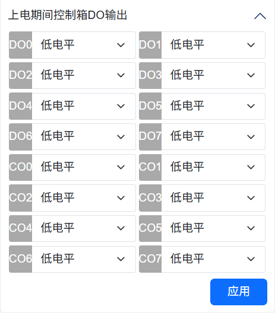

.. centered:: 圖表 3.3-4 上電期間控制箱DO輸出

.. centered:: 表格 3.3-3 控制箱數字量輸出配置對照表

.. list-table::
   :widths: 10 10 30 10 10 10 10
   :header-rows: 0
   :align: center

   * - **控制箱類型**
     - **輸入類型**
     - **連接圖示**
     - **高電平(開關置位ON)** 
     - **高電平(開關置位OFF)** 
     - **低電平(開關置位ON)**
     - **低電平(開關置位OFF)**

   * - 直流控制箱
     - NPN型輸出
     - 	.. figure:: installation/093.png
          :align: center
          :width: 3in
     - 有效 
     - 有效
     - 無效
     - 無效

   * - 交流窄電壓控制箱
     - NPN型輸出
     - .. figure:: installation/094.png
          :align: center
          :width: 3in
     - 有效 
     - 有效
     - 無效
     - 無效

   * - 交流寬電壓控制箱
     - NPN型輸出
     - .. figure:: installation/095.png
          :align: center
          :width: 3in
     - 有效 
     - 有效
     - 無效
     - 無效

   * - 交流寬電壓控制箱
     - PNP型輸出
     - .. figure:: installation/096.png
          :align: center
          :width: 3in
     - 有效 
     - 有效
     - 無效
     - 無效

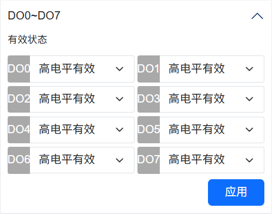

.. centered:: 圖表 3.3-5 通用輸出有效狀態

.. centered:: 表格 3.3-4 控制箱數字量輸出配置對照表

.. list-table::
   :widths: 10 10 30 10 10 10 10 
   :header-rows: 0
   :align: center

   * - **控制箱類型**
     - **輸入類型**
     - **連接圖示**
     - **高電平有效(開關置位ON)**
     - **高電平有效(開關置位OFF)**
     - **低電平有效(開關置位ON)**
     - **低電平有效(開關置位OFF)**

   * - 直流控制箱
     - NPN型輸出
     - 	.. figure:: installation/093.png
          :align: center
          :width: 3in
     - 有效
     - 無效
     - 無效
     - 有效

   * - 交流窄電壓控制箱
     - NPN型輸出
     - .. figure:: installation/094.png
          :align: center
          :width: 3in
     - 有效
     - 無效
     - 無效
     - 有效

   * - 交流寬電壓控制箱
     - NPN型輸出
     - .. figure:: installation/095.png
          :align: center
          :width: 3in
     - 有效
     - 無效
     - 無效
     - 有效

   * - 交流寬電壓控制箱
     - PNP型輸出
     - .. figure:: installation/096.png
          :align: center
          :width: 3in
     - 有效
     - 無效
     - 無效
     - 有效

控制箱數字量輸出支持類型
******************************************

直流控制箱和交流窄電壓控制箱的數字量輸出只支持NPN型輸出。交流寬電壓控制箱數字量輸出支持NPN和PNP型可選，其輸出為推挽結構，只需要按照相應的接線圖接線即可，不需要進行特殊設置。

.. list-table::
   :widths: 50 50
   :header-rows: 0
   :align: center

   * - **控制箱類型**
     - **輸入類型**

   * - 直流控制箱
     - NPN型輸出

   * - 交流窄電壓控制箱
     - NPN型輸出

   * - 交流寬電壓控制箱
     - NPN型輸出/PNP型輸出

控制箱數字量輸出接線圖
********************************

直流控制箱和交流窄電壓控制箱的數字量輸出只支持NPN型輸出，其接線圖如下。

	.. figure:: installation/097.png
		:align: center
		:width: 6in

	.. centered:: 圖表 3.3-6 直流控制箱和交流窄電壓控制箱的數字量輸出連線圖

交流寬電壓控制箱數字量輸出支持NPN和PNP型。其接線圖如下：

.. list-table::
   :widths: 50 50
   :header-rows: 0
   :align: center

   * - **輸入類型** 
     - **連接圖示**

   * - NPN型輸入 
     - 	.. figure:: installation/098.png
          :align: center
          :width: 3in

   * - PNP型輸入
     - 	.. figure:: installation/099.png
          :align: center
          :width: 3in

控制箱數字量輸出相關軟件設置
****************************************************

關於數字量輸出的軟件設置項目有“上電期間控制箱DO輸出”和“通用輸出有效狀態”兩個設置項，其中“上電期間控制箱DO輸出”表徵在控制箱上電期間，控制系統還沒初始化完成時輸出的電平，其可以對用對應不同的輸出有效狀態，可以靈活應對上電期間對輸出狀態有特殊要求的場合。“通用輸出有效狀態”表徵輸出有效時需要控制輸出的數字量輸出電壓電平值。此設置可用使用戶更加靈活的使用使用數量輸出。

(1) “上電期間控制箱DO輸出”在不同的設置下，當數字量輸出的有效狀態對照表如下：

	.. figure:: installation/100.png
		:align: center
		:width: 6in

	.. centered:: 圖表 3.3-7 上電期間控制箱DO輸出

.. centered:: 表格 3.3-5 有效狀態對照表

.. list-table::
   :widths: 20 15 15 15 15 15
   :header-rows: 0
   :align: center

   * - **控制箱類型** 
     - **輸入類型**
     - **高電平有效(開關置位ON)**
     - **高電平有效(開關置位OFF)**
     - **低電平有效(開關置位ON)**
     - **低電平有效(開關置位OFF)**

   * - 直流控制箱
     - NPN型輸出
     - 有效
     - 有效
     - 無效
     - 無效

   * - 交流窄電壓控制箱
     - NPN型輸出
     - 有效
     - 有效
     - 無效
     - 無效

   * - 交流寬電壓控制箱
     - NPN型輸出
     - 有效
     - 有效
     - 無效
     - 無效

   * - 交流寬電壓控制箱
     - PNP型輸出
     - 有效
     - 有效
     - 無效
     - 無效

(2) “通用輸出有效狀態”在不同的設置下，當數字量輸出的有效狀態對照表如下：

	.. figure:: installation/101.png
		:align: center
		:width: 6in

	.. centered:: 圖表 3.3-8 通用輸出有效狀態

.. centered:: 表格 3.3-6 有效狀態對照表

.. list-table::
   :widths: 20 15 15 15 15 15
   :header-rows: 0
   :align: center

   * - **控制箱類型** 
     - **輸入類型**
     - **高電平有效(開關置位ON)**
     - **高電平有效(開關置位OFF)**
     - **低電平有效(開關置位ON)**
     - **低電平有效(開關置位OFF)**

   * - 直流控制箱
     - NPN型輸出
     - 有效
     - 無效
     - 無效
     - 有效

   * - 交流窄電壓控制箱
     - NPN型輸出
     - 有效
     - 無效
     - 無效
     - 有效

   * - 交流寬電壓控制箱
     - NPN型輸出
     - 有效
     - 無效
     - 無效
     - 有效

   * - 交流寬電壓控制箱
     - PNP型輸出
     - 有效
     - 無效
     - 無效
     - 有效

檢查維護計劃
++++++++++++++++

機械手臂
**********

1. 檢查計劃

下面列出了法奧機器人建議根據標記的時間間隔執行的檢查清單。如果檢查發現相關零件的狀況不合格，請立即修正。

.. note:: F=功能檢查,V=目視檢查,*=嚴重碰撞後必須檢查。

.. list-table::
   :widths: 10 40 20 20 20 20
   :header-rows: 0
   :align: center

   * - 
     - **檢查項目**
     - **要求**
     - **一月一次**
     - **半年一次**
     - **一年一次**

   * - 1
     - 檢查關節後蓋*
     - V
     - 
     - ✔
     - 

   * - 2
     - 檢查關節後蓋螺絲
     - F
     - 
     - ✔
     - 

   * - 3
     - 檢查關節橡膠圈
     - V
     - 
     - ✔
     - 

   * - 4
     - 檢查機器人線纜
     - V
     - 
     - ✔
     - 

   * - 5
     - 檢查機器人線纜鏈接
     - V
     - 
     - ✔
     - 

   * - 6
     - 檢查機器人底座安裝螺栓*
     - F
     - ✔
     - 
     - 

   * - 7
     - 檢查末端工具安裝螺栓*
     - F
     - ✔
     - 
     - 

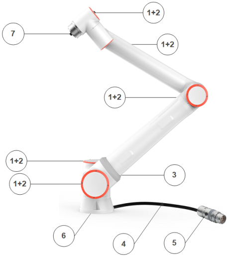

1. 目視檢查
   
.. note:: 切勿使用壓縮空氣清潔機器手臂，因為它可能會損壞組件。在未進行目視檢查的情況下，請勿將機器人存放超過 6 個月。

- 如果可能，將機器手臂移至零位置。
- 關閉並斷開控制箱的電源線。
- 檢查控制箱和機器手臂之間的電纜是否有任何損壞。
- 檢查底座安裝螺栓是否正確鎖緊。
- 檢查工具法蘭螺栓是否正確鎖緊。
- 檢查平環是否磨損和損壞。
- 檢查所有關節後蓋是否有任何裂痕或損壞。
- 檢查用於關節後蓋的螺絲是否就位並正確擰緊。

.. note:: 如果在保固期內機器人出現任何損壞，請聯絡購買機器人的經銷商。

3. 功能檢查

功能檢驗的目的是確保螺絲、螺栓、工具和機械手臂沒有鬆動。檢查計畫中提到的螺絲/螺栓應使用扭力扳手進行檢查，扭力應符合標準規範，關於機械手臂安裝螺栓規格，這些規格可在《使用者手冊》安裝規範中找到。

4. 清潔

您可以使用布和以下清潔劑之一擦去機器手臂上觀察到的任何灰塵/污垢/油污：水、異丙醇、10% 乙醇或 10% 石腦油。如果機器人在惡劣環境下運行，例如在切割液、冷卻劑等中，機器人建議定期清潔或更換橡膠圈。

請勿使用漂白劑。請勿在任何稀釋的清潔溶液中使用漂白劑。在極少數情況下，可以從接頭處看到極少量的油脂。這不會影響關節的功能、使用或壽命。

控制箱、示教器、按鈕盒
****************************

1. 檢查計劃

下面列出了法奧機器人建議根據標記的時間間隔執行的檢查清單。如果檢查發現相關零件的狀況不合格，請立即修正。

.. note:: F=功能檢查,V=目視檢查。

.. list-table::
   :widths: 10 40 20 20 20 20
   :header-rows: 0
   :align: center

   * - 
     - **檢查項目**
     - **要求**
     - **一月一次**
     - **半年一次**
     - **一年一次**

   * - 1
     - 偵測按鈕盒（示教器）上的緊急停止按鈕
     - F
     - ✔
     - 
     - 

   * - 2
     - 檢測端子排上的安全輸入輸出功能
     - F
     - ✔
     - 
     - 

   * - 3
     - 偵測按鈕盒啟動/停止、模式切換功能
     - F
     - ✔
     - 
     - 

   * - 4
     - 偵測按鈕盒（示教器）線纜
     - V
     - 
     - ✔
     - 

   * - 5
     - 偵測並清潔控制箱上的空氣過濾器
     - V
     - ✔
     - 
     - 

   * - 6
     - 檢測控制箱的端子是否牢固
     - F
     - 
     - ✔
     - 

   * - 7
     - 檢測控制箱的接地電阻≤1Ω
     - F
     - 
     - 
     - ✔

   * - 8
     - 偵測控制箱的主電源
     - F
     - 
     - 
     - ✔

.. figure:: installation/074.png
  :align: center
  :width: 3in

2. 目視檢查

- 從控制箱拔下電源線。
- 檢查控制板端子是否正確插入且沒有鬆脫的電線。
- 檢查控制箱內是否有污垢/灰塵。如果需要，請使用 ESD 吸塵器進行清潔。

.. note:: 切勿使用壓縮空氣清潔控制箱內部，因為這可能會損壞組件。

3. 功能檢查

.. note:: 機器人安全功能是重點，建議每月進行一次測試，以確保功能正確。

- 示教器/按鈕盒上的緊急停止按鈕：

 A. 按下示教器/按鈕盒上的緊急停止按鈕。
 B. 觀察機器人停止並關閉關節電源。
 C. 再次開啟機器人電源。

	.. figure:: installation/075.png
		:align: center
		:width: 4in

	.. figure:: installation/076.png
		:align: center
		:width: 4in

- 其他安全輸入和輸出仍在運行

 檢查哪些安全輸入和輸出處於活動狀態，以及它們是否可以透過 PolyScope 或外部裝置觸發。

- 日期和時鐘

 檢查「日誌」標籤中的日期和時鐘是否正確。日期和時鐘不正確表示 CMOS 電池電量不足。 CMOS電池的保質期長達5年。

- 檢查接線端子卡扣是否到位
  
  .. figure:: installation/077.png
    :align: center
    :width: 4in

4. 清潔

- 示教器

 可能需要清潔示教器螢幕。建議使用不含稀釋劑或任何腐蝕性添加劑的標準溫和工業清潔劑。請勿使用研磨材質擦拭螢幕。法奧機器人不會推銷特定的清潔劑。

- 示教器按鈕盒

 正常情況下不需要定期清潔。如果按鍵標識模糊影響了識別操作，請隨時使用清潔劑清潔。

- 控制箱

 控制箱包含兩個過濾器，控制箱的每一邊各一個。

 A. 可從控制箱左右側通風口觀察過濾器狀況。正常情況下可以看到過濾器的蜂網結構。
 B. 拆下過濾器進行清潔。使用低壓空氣清潔或根據需要更換過濾器。記得清潔每一面。如果非常髒或損壞，請更換（更糟需要拆下控制器上蓋，從上蓋內部更換過濾器）。
 C. 運轉時聽聽風扇的聲音，如果聲音異常，請聯絡服務提供者或更換。

檢查計劃登記卡
******************

1. 機械手臂
  
.. list-table::
   :widths: 40 20 20 20 40
   :header-rows: 0
   :align: center

   * - **檢查項**
     - **已檢查**
     - **檢察長**
     - **日期**
     - **備註**

   * - **檢查關節後蓋**
     - 
     - 
     - 
     - 

   * - **檢查關節後蓋螺絲**
     - 
     - 
     - 
     - 

   * - **檢查關節橡膠圈**
     - 
     - 
     - 
     - 

   * - **檢查機器人線纜**
     - 
     - 
     - 
     - 

   * - **檢查機器人線纜連接**
     - 
     - 
     - 
     - 

   * - **檢查機器人底座安裝螺栓**
     - 
     - 
     - 
     - 

   * - **檢查機器人工具安裝螺栓**
     - 
     - 
     - 
     - 
  
2. 控制箱、示教器、按鈕盒

.. list-table::
   :widths: 40 20 20 20 40
   :header-rows: 0
   :align: center

   * - **檢查項**
     - **已檢查**
     - **檢察長**
     - **日期**
     - **備註**

   * - **偵測按鈕盒（示教器）上的緊急停止按鈕**
     - 
     - 
     - 
     - 

   * - **檢測端子排上的安全輸入輸出功能**
     - 
     - 
     - 
     - 

   * - **偵測按鈕盒啟動/停止、模式切換功能**
     - 
     - 
     - 
     - 

   * - **偵測按鈕盒（示教器）線纜**
     - 
     - 
     - 
     - 

   * - **偵測並清潔控制箱上的空氣過濾器**
     - 
     - 
     - 
     - 

   * - **檢測控制箱的端子是否牢固**
     - 
     - 
     - 
     - 

   * - **檢測控制箱的接地電阻≤1Ω**
     - 
     - 
     - 
     - 

   * - **偵測控制箱的主電源**
     - 
     - 
     - 
     - 

廢棄處置
~~~~~~~~~~~~~~

FR機器人需依據適用的國家法規及國家標準處置，詳情可聯絡廠商。

安裝規範
----------

機器人手臂安裝
~~~~~~~~~~~~~~~~~

.. important:: 
  推薦機器人安裝座符合以下幾個要求，以確保機器人安裝牢固且穩定：

（1）機器人安裝座需要足夠堅固且有足夠的承載能力，至少應該承載5倍的機器人重量，至少能承受10倍的1軸扭力。

（2）機器人安裝座應表面平整，以確保與機器人接觸面緊密接觸；

（3）機器人安裝座應剛度足夠強壯，固定牢固，不會和機器人發生共振；

（4）當機器人和其他部件同時移動時，安裝座與其他運動部件應隔離開，不要固定在一起避免運動過程中的振動幹擾；

（5）如果機器人安裝在移動平台或外部軸上，移動平台或外部軸的加速度應盡量低；

.. warning:: 
	應避免以下安裝方式：

	（I）避免將機器人固定在其它運動設備上

	.. figure:: installation/064.png
		:align: center
		:width: 3in

	.. centered:: 圖表 3.4-1 避免安裝在其它運動設備上

	確保機器手臂正確並安全地安裝到位。安裝不穩定會導致事故。

.. note:: 
	可以採購精確的基座作為附件來使用。圖表3.4-2、3.4-5、3.4-8、3.4-11 顯示了銷孔位置和螺絲安裝位置。

FR3/FR3-WMS/FR3-WML/FR3-C/FR5-C機器手臂安裝要求
++++++++++++++++++++++++++++++++++++++++++++++++++++++++

機器人安裝在安裝座上時，使用4顆強度不低於8.8級的M6螺栓將機器人固定在安裝座上，螺栓須使用不少於10Nm扭力鎖緊；建議安裝座上使用兩個φ5mm銷孔配合銷釘進行機器人定位，以提高機器人安裝精度，防止因為碰撞等使機器人發生移動。當機器人有較高運行精度要求時，請務必增加銷釘對機器人進行定位。

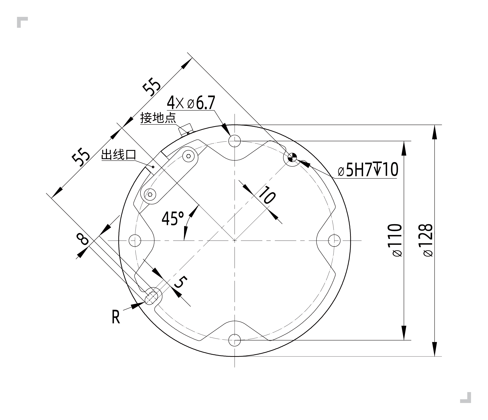

.. centered:: 圖表 3.4-2 FR3/FR3-WMS/FR3-WML/FR3-C/FR5-C型號協作機器人安裝尺寸

.. important:: 
	根據不同的應用場景推薦幾款機器人安裝底座如下：

	（I）針對運動速度不太快，運轉速度不太大，精度要求一般，且不方便固定在地面上的場合，建議機器人安裝底座如下：

	.. figure:: installation/062.png
		:align: center
		:width: 3in

	.. centered:: 圖表 3.4-3 FR3/FR3-WMS/FR3-WML/FR3-C/FR5-C機型協作機器人低需求安裝底座

	（II）針對運動速度較快，運轉速度較大，精度要求較高的場合，建議機器人安裝底座如下，並將機器人固定在堅固的地面上：

	.. figure:: installation/067.png
		:align: center
		:width: 3in

	.. centered:: 圖表 3.4-4 FR3/FR3-WMS/FR3-WML/FR3-C/FR5-C型號協作機器人高需求安裝底座

FR5機器手臂安裝要求
++++++++++++++++++++++++++++

機器人安裝在安裝座上時，使用4顆強度不低於8.8級的M8螺栓將機器人固定在安裝座上，螺栓須使用不少於20Nm扭力鎖緊；建議安裝座上使用兩個φ8mm銷孔配合銷釘進行機器人定位，以提高機器人安裝精度，防止因為碰撞等使機器人發生移動。當機器人有較高運行精度要求時，請務必增加銷釘對機器人進行定位。

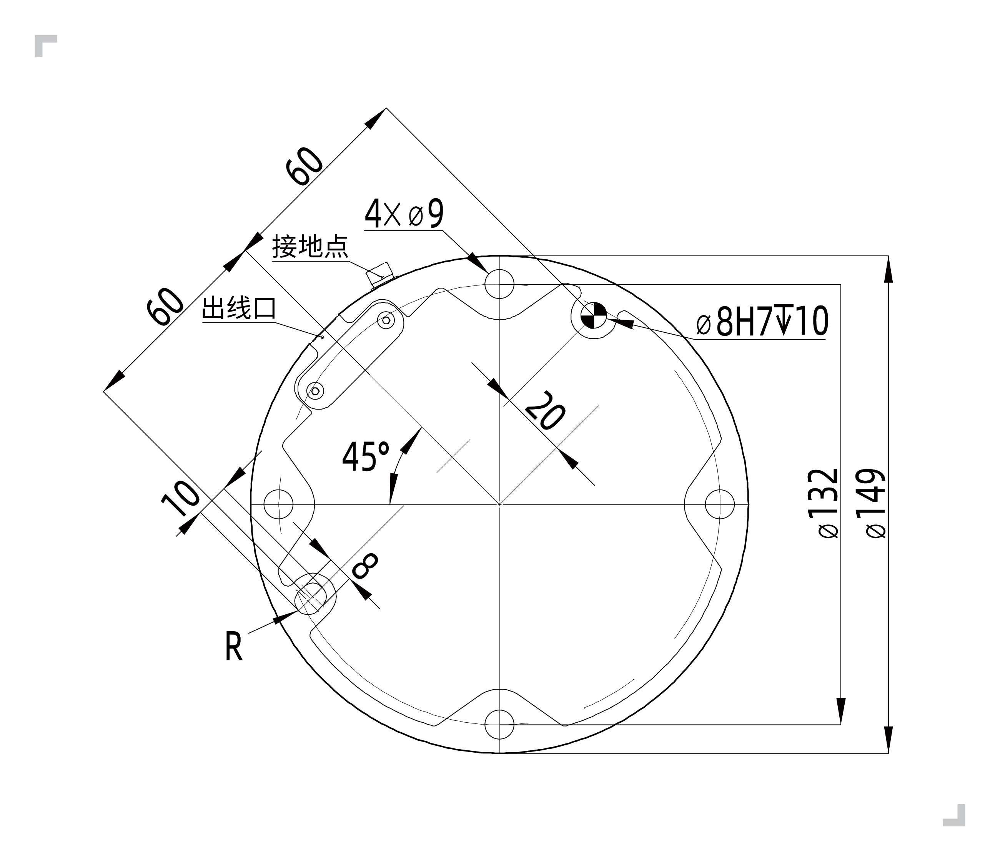

.. centered:: 圖表 3.4-5 FR5機型協作機器人安裝尺寸

.. important:: 
  根據不同的應用場景推薦幾款機器人安裝底座如下：

  （I）針對運動速度不太快，運轉速度不太大，精度要求一般，且不方便固定在地面上的場合，建議機器人安裝底座如下：

	.. figure:: installation/062.png
		:align: center
		:width: 3in

	.. centered:: 圖表 3.4-6 FR5機型協作機器人低需求安裝底座

	（II）針對運動速度較快，運轉速度較大，精度要求較高的場合，建議機器人安裝底座如下，並將機器人固定在堅固的地面上：

	.. figure:: installation/067.png
		:align: center
		:width: 3in

	.. centered:: 圖表 3.4-7 FR5機型協作機器人高需求安裝底座

FR10、FR16機器手臂安裝需求
+++++++++++++++++++++++++++++++

機器人安裝在安裝座上時，使用4顆強度不低於8.8級的M8螺栓將機器人固定在安裝座上，螺栓須使用不少於25Nm扭力鎖緊；建議安裝座上使用兩個φ8mm銷孔配合銷釘進行機器人定位，以提高機器人安裝精度，防止因為碰撞等使機器人發生移動。當機器人有較高運行精度要求時，請務必增加銷釘對機器人進行定位。

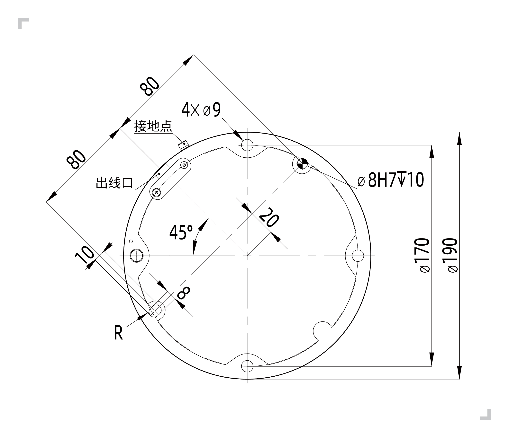

.. centered:: 圖表 3.4-8 FR10、FR16機型協作機器人安裝尺寸
	
.. important:: 
  根據不同的應用場景推薦幾款機器人安裝底座如下：

	（I）針對運動速度不太快，運轉速度不太大，精度要求一般，且不方便固定在地面上的場合，建議機器人安裝底座如下：

	.. figure:: installation/065.png
		:align: center
		:width: 3in

	.. centered:: 圖表 3.4-9 FR10、FR16型號協作機器人低要求安裝底座

	（II）針對運動速度較快，運轉速度較大，精度要求較高的場合，建議機器人安裝底座如下，並將機器人固定在堅固的地面上：

	.. figure:: installation/067.png
		:align: center
		:width: 3in

	.. centered:: 圖表 3.4-10 FR10、FR16型號協作機器人高需求安裝底座

FR20、FR30、FR30L機器手臂安裝需求
++++++++++++++++++++++++++++++++++++

機器人安裝在安裝座上時，使用6顆強度不低於8.8級的M10螺栓將機器人固定在安裝座上，螺栓須使用不少於45Nm扭力鎖緊；建議安裝座上使用兩個φ8mm銷孔配合銷釘進行機器人定位，以提高機器人安裝精度，防止因為碰撞等使機器人發生移動。當機器人有較高運行精度要求時，請務必增加銷釘對機器人進行定位。

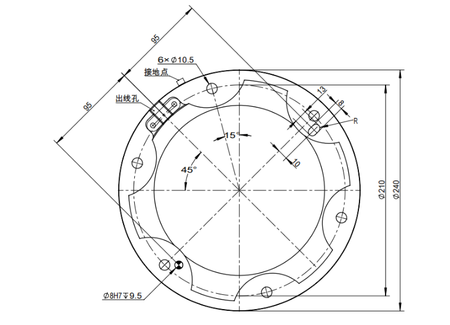

.. centered:: 圖表 3.4-11 FR20、FR30、FR30L機型協作機器人安裝尺寸

.. important:: 

	因為FR20和FR30機器人自重較大及運作慣量較大，建議直接固定在地面上使用。推薦底座如下：

	.. figure:: installation/066.png
		:align: center
		:width: 3in

	.. centered:: 圖表 3.4-12 FR20、FR30機型協作機器人安裝底座

工具末端安裝
~~~~~~~~~~~~~~~~

機器人工具法蘭有四個M6螺紋孔，可用於將工具連接到機器人。 M6螺栓必須使用8Nm的扭力鎖緊，其強度等級不低於8.8級。為了準確地重新定位工具，請在預留的Ø6銷孔中使用銷釘。

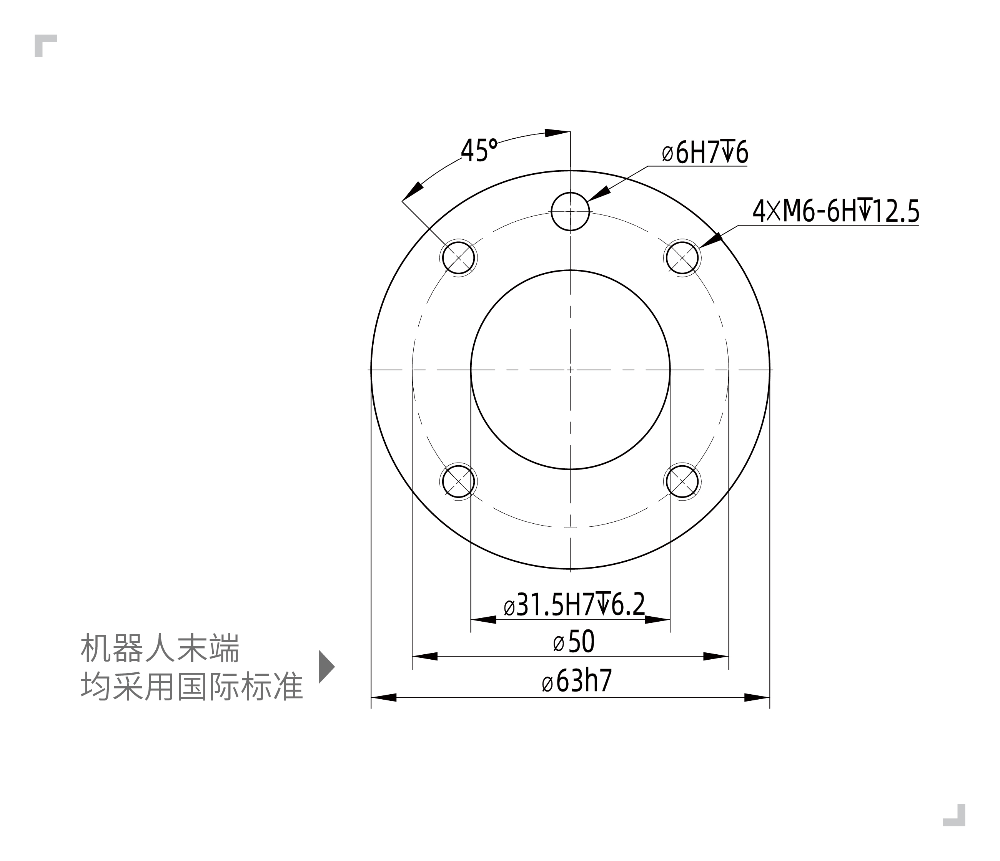

.. centered:: 圖表 3.4-13 FR3/FR3-WMS/FR3-WML/FR3-C/FR5/FR5-C/FR10/FR16型號機器人末端法蘭圖紙

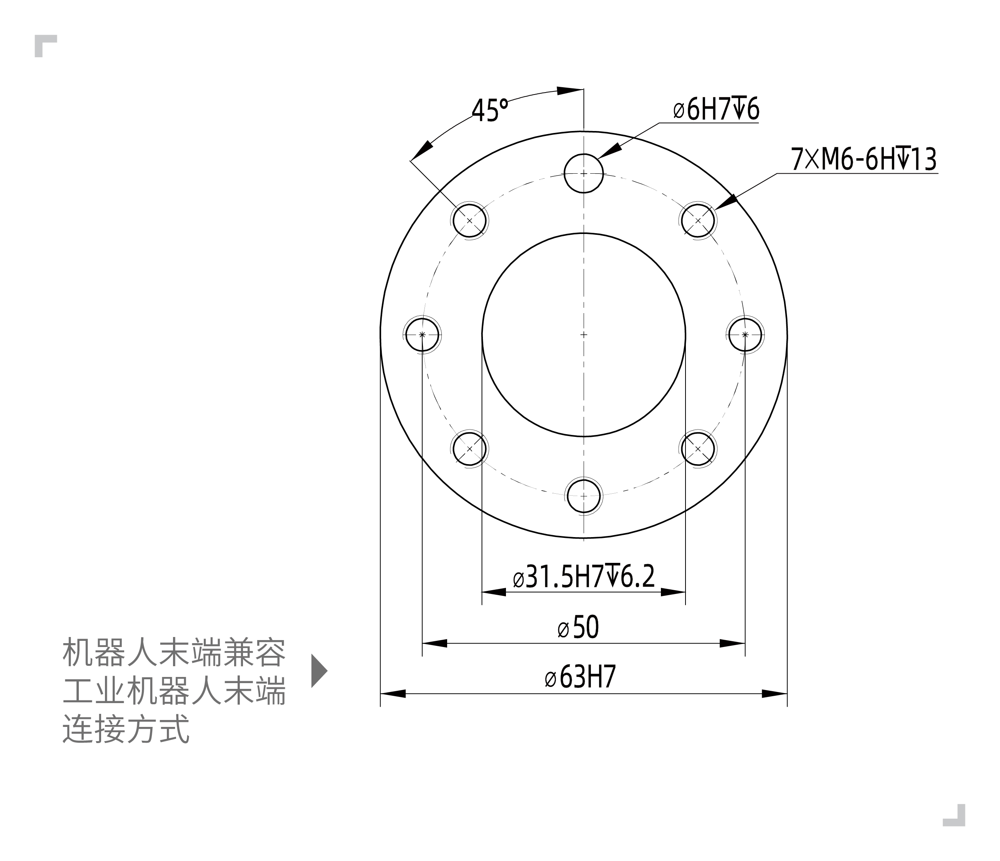

.. centered:: 圖表 3.4-14 FR20/FR30/FR30L型號機器人末端法蘭圖紙

.. important:: 
   - 確保工具正確並安全地安裝到位。
   - 確保工具安全架構，不會有零件意外墜落造成危險。
   - 在機器人上法蘭上安裝長度超過8毫米的M6螺栓可能會破壞工具法蘭並造成無法修復的損壞，從而導致必須更換工具法蘭。

安裝環境
~~~~~~~~~~~~~~

安裝及使用協作機器人時，請確保滿足以下要求：

- 環境溫度0-45℃

- 濕度0%~90%RH（無結露）

- 無機械衝擊和震動

- 海拔要求2000m以下

- 無腐蝕性氣體，無液體，無爆炸性氣體，無油污，無鹽霧，無塵埃或金屬粉末，無放射性材料，無電磁噪聲，無易燃物品

- 避免設備在電流的不穩定條件下運作

- 使用者需要在機器人電源前增加空氣開關，同時建議增加EMC濾波器

.. note:: 
	如果您要將協作機器人吊起或裝到垂直面時，請聯絡我們。

地板承載能力
~~~~~~~~~~~~~~~~

將機器人安裝在一個堅固的表面，該表面應足以承受至少5倍的機器人手臂的重量，而且該表面不能有震動。

全系列機型負載曲線
~~~~~~~~~~~~~~~~~~~~~~~~

概述
+++++++++++++

本節所涉及的負載曲線是基於各機箱在特定表格下的測試而得到。各機箱負載曲線存在「完整性能」與「擴展後的負載能力」兩部分，具體如下：

(1) 「完整性能」的運轉環境為：各關節摩擦力補償係數為1；各關節碰撞係數為10；腹板界面設定100%運轉速度及360deg/s2加速度；動力學2.0。在此環境下，負載曲線「完整效能」部分適應剖面運行軌跡。
(2) 若終止能力負載在「擴展後的負載」下，須開啟「時間最優模式」並滿足負載限制，或縮小機器人工作範圍。

參數說明
+++++++++++++

機器人的額定有效負載取決於有效負載的重心偏移，其中，重心偏移定義為終止法蘭中心與附加的有效負載重心之間的距離。

FR3型號協作機器人負載曲線
*******************************

FR3型號協作機器人最大可攜帶負載為5kg，額定負載為3kg，負載曲線如圖1所示。負載曲線的具體釋義如下：

(1) FR3在完整效能下可攜帶3kg及以下的負載，請參閱「藍色包絡線」。
(2) 當負載為3kg至5kg時，為擴展後的負載能力，請參閱“紅色包絡線”，此時機器人可運行在下列狀態：

 ①開啟“時間最優模式”，建議加速度設定在360deg/s\ :sup:`2` 以下；

 ②減小機器人工作範圍或降低運轉速度。

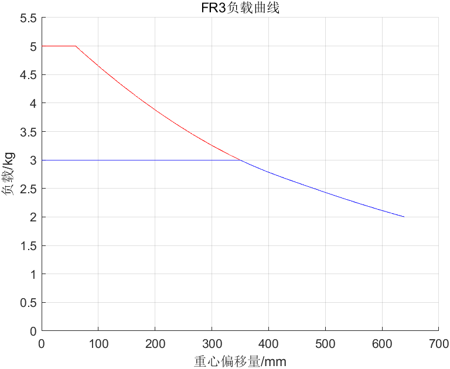

.. centered:: 圖表 3.4-15 FR3型號協作機器人負載曲線

FR3-WMS型號協作機器人負載曲線
*******************************

FR3-WMS型號協作機器人最大可攜帶負載為5kg，額定負載為3kg，負載曲線如圖1所示。負載曲線的具體釋義如下：

(1) FR3-WMS在完整效能下可攜帶3kg及以下的負載，請參閱「藍色包絡線」。
(2) 當負載為3kg至5kg時，為擴展後的負載能力，請參閱“紅色包絡線”，此時機器人可運行在下列狀態：

 ①開啟“時間最優模式”，建議加速度設定在360deg/s\ :sup:`2` 以下；

 ②減小機器人工作範圍或降低運轉速度。

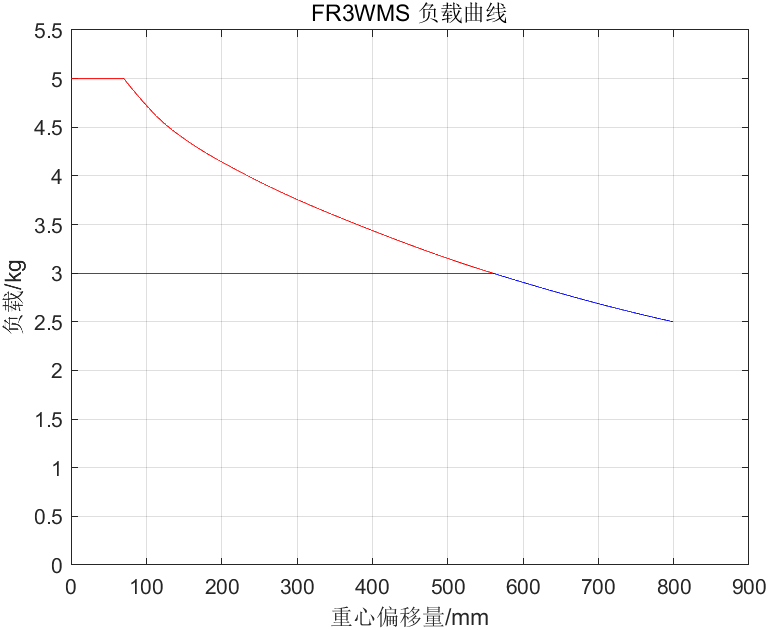

.. centered:: 圖表 3.4-16 FR3-WMS型號協作機器人負載曲線

FR3-WML型號協作機器人負載曲線
*******************************

FR3-WML型號協作機器人最大可攜帶負載為4kg，額定負載為3kg，負載曲線如圖1所示。負載曲線的具體釋義如下：

(1) FR3-WML在完整效能下可攜帶3kg及以下的負載，請參閱「藍色包絡線」。
(2) 當負載為3kg至4kg時，為擴展後的負載能力，請參閱“紅色包絡線”，此時機器人可運行在下列狀態：

 ①開啟“時間最優模式”，建議加速度設定在360deg/s\ :sup:`2` 以下；

 ②減小機器人工作範圍或降低運轉速度。

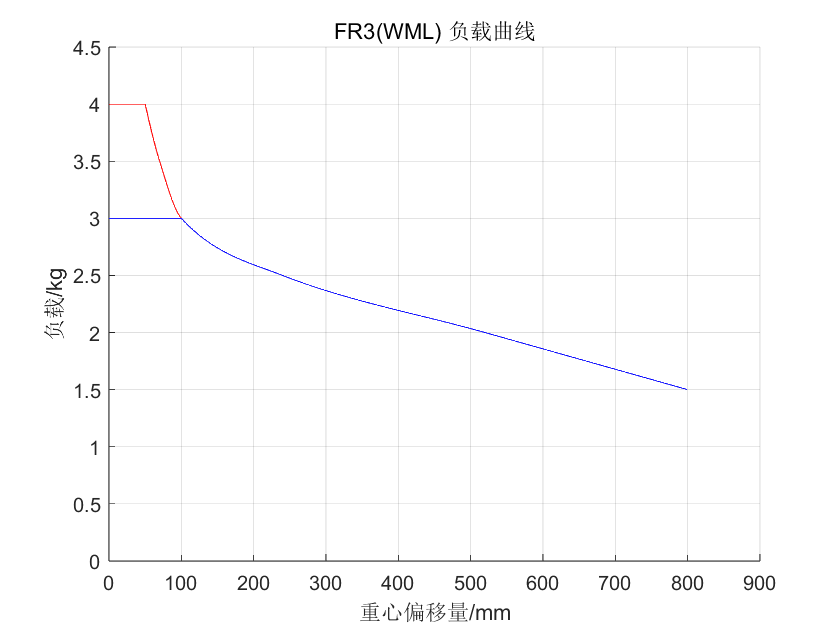

.. centered:: 圖表 3.4-17 FR3-WML型號協作機器人負載曲線

FR3-C型號協作機器人負載曲線
*******************************

FR3-C型號協作機器人最大可攜帶負載為5kg，額定負載為3kg，負載曲線如圖1所示。負載曲線的具體釋義如下：

(1) FR3-C在完整效能下可攜帶3kg及以下的負載，請參閱「藍色包絡線」。
(2) 當負載為3kg至5kg時，為擴展後的負載能力，請參閱“紅色包絡線”，此時機器人可運行在下列狀態：

 ①開啟“時間最優模式”，建議加速度設定在360deg/s\ :sup:`2` 以下；

 ②減小機器人工作範圍或降低運轉速度。

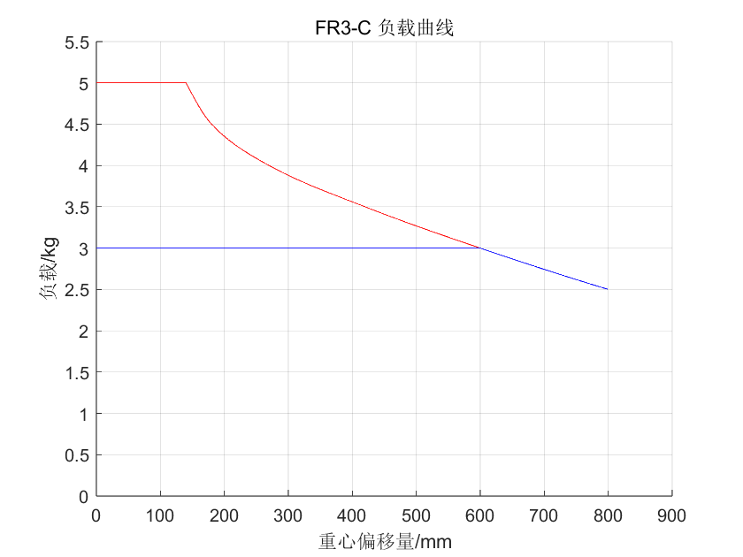

.. centered:: 圖表 3.4-18 FR3-C型號協作機器人負載曲線

FR5型號協作機器人負載曲線
*******************************

FR5型號協作機器人最大可攜帶負載為7kg，額定負載為5kg，負載曲線如圖所示。負載曲線的具體釋義如下：
 
(1) FR5在完整效能下可攜帶5kg及以下的負載，請參閱「藍色包絡線」。
(2) 當負載為5kg至7kg時，為擴展後的負載能力，請參閱“紅色包絡線”，此時機器人可運行在下列狀態：

 ①開啟“時間最優模式”，建議加速度設定在360deg/s\ :sup:`2` 以下；

 ②減小機器人工作範圍或降低運轉速度。

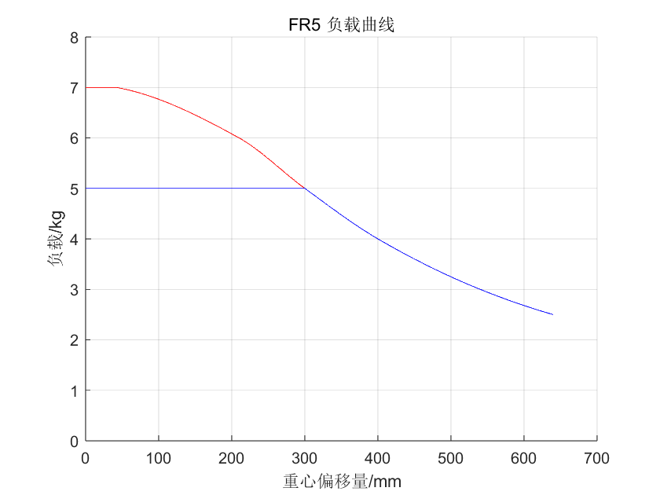

.. centered:: 圖表 3.4-19 FR5型號協作機器人負載曲線

FR5-WML型號協作機器人負載曲線
*******************************

FR5-WML型號協作機器人最大可攜帶負載為7kg，額定負載為5kg，負載曲線見圖所示。負載曲線的具體釋義如下：

(1) 「藍色包絡線」內為完整性能：可在摩擦力補充係數全1，動力學2.0，100%速度，360deg/s2加速度（維護模式）下運行絕大多數軌跡。
(2) 「紅色包絡線」內為擴展後的負載能力，可運行在如下狀態：

  ①開啟「時間最優模式」；

  ②減小機器人工作範圍或降低運行速度。

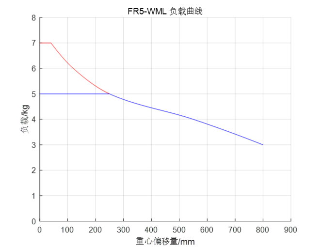

.. centered:: 圖表 3.4-20 FR5-WML型號協作機器人負載曲線

FR5-C型號協作機器人負載曲線
*******************************

FR5-C型號協作機器人最大可攜帶負載為5kg，額定負載為4kg，負載曲線見圖所示，為「完整性能」。

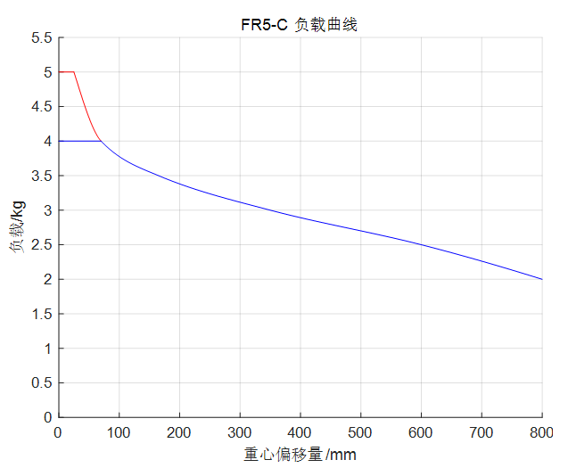

.. centered:: 圖表 3.4-21 FR5-C型號協作機器人負載曲線

FR10型號協作機器人負載曲線
*******************************

FR10型號協作機器人最大可攜帶負載為14kg，額定負載為10kg，負載曲線如圖3所示。負載曲線的具體釋義如下：

(1) FR10在完整效能下可攜帶10kg及以下的負載，請參閱「藍色包絡線」。
(2) 當負載為10kg至14kg時，為擴展後的負載能力，請參閱“紅色包絡線”，此時機器人可運行在下列狀態：

 ①開啟“時間最優模式”，建議加速度設定在180deg/s\ :sup:`2` 以下；

 ②減小機器人工作範圍或降低運轉速度。

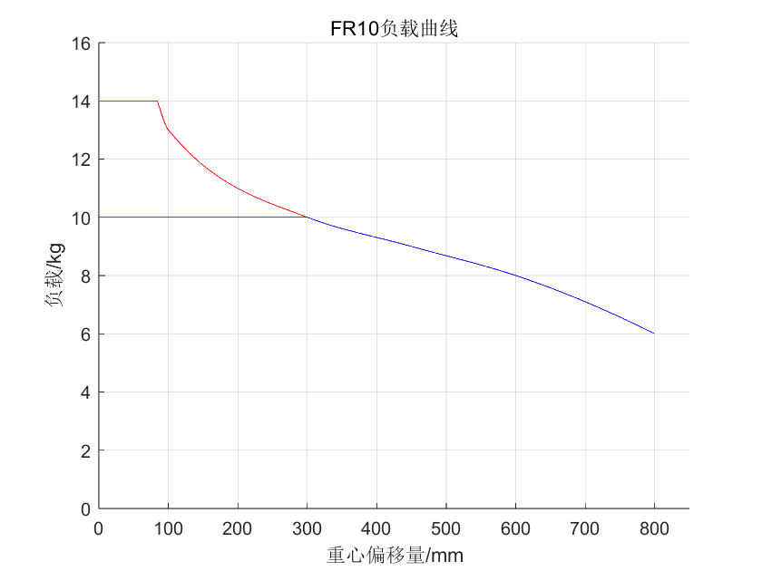

.. centered:: 圖表 3.4-22 FR10型號協作機器人負載曲線
  
FR16型號協作機器人負載曲線
*******************************

FR16型號協作機器人最大可攜帶負載為20kg，額定負載為16kg，負載曲線如圖所示。負載曲線的具體釋義如下：

(1) FR16在完整效能下可攜帶16kg及以下的負載，請參閱「藍色包絡線」。
(2) 當負載為16kg至20kg時，為擴展後的負載能力，請參閱“紅色包絡線”，此時機器人可運行在下列狀態：

 ①開啟“時間最優模式”，建議加速度設定在180deg/s\ :sup:`2` 以下；

 ②減小機器人工作範圍或降低運轉速度。

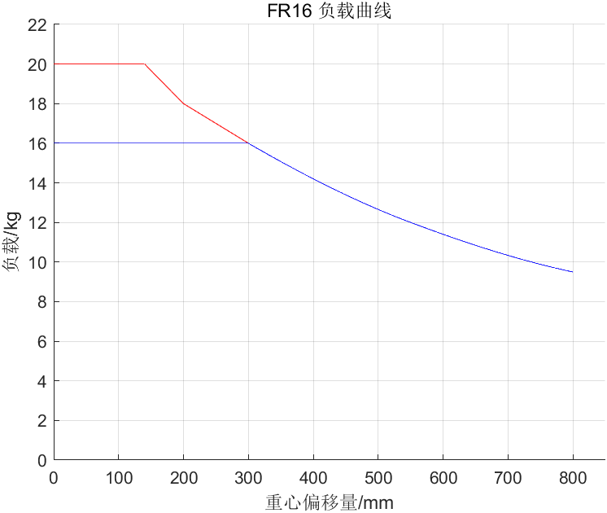

.. centered:: 圖表 3.4-23 FR16型號協作機器人負載曲線

FR20型號協作機器人負載曲線
*******************************

FR20型號協作機器人最大可攜帶負載為25kg，額定負載為20kg，負載曲線如圖所示。負載曲線的具體釋義如下：

(1) FR20在完整效能下可攜帶20kg及以下的負載，請參閱「藍色包絡線」。
(2) 當負載為20kg至25kg時，為擴展後的負載能力，請參閱“紅色包絡線”，此時機器人可運行在下列狀態：

 ①開啟“時間最優模式”，建議加速度設定在150deg/s\ :sup:`2` 以下；

 ②減小機器人工作範圍或降低運轉速度。

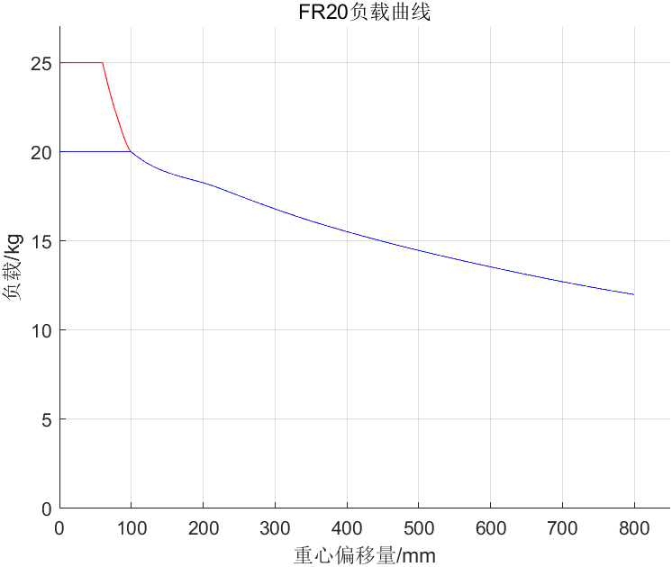

.. centered:: 圖表 3.4-24 FR20型號協作機器人負載曲線

FR30型號協作機器人負載曲線
*******************************

FR30型號協作機器人最大可攜帶負載為35kg，額定負載為30kg，負載曲線如圖所示。

(1) FR30在完整效能下可攜帶30kg及以下的負載，請參閱「藍色包絡線」。
(2) 當負載為30kg至35kg時，為擴展後的負載能力，請參閱“紅色包絡線”，此時機器人可運行在下列狀態：

 ①開啟“時間最優模式”，建議加速度設定在150deg/s\ :sup:`2` 以下；

 ②減小機器人工作範圍或降低運轉速度。

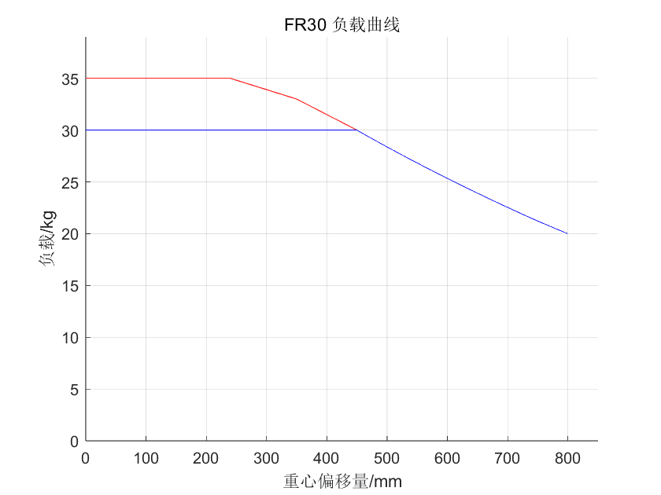

.. centered:: 圖表 3.4-25 FR30型號協作機器人負載曲線

控制連接
----------

控制器介面
~~~~~~~~~~~~~~~

本系列機器人可配置三種不同電源輸入的控制箱，控制箱電源輸入資訊詳見控制箱銘牌資訊。機器人需要電氣接地。

.. list-table::
   :widths: 20 40 40
   :header-rows: 0
   :align: center

   * - 
     - **最大輸入 Input（供客戶配置前級供電功率使用）**
     - **最大輸出 Output（最大輸出峰值）**

   * - **直流2kW**
     - 30-60VDC/30A
     - 2000W/48VDC/41A

   * - **直流5kW**
     - 30-60VDC/40A
     - 5000W/48VDC/104A

   * - **交流窄電壓2kW**
     - 176-264VDC/10A/單機/50Hz
     - 2000W/48VDC/41A

   * - **交流寬電壓2kW**
     - 100-240VDC/10A/單機/50-60Hz
     - 2000W/48VDC/41A

   * - **交流寬電壓5kW**
     - 100-240VDC/16A/單機/50-60Hz
     - 5000W/48VDC/104A

.. warning:: 
	在接線前，請務必確保電源處於關閉狀態，並在旁邊掛放安全警示牌。

本系列機械手控制系統的外部連線均使用可插拔可快速安裝的插頭進行連接。協作機器人接線面板如下圖所示。

- 確保控制箱電源按鈕關閉情況下（按鈕打到0）將電源線接到電源插口。

- 將機器人本體重載線連接到控制箱重載介面。

- 將按鈕盒航空插頭插到控制箱示教器介面。

- 控制箱兩側散熱口，間隔距離不少於15CM。

- 控制箱正面（使用者鈑金，開關電源鍵、重載與示教器線束）處，間隔距離不少於25CM。

- 控制箱距離地面0.6-1.5m。

- 不允許使用者自行更換電源線。

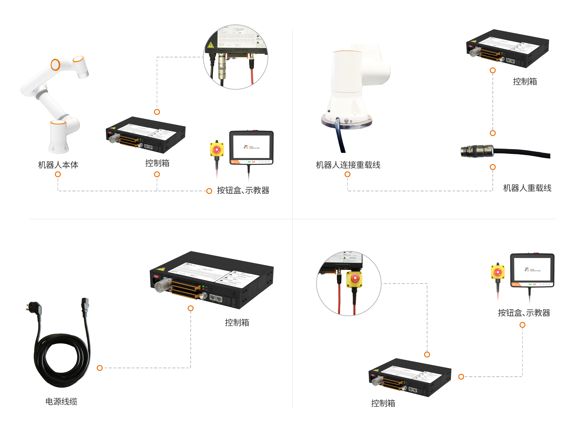

.. centered:: 圖表 3.5-1 機器人接線示意圖

控制器I/O面板
~~~~~~~~~~~~~~~~~~~~~~~~~~~~

您可以使用控制箱內的I/O 來控制各種設備，包括氣動繼電器、PLC 和緊限位裝置止按鈕。圖表3.5-2顯示了控制箱的電氣介面組，圖表3.5-3顯示了易製造控制箱的電氣介面組。

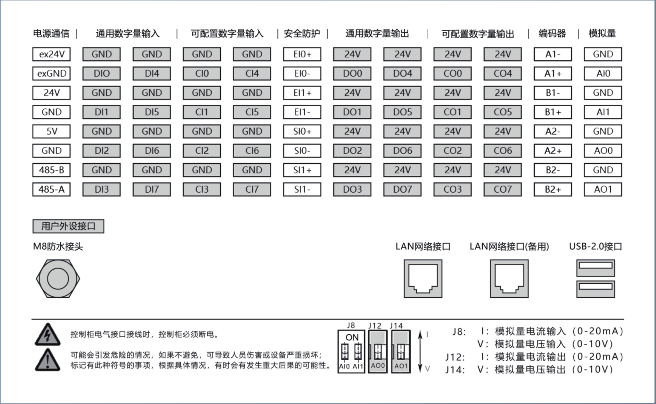

.. centered:: 圖表 3.5-2 控制箱電氣介面示意圖

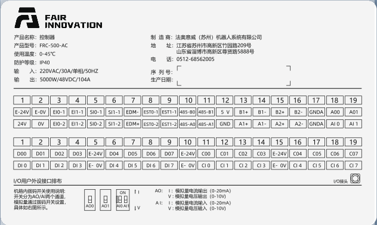

.. centered:: 圖表 3.5-3 易製造控制箱電氣介面示意圖

RJ45網路介面組
~~~~~~~~~~~~~~~~~~~~~~~~~~~~~

控制箱內的網路介面群組位址如下圖所示，注意此圖與控制箱內部網路埠位址順序對應，機器人預設連接埠禁止插拔。用戶網路埠可以用來與相機等設備通信，IP位址為192.168.57.2。按鈕盒介面預設為示教器控制端口，IP位址為192.168.58.2，使用網路線連接按鈕盒介面與電腦，電腦IP位址設為192.168.58.10或與之同一網段，開啟Google瀏覽器輸入192.168.58.2即可造訪示教器頁面。易製造控制箱透過連接按鈕盒的網口，存取示教器頁面。

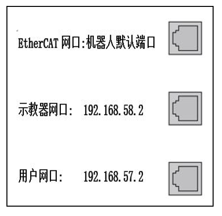

.. centered:: 圖表 3.5-4 網路介面組示意圖

末端板
~~~~~~~~~~~~~

您可以使用末端板的I/O和485通訊介面來控制各種設備，包括氣動繼電器、PLC和緊急停止按鈕。 Pin腳分佈及其pin腳說明如下圖所示。 I/O連接器型號為M12連接器8芯母頭。

.. note:: 末端板I/O和485接口禁止熱插拔。

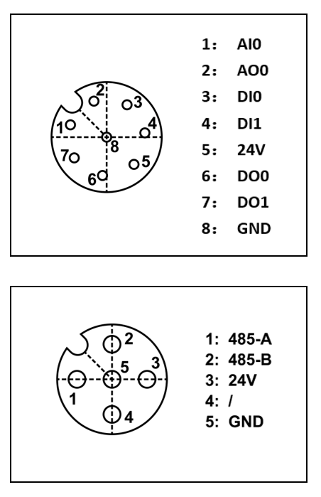

.. centered:: 圖表 3.5-5 末端版電氣介面示意圖

接地說明
~~~~~~~~~~~~~~

1. 控制箱接地位於電源開關左上方M4組合螺絲處，如下圖所示。

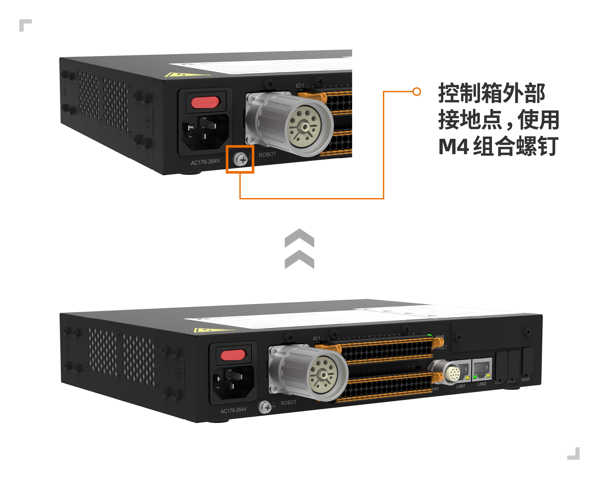

.. centered:: 圖表 3.5-6 控制箱接地示意圖

2. 本體接地位於基座出線處的右側位置，如下圖所示。

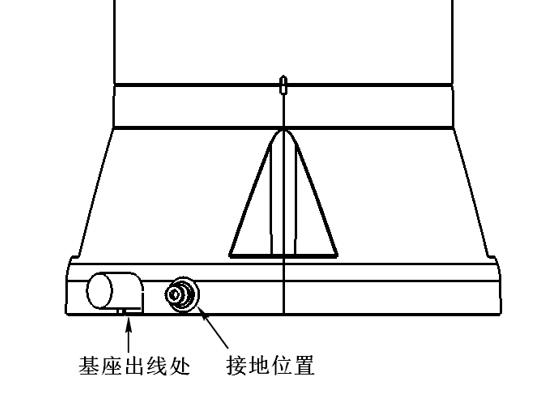

.. centered:: 圖表 3.5-7 本體接地示意圖

單獨使用的保護導線，截面積不得小於：

- 2.5mm\ :sup:`2` 銅或16mm\ :sup:`2` 鋁，如果提供機械損傷防護（導線管、管道等）
- 4mm\ :sup:`2` 銅或16mm\ :sup:`2` 鋁，如果沒有提供機械損傷防護

所有數字I/O 的通用規範
~~~~~~~~~~~~~~~~~~~~~~~~~~~~~~~~~~~~~~~~~~~

本節規定了下列控制箱24伏特數位輸入/輸出的電氣規格：

- 安全I/O

- 通用數字量I/O

機器人必須依照電氣規範進行安裝。

透過設定「電源通訊」接口，可以使用內部或外部24V電源為數位I/O供電。此介面中上面兩個端子（ex24V和exon）為外部電源的24V和接地，下面兩個端子（24V和GND）為內部電源的24V和接地。預設配置是使用內部電源，如下圖所示。

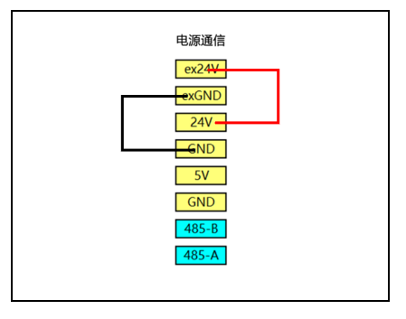

.. centered:: 圖表 3.5-8 電源通訊示意圖01

如果負載功率較大，可以如下圖連接外部電源。

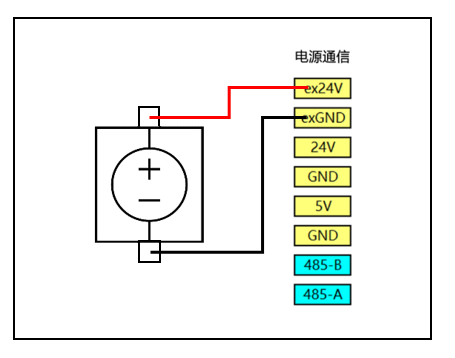

.. centered:: 圖表 3.5-9 電源通訊示意圖02

內部和外部電源的電氣規格如下表格所示：

.. centered:: 表格 3.5-1 內部外部電源電氣規格
.. list-table::
   :widths: 30 20 10 10 10 10
   :header-rows: 0
   :align: center

   * - **端子**
     - **參數**
     - **最小值**
     - **典型值**
     - **最大值**
     - **單位**

   * - | 內部24V電源
       | [ex24V -exGND]
       | [ex24V -exGND]
     - | 
       | 電壓
       | 電流
     - | 
       | 23
       | 0
     - | 
       | 24
       | -
     - | 
       | 25
       | 2
     - | 
       | V
       | A

   * - | 內部24V電源
       | [24V- GND]
       | [24V- GND]
     - | 
       | 電壓
       | 電流
     - | 
       | 23
       | 0
     - | 
       | 24
       | -
     - | 
       | 25
       | 1.5
     - | 
       | V
       | A

數字量I/O的電氣規格如下表格所示：

.. centered:: 表格 3.5‑2 數字量I/O電氣規格
.. list-table::
   :widths: 30 20 10 10 10 10
   :header-rows: 0
   :align: center

   * - **端子**
     - **參數**
     - **最小值**
     - **典型值**
     - **最大值**
     - **單位**

   * - | 數位量輸出
       | [COx/DOx]
       | [COx/DOx]
       | [COx/DOx]
     - | 
       | 電流
       | 壓力降
       | 漏電流
     - | 
       | 0
       | 0
       | 0
     - | 
       | -
       | -
       | -
     - | 
       | 1
       | 0.5
       | 0.1
     - | 
       | A
       | V
       | mA

   * - [COx/DOx]
     - 功能
     - | -
     - NPN
     - | -
     - Type

   * - | 數字量輸入
       | [EIx/SIx/CIx/DIx]
       | [EIx/SIx/CIx/DIx]
       | [EIx/SIx/CIx/DIx]
     - | 
       | OFF
       | ON
       | 電流(11~30A)
     - | 
       | -3
       | 11
       | 2
     - | 
       | -
       | -
       | -
     - | 
       | 5
       | 30
       | 15
     - | 
       | V
       | V
       | mA

   * - [EIx/SIx/CIx/DIx]
     - 功能
     - | -
     - NPN
     - | -
     - Type

數位量DO負載的電氣規格如下表所示:

.. centered:: 表格 3.5-3 數位量DO單路負載電氣規格

.. list-table::
   :widths: 30 20 20 30
   :header-rows: 0
   :align: center

   * - **控制箱類型**
     - **DO輸出類型**
     - **供電類型**
     - **DO單路最大帶載值**

   * - 直流/交流窄壓控制箱
     - NPN型輸出
     - 外部24V電源
     - | 1-4 路：400mA
       | 5-8 路：250mA
       | 9-16路：125mA

   * - 直流/交流窄壓控制箱
     - NPN型輸出
     - 內部24V電源
     - | 1-4 路：300mA
       | 5-8 路：190mA
       | 9-16路：90mA

   * - 交流寬壓控制箱
     - NPN/PNP型輸出
     - 外部24V電源
     - | 1-2 路：200mA
       | 3-8 路：100mA
       | 9-16路：60mA

   * - 交流寬壓控制箱
     - NPN/PNP型輸出
     - 內部24V電源
     - | 1-2 路：200mA
       | 3-8 路：100mA
       | 9-16路：60mA

安全I/O
~~~~~~~~~~~~~~~

本節描述了安全I/O的電氣規範，必須遵守第3.5.6節的通用電氣規範。

安全裝置和設備必須依照安全說明和風險評估進行安裝，請參閱第3.1。所有安全I/O都是成對的（冗餘），必須作為兩個獨立的分支保存。單一故障不應導致安全功能喪失。

安全I/O包括緊急停止和安全停止。緊急停止輸入僅用於緊急停止設備，安全停止輸入用於各種安全相關保護設備。功能差異如下表所示：

.. centered:: 表格 3.5-3 功能差異
.. list-table::
   :widths: 50 80 80
   :header-rows: 0
   :align: center

   * - 
     - **緊急停止**
     - **安全停止**

   * - **機器人停止移動**
     - 是
     - 是

   * - **停止類別**
     - 類別 0
     - 類別 1

   * - **P程式執行**
     - 停止
     - 暫停

   * - **機器人電源**
     - 關閉
     - 打開

   * - **重啟**
     - 手動
     - 自動或手動

   * - **使用頻率**
     - 不頻繁
     - 經常

   * - **需要重新初始化**
     - 需要
     - 不需要

.. warning:: 
  - 切勿將安全訊號連接到不具有正確安全等級的PLC。如果不遵守此警告，則可能導致嚴重傷害或死亡，因為其中一個安全停止功能可能會被覆蓋。必須將安全介面訊號與正常I/O介面訊號分開。
  - 所有與安全相關的I/O都是冗餘建構的（兩個獨立通道）。必須保持兩個通道分開，以便單一故障不會導致安全功能喪失。
  - 在將機器人投入運作之前，必須先驗證急停安全功能（機器人通電使能，按下急停按鈕，機器人斷電停止，關閉電源，旋轉急停按鈕，打開電源，機器人重新上電使能）。必須定期測試安全功能。
  - 機器人安裝應符合這些規範。否則可能導致嚴重傷害或死亡，因為安全停止功能可能被越過。

以下小節給出了一些如何使用安全I/O的範例。

**預設安全性配置**
機器人出廠時帶有預設配置，無需任何附加安全設備即可操作，請參見下圖表：

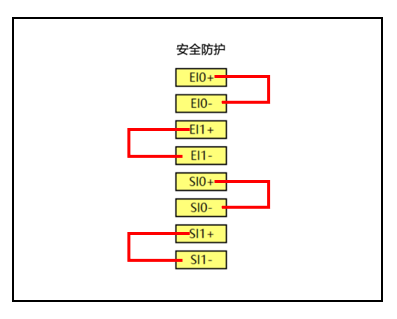

.. centered:: 圖表 3.5-10 安全防護示意圖01

**連接緊急停止按鈕**
在大多數應用程式中，需要使用一個或多個額外的緊急停止按鈕，請參閱下圖表：

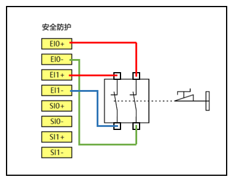

.. centered:: 圖表 3.5-11 安全防護示意圖02

**連線安全停止按鈕**
安全停止裝置的一個例子是當門打開時機器人停止的門開關，請參見下圖表：

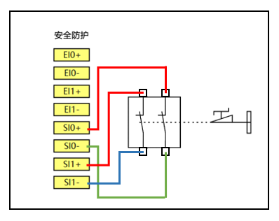

.. centered:: 圖表 3.5-12 安全防護示意圖03

通用數字量I/O
~~~~~~~~~~~~~~~~~~~~~~~~~~~~

本節描述了通用數位量 I/O的電氣規範，必須遵守第3.5.6節的通用電氣規範。

通用數位量I/O可用於驅動繼電器、電磁閥等設備或與其他PLC互動。

**數位量輸出控制負載**

此範例示範如何連接數位量輸出從而控制負載，請參考下圖表：

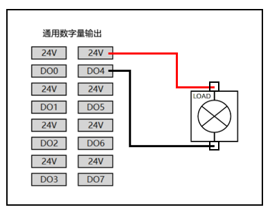

.. centered:: 圖表 3.5-13 通用數位量輸出示意圖01

從按鈕進行的數字輸入
~~~~~~~~~~~~~~~~~~~~~~~~~~~~~~

下面的範例示範如何將簡單按鈕連接到數位量輸入。

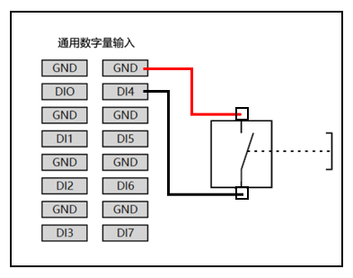

.. centered:: 圖表 3.5-14 通用數位量輸出示意圖02

與其他設備或PLC交互
~~~~~~~~~~~~~~~~~~~~~~~~~~~~~~~

下面的範例示範如何與其他裝置或PLC進行數位量輸入輸出互動。

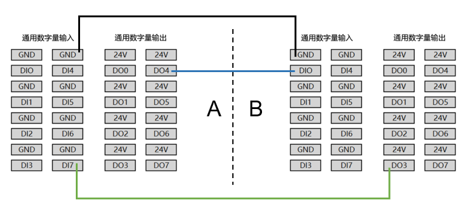

.. centered:: 圖表 3.5-15 與其他設備或PLC互動示意圖

模擬量I/O
~~~~~~~~~~~~~~~~

.. centered:: 表格 3.5-4 類比電流電壓
.. list-table::
   :widths: 30 20 10 10 10 10
   :header-rows: 0
   :align: center

   * - **端子**
     - **參數**
     - **最小值**
     - **典型值**
     - **最大值**
     - **單位**

   * - | 類比電流輸入
       | [AIx-END]
       | [AIx-END]
       | [AIx-END]
     - | 
       | 電流
       | 阻抗
       | 解析度
     - | 
       | 0
       | -
       | -
     - | 
       | -
       | 500
       | 12
     - | 
       | 20
       | -
       | -
     - | 
       | mA
       | ohm
       | bit

   * - | 類比電壓輸入
       | [AIx-END]
       | [AIx-END]
       | [AIx-END]
     - | 
       | 電壓
       | 阻抗
       | 解析度
     - | 
       | 0
       | -
       | -
     - | 
       | -
       | 510
       | 12
     - | 
       | 10
       | -
       | -
     - | 
       | V
       | Kohm
       | bit

   * - | 類比電流輸出
       | [AOx-END]
       | [AOx-END]
       | [AOx-END]
     - | 
       | 電流
       | 電壓
       | 解析度
     - | 
       | 0
       | 0
       | -
     - | 
       | -
       | -
       | 12
     - | 
       | 20
       | 10
       | -
     - | 
       | mA
       | V
       | bit

   * - | 類比電壓輸出
       | [AOx-END]
       | [AOx-END]
       | [AOx-END]
       | [AOx-END]
     - | 
       | 電壓
       | 電流
       | 阻抗
       | 解析度
     - | 
       | 0
       | 0
       | -
       | -
     - | 
       | -
       | -
       | 100
       | 12
     - | 
       | 10
       | 20
       | -
       | -
     - | 
       | V
       | mA
       | ohm
       | bit

類比量I/O用來設定或測量其它設備的電壓（0-10V）或電流（0-20mA）。

為了達到高精度，建議採用以下方法。

- 設備和控制箱使用相同的接地（GND）。

- 使用屏蔽電纜或雙絞線。

下面的範例示範如何使用類比量I/O。

**使用類比輸出**

下面的範例是示範使用類比量輸出控制傳送帶。

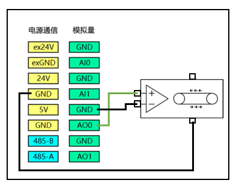

.. centered:: 圖表 3.5-16 類比輸出示意圖

**使用類比輸入**

下面的範例是示範使用類比輸入連接類比感測器。

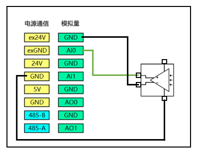

.. centered:: 圖表 3.5-17 類比輸入示意圖

FR3MT&3C選配模組
~~~~~~~~~~~~~~~~~~~~~~~~~~~~~~~~~~~~~~~~~

前言
+++++++++++++++++++++++++

協作機器人的定義遵循國際ISO標準及國標相關規定來保護作業者的安全，我們不推薦直接將機器人本體應用於作業對象為人體的場合。但機器人應用者或應用開發者確有需要涉及機器人作業對象為人體的場合時，需要在應用者或應用開發者充分評估並在人員安全得到保障的前提下，為機器人本體配置安全可靠、經過充分測試及認證的安全防護系統，以保護人員安全。

安全須知
***************************

本手冊僅作為客戶安全認證指導手冊使用，維護操作人員需要具備專業能力，非專業人事操作，法奧拒絕承擔所有責任。

.. important:: 如果機器人（機器人本體、電源模組、擴展模組）因人為原因被損壞、更改或修改，法奧拒絕承擔所有責任；法奧對由於客戶編寫的程序出錯而對機器人或任何其他設備造成的任何損壞概不負責。

有效性和責任
***************************

本手冊中的信息不包含設計、安裝和操作一個完整的機器人應用，也不包含所有可能對這一完整的系統的安全造成影響的周邊設備。該完整系統的設計和安裝需符合該機器人安裝所在國的標準和規範中確立的安全要求。

法奧的集成商有責任確保遵循相關國家的法律法規，確保完整的機器人應用中不存在任何重大危險。這包括但不限於以下內容：

- 對完整的機器人系統做一個風險評估
- 將風險評估定義的其他機械和附加安全設備連接在一起
- 在軟體中建立適當的安全設置
- 確保用戶不會對任何安全措施加以修改
- 確認整個機器人系統的設計和安裝準確無誤
- 明確使用說明
- 在機器人上標明集成商的相關標誌和聯繫信息
- 收集技術文件中的所有文檔，包括本手冊

責任有限
***************************

本手冊所包含的任何安全信息都不得視為通用的機器人安全保證，即使遵守所有安全說明，依然有可能引起人員傷害或設備損壞。

安全警告標誌
***************************

產品上使用了以下安全警告標誌。

.. important:: 
	.. figure:: installation/008.png
		:width: 60
		:height: 50
		:align: left

	名稱：**危險**
   
	作用：這指的是即將引發危險的用電情況，如果不避免，可導致人員死亡或嚴重傷害。

.. important:: 
	.. figure:: installation/009.png
		:width: 60
		:height: 50
		:align: left

	名稱：**觸電危險**
   
	作用：這指的是即將引發危險的觸電情況，如果不避免，可導致人員觸電死亡或嚴重傷害。

.. important:: 
	.. figure:: installation/010.png
		:width: 60
		:height: 50
		:align: left

	名稱：**燙傷危險**
   
	作用：這指的是可能引發危險的熱表面，如果不避免接觸了，可造成人員傷害。

.. important:: 
	.. figure:: installation/112.png
		:width: 60
		:height: 50
		:align: left

	名稱：**接地**
   
	作用：這指設備需要可靠接地。
	                                           
FR3MT&3C基座及模組接口定義
++++++++++++++++++++++++++++++++++++++++++++++++++++++++++++++++++++

基座接口定義
***************************

本體基座部分對外共7個按鍵及接口，其定義如下：

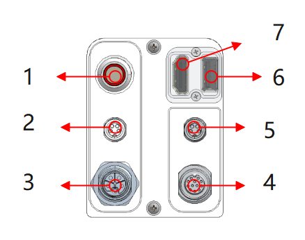

.. centered:: 圖表 3.5-18 本體基座部分按鍵及接口

.. note:: 基座接口引腳定義視圖均為安裝基準面視角。

**1、控制器開關機按鍵**：默認上電自動開機。

**2、M8-A型-4P-母座接口引腳定義**：
用戶網口。地址192.168.57.2。連接器：M8-A型-4P-母座【接線端配M8-A型-4P-公頭】，連接器符合IEC 61076-2-101標準。

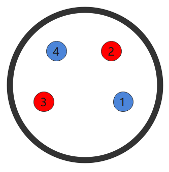

.. list-table::
   :widths: 20 30 50
   :header-rows: 0
   :align: center

   * - **引腳**
     - **定義**
     - **描述**

   * - 1
     - TX+
     - 數據發送正

   * - 2
     - RX+
     - 數據接收正

   * - 3
     - RX-
     - 數據接收負

   * - 4
     - TX-
     - 數據發送負

**3、M12-L型-5P-公座接口引腳定義**：
連接器：M12-L型-5P-公座【接線端配M12-L型-5P-母頭】，連接器符合IEC 61076-2-101標準。

.. figure:: installation/115.png
	:align: center
	:width: 2in

.. list-table::
   :widths: 10 15 15 20 40 
   :header-rows: 0
   :align: center

   * - **引腳**
     - **顏色**
     - **定義**
     - **描述**
     - **備註**

   * - 1
     - 黑1
     - 0V
     - 控制電源負
     - 機器人控制電源負【備用控制箱電源，不需要連接】

   * - 2
     - 棕2
     - 24V
     - 控制電源正
     - 機器人控制電源正【備用控制箱電源，不需要連接】

   * - 3
     - 白3
     - 48V
     - 動力電源正
     - 機器人動力電源正

   * - 4
     - 藍4
     - 0V
     - 動力電源負
     - 機器人動力電源負

   * - 5
     - 灰5
     - PE
     - 接地
     - 安全接地
  
.. note:: 
  ①基座內設計48V轉24V的控制電源。

  ②基座內48V轉24V電源作為電源端口輸入的24V電源的備份電源使用。

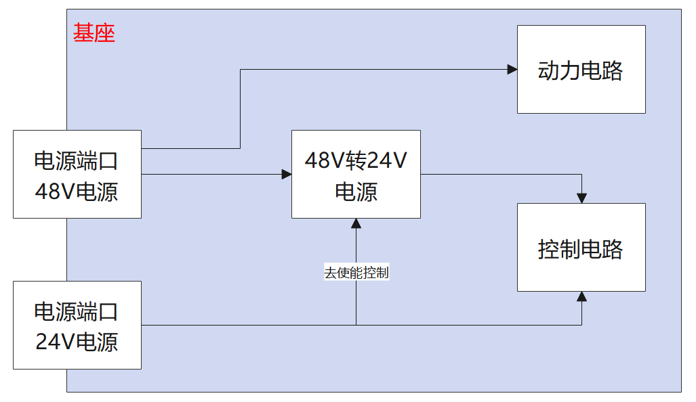

.. centered:: 圖表 3.5-19 基座內48V轉24V電源示意圖

**4、M12-A型-12P-母座接口引腳定義**：
連接器：M12-A型-12P-母座【接線端配M12-A型-12P-公頭】，連接器符合IEC 61076-2-101標準。

.. figure:: installation/117.png
	:align: center
	:width: 2in

.. list-table::
   :widths: 10 15 20 40 
   :header-rows: 0
   :align: center

   * - **引腳**
     - **定義**
     - **描述**
     - **備註**

   * - 1
     - AGND
     - 模擬量地
     - 模擬量參考地

   * - 2
     - 0V
     - 24V電源負
     - 控制電源負

   * - 3
     - 485-A
     - 485通信A
     - 485通信用於擴展備用

   * - 4
     - 485-B
     - 485通信B
     - 485通信用於擴展備用

   * - 5
     - DI0/DO0
     - 數字量輸入/輸出0
     - 5、6、7同一接口，通過程序可以配置為輸入或輸出，單一時刻二選一

   * - 6
     - DI1/DO1
     - 數字量輸入/輸出1
     - 5、6、7同一接口，通過程序可以配置為輸入或輸出，單一時刻二選一

   * - 7
     - DI2/DO2
     - 數字量輸入/輸出2
     - 5、6、7同一接口，通過程序可以配置為輸入或輸出，單一時刻二選一

   * - 8
     - AI0/AO0
     - 模擬量輸入/輸出0
     - 8、9同一接口，通過程序可以配置為輸入或輸出，單一時刻二選一

   * - 9
     - AI1/AO1
     - 模擬量輸入/輸出1
     - 8、9同一接口，通過程序可以配置為輸入或輸出，單一時刻二選一

   * - 10
     - 24V
     - 24V電源正
     - 控制電源正

   * - 11
     - DI3/DO3
     - 數字量輸入/輸出3
     - 11、12同一接口，通過程序可以配置為輸入或輸出，單一時刻二選一

   * - 12
     - DI4/DO4
     - 數字量輸入/輸出4
     - 11、12同一接口，通過程序可以配置為輸入或輸出，單一時刻二選一

**5、M8-A型-4P-母座接口引腳定義**：
調試網口。地址192.168.58.2。連接器：M8-A型-4P-母座【接線端配M8-A型-4P-公頭】，連接器符合IEC 61076-2-101標準。

.. list-table::
   :widths: 20 30 50
   :header-rows: 0
   :align: center

   * - **引腳**
     - **定義**
     - **描述**

   * - 1
     - TX+
     - 數據發送正

   * - 2
     - RX+
     - 數據接收正

   * - 3
     - RX-
     - 數據接收負

   * - 4
     - TX-
     - 數據發送負

6、USB-A型接口，USB2.0-內部調試使用。

7、HDMI-A型接口，HDMI顯示-內部調試使用。

電源模組接口定義
******************************************************

電源採用明緯NDR-480-48。接口定義如下

.. figure:: installation/118.png
	:align: center
	:width: 3in

.. list-table::
   :widths: 20 20 20 40
   :header-rows: 0
   :align: center

   * - **引腳**
     - **定義**
     - **描述**
     - **備註**

   * - 1
     - L
     - 火線
     - 輸入100-240V AC

   * - 2
     - N
     - 零線
     - 輸入100-240V AC

   * - 3
     - PE
     - 地線
     - 接地點

   * - 4
     - +V
     - 48V
     - 輸出48V/10A

   * - 5
     - +V
     - 48V
     - 輸出48V/10A

   * - 6
     - -V
     - 0V
     - 輸出48V/10A

   * - 7
     - -V
     - 0V
     - 輸出48V/10A

擴展模組接口定義
******************************************************

擴展模組具有緊急停止功能、能耗洩放功能。擴展模組對外端子及內部拓撲圖，如下：

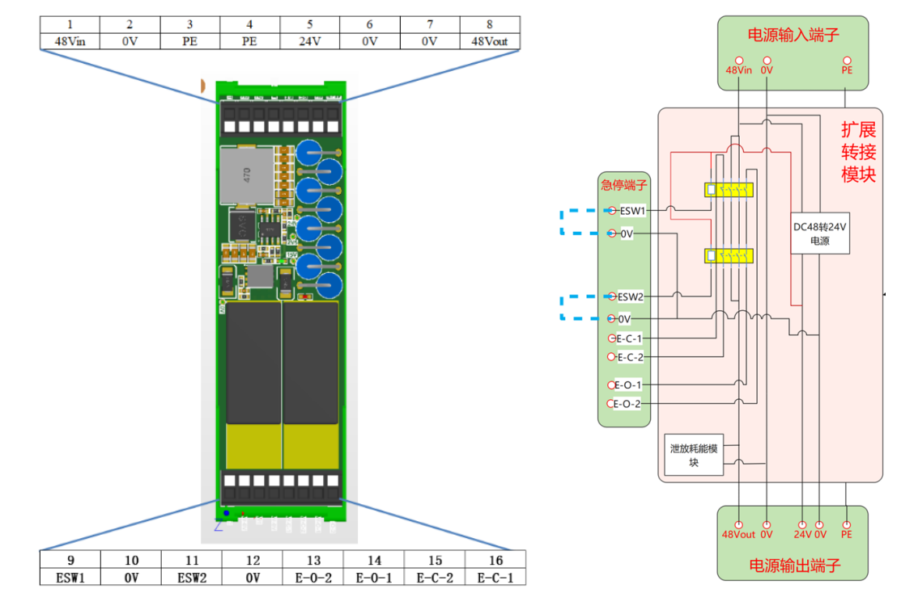

.. list-table::
   :widths: 20 30 50
   :header-rows: 0
   :align: center

   * - **引腳**
     - **定義**
     - **描述**

   * - 1
     - 48-IN
     - 48V輸入正

   * - 2
     - 0V
     - 48V輸入負

   * - 3
     - PE
     - 地線

   * - 4
     - PE
     - 地線

   * - 5
     - 24V
     - 控制電源正

   * - 6
     - 0V
     - 控制電源負

   * - 7
     - 0V
     - 動力電源負

   * - 8
     - 48-OUT
     - 動力電源正

   * - 9
     - ESW1
     - 急停按鈕1正

   * - 10
     - 0V
     - 急停按鈕1負

   * - 11
     - ESW2
     - 急停按鈕2正

   * - 12
     - 0V
     - 急停按鈕2負

   * - 13
     - E-O-2
     - 無源常開2

   * - 14
     - E-O-1
     - 無源常開1

   * - 15
     - E-C-2
     - 無源常閉2

   * - 16
     - E-C-1
     - 無源常閉1

FR3MT&3C應用場景
++++++++++++++++++++++++++++++++++++++++++++++++++++

多數使用場景用戶僅選配用戶線束即可滿足。具體使用場景如下：

.. list-table::
   :widths: 10 15 15 20 40 
   :header-rows: 0
   :align: center

   * - **序號**
     - **場景分類**
     - **用戶供電條件**
     - **用戶功能需求**
     - **推薦配置方案**

   * - 1
     - 基礎應用型
     - 具備48V/10A DC電源
     - 無急停/能量洩放功能
     - 用戶線束

   * - 2
     - 安全擴展型
     - 具備48V/10A DC電源
     - 需急停+能量洩放功能
     - 用戶線束+擴展模組

   * - 3
     - 獨立供電型
     - 無48V/10A DC電源
     - 無急停/能量洩放功能
     - 用戶線束+電源模組+電源線

   * - 4
     - 全功能整合型
     - 無48V/10A DC電源
     - 需急停+能量洩放功能
     - 用戶線束+電源模組+電源線+擴展模組

基礎應用型
******************************************************

僅選配用戶線束。連接方式如下：

1.將電源線M12-L型-5P-母頭連接基座，尾端有5根48V/0V/24V/0V/PE線標，將48V/0V/PE三根線束連接用戶電源對應端子。24V/0V線束不連接進行絕緣處理。

2.M12-A型-12P-公頭及M8-A型-4P-公頭連接基座對應端子。

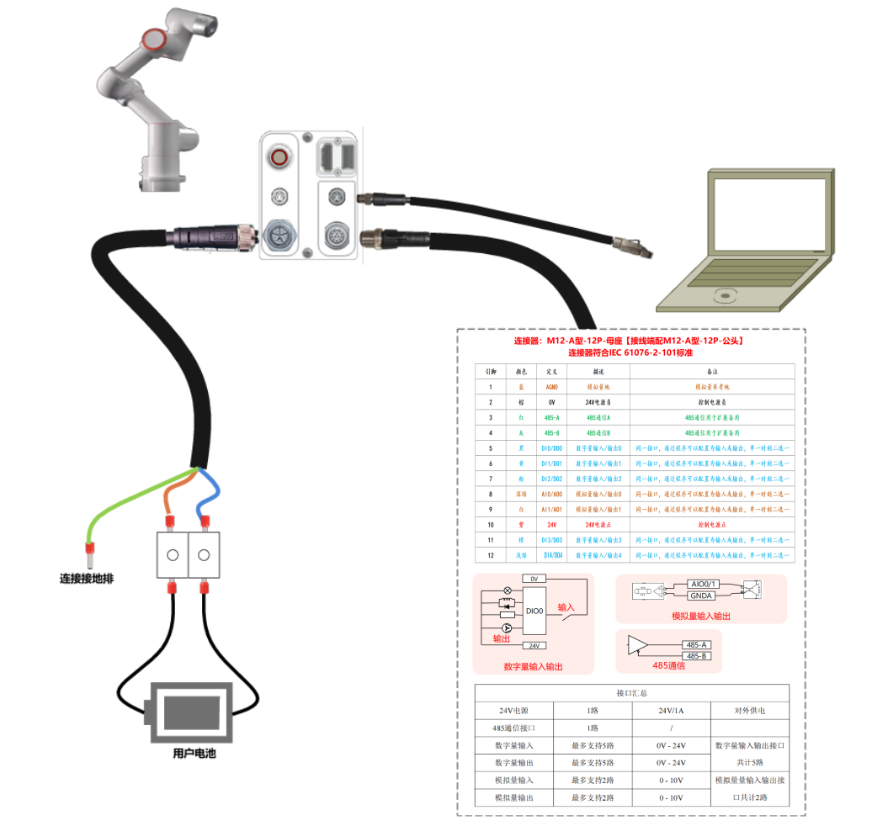

.. centered:: 圖表 3.5-20 僅選配用戶線束連接方式

安全擴展型
******************************************************

選配用戶線束+擴展模組。連接方式如下：

1.0.5M擴展模組線束兩端各有3根48V/0V/PE線標，線束輸入端連接用戶電源對應端子。輸出端插入擴展模組48Vin/0V/PE位置。

2.將電源線M12-L型-5P-母頭連接基座，尾端有5根線束48V/0V/24V/0V/PE線標，將5根線束連接擴展模組48Vout/0V/0V/24V/PE。

3.M12-A型-12P-公頭及M8-A型-4P-公頭連接基座對應端子。

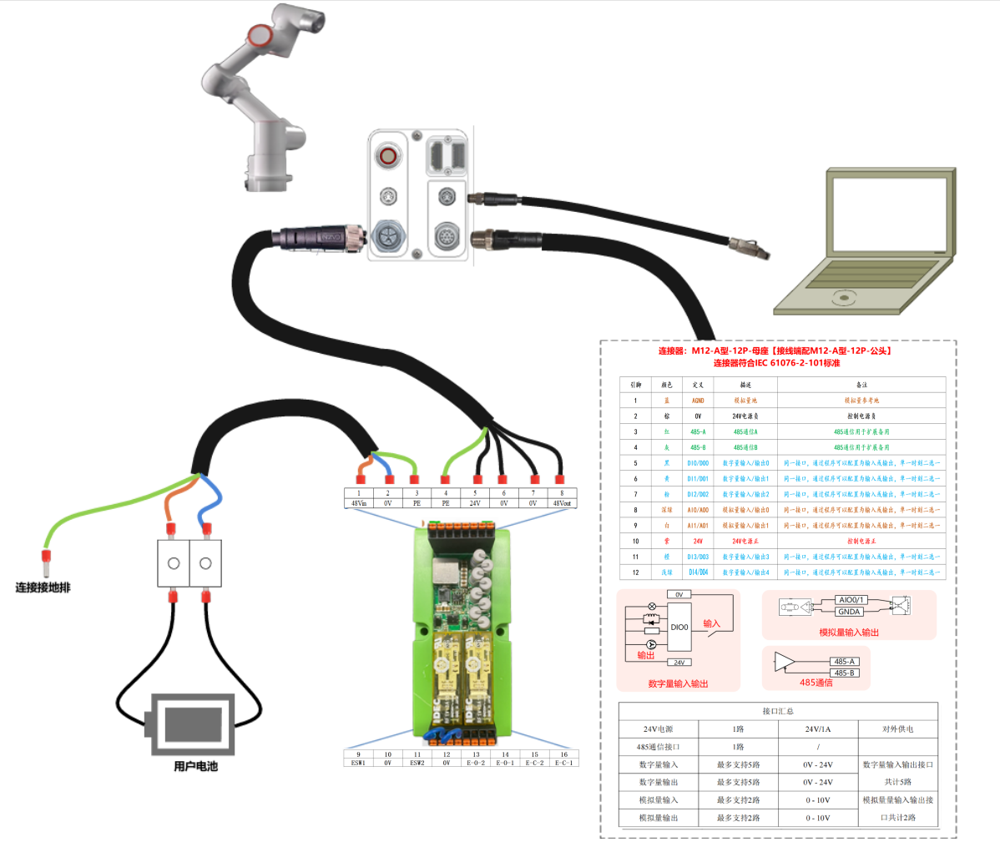

.. centered:: 圖表 3.5-21 選配用戶線束+擴展模組連接方式

獨立供電型
******************************************************

選配用戶線束+電源模組+電源線。連接方式如下：

1.1.5M電源線束尾端有3根L/N/PE線標，連接電源NDR-480-48對應的輸入端子位置。

2.將電源線M12-L型-5P-母頭連接基座，尾端有5根48V/0V/24V/0V/PE線標，將48V/0V/PE三根線束連接用戶電源對應端子。24V/0V線束不連接進行絕緣處理。

3.M12-A型-12P-公頭及M8-A型-4P-公頭連接基座對應端子。

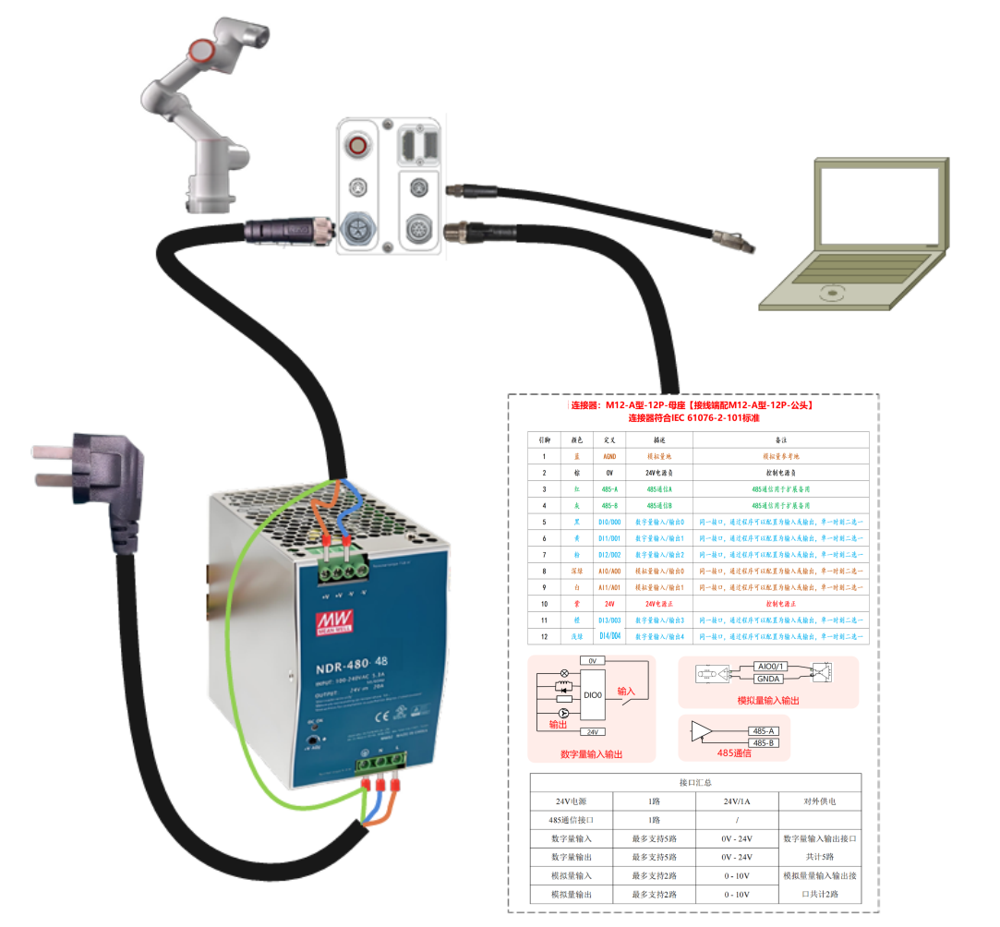

.. centered:: 圖表 3.5-22 選配用戶線束+電源模組+電源線連接方式

全功能整合型
******************************************************

選配用戶線束+電源模組+電源線+擴展模組。連接方式如下：

1.1.5M電源線束尾端有3根L/N/PE線標，連接電源NDR-480-48對應的輸入端子位置。

2.0.5M擴展模組線束兩端各有3根48V/0V/PE線標，線束輸入端連接電源NDR-480-48輸出端對應端子，PE線束與輸入共用。輸出端插入擴展模組48Vin/0V/PE位置。

3.將電源線M12-L型-5P-母頭連接基座，尾端有5根線束48V/0V/24V/0V/PE線標，將5根線束連接擴展模組48Vout/0V/0V/24V/PE。

4.M12-A型-12P-公頭及M8-A型-4P-公頭連接基座對應端子。

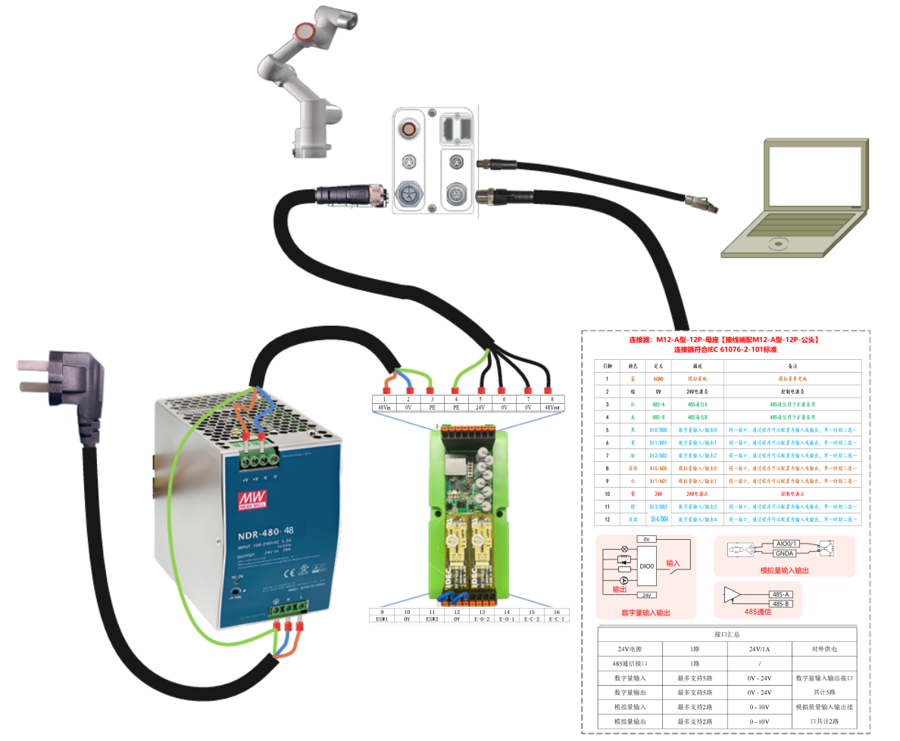

.. centered:: 圖表 3.5-23 選配用戶線束+電源模組+電源線+擴展模組連接方式

選配項物料清單
+++++++++++++++++++++++++++++++++++++++++++++++++++++++

用戶線束5M物料如下：

.. list-table::
   :widths: 20 60 20 
   :header-rows: 0
   :align: center

   * - **序號**
     - **名稱**
     - **數量**

   * - 1
     - FR3MT&3C-DC電源線-5M
     - 1

   * - 2
     - FR3MT&3C-I/O信號線-5M
     - 1

   * - 3
     - FR3MT&3C-乙太網線束-5M
     - 1

   * - 4
     - M8直式組合式插頭,M8-P4A-PLA05,4芯
     - 1

用戶線束1M物料如下：

.. list-table::
   :widths: 20 60 20 
   :header-rows: 0
   :align: center

   * - **序號**
     - **名稱**
     - **數量**

   * - 1
     - FR3MT&3C-DC電源線-1M
     - 1

   * - 2
     - FR3MT&3C-I/O信號線-1M
     - 1

   * - 3
     - FR3MT&3C-乙太網線束-1M
     - 1

   * - 4
     - M8直式組合式插頭,M8-P4A-PLA05,4芯
     - 1

電源模組物料如下：

.. list-table::
   :widths: 20 60 20 
   :header-rows: 0
   :align: center

   * - **序號**
     - **名稱**
     - **數量**

   * - 1
     - 明緯開關電源，NDR-480-48
     - 1

電源線物料如下：

.. list-table::
   :widths: 20 60 20 
   :header-rows: 0
   :align: center

   * - **序號**
     - **名稱**
     - **數量**

   * - 1
     - FR3MT&3C-開關電源線-1.5M 
     - 1

擴展模組物料如下：

.. list-table::
   :widths: 20 60 20 
   :header-rows: 0
   :align: center

   * - **序號**
     - **名稱**
     - **數量**

   * - 1
     - FR3MT&3C基座-擴展模組
     - 1

   * - 2
     - FR3MT&3C電源與擴展模組連接線束-0.5M
     - 1

示教器及末端LED
------------------

機器人示教器可使用一台電腦或平板存取並控制機器人，連接方式可參考3.5.3節說明，此外用戶也可使用我們的FR-HMI示教器，此款示教器為選購配件。

按鈕盒簡介
~~~~~~~~~~~~~~~

60按鈕盒(POE)(BX01)
+++++++++++++++++++++++++++

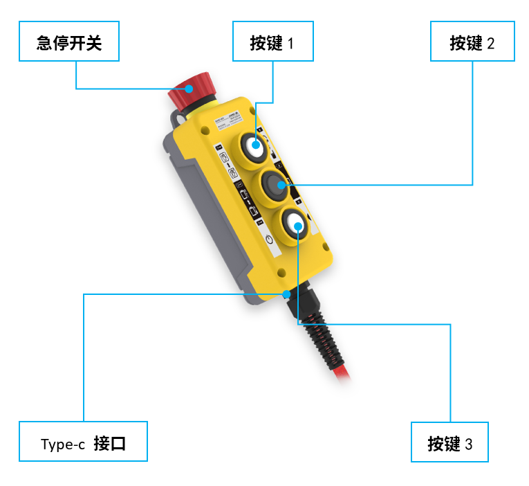

.. centered:: 圖表 3.6-1 60按鈕盒(POE)(BX01)

**急停開關：**\ 當按下急停開關，機器人進入緊急停止狀態。

**Type-c介面：**\ 連接web示教器的連接埠。

**按鍵1：**\ 短按自動/手動模式切換，長按進入/退出拖曳模式。

**按鍵2：**\ 短按記錄示教點，長按進入/退出不搭配示教器狀態。

**按鍵3：**\ 短按開始/停止運作程式。

60按鈕盒(POE)(BX02)-V1.0
++++++++++++++++++++++++++++++++

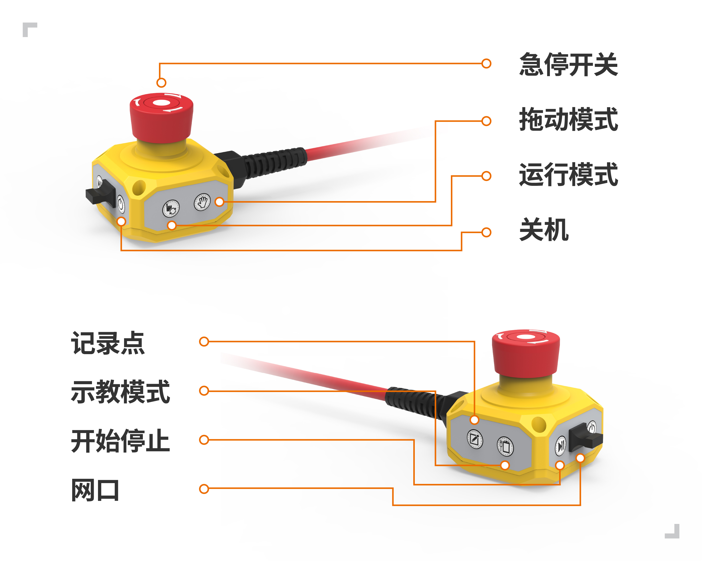

.. centered:: 圖表 3.6-2 60按鈕盒(POE)(BX02)-V1.0

**急停開關：**\ 當按下急停開關，機器人進入緊急停止狀態。

**開始停止：**\ 開始/停止運作程式。

**網口：**\ 連接web示教器。

**關機：**\ 暫未啟用。

**記錄點：**\ 記錄示教點。

**示教模式：**\ 進入/退出搭配示教器狀態。

**運轉模式：**\ 自動/手動模式切換。

**拖曳模式：**\ 進入/退出拖曳模式。

60按鈕盒(POE)(BX02)-V2.0
++++++++++++++++++++++++++++++

.. centered:: 圖表 3.6-3 60按鈕盒(POE)(BX02)-V2.0

**急停開關：**\ 當按下急停開關，機器人進入緊急停止狀態。

**開始停止：**\ 開始/停止運行程式。

**網口：**\ 連接web示教器。

**IP復位：**\ 重置網口IP。

**記錄點：**\ 記錄示教點。

**一鍵清除：**\ 清除所有可恢復的報錯。

**運行模式：**\ 自動/手動模式切換。

**拖動模式：**\ 進入/退出拖動模式。

FR-HMI示教器簡介
~~~~~~~~~~~~~~~~~~~~~~~~~~~~~~~

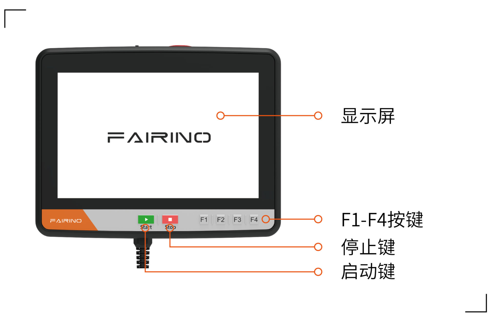

.. centered:: 圖表 3.6-3 FR-HMI示教器正面

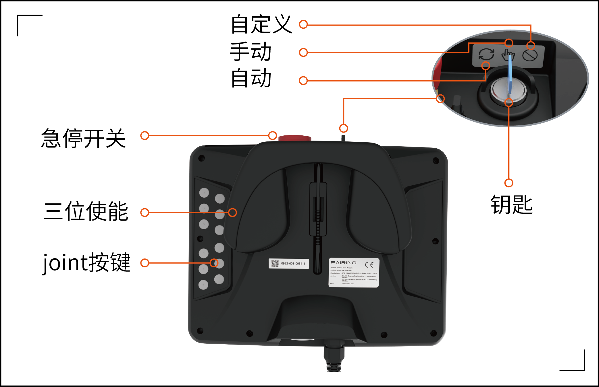

.. centered:: 圖表 3.6-4 FR-HMI示教器背面

**顯示幕：**\ 示教器的觸控操作與顯示介面。

**啟動鍵：**\ 啟動程式。

**停止鍵：**\ 停止目前執行的程式。

**Joint按鍵：**\ 機器人關節點動。

**三位使能：**\ 手動模式使能機器人

**急停開關：**\ 當按下急停開關，機器人進入緊急停止狀態。

**模式鍵：**\ 旋轉鈕切換手自動模式。

末端LED定義
~~~~~~~~~~~~~~~~~

.. centered:: 表格 3.6‑1 末端LED定義表
.. list-table::
   :widths: 50 50
   :header-rows: 0
   :align: center

   * - **功能**
     - **LED 顏色**

   * - 通信未建立時
     - "滅", "紅", "綠" , "藍" 交替

   * - 自動模式
     - 藍色長亮

   * - 手動模式
     - 綠色長亮

   * - 拖曳模式
     - 白青色長亮

   * - 按鈕盒記錄點 (僅在使用按鈕盒時)
     - 紫色閃爍兩下

   * - 進入未搭配按鈕盒狀態(僅在使用按鈕盒時)
     - 紫色閃爍兩下

   * - 開始運作(僅在使用按鈕盒時)
     - 青藍閃爍兩下

   * - 停止運作(僅在使用按鈕盒時)
     - 紅色閃爍兩下

   * - 報錯 (僅在使用按鈕盒時)
     - 紅色長亮

   * - 校零完成
     - 白青色閃爍三下

   * - 去使能
     - 黃色閃爍兩下