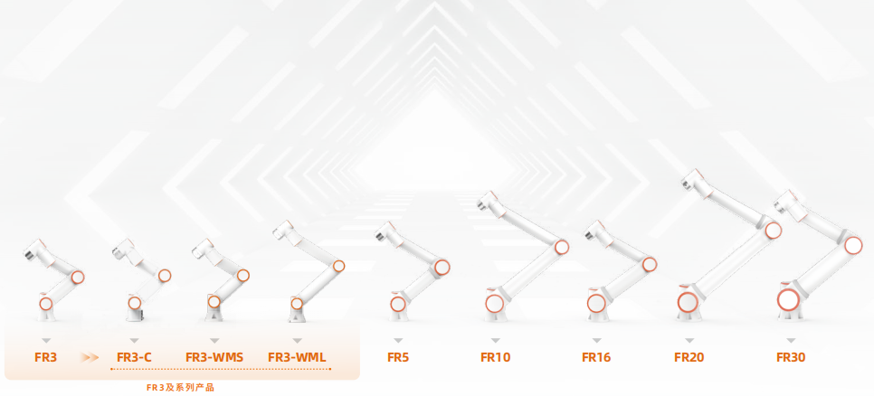

協作機器人
================

產品矩陣
------------

PDF下載
------------------
    :download:`法奧意威協作機器人使用手冊 <https://drive.google.com/file/d/18BnET1GXk2LQ0HVus13aLQnic_bKSLev/view?usp=drive_link>`

快速開始
------------
.. toctree:: 
    :maxdepth: 6
    :numbered: 5

    install_power_robot
    access
    parameter_setting
    manual_teaching
    quick_programming

使用手冊
------------
.. toctree:: 
    :maxdepth: 6
    :numbered: 8

    foreword
    robot_brief_introduction
    installation
    quick_start_robot
    teaching_pendant_software
    base
    safety
    robot_peripherals
    coding
    graphical
    node_editor_software
    points
    status
    application
    process
    system
    teach_pendant
    custom_protocol_slave
    appendix
    term

版本說明
-----------

.. toctree:: 
    :maxdepth: 6
    
    version_intro
