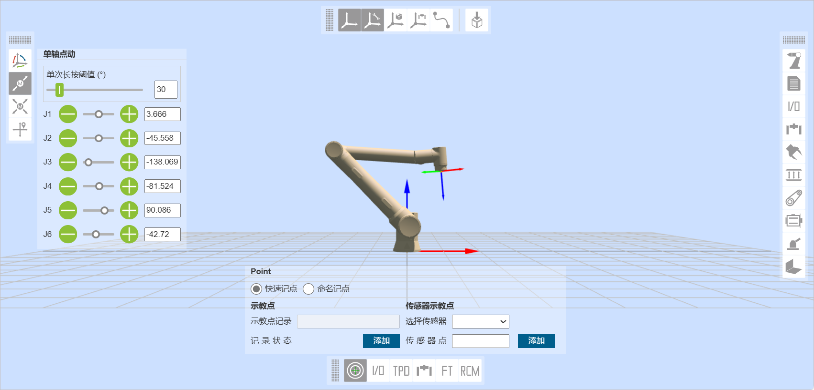
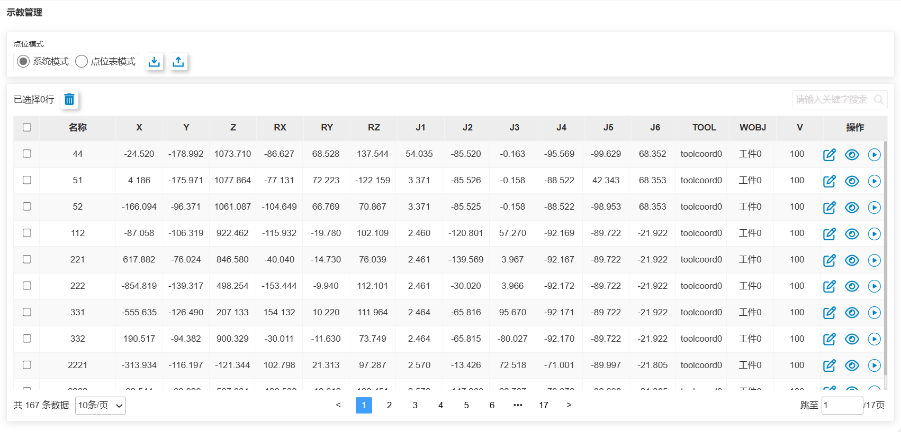

機器人手動示教 
=====================

手動示教並記錄示教點
--------------------

手動示教包含兩種方式：

- 1.按住末端拖曳按鈕進行拖曳示教；
- 2、在三維模擬機器人－三維物件操作中進行點動。

示教到目標位置後，即可在「機器人配套功能－示教點記錄」中儲存示教點。儲存示教點時，此示教點的座標係為目前機器人應用的座標系。

.. centered:: 圖表 4.1‑1 手動示教

查看示教點資訊
--------------------

點選「示教程式－示教點」可顯示所有已儲存的示教點訊息，目前點位模式分為「系統模式」和「點位表模式」。

在該介面中可對示教點檔案匯入和匯出，選取一個示教點後點選「刪除」按鈕即可將該點資訊刪除，示教點數x,y,z,rx,ry,rz和v數值可進行修改，輸入修改值，勾選左側勾選蘭，點選上方修改即可修改示教點資訊。

點擊「開始運行」按鈕，進行局部示教點的單點運行，將機器人移動到該點的位置。此外，使用者可以透過名稱搜尋示教點。

.. centered:: 圖表 4.2‑1 示教管理介面

.. important::
 示教點數x,y,z,rx,ry,rz的修改值不得超過機器人的工作範圍。
