節點圖編程
===============

.. toctree::
   :maxdepth: 6

基礎資訊
-----------

系統簡介
~~~~~~~~~~~

節點圖編程是針對機器人開發的編程軟體，其主要功能和技術特點如下：

-  節點之間的連線較好的呈現程序的上下文邏輯關係；
-  透過創建節點、連線節點和編輯節節點參數等操作，只需拖動操作和少量的參數輸入即可完成機器人程序編寫；
-  有助於更好地視覺化程式碼，並更快地編寫複雜和重複任務的腳本；

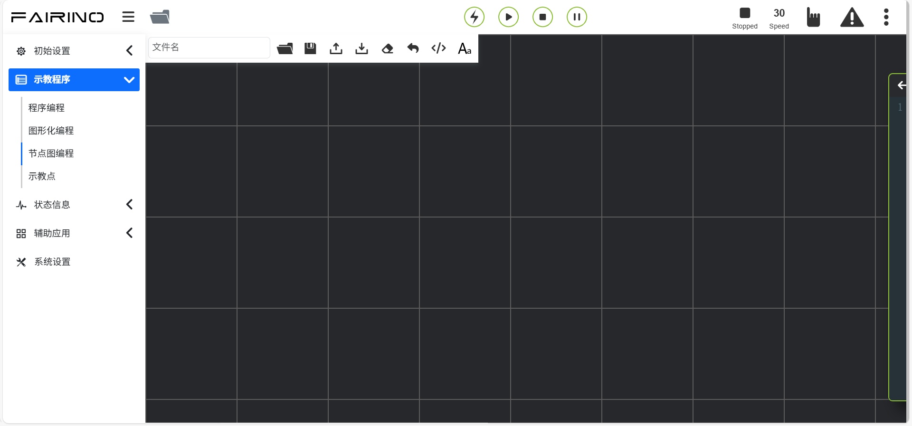

.. centered:: 圖表 11.1-1 節點圖編程介面

工具列
~~~~~~~~~~

使用節點圖編程頁面左側頂部的工具列。

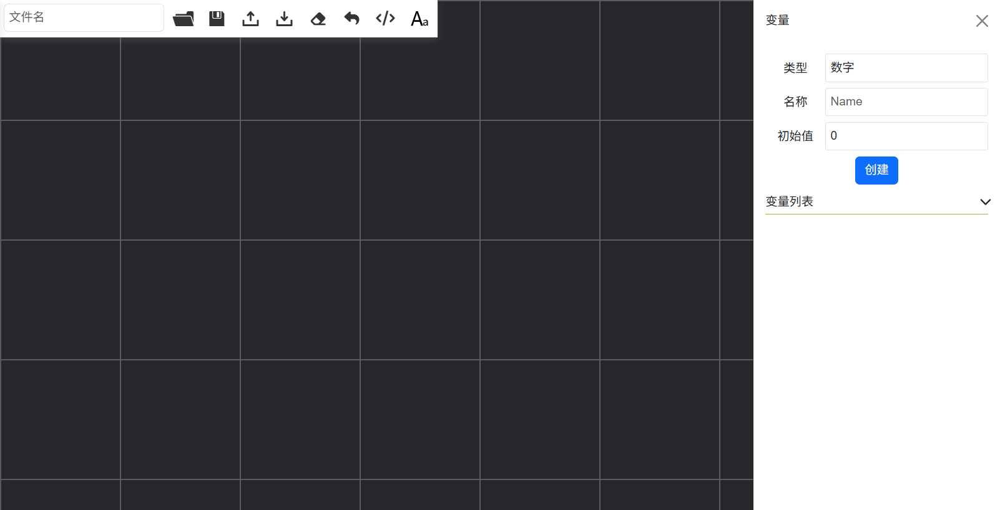

.. centered:: 圖表 11.1-2 操作工具列

.. note::
   .. image:: coding/006.png
      :height: 0.75in
      :align: left

   名稱：**開啟**

   作用：開啟使用者程式檔案，在彈出框中選擇載入或刪除檔案

.. note::
   .. image:: coding/010.png
      :height: 0.75in
      :align: left

   名稱：**儲存**

   作用：儲存節點圖編輯內容

.. note::
   .. image:: node_editor_software/131.png
      :height: 0.75in
      :align: left

   名稱：**重新載入**

   作用：重新載入上次操作的節點圖內容到本地

.. note::
   .. image:: coding/007.png
      :height: 0.75in
      :align: left

   名稱：**新增**

   作用：新增節點圖編程檔案

.. note::
   .. image:: coding/008.png
      :height: 0.75in
      :align: left

   名稱：**匯出**

   作用：新增/開啟節點圖編程檔案後，點擊「匯出」按鈕彈出「匯出節點圖編程」彈出框，選擇工作區檔案名匯出檔案（json格式）

.. note::
   .. image:: coding/009.png
      :height: 0.75in
      :align: left

   名稱：**匯入**

   作用：點擊「匯入」按鈕，彈出匯入提示框。選擇需要匯入的檔案，點擊匯入後，檔案內容展示到節點圖編程工作區

.. note::
   .. image:: node_editor_software/129.png
      :height: 0.75in
      :align: left

   名稱：**程式碼**

   作用：節點圖連接後，生成Lua程式碼

節點圖操作
-----------

節點程序
~~~~~~~~~~~

節點程序需要在空白處點擊滑鼠右鍵，開啟節點程序選擇欄。程序指令主要分為邏輯指令、運動指令、力控指令、控制指令、Modbus指令、擴充軸等指令。

節點程序選擇欄上方輸入框，可進行模糊搜尋，快速定位所需節點指令。

具體節點程序操作流程如下：

-  點擊「Begin」開始節點，創建開始節點編程位置；
-  點擊選擇的程序指令節點，對應節點圖展示到工作區，可對其指令參數進行下拉框選擇、輸入操作；
-  指令節點右側箭頭作用：1.單個箭頭圖示連接下一個節點 2.多個箭頭圖示，第一個「Body」箭頭圖示連接內容節點，第二個「Completed」圖示連接下一個節點；
-  將「Begin」開始節點與完成編寫的節點程序相連,則結束節點編程操作；

If/Else判斷指令
-----------------

點擊「If/Else」相關指令節點,進入節點圖編輯介面。（該指令需要一定編程基礎，如需幫助，請聯絡我們）

「If/Else」指令:

- First：連接if條件內的節點指令
- Second:若左側只輸入兩個判斷條件，則表示連接else條件內的節點指令；若左側三個判斷條件都存在，則表示連接elseif條件內的節點指令
- Third：若左側三個判斷條件都存在，則表示連接else條件
- Completed:連接後續節點指令

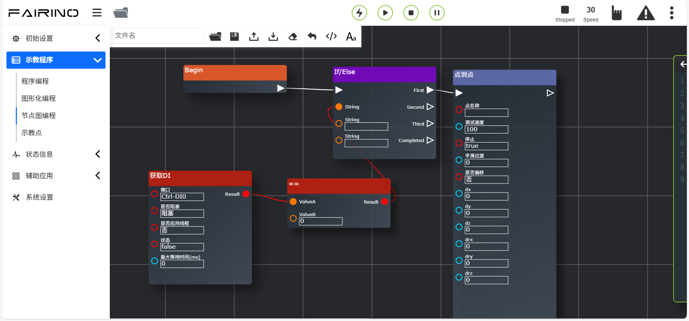

.. centered:: 圖表 11.3-1 「If/Else」指令節點介面

While指令
----------------

點擊「While」相關指令節點,進入節點圖編輯介面。

在While後方的輸入框中輸入等待條件，在do後方的輸入框中輸入循環期間的動作指令，點擊儲存即可。（為方便操作，可任意輸入do內容，在程式中編輯其他指令插入代替）

「While」指令:

- Condition: while循環條件

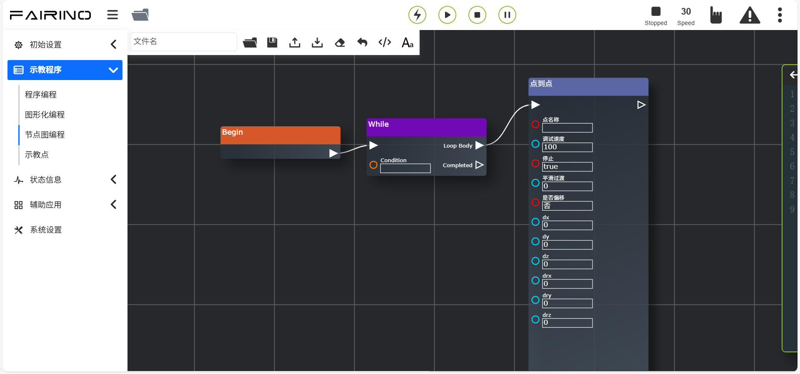

.. centered:: 圖表 11.4-1 「While」指令節點介面

跳轉指令
----------

點擊「跳轉」相關指令節點,進入節點圖編輯介面。

「跳轉」指令，第一個「Body」箭頭圖示連接主體內容節點，第二個「Completed」箭頭圖示連接後續跳轉位置goto指令節點。（該指令需要一定編程基礎，如需幫助，請聯絡我們）

- 跳轉名稱：輸入跳轉名稱，來確定跳轉位置

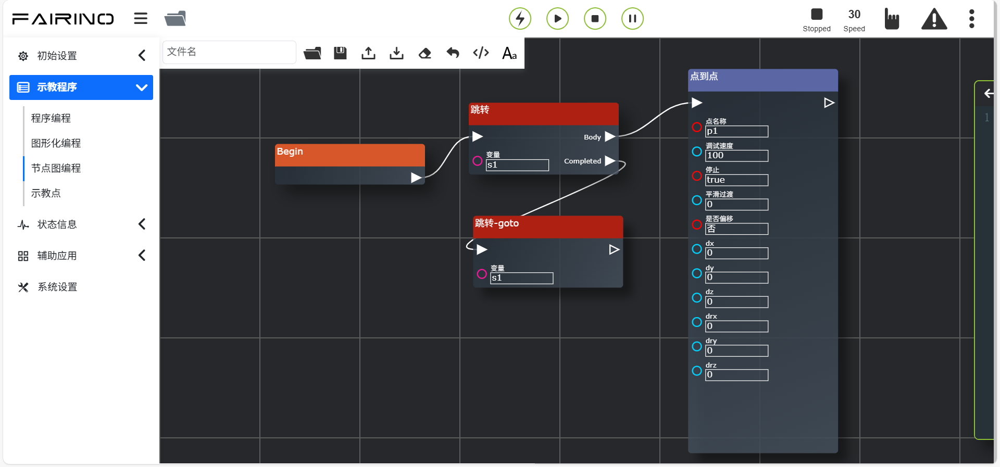

.. centered:: 圖表 11.5-1 「跳轉」指令節點介面

.. important:: 跳轉名稱不能以數字開頭

等待指令
----------

點擊「等待」相關指令節點,進入節點圖編輯介面。

該指令為延時指令，分為「WaitMs」、「WaitDI」、「WaitMultiDI」和「WaitAI」四部分。

1.「等待」指令節點,參數：

- 等待時間(ms): 延時等待時間單位為毫秒，輸入需要等待的毫秒數

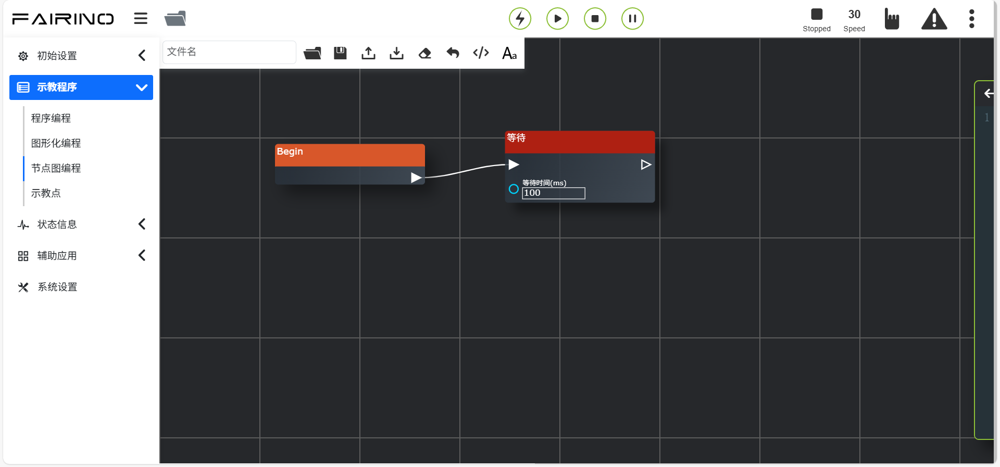

.. centered:: 圖表 11.6-1 「等待」指令節點介面

2.「等待DI」指令節點，參數:

- DI埠號： Ctrl-DI0 ~ Ctrl-CI7(WaitDI,[0~15]), End-DI0 ~ End-DI1(WaitToolDI,[0~1])
- 狀態： false/true
- 最大時間(ms)： 0 ~ 10000
- 等待逾時處理：停止報錯/繼續執行/一直等待

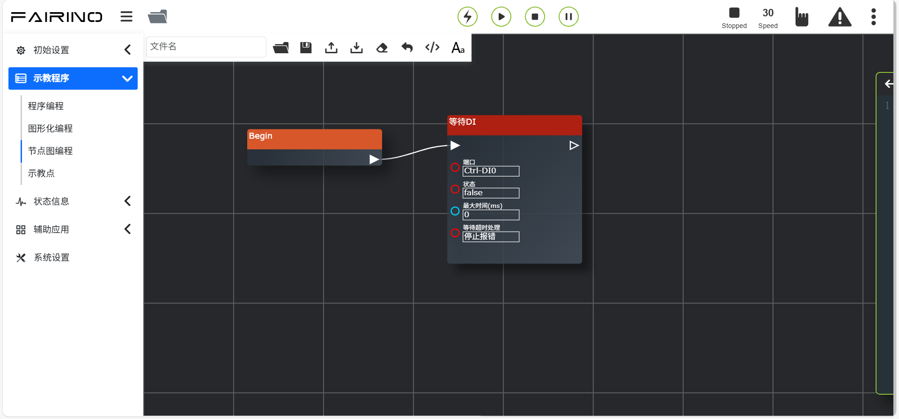

.. centered:: 圖表 11.6-2 「等待DI」指令節點介面

3.「等待多條DI」指令節點，參數:

- 條件： 與/或
- 條件選擇：選擇位的狀態開啟的埠號，以逗號隔開，例DI0,DI1
- 真值對應埠：選擇真值的埠號，以逗號隔開，例DI0,DI1
- 最大時間(ms)：0 ~ 10000,最大等待時間
- 等待逾時處理：停止報錯/繼續執行/一直等待

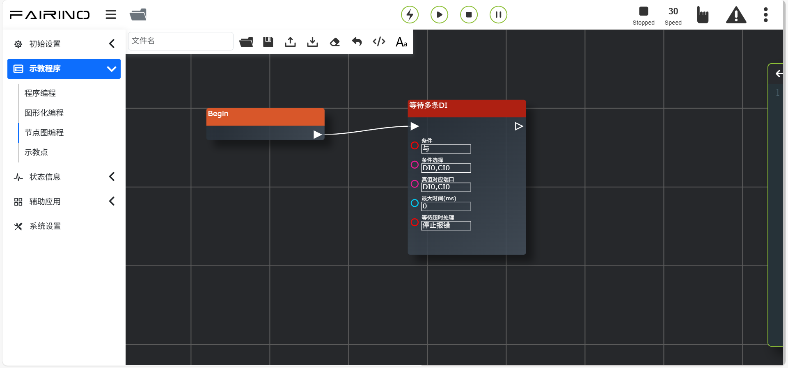

.. centered:: 圖表 11.6-3 「等待多條DI」指令節點介面

4.「等待AI」指令節點，參數:

- 條件： 與/或
- AI埠號： Ctrl-AI0 ~ Ctrl-AI1(WaitAI,[0~1]), End-AI0(WaitToolAI,[0])
- 條件：大於/小於
- 數值(%)：1 ~ 100
- 最大時間(ms)：0 ~ 10000
- 等待逾時處理：停止報錯/繼續執行/一直等待,等待逾時處理一直等待時，最大時間預設為0

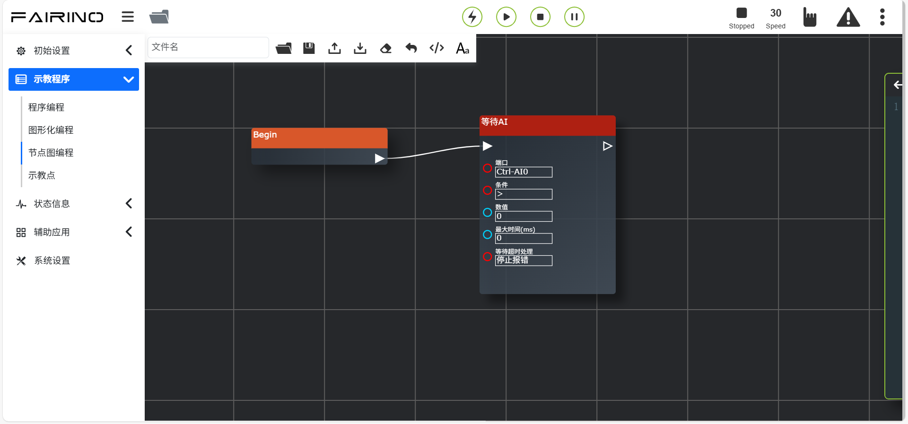

.. centered:: 圖表 11.6-4 「等待AI」指令節點介面

暫停指令
----------

點擊「暫停」指令節點,進入節點圖編輯介面。

該指令為暫停指令，在程式中插入該指令，當程式執行到該指令時，機器人會處於暫停狀態，若想繼續運行，點擊控制區「暫停/恢復」按鍵即可。

「暫停」指令節點,參數：

- 暫停類型：無功能、氣缸未到位等

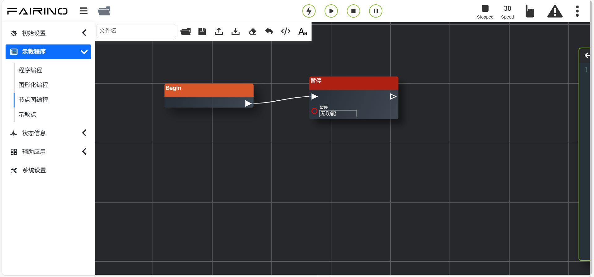

.. centered:: 圖表 11.7-1 「暫停」指令節點介面

呼叫子程序指令
-----------------

點擊「呼叫子程序」指令節點,進入節點圖編輯介面。

該指令為呼叫子程序指令，在程式中插入該指令，當程式執行到該指令時，機器人會處於暫停狀態，若想繼續運行，點擊控制區「暫停/恢復」按鍵即可。

「呼叫子程序」指令節點,參數：

- dofile檔案：創建生成的檔案名
- 第幾層呼叫：第一層/第二層
- id編號：所屬層級對應位置id

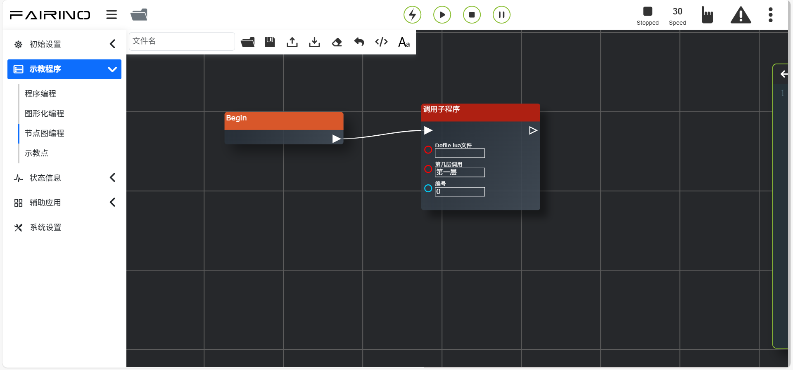

.. centered:: 圖表 11.8-1 「呼叫子程序」指令節點介面

設定系統變數指令
-----------------

點擊「設定系統變數」指令節點,進入節點圖編輯介面。

該指令為設定系統變數指令，分為設定系統變數和取得系統變數，與while，if-else等指令配合使用。

「設定系統變數」指令節點,參數：

- Var：自訂變數名稱
- 數值：根據實際情況輸入

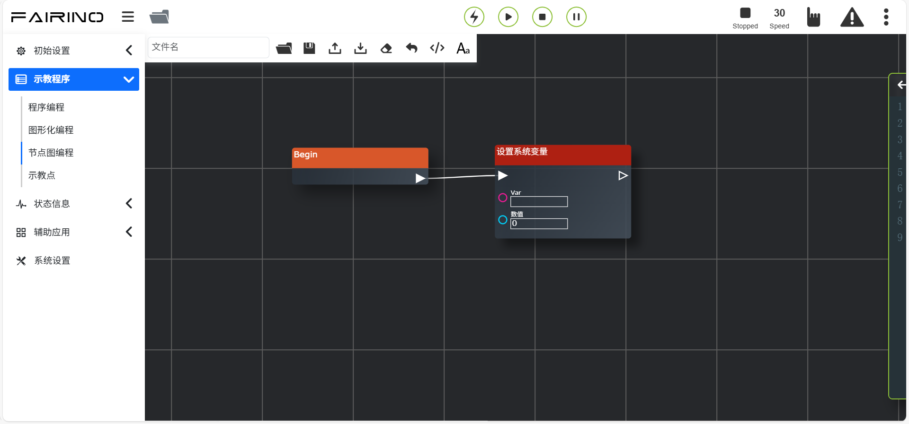

.. centered:: 圖表 11.9-1 「設定系統變數」指令節點介面

「取得系統變數」指令節點,參數：

- Var：自訂變數名稱

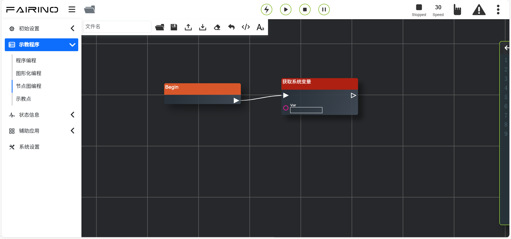

.. centered:: 圖表 11.9-2 「取得系統變數」指令節點介面

.. important:: 變數命名必須為定義過的名稱。

點到點指令
-----------------

點擊「點到點」指令節點,進入節點圖編輯介面。

可以選擇需要到達的點，平滑過渡時間設定可以實現該點到下一點的運動是連續的，是否偏移設定，可以選擇基於基座標系偏移和基於工具座標偏移，並彈出x,y,z,rx,ry,rz偏移量設定，PTP具體路徑為運動控制器自動規劃的最優路徑。

「點到點」指令節點,參數：

- 點名稱：示教點位
- 偵錯速度(%)：0 ~ 100
- 停止：false/true
- 平滑過渡(ms)：平滑過渡時間 0 ~ 500
- 是否偏移 否/基座標偏移/工具座標偏移 選擇否時，dx~drz參數值不生效
- dx~drz：偏移量

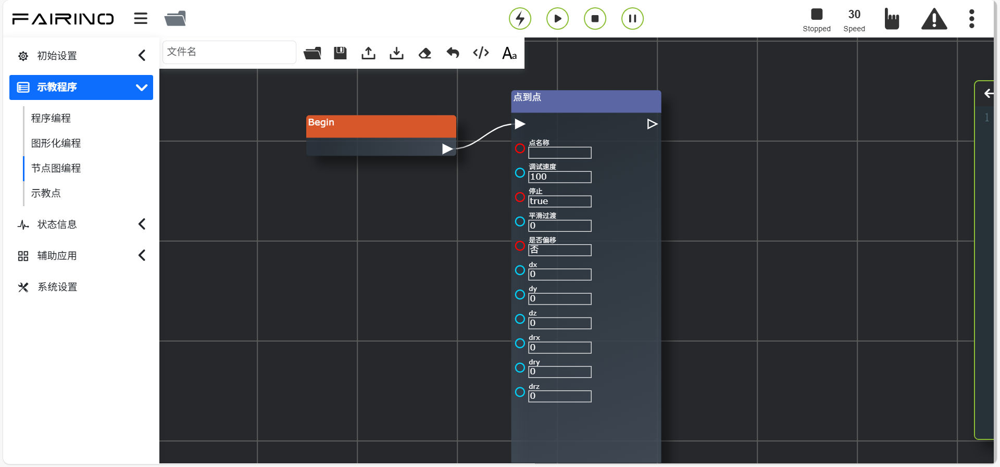

.. centered:: 圖表 11.10-1 「點到點」指令節點介面

直線指令
-----------------

點擊「直線」指令節點,進入節點圖編輯介面。

該指令功能與「點到點」指令相似，但該指令所到達點的路徑為直線。

「直線」指令節點,參數：

- 點名稱：示教點位
- 偵錯速度(%)：0 ~ 100
- 停止：false/true，選擇true時，平滑過渡參數值不生效
- 平滑過渡(mm)：平滑過渡半徑 0 ~ 1000
- 是否尋位：false/true
- 尋位點變數：REF0~99/RES0~99，是否尋位選擇false時，參數不生效
- 是否偏移： 否/基座標偏移/工具座標偏移 選擇否時，dx~drz參數值不生效
- dx~drz：偏移量。

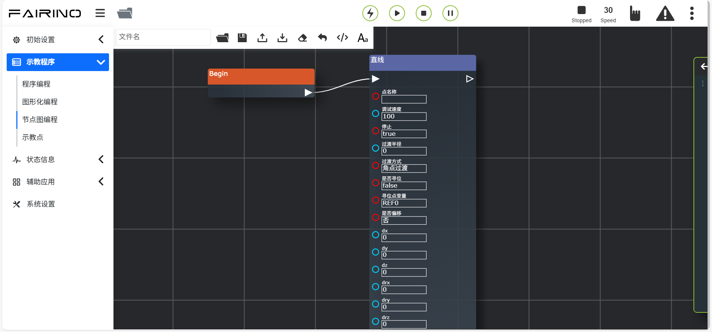

.. centered:: 圖表 11.11-1 「直線」指令節點介面

直線(seamPos)指令
--------------------

點擊「直線(seamPos)」指令節點,進入節點圖編輯介面。

該指令功能應用於焊接場景中使用雷射感測器。

「直線(seamPos)」指令節點,參數：

- 點名稱：示教點位
- 偵錯速度(%)：0 ~ 100
- 停止：false/true，選擇true時，平滑過渡參數值不生效
- 平滑過渡(mm)：平滑過渡半徑 0 ~ 1000
- 焊縫快取資料選擇：執行規劃資料/執行記錄資料
- 板材類型：波紋板/瓦楞板/圍欄板/油桶/波紋甲殼鋼
- 是否偏移： 否/基座標偏移/工具座標偏移/雷射原始資料偏移 選擇否時，dx~drz參數值不生效
- dx~drz：偏移量

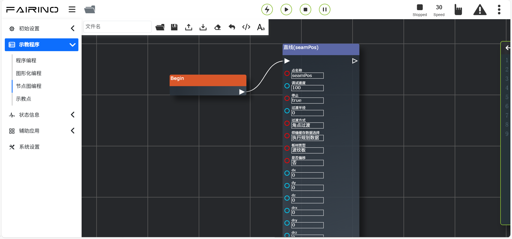

.. centered:: 圖表 11.12-1 「直線(seamPos)」指令節點介面

圓弧指令
-----------------

點擊「圓弧」指令節點,進入節點圖編輯介面。

圓弧運動包含兩個點，第一點為圓弧中間過渡點，第二點為終點，過渡點和終點都可以對是否偏移進行設定，可以選擇基於基座標系偏移和基於工具座標偏移，設定x,y,z,rx,ry,rz偏移量，終點可以設定平滑過渡半徑，實現運動連續效果。

「圓弧」指令節點,參數：

- 圓弧中間點：示教點位
- 是否偏移： 否/基座標偏移/工具座標偏移 選擇否時，dx~drz參數值不生效
- dx~drz：偏移量
- 圓弧終點：示教點位
- 是否偏移： 否/基座標偏移/工具座標偏移 選擇否時，dx~drz參數值不生效
- dx~drz：偏移量
- 偵錯速度(%)：0 ~ 100
- 停止：false/true，選擇true時，平滑過渡參數值不生效
- 平滑過渡(mm)：平滑過渡半徑 0 ~ 1000

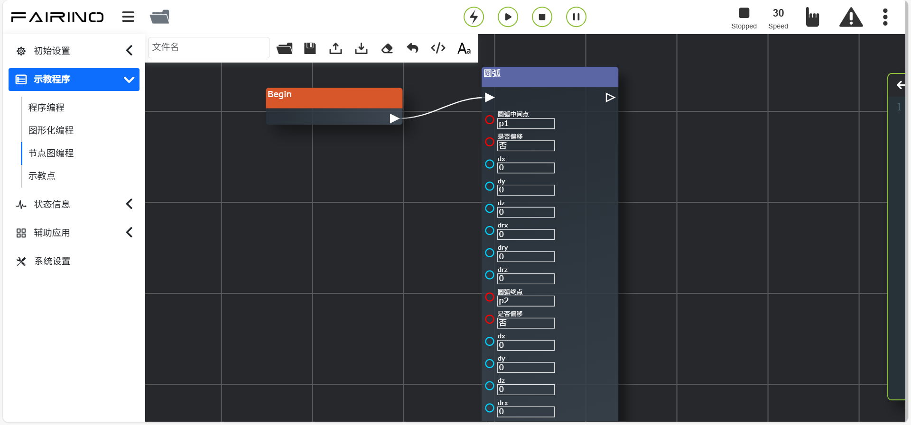

.. centered:: 圖表 11.13-1 「圓弧」指令節點介面

整圓指令
-----------------

點擊「整圓」指令節點,進入節點圖編輯介面。

整圓運動包含兩個點，第一點為整圓中間過渡點1，第二點為整圓中間過渡點2，過渡點2可以設定是否偏移，該偏移量同時生效於過渡點1和過渡點2。

「整圓」指令節點,參數：

- 整圓中間點1：示教點位
- 整圓中間點2：示教點位
- 偵錯速度(%)：0 ~ 100
- 是否偏移： 否/基座標偏移/工具座標偏移 選擇否時，dx~drz參數值不生效
- dx~drz：偏移量

.. centered:: 圖表 11.14-1 「整圓」指令節點介面

螺旋指令
-----------------

點擊「螺旋」指令節點,進入節點圖編輯介面。

螺旋線運動包含三個點，該三個點組成一個圓，在第三點設定頁面，包含螺旋圈數，姿態修正角，半徑增量和轉軸方向增量這幾個參數設定，螺旋圈數即該螺旋線的運動圈數，姿態修正角修正的是螺旋線結束時的姿態與螺旋線第一點的姿態，半徑增量即每一圈半徑的增量，轉軸方向增量即螺旋軸方向的增量。設定 是否偏移，該偏移量生效於整個螺旋線的軌跡。

「螺旋」指令節點,參數：

- 螺旋線中間點1：示教點位
- 螺旋線中間點2：示教點位
- 螺旋線中間點3：示教點位
- 偵錯速度(%)：0 ~ 100
- 是否偏移： 否/基座標偏移/工具座標偏移 選擇否時，dx~drz參數值不生效
- dx~drz：偏移量
- 螺旋圈數：0 ~ 100
- 姿態角修正rx(°)：-1000 ~ 1000
- 姿態角修正ry(°)：-1000 ~ 1000
- 姿態角修正rz(°)：-1000 ~ 1000
- 半徑增量(mm)：-100 ~ 100
- 轉軸方向增量(mm)：-100 ~ 100

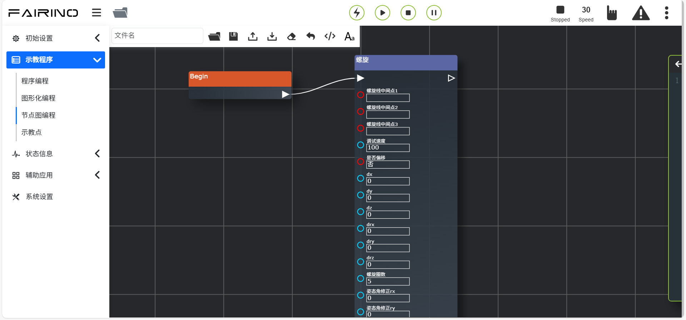

.. centered:: 圖表 11.15-1 「螺旋」指令節點介面

新螺旋指令
-----------------

點擊「新螺旋」指令節點,進入節點圖編輯介面。

新螺旋運動為優化版螺旋線運動，該指令只需要一個點加各參數的配置實現螺旋線運動。機器人以目前位置作為起點，使用者設定偵錯速度，是否偏移，螺旋圈數，螺旋傾角，初始半徑，半徑增量，轉軸方向增量和旋轉方向這幾個參數，螺旋圈數即該螺旋線的運動圈數，螺旋傾角即工具Z軸與水平方向的夾角，姿態修正角修正的是螺旋線結束時的姿態與螺旋線第一點的姿態，初始半徑即第一圈半徑大小，半徑增量即每一圈半徑的增量，轉軸方向增量即螺旋軸方向的增量，旋轉方向即順時針和逆時針。

「新螺旋」指令節點,參數：

- 螺旋線起點：示教點位
- 偵錯速度(%)：0 ~ 100
- 是否偏移： 否/基座標偏移/工具座標偏移 選擇否時，dx~drz參數值不生效
- dx~drz：偏移量
- 螺旋圈數：0 ~ 100
- 螺旋傾角(°)：-100 ~ 100
- 初始半徑：0 ~ 100
- 半徑增量(mm)：-100 ~ 100
- 轉軸方向增量(mm)：-100 ~ 100
- 旋轉方向：順時針/逆時針

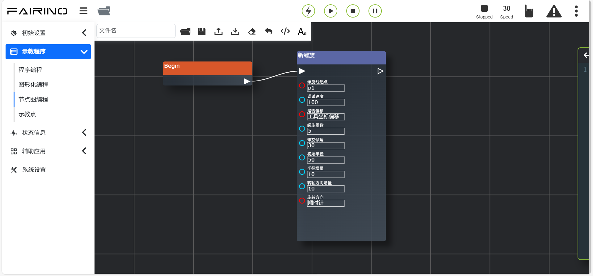

.. centered:: 圖表 11.16-1 「新螺旋」指令節點介面

水平螺旋指令
-----------------

點擊「水平螺旋」指令節點,進入節點圖編輯介面。

「H-Spiral」指令為水平空間螺旋線運動，該指令設定於單段運動（直線）指令之後。

「水平螺旋」指令節點,參數：

- 螺旋半徑: 0~100mm
- 螺旋角速度: 0~2rev/s
- 旋轉方向: 螺旋順/逆時針
- 螺旋傾角: 0~40°

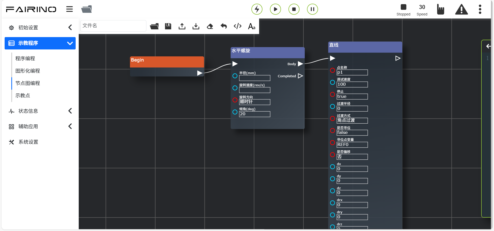

.. centered:: 圖表 11.17-1 「水平螺旋」指令節點介面

樣條指令
-----------------

點擊「樣條」指令節點,進入節點圖編輯介面。

該指令分為樣條組起始，樣條段和樣條組結束三部分，樣條組開始是樣條運動的起始標誌，樣條段目前節點圖只包含SPL段，樣條組結束是樣條運動的結束標誌。

「樣條-SPTP」指令節點,參數：

- 點名稱：示教點位
- 偵錯速度(%)：0 ~ 100

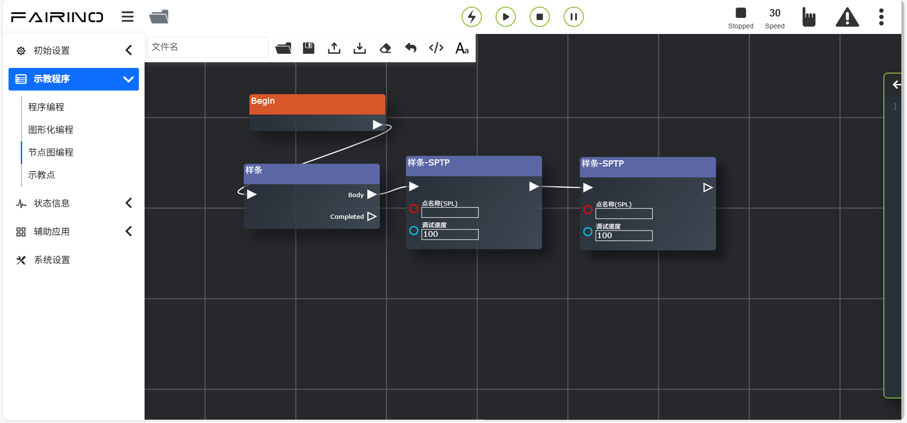

.. centered:: 圖表 11.18-1 「樣條」指令節點介面

新樣條指令
-----------------

點擊「新樣條」指令節點,進入節點圖編輯介面。

該指令為樣條指令演算法優化指令，後續會替代現有的樣條指令，該指令分為多點軌跡起始，多點軌跡段和多點軌跡結束三部分，多點軌跡開始是多點軌跡運動的起始標誌，多點軌跡段即設定各個軌跡點，點擊圖示進入點位添加介面，多點軌跡結束是多點軌跡運動的結束標誌，在此可以設定控制模式和調試速度，控制模式分 為給定控制點和給定路徑點。

「新樣條」指令節點,參數：

- 控制模式：示教點位
- 全域平均銜接時間：整數型，大於10，預設值為2000ms

「新樣條-SPL」指令節點,參數：

- 點名稱：示教點位
- 調試速度(%)：0 ~ 100
- 平滑過渡半徑：0 ~ 1000
- 是否最後一個點：否/是

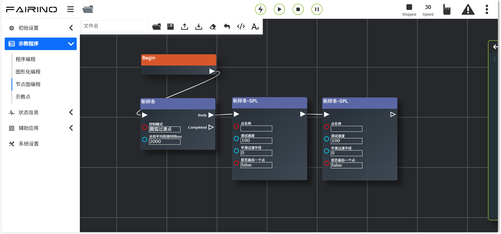

.. centered:: 圖表 11.19-1 「新樣條」指令節點介面

擺動指令
-----------------

點擊「擺動」指令節點,進入節點圖編輯介面。

該指令包含兩部分，第一部分選擇配置好參數的擺動編號，連接Body代表連接節點的程序在「開始擺動」和「停止擺動」中間執行。

「擺動」指令節點,參數：

- 編號：0~7

.. centered:: 圖表 11.20-1 「擺動」指令節點介面

軌跡復現指令
-----------------

點擊「軌跡復現」指令節點,進入節點圖編輯介面。

在該指令中，使用者首先需要有記錄好的軌跡。

進行程序編程時，首先用點到點指令到達對應軌跡起始點，然後在軌跡復現指令中選擇軌跡，選擇平滑軌跡，設定調試速度。軌跡載入指令主要用於預先讀取軌跡檔案，提取成軌跡指令，更好的應用於傳送帶跟蹤場景。

「軌跡復現」指令節點,參數：

- 軌跡名稱：記錄好的軌跡
- 平滑軌跡：否/是
- 調試速度(%)：0 ~ 100，預設值為25

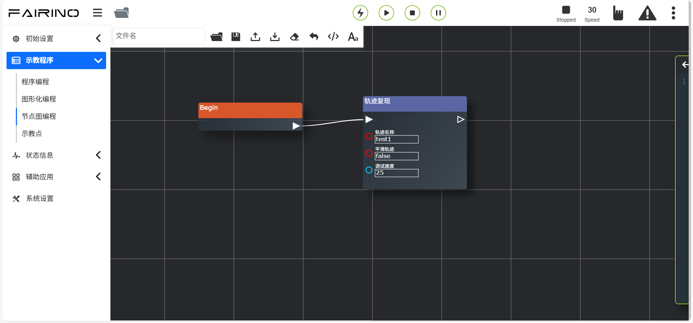

.. centered:: 圖表 11.21-1 「軌跡復現」指令節點介面

點偏移指令
-----------------

點擊「點偏移」指令節點,進入節點圖編輯介面。

該指令為整體偏移指令，輸入各個偏移量，連接Body代表連接節點的程序在開始和關閉之間執行，中間的運動指令會基於基座標（或工件座標）進行偏移。

「點偏移」指令節點,參數：

- ∆x：偏移量，-300~300
- ∆y：偏移量，-300~300
- ∆z：偏移量，-300~300
- ∆rx：偏移量，-300~300
- ∆ry：偏移量，-300~300
- ∆rz：偏移量，-300~300

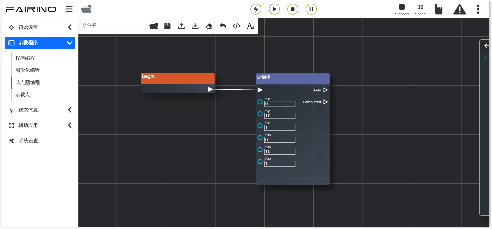

.. centered:: 圖表 11.22-1 「點偏移」指令節點介面

伺服指令
-----------------

點擊「伺服」指令節點,進入節點圖編輯介面。

伺服控制（笛卡爾空間運動）指令，該指令可以透過絕對位姿控制或基於當前位姿偏移來控制機器人運動。

「伺服」指令節點,參數：

- 運動方式：絕對位置/基座標偏移/工具座標偏移
- x：偏移量，-300~300
- y：偏移量，-300~300
- z：偏移量，-300~300
- rx：偏移量，-300~300
- ry：偏移量，-300~300
- rz：偏移量，-300~300
- 比例係數x：0~1
- 比例係數y：0~1
- 比例係數z：0~1
- 比例係數rx：0~1
- 比例係數ry：0~1
- 比例係數rz：0~1
- 加速度(%)：0~100
- 速度(%)：0~100
- 指令週期(s)：0.001~0.016
- 濾波時間(s)：0~1
- 比例放大：0~100

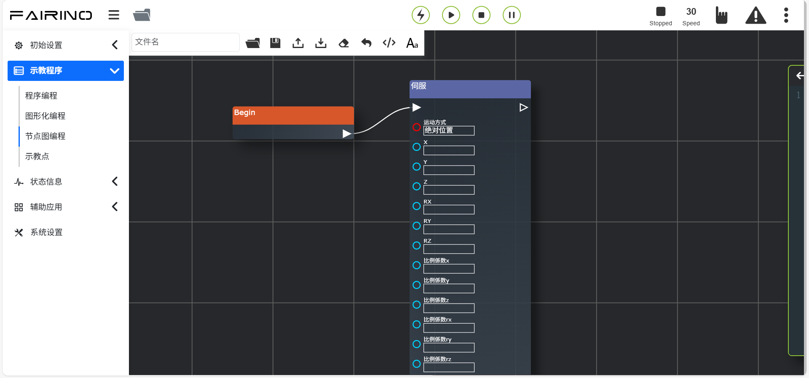

.. centered:: 圖表 11.23-1 「伺服」指令節點介面

軌跡指令
-----------------

點擊「軌跡」指令節點,進入節點圖編輯介面。

在該指令中，使用者首先需要有記錄好的軌跡。

「軌跡」指令節點,參數：

- 選擇軌跡檔案：記錄好的軌跡
- 調試速度(%)：0 ~ 100，預設值為25

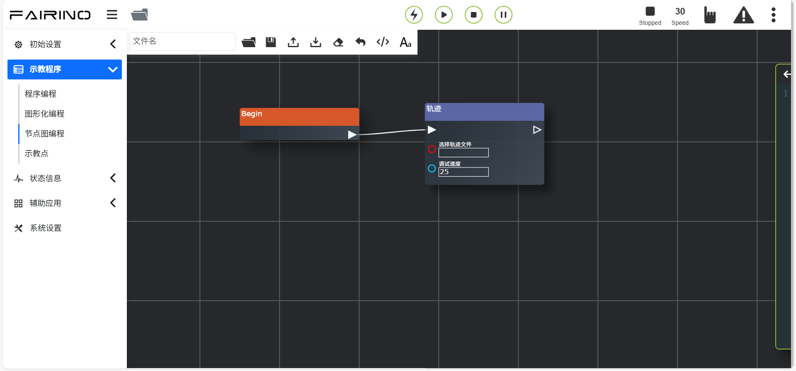

.. centered:: 圖表 11.24-1 「軌跡」指令節點介面

軌跡J指令
-----------------

點擊「軌跡J」指令節點,進入節點圖編輯介面。

在該指令中，使用者首先需要有記錄好的軌跡，可以在示教程序介面預先導入軌跡檔案。軌跡指令和軌跡J指令適用於相機直接給定軌跡的通用介面，滿足在已有固定格式的離散的軌跡點檔案時，可導入系統使得機器人按照導入檔案的軌跡進行運動。

「軌跡J」指令節點,參數：

- 選擇軌跡檔案：記錄好的軌跡
- 調試速度(%)：0 ~ 100，預設值為25
- 軌跡模式：路徑點/控制點

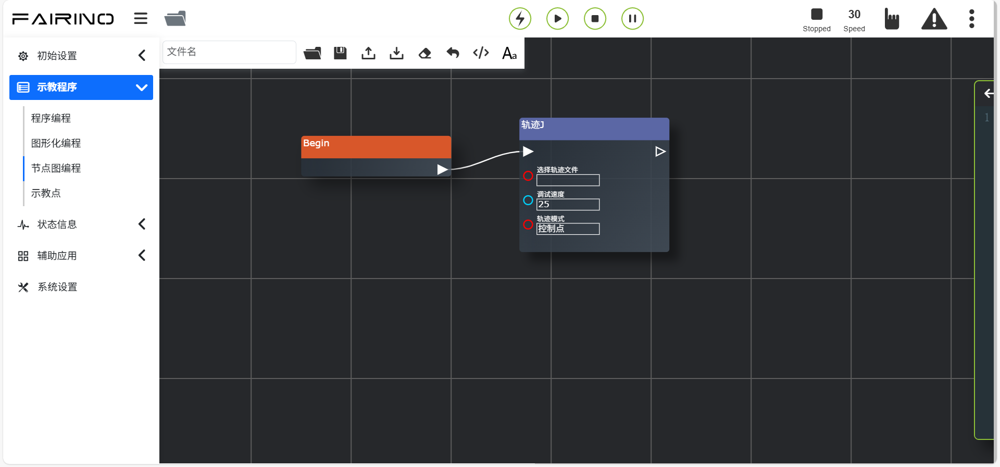

.. centered:: 圖表 11.25-1 「軌跡J」指令節點介面

DMP指令
-----------------

點擊「DMP」指令節點,進入節點圖編輯介面。

DMP是一種軌跡模仿學習的方法，需要事先規劃參考軌跡。在命令編輯介面 ，選擇示教點作為新的起點，點擊「添加」、「應用」後可儲存該指令。DMP具體路徑為以新的起點模仿參考軌跡的新軌跡。

「DMP」指令節點,參數：

- 點名稱：示教點
- 調試速度(%)：0 ~ 100，預設值為100

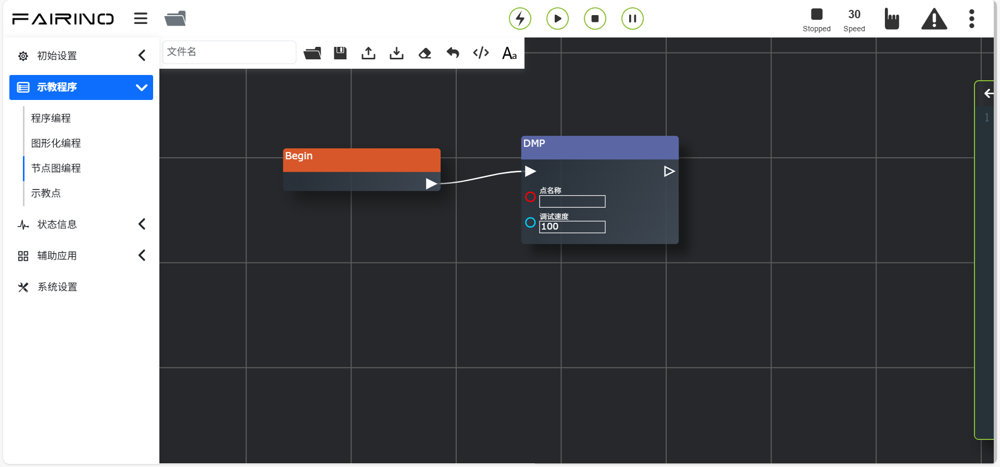

.. centered:: 圖表 11.26-1 「DMP」指令節點介面

工件轉換指令
-----------------

點擊「工件轉換」指令節點,進入節點圖編輯介面。

選擇所要進行自動轉換的工件座標系，點擊「添加」、「應用」後可儲存該指令，添加PTP、LIN指令時與Body相連可實現在該指令內部執行，工件座標系下點位自動轉換。

「工件轉換」指令節點,參數：

- 工件座標系：工件座標系列表

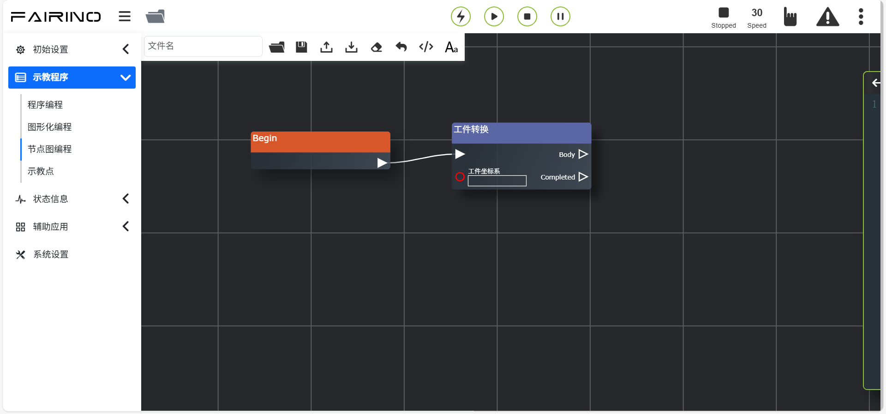

.. centered:: 圖表 11.27-1 「工件轉換」指令節點介面

工具轉換指令
-----------------

點擊「工具轉換」指令節點,進入節點圖編輯介面。

選擇所要進行自動轉換的工具座標系，點擊「添加」、「應用」後可儲存該指令，添加PTP、LIN指令時與Body相連可實現在該指令內部執行，工具座標系下點位自動轉換。

「工具轉換」指令節點,參數：

- 工具座標系：工具座標系列表

.. centered:: 圖表 11.28-1 「工具轉換」指令節點介面

數位IO指令節點
-----------------

點擊「設定DO」/「取得DI」指令節點,進入節點圖編輯介面。

該指令為IO指令，分為設定IO（SetDO/SPLCSetDO）和取得IO（GetDI/SPLCGetDI）兩部分。

1.「設定DO」指令節點,參數：

- 端口：Ctrl-DO0 ~ Ctrl-CO7(阻塞:SetDO,非阻塞:SPLCSetDO,[0~15]), End-DO0 ~ End-DO1(阻塞:SetToolDO,非阻塞:SPLCSetToolDO,[0~1])
- 狀態：false/true
- 是否阻塞：阻塞/非阻塞
- 平滑軌跡：Break/Serious
- 是否應用執行緒：否/是
  
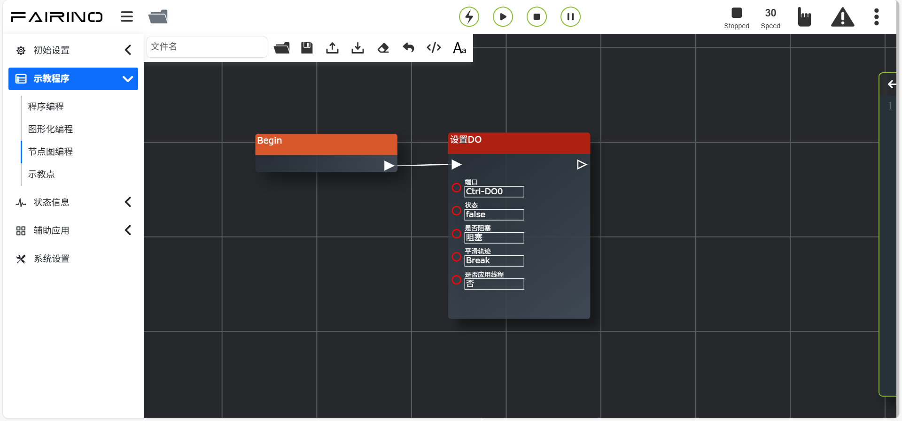

.. centered:: 圖表 11.29-1 「設定DO」指令節點介面

2.「取得DI」指令節點,參數：

- 端口：Ctrl-DI0 ~ Ctrl-CI7(阻塞:GetDI,非阻塞:SPLCGetDI,[0~15]), End-DI0 ~ End-DI1(阻塞:GetToolDI,非阻塞:SPLCGetToolDI,[0~1])
- 是否阻塞：阻塞/非阻塞
- 狀態：false/true
- 最大等待時間(ms)：0 ~ 10000
- 是否應用執行緒：否/是
  
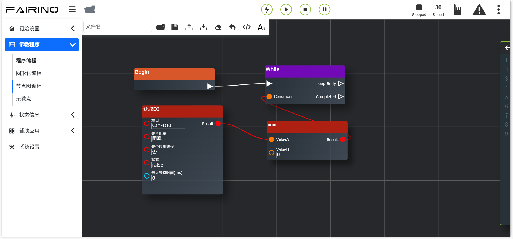

.. centered:: 圖表 11.29-2 「取得DI」指令節點介面

模擬AI命令
----------------

點擊「設定AO」/「取得AI」指令節點，進入節點圖編輯介面。

在該指令中，分為設定模擬輸出（SetAO/SPLCSetAO）和取得模擬輸入（GetAI/SPLCGetAI）兩部分功能。

1.「設定AO」指令節點,參數：

- 端口：Ctrl-AO0 ~ Ctrl-AO1(阻塞:SetAO,非阻塞:SPLCSetAO,[0~1]), End-AO0(阻塞:SetToolAO,非阻塞:SPLCSetToolAO,[0])
- 數值(%)：0 ~ 100
- 是否阻塞：阻塞/非阻塞
- 是否應用執行緒：否/是
  
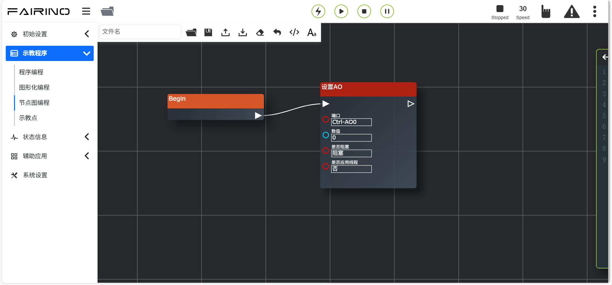

.. centered:: 圖表 11.30-1 「設定AO」指令節點介面
   
2.「取得AI」指令節點,參數：

- 端口：Ctrl-AI0 ~ Ctrl-DI1(阻塞:GetAI,非阻塞:SPLCGetAI,[0~1]), End-AI0(阻塞:GetToolAI,非阻塞:SPLCGetToolAI,[0])
- 條件：大於/小於
- 數值(%)：0 ~ 100
- 最大時間(ms)：0 ~ 10000
- 是否阻塞：阻塞/非阻塞
- 是否應用執行緒：否/是
  
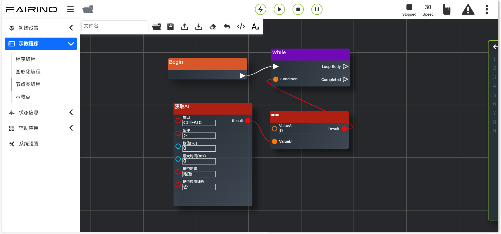

.. centered:: 圖表 11.30-2 「取得AI」指令節點介面

虛擬IO命令節點
----------------

點擊「設定模擬外部DI」/「設定模擬外部AI」指令節點,進入節點圖編輯介面。

該指令虛擬的IO控制指令，可以實現設定模擬外部DI和AI狀態，取得模擬DI和AI狀態。

1.「設定模擬外部DI」指令節點,參數：

- 端口：Vir-Ctrl-DI0 ~ Vir-Ctrl-DI15(SetVirtualDI,[0~15]), Vir-End-DI0 ~ Vir-End-DI1(SetVirtualToolDI,[1~2])
- 狀態：false/true
  
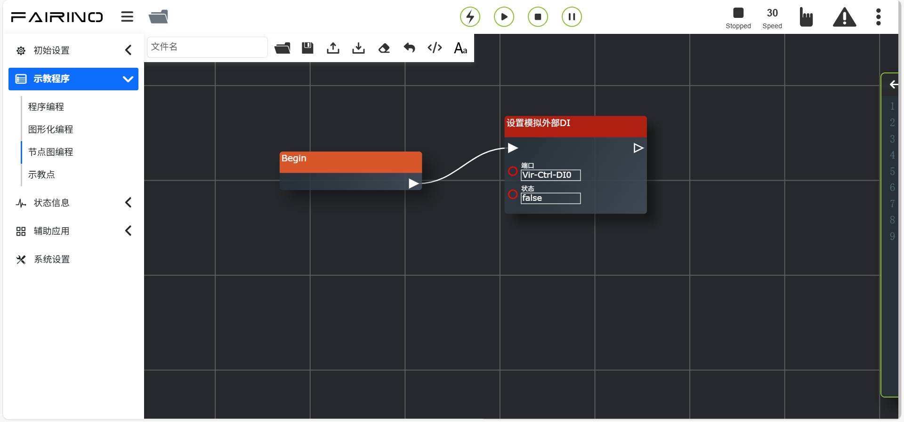

.. centered:: 圖表 11.31-1 「設定模擬外部DI」指令節點介面
   
2.「設定模擬外部AI」指令節點,參數：

- 端口：Vir-Ctrl-AI0 ~ Vir-Ctrl-AI0(SetVirtualAI,[0~1]), Vir-End-AI0(SetVirtualToolAI,[0])
- 數值(v/ma)：0 ~ 20

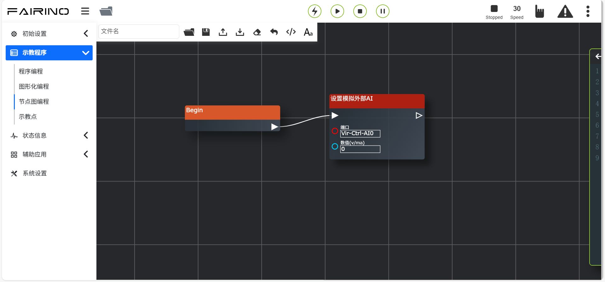

.. centered:: 圖表 11.31-2 「設定模擬外部AI」指令節點介面

擴展IO命令節點
----------------

點擊「取得模擬外部DI」/「取得模擬外部AI」指令節點,進入節點圖編輯介面。

Aux-IO是機器人與PLC通訊控制外部擴展IO的指令功能，需要機器人與PLC建立UDP通訊。

1.「取得模擬外部DI」指令節點,參數：

- 端口：Vir-Ctrl-DI0 ~ Vir-Ctrl-DI15(GetVirtualDI,[0~15]), Vir-End-DI0 ~ Vir-End-DI1(GetVirtualToolDI,[1~2])
  
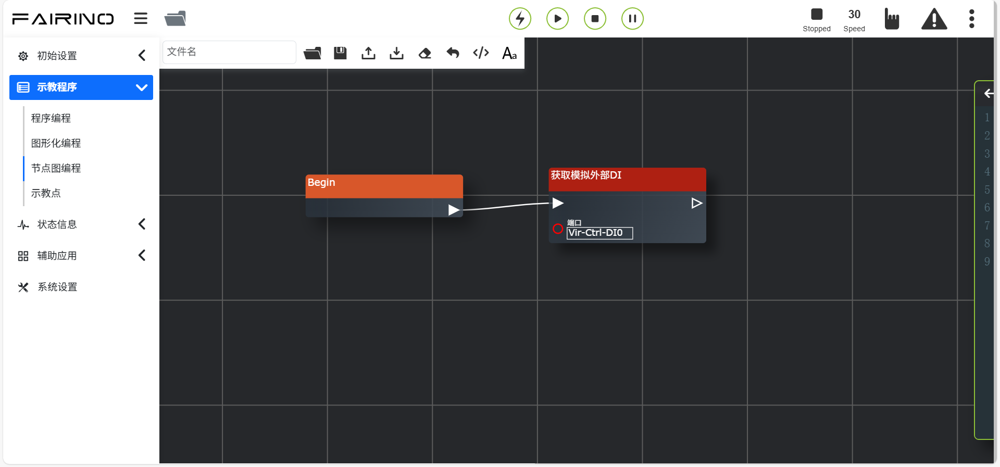

.. centered:: 圖表 11.32-1 「取得模擬外部DI」指令節點介面
   
2.「設定模擬外部AI」指令節點,參數：

- 端口：Vir-Ctrl-AI0 ~ Vir-Ctrl-AI0(GetVirtualAI,[0~1]), Vir-End-AI0(GetVirtualToolAI,[0])

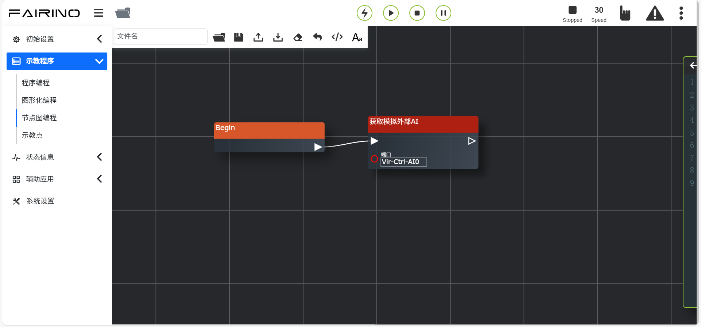

.. centered:: 圖表 11.32-2 「設定模擬外部AI」指令節點介面

3.「配置UDP通信」指令節點,參數：

- ip：ip地址
- 端口：端口號
- 通信週期(ms)：0 ~ 10000

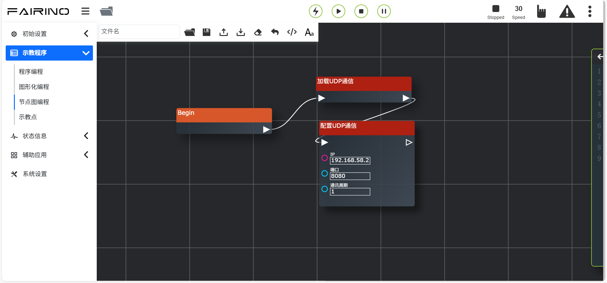

.. centered:: 圖表 11.32-3 「配置UDP通信」指令節點介面

運動DO命令
----------------

點擊「運動DO」指令節點,進入節點圖編輯介面。

該指令實現直線運動過程中，根據設定的間隔，連續輸出DO信號功能。

「運動DO連續輸出」指令節點,參數：

- 端口：Ctrl-DO0 ~ Ctrl-DO0(MoveDOStart,[0~15]), End-DO1(MoveDOStart,[0~1])
- 設定間隔(mm)：0 ~ 500
- 輸出脈衝佔空比(%)：0 ~ 99

「運動DO單次輸出」指令節點,參數：

- 端口：Ctrl-DO0 ~ Ctrl-DO0(MoveDOOnceStart,[0~15]), End-DO1(MoveDOOnceStart,[0~1])
- 輸出模式：勻速段輸出/自由配置
- 置位時間(ms)：0 ~ 1000 (勻速段輸出模式預設為-1)
- 復位時間(ms)：0 ~ 1000 (勻速段輸出模式預設為-1)
  
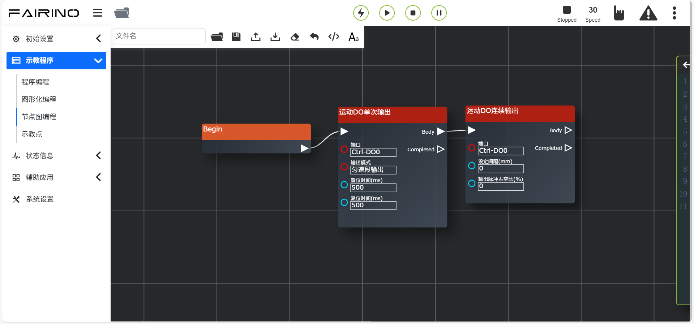

.. centered:: 圖表 11.33-1 「運動DO單次/連續輸出」指令節點介面

座標系命令
----------------

點擊「設定工具座標系」/「設定工件座標系」相關指令節點,進入節點圖編輯介面。

在該指令中，分為「設定工具座標系」和「設定工件座標系」兩部分功能。

選擇工具座標系名稱，點擊「應用」添加該指令到程序中，當程序運行該語句，會設定機器人的工具座標系。

1.「設定工具座標系」指令節點,參數：

- 工具座標系名稱：toolcoord1 ~ toolcoord19(SetToolList,[0~19]), etoolcoord0 ~ etoolcoord14(SetExToolList, [0~14])
  
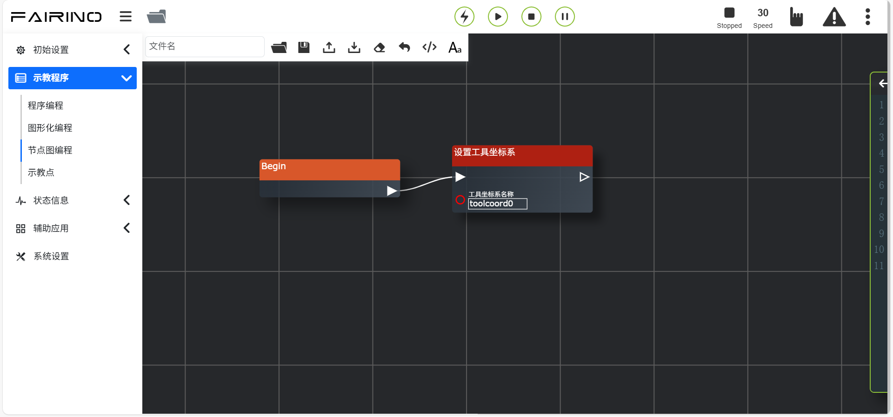

.. centered:: 圖表 11.34-1 「設定工具座標系」指令節點介面

2. 「設定工件座標系」指令節點,參數：

- 工件座標系名稱：wobjcoord1 ~ wobjcoord14
  
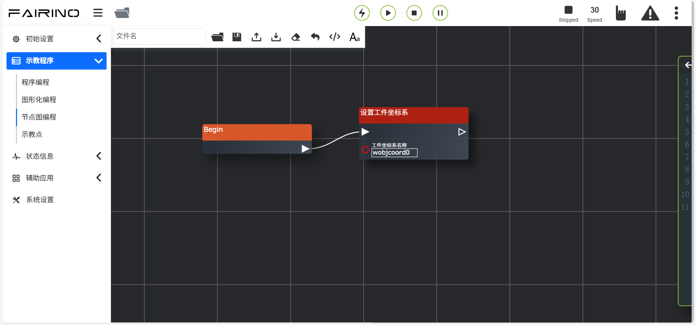

.. centered:: 圖表 11.34-2 「設定工件座標系」指令節點介面

模式切換命令
----------------

點擊「模式切換」指令節點，進入節點圖編輯介面。

該指令可切換機器人到手動模式，通常在一個程序結尾處添加，以便使用者在程序運行結束後，使機器人自動切換到手動模式，拖動機器人。

「模式切換」指令節點,參數：

- 模式切換：手動模式

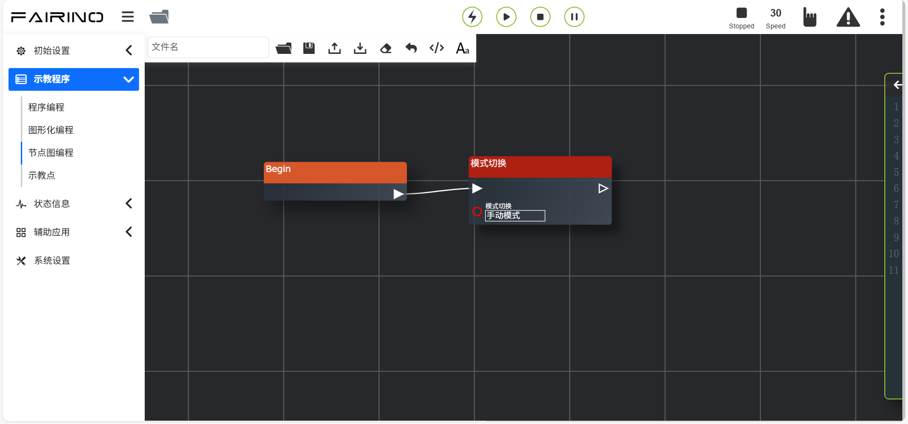

.. centered:: 圖表 11.35-1 「模式切換」指令節點介面

碰撞等級命令
----------------

點擊「碰撞等級」指令節點，進入節點圖編輯介面。

該指令碰撞等級設定，透過該指令可以在程序運行中即時調節各軸碰撞等級，更靈活的部署應用場景。

「碰撞等級」指令節點,參數：

- 標準等級：標準等級/自訂百分比
- joint1-joint6(N)：0 ~ 100，碰撞閾值，陣列型

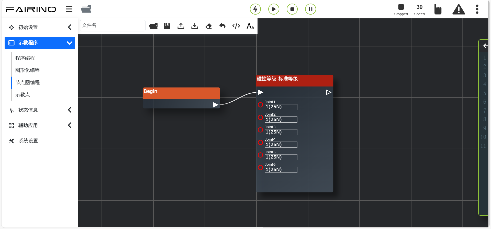

.. centered:: 圖表 11.36-1 「碰撞等級」指令節點介面

加速度命令
----------------

點擊「加速度」指令節點，進入節點圖編輯介面。

「加速度」命令是實現機器人加速度可單獨設定功能，透過調節運動指令加速度縮放因子，可以增加或減小加減速時間，實現機器人動作節拍時間可調。

「加速度」指令節點,參數： 

- 加速度百分比(%)：0 ~ 100

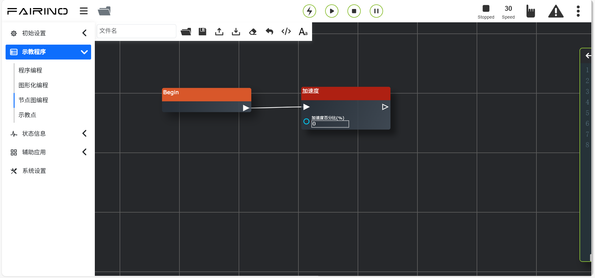

.. centered:: 圖表 11.37-1 「加速度」指令節點介面

夾爪指令
-----------------

該指令分為「夾爪運動」、「夾爪激活」和「夾爪復位」。

指令中，顯示完成配置並且已被激活的夾爪編號，對夾爪開閉、開閉速度和開閉力矩的設定，數值為百分比，是否阻塞功能選項，選擇阻塞即夾爪運動需等待上一條運動指令執行完才執行，選擇非阻塞即夾爪運動與上一條運動指令並行。

「夾爪運動」節點,參數：

- 夾爪編號：已被激活的夾爪編號
- 夾爪位置：0~100
- 開閉速度：0~100
- 開閉力矩：0~100
- 最大時間(ms)：0~30000
- 是否阻塞：false/true

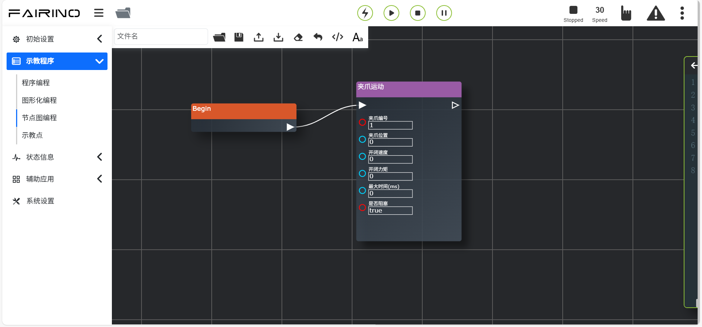

.. centered:: 圖表 11.38-1 「夾爪運動」節點介面

夾爪復位指令，顯示已經配置的夾爪編號，可以添加夾爪復位指令到程序中。

「夾爪復位」節點,參數：

- 夾爪編號：已被激活的夾爪編號

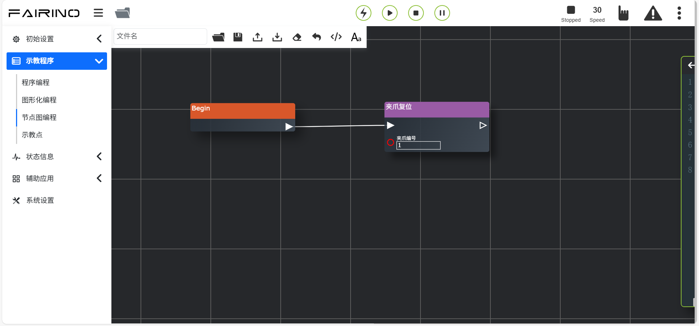

.. centered:: 圖表 11.38-2 「夾爪復位」節點介面

夾爪激活指令，顯示已經配置的夾爪編號，可以添加夾爪激活指令到程序中。

「夾爪激活」節點,參數：

- 夾爪編號：已被激活的夾爪編號

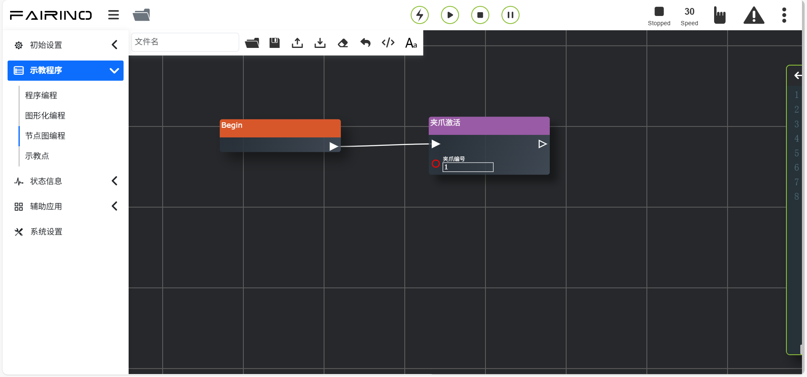

.. centered:: 圖表 11.38-3 「夾爪激活」節點介面

噴槍指令
-----------------

該指令為噴塗相關指令，控制噴槍「開始噴塗」、「停止噴塗」、「開始清槍」和「停止清槍」。在編輯該程序相關節點時，需確認已經配置好噴槍外設，否則無法儲存。詳見機器人外設章節。

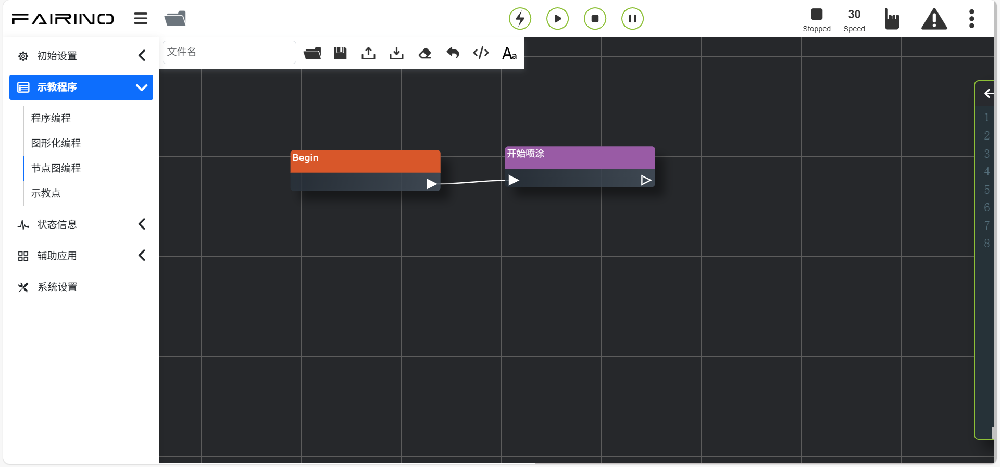

.. centered:: 圖表 11.39-1 「開始噴塗」指令節點介面

.. centered:: 圖表 11.39-2 「停止噴塗」指令節點介面

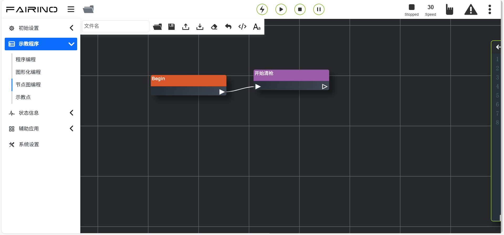

.. centered:: 圖表 11.39-3 「開始清槍」指令節點介面

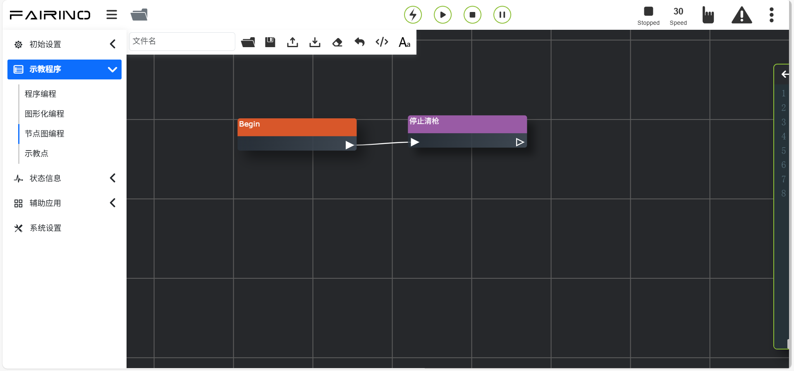

.. centered:: 圖表 11.39-4 「停止清槍」指令節點介面

擴展軸指令（控制器+PLC）
----------------------------------

該指令針對使用外部軸的場景，與PTP指令組合使用，可將空間上一點X軸方向上的移動分解到外部軸運動。選擇外部軸編號，運動方式選同步，選擇需要到達的點。

分為UDP通訊載入/配置、非同步運動、同步PTP/LIN運動、同步ARC運動、回零指令和致能指令。

「UDP通訊配置」指令節點,輸入IP地址、埠號和通訊週期。

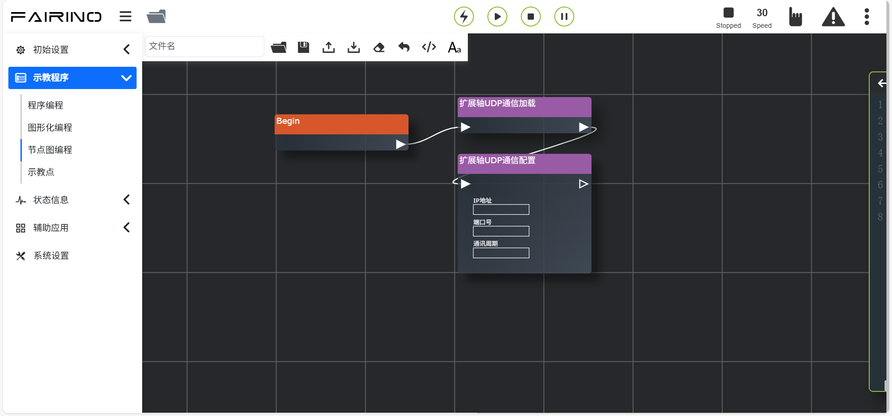

.. centered:: 圖表 11.40-1 「UDP通訊配置」指令節點介面

「非同步運動」指令節點,參數：

- 點名稱：示教點位
- 調試速度(%)：0~100

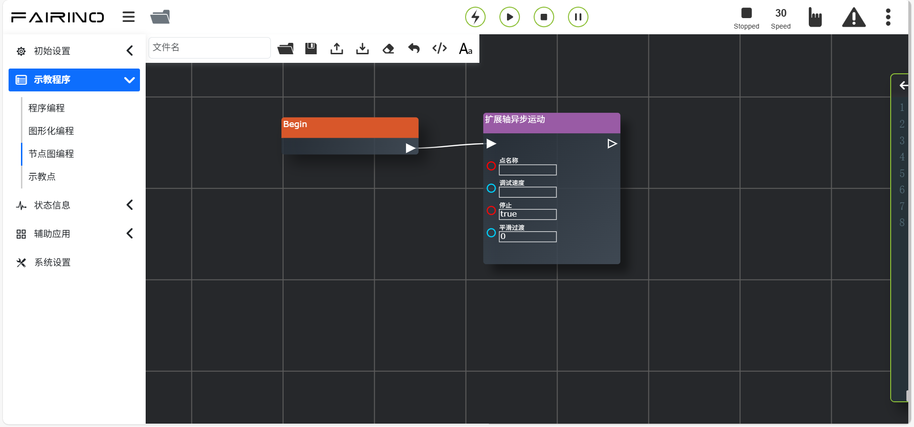

.. centered:: 圖表 11.40-2 「非同步運動」指令節點介面

「同步PTP/LIN運動」指令節點,參數：

- 運動選擇：PTP/LIN
- 點名稱：示教點位
- 調試速度(%)：0~100

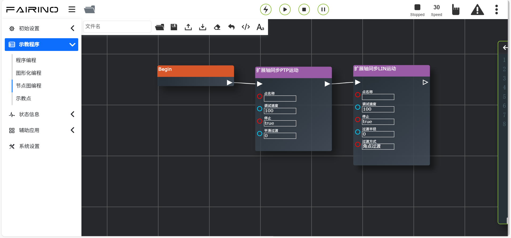

.. centered:: 圖表 11.40-3 「同步PTP/LIN運動」指令節點介面

「同步ARC運動」指令節點,預設運動方式為ARC,參數：

- 點名稱：示教點位
- 調試速度(%)：0~100

.. centered:: 圖表 11.40-4 「同步ARC運動」指令節點介面

「回零」指令節點,,參數：

- 擴展軸編號：1~4
- 回零方式：目前位置回零/負限位回零/正限位回零
- 尋零速度：0~2000，預設位5
- 零點箍位速度：0~2000，預設為1

.. centered:: 圖表 11.40-5 「回零」指令節點介面

「致能」指令節點,,參數：

- 擴展軸編號：1~4

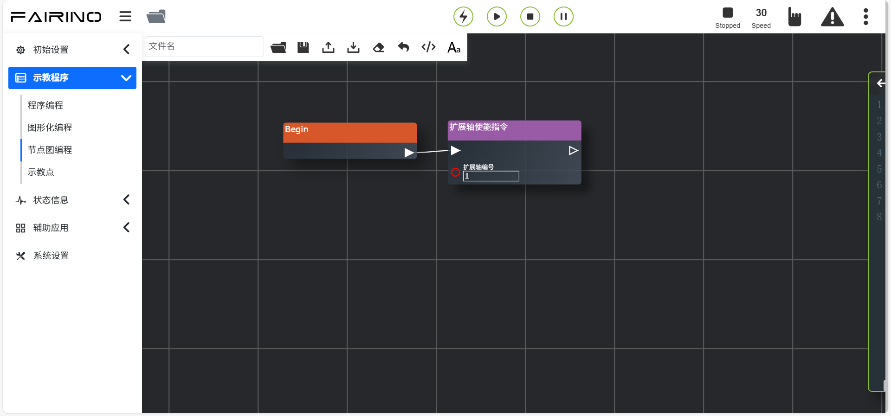

.. centered:: 圖表 11.40-6 「致能」指令節點介面

擴展軸指令（控制器+伺服驅動器）
----------------------------------

該指令可對擴展軸參數進行配置。根據不同的控制模式設定不同的參數。已配置好的擴展軸，可對其零點設定。

分為伺服ID、控制模式、伺服致能和伺服回零；控制模式中又分為位置模式和速度模式，這兩個節點需要結合控制模式使用，否則單獨加入無法生效。

「伺服ID」指令節點,,參數：

- 伺服ID：1~15

.. centered:: 圖表 11.41-1 「伺服ID」指令節點介面

「控制模式」指令節點,,參數：

- 伺服ID：1~15
- 控制模式：位置模式/速度模式

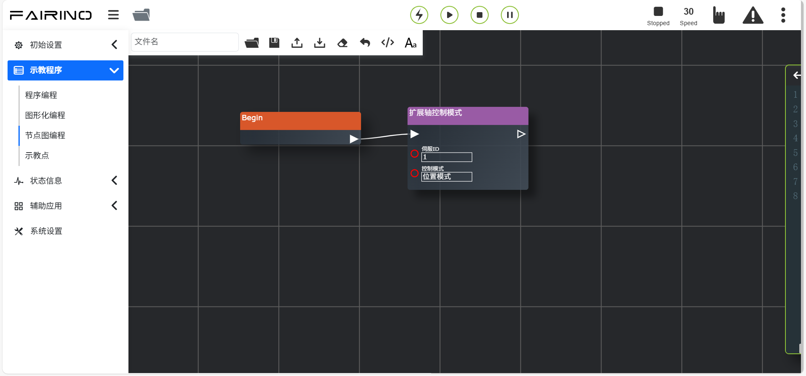

.. centered:: 圖表 11.41-2 「控制模式」指令節點介面

「伺服致能」指令節點,參數：

- 伺服ID：1~15
- 伺服致能：伺服致能/去除致能

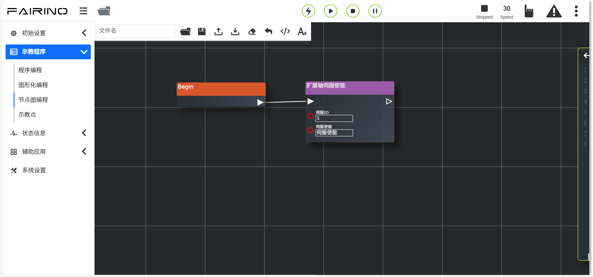

.. centered:: 圖表 11.41-3 「伺服致能」指令節點介面

「伺服回零」指令節點,,參數：

- 伺服ID：1~15
- 回零方式：目前位置回零/負限位回零/正限位回零
- 尋零速度：0~2000，預設位5
- 零點箍位速度：0~2000，預設為1
- 加速度百分比：1~100

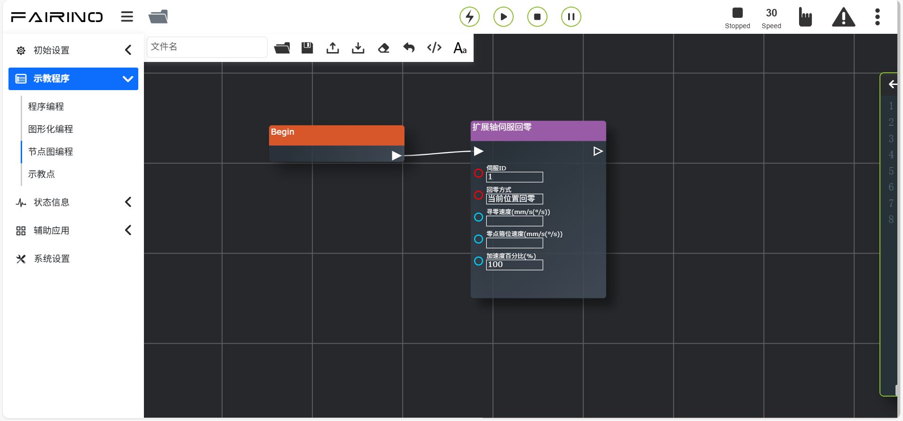

.. centered:: 圖表 11.41-4 「伺服回零」指令節點介面

「位置模式」指令節點,參數：

- 伺服ID：1~15
- 目標位置：無限制
- 尋零速度：無限制
- 加速度百分比：1~100

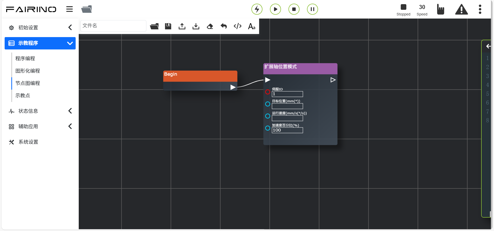

.. centered:: 圖表 11.41-5 「位置模式」指令節點介面

「速度模式」指令節點,參數：

- 伺服ID：1~15
- 目標速度：無限制
- 加速度百分比：1~100

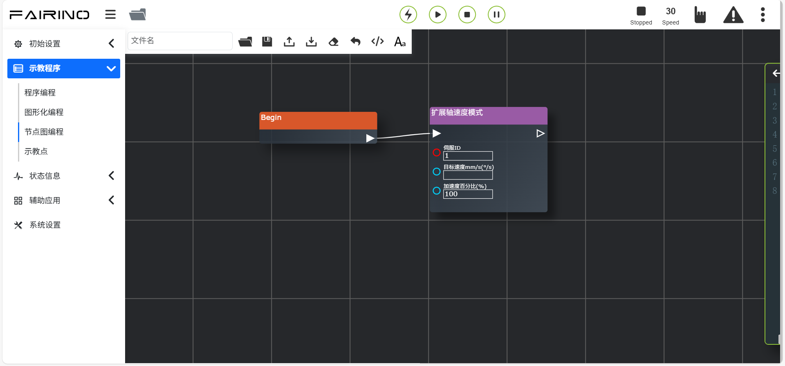

.. centered:: 圖表 11.41-6 「速度模式」指令節點介面

輸送帶指令
----------------------------------

該指令包含IO即時檢測，位置即時檢測，追蹤開啟和追蹤關閉四條命令。詳見機器人外設章節。

「IO即時檢測」指令節點,參數：

- 最大等待時間：0~10000

.. centered:: 圖表 11.42-1 「IO即時檢測」指令節點介面

「位置即時檢測」指令節點,參數：

- 工作模式：追蹤抓取/追蹤運動/TPD追蹤

.. centered:: 圖表 11.42-2 「位置即時檢測」指令節點介面

「追蹤開啟」指令節點,參數：

- 工作模式：追蹤抓取/追蹤運動/TPD追蹤

.. centered:: 圖表 11.42-3 「追蹤開啟」指令節點介面

.. centered:: 圖表 11.42-4 「追蹤關閉」指令節點介面

打磨指令
----------------------------------

該指令用於打磨場景的使用，使用時需要先卸載驅動再載入驅動，然後設定打磨設備致能。進而設定打磨設備的轉速、接觸力、伸出距離和控制模式，同時可以對打磨設備錯誤清除和設備力感測器歸零。

.. centered:: 圖表 11.43-1 「通訊驅動卸載」指令節點介面

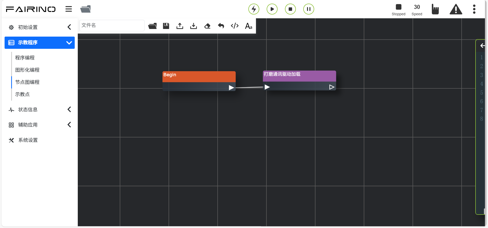

.. centered:: 圖表 11.43-2 「通訊驅動載入」指令節點介面

「設備致能」指令節點,參數：

- 設備致能：上致能/下致能

.. centered:: 圖表 11.43-3 「設備致能」指令節點介面

.. centered:: 圖表 11.43-4 「設備錯誤清除」指令節點介面

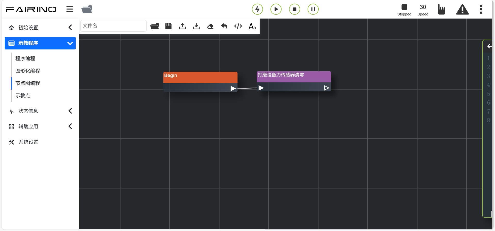

.. centered:: 圖表 11.43-5 「設備力感測器歸零」指令節點介面

「轉速」指令節點,參數：

- 轉速：0~5500

.. centered:: 圖表 11.43-6 「轉速」指令節點介面

「接觸力」指令節點,參數：

- 接觸力：0~200

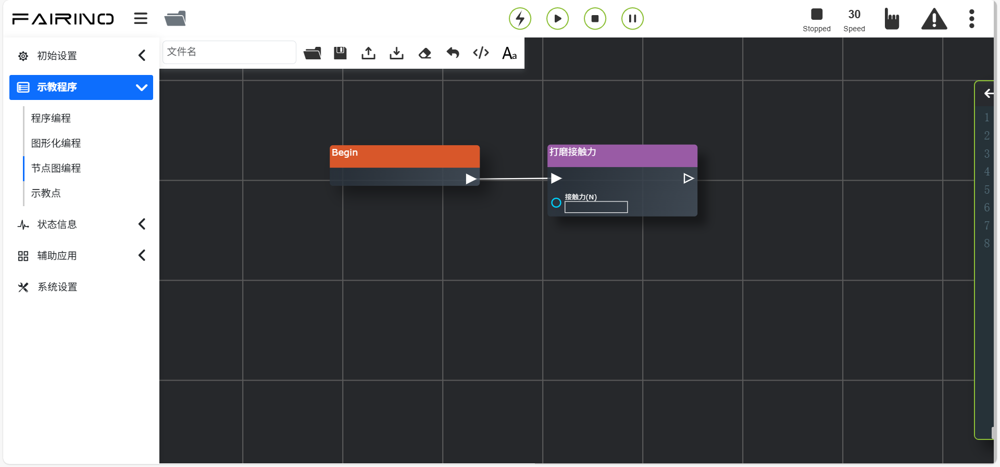

.. centered:: 圖表 11.43-7 「接觸力」指令節點介面

「伸出距離」指令節點,參數：

- 伸出距離：0~12

.. centered:: 圖表 11.43-8 「伸出距離」指令節點介面

「控制模式」指令節點,參數：

- 控制模式：回零模式/位置模式/力矩模式

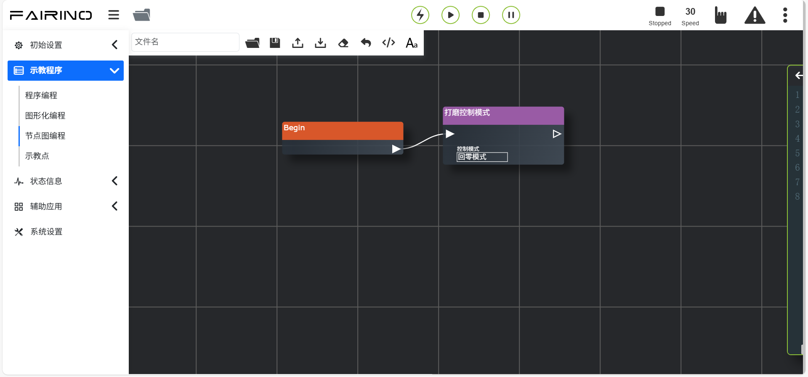

.. centered:: 圖表 11.43-9 「控制模式」指令節點介面

焊接指令
----------

點擊「焊接相關指令節點，進入節點圖編輯介面。

該指令主要用於焊機外設，在加入該指令前請確認在用戶外設中焊機配置是否完成，詳見機器人外設章節。

1.「焊機電壓」指令節點,參數：

- 焊機電壓：最小值為0

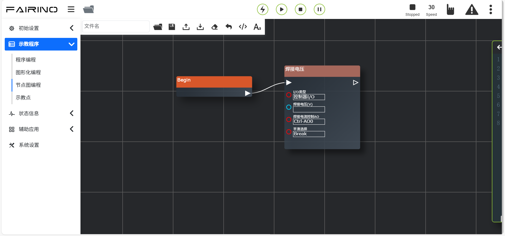

.. centered:: 圖表 11.44-1 「焊機電壓」指令節點介面

2.「焊機電流」指令節點,參數：

- 焊機電流：最小值為0

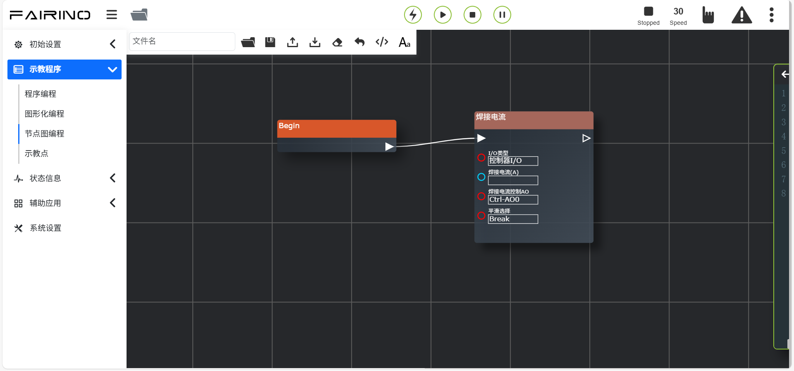

.. centered:: 圖表 11.44-2 「焊機電流」指令節點介面

3.「收弧/起弧」指令節點,參數：

- I/O類型：控制器IO/擴展IO
- 焊接工藝編號： 0 ~ 7
- 最大等待時間(ms)：0 ~ 10000

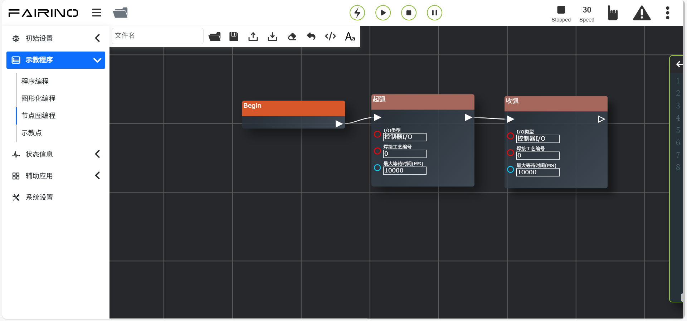

.. centered:: 圖表 11.44-3 「收弧/起弧」指令節點介面

4.「送氣/關氣」指令節點,參數：

- I/O類型：控制器IO/擴展IO

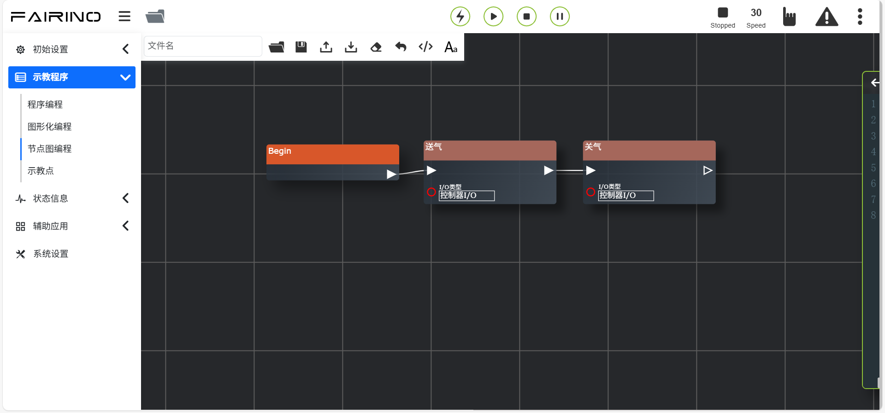

.. centered:: 圖表 11.44-4 「送氣/關氣」指令節點介面

5. 「正向送絲/停止正向送絲」指令節點,參數：

- I/O類型：控制器IO/擴展IO

.. centered:: 圖表 11.44-5 「正向送絲/停止正向送絲」指令節點介面

6. 「反向送絲/停止反向送絲」指令節點,參數：

- I/O類型：控制器IO/擴展IO

.. centered:: 圖表 11.44-6 「反向送絲/停止反向送絲」指令節點介面

段焊指令
----------

該指令為焊接專用指令，主要用於一段焊，一段不焊的循環間斷焊接場景。在起點與終點之間，使用該指令，選擇段焊模式，選擇起點和終點，設定調試速度，設定起弧的DO埠，執行長度，非執行長度，根據實際應用場景設定功能模式，擺動選擇和取整規則即可實現段焊功能，詳細操作可見程序示教頁面段焊指令。

「段焊」指令節點,參數：

- 段焊模式：不變化姿態/變化姿態
- 起始點：示教點位
- 終點：示教點位
- 調試速度(%)：0~100，預設為100
- 執行長度：0~1000
- 非執行長度：0~1000
- 功能模式：0~100，預設為100
- 擺動選擇：執行段不擺動/執行段擺動
- 取整規則：不取整/循環取整/單段取整

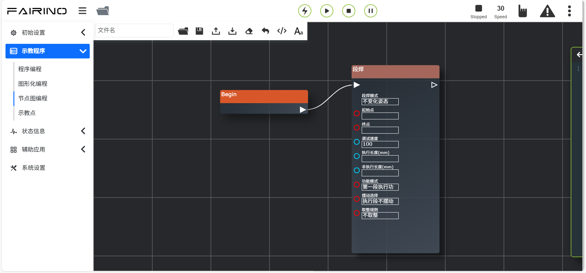

.. centered:: 圖表 11.45-1 「段焊」指令節點介面

雷射追蹤指令
--------------

點擊「雷射追蹤」指令節點，進入節點圖編輯介面。

該指令包含雷射命令、追蹤命令和尋位命令三部分，在加入該指令前，請確認用戶外設中雷射追蹤感測器是否已經配置成功。詳見機器人外設章節。

1. 「開啟/關閉感測器」指令節點，參數：

- 選擇焊縫類型：0 ~ 49
  
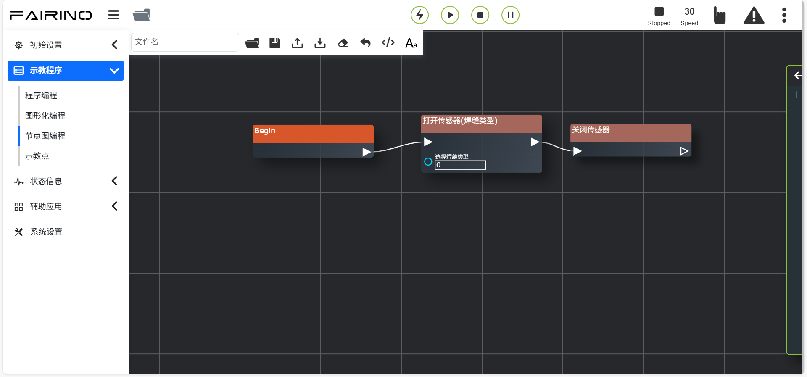

.. centered:: 圖表 11.46-1 「開啟/關閉感測器」指令節點介面——焊縫類型

- 選擇任務號：0 ~ 255
  
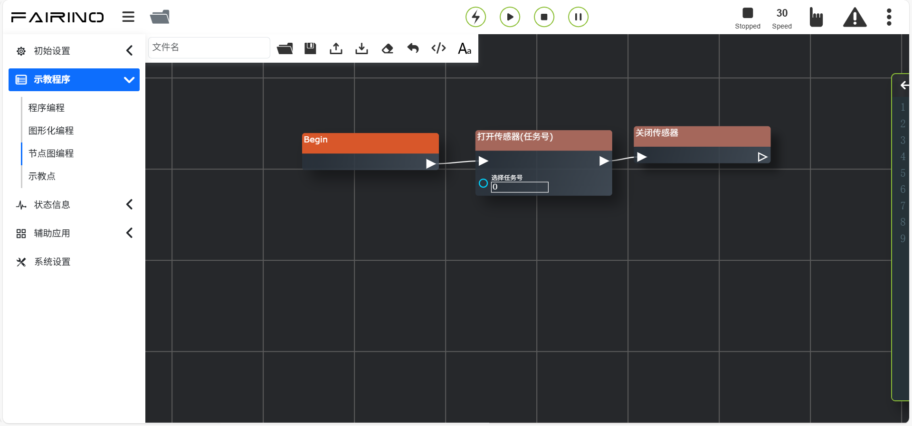

.. centered:: 圖表 11.46-2 「開啟/關閉感測器」指令節點介面——任務號

2. 「載入/卸載感測器」指令節點，參數：

- 功能選擇：睿牛RRT-SV2-BP/創想CXZK-RBTA4L
  

.. centered:: 圖表 11.46-3 「載入/卸載感測器」指令節點介面

3. 「開始/停止追蹤」指令節點，參數：

- 座標系名稱：自訂配置座標系
  
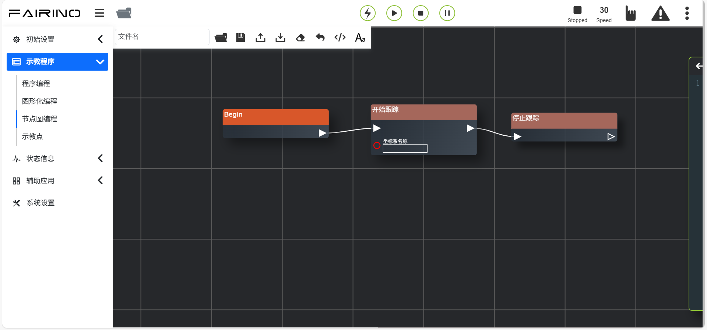

.. centered:: 圖表 11.46-4 「開始/停止追蹤」指令節點介面

4. 「資料記錄」指令節點，參數：

- 功能選擇：停止記錄/即時追蹤/開始記錄/軌跡復現
- 等待時間(ms)： 0 ~ 10000
  
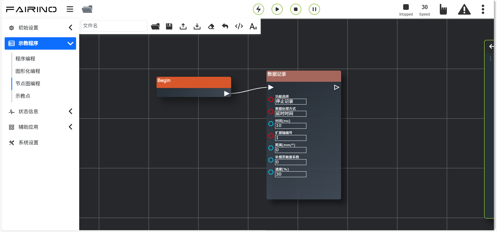

.. centered:: 圖表 11.46-5 「資料記錄」指令節點介面

5. 「雷射追蹤復現」指令節點，參數：
  
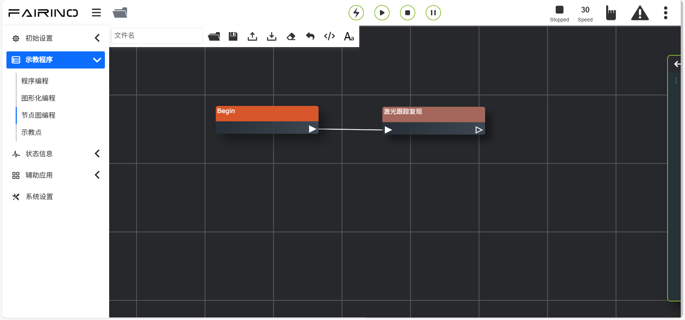

.. centered:: 圖表 11.46-6 「雷射追蹤復現」指令節點介面

6. 「感測器取點運動」指令節點，參數：

- 座標系名稱：自訂配置座標系
- 運動方式： PTP/Lin
- 調試速度(%)： 0 ~ 100
  
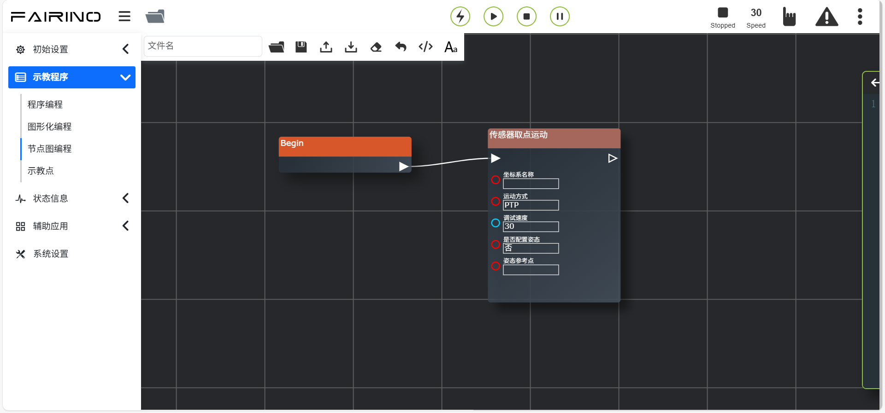

.. centered:: 圖表 11.46-7 「感測器取點運動」指令節點介面

7. 「尋位開始/結束」指令節點，參數：

- 座標系名稱：自訂配置座標系
- 方向： -x/-x/-y/-y/-z/-z/指定方向
- 方向點：未選擇「指定方向」時，參數失效
- 速度(%)：0 ~ 100
- 長度(mm)：0 ~ 1000
- 最大尋位時間(ms)：0 ~ 10000
  
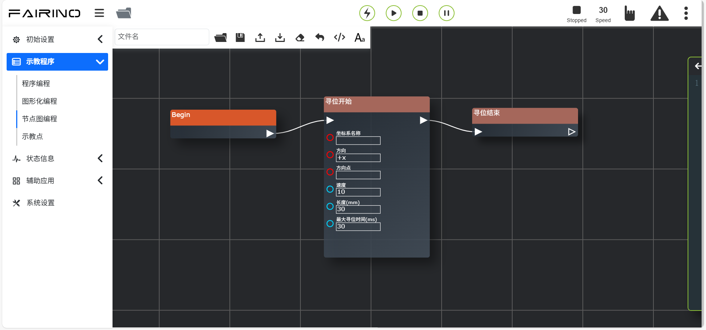

.. centered:: 圖表 11.46-8 「尋位開始/結束」指令節點介面

雷射記錄指令
----------------------------------

該指令實現雷射追蹤記錄起點、終點取出功能，使機器人可以自動運動到起點位置，適用於從工件外部開始運動並進行雷射追蹤記錄的場合，同時上位機可取得記錄資料中起點、終點的資訊，用於後續運動。

實現雷射追蹤復現速度可調功能，使機器人可以用一個很快的速度進行記錄，然後按照正常焊接速度進行復現，可以提高作業效率。

「焊縫資料記錄」指令節點,參數：

- 功能選擇：停止記錄/即時追蹤/開始記錄/軌跡復現
- 等待時間(ms)：0~10000，預設為10
- 速度(%)：0~100，預設為30，選擇軌跡復現時，該參數生效

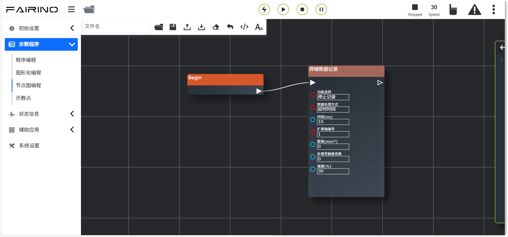

.. centered:: 圖表 11.47-1 「焊縫資料記錄」指令節點介面

「取得焊縫起點/終點」指令節點,參數：

- 運動方式：PTP/LIN
- 速度(%)：0~100，預設為30

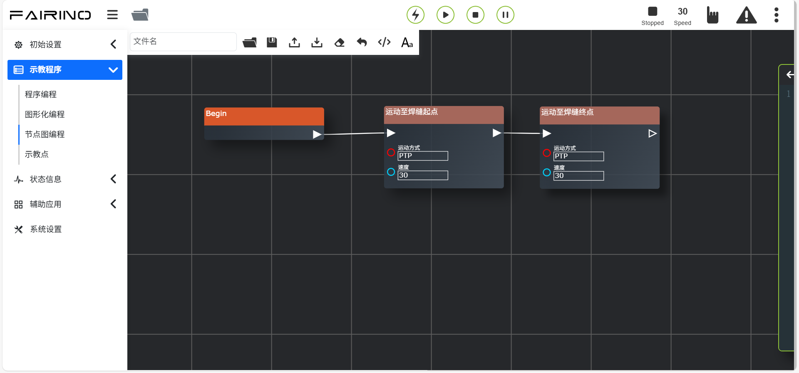

.. centered:: 圖表 11.47-2 「取得焊縫起點/終點」指令節點介面

焊絲尋位指令
------------------

該指令一般應用於焊接場景中，需要焊機與機器人IO和運動指令相結合使用。分為尋位開始、尋位結束、尋位點設置、計算偏移量和接觸點數據寫入。

「焊絲尋位開始/結束」指令節點,參數：

- 基準位置：不更新/更新
- 尋位速度：0~100
- 尋位距離：0~1000
- 自動返回標誌：不自動返回/自動返回
- 自動返回速度：0~100
- 自動返回距離：0~1000
- 尋位方式：示教點尋位/帶偏移量尋位

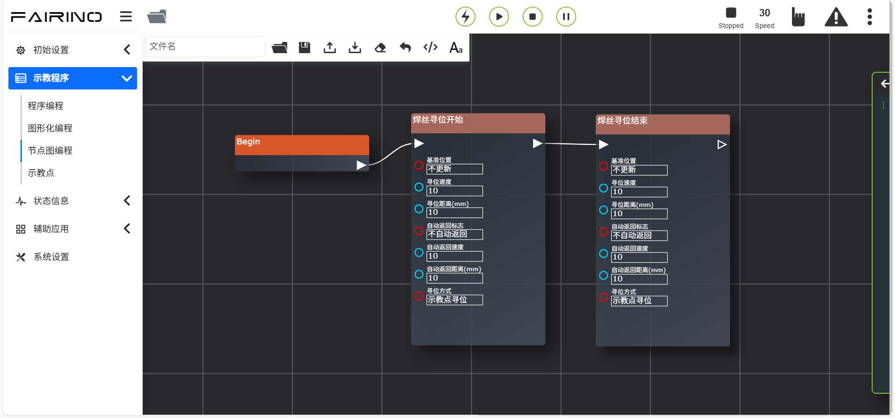

.. centered:: 圖表 11.48-1 「焊絲尋位開始/結束」指令節點界面

尋位點設置根據焊縫類型和計算方法添加點位。

- 當類型為角焊縫，計算方法為1D（xyz中的一個）時，點位添加從a點、b點中選擇
- 當類型為角焊縫，計算方法為2D（xyz中的兩個）時，點位添加從a點、b點、e點、f點中選擇
- 當類型為角焊縫，計算方法為3D（xyz）時，點位添加從a點、b點、c點、d點、e點、f點中選擇
- 當類型為角焊縫，計算方法為2D-（xyz中的兩個，rxryrz中的一個）時，點位添加從a點、b點、c點、d點、e點、f點中選擇
- 當類型為內外徑，計算方法為2D2D（xyz中的兩個）時，點位添加從a點、b點中選擇
- 當類型為點，計算方法為3D（xyz）時，點位添加從a點、b點、c點、d點、e點、f點中選擇
- 當類型為相機，計算方法為3D-（xyzrxryrz）時，點位添加從a點、b點中選擇
- 當類型為面，計算方法為3D-（xyzrxryrz）時，點位添加從a點、b點中選擇

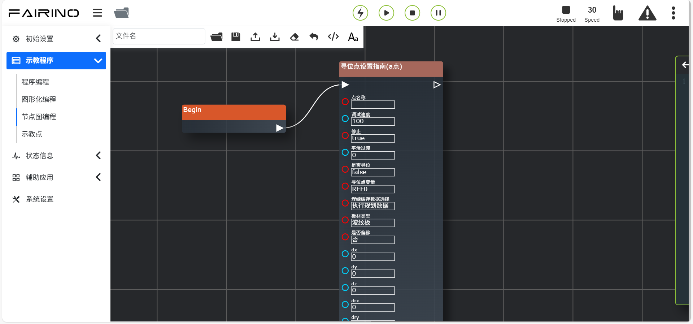

.. centered:: 圖表 11.48-2 「尋位點設置」指令節點界面

計算偏移量根據焊縫類型和計算方法設置基準點和接觸點。

- 當類型為角焊縫，計算方法為1D（xyz中的一個）時，設置基準點1、接觸點1
- 當類型為角焊縫，計算方法為2D（xyz中的兩個）時，設置基準點1、基準點2、接觸點1、接觸點2
- 當類型為角焊縫，計算方法為3D（xyz）時，設置基準點1、基準點2、基準點3、接觸點1、接觸點2、接觸點3
- 當類型為角焊縫，計算方法為2D-（xyz中的兩個，rxryrz中的一個）時，設置基準點1、基準點2、基準點3、接觸點1、接觸點2、接觸點3
- 當類型為內外徑，計算方法為2D2D（xyz中的兩個）時，設置基準點1、基準點2、基準點3、接觸點1、接觸點2、接觸點3
- 當類型為點，計算方法為3D（xyz）時，設置接觸點1、接觸點2
- 當類型為相機，計算方法為3D-（xyzrxryrz）時，設置接觸點1、接觸點2
- 當類型為面，計算方法為3D-（xyzrxryrz）時，設置接觸點1、接觸點2、接觸點3、接觸點4、接觸點5、接觸點6

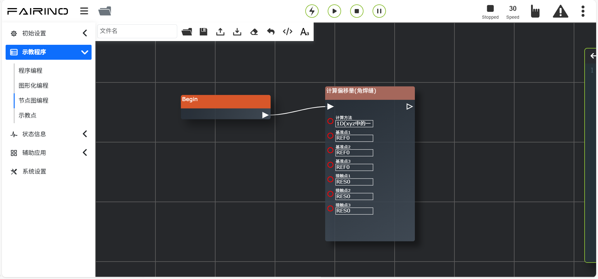

.. centered:: 圖表 11.48-3 「計算偏移量」指令節點界面

「接觸點數據寫入」指令節點,參數：

- 接觸點名稱：RES0~99
- 接觸點名稱：數據格式為{0,0,0,0,0,0}

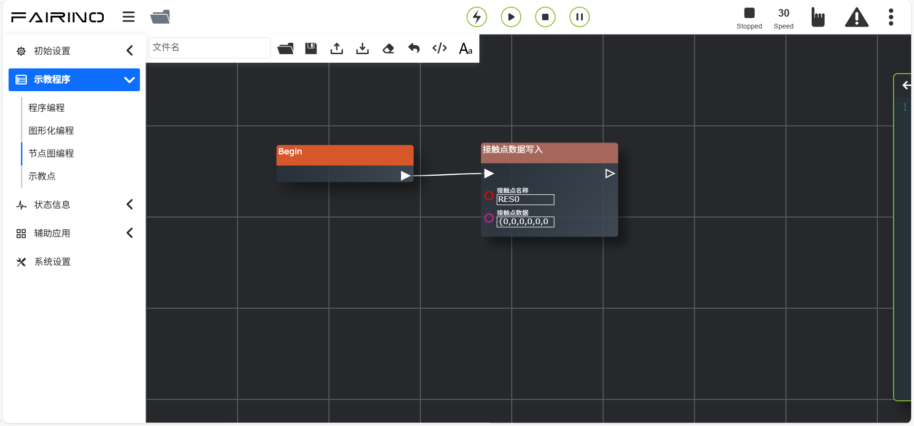

.. centered:: 圖表 11.48-4 「接觸點數據寫入」指令節點界面

電弧追蹤指令
------------------

點擊「電弧追蹤」指令節點，進入節點圖編輯界面。

該指令實現機器人焊縫追蹤利用焊縫的偏差檢測進行補償軌跡，可以使用電弧感測器來檢測焊縫偏差。

「電弧追蹤開啟/關閉」指令節點,參數：

- 電弧追蹤滯後時間(ms)：參考值 50
- 偏差補償：關閉/開啟
- 調節係數：0 ~ 300
- 補償時間(cyc)：0 ~ 300
- 每次最大補償量(mm)：0 ~ 300
- 總計最大補償量(mm)：0 ~ 300
- 上下座標系選擇：擺動
- 上下基準電流設定方式：回饋/常數
- 上下基準電流(A)：0 ~ 300

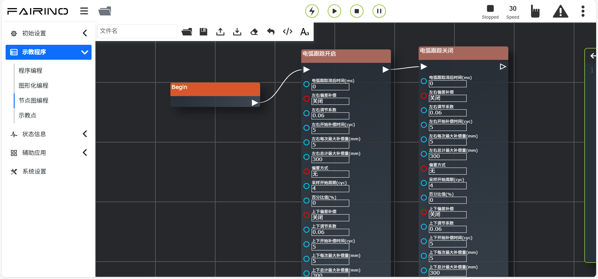

.. centered:: 圖表 11.49-1 「電弧追蹤開啟/關閉」指令節點界面

姿態調整指令
------------------

點擊「姿態調整」相關指令節點，進入節點圖編輯界面。

該指令針對焊接追蹤自適應調整焊槍姿態場景，需要先示教PosA、PosB、PosC三個點位，否則無法添加節點。

記錄好三個對應的姿態點後，根據機器人實際運動方向，添加姿態自適應調整指令。詳見機器人外設章節。

「開啟姿態調整」指令節點,參數：

- 板材類型： 波紋板/瓦楞板/圍欄板/波紋甲殼鋼
- 運動方向：從左至右/從右至左
- 姿態調整時間(ms)：0 ~ 1000
- 第一段長度(mm)：
- 拐點類型：由上往下/由下往上
- 第二段長度(mm)：
- 第三段長度(mm)：
- 第四段長度(mm)：
- 第五段長度(mm)：

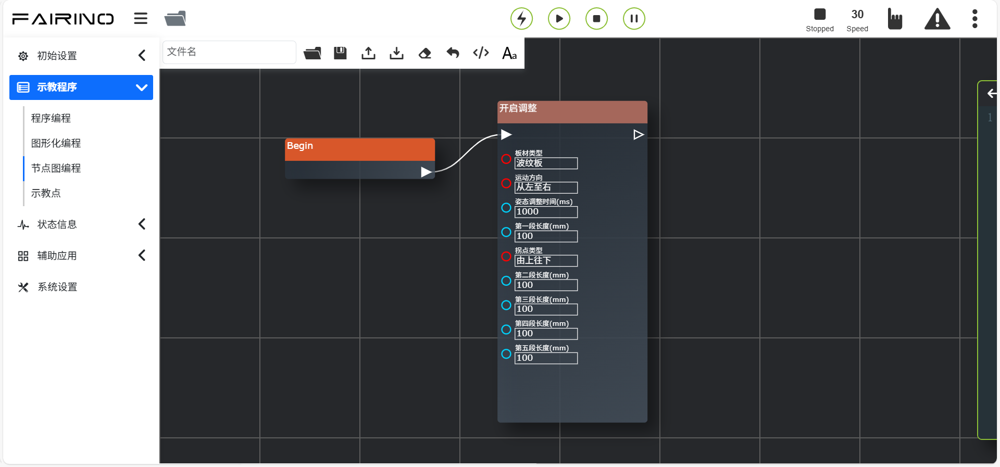

.. centered:: 圖表 11.50-1 「開啟姿態調整」指令節點界面

「關閉姿態調整」指令節點,參數：

- 板材類型： 波紋板/瓦楞板/圍欄板/波紋甲殼鋼

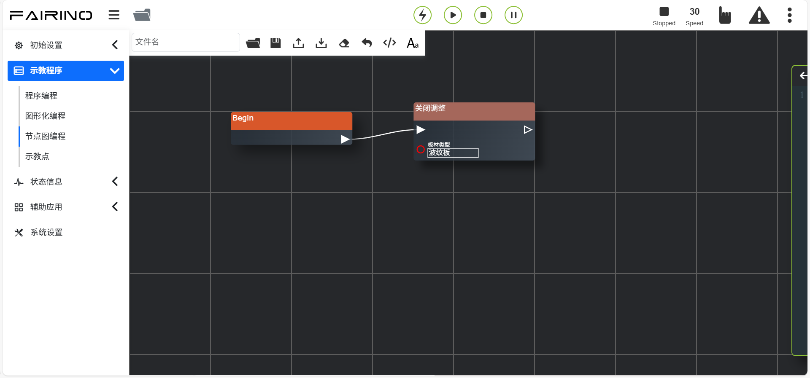

.. centered:: 圖表 11.50-2 「關閉姿態調整」指令節點界面

力控命令
----------------

點擊「力控」指令相關指令節點，進入節點圖編輯界面。

該指令包含FT_Guard(碰撞檢測)，FT_Control(恆力控制)，FT_Compliance(柔順控制)，FT_Spiral(螺旋插入)，FT_Rot(旋轉插入)，FT_Lin(直線插入)，FT_FindSurface(表面定位) ，FT_CalCenter(中心定位)八個指令，詳見機器人外設章節。

1. 「開啟/關閉碰撞檢測」指令節點,參數: 

- 座標系名稱：自定義配置的座標系
- Fx-Tx真值：true/false
- Fx-Tx當前值：根據實際情況輸入
- Fx-Tx最大閾值：根據實際情況輸入
- Fx-Tx最小閾值：根據實際情況輸入

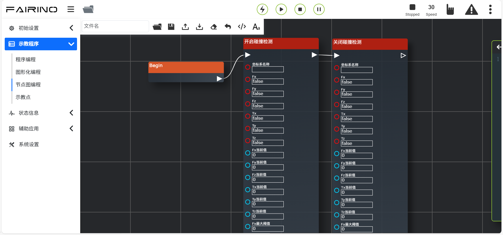

.. centered:: 圖表 11.51-1 「開啟/關閉碰撞檢測」指令節點界面

2. 「開啟/關閉控制」指令節點,參數： 

- 座標系名稱：自定義配置的座標系
- Fx-Tx真值：true/false
- Fx-Tx當前值：根據實際情況調整
- F_P_gain - F_D_gain：根據實際情況調整，不能為0
- 自適應啟停狀態：停止/開啟
- ILC控制啟停狀態：停止/訓練/實操
- 最大調整距離(mm)：0 ~ 1000
- 最大調整角度(°)：0 ~ 1000

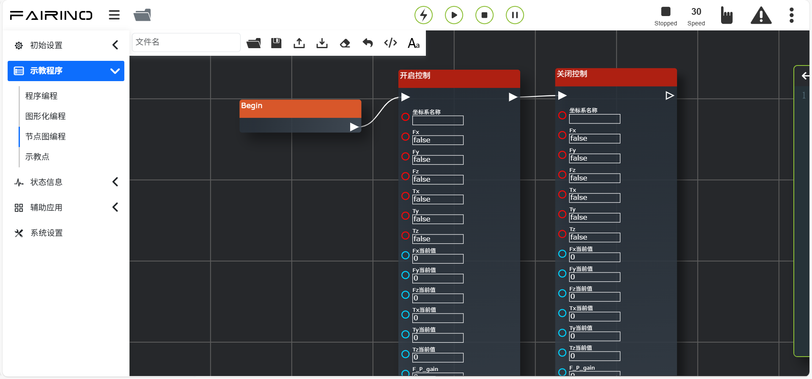

.. centered:: 圖表 11.51-2 「開啟/關閉控制」指令節點界面

3. 「開啟/關閉柔順控制」指令節點,參數：

- 下發位置調節係數：0 ~ 1
- 柔順開啟力閾值(N)：0 ~ 100

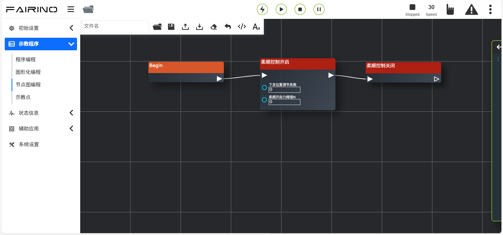

.. centered:: 圖表 11.51-3 「開啟/關閉柔順控制」指令節點界面

4. 「螺旋插入」指令節點,參數：

- 座標系名稱：工具座標系/基座標
- 每圈半徑進給量(mm)：0 ~ 100,參考值：0.7
- 力或力矩閾值(N/Nm)：0 ~ 100,參考值：50
- 最大探索時間(ms)：0 ~ 60000, 參考值：60000
- 線速度最大值(mm/s)：0 ~ 100，參考值：5

.. centered:: 圖表 11.51-4 「螺旋插入」指令節點界面

5. 「旋轉插入」指令節點,參數: 

- 座標系名稱：工具座標系/基座標
- 旋轉角速度(°/s)：0 ~ 100,參考值：0.7
- 觸發力或終止力矩(N/Nm)：0 ~ 100,參考值：50
- 最大旋轉角度(°)：0 ~ 100,參考值：5
- 力的方向：方向z/方向mz
- 最大旋轉角加速度(°/s^2)：0 ~ 100
- 插入方向：正/負

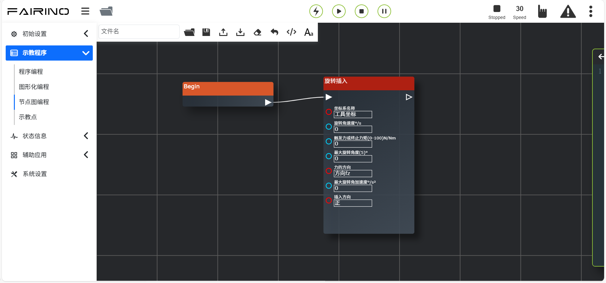

.. centered:: 圖表 11.51-5 「旋轉插入」指令節點界面

6. 「直線插入」指令節點,參數：

- 座標系名稱：工具座標系/基座標
- 動作終止力閾值(N)：0 ~ 100
- 直線速度(mm/s)：0 ~ 100,參考值：1
- 直線加速度(°/s^2)：0 ~ 100
- 最大插入距離(mm)：0 ~ 100
- 插入方向：正/負

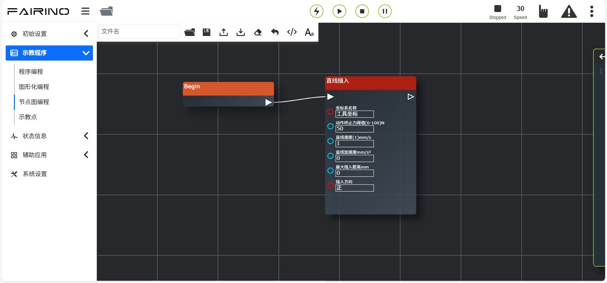

.. centered:: 圖表 11.51-6 「直線插入」指令節點界面

7. 「表面定位」指令節點,參數：

- 座標系名稱：工具座標系/基座標
- 移動方向：正/負
- 移動軸：X/Y/Z
- 探索直線速度(mm/s)：0 ~ 100
- 探索加速度(mm/s^2)：0 ~ 100
- 最大探索距離(mm)：0 ~ 100
- 動作終止力閾值(N)：0 ~ 100

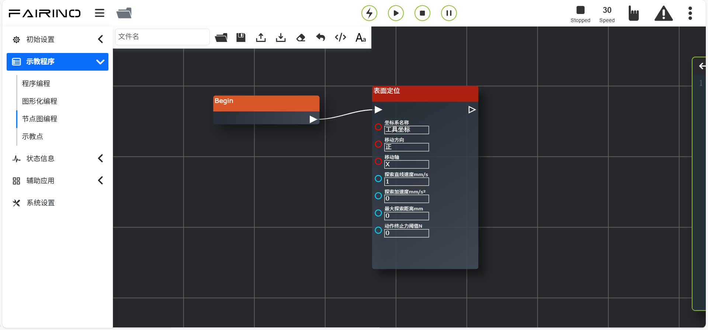

.. centered:: 圖表 11.51-7 「表面定位」指令節點界面

8. 「中間平面開始/結束計算」指令節點

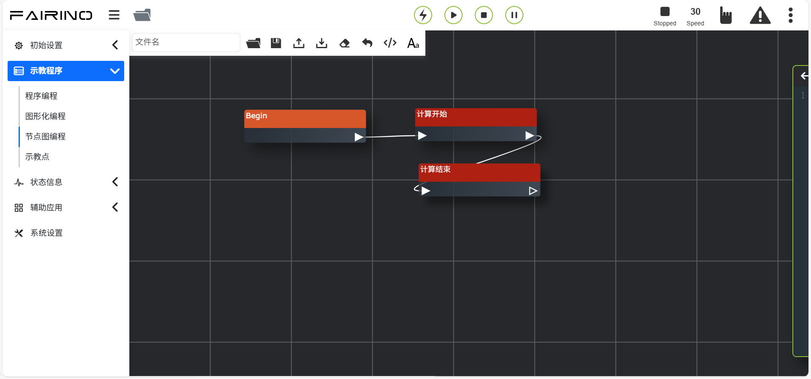

.. centered:: 圖表 11.51-8 「中間平面開始/結束計算」指令節點界面

扭矩記錄命令
----------------

點擊「扭矩記錄」相關指令節點,進入節點圖編輯界面。

該指令為扭矩記錄指令，包含「扭矩記錄開始/「扭矩記錄停止」和「扭矩記錄復位」三種指令。

實現扭矩實時記錄碰撞檢測功能。

點擊「扭矩記錄啟動」按鈕，持續記錄運動指令運行過程中的碰撞情況，記錄的實時扭矩作為碰撞檢測判斷的理論值，以減少誤報錯概率。

當超出設定閾值範圍時，記錄碰撞檢測持續時間。

點擊「扭矩記錄停止」按鈕，停止記錄。點擊「扭矩記錄復位」，狀態恢復默認狀態。

1. 「扭矩記錄開始」指令節點,參數：

- 平滑選擇：不平滑(原始數據)/平滑(平滑後數據)
- 關節負閾值(Nm)：-100 ~ 0
- 關節正閾值(Nm)：0 ~ 100
- 關節持續檢測碰撞時間(ms)：0 ~ 1000

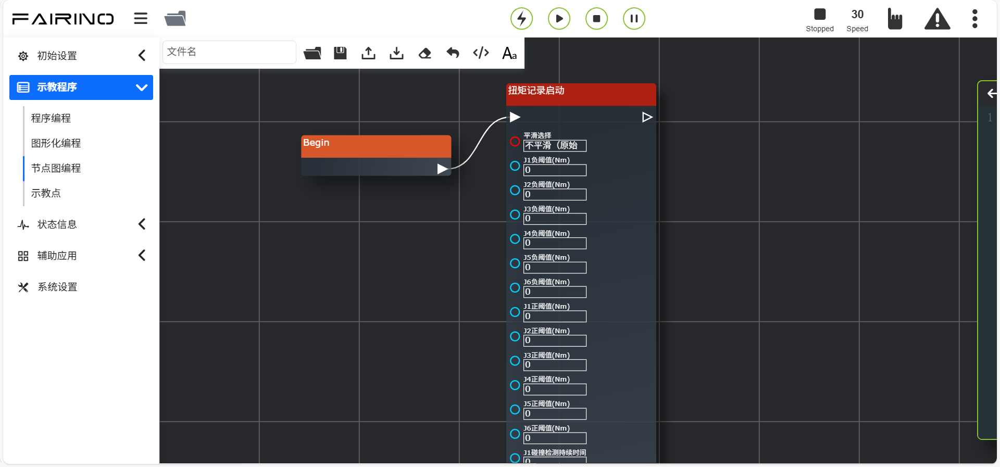

.. centered:: 圖表 11.52-1 「扭矩記錄開始」指令節點界面

2. 「扭矩記錄結束」指令節點

.. centered:: 圖表 11.52-2 「扭矩記錄結束」指令節點界面

3. 「扭矩記錄復位」指令節點

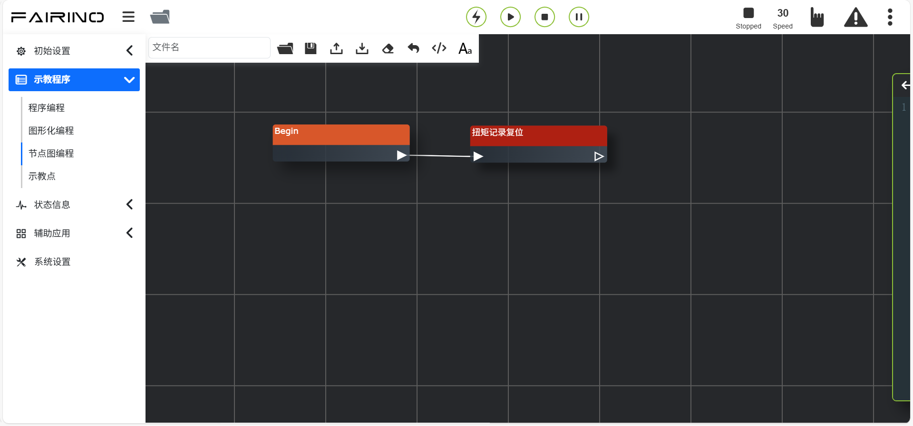

.. centered:: 圖表 11.52-3 「扭矩記錄復位」指令節點界面

Modbus命令
----------------

點擊「Mobus」相關指令節點,進入節點圖編輯界面。

該指令功能為基於ModbusTCP協議的總線功能，用戶可以通過相關指令控制機器人與ModbusTCP client或server通訊（主站與從站通訊），讀數字輸出，數字輸入，寄存器進行讀寫操作。關於ModbusTCP更多操作功能，前請聯繫我們諮詢。

使用modbus節點功能前，需要先在示教程序ModbusTCP配置中配置主站、從站以及DI、DO、AI、AO名稱。

1. 主站數字輸出設置,參數：

- Modbus主站名稱：根據實際情況配置
- DO名稱：根據實際情況配置
- 寄存器數量：整數型 0 ~ 128
- 寄存器值：根據寄存器數量來定，可輸入多個數值。例如數量為3，值為1,0,1

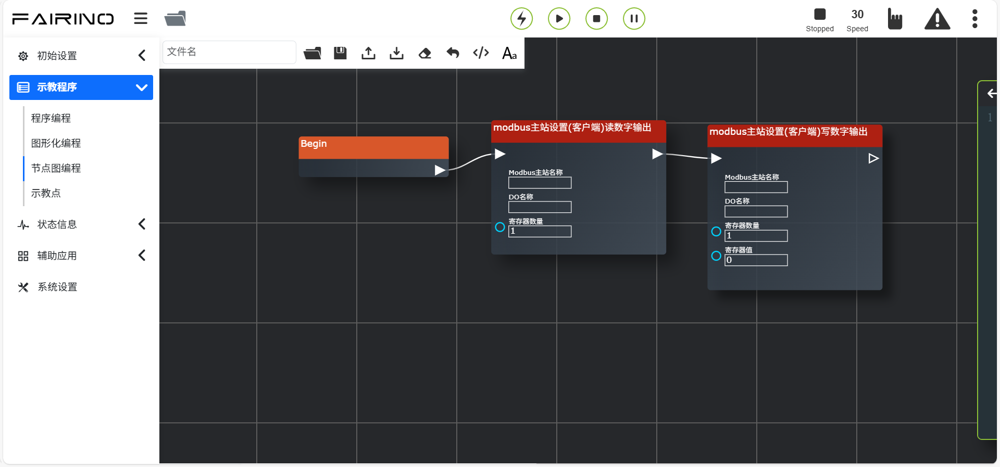

.. centered:: 圖表 11.53-1 主站「讀/寫數字輸出」指令節點界面

2. 主站數字輸入設置,參數：

- Modbus主站名稱：根據實際情況配置
- DI名稱：根據實際情況配置
- 寄存器數量：整數型 0 ~ 128

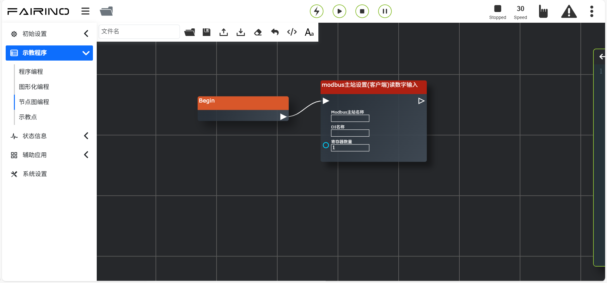

.. centered:: 圖表 11.53-2 主站「讀數字輸入」指令節點界面

3. 主站模擬輸出設置,參數：

- Modbus主站名稱：根據實際情況配置
- AO名稱：根據實際情況配置
- 寄存器數量：整數型 0 ~ 128
- 寄存器值：根據寄存器數量來定，可輸入多個數值。例如數量為3，值為1,0,1

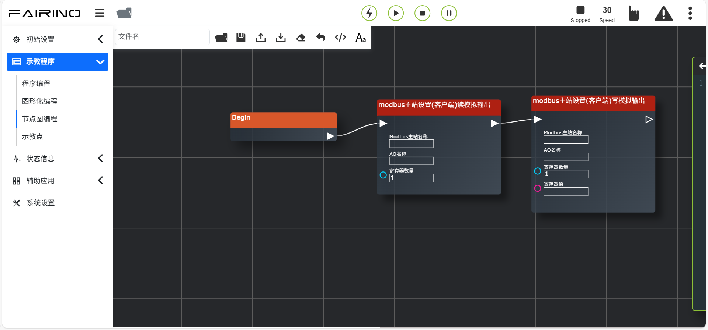

.. centered:: 圖表 11.53-3 主站「讀/寫模擬輸出」指令節點界面

4. 主站模擬輸入設置,參數：

- Modbus主站名稱：根據實際情況配置
- AI名稱：根據實際情況配置
- 寄存器數量：整數型 0 ~ 128
  

.. centered:: 圖表 11.53-4 主站「讀模擬輸入」指令節點界面

5. 主站等待數字輸入設置,參數：

- Modbus主站名稱：根據實際情況配置
- DI名稱：根據實際情況配置
- 等待狀態：true/false
- 超時時間(ms)：整數型 0 ~ 128
  

.. centered:: 圖表 11.53-5 主站「等待數字輸入」指令節點界面

6. 主站等待模擬字輸入設置,參數：

- Modbus主站名稱：根據實際情況配置
- AI名稱：根據實際情況配置
- 等待狀態：大於/小於
- 寄存器數量：整數型 0 ~ 128
- 寄存器值：根據寄存器數量來定，可輸入多個數值。
  
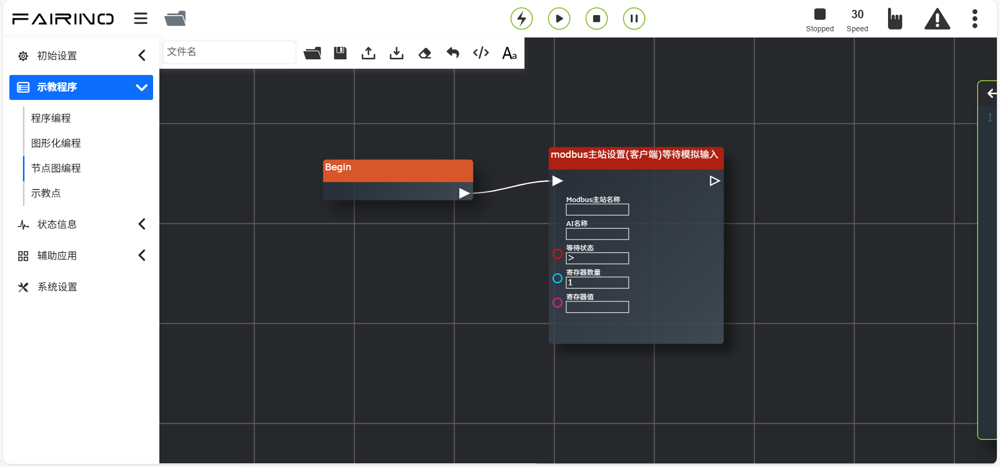

.. centered:: 圖表 11.53-6 主站「等待模擬輸入」指令節點界面

7. 從站數字輸出設置,參數：

- DO名稱：根據實際情況配置
- 寄存器數量：整數型 0 ~ 128
- 寄存器值：根據寄存器數量來定，可輸入多個數值。例如數量為3，值為1,0,1

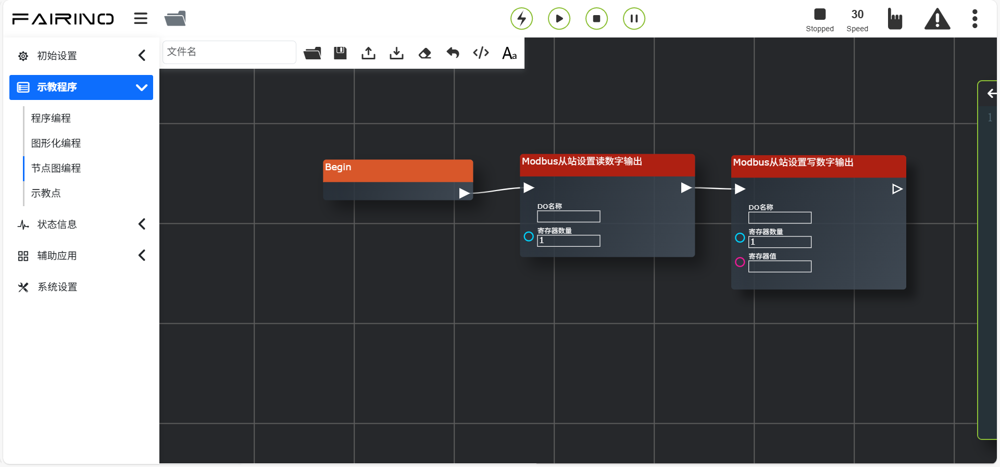

.. centered:: 圖表 11.53-7 從站「讀/寫數字輸出」指令節點界面

8. 從站數字輸入設置,參數：

- DI名稱：根據實際情況配置
- 寄存器數量：整數型 0 ~ 128

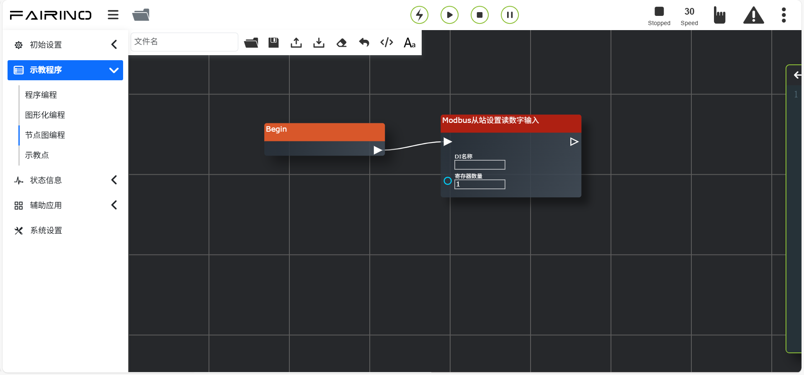

.. centered:: 圖表 11.53-8 從站「讀數字輸入」指令節點界面

9. 從站模擬輸出設置,參數：

- AO名稱：根據實際情況配置
- 寄存器數量：整數型 0 ~ 128
- 寄存器值：根據寄存器數量來定，可輸入多個數值。例如數量為3，值為1,0,1

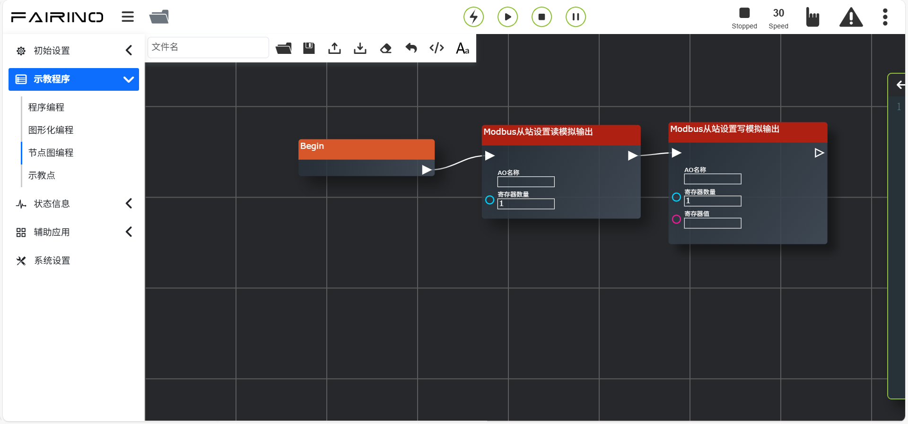

.. centered:: 圖表 11.53-9 從站「讀/寫模擬輸出」指令節點界面

10. 從站等待數字輸入設置,參數：

- DI名稱：根據實際情況配置
- 等待狀態：true/false
- 超時時間(ms)：整數型
  
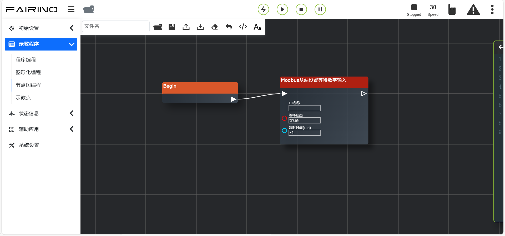

.. centered:: 圖表 11.53-10 從站「等待數字輸入」指令節點界面

11. 從站等待模擬輸入設置,參數：

- AI名稱：根據實際情況配置
- 等待狀態：大於/小於
- 寄存器數量：整數型 0 ~ 128
- 寄存器值：根據寄存器數量來定，可輸入多個數值。
  

.. centered:: 圖表 11.53-11 從站「等待模擬輸入」指令節點界面

12. 從站模擬輸入設置,參數：

- AI名稱：根據實際情況配置
- 寄存器數量：整數型 0 ~ 128

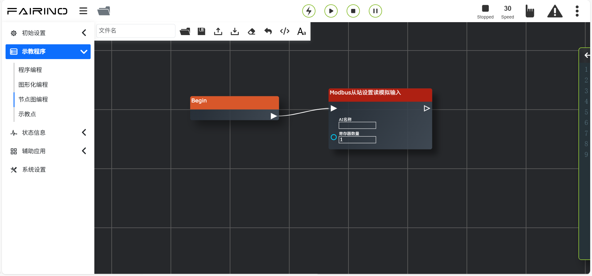

.. centered:: 圖表 11.53-12 從站「讀模擬輸入」指令節點界面

應用場景使用示例
---------------------

例如給機器人末端裝上尖端，拖動到托盤孔位附近位置，想要進行力感測器螺旋、旋轉和直線插入操作。

- 首先，右擊滑鼠鍵，選擇"Begin"、「開始/結束控制」、「螺旋插入」、「旋轉插入」、「直線插入」指令節點；
- 依次按如下位置連接，並配置相關參數。

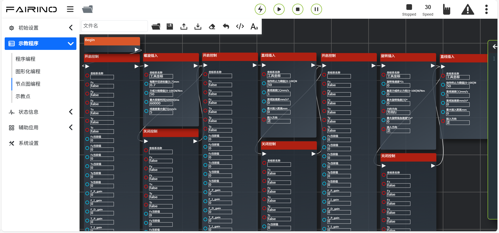

.. centered:: 圖表 11.54-1 「力控」指令節點應用配置界面

- 輸入文件名，若未輸入正確參數，則保存失敗，提示指令節點參數配置錯誤。

  .. image:: node_editor_software/123.png
   :width: 6in
   :align: center

.. centered:: 圖表 11.54-2 指令節點參數配置錯誤界面
  
- 點擊運行後，機器人會以螺旋形加直線的運動進行探索。當探索到正確孔位位置後，以直線加旋轉插入運動，直至正確插入孔位。
