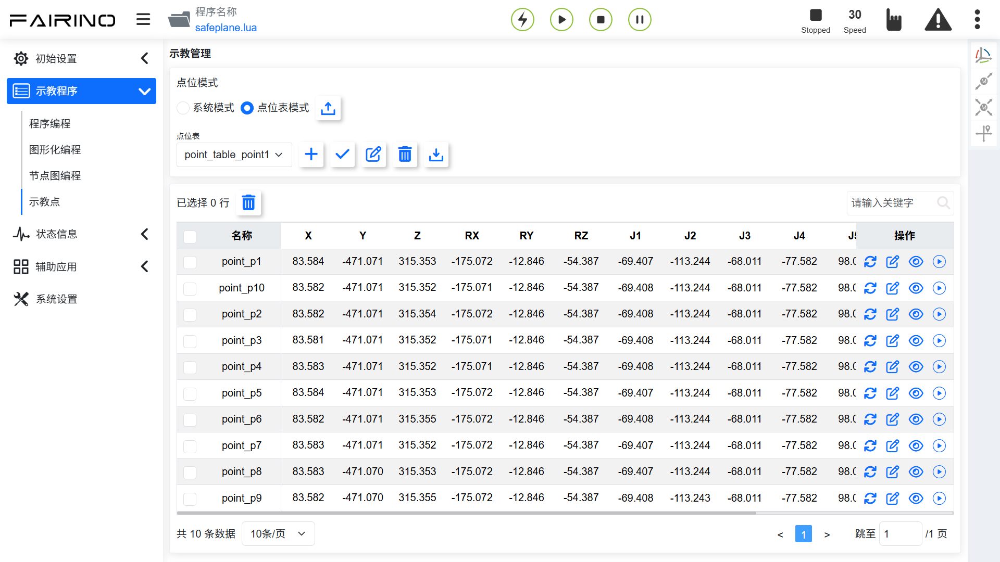
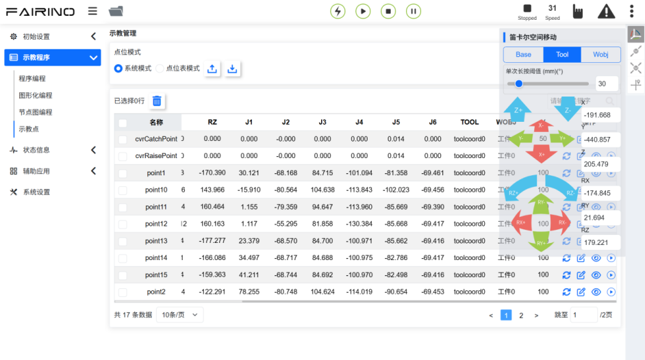
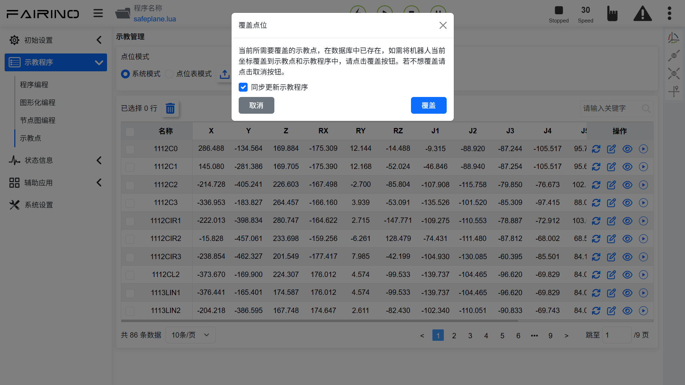
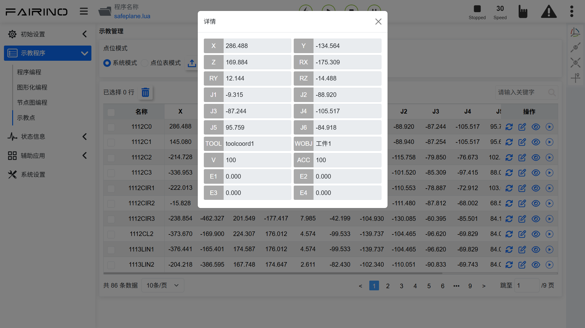
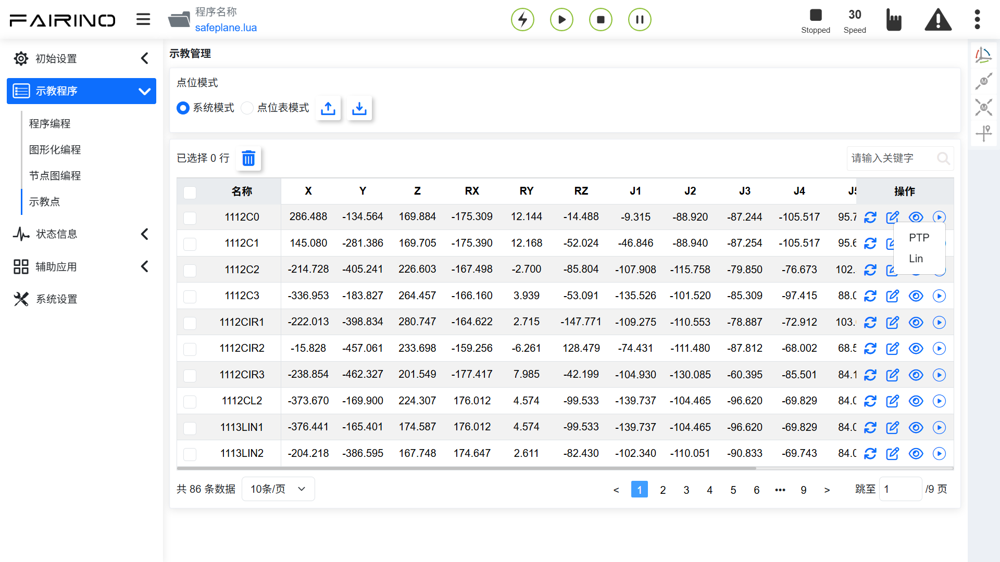

示教點
===============

.. toctree:: 
   :maxdepth: 6

示教管理分為「系統模式」和「點位表模式」兩種模式，實現調用機械手程式時，可以通過調用不同的點位表來實現不同的檢測方案，完成配方的需求。後續每增加一款設備或產品，可以通過上位機把點位表數據包下載到機器人，機器人新建的點位表數據包也可以上傳給上位機。

**系統模式**：支援「導入、導出、刪除、重新命名、修改、覆蓋、修改、查看」示教點位內容，以及單步運動到示教點位。

.. image:: points/001.png
   :width: 6in
   :align: center

.. centered:: 圖表 12.1-1 示教管理介面-系統模式

**點位表模式**：支援「新增、應用、重新命名、刪除、導入、導出」點位表，「刪除、修改、查看和覆蓋」點位表內點位內容，以及單步運動到示教點位。

.. centered:: 圖表 12.1-2 示教管理介面-點位表模式

示教管理介面右上角顯示機器人本體操作條，使用者在該介面可以移動機器人本體，然後再進行示教點的數據覆蓋操作。

.. centered:: 圖表 12.1-3 示教管理介面-機器人本體操作條

在示教點表格數據的右上角可以輸入示教點名稱進行搜尋；在示教點表格數據中點擊示教點名稱後，進入編輯狀態，輸入修改後的名稱，點擊示教點名稱以外的地方即可完成修改。

.. note:: 
   .. image:: points/004.png
      :height: 0.75in
      :align: left

   名稱：**導入按鈕**
   
   作用：示教點檔案導入

.. note:: 
   .. image:: points/005.png
      :height: 0.75in
      :align: left

   名稱：**導出按鈕**
   
   作用：示教點檔案導出

.. note:: 
   .. image:: points/006.png
      :height: 0.75in
      :align: left

   名稱：**刪除按鈕**
   
   作用：選中一個/多個示教點後點擊表格上方「刪除」按鈕後提示「請再次點擊刪除按鈕確認刪除」，再次點擊後即可將該點資訊刪除；

.. note:: 
   .. image:: points/007.png
      :height: 0.75in
      :align: left

   名稱：**覆蓋點位按鈕**
   
   作用：點擊將機器人當前點位數據覆蓋示教點，並在彈窗中選擇「是否同步示教程式」

.. centered:: 圖表 12.1-4 覆蓋示教點

.. note:: 
   .. image:: points/009.png
      :height: 0.75in
      :align: left

   名稱：**編輯按鈕**
   
   作用：點擊確認修改示教點x，y，z，rx，ry，rz和v數值

.. important:: 
   示教點x，y，z，rx，ry，rz的修改值不應超過機器人的工作範圍。

.. note:: 
   .. image:: points/010.png
      :height: 0.75in
      :align: left

   名稱：**詳情按鈕**
   
   作用：點擊查看示教點詳情

.. centered:: 圖表 12.1-5 示教點詳情

.. note:: 
   .. image:: points/012.png
      :height: 0.75in
      :align: left

   名稱：**開始運行按鈕**
   
   作用：點擊選擇單點運行的方式，將機器人移動到該點的位置；選擇PTP為點到點運動，選擇Lin為直線運動。

.. centered:: 圖表 12.1-6 運行示教點