工藝包
=============

.. toctree::
  :maxdepth: 5

焊接專家庫
----------------

點擊“輔助應用”->“工藝包”中的“焊接專家庫”的選單列，進入焊接專家庫功能界面，包含直焊、圓弧焊、多層多道焊和姿態調整。

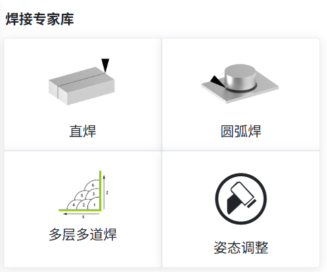

.. centered:: 圖表 15.1‑1 擴展軸配置

直焊
~~~~~~~~~~~~

點擊“直焊”，進入直焊指導界面。在各項機器人基礎設定配置完成的基礎上，我們可以通過幾個簡單的步驟快速生成焊接示教程序。主要包含以下五個步驟，由於功能間存在互斥，所以實際生成一個焊接示教程序的步驟少於五步。

步驟一，是否使用擴展軸，如果使用擴展軸需要配置好擴展軸相關座標系以及使能擴展軸。使用擴展軸時，無法使用擺焊功能。

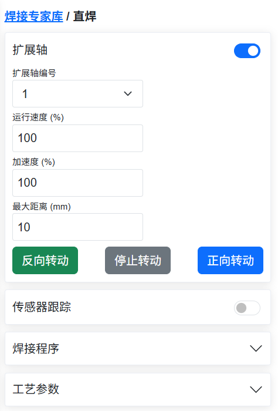

.. centered:: 圖表 15.1‑2 擴展軸配置

步驟二，選擇是否需要感測器追蹤，如果是的話，需要編輯雷射尋位指令的參數。使用感測器追蹤時，無法使用擺焊功能。

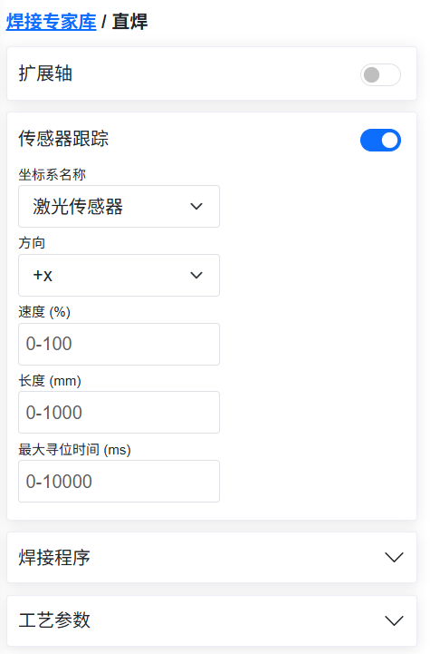

.. centered:: 圖表 15.1‑3 雷射尋位配置

步驟三，選擇是否需要擺焊，如果需要擺焊，需要編輯擺焊相關參數。

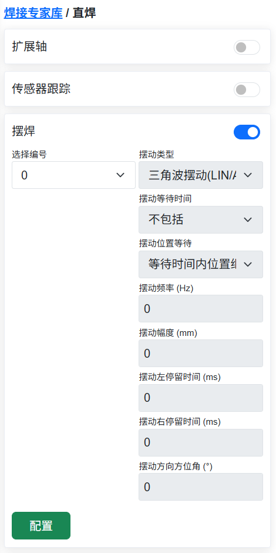

.. centered:: 圖表 15.1‑4 擺焊配置

步驟四，標定起點，起點安全點，終點，終點安全點。若第一步選擇了擴展軸，會載入擴展軸移動功能，配合相關點的標定。

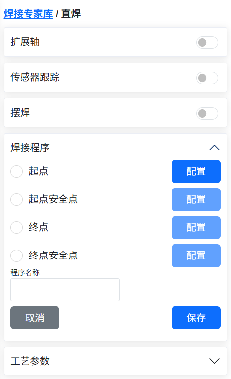

.. centered:: 圖表 15.1‑5 標定相關點

步驟五，給程序命名，並在程序示教界面中自動開啟該程序。

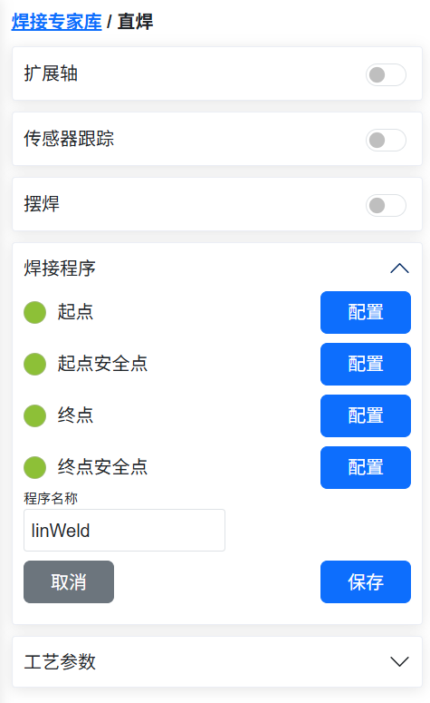

.. centered:: 圖表 15.1‑6 儲存程序

程序儲存成功後，可以在工藝參數中修改焊接速度。

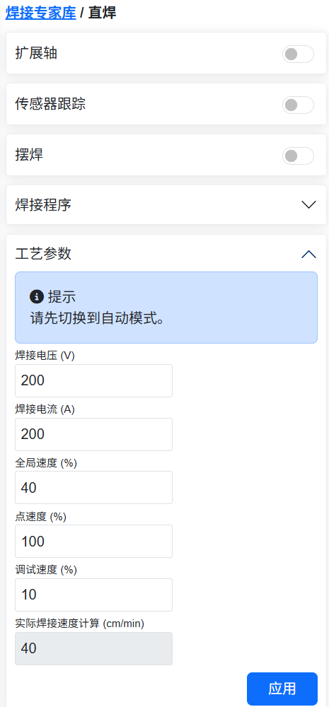

.. centered:: 圖表 15.1‑7 工藝參數

圓弧焊
~~~~~~~~~~~~

點擊“焊件形狀”下的“圓弧焊”，進入圓弧焊指導界面。在各項機器人基礎設定配置完成的基礎上，我們可以通過兩個簡單的步驟快速生成焊接示教程序。主要包含以下兩個步驟。

步驟一，標定起點，起點安全點，圓弧過渡點，終點和終點安全點。

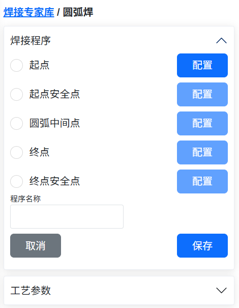

.. centered:: 圖表 15.1‑8 標定點

步驟二，給程序命名，並在程序示教界面中自動開啟該程序。

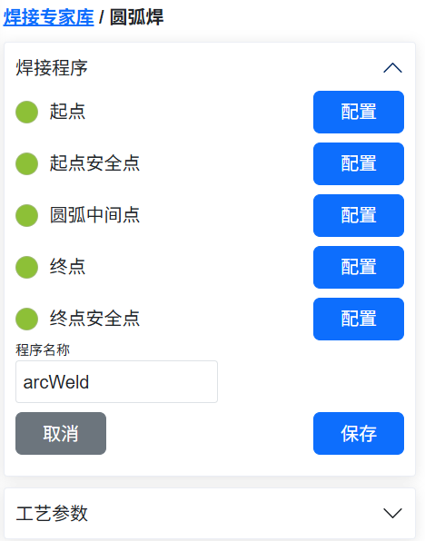

.. centered:: 圖表 15.1‑9 儲存程序

程序儲存成功後，可以在工藝參數中修改焊接速度。

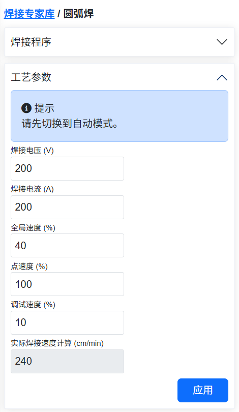

.. centered:: 圖表 15.1‑10 工藝參數

多層多道焊
~~~~~~~~~~~~

當焊腳尺寸大於10mm的焊縫時，通常會採用多層多道焊接功能。本功能能夠模板化配置焊接程序，在多層多道焊接的第一道焊接過程種加入電弧追蹤功能，並在後續的多道直線焊接過程中修正焊縫偏差，從而提高焊縫品質。

電弧追蹤多層多道焊接功能操作流程如下：

1) 設定工具座標系，填入焊槍的工具尺寸與姿態。

.. note::
   界面數值僅為範例，以實際工具狀態為準。

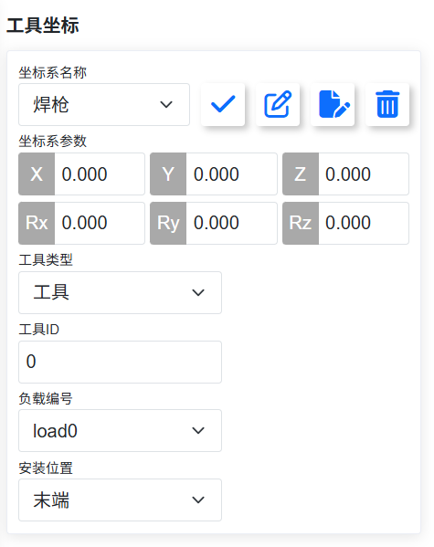

.. centered:: 圖表 15.1-11 設定工具座標系

2) 點擊“多層多道焊”進入界面。

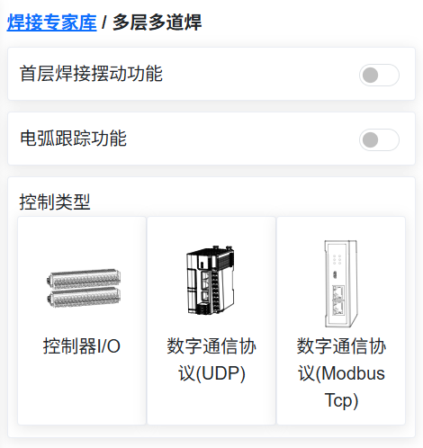

.. centered:: 圖表 15.1-12 開啟多層多道焊接界面

3) 若要使用電弧追蹤功能，務必開啟“首層焊接擺動功能”開關，並配置對應的擺動參數。

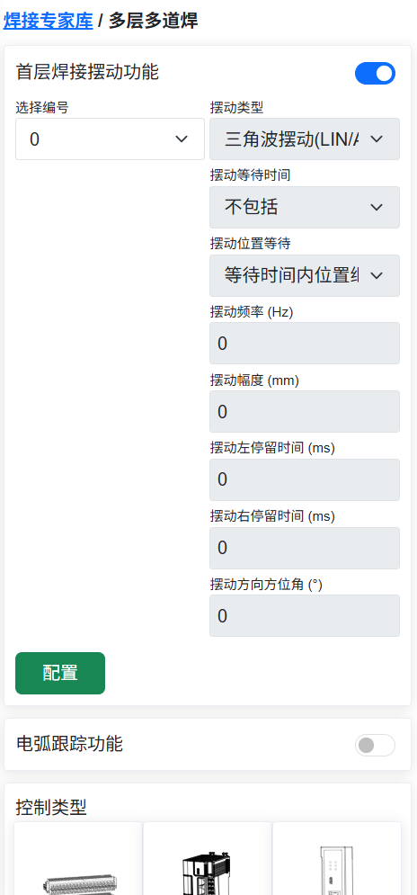

.. centered:: 圖表 15.1-13 開啟首層焊接擺動功能

4) 點擊“配置”按鈕， 編輯擺動參數，之後點擊“配置”。

.. note::
   若需要電弧追蹤進行左右補償的情況，僅可選擇“三角波擺動”和“正弦波擺動”類型，擺動頻率不得低於0.5Hz，擺動幅度不得小於3mm，擺動左右等待時間需一致，擺動方位角需為0。

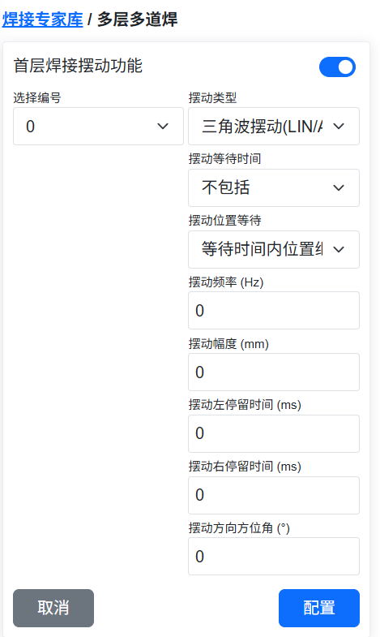

.. centered:: 圖表 15.1-14 配置擺動參數

5) 開啟“電弧追蹤功能”開關，編輯對應的上下與左右補償參數。

.. note::
   電弧追蹤參數根據實際焊接情況參考《電弧追蹤功能操作手冊》或聯繫相關技術人員進行配置。

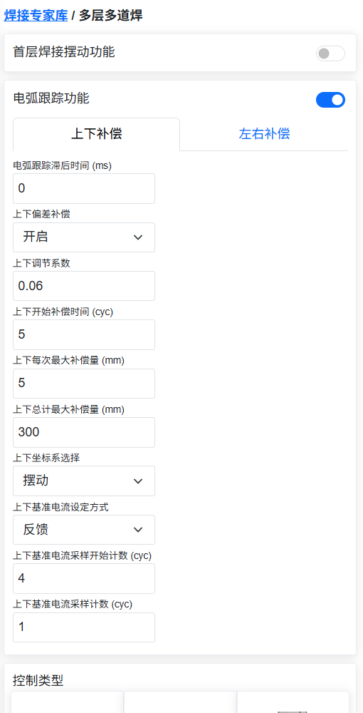

.. centered:: 圖表 15.1-15 配置電弧追蹤參數

6) 根據控制類型點擊對應類型進入界面，首先在第一組點中設定“焊接點”為焊接開始位置；“X+點”為自定義偏置座標系相對焊接點X+方向上的一點；“Z+點”為自定義偏置座標系相對焊接點Z+方向上的一點；“安全點”為上一次焊接完成到下一次焊接開始的過渡位置。示教並設定完成後自動進入第二組點設定。

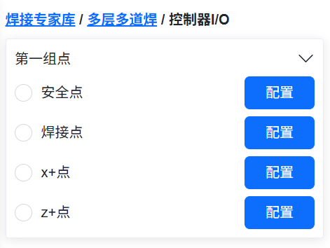

.. centered:: 圖表 15.1-16 多層多道焊接直線開始點位置設定

7) 選擇“直線點”，此處“焊接點”為焊接結束位置；“X+點”為自定義偏置座標系相對“焊接點”X+方向上的一點；“Z+點”為自定義偏置座標系相對“焊接點”Z+方向上的一點。示教並設定完成後點擊“完成”按鈕設定多層多道焊接參數。

.. centered:: 圖表 15.1-17 多層多道焊接直線結束點位置設定

8) 在此頁面能夠設定多層多道焊接的數量，以及分佈位置。點擊參數表“On/Off”框選擇啟動的多層多道焊接位置對應值，在“X”“Z”“B”列填入期望的在自定義座標系中的對應偏移位置與角度。

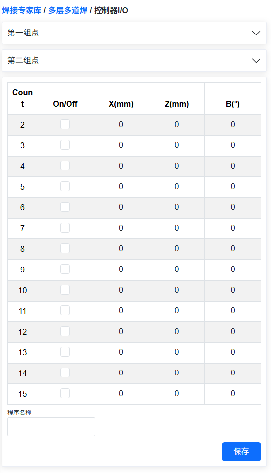

.. centered:: 圖表 15.1-18 多層多道焊接參數設定

9) 至此已完成全部參數配置，輸入希望儲存的程序名，點擊“儲存”按鈕可自動生產對應的多層多道焊接程序。

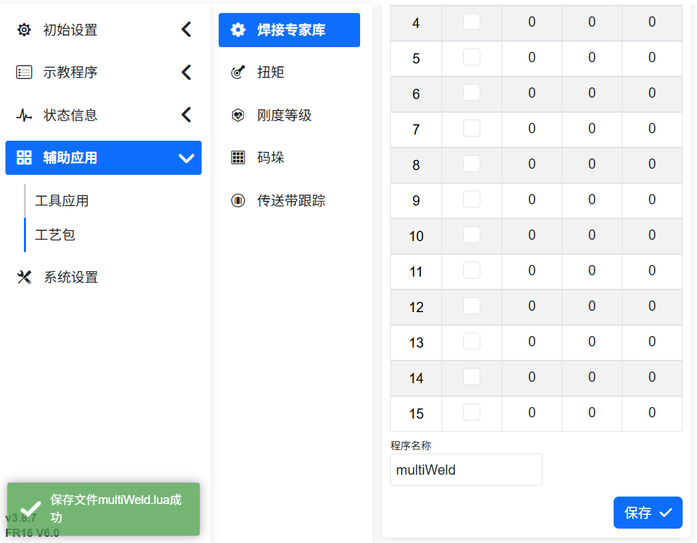

.. centered:: 圖表 15.1-19 多層多道焊接程序生成

10) 點擊“開啟程序”按鈕，讀取上一步驟儲存的lua程序，程序內容如下圖所示。

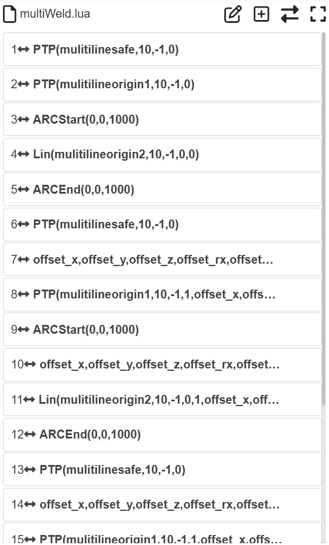

.. centered:: 圖表 15.1-20 電弧追蹤多層多道焊接程序範例

姿態調整
~~~~~~~~~~~~~~~~~~

姿態自適應配置步驟
+++++++++++++++++++++++++++++++++++

**Step1**：進入姿態調整配置界面，選擇板材類型和機器人實際工作運動方向，調整機器人姿態，分別設定姿態點A，姿態點B和姿態點C，通常A為平面姿態點，B為上升沿姿態點，C為下降沿姿態點。

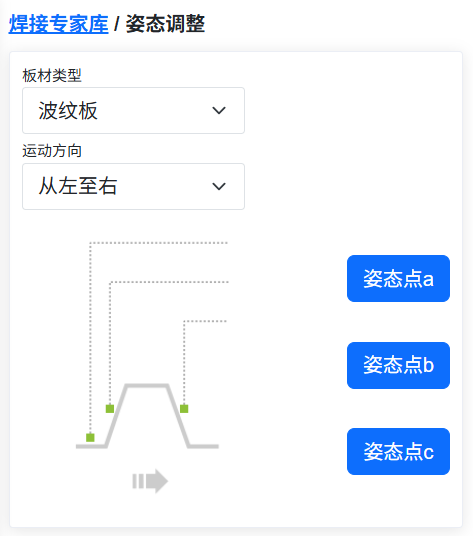

.. centered:: 圖表 15.1‑21 姿態調整配置

.. important::
	A姿態和B姿態，A姿態和C姿態之間的姿態變化在滿足應用需求下姿態變化越小越好。姿態自適應功能為輔助應用功能，通常配合焊縫追蹤使用。

**Step2**：在程序示教命令界面選擇“Adjust”命令。根據具體的程序示教需求，在相應的地方加入指令。

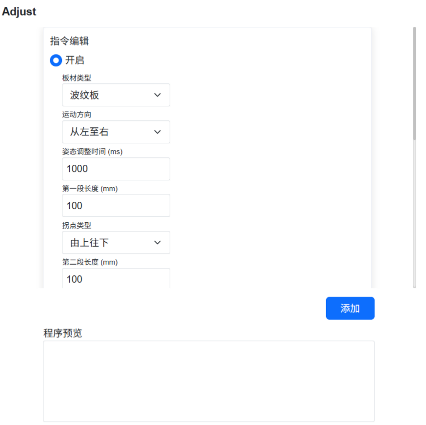

.. centered:: 圖表 15.1‑22 姿態調整指令編輯

姿態自適應配合擴展軸和雷射追蹤焊接示教程序
++++++++++++++++++++++++++++++++++++++++++++++++++++++++++++++++++++++

.. list-table::
   :widths: 50 80 80
   :header-rows: 0
   :align: center

   * - **序號**
     - **指令格式**
     - **註釋**

   * - 1
     - EXT_AXIS_PTP(1,1laserstart)
     - #外部軸運動雷射感測器起始點

   * - 2
     - PTP(laserstart,10,-1,0)
     - #機器人運動雷射感測器起始點

   * - 3
     - LTSearchStart(3,20,10,10000)
     - #開始尋位

   * - 4
     - LTSearchStop()
     - #停止尋位

   * - 5
     - EXT_AXIS_PTP(1,1,seamPos)
     - #外部軸運動焊縫起點

   * - 6
     - Lin(seamPos,20,-1,00,0)
     - #機器人運動焊縫起點

   * - 7
     - LTTrackOn()
     - #雷射追蹤

   * - 8
     - ARCStart(0,10000)
     - #焊機起弧

   * - 9
     - PostureAdjustOn(0,PosA,PosC,PosB,1000)
     - #姿態自適應調整開啟

   * - 10
     - EXT_AXIS_PTP(1,1,laserend)
     - #外部軸運動焊縫終點

   * - 11
     - Lin( laserend,10,-1,0,0)
     - #機器人運動焊縫終點

   * - 12
     - ARCEnd(0,10000)
     - #焊機收弧

   * - 13
     - PostureAdjustOff(0)
     - #姿態自適應調整關閉

   * - 14
     - LTTrackOff
     - #雷射追蹤關閉

新樣條直線圓弧過渡擺動功能
~~~~~~~~~~~~~~~~~~~~~~~~~~~~~~~~~~~~~~~~~~~~~~~~~~~~~~

概述
+++++++++++++++++++++++++++++++++++++++++++++++++++++++++++++++++++

新樣條直線圓弧過渡疊加擺動功能是機器人新樣條直線圓弧過渡功能和擺動功能的結合，可以實現機器人在新樣條直線圓弧過渡過程中完成「三角波擺動」、「垂直L型三角波擺動」、「立焊三角擺動」、「正弦波擺動」和「垂直L型正弦波擺動」類型的擺動運動。

操作流程
++++++++++++++++++++++++++++++++++++++++++++++++++++++++++++++++++++++++++++++++++++++++++++++++++++++++++++++++++++++++++++++++++++++

**Step1**：透過WebApp標定機器人工具座標系。該功能的具體操作步驟可參考相應章節的使用者手冊。

**Step2**：透過WebApp示教不少於4個點位。注意，各點位的間距最佳均勻進行示教。

**Step3**：擺動參數設定。在WebApp主界面，點擊「示教程式」->「程式編程」，進入「運動指令」指令區。

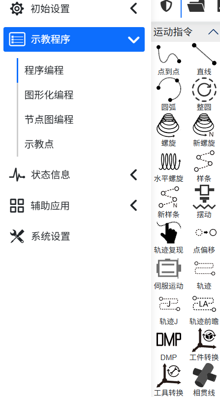
   
.. centered:: 圖表 15.1‑23 「運動指令」區
  
在「運動指令」指令區中點擊「擺動」按鈕，進入「Weave」配置界面，在「指令編輯」指令區的「選擇編號」下拉框中選擇工藝編號，點擊「編輯」，進入擺動工藝參數配置，配置完畢後點擊「配置」，完成工藝編號保存。

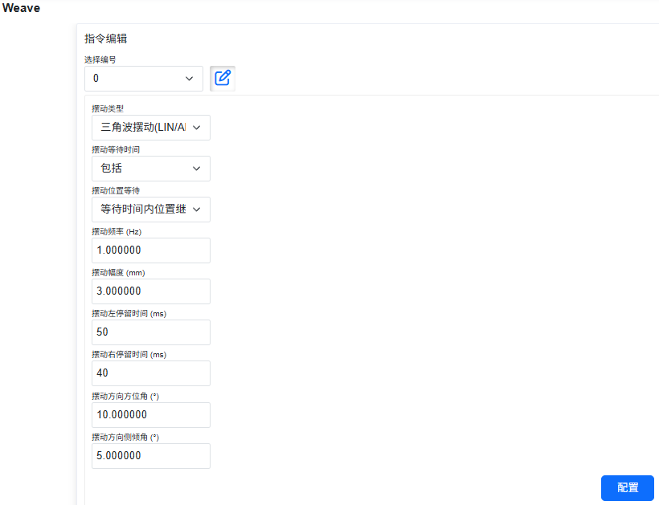
   
.. centered:: 圖表 15.1‑24 設定擺動工藝參數
 
.. note:: 新樣條直線圓弧過渡疊加擺動功能暫對「三角波擺動」、「垂直L型三角波擺動」、「立焊三角擺動」、「正弦波擺動」和「垂直L型正弦波擺動」類型生效；「擺動等待時間」下拉框選擇「包括」選項、「擺動位置等待」下拉框選擇「等待時間內繼續移動」選項。

**Step4**：添加擺動運動指令。在「Weave」配置界面的「指令類型」指令區內點擊「開始擺動」-「添加」-「停止擺動」-「添加」-「應用」按鈕，完成擺動運動設定。

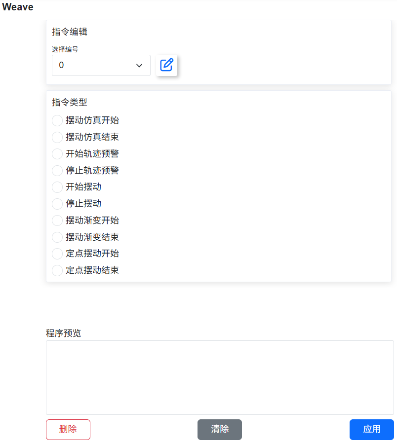
   
.. centered:: 圖表 15.1‑25 擺動運動設定
  
**Step5**：添加新樣條直線圓弧過渡指令。在「運動指令」指令區中，點擊「新樣條」按鈕，進入「N-Spline」配置界面，並在「指令類型」指令區內點擊「多點軌跡起始」按鈕，選擇「控制模式」下拉框為「圓弧過渡點」選項，輸入「全局平均銜接時間」框參數，點擊「添加」，完成新樣條運動模式配置。

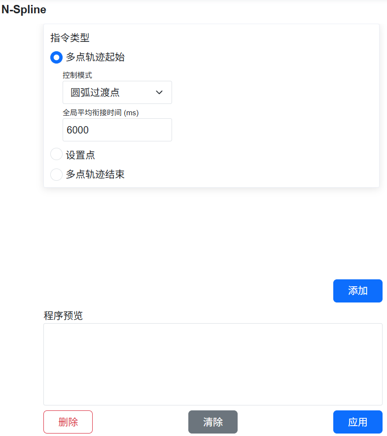
   
.. centered:: 圖表 15.1‑26 配置新樣條運動模式

.. note:: 「全局平均銜接時間」適用於「圓弧過渡點」控制模式，其他模式可保持預設，並建議盡量向上取值調節。

調節方式可分為：

1. 按完整運動時間÷（點位數-1），得到全局平均銜接時間參數，其中時間單位均為毫秒。
2. 按完整運動過程中相隔距離最遠的兩個點位的運行時間設定。若不便觀察或無姿態平滑過渡要求，可預設設定10000毫秒或向上取值調節。

**Step6**：添加運動點位。在「N-Spline」配置界面的「指令類型」指令區內點擊「設定點」-「SPL」按鈕，在「點名稱」下拉框中選擇運動點位、在「調試速度」框輸入指令運動速度比例、在「平滑過渡半徑」框輸入平滑半徑參數、在「是否最後一個點」下拉框選擇點位的運動狀態，點擊「添加」，完成單個運動點位配置。

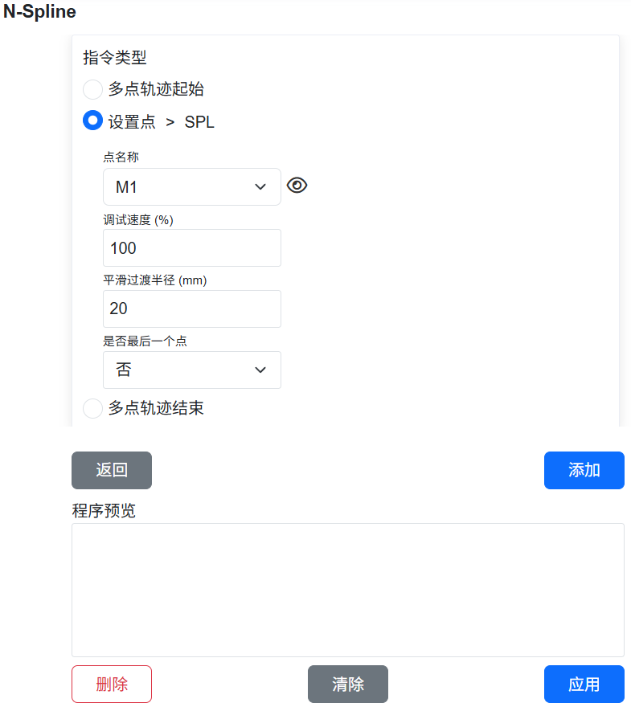
   
.. centered:: 圖表 15.1‑27 配置運動點位
 
.. note:: 重複步驟6，完成全部運動點位配置，並在最後點位配置中的「是否最後一個點」下拉框中選擇「是」選項。

**Step7**：完成新樣條直線圓弧過渡指令。在「N-Spline」配置界面的「指令類型」指令區內點擊「多點軌跡結束」按鈕，並點擊「添加」-「應用」按鈕，完成整體新樣條直線圓弧過渡指令配置。

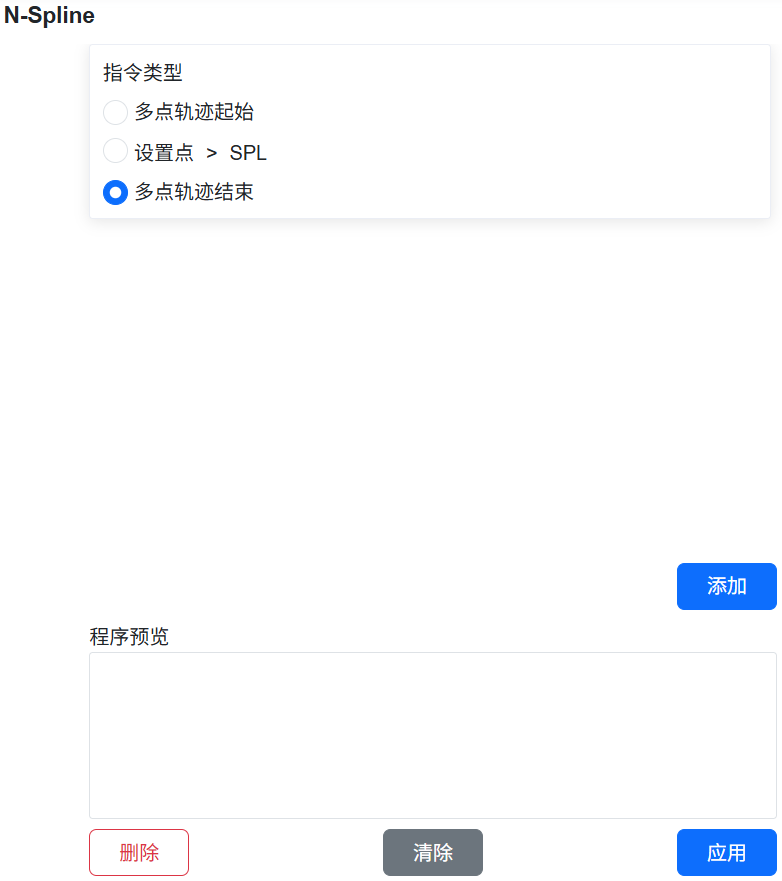
   
.. centered:: 圖表 15.1‑28 配置新樣條運動結束
  
**Step8**：編寫新樣條直線圓弧過渡+擺動功能的LUA程式。調整步驟4至步驟7生成的指令順序。執行該LUA程式即可實現新樣條直線圓弧過渡+擺動功能。

.. figure:: process/079.png
   :align: center
   :width: 4in
   
.. centered:: 圖表 15.1‑29 新樣條直線圓弧過渡+擺動功能LUA程式
 
.. note:: 在新樣條直線圓弧過渡的起始運動點位前，可以添加PTP運動使機器人確保到達起始運動點位。

新樣條直線圓弧過渡+擺動的回中策略設定
++++++++++++++++++++++++++++++++++++++++++++++++++++++++++++++++++++++++++++++++++++++++++++++++++++++++++++++++++++++++++++++++++++++

在WebApp主界面，點擊「輔助應用」->「工藝包」->「焊接專家庫」，進入「焊接專家庫」指令區。

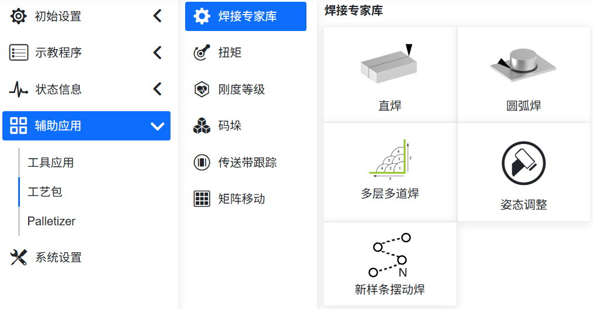
   
.. centered:: 圖表 15.1‑30 新樣條擺動焊指令

在「焊接專家庫」指令區內點擊「新樣條擺動焊」按鈕，進入「新樣條擺動焊」配置界面，在「擺動焊參數」指令區的「擺動回中類型」下拉框中，可以選擇「不回中」或「延伸軌跡回中」選項，如圖3-2所示，選擇完畢後點擊「配置」按鈕，完成擺動的回中策略設定。

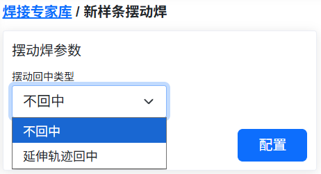
   
.. centered:: 圖表 15.1‑31 新樣條直線圓弧過渡的擺動回中類型

.. note:: 在「擺動回中類型」下拉框中，當選擇「不回中」選項時，新樣條圓弧過渡擺動運動至最後點位後即停；當選擇「延伸軌跡回中」選項時，新樣條圓弧過渡擺動運動至最後點位後繼續運動確保以一個完整的擺動週期停止運動。

碼垛系統配置
---------------

碼垛系統配置步驟
~~~~~~~~~~~~~~~~~~~~~~

**Step1**：在“輔助應用”->“工藝包”中點擊“碼垛”選單項，進入碼垛系統配置界面。

第一次使用，需要首先進行配方建立，點擊“配方建立”，輸入配方名稱，點擊“建立”，建立成功後點擊“開始配置”進入碼垛配置頁面。

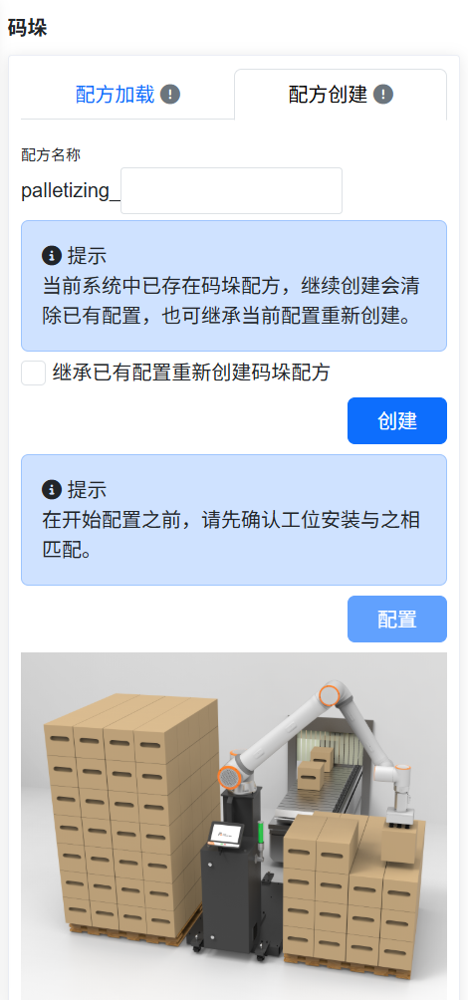

.. centered:: 圖表 15.2‑1 碼垛配方配置

**Step2**：在工件配置欄中點擊“配置”進入工件配置彈出視窗，設定工件的“長度”，“寬度”，“高度”以及工件的抓取點，點擊“確認配置”完成工件資訊設定。

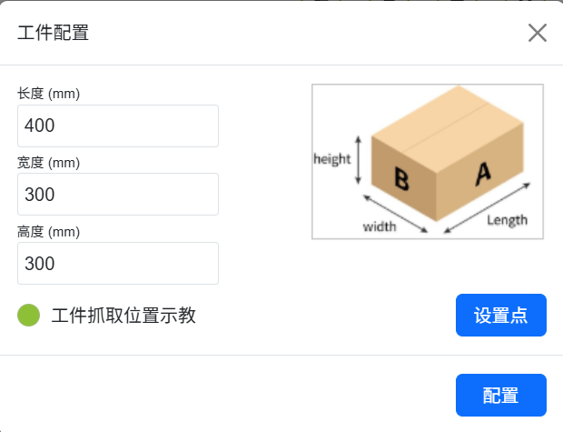

.. centered:: 圖表 15.2‑2 碼垛工件配置

**Step3**：在托盤配置欄中點擊“配置”進入托盤配置彈出視窗，設定托盤“前邊”，“側邊”和“高度”，接著設定工位和工位過渡點，點擊“確認配置”完成托盤資訊設定。

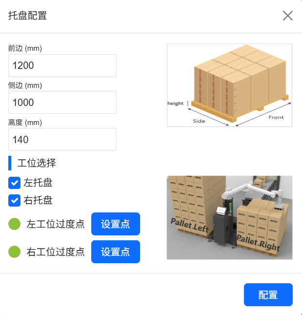

.. centered:: 圖表 15.2‑3 碼垛托盤配置

**Step4**：在碼垛設備尺寸配置欄中點擊“配置”進入碼垛設備尺寸配置配置彈出視窗，設定設備“X”、“Y”、“Z”和“Angle”，點擊“確認配置”完成碼垛設備尺寸配置資訊設定。

.. important::
   X、Y、Z為左托盤右上角或者右托盤左上角點相對於機器人基座標系座標值的絕對值，Angle為機器人安裝時的旋轉角度，推薦安裝時為0。

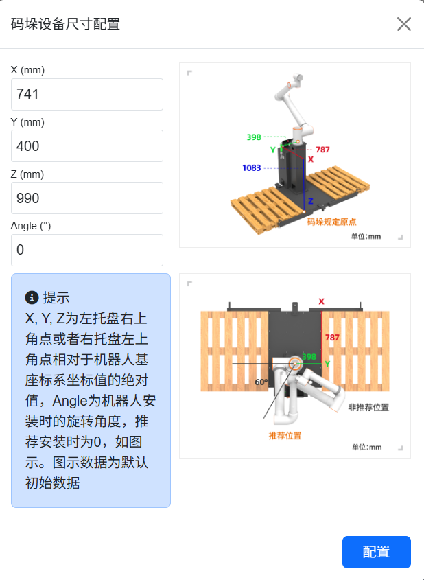

.. centered:: 圖表 15.2‑4 碼垛設備尺寸配置

**Step5**：在模式配置欄中點擊“配置”進入模式配置彈出視窗。

   **模式B開啟/關閉**：開啟：可以切換模式A/B，配置碼垛每層模式的B模式；關閉：不可切換模式B，不可配置碼垛每層模式的B模式；

   **模式A/B切換**：選擇模式A：加入工件為模式A，工件序號為A1，A2...，不可調整工件透明度；選擇模式B：加入工件為模式B，工件序號為B1，B2...，此時可以開啟/關閉“顯示模式A配置”顯示模式A工件；

   **顯示模式A開啟/關閉**：開啟：調整模式B工件透明度來檢視A/B模式配置效果是否合理，此時只能對模式B工件進行選中、加入、批次加入、刪除和刪除全部的操作；關閉：無法設定模式B工件透明度；

.. important::
   配置工件時，工件之間有碰撞時工件背景顏色變紅，此時以上操作無法進行。如需操作，請配置工件為無碰撞。

配置工件時，先設定工件間隔，右側框框為模擬工件在右托盤的放置方式，可以單個加入也可以批次加入。接著設定碼垛層數和各層的模式，點擊“確認配置”完成模式資訊設定。

.. important::
   碼垛方向：以右托盤為例，右下角為最遠處，從右下角豎向或者橫向擺放一排工件，再向上一排橫向或豎向擺放工件，以此類推（Web頁面已標註碼垛方向，請注意檢視）。

   左托盤依據右托盤模式鏡像放置工件。

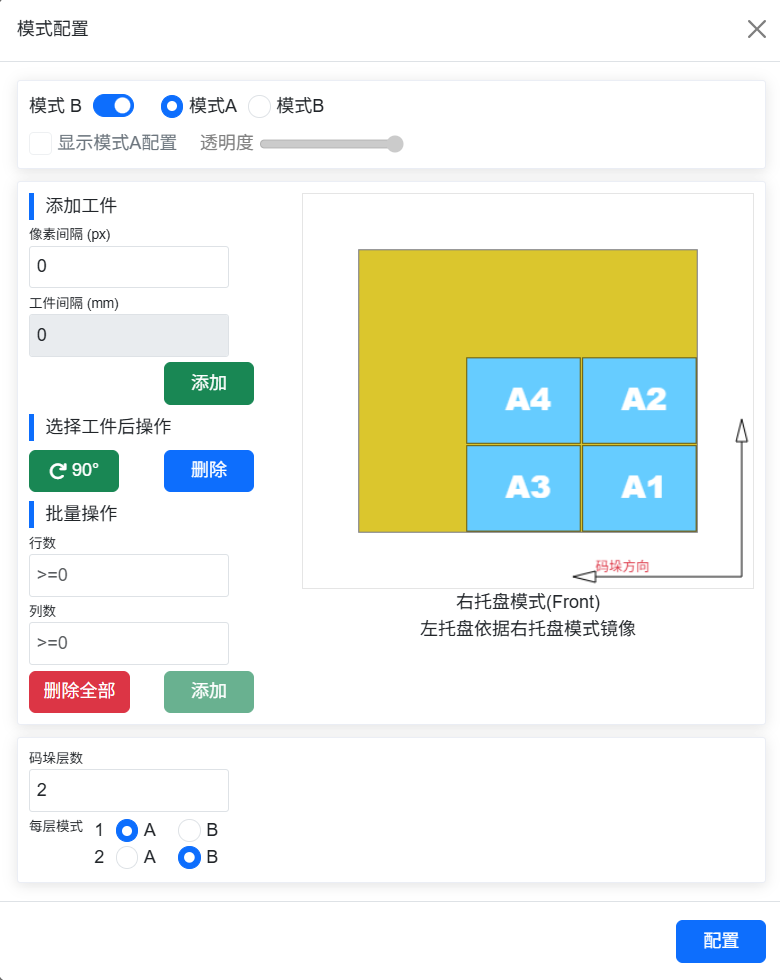

.. centered:: 圖表 15.2‑5 碼垛模式A配置

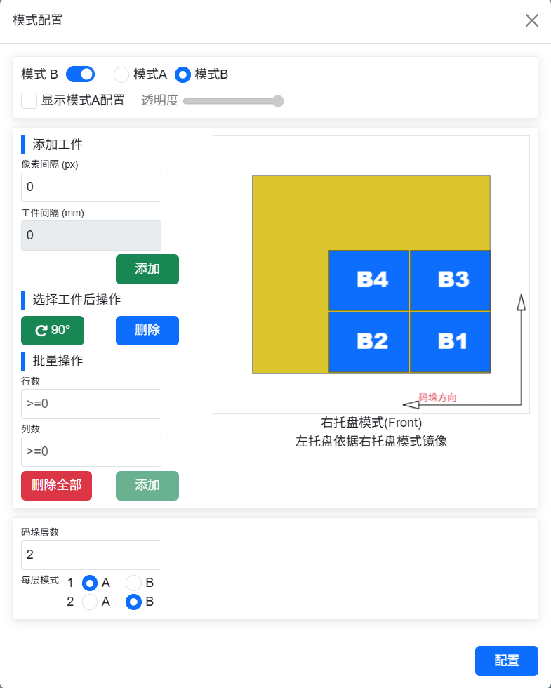

.. centered:: 圖表 15.2‑6 碼垛模式B配置

**Step6**：在示教程序生成欄點擊“進階配置”進入進階配置彈出視窗，此時配置“取料抬升高度”、“第一次偏移距離”、“第二次偏移距離”和“吸料等待時間”。

   **取料抬升高度**：使用者自定義取料成功後，從抓取點取料成功後抬升的高度；

   **第一/二次偏移距離**：使用者自定義配置機器人傾斜堆放至目標點的偏移距離；

   **吸料等待時間**：使用者自定義配置吸料等待時間，監控吸料後負壓到位訊號，未到位時重複吸取動作；

   **平滑過渡**：開啟平滑過渡按鈕，可進行碼垛/拆垛PTP平滑時間和LIN平滑半徑相關參數配置。

   - PTP平滑時間：無平滑過渡時間/等級1(200ms)/等級2(400ms)/等級3(600ms)/等級4(800ms)/等級5(1000ms)
   - LIN平滑半徑：無平滑過渡半徑/等級1(200mm)/等級2(400mm)/等級3(600mm)/等級4(800mm)/等級5(1000mm)

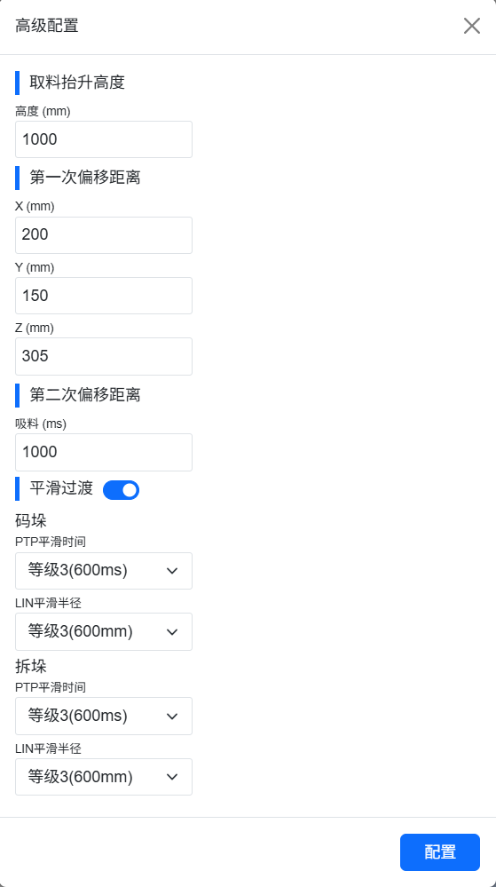

.. centered:: 圖表 15.2‑7 碼垛進階配置

**Step7**：在示教程序生成欄選擇“方式選擇”，點擊“生成程序”，開啟“碼垛監控頁”，在此頁面可以對“生成資訊”，“報警資訊”和“碼垛程序”顯示和檢視。

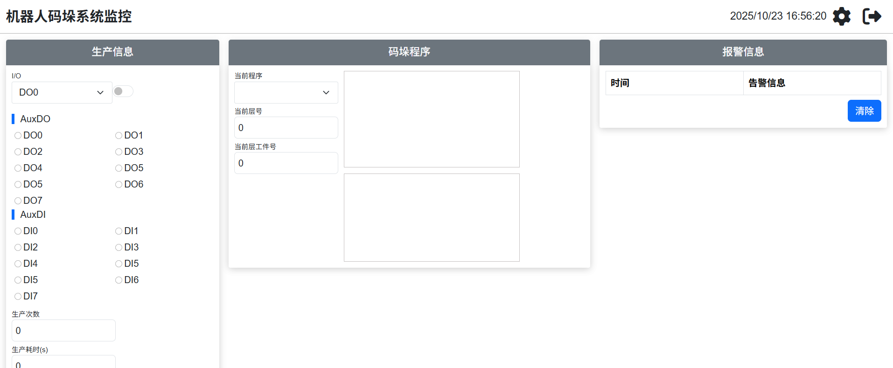

.. centered:: 圖表 15.2‑8 碼垛系統監控

**Step8**：碼垛執行程序中途報錯後，程序停止，使用者首先清除報錯後，再次選擇碼垛程序執行，此時會彈出“上次程式中斷”彈出框，點擊“接續”按鈕接續執行，點擊“重新開始”按鈕重新開始執行程式。

.. centered:: 圖表 15.2‑9 碼垛程序接續

傳送帶追蹤
-----------------

傳送帶追蹤配置步驟
~~~~~~~~~~~~~~~~~~~~~

**Step1**：在“輔助應用”->“工藝包”中選擇“傳送帶”選單項，進入傳送帶追蹤配置界面，點擊“配置傳送帶IO”按鍵快速配置傳送帶功能所需IO，之後根據實際使用功能情況配置對應的參數，此處以無視覺追蹤抓取功能為例，需要配置傳送帶編碼器通道，解析度，導程，視覺搭配選擇否，點擊配置。

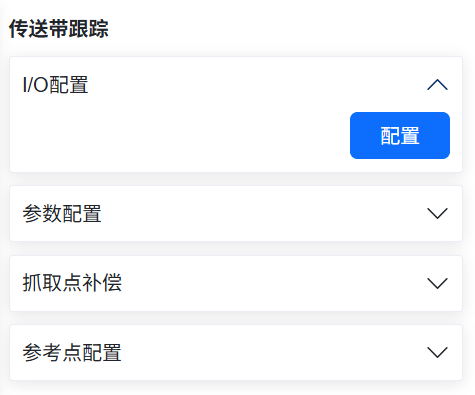

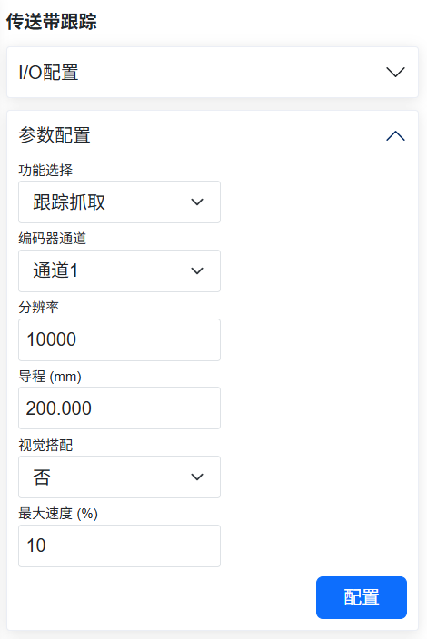

.. centered:: 圖表 15.3‑1 傳送帶配置

**Step2**：接下來設定抓取點補償值，為X,Y,Z三個方向上的補償距離，可在除錯過程中根據實際情況設定。

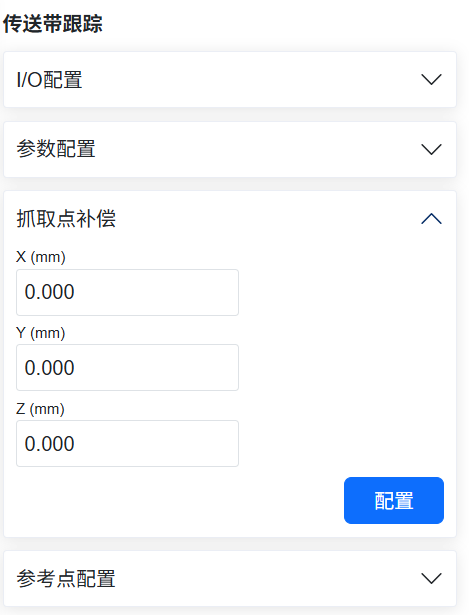

.. centered:: 圖表 15.3‑2 傳送帶抓取點補償配置

**Step3**：開啟傳送帶，將標定的物體移動到定義的A點位置，停止傳送帶。移動機器人，將機器人末端的標定桿尖點與所標定的物體尖點對齊，點擊起始點A按鍵，跳出對話框，顯示當前編碼器值和機器人位姿，點擊標定完成起始點A標定。

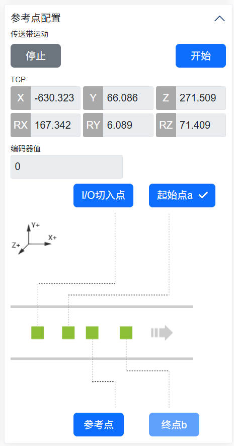

.. centered:: 圖表 15.3‑3 起始點A配置

**Step4**：點擊參考點按鍵，進入參考點標定，記錄參考點時記錄機器人抓取時的高度和姿態，每次追蹤時都會以記錄參考點的高度和姿態區追蹤抓取，可以和AB點不在一個高度，點擊標定完成參考點標定。

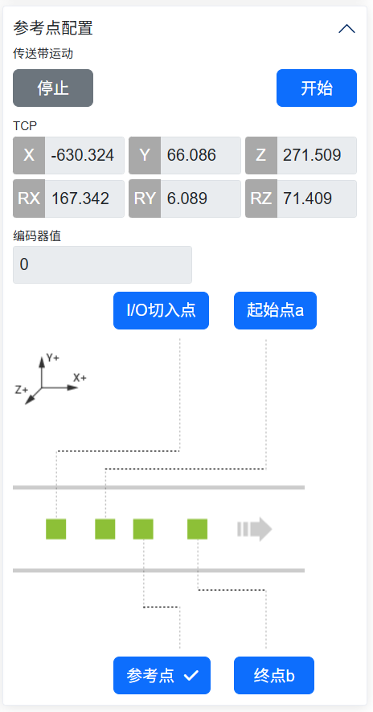

.. centered:: 圖表 15.3‑4 參考點配置

**Step5**：開啟傳送帶，將標定的物體移動到定義的B點位置，停止傳送帶。移動機器人，將機器人末端的標定桿尖點與所標定的物體尖點對齊，點擊終點B按鍵，彈出對話框，顯示當前編碼器值和機器人位姿，點擊標定完成終點B標定。

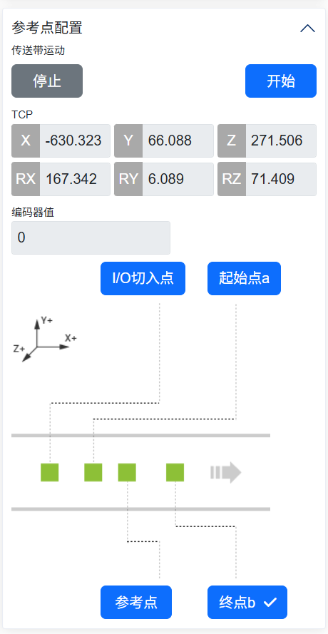

.. centered:: 圖表 15.3‑5 終點B配置

傳送帶追蹤示教程序
~~~~~~~~~~~~~~~~~~~~~~~

.. list-table::
   :widths: 50 80 80
   :header-rows: 0
   :align: center

   * - **序號**
     - **指令格式**
     - **註釋**

   * - 1
     - PTP(conveyorstart,30,-1,0)
     - #機器人抓取起點

   * - 2
     - While(1) do
     - #循環抓取

   * - 3
     - ConveyorlODetect(10000)
     - #Io即時檢測物體

   * - 4
     - ConveyorGetTrackData(1)
     - #物體位置獲取

   * - 5
     - ConveyorTrackStart(1)
     - #傳送帶追蹤開始

   * - 6
     - Lin(cvrCatchPoint,10,-1,0,0)
     - #機器人到達抓取點

   * - 7
     - MoveGripper(1,255,255,0,10000)
     - #夾爪抓取物體

   * - 8
     - Lin(cvrRaisePoint,10,-1,0,0)
     - #機器人提起

   * - 9
     - ConveyorTrackEnd()
     - #傳送帶追蹤結束

   * - 10
     - PTP(conveyorraise,30,-1,0)
     - #機器人到達等待點

   * - 11
     - PTP(conveyorend,30,-1,0)
     - #機器人到達放置點

   * - 12
     - MoveGripper(1,0,255,0,10000)
     - #夾爪鬆開

   * - 13
     - PTP(conveyorstart,50,-1,0)
     - #機器人再次回到抓取起點,等待下次抓取

   * - 14
     - end
     - #結束

機器人傳送帶追蹤系統構成
~~~~~~~~~~~~~~~~~~~~~~~~~~~~~~~~~~~~~~~~~~~~~~

傳送帶編碼器資料通訊連接方式
+++++++++++++++++++++++++++++++++++

為了在機床加工中，實現自動化上下料流程，開發了基於FOCAS通訊的CNC功能包，可實現協作機器人與CNC機床的通訊互動與協同運動。

如圖所示，FOCAS通訊是基於乙太網路的，通過網線連接機器人控制箱網口與機床內嵌網口，即可建立機器人與機床的FOCAS通訊，實現在機器人端的CNC控制和機床狀態監控。

.. figure:: process/038.png
   :align: center
   :width: 6in

.. centered:: 圖表 15.3‑6 機器人傳送帶追蹤系統構成拓撲圖

系統中，（a）為計算機，（b）為機器人及其控制箱，（c）為傳送帶、光電感測器及編碼器組成的傳送帶系統。機器人控制箱通過數字IO通訊與光電感測器、傳送帶相連，通過RS485與傳送帶編碼器相連。

傳送帶配置
+++++++++++++++++++++++++++++++++++

進入機器人Web頁面“基礎設定”、“外設”、“追蹤”下屬的“傳送帶”功能配置界面進行傳送帶追蹤功能屬性配置。

.. centered:: 圖表 15.3‑7 傳送帶追蹤配置頁面

在傳送帶追蹤配置頁面，點擊“傳送帶I/O一鍵配置”按鈕一鍵配置傳送帶物理連接。
之後在“參數配置”下的“功能選擇”下拉框中選擇“追蹤運動”，再後配置編碼器屬性、追蹤工件座標系工件軸、視覺搭配，並在“追蹤類型”下拉框中選中“追檢運動”，此時可輸入追蹤起始距離以及追蹤終止距離。
追蹤起始距離：觸發追蹤訊號後傳送帶執行到設定距離後機器人開始動作，當設定為-1時為自動觸發。
追蹤終止距離：機器人開始動作後，跟隨傳送帶同步運動的最遠距離。

追蹤座標系配置
+++++++++++++++++++++++++++++++++++

追蹤運動使用工件座標系作為傳送帶座標系，因此需要設定工件座標系。

點擊“初始設定”、“基礎”，在“座標系”下選擇“工件座標系”，點擊選擇“wobjcoord0”以外的工件座標系進行標定，標定方式此處不贅述。

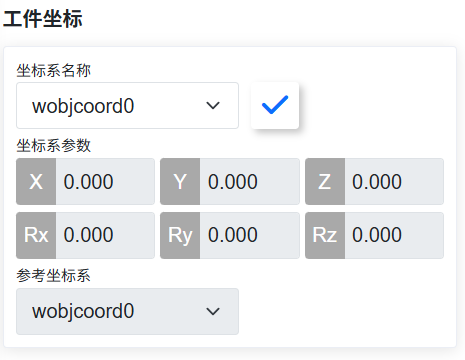

.. centered:: 圖表 15.3‑8 追蹤座標系設定

傳送帶追蹤追檢運動功能
+++++++++++++++++++++++++++++++++++

追檢運動屬於傳送帶追蹤運動的一種，與追蹤運動相比追檢運動的運動點示教無需在工件座標系上方進行示教運動，可以在工件座標系任意位置進行示教，再通過“追蹤起始距離”的參數進行末端與傳送帶同步運動，是一種比較靈活的追蹤方式。

傳送帶追蹤追檢運動功能簡介
+++++++++++++++++++++++++++++++++++

以下給出追檢運動範例以介紹運動特性。

.. figure:: process/041.png
   :align: center
   :width: 6in

.. centered:: 圖表 15.3‑9 傳送帶追蹤追檢運動示教範例

其中，以x為工件座標中傳送帶運動的方向，a為傳送帶平面，b為抓取目標工件，c為光電感測器，d為追蹤起始距離，e為追蹤終止距離。P1到P4為示教路點及其依次順序，P2到P3為相同路點，包含夾爪運動。

.. figure:: process/042.png
   :align: center
   :width: 6in

.. centered:: 圖表 15.3‑10 傳送帶追蹤追檢運動示教後執行範例

當上述示教程序開始執行，工件觸發光電開關訊號後，機器人會等待目標運動到P1下方後開始追蹤運動，機器人夾爪將如上圖所示軌跡運動。

追檢運動程序示教
+++++++++++++++++++++++++++++++++++

追檢運動程序邏輯與追蹤運動邏輯基本一致，包含獲取觸發訊號、獲取傳送帶資料以及開始追蹤運動部分。

**Step 1**：點擊“示教程序”，“程序程式設計”，選擇並點擊“外設指令”下屬的“傳送帶”按鈕進入傳送帶指令配置頁面。

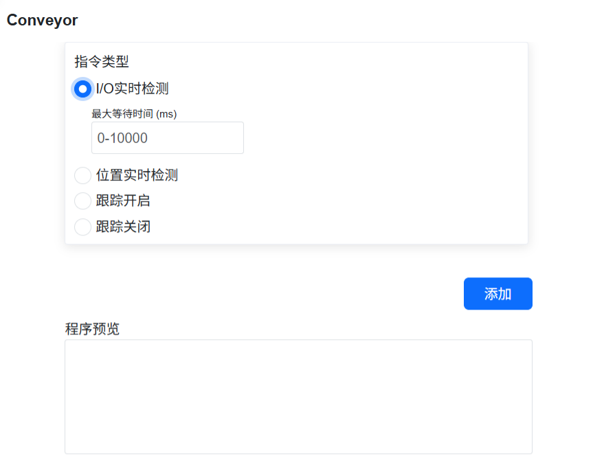

.. centered:: 圖表 15.3‑11 I/O即時監測指令

**Step 2**：點擊“I/O即時監測”並設定“最大等待示教(ms)”，即時檢測追蹤觸發訊號。點擊“加入”與“應用”按鈕將指令加入到程序中。

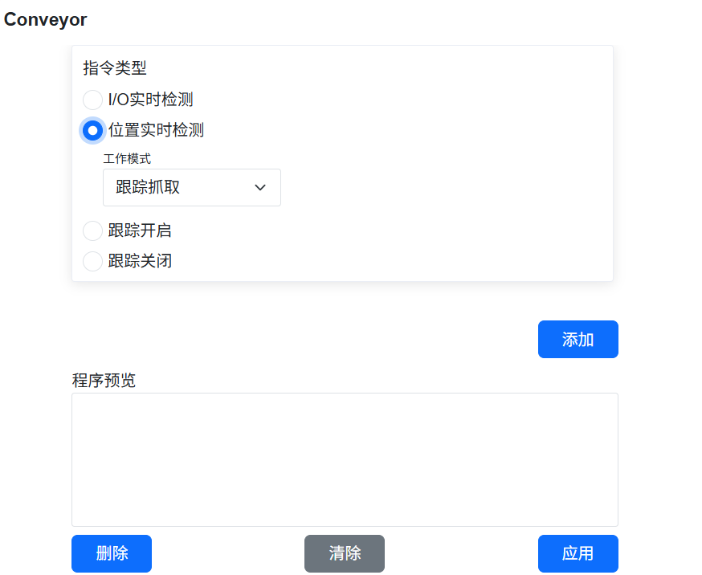

.. centered:: 圖表 15.3‑12 位置即時檢測指令

**Step 3**：點擊“位置即時檢測”並將工作模式選定“追蹤運動”。點擊“加入”與“應用”按鈕將指令加入到程序中。

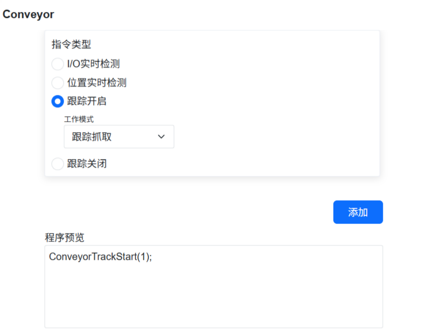

.. centered:: 圖表 15.3‑13 追蹤開啟指令

**Step 4**：點擊“追蹤開啟”並工作模式選定“追蹤運動”。點擊“加入”與“應用”按鈕將指令加入到程序中。

**Step 5**：示教在追蹤開啟後的笛卡爾空間運動以及夾爪外設運動，運動過程中將保持與傳送帶的追蹤同步運動。

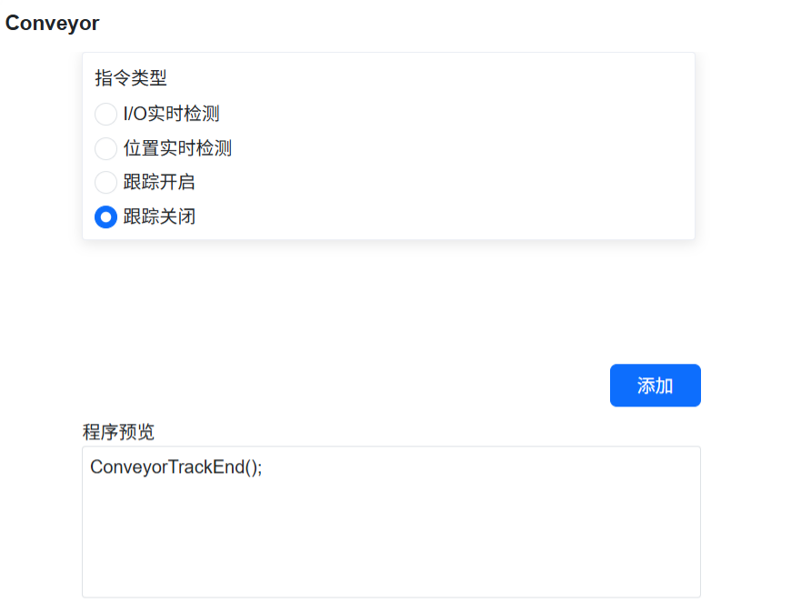

.. centered:: 圖表 15.3‑14 追蹤關閉指令

**Step 6**：點擊“追蹤關閉”並點擊“加入”與“應用”按鈕將指令加入到程序中。

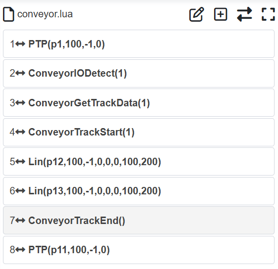

.. centered:: 圖表 15.3‑15 一段典型的傳送帶程序追蹤運動程序

當連續示教兩個相同的追蹤運動目標（可包含偏置距離），機器人運動將阻塞在該目標位置，實現持續同步追蹤直到追蹤距離達到終止追蹤距離為止。

.. figure:: process/048.png
   :align: center
   :width: 6in

.. centered:: 圖表 15.3‑16 一段典型的傳送帶阻塞追蹤抓取運動程序

當連續示教兩個相同的追蹤運動目標（可包含偏置距離），同時中間插入夾爪運動時，機器人將在該目標位置位置持續追蹤傳送帶直至夾爪運動完成，實現阻塞追蹤抓取。

矩陣移動指令優化功能
------------------------------------------------------------------
概述
~~~~~~~~~~~~~~~~~~~~~~~~~~~~~~~~~~~~~~~~~~~~~~

在CNC設備的自動化加工以及碼垛作業的過程中，矩陣移動指令廣泛應用於多個關鍵工序環節，包括毛坯上料、成品下料、工件翻轉、二次裝夾。通過在矩陣移動配方中示教矩陣三點確定矩陣位置，配置矩陣的行、列、層和運動路徑後，在指令界面可快速切換矩陣配方進行部署運行。

矩陣移動配方配置
~~~~~~~~~~~~~~~~~~~~~~~~~~~~~~~~~~~~~~~~~~~~~~

**Step1**：進入「輔助應用—>工藝包—>矩陣移動」界面，進行配方新增、編輯、重新命名和刪除操作；

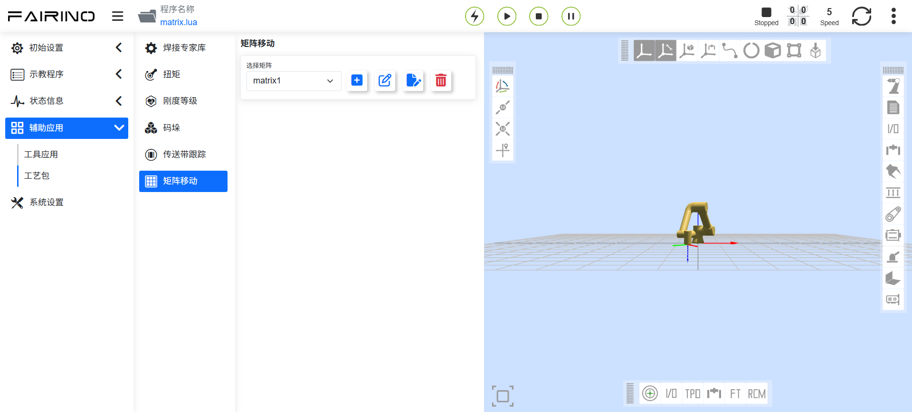

.. centered:: 圖表 15.4‑1 矩陣配方界面

.. note:: 
   .. image:: process/050.png
      :height: 0.75in
      :align: left

   名稱：**新增按鈕**
   
   作用：新增矩陣配方

.. note:: 
   .. image:: process/051.png
      :height: 0.75in
      :align: left

   名稱：**編輯按鈕**
   
   作用：編輯矩陣配方參數

.. note:: 
   .. image:: process/052.png
      :height: 0.75in
      :align: left

   名稱：**重新命名按鈕**
   
   作用：矩陣配方重新命名

.. note:: 
   .. image:: process/053.png
      :height: 0.75in
      :align: left

   名稱：**刪除按鈕**
   
   作用：刪除矩陣配方

**Step2**：新增矩陣配方。點擊「新增」按鈕，彈出「新增矩陣」模態窗，輸入矩陣名稱（禁止輸入特殊字元,只允許輸入數字常用漢字和下劃線「_」）後進入配方詳情界面輸入行數、層數、列數、層高、運動配置和過渡點偏移量X、Y、Z，示教矩陣三個路徑點。點擊「配置」按鈕確認配置。

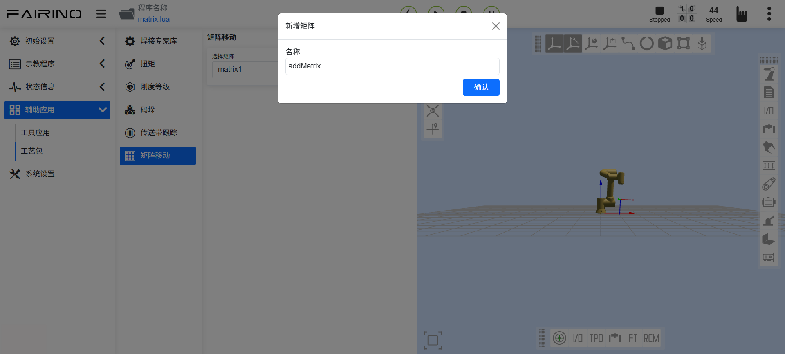

.. centered:: 圖表 15.4‑2 新增矩陣彈出模態窗

.. figure:: process/055.png
   :align: center
   :width: 4in

.. centered:: 圖表 15.4‑3 第一路徑點示教

.. figure:: process/057.png
   :align: center
   :width: 4in

.. centered:: 圖表 15.4‑4 第二路徑點示教

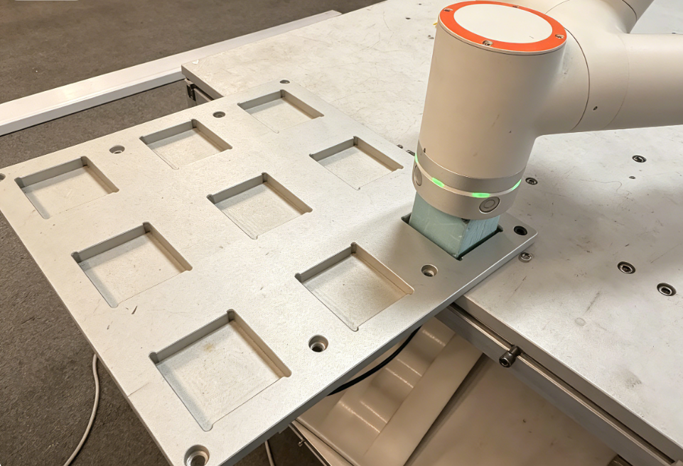

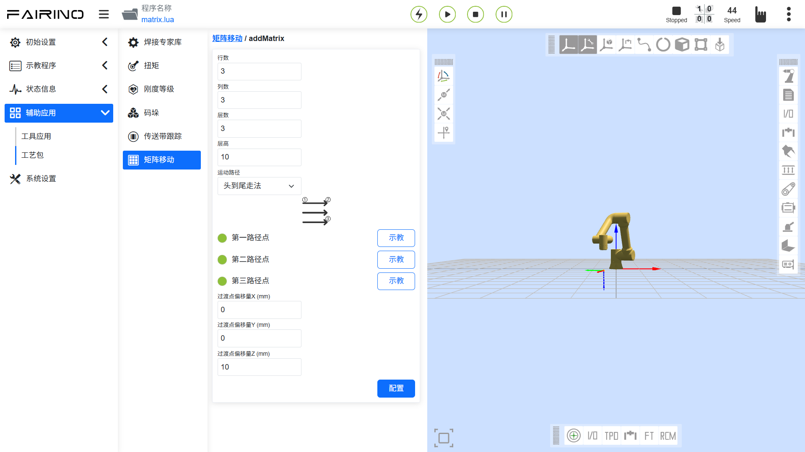

.. centered:: 圖表 15.4‑5 第三路徑點示教

運動路徑分為頭到尾走法和弓字形走法。說明如下：

**頭到尾走法**：從左向右走完第一行回到左側起點，再從左向右走完第二行再回到左側起點，從左向右走完第三行，直到覆蓋完成。

.. figure:: process/061.png
   :align: center
   :width: 1in

.. centered:: 圖表 15.4‑6 頭到尾走法

**弓字形走法**：從左向右走完第一行，垂直向下移動，再從右向左走完第二行。再垂直向下移動，再從左向右走完第三行，直到區域覆蓋完成。

.. figure:: process/062.png
   :align: center
   :width: 1in

.. centered:: 圖表 15.4‑7 弓字形走法

**Step3**：配方編輯、重新命名和刪除。點擊「編輯」按鈕，獲取當前選擇矩陣配方的數據，根據需求修改參數或重新示教路徑點即可。當需要重新命名時，點擊「重新命名」按鈕，輸入名稱後再次點擊「重新命名」按鈕完成重新命名。點擊「刪除」按鈕，需要二次確認是否刪除矩陣配方，再次點擊「刪除」按鈕後確認刪除。如下圖：

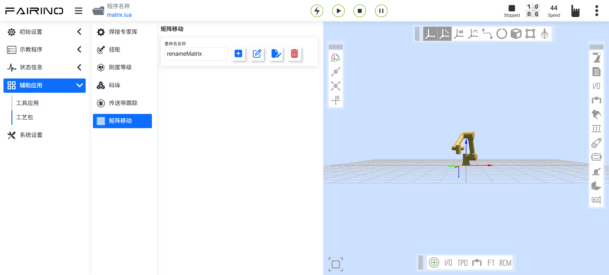

.. centered:: 圖表 15.4‑8 矩陣配方重新命名

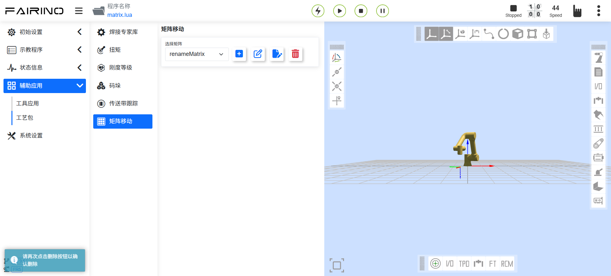

.. centered:: 圖表 15.4‑9 矩陣配方刪除提示

矩陣移動指令添加
~~~~~~~~~~~~~~~~~~~~~~~~~~~~~~~~~~~~~~~~~~~~~~

**Step1**：進入「示教程序->程序編程->碼垛指令->矩陣移動」界面後，查看界面是否存在配方。當未創建配方時，顯示提示內容，在提示語下方可點擊「配置」按鈕快速進入「輔助應用->工藝包->矩陣移動」界面。如下圖所示：

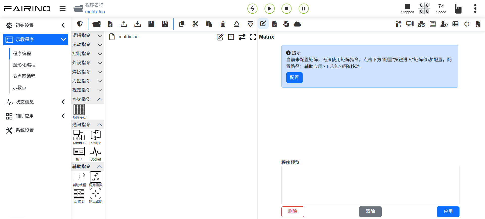

.. centered:: 圖表 15.4‑10 矩陣移動指令無配方界面

存在配方時，顯示矩陣移動指令界面。當前指令類型為：

- **矩陣移動**：設置機器人移動到上下料抓取作業的過渡點；
- **矩陣運行計數**：機器人上下料抓取完成後進行第幾行第幾列第幾層計數；
- **配置起始計數**：設置機器人上下料抓取時從第幾行第幾列第幾層開始；
- **獲取矩陣計數**：獲取機器人上下料抓取完成到第幾行第幾列第幾層。

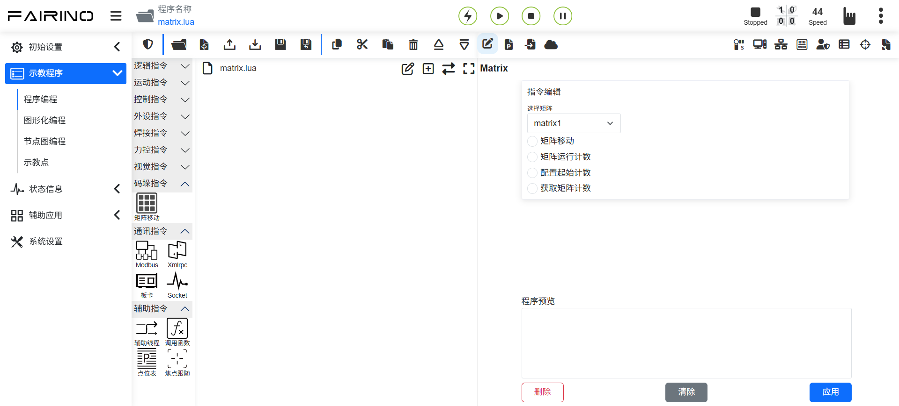

.. centered:: 圖表 15.4‑11 矩陣移動指令存在配方界面

**Step2**：添加「矩陣移動」指令。新建程序名稱為「matrix」，選擇配方「matrix1」，移動方向「下移」，速度輸入100。機器人從安全點移動到過渡點後再運行到抓取點。點擊「添加」按鈕後應用到程序中。如下圖所示：

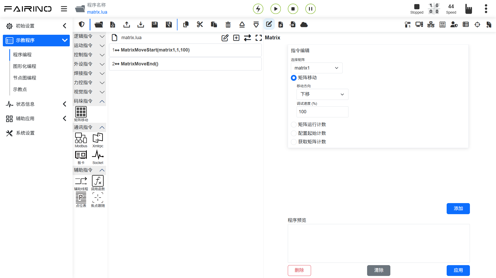

.. centered:: 圖表 15.4‑12 矩陣移動指令下移

**Step3**：添加「矩陣運行計數」指令。選擇配方「matrix1」，點擊「添加」按鈕後應用到程序中。如下圖所示：

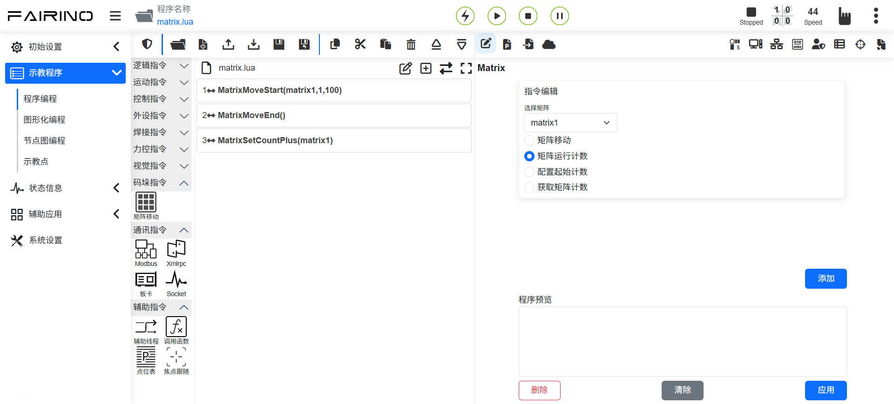

.. centered:: 圖表 15.4‑13 矩陣運行計數指令

**Step4**：添加「矩陣移動」指令。選擇配方「matrix1」，移動方向「上移」，速度輸入100。機器人從抓取點移動到過渡點後回到安全點。點擊「添加」按鈕後應用到程序中。如下圖所示：

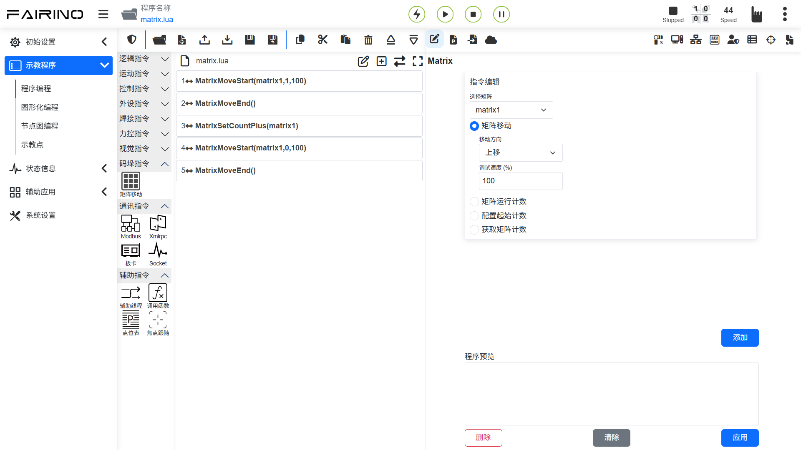

.. centered:: 圖表 15.4‑14 矩陣移動指令上移

**Step5**：添加while指令進行始終循環。點擊「儲存」按鈕，儲存程序，切換自動模式運行程序。機器人一直進行矩陣移動的上下料抓取作業。如下圖所示：

.. figure:: process/070.png
   :align: center
   :width: 6in

.. centered:: 圖表 15.4‑15 矩陣移動指令運行

**Step6**：添加「配置起始計數」指令。選擇配方「matrix1」，輸入行數1、列數1、層數1。點擊「添加」按鈕後應用到程序中。如下圖所示：

.. note:: 輸入的行數、列數、層數，在此基礎上加1代表實際的行數、列數和層數。即輸入行數1、列數1、層數1，實際機器人從指定位置第2行第2列第2層開始運行。

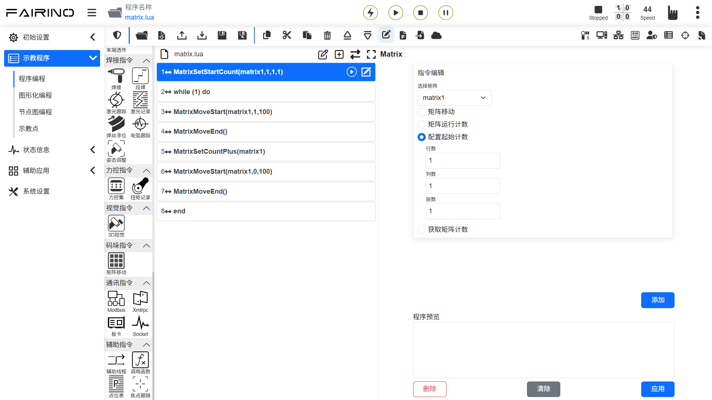

.. centered:: 圖表 15.4‑16 配置起始計數指令

**Step7**：當矩陣發送改變時，進入「輔助應用->工藝包->矩陣移動」界面，選擇矩陣配方「matrix1」，點擊編輯按鈕修改參數後，點擊配置按鈕即可完成矩陣修改。此時回到程序編程界面，打開程序「matrix」後，直接運行即可進行新的矩陣場景作業。

.. centered:: 圖表 15.4‑17 修改矩陣配方