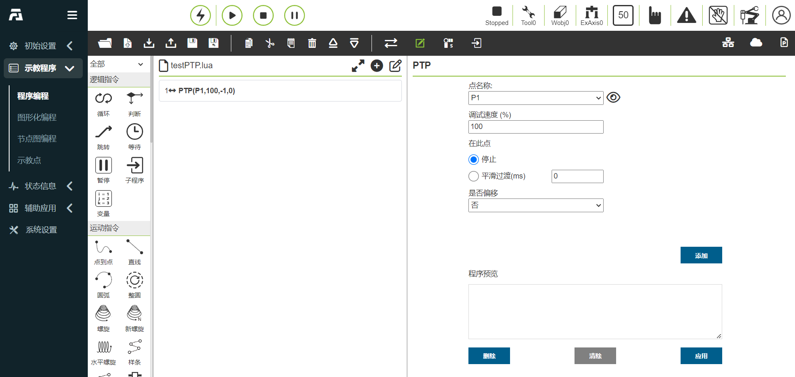
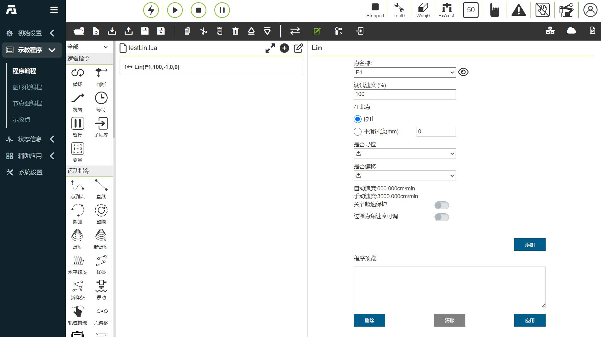

機器人快速編程 
=====================

簡單運動指令介紹
--------------------

**PTP指令**：點選「點到點」圖示進入PTP指令編輯介面。

可以選擇需要到達的點，平滑過渡時間設置可以實現該點到下一點的運動是連續的，是否偏移設置，可以選擇基於基坐標系偏移和基於工具坐標偏移，並彈出x,y, z,rx,ry,rz偏移量設置，PTP具體路徑為運動控制器自動規劃的最優路徑，點選「新增」、「套用」後可儲存該條指令。

.. centered:: 圖表 5.1‑1 PTP命令介面

**Lin指令**：點選「直線」圖示進入Lin指令編輯介面。

此指令功能與「PTP」指令相似，但該指令所到達點的路徑為直線。

.. centered:: 圖表 5.1‑2 Lin指令介面

對程序文件進行操作
--------------------

使用程式樹頂部的工具列修改程式樹。

.. note:: 
   .. image:: coding/006.png
      :height: 0.75in
      :align: left

   名稱：**打開**

   作用：開啟使用者程式文件

.. note:: 
   .. image:: coding/007.png
      :height: 0.75in
      :align: left

   名稱：**新建**

   作用：選擇範本新建程式文件
   
.. note:: 
   .. image:: coding/008.png
      :height: 0.75in
      :align: left

   名稱：**導入**

   作用：匯入檔案到使用者程式資料夾中

.. note:: 
   .. image:: coding/009.png
      :height: 0.75in
      :align: left

   名稱：**導出**

   作用：匯出使用者程式文件到本地點

.. note:: 
   .. image:: coding/010.png
      :height: 0.75in
      :align: left

   名稱：**儲存**

   作用：儲存文件編輯內容。

.. note:: 
   .. image:: coding/011.png
      :height: 0.75in
      :align: left

   名稱：**另存為**

   作用：給檔案重新命名存放到使用者程式或範本程式資料夾中

.. note:: 
   .. image:: coding/012.png
      :height: 0.75in
      :align: left

   名稱：**複製**

   作用：複製一個節點，並允許將其用於其他操作（例如：將其貼上到程式樹的其他位置）

.. note:: 
   .. image:: coding/013.png
      :height: 0.75in
      :align: left

   名稱：**貼上**

   作用：允許您貼上先前剪下或複製的節點

.. note:: 
   .. image:: coding/014.png
      :height: 0.75in
      :align: left

   名稱：**剪切**

   作用：剪下一個節點，並允許將其用於其他操作（例如：將其貼到程式樹的其他位置）

.. note:: 
   .. image:: coding/015.png
      :height: 0.75in
      :align: left

   名稱：**刪除**

   作用：從程式樹中刪除一個節點

.. note:: 
   .. image:: coding/016.png
      :height: 0.75in
      :align: left

   名稱：**上移**

   作用：向上移動該節點

.. note:: 
   .. image:: coding/017.png
      :height: 0.75in
      :align: left

   名稱：**下移**

   作用：向下移動該節點

.. note:: 
   .. image:: coding/018.png
      :height: 0.75in
      :align: left

   名稱：**切換編輯模式**

   作用：程式樹模式和lua編輯模式互相切換

寫運行一個程式
--------------------

左側主要是程式指令的添加，點選各關鍵字上方圖示進入右側程式指令添加的詳細介面，程式指令加入檔案的操作主要分為兩種：

- 1.開啟相關指令點選應用按鍵即可將該指令加入程式；
- 2.先點選「新增」按鍵，此時指令並未儲存到程式檔案中，需要再點選「應用」方可將指令儲存到檔案中。

第二種方式多出現在同類型指令多條下發的情況，我們對該類型命令增加添加按鍵和顯示已添加指令內容功能，點擊添加按鍵可添加一條指令，已添加指令顯示所有已添加的指令，點選「套用」即可將新增的指令儲存到右側已開啟的檔案中。

點選開始按鈕，執行程式；點選停止按鈕，停止程式運作；點選暫停/恢復按鈕，暫停/復原程式；程式執行時，目前執行的程式節點會灰色高亮顯示。

在手動模式下，點擊節點右側第一個圖示可以使機器人單獨執行該指令，第二個圖示為編輯該節點內容。

.. image:: coding/001.png
   :width: 6in
   :align: center

.. centered:: 圖表 5.3‑1 程式樹介面
