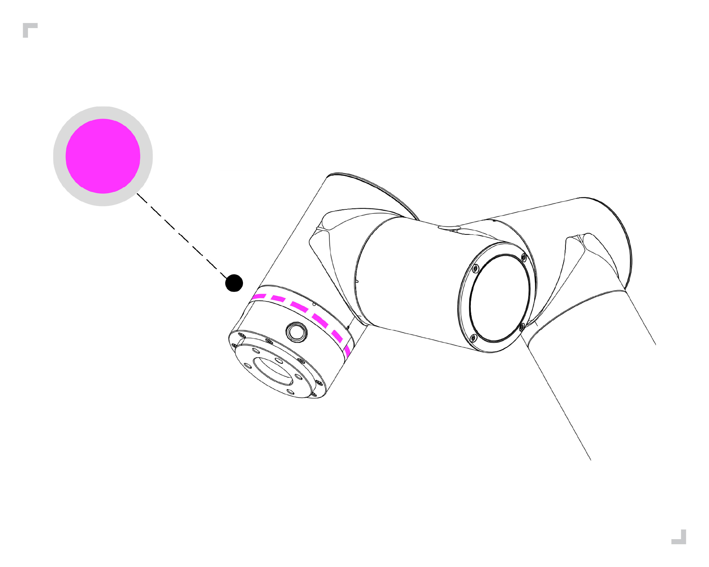
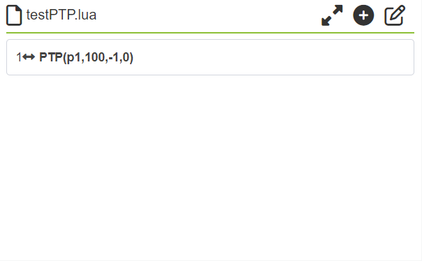
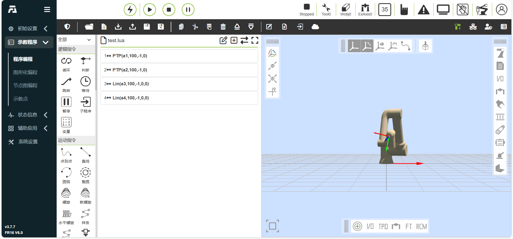

快速啟動機器人 
===================

.. toctree:: 
   :maxdepth: 5

安裝機器手臂和控制箱
----------------------------

根據 3.硬體安裝 中的 3.5 和 3.6 安裝連接機器手臂和控制箱。

- 開箱取出機器手臂，使用4顆強度不低於8.8級強度的M8螺栓安裝機器手臂。將機器手臂安裝在一個堅固且防震的表面，若用鋁板固定，鋁板厚度不小於16mm，若用鐵板固定，鐵板厚度不小於8mm；

- 將控制箱放置在其腳座上；

- 將機器手臂本體重載線連接到控制箱重載介面；

- 將按鈕盒航空插頭插到控制箱示教器介面；

- 確保控制箱電源按鈕關閉情況下（按鈕打到0）將電源線接到電源插口；

- 插上電源控制箱插頭。

.. warning::
 （1）如果機器人沒有安全地放置在堅固的表面上，機器人有可能會傾倒並造成傷害。

 （2）請勿快速對控制箱電源進行開關操作，建議控制箱電源開關OFF 到再次ON之間的時間大於1分鐘。

示教器啟動控制機器人
---------------------------

控制箱連接機器手臂、示教盒和任何週邊設備的實體電氣輸入/輸出端。必須打開控制箱才能為機器手臂通電。

- 按下控制箱的電源按鈕開啟控制箱；

- 啟動機器人後，此時機器人為手動模式且未使能，若需要在手動模式下操作機器人，需要按壓示教器上三位使能開關OFF（放開）⇒ ON ⇒ OFF（按壓），當開關處於ON 狀態時，拖曳或控制機器人運動。

- 若無需在手動模式操作機器人，可用示教器上鑰匙開關旋轉按鈕切換機器人工作模式：自動、手動、自訂；

- 切換機器人手動狀態時，應檢查安全空間內外是否有異常並謹慎操作機器運作；

- 當切換機器人自動狀態時，應檢查安全措施並恢復到正常狀態並謹慎操作機器運作；

- 當無法正常開啟示教器時，請檢查設備連接是否正常。

按鈕盒控制機器人運動
----------------------

參考 3.硬體安裝 的 3.6.3.末端LED定義 來控制機器人

未搭配示教器
~~~~~~~~~~~~~~~

- **Step1**：打開機器人控制箱電源開關，啟動機器人，等待末端LED長顯綠色後，方可操作機器人如下圖：

.. figure:: quick_start_robot/001.png
   :align: center
   :width: 4in

.. centered:: 圖表 4.3-1 末端LED綠色示意圖

- **Step2**：長按按鈕盒“按鍵2”，進入未搭配示教器模式，末端LED青藍色閃爍三下，如下圖：

.. figure:: quick_start_robot/002.png
   :align: center
   :width: 4in

.. centered:: 圖表 4.3-2 末端LED青藍示意圖

- **Step3**：長按按鈕盒「按鍵1」切換機器人到拖曳模式，此時末端LED為白青色，如圖表4.3-3。移動機器人至任何位置，長按「按鍵1」退出拖曳模式，短按按鈕盒「按鍵2」記錄P1點，末端LED紫色閃爍三下，如圖表4.3-4。

- **Step4**：移動機器人，短按按鈕盒「按鍵2」記錄P2點，末端LED紫色閃爍三下，如圖表4.3-4。

.. figure:: quick_start_robot/003.png
   :align: center
   :width: 4in

.. centered:: 圖表 4.3-3 末端LED白青色示意圖

.. centered:: 圖表 4.3-4 末端LED紫色示意圖

- **Step5**：長按按鈕盒「按鍵1」退出拖曳模式，此時為手動模式，末端LED為綠色，如圖表4.3-5。短按「按鍵1」切換機器人到自動模式，此時末端LED為藍色，如圖表4.3-6。

- **Step6**：短按按鈕盒「按鍵3」運行該程序，末端LED藍色閃爍兩下，如圖表4.3-6。

.. figure:: quick_start_robot/005.png
   :align: center
   :width: 4in

.. centered:: 圖表 4.3-5 末端LED綠色示意圖

.. figure:: quick_start_robot/006.png
   :align: center
   :width: 4in

.. centered:: 圖表 4.3-6 末端LED藍示意圖

-  **Step7**：短按按鈕盒「按鍵3」停止執行該程序，末端LED紅色閃爍三下，如下圖：

.. figure:: quick_start_robot/007.png
   :align: center
   :width: 4in

.. centered:: 圖表 4.3-7 末端LED紅色示意圖

搭配示教器
~~~~~~~~~~~~~~

- **Step1**：啟動機器人，等待末端LED綠色停止閃爍，方可操作機器人。

- **Step2**：開啟示教器進入程式編輯介面。

- **Step3**：選擇空白範本新建一個程式檔案。

- **Step4**：短按按鈕盒按鍵1切換機器人到手動模式，此時末端LED為綠色。

- **Step5**：長按按鈕盒按鍵1切換機器人到拖曳模式，此時末端LED為白青色，移動機器人至任意位置，短按按鈕盒按鍵2記錄P1點，末端LED紫色閃爍三下，手動新增「PTP(p1,100,-1,0)」指令到程式檔案中。

.. centered:: 圖表 4.3-8 記錄並新增點P1

- **Step6**：移動機器人，短按按鈕盒按鍵2記錄P2點，末端LED紫色閃爍三下，手動新增「PTP(p2,100,-1,0)」指令到程式中。

.. figure:: quick_start_robot/009.png
   :align: center
   :width: 4in

.. centered:: 圖表 4.3-9 記錄並新增點P2

- **Step7**：儲存程式檔案內容。

- **Step8**：長按按鈕盒按鍵1退出拖曳模式，此時為手動模式，末端LED為綠色，短按按鈕盒按鍵1切換機器人到自動模式，此時末端LED為藍色。

- **Step9**：短按按鈕盒按鍵3運行程序，末端LED藍色閃爍兩下。

示教器控制機器人運動
------------------------

點選示教器左側一級選單中的「示教程式」按鈕，點選其子選單「程式編程」進入程式示教介面，該介面中主要實作機器人示教程式的編寫以及修改。

點擊「新建」圖示按鈕後，使用者命名該文件，並選擇一個範本作為該新文件的內容，點擊新建即可建立成功並開啟該程式檔案。

   
.. centered:: 圖表 4.4-1 示教程序運行示意圖

.. warning::
 您的頭部和軀幹不能位於機器人可接觸到的範圍（工作區）。請不要將您的手指放在機器人可抓住的地方。

.. important::
 - 不要讓機器人移到自身或其他物體中，因為這會對機器人造成損害。
 - 這只是一個快速啟動指南，教您如何輕鬆地使用FR協作機器人。該指南的前提是環境安全無害，使用者謹慎小心。請不要將速度或加速度上調至預設值之上。在使機器人進入操作之前，請務必進行風險評估。
