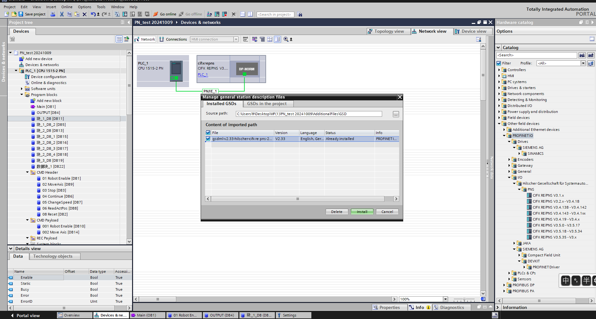
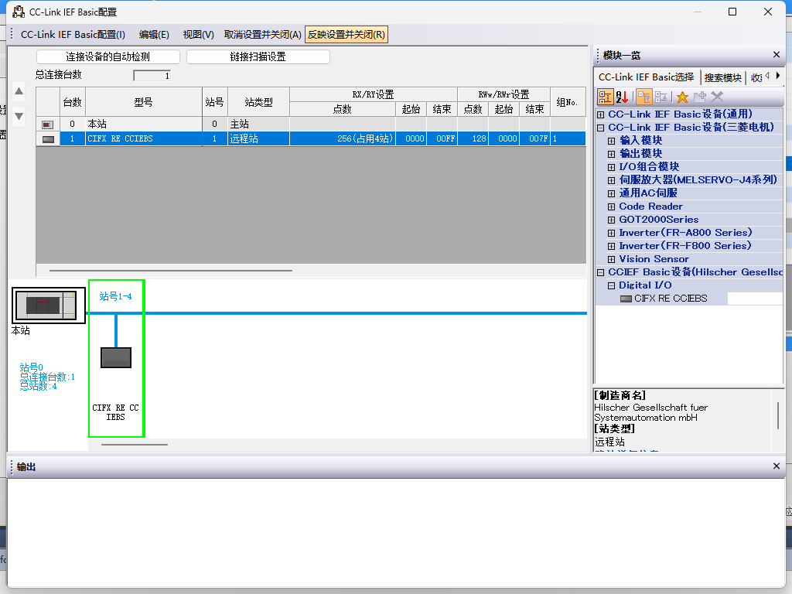
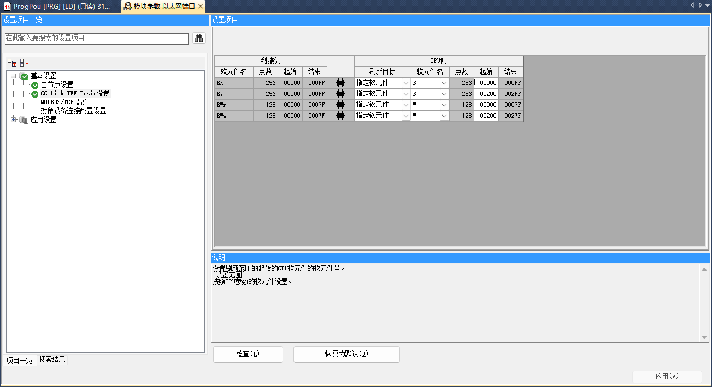
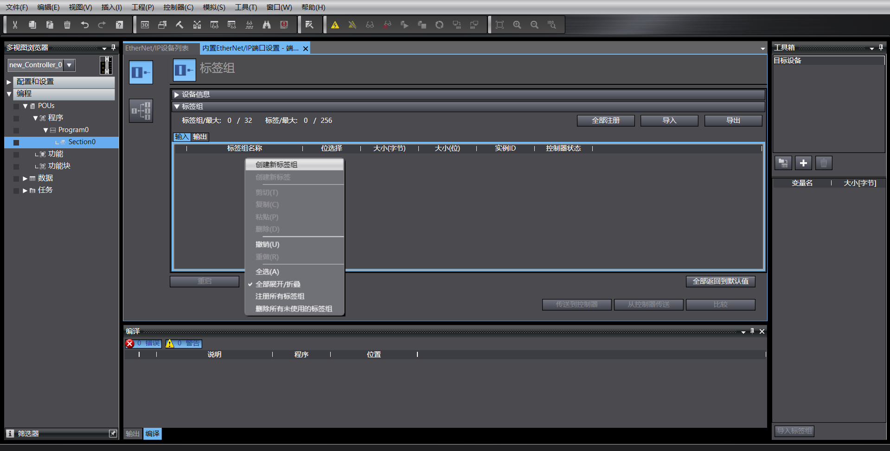
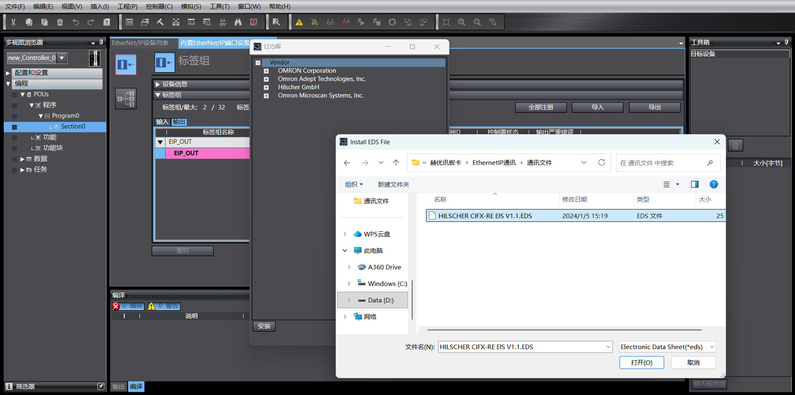
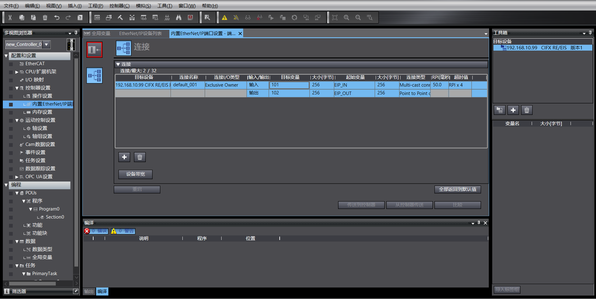
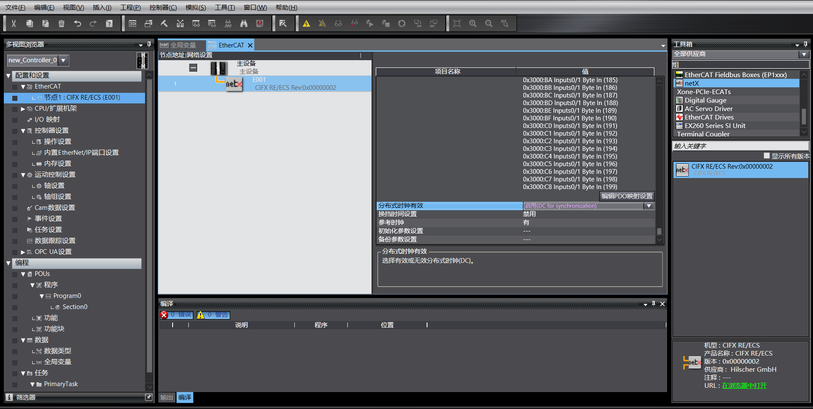
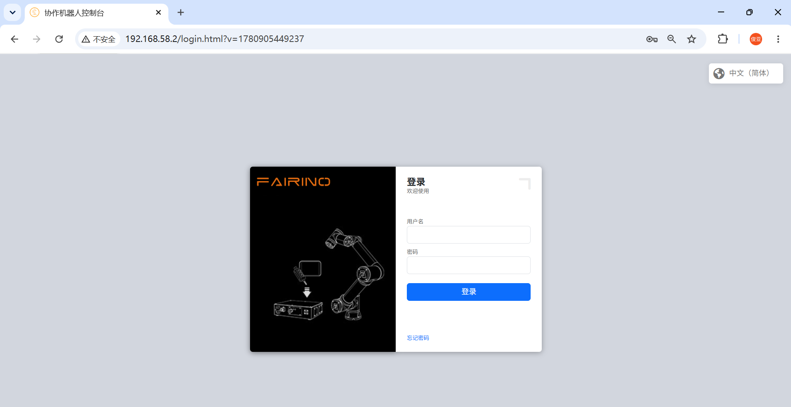
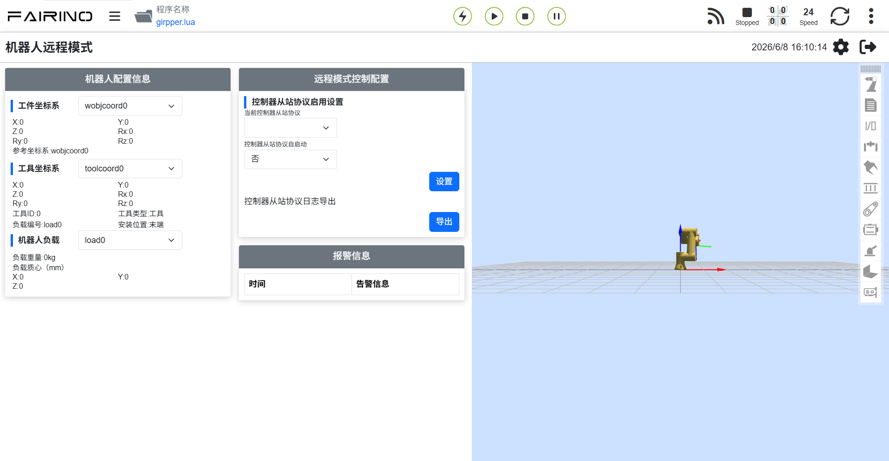

機器人遠程模式
=============================================================

.. toctree::
   :maxdepth: 6

概述
-------------------------

為了便於PLC通過不同的工業總線協議（CC-Link、Profinet、Ethernet/IP和EtherCAT）對機器人進行運動控制，在集成式mini控制箱上增加FRH-PCIeN-EC/EIP/CC/PN-RJ-V10板卡、FRJ-PCIeN-EIP/CC/PN-RJ-V10板卡模塊，實現功能如下：

1) CC-Link slave 協議支持；
2) Profinet slave 協議支持；
3) Ethernet/IP slave 協議支持；
4) EtherCAT slave 協議支持（FRJ-PCIeN-EIP/CC/PN-RJ-V10板卡不支持）。

環境配置
--------------------------------------------

板卡安裝
~~~~~~~~~~~~~~~~~~~~~~~~~~~~~~~~~~~~~~~~~~~~~

(1) 查驗物料：FRH-PCIeN 板卡、FRJ-PCIeN 板卡、配套鈑金件外形參照如下所示。

.. image:: remote_mode/001.png
   :width: 4in
   :align: center

.. centered:: 圖表 18.2-1 安裝鈑金（正面）

.. image:: remote_mode/002.png
   :width: 4in
   :align: center

.. centered:: 圖表 18.2-2 安裝鈑金（背面）

.. image:: remote_mode/003.png
   :width: 4in
   :align: center

.. centered:: 圖表 18.2-3 FRH-PCIeN-EC/EIP/CC/PN-RJ-V10板卡

.. image:: remote_mode/004.png
   :width: 4in
   :align: center

.. centered:: 圖表 18.2-4 FRJ-PCIeN-EIP/CC/PN-RJ-V10板卡

(2) 將板卡安裝到集成式mini控制箱，如圖所示。

.. image:: remote_mode/005.png
   :width: 4in
   :align: center

.. centered:: 圖表 18.2-5 鈑金安裝示意圖

.. image:: remote_mode/006.png
   :width: 4in
   :align: center

.. centered:: 圖表 18.2-6 FRH-PCIeN核心主板安裝示意圖

.. image:: remote_mode/007.png
   :width: 4in
   :align: center

.. centered:: 圖表 18.2-7 FRH-PCIeN網口（RJ45）擴展卡安裝示意圖

.. image:: remote_mode/008.png
   :width: 4in
   :align: center

.. centered:: 圖表 18.2-8 FRJ-PCIeN核心主板安裝示意圖

.. image:: remote_mode/009.png
   :width: 4in
   :align: center

.. centered:: 圖表 18.2-9 FRJ-PCIeN網口（RJ45）擴展卡安裝示意圖

.. note:: 註：所有螺釘均需擰緊。

(3) 機器人控制箱和PLC接線如下圖所示。

.. image:: remote_mode/010.png
   :width: 4in
   :align: center

.. centered:: 圖表 18.2-10 控制箱&三菱PLC接線圖

.. image:: remote_mode/011.png
   :width: 4in
   :align: center

.. centered:: 圖表 18.2-11 控制箱&西門子PLC接線圖

.. image:: remote_mode/012.png
   :width: 4in
   :align: center

.. centered:: 圖表 18.2-12 控制箱&歐姆龍PLC接線圖

.. image:: remote_mode/013.png
   :width: 4in
   :align: center

.. centered:: 圖表 18.2-13 控制箱&歐姆龍PLC接線圖

.. note::
    1：機器人控制箱（板卡網口）；
    2：交換機；
    3：筆記本PC；
    4：三菱PLC（CC-Link IEF Basic網口）；
    5：西門子PLC（Profinet網口）；
    6：歐姆龍PLC（Ethernet/IP網口）；
    7：歐姆龍PLC（EtherCAT網口）；

當協議切換為EtherCAT總線時，板卡的網口需要區分為EtherCAT_IN和EtherCAT_OUT，此時，歐姆龍PLC的EtherCAT網口需要與板卡的EtherCAT_IN網口通過一根網線直連。

PLC環境搭建
~~~~~~~~~~~~~~~~~~~~~~~~~~~~~~~~~~~~~~~~~~~~~~~~~~

實現各協議從站指令所搭建的測試環境如下表所示，其中包括各協議中所使用PLC的型號，固件版本及測試軟體。

.. centered:: 表 2-1 測試環境

.. list-table::
   :widths: 20 40 40
   :header-rows: 1
   :align: center

   * - 協議
     - Profinet
     - CC-link

   * - 品牌
     - 西門子
     - 三菱

   * - 型號
     - CPU 1515-2 PN
     - FX5S-30TR/DS

   * - 固件
     - 6ES75152AM020AB0
     - 30MR/ES V1.3

   * - 軟體
     - TIA Portal V17
     - GXWorks3V1.097B

   * - 板卡IP地址
     - “192.168.0.2”
     - “192.168.0.113”

   * - PLC IP地址
     - IP無需同網段
     - “192.168.0.15”(IP同網段)

.. list-table::
   :widths: 20 40 40
   :header-rows: 1
   :align: center

   * - 協議
     - Ethernet/IP
     - EtherCAT

   * - 品牌
     - 歐姆龍
     - 歐姆龍

   * - 型號
     - NX102-1100
     - NX102-1100

   * - 固件
     - V1.3
     - V1.3

   * - 軟體
     - SysmacStudioV1.50
     - SysmacStudioV1.50

   * - 板卡IP地址
     - “192.168.0.112”
     - “192.168.0.2”

   * - PLC IP地址
     - “192.168.0.88”(IP同網段)
     - “192.168.0.88” (IP同網段)

西門子Profinet
+++++++++++++++++++++++++++++++++++++++++++++++++++++++++++++

(1) GSD文件（XML文件）導入

打開西門子編程軟體TIA Portal V17，新建PLC工程，選擇“設備與網絡”，右側“硬體目錄”選擇雙擊6ES7 515-2AM02-0AB0添加PLC模塊。

.. image:: remote_mode/014.png
   :width: 6in
   :align: center

在 TIA PORTAL 軟體中菜單欄選擇“選項”->“管理通用站描述文件(GSD)”可安裝或刪除已經安裝完成的 GSD 文件。

.. image:: remote_mode/015.png
   :width: 6in
   :align: center

安裝 GSD 文件，如上選擇“管理通用站描述文件(GSD)”，出現“管理通用站描述文件”窗口。

從“源路徑”選擇要安裝 GSD 文件的文件夾，從所顯示 GSD 文件的列表中選擇要安裝的一個或者多個文件，單擊“安裝”按鈕。如下圖所示。

安裝成功後，可在硬體目錄下，其它現場設備找到安裝的 GSD 文件的設備，如下圖所示。

.. image:: remote_mode/017.png
   :width: 6in
   :align: center

分配IO：目錄尋找模塊拖動Input與Output。

.. image:: remote_mode/018.png
   :width: 6in
   :align: center

下載程序到設備：左側項目樹雙擊進入“設備和網絡”，右擊“PLC_1”模塊，下拉菜單選擇“下載到設備”，單機“硬體和軟體（僅更改）”：

.. image:: remote_mode/019.png
   :width: 6in
   :align: center

搜索並下載設備：彈窗後如下圖配置PG/PC接口類型，點擊開始搜索，選擇需要下載程序的設備，點擊下載：

.. image:: remote_mode/020.png
   :width: 6in
   :align: center

.. image:: remote_mode/021.png
   :width: 6in
   :align: center

三菱CC-link
++++++++++++++++++++++++++++++++++++++++++++++++++++

(1) 導入配置文件
打開GxWorks3,選擇“工具”→“配置文件管理”→“登錄”，出現彈窗後選擇對應的通訊文件，點擊登錄，完成配置文件導入。

.. image:: remote_mode/022.png
   :width: 6in
   :align: center

.. image:: remote_mode/023.png
   :width: 6in
   :align: center

.. image:: remote_mode/024.png
   :width: 6in
   :align: center

(2) CC-Link IEF Basic設置

建立PLC工程，開啟使用CC-link：左側導航菜單欄選擇“以太網端口”，設置PLC ip地址，保證與赫優訊板卡地址同網段。點擊“CC-link IEF Basic使用有無”，選擇 “使用”。

.. image:: remote_mode/025.png
   :width: 6in
   :align: center

CC-Link 網絡配置設置：同樣在CC-Link IEF Basic設置，選擇“網絡配置設置”，模塊選擇赫優訊CIFX Digital I/O模塊。拖拽到視圖左下方，完成硬體配置。

CC-Link 刷新設置：同樣在CC-Link IEF Basic設置，點擊刷新設置，自定義傳輸設置：256字節接收，256字節發送。

(3) 程序下載

打開測試程序後，點擊“在線”→“寫入至可編程控制器”進入下載界面

.. image:: remote_mode/028.png
   :width: 6in
   :align: center

打開下載界面後，點擊左上方“參數+程序”，再點擊右下角“執行”進行下載，等待下載完成。

.. image:: remote_mode/029.png
   :width: 6in
   :align: center

歐姆龍Ethernet/IP
++++++++++++++++++++++++++++++++++++++++++++++++++++++++

(1) 新建PLC工程（本次案例以型號：NX102-1100，1.47歐姆龍PLC為例）：

.. image:: remote_mode/030.png
   :width: 6in
   :align: center

新建全局變量：

.. image:: remote_mode/031.png
   :width: 6in
   :align: center

(2) EDS文件導入

點擊“工具”→“EtherNet/IP連接設置”：

.. image:: remote_mode/032.png
   :width: 6in
   :align: center

進入要連接PLC的設置：

.. image:: remote_mode/033.png
   :width: 6in
   :align: center

在標籤組空白處右鍵創建新標籤組：

右鍵新建的標籤組，創建標籤,輸入赫輸出一樣，長度均為256個字節：

.. image:: remote_mode/035.png
   :width: 6in
   :align: center

.. image:: remote_mode/036.png
   :width: 6in
   :align: center

進入連接設置，右鍵工具箱空白處，右鍵顯示EDS庫：

.. image:: remote_mode/037.png
   :width: 6in
   :align: center

安裝EDS文件：

點擊“工具箱”“+”，添加目標設備，填寫目標設備IP地址：

.. image:: remote_mode/039.png
   :width: 6in
   :align: center

右下角點擊“添加”，添加成功後顯示目標設備：

.. image:: remote_mode/040.png
   :width: 6in
   :align: center

(3) EtherNet/IP 參數設置

右鍵添加的目標設備，點擊“編輯”：

.. image:: remote_mode/041.png
   :width: 6in
   :align: center

當前設備數據映射長度為256個字節，將0001和0002改為256，確定：

.. image:: remote_mode/042.png
   :width: 6in
   :align: center

雙擊目標設備，填寫輸入和輸出，選擇起始變量：

(4) 程序下載

打開測試程序，將PLC IP地址修改為與板卡同網段，下載程序後運行。

歐姆龍EtherCAT
+++++++++++++++++++++++++++++++++++++++++++++++++

(1) 新建PLC工程（本次案例以型號：NX102-1100，1.47歐姆龍PLC為例）：

.. image:: remote_mode/044.png
   :width: 6in
   :align: center

新建全局變量：

.. image:: remote_mode/045.png
   :width: 6in
   :align: center

(2) XML文件導入

雙擊“EtherCAT”後進入主站設置界面，右鍵選擇“顯示ESI庫”

.. image:: remote_mode/046.png
   :width: 6in
   :align: center

.. image:: remote_mode/047.png
   :width: 6in
   :align: center

在右側工具箱選中添加的目標設備，雙擊添加從站：

.. image:: remote_mode/048.png
   :width: 6in
   :align: center

(3) EtherCAT從站設置

將從站“分佈式時鐘有效”設置為“啟動DC”：

(4) I/O映射

雙擊“I/O映射”，進行變量與地址綁定：

.. image:: remote_mode/050.png
   :width: 6in
   :align: center

(5) 程序下載

打開測試程序，將PLC IP地址修改為與板卡同網段，下載程序後運行。

機器人遠程模式相關操作說明
----------------------------------------------------------------------------

(1) 瀏覽器IP輸入192.168.58.2，賬號為admin，密碼為123，點擊“登錄”，進入機器人控制箱Web界面。

.. centered:: 圖表 18.2-14 控制箱Web界面

(2) 點擊“系統設置”->“關於”->軟體升級界面，點擊“升級”按鈕，上傳待升級的軟體包，點擊“升級”開始升級，升級完成重啟控制箱即可。

.. image:: remote_mode/052.png
   :width: 6in
   :align: center

.. centered:: 圖表 18.2-15 軟體升級

(3) 點擊右上角擴展按鈕，打開菜單欄，點擊本地模式，即可切換到遠程模式。

.. image:: remote_mode/053.png
   :width: 4in
   :align: center

.. centered:: 圖表 18.2-16 切換遠程模式

(4) 選擇控制器從站協議，以及是否需要自啟動功能，點擊“設置”按鈕。

.. centered:: 圖表 18.2-17 配置通訊協議

.. note:: 切換不同的協議，需要先點擊“卸載”按鈕，再進行其他協議的配置。

附錄
-------------------

指令列表
~~~~~~~~~~~~~~~~~~~~~~~~~~~

.. list-table::
   :widths: 20 80
   :header-rows: 1
   :align: center

   * - 命令碼
     - 指令描述

   * - 0x1000
     - 機器人使能

   * - 0x1001
     - 重置所有錯誤

   * - 0x1002
     - 機器人停止運動

   * - 0x1003
     - 讀取實際位置

   * - 0x1004
     - 設置機器人速度

   * - 0x1005
     - 機器人繼續運動

   * - 0x1006
     - 機器人暫停運動

   * - 0x1007
     - 根據joint位置計算出笛卡爾位置

   * - 0x1008
     - 根據笛卡爾位置計算出joint位置

   * - 0x2000
     - 寫工具信息

   * - 0x2001
     - 讀工具信息

   * - 0x2002
     - 寫工件信息

   * - 0x2003
     - 讀工件信息

   * - 0x2004
     - 寫負載信息

   * - 0x2005
     - 讀負載信息

   * - 0x2006
     - 寫reference dynamic信息

   * - 0x2007
     - 讀reference dynamic信息

   * - 0x2008
     - 寫default dynamic信息

   * - 0x2009
     - 讀default dynamic信息

   * - 0x2010
     - 寫軟限位信息

   * - 0x2011
     - 讀軟限位信息

   * - 0x3000
     - MoveAxes（基於關節角度）

   * - 0x3001
     - MoveLinear

   * - 0x3002
     - MoveDirect（基於笛卡爾坐標系）

   * - 0x3003
     - jog運動

   * - 0x3004
     - jog停止