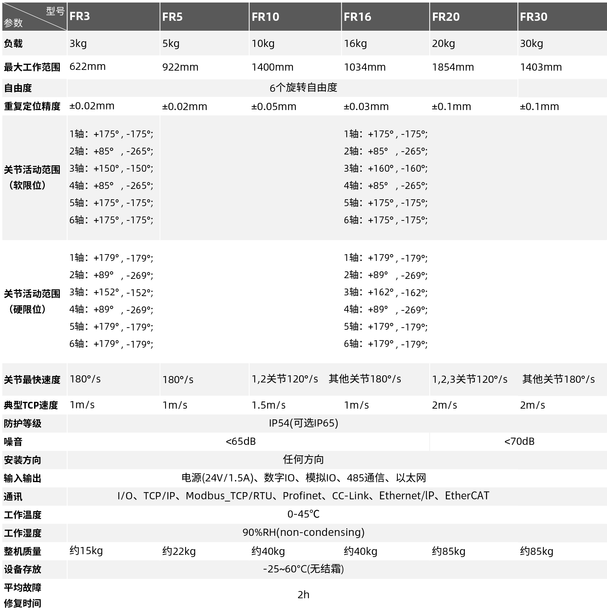
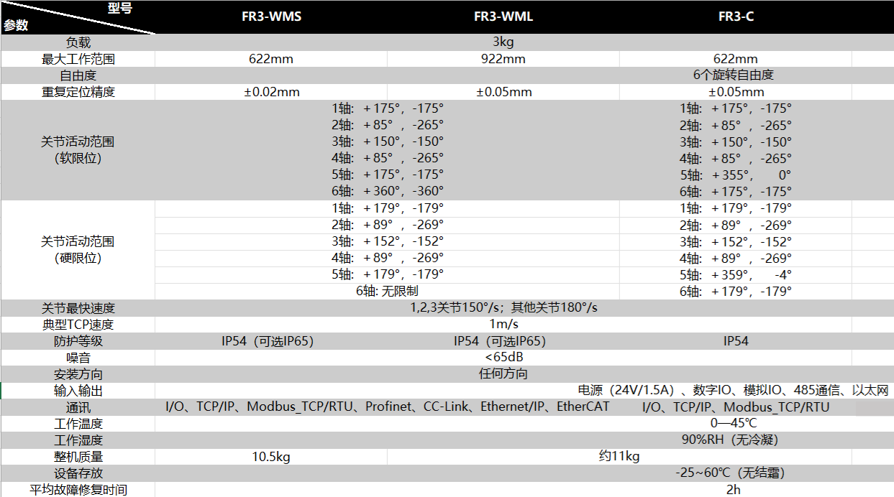
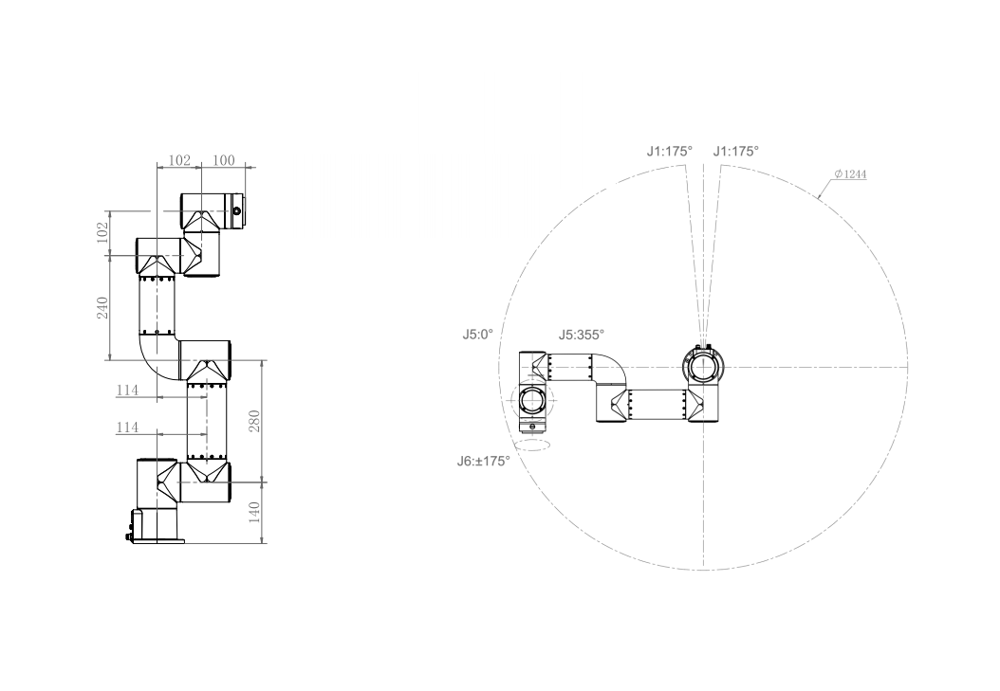
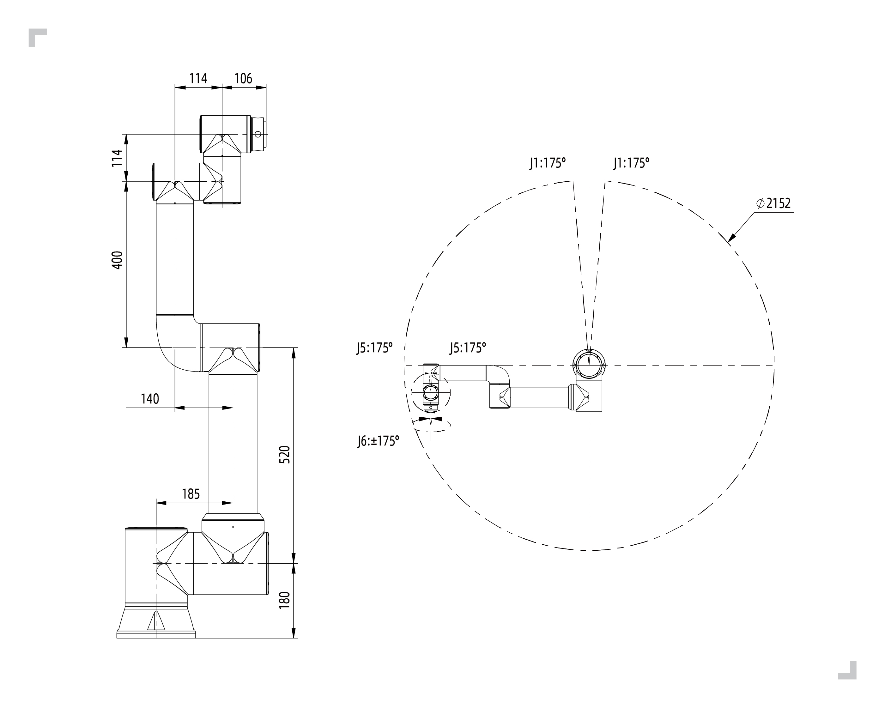
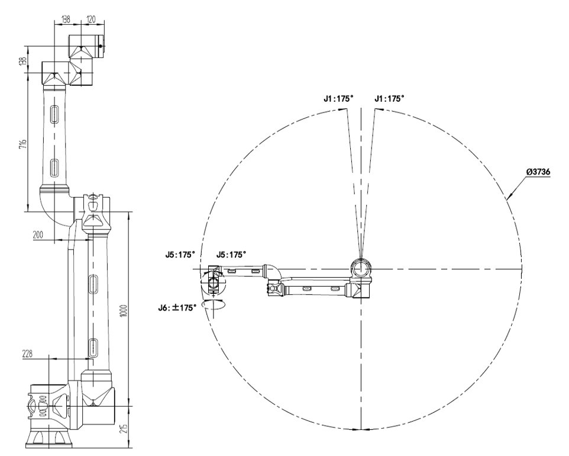
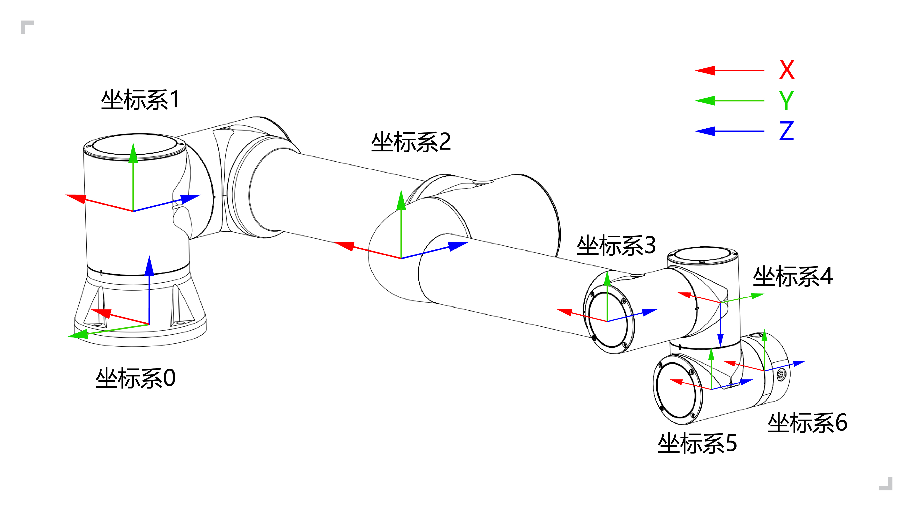
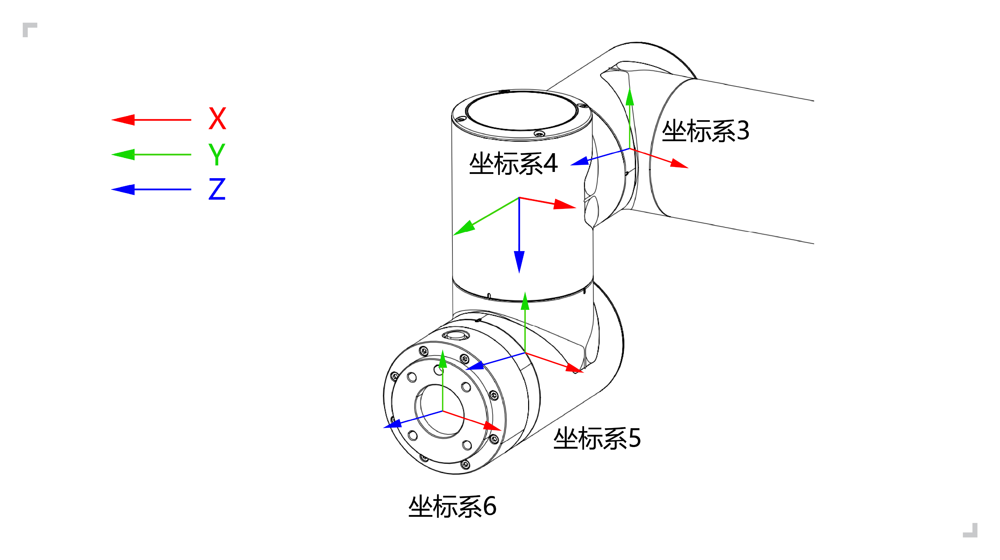

機器人簡介 
===================

.. toctree:: 
	:maxdepth: 5

基本參數
-----------

.. centered:: 表格 2.1-1 機器人基本參數

.. important::
  FR系列機器人在做姿態或座標系變換時齊次變換矩陣計算的角度旋轉順序為浮動座標系的「ZYX」。

運動範圍
----------

機械手臂安裝空間：

機器人本體安裝需要3m×3m×2m（長×寬×高）的空間，以滿足機器人最大臂展下的運動；若使用者自行增加末端負載，請確保安裝空間留有最少500mm間隙。

.. note::
  高度空間受安裝底座高度的影響，此處2m是指高出安裝基準面的距離

控制櫃安裝空間：

1. 控制箱應放在易於操作，防止水淹觸電，距離地面0.6m-1.5m。

2. 櫃體必須遠離熱源。

3. 控制箱重載線一側應滿足150mm以內無遮擋，其餘側滿足100mm以內無遮擋，便於散熱和取放。

.. figure:: installation/018.png
	:align: center
	:width: 6in

.. centered:: 圖表 2.2-1 FR3型號協作機器人運動範圍

.. figure:: installation/103.png
	:align: center
	:width: 6in

.. centered:: 圖表 2.2-2 FR3-WML型號協作機器人運動範圍

.. figure:: installation/104.png
	:align: center
	:width: 6in

.. centered:: 圖表 2.2-3 FR3-WMS型號協作機器人運動範圍

.. centered:: 圖表 2.2-4 FR3-C型號協作機器人運動範圍

.. figure:: installation/019.png
	:align: center
	:width: 6in

.. centered:: 圖表 2.2-5 FR5型號協作機器人運動範圍

.. figure:: installation/020.png
	:align: center
	:width: 6in

.. centered:: 圖表 2.2-6 FR10型號協作機器人運動範圍

.. centered:: 圖表 2.2-7 FR16型號協作機器人運動範圍

.. figure:: installation/022.png
	:align: center
	:width: 6in

.. centered:: 圖表 2.2-8 FR20型號協作機器人運動範圍

.. figure:: installation/068.png
	:align: center
	:width: 6in

.. centered:: 圖表 2.2-9 FR30型號協作機器人運動範圍

.. centered:: 圖表 2.2-10 FR30L型號協作機器人運動範圍

機器人座標系
---------------

.. centered:: 圖表 2.3-1 機器人DH參數座標系

.. centered:: 圖表 2.3-2 機器人末端法蘭座標系

機器人DH參數
--------------

DH參數用於計算 FR 系列協作機器人的運動學和動力學。

.. figure:: installation/063.png
	:align: center
	:width: 6in

.. centered:: 圖表 2.4-1 FR系列協作機器人DH參數

FR系列協作機器人DH參數顯示如下：

.. centered:: 表格 2.4-1 FR3 協作機器人DH參數表

.. list-table::
   :widths: 70 50 50 50 50 70 50 120
   :header-rows: 0
   :align: center
   :class: no-padding sheet-center

   * - **運動學**
     - **theta[rad]**
     - **a[m]**
     - **d[m]**
     - **alpha[rad]**
     - **動力學**
     - **Mass[kg]**
     - **Center of Mass[m]**

   * - Joint1
     - 0
     - 0
     - 140
     - π/2
     - Link1
     - 1.98
     - [-0.05, -15.92, 2.26]

   * - Joint2
     - 0
     - -280
     - 0
     - 0
     - Link2
     - 3.4445
     - [139.49, 0, 99.54]

   * - Joint3
     - 0
     - -240
     - 0
     - 0
     - Link3
     - 1.437
     - [58.99, 0.08, 12.99]

   * - Joint4
     - 0
     - 0
     - 102
     - π/2
     - Link4
     - 0.871
     - [0.05, -2.33, 14.67]

   * - Joint5
     - 0
     - 0
     - 102
     - -π/2
     - Link5
     - 0.805
     - [-0.05, 2.33, 14.67]

   * - Joint6
     - 0
     - 0
     - 100
     - 0
     - Link6
     - 0.261
     - [-0.05, -1.11, -20.05]

.. centered:: 表格 2.4-2 FR3-WMS 協作機器人DH參數表

.. list-table::
   :widths: 70 50 50 50 50 70 50 120
   :header-rows: 0
   :align: center
   :class: no-padding sheet-center

   * - **運動學**
     - **theta[rad]**
     - **a[m]**
     - **d[m]**
     - **alpha[rad]**
     - **動力學**
     - **Mass[kg]**
     - **Center of Mass[m]**

   * - Joint1
     - 0
     - 140
     - 0
     - π/2
     - Link1
     - 1.66
     - [-0.06，-13.58，1.68]

   * - Joint2
     - 0
     - 0
     - -280
     - 0
     - Link2
     - 3.68
     - [140.11，0，101.71]

   * - Joint3
     - 0
     - 0
     - -240
     - 0
     - Link3
     - 1.81
     - [63.49，0.1，10.94]

   * - Joint4
     - 0
     - 102
     - 0
     - π/2
     - Link4
     - 1.18
     - [0.07，-2.18，12.48]

   * - Joint5
     - 0
     - 102
     - 0
     - -π/2
     - Link5
     - 1.18
     - [-0.07，2.18，12.48]

   * - Joint6
     - 0
     - 100
     - 0
     - 0
     - Link6
     - 0.28
     - [1.81，1.33，-20.41]

.. centered:: 表格 2.4-3 FR3-WML 協作機器人DH參數表

.. list-table::
   :widths: 70 50 50 50 50 70 50 120
   :header-rows: 0
   :align: center
   :class: no-padding sheet-center

   * - **運動學**
     - **theta[rad]**
     - **a[m]**
     - **d[m]**
     - **alpha[rad]**
     - **動力學**
     - **Mass[kg]**
     - **Center of Mass[m]**

   * - Joint1
     - 0
     - 140
     - 0
     - π/2
     - Link1
     - 1.54
     - [-0.01，-14.27，1.37]

   * - Joint2
     - 0
     - 0
     - -425
     - 0
     - Link2
     - 3.49
     - [212.5，0，101.43]

   * - Joint3
     - 0
     - 0
     - -395
     - 0
     - Link3
     - 2
     - [114.17，0.08，9.92]

   * - Joint4
     - 0
     - 102
     - 0
     - π/2
     - Link4
     - 1.17
     - [0.07，-2.18，12.48]

   * - Joint5
     - 0
     - 102
     - 0
     - -π/2
     - Link5
     - 1.17
     - [-0.07，2.18，12.48]

   * - Joint6
     - 0
     - 100
     - 0
     - 0
     - Link6
     - 0.28
     - [1.9，1.6，-20.08]

.. centered:: 表格 2.4-4 FR3-C 協作機器人DH參數表

.. list-table::
   :widths: 70 50 50 50 50 70 50 120
   :header-rows: 0
   :align: center
   :class: no-padding sheet-center

   * - **運動學**
     - **theta[rad]**
     - **a[m]**
     - **d[m]**
     - **alpha[rad]**
     - **動力學**
     - **Mass[kg]**
     - **Center of Mass[m]**

   * - Joint1
     - 0
     - 140
     - 0
     - π/2
     - Link1
     - 1.69
     - [-0.16，-13.99，1.53]

   * - Joint2
     - 0
     - 0
     - -280
     - 0
     - Link2
     - 3.73
     - [140，0，101.34]

   * - Joint3
     - 0
     - 0
     - -240
     - 0
     - Link3
     - 1.84
     - [63.24，0.08，11.04]

   * - Joint4
     - 0
     - 102
     - 0
     - π/2
     - Link4
     - 1.2
     - [0.1，-2.03，12.55]

   * - Joint5
     - 0
     - 102
     - 0
     - -π/2
     - Link5
     - 1.2
     - [-0.1，2.03，12.55]

   * - Joint6
     - 0
     - 100
     - 0
     - 0
     - Link6
     - 0.53
     - [1.48，1.54，-17.9]

.. centered:: 表格 2.4-5 FR5 協作機器人DH參數表

.. list-table::
   :widths: 70 50 50 50 50 70 50 120
   :header-rows: 0
   :align: center
   :class: no-padding sheet-center

   * - **運動學**
     - **theta[rad]**
     - **a[m]**
     - **d[m]**
     - **alpha[rad]**
     - **動力學**
     - **Mass[kg]**
     - **Center of Mass[m]**

   * - Joint1
     - 0
     - 0
     - 152
     - π/2
     - Link1
     - 4.64
     - [-0.19, -18.28, 2.26]

   * - Joint2
     - 0
     - -425
     - 0
     - 0
     - Link2
     - 10.08
     - [212.47, 0, 121.2]

   * - Joint3
     - 0
     - -395
     - 0
     - 0
     - Link3
     - 2.71
     - [122.62, 0.17, 12.59]

   * - Joint4
     - 0
     - 0
     - 102
     - π/2
     - Link4
     - 1.56
     - [0.05, -2.33, 14.68]

   * - Joint5
     - 0
     - 0
     - 102
     - -π/2
     - Link5
     - 1.56
     - [-0.05, 2.33, 14.68]

   * - Joint6
     - 0
     - 0
     - 100
     - 0
     - Link6
     - 0.36
     - [0.93, 0.81, -20.05]

.. centered:: 表格 2.4-6 FR5L 協作機器人DH參數表

.. list-table::
   :widths: 70 50 50 50 50 70 50 120
   :header-rows: 0
   :align: center
   :class: no-padding sheet-center

   * - **运动学**
     - **theta[rad]**
     - **a[m]**
     - **d[m]**
     - **alpha[rad]**
     - **动力学**
     - **Mass[kg]**
     - **Center of Mass[m]**

   * - Joint1
     - 0
     - 180
     - 0
     - π/2
     - Link1
     - 11.49
     - [-0.16, -28.51, 4.16]

   * - Joint2
     - 0
     - 0
     - -970
     - 0
     - Link2
     - 21.3
     - [642.59, 0.04, 165.62]

   * - Joint3
     - 0
     - 0
     - -816
     - 0
     - Link3
     - 4.61
     - [321.39, 0.16, 52.76]

   * - Joint4
     - 0
     - 159
     - 0
     - π/2
     - Link4
     - 1.66
     - [0.21, -3.06, 13.07]

   * - Joint5
     - 0
     - 114
     - 0
     - -π/2
     - Link5
     - 1.66
     - [-0.21, 3.06, 13.07]

   * - Joint6
     - 0
     - 160
     - 0
     - 0
     - Link6
     - 0.36
     - [1.45, 1.09, -19.98]

.. centered:: 表格 2.4-7 FR10 協作機器人DH參數表

.. list-table::
   :widths: 70 50 50 50 50 70 50 120
   :header-rows: 0
   :align: center
   :class: no-padding sheet-center

   * - **運動學**
     - **theta[rad]**
     - **a[m]**
     - **d[m]**
     - **alpha[rad]**
     - **動力學**
     - **Mass[kg]**
     - **Center of Mass[m]**

   * - Joint1
     - 0
     - 0
     - 180
     - π/2
     - Link1
     - 11.97
     - [-0.10, -26.12, 4.04]

   * - Joint2
     - 0
     - -700
     - 0
     - 0
     - Link2
     - 19.59
     - [480.27, 0.01, 164.68]

   * - Joint3
     - 0
     - -586
     - 0
     - 0
     - Link3
     - 3.7
     - [211.22, 0.11, 54.21]

   * - Joint4
     - 0
     - 0
     - 159
     - π/2
     - Link4
     - 1.69
     - [0.12, -3, 12.18]

   * - Joint5
     - 0
     - 0
     - 114
     - -π/2
     - Link5
     - 1.69
     - [-0.12, 3, 12.18]

   * - Joint6
     - 0
     - 0
     - 106
     - 0
     - Link6
     - 0.35
     - [1.24, 0.85, -20.34]

.. centered:: 表格 2.4-8 FR16 協作機器人DH參數表

.. list-table::
   :widths: 70 50 50 50 50 70 50 120
   :header-rows: 0
   :align: center
   :class: no-padding sheet-center

   * - **運動學**
     - **theta[rad]**
     - **a[m]**
     - **d[m]**
     - **alpha[rad]**
     - **動力學**
     - **Mass[kg]**
     - **Center of Mass[m]**

   * - Joint1
     - 0
     - 0
     - 180
     - π/2
     - Link1
     - 11.97
     - [-0.10, -26.12, 4.04]

   * - Joint2
     - 0
     - -520
     - 0
     - 0
     - Link2
     - 18.18
     - [364.4, 0.01, 163.09]

   * - Joint3
     - 0
     - -400
     - 0
     - 0
     - Link3
     - 3.22
     - [135.03, 0.12, 55.58]

   * - Joint4
     - 0
     - 0
     - 159
     - π/2
     - Link4
     - 1.69
     - [0.12, -3, 12.18]

   * - Joint5
     - 0
     - 0
     - 114
     - -π/2
     - Link5
     - 1.69
     - [-0.12, 3, 12.18]

   * - Joint6
     - 0
     - 0
     - 106
     - 0
     - Link6
     - 0.35
     - [1.24, 0.85, -20.34]

.. centered:: 表格 2.4-9 FR20 協作機器人DH參數表

.. list-table::
   :widths: 70 50 50 50 50 70 50 120
   :header-rows: 0
   :align: center
   :class: no-padding sheet-center

   * - **運動學**
     - **theta[rad]**
     - **a[m]**
     - **d[m]**
     - **alpha[rad]**
     - **動力學**
     - **Mass[kg]**
     - **Center of Mass[m]**

   * - Joint1
     - 0
     - 0
     - 215
     - π/2
     - Link1
     - 20.79
     - [-0.19, -36.57, 5.68]

   * - Joint2
     - 0
     - -1000
     - 0
     - 0
     - Link2
     - 42.84
     - [605.25, 0.06, 202.94]

   * - Joint3
     - 0
     - -716
     - 0
     - 0
     - Link3
     - 9.88
     - [262.84, 0.22, 43.08]

   * - Joint4
     - 0
     - 0
     - 166
     - π/2
     - Link4
     - 4.64
     - [0.23, -2.28, 18.42]

   * - Joint5
     - 0
     - 0
     - 138
     - -π/2
     - Link5
     - 4.64
     - [-0.23, 2.28, 18.42]

   * - Joint6
     - 0
     - 0
     - 120
     - 0
     - Link6
     - 0.6
     - [-2.11, -1.96, -20.38]

.. centered:: 表格 2.4-10 FR30 協作機器人DH參數表

.. list-table::
   :widths: 70 50 50 50 50 70 50 120
   :header-rows: 0
   :align: center
   :class: no-padding sheet-center

   * - **運動學**
     - **theta[rad]**
     - **a[m]**
     - **d[m]**
     - **alpha[rad]**
     - **動力學**
     - **Mass[kg]**
     - **Center of Mass[m]**

   * - Joint1
     - 0
     - 0
     - 215
     - π/2
     - Link1
     - 20.64
     - [-0.22, -37.39, 5.59]

   * - Joint2
     - 0
     - -700
     - 0
     - 0
     - Link2
     - 36.37
     - [440.73, 0.05, 198.7]

   * - Joint3
     - 0
     - -536
     - 0
     - 0
     - Link3
     - 8.41
     - [185.64, 0.25, 45.82]

   * - Joint4
     - 0
     - 0
     - 166
     - π/2
     - Link4
     - 4.64
     - [0.23, -2.29, 18.60]

   * - Joint5
     - 0
     - 0
     - 138
     - -π/2
     - Link5
     - 4.64
     - [-0.23, 2.29, 18.60]

   * - Joint6
     - 0
     - 0
     - 120
     - 0
     - Link6
     - 0.6
     - [-2.11, -1.96, -20.38]

.. centered:: 表格 2.4-11 FR30L 協作機器人DH參數表

.. list-table::
   :widths: 70 50 50 50 50 70 50 120
   :header-rows: 0
   :align: center
   :class: no-padding sheet-center

   * - **運動學**
     - **theta[rad]**
     - **a[m]**
     - **d[m]**
     - **alpha[rad]**
     - **動力學**
     - **Mass[kg]**
     - **Center of Mass[m]**

   * - Joint1
     - 0
     - 0
     - 215
     - π/2
     - Link1
     - 27.85
     - [-0.18, -26.29, 14.57]

   * - Joint2
     - 0
     - -1000
     - 0
     - 0
     - Link2
     - 50.43
     - [580.62, 0.04, 223.34]

   * - Joint3
     - 0
     - -716
     - 0
     - 0
     - Link3
     - 9.88
     - [262.84, 0.22, 43.08]

   * - Joint4
     - 0
     - 0
     - 166
     - π/2
     - Link4
     - 4.64
     - [0.23, -2.28, 18.42]

   * - Joint5
     - 0
     - 0
     - 138
     - -π/2
     - Link5
     - 4.64
     - [-0.23, 2.28, 18.42]

   * - Joint6
     - 0
     - 0
     - 120
     - 0
     - Link6
     - 0.6
     - [-2.11, -1.96, -20.38]

DH參數表
---------------------------------
        :download:`法奧協作機器人 - DH參數表 <../_static/_doc/法奥协作机器人 - DH参数表.xlsx>`