週邊設定 
=============

.. toctree:: 
  :maxdepth: 5

夾爪週邊配置
-------------------

夾爪程序示教步驟
~~~~~~~~~~~~~~~~~~~

**Step1**：在「初始設定－外設－末端工具」功能表列中，點選「適配設備」進入末端週邊配置介面。設備類型選擇“夾爪設備”，夾爪的配置資訊分為夾爪廠商、夾爪類型、軟體版本和掛載位置，使用者可根據特定的生產需求來配置相應的夾爪資訊。若使用者需要變更配置，可先選擇對應的夾爪編號，點選「清除」按鈕，來清除對應的按鈕，並重新依照需求配置；

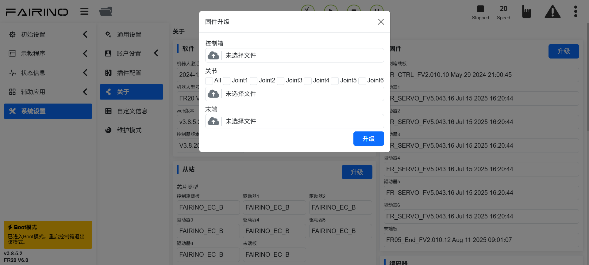

.. centered:: 圖表 8.1‑1 夾爪配置

.. important:: 
	點擊清除配置前，對應的夾爪應處於未啟動狀態。

**Step2**：夾爪配置完成後，使用者可在頁面下方的夾爪資訊表中查看對應的夾爪訊息，若發現配置錯誤，可點選「清除」按鈕，重新配置夾爪；

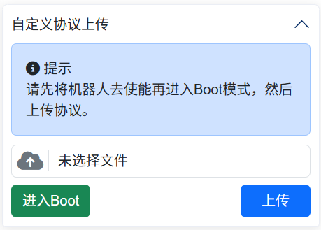

.. centered:: 圖表 8.1‑2 夾爪配置資訊

**Step3**：選擇配置完成的夾爪，點選「重設」按鈕，頁面彈出指令傳送成功後，再點選「啟動」按鈕，可查看夾爪資訊表中的啟動狀態，來判斷是否啟動成功；

.. important::
   啟動夾爪時，夾爪不可有夾持物。

**Step4**：在程序示教指令介面中選擇「Gripper」指令。在夾爪指令介面中，使用者可以選擇想要控制的夾爪編號（已經完成配置並且被啟動的夾爪），設定對應的開閉狀態、開閉速度、開閉力矩已經等待夾爪動作的最大時間。完成設定後點擊新增應用程式即可。此外還可以添加夾爪啟動和重設指令，以便在運行程式時去啟動/重設夾爪。

.. figure:: robot_peripherals/003.png
   :align: center
   :width: 6in

.. centered:: 圖表 8.1‑3 夾爪指令編輯

夾爪程序示教
~~~~~~~~~~~~~~~

.. list-table:: 
   :widths: 15 40 100
   :header-rows: 1

   * - 序號
     - 指令格式
     - 註釋
   * - 1
     - PTP(template2,100,-1,0)
     - #等待夾取點
   * - 2
     - PTP(template1,100,-1,0)
     - #夾取點
   * - 3
     - MoveGripper(1,255,255,0,1000,0)
     - #夾爪閉合
   * - 4
     - PTP(template2,100,-1,0)
     - /
   * - 5
     - PTP(template3,100,-1,0)
     - #等待放件點
   * - 6
     - PTP(template3,100,-1,0)
     - #放件點
   * - 7
     - MoveGripper(1,0,255,0,1000,0)
     - #夾爪開啟

Lua末端開放協定配置
-------------------------

概述
~~~~~~~~

Lua開放協議支援力感測器、單一夾爪、多個夾爪、力感測器及夾爪等配合使用。

操作步驟
~~~~~~~~~~~
**Step1**：進入工具應用->系統升級介面，選擇末端韌體.bin文件，升級末端韌體。

.. important:: 
   需先確認末端韌體版本 FV2.010.06及其之後軟體版本是不是符合，若版本不符合，對應軟體韌體升級，否則不需要升級韌體。

   上傳末端韌體升級包之前，需要進入boot模式。

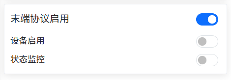

.. centered:: 圖表 8.2‑1 升級末端韌體

**Step2**：進入周邊->末端工具->開放協議->末端通訊協定介面，上傳Lua末端開放協議，選擇需要上傳的Lua末端開放協議，進行上傳操作。

.. important:: 上傳末端協定之前，需要進入boot模式。同時，檔案名稱需要以AXLE_LUA_開頭命名。

.. centered:: 圖表 8.2‑2 上傳Lua末端開放協議

**Step3**：設定末端通訊參數，通訊參數包含波特率、資料位元、停止位元等，配置完成後，點選「設定」按鈕。

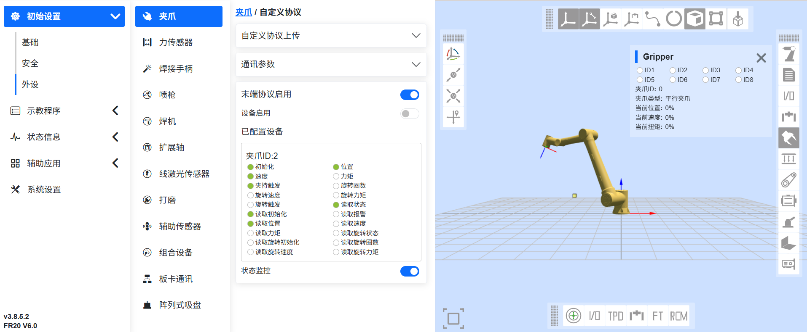

.. centered:: 圖表 8.2‑3 配置末端通訊參數

末端通訊詳細參數如下：

- **波特率**：支援1-9600，2-14400，3-19200，4-38400，5-56000，6-67600，7-115200，8-128000；末端Rs485驅動晶片為低速485，波特率不能>200k；
- **資料位元**：資料位元支援（8,9），目前常用為8；
- **停止位**：1-1，2-0.5，3-2，4-1.5，目前常用為1；
- **校驗位**：0-None，1-Odd，2-Even,目前常用為0；
- **超時時間**：1~1000ms，此值需要結合週邊搭配設定合理的時間參數；
- **超時次數**：1~10，主要進行超時重發，減少偶發異常提高使用者體驗；
- **週期性指令時間間隔**：1~1000ms，主要用於週期性指令每次下發的時間間隔；

**Step4**：末端Lua啟用，點選「開啟」按鈕。

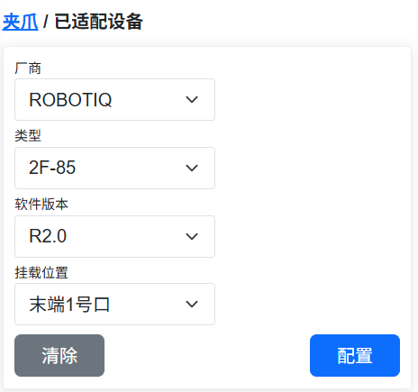

.. centered:: 圖表 8.2‑4 末端Lua啟用

當Lua檔案發生異常時，提示「末端Lua檔案異常」警告，可進行「不復原/復原」處理。關閉Lua啟用按鈕，警告提示關閉。

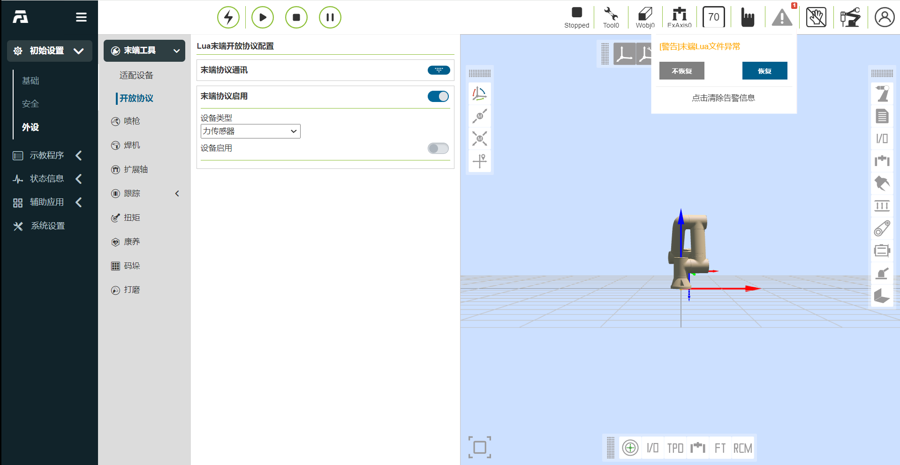

.. centered:: 圖表 8.2‑5 Lua文件異常

選擇夾爪設備類型。

**開啟「狀態監控」**：右側夾爪狀態列展示即時顯示夾爪運轉速度、力矩、位置等狀態資訊。

**關閉「狀態監控」**：右側夾爪資料狀態列關閉。

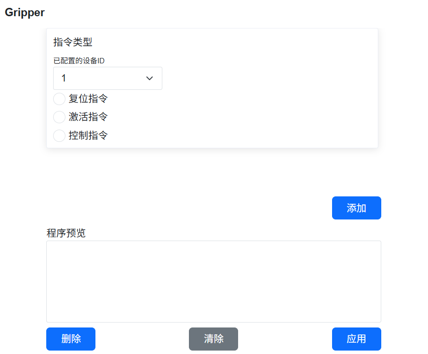

.. centered:: 圖表 8.2‑6 狀態監控

末端週邊配置
-------------------------

力傳感器
~~~~~~~~

設備類型選擇力傳感器->啟用力傳感器，已配置設備中顯示力傳感器。點選進入FT介面，查詢力道感測器資料。

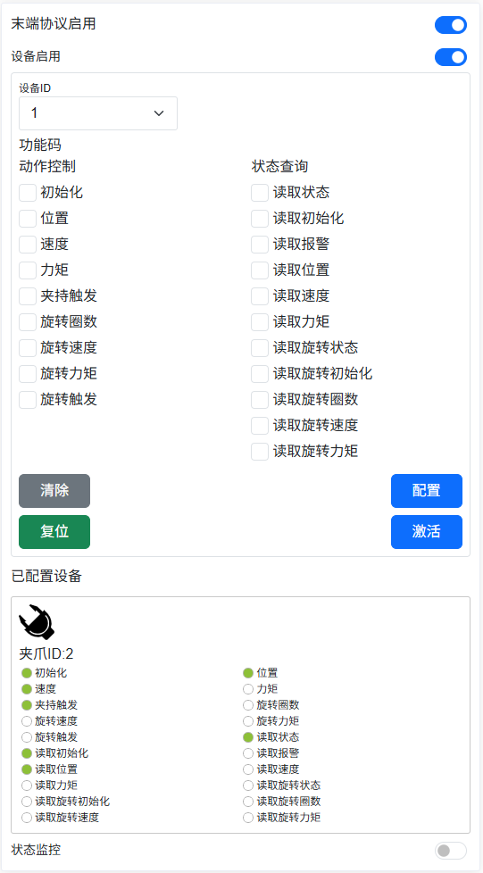

.. centered:: 圖表 8.3‑1 啟用力道感測器

夾爪
~~~~~~~~~~~

**Step1**：設備類型選擇夾爪->啟用夾爪->選擇夾爪ID->勾選夾爪適配的功能碼->點選配置，已配置設備中顯示夾爪的ID及功能碼。

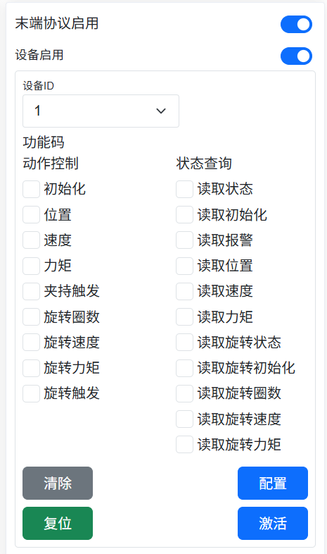

.. centered:: 圖表 8.3‑2 配置夾爪

.. note::
 由於末端開放功能目前對夾爪設備位址支援範圍為1~8，使用前應透過夾爪廠商的上位機調整夾爪設備位址。

 勾選功能碼應透過夾爪廠商提供的產品說明書查詢夾爪適配的功能，且應與末端Lua功能碼保持對應，具體請查詢《末端Lua適配夾爪說明手冊》。

**Step2**：選擇夾爪ID->重設->激活，夾爪進行一次初始化，具體初始化情況請參考夾爪廠商提供的產品說明書。

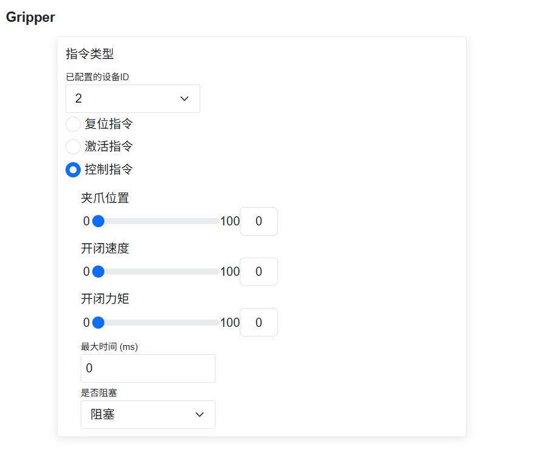

.. centered:: 圖表 8.3‑3 啟動夾爪

**Step3**：進入示教程式->程式編程->新增夾爪運動指令。

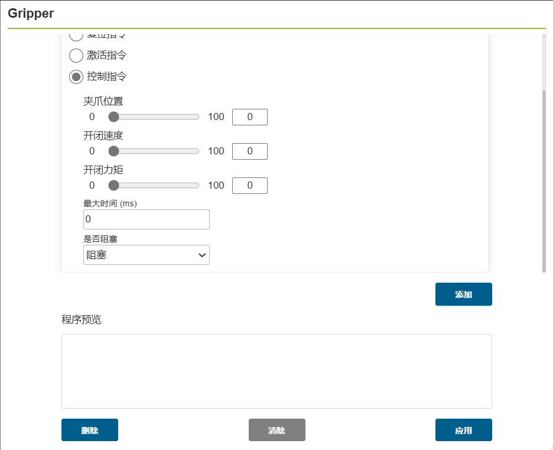

.. centered:: 圖表 8.3‑4 新增夾爪運動指令

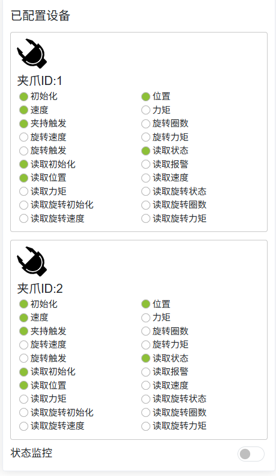

.. centered:: 圖表 8.3‑5 夾爪運動指令範例

多個夾爪
~~~~~~~~~~~

活化和運動控制參考夾爪步驟。

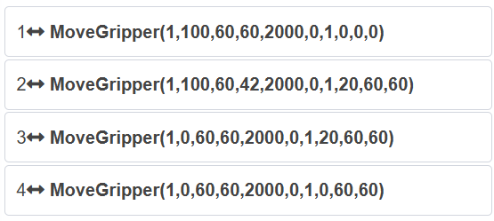

.. centered:: 圖表 8.3‑6 配置多個夾爪

.. note:: 由於末端開放功能目前對夾爪設備位址支援範圍為1~8，使用前應透過夾爪廠商的上位機調整夾爪設備位址。

力傳感器及夾爪
~~~~~~~~~~~~~~~~~~~

配置和啟用參考力感測器和夾爪步驟。

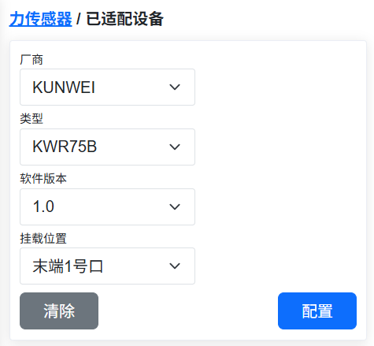

.. centered:: 圖表 8.3‑7 配置力感知器及夾爪

旋轉夾爪
~~~~~~~~~~~~~~~~~~~

**Step1**：設備類型選擇夾爪->啟用夾爪->選擇夾爪ID->勾選夾爪適配的功能碼->點選配置，已配置設備中顯示夾爪的ID及功能碼。

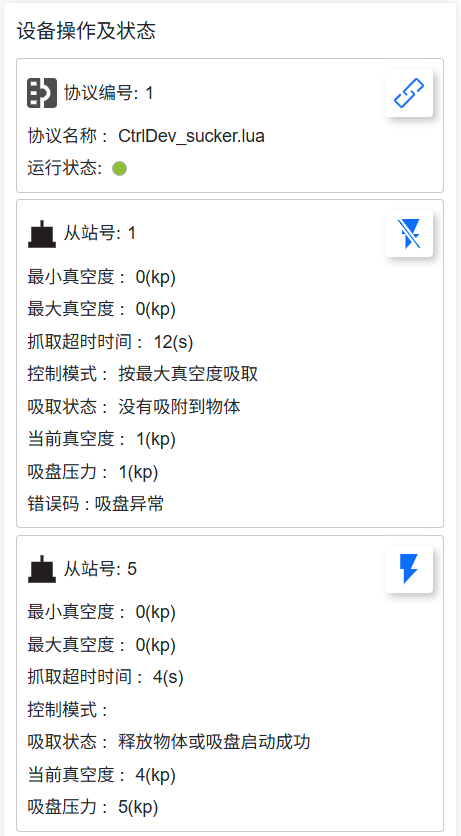

.. centered:: 圖表 8.3‑8 配置夾爪及功能碼

.. note:: 勾選功能碼應透過夾爪廠商提供的產品說明書查詢夾爪適配的功能，且應與末端Lua功能碼保持對應，具體請查詢《FR05-末端全外設協議-V2. 5-20241101.xlsx》。

**Step2**：選擇夾爪ID->重設->激活，夾爪進行一次初始化，具體初始化情況請參考夾爪廠商提供的產品說明書。

.. centered:: 圖表 8.3‑9 啟動夾爪

**Step3**：進入示教程式->程式編程->新增夾爪運動指令。

.. centered:: 圖表 8.3‑10 新增旋轉夾爪運動指令

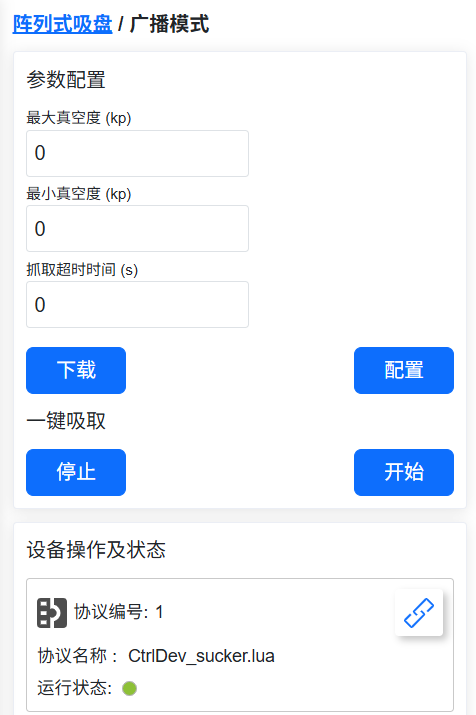

.. centered:: 圖表 8.3‑11 旋轉夾爪運動指令範例

.. note:: 旋轉圈數為絕對旋轉圈數，正轉圈數最大為90圈，反轉圈數最大為90圈，旋轉後需進行重設處理。

噴槍週邊配置
-------------

噴槍週邊配置步驟
~~~~~~~~~~~~~~~~~~

**Step1**：在「初始設定->週邊」功能表列中，點選「噴槍」進入噴槍配置介面。

使用者可透過噴塗功能一鍵配置按鍵，對噴塗所需DO進行快速配置（預設配置DO10為噴塗啟停，DO11為噴塗清槍）。

使用者也可以根據自己的需求在「初始設定->基礎->I/O設定」中，自訂設定DO。

.. important::
   在使用噴塗功能之前，需要先建立對應的工具座標系，並在程式示教時應用建立好的工具座標系。

**Step2**：配置完成後，點選「開始噴塗」、「停止噴塗」、「開始清槍」和「停止清槍」四個按鈕，進行噴槍調試。

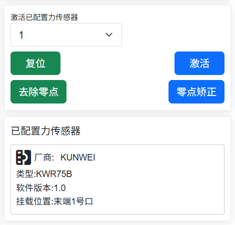

.. centered:: 圖表 8.4‑1 噴槍配置

**Step3**：在程式編程指令介面選擇“spray”指令。根據特定的程序示教需求，在相應的地方添加應用「開始噴塗」、「停止噴塗」、「開始清槍」和「停止清槍」四個指令。

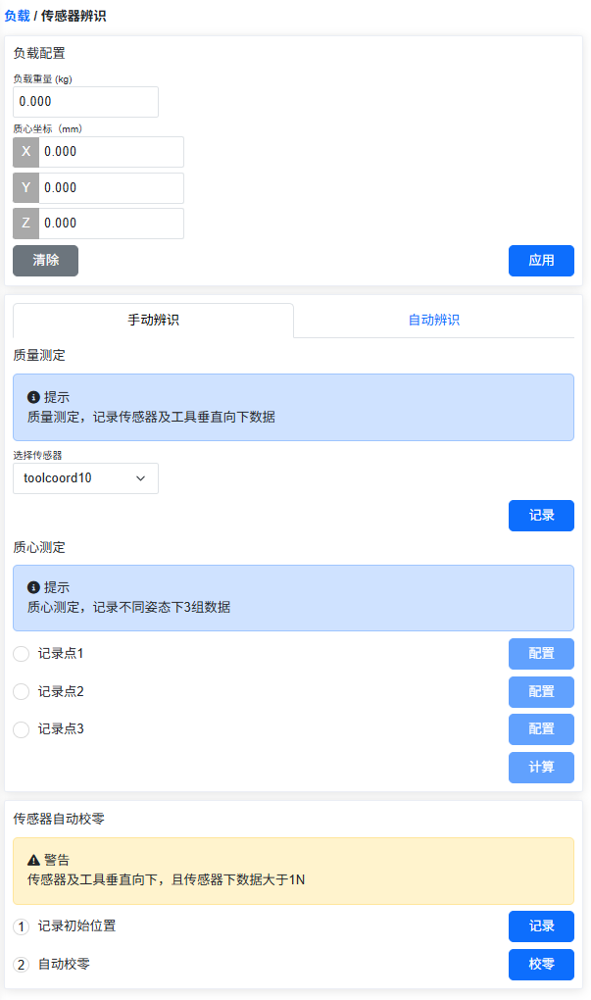

.. centered:: 圖表 8.4‑2 噴槍指令編輯

噴塗程序示教
~~~~~~~~~~~~~~

.. list-table:: 
   :widths: 15 40 100
   :header-rows: 1

   * - 序號
     - 指令格式
     - 註釋
   * - 1
     - Lin(template1,100,-1,0,0)
     - #開始噴塗點
   * - 2
     - SprayStart()
     - #開始噴塗
   * - 3
     - Lin(template2,100,-1,0,0)
     - #噴塗路徑
   * - 4
     - Lin(template3,100,-1,0,0)
     - #停止噴塗點
   * - 5
     - SprayStop()
     - #停止噴塗
   * - 6
     - Lin(template4,100,-1,0,0)
     - #清槍點
   * - 7
     - PowerCleanStart()
     - #開始清槍
   * - 8
     - WaitTime(5000)
     - #清槍時間 ms
   * - 9
     - PowerCleanStop()
     - #停止清槍

焊機週邊配置
-------------

協作機器人攜帶焊槍進行焊接作業可以顯著提高焊接效率和焊接質量，法奧協作機器人可以透過「控制器IO」或「數位通訊協定」兩種方法進行焊接控制：

**控制器IO**：機器人透過設定控制箱類比輸出(0-10V)進行焊接電流和焊接電壓的大小控制，透過控制箱數位輸出進行焊接起弧、送絲、送氣的控制，透過控制箱數位輸入採集焊機準備、起弧成功等訊號輸入。

**數位通訊協定**：機器人透過UDP與PLC進行通信，PLC再透過CANOpen匯流排或其他協定與焊機通信，進而控制焊接電壓、電流和焊接機起弧、送絲、送氣等操作(機器人UDP通訊協定內容請見附件一)。

透過協作機器人進行焊接控制主要包括以下步驟：①焊槍安裝及訊號接線；②焊接機參數配置；③編寫焊接控製程序。

焊槍安裝
~~~~~~~~~~~~~~~~~~~~~

如圖1，焊槍透過轉接板安裝於機器人末端，焊槍線纜需固定於機械手臂上。

.. figure:: robot_peripherals/019.png
   :align: center
   :width: 3in

.. centered:: 圖表 8.5‑1 焊槍安裝於機器人末端

焊槍固定安裝完成後，以六點法進行焊槍工具座標系標定，並應用為目前工具座標系(圖2)，焊槍工具座標系標定精度會影響實際焊接精度。

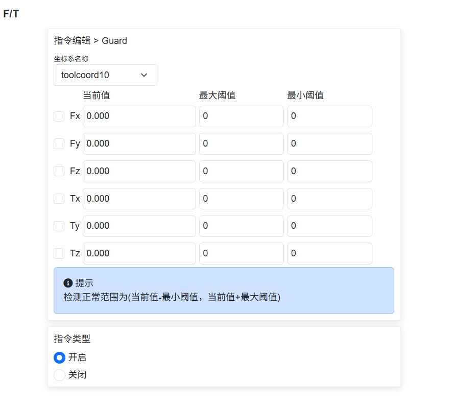

.. centered:: 圖表 8.5-2 機器人工具座標系標定及應用

焊機參數配置
~~~~~~~~~~~~~~~~~~~~~~~~~~~~~~~~~

協作機器人可透過「控制器IO」訊號或「數位通訊協定」進行焊接製程控制，兩種方式的配置操作主要有以下兩個區別點：

①使用「控制器IO」時需設定實際控制焊接電流電壓與控制箱類比量輸出值之間的對應關係；

②使用「數位通訊協定」時需要設定通訊參數。

“控制器IO”焊接控製配置
+++++++++++++++++++++++++++++++++++

在「初始設定－週邊」功能表列中，點選「焊接機」進入焊接機設定介面。如下圖所示：

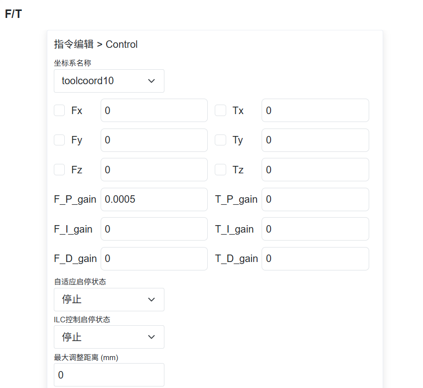

.. centered:: 圖表 8.5-3 打開焊機配置

如下圖所示，選擇控制類型為「控制箱I/O」。

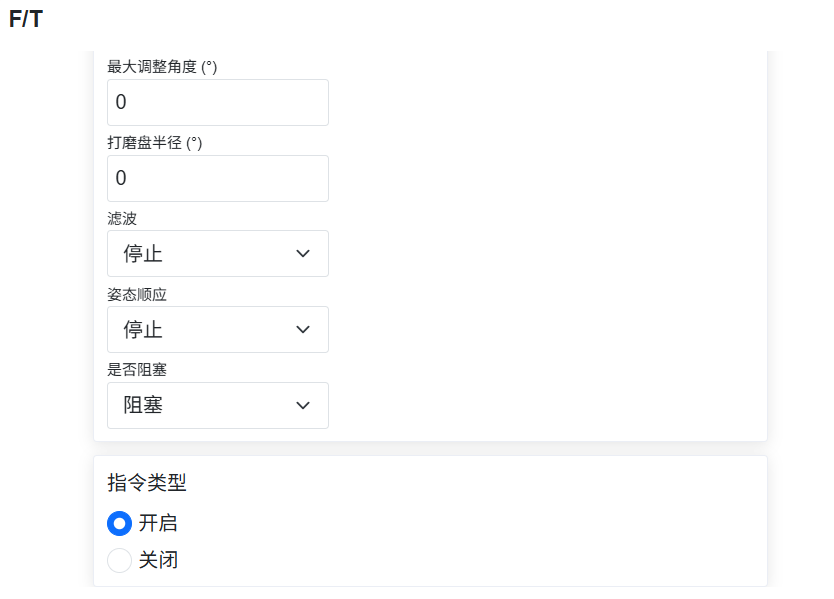

.. centered:: 圖表 8.5-4 選擇控制類型

焊接IO訊號配置
****************************

如下圖所示，選擇焊機狀態訊號DI輸入端口及焊機控制訊號DO輸出端口，點選「配置」按鈕，各訊號意義如下：

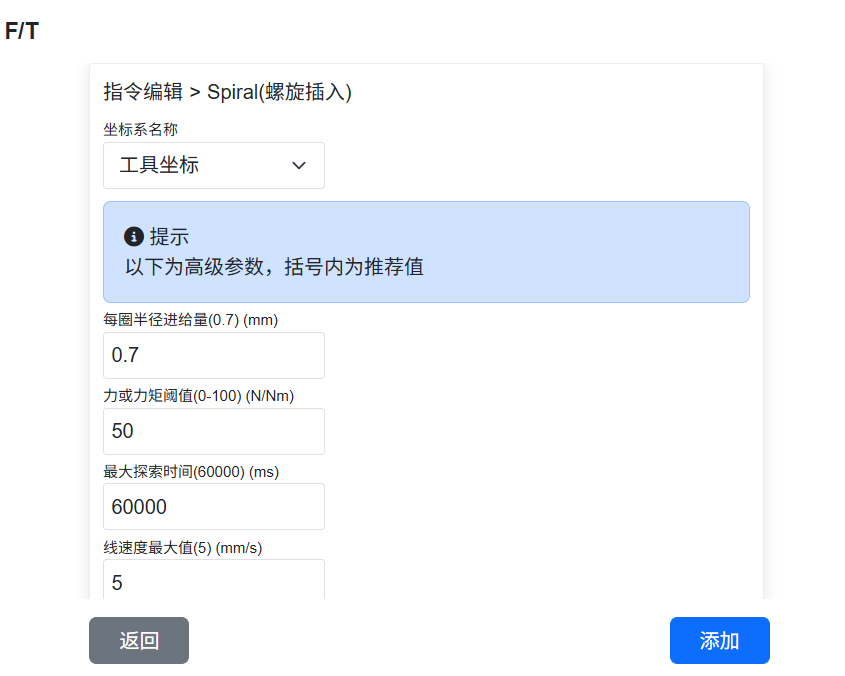

.. centered:: 圖表 8.5-5 設定焊機訊號端口

**焊接機準備**：當焊接機已經準備完成可以進行焊接作業時，焊接機輸出此訊號至機器人。

當焊接機故障或其他原因未準備完成時，焊接機未將該訊號輸入至機器人，此時機器人WebApp右上角提示「焊接機未準備好」。若您的焊接機沒有焊接機準備好訊號，可將該項連接埠設定為「無」。

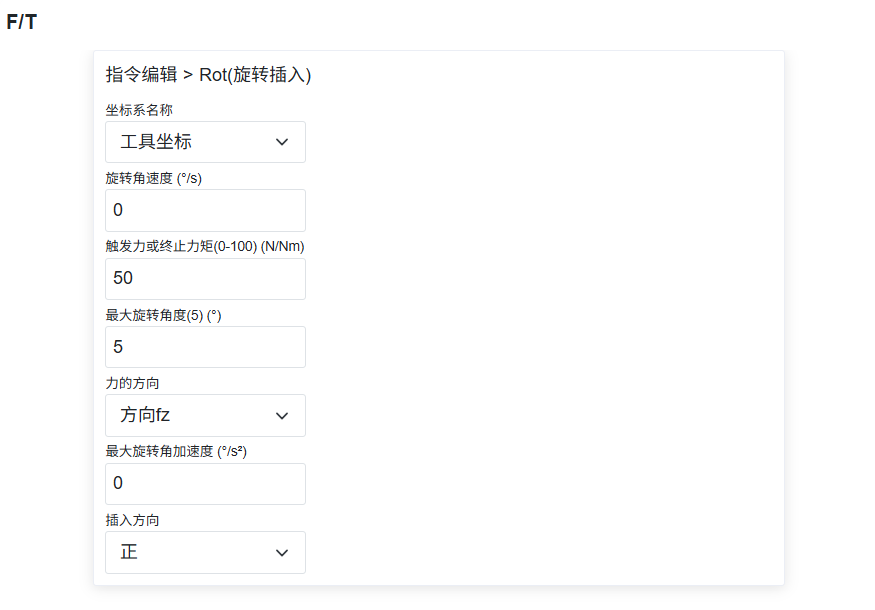

.. centered:: 圖表 8.5-6 焊接機未準備好報錯

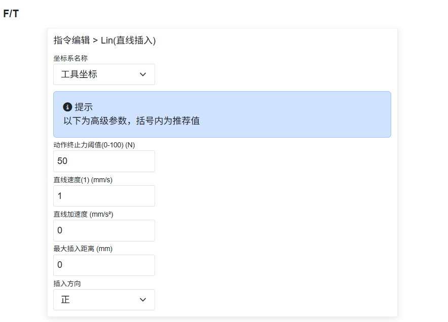

.. centered:: 圖表 8.5-7 焊接機準備設定為“無”

**起弧成功**：焊接機起弧已成功，機器人輸出起弧訊號至焊機後，等待焊接機回饋起弧成功訊號，在設定的超時時間內機器人未偵測到焊接機的起弧成功訊號，機器人報“起弧超時”錯誤。

使用機器人焊接功能時若未配置起弧成功訊號仍可進行焊接，但機器人會報「起弧成功DI未配置」警告；若您的焊接機有起弧成功訊號輸出，我們建議您配置此訊號以進行更安全的焊接。

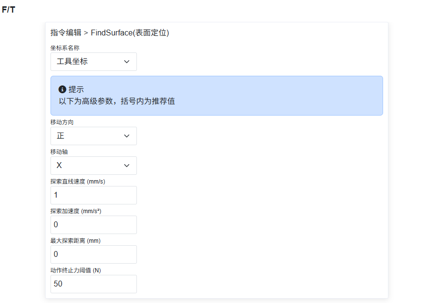

.. centered:: 圖表 8.5-8 起弧超時報錯
   

.. centered:: 圖表 8.5-9 起弧成功DI未配置警告

**焊接中斷恢復**：機器人焊接過程中電弧意外中斷或操作人員主動暫停焊接時會觸發焊接中斷，焊接中斷後外部向機器人輸入該訊號從無效變為有效時，機器人自動從原來中斷的位置自動恢復焊接。

**焊接中斷退出**：機器人焊接過程中電弧意外中斷或操作人員主動暫停焊接時會觸發焊接中斷，焊接中斷後外部向機器人輸入該訊號從無效變為有效時，機器人終止焊接，焊接終止後不可再次恢復焊接。

**焊接機起弧**：機器人控制焊接機起弧的DO輸出端口，當機器人程式執行起弧指令時，焊接機起弧對應DO輸出端口自動輸出有效。

**氣體偵測**：機器人控制焊接機送氣的DO輸出端口，當機器人執行焊接送氣指令時，送氣對應的DO輸出端口自動輸出有效。

**正向送絲**：機器人控制焊接機正向送絲的DO輸出端口，當機器人執行正向送絲指令時，正向送絲對應的DO輸出端口自動輸出有效。

**反向送絲**：機器人控制焊接機反向送絲的DO輸出端口，當機器人執行反向送絲指令時，反向送絲對應的DO輸出端口自動輸出有效。

焊接工藝參數配置
****************************

如下圖所示，在焊接配置頁面找到「焊接製程參數」欄，協作機器人提供0 ~ 99共100組焊接製程參數，其中製程編號0表示不使用焊接製程曲線，製程編號1-99使用焊接製程曲線。
   
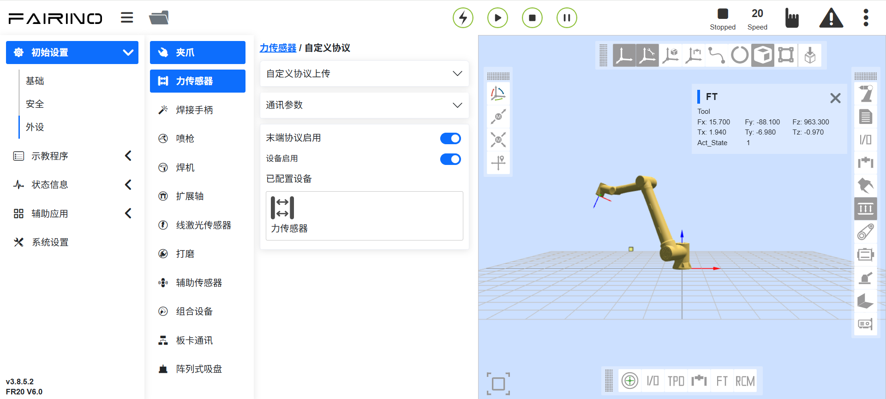

.. centered:: 圖表 8.5-10 焊接工藝參數配置

使用焊接製程曲線時，以選擇焊接製程編號1為例，依序輸入起弧電流 ~ 收弧時間參數如圖8所示，點選「配置」按鈕，此製程參數表示的實際焊接過程如下：

①設定焊接電流200A、電壓23V；

②執行起弧，等待起弧成功；

③起弧成功後電弧保持500ms(起弧時間，機器人不運動)；

④設定焊接電流150A、焊接電壓21V，然後機器人開始移動並進行焊接；

⑤焊接到終點後，設定焊接電流為100A、焊接電壓為19V(收弧電流、收弧電壓)；

⑥收弧電流、電壓設定完成後維持500ms電弧燃燒(機器人不運動)，最後熄滅電弧。

不使用焊接製程曲線時，即選擇焊接製程參數編號為0時，如圖11，焊接過程為：

①設定焊接電流和焊接電壓；

②機器人控制焊接機起弧，並等待起弧成功；

③起弧成功後，機器人開始移動並進行焊接；

④機器人焊接到終點後立即熄滅電弧。
   
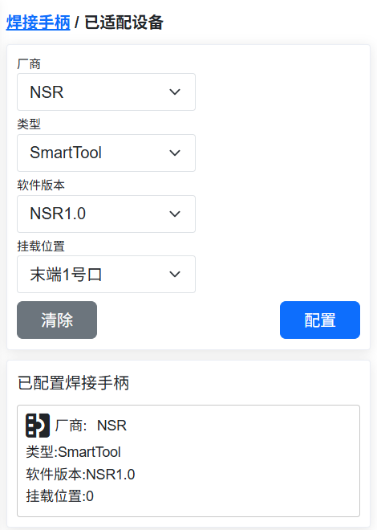

.. centered:: 圖表 8.5-11 不使用焊接製程曲線

焊接電流電壓與類比量輸出關係圖設置
***************************************

協作機器人焊接控制類型選擇為「控制器IO」時，透過控制箱類比輸出大小來控制焊接電流和焊接電壓值(控制箱類比輸出電壓範圍為0 ~ 10V)，此時需要配置控制箱模擬量輸出值與實際焊接電流、焊接電壓值的線性對應。

如圖12，在焊接機配置頁面找到“類比量電流電壓關係圖”，其中“A-V”表示焊接電流與控制箱輸出類比輸出電壓之間的對應關係，“V-V”表示焊接電壓與控制箱輸出類比量電壓之間的對應關係。

選擇“A-V”，輸入焊接電流範圍0-1000A，類比輸出電壓0-10V，輸出AO為“Ctrl-AO0”(焊接電流控制類比輸出埠為AO0)，點選“設定”按鈕；在該參數下，控制箱輸出類比電壓1.5V時，對應焊接電流為150A。
   
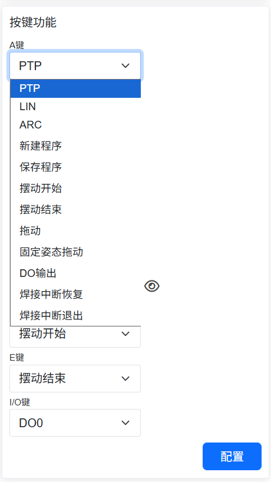

.. centered:: 圖表 8.5-12 焊接電流與輸出模擬量對應關係配置

如圖13，點選「V-V」設定焊接電壓與控制箱類比輸出電壓之間的對應關係，輸入焊接電壓範圍為0-60V，類比輸出電壓值為0-10V，輸出AO為「Ctrl-AO1 」(焊接電流控制類比量輸出埠為AO0)，點選「配置」按鈕，此時。若控制箱AO1類比輸出3.5V，實際控制焊接電壓為21V。
   
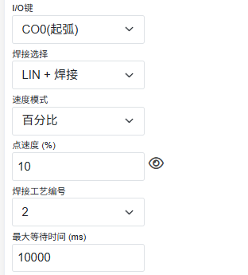

.. centered:: 圖表 8.5-13 焊接電壓與輸出類比對應關係配置

焊接機調試
******************

如圖14，在焊機配置頁面中找到“焊機調試”，選擇工藝編號1，輸入超時時間為1000ms，點擊“送氣”，機器人即控制焊機開始輸送保護氣，點擊“停機”按鈕，機器人即控制焊接機停止輸送保護氣。其他按鈕「起弧」、「正向送絲」、「反向送絲」等操作方法相同，不再贅述。
   
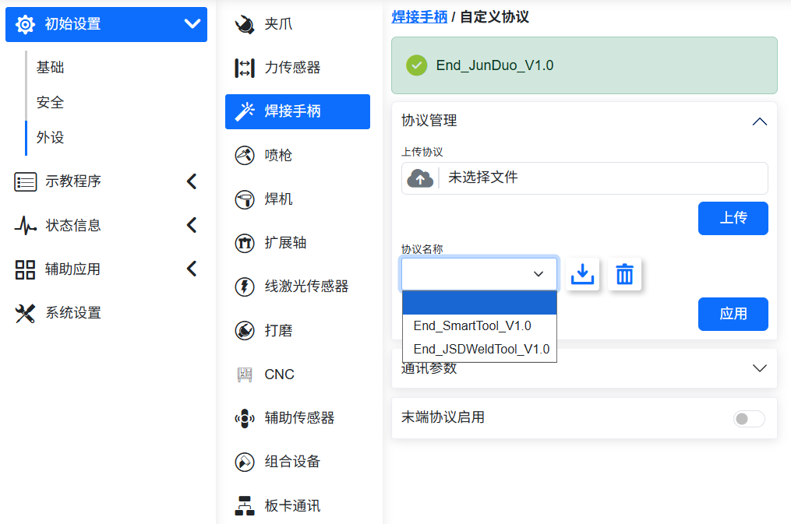

.. centered:: 圖表 8.5-14 焊接機調試

“數位通訊協定”焊接控製配置
+++++++++++++++++++++++++++++++++++

機器人透過「數位通訊協定」進行焊接控制，本質上是機器人與PLC進行UDP通信，機器人透過UDP通訊將起弧、送絲、送氣、電流、電壓等控制數據傳至PLC，再由PLC端進一步通過CANOpen匯流排(或其他方式)對焊接機進行控制，同時PLC端擷取實際的焊接電流電壓、起弧成功訊號回饋至機器人。 (機器人UDP通訊協定內容請見附件一)。

在「初始設定－週邊」功能表列中，點選「焊接機」進入焊接機設定介面。如下圖所示：
   

.. centered:: 圖表 8.5-15 打開焊機配置

如圖16，選擇控制類型為“數位通信協定”，由於機器人與PLC進行UDP通信，因此需要配置UDP通信參數，其中各項參數的含義如下：

**IP位址**：UDP通訊PLC端的IP位址；

**連接埠號碼**：PLC端UDP通訊埠號碼；

**通訊週期**：機器人與PLC進行UDP通訊的週期，預設為2ms；

**丟包偵測週期、丟包次數**：在丟包偵測週期內的丟包個數超過設定值時，機器人報「UDP通訊丟包異常」錯誤，同時通訊自動切斷。

**通訊中斷確認時長**：機器人在該時長內未收到一幀完整的PLC回饋資料包即報「UDP通訊中斷」錯誤警報，同時切斷UDP通訊。

**斷電重啟自動重連**：機器人偵測到機器人斷電重啟後是否自動進行重連恢復；

**通訊中斷自動重連**：機器人偵測到UDP通訊中斷後是否自動進行重連恢復；

**重連週期、重連次數**：使能UDP通訊中斷自動重連且偵測到UDP通訊中斷後，機器人以設定的週期進行重連，當重連次數達到最大設定值仍未連接成功時，機器人警報「UDP通訊中斷」錯誤警報，同時切斷UDP通訊。

配置完成上述參數後，依序點選「配置」和「載入」按鈕。
   

.. centered:: 圖表 8.5-16 選擇控制類型

焊接IO訊號配置
****************************

如圖17，選擇焊機狀態訊號DI輸入端口及焊機控制訊號DO輸出端口，點選「配置」按鈕，各訊號意義如下：
   
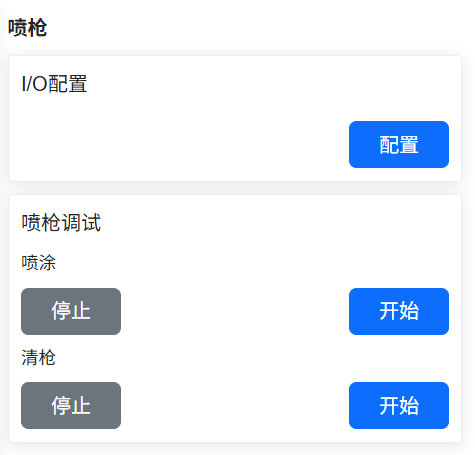

.. centered:: 圖表 8.5-17 設定焊機訊號端口

**焊接機準備**：當焊接機已經準備完成可以進行焊接作業時，焊接機輸出此訊號至機器人；

當焊機故障或其他原因未準備完成時，焊機未將該訊號輸入至機器人，此時機器人WebApp右上角提示「焊機未準備好」(圖18)。若您的焊接機沒有焊接機準備好訊號，可將該項連接埠設定為「無」(圖19)。
   

.. centered:: 圖表 8.5-18 焊接機未準備好報錯
   

.. centered:: 圖表 8.5-19 焊接機準備設定為“無”

**起弧成功**：焊接機起弧已成功，機器人輸出起弧訊號至焊機後，等待焊接機回饋起弧成功訊號，在設定的超時時間內機器人未偵測到焊接機的起弧成功訊號，機器人報「起弧超時」錯誤(圖20)；

使用機器人焊接功能時若未配置起弧成功訊號仍可進行焊接，但機器人會報「起弧成功DI未配置」警告(圖21)；若您的焊接機有起弧成功訊號輸出，我們建議您配置此訊號以進行更安全的焊接。
   

.. centered:: 圖表 8.5-20 起弧超時報錯	
      

.. centered:: 圖表 8.5-21 起弧成功DI未配置報錯

**焊接中斷恢復**：機器人焊接過程中電弧意外中斷或操作人員主動暫停焊接時會觸發焊接中斷，焊接中斷後外部向機器人輸入該訊號從無效變為有效時，機器人自動從原來中斷的位置自動恢復焊接。

**焊接中斷退出**：機器人焊接過程中電弧意外中斷或操作人員主動暫停焊接時會觸發焊接中斷，焊接中斷後外部向機器人輸入該訊號從無效變為有效時，機器人終止焊接，焊接終止後不可再次恢復焊接。

**焊接機起弧**：機器人控制焊接機起弧的DO輸出端口，當機器人程式執行起弧指令時，焊接機起弧對應DO輸出端口自動輸出有效。

**氣體偵測**：機器人控制焊接機送氣的DO輸出端口，當機器人執行焊接送氣指令時，送氣對應的DO輸出端口自動輸出有效。

**正向送絲**：機器人控制焊接機正向送絲的DO輸出端口，當機器人執行正向送絲指令時，正向送絲對應的DO輸出端口自動輸出有效。

**反向送絲**：機器人控制焊接機反向送絲的DO輸出端口，當機器人執行反向送絲指令時，反向送絲對應的DO輸出端口自動輸出有效。

焊接工藝參數配置
****************************

如圖22，在焊接配置頁面找到「焊接製程參數」欄，協作機器人提供0 ~ 99共100組焊接製程參數，其中製程編號0表示不使用焊接製程曲線，製程編號1-99使用焊接製程曲線。
      
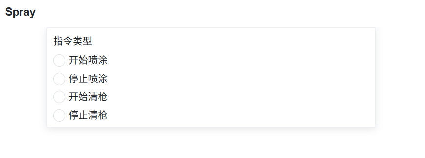

.. centered:: 圖表 8.5-22 焊接工藝參數配置

使用焊接製程曲線時，以選擇焊接製程編號1為例，依序輸入起弧電流 ~ 收弧時間參數如圖8所示，點選「配置」按鈕，此製程參數表示的實際焊接過程如下：

①設定焊接電流200A、電壓23V；

②執行起弧，等待起弧成功；

③起弧成功後電弧保持500ms(起弧時間，機器人不運動)；

④設定焊接電流150A、焊接電壓21V，然後機器人開始移動並進行焊接；

⑤焊接到終點後，設定焊接電流為100A、焊接電壓為19V(收弧電流、收弧電壓)；

⑥設定完收弧電流、電壓後維持500ms電弧燃燒(機器人不移動)，最後熄滅電弧。

如圖23，不使用焊接製程參數時，即選擇焊接製程參數編號為0時，焊接製程為：

①透過設定電流、電壓介面設定相應的焊接電流和焊接電壓；

②機器人控制焊接機起弧，並等待起弧成功；

③起弧成功後，機器人開始移動並進行焊接；

④機器人焊接到終點後立即熄滅電弧。
      

.. centered:: 圖表 8.5-23 不使用焊接製程曲線

焊接機調試
******************

如圖24，在焊機配置頁面中找到“焊機調試”，選擇工藝編號1，輸入超時時間為1000ms，點擊“送氣”，機器人即控制焊機開始輸送保護氣，點擊“停機”按鈕，機器人即控制焊接機停止輸送保護氣。其他按鈕「起弧」、「正向送絲」、「反向送絲」等操作方法相同，不再贅述。

.. centered:: 圖表 8.5-24 焊接機調試

焊接程式編寫
~~~~~~~~~~~~~~~~~~~~~~~~~~~

使用焊接製程曲線的程式編寫
++++++++++++++++++++++++++++++++++++

選擇使用焊接製程曲線時(即選擇焊接製程參數編號1 ~ 99)，焊接過程中的電壓電流控制遵循某個製程參數編號設定的曲線參數，不需要再單獨增加設定焊接電壓和電流的指令。如圖25，點選“示教程式－程式編程”，新建使用者程式“testWeld.lua”。

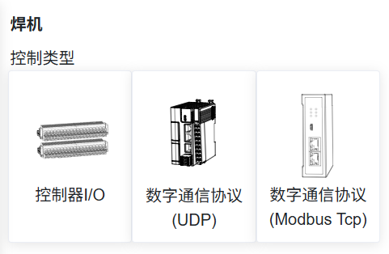

.. centered:: 圖表 8.5-25 建立“testWeld.lua”程序

如圖26，選擇“焊接指令”。

.. figure:: robot_peripherals/037.png
   :align: center
   :width: 6in

.. centered:: 圖表 8.5-26 選擇“焊接指令”

如圖27，點選“焊接”，開啟焊接指令新增頁面。

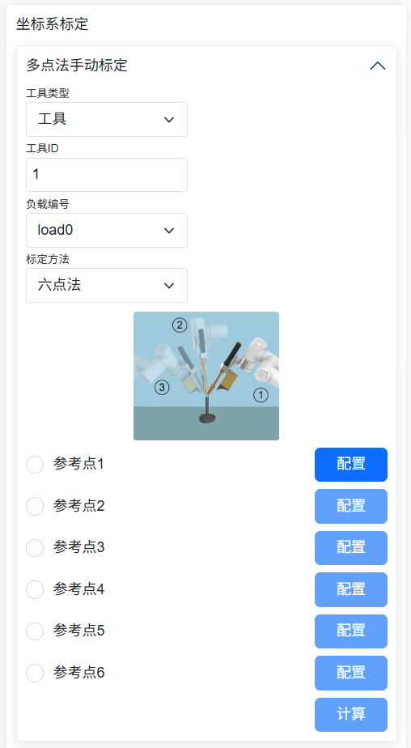

.. centered:: 圖表 8.5-27 點擊“焊接”

如圖28，在開啟的焊接指令新增頁面中選擇控制類型為「控制器I/O」(根據實際配置的焊接控制方式選擇)，選擇焊接工藝編號為1(工藝編號0不使用焊接工藝曲線，製程編號1-99使用焊接製程曲線)，最大等待時間為10000ms，依序點選「起弧」按鈕和「收弧」按鈕，最後點選「應用」。

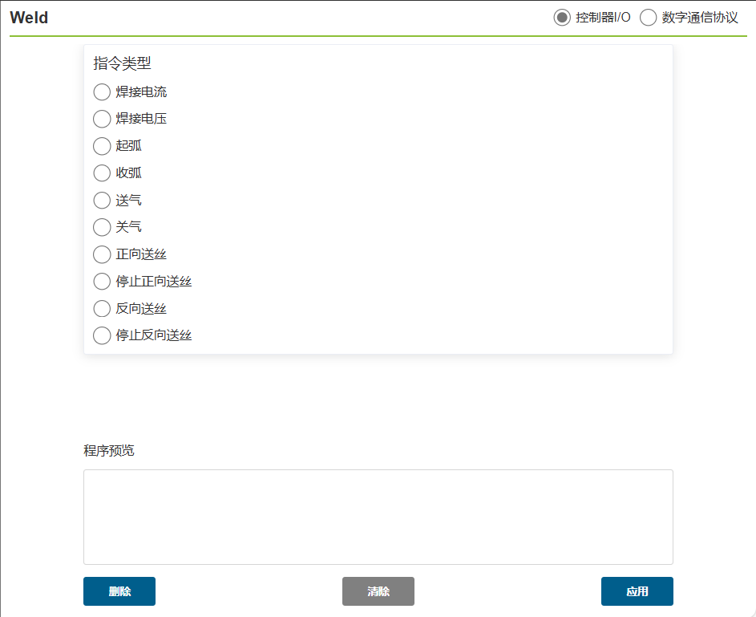

.. centered:: 圖表 8.5-28 焊接指令添加

如圖29，此時「testWeld.lua」程序中已新增焊接起弧指令和焊接收弧指令，由於焊接起弧、收弧選擇使用焊接工藝曲線編號1，因此焊接過程中的電壓電流控制遵循工藝編號1設定的曲線參數，不需要再單獨加入設定焊接電壓和電流的指令。

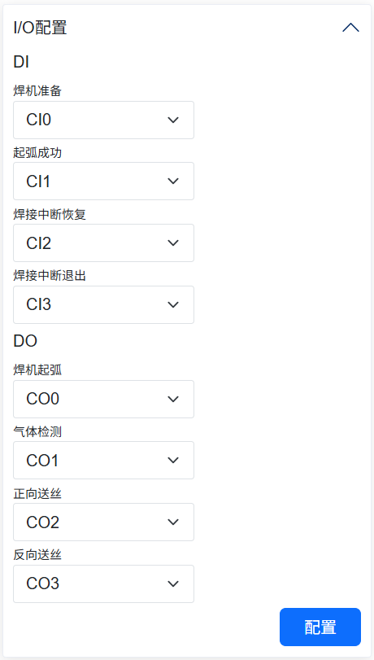

.. centered:: 圖表 8.5-29 起弧收弧程序

如圖30，增加兩個直線運動指令，並調整指令順序，使機器人先運動到「P1」點，執行起弧，再移動到「P2」點，執行收弧，實現機器人從「P1」點焊接至“P2”點。

.. centered:: 圖表 8.5-30 機器人從P1點焊接至P2點

不使用焊接製程曲線的程式編寫
++++++++++++++++++++++++++++++++++++

選擇不使用焊接製程曲線時(即選擇焊接製程參數編號0)，焊接程序中需加入設定焊接電壓、電流的指令以控制實際的焊接參數。如圖31，點選“示教模擬”、“程式示教”，新建用戶程式“testWeld.lua”。

.. centered:: 圖表 8.5-31 建立“testWeld.lua”程序

如圖32，選擇「焊接指令」。

.. figure:: robot_peripherals/037.png
   :align: center
   :width: 6in

.. centered:: 圖表 8.5-32 選擇“焊接指令”

如圖33，點選“焊接”，開啟焊接指令新增頁面。

.. centered:: 圖表 8.5-33 點擊“焊接”

如圖34，在開啟的焊接指令新增頁面中選擇控制類型為「控制器I/O」(根據實際配置的焊接控制方式選擇)，選擇焊接工藝編號為0(工藝編號0不使用焊接工藝曲線，製程編號1-99使用焊接製程曲線)，焊接電流控制AO為「Ctrl -AO0”，焊接電流為150A，點選“新增”按鈕；設定焊接電壓控制AO為“Ctrl-AO1”，焊接電壓為21V，點選“新增”按鈕；設定最大等待時間為10000ms，依序點選“起弧”按鈕和“收弧”按鈕，最後點擊“應用”。

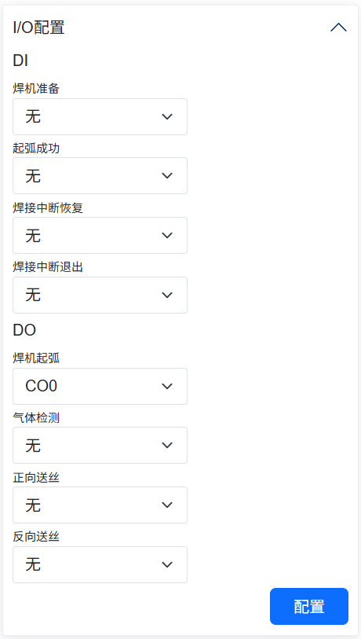

.. centered:: 圖表 8.5-34 焊接指令添加

如圖35，此時「testWeld.lua」程式中已加入焊接起弧指令及焊接收弧指令，由於焊接起弧、收弧指令選擇焊接製程編號0，程式執行設定焊接電壓、電流指令時，機器人將根據設定的焊接電壓、電流數值和焊機配置頁面中設定的「焊接電壓、電流與輸出類比量對應關係」自動輸出對應的控制箱類比量。

.. centered:: 圖表 8.5-35 設定焊接電壓、電流、起弧、收弧程序

如圖36，增加兩個直線運動指令，並調整指令順序，使機器人先運動到「P1」點，執行起弧，再移動到「P2」點，執行收弧，實現機器人從「P1」點焊接至“P2”點。

.. centered:: 圖表 8.5-36 機器人從P1點焊接至P2點

運行上述程序，即可實現一條直線P1 ~ P2的焊接，在運行程序前請檢查：

①焊槍是否已正確安裝，焊槍工具座標係是否完成標定，並應用為目前的工具座標系；

②焊接電源、氣路、絲路是否正常運作；

③機器人與焊接機之間的各訊號線連接是否正常。

焊接中斷與恢復
~~~~~~~~~~~~~~~~~~~~~~~~~~~

機器人焊接過程中可能會在下列情況下中斷：

①操作人員主動暫停焊接，以觀察實際焊接或清理噴嘴等操作；

②焊接電弧意外中斷；

③機器人發生碰撞導致焊接暫停；

機器人焊接過程中發生中斷後，操作人員可以將機器人切換到手動模式，拖曳機器人至安全位置，並對中斷原因進行處理。

問題處理完成後，協作機器人可以從目前位置自動移動到焊接中斷發生的位置重新起弧並恢復焊接，具體的操作過程為：

①焊接中斷恢復參數配置；

②執行焊接程序，在焊接過程中暫停焊接使焊接中斷；

③將機器人切換至手動模式，處理相關問題，處理完成後再將機器人切換至自動模式；

④點選「恢復焊接」按鈕，機器人自動恢復焊接。

焊接中斷恢復參數配置
+++++++++++++++++++++++++++++

如圖37，在“初始設定－週邊”選單欄中，點選“焊接機”進入焊接機配置介面，找到“偵測電弧中斷參數配置”欄，開啟“啟用”，輸入“確認時長”為20ms，點選「配置」按鈕，即焊接過程中起弧成功訊號無效時間超過2 0ms時，機器人會報出“焊接電弧中斷”錯誤；找到“焊接中斷再恢復參數配置”欄，打開“使能”，輸入“重疊距離”為5mm，“速度”為10%，“運動方式”為“PTP”，點選“配置”按鈕，上述三個參數解釋如下：

**重疊距離**：焊接恢復時為了確保恢復後焊縫與中斷前焊縫的連續性，恢復焊接的起弧點與原焊縫需要有一定的重疊距離。

**速度**：焊接中斷後往往需要將機器人移至安全位置並對焊縫進行處理，處理完成後執行焊接恢復時，機器人將從當前位置移至焊接再起弧點，該“速度”即表示機器人移動至再起弧點的速度。

**運動方式**：焊接中斷後往往需要將機器人移至安全位置並對焊縫進行處理，處理完成後執行焊接恢復時，機器人將從當前位置移至焊接再起弧點，該“運動方式”即表示機器人移動至再起弧點的運動方式，有「LIN」和「PTP」兩種方式可供選擇。

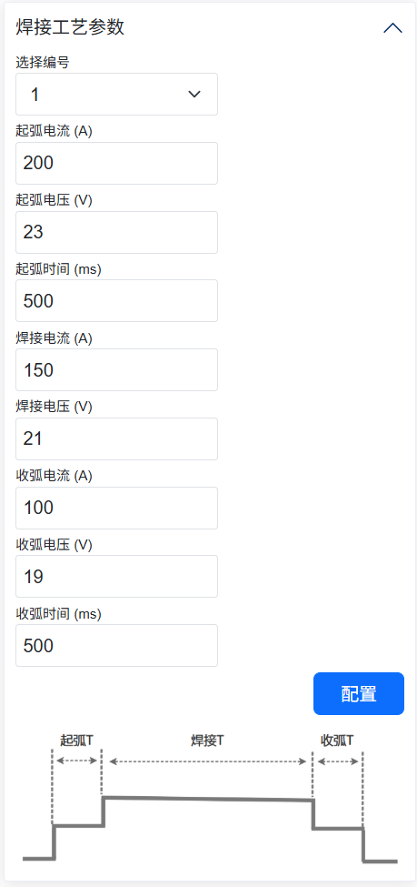

.. centered:: 圖表 8.5-37 焊接中斷恢復參數配置

焊接中斷恢復應用
+++++++++++++++++++++++++++++

以圖38的程式為例，將機器人切換至自動模式，點選啟動按鈕，機器人開始進行焊接作業，在焊接過程中點擊暫停按鈕，此時焊接中斷，在WebApp右上角彈出焊接中斷恢復提示框(圖39)，點選「恢復焊接」按鈕，機器人自動移至再起弧點並執行後續的焊接作業。

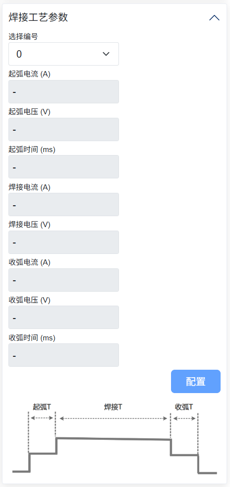

.. centered:: 圖表 8.5-38 執行焊接程序

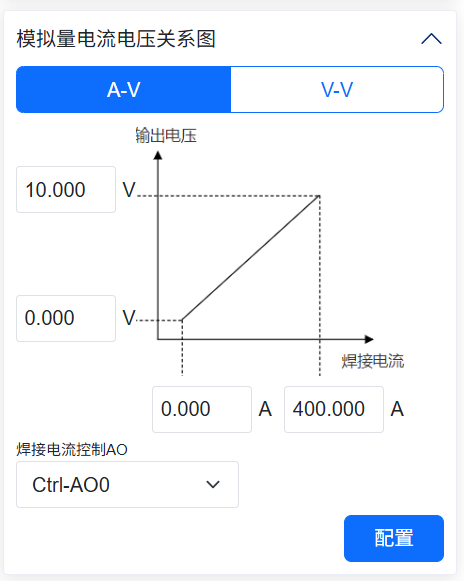

.. centered:: 圖表 8.5-39 焊接恢復

.. warning::
 協作機器人焊接中斷恢復功能僅可用於直線焊縫或圓弧焊縫，當使用while（1）循環焊接時，不支援嵌套多層while循環，不可包含含有局部變數的條件判斷語句。如果使用段焊功能，請注意增加回饋段焊資訊介面。

附件一：機器人UDP通訊協議
~~~~~~~~~~~~~~~~~~~~~~~~~~

.. warning::
 1）CRC 校驗方式：採用modbus 16 校驗但只取低8位元進行校驗校驗資料區域D100-D176，D200-D273。

 2）電弧追蹤：實際電流回饋是將PLC取得到焊接機的實際電流轉換成0-4095的類比量傳送到UDP資料協定的類比量通道0即D168。

 3）速度換算邏輯：機器人下發速度（單位mm/s）V÷導程×60=V'；

 PLC將機器人下發速度進行轉換V'×編碼器解析度÷60=V"單位（脈衝/s）。

機器人控制器->PLC
++++++++++++++++++++++

.. list-table:: 
   :widths: 10 10 10 10 20
   :header-rows: 1
   :align: center

   * - 序號
     - 暫存器位址
     - 資料型
     - 數據值
     - 變數名

   * - 1
     - D199
     - INT
     - 0x5A5A
     - 幀頭

   * - 2
     - D200
     - INT
     -
     - 1#電機控製字

   * - 3
     - D201
     - DINT
     -
     - 1#目標位置輸入

   * - 4
     - D202
     - DINT
     -
     - 1#目標位置輸入

   * - 5
     - D203
     - INT
     -
     - 1#回零控製字

   * - 6
     - D204
     - DINT
     -
     - 1#回零高速度輸入

   * - 7
     - D205
     - DINT
     -
     - 1#回零高速度輸入

   * - 8
     - D206
     - DINT
     -
     - 1#回零低速度輸入

   * - 9
     - D207
     - DINT
     -
     - 1#回零低速度輸入

   * - 10
     - D208
     - DINT
     -
     - 1#位置偏移（預留）

   * - 11
     - D209
     - DINT
     -
     - 1#位置偏移（預留）

   * - 12
     - D210
     - DINT
     -
     - 1#速度偏移（預留）

   * - 13
     - D211
     - DINT
     -
     - 1#速度偏移（預留）

   * - 14
     - D212
     - DINT
     -
     - 1#轉矩偏移（預留）

   * - 15
     - D213
     - DINT
     -
     - 1#轉矩偏移（預留）

   * - 16
     - D214
     - INT
     -
     - 2#電機控製字

   * - 17
     - D215
     - DINT
     -
     - 2#目標位置輸入

   * - 18
     - D216
     - DINT
     -
     - 2#目標位置輸入

   * - 19
     - D217
     - INT
     -
     - 2#回零控製字

   * - 20
     - D218
     - DINT
     -
     - 2#回零高速度輸入

   * - 21
     - D219
     - DINT
     -
     - 2#回零高速度輸入

   * - 22
     - D220
     - DINT
     -
     - 2#回零低速度輸入

   * - 23
     - D221
     - DINT
     -
     - 2#回零低速度輸入

   * - 24
     - D222
     - DINT
     -
     - 2#位置偏移（預留）

   * - 25
     - D223
     - DINT
     -
     - 2#位置偏移（預留）

   * - 26
     - D224
     - DINT
     -
     - 2#速度偏移（預留）

   * - 27
     - D225
     - DINT
     -
     - 2#速度偏移（預留）

   * - 28
     - D226
     - DINT
     -
     - 2#轉矩偏移（預留）

   * - 29
     - D227
     - DINT
     -
     - 2#轉矩偏移（預留）

   * - 30
     - D228
     - INT
     -
     - 3#電機控製字

   * - 31
     - D229
     - DINT
     -
     - 3#目標位置輸入

   * - 32
     - D230
     - DINT
     -
     - 3#目標位置輸入

   * - 33
     - D231
     - INT
     -
     - 3#回零控製字

   * - 34
     - D232
     - DINT
     -
     - 3#回零高速度輸入

   * - 35
     - D233
     - DINT
     -
     - 3#回零高速度輸入

   * - 36
     - D234
     - DINT
     -
     - 3#回零低速度輸入

   * - 37
     - D235
     - DINT
     -
     - 3#回零低速度輸入

   * - 38
     - D236
     - DINT
     -
     - 3#位置偏移（預留）

   * - 39
     - D237
     - DINT
     -
     - 3#位置偏移（預留）

   * - 40
     - D238
     - DINT
     -
     - 3#速度偏移（預留）

   * - 41
     - D239
     - DINT
     -
     - 3#速度偏移（預留）

   * - 42
     - D240
     - DINT
     -
     - 3#轉矩偏移（預留）

   * - 43
     - D241
     - DINT
     -
     - 3#轉矩偏移（預留）

   * - 44
     - D242
     - INT
     -
     - 4#電機控製字

   * - 45
     - D243
     - DINT
     -
     - 4#目標位置輸入

   * - 46
     - D244
     - DINT
     -
     - 4#目標位置輸入

   * - 47
     - D245
     - INT
     -
     - 4#回零控製字

   * - 48
     - D246
     - DINT
     -
     - 4#回零高速度輸入

   * - 49
     - D247
     - DINT
     -
     - 4#回零高速度輸入

   * - 50
     - D248
     - DINT
     -
     - 4#回零低速度輸入

   * - 51
     - D249
     - DINT
     -
     - 4#回零低速度輸入

   * - 52
     - D250
     - DINT
     -
     - 4#位置偏移（預留）

   * - 53
     - D251
     - DINT
     -
     - 4#位置偏移（預留）

   * - 54
     - D252
     - DINT
     -
     - 4#速度偏移（預留）

   * - 55
     - D253
     - DINT
     -
     - 4#速度偏移（預留）

   * - 56
     - D254
     - DINT
     -
     - 4#轉矩偏移（預留）

   * - 57
     - D255
     - DINT
     -
     - 4#轉矩偏移（預留）

   * - 58
     - D256
     - INT
     -
     - 普通輸出DO(0-15)

   * - 59
     - D257
     - INT
     -
     - 普通輸出DO(16-31)

   * - 60
     - D258
     - INT
     -
     - 普通輸出DO(32-47)

   * - 61
     - D259
     - INT
     -
     - 普通輸出DO(48-63)

   * - 62
     - D260
     - INT
     -
     - 普通輸出DO(64-79)

   * - 63
     - D261
     - INT
     -
     - 普通產出DO(80-95)

   * - 64
     - D262
     - INT
     -
     - 高速輸出DO(96-111)

   * - 65
     - D263
     - INT
     -
     - 高速輸出DO(112-127)

   * - 66
     - D264
     - INT
     -
     - 類比輸出AO0

   * - 67
     - D265
     - INT
     -
     - 類比輸出AO1

   * - 68
     - D266
     - INT
     -
     - 類比輸出AO2

   * - 69
     - D267
     - INT
     -
     - 類比輸出AO3

   * - 70
     - D268
     - REAL
     -
     - 下發焊接電壓

   * - 71
     - D269
     - REAL
     -
     - 下發焊接電壓

   * - 72
     - D270
     - REAL
     -
     - 下發焊接電流

   * - 73
     - D271
     - REAL
     -
     - 下發焊接電流

   * - 74
     - D272
     - REAL
     -
     - 丟包檢測週期

   * - 75
     - D273
     - INT
     -
     - 丟包個數

   * - 76
     - D274
     - INT
     -
     - 幀計數（0-255）

   * - 77
     - D275
     - INT
     -
     - CRC檢定碼

PLC -> 機器人控制器
++++++++++++++++++++

.. list-table:: 
   :widths: 10 10 10 10 20
   :header-rows: 1
   :align: center

   * - 序號
     - 暫存器位址
     - 資料型
     - 數據值
     - 變數名

   * - 1
     - D99
     - INT
     - 0x5A5A
     - 幀頭

   * - 2
     - D100
     - INT
     -
     - 1#電機狀態字

   * - 3
     - D101
     - DINT
     -
     - 1#當前位置

   * - 4
     - D102
     - DINT
     -
     - 1#當前位置

   * - 5
     - D103
     - INT
     -
     - 1#回零狀態字

   * - 6
     - D104
     - DINT
     -
     - 1#回零高速度回饋

   * - 7
     - D105
     - DINT
     -
     - 1#回零高速度回饋

   * - 8
     - D106
     - DINT
     -
     - 1#回零低速度回饋

   * - 9
     - D107
     - DINT
     -
     - 1#回零低速度回饋

   * - 10
     - D108
     - INT
     -
     - 1#故障碼

   * - 11
     - D109
     - DINT
     -
     - 1#隨動偏差（預留）

   * - 12
     - D110
     - DINT
     -
     - 1#隨動偏差（預留）

   * - 13
     - D111
     - DINT
     -
     - 1#速度回饋（預留）

   * - 14
     - D112
     - DINT
     -
     - 1#速度回饋（預留）

   * - 15
     - D113
     - DINT
     -
     - 1#即時轉矩（預留）

   * - 16
     - D114
     - DINT
     -
     - 1#即時轉矩（預留）

   * - 17
     - D115
     - INT
     -
     - 2#電機狀態字

   * - 18
     - D116
     - DINT
     -
     - 2#當前位置

   * - 19
     - D117
     - DINT
     -
     - 2#當前位置

   * - 20
     - D118
     - INT
     -
     - 2#回零狀態字

   * - 21
     - D119
     - DINT
     -
     - 2#回零高速度回饋

   * - 22
     - D120
     - DINT
     -
     - 2#回零高速度回饋

   * - 23
     - D121
     - DINT
     -
     - 2#回零低速度回饋

   * - 24
     - D122
     - DINT
     -
     - 2#回零低速度回饋

   * - 25
     - D123
     - INT
     -
     - 2#故障碼

   * - 26
     - D124
     - DINT
     -
     - 2#隨動偏差（預留）

   * - 27
     - D125
     - DINT
     -
     - 2#隨動偏差（預留）

   * - 28
     - D126
     - DINT
     -
     - 2#速度回饋（預留）

   * - 29
     - D127
     - DINT
     -
     - 2#速度回饋（預留）

   * - 30
     - D128
     - DINT
     -
     - 2#即時轉矩（預留）

   * - 31
     - D129
     - DINT
     -
     - 2#即時轉矩（預留）

   * - 32
     - D130
     - INT
     -
     - 3#電機狀態字

   * - 33
     - D131
     - DINT
     -
     - 3#當前位置

   * - 34
     - D132
     - DINT
     -
     - 3#當前位置

   * - 35
     - D133
     - INT
     -
     - 3#回零狀態字

   * - 36
     - D134
     - DINT
     -
     - 3#回零高速度回授

   * - 37
     - D135
     - DINT
     -
     - 3#回零高速度回授

   * - 38
     - D136
     - DINT
     -
     - 3#回零低速度回饋

   * - 39
     - D137
     - DINT
     -
     - 3#回零低速度回饋

   * - 40
     - D138
     - DINT
     -
     - 3#故障碼

   * - 41
     - D139
     - DINT
     -
     - 3#隨動偏差(預留)

   * - 42
     - D140
     - DINT
     -
     - 3#隨動偏差(預留)

   * - 43
     - D141
     - DINT
     -
     - 3#速度回饋（預留）

   * - 44
     - D142
     - DINT
     -
     - 3#速度回饋（預留）

   * - 45
     - D143
     - DINT
     -
     - 3#即時轉矩（預留）

   * - 46
     - D144
     - DINT
     -
     - 3#即時轉矩（預留）

   * - 47
     - D145
     - INT
     -
     - 4#電機狀態字

   * - 48
     - D146
     - DINT
     -
     - 4#當前位置

   * - 49
     - D147
     - DINT
     -
     - 4#當前位置

   * - 50
     - D148
     - INT
     -
     - 4#回零狀態字

   * - 51
     - D149
     - DINT
     -
     - 4#回零高速度回饋

   * - 52
     - D150
     - DINT
     -
     - 4#回零高速度回饋

   * - 53
     - D151
     - DINT
     -
     - 4#回零低速度回饋

   * - 54
     - D152
     - DINT
     -
     - 4#回零低速度回饋

   * - 55
     - D153
     - DINT
     -
     - 4#故障碼

   * - 56
     - D154
     - DINT
     -
     - 4#隨動偏差（預留）

   * - 57
     - D155
     - DINT
     -
     - 4#隨動偏差（預留）

   * - 58
     - D156
     - DINT
     -
     - 4#速度回饋（預留）

   * - 59
     - D157
     - DINT
     -
     - 4#速度回饋（預留）

   * - 60
     - D158
     - DINT
     -
     - 即時轉矩（預留）

   * - 61
     - D159
     - DINT
     -
     - 即時轉矩（預留）

   * - 62
     - D160
     - INT
     -
     - 一般輸入DI(0-15)

   * - 63
     - D161
     - INT
     -
     - 一般輸入DI(16-31)

   * - 64
     - D162
     - INT
     -
     - 一般輸入DI(32-47)

   * - 65
     - D163
     - INT
     -
     - 一般輸入DI(48-63)

   * - 66
     - D164
     - INT
     -
     - 一般輸入DI(64-79)

   * - 67
     - D165
     - INT
     -
     - 一般輸入DI(80-95)

   * - 68
     - D166
     - INT
     -
     - 高速輸入DI(96-111)

   * - 69
     - D167
     - INT
     -
     - 高速輸入DI(112-127)

   * - 70
     - D168
     - INT
     -
     - 模擬量AI0

   * - 71
     - D169
     - INT
     -
     - 模擬量AI1

   * - 72
     - D170
     - INT
     -
     - 模擬量AI2

   * - 73
     - D171
     - INT
     -
     - 模擬量AI3

   * - 74
     - D172
     - REAL
     -
     - 實際電流回饋

   * - 75
     - D173
     - REAL
     -
     - 實際電流回饋

   * - 76
     - D174
     - REAL
     -
     - 實際電壓回饋

   * - 77
     - D175
     - REAL
     -
     - 實際電壓回饋

   * - 78
     - D176
     - INT
     -
     - 故障碼 0-無故障，1-資料丟包

   * - 79
     - D177
     - INT
     -
     - 幀計數

   * - 80
     - D178
     - INT
     -
     - CRC檢定碼

感測器週邊配置
---------------

法奧協作機器人與雷射感測器搭配使用，透過感測器識別焊縫等特徵位置以達到簡化編程、提高生產效率的目的。協作機器人可適配睿牛、創想和全視三種廠商的雷射感測器，使用不同感測器時只需要載入對應的通訊協定即可。

硬體接線
~~~~~~~~~~~~~

使用雷射感測器前需要將雷射感測器安裝於適當位置，將雷射感測器的網路線直接連接或透過交換器連接到機器人控制箱的任一RJ45介面。

感測器配置
~~~~~~~~~~~~~

請確保您的雷射感測器和焊​​槍已經固定安裝於機器人末端，雷射感測器已經與機器人控制箱透過網路線連接，且雷射感測器與機器人控制箱的IP位址處於同一網段，打開機器人和感測器電源，圖1為睿牛雷射感測器安裝。

.. figure:: robot_peripherals/048.png
   :align: center
   :width: 4in

.. centered:: 圖表 8.6‑1 雷射感測器安裝

如圖2，打開機器人WebApp，在“初始設定->外設->跟踪”中點擊“感測器追蹤”，在通訊配置欄中輸入感測器的IP位址、連接埠號，點擊“配置”按鈕，採樣週期默認為25，座標系選擇“雷射平面座標系”，根據您的感測器型號選擇對應的通訊協議，點擊“載入”按鈕。

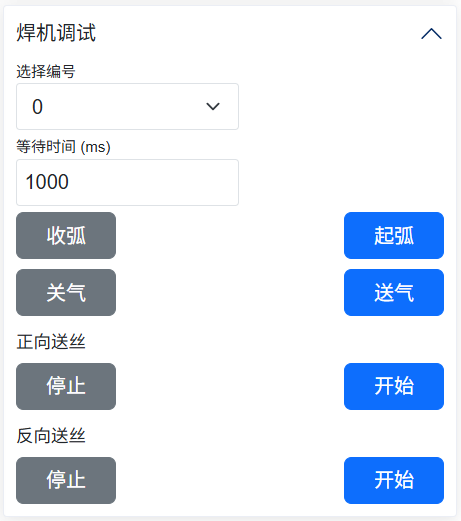

.. centered:: 圖表 8.6‑2 雷射感測器配置

如圖3，在“感測器追蹤”頁面中找到“追蹤感應器測試”欄，依序點擊“開啟感應器”和“關閉感應器”，觀察感應器的雷射是否開啟或關閉，若雷射正常開啟或關閉則表示機器人與感測器已經正常建立通信，否則請檢查IP位址和連接埠號等參數是否正確，以及感測器與機器人網路連接是否正確。

.. centered:: 圖表 8.6‑3 雷射感測器通訊測試

感測器標定
~~~~~~~~~~~~

在使用雷射感測器前需要先對雷射感測器進行標定，標定精度直接影響雷射感測器的追蹤精度。雷射感測器的標定方法有五點法、六點法和八點法，以焊接應用場景下最常用的五點法為例，其標定原理為先透過工具（焊槍）指向一個固定標定點（如圖4），再透過雷射感測器從四個不同的姿態照射並辨識到該點。

.. note::
 此標定點必須可以被雷射感測器準確辨識到，否則無法精確標定。

進而計算出感測器座標位姿，以下詳細介紹其標定過程：

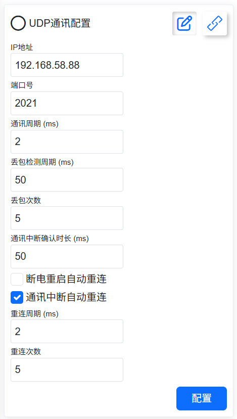

.. centered:: 圖表 8.6‑4 雷射感測器標定點

**step1**：開啟機器人WebApp，依序點選“初始設定－基礎－座標”，點選“工具”進入工具座標系介面。選擇一個未使用的工具座標系，點擊修改其名稱為“焊槍”，工具類型為“工具”，安裝位置為“末端”，如圖5、6。

.. centered:: 圖表 8.6‑5 設定“焊槍座標系”

.. centered:: 圖表 8.6‑6 設定“焊槍”座標系

如圖7，再次選擇未使用的座標系，將其名稱修改為“雷射感測器”，選擇工具類型為“感測器”，安裝位置為“末端”。

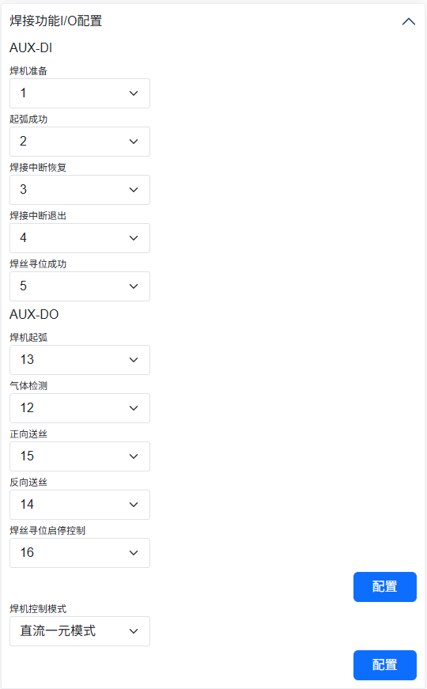

.. centered:: 圖表 8.6‑7 設定“雷射感測器”座標系

**step2**：以六點法對焊槍的工具座標系進行標定：選則「焊槍」座標系，點選修改按鈕（圖8、9），使用六點法進行焊槍工具座標系的標定（具體標定方法參考法奧文檔，本文不做贅述）。

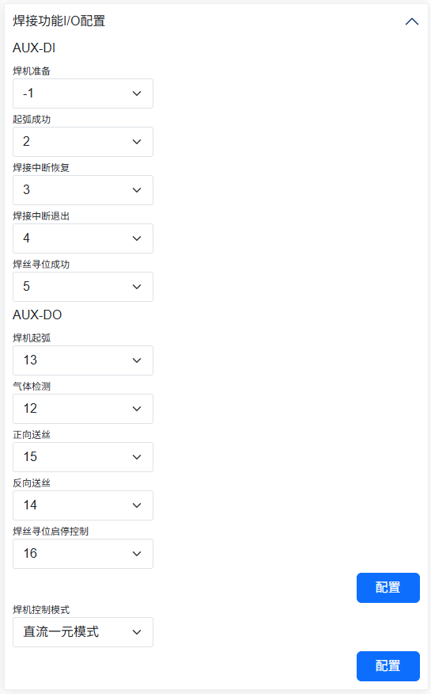

.. centered:: 圖表 8.6‑8 「焊槍」座標系標定1

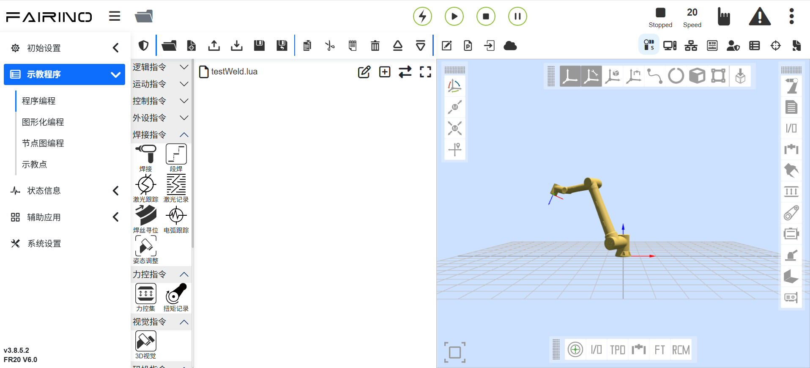

.. centered:: 圖表 8.6‑9 「焊槍」座標系標定2

**step3**：如圖10，在“工具座標系設定”中選擇0號座標系(基座標系)，預設名稱為“toolcoord0”，點選“應用”，將目前的座標系切換為基座標系。

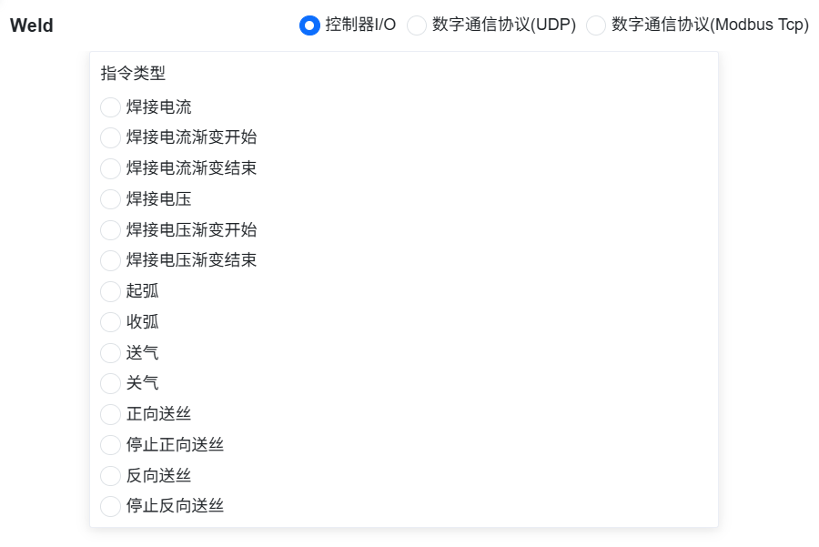

.. centered:: 圖表 8.6‑10 感測器標定步驟1

**step4**：如圖11，再次選擇先前設定的“雷射感應器”座標系(不點選“應用”)，點選“修改”按鈕，選擇工具類型為“感應器”，感應器固定在“機器人末端” ，修改精靈選擇「五點法」。

.. figure:: robot_peripherals/058.png
   :align: center
   :width: 4in

.. centered:: 圖表 8.6‑11 感測器標定步驟2

**step5**：拖曳機器人使焊槍尖端對準標定點（如圖12），選擇“焊槍”坐標系，點擊“應用”，點擊“設定點1”，如圖13。

.. figure:: robot_peripherals/059.png
   :align: center
   :width: 4in

.. centered:: 圖表 8.6‑12 感測器標定步驟3

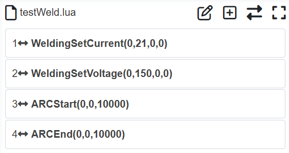

.. centered:: 圖表 8.6‑13 感測器標定步驟4

**step6**：再次選擇0號座標系（「toolcoord0」），點選應用（圖14）；然後選擇「感測器」座標系（不點選「應用」），點選「修改」（圖15），即可繼續進行標定。

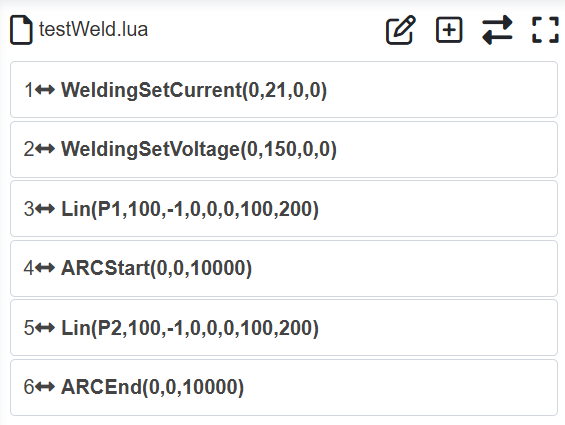

.. centered:: 圖表 8.6‑14 感測器標定步驟5

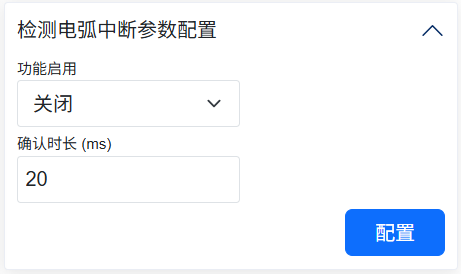

.. centered:: 圖表 8.6‑15 感測器標定步驟6

**step7**：移動雷射感測器位置，使雷射剛好掃描到標定點(圖16)，點選「設定點2」；此時左側的感測器輸出值對應序號位置會顯示目前的感測器資料（圖18），若資料正常則表示目前標定點成功，否則需要重新標定。

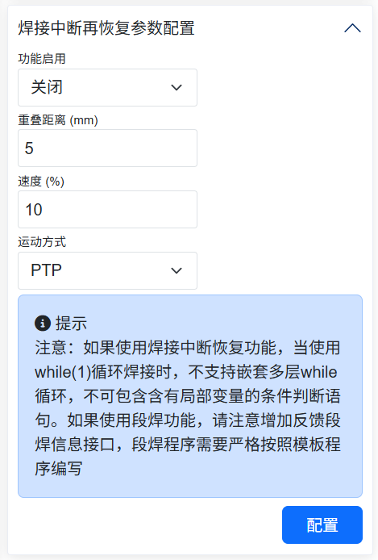

.. centered:: 圖表 8.6‑16 感測器標定步驟7

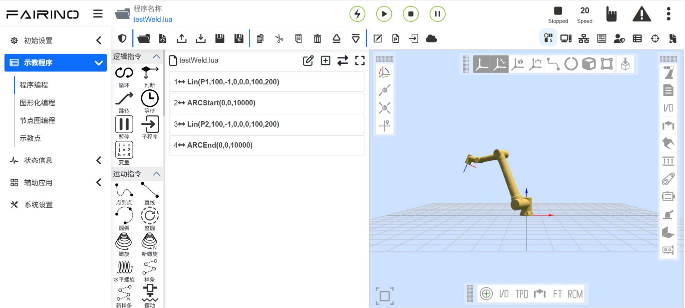

.. centered:: 圖表 8.6‑17 感測器標定步驟8

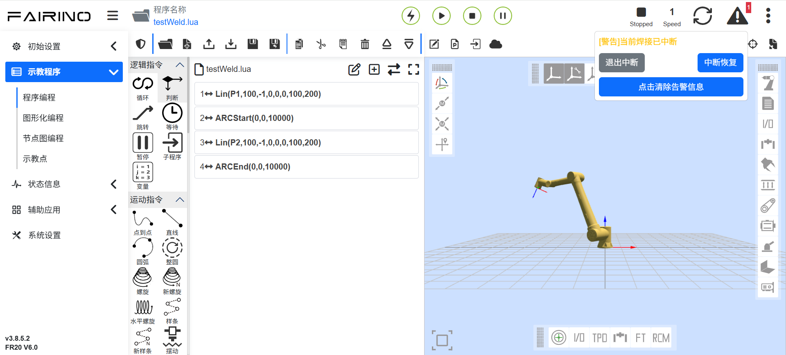

.. centered:: 圖表 8.6‑18 感測器標定步驟9

**step8**：依序將雷射再從三個不同的姿態照射標定點，並分別點擊“設定點3”、“設定點4”和“設定點5”，最後在確保每個點的數據都正常的情況下，點擊「計算」按鈕（圖19）。

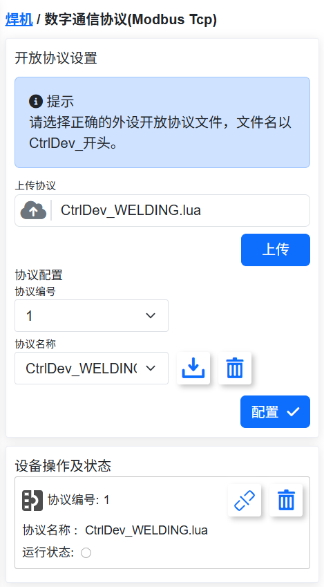

.. centered:: 圖表 8.6‑19 感測器標定步驟10

**step9**：此時WebApp上顯示感測器的標定結果與標定精度，點選「應用」按鈕（圖20），即完成了雷射感測器的標定。若標定精度過差，則可選擇點選「取消」按鈕，並重新進行標定。

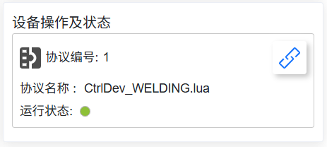

.. centered:: 圖表 8.6‑20 感測器標定精度

雷射感測器應用
~~~~~~~~~~~~~~~~

使用雷射感測器前，先將「焊槍」工具座標系應用到目前工具座標系（圖21）。

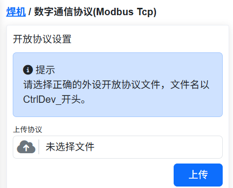

.. centered:: 圖表 8.6‑21 應用焊槍座標系

雷射感測器示教點
++++++++++++++++++

如圖22，拖曳機器人使雷射感測器光線指向想要示教的焊接點。如圖23，在WebApp選擇感測器為“雷射感測器”，輸入感測器點名稱為“laserPt”，點選“新增”按鈕。新建用戶程式“testLaser.lua”，創建運動指令PTP，目標點選擇“laserPt”，單步執行該指令，此時焊槍將運動到先前雷射感測器的指向點（圖24）。

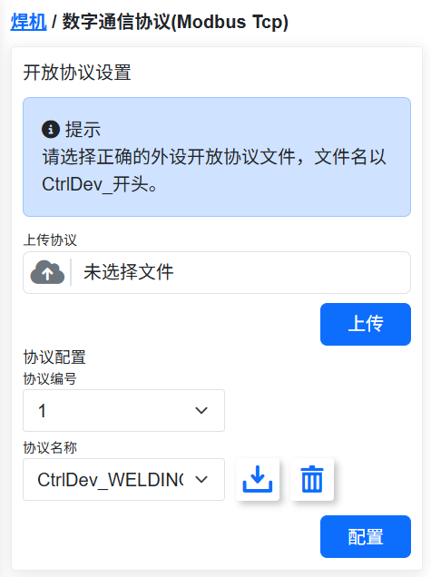

.. centered:: 圖表 8.6‑22 雷射感測焊縫點

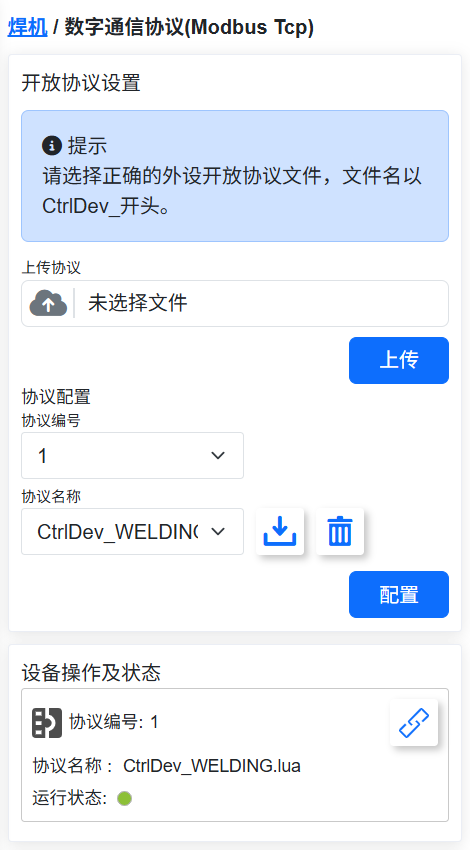

.. centered:: 圖表 8.6‑23 示教感測器點

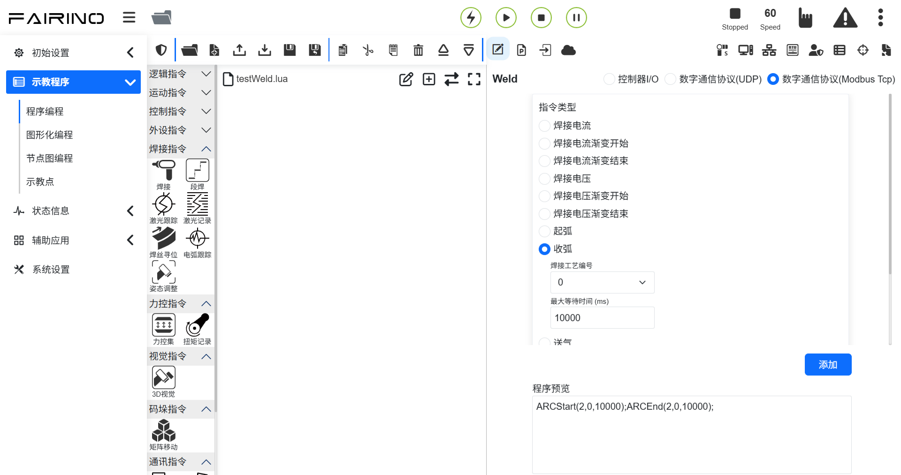

.. centered:: 圖表 8.6‑24 焊槍指向焊縫點

雷射尋位 + 跟踪
++++++++++++++++

協作機器人與雷射感測器配合完成雷射尋位 + 雷射追蹤功能共需要幾個步驟：

(1) 機器人移動到焊接處外部的某一點；

(2) 開始雷射尋位，且機器人攜帶雷射感應器向焊接位置移動；

(3) 雷射感測器辨識到焊縫，機器人帶動焊槍移動到焊縫辨識點；

(4) 雷射追蹤開始，同時機器人向焊縫終點運動，雷射感測器在運動過程中即時記錄位置；

(5) 焊槍沿著雷射感測器記錄的位置進行移動，以實現追蹤效果。

在尋位追蹤調試前，請先確保感測器已經正確安裝、「焊槍」工具座標系已經正確標定，雷射感測器也已經正確標定完成。如圖25，假設圖中綠色直線為待焊焊縫，使機器人實現自動尋找焊接起點A點，並自動焊接至B點，需進行以下指令編寫：

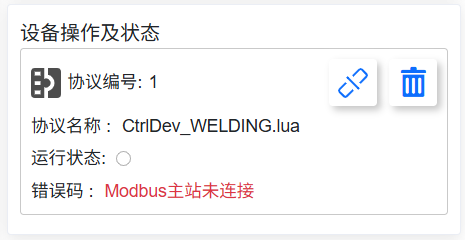

.. centered:: 圖表 8.6‑25 感測器安裝

編寫尋位指令
*************

如圖26，新使用者程式“laserTrack.lua”，選擇“焊接指令”。

.. centered:: 圖表 8.6‑26 新增尋位指令

如圖27，點擊“雷射追蹤”，彈出雷射追蹤指令添加頁面。

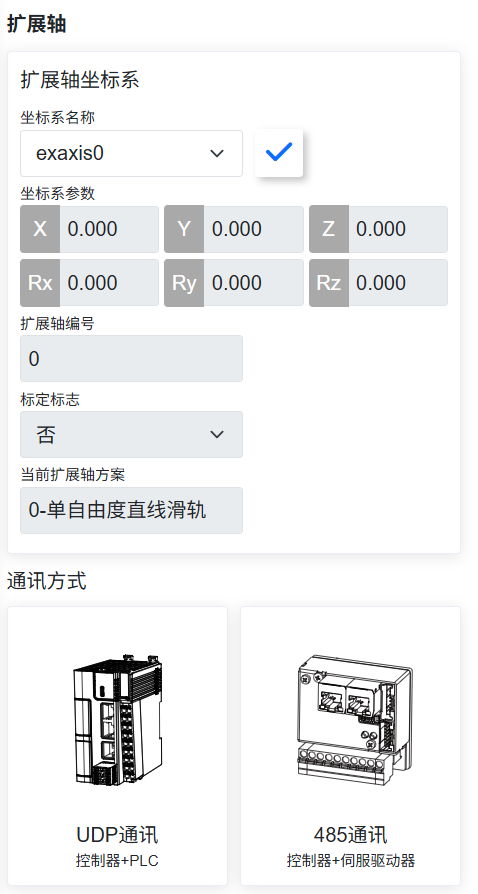

.. centered:: 圖表 8.6‑27 雷射追蹤指令

如圖28，找到“尋位指令”，選擇座標系名稱為“雷射感測器”，方向選擇“+x”表示機器人攜帶雷射感測器從目前位置沿“焊槍”座標系的“+x”方向邊運動邊搜尋焊縫，「速度」為雷射感測器尋位的移動速度，長度為雷射感測器的最大尋位長度，當機器人尋位距離超出該長度仍未尋找到焊縫時機器人將報錯，最大尋位時間與長度類似，超出該時間仍未找到焊接時機器人報錯。請您根據實際場景正確輸入上述相關參數。依序點選「尋位開始」和「尋位結束」指令，並點選「應用」按鈕。

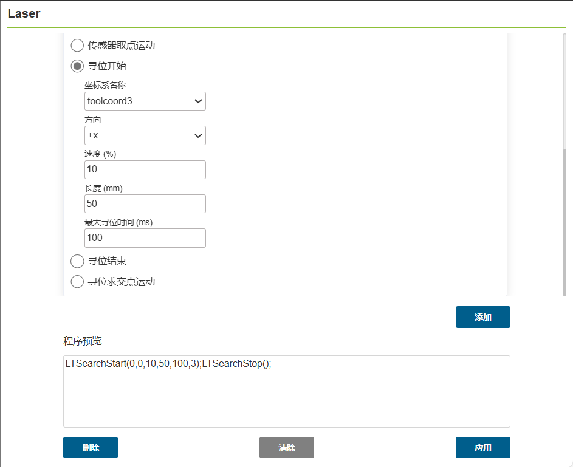

.. centered:: 圖表 8.6‑28 新增尋位指令

此時「laserTrack.lua」中將增加對應的雷射尋位開始和結束的指令（圖29）。

.. centered:: 圖表 8.6‑29 尋位程式

編寫運動到尋位點指令
*********************

新增點到點運動LIN指令，如圖，目標點為「seamPos」即雷射感測器尋位點。

.. note:: 「seamPos點為機器人系統內部專用於雷射感測器尋位的點位名稱，不需要示教該點，雷射感測器尋位後會自動將尋位點資訊存入「seamPos點中」。

尋位點可以設定偏移，偏移類型可選擇「基座標系偏移」、「工具座標系偏移」和「雷射原始資料偏移」（圖30）。

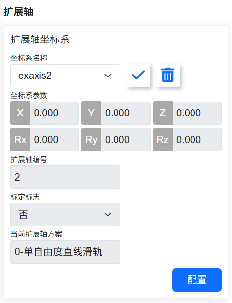

.. centered:: 圖表 8.6‑30 尋位元偏移選項

如圖31，當啟用尋位偏移功能時，可設定偏移參數，「dx」表示沿所選座標系x方向的偏移距離，「drx」表示沿所選座標系x軸旋轉的角度。點選「新增」按鈕，點選「應用」按鈕。

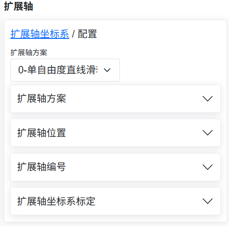

.. centered:: 圖表 8.6‑31 尋位偏移參數設定

此時「testTrack.lua」中將增加移動到尋位點的指令，如圖32。

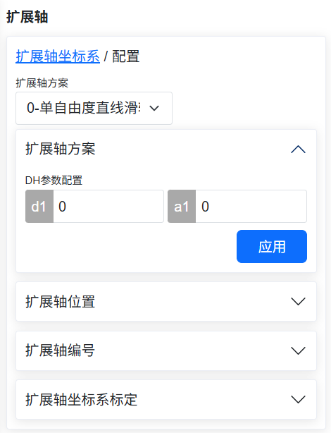

.. centered:: 圖表 8.6‑32 尋位偏移程序

編寫雷射追蹤指令
******************

再次開啟「雷射追蹤」指令新增頁面，如圖33。

.. centered:: 圖表 8.6‑33 雷射追蹤

如圖34，在「雷射追蹤」指令新增頁面中依序點擊「開始追蹤」和「停止追蹤」按鈕，最後點擊頁面最下面的「應用」按鈕。

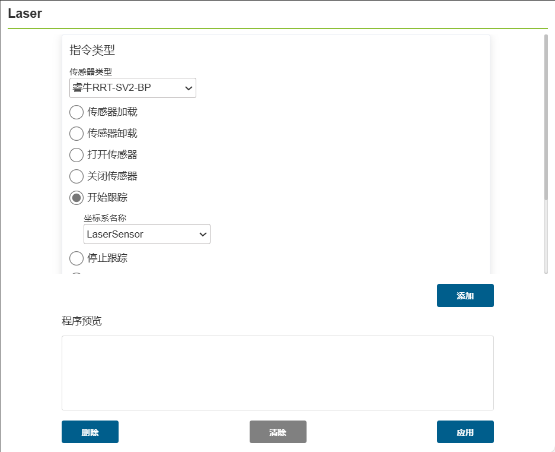

.. centered:: 圖表 8.6‑34 雷射追蹤開始與停止

此時的使用者程式「testTrack.lua」如圖35：

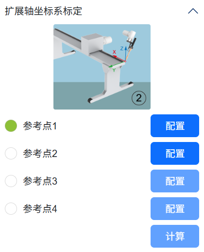

.. centered:: 圖表 8.6‑35 雷射追蹤程序

編寫尋位開始點和追蹤終點指令
*****************************

在雷射尋位開始前，需要先指定一個尋位起始點，機器人先移動到尋位起始點，然後再沿一定的方向和速度進行尋位，如圖36，在雷射感測器光線靠近焊縫起點A點附近示教尋位開始點“seamStartPt”，注意匹配尋位起始點與尋位方向，確保機器人能在設定的距離和最大尋位時間內找到焊接位置。

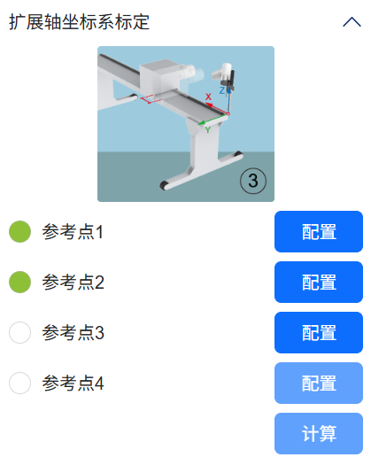

.. centered:: 圖表 8.6‑36 尋位起點

如圖37，在焊接末端示教追蹤終止點「trackEndPt」。

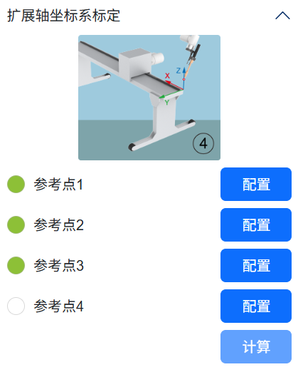

.. centered:: 圖表 8.6‑37 呼叫終點

將上述兩個點加入到「testTrack.lua」使用者程式中，最終的使用者程式如下（圖38）：

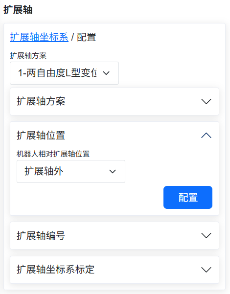

.. centered:: 圖表 8.6‑38 尋位追蹤程序

編寫焊接相關指令
*****************

最後，在焊接尋位點「seampos」和「trackEndPt」之間加上焊接指令，最終的程序如下（圖39）：

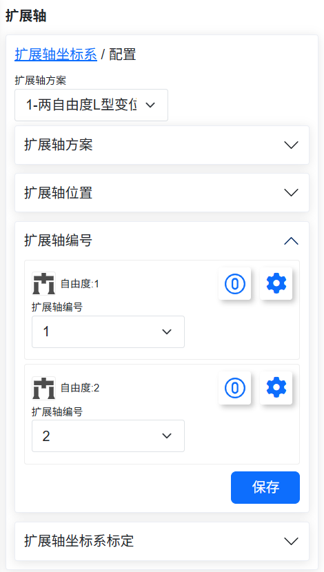

.. centered:: 圖表 8.6‑39 寻位元追蹤焊接程序

執行上述程序，機器人將攜帶雷射感測器從尋位起點開始尋位運動，尋找到焊縫後，機器人立即移動到焊縫起點，並執行起弧操作，起弧成功後，機器人向焊縫終點運動並在運動過程中追蹤焊接軌跡，機器人移動到焊接終點後即停止焊接。

雷射軌跡記錄 + 軌跡復現
++++++++++++++++++++++++

雷射軌跡記錄+軌跡復現的工作流程為：

(1) 機器人攜帶雷射感測器沿焊縫運動一段軌跡，雷射感測器在運動的過程中即時記錄焊接位置軌跡數據；

(2) 軌跡記錄完成後，機器人移動至軌跡記錄的起始點；

(3) 機器人沿著雷射感測記錄的軌跡進行軌跡復現運動。

機器人軌跡記錄指令編寫
************************

新用戶程式“testRecord.lua”，點擊“雷射記錄”開啟雷射記錄指令新增頁面，找到“焊接資料記錄”，如圖40，選擇“開始記錄”，點擊“新增”按鈕，選擇停止記錄，再次點選「新增」按鈕；最後點選「應用」按鈕（圖41）。

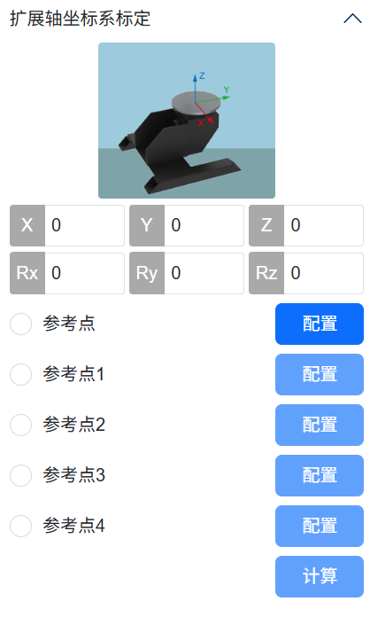

.. centered:: 圖表 8.6‑40 雷射記錄

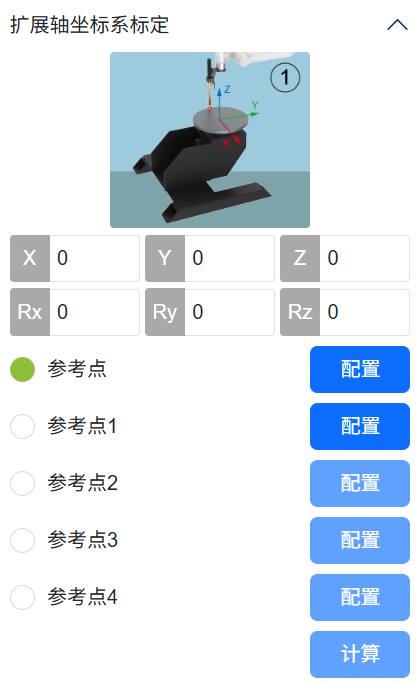

.. centered:: 圖表 8.6‑41 開始記錄與停止記錄

此時頁面上出現軌跡記錄開始和停止指令（圖42）。

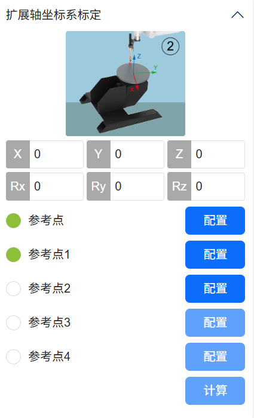

.. centered:: 圖表 8.6‑42 軌跡記錄程序

如圖43，假設圖中綠色線段AB為焊縫，分別使雷射照射到焊縫起始點A和焊縫中斷B，並示教軌跡記錄的起點「recordStartPt」和終點「recordEndPt」。

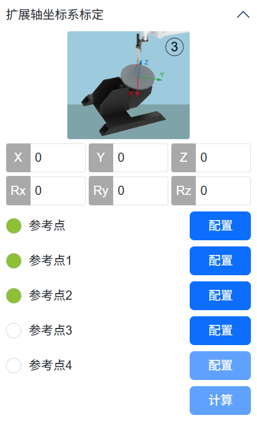

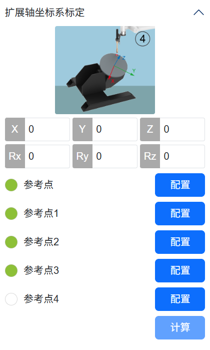

.. centered:: 圖表 8.6‑43 軌跡記錄起點和終點

在“testRecord.lua”中加入兩條直線(LIN)運動指令，分別為運動到軌跡記錄起點“recordStartPt”和終點“recordEndPt”，並調整指令位置，使機器人進行如下操作：先運動到“recordStartPt”點，開始軌跡記錄，機器人移動到「recordEndPt」點，停止軌跡記錄（圖44）。

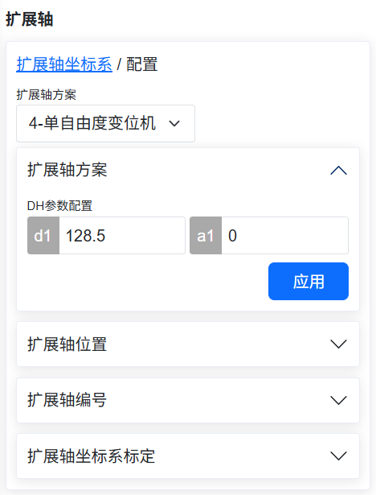

.. centered:: 圖表 8.6‑44 軌跡記錄程序

機器人運動到軌跡記錄起點指令編寫
*********************************

如圖45，點選「雷射記錄」開啟雷射記錄指令新增頁面，找到「移動至焊接點」欄，選擇運動方式為PTP，輸入一定的運動速度，點選「運動至起點」，點選「應用」按鈕。

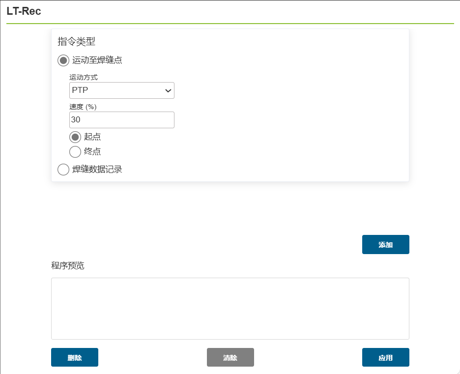

.. centered:: 圖表 8.6‑45 運動至軌跡起點

此時「testRecord.lua」使用者程式如下（圖46）：

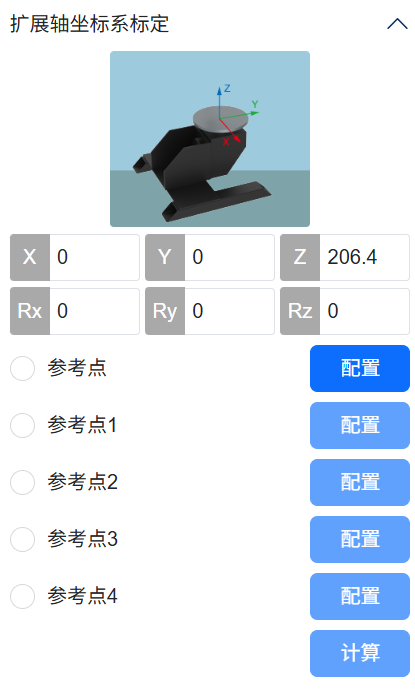

.. centered:: 圖表 8.6‑46 運動至軌跡起點程序

雷射感測器軌跡復現指令編寫
****************************

點擊“雷射記錄”打開雷射記錄指令新增頁面，找到“焊接數據記錄”，如圖，選擇“軌跡復現”，點擊“新增”按鈕，點擊“雷射追蹤複現”按鈕，最後點擊“應用”按鈕（圖47）。

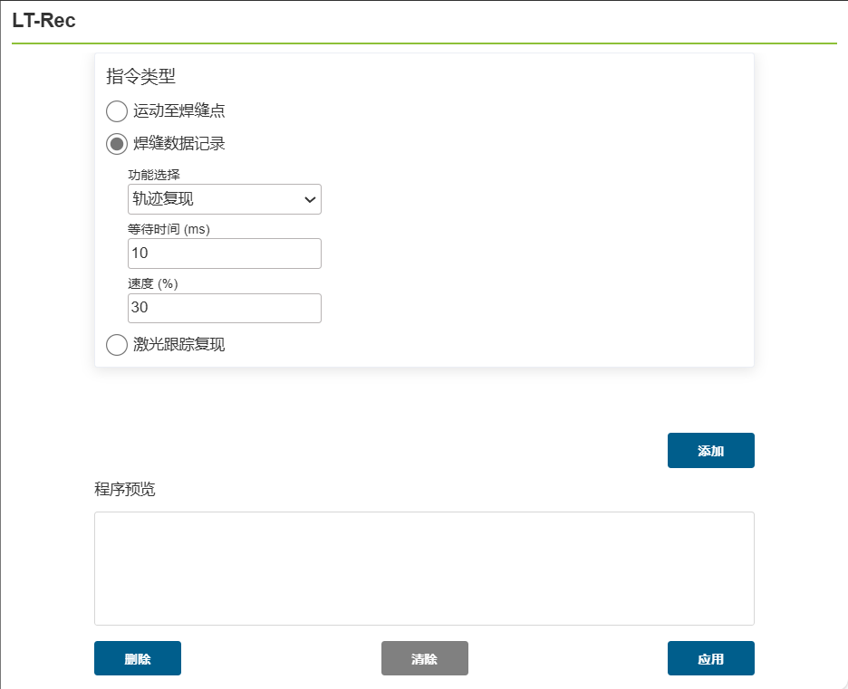

.. centered:: 圖表 8.6‑47 軌跡復現

新增完成後的程序如下（圖48）：

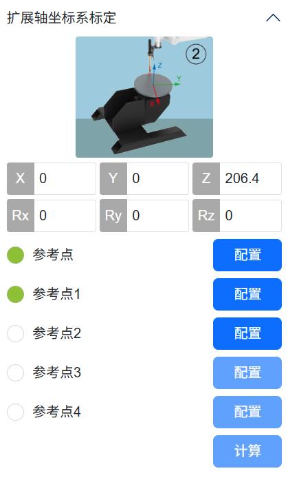

.. centered:: 圖表 8.6‑48 軌跡復現程序

焊接相關指令編寫
********************

最後在軌跡復現開始前和結束後加上焊接開始和焊接結束指令（圖49）：

.. centered:: 圖表 8.6‑49 軌跡記錄復現焊接程序

執行上述程序，機器人將攜帶雷射感測器先沿著焊接軌跡運動，並記錄整個軌跡，然後機器人運動到軌跡記錄的起點，機器人起弧並沿著雷射感測器記錄的軌跡開始焊接，當機器人軌跡復現完成後，焊接電弧熄滅，完成焊接。

激光傳感器適配控制器外設開放協議（僅在Linux系統下使用）
************************************************************

**Step1**：如果需要採用“開放協議連接”和“控制激光傳感器”，則在傳感器跟踪配置中，“協議類型”選項選擇“控制器開放協議”，如果採用原方案則選擇“已適配激光設備”，在跟踪傳感器界面配置加載激光外設。

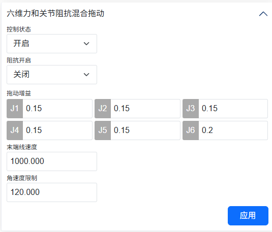

.. centered:: 圖表 8.6‑50 “開放協議連接”和“控制激光傳感器”配置界面

**Step2**：隨後在“初始設置”->“外設”->“控制箱”->“外設開放協議”中，上傳對應激光傳感器的外設開放協議，上傳成功後選擇協議編號和上傳的文件名，點擊配置，並在設備操作及狀態中，運行上傳的激光傳感器，即可和對應的激光傳感器建立連接。

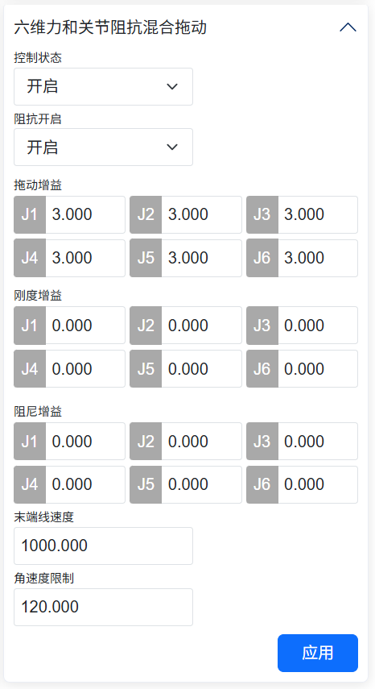

.. centered:: 圖表 8.6‑51 激光傳感器建立連接

雷射取點運動功能
---------------------

在焊接過程中，雷射取點運動可配置姿態，使機器人到達位置點時能達到預期的姿態。可輕鬆應付角焊縫及坡口焊縫等特殊場景。

雷射取點運動功能操作流程
~~~~~~~~~~~~~~~~~~~~~~~~~

**Step1**：使用雷射感測器前，先將「焊槍」工具座標系應用到目前工具座標系。開啟示教頁面，依序點選“初始設定”、“基礎”、“座標系”、“工具”，座標系名稱選擇“焊槍”並應用，系統頁面左上角工具座標系顯示為Tool1。

.. centered:: 圖表 8.7‑1 應用焊槍座標系

**Step2**：編寫雷射取點運動lua程式。依序點選“示教程式”、“程式編程”、“新建按鈕”，新建用戶程式“testPointRecord.lua”。

.. figure:: robot_peripherals/176.png
   :align: center
   :width: 3in

.. centered:: 圖表 8.7‑2 新建雷射取點運動程序

**Step3**：配置參考姿態示教點（可選）。在手動模式下拖曳機器人至所需的焊接姿態。在示教頁面上依序點選「示教點記錄」、「命名記點」、儲存姿態示教點「referencePoint」。

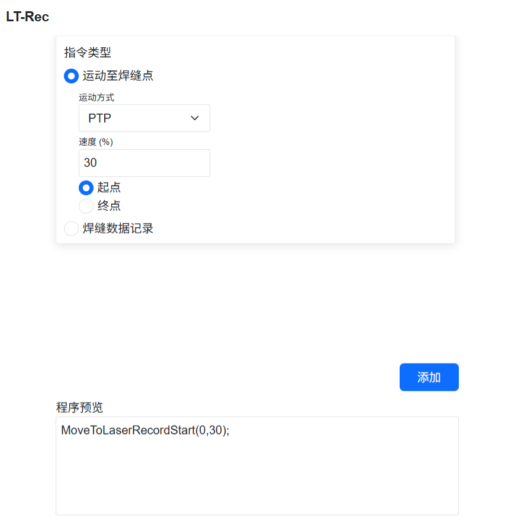

.. centered:: 圖表 8.7‑3 保存姿態參考示教點

**Step4**：產生雷射取點運動程序。依序點擊“示教程式”、“程式編程”、“焊接指令”、“雷射追蹤”、下滑內容至感應器取點運動下，選擇需要的“運動方式”，“調試速度”以及姿態參考點，即可產生對應的雷射取點LUA程式。

如果不選擇姿態參考點，則預設保持取點時姿態進行運動，如果選擇姿態參考點，則以參考姿態運行至雷射取點處。

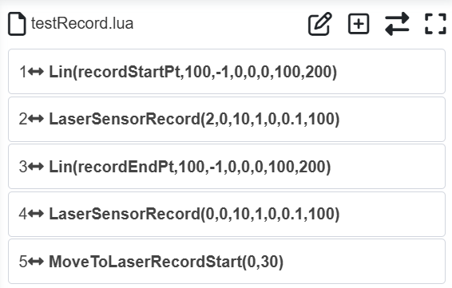

.. centered:: 圖表 8.7‑4 選擇姿態參考示教點

執行雷射取點運動。拖曳機器人使雷射感測器光線指向想要示教的焊接點，雷射感測器會取得焊縫位置，進行取點。執行雷射取點運動後，焊槍將以參考姿態運行到雷射感測器掃描的指向點。

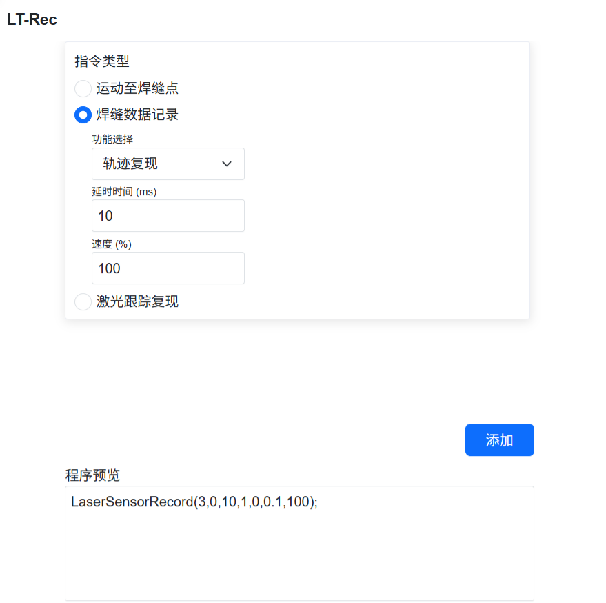

.. centered:: 圖表 8.7‑5 雷射取得焊縫位置

.. figure:: robot_peripherals/180.png
   :align: center
   :width: 4in

.. centered:: 圖表 8.7‑6 焊槍以參考姿態指向焊接位置

尋位三點與四點求交點座標
~~~~~~~~~~~~~~~~~~~~~~~~~~~~

當角焊縫位置不方便直接示教時，協作機器人可以透過手動示教或尋位角焊縫兩邊板材平面位置的方式，計算得到兩平面上採集點的交點來產生角焊縫所在位置。

對於直角焊縫，可以選用三點尋位求交點座標方法；對於非直角焊縫，則採用四點尋位求交點座標方法。

提供指令和lua腳本兩種方式取得交點座標，進行尋位運動，同時可配置參考姿態，機器人攜帶焊槍可以以參考示教點姿態運動至交點處。

指令求交點
++++++++++++++++++

三點求交點座標
*********************

**Step1**：採集三個平面接觸點並儲存為示教點，配置參考示教點；

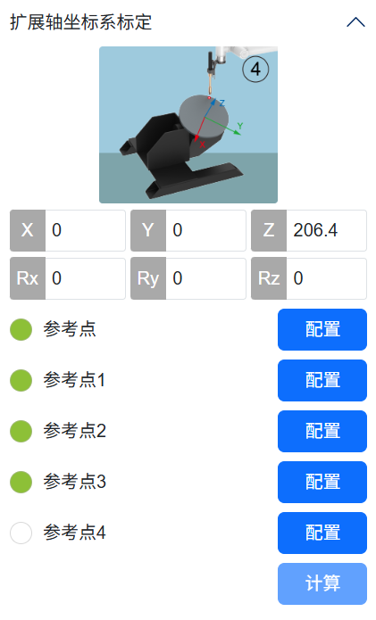

.. centered:: 圖表 8.7‑7 選取三個尋位點

採集的接觸點包含三個點，其中兩點位於同一平面，另一點位於垂直平面。

.. note:: 如果不選擇姿態參考點，則預設產生的交點姿態與P3點一致，如果選擇姿態參考點，和參考示教點姿態一致。

**Step2**：在示教頁中，依序點選“初始設定”、“週邊”、“追蹤”、“感應器”，找到三點與四點求交點座標功能模組。

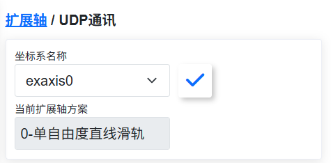

.. centered:: 圖表 8.7‑8 選擇求交點座標的尋位點

**Step3**：下拉框選擇三點尋位，依序選擇採集的三個接觸點，點選計算，查看3D模型中產生交點的顯示是否有誤，將交點命名並儲存；

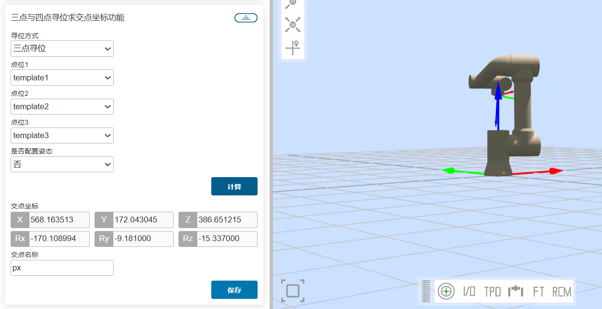

.. centered:: 圖表 8.7‑9 計算交點座標並保存

**Step4**：保存示教點，可以进行示教運動。

.. figure:: robot_peripherals/101.png
   :align: center
   :width: 6in

.. centered:: 圖表 8.7‑10 將交點座標保存成示教點

四點求交點座標
*********************

**Step1**：採集四個平面接觸點並儲存為示教點，並配置參考示教點。

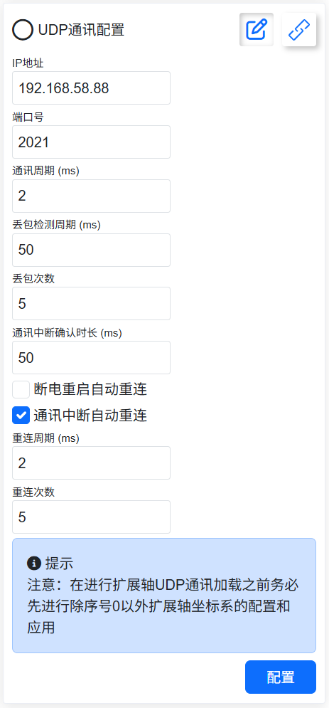

.. centered:: 圖表 8.7‑11 選取四個尋位點

採集的接觸點包含四個點，其中前兩點位於同一平面，後兩點位於垂直平面。

.. note:: 如果不選擇姿態參考點，則預設產生的交點姿態與P4點一致，如果選擇姿態參考點，和參考示教點姿態一致。

**Step2**：在示教頁中，依序點選“初始設定”、“週邊”、“追蹤”、“感應器”，找到三點與四點求交點座標功能模組。

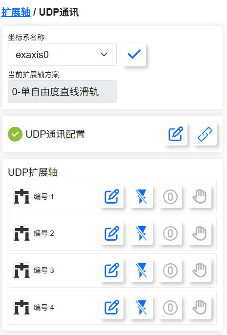

.. centered:: 圖表 8.7‑12 選擇求交點座標的尋位點和參考點

**Step3**：下拉框選擇四點尋位，依序選擇採集的四個接觸點，點選計算，查看3D模型中產生交點的顯示是否有誤，將交點命名並儲存；

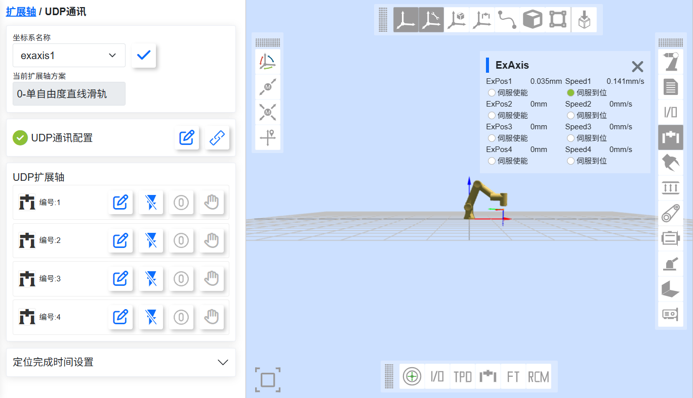

.. centered:: 圖表 8.7‑13 計算交點座標並保存

**Step4**：儲存示教點，可以進行示教運動。

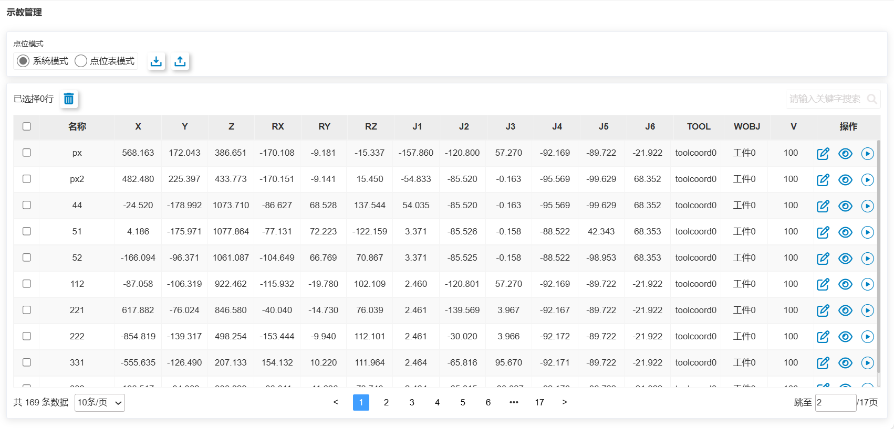

.. centered:: 圖表 8.7‑14 將交點座標保存成示教點

Lua腳本求交點尋位運動
++++++++++++++++++++++++++++++++

三點求交點座標
*********************

**Step1**：採集三個平面接觸點並儲存為示教點，並配置參考示教點。

.. centered:: 圖表 8.7‑15 選取三個尋位點

採集的接觸點包含三個點，其中兩點位於同一平面，另一點位於垂直平面。

.. note:: 如果不選擇姿態參考點，則預設產生的交點姿態與P3點一致，如果選擇姿態參考點，和參考示教點姿態一致。

**Step2**：寫三點求交點尋位運動Lua程式。依序點選“示教程式”、“程式編程”、“新建按鈕”，新建用戶程式“test3point.lua”。

.. figure:: robot_peripherals/181.png
   :align: center
   :width: 6in

.. centered:: 圖表 8.7‑16 新建三點求交點尋位運動程序

**Step3**：產生三點求交點尋位運動程式。依序點選「示教程式」、「程式編程」、「焊接指令」、「雷射追蹤」、下滑內容至尋位求交點運動下，選擇「三點尋位」方式，下拉方塊依序選擇採集的接觸點“點位1”、“點位2”、“點位3”以及姿態參考點，選擇需要的“運動方式”和“調試速度”，點擊“添加”、“應用”按鈕即可產生對應的三點求交點尋位運動程序。

.. centered:: 圖表 8.7‑17 三點求交點尋位運動

**Step4**：在自動模式下點選運轉按鈕，即可自動進行三點求交點計算，機器人拖曳焊槍以參考姿態運動至交點位置。

四點求交點座標
*********************

**Step1**：採集四個平面接觸點並儲存為示教點，並配置參考示教點。

.. centered:: 圖表 8.7‑18 選取四個尋位點

採集的接觸點包含四個點，其中兩點位於同一平面，後兩點位於另一平面。

.. note:: 如果不選擇姿態參考點，則預設產生的交點姿態與P4點一致，如果選擇姿態參考點，和參考示教點姿態一致。

**Step2**：寫四點求交點尋位運動Lua程式。依序點選“示教程式”、“程式編程”、“新建按鈕”，新建用戶程式“test4point.lua”。

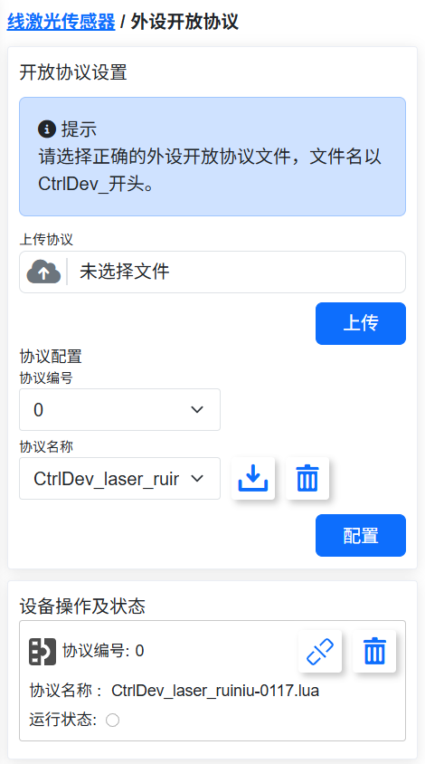

.. centered:: 圖表 8.7‑19 新建四點求交點尋位運動程序

**Step3**：產生四點求交點尋位運動程式。如圖2-14，依序點選「示教程式」、「程式編程」、「焊接指令」、「雷射追蹤」、下滑內容至尋位求交點運動下，選擇「四點尋位」方式，下拉框依序選擇採集的接觸點「點位1”、“點位2”、“點位3”、“點位4”以及姿態參考點，選擇需要的“運動方式”和“調試速度”，點擊“添加”、“應用”按鈕即可產生對應的四點求交點尋位運動程序。

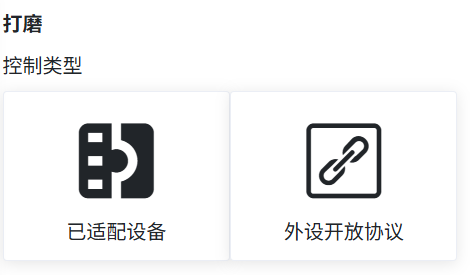

.. centered:: 圖表 8.7‑20 四點求交點尋位運動

**Step4**：在自動模式下點選運轉按鈕，即可自動進行四點求交點計算，機器人拖曳焊槍以參考姿態運動至交點位置。

擴充軸配置
-----------------

在「初始設定－週邊」中，點選「擴充軸」進入擴充軸配置介面，依照通訊方式點選圖片選擇組合方式進行對應的擴充軸外設配置。擴展軸配置首次進入介面如下：

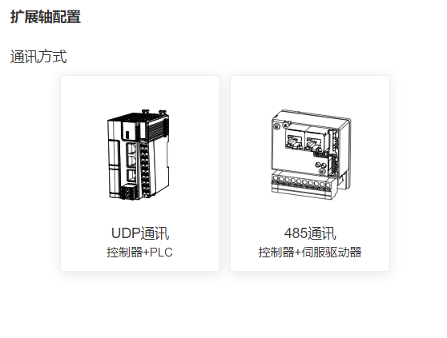

.. centered:: 圖表 8.8‑1 擴展軸配置首次進入介面

目前組合方式依通訊方式分為以下兩種：

- 控制器+PLC（UDP通訊）。

- 控制器+伺服驅動器（485通訊）。

控制器+PLC（UDP通訊）
~~~~~~~~~~~~~~~~~~~~~~~~~~~~

在使用擴展軸UDP通訊方式之前，需要先建立對應的擴展軸標系，在對應的擴展軸座標系下配置對應的擴展軸方案，並在程序示教時應用建立好的工具座標系。擴展軸功能主要與焊接機功能和雷射追蹤感測器功能配合使用。

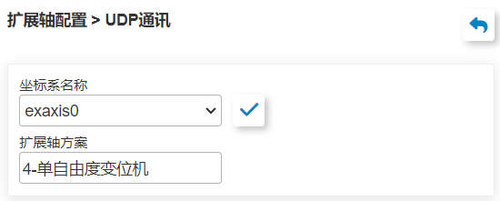

.. centered:: 圖表 8.8‑2 擴展軸座標系應用和目前擴展軸方案顯示

當只需要修改目前擴展軸座標系時，在外部擴展軸配置介面選擇座標系即可應用。當需要更改擴展軸方案時需要進入「初始設定->基礎->座標系->擴展軸」介面修改。具體操作參考使用手冊6.1章節。

當擴展軸方案為「0-單自由度直線滑軌」、「1-兩自由度L型變位機」、「2-三自由度」、「3-四自由度」和「4-單自由度變位機」時，UDP通訊配置成功後顯示「UDP擴充軸」與「定位完成時間設定」內容，當擴充軸方案為「5-兩自由度小車」時，介面顯示「兩自由度小車測試”內容。

UDP通訊配置
+++++++++++++++++

.. note:: 
   .. image:: robot_peripherals/108.png
      :height: 0.75in
      :align: left

   名稱：**編輯按鈕**

   作用：UDP通訊參數配置

.. note:: 
   .. image:: robot_peripherals/109.png
      :height: 0.75in
      :align: left

   名稱：**載入按鈕**

   作用：UDP通訊載入

**Step1**：設定擴充軸UDP通訊參數：設定IP位址、連接埠號碼、通訊週期、丟包偵測週期、丟包次數等參數，其中重連週期與重連次數需在通訊中斷自動重連開關開啟後才可配置。

- IP位址：自訂ip位址；

- 連接埠號碼：依實際情況定義；

- 通訊週期：依實際情況定義，單位ms；

- 丟包偵測通訊週期：10 ~ 1000 ms；

- 丟包次數：1 ~ 100；

- 通訊中斷確認時長：0 ~ 500 ms；

- 斷電重啟自動重連：開/關；

- 通訊中斷自動重連：開/關；

- 重連週期：1 ~ 1000 ms；

- 重連數：1 ~ 100；

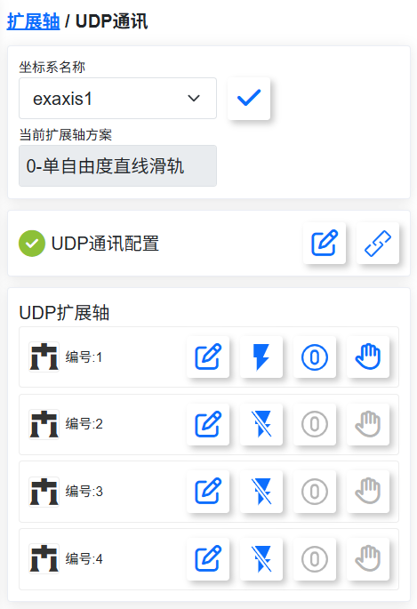

.. centered:: 圖表 8.8‑3 擴充軸UDP通訊參數配置

.. important::
 1. 設定通訊斷開確認時長後，當通訊異常超出該時長時才確認通訊斷開並報錯；
 2. UDP通訊斷開後，觸發UDP斷開報錯(可重設)，可點選清除警告訊息按鈕，UDP通訊再次建立。

**Step2**：通訊參數配置成功後，點選「載入」按鈕，建立UDP通訊，通訊成功後「UDP通訊配置」前方按鈕變綠，機器人各類狀態中的擴充軸狀態查看擴充軸已經伺服到位。

.. centered:: 圖表 8.8‑4 擴充軸UDP建立通訊

.. figure:: robot_peripherals/116.png
   :align: center
   :width: 4in

.. centered:: 圖表 8.8‑5 擴展軸伺服到位

.. important::
 1. UDP通訊未建立連線時，無法設定及查看UDP擴充軸編號資訊；
 2. 在進行擴充軸UDP通訊載入之前務必先進行除序號0以外擴充軸座標系的設定與應用。

UDP擴展軸
+++++++++++++

.. note:: 
   .. image:: robot_peripherals/108.png
      :height: 0.75in
      :align: left

   名稱：**編輯按鈕**

   作用：擴展軸參數配置

.. note:: 
   .. image:: robot_peripherals/117.png
      :height: 0.75in
      :align: left

   名稱：**使能按鈕**

   作用：擴展軸使能狀態，點選按鈕擴展軸去使能

.. note:: 
   .. image:: robot_peripherals/118.png
      :height: 0.75in
      :align: left

   名稱：**使能按鈕**

   作用：擴展軸使能狀態，點選按鈕擴展軸去使能

.. note:: 
   .. image:: robot_peripherals/119.png
      :height: 0.75in
      :align: left

   名稱：**回零按鈕**

   作用：擴展軸回零方式設定

.. note:: 
   .. image:: robot_peripherals/120.png
      :height: 0.75in
      :align: left

   名稱：**測試按鈕**

   作用：擴展軸功能測試

**Step1**：選擇任意擴充軸編號（目前只有編號1、2、3、4），點選擴充軸編號後方的「編輯」按鈕進入詳細配置介面。設定軸類型、軸向、運轉速度、加速度、正方向限位、反方向限位、導程、編碼器解析度、起點偏壓、廠商、型號和模式，點選配置即可配置完成。

- 軸類型：直線導軌、旋轉軸和無限旋轉軸；

- 軸方向：正/負；

- 運轉速度：0~2000mm/s；

- 加速度：0 ~ 2000 mm/s²；

- 正方向限位：0 ~ 50000；

- 反方向限位：-50000 ~ 0；

- 導程：0~1000；

- 編碼器解析度：0 ~ 10000000；

- 起點偏移：0 ~ 10000mm；

- 廠商：禾川、匯川和松下；

- 型號：根據廠商自動搭配型號清單；

- 模式：增量系統和絕對位置系統；

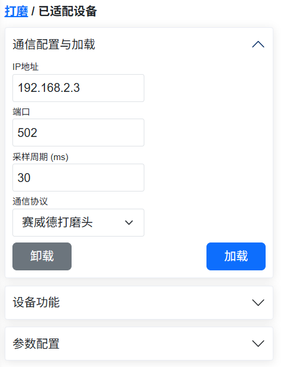

.. centered:: 圖表 8.8‑6 擴展軸參數配置

**Step2**：擴充軸參數配置完成後，點選「去啟用」按鈕，將對應擴充軸編號啟用，啟用成功後即可設定回零方式與擴充軸測試，當擴充軸未啟用時無法進行回零方式設定和擴展軸測試。

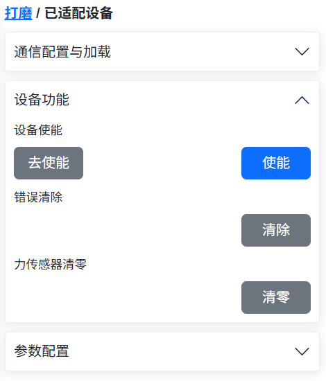

.. centered:: 圖表 8.8‑7 擴展軸使能/去使能

**Step3**：擴充軸未啟用成功無法進入設定介面，按鈕置灰；擴充軸啟用成功後，點選「回零」按鈕進入回零方式設定介面。設定回零方式、尋零速度和零點箍位速度，點擊「設定」按鈕，擴展軸開始回零，回零狀態會顯示在軸方向下方空白處，當出現「回零已完成」提示表示擴展軸零點設定成功。

- 回零方式：目前位置回零、負限位回零和正限位回零；

- 尋零速度：0~2000mm/s；

- 零點箍位速度：0~2000mm/s；

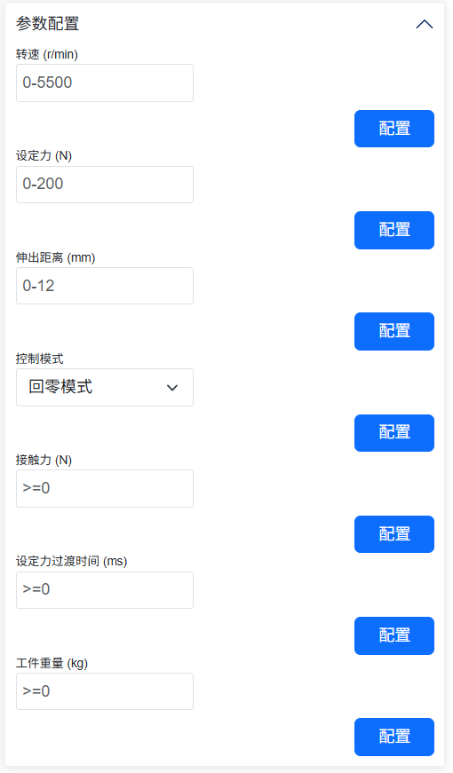

.. centered:: 圖表 8.8‑8 回零方式設定

**Step4**：擴充軸未啟用成功無法進入設定介面，按鈕置灰；擴充軸啟用成功且回零方式設定完成後，點選「測試」按鈕進入擴充軸測試介面。設定運行速度、加速度和最大距離，進行正向轉動和反向轉動測試擴展軸，同時在轉動過程中可以點擊「停止」按鈕測試擴展軸是否可以正常停止。

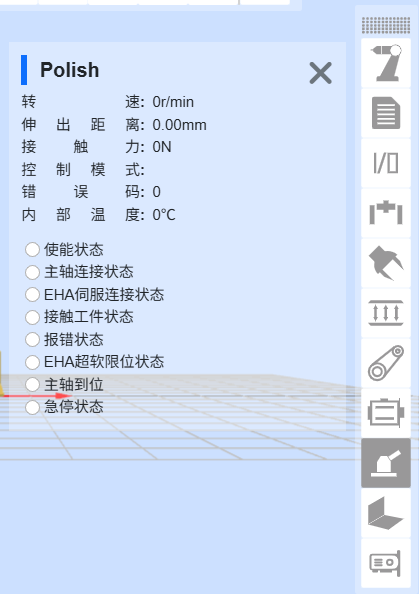

.. centered:: 圖表 8.8‑9 擴展軸測試

**Step5**：擴展軸通常於雷射感測器配合使用，此時雷射感測器通常採用外部安裝方式，感測器參考點配置需要採用三點法標定，而不是先前使用的六點法標定。將工具中心對準右側橫斷面底部中間點（靠近相機那一側）設定點1，將工具中心點對準另一截面即左側橫截面底部中間點，設定點2，將工具中心點移至感測器右側橫截面上邊緣中間點，設定點3，計算並儲存，點選應用完成三點法標定。

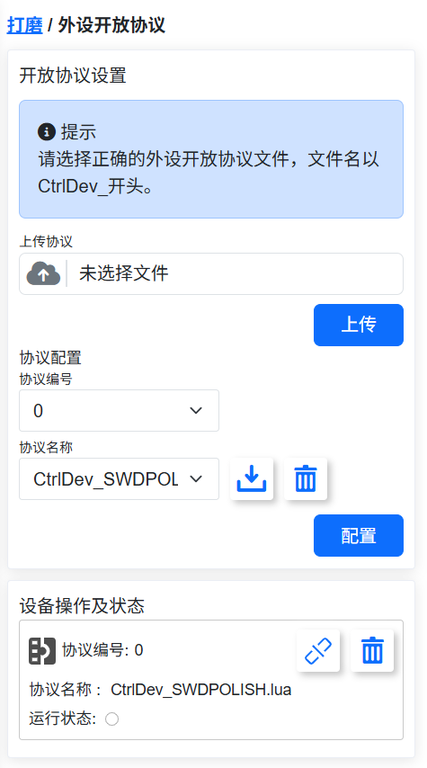

.. centered:: 圖表 8.8‑10 感測器三點法標定

**Step6**：在「示教程式－程式編程」介面選擇外設指令的「擴充軸」指令。根據具體的程序示教需求，在對應的地方加入指令。

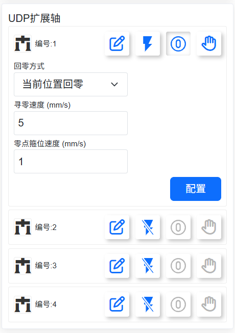

.. centered:: 圖表 8.8‑11 擴展軸指令編輯

擴展軸配合雷射追蹤焊接示教程序
+++++++++++++++++++++++++++++++

.. list-table::
   :widths: 50 80 80
   :header-rows: 0
   :align: center

   * - **序號**
     - **指令格式**
     - **註釋**

   * - 1
     - EXT_AXIS_PTP(1,1laserstart)
     - #外部軸運動雷射感測器起始點

   * - 2
     - PTP(laserstart,10,-1,0)
     - #機器人運動雷射感測器起始點

   * - 3
     - LTSearchStart(3,20,10,10000)
     - #開始尋位

   * - 4
     - LTSearchStop()
     - #停止尋位

   * - 5
     - EXT_AXIS_PTP(1,1,seamPos)
     - #外部軸運動焊縫起點

   * - 6
     - Lin(seamPos,20,-1,00,0)
     - #機器人運動焊縫起點

   * - 7
     - LTTrackOn()
     - #雷射跟踪

   * - 8
     - ARCStart(0,10000)
     - #焊機起弧

   * - 9
     - EXT_AXIS_PTP(1,1,laserend)
     - #外部軸運動焊縫終點

   * - 10
     - Lin( laserend,10,-1,0,0)
     - #機器人運動焊縫終點

   * - 11
     - ARCEnd(0,10000)
     - #焊機收弧

   * - 12
     - LTTrackOff
     - #雷射追蹤關閉

定位完成時間
++++++++++++++++

當擴充軸建立UDP通訊後，輸入時間，點選「設定」按鈕即可完成設定。此配置項用於監聽擴展軸運動停止的時間。

.. centered:: 圖表 8.8‑12 定位完成時間配置

兩自由度小車測試
~~~~~~~~~~~~~~~~~~~~~~

在擴展軸坐標系配置擴展軸方案為「5-兩自由度小車」時，進入UDP通訊介面後顯示該內容，否則無法查看。

.. centered:: 圖表 8.8‑13 擴展軸方案為「5-兩自由度小車」介面

.. important:: 兩自由度小車預設應用擴展軸編號1和2，UDP通訊成功後透過機器人 各類狀態中的擴展軸狀態查看擴展軸1和2伺服到位。

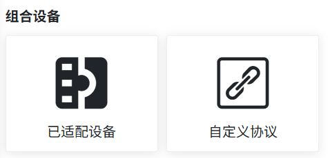

.. centered:: 圖表 8.8‑14 兩自由度小車擴展軸伺服到位

.. note:: 
   .. image:: robot_peripherals/117.png
      :height: 0.75in
      :align: left

   名稱：**使能按鈕**

   作用：擴展軸使能狀態，點選按鈕擴展軸去使能

.. note:: 
   .. image:: robot_peripherals/118.png
      :height: 0.75in
      :align: left

   名稱：**去使能按鈕**

   作用：擴展軸去使能狀態，點選按鈕擴展軸使能

.. note:: 
   .. image:: robot_peripherals/119.png
      :height: 0.75in
      :align: left

   名稱：**回零按鈕**

   作用：擴展軸當前位置回零

.. note:: 
   .. image:: robot_peripherals/120.png
      :height: 0.75in
      :align: left

   名稱：**測試按鈕**

   作用：兩自由度小車功能測試

**Step1**：UDP通訊成功後，點選「去啟用」按鈕，將兩自由度小車對應擴展軸使能，透過機器人各類狀態中的擴展軸狀態查看擴展軸1和2伺服啟用。

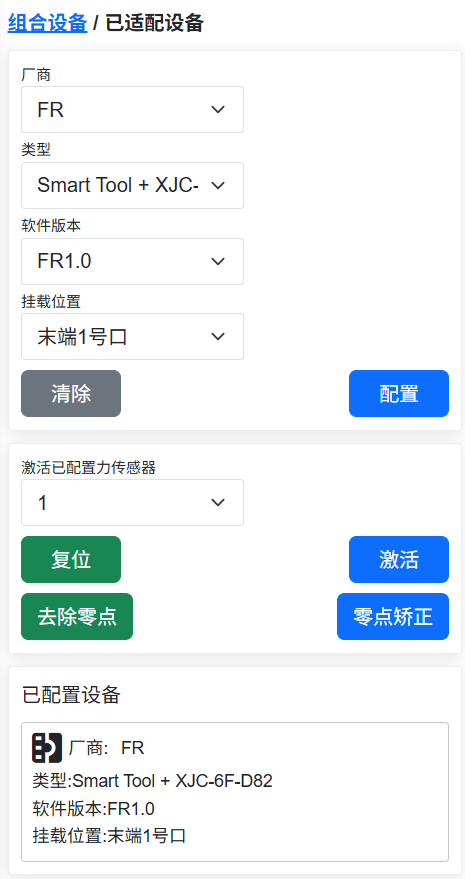

.. centered:: 圖表 8.8‑15 兩自由度小車擴展軸使能

**Step2**：擴充軸啟用成功後，點選「回零」按鈕，設定擴充軸目前位置回零，回零成功後測試按鈕高亮，反之置灰。

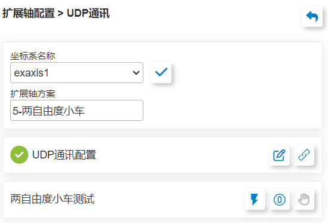

.. centered:: 圖表 8.8‑16 兩自由度小車當前位置回零成功

**Step3**：兩自由度小車目前位置回零成功後，點選「測試」按鈕進入介面，選擇運動方式，輸入參數進行運動測試，在運動過程中點選「停止」按鈕測試停止功能。

- 運動方式：直線/圓弧；

- 距離：-5000~5000mm（直線運動方式）；

- 半徑：1~5000mm（直線運動方式）；

- 角度：-360~360°（圓弧運動方式）；

- 速度：1~100%。

.. figure:: robot_peripherals/195.png
   :align: center
   :width: 4in

.. figure:: robot_peripherals/196.png
   :align: center
   :width: 4in

.. centered:: 圖表 8.8‑17 兩自由度小車測試

控制器+伺服驅動器（485通訊）
~~~~~~~~~~~~~~~~~~~~~~~~~~~~~~~~~~

硬體接線
+++++++++++

使用RS485通訊控制伺服擴充軸前，請先將伺服驅動器的RS485通訊介面與機器人控制箱上的RS485通訊介面建立連線。法奧機器人易製造控制箱電氣介面示意圖如下：

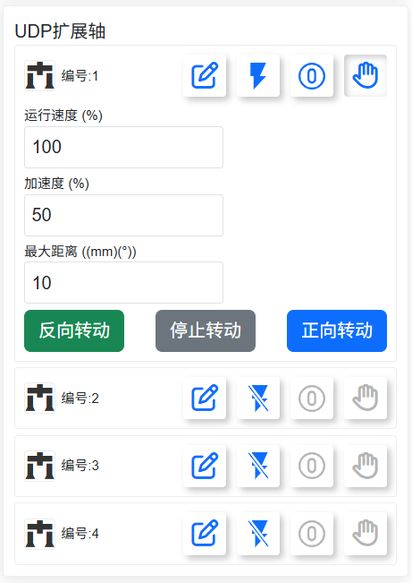

.. centered:: 圖表 8.8‑18 法奧機器人mini控制箱電氣介面示意圖

以戴納泰克伺服驅動器FD100-750C型號為例，參考改驅動器面板端子示意圖與FD100-750C的X3A-IN端子定義，當機器人配置與FD100-750C伺服擴充軸通訊時，需要將控制箱上的485 -A0端子、485-B0端子分別與驅動器X3A-IN端子的4號和5號接腳連接。 （請注意：您可以在伺服驅動器面板上看到一個「485」標誌的插線端子，該端子暫未開放使用者使用，請勿將您的RS485通訊線連接到此端子上）。同時，若連接多個伺服驅動器，且該驅動器為連結的最後一個，需要將面板上的RS485通訊中斷電阻撥碼開關（2號撥碼）開啟。

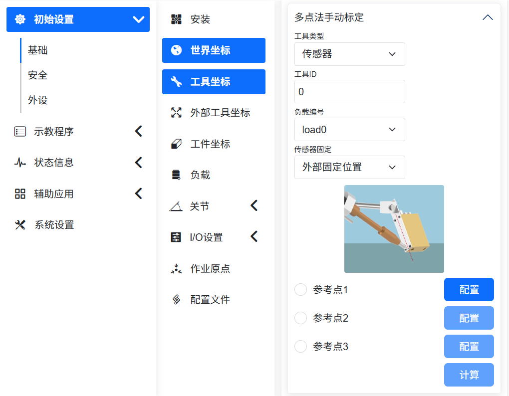

.. centered:: 圖表 8.8‑19 FD100-750C驅動器面板

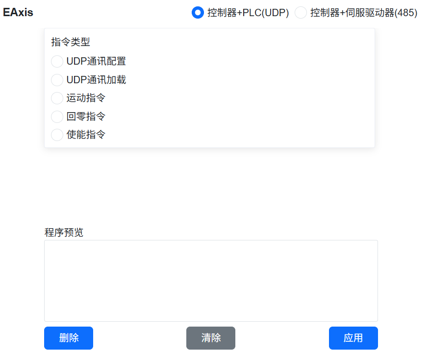

.. centered:: 圖表 8.8‑20 FD100-750C的X3A-IN端子定義

通訊配置
++++++++++++++

確保您的RS485通訊線正確連接且機器人和伺服擴充軸都正常上電後，開啟機器人WebApp，點選「初始設定－週邊－擴充軸」進入「擴充軸配置」介面。如下圖所示：

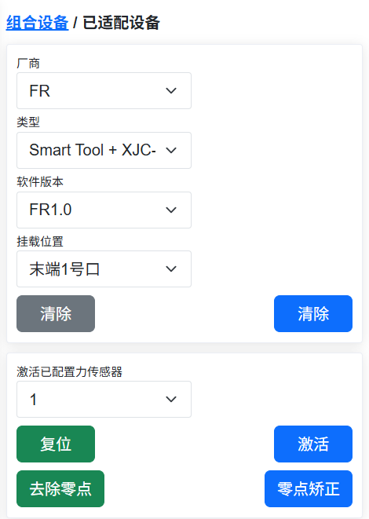

.. centered:: 圖表 8.8‑21 RS485擴充軸配置

在「擴充軸配置」介面中，點選組合方式為「控制器 + 伺服驅動器」的圖片進入詳細配置介面。在伺服驅動器配置中，選擇編號為“1”（請注意：當連接多個伺服時，此編號用於區分不同的伺服，後面我們會多次提到該編號），廠商為“戴納泰克” ，選擇對應的伺服驅動器型號，此處型號為“FD00-750C”，軟體版本為V1.0，填寫伺服驅動器對應的分辨率，此處為131072，根據您的機構模型填寫機械傳動比，此處為15.45，點擊“配置”按鈕。

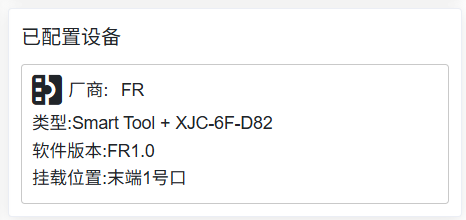

.. centered:: 圖表 8.8‑22 伺服驅動器配置

至此我們已經完成機器人與伺服驅動器的485通訊配置，您可以在WebApp中右側的「伺服狀態列」中查看伺服的即時狀態資訊。如下圖所示：

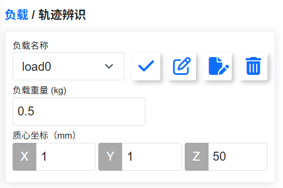

.. centered:: 圖表 8.8‑23 伺服狀態列

現在您需要依序對擴充軸設備進行啟用和回零方式設定後，即可進行一定的運動測試，請在確保安全的前提下跟著本手冊做以下測試操作。

已配置伺服驅動器
++++++++++++++++++++++

.. note:: 
   .. image:: robot_peripherals/200.png
      :height: 0.75in
      :align: left

   名稱：**檢視按鈕**

   作用：點選查看伺服驅動器設定訊息

.. note:: 
   .. image:: robot_peripherals/117.png
      :height: 0.75in
      :align: left

   名稱：**使能按鈕**

   作用：伺服驅動器啟用狀態，點選按鈕伺服驅動器去啟用

.. note:: 
   .. image:: robot_peripherals/118.png
      :height: 0.75in
      :align: left

   名稱：**去使能按鈕**

   作用：伺服驅動器去啟用狀態，點選按鈕伺服驅動器使

.. note:: 
   .. image:: robot_peripherals/119.png
      :height: 0.75in
      :align: left

   名稱：**回零按鈕**

   作用：伺服驅動器回零方式設定

.. note:: 
   .. image:: robot_peripherals/120.png
      :height: 0.75in
      :align: left

   名稱：**測試按鈕**

   作用：伺服驅動器測試

.. note:: 
   .. image:: robot_peripherals/201.png
      :height: 0.75in
      :align: left

   名稱：**伺服錯誤清除按鈕**

   作用：伺服驅動器提示錯誤時，點選清除

伺服控制模式與使能
********************

在“已設定伺服驅動器”中，選擇控制模式為“位置模式”，選擇對應的伺服編號，點選“去啟用”按鈕，此時會先設定伺服驅動器編號，設定成功後設定控制模式，控制模式設定成功後將伺服驅動器啟用（請注意：切換控制模式後，需先將伺服驅動器去除啟用，再將伺服驅動器啟用，伺服的控制模式切換才會生效，伺服啟用後將切換控制模式將禁用）。

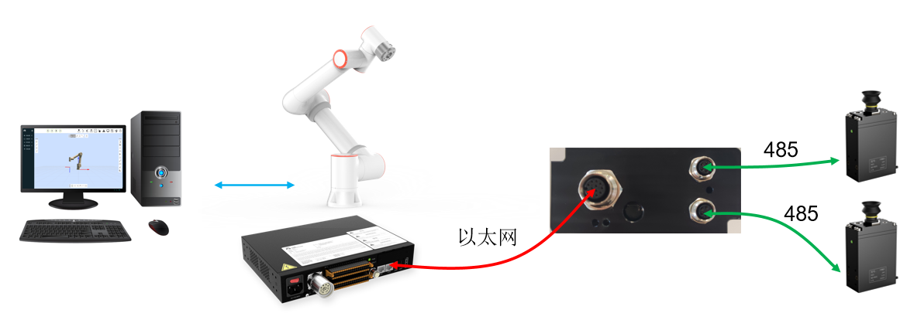

.. centered:: 圖表 8.8‑24 伺服控制模式與使能

伺服啟用成功後查看機器人各類狀態列中的「Servo」中可觀察到對「伺服啟用」狀態燈亮起，表示伺服驅動器已經啟用。點選「啟用」狀態按鈕，將伺服驅動器去啟用，「伺服啟用」狀態燈熄滅。

.. centered:: 圖表 8.8‑25 伺服驅動器狀態列

伺服回零
****************

伺服驅動器啟用成功後，「回零」按鈕會高亮，點選按鈕進入設定介面。選擇回零模式為“目前位置回零”，回零速度為5mm/s，零點箍位速度為1mm/s；點擊“設定”按鈕，即完成了伺服當前位置回零操作，在機器人各類狀態欄中的「Servo」中，可觀察到目前的「伺服位置」為0；（請您完全閱讀本手冊後，再將回零模式選擇為「負限位回零」或「正限位回零”進行回零測試）。

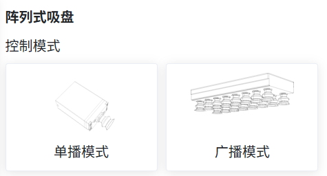

.. centered:: 圖表 8.8‑26 伺服回零

伺服運動
***************

在實際控制伺服馬達運動前，請先了解伺服馬達的“位置模式”和“速度模式”，再次提醒您：

**位置模式**：您可以輸入一定的運動速度和目標位置參數，伺服將以設定的速度移動到目標位置，運動到目標位置後，伺服將停止運動。

**速度模式**：您可以輸入一定的目標速度，伺服將依照您設定的目標速度一直移動，直到您將目標速度設定為0或將伺服馬達下啟用；

當切換控制模式時，「目前控制模式」顯示會自動切換（請注意：切換控制模式後，需要先將伺服去除使能，再將伺服啟用，伺服的控制模式切換才會生效）。若目前您的伺服未處於“位置模式”，請將您的伺服切換至位置模式。輸入「目標位置」為50mm，運轉速度為5mm/s，在確認安全的條件下，點選「設定」按鈕，此時伺服馬達將依照您設定的參數運動，您可以在機器人各類狀態列中的“Servo”中即時觀察伺服的位置和速度等。

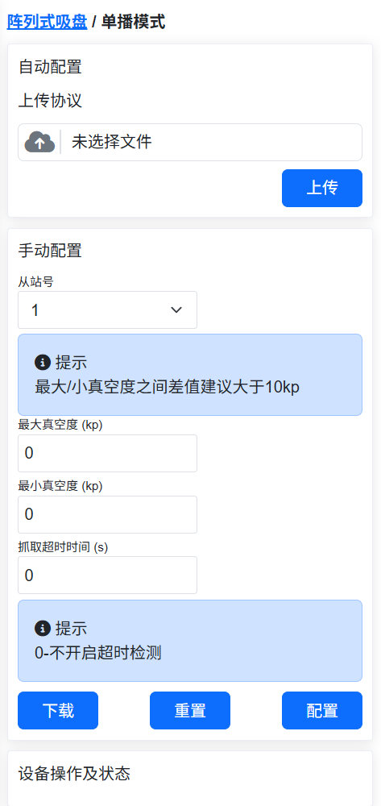

.. centered:: 圖表 8.8‑27 伺服運動調試（位置模式）

將伺服的控制模式改為“速度模式”，點擊“使能”狀態按鈕將伺服驅動器去使能，再點擊“去使能”狀態按鈕，此時伺服切換為速度模式（請注意：當伺服電機運動後，只能透過將目標速度設定為0使伺服馬達停止）。輸入目標速度為5mm/s，點選「設定」按鈕，伺服馬達將以5mm/s的速度保持移動，同樣您可以在機器人各類狀態列中的「Servo」中即時觀察伺服的位置和速度等。

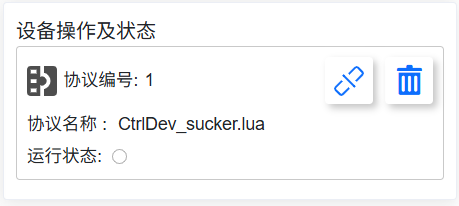

.. centered:: 圖表 8.8‑28 伺服運動調試（速度模式）

進階設定
++++++++++++++

若機器人發生碰撞、按下急停等緊急情況下擴展軸能觸發急停，並依照設定的急停減速度停止運動，碰撞警報恢復後能繼續下發指令使擴展軸恢復運作。需要在進階設定中，設定伺服加減速和伺服急停加減速，如下圖所示：

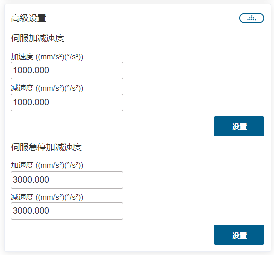

.. centered:: 圖表 8.8‑29 進階設定

擴展軸編程
++++++++++++++

在“示教程式－程式程式設計”中新建一個使用者程式“testServo.lua”，選擇“外設指令”。

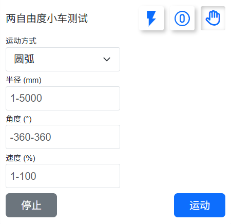

.. centered:: 圖表 8.8‑30 打開外設指令

點選“擴充軸”，開啟新增擴充軸指令介面。

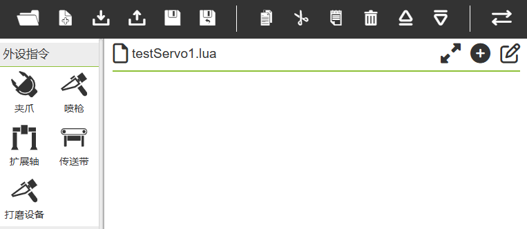

.. centered:: 圖表 8.8‑31 開啟新增擴展軸指令頁面

在新增擴充軸指令頁面中選擇組合方式為“控制器 + 伺服驅動器(485)”，將控制模式設為“位置模式”，點選右側的“新增”按鈕。

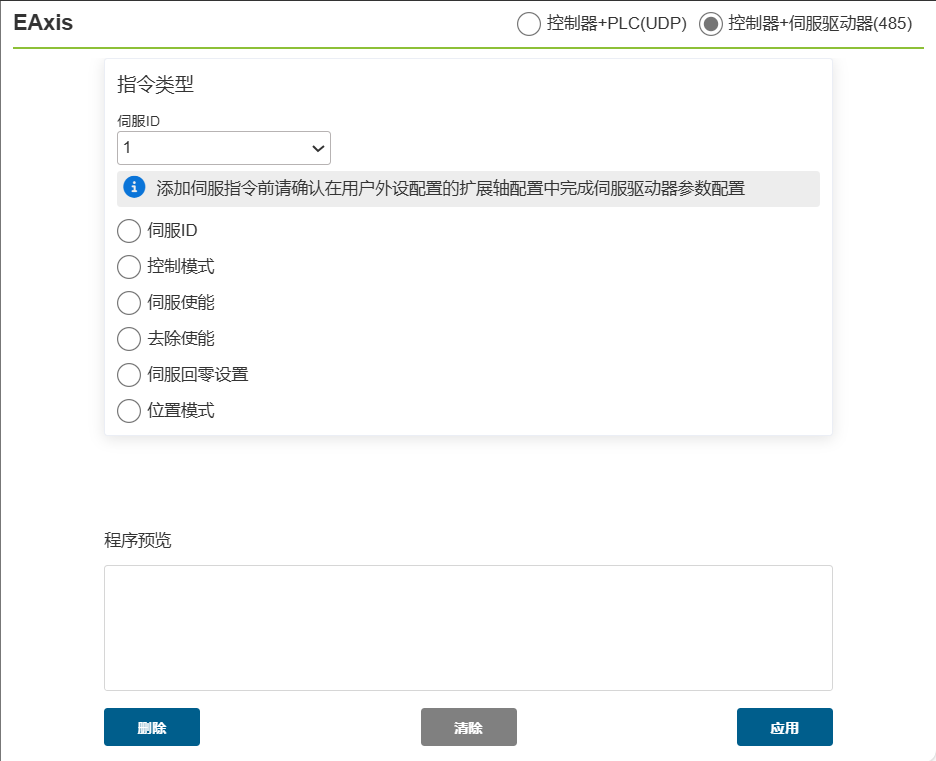

.. centered:: 圖表 8.8‑32 設定擴展軸的控制模式

將新增擴充軸指令介面翻到底部，點選「應用」按鈕。

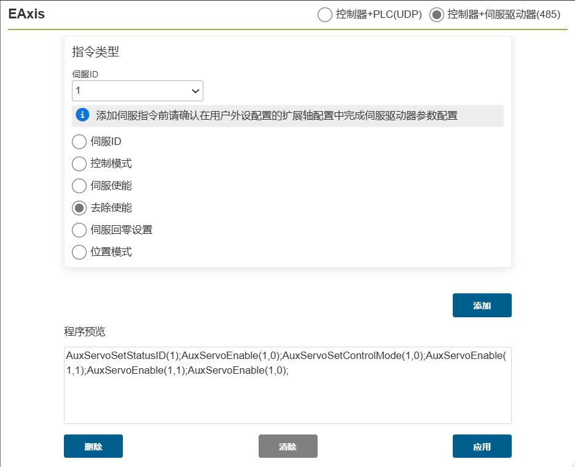

.. centered:: 圖表 8.8‑33 應用擴展軸指令

此時「testServo.lua」程式中即出現一組切換伺服控制模式的指令，您可以將機器人切換到自動模式，並執行程式。

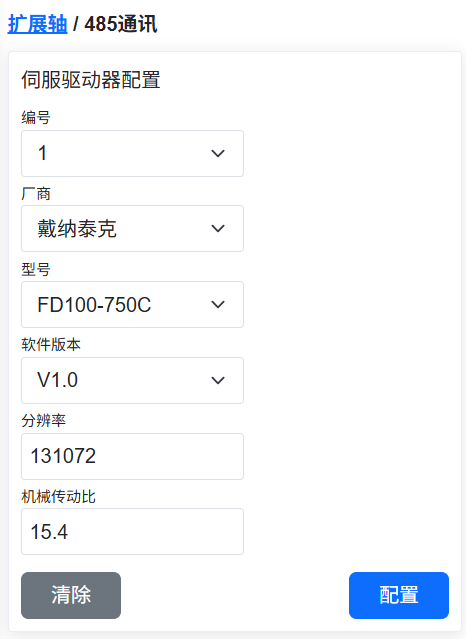

.. centered:: 圖表 8.8‑34 設定伺服控制模式程序

如何透過使用者程式控制伺服運動？同樣開啟新增擴展軸指令介面，如下圖所示，找到參數配置欄，以位置模式為例，輸入目標位置和運行速度，點選「新增」按鈕；將新增擴充軸指令介面翻到底部，點選「應用”按鈕，並關閉新增擴展軸指令介面。

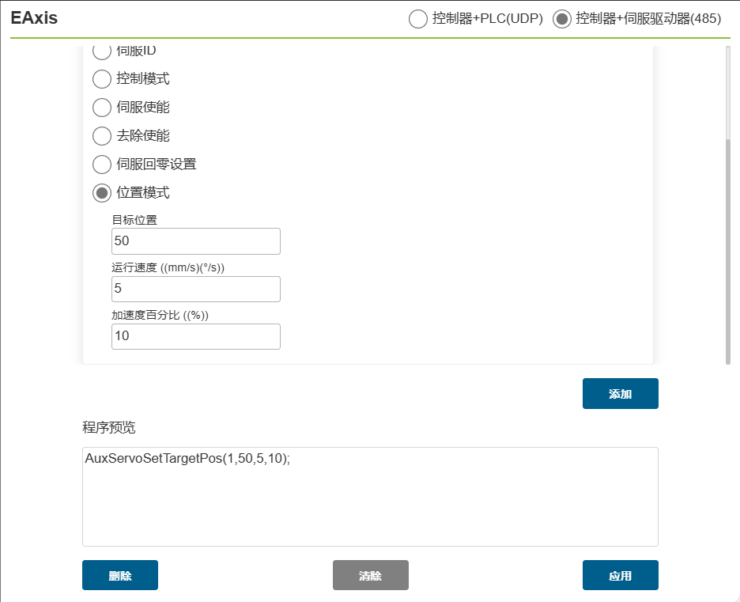

.. centered:: 圖表 8.8‑35 增加位置模式運動指令

在「testServo.lua」程式中增加伺服運動指令：「AuxServoSetTargetPos(1,50,5)」。指令函數中的三個參數意義分別為：

- 1：伺服編號為1。

- 50：目標位置。

- 5：目標速度。

.. centered:: 圖表 8.8‑36 位置模式伺服運動程序

將機器人切換到自動模式，執行該程序，此時您的伺服將以5mm/s的速度移動到50mm的位置。

至此，我們已經完成RS485控制伺服擴展軸的初步配置和測試，您可以根據實際情況編寫機器人運動與伺服運動組合的程序，如下圖一個範例程式。

擴展軸與機械人協同運動程序範例
*******************************

.. list-table::
   :widths: 50 80 80
   :header-rows: 0
   :align: center

  * - **序號**
    - **指令格式**
    - **註釋**

  * - 1
    - AuxServoSetTargetPos(1,50,5)
    - #擴展軸運動到復位點

  * - 2
    - if(GetDI(8,0) == 1) then
    - #如果CI0輸入有效

  * - 3
    - AuxServoSetTargetPos(1,50,5)
    - #擴展軸運動到50mm

  * - 4
    - PTP(testptp1,100,-1,0)
    - #機器人運動到testptp1點

  * - 5
    - elseif(GetDI(9,0) == 1) then
    - #如果CI1輸入有效

  * - 6
    - AuxServoSetTargetPos(1,150,5)
    - #擴展軸運動到150mm

  * - 7
    - PTP(testptp2,100,-1,0)
    - #機器人運動到testptp2點

  * - 8
    - else
    - #若CI0和CI1輸入均無效

  * - 9
    - AuxServoSetTargetPos(1,300,5)
    - #擴展軸運動到300mm

  * - 10
    - PTP(testptp3,100,-1,0)
    - #機器人運動到testptp3點

  * - 11
    - end
    - #結束

總結
+++++++++

綜上所述，配置協作機器人與伺服擴充軸RS485通訊有以下注意重點：

1. 正確連接協作機器人與伺服驅動器的RS485通訊線纜；

2. 正確選擇伺服擴展軸的控制模式；

3. 切換控制模式後，必須先去除使能，再伺服使能，控制模式切換才能生效。

兩自由度小車
~~~~~~~~~~~~~~~~~~~~~~~~~~~~~~

兩自由度小車配置
++++++++++++++++++++++++++++++++++++

協作機器人透過UDP與PLC通訊，進而控制兩自由度小車的移動，因此在進行兩自由度小車配置及控制前，請先檢查機器人與PLC之間的網路連接，確保網路連接正常，相關設備上電完成。兩自由度小車的設定步驟包括：

①擴展軸類型選擇與擴展軸座標系應用；
②UDP通訊配置與載入；
③兩自由度小車使能與回零；

具體操作如下：

(1) 進入機器人示教器介面，依序點選「初始設定」、「基礎」、「座標系」、「擴展軸」；選擇一個擴展軸座標系。

.. note:: 注意不能是exaxis0。

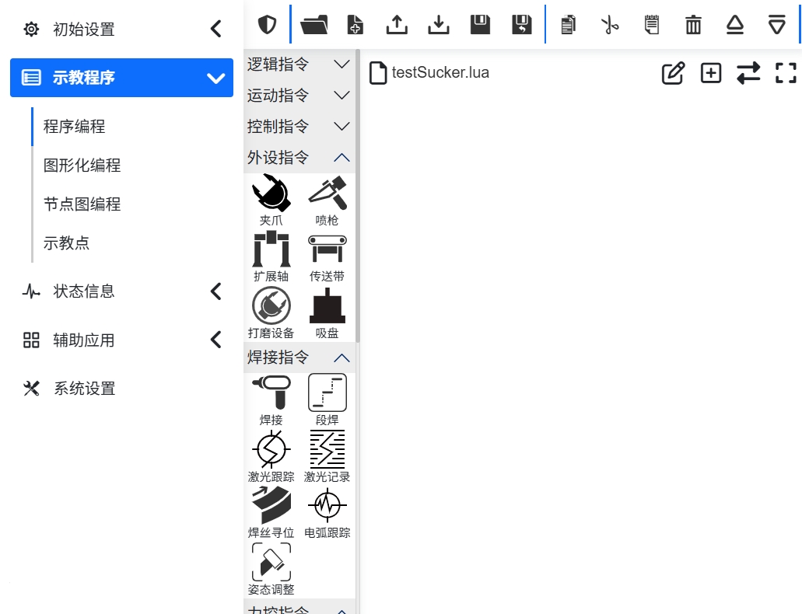

.. centered:: 圖表 8.8‑37 選擇擴展軸座標系

(2) 點擊“修改”，找到“修改嚮導”，選擇擴展軸方案為“5-兩自由度小車”，依次點擊“修改嚮導”中的“應用”按鈕和“當前擴展軸坐標系”中的“應用”按鈕。

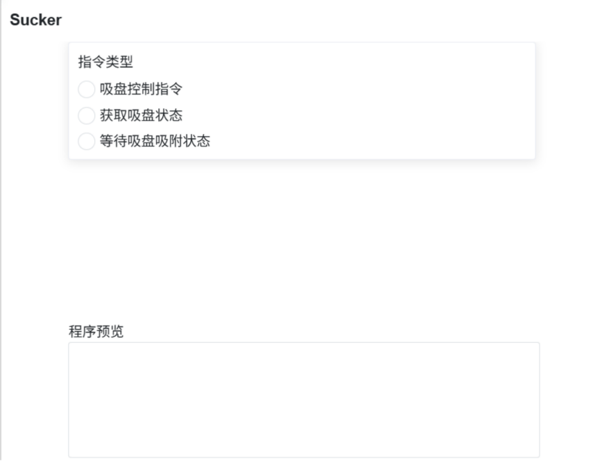

.. centered:: 圖表 8.8‑38 選擇擴展軸方案

(3) 再依序點選“初始設定”、“週邊”、“擴充軸”，選擇組合方式為“控制器+PLC（UDP）”。輸入對應的UDP通訊配置參數，預設參數如圖所示，依序點選「配置」與「載入」按鈕，建立機器人與PLC之間的UDP網路連線。

.. centered:: 圖表 8.8‑39 UDP通訊參數配置

兩自由度小車使能與回零
++++++++++++++++++++++++++++++++++++

(1) 由於上述步驟中已應用「5-兩自由度小車」擴展軸方案和對應擴展軸座標系，此時頁中顯示目前擴展軸方案為「5-兩自由度小車」；點選「啟用”按鈕，兩自由度小車自動啟用；

.. centered:: 圖表 8.8‑40 焊接小車使能

(2) 在示教頁面右側UDP擴展軸狀態欄可以監控到小車的使能狀況，小車的左輪和右輪分別對應擴展軸1軸和2軸。

.. figure:: robot_peripherals/116.png
   :align: center
   :width: 4in

.. centered:: 圖表 8.8‑41 擴展軸狀態監控

(3) 確認小車兩輪軸都已啟用後，點選「目前位置回零」圖示按鈕，此時小車兩輪軸依序依目前位置回零。

.. centered:: 圖表 8.8‑42 焊接小車回零

兩自由度小車運動控制
++++++++++++++++++++++++++++++++++++

在小車運動前，請先確保已選擇擴展軸方案“5-兩自由度小車”並應用相應擴展軸坐標系，完成UDP通訊配置與加載，完成小車的使能與回零。

(1) 兩自由度小車直線移動：開啟示教介面，依序點選“初始設定”、“週邊”、“擴充軸”，選擇組合方式為“控制器+PLC（UDP）”，確認目前擴充軸方案為“5-兩自由度小車”，在“擴展軸測試”中，選擇運動方式為“直線”，輸入運動距離和運動速度，確認安全後，點擊“運動”按鈕，小車即按照設定的距離和速度進行直線運動。運動距離為正值時，小車做前進運動；運動距離為負值時，小車做後退運動。在小車移動過程中點選「停止」按鈕，小車立即停止。

.. figure:: robot_peripherals/195.png
   :align: center
   :width: 4in

.. centered:: 圖表 8.8‑43 焊接小車直線運動

(2) 兩自由度小車圓弧運動：開啟示教介面，依序點選“初始設定”、“週邊”、“擴展軸”，選擇組合方式為“控制器+PLC（UDP）”，確認目前擴展軸方案為“5-兩自由度小車”，在“擴展軸測試”中，選擇運動方式為“圓弧”，輸入半徑、角度和速度，確認安全後，點擊“運動”按鈕，小車即按照設定的半徑和角度進行圓弧運動。角度值為正值時，小車做向右轉運動；角度值為負值時，小車做向左轉運動。在小車移動過程中點選「停止」按鈕，小車立即停止。

.. figure:: robot_peripherals/196.png
   :align: center
   :width: 4in

.. centered:: 圖表 8.8‑44 焊接小車圓弧運動

傳送帶追蹤配置
-----------------

傳送帶追蹤配置步驟
~~~~~~~~~~~~~~~~~~~~~

**Step1**：在「初始設定－外設－追蹤」中選擇「傳送帶」選單項，進入傳送帶追蹤配置介面，點選「配置傳送帶IO」按鍵快速配置傳送帶功能所需IO，之後依實際使用功能情況配置對應的參數，此處以無視覺追蹤抓取功能為例，需要配置傳送帶編碼器通道，分辨率，導程，視覺搭配選擇否，點擊配置。

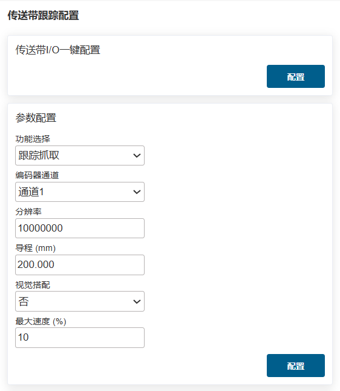

.. centered:: 圖表 8.9‑1 傳送帶配置

**Step2**：接下來設定抓取點補償值，為X,Y,Z三個方向上的補償距離，可在偵錯過程中依實際情況設定。

.. centered:: 圖表 8.9‑2 傳送帶抓取點補償配置

**Step3**：開啟傳送帶，將標定的物體移動到定義的A點位置，停止傳送帶。移動機器人，將機器人末端的標定桿尖點與所標定的物體尖點對齊，點擊起始點A按鍵，跳出對話框，顯示當前編碼器值和機器人位姿，點擊標定完成起始點A標定。

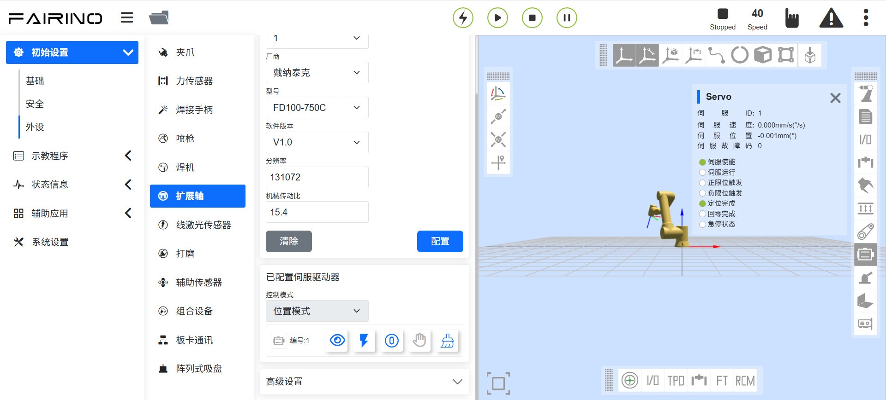

.. centered:: 圖表 8.9‑3 起始點A配置

**Step4**：點擊參考點按鍵，進入參考點標定，記錄參考點時記錄機器人抓取時的高度和姿態，每次跟踪時都會以記錄參考點的高度和姿態區跟踪抓取，可以和AB點不在一個高度，點選標定完成參考點標定。

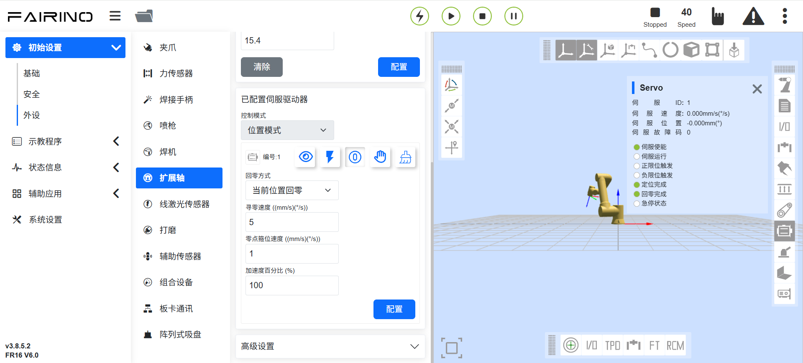

.. centered:: 圖表 8.9‑4 參考點配置

**Step5**：開啟傳送帶，將標定的物體移動到定義的B點位置，停止傳送帶。移動機器人，將機器人末端的標定桿尖點與所標定的物體尖點對齊，點擊終點B按鍵，彈出對話框，顯示當前編碼器值和機器人位姿，點擊標定完成終點B標定。

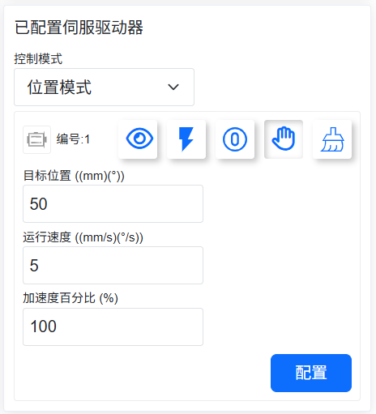

.. centered:: 圖表 8.9‑5 終點B配置

傳送帶追蹤示教程序
~~~~~~~~~~~~~~~~~~~~~~~

.. list-table::
   :widths: 50 80 80
   :header-rows: 0
   :align: center

   * - **序號**
     - **指令格式**
     - **註釋**

   * - 1
     - PTP(conveyorstart,30,-1,0)
     - #機器人抓取起點

   * - 2
     - While(1) do
     - #循環抓取

   * - 3
     - ConveyorlODetect(10000)
     - #Io即時偵測物體

   * - 4
     - ConveyorGetTrackData(1)
     - #物體位置獲取

   * - 5
     - ConveyorTrackStart(1)
     - #傳送帶追蹤開始

   * - 6
     - Lin(cvrCatchPoint,10,-1,0,0)
     - #機器人到達抓取點

   * - 7
     - MoveGripper(1,255,255,0,10000)
     - #夾爪抓取物體

   * - 8
     - Lin(cvrRaisePoint,10,-1,0,0)
     - #機器人提起

   * - 9
     - ConveyorTrackEnd()
     - #傳送帶追蹤結束

   * - 10
     - PTP(conveyorraise,30,-1,0)
     - #機器人到達等待點

   * - 11
     - PTP(conveyorend,30,-1,0)
     - #機器人到達放置點

   * - 12
     - MoveGripper(1,0,255,0,10000)
     - #夾爪鬆開

   * - 13
     - PTP(conveyorstart,50,-1,0)
     - #機器人再次回到抓取起點,等待下次抓取

   * - 14
     - end
     - #結束

姿態自適應配置
----------------

姿態自適應配置步驟
~~~~~~~~~~~~~~~~~~~~~~

**Step1**：在「初始設定－週邊－追蹤」中選擇「追蹤姿態」選單項，進入姿態調整配置介面，選擇板材類型和機器人實際工作運動方向，調整機器人姿態，分別設定姿態點A，姿態點B和姿態點C，通常A為平面姿態點，B為上升沿姿態點，C為下降沿姿態點。

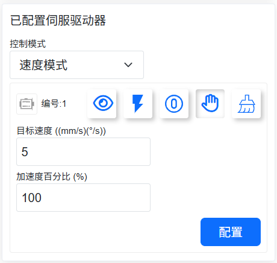

.. centered:: 圖表 8.10‑1 姿態調整配置

.. important::
   A姿態和B姿態，A姿態和C姿態之間的姿態變化在滿足應用需求下姿態變化越小越好。姿態自適應功能為輔助應用功能，通常配合焊接追蹤使用。

**Step2**：在程式示教指令介面選擇“Adjust”指令。根據具體的程序示教需求，在對應的地方加入指令。

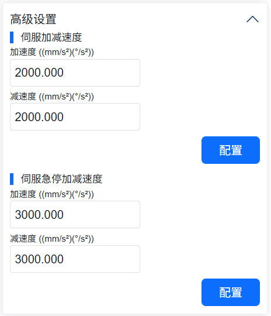

.. centered:: 圖表 8.10‑2 姿態調整指令編輯

姿態自適應配合擴展軸和雷射追蹤焊接示教程序
~~~~~~~~~~~~~~~~~~~~~~~~~~~~~~~~~~~~~~~~~~~~

.. list-table::
   :widths: 50 80 80
   :header-rows: 0
   :align: center

   * - **序號**
     - **指令格式**
     - **註釋**

   * - 1
     - EXT_AXIS_PTP(1,1laserstart)
     - #外部軸運動雷射感測器起始點

   * - 2
     - PTP(laserstart,10,-1,0)
     - #機器人運動雷射感測器起始點

   * - 3
     - LTSearchStart(3,20,10,10000)
     - #開始尋位

   * - 4
     - LTSearchStop()
     - #停止尋位

   * - 5
     - EXT_AXIS_PTP(1,1,seamPos)
     - #外部軸運動焊縫起點

   * - 6
     - Lin(seamPos,20,-1,00,0)
     - #機器人運動焊縫起點

   * - 7
     - LTTrackOn()
     - #雷射跟踪

   * - 8
     - ARCStart(0,10000)
     - #焊機起弧

   * - 9
     - PostureAdjustOn(0,PosA,PosC,PosB,1000)
     - #姿態自適應調整開啟

   * - 10
     - EXT_AXIS_PTP(1,1,laserend)
     - #外部軸運動焊縫終點

   * - 11
     - Lin( laserend,10,-1,0,0)
     - #機器人運動焊縫終點

   * - 12
     - ARCEnd(0,10000)
     - #焊機收弧

   * - 13
     - PostureAdjustOff(0)
     - #姿態自適應調整關閉

   * - 14
     - LTTrackOff
     - #雷射追蹤關閉

力/扭力感測器週邊配置
-------------------------

力/扭力感測器配置步驟
~~~~~~~~~~~~~~~~~~~~~~~~~~~

**Step1**：在「初始設定－外設－末端工具」的選單列下，點選「適配設備」進入末端週邊配置介面。

設備類型選擇“力傳感器設備”，力傳感器配置資訊分為廠商、類型、軟體版本和掛載位置，用戶可根據特定的生產需求來配置相應的力傳感器資訊。若使用者需要變更配置，可先選擇對應的編號，點選「清除」按鈕，來清除對應的訊息，並重新依照需求配置；

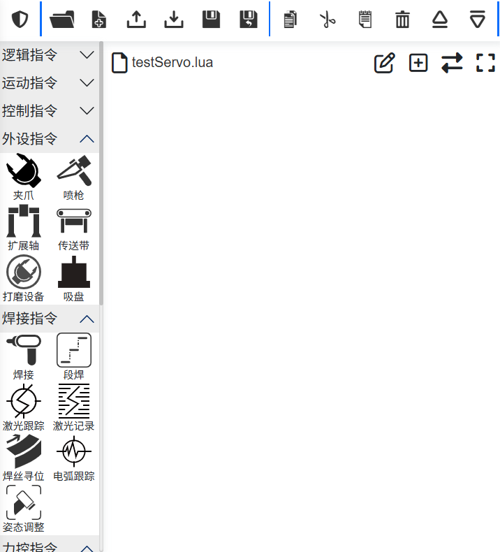

.. centered:: 圖表 8.11‑1 力/矩傳感器配置

.. important::
 在點擊清除配置前，對應的感應器應處於未啟動狀態。

**Step2**：力傳感器配置完成後，用戶可在頁面下方的信息表中查看相應的力傳感器信息，若發現配置錯誤，可點擊“清除”按鈕，重新配置。

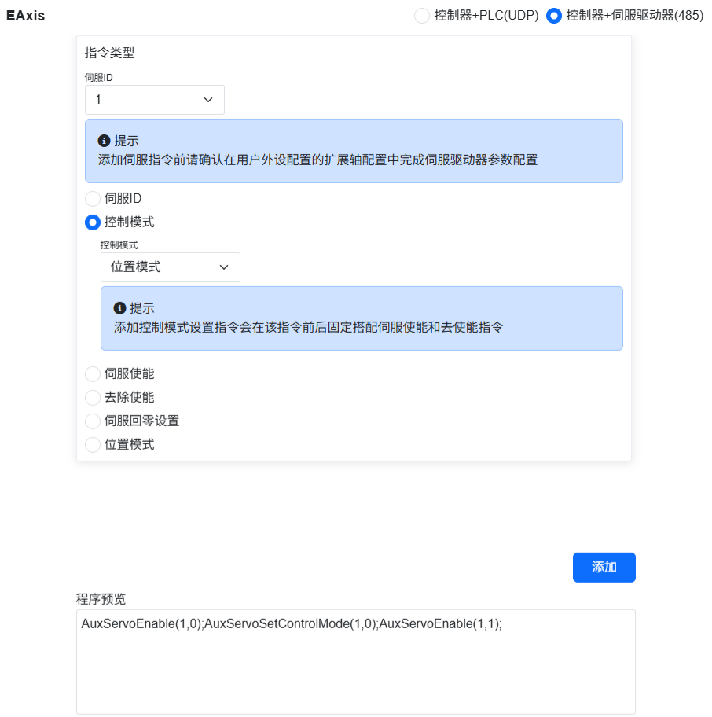

.. centered:: 圖表 8.11‑2 力/矩傳感器配置訊息

**Step3**：選擇配置完成的力感應器編號，點選「重設」按鈕，頁面彈出指令傳送成功後，再點選「啟動」按鈕，可查看力傳感器資訊表中的啟動狀態，來判斷是否啟動成功；此外，力傳感器會有初始值，使用者會根據使用需求選擇「零點矯正」和「去除零點」。力傳感器零點矯正需要確保力傳感器水平垂直向下，且機器人未配置負載。

**Step4**：力傳感器配置完成後，需配置傳感器類型工具坐標系，可根據傳感器與末端工具中心的距離直接輸入傳感器工具坐標系值並應用。

力/扭力傳感器負載辨識
~~~~~~~~~~~~~~~~~~~~~~~~

在“初始設定->基礎->負載”菜單列下，點擊“感應器”，進入力/扭力感應器負載介面。

特定姿態識別：清除末端負載數據，配置好力傳感器後，建立傳感器坐標系，將機器人末端姿態調整為垂直向下，進行“零點矯正”後安裝末端負載。先選擇對應傳感器工具坐標系，調整機器人，使得傳感器及工具垂直向下，記錄數據，計算質量。接著，調整機器人3個不同姿態，分別記錄三組數據，計算出質心，確認無誤後點選應用。

**動態辨識**：清除末端負載數據，配置好力傳感器後，建立傳感器坐標系，將機器人末端姿態調整為垂直向下，進行“零點矯正”後安裝末端負載。點擊“識別開啟”，拖曳機器人進行運動，接著點擊“識別關閉”，即可自動將負載結果應用到機器人中。

**自動校零**：感應器記錄初始位置後，可自動校零。

.. figure:: robot_peripherals/137.png
   :align: center
   :width: 4in

.. centered:: 圖表 8.11‑3 力/扭力感測器負載辨識

力/扭力感應器輔助拖曳
~~~~~~~~~~~~~~~~~~~~~~~

配置好感測器後，可以搭配感測器對拖曳機器人進行更好的輔助。第一次使用時可以依照右側圖片的資料進行配置，應用完成後，此時無需進入拖曳模式，直接對末端力感測器進行拖曳，即可控制機器人在固定姿態進行移動。 （如下圖的數據為參考標準）

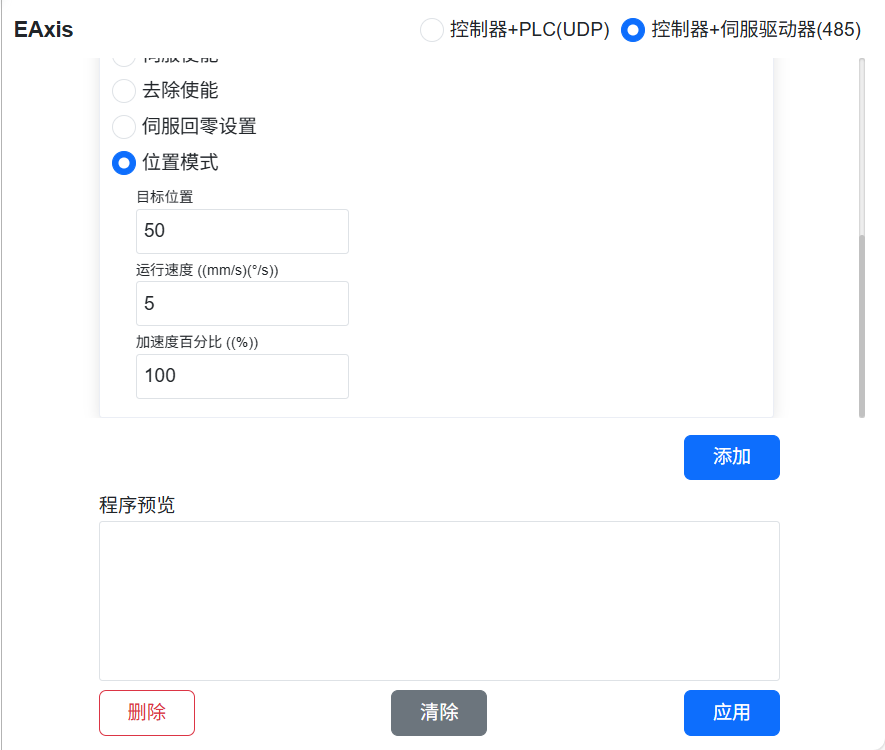

.. centered:: 圖表 8.11‑4 力/扭力感知器拖曳鎖定

.. note::
 奇異點策略是在力傳感器輔助鎖定下開發的奇異點穿越及規避功能。

 奇異點規避策略是預設功能選項，開啟輔助拖曳後即預設開啟規避功能，奇異點規避是當機器人處於奇異構型時，施加虛擬力使機器人遠離奇異構型的功能。

 奇異構型：

 **肘奇異**：旋轉軸2、3、4處於同一平面內，此時肘關節處於完全伸展或完全收縮，由於FR機器人機械限位，完全收縮這種形位機器人無法到達。

 **腕奇異**：旋轉軸4、6平行，此時由於FR機器人機械限位，這種形位機器人無法到達。

 **肩奇異**：腕中心點位於旋轉軸1、2所構成的平面。

 奇異點穿越功能，選擇「奇異點策略」為「穿越」並應用，當機器人偵測到目前位姿處於奇異構型，自動切換為電流環拖曳模式，當偵測退出奇異構型，拖曳模式切換為力傳感器輔助拖曳繼續運動。

**自適應選擇**：在需要組裝時開啟，開啟後拖曳變重；

**慣性參數**：調節拖曳過程中的手感，需在技術人員指導下謹慎操作。

**阻尼參數**：

- 平動方向：建議設定參數在[100-200]之間；

- 轉動方向：建議設定參數在[3-10]之間，其中RZ方向設定範圍在[0.1-5]；

- 效果：使用感測器拖曳時，增大阻尼會導致拖曳困難，減少阻尼會導致拖曳機器人過於輕鬆（建議不要太小）；

- 阻尼參數整體範圍：平動XYZ​​：[100-1000]；轉動RX、RY：[3-50],RZ:[2-10]；

- 最大拖曳動力為50，最大拖曳速度為180。

**剛度參數**：均設為0；

**拖動力閾值**：平動XYZ​​為[5-10]；轉動RX、RY、RZ為[0.5-5]；

.. important::
 透過增加平動方向XYZ或轉動方向RX、RY、RZ的力閾值來實現鎖定的方式。

力/扭力感測器碰撞檢測
~~~~~~~~~~~~~~~~~~~~~~~~~

指令說明：「FT_Guard」指令為碰撞偵測指令。選擇對應的感測器座標系，勾選生效的力矩方向偵測，設定目前值，碰撞最大閾值和碰撞最小閾值三項，碰撞偵測條件正常範圍為（目前值-最小閾值，目前值+最大閾值），將“開啟”和“關閉”指令加入程式中。

.. figure:: robot_peripherals/139.png
   :align: center
   :width: 6in

.. centered:: 圖表 8.11‑5 FT_Guard指令編輯

程式範例：

.. list-table::
   :widths: 50 80 80
   :header-rows: 0
   :align: center

   * - **序號**
     - **指令格式**
     - **註釋**

   * - 1
     - FT_Guard(1,1,1,1,1,0,0,0,5,0,0,0,0,0,10,0,0,0,0,0,5,0,0,0,0,0)
     - #力/矩碰撞檢測開啟

   * - 2
     - PTP(template1,100,-1,0)
     - #運動指令

   * - 3
     - FT_Guard(0,1,1,1,1,0,0,0,5,0,0,0,0,0,10,0,0,0,0,0,5,0,0,0,0,0)
     - #力/矩碰撞檢測關閉

力/扭力感測器力控運動
~~~~~~~~~~~~~~~~~~~~~~~~

指令說明：「FT_Control」指令為力控運動指令，可以使機器人在設定力的附近移動，常用於打磨場景中。選擇對應的感測器座標系，勾選生效的力矩方向偵測，設定偵測閾值，以及各個方向上PID比例係數(一般設定p為0.001)，設定最大調整距離（對應X,Y,Z）和最大調整角度（對應RX,RY,RZ），將「開啟」和「關閉」指令加入程式。

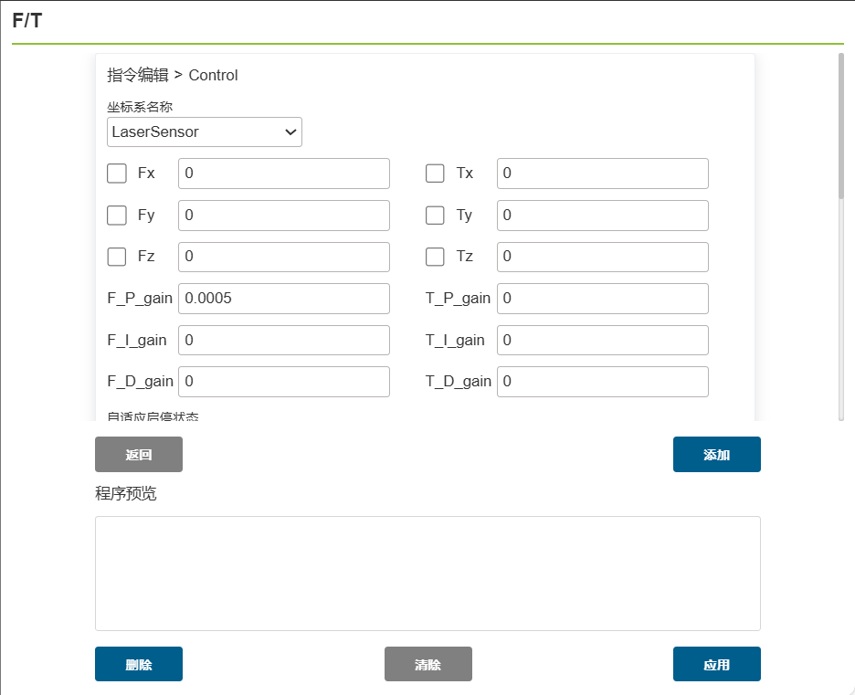

.. centered:: 圖表 8.11‑6 FT_Control指令編輯

程式範例：

.. list-table::
   :widths: 50 80 80
   :header-rows: 0
   :align: center

   * - **序號**
     - **指令格式**
     - **註釋**

   * - 1
     - FT_Control(1,11,1,0,1,0,0,0,10,0,5,0,0,0,0.001,0,0,0,0,0,0,0,0,10,5)
     - #力/矩運動控制開啟

   * - 2
     - Lin(template3,100,-1,0,0)
     - #運動指令

   * - 3
     - FT_Control(0,11,1,0,1,0,0,0,10,0,5,0,0,0,0.001,0,0,0,0,0,0,0,10,5)
     - #力/矩運動控制關閉

力/扭力感測器螺旋插入
~~~~~~~~~~~~~~~~~~~~~~~~~~

指令說明：「FT_Spiral」指令為螺旋線探索插入，一般用於圓柱軸的軸孔組裝動作。在運行動作之前，需要將機器人末端拖曳至孔位的大致位置，根據當前場景，設定指令的參數，添加到程式中，運行後，機器人會以螺旋形的運動進行探索。

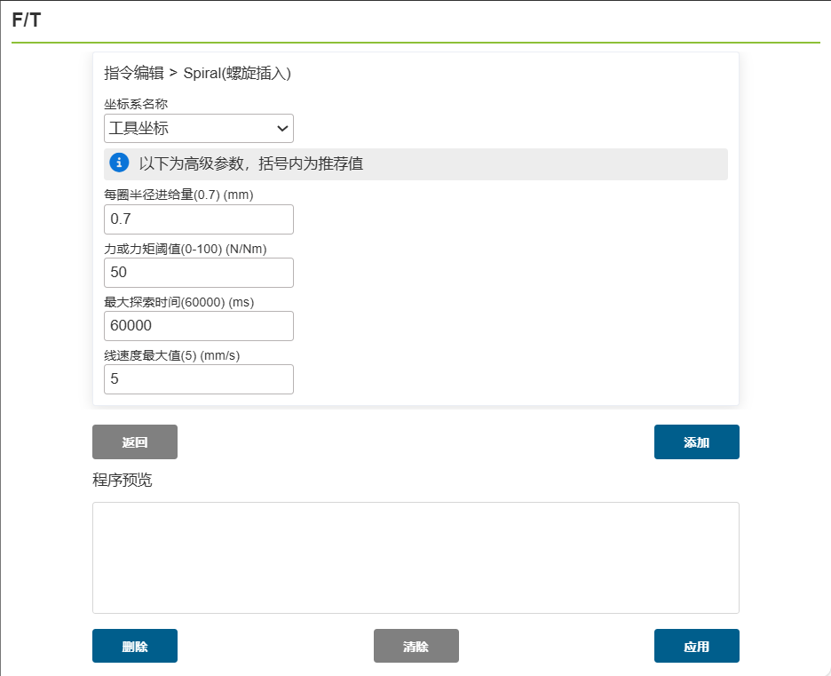

.. centered:: 圖表 8.11‑7 FT_Spiral指令編輯

程式範例：

.. list-table::
   :widths: 50 80 80
   :header-rows: 0
   :align: center

   * - **序號**
     - **指令格式**
     - **註解**

   * - 1
     - FT_Control(1,10,0,0,1,0,0,0,0,0,5,0,0,0,0.0005,0,0,0,0,0,0,10,0)
     - #力/矩運動控制開啟

   * - 2
     - FT_SpiralSearch(0,0.7,0,60000,5)
     - #螺旋插入

   * - 3
     - FT_Control(0,10,0,0,1,0,0,0,0,0,5,0,0,0,0.0005,0,0,0,0,0,0,10,0)
     - #力/矩運動控制關閉

力/扭矩感測器旋轉插入
~~~~~~~~~~~~~~~~~~~~~~~~~

指令說明：「FT_Rot」指令為旋轉探索插入，一般用於承接螺旋線插入動作，用於鍵軸的軸孔組裝。在運行動作之前，需要將機器人末端移動至螺旋線探索找到的孔位或完全對齊的示教孔位，根據當前場景，設定指令的參數，添加到程式中，運行後，機器人會以緩慢的旋轉進行探索。

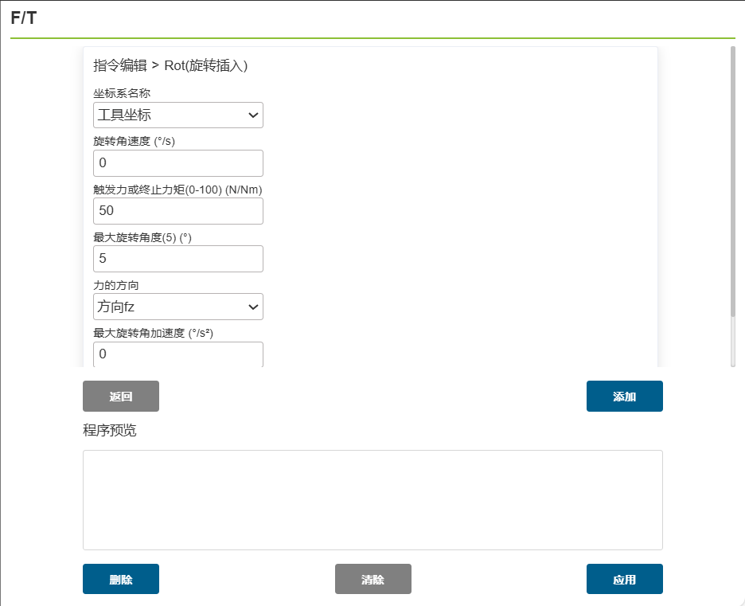

.. centered:: 圖表 8.11‑8 FT_Rot指令編輯

程式範例：

.. list-table::
   :widths: 50 80 80
   :header-rows: 0
   :align: center

   * - **序號**
     - **指令格式**
     - **註解**

   * - 1
     - FT_Control(1,10,0,0,1,0,0,0,0,0,5,0,0,0,0.0005,0,0,0,0,0,0,10,0)
     - #力/矩運動控制開啟

   * - 2
     - FT_RotInsertion(0,3,0,5,1,0,1)
     - #旋轉插入

   * - 3
     - FT_Control(0,10,0,0,1,0,0,0,0,0,5,0,0,0,0.0005,0,0,0,0,0,0,10,0)
     - #力/矩運動控制關閉

力/扭力感測器直線插入
~~~~~~~~~~~~~~~~~~~~~~~~~

指令說明：「FT_Lin」指令為旋轉探索插入，一般用於承接螺旋線插入動作或旋轉插入動作，用於鍵軸的軸孔組裝。在運行動作之前，需要將機器人末端移動至螺旋線探索找到的孔位，旋轉插入動作結束的位置或完全對齊的示教孔位，根據當前場景，設定指令的參數，添加到程式中，運行後，機器人會以設定的方向進行直線運動。

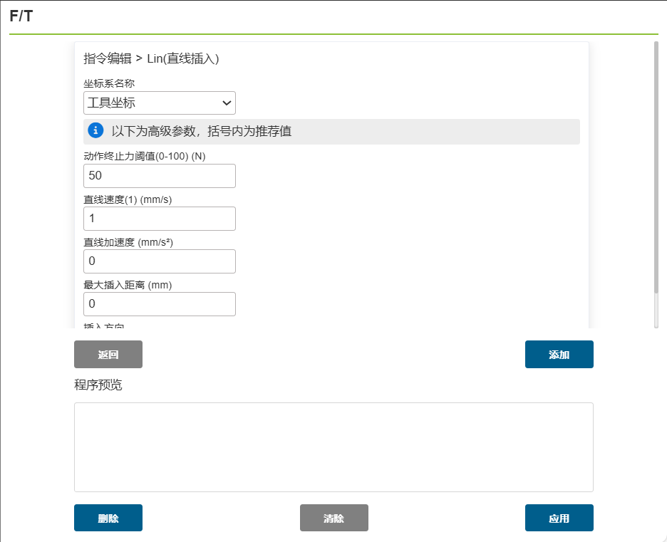

.. centered:: 圖表 8.11‑9 FT_Lin指令編輯

程式範例：

.. list-table::
   :widths: 50 80 80
   :header-rows: 0
   :align: center

   * - **序號**
     - **指令格式**
     - **註釋**

   * - 1
     - FT_Control(1,10,0,0,1,0,0,0,0,0,5,0,0,0,0.0005,0,0,0,0,0,0,10,0)
     - #力/矩運動控制開啟

   * - 2
     - FT LinInsertion(0,50,1,0,100,1)
     - #直線插入

   * - 3
     - FT_Control(0,10,0,0,1,0,0,0,0,0,5,0,0,0,0.0005,0,0,0,0,0,0,10,0)
     - #力/矩運動控制關閉

力/扭力感測器表面定位
~~~~~~~~~~~~~~~~~~~~~~~~~~~

指令說明：「FT_FindSurface」指令為表面定位，一般用於尋找物體表面。根據當前場景，設定對應座標系，移動方向、移動軸、探索直線速度、探索直線加速度、最大探索距離、動作終止力閾值等參數，加入程式中，運行程序，動作開始執行，機器人末端開始緩慢向表面所在方向移動。

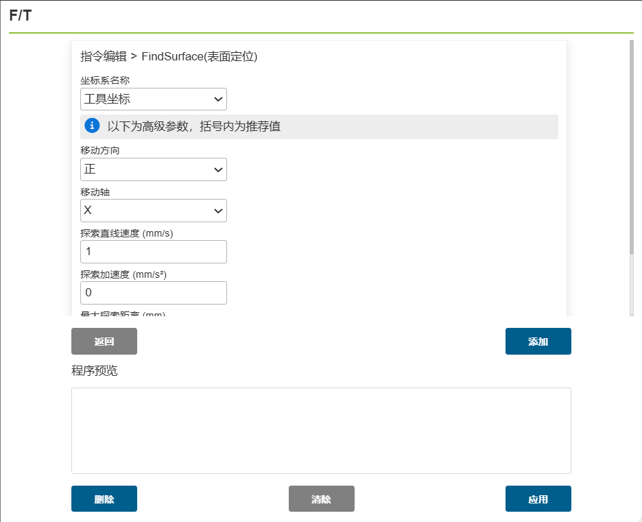

.. centered:: 圖表 8.11‑10 FT_FindSurface指令編輯

程式範例：

.. list-table::
   :widths: 50 80 80
   :header-rows: 0
   :align: center

   * - **序號**
     - **指令格式**
     - **註釋**

   * - 1
     - PTP(1,30,-1,0)
     - #初始位置

   * - 2
     - FT FindSurface(0,1,3,1,0,100,5)
     - #平面定位

力/扭力感測器中心定位
~~~~~~~~~~~~~~~~~~~~~~~

指令說明：「FT_CalCenter」指令為中心定位，一般用於尋找兩個表面的中間平面表面。根據目前場景，設定對應座標系，移動方向、移動軸、探索直線速度、探索直線加速度、最大探索距離、動作終止力閾值等參數，分別尋找A平面和B平面，加入程式中，運行程序，動作開始執行，機器人緩慢朝表面A所在方向移動，定位到A面後，機器人緩慢朝表面B所在方向移動，定位到B面後，即可算出中心平面位置。

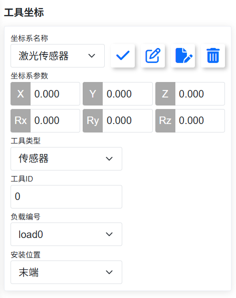

.. centered:: 圖表 8.11‑11 FT_CalCenter指令編輯

程式範例：

.. list-table::
   :widths: 20 40 50
   :header-rows: 0
   :align: center

   * - **序號**
     - **指令格式**
     - **註釋**

   * - 1
     - PTP(1,30,-1,0)
     - #初始位置

   * - 2
     - FT_CalCenterStart()
     - #表面定位開始

   * - 3
     - FT_Control(1,10,0,0,1,0,0,0,0,0,-10,0,0,0,0.00001,0,0,0,0,0,0,100,0)
     - #力/矩運動控制開啟

   * - 4
     - FT_FindSurface(1,2,2,10,0,200,5)
     - #定位平面A

   * - 5
     - FT_Control(0,10,0,0,1,0,0,0,0,0,-10,0,0,0,0.00001,0,0,0,0,0,0,100,0)
     - #力/矩運動控制關閉

   * - 6
     - PTP(1,30,-1,0)
     - #初始位置

   * - 7
     - FT_Control(1,10,0,0,1,0,0,0,0,0,-10,0,0,0,0.00001,0,0,0,0,0,0,100,0)
     - #力/矩運動控制開啟
     
   * - 8
     - FT FindSurface(1,1,2,20,0,200,5)
     - #定位平面B

   * - 9
     - FT_Control(0,10,0,0,1,0,0,0,0,0,10,0,0,0,0.00001,0,0,0,0,0,0,100,0)
     - #力/矩運動控制關閉

   * - 10
     - pos={}
     - #定義數組pos

   * - 11
     - pos = FT_CalCenterEnd()
     - #獲取定位中心笛卡爾位姿

   * - 12
     - MoveCart(pos,GetActualTCPNum(),GetActualWObjNum(),30,10,100,-1,0)
     - #運動至定位的中心位置

擴充IO設備週邊配置
------------------------

擴充IO設備設定步驟
~~~~~~~~~~~~~~~~~~~~~~~~~~~

**Step1**：在「初始設定－外設－末端工具」中點選「適配設備」選單項目進入末端週邊配置介面。

設備類型選擇“擴展IO設備”，擴展IO設備配置資訊分為廠商、類型、軟體版本和掛載位置，使用者可根據特定的生產需求來配置相應的設備資訊。若使用者需要變更配置，可先選擇對應的編號，點選「清除」按鈕，來清除對應的訊息，並重新依照需求配置；

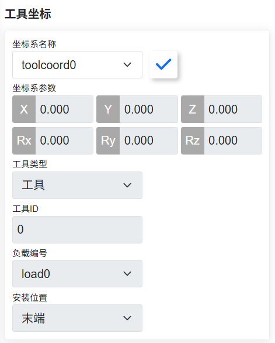

.. centered:: 圖表 8.12‑1 擴充IO設備配置

.. important::
   點擊清除配置前，對應的設備應處於未啟動狀態。

**Step2**：擴充IO設備配置完成後，使用者可在「輔助應用－工具應用」中點選「Smart Tool」功能選單，進入此功能配置頁面，使用者可對末端手把上的各個按鍵功能進行自訂，包括：

- 新建程式
- 保持程序
- PTP
- Lin
- ARC
- 擺焊開始
- 擺焊結束
- IO連接埠

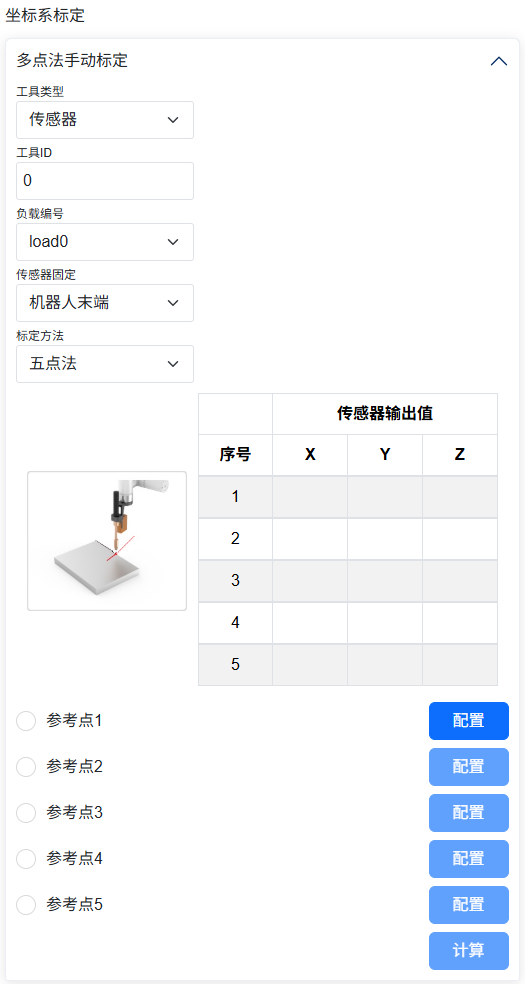

.. centered:: 圖表 8.12‑2 擴充IO設備功能配置

碼垛系統配置
---------------

碼垛系統配置步驟
~~~~~~~~~~~~~~~~~~~~~~

**Step1**：在「初始設定－週邊」中點選「堆疊」選單項，進入碼垛系統設定介面。

第一次使用，需要先進行配方創建，點擊“配方創建”，輸入配方名稱，點擊“創建”，創建成功後點擊“開始配置”進入碼垛配置頁面。

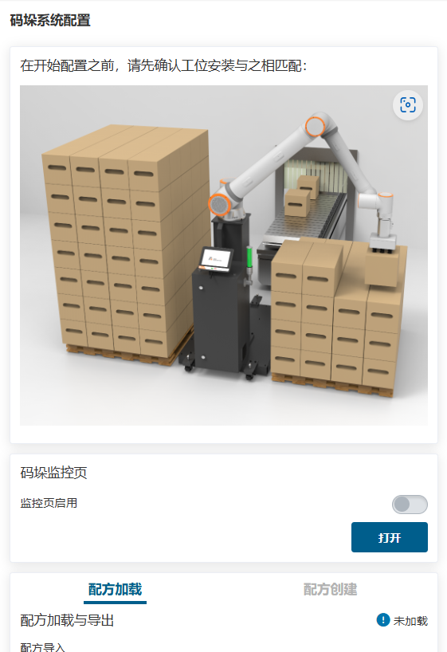

.. centered:: 圖表 8.13‑1 碼垛配方配置

**Step2**：在工件配置欄中點擊“配置”進入工件配置彈窗，設定工件的“長度”，“寬度”，“高度”以及工件的抓取點，點擊“確認配置”完成工件訊息設定.

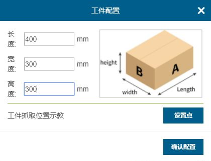

.. centered:: 圖表 8.13‑2 碼垛工件配置

**Step3**：在托盤配置欄中點擊“配置”進入托盤配置彈窗，設定托盤“前邊”，“側邊”和“高度”，接著設定工位和工位過渡點，點擊“確認配置”完成托盤資訊設定。

.. figure:: robot_peripherals/151.png
   :align: center
   :width: 4in

.. centered:: 圖表 8.13‑3 碼垛托盤配置

**Step4**：在碼垛設備尺寸配置列中點選“配置”進入碼垛設備尺寸配置配置彈窗，設定設備“X”、“Y”、“Z”和“Angle”，點擊“確認配置”完成碼垛設備尺寸配置資訊設定。

.. important::
 X、Y、Z為左托盤右上角或者右托盤左上角點相對於機器人基座標系座標值的絕對值，Angle為機器人安裝時的旋轉角度，推薦安裝時為0。

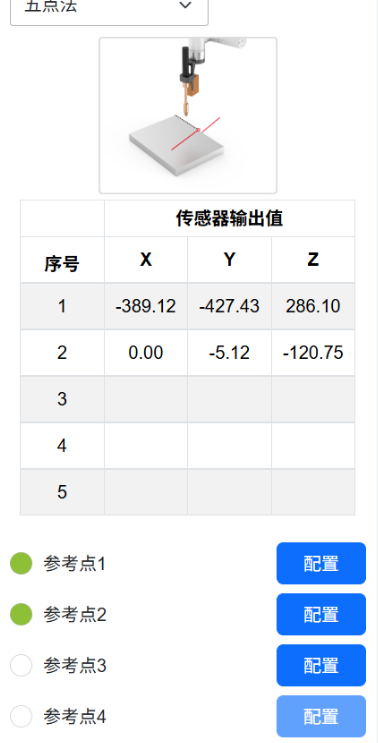

.. centered:: 圖表 8.13‑4 碼垛設備尺寸配置

**Step5**：在模式設定列中點選「設定」進入模式配置彈跳窗。

 **模式B開啟/關閉**：開啟：可切換模式A/B，配置碼垛每層模式的B模式；關閉：不可切換模式B，不可設定碼垛每層模式的B模式；

 **模式A/B切換**：選擇模式A：新增工件為模式A，工件序號為A1，A2...，不可調整工件透明度；選擇模式B：新增工件為模式B，工件序號為B1， B2...，此時可以開啟/關閉「顯示模式A配置」顯示模式A工件；

 **顯示模式A開啟/關閉**：開啟：調整模式B工件透明度來查看A/B模式配置效果是否合理，此時只能對模式B工件進行選取、新增、批次新增、刪除和刪除全部的操作；關閉：無法設定模式B工件透明度；

.. important::
 配置工件時，工件之間有碰撞時工件背景顏色變紅，此時以上操作無法進行。如需操作，請配置工件為無碰撞。

 配置工件時，先設定工件間隔，右側框框為模擬工件在右托盤的放置方式，可以單一新增也可以批次新增。接著設定碼垛層數和各層的模式，點選「確認配置」完成模式資訊設定。

.. important::
 碼垛方向：以右托盤為例，右下角為最遠處，從右下角豎向或橫向擺放一排工件，再向上一排橫向或豎向擺放工件，以此類推（Web頁面已標註碼垛方向，請注意檢視）。

 左托盤依據右托盤模式鏡像放置工件。

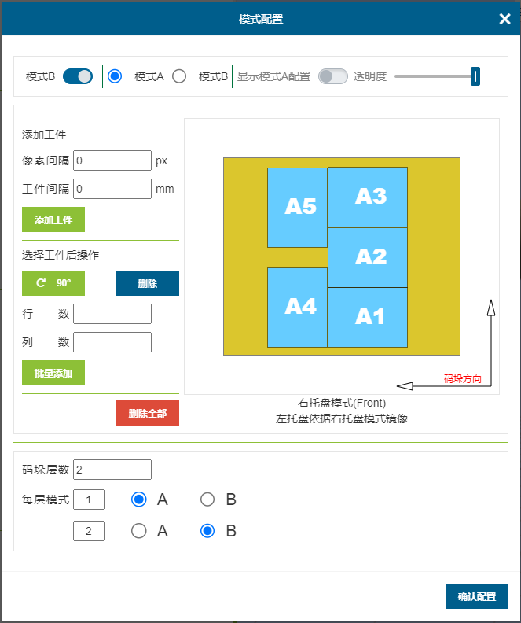

.. centered:: 圖表 8.13‑5 碼垛模式A配置

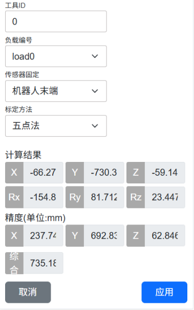

.. centered:: 圖表 8.13‑6 碼垛模式B配置

**Step6**：在示教程式產生欄點擊“進階配置”進入進階配置彈跳窗，此時配置“取料抬升高度”、“第一次偏移距離”、“第二次偏移距離”和「吸料等待時間」。

 **取料抬升高度**：使用者自訂取料成功後，從抓取點取料成功後抬升的高度；

 **第一/二次偏移距離**：使用者自訂配置機器人傾斜堆疊至目標點的偏移距離；

 **吸料等待時間**：使用者自訂配置吸料等待時間，監控吸料後負壓到位訊號，未到位時重複吸取動作；

 **平滑過渡**：開啟平滑過渡按鈕，可進行堆疊/拆垛PTP平滑時間和LIN平滑半徑相關參數配置。

 - PTP平滑時間：無平滑過渡時間/等級1(200ms)/等級2(400ms)/等級3(600ms)/等級4(800ms)/等級5(1000ms)
 - LIN平滑半徑：無平滑過渡半徑/等級1(200mm)/等級2(400mm)/等級3(600mm)/等級4(800mm)/等級5(1000mm)

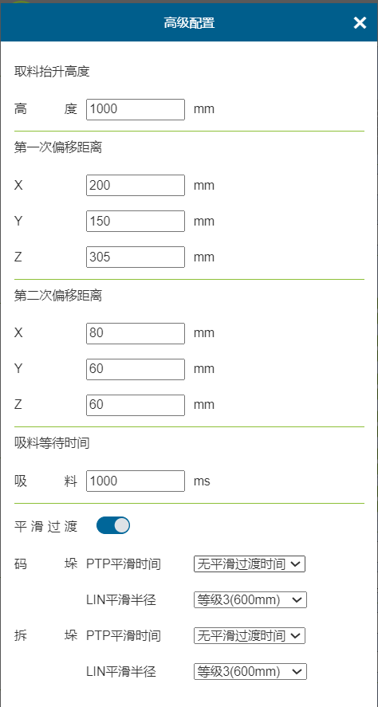

.. centered:: 圖表 8.13‑7 碼垛高級配置

**Step7**：在示教程式產生欄選擇“方式選擇”，點擊“產生程式”，開啟“碼垛監控頁”，在此頁面可以對“產生資訊”，“警報訊息”和“碼垛程式”顯示和檢視。

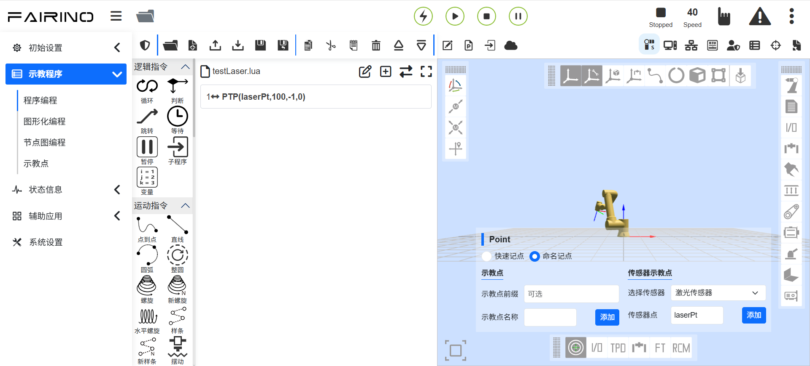

.. centered:: 圖表 8.13‑8 碼垛系統監控

**Step8**：碼垛運行程式中途報錯後，程式停止，用戶先清除報錯後，再次選擇碼垛程式運行，此時會彈出「上次程式中斷」彈出框，點選「接續」按鈕接續運行，點擊「重新開始」按鈕重新開始執行程式。

.. centered:: 圖表 8.13‑9 碼垛程式接續

打磨設備配置
---------------

打磨設備配置步驟
~~~~~~~~~~~~~~~~~~~~~~

**Step1**: 在「初始設定－週邊」功能表列下點選「打磨」選單項，進入打磨設備設定頁。

配置通訊訊息，需要設定IP位址、連接埠、採樣週期和通訊協定。配置成功後，下次操作可自動顯示。

**Step2**：完成通信配置後，可建立通信，透過加載/卸載打磨設備。

**Step3**：設備功能。可進行設備使能、錯誤清除和力傳感器清零等操作。

**Step4**：參數配置。可設定打磨設備的轉速、接觸力、伸出距離和控制模式。設定成功後，可在右側"Polish"狀態回饋列顯示對應資料和狀態。

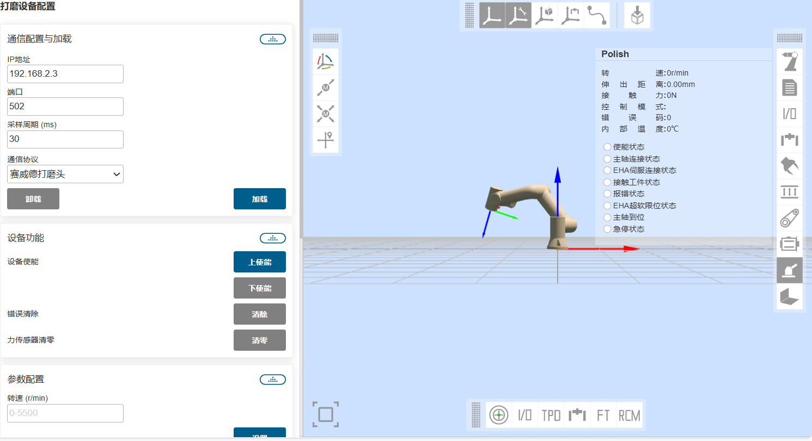

.. centered:: 圖表 8.14-1 打磨狀態配置頁面

基於力傳感器的虛擬牆配置
-------------------------------------------------

基於力傳感器的虛擬牆功能，可透過人為設置虛擬牆，用於限制機器人的工作空間，避免直接發生碰撞接觸。

力傳感器的安裝配置
~~~~~~~~~~~~~~~~~~~~~~

**Step1**：以「坤維」感測器為例，安裝時需要力感測器的座標系方向與末端法蘭座標系保持一致，如圖1所示（圖1中，紅色為末端法蘭座標系X+方向，綠色為末端法蘭座標系Y+方向，藍色為末端法蘭座標系Z+方向）；

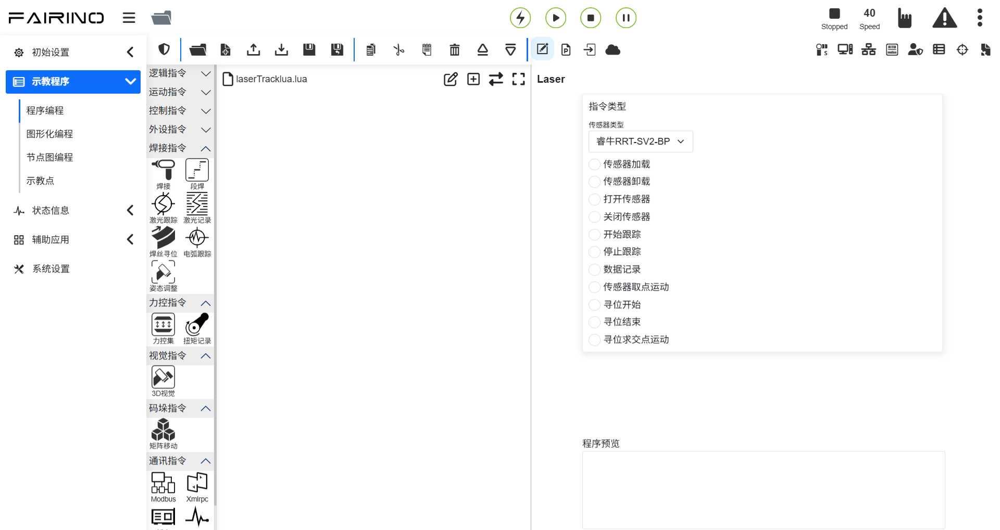

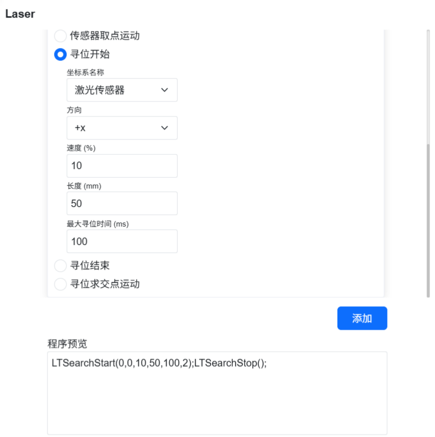

.. centered:: 圖表 8.15‑1 力傳感器安裝

**Step2**：在「初始設定－外設－末端工具」的功能表列下，點選「適配設備」進入末端週邊配置介面。

設備類型選擇“力傳感器設備”，力傳感器配置資訊分為廠商、類型、軟體版本和掛載位置，用戶可根據特定的生產需求來配置相應的力傳感器資訊。若使用者需要變更配置，可先選擇對應的編號，點選「清除」按鈕，來清除對應的訊息，並重新根據需求配置；具體操作如圖2所示。

**Step3**：選擇配置完成的力感應器編號，點選「重設」按鈕，頁面彈出指令傳送成功後，再點選「啟動」按鈕，可查看力感應器資訊表中的啟動狀態，來判斷是否啟動成功；此外，力感測器會有初始值，使用者根據使用需求選擇「零點矯正」和「去除零點」。力感測器零點矯正需要確保力感測器水平垂直向下，且機器人未配置負載。

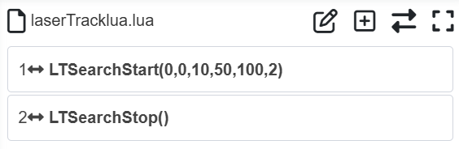

.. centered:: 圖表 8.15‑2 力傳感器配置

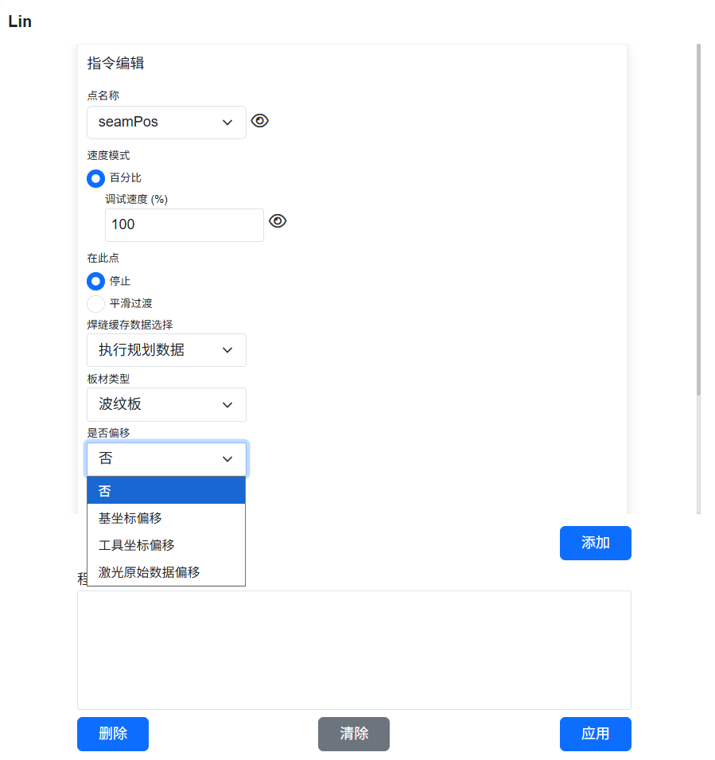

.. centered:: 圖表 8.15‑3 力傳感器激活

虛擬牆配置
~~~~~~~~~~~~~~~~~~~~~~

借助力傳感器進行輔助拖動，需要在力傳感器下安裝拖動把手，並配置工具坐標系，具體操作如圖4所示。此時，檢測干涉區的方式以設定的工具座標系位置為參考，不設定時以末端法蘭為參考。

**Step1**：在「輔助應用－工具應用－干涉區」的選單列下，點選「單一」進入乾涉區設定功能介面；

**Step2**：需要對乾涉方式和進入乾涉區操作進行配置；干涉方式選擇“立方體干涉”，進入乾涉區拖曳配置為“不限制拖曳”，進入乾涉區運動配置皆可；

**Step3**：根據需求，可以對參數配置進行修改。檢測方法分為“指令位置”和“反饋位置”兩種，干涉區模式分為“範圍內干涉”和“範圍外干涉”兩種，參考坐標系選擇為“基坐標”，根據實際使用選擇設置。詳細操作見圖5所示；

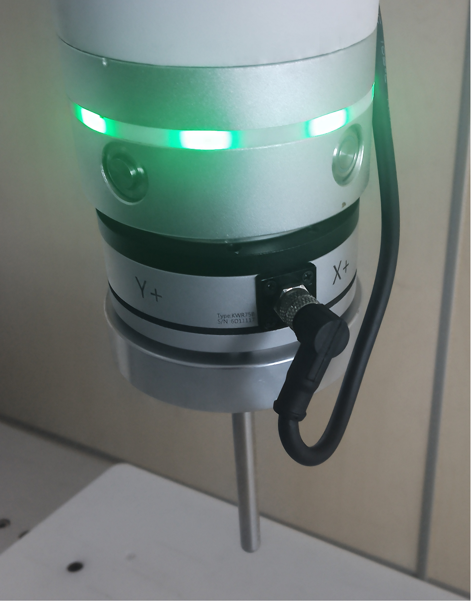

.. figure:: robot_peripherals/164.png
   :align: center
   :width: 4in

.. centered:: 圖表 8.15‑4 安裝拖曳把手並設定工具座標系

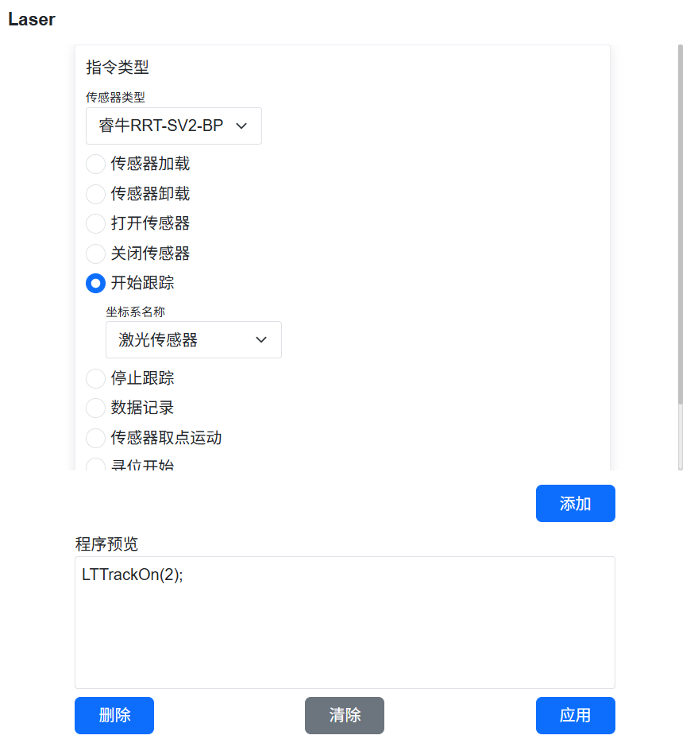

.. centered:: 圖表 8.15‑5 虛擬牆參數配置

**Step4**：參數配置下的干涉區模式分為「範圍內干涉」與「範圍外干涉」兩種；

.. figure:: robot_peripherals/166.png
   :align: center
   :width: 4in

.. centered:: 圖表 8.15‑6 範圍內干涉

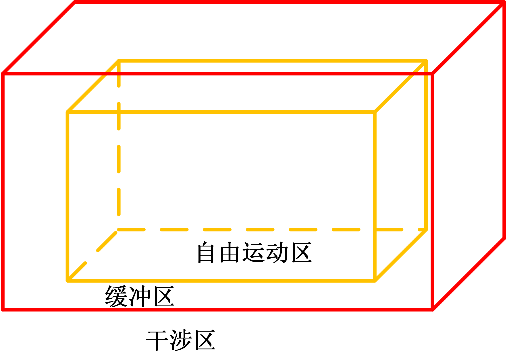

.. centered:: 圖表 8.15‑7範圍外干涉

**Step5**：建立干涉區，具體操作如圖7和圖8所示；建議在選擇「範圍外干涉」時，將乾涉區域設定盡可能大。

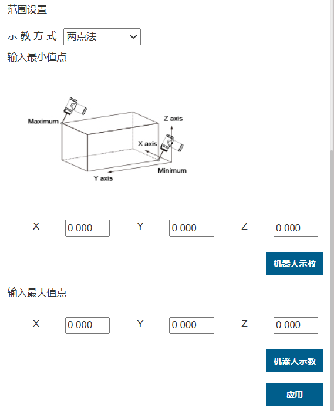

.. centered:: 圖表 8.15‑8 兩點法建立乾涉區

.. figure:: robot_peripherals/169.png
   :align: center
   :width: 4in

.. centered:: 圖表 8.15‑9 中心點+邊長法建立干涉區

力道感測器輔助拖曳
~~~~~~~~~~~~~~~~~~~~~~

**Step1**：在「輔助應用－工具應用」的選單列下，點選「拖曳鎖定」進入力道感應器輔助鎖定功能介面；

**Step2**：依照如圖9所示的參數進行設置，即可實現基於力道感測器的虛擬牆功能。具體效果為：靠近虛擬牆，阻力變大；遠離虛擬牆，基於力傳感器輔助拖曳功能正常。

.. centered:: 圖表 8.15‑10 力傳感器輔助拖曳的參數設置

參數的具體作用：

**自適應選擇**：在需要組裝時開啟，開啟後拖曳變重；

**慣性參數**：調節拖曳過程中的手感，需在技術人員指導下謹慎操作。

**阻尼參數**：

- 平動方向：建議設定參數在[100-200]之間；

- 轉動方向：建議設定參數在[3-10]之間，其中RZ方向設定範圍在[0.1-5]；

- 效果：使用感測器拖曳時，增大阻尼會導致拖曳困難，減少阻尼會導致拖曳機器人過於輕鬆（建議不要太小）；

- 阻尼參數整體範圍：平動XYZ​​：[100-1000]；轉動RX、RY：[3-50],RZ:[2-10]；

- 最大拖曳動力為50，最大拖曳速度為180。

**剛度參數**：均設為0；

**拖動力閾值**：平動XYZ​​為[5-10]；轉動RX、RY、RZ為[0.5-5]；

**最大拖動力**：50；

**最大拖曳速度**：180；

六維力和關節阻抗混合拖曳功能
~~~~~~~~~~~~~~~~~~~~~~~~~~~~

概述
++++++

六維力和關節阻抗混合拖曳功能，是藉助力感測器感知外力，機器人在拖曳模式下進行輔助拖動，可以透過調整增益係數獲得不同的拖曳體驗。而關節阻抗是採用阻抗控制對拖動力進行限制。

力傳感器的安裝配置及校零操作
++++++++++++++++++++++++++++++++++

1. 力傳感器的安裝配置

力傳感器的安裝配置的詳細操作請參閱上文：基於力傳感器的虛擬牆配置。

2. 力傳感器的校零

為方便拖曳機器人，需要在感測器下方安裝拖曳把手，如圖1所示。

.. figure:: robot_peripherals/170.png
   :align: center
   :width: 4in

.. centered:: 圖表 8.15‑11 拖曳把手

**Step1**：依照實際把手的長度，設定工具座標系，如圖2所示。

**Step2**：在“初始設定->基礎->負載”選單列下，點擊“感應器”，進入力/扭力感應器負載介面。

借助拖曳按鈕，調整機器人末端水平朝下，點擊「力/扭力感測器負載」介面的「感測器自動校零」一欄中的「記錄初始位置」按鈕。然後，切換機器人模式為自動模式，點選「自動校零」按鈕。待程式運作結束，即完成感測器校零工作。詳細操作請參閱圖3所示。

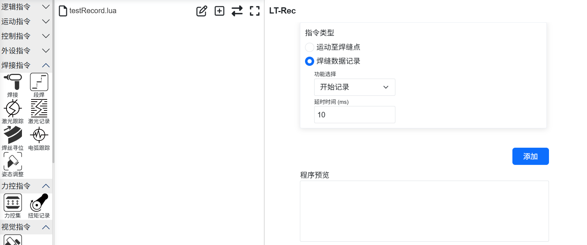

.. centered:: 圖表 8.15‑12 工具座標系設定

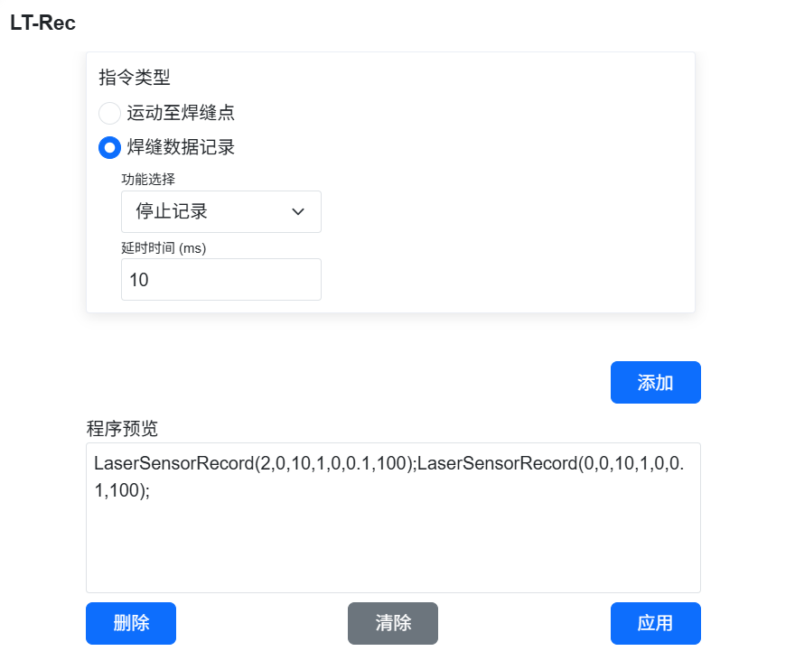

.. centered:: 圖表 8.15‑13 力/扭力感應器自動校零

六維力和關節阻抗混合拖動
++++++++++++++++++++++++

1. 輔助拖曳

**Step1**：在「輔助應用程式－工具應用程式」的功能表列下，點選「拖曳鎖定」進入拖曳鎖定功能介面。

**Step2**：在“六維力和關節阻抗混合拖曳”一欄中，設定控制狀態為“開啟”，阻抗開啟狀態為“關閉”，設定拖曳增益為，末端線速度為1000mm/ s，角速度限制為100°/s，再點選「應用」按鈕，功能即啟用。具體配置如圖4所示。

**Step3**：切換機器人模式為拖曳模式，即可拖曳機器人。具體效果為：拖曳機器人末端，拖曳輕鬆，體驗感好；拖曳機器人關節，拖曳重。

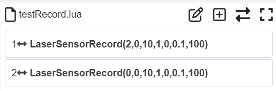

.. centered:: 圖表 8.15‑14 六維力輔助拖曳的配置參數

2. 關節阻抗控制

阻抗控制的作用是對拖曳動力和拖曳位置進行限制，其預設狀態為「關閉」。

具體操作請參閱圖5所示，設定阻抗開啟狀態為“開啟”，再依照圖5所示設定阻尼係數和剛度係數。其中，剛度係數的功能暫未開放。

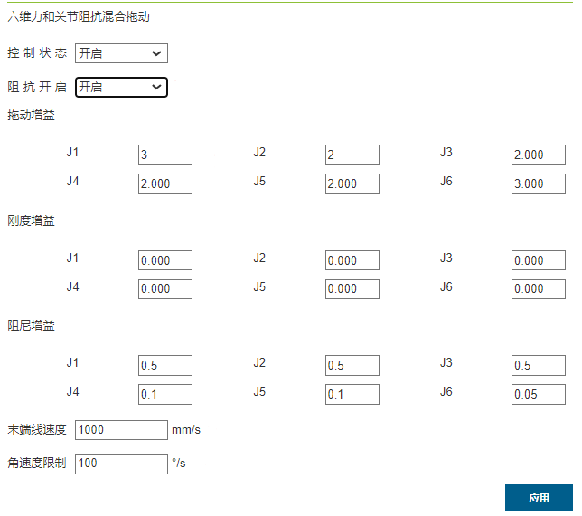

.. centered:: 圖表 8.15‑15 關節阻抗的配置參數

參數的具體作用：

- **控制狀態**：開啟後，在拖曳模式下可使用此功能。

- **阻抗開啟**：開啟後，需配置剛度參數和阻尼參數。作用是對拖曳動力和拖曳位置進行限制。

- **拖曳增益**：參數建議設定在[0-5]之間。參數設定為0，機器人無法拖曳。參數設定為1，拖曳效果沒有改善。參數大於1，拖曳輕，拖曳體驗好。參數越大，拖曳越輕鬆。

- **剛度增益**：設定為0，其作用是在拖曳後恢復到拖曳前的初始位置。

- **阻尼增益**：作用是限制拖動力。 1-3軸參數範圍為[0-0.5]，4-5軸參數範圍為[0-0.1]；6軸參數範圍為[0-0.05]。

- **末端線速度**：1000mm/s，當超出末端線速度限制，機器人切換模式至手動模式，並提示TCP超速。

- **角速度限制**：100°/s，當超出角速度限制，機器人切換模式至手動模式，並提示TCP超速。

擴展軸加雷射定點追蹤功能
-------------------------------------------------

機器人擴展軸加雷射定點追蹤系統構成
~~~~~~~~~~~~~~~~~~~~~~~~~~~~~~~~~~~~~~~

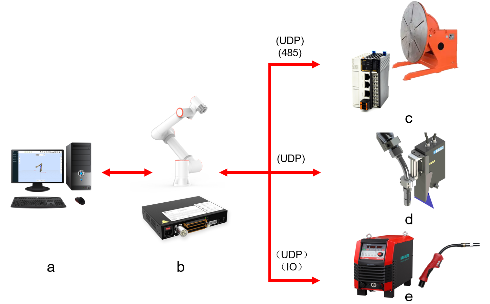

.. centered:: 圖表 8.16‑1 機器人擴展軸加雷射定點追蹤系統構成

系統中，（a）為計算機，（b）為機器人及其控制箱，（c）為變位機及驅動設備，（d）焊縫追蹤雷射感測器，（e）為焊機與配套設備。

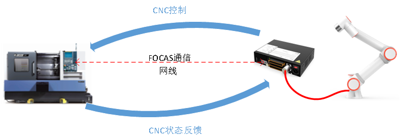

.. centered:: 圖表 8.16‑2 週邊安裝示意圖

焊縫追蹤雷射感測器及焊槍（b）安裝於機器人（a）末端法蘭上，變位機（c）固定安裝於機器人外。

擴展軸通訊配置
~~~~~~~~~~~~~~~~~~~~~~~~~~~~~~~~~~~~~~~

機器人與擴充軸的通訊方式包括使用UDP或RS485這兩種形式。

.. centered:: 圖表 8.16‑3 擴展軸配置頁面

在機器人操作介面點選「初始設定」、「外設」、「擴充軸」按鈕，進入擴充軸配置頁面。以使用PLC透過UDP通訊與機器人連結為例，點選「UDP通訊」圖示進入UDP通訊的擴充軸配置頁面。

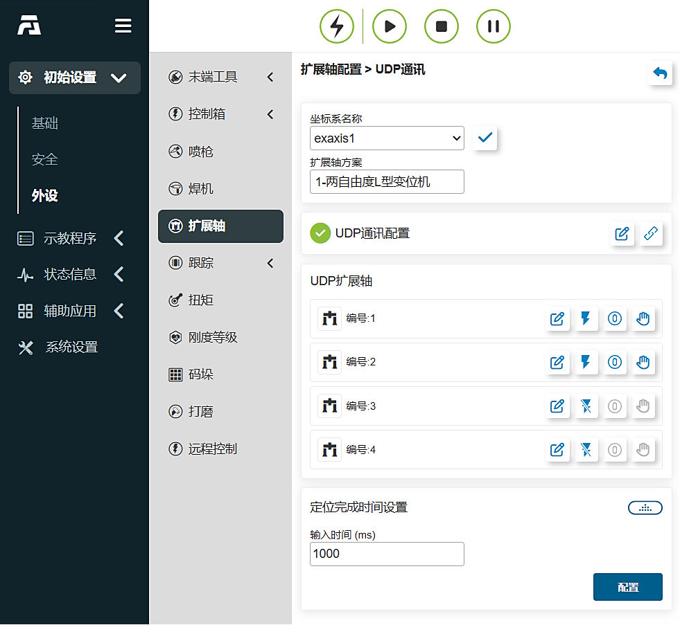

.. centered:: 圖表 8.16‑4 UDP通訊配置頁面

在UDP通訊的擴充軸配置頁面，能夠選擇對應的擴充軸號，連接與設定UDP通訊參數（位址、連接埠、週期、丟包偵測等），以及擴充軸定位完成時間。

擴充軸配置內容非本功能介紹重點，詳細配置請參考對應部分使用手冊。

焊縫追蹤雷射感測器連接配置
~~~~~~~~~~~~~~~~~~~~~~~~~~~~~~~~~~~~~~~

透過以下配置頁面連接焊接追蹤雷射感測器:

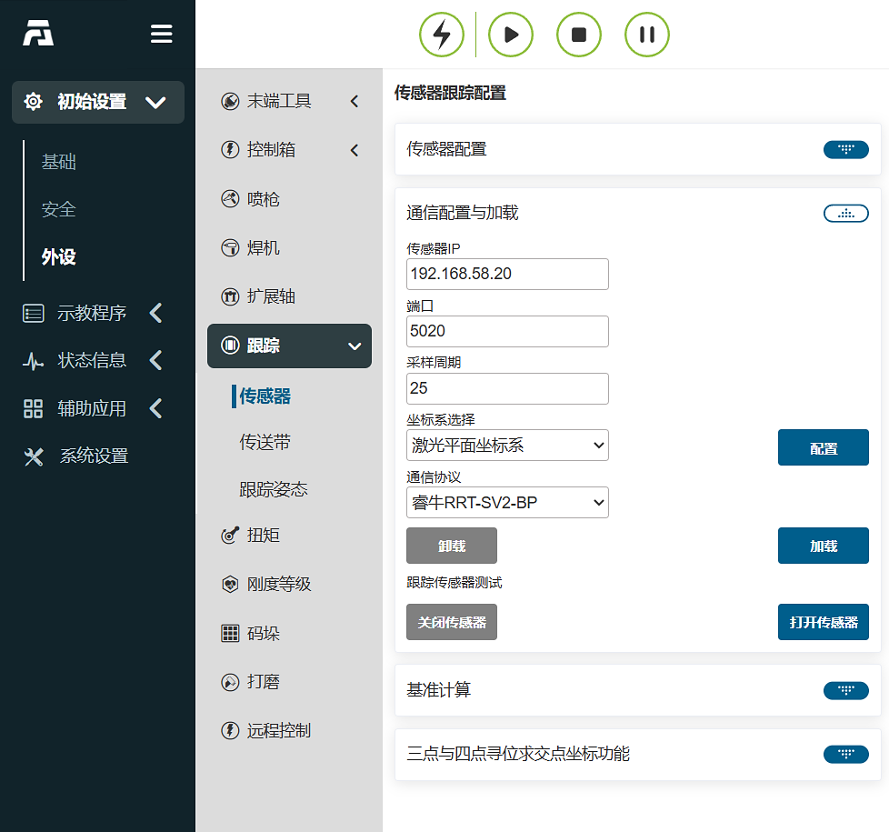

.. centered:: 圖表 8.16‑5 雷射感測器連接與配置頁面

點選「初始設定」、「週邊」、「追蹤」、「感應器」按鈕進入設定頁面。設定頁麵包括“感測器配置”、“通訊配置與載入”、“基準計算”、“三點與四點尋位求交點座標功能”，點選“感測器配置”可設定感測器輸入量濾波參數，點選“通信配置與載入”可輸入對應通訊參數連接雷射感測器。

雷射感測器配置內容非本功能介紹重點，詳細配置請參考對應部分使用手冊。

焊接機連接配置
~~~~~~~~~~~~~~~~~~~~~~~~~~~~~~~~~~~~~~~

透過以下配置頁面配置焊接機：

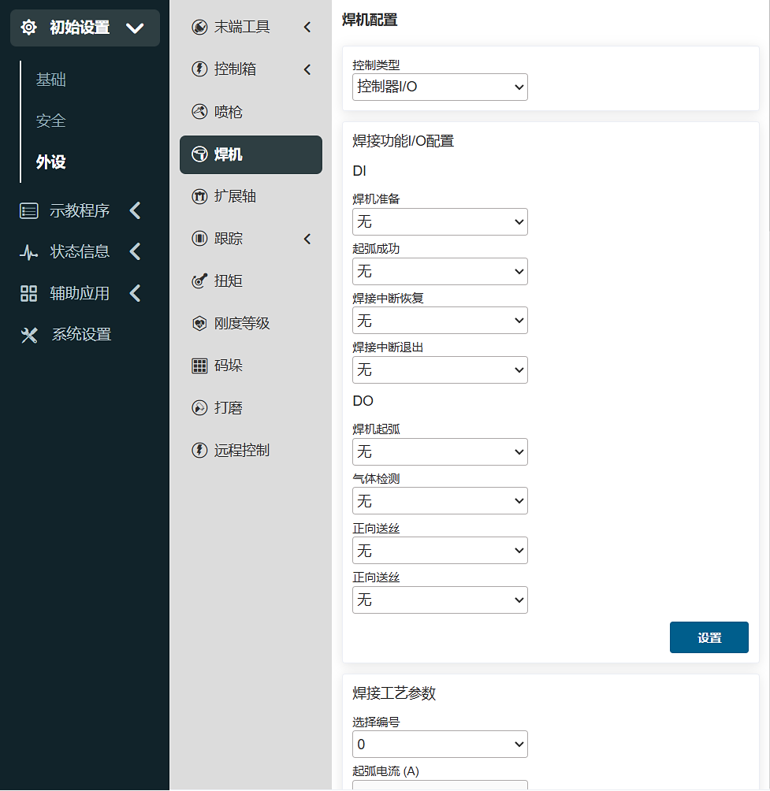

.. centered:: 圖表 8.16‑6 焊機配置頁面

焊接機通訊可使用IO通訊或RS485通信，點選“初始設定”、“週邊”、“焊接機”進入配置與連接介面，可設定“控制類型”、“訊號對應IO”、“焊接製程參數” 、「焊接機調試」等模組。

焊機配置內容非本功能介紹重點，詳細配置請參考對應部分使用手冊。

工具座標系與雷射感測器座標系標定
~~~~~~~~~~~~~~~~~~~~~~~~~~~~~~~~~~~~~~~

在機器人末端安裝焊槍後，將焊槍與雷射感測器外參進行標定：

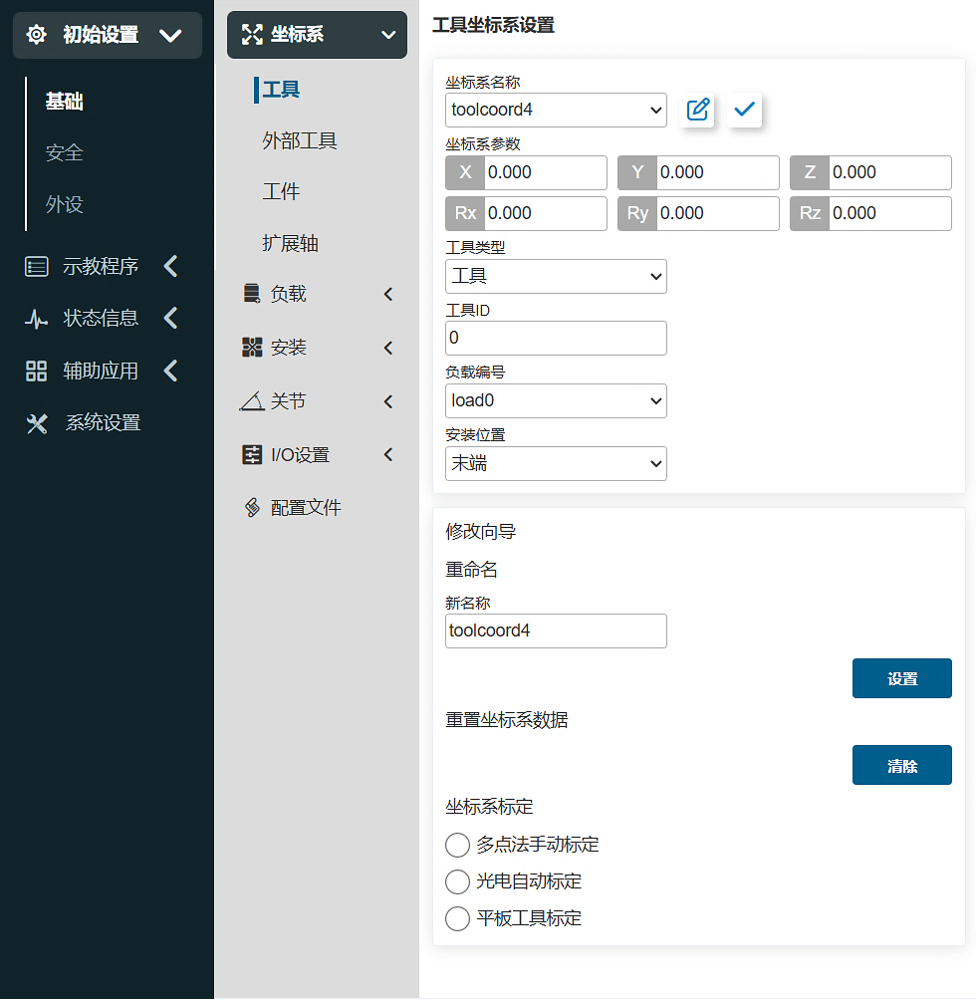

.. centered:: 圖表 8.16‑7 工具座標系配置頁面

點選「初始設定」、「基礎」、「座標系」、「工具」進入工件座標系設定頁面。

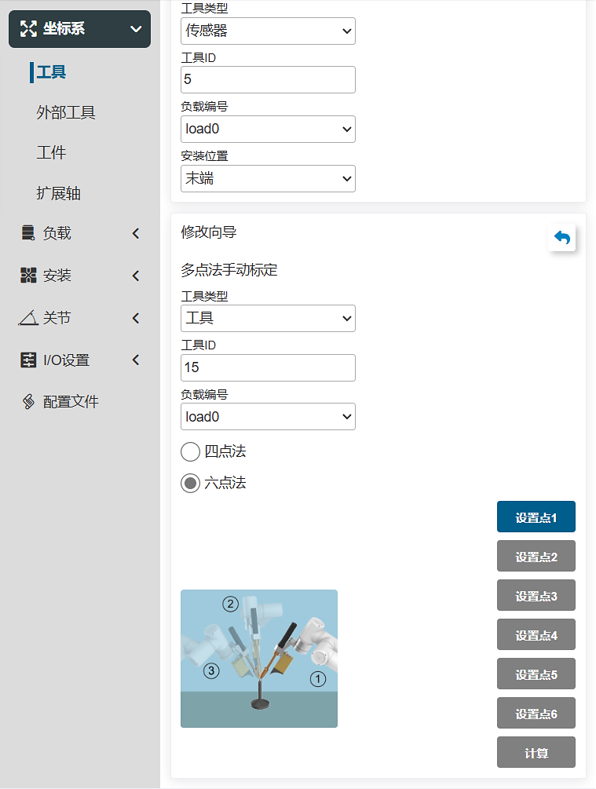

.. centered:: 圖表 8.16‑8 選擇6點法對焊槍進行標定

選擇一個空座標系，選擇工具類型為“工具”，選擇6點法進行焊槍工具標定。

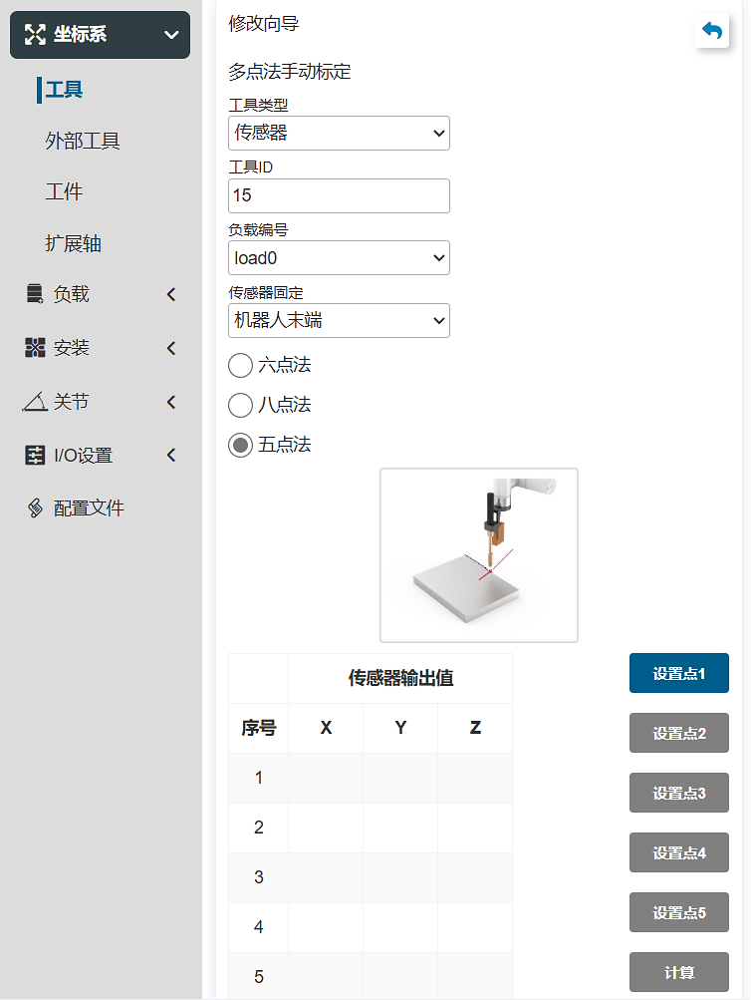

.. centered:: 圖表 8.16‑9 選擇5點法對雷射感測器進行標定

選擇一個空座標系，選擇工具類型為“感測器”，選擇5點法進行雷射感測器標定。

工具座標系與雷射感測器座標系標定內容非本功能介紹重點，詳細標定方法見對應部分使用手冊。

擴展軸與雷射定點追蹤功能
~~~~~~~~~~~~~~~~~~~~~~~~~~~~~~~~~~~~~~~

擴展軸與雷射定點追蹤分成兩種方法，雷射數據有變換方式執行「先記錄後復現」的追蹤策略，雷射數據無變換方式執行「邊記錄邊復現」的追蹤策略。

擴展軸座標系標定
+++++++++++++++++++++++++++++

使用擴展軸座標系實現擴展軸與機器人同步雷射追蹤時需要標定擴展軸座標系。

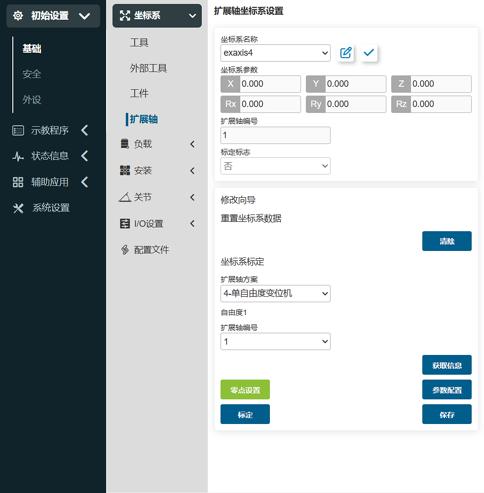

.. centered:: 圖表 8.16‑10 擴展軸座標系設定頁面

點選「初始設定」、「基礎」、「擴充軸」進入擴充軸座標系設定介面，選擇需要設定的擴充軸號，點選編輯按鈕，選擇「4-單自由度變位機」並儲存。

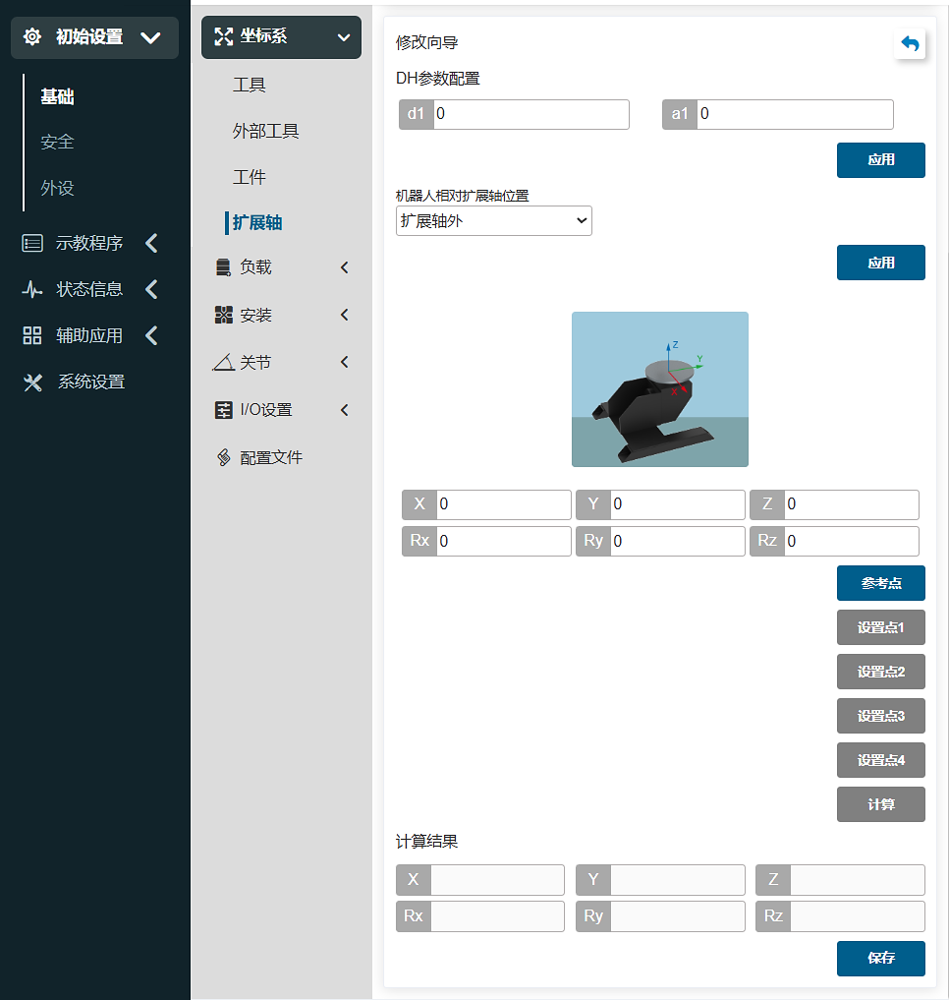

.. centered:: 圖表 8.16‑11 擴展軸標定頁面

在標定擴展軸時注意選擇“機器人相對擴展軸位置”為“擴展軸外”。對於變位機的情況，選擇4點法進行標定。

擴展軸標定內容非本功能介紹重點，詳細標定方法請見對應部分使用手冊。

擴展軸與機器人同步雷射追蹤
+++++++++++++++++++++++++++++

雷射數據有變換方式
**************************

基座標系下的擴展軸與機器人同步雷射追蹤無需標定外部軸，其餘功能設定和組成與擴展軸座標系下的同步追蹤一致。

先進行雷射追蹤資料配置，將雷射追蹤器資料設定為有變換類型的資料。

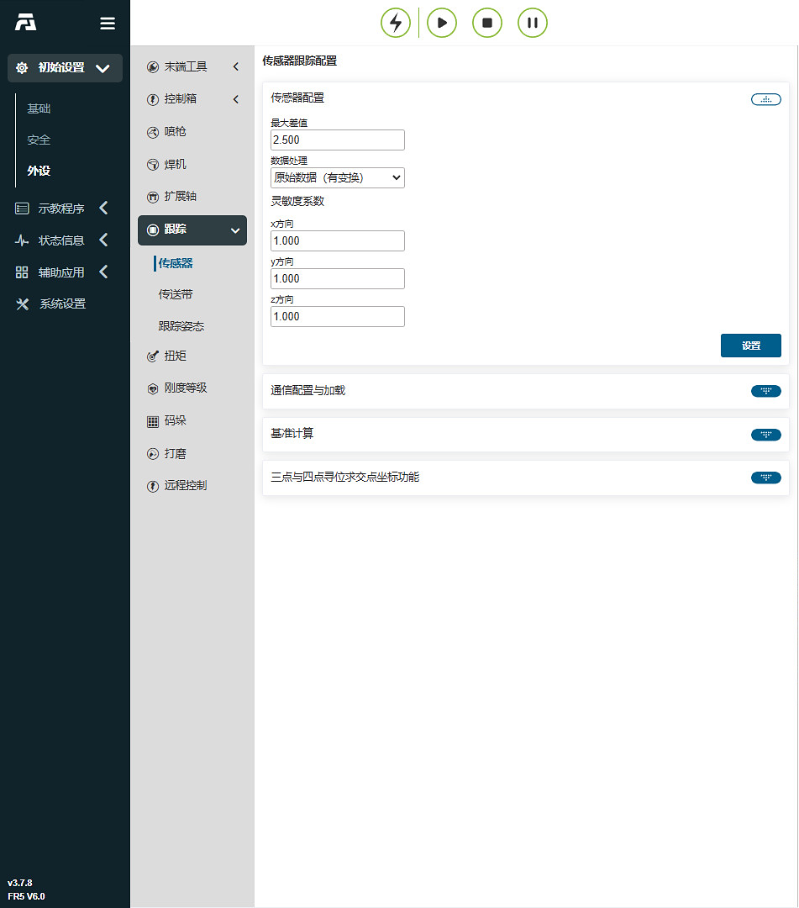

.. centered:: 圖表 8.16‑12 設定雷射資料有變換類型

點擊“初始設定”、“週邊”、“追蹤”、“感測器”，在頁面下拉框點擊“感測器配置”，將“資料處理”調整為有變換類型的資料。

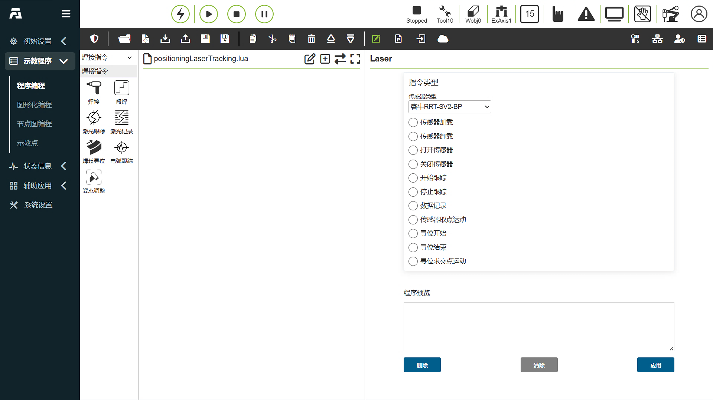

.. centered:: 圖表 8.16‑13 雷射追蹤功能頁面

本功能透過多功能模組組合實現，主要功能模組在「雷射追蹤」功能內包含。點選「示教程式」、「程式編程」、「雷射追蹤」進入雷射追蹤頁面，也可點選「雷射記錄」直接進入記錄頁面。

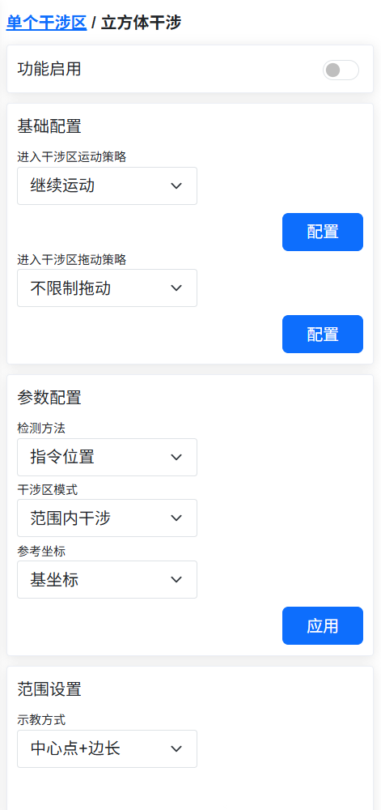

.. centered:: 圖表 8.16‑14 新增開始記錄雷射資料指令

在擴展軸運動到焊接起始點後新增開始記錄雷射數據指令。

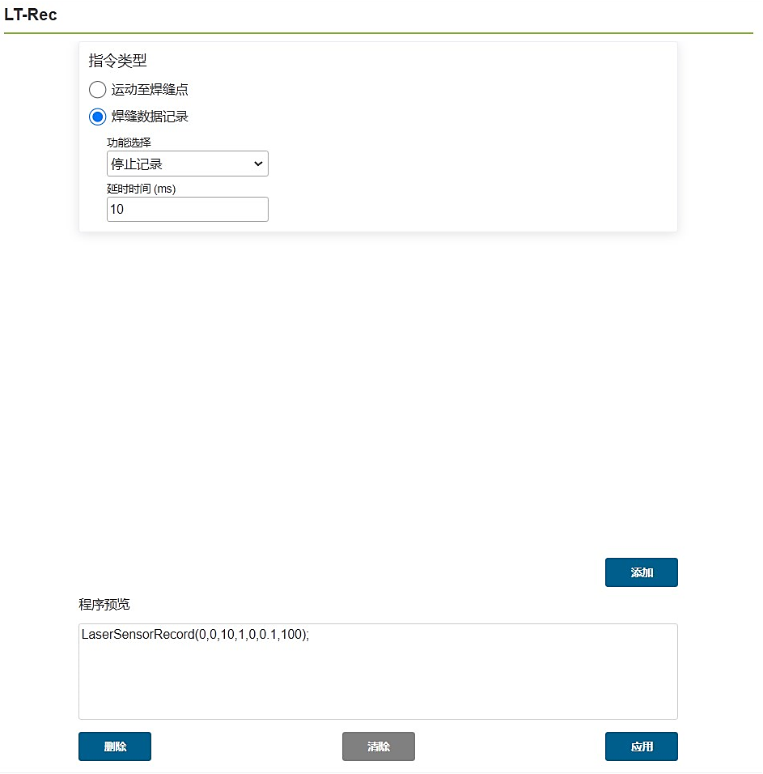

.. centered:: 圖表 8.16‑15 新增結束記錄雷射資料指令

在擴展軸運動到焊接終止點後新增停止記錄雷射數據指令。

機器人在原地記錄擴展軸運動時焊接的運動軌跡後，就可將擴展軸回到焊接起始點，準備開始同步追蹤焊接。

焊接開始時需將焊槍移動到雷射感測器記錄資料的起點位置，需添加移動到焊接點指令：

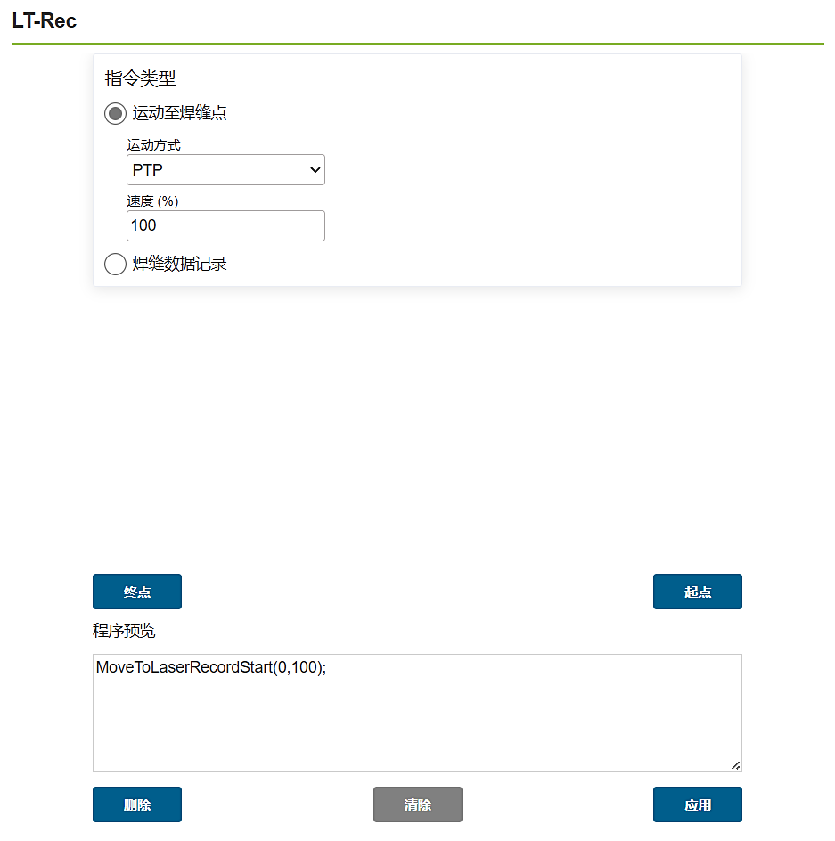

.. centered:: 圖表 8.16‑16 新增運動到焊接點指令

點擊“示教程式”、“程式編程”、“雷射記錄”按鈕，選擇“移動到焊接點”，設定運動方式與運動速度，點擊“起點”按鈕並套用。

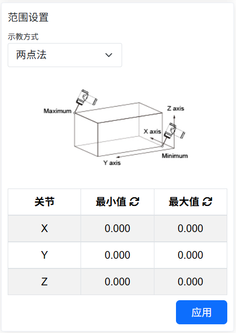

.. centered:: 圖表 8.16‑17 新增軌跡復現雷射記錄的資料指令

在「雷射追蹤」頁面選擇「資料記錄」、「軌跡復現」指令，點選「新增」並套用。指令中，等待時間預設為0ms，速度為複現速度相較記錄速度的比值，建議大於50%。

在「軌跡復現」指令後加入擴展軸運動指令即可實現擴展軸與機器人雷射追蹤同步運動。

以下為一段典型的擴展軸加雷射定點追蹤的LUA程式：

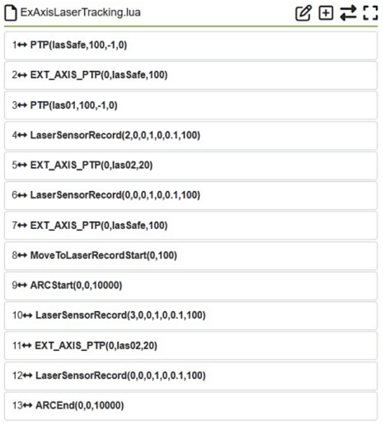

.. centered:: 圖表 8.16‑18 擴展軸加雷射數據有變換定點追蹤範例程序

機器人執行「先記錄後復現」的流程，先記錄擴展軸運動時工件焊接的變化軌跡，之後在焊接時擴展軸與軌跡重現同步執行。

雷射數據無變換方式
**************************

使用雷射數據無變換方式進行定點追蹤無需標定擴展軸座標系。

將雷射追蹤感測器數據設定為無變換類型。

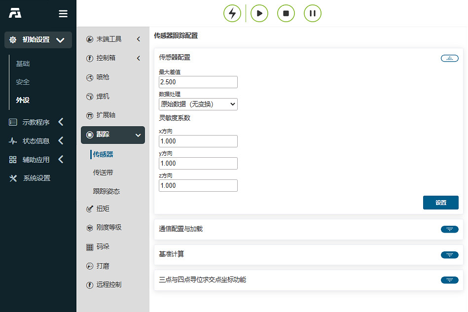

.. centered:: 圖表 8.16‑19 設定雷射資料有變換類型

點擊“初始設定”、“週邊”、“追蹤”、“感測器”，在頁面下拉框點擊“感測器配置”，將“資料處理”調整為無變換類型的資料。

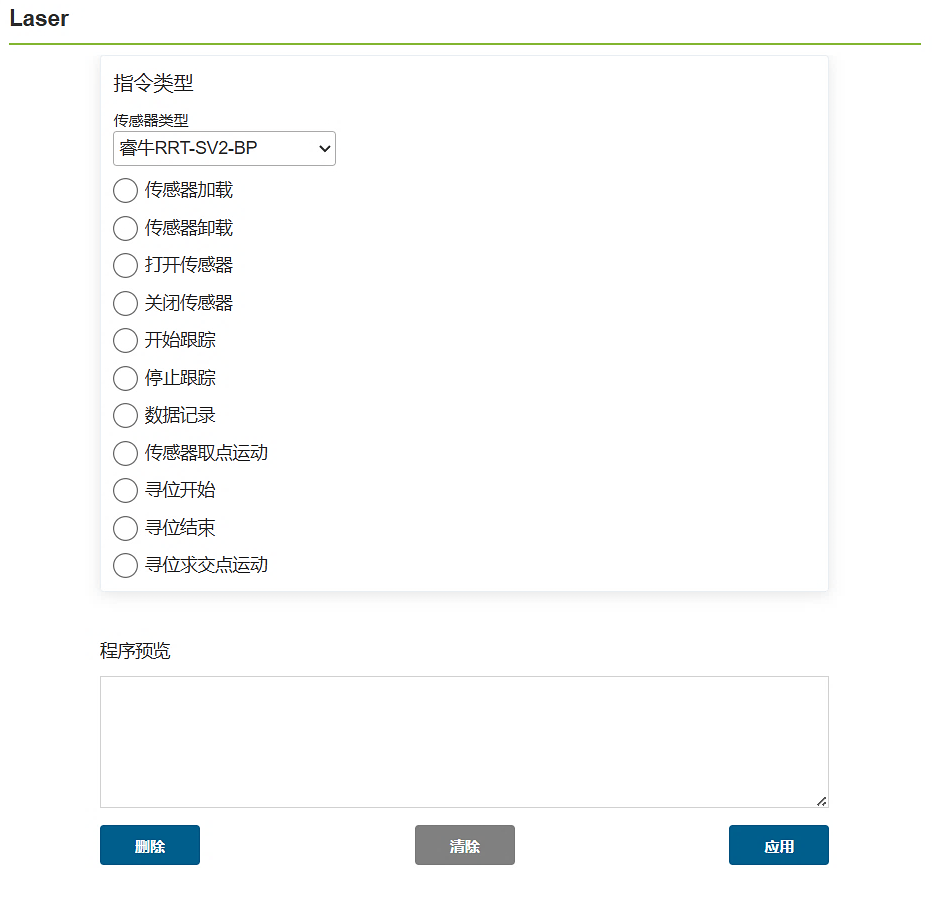

.. centered:: 圖表 8.16‑20 雷射追蹤功能頁面

點選「示教程式」、「程式編程」、「雷射追蹤」進入雷射追蹤頁面，也可點選「雷射記錄」直接進入記錄頁面。

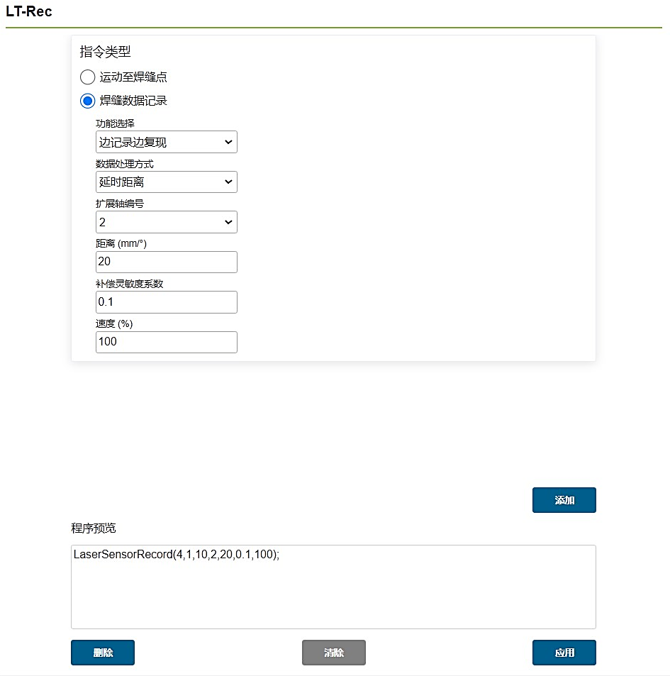

.. centered:: 圖表 8.16‑21 新增邊記錄邊復現指令

在「雷射記錄」頁面選擇「邊記錄邊復現」指令，點選「新增」並套用。指令中，可選擇「延遲時間」或「延遲距離」（建議選擇距離），補償靈敏度係數依實際感測器雷射數據調整，數值越低調整靈敏度越低抗干擾性越好，復現速度預設100% 。

在「邊記錄邊復現」指令後加入擴展軸運動指令即可實現擴展軸與機器人雷射追蹤同步運動。

以下為一段典型的擴展軸加雷射資料無變換定點追蹤的LUA程式：

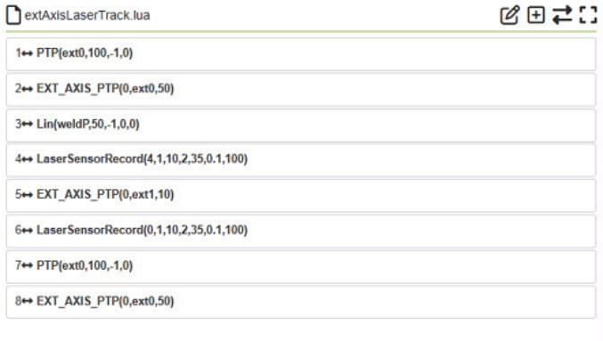

.. centered:: 圖表 8.16‑22 擴展軸加雷射數據無變換定點追蹤範例程序

焊槍對齊前置雷射處的偏移量後，機器人擴展軸運動並執行「邊記錄邊復現」的流程，前置的雷射追蹤器先記錄擴展軸運動時工件焊縫的變化軌跡，經過設定延遲距離或時間後在焊槍處調整。

基於FOCAS的CNC功能包（僅在Linux系統下使用）
-------------------------------------------------

概述
~~~~~~~~~~~~~

為了在機床加工中，實現自動化上下料流程，開發了基於FOCAS通信的CNC功能包，可實現協作機器人與CNC機床的通信交互與協同運動。

如圖所示，FOCAS通信是基於乙太網的，通過網線連接機器人控制箱網口與機床內嵌網口，即可建立機器人與機床的FOCAS通信，實現在機器人端的CNC控制和機床狀態監控。

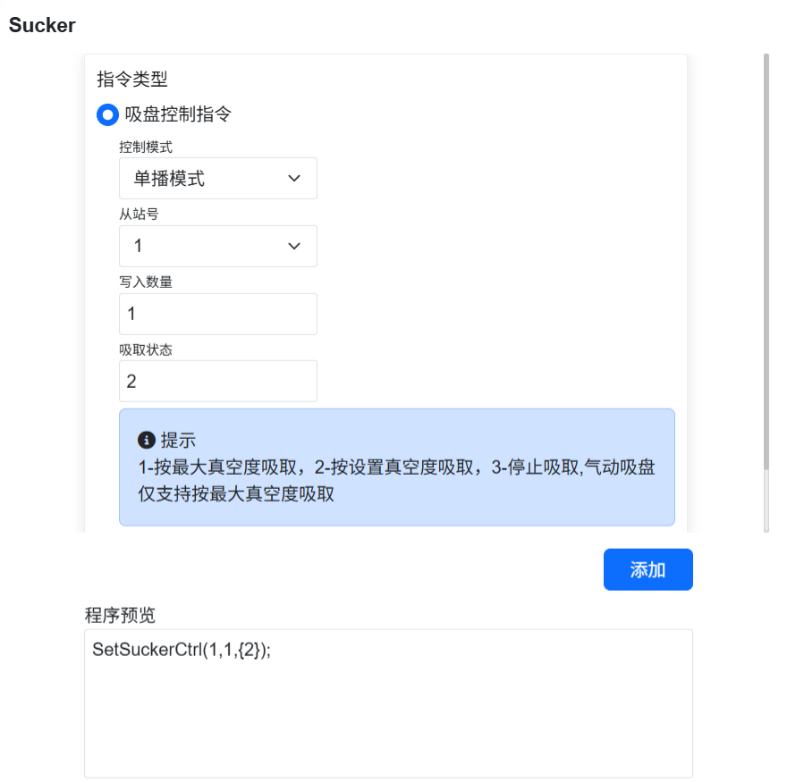

.. centered:: 圖表 8.17‑1 機器人與CNC的FOCAS通信拓撲圖

目前控制箱基於FOCAS通信的CNC功能包支持的機床控制、狀態反饋的功能如表所示。

.. centered:: 表格 8.17-1 基於FOCAS通信的CNC功能包支持的功能表

.. list-table:: 
   :widths: 15 40 100
   :header-rows: 0
   :align: center
   :class: sheet-center

   * - **序號**
     - **功能名稱**
     - **說明**
   * - 1
     - 機床類型
     - 狀態反饋
   * - 2
     - FOCAS通信狀態
     - 狀態反饋
   * - 3
     - 自動模式運行
     - 控制、狀態反饋
   * - 4
     - 報警狀態
     - 狀態反饋
   * - 5
     - 安全門
     - 狀態反饋
   * - 6
     - 卡盤
     - 控制、狀態反饋
   * - 7
     - 急停
     - 控制、狀態反饋
  
相關操作說明
~~~~~~~~~~~~~~~~~~~~~~

FOCAS通信建立
+++++++++++++++++++

FOCAS通信是基於乙太網，需要將機器人、CNC機床、PC端電腦組成局域網實現物理鏈路銜接，並通過機器人開放協議實現最終FOCAS的通信建立。

網絡配置
*************************

**Step1**：首先將PC端電腦IP地址改為和機器人控制箱同一網段，機器人控制箱的IP地址為"192.168.58.2"。

如果沒有交換機組網，可以用機器人控制箱上自帶的兩個網口進行組網，操作如下：登錄機器人的WebAPP，在系統設置->通用設置->網絡設置中，設置網口0的IP為：192.168.58.2；網口1的IP為192.168.57.2。同時設置WebAPP為網口0，WebRecovery為網口1，如圖所示。完成全部設置後點擊設置網絡。

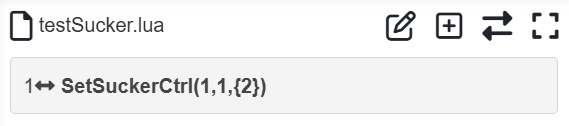

.. centered:: 圖表 8.17‑2 機器人網絡配置圖

**Step2**：接著重啟控制箱，並通過網卡0網口與PC端相連，登錄機器人WebApp。同時配置需要通信的CNC機床的IP地址和PC端、機器人控制箱為同一個網段，即192.168.58.xx，同時機床的端口改為8193。即可完成所有網絡配置。

開放協議文件配置
*************************

**Step1**：隨後進行外設開放協議配置，首先需要新建一個以CtrlDev_CNC命名開頭的lua文件作為建立FOCAS通信的開放協議文件，如CtrlDev_CNC_demo.lua。

該文件中需要設置開放協議ID，並通過CNCComSet函數與CNC建立或斷開連接。其中CNCComSet函數參數說明見下表。實例代碼如下。

.. centered:: 表格 8.17-2 CNCComSet函數參數說明表

.. list-table:: 
   :widths: 15 40 100
   :header-rows: 0
   :align: center
   :class: sheet-center

   * - **序號**
     - **功能名稱**
     - **說明**
   * - 1
     - 機床廠商
     - 0-無效 1-機床（FOCAS）
   * - 2
     - 通信指令
     - 1-建立連接 1001-斷開連接
   * - 3
     - 機床IP地址
     - --
   * - 4
     - 機床端口號
     - --

FOCAS通信建立連接開放協議實例代碼：

.. code-block:: console
    :linenos:

    local id = 1      --開放LUA協議ID
    --FOCAS斷開連接
    CNCComSet(1, 1001, '192.168.57.100', 8193)
    sleep_ms(1000)
    --FOCAS建立連接
    CNCComSet(1, 1, '192.168.57.100', 8193)
    sleep_ms(1000)
    while(1) do
    sleep_ms(5000)
    end

**Step2**：完成開放協議lua文件的編寫，打開WebAPP，選擇“初始設置”->“外設”->“控制箱”->“外設開放協議”，選擇剛剛的CtrlDev_CNC_demo.lua文件並上傳，選擇文件中設置的ID，下拉選擇上傳的開放協議文件並點擊配置。如圖所示。

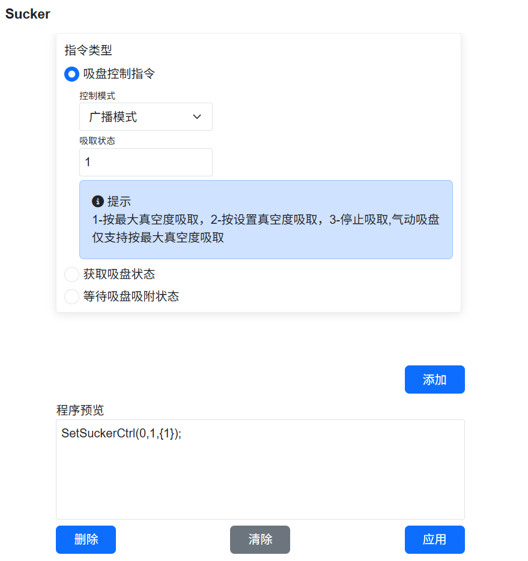

.. centered:: 圖表 8.17‑3 開放協議文件上傳與配置

**Step3**：隨後檢查所有通信鏈路正常，並確認CNC機床處於開機狀態，點擊開放協議中的連接按鈕，通過右側的狀態反饋欄中的CNC->FOCAS通信狀態可確認是否與機床建立連接（紅燈：建立連接；灰色：斷開連接），如圖所示。

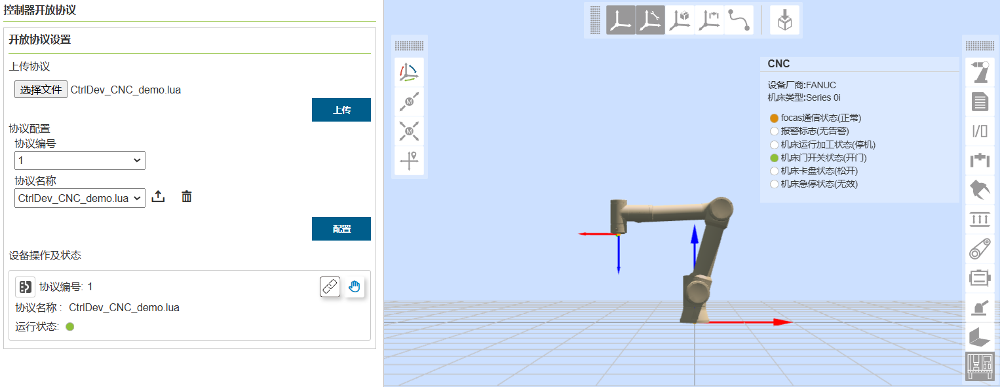

.. centered:: 圖表 8.17‑4 FOCAS通信連接建立 

CNC狀態反饋說明
++++++++++++++++++++++++++

CNC機床的狀態反饋顯示在WebAPP最右側的外設狀態反饋的CNC外形圖標，如圖所示。點擊則會顯示當前機床全部的狀態，包括設備廠商、機床類型、FOCAS通信狀態、報警標誌、機床運行加工狀態、機床門開關狀態、機床卡盤狀態、機床急停狀態。

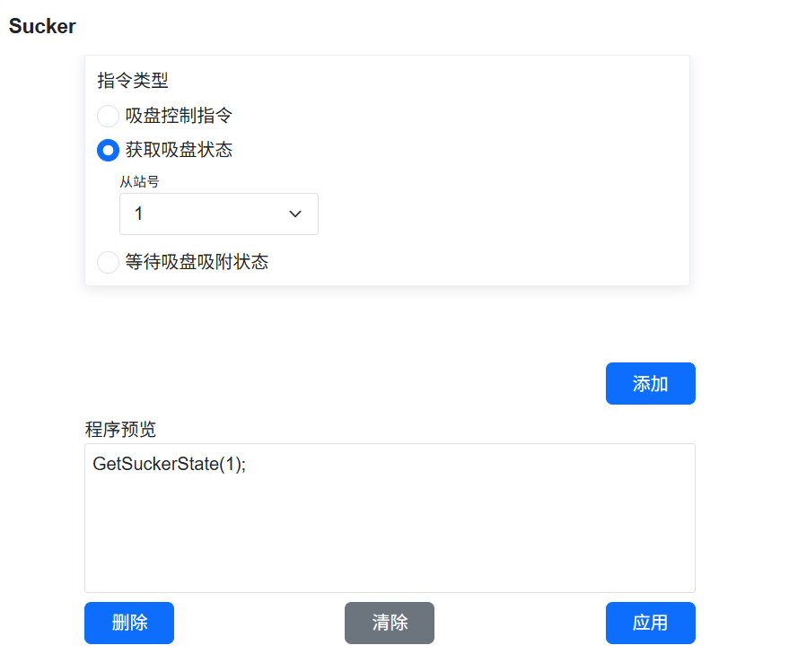

.. centered:: 圖表 8.17‑5 CNC狀態反饋欄 

CNC各狀態反饋顯示燈的含義如下表所示。

.. centered:: 表格 8.17-3 CNC狀態反饋圖標燈含義表

.. list-table:: 
   :widths: 15 40 100
   :header-rows: 0
   :align: center
   :class: sheet-center

   * - **序號**
     - **功能名稱**
     - **說明**
   * - 1
     - FOCAS通信狀態
     - 灰色-通信斷開 紅色-通信正常
   * - 2
     - 報警標誌
     - 灰色-無警告 紅色-存在警告
   * - 3
     - 機床運行加工狀態
     - 灰色-停機 綠色-運行中
   * - 4
     - 機床門開關狀態
     - 灰色-關門 綠色-開門
   * - 5
     - 機床卡盤狀態
     - 灰色-鬆開 綠色-夾緊
   * - 6
     - 機床急停狀態
     - 灰色-急停無效 綠色-急停生效

CNC狀態反饋說明
++++++++++++++++++++++++++

CNC機床的控制位於外設開放協議中，當完成FOCAS通信連接後，點擊所配置的外設開放協議右上角，則可打開CNC的控制頁面，如圖所示。

.. note:: 其中控制按鈕包括門控制（開門、關門），卡盤控制（夾緊、鬆開），啟停控制（運行、停止），急停控制（急停、無效）。所有的控制信號都是邊沿信號觸發控制。

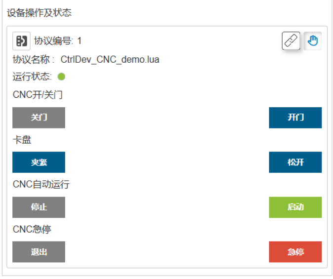

.. centered:: 圖表 8.17‑6 CNC控制頁面 

CNC示教程序說明
++++++++++++++++++++++++++

CNC功能包支持在示教程序中調用控制指令，並實時獲取機床狀態，依次打開“示教程序”->“程序編程”->“外設指令”->“CNC”，可以看到全部支持的CNC示教指令，如圖所示。

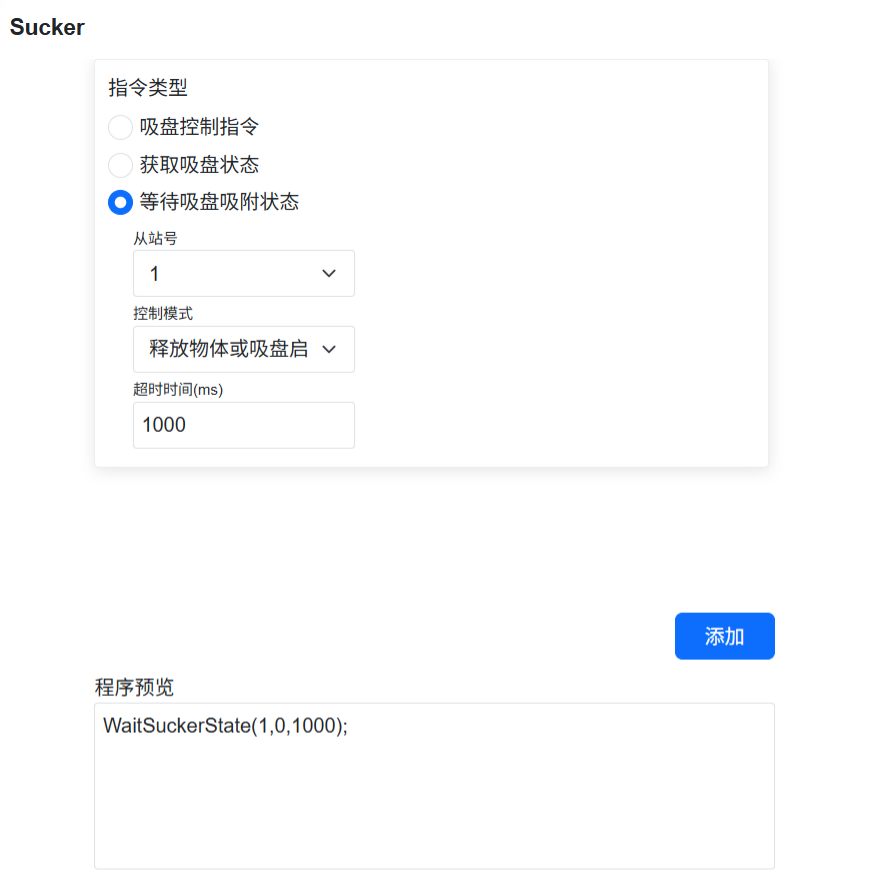

.. centered:: 圖表 8.17‑7 CNC示教指令 

.. note:: 其中控制指令與CNC控制一一對應，均為邊沿信號生效，即啟動命令執行後一定要執行停機後，下一次啟動命令才會生效。

“機床當前狀態獲取”為lua函數，該函數返回值為9個參數，含義如下表所示。

.. centered:: 表格 8.17-4 “機床當前狀態獲取”返回值說明表

.. list-table:: 
   :widths: 15 40 100
   :header-rows: 0
   :align: center
   :class: sheet-center

   * - **序號**
     - **名稱**
     - **含義**
   * - 1
     - 設備廠商
     - 0-無效 1-其他-預留
   * - 2
     - FOCAS通信狀態
     - 0-通信正常 其他-通信斷開
   * - 3
     - 機床型號(string)
     - '15' : Series 150/150i '16' : Series 160/160i '18' : Series 180/180i '21' : Series 210/210i '30' : Series 300i '31' : Series 310i '32' : Series 320i '0' : Series 0i 
   * - 4
     - 機床型號(string)
     - '15' : Series 150/150i '16' : Series 160/160i '18' : Series 180/180i '21' : Series 210/210i '30' : Series 300i '31' : Series 310i '32' : Series 320i '0' : Series 0i 
   * - 5
     - 機床運行狀態
     - 0-停機 1-運行
   * - 6
     - 機床急停狀態
     - 0-急停生效 其他-急停無效
   * - 7
     - 機床告警狀態
     - 0-無警告 其他-存在警告
   * - 8
     - 機床門狀態
     - 0-開門 1-關門
   * - 9
     - 機床卡盤狀態
     - 0-鬆開 1-夾緊

以機器人上下料流程為例編寫了lua示教程序示例，該示例程序包括了控制CNC關門、開門、運行、停機、卡盤鬆開、卡盤夾緊，並通過獲取CNC當前狀態作為判斷條件，設置機器人在安全點、取料點、放料點三個點運動，如代碼所示。

機器人與CNC協同運動示教lua程序實例：

.. code-block:: console
    :linenos:

     while (1) do 
        CNCDoorClose()
        CNCWorkStart()
        WaitMs(1000)
        t1,t2,t3,t4,t5,t6,t7,t8,t9=CNCGetStatus()
        if t5 == 1 then
            PTP(CNCsafe,100,-1,0)
        else
            CNCWorkStop()
            CNCDoorOpen()
            WaitMs(1000)
            PTP(CNCg1,100,-1,0)
            WaitMs(1000)
            CNCChuckOpen()
            PTP(CNCg2,100,-1,0)
            PTP(CNCsafe,100,-1,0)
        end
        t1,t2,t3,t4,t5,t6,t7,t8,t9=CNCGetStatus()
        if t8 == 0 then
            if t5 == 0 then
                PTP(CNCg2,100,-1,0)
                 PTP(CNCg1,100,-1,0)
                 CNCChuckFastening()
                 WaitMs(1000)
                 PTP(CNCsafe,100,-1,0)
             end   
         end
    end

機器人傳送帶追蹤系統構成
-------------------------------------------------

傳送帶編碼器數據通信連接方式
~~~~~~~~~~~~~~~~~~~~~~~~~~~~~~~~~~~~~~~~~~~~~~~~~~~~~~~~~~~~~~~~~~~~~~~~~

為了在機床加工中實現自動化上下料流程，開發了基於FOCAS通信的CNC功能包，可實現協作機器人與CNC機床的通信交互與協同運動。

如圖所示，FOCAS通信是基於乙太網的，通過網線連接機器人控制箱網口與機床內嵌網口，即可建立機器人與機床的FOCAS通信，實現在機器人端的CNC控制和機床狀態監控。

.. figure:: robot_peripherals/243.png
   :align: center
   :width: 6in

.. centered:: 圖表 8.18‑1 機器人傳送帶追蹤系統構成拓撲圖

系統中，(a)為計算機，(b)為機器人及其控制箱，(c)為傳送帶、光電傳感器及編碼器組成的傳送帶系統。機器人控制箱通過數字IO通信與光電傳感器、傳送帶相連，通過RS485與傳送帶編碼器相連。

傳送帶配置
~~~~~~~~~~~~~~~~~~~~~~~~~~~~~~~~~~~~

進入機器人Web頁面「基礎設置」、「外設」、「追蹤」下屬的「傳送帶」功能配置界面進行傳送帶追蹤功能屬性配置。

.. figure:: robot_peripherals/244.png
   :align: center
   :width: 6in

.. centered:: 圖表 8.18‑2 傳送帶追蹤配置頁面

在傳送帶追蹤配置頁面，點擊「傳送帶I/O一鍵配置」按鈕一鍵配置傳送帶物理連接。
之後在「參數配置」下的「功能選擇」下拉框中選擇「追蹤運動」，再後配置編碼器屬性、追蹤工件坐標系工件軸、視覺搭配，並在「追蹤類型」下拉框中選中「追檢運動」，此時可輸入追蹤起始距離以及追蹤終止距離。
追蹤起始距離：觸發追蹤信號後傳送帶運行到設置距離後機器人開始動作，當設置為-1時為自動觸發。
追蹤終止距離：機器人開始動作後，跟隨傳送帶同步運動的最遠距離。

追蹤坐標系配置
~~~~~~~~~~~~~~~~~~~~~~~~~~~~~~~~~~~~~~~~~~~~~~~

追蹤運動使用工件坐標系作為傳送帶坐標系，因此需要設置工件坐標系。

點擊「初始設置」、「基礎」，在「坐標系」下選擇「工件坐標系」，點擊選擇「wobjcoord0」以外的工件坐標系進行標定，標定方式此處不贅述。

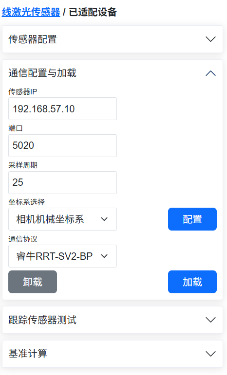

.. centered:: 圖表 8.18‑3 追蹤坐標系設置

傳送帶追蹤追檢運動功能
~~~~~~~~~~~~~~~~~~~~~~~~~~~~~~~~~~~~~~~~~~~~~~~~~~~~~~~~~

追檢運動屬於傳送帶追蹤運動的一種，與追蹤運動相比追檢運動的運動點示教無需在工件坐標系上方進行示教運動，可以在工件坐標系任意位置進行示教，再通過「追蹤起始距離」的參數進行末端與傳送帶同步運動，是一種比較靈活的追蹤方式。

傳送帶追蹤追檢運動功能簡介
+++++++++++++++++++++++++++++++++++++++++++++++++++++++++++++

以下給出追檢運動示例以介紹運動特性。

.. figure:: robot_peripherals/246.png
   :align: center
   :width: 6in

.. centered:: 圖表 8.18‑4 傳送帶追蹤追檢運動示教示例

其中，以x為工件坐標中傳送帶運動的方向，a為傳送帶平面，b為抓取目標工件，c為光電傳感器，d為追蹤起始距離，e為追蹤終止距離。P1到P4為示教路點及其依次順序，P2到P3為相同路點，包含夾爪運動。

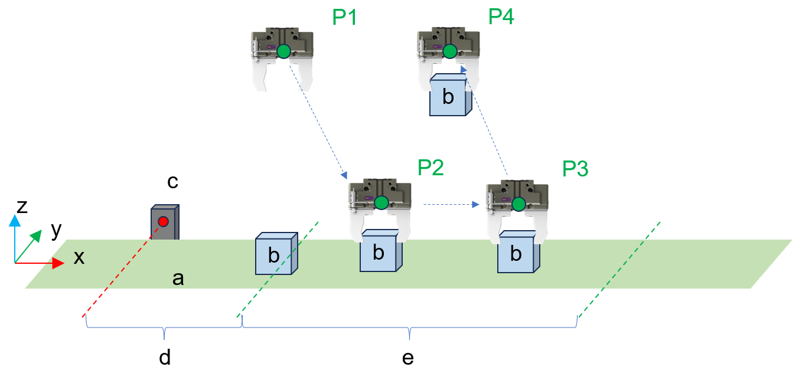

.. centered:: 圖表 8.18‑5 傳送帶追蹤追檢運動示教後執行示例

當上述示教程序開始運行，工件觸發光電開關信號後，機器人會等待目標運動到P1下方後開始追蹤運動，機器人夾爪將如上圖所示軌跡運動。

追檢運動程序示教
+++++++++++++++++++++++++++++++++++++++++++++++

追檢運動程序邏輯與追蹤運動邏輯基本一致，包含獲取觸發信號、獲取傳送帶數據以及開始追蹤運動部分。

**步驟1**：點擊「示教程序」，「程序編程」，選擇並點擊「外設指令」下屬的「傳送帶」按鈕進入傳送帶指令配置頁面。

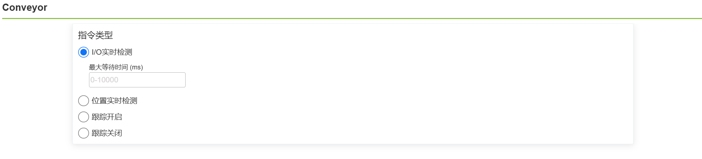

.. centered:: 圖表 8.18‑6 I/O實時監測指令

**步驟2**：點擊「I/O實時監測」並設置「最大等待示教(ms)」，實時檢測追蹤觸發信號。點擊「添加」與「應用」按鈕將指令添加到程序中。

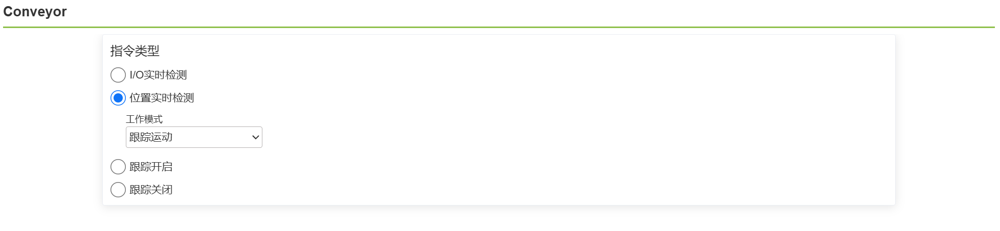

.. centered:: 圖表 8.18‑7 位置實時檢測指令

**步驟3**：點擊「位置實時檢測」並將工作模式選定「追蹤運動」。點擊「添加」與「應用」按鈕將指令添加到程序中。

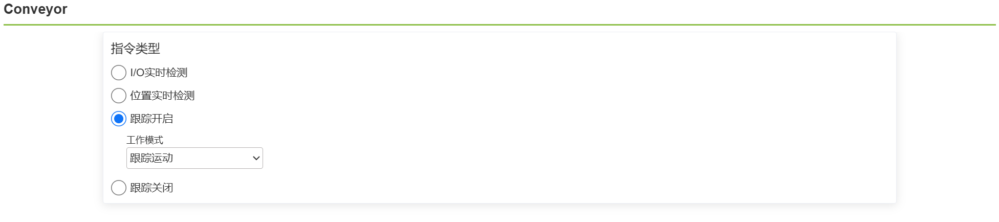

.. centered:: 圖表 8.18‑8 追蹤開啟指令

**步驟4**：點擊「追蹤開啟」並工作模式選定「追蹤運動」。點擊「添加」與「應用」按鈕將指令添加到程序中。

**步驟5**：示教在追蹤開啟後的笛卡爾空間運動以及夾爪外設運動，運動過程中將保持與傳送帶的追蹤同步運動。

.. centered:: 圖表 8.18‑9 追蹤關閉指令

**步驟6**：點擊「追蹤關閉」並點擊「添加」與「應用」按鈕將指令添加到程序中。

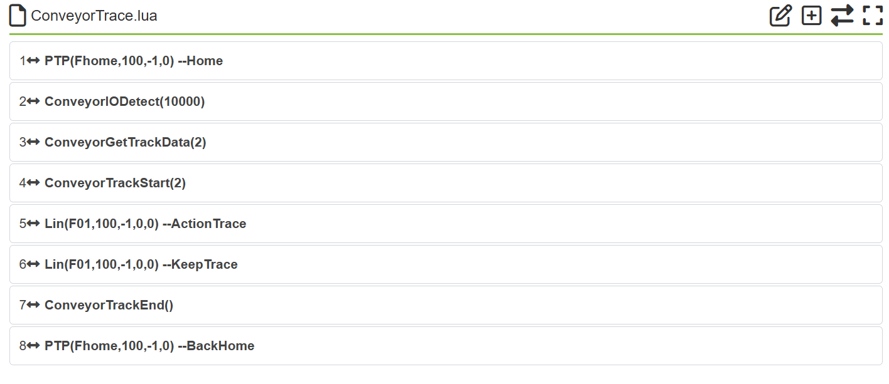

.. centered:: 圖表 8.18‑10 一段典型的傳送帶程序追蹤運動程序

當連續示教兩個相同的追蹤運動目標（可包含偏置距離），機器人運動將阻塞在該目標位置，實現持續同步追蹤直到追蹤距離達到終止追蹤距離為止。

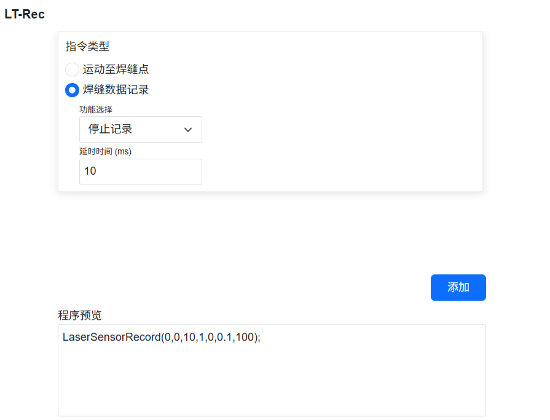

.. centered:: 圖表 8.18‑11 一段典型的傳送帶阻塞追蹤抓取運動程序

當連續示教兩個相同的追蹤運動目標（可包含偏置距離），同時中間插入夾爪運動時，機器人將在該目標位置位置持續追蹤傳送帶直至夾爪運動完成，實現阻塞追蹤抓取。