外設
=============

.. toctree::
  :maxdepth: 5

末端Lua自定義開放協議
-------------------------

概述
~~~~~~~~

末端Lua自定義開放協議支援力感測器、夾爪和焊接手柄使用，同時支援力感測器和夾爪配合使用。

操作步驟
~~~~~~~~~~~

**Step1**：進入系統設定->關於->韌體升級介面，選擇末端韌體.bin檔案，升級末端韌體。

.. important::
   需先確認末端韌體版本 FV2.010.06及其之後軟體版本是不是符合，若版本不符合，對應軟體韌體升級，否則不需要升級韌體。

   上傳末端韌體升級包之前，需要先將機器人去使能，再進入boot模式。

.. figure:: robot_peripherals/001.png
   :align: center
   :width: 6in

.. centered:: 圖表 8.1‑1 升級末端韌體

**Step2**：進入外設->夾爪/力感測器/焊接手柄的內容介面，點擊“自定義協議”卡片進入介面，上傳Lua末端開放協議，選擇需要上傳的Lua末端開放協議，進行上傳操作。

.. important::
  上傳末端協議之前，需要進入boot模式。同時，檔案名需要以AXLE_LUA_開頭命名。

.. figure:: robot_peripherals/002.png
   :align: center
   :width: 4in

.. centered:: 圖表 8.1‑2 上傳Lua末端開放協議

**Step3**：配置末端通訊參數，通訊參數包含鮑率、資料位、停止位等，配置完成後，點擊“配置”按鈕。

.. figure:: robot_peripherals/003.png
   :align: center
   :width: 4in

.. centered:: 圖表 8.1‑3 配置末端通訊參數

末端通訊詳細參數如下：

- **鮑率**：支援1-9600，2-14400，3-19200，4-38400，5-56000，6-67600，7-115200，8-128000；末端Rs485驅動晶片為低速485，鮑率不能>200k；
- **資料位**：資料位支援（8,9），目前常用為8；
- **停止位**：1-1，2-0.5，3-2，4-1.5，目前常用為1；
- **校驗位**：0-None，1-Odd，2-Even,目前常用為0；
- **超時時間**：1~1000ms，此值需要結合外設搭配設置合理的時間參數；
- **超時次數**：1~10，主要進行超時重發，減少偶發異常提高使用者體驗；
- **週期性指令時間間隔**：1~1000ms，主要用於週期性指令每次下發的時間間隔；

**Step4**：末端Lua啟用，點擊“開啟”按鈕。

.. figure:: robot_peripherals/004.png
   :align: center
   :width: 4in

.. centered:: 圖表 8.1‑4 末端Lua啟用

當Lua檔案發生異常時，提示“末端Lua檔案異常”警告，可進行“不恢復/恢復”處理。關閉Lua啟用按鈕，警告提示關閉。

.. figure:: robot_peripherals/005.png
   :align: center
   :width: 4in

.. centered:: 圖表 8.1‑5 Lua檔案異常

當設備類型為夾爪時，可以進行狀態監控。

**打開“狀態監控”**：右側夾爪狀態欄展示即時顯示夾爪執行速度、力矩、位置等狀態資訊。

**關閉“狀態監控”**：右側夾爪資料狀態欄關閉。

.. figure:: robot_peripherals/006.png
   :align: center
   :width: 6in

.. centered:: 圖表 8.1‑6 狀態監控

夾爪
-------------------

在“初始設定”->“外設”->“夾爪”介面中，目前可以透過已配適設備和末端Lua自定義開放協議使用夾爪。

已配適設備
~~~~~~~~~~~~~~~~~~~

**Step1**：點擊“已配適設備”進入末端外設配置介面。夾爪的配置資訊分為夾爪廠商、夾爪類型、軟體版本和掛載位置，使用者可根據具體的生產需求來配置相應的夾爪資訊。若使用者需要更改配置，可先選擇相應的夾爪編號，點擊“清除”按鈕，來清除相應的按鈕，並重新根據需求配置；

.. figure:: robot_peripherals/007.png
   :align: center
   :width: 4in

.. centered:: 圖表 8.2‑1 夾爪配置

.. important::
	點擊清除配置前，相應的夾爪應處於未啟動狀態。

**Step2**：夾爪配置完成後，使用者可在頁面下方的夾爪資訊表中查看相應的夾爪資訊，若發現配置錯誤，可點擊“清除”按鈕，重新配置夾爪；

.. figure:: robot_peripherals/008.png
   :align: center
   :width: 4in

.. centered:: 圖表 8.2‑2 夾爪配置資訊

**Step3**：選擇配置完成的夾爪，點擊“復位”按鈕，頁面彈出命令發送成功後，再點擊“啟動”按鈕，可查看夾爪資訊表中的啟動狀態，來判斷是否啟動成功；

.. important:
	啟動夾爪時，夾爪不可有夾持物。

**Step4**：程式示教命令介面中選擇“Gripper”命令。在夾爪命令介面中，使用者可以選擇想要控制的夾爪編號（已經完成配置並且被啟動的夾爪），設定相應的開閉狀態、開閉速度、開閉力矩已經等待夾爪動作的最大時間。完成設定後點擊加入應用即可。此外還可以加入夾爪啟動和復位指令，以便於在執行程式時去啟動/復位夾爪。

.. figure:: robot_peripherals/009.png
   :align: center
   :width: 6in

.. centered:: 圖表 8.2‑3 夾爪指令編輯

夾爪程式示教
+++++++++++++++++

.. list-table::
   :widths: 15 40 100
   :header-rows: 1

   * - 序號
     - 指令格式
     - 註釋
   * - 1
     - PTP(template2,100,-1,0)
     - #等待夾取點
   * - 2
     - PTP(template1,100,-1,0)
     - #夾取點
   * - 3
     - MoveGripper(1,255,255,0,1000,0)
     - #夾爪閉合
   * - 4
     - PTP(template2,100,-1,0)
     - /
   * - 5
     - PTP(template3,100,-1,0)
     - #等待放件點
   * - 6
     - PTP(template3,100,-1,0)
     - #放件點
   * - 7
     - MoveGripper(1,0,255,0,1000,0)
     - #夾爪開啟

自定義開放協議
~~~~~~~~~~~~~~~~~~~~~~

夾爪自定義協議上傳步驟參考末端Lua自定義開放協議內容。

**Step1**：啟用夾爪->選擇夾爪ID->勾選夾爪配適的功能碼->點擊配置，已配置設備中顯示夾爪的ID及功能碼。

.. figure:: robot_peripherals/010.png
   :align: center
   :width: 4in

.. centered:: 圖表 8.2‑4 配置夾爪

.. note::
  由於末端開放功能目前對夾爪設備地址支援範圍為1~8，使用前應透過夾爪廠商的上位機調整夾爪設備地址。

  勾選功能碼應透過夾爪廠商提供的產品說明書查詢夾爪配適的功能，且應與末端Lua功能碼保持對應，具體請查詢《末端Lua配適夾爪說明手冊》。

**Step2**：選擇夾爪ID->復位->啟動，夾爪進行一次初始化，具體初始化情況請參考夾爪廠商提供的產品說明書。

.. figure:: robot_peripherals/011.png
   :align: center
   :width: 4in

.. centered:: 圖表 8.2‑5 啟動夾爪

**Step3**：進入示教程式->程式編輯->加入夾爪運動指令。

.. figure:: robot_peripherals/012.png
   :align: center
   :width: 6in

.. centered:: 圖表 8.2‑6 加入夾爪運動指令

.. figure:: robot_peripherals/013.png
   :align: center
   :width: 6in

.. centered:: 圖表 8.2‑7 夾爪運動指令範例

多個夾爪
+++++++++++

啟動和運動控制參考夾爪步驟。

.. figure:: robot_peripherals/014.png
   :align: center
   :width: 4in

.. centered:: 圖表 8.2‑8 配置多個夾爪

.. note:: 由於末端開放功能目前對夾爪設備地址支援範圍為1~8，使用前應透過夾爪廠商的上位機調整夾爪設備地址。

旋轉夾爪
+++++++++++

**Step1**：啟用夾爪->選擇夾爪ID->勾選夾爪配適的功能碼->點擊配置，已配置設備中顯示夾爪的ID及功能碼。

.. figure:: robot_peripherals/010.png
   :align: center
   :width: 4in

.. centered:: 圖表 8.2‑9 配置夾爪及功能碼

.. note:: 勾選功能碼應透過夾爪廠商提供的產品說明書查詢夾爪配適的功能，且應與末端Lua功能碼保持對應，具體請查詢《FR05-末端全外設協議-V2.5-20241101.xlsx》。

**Step2**：選擇夾爪ID->復位->啟動，夾爪進行一次初始化，具體初始化情況請參考夾爪廠商提供的產品說明書。

.. figure:: robot_peripherals/011.png
   :align: center
   :width: 4in

.. centered:: 圖表 8.2‑10 啟動夾爪

**Step3**：進入示教程式->程式編輯->加入夾爪運動指令。

.. figure:: robot_peripherals/012.png
   :align: center
   :width: 6in

.. centered:: 圖表 8.2‑11 加入旋轉夾爪運動指令

.. figure:: robot_peripherals/015.png
   :align: center
   :width: 6in

.. centered:: 圖表 8.2‑12 旋轉夾爪運動指令範例

.. note:: 旋轉圈數為絕對旋轉圈數，正轉圈數最大為90圈，反轉圈數最大為90圈，旋轉後需要進行復位處理。

力感測器
-------------------------

在“初始設定”->“外設”->“力感測器”介面中，目前可以透過已配適設備和末端Lua自定義開放協議使用力感測器。

已配適設備
~~~~~~~~~~~~~~~~~~~~~~~~~~~

**Step1**：點擊“已配適設備”進入末端外設配置介面。

力感測器配置資訊分為廠商、類型、軟體版本和掛載位置，使用者可根據具體的生產需求來配置相應的力感測器資訊。若使用者需要更改配置，可先選擇相應的編號，點擊“清除”按鈕，來清除相應的資訊，並重新根據需求配置；

.. figure:: robot_peripherals/016.png
   :align: center
   :width: 4in

.. centered:: 圖表 8.3‑1 力感測器配置

.. important::
	點擊清除配置前，相應的感測器應處於未啟動狀態。

**Step2**：力感測器配置完成後，使用者可在頁面下方的資訊表中查看相應的力感測器資訊，若發現配置錯誤，可點擊“清除”按鈕，重新配置。

.. figure:: robot_peripherals/017.png
   :align: center
   :width: 4in

.. centered:: 圖表 8.3‑2 力感測器配置資訊

**Step3**：選擇配置完成的力感測器編號，點擊“復位”按鈕，頁面彈出命令發送成功後，再點擊“啟動”按鈕，可查看力感測器資訊表中的啟動狀態，來判斷是否啟動成功；此外，力感測器會有初始值，使用者根據使用需求選擇“零點校正”和“去除零點”。力感測器零點校正需要確保力感測器水平垂直向下，且機器人未配置負載。

**Step4**：力感測器配置完成後，需要配置感測器類型工具座標系，可根據感測器與末端工具中心的距離直接輸入感測器工具座標系值並應用。

感測器負載辨識
~~~~~~~~~~~~~~~~~~~~~~~~

在“初始設定”->“基礎”->“負載”選單欄下，點擊“感測器辨識”，進入感測器負載辨識介面。

特定姿態辨識：清除末端負載資料，配置好力感測器後，建立感測器座標系，將機器人末端姿態調整為垂直向下，進行“零點校正”後安裝末端負載。首先選擇對應感測器工具座標系，調整機器人，使得感測器及工具垂直向下，記錄資料，計算質量。接著，調整機器人3個不同姿態，分別記錄三組資料，計算出質心，確認無誤後點擊應用。

**動態辨識**：清除末端負載資料，配置好力感測器後，建立感測器座標系，將機器人末端姿態調整為垂直向下，進行“零點校正”後安裝末端負載。點擊“辨識開啟”，拖動機器人進行運動，接著點擊“辨識關閉”，即可自動將負載結果應用到機器人中。

**自動校零**：感測器記錄初始位置後，可自動校零。

.. figure:: robot_peripherals/018.png
   :align: center
   :width: 4in

.. centered:: 圖表 8.3‑3 感測器負載辨識

力感測器輔助拖動
~~~~~~~~~~~~~~~~~~~~~~~

配置好感測器後，可以搭配感測器對拖動機器人進行更好的輔助。第一次使用時可以按照右側圖片的資料進行配置，應用完成後，此時無需進入拖動模式，直接對末端力感測器進行拖拽，即可控制機器人在固定姿態進行移動。（如下圖中的資料為參考標準）

.. figure:: robot_peripherals/019.png
   :align: center
   :width: 4in

.. centered:: 圖表 8.3‑4 力/扭矩感測器拖動鎖定

.. note::
   奇異點策略是力感測器輔助鎖定下開發的奇異點穿越及規避功能。

   奇異點規避策略是預設功能選項，開啟輔助拖動後即預設開啟規避功能，奇異點規避是當機器人處於奇異構型時，施加虛擬力使機器人遠離奇異構型的功能。

   奇異構型：

   **肘奇異**：旋轉軸2、3、4處於同一平面內，此時肘關節處於完全伸展或完全收縮，由於FR機器人機械限位，完全收縮這種形位機器人無法到達。

   **腕奇異**：旋轉軸4、6平行，此時由於FR機器人機械限位，這種形位機器人無法到達。

   **肩奇異**：腕中心點位於旋轉軸1、2所構成的平面。

   奇異點穿越功能，選擇“奇異點策略”為“穿越”並應用，當機器人檢測到當前位姿處於奇異構型，自動切換為電流環拖動模式，當檢測退出奇異構型，拖動模式切換為力感測器輔助拖動繼續運動。

**自適應選擇**：在需要裝配時開啟，開啟後拖動變重；

**慣性參數**：調節拖動過程中的手感，需在技術人員指導下謹慎操作。

**阻尼參數**：

-  平動方向：建議設置參數在[100-200]之間；

-  轉動方向：建議設置參數在[3-10]之間，其中RZ方向設置範圍在[0.1-5]；

-  效果：借助感測器拖動時，增大阻尼會導致拖動困難，減小阻尼會導致拖動機器人過於輕鬆（建議不要太小）；

-  阻尼參數整體範圍：平動XYZ：[100-1000]；轉動RX、RY：[3-50],RZ:[2-10]；

-  最大拖動力為50，最大拖動速度為180。

**剛度參數**：均設為0；

**拖動力閾值**：平動XYZ為[5-10]；轉動RX、RY、RZ為[0.5-5]；

.. important::
   透過加大平動方向XYZ或轉動方向RX、RY、RZ的力閾值來實現鎖定的方式。

力/扭矩感測器碰撞檢測
~~~~~~~~~~~~~~~~~~~~~~~~~

指令說明：“FT_Guard”指令為碰撞檢測指令。選擇對應的感測器座標系，勾選生效的力矩方向檢測，設定當前值，碰撞最大閾值和碰撞最小閾值三項，碰撞檢測條件正常範圍為（當前值-最小閾值，當前值+最大閾值），將“開啟”和“關閉”指令加入到程式中在。

.. figure:: robot_peripherals/020.png
   :align: center
   :width: 6in

.. centered:: 圖表 8.3‑5 FT_Guard指令編輯

程式範例：

.. list-table::
   :widths: 50 80 80
   :header-rows: 0
   :align: center

   * - **序號**
     - **指令格式**
     - **註釋**

   * - 1
     - FT_Guard(1,1,1,1,1,0,0,0,5,0,0,0,0,0,10,0,0,0,0,0,5,0,0,0,0,0)
     - #力/矩碰撞檢測開啟

   * - 2
     - PTP(template1,100,-1,0)
     - #運動指令

   * - 3
     - FT_Guard(0,1,1,1,1,0,0,0,5,0,0,0,0,0,10,0,0,0,0,0,5,0,0,0,0,0)
     - #力/矩碰撞檢測關閉

力/扭矩感測器力控運動
~~~~~~~~~~~~~~~~~~~~~~~~

指令說明：“FT_Control”指令為力控運動指令，可以使機器人在設定力的附近運動，常用於打磨場景中。選擇對應的感測器座標系，勾選生效的力矩方向檢測，設定檢測閾值，以及各個方向上PID比例係數(一般設置p為0.001)，設定最大調整距離（對應X,Y,Z）和最大調整角度（對應RX,RY,RZ），將“開啟”和“關閉”指令加入到程式中在。

.. figure:: robot_peripherals/021.png
   :align: center
   :width: 6in

.. figure:: robot_peripherals/022.png
   :align: center
   :width: 6in

.. centered:: 圖表 8.3‑6 FT_Control指令編輯

程式範例：

.. list-table::
   :widths: 50 80 80
   :header-rows: 0
   :align: center

   * - **序號**
     - **指令格式**
     - **註釋**

   * - 1
     - FT_Control(1,11,1,0,1,0,0,0,10,0,5,0,0,0,0.001,0,0,0,0,0,0,0,0,10,5)
     - #力/矩運動控制開啟

   * - 2
     - Lin(template3,100,-1,0,0)
     - #運動指令

   * - 3
     - FT_Control(0,11,1,0,1,0,0,0,10,0,5,0,0,0,0.001,0,0,0,0,0,0,0,10,5)
     - #力/矩運動控制關閉

力/扭矩感測器螺旋插入
~~~~~~~~~~~~~~~~~~~~~~~~~~

指令說明：“FT_Spiral”指令為螺旋線探索插入，一般用於圓柱軸的軸孔裝配動作。在執行動作之前，需要將機器人末端拖動至孔位的大致位置，根據當前場景，設定指令的參數，加入到程式中，執行後，機器人會以螺旋形的運動進行探索。

.. figure:: robot_peripherals/023.png
   :align: center
   :width: 6in

.. centered:: 圖表 8.3‑7 FT_Spiral指令編輯

程式範例：

.. list-table::
   :widths: 50 80 80
   :header-rows: 0
   :align: center

   * - **序號**
     - **指令格式**
     - **註釋**

   * - 1
     - FT_Control(1,10,0,0,1,0,0,0,0,0,5,0,0,0,0.0005,0,0,0,0,0,0,10,0)
     - #力/矩運動控制開啟

   * - 2
     - FT_SpiralSearch(0,0.7,0,60000,5)
     - #螺旋插入

   * - 3
     - FT_Control(0,10,0,0,1,0,0,0,0,0,5,0,0,0,0.0005,0,0,0,0,0,0,10,0)
     - #力/矩運動控制關閉

力/扭矩感測器旋轉插入
~~~~~~~~~~~~~~~~~~~~~~~~~

指令說明：“FT_Rot”指令為旋轉探索插入，一般用於承接螺旋線插入動作，用於鍵軸的軸孔裝配。在執行動作之前，需要將機器人末端移動至螺旋線探索找到的孔位或者完全對齊的示教孔位，根據當前場景，設定指令的參數，加入到程式中，執行後，機器人會以緩慢的旋轉進行探索。

.. figure:: robot_peripherals/024.png
   :align: center
   :width: 6in

.. centered:: 圖表 8.3‑8 FT_Rot指令編輯

程式範例：

.. list-table::
   :widths: 50 80 80
   :header-rows: 0
   :align: center

   * - **序號**
     - **指令格式**
     - **註釋**

   * - 1
     - FT_Control(1,10,0,0,1,0,0,0,0,0,5,0,0,0,0.0005,0,0,0,0,0,0,10,0)
     - #力/矩運動控制開啟

   * - 2
     - FT_RotInsertion(0,3,0,5,1,0,1)
     - #旋轉插入

   * - 3
     - FT_Control(0,10,0,0,1,0,0,0,0,0,5,0,0,0,0.0005,0,0,0,0,0,0,10,0)
     - #力/矩運動控制關閉

力/扭矩感測器直線插入
~~~~~~~~~~~~~~~~~~~~~~~~~

指令說明：“FT_Lin”指令為旋轉探索插入，一般用於承接螺旋線插入動作或旋轉插入動作，用於鍵軸的軸孔裝配。在執行動作之前，需要將機器人末端移動至螺旋線探索找到的孔位，旋轉插入動作結束的位置或者完全對齊的示教孔位，根據當前場景，設定指令的參數，加入到程式中，執行後，機器人會以設定的方向進行直線運動。

.. figure:: robot_peripherals/025.png
   :align: center
   :width: 6in

.. centered:: 圖表 8.3‑9 FT_Lin指令編輯

程式範例：

.. list-table::
   :widths: 50 80 80
   :header-rows: 0
   :align: center

   * - **序號**
     - **指令格式**
     - **註釋**

   * - 1
     - FT_Control(1,10,0,0,1,0,0,0,0,0,5,0,0,0,0.0005,0,0,0,0,0,0,10,0)
     - #力/矩運動控制開啟

   * - 2
     - FT LinInsertion(0,50,1,0,100,1)
     - #直線插入

   * - 3
     - FT_Control(0,10,0,0,1,0,0,0,0,0,5,0,0,0,0.0005,0,0,0,0,0,0,10,0)
     - #力/矩運動控制關閉

力/扭矩感測器表面定位
~~~~~~~~~~~~~~~~~~~~~~~~~~~

指令說明：“FT_FindSurface”指令為表面定位，一般用於尋找物體表面。根據當前場景，設定對應座標系，移動方向、移動軸、探索直線速度、探索直線加速度、最大探索距離、動作終止力閾值等參數，加入到程式中，執行程式，動作開始執行，機器人末端開始緩慢向表面所在方向移動。

.. figure:: robot_peripherals/026.png
   :align: center
   :width: 6in

.. centered:: 圖表 8.3‑10 FT_FindSurface指令編輯

程式範例：

.. list-table::
   :widths: 50 80 80
   :header-rows: 0
   :align: center

   * - **序號**
     - **指令格式**
     - **註釋**

   * - 1
     - PTP(1,30,-1,0)
     - #初始位置

   * - 2
     - FT FindSurface(0,1,3,1,0,100,5)
     - #平面定位

力/扭矩感測器中心定位
~~~~~~~~~~~~~~~~~~~~~~~

指令說明：“FT_CalCenter”指令為中心定位，一般用於尋找兩表面的中間平面表面。根據當前場景，設定對應座標系，移動方向、移動軸、探索直線速度、探索直線加速度、最大探索距離、動作終止力閾值等參數，分別尋找A平面和B平面，加入到程式中，執行程式，動作開始執行，機器人緩慢向表面A所在方向移動，定位到A面後，機器人緩慢向表面B所在方向移動，定位到B面後，即可算出中心平面位置。

.. figure:: robot_peripherals/027.png
   :align: center
   :width: 6in

.. centered:: 圖表 8.3‑11 FT_CalCenter指令編輯

程式範例：

.. list-table::
   :widths: 20 40 50
   :header-rows: 0
   :align: center

   * - **序號**
     - **指令格式**
     - **註釋**

   * - 1
     - PTP(1,30,-1,0)
     - #初始位置

   * - 2
     - FT_CalCenterStart()
     - #表面定位開始

   * - 3
     - FT_Control(1,10,0,0,1,0,0,0,0,0,-10,0,0,0,0.00001,0,0,0,0,0,0,100,0)
     - #力/矩運動控制開啟

   * - 4
     - FT_FindSurface(1,2,2,10,0,200,5)
     - #定位平面A

   * - 5
     - FT_Control(0,10,0,0,1,0,0,0,0,0,-10,0,0,0,0.00001,0,0,0,0,0,0,100,0)
     - #力/矩運動控制關閉

   * - 6
     - PTP(1,30,-1,0)
     - #初始位置

   * - 7
     - FT_Control(1,10,0,0,1,0,0,0,0,0,-10,0,0,0,0.00001,0,0,0,0,0,0,100,0)
     - #力/矩運動控制開啟

   * - 8
     - FT FindSurface(1,1,2,20,0,200,5)
     - #定位平面B

   * - 9
     - FT_Control(0,10,0,0,1,0,0,0,0,0,10,0,0,0,0.00001,0,0,0,0,0,0,100,0)
     - #力/矩運動控制關閉

   * - 10
     - pos={}
     - #定義陣列pos

   * - 11
     - pos = FT_CalCenterEnd()
     - #取得定位中心笛卡爾位姿

   * - 12
     - MoveCart(pos,GetActualTCPNum(),GetActualWObjNum(),30,10,100,-1,0)
     - #運動至定位的中心位置

自定義開放協議
~~~~~~~~~~~~~~~~

點擊“自定義協議”卡片進入介面，啟用力感測器，已配置設備中顯示力感測器。點擊進入FT介面，查詢力感測器資料。

.. figure:: robot_peripherals/028.png
   :align: center
   :width: 6in

.. centered:: 圖表 8.3‑12 啟用力感測器

焊接手柄
-------------------------------------------------------------

在「初始設定」->「外設」->「焊接手柄」介面中，目前可以透過已配適設備和末端Lua自訂開放協定使用焊接手柄。

已配適設備
~~~~~~~~~~~~~~~~~~~~~~

配置步驟
++++++++++++

**Step1**：點選「已配適設備」卡片進入已配適設備介面。配置資訊分為廠商、類型、軟體版本和掛載位置，使用者可根據具體的生產需求來配置相應的資訊。若使用者需要更改配置，可先選擇相應的廠商，點選「清除」按鈕，來清除相應的資訊，並重新根據需求配置；

.. figure:: robot_peripherals/029.png
   :align: center
   :width: 3in

.. centered:: 圖表 8.4‑1 焊接手柄已配適設備配置

.. important:: 
	點選清除配置前，相應的設備應處於未啟用狀態。

**Step2**：依序配置A-E鍵位和IO鍵。Smart Tool配置完成後，任務管理器內部維護每個按鈕對應的功能，當偵測到某按鈕被按下時，自動執行該按鈕對應功能項。

A-E鍵位功能：

- 新增程式
- 保持程式
- PTP
- Lin
- ARC
- 擺焊開始
- 擺焊結束
- IO端口

-  **運動指令**：選擇PTP、LIN、ARC運動指令時，需要輸入對應點速度。配置成功後，示教程式新增一條相關運動指令。配置ARC運動指令時，需先配置PTP/LIN指令。
  
-  **DO輸出**：選擇「DO輸出」時，顯示下拉式選單可選擇輸出DO0⁓DO7選項。

.. image:: robot_peripherals/030.png
   :width: 4in
   :align: center

.. centered:: 圖表 8.4‑2 A-E鍵位

IO鍵位功能：

-  **IO訊號配置**：下拉式選單可選擇DO0⁓DO7選項、CO0⁓CO7選項、End-DO0、End-DO1和擴充IO（Aux-DO0⁓Aux-DO127）；

-  **組合指令**：選擇「IO訊號」後，特定條件下顯示「焊機選擇」和「點速度」配置項，產生不同程式指令。

.. important::
   -  當IO訊號配置為DO0~DO7或CO0~CO7（未配置"起弧"）時，程式新增SetDO；此時隱藏「焊接選擇」和「點速度」。
   -  當IO訊號配置為End-DO0、End-DO1時，程式新增SetToolDO；此時隱藏「焊接選擇」和「點速度」。
   -  當IO訊號配置為擴充IO（未配置"焊機起弧"）時，程式新增SetAuxDO；此時隱藏「焊接選擇」和「點速度」。
   -  當IO訊號配置為CO0~CO7（配置"起弧"）時，"焊機選擇"為"無"時，程式新增SetDO；此時隱藏「焊接選擇」和「點速度」。
   -  當IO訊號配置項為擴充IO（配置""焊機起弧"）時，"焊機選擇"為"無"時，程式新增SetAuxDO；此時隱藏「焊接選擇」和「點速度」。
   -  當IO訊號配置為CO0~CO7（配置"起弧"）或擴充IO（配置"焊機起弧"）時，"焊機選擇"為"焊接"時，首次按下程式新增ARCStart，第二次程式新增ARCEnd，第三次程式新增ArcStart,第四次程式新增ARCStart,交替往復以上操作；此時隱藏「焊接選擇」和「點速度」。
   -  當IO訊號配置為CO0~CO7（配置"起弧"）或擴充IO（配置"焊機起弧"）時，"焊機選擇"為"LIN+焊接"時，首次按下程式新增LIN和ARCStart，第二次程式新增LIN和ARCEnd，第三次程式新增LIN和ARCStart,第四次程式新增LIN和ARCEnd,交替往復以上操作；此時顯示「焊接選擇」和「點速度」。
   -  當IO訊號配置為CO0~CO7（配置"起弧"）或擴充IO（配置"焊機起弧"）時，"焊機選擇"為"LIN+焊接+擺動"時，首次按下程式新增LIN、ARCStart和WeaveStart，第二次程式新增LIN、ARCEnd和WeaveEnd，第三次程式新增LIN、ARCStart和WeaveStart,第四次程式新增LIN、ARCEnd和WeaveEnd,交替往復以上操作；此時隱藏「焊接選擇」和「點速度」。

  
.. image:: robot_peripherals/031.png
   :width: 4in
   :align: center

.. centered:: 圖表 8.4‑3 IO鍵位

自訂協定
~~~~~~~~~~~~~~~~~~~~~~

點選「自訂協定」進入末端Lua開放協定配適焊接手柄功能介面。

協定配置
+++++++++++++++

使用開放協定配適焊接手柄時，在機器人上電啟動後需要先進入web頁面進行開放協定上傳配置。

點選「自訂協定上傳」，點選「進入Boot」，點選「上傳」開放協定，上傳完成後重啟設備，即可使用末端lua開放協定配適焊接手柄。

.. figure:: robot_peripherals/032.png
   :align: center
   :width: 4in

.. centered:: 圖表 8.4‑4 末端開放協定上傳

開啟「末端協定啟用」滑塊即可配適焊接手柄，啟用後斷電重啟參數保持。

.. figure:: robot_peripherals/033.png
   :align: center
   :width: 4in

.. centered:: 圖表 8.4‑5 末端開放協定啟用

開放協定範本
++++++++++++++++++++++++++++++

以佳士達配適開放協定為例：

.. code-block:: console

   function Getbit(X,Bit)                   --提取X的對應bit位
   return ((X&(1<<Bit))>>Bit)
   end
   while(1)
   do
   IwdgTaskHandle()
   MainLoop()
   UpDownLoadHandle()
   SdoRwPara()
   EndErrClear()
   local BFlag=LuaBreak()
   if(BFlag==1)then
   break
   end
   RxData={}
   T0={0x7D,0x08,0x22,0xB3,0x01,0x00}
   T1={0x7D,0x08,0x22,0xB4,0x03,0x00}
   T2={0x7D,0X08,0X22,0XB5,0x1E,0x00}
   DelayMs(5)
   RxLen=WeldToolMasterGetCmd(RxData)                                    --WeldToolMasterGetCmd()函數用於取得焊接手柄發送的指令（用於焊接手柄作為主站的情況）。使用時需要入栈一個空表（X={}）
   if (RxData[1]==0x7D)and(RxData[2]==0x08)and(RxData[3]==0x22) then
   if(RxData[4] == 0xB3)then                                              
      --以佳士達焊接手柄的功能碼為例，此處為0xB3(設定焊接參數)。
   local SetParams={A2=RxData[7],A1=RxData[8],A6=(ByteToDwFloat(RxData[9],RxData[10],RxData[11],RxData[12]))*1000,
   A8=(ByteToDwFloat(RxData[13],RxData[14],RxData[15],RxData[16])),A7=(ByteToDwFloat(RxData[17],RxData[18],RxData[19],RxData[20])),
   A4=(ByteToDwFloat(RxData[21],RxData[22],RxData[23],RxData[24]))*1000,A5=(ByteToDwFloat(RxData[25],RxData[26],RxData[27],RxData[28]))*1000}
   SetWeldParams(SetParams)                                                --SetWeldParams()函數用於設定控制器的焊接參數，需要參考焊接手柄自訂參數表，確定需要修改的焊接參數（總共劃分了3個區域A,B,C）
   Dword=GetRobotState()                                                   --GetRobotState()函數用於取得機械人的相關狀態，目前bit0為機械人使能狀況，bit1為機械人故障狀態,bit2為機械人移動狀態，bit3為起弧收弧指令訊號，可參考末端全外設協定V2.7
   T0[7]=((Dword)&(1<<1))
   T0[8],T0[9]=WeldToolCrcValue(T0)                                        --WeldToolCrcValue()法奧自訂協定CRC校驗
   T0[10]=0x0E
   EndTxWeldData(T0)                                                       --EndTxWeldData()函數用於發送組包數據（此處為響應焊接手柄設定焊接參數指令）
   DelayMs(5)
   end
   if(RxData[4] == 0xB4)then                                               --0xB4即時控制指令
   local key={K0=Getbit(RxData[7],0),K1=Getbit(RxData[7],1),K2=Getbit(RxData[7],2),K3=Getbit(RxData[7],3),
   K4=Getbit(RxData[7],4),K5=Getbit(RxData[7],5),K6=Getbit(RxData[7],6),K7=Getbit(RxData[7],7),
   K8=Getbit(RxData[8],0),K9=Getbit(RxData[8],1),K10=Getbit(RxData[8],2),K11=Getbit(RxData[8],3),
   K12=Getbit(RxData[8],4),K13=Getbit(RxData[8],5),K14=Getbit(RxData[8],6),K15=Getbit(RxData[9],0),
   K16=Getbit(RxData[9],1),K17=Getbit(RxData[9],2),K18=Getbit(RxData[9],3),K19=Getbit(RxData[9],4),
   K20=Getbit(RxData[9],5),K21=Getbit(RxData[9],6),K22=Getbit(RxData[9],7),K23=Getbit(RxData[10],0),
   K24=Getbit(RxData[10],1)}                                               --按鍵值需要參考末端全外設協定V2.7表26，K0-K31對應DWordInput10的bit0-bit31,K32-K63對應DWordInput9的bit0-bit31
   SetWeldToolKeys(key)                                                    --SetWeldToolKeys()函數用於將焊接手柄按鍵狀態上傳，可根據焊接手柄實際情況調整表中填寫的按鍵值
   Dword=GetRobotState()
   T1[7]=(Dword)&(0x1)
   T1[8]=(Dword>>1)&(0x1)
   T1[9]=(Dword>>2)&(0x1)
   T1[10],T1[11]=WeldToolCrcValue(T1)
   T1[12]=0X0E
   EndTxWeldData(T1)
   DelayMs(5)
   end
   if(RxData[4] == 0xB5)then                                               
   --讀取焊接參數(從控制器中取得，給到焊接手柄)
   local wldpams={"A2","A1","A6","A8","A7","A4","A5"}                      
   --根據焊接手柄實際需要的焊接參數進行填寫，此處佳士達需要這些，可參考末端全外設協定V2.7的表26
   GetWeldParams(wldpams)                                                  --GetWeldParams()取得對應的焊接參數，並將其值替換到表中(假設A2=100，則呼叫函數後，wldpams[1]=100)
   T2[7]=wldpams[1]
   T2[8]=wldpams[2]
   wldpams[3]=wldpams[3]/1000
   wldpams[6]=wldpams[6]/1000
   wldpams[7]=wldpams[7]/1000
   for i=0,4 do
   T2[9+(i*4)+3],T2[9+(i*4)+2],T2[9+(i*4)+1],T2[9+(i*4)+0]=DwFloatToByte(wldpams[3+i])
   end
   for i=0,7 do
   T2[29+i]=0
   end
   T2[37],T2[38]=WeldToolCrcValue(T2)
   T2[39]=0x0E
   EndTxWeldData(T2)
   DelayMs(5)
   end
   end
   LuaGc()
   end

開放協定可支援指令
++++++++++++++++++++++++++++++

可在開放協定中配置以下指令，同時39-63預留，後續可擴充。

.. centered:: 表格 8.4-1 開放協定可支援指令

.. list-table:: 
   :widths: 20 80
   :header-rows: 0
   :align: center
   :class: sheet-center

   * - **Bit**
     - **說明**
   * - 0
     - 清空程式
   * - 1
     - 儲存程式
   * - 2
     - 產生安全點（LIN指令）
   * - 3
     - 產生直線執行點（LIN指令）
   * - 4
     - 新增圓弧過渡點
   * - 5
     - 新增圓弧終點並產生ARC指令
   * - 6
     - 切換模式，預設處於手動模式
   * - 7
     - 切換機械人執行狀態
   * - 8
     - 切換機械人拖動狀態
   * - 9
     - 開始點焊
   * - 10
     - 新增開始擺弧指令
   * - 11
     - 新增結束擺弧指令
   * - 12
     - X正方向點動
   * - 13
     - X負方向點動
   * - 14
     - Y正方向點動
   * - 15
     - Y負方向點動
   * - 16
     - Z正方向點動
   * - 17
     - Z負方向點動
   * - 18
     - RX正方向點動
   * - 19
     - RX負方向點動
   * - 20
     - RY正方向點動
   * - 21
     - RY負方向點動
   * - 22
     - RZ正方向點動
   * - 23
     - RZ負方向點動
   * - 24
     - 產生起始點
   * - 25
     - PTP
   * - 26
     - 固定姿勢拖動
   * - 27
     - 焊接中斷恢復
   * - 28
     - 焊接中斷退出
   * - 29
     - SetDO
   * - 30
     - offline
   * - 31
     - 配置參數更新
   * - 32
     - 起弧ArcStart
   * - 33
     - 收弧ArcEnd
   * - 34
     - Lin+ArcStart+weaveStart
   * - 35
     - Lin+ArcEnd+weaveEnd
   * - 36
     - Lin+ArcStart
   * - 37
     - Lin+ArcEnd
   * - 38
     - 撤銷程式
   * - 39
     - 預留
   * - ...
     - 預留
   * - 63
     - 預留

開放協定可配置參數
++++++++++++++++++++++++++++++

可在開放協定中配置以下參數。

.. centered:: 表格 8.4-2 開放協定可配置參數

.. list-table:: 
   :widths: 10 40 20 30
   :header-rows: 0
   :align: center
   :class: sheet-center

   * - **索引**
     - **數據內容**
     - **數據類型**
     - **範圍**

   * - 0
     - 焊接速度
     - float
     - 0-100%

   * - 1
     - 空行速度
     - float
     - 0-100%

   * - 2
     - 起、收弧超時時間
     - float
     - 0-65535(ms)

   * - 3
     - 擺動左停留時間
     - float
     - 0-99999（ms）

   * - 4
     - 擺動右停留時間
     - float
     - 0-99999（ms）

   * - 5
     - 點焊時間
     - float
     - 0-99999（ms）

   * - 6
     - 擺動寬度
     - float
     - 0-1000（0.1mm）

   * - 7
     - 擺動頻率
     - float
     - 0-100(0.1Hz)

   * - 8
     - 焊機控制類型；0-控制箱IO；1-數字通訊協定(UDP)
     - float
     - 0-255

   * - 9
     - 焊接工藝編號(0-99)
     - float
     - 0-99

   * - 10
     - 擺動類型
     - float
     - 0-255

   * - 11
     - 電流控制輸出模擬量輸出端口
     - float
     - 0-1

   * - 12
     - 電壓控制輸出模擬量輸出端口
     - float
     - 0-1

   * - 13
     - 操作DO端口號
     - float
     - 0-15

   * - 14
     - 擺動參數編號
     - float
     - 0-255

   * - 15
     - 手動模式全域速度
     - float
     - 0-100%

   * - 16
     - 自動模式全域速度
     - float
     - 0-100%

   * - 17
     - 焊接電流
     - float
     - 0-999990（0.1A）

   * - 18
     - 焊接電壓
     - float
     - 0-999990（0.1V）

   * - 19
     - 單次點動最大距離
     - float
     - 0-1000（0.1mm）

   * - 20
     - 焊機準備擴充DI端口
     - float
     - 0-127

   * - 21
     - 起弧成功擴充DI端口
     - float
     - 0-127

   * - 22
     - 焊接中斷恢復擴充DI端口
     - float
     - 0-127

   * - 23
     - 焊接中斷退出擴充DI端口
     - float
     - 0-127

   * - 24
     - 焊機起弧擴充DO端口
     - float
     - 0-127

   * - 25
     - 氣體檢測擴充D0端口
     - float
     - 0-127

   * - 26
     - 正向送絲擴充D0端口
     - float
     - 0-127

   * - 27
     - 反向送絲擴充D0端口
     - float
     - 0-127

   * - 28
     - 焊接中斷恢復使能
     - float
     - 0-1

   * - 29
     - 去再恢復點速度
     - float
     - 0-100%

   * - 30
     - 運動方式
     - float
     - 0-1

   * - 31
     - 焊接電弧中斷檢測使能
     - float
     - 0-1

   * - 32
     - 是否包括等待時間(ms)
     - float
     - 0-1

   * - 33
     - 擺動回調比率
     - float
     - 0-100%

   * - 34
     - 擺動位置等待類型
     - float
     - 0-255

   * - 35
     - 起弧時間
     - float
     - 0-65535（ms）

   * - 36
     - 收弧時間
     - float
     - 0-65535（ms）

   * - 37
     - 焊接電弧中斷確認時長
     - float
     - 0-65535（ms）

   * - 38
     - 重疊距離
     - float
     - 0-1000(0.1mm)

   * - 39
     - 起弧電流
     - float
     - 0-999990(0.1A)

   * - 40
     - 起弧電壓
     - float
     - 0-999990(0.1V)

   * - 41
     - 收弧電流
     - float
     - 0-999990(0.1A)

   * - 42
     - 收弧電壓
     - float
     - 0-999990(0.1V)

   * - 43
     - 最小焊接電流
     - float
     - 0-999990(0.1A)

   * - 44
     - 最大焊接電流
     - float
     - 0-999990(0.1A)

   * - 45
     - 最小焊接電流對應輸出模擬量
     - float
     - 0-100(0.1A)

   * - 46
     - 最大焊接電流對應輸出模擬量
     - float
     - 0-100(0.1A)

   * - 47
     - 最小焊接電壓
     - float
     - 0-2000(0.1V)

   * - 48
     - 最大焊接電壓
     - float
     - 0-2000(0.1V)

   * - 49
     - 最小焊接電壓對應輸出模擬量
     - float
     - 0-100(0.1V)

   * - 50
     - 最大焊接電壓對應輸出模擬量
     - float
     - 0-100(0.1V)

   * - 51
     - 立三角擺動左弦長度
     - float
     - 0-1000(0.1mm)

   * - 52
     - 立三角擺動右弦長度
     - float
     - 0-1000(0.1mm)

   * - 53
     - 擺動方向方位角
     - float
     - -1800-1800(0.1°)

   * - 54
     - 擺動方向側傾角
     - float
     - -1800-1800(0.1°)

   * - 55
     - 立三角擺動三角尖點等待時間
     - float
     - 0-99999(ms)

噴槍
-------------

噴槍外設配置步驟
~~~~~~~~~~~~~~~~~~

**Step1**：在「初始設定」->「外設」選單欄中，點擊「噴槍」進入噴槍配置介面。

使用者可以透過噴塗功能一鍵配置按鍵，對噴塗所需DO進行快速配置（預設配置DO10為噴塗啟停，DO11為噴塗清槍）。

使用者也可以根據自己的需求在「初始設定」->「基礎」->「I/O設定」中，自訂配置DO。

.. important::
	使用噴塗功能之前，需要先建立相應的工具座標系，並在程式示教時應用建立好的工具座標系。

**Step2**：配置完成後，點擊「開始噴塗」、「停止噴塗」、「開始清槍」和「停止清槍」四個按鈕，進行噴槍除錯。

.. figure:: robot_peripherals/034.png
   :align: center
   :width: 4in

.. centered:: 圖表 8.5‑1 噴槍配置

**Step3**：在程式設計命令介面選擇「噴槍」命令。根據具體的程式示教需求，在相應的地方加入應用「開始噴塗」、「停止噴塗」、「開始清槍」和「停止清槍」四個指令。

.. figure:: robot_peripherals/035.png
   :align: center
   :width: 6in

.. centered:: 圖表 8.5‑2 噴槍指令

噴塗程式示教
~~~~~~~~~~~~~~

.. list-table::
   :widths: 15 40 100
   :header-rows: 1

   * - 序號
     - 指令格式
     - 註釋
   * - 1
     - Lin(template1,100,-1,0,0)
     - #開始噴塗點
   * - 2
     - SprayStart()
     - #開始噴塗
   * - 3
     - Lin(template2,100,-1,0,0)
     - #噴塗路徑
   * - 4
     - Lin(template3,100,-1,0,0)
     - #停止噴塗點
   * - 5
     - SprayStop()
     - #停止噴塗
   * - 6
     - Lin(template4,100,-1,0,0)
     - #清槍點
   * - 7
     - PowerCleanStart()
     - #開始清槍
   * - 8
     - WaitTime(5000)
     - #清槍時間 ms
   * - 9
     - PowerCleanStop()
     - #停止清槍

焊機
-------------

協作機器人攜帶焊槍進行焊接作業可以顯著提高焊接效率和焊接質量，法奧協作機器人可以透過「控制器IO」或「數位通信協定（UDP）」或「數位通信協定（Modbus TCP）」三種方法進行焊接控制：

**控制器IO**：機器人透過設定控制箱模擬量輸出(0-10V)進行焊接電流和焊接電壓的大小控制，透過控制箱數位輸出進行焊接起弧、送絲、送氣的控制，透過控制箱數位輸入採集焊機準備、起弧成功等訊號輸入。

**數位通信協定（UDP）**：機器人透過UDP與PLC進行通信，PLC再透過CANOpen匯流排或其他協定與焊機通信，進而控制焊接電壓、電流和焊機起弧、送絲、送氣等操作(機器人UDP通信協定內容見附件一)。

**數位通信協定（Modbus TCP）**：即控制器外設開放協定，通常是一個可執行的LUA程式，程式包含通訊建立指令、循環向從站設備寫入控制資料和讀取即時狀態資料指令，執行該LUA程式時，機器人與設備建立通訊，並進行資料互動。控制器外設開放協定LUA程式中可自訂IP位址、通訊埠、週期等通訊參數，使用者在使用時需要根據實際設備情況對該協定內容進行修改。控制器外設開放協定支援的設備包括打磨頭、雷射感測器、CNC、焊機等。控制器外設開放協定檔案名稱需以CtrlDev_開頭，如「CtrlDev_Welding.lua」，最多支援4個開放協定同時執行。

.. figure:: robot_peripherals/036.png
   :align: center
   :width: 4in

.. centered:: 圖表 8.6‑1 焊機

「控制器IO」或「數位通信協定（UDP）」進行焊接控制主要包括以下幾個步驟：①焊槍安裝及訊號接線；②焊機參數配置；③編寫焊接控制程式。

焊槍安裝
~~~~~~~~~~~~~~~~~~~~~

焊槍透過轉接板安裝於機器人末端，焊槍線纜需固定於機械臂上。

.. figure:: robot_peripherals/037.png
   :align: center
   :width: 3in

.. centered:: 圖表 8.6‑2 焊槍安裝於機器人末端

焊槍固定安裝完成後，透過六點法進行焊槍工具座標系標定，並應用為目前工具座標系，焊槍工具座標系標定精度會影響實際焊接精度。

.. figure:: robot_peripherals/038.png
   :align: center
   :width: 4in

.. centered:: 圖表 8.6-3 機器人工具座標系標定及應用

焊機參數配置
~~~~~~~~~~~~~~~~~~~~~~~~~~~~~~~~~

協作機器人可透過「控制器IO」訊號或「數位通信協定」進行焊接過程控制，兩種方式的配置操作主要有以下兩個區別點：

①使用「控制器IO」時需要設定實際控制焊接電流電壓與控制箱模擬量輸出值之間的對應關係；

②使用「數位通信協定」時需要配置通訊參數。

「控制器IO」焊接控制配置
+++++++++++++++++++++++++++++++++++

在「初始設定」->「外設」->「焊機」選單欄中，點擊「控制器I/O」卡片進入介面。

.. figure:: robot_peripherals/039.png
   :align: center
   :width: 4in

.. centered:: 圖表 8.6-4 控制器I/O

焊接IO訊號配置
****************************

如下圖所示，選擇焊機狀態訊號DI輸入埠和焊機控制訊號DO輸出埠，點擊「配置」按鈕，各訊號含義如下：

.. figure:: robot_peripherals/040.png
   :align: center
   :width: 4in

.. centered:: 圖表 8.6-5 設定焊機訊號埠

**焊機準備**：當焊機已經準備完成可以進行焊接作業時，焊機輸出該訊號至機器人。

當焊機故障或其他原因未準備完成時，焊機未將該訊號輸入至機器人，此時機器人WebApp右上角提示「焊機未準備好」。若您的焊機沒有焊機準備好訊號，可將該項埠設定為「無」。

.. figure:: robot_peripherals/041.png
   :align: center
   :width: 3in

.. centered:: 圖表 8.6-6 焊機未準備好報錯

.. figure:: robot_peripherals/042.png
   :align: center
   :width: 4in

.. centered:: 圖表 8.6-7 焊機準備設定為「無」

**起弧成功**：焊機起弧已成功，機器人輸出起弧訊號至焊機後，等待焊機回饋起弧成功訊號，在設定的超時時間內機器人未偵測到焊機的起弧成功訊號，機器人報「起弧超時」錯誤。

使用機器人焊接功能時若未配置起弧成功訊號仍可進行焊接，但機器人會報「起弧成功DI未配置」警告；若您的焊機有起弧成功訊號輸出，我們建議您配置此訊號以進行更安全的焊接。

.. figure:: robot_peripherals/043.png
   :align: center
   :width: 3in

.. centered:: 圖表 8.6-8 起弧超時報錯
   
.. figure:: robot_peripherals/044.png
   :align: center
   :width: 3in

.. centered:: 圖表 8.6-9 起弧成功DI未配置警告

**焊接中斷恢復**：機器人焊接過程中電弧意外中斷或操作人員主動暫停焊接時會觸發焊接中斷，焊接中斷後外部向機器人輸入該訊號從無效變為有效時，機器人自動從原來中斷的位置自動恢復焊接。

**焊接中斷退出**：機器人焊接過程中電弧意外中斷或操作人員主動暫停焊接時會觸發焊接中斷，焊接中斷後外部向機器人輸入該訊號從無效變為有效時，機器人終止焊接，焊接終止後不可再次恢復焊接。

**焊機起弧**：機器人控制焊機起弧的DO輸出埠，當機器人程式執行起弧指令時，焊機起弧對應DO輸出埠自動輸出有效。

**氣體檢測**：機器人控制焊機送氣的DO輸出埠，當機器人執行焊接送氣指令時，送氣對應的DO輸出埠自動輸出有效。

**正向送絲**：機器人控制焊機正向送絲的DO輸出埠，當機器人執行正向送絲指令時，正向送絲對應的DO輸出埠自動輸出有效。

**反向送絲**：機器人控制焊機反向送絲的DO輸出埠，當機器人執行反向送絲指令時，反向送絲對應的DO輸出埠自動輸出有效。

焊接工藝參數配置
****************************

如下圖所示，在焊接配置頁面找到「焊接工藝參數」欄，協作機器人提供0 ~ 99共100組焊接工藝參數，其中工藝編號0表示不使用焊接工藝曲線，工藝編號1-99使用焊接工藝曲線。
   
.. figure:: robot_peripherals/045.png
   :align: center
   :width: 4in

.. centered:: 圖表 8.6-10 焊接工藝參數配置

使用焊接工藝曲線時，以選擇焊接工藝編號1為例，依次輸入起弧電流 ~ 收弧時間參數如圖8中所示，點擊「配置」按鈕，該工藝參數表示的實際焊接過程如下：

①設定焊接電流200A、電壓23V；

②執行起弧，等待起弧成功；

③起弧成功後電弧保持500ms(起弧時間，機器人未運動)；

④設定焊接電流150A、焊接電壓21V，然後機器人開始運動並進行焊接；

⑤焊接到終點後，設定焊接電流為100A、焊接電壓為19V(收弧電流、收弧電壓)；

⑥收弧電流、電壓設定完成後保持500ms電弧燃燒(機器人未運動)，最後熄滅電弧。

不使用焊接工藝曲線時，即選擇焊接工藝參數編號為0時，如下圖，焊接過程為：

①設定焊接電流和焊接電壓；

②機器人控制焊機起弧，並等待起弧成功；

③起弧成功後，機器人開始運動並進行焊接；

④機器人焊接到終點後立即熄滅電弧。
   
.. figure:: robot_peripherals/046.png
   :align: center
   :width: 4in

.. centered:: 圖表 8.6-11 不使用焊接工藝曲線

焊接電流電壓與模擬量輸出關係圖設定
***************************************

協作機器人焊接控制類型選擇為「控制器IO」時，透過控制箱模擬量輸出大小來控制焊接電流和焊接電壓值(控制箱模擬量輸出電壓範圍為0 ~ 10V)，此時需要配置控制箱模擬量輸出值與實際焊接電流、焊接電壓值的線性對應關係。

如圖12，在焊機配置頁面找到「模擬量電流電壓關係圖」，其中「A-V」表示焊接電流與控制箱輸出模擬量輸出電壓之間的對應關係，「V-V」表示焊接電壓與控制箱輸出模擬量電壓之間的對應關係。

選擇「A-V」，輸入焊接電流範圍0-1000A，模擬量輸出電壓0-10V，輸出AO為「Ctrl-AO0」(焊接電流控制模擬量輸出埠為AO0)，點擊「配置」按鈕；在該參數下，控制箱輸出模擬量電壓1.5V時，對應焊接電流為150A。
   
.. figure:: robot_peripherals/047.png
   :align: center
   :width: 4in

.. centered:: 圖表 8.6-12 焊接電流與輸出模擬量對應關係配置

如圖13，點擊「V-V」設定焊接電壓與控制箱模擬量輸出電壓之間的對應關係，輸入焊接電壓範圍為0-60V，模擬量輸出電壓值為0-10V，輸出AO為「Ctrl-AO1」(焊接電流控制模擬量輸出埠為AO0)，點擊「配置」按鈕，此時。若控制箱AO1模擬量輸出3.5V，實際控制焊接電壓為21V。
   
.. figure:: robot_peripherals/048.png
   :align: center
   :width: 4in

.. centered:: 圖表 8.6-13 焊接電壓與輸出模擬量對應關係配置

焊機除錯
******************

如圖14，在焊機配置頁面中找到「焊機除錯」，選擇工藝編號1，輸入超時時間為1000ms，點擊「送氣」，機器人即控制焊機開始輸送保護氣，點擊「停氣」按鈕，機器人即控制焊機停止輸送保護氣。其他按鈕「起弧」、「正向送絲」、「反向送絲」等操作方法相同，不再贅述。
   
.. figure:: robot_peripherals/049.png
   :align: center
   :width: 4in

.. centered:: 圖表 8.6-14 焊機除錯

「數位通信協定（UDP）」焊接控制配置
+++++++++++++++++++++++++++++++++++

機器人透過「數位通信協定」進行焊接控制，本質上是機器人與PLC進行UDP通信，機器人透過UDP通信將起弧、送絲、送氣、電流、電壓等控制資料傳至PLC，再由PLC端進一步透過CANOpen匯流排(或其他方式)對焊機進行控制，同時PLC端採集實際的焊接電流電壓、起弧成功訊號回饋至機器人。(機器人UDP通信協定內容見附件一)。

在「初始設定」->「外設」選單欄中，點擊「焊機」進入焊機配置介面。如下圖所示：
   
.. figure:: robot_peripherals/050.png
   :align: center
   :width: 4in

.. centered:: 圖表 8.6-15 數位通信協定（UDP）

由於機器人與PLC進行UDP通信，因此需要配置UDP通信參數，其中各項參數的含義如下：

**IP位址**：UDP通信PLC端的IP位址；

**通訊埠**：PLC端UDP通信通訊埠；

**通信週期**：機器人與PLC進行UDP通信的週期，預設為2ms；

**遺失偵測週期、遺失次數**：在遺失偵測週期內的遺失個數超過設定值時，機器人報「UDP通信遺失異常」錯誤，同時通信自動切斷。

**通信中斷確認時長**：機器人在該時長內未收到一幀完整的PLC回饋資料包即報「UDP通信中斷」錯誤警報，同時切斷UDP通信。

**斷電重啟自動重新連線**：機器人偵測到機器人斷電重啟後是否自動進行重新連線恢復；

**通信中斷自動重新連線**：機器人偵測到UDP通信中斷後是否自動進行重新連線恢復；

**重新連線週期、重新連線次數**：啟用UDP通信中斷自動重新連線且偵測到UDP通信中斷後，機器人以設定的週期進行重新連線，當重新連線次數達到最大設定值仍未連線成功時，機器人報「UDP通信中斷」錯誤警報，同時切斷UDP通信。

配置完成上述參數後，點擊「配置」按鈕。配置成功後，點擊「載入」按鈕。
   
.. figure:: robot_peripherals/051.png
   :align: center
   :width: 4in

.. centered:: 圖表 8.6-16 UDP通訊配置

.. note::
   .. image:: robot_peripherals/052.png
      :height: 0.75in
      :align: left

   名稱：**編輯按鈕**
   
   作用：UDP通訊參數配置開啟/關閉

.. note::
   .. image:: robot_peripherals/053.png
      :height: 0.75in
      :align: left

   名稱：**載入按鈕**
   
   作用：UDP通訊載入

焊接IO訊號配置
****************************

選擇焊機狀態訊號DI輸入埠和焊機控制訊號DO輸出埠，點擊「配置」按鈕，各訊號含義如下：
   
.. figure:: robot_peripherals/054.png
   :align: center
   :width: 4in

.. centered:: 圖表 8.6-17 設定焊機訊號埠

**焊機準備**：當焊機已經準備完成可以進行焊接作業時，焊機輸出該訊號至機器人；

當焊機故障或其他原因未準備完成時，焊機未將該訊號輸入至機器人，此時機器人WebApp右上角提示「焊機未準備好」。若您的焊機沒有焊機準備好訊號，可將該項埠設定為「-1」。
   
.. figure:: robot_peripherals/041.png
   :align: center
   :width: 3in

.. centered:: 圖表 8.6-18 焊機未準備好報錯
   
.. figure:: robot_peripherals/055.png
   :align: center
   :width: 4in

.. centered:: 圖表 8.6-19 焊機準備設定為「-1」

**起弧成功**：焊機起弧已成功，機器人輸出起弧訊號至焊機後，等待焊機回饋起弧成功訊號，在設定的超時時間內機器人未偵測到焊機的起弧成功訊號，機器人報「起弧超時」錯誤；

使用機器人焊接功能時若未配置起弧成功訊號仍可進行焊接，但機器人會報「起弧成功DI未配置」警告；若您的焊機有起弧成功訊號輸出，我們建議您配置此訊號以進行更安全的焊接。
   
.. figure:: robot_peripherals/043.png
   :align: center
   :width: 3in

.. centered:: 圖表 8.6-20 起弧超時報錯	
      
.. figure:: robot_peripherals/044.png
   :align: center
   :width: 3in

.. centered:: 圖表 8.6-21 起弧成功DI未配置報錯

**焊接中斷恢復**：機器人焊接過程中電弧意外中斷或操作人員主動暫停焊接時會觸發焊接中斷，焊接中斷後外部向機器人輸入該訊號從無效變為有效時，機器人自動從原來中斷的位置自動恢復焊接。

**焊接中斷退出**：機器人焊接過程中電弧意外中斷或操作人員主動暫停焊接時會觸發焊接中斷，焊接中斷後外部向機器人輸入該訊號從無效變為有效時，機器人終止焊接，焊接終止後不可再次恢復焊接。

**焊機起弧**：機器人控制焊機起弧的DO輸出埠，當機器人程式執行起弧指令時，焊機起弧對應DO輸出埠自動輸出有效。

**氣體檢測**：機器人控制焊機送氣的DO輸出埠，當機器人執行焊接送氣指令時，送氣對應的DO輸出埠自動輸出有效。

**正向送絲**：機器人控制焊機正向送絲的DO輸出埠，當機器人執行正向送絲指令時，正向送絲對應的DO輸出埠自動輸出有效。

**反向送絲**：機器人控制焊機反向送絲的DO輸出埠，當機器人執行反向送絲指令時，反向送絲對應的DO輸出埠自動輸出有效。

焊接工藝參數配置
****************************

如圖22，在焊接配置頁面找到「焊接工藝參數」欄，協作機器人提供0 ~ 99共100組焊接工藝參數，其中工藝編號0表示不使用焊接工藝曲線，工藝編號1-99使用焊接工藝曲線。
      
.. figure:: robot_peripherals/045.png
   :align: center
   :width: 4in

.. centered:: 圖表 8.6-22 焊接工藝參數配置

使用焊接工藝曲線時，以選擇焊接工藝編號1為例，依次輸入起弧電流 ~ 收弧時間參數如圖8中所示，點擊「配置」按鈕，該工藝參數表示的實際焊接過程如下：

①設定焊接電流200A、電壓23V；

②執行起弧，等待起弧成功；

③起弧成功後電弧保持500ms(起弧時間，機器人未運動)；

④設定焊接電流150A、焊接電壓21V，然後機器人開始運動並進行焊接；

⑤焊接到終點後，設定焊接電流為100A、焊接電壓為19V(收弧電流、收弧電壓)；

⑥設定完收弧電流、電壓後保持500ms電弧燃燒(機器人未運動)，最後熄滅電弧。

不使用焊接工藝參數時，即選擇焊接工藝參數編號為0時，焊接過程為：

①透過設定電流、電壓介面設定相應的焊接電流和焊接電壓；

②機器人控制焊機起弧，並等待起弧成功；

③起弧成功後，機器人開始運動並進行焊接；

④機器人焊接到終點後立即熄滅電弧。
      
.. figure:: robot_peripherals/046.png
   :align: center
   :width: 4in

.. centered:: 圖表 8.6-23 不使用焊接工藝曲線

焊機除錯
******************

在焊機配置頁面中找到「焊機除錯」，選擇工藝編號1，輸入超時時間為1000ms，點擊「送氣」，機器人即控制焊機開始輸送保護氣，點擊「停氣」按鈕，機器人即控制焊機停止輸送保護氣。其他按鈕「起弧」、「正向送絲」、「反向送絲」等操作方法相同，不再贅述。

.. figure:: robot_peripherals/049.png
   :align: center
   :width: 4in

.. centered:: 圖表 8.5-24 焊機除錯

焊接程式編寫
~~~~~~~~~~~~~~~~~~~~~~~~~~~

使用焊接工藝曲線的程式編寫
++++++++++++++++++++++++++++++++++++

選擇使用焊接工藝曲線時(即選擇焊接工藝參數編號1 ~ 99)，焊接過程中的電壓電流控制遵循某個工藝參數編號設定的曲線參數，不需要再單獨加入設定焊接電壓和電流的指令。如圖25，點擊「示教程」->「程式設計」，新建使用者程式「testWeld.lua」。

.. figure:: robot_peripherals/056.png
   :align: center
   :width: 6in

.. centered:: 圖表 8.6-25 建立「testWeld.lua」程式

在開啟的焊接指令加入頁面中選擇控制類型為「控制器I/O」(根據實際配置的焊接控制方式選擇)，選擇焊接工藝編號為1(工藝編號0不使用焊接工藝曲線，工藝編號1-99使用焊接工藝曲線)，最大等待時間為10000ms，依次點擊「起弧」按鈕和「收弧」按鈕，最後點擊「應用」。

.. figure:: robot_peripherals/057.png
   :align: center
   :width: 6in

.. centered:: 圖表 8.6-26 焊接指令加入

此時「testWeld.lua」程式中已加入焊接起弧指令和焊接收弧指令，由於焊接起弧、收弧選擇使用焊接工藝曲線編號1，因此焊接過程中的電壓電流控制遵循工藝編號1設定的曲線參數，不需要再單獨加入設定焊接電壓和電流的指令。

.. figure:: robot_peripherals/058.png
   :align: center
   :width: 6in

.. centered:: 圖表 8.6-27 起弧收弧程式

加入兩個直線運動指令，並調整指令順序，使機器人先運動到「P1」點，執行起弧，再運動到「P2」點，執行收弧，實現機器人從「P1」點焊接至「P2」點。

.. figure:: robot_peripherals/059.png
   :align: center
   :width: 6in

.. centered:: 圖表 8.6-28 機器人從P1點焊接至P2點

不使用焊接工藝曲線的程式編寫
++++++++++++++++++++++++++++++++++++

選擇不使用焊接工藝曲線時(即選擇焊接工藝參數編號0)，焊接程式中需加入設定焊接電壓、電流的指令以控制實際的焊接參數。點擊「示教模擬」、「程式示教」，新建使用者程式「testWeld.lua」。

.. figure:: robot_peripherals/056.png
   :align: center
   :width: 6in

.. centered:: 圖表 8.6-29 建立「testWeld.lua」程式

在開啟的焊接指令加入頁面中選擇控制類型為「控制器I/O」(根據實際配置的焊接控制方式選擇)，選擇焊接工藝編號為0(工藝編號0不使用焊接工藝曲線，工藝編號1-99使用焊接工藝曲線)，焊接電流控制AO為「Ctrl-AO0」，焊接電流為150A，點擊「加入」按鈕；設定焊接電壓控制AO為「Ctrl-AO1」，焊接電壓為21V，點擊「加入」按鈕；設定最大等待時間為10000ms，依次點擊「起弧」按鈕和「收弧」按鈕，最後點擊「應用」。

.. figure:: robot_peripherals/057.png
   :align: center
   :width: 6in

.. centered:: 圖表 8.6-30 焊接指令加入

此時「testWeld.lua」程式中已加入焊接起弧指令和焊接收弧指令，由於焊接起弧、收弧指令選擇焊接工藝編號0，程式執行設定焊接電壓、電流指令時，機器人將根據設定的焊接電壓、電流數值和焊機配置頁面中設定的「焊接電壓、電流與輸出模擬量對應關係」自動輸出對應的控制箱模擬量。

.. figure:: robot_peripherals/060.png
   :align: center
   :width: 6in

.. centered:: 圖表 8.6-31 設定焊接電壓、電流、起弧、收弧程式

加入兩個直線運動指令，並調整指令順序，使機器人先運動到「P1」點，執行起弧，再運動到「P2」點，執行收弧，實現機器人從「P1」點焊接至「P2」點。

.. figure:: robot_peripherals/061.png
   :align: center
   :width: 6in

.. centered:: 圖表 8.6-32 機器人從P1點焊接至P2點

執行上述程式，即可實現一條直線P1 ~ P2的焊接，在執行程式前請檢查：

①焊槍是否已經正確安裝，焊槍工具座標系是否完成標定，並應用為目前的工具座標系；

②焊接電源、氣路、絲路是否正常工作；

③機器人與焊機之間的各訊號線連接是否正常。

焊接中斷與恢復
~~~~~~~~~~~~~~~~~~~~~~~~~~~

機器人焊接過程中可能在以下情況下發生中斷：

①操作人員主動暫停焊接，以觀察實際焊接情況或清理噴嘴等操作；

②焊接電弧意外中斷；

③機器人發生碰撞導致焊接暫停；

機器人焊接過程中發生中斷後，操作人員可以將機器人切換至手動模式，拖動機器人至安全位置，並對中斷發生原因進行處理。

問題處理完成後，協作機器人可以從目前位置自動移動到焊接中斷發生的位置重新起弧並恢復焊接，具體的操作過程為：

①焊接中斷恢復參數配置；

②執行焊接程式，在焊接過程中暫停焊接使焊接中斷；

③將機器人切換至手動模式，並處理相關問題，處理完成後再將機器人切換至自動模式；

④點擊「恢復焊接」按鈕，機器人自動恢復焊接。

焊接中斷恢復參數配置
+++++++++++++++++++++++++++++

在「初始設定」->「外設」選單欄中，點擊「焊機」進入焊機配置介面，找到「偵測電弧中斷參數配置」欄，開啟「功能啟用」，輸入「確認時長」為20ms，點擊「配置」按鈕，即焊接過程中起弧成功訊號無效時間超過20ms時，機器人會報出「焊接電弧中斷」錯誤。

.. figure:: robot_peripherals/062.png
   :align: center
   :width: 4in

.. centered:: 圖表 8.6-33 偵測電弧中斷參數配置參數配置

找到「焊接中斷再恢復參數配置」欄，開啟「功能啟用」，輸入「重疊距離」為5mm，「速度」為10%，「運動方式」為「PTP」，點擊「配置」按鈕，上述三個參數解釋如下：

**重疊距離**：焊接恢復時為了保證恢復後焊縫與中斷前焊縫的連續性，恢復焊接的起弧點與原焊縫需要有一定的重疊距離。

**速度**：焊接中斷後往往需要將機器人移至安全位置並對焊縫進行處理，處理完成後執行焊接恢復時，機器人將從目前位置移至焊接再起弧點，該「速度」即表示機器人移動至再起弧點的速度。

**運動方式**：焊接中斷後往往需要將機器人移至安全位置並對焊縫進行處理，處理完成後執行焊接恢復時，機器人將從目前位置移至焊接再起弧點，該「運動方式」即表示機器人移動至再起弧點的運動方式，有「LIN」和「PTP」兩種方式可供選擇。

.. figure:: robot_peripherals/063.png
   :align: center
   :width: 4in

.. centered:: 圖表 8.6-34 焊接中斷再恢復參數配置

焊接中斷恢復應用
+++++++++++++++++++++++++++++

以「testWeld」程式為例，將機器人切換至自動模式，點擊啟動按鈕，機器人開始進行焊接作業，在焊接過程中點擊暫停按鈕，此時焊接中斷，在WebApp右上角彈出焊接中斷恢復提示框，點擊「恢復焊接」按鈕，機器人自動移至再起弧點並執行後續的焊接作業。

.. figure:: robot_peripherals/064.png
   :align: center
   :width: 6in

.. centered:: 圖表 8.6-35 執行焊接程式

.. figure:: robot_peripherals/065.png
   :align: center
   :width: 6in

.. centered:: 圖表 8.6-36 焊接恢復

.. warning::
   協作機器人焊接中斷恢復功能僅可用於直線焊縫或圓弧焊縫，當使用while（1）循環焊接時，不支援嵌套多層while循環，不可包含含有區域變數的條件判斷語句。如果使用段焊功能，請注意增加回饋段焊資訊介面。

附件一：機器人UDP通信協議
~~~~~~~~~~~~~~~~~~~~~~~~~~

.. warning:: 
  1）CRC 校驗方式：採用modbus 16 校驗但只取低8位進行校驗校驗數據區域D100-D176，D200-D273。

  2）電弧追蹤：實際電流反饋是將PLC獲取到焊機的實際電流轉換成0-4095的模擬量傳送到UDP數據協議的模擬量通道0即D168中。

  3）速度換算邏輯：機器人下發速度（單位mm/s）V÷導程×60=V'；

    PLC將機器人下發速度進行轉換V'×編碼器解析度÷60=V"單位（脈衝/s）。

機器人控制器->PLC
++++++++++++++++++++++

.. list-table:: 
   :widths: 10 10 10 10 20
   :header-rows: 1
   :align: center

   * - 序號
     - 寄存器地址
     - 數據類型
     - 數據值
     - 變量名

   * - 1
     - D199
     - INT
     - 0x5A5A
     - 幀頭

   * - 2
     - D200
     - INT
     - 
     - 1#電機控制字

   * - 3
     - D201
     - DINT
     - 
     - 1#目標位置輸入

   * - 4
     - D202
     - DINT
     - 
     - 1#目標位置輸入

   * - 5
     - D203
     - INT
     - 
     - 1#回零控制字

   * - 6
     - D204
     - DINT
     - 
     - 1#回零高速度輸入

   * - 7
     - D205
     - DINT
     - 
     - 1#回零高速度輸入

   * - 8
     - D206
     - DINT
     - 
     - 1#回零低速度輸入

   * - 9
     - D207
     - DINT
     - 
     - 1#回零低速度輸入

   * - 10
     - D208
     - DINT
     - 
     - 1#位置偏置（預留）

   * - 11
     - D209
     - DINT
     - 
     - 1#位置偏置（預留）

   * - 12
     - D210
     - DINT
     - 
     - 1#速度偏置（預留）

   * - 13
     - D211
     - DINT
     - 
     - 1#速度偏置（預留）

   * - 14
     - D212
     - DINT
     - 
     - 1#轉矩偏置（預留）

   * - 15
     - D213
     - DINT
     - 
     - 1#轉矩偏置（預留）

   * - 16
     - D214
     - INT
     - 
     - 2#電機控制字

   * - 17
     - D215
     - DINT
     - 
     - 2#目標位置輸入

   * - 18
     - D216
     - DINT
     - 
     - 2#目標位置輸入

   * - 19
     - D217
     - INT
     - 
     - 2#回零控制字

   * - 20
     - D218
     - DINT
     - 
     - 2#回零高速度輸入

   * - 21
     - D219
     - DINT
     - 
     - 2#回零高速度輸入

   * - 22
     - D220
     - DINT
     - 
     - 2#回零低速度輸入

   * - 23
     - D221
     - DINT
     - 
     - 2#回零低速度輸入

   * - 24
     - D222
     - DINT
     - 
     - 2#位置偏置（預留）

   * - 25
     - D223
     - DINT
     - 
     - 2#位置偏置（預留）

   * - 26
     - D224
     - DINT
     - 
     - 2#速度偏置（預留）

   * - 27
     - D225
     - DINT
     - 
     - 2#速度偏置（預留）

   * - 28
     - D226
     - DINT
     - 
     - 2#轉矩偏置（預留）

   * - 29
     - D227
     - DINT
     - 
     - 2#轉矩偏置（預留）

   * - 30
     - D228
     - INT
     - 
     - 3#電機控制字
  
   * - 31
     - D229
     - DINT
     - 
     - 3#目標位置輸入

   * - 32
     - D230
     - DINT
     - 
     - 3#目標位置輸入

   * - 33
     - D231
     - INT
     - 
     - 3#回零控制字

   * - 34
     - D232
     - DINT
     - 
     - 3#回零高速度輸入

   * - 35
     - D233
     - DINT
     - 
     - 3#回零高速度輸入

   * - 36
     - D234
     - DINT
     - 
     - 3#回零低速度輸入

   * - 37
     - D235
     - DINT
     - 
     - 3#回零低速度輸入

   * - 38
     - D236
     - DINT
     - 
     - 3#位置偏置（預留）

   * - 39
     - D237
     - DINT
     - 
     - 3#位置偏置（預留）

   * - 40
     - D238
     - DINT
     - 
     - 3#速度偏置（預留）

   * - 41
     - D239
     - DINT
     - 
     - 3#速度偏置（預留）

   * - 42
     - D240
     - DINT
     - 
     - 3#轉矩偏置（預留）

   * - 43
     - D241
     - DINT
     - 
     - 3#轉矩偏置（預留）

   * - 44
     - D242
     - INT
     - 
     - 4#電機控制字
  
   * - 45
     - D243
     - DINT
     - 
     - 4#目標位置輸入

   * - 46
     - D244
     - DINT
     - 
     - 4#目標位置輸入

   * - 47
     - D245
     - INT
     - 
     - 4#回零控制字

   * - 48
     - D246
     - DINT
     - 
     - 4#回零高速度輸入

   * - 49
     - D247
     - DINT
     - 
     - 4#回零高速度輸入

   * - 50
     - D248
     - DINT
     - 
     - 4#回零低速度輸入

   * - 51
     - D249
     - DINT
     - 
     - 4#回零低速度輸入

   * - 52
     - D250
     - DINT
     - 
     - 4#位置偏置（預留）

   * - 53
     - D251
     - DINT
     - 
     - 4#位置偏置（預留）

   * - 54
     - D252
     - DINT
     - 
     - 4#速度偏置（預留）

   * - 55
     - D253
     - DINT
     - 
     - 4#速度偏置（預留）

   * - 56
     - D254
     - INT
     - 
     - 預留

   * - 57
     - D255
     - INT
     - 
     - 焊接模式設置（0-直流一元、1-脈衝一元、2-JOB模式、3-近控模式、4-分別模式、5-CC/CV、6-TIG、7-CMT模式）

   * - 58
     - D256
     - INT
     - 
     - 普通輸出DO(0-15)

   * - 59
     - D257
     - INT
     - 
     - 普通輸出DO(16-31)

   * - 60
     - D258
     - INT
     - 
     - 普通輸出DO(32-47)

   * - 61
     - D259
     - INT
     - 
     - 普通輸出DO(48-63)

   * - 62
     - D260
     - INT
     - 
     - 普通輸出DO(64-79)

   * - 63
     - D261
     - INT
     - 
     - 普通輸出DO(80-95)

   * - 64
     - D262
     - INT
     - 
     - 高速輸出DO(96-111)

   * - 65
     - D263
     - INT
     - 
     - 高速輸出DO(112-127)

   * - 66
     - D264
     - INT
     - 
     - 模擬量輸出AO0

   * - 67
     - D265
     - INT
     - 
     - 模擬量輸出AO1

   * - 68
     - D266
     - INT
     - 
     - 模擬量輸出AO2

   * - 69
     - D267
     - INT
     - 
     - 模擬量輸出AO3

   * - 70
     - D268
     - REAL
     - 
     - 下發焊接電壓

   * - 71
     - D269
     - REAL
     - 
     - 下發焊接電壓

   * - 72
     - D270
     - REAL
     - 
     - 下發焊接電流

   * - 73
     - D271
     - REAL
     - 
     - 下發焊接電流

   * - 74
     - D272
     - REAL
     - 
     - 丟包檢測週期

   * - 75
     - D273
     - INT
     - 
     - 丟包個數

   * - 76
     - D274
     - INT
     - 
     - 幀計數（0-255）

   * - 77
     - D275
     - INT
     - 
     - CRC檢驗碼

PLC -> 機器人控制器
++++++++++++++++++++

.. list-table:: 
   :widths: 10 10 10 10 20
   :header-rows: 1
   :align: center

   * - 序號
     - 寄存器地址
     - 數據類型
     - 數據值
     - 變量名

   * - 1
     - D99
     - INT
     - 0x5A5A
     - 幀頭

   * - 2
     - D100
     - INT
     - 
     - 1#電機狀態字

   * - 3
     - D101
     - DINT
     - 
     - 1#當前位置

   * - 4
     - D102
     - DINT
     - 
     - 1#當前位置

   * - 5
     - D103
     - INT
     - 
     - 1#回零狀態字

   * - 6
     - D104
     - DINT
     - 
     - 1#回零高速度反饋

   * - 7
     - D105
     - DINT
     - 
     - 1#回零高速度反饋

   * - 8
     - D106
     - DINT
     - 
     - 1#回零低速度反饋

   * - 9
     - D107
     - DINT
     - 
     - 1#回零低速度反饋

   * - 10
     - D108
     - INT
     - 
     - 1#故障碼

   * - 11
     - D109
     - DINT
     - 
     - 1#隨動偏差（預留）

   * - 12
     - D110
     - DINT
     - 
     - 1#隨動偏差（預留）

   * - 13
     - D111
     - DINT
     - 
     - 1#速度反饋（預留）

   * - 14
     - D112
     - DINT
     - 
     - 1#速度反饋（預留）

   * - 15
     - D113
     - DINT
     - 
     - 1#實時轉矩（預留）

   * - 16
     - D114
     - DINT
     - 
     - 1#實時轉矩（預留）

   * - 17
     - D115
     - INT
     - 
     - 2#電機狀態字

   * - 18
     - D116
     - DINT
     - 
     - 2#當前位置

   * - 19
     - D117
     - DINT
     - 
     - 2#當前位置

   * - 20
     - D118
     - INT
     - 
     - 2#回零狀態字

   * - 21
     - D119
     - DINT
     - 
     - 2#回零高速度反饋

   * - 22
     - D120
     - DINT
     - 
     - 2#回零高速度反饋

   * - 23
     - D121
     - DINT
     - 
     - 2#回零低速度反饋

   * - 24
     - D122
     - DINT
     - 
     - 2#回零低速度反饋

   * - 25
     - D123
     - INT
     - 
     - 2#故障碼

   * - 26
     - D124
     - DINT
     - 
     - 2#隨動偏差（預留）

   * - 27
     - D125
     - DINT
     - 
     - 2#隨動偏差（預留）

   * - 28
     - D126
     - DINT
     - 
     - 2#速度反饋（預留）

   * - 29
     - D127
     - DINT
     - 
     - 2#速度反饋（預留）

   * - 30
     - D128
     - DINT
     - 
     - 2#實時轉矩（預留）
  
   * - 31
     - D129
     - DINT
     - 
     - 2#實時轉矩（預留）

   * - 32
     - D130
     - INT
     - 
     - 3#電機狀態字

   * - 33
     - D131
     - DINT
     - 
     - 3#當前位置

   * - 34
     - D132
     - DINT
     - 
     - 3#當前位置

   * - 35
     - D133
     - INT
     - 
     - 3#回零狀態字

   * - 36
     - D134
     - DINT
     - 
     - 3#回零高速度反饋

   * - 37
     - D135
     - DINT
     - 
     - 3#回零高速度反饋

   * - 38
     - D136
     - DINT
     - 
     - 3#回零低速度反饋

   * - 39
     - D137
     - DINT
     - 
     - 3#回零低速度反饋

   * - 40
     - D138
     - DINT
     - 
     - 3#故障碼

   * - 41
     - D139
     - DINT
     - 
     - 3#隨動偏差(預留)

   * - 42
     - D140
     - DINT
     - 
     - 3#隨動偏差(預留)

   * - 43
     - D141
     - DINT
     - 
     - 3#速度反饋（預留）

   * - 44
     - D142
     - DINT
     - 
     - 3#速度反饋（預留）
  
   * - 45
     - D143
     - DINT
     - 
     - 3#實時轉矩（預留）

   * - 46
     - D144
     - DINT
     - 
     - 3#實時轉矩（預留）

   * - 47
     - D145
     - INT
     - 
     - 4#電機狀態字

   * - 48
     - D146
     - DINT
     - 
     - 4#當前位置

   * - 49
     - D147
     - DINT
     - 
     - 4#當前位置

   * - 50
     - D148
     - INT
     - 
     - 4#回零狀態字

   * - 51
     - D149
     - DINT
     - 
     - 4#回零高速度反饋

   * - 52
     - D150
     - DINT
     - 
     - 4#回零高速度反饋

   * - 53
     - D151
     - DINT
     - 
     - 4#回零低速度反饋

   * - 54
     - D152
     - DINT
     - 
     - 4#回零低速度反饋

   * - 55
     - D153
     - DINT
     - 
     - 4#故障碼

   * - 56
     - D154
     - DINT
     - 
     - 4#隨動偏差（預留）

   * - 57
     - D155
     - DINT
     - 
     - 4#隨動偏差（預留）

   * - 58
     - D156
     - DINT
     - 
     - 4#速度反饋（預留）

   * - 59
     - D157
     - DINT
     - 
     - 4#速度反饋（預留）

   * - 60
     - D158
     - DINT
     - 
     - 實時轉矩（預留）

   * - 61
     - D159
     - DINT
     - 
     - 實時轉矩（預留）

   * - 62
     - D160
     - INT
     - 
     - 普通輸入DI(0-15)

   * - 63
     - D161
     - INT
     - 
     - 普通輸入DI(16-31)

   * - 64
     - D162
     - INT
     - 
     - 普通輸入DI(32-47)

   * - 65
     - D163
     - INT
     - 
     - 普通輸入DI(48-63)

   * - 66
     - D164
     - INT
     - 
     - 普通輸入DI(64-79)

   * - 67
     - D165
     - INT
     - 
     - 普通輸入DI(80-95)

   * - 68
     - D166
     - INT
     - 
     - 高速輸入DI(96-111)

   * - 69
     - D167
     - INT
     - 
     - 高速輸入DI(112-127)

   * - 70
     - D168
     - INT
     - 
     - 模擬量AI0

   * - 71
     - D169
     - INT
     - 
     - 模擬量AI1

   * - 72
     - D170
     - INT
     - 
     - 模擬量AI2

   * - 73
     - D171
     - INT
     - 
     - 模擬量AI3

   * - 74
     - D172
     - REAL
     - 
     - 實際電流反饋

   * - 75
     - D173
     - REAL
     - 
     - 實際電流反饋

   * - 76
     - D174
     - REAL
     - 
     - 實際電壓反饋

   * - 77
     - D175
     - REAL
     - 
     - 實際電壓反饋

   * - 78
     - D176
     - INT
     - 
     - 故障碼 0-無故障，1-數據丟包

   * - 79
     - D177
     - INT
     - 
     - 幀計數

   * - 80
     - D178
     - INT
     - 
     - CRC檢驗碼

數字通訊協議（Modbus TCP）
~~~~~~~~~~~~~~~~~~~~~~~~~~~~~~~~~~~~

點擊“初始設置”->“外設”->“焊機”進入焊機界面，點擊“數字通訊協議（Modbus TCP）”卡片進入焊機開放協議界面。

協議配置
++++++++++++++

在開放協議配置中，點擊“上傳”按鈕，將編寫完成的開放協議LUA程序文件上傳至控制器中。選擇一個開放協議ID和開放協議名稱，點擊“配置”按鈕(選擇協議ID需與開放協議文件中編寫的ID一致)，為每個開放協議指定一個ID。

.. figure:: robot_peripherals/066.png
   :align: center
   :width: 4in

.. centered:: 圖表 8.6‑37 控制器外設開放協議上傳與配置

在已配置的協議中，點擊“加載”按鈕，運行狀態指示燈亮起，表示該開放協議已正常加載。

.. figure:: robot_peripherals/067.png
   :align: center
   :width: 4in

.. centered:: 圖表 8.6-38 控制器外設開放協議加載與運行指示

焊機開放協議
++++++++++++++

機器人與焊機通過控制器外設開放協議進行ModbusTCP通訊，根據焊機從站寄存器定義編寫對應通訊協議LUA文件，在該文件中對焊機IP地址、端口號等通訊參數和起弧控制、送絲控制等寄存器地址進行配置，將該協議上傳至機器人控制器，並加載該協議，即可實現機器人與焊機之間的通訊。

焊機開放協議示例
************************

.. code-block:: console
   :linenos:

   local id = 1 --協議編號,需與WebApp配置的協議編號匹配
   local ctrlValues = {0, 0, 0, 0, 0, 0}
   local realTimeState = {0, 0, 0, 0, 0, 0, 0, 0, 0, 0, 0, 0, 0, 0, 0, 0, 0, 0, 0, 0}
   ModbusTCPMasterClose(id)
   ModbusTCPMasterCreate('192.168.58.45', 502, 1, id)
   while(1) do
   setArcStart, setWireForward, setWireReverse, setShieldingGas, setTouchEnable, setRobotError,setRobotEnableState,default1,default2, default3, default4, setCurrent, setVoltage, SetMode = WeldingGetCtrlState()
   local ctrlWord = 0  
   ctrlWord = SetBitWithIndex(ctrlWord, 0, setArcStart)
   ctrlWord = SetBitWithIndex(ctrlWord, 1, setWireForward)
   ctrlWord = SetBitWithIndex(ctrlWord, 2, setWireReverse)
   ctrlWord = SetBitWithIndex(ctrlWord, 3, setShieldingGas)
   ctrlWord = SetBitWithIndex(ctrlWord, 4, setTouchEnable)
   ctrlWord = SetBitWithIndex(ctrlWord, 7, setRobotError)
   ctrlValues[1] = setRobotEnableState
   ctrlValues[2] = ctrlWord
   ctrlValues[3] = 0
   ctrlValues[4] = setCurrent
   ctrlValues[5] = setVoltage
   ctrlValues[6] = 0
   ModbusTCPMasterSetHoldRegs(id, 201, 6, ctrlValues, "U16")
   localtmpCtrlMode={0,0,0,0}
   tmpCtrlMode[1]=SetMode
   ModbusTCPMasterSetHoldRegs(id,0x1000,1,tmpCtrlMode,"U16")
   sleep_ms(10)

   getWeldState, getCurrent, getVoltage,default1, default2, getWelderErrorCode = ModbusTCPMasterGetHoldRegs(id, 211, 6, "U16")
   realTimeState[1] = GetBitWithIndex(getWeldState, 0) + GetBitWithIndex(getWeldState, 1) * 2  --welderType
   realTimeState[2] = GetBitWithIndex(getWeldState, 5) --arc state(WCR)
   realTimeState[3] = GetBitWithIndex(getWeldState, 4) --touch state
   realTimeState[4] = GetBitWithIndex(getWeldState, 7) --welder error state
   realTimeState[12] = getCurrent                      --current
   realTimeState[13] = getVoltage                      --voltage
   realTimeState[14] = getWelderErrorCode              --welder error code
   realTimeState[15] = getWeldState / 255             --heart jump
   WeldingSetRealtimeState(realTimeState)

   local stopFlag = GetOpenLUAStopFlag(id)
   if(stopFlag ~= 0) then 
   ModbusTCPMasterClose(id)
   break
   end

   sleep_ms(10)
   end

焊機開放協議解析
******************************

焊機開放協議主要包括三個部分：

**①建立通訊連接**：主指定協議編號id(加載開放協議時設置的協議編號需要與協議文件中的編號一致)、焊機IP地址、端口號等參數，通過“ModbusTCPMasterCreate()”指令使實現機器人與焊機之間建立ModbusTCP連接。

**②循環向焊機寫入控制數據**：焊機開放協議執行時先從機器人控制器內部讀取當前的焊機控制數據，再將數據寫入焊機控制焊機動作。協議中讀取機器人控制焊接數據指令“WeldingGetCtrlState()”返回值定義如表2-1，可根據實際焊機控制寄存器定義對控制數據進行分解，再通過ModbusTCP將數據寫入焊機。

.. centered:: 表 8.19-1 WeldingGetCtrlState()返回值

.. list-table:: 
   :widths: 10 20 30 40
   :align: center
   :class: sheet-center
   
   * - **序號**
     - **類型**
     - **名稱**
     - **描述**

   * - 1
     - uint16_t
     - setArcStart
     - 起弧信號；0-熄弧；1-起弧

   * - 2
     - uint16_t
     - setWireForward
     - 正向送絲：0-停止送絲；1-正向送絲

   * - 3
     - uint16_t
     - setWireReverse
     - 反向送絲：0-停止送絲；1-反向送絲

   * - 4
     - uint16_t
     - setShieldingGas
     - 保護氣控制：0-停氣；1-送氣

   * - 5
     - uint16_t
     - setTouchEnable
     - 焊絲尋位使能：0-去使能；1-使能

   * - 6
     - uint16_t
     - setRobotError
     - 機器人故障：0-無故障；1-故障

   * - 7
     - uint16_t
     - setRobotEnableState
     - 機器人使能狀態：0-未使能；1-使能

   * - 8
     - uint16_t
     - default1
     - 預留

   * - 9
     - uint16_t
     - default2
     - 預留

   * - 10
     - uint16_t
     - default3
     - 預留

   * - 11
     - uint16_t
     - default4
     - 預留

   * - 12
     - uint16_t
     - setCurrent
     - 設置焊接電流(0.1A)

   * - 13
     - uint16_t
     - setVoltage
     - 設置焊接電壓(0.01V)

   * - 14
     - uint16_t
     - SetMode
     - 設置焊接模式：0-直流一元、1-脈衝一元、2-JOB模式、3-近控模式、4-分別模式、5-CC/CV、6-TIG、7-CMT模式

   * - 15
     - uint16_t
     - default6
     - 預留

   * - 16
     - uint16_t
     - default7
     - 預留

   * - 17
     - uint16_t
     - default8
     - 預留

   * - 18
     - uint16_t
     - default9
     - 預留

   * - 19
     - uint16_t
     - default10
     - 預留

   * - 20
     - uint16_t
     - default11
     - 預留

**③循環從焊機讀取狀態數據**：焊機開放協議先通過ModbusTCP從焊機讀取實時的狀態數據，再將相關數據寫入機器人控制器，使機器人能監控到焊機實時動作狀態。協議向機器人設置焊機狀態接口“WeldingSetRealtimeState()”參數為一個包含所有焊機狀態的數組（注意：在開放協議LUA中，數組索引從1開始）如表2-2，可根據實際焊機狀態寄存器定義通過ModbusTCP讀取焊機狀態數據，再組合成焊機狀態數組並寫入機器人控制器。

.. centered:: 表 8.19-2 WeldingSetRealtimeState()詳細參數

.. list-table:: 
   :widths: 10 20 30 40
   :align: center
   :class: sheet-center
   
   * - **類型**
     - **名稱**
     - **數組索引**
     - **描述**

   * - uint16_t[20]
     - realTimeState
     - 1
     - 焊機型號

   * - uint16_t[20]
     - realTimeState
     - 2
     - 電弧狀態：0-未起弧；1-已起弧

   * - uint16_t[20]
     - realTimeState
     - 3
     - 焊絲接觸狀態：0-未接觸；1-已接觸

   * - uint16_t[20]
     - realTimeState
     - 4
     - 焊機故障狀態：0-無故障；1-焊機故障

   * - uint16_t[20]
     - realTimeState
     - 5
     - 預留

   * - uint16_t[20]
     - realTimeState
     - 6
     - 預留

   * - uint16_t[20]
     - realTimeState
     - 7
     - 預留

   * - uint16_t[20]
     - realTimeState
     - 8
     - 預留

   * - uint16_t[20]
     - realTimeState
     - 9
     - 預留

   * - uint16_t[20]
     - realTimeState
     - 10
     - 預留

   * - uint16_t[20]
     - realTimeState
     - 11
     - 預留

   * - uint16_t[20]
     - realTimeState
     - 12
     - 實時焊接電流(0.1A)

   * - uint16_t[20]
     - realTimeState
     - 13
     - 實時焊接電壓(0.01V)

   * - uint16_t[20]
     - realTimeState
     - 14
     - 焊機故障碼

   * - uint16_t[20]
     - realTimeState
     - 15
     - 焊機通訊心跳數據

   * - uint16_t[20]
     - realTimeState
     - 16
     - 預留

   * - uint16_t[20]
     - realTimeState
     - 17
     - 預留

   * - uint16_t[20]
     - realTimeState
     - 18
     - 預留

   * - uint16_t[20]
     - realTimeState
     - 19
     - 預留

   * - uint16_t[20]
     - realTimeState
     - 20
     - 預留

焊機開放協議上傳與加載
***************************************

依次點擊「初始設定」、「外設」、「控制箱」、「外設開放協議」，點擊「上傳」按鈕，上傳焊機開放協議「CtrlDev_WELDING.lua」(協議文件名稱需以CtrlDev_開頭，且副檔名為「.lua」)。

.. figure:: robot_peripherals/068.png
   :align: center
   :width: 4in

.. centered:: 圖表 8.6‑39 焊機開放協議上傳

在「協議配置」中選擇一個「協議編號」(需要與開放協議文件中的協議編號匹配)，此處以編號1為例，並選擇「協議名稱」為焊機開放協議「CtrlDev_WELDING.lua」，點擊「配置」按鈕，此時在「設備操作及狀態」中顯示已配置的焊機開放協議。

.. figure:: robot_peripherals/069.png
   :align: center
   :width: 4in

.. centered:: 圖表 8.6‑40 焊機開放協議配置

點擊「連接」按鈕加載焊機開放協議，運行狀態指示燈亮起表示機器人和焊機正在通訊。

.. figure:: robot_peripherals/070.png
   :align: center
   :width: 4in

.. centered:: 圖表 8.6‑41 焊機開放協議加載

焊機調試
**************************
在進行焊機調試前，請先確保焊機開放協議已正常加載，相關寄存器地址配置正確。

依次點擊「初始設定」、「外設」、「焊機」，選擇「數字通信協議(ModbusTcp)」。

.. figure:: robot_peripherals/036.png
   :align: center
   :width: 4in

.. centered:: 圖表 8.6‑42 選擇「數字通信協議(ModbusTcp)」

點擊「起弧」、「收弧」、「送氣」、「關氣」等按鈕，觀察實際焊機動作是否與設定一致，若焊機未進行設定的動作，則檢查焊機開放協議中寄存器配置是否有誤，並做進一步調試。

.. figure:: robot_peripherals/049.png
   :align: center
   :width: 4in

.. centered:: 圖表 8.6‑43 焊機調試

焊接程序編寫
********************************

點擊「初始設定」、「示教程序」、「程序編程」，新建一個程序「testWeld.lua」。

.. figure:: robot_peripherals/056.png
   :align: center
   :width: 6in

.. centered:: 圖表 8.6‑44 創建焊接LUA程序

點擊「焊接」按鈕,在彈出焊接指令添加頁面中選擇「數字通信協議(Modbus Tcp)」，依次選擇「起弧」、點擊「添加」、點擊「收弧」、點擊「添加」按鈕，最後點擊「應用」按鈕。

.. figure:: robot_peripherals/071.png
   :align: center
   :width: 6in

.. centered:: 圖表 8.6‑45 添加起弧、收弧指令

此時「testWeld.lua」中即添加起弧、收弧指令完成。

.. figure:: robot_peripherals/058.png
   :align: center
   :width: 4in

.. centered:: 圖表 8.6‑46 添加起弧、收弧指令

依次添加完成焊接起始點和焊接終止點。將機器人切換至自動模式，在確保安全的條件下，啟動程序，機器人即控制焊機進行一條焊縫的焊接作業。

.. figure:: robot_peripherals/059.png
   :align: center
   :width: 4in

.. centered:: 圖表 8.6‑47 焊接程序

焊機開放協議卸載
****************************

依次點擊「初始設定」、「外設」、「控制箱」、「外設開放協議」，在「設備操作及狀態」中點擊「卸載」按鈕。

.. figure:: robot_peripherals/067.png
   :align: center
   :width: 4in

.. centered:: 圖表 8.6‑48 卸載開放協議

此時協議運行狀態指示燈熄滅。

.. figure:: robot_peripherals/072.png
   :align: center
   :width: 4in

.. centered:: 圖表 8.6‑49 開放協議卸載

此時進行焊接調試或執行焊接程序，機器人在WebApp左下角報出「協議未加載錯誤」。

.. figure:: robot_peripherals/073.png
   :align: center
   :width: 2in

.. centered:: 圖表 8.6‑50 協議未加載報錯

擴展軸配置
-----------------

在「初始設定」->「外設」中，點擊「擴展軸」進入擴展軸配置界面，包含擴展軸座標系配置和擴展軸外設配置。擴展軸配置首次進入界面如下：

.. figure:: robot_peripherals/074.png
   :align: center
   :width: 4in

.. centered:: 圖表 8.7‑1 擴展軸配置首次進入界面

目前擴展軸外設配置根據通訊方式分為以下兩種：

- 控制器+PLC（UDP通訊）。
  
- 控制器+伺服驅動器（485通訊）。

擴展軸座標系
~~~~~~~~~~~~~

擴展軸座標系設定界面中可實現擴展軸座標的應用、清除和配置。

.. note:: 
   .. image:: robot_peripherals/075.png
      :height: 0.75in
      :align: left

   名稱：**應用**
   
   作用：應用擴展軸座標系
  
.. note:: 
   .. image:: robot_peripherals/076.png
      :height: 0.75in
      :align: left

   名稱：**清除**
   
   作用：清除擴展軸座標系數據

擴展軸座標系的下拉列表中共有5個編號，從exaxis0~exaxis4，選擇對應的座標系後會在下文顯示對應座標值，選擇某一座標系後點擊「應用」按鈕，當前使用的擴展軸座標系變為所選擇的座標，如下圖所示。

.. image:: robot_peripherals/077.png
   :width: 4in
   :align: center

.. centered:: 圖表 8.7‑2 擴展軸座標系

選擇非「exaxis0」的擴展軸座標系，點擊「配置」進入擴展軸座標系配置界面，對該編號的擴展軸標系進行重新設定。如下圖所示:

.. important::
  - 標定之前先清除需要標定的擴展軸座標系，並應用此擴展軸座標系。

  - 選擇擴展軸的編號，獲取信息可以獲取對應擴展軸的驅動器信息，我們可以根據該信息進行參數配置。

.. image:: robot_peripherals/078.png
   :width: 4in
   :align: center

.. centered:: 圖表 8.7‑3 擴展軸座標系標定

當前擴展軸方案如下:

- 0-單自由度直線滑軌

- 1-兩自由度L型變位機

- 2-三自由度（暫未開放）

- 3-四自由度（暫未開放）

- 4-單自由度變位機

- 5-兩自由度小車

**單自由度直線滑軌**: 先設定DH參數，然後設定機器人相對擴展軸位置，直線導軌為擴展軸上。若不標定，點擊儲存即可，此時擴展軸只能非同步運動。

.. image:: robot_peripherals/079.png
   :width: 4in
   :align: center

.. centered:: 圖表 8.7-4 直線滑軌DH參數配置

.. image:: robot_peripherals/080.png
   :width: 4in
   :align: center

.. centered:: 圖表 8.7-5 直線滑軌--機器人相對擴展軸位置配置

若需跟機器人同步運動，在擴展軸零點處，點擊操作區Eaxis使能擴展軸，將機器人末端中心（應用工具座標系下用工具末端點）以兩個不同姿勢對準擴展軸上固定一點，分別設定點1和點2。

.. image:: robot_peripherals/081.png
   :width: 3in
   :align: center

.. image:: robot_peripherals/082.png
   :width: 3in
   :align: center

.. centered:: 圖表 8.7‑6 直線滑軌標定點1和2

去除使能，將擴展軸移動一段距離，使能後，同樣將機器人末端中心點對準之前固定點，設定點3。去除使能，將擴展軸移至零點，使能擴展軸。將機器人末端中心點移至固定點垂直往上空間一點，設定點4，計算座標系並儲存。

.. image:: robot_peripherals/083.png
   :width: 3in
   :align: center

.. image:: robot_peripherals/084.png
   :width: 3in
   :align: center

.. centered:: 圖表 8.7‑7 直線滑軌標定點3和4

**兩自由度L型變位機**：變位機由兩個擴展軸組成。先設定DH參數，根據圖示測量出變位機的DH參數，輸入到輸入框中。設定機器人相對擴展軸位置，變位機為擴展軸外。若不標定，點擊儲存即可，此時擴展軸只能非同步運動。

.. image:: robot_peripherals/085.png
   :width: 4in
   :align: center

.. centered:: 圖表 8.7‑8 兩自由度L型變位機DH參數配置

.. image:: robot_peripherals/086.png
   :width: 4in
   :align: center

.. centered:: 圖表 8.7‑9 兩自由度L型變位機--機器人相對擴展軸位置

若需跟機器人同步運動，在擴展軸零點處，點擊操作區Eaxis使能擴展軸，在變位機上建立座標系，選擇一點，輸入該點在該座標系下的笛卡爾位姿，比如選擇Y正向一點，測出Y為100mm，則輸入如圖所示數值，點擊參考點，即可設定參考點。後續四個標定點都需將機器人末端中心（應用工具座標系下用工具末端點）對準該參考點。

.. image:: robot_peripherals/087.png
   :width: 4in
   :align: center

.. centered:: 圖表 8.7‑10 兩自由度L型變位機--參考點配置

將機器人末端中心（應用工具座標系下用工具末端點）對準該參考點，設定點1，點擊操作區Eaxis點動兩個軸一小段距離，將機器人末端中心對準參考點，設定點2，繼續點動兩個軸，機器人末端中心對準參考點，設定點3，最後繼續點動兩個軸，將機器人末端中心對準參考點，設定點4，點擊計算，得到座標系結果，點擊儲存，應用即可。

.. image:: robot_peripherals/088.png
   :width: 3in
   :align: center

.. image:: robot_peripherals/089.png
   :width: 3in
   :align: center

.. image:: robot_peripherals/090.png
   :width: 3in
   :align: center

.. image:: robot_peripherals/091.png
   :width: 3in
   :align: center

.. centered:: 圖表 8.7‑11 兩自由度L型變位機標定

**單自由度變位機**：由一個旋轉擴展軸組成，DH參數設定為0。設定機器人相對擴展軸位置為擴展軸外。若不標定，點擊儲存即可，此時擴展軸只能非同步運動。

.. image:: robot_peripherals/092.png
   :width: 4in
   :align: center

.. centered:: 圖表 8.7‑12 單自由度變位機DH參數配置

.. image:: robot_peripherals/093.png
   :width: 4in
   :align: center

.. centered:: 圖表 8.7‑13 單自由度變位機--機器人相對擴展軸位置

若需跟機器人同步運動，在擴展軸零點處，點擊操作區Eaxis使能擴展軸，在變位機上建立座標系，選擇一點，輸入該點在該座標系下的笛卡爾位姿，點擊「參考點」，即可設定參考點。

.. image:: robot_peripherals/094.png
   :width: 4in
   :align: center

.. centered:: 圖表 8.7‑14 單自由度變位機參考的配置

後續四個標定點都需將機器人末端中心（應用工具座標系下用工具末端點）對準該參考點。將機器人末端中心（應用工具座標系下用工具末端點）對準該參考點，設定點1，點擊操作區Eaxis點動旋轉軸一小段距離，將機器人末端中心對準參考點，設定點2，繼續點動旋轉軸，機器人末端中心對準參考點，設定點3，最後繼續點動旋轉軸，將機器人末端中心對準參考點，設定點4，點擊計算，得到座標系結果，點擊儲存，應用即可。

.. image:: robot_peripherals/095.png
   :width: 3in
   :align: center

.. image:: robot_peripherals/096.png
   :width: 3in
   :align: center

.. image:: robot_peripherals/097.png
   :width: 3in
   :align: center

.. image:: robot_peripherals/098.png
   :width: 3in
   :align: center

.. centered:: 圖表 8.7‑15 單自由度變位機標定

.. important:: 
   1. 擴展軸座標系是基於工具基礎上進行標定的，需要在已建立工具座標系的基礎上進行擴展軸座標系的建立。
   2. 擴展軸系一般使用exaxis1~ exaxis4，應用exaxis0代表無擴展軸座標系，在進行擴展軸座標系標定時，首先需將擴展軸座標系應用至exaxis0，然後選擇其他擴展軸座標系進行標定及應用。

控制器+PLC（UDP通訊）
~~~~~~~~~~~~~~~~~~~~~~~~~~~~

使用擴展軸UDP通訊方式之前，需要先建立相應的擴展軸標系，在相應的擴展軸座標系下配置相應的擴展軸方案，並在程序示教時應用建立好的工具座標系。擴展軸功能主要與焊機功能和激光跟蹤傳感器功能配合使用。

.. figure:: robot_peripherals/099.png
   :align: center
   :width: 4in

.. centered:: 圖表 8.7‑16 擴展軸座標系應用和當前擴展軸方案顯示

當只需要修改當前擴展軸座標系時，在外設擴展軸配置界面選擇座標系即可應用。當需要更改擴展軸方案時需要進入擴展軸座標系配置界面修改。

當擴展軸方案為「0-單自由度直線滑軌」、「1-兩自由度L型變位機」、「2-三自由度」、「3-四自由度」和「4-單自由度變位機」時，UDP通訊配置成功後顯示「UDP擴展軸」和「定位完成時間設定」內容，當擴展軸方案為「5-兩自由度小車」時，界面顯示「兩自由度小車測試」內容。

UDP通訊配置
+++++++++++++++++

.. note:: 
   .. image:: robot_peripherals/100.png
      :height: 0.75in
      :align: left

   名稱：**編輯按鈕**
   
   作用：UDP通訊參數配置

.. note:: 
   .. image:: robot_peripherals/101.png
      :height: 0.75in
      :align: left

   名稱：**加載按鈕**
   
   作用：UDP通訊加載

**Step1**：配置擴展軸UDP通訊參數：設定IP地址、端口號、通信週期、丟包檢測週期、丟包次數等參數，其中重連週期和重連次數需在通訊中斷自動重連開關開啟後才可配置。

- IP地址：自定義ip地址；

- 端口號：根據實際情況定義；

- 通訊週期：根據實際情況定義，單位ms；

- 丟包檢測通訊週期：10 ~ 1000 ms；

- 丟包次數：1 ~ 100；

- 通訊中斷確認時長：0 ~ 500 ms；

- 斷電重啟自動重連：開/關；

- 通訊中斷自動重連：開/關；

- 重連週期：1 ~ 1000 ms；

- 重連次數：1 ~ 100；

.. figure:: robot_peripherals/102.png
   :align: center
   :width: 4in

.. centered:: 圖表 8.7‑17 擴展軸UDP通訊參數配置

.. important:: 
  1. 設定通訊斷開確認時長後，當通訊異常超出該時長時才確認通訊斷開並報錯；
  2. UDP通訊斷開後，觸發UDP斷開報錯(可復位)，可點擊清除警告信息按鈕，UDP通訊再次建立。

**Step2**：通訊參數配置成功後，點擊「加載」按鈕，建立UDP通訊，通訊成功後「UDP通訊配置」前方按鈕變綠，機器人各類狀態中的擴展軸狀態查看擴展軸已經伺服到位。

.. figure:: robot_peripherals/103.png
   :align: center
   :width: 4in

.. centered:: 圖表 8.7‑18 擴展軸UDP建立通訊

.. figure:: robot_peripherals/104.png
   :align: center
   :width: 4in

.. centered:: 圖表 8.7‑19 擴展軸伺服到位

.. important:: 
  1. UDP通訊未建立連接時，無法配置和查看UDP擴展軸編號信息；
  2. 在進行擴展軸UDP通訊加載之前務必先進行除序號0以外擴展軸座標系的配置和應用。

UDP擴展軸
+++++++++++++

.. note:: 
   .. image:: robot_peripherals/100.png
      :height: 0.75in
      :align: left

   名稱：**編輯按鈕**
   
   作用：擴展軸參數配置

.. note:: 
   .. image:: robot_peripherals/105.png
      :height: 0.75in
      :align: left

   名稱：**使能按鈕**
   
   作用：擴展軸使能狀態，點擊按鈕擴展軸去使能

.. note:: 
   .. image:: robot_peripherals/106.png
      :height: 0.75in
      :align: left

   名稱：**去使能按鈕**
   
   作用：擴展軸去使能狀態，點擊按鈕擴展軸使能

.. note:: 
   .. image:: robot_peripherals/107.png
      :height: 0.75in
      :align: left

   名稱：**回零按鈕**
   
   作用：擴展軸回零方式設定

.. note:: 
   .. image:: robot_peripherals/108.png
      :height: 0.75in
      :align: left

   名稱：**測試按鈕**
   
   作用：擴展軸功能測試

**Step1**：選擇任意擴展軸編號（目前只有編號1、2、3、4），點擊擴展軸編號後方的「編輯」按鈕進入詳細配置界面。設定軸類型、軸方向、運行速度、加速度、正方向限位、反方向限位、導程、編碼器解析度、起點偏置、廠家、型號和模式，點擊配置即可配置完成。

- 軸類型：直線導軌、旋轉軸和無限旋轉軸；

- 軸方向：正/負；

- 運行速度：0~2000mm/s；

- 加速度：0 ~ 2000 mm/s²；

- 正方向限位：0 ~ 50000；

- 反方向限位：-50000 ~ 0；

- 導程：0~1000；

- 編碼器解析度：0 ~ 10000000；

- 起點偏置：0 ~ 10000mm；

- 廠家：禾川、匯川和松下；

- 型號：根據廠家自動匹配型號列表；

- 模式：增量系統和絕對位置系統；

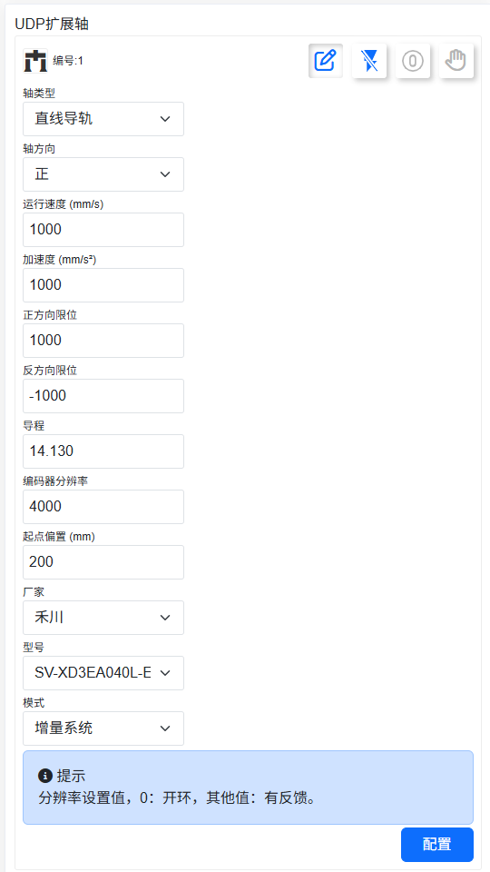

.. centered:: 圖表 8.7‑20 擴展軸參數配置

**Step2**：擴展軸參數配置完成後，點擊「去使能」按鈕，將對應擴展軸編號使能，使能成功後即可設定回零方式和擴展軸測試，當擴展軸未使能時無法進行回零方式設定和擴展軸測試。

.. figure:: robot_peripherals/110.png
   :align: center
   :width: 4in

.. centered:: 圖表 8.7‑21 擴展軸使能/去使能

**Step3**：擴展軸未使能成功無法進入設定界面，按鈕置灰；擴展軸使能成功後，點擊「回零」按鈕進入回零方式設定界面。設定回零方式、尋零速度和零點箍位速度，點擊「設定」按鈕，擴展軸開始回零，回零狀態會顯示在軸方向下方空白處，當出現「回零已完成」提示表明擴展軸零點設定成功。

- 回零方式：當前位置回零、負限位回零和正限位回零；

- 尋零速度：0~2000mm/s；

- 零點箍位速度：0~2000mm/s；

.. figure:: robot_peripherals/111.png
   :align: center
   :width: 4in

.. centered:: 圖表 8.7‑22 回零方式設定

**Step4**：擴展軸未使能成功無法進入設定界面，按鈕置灰；擴展軸使能成功且回零方式設定完成後，點擊「測試」按鈕進入擴展軸測試界面。設定運行速度、加速度和最大距離，進行正向轉動和反向轉動測試擴展軸，同時在轉動過程中可以點擊「停止」按鈕測試擴展軸是否可以正常停止。

.. figure:: robot_peripherals/112.png
   :align: center
   :width: 4in

.. centered:: 圖表 8.7‑23 擴展軸測試

**Step5**：擴展軸通常於激光傳感器配合使用，此時激光傳感器通常採用外部安裝方式，傳感器參考點配置需要採用三點法標定，而不是之前使用的六點法標定。將工具中心對準右側橫截面底部中間點（靠近相機那一側）設定點1，將工具中心點對準另一截面即左側橫截面底部中間點，設定點2，將工具中心點移至傳感器右側橫截面上邊緣中間點，設定點3，計算並儲存，點擊應用完成三點法標定。

.. figure:: robot_peripherals/113.png
   :align: center
   :width: 4in

.. centered:: 圖表 8.7‑24 傳感器三點法標定

**Step6**：在「示教程序」->「程序編程」界面選擇外設指令的「擴展軸」命令。根據具體的程序示教需求，在相應的地方添加指令。

.. figure:: robot_peripherals/114.png
   :align: center
   :width: 6in

.. centered:: 圖表 8.7‑25 擴展軸指令編輯

擴充軸配合雷射追蹤焊接示教程序
+++++++++++++++++++++++++++++++

.. list-table::
   :widths: 50 80 80
   :header-rows: 0
   :align: center

   * - **序號**
     - **指令格式**
     - **註釋**

   * - 1
     - EXT_AXIS_PTP(1,1laserstart)
     - #外部軸運動雷射感測器起始點

   * - 2
     - PTP(laserstart,10,-1,0)
     - #機器人運動雷射感測器起始點

   * - 3
     - LTSearchStart(3,20,10,10000)
     - #開始尋位

   * - 4
     - LTSearchStop()
     - #停止尋位

   * - 5
     - EXT_AXIS_PTP(1,1,seamPos)
     - #外部軸運動焊縫起點

   * - 6
     - Lin(seamPos,20,-1,00,0)
     - #機器人運動焊縫起點

   * - 7
     - LTTrackOn()
     - #雷射追蹤

   * - 8
     - ARCStart(0,10000)
     - #焊機起弧

   * - 9
     - EXT_AXIS_PTP(1,1,laserend)
     - #外部軸運動焊縫終點

   * - 10
     - Lin( laserend,10,-1,0,0)
     - #機器人運動焊縫終點

   * - 11
     - ARCEnd(0,10000)
     - #焊機收弧

   * - 12
     - LTTrackOff
     - #雷射追蹤關閉

定位完成時間
++++++++++++++++

當擴充軸建立UDP通訊後，輸入時間，點擊「配置」按鈕即可完成設定。該配置項用於監聽擴充軸運動停止的時間。

.. figure:: robot_peripherals/115.png
   :align: center
   :width: 4in

.. centered:: 圖表 8.7‑26 定位完成時間配置

兩自由度小車測試
~~~~~~~~~~~~~~~~~~~~~~

在擴充軸座標配置擴充軸方案為「5-兩自由度小車」時，進入UDP通訊介面後顯示該內容，否則無法查看。

.. figure:: robot_peripherals/116.png
   :align: center
   :width: 4in

.. centered:: 圖表 8.7‑27 擴充軸方案為「5-兩自由度小車」介面

.. important:: 兩自由度小車預設應用擴充軸編號1和2，UDP通訊成功後透過機器人	各類狀態中的擴充軸狀態查看擴充軸1和2伺服到位。

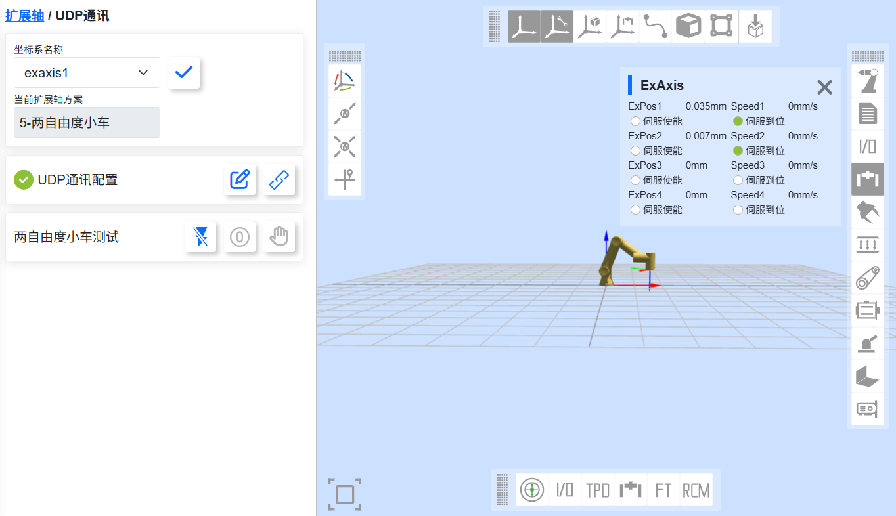

.. centered:: 圖表 8.7‑28 兩自由度小車擴充軸伺服到位

.. note::
   .. image:: robot_peripherals/105.png
      :height: 0.75in
      :align: left

   名稱：**使能按鈕**
   
   作用：擴充軸使能狀態，點擊按鈕擴充軸去使能

.. note::
   .. image:: robot_peripherals/106.png
      :height: 0.75in
      :align: left

   名稱：**去使能按鈕**
   
   作用：擴充軸去使能狀態，點擊按鈕擴充軸使能

.. note::
   .. image:: robot_peripherals/107.png
      :height: 0.75in
      :align: left

   名稱：**回零按鈕**
   
   作用：擴充軸目前位置回零

.. note::
   .. image:: robot_peripherals/108.png
      :height: 0.75in
      :align: left

   名稱：**測試按鈕**
   
   作用：兩自由度小車功能測試

**Step1**：UDP通訊成功後，點擊「去使能」按鈕，將兩自由度小車對應擴充軸使能，透過機器人各類狀態中的擴充軸狀態查看擴充軸1和2伺服使能。

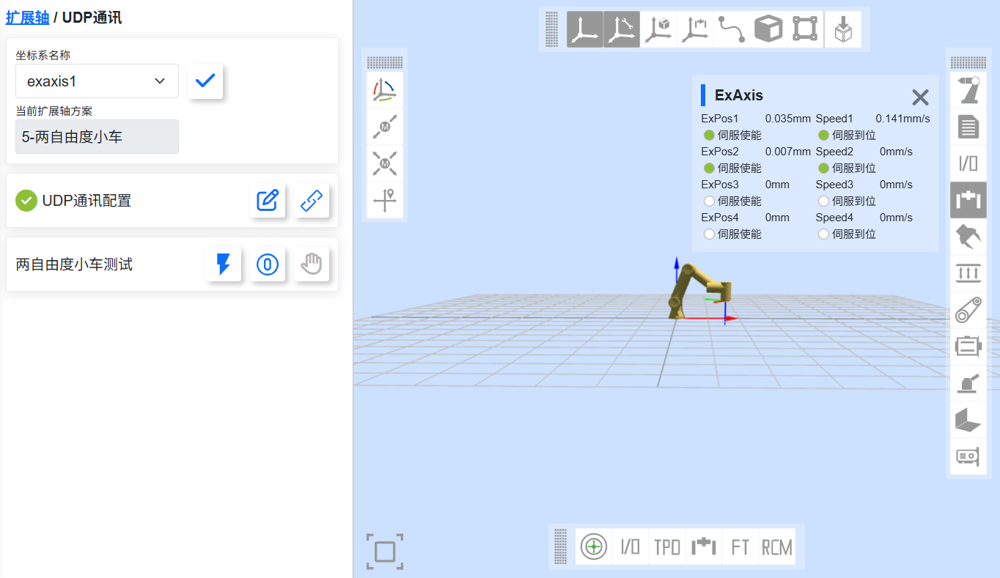

.. centered:: 圖表 8.7‑29 兩自由度小車擴充軸使能

**Step2**：擴充軸使能成功後，點擊「回零」按鈕，設定擴充軸目前位置回零，回零成功後測試按鈕高亮，反之置灰。

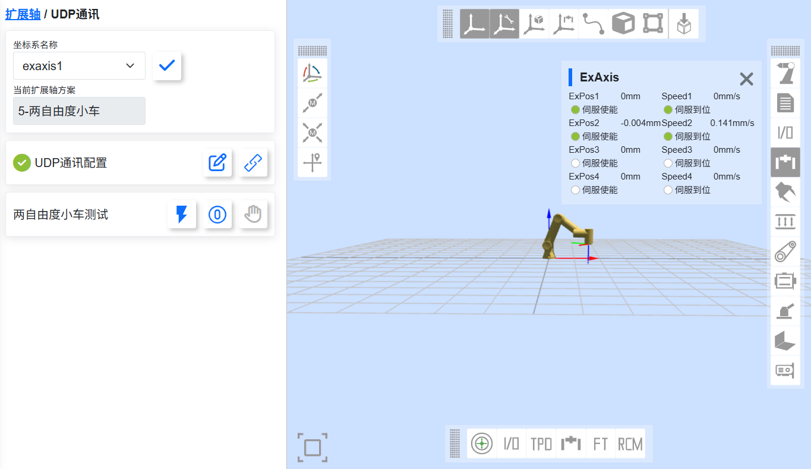

.. centered:: 圖表 8.7‑30 兩自由度小車目前位置回零成功

**Step3**：兩自由度小車目前位置回零成功後，點擊「測試」按鈕進入介面，選擇運動方式，輸入參數進行運動測試，在運動過程中點擊「停止」按鈕測試停止功能。

- 運動方式：直線/圓弧；

- 距離：-5000~5000mm（直線運動方式）；

- 半徑：1~5000mm（直線運動方式）；

- 角度：-360~360°（圓弧運動方式）；

- 速度：1~100%

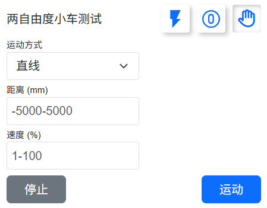

.. figure:: robot_peripherals/121.png
   :align: center
   :width: 4in

.. centered:: 圖表 8.7‑31 兩自由度小車測試

控制器+伺服驅動器（485通訊）
~~~~~~~~~~~~~~~~~~~~~~~~~~~~~~~~~~

硬體接線
+++++++++++

使用RS485通訊控制伺服擴充軸前，請先將伺服驅動器的RS485通訊介面與機器人控制箱上的RS485通訊介面建立連接。法奧機器人易製造控制箱電氣介面示意圖如下：

.. figure:: robot_peripherals/122.png
   :align: center
   :width: 6in

.. centered:: 圖表 8.7‑32 法奧機器人mini控制箱電氣介面示意圖

以戴納泰克伺服驅動器FD100-750C型號為例，參考改驅動器面板端子示意圖和FD100-750C的X3A-IN端子定義，當機器人配置與FD100-750C伺服擴充軸通訊時，需要將控制箱上的485-A0端子、485-B0端子分別與驅動器X3A-IN端子的4號和5號引腳連接。（請注意：您可以在伺服驅動器面板上看到一個「485」標誌的插線端子，該端子暫未開放使用者使用，請勿將您的RS485通訊線纜連接到此端子上）。同時，若連接多個伺服驅動器，且該驅動器為鏈路的最後一個，需要將面板上的RS485通訊中斷電阻撥碼開關（2號撥碼）打開。

.. figure:: robot_peripherals/123.png
   :align: center
   :width: 6in

.. centered:: 圖表 8.7‑33 FD100-750C驅動器面板

.. figure:: robot_peripherals/124.png
   :align: center
   :width: 6in

.. centered:: 圖表 8.7‑34 FD100-750C的X3A-IN端子定義

通訊配置
++++++++++++++

確保您的RS485通訊線纜正確連接且機器和伺服擴充軸都正常上電後，開啟機器人WebApp。

點擊組合方式為「控制器 + 伺服驅動器」的圖片進入詳細配置介面。在伺服驅動器配置中，選擇編號為「1」（請注意：當連接多個伺服時，此編號用於區分不同的伺服，後面我們會多次提到該編號），廠商為「戴納泰克」，選擇相應的伺服驅動器型號，此處型號為「FD00-750C」，軟體版本為V1.0，填寫伺服驅動器對應的解析度，此處為131072，根據您的機構模型填寫機械傳動比，此處為15.45，點擊「配置」按鈕。

.. figure:: robot_peripherals/125.png
   :align: center
   :width: 4in

.. centered:: 圖表 8.7‑35 伺服驅動器配置

至此我們已經完成機器人與伺服驅動器的485通訊配置，您可以在WebApp中右側的「伺服狀態欄」中查看伺服的即時狀態資訊。如下圖所示：

.. figure:: robot_peripherals/126.png
   :align: center
   :width: 4in

.. centered:: 圖表 8.7‑36 伺服狀態欄

現在您需要按順序對擴充軸設備進行使能和回零方式設定後，即可進行一定的運動測試，請在確保安全的前提下跟著本手冊做如下測試操作。

已配置伺服驅動器
++++++++++++++++++++++

.. note::
   .. image:: robot_peripherals/127.png
      :height: 0.75in
      :align: left

   名稱：**查看按鈕**
   
   作用：點擊查看伺服驅動器配置資訊

.. note::
   .. image:: robot_peripherals/105.png
      :height: 0.75in
      :align: left

   名稱：**使能按鈕**
   
   作用：伺服驅動器使能狀態，點擊按鈕伺服驅動器去使能

.. note::
   .. image:: robot_peripherals/106.png
      :height: 0.75in
      :align: left

   名稱：**去使能按鈕**
   
   作用：伺服驅動器去使能狀態，點擊按鈕伺服驅動器使

.. note::
   .. image:: robot_peripherals/107.png
      :height: 0.75in
      :align: left

   名稱：**回零按鈕**
   
   作用：伺服驅動器回零方式設定

.. note::
   .. image:: robot_peripherals/108.png
      :height: 0.75in
      :align: left

   名稱：**測試按鈕**
   
   作用：伺服驅動器測試

.. note::
   .. image:: robot_peripherals/128.png
      :height: 0.75in
      :align: left

   名稱：**伺服錯誤清除按鈕**
   
   作用：伺服驅動器提示錯誤時，點擊清除

伺服控制模式與使能
********************

在「已配置伺服驅動器」中，選擇控制模式為「位置模式」，選擇對應的伺服編號，點擊「去使能」按鈕，此時會先設定伺服驅動器編號，設定成功後設定控制模式，控制模式設定成功後將伺服驅動器使能（請注意：切換控制模式後，需要先將伺服驅動器去除使能，再將伺服驅動器使能，伺服的控制模式切換才會生效，伺服使能成功後將切換控制模式將禁用）。

.. figure:: robot_peripherals/129.png
   :align: center
   :width: 4in

.. centered:: 圖表 8.7‑37 伺服控制模式與使能 

伺服使能成功後查看機器人各類狀態欄中的「Servo」中可觀察到對「伺服使能」狀態燈亮起，表示伺服驅動器已經使能。點擊「使能」狀態按鈕，將伺服驅動器去使能，「伺服使能」狀態燈熄滅。

.. figure:: robot_peripherals/130.png
   :align: center
   :width: 6in

.. centered:: 圖表 8.7‑38 伺服驅動器狀態欄 

伺服回零
****************

伺服驅動器使能成功後，「回零」按鈕高亮，點擊按鈕進入設定介面。選擇回零模式為「目前位置回零」，回零速度為5mm/s，零點箍位速度為1mm/s；點擊「設定」按鈕，即完成了伺服目前位置回零操作，在機器人各類狀態欄中的「Servo」中，可觀察到目前的「伺服位置」為0；（請您完全閱讀本手冊後，再將回零模式選擇為「負限位回零」或「正限位回零」進行回零測試）。

.. figure:: robot_peripherals/131.png
   :align: center
   :width: 6in

.. centered:: 圖表 8.7‑39 伺服回零

伺服運動
***************

在實際控制伺服電機運動前，請先了解伺服電機的「位置模式」和「速度模式」，再次提醒您：

**位置模式**：您可以輸入一定的運動速度和目標位置參數，伺服將以設定的速度運動到目標位置，運動到目標位置後，伺服將停止運動。

**速度模式**：您可以輸入一定的目標速度，伺服將按照您設定的目標速度一直運動，直至您將目標速度設定為0或將伺服電機下使能；

當切換控制模式時，「目前控制模式」顯示會自動切換（請注意：切換控制模式後，需要先將伺服去除使能，再將伺服使能，伺服的控制模式切換才會生效）。若目前您的伺服未處於「位置模式」，請將您的伺服切換至位置模式。輸入「目標位置」為50mm，運行速度為5mm/s，在確認安全的條件下，點擊「設定」按鈕，此時伺服電機將按照您設定的參數運動，您可以在機器人各類狀態欄中的「Servo」中即時觀察伺服的位置和速度等。

.. figure:: robot_peripherals/132.png
   :align: center
   :width: 4in

.. centered:: 圖表 8.7‑40 伺服運動調試（位置模式）

將伺服的控制模式改為「速度模式」，點擊「使能」狀態按鈕將伺服驅動器去使能，再點擊「去使能」狀態按鈕，此時伺服切換為速度模式（請注意：當伺服電機運動後，只能透過將目標速度設定為0使伺服電機停止）。輸入目標速度為5mm/s，點擊「設定」按鈕，伺服電機將以5mm/s的速度保持運動，同樣您可以在機器人各類狀態欄中的「Servo」中即時觀察伺服的位置和速度等。

.. figure:: robot_peripherals/133.png
   :align: center
   :width: 4in

.. centered:: 圖表 8.7‑41 伺服運動調試（速度模式）

高級設定
++++++++++++++

若機器人發生碰撞、按下急停等緊急情況下擴充軸能觸發急停，並按照設定的急停減速度停止運動，碰撞警報恢復後能繼續下發指令使擴充軸恢復運行。需要在高級設定中，設定伺服加減速度和伺服急停加減速，如下圖所示：

.. figure:: robot_peripherals/134.png
   :align: center
   :width: 4in

.. centered:: 圖表 8.7‑42 高級設定

擴充軸編程
++++++++++++++

在「示教程序」->「程式編程」中新建一個使用者程式「testServo.lua」，選擇「外設指令」。

.. figure:: robot_peripherals/135.png
   :align: center
   :width: 6in

.. centered:: 圖表 8.7‑43 開啟外設指令

點擊「擴充軸」，開啟新增擴充軸指令介面。選擇組合方式為「控制器 + 伺服驅動器(485)」，將控制模式設為「位置模式」，點擊右側的「新增」按鈕。將新增擴充軸指令介面翻到底部，點擊「應用」按鈕。

.. figure:: robot_peripherals/136.png
   :align: center
   :width: 6in

.. centered:: 圖表 8.7‑44 設定擴充軸的控制模式

此時「testServo.lua」程式中即出現一組切換伺服控制模式的指令，您可以將機器人切換到自動模式，並執行該程式。

.. figure:: robot_peripherals/137.png
   :align: center
   :width: 6in

.. centered:: 圖表 8.7‑45 設定伺服控制模式程式

如何透過使用者程式控制伺服運動？同樣開啟新增擴充軸指令介面，如下圖所示，找到參數配置欄，以位置模式為例，輸入目標位置和運行速度，點擊「新增」按鈕；將新增擴充軸指令介面翻到底部，點擊「應用」按鈕，並關閉新增擴充軸指令介面。

.. figure:: robot_peripherals/138.png
   :align: center
   :width: 6in

.. centered:: 圖表 8.7‑46 增加位置模式運動指令

「testServo.lua」程式中增加伺服運動指令：「AuxServoSetTargetPos(1,50,5)」。指令函數中的三個參數含義分別為：

- 1：伺服編號為1。

- 50：目標位置。

- 5：目標速度。

.. figure:: robot_peripherals/139.png
   :align: center
   :width: 6in

.. centered:: 圖表 8.7‑47 位置模式伺服運動程式

將機器人切換到自動模式，運行該程式，此時您的伺服將以5mm/s的速度運動到50mm的位置。

至此，我們已經完成RS485控制伺服擴充軸的初步配置和測試，您可以根據實際情況編寫機器人運動與伺服運動組合的程式，如下圖一個範例程式。

擴充軸與機械人協同運動程式範例
*******************************

.. list-table::
   :widths: 50 80 80
   :header-rows: 0
   :align: center

   * - **序號**
     - **指令格式**
     - **註釋**

   * - 1
     - AuxServoSetTargetPos(1,50,5)
     - #擴充軸運動到復位點

   * - 2
     - if(GetDI(8,0) == 1) then
     - #如果CI0輸入有效

   * - 3
     - AuxServoSetTargetPos(1,50,5)
     - #擴充軸運動到50mm

   * - 4
     - PTP(testptp1,100,-1,0)
     - #機器人運動到testptp1點

   * - 5
     - elseif(GetDI(9,0) == 1) then
     - #如果CI1輸入有效

   * - 6
     - AuxServoSetTargetPos(1,150,5)
     - #擴充軸運動到150mm

   * - 7
     - PTP(testptp2,100,-1,0)
     - #機器人運動到testptp2點

   * - 8
     - else
     - #若CI0和CI1輸入均無效

   * - 9
     - AuxServoSetTargetPos(1,300,5)
     - #擴充軸運動到300mm

   * - 10
     - PTP(testptp3,100,-1,0)
     - #機器人運動到testptp3點

   * - 11
     - end
     - #結束

總結
+++++++++

綜上所述，配置協作機器人與伺服擴充軸RS485通訊有以下注意要點：

1. 正確連接協作機器人與伺服驅動器的RS485通訊線纜；

2. 正確選擇伺服擴充軸的控制模式；

3. 切換控制模式後，必須先去使能，再伺服使能，控制模式切換才能生效。

線激光傳感器
---------------

法奧協作機器人與激光傳感器配合使用，通過傳感器識別焊縫等特徵位置以達到簡化編程、提高生產效率的目的。協作機器人可適配睿牛、創想和全視三種廠商的激光傳感器，使用不同傳感器時只需要加載對應的通信協議即可。

硬件接線
~~~~~~~~~~~~~

使用激光傳感器前需要將激光傳感器安裝於合適位置，將激光傳感器的網線直接連接或通過交換機連接到機器人控制箱的任一RJ45接口。

傳感器配置
~~~~~~~~~~~~~

請確保您的激光傳感器和焊槍已經固定安裝於機器人末端，激光傳感器已經與機器人控制箱通過網線連接，並且激光傳感器與機器人控制箱的IP地址處於同一網段，打開機器人和傳感器電源，下圖為睿牛激光傳感器安裝。

.. figure:: robot_peripherals/140.png
   :align: center
   :width: 4in

.. centered:: 圖表 8.8‑1 激光傳感器安裝

在通信配置欄中輸入傳感器的IP地址、端口號，點擊“配置”按鈕，採樣週期默認為25，座標系選擇“激光平面座標系”，根據您的傳感器型號選擇對應的通信協議，點擊“加載”按鈕。

.. figure:: robot_peripherals/141.png
   :align: center
   :width: 4in

.. centered:: 圖表 8.8‑2 激光傳感器配置

在“跟踪傳感器測試”欄，依次點擊“打開”和“關閉”傳感器，觀察傳感器的激光是否打開或關閉，若激光正常打開或關閉則表示機器人與傳感器已經正常建立通信，否則請檢查IP地址和端口號等參數是否正確，以及傳感器與機器人網絡連接是否正確。

.. figure:: robot_peripherals/142.png
   :align: center
   :width: 4in

.. centered:: 圖表 8.8‑3 激光傳感器通訊測試

傳感器標定
~~~~~~~~~~~~

在使用激光傳感器前需要先對激光傳感器進行標定，標定精度直接影響激光傳感器的跟踪精度。激光傳感器的標定方法有五點法、六點法和八點法，以焊接應用場景下最常用的五點法為例，其標定原理為先通過工具（焊槍）指向一個固定標定點（如圖4），再通過激光傳感器從四個不同的姿態照射並識別到該點。

.. note::
  該標定點必須可以被激光傳感器準確識別到，否則無法精確標定。

進而計算出傳感器座標位姿，下面詳細介紹其標定過程：

.. figure:: robot_peripherals/143.png
   :align: center
   :width: 4in

.. centered:: 圖表 8.8‑4 激光傳感器標定點

**step1**：打開機器人WebApp，依次點擊“初始設置”->“基礎”->“工具座標”進入工具座標系界面。選擇一個未使用的工具座標系，點擊修改其名稱為“焊槍”，工具類型為“工具”，安裝位置為“末端”。

.. figure:: robot_peripherals/144.png
   :align: center
   :width: 4in

.. centered:: 圖表 8.8‑5 設置“焊槍”座標系

再次選擇一個未使用的座標系，將其名稱修改為“激光傳感器”，選擇工具類型為“傳感器”，安裝位置為“末端”。

.. figure:: robot_peripherals/145.png
   :align: center
   :width: 4in

.. centered:: 圖表 8.8‑6 設置“激光傳感器”座標系

**step2**：用六點法對焊槍的工具座標系進行標定：選則“焊槍”座標系，點擊修改按鈕，使用六點法進行焊槍工具座標系的標定（具體標定方法參照法奧文檔，本文不做贅述）。

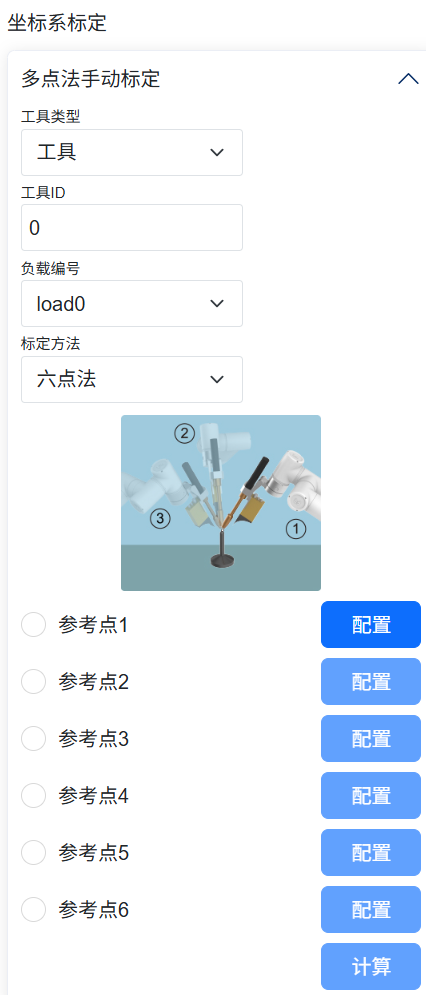

.. centered:: 圖表 8.8‑7 “焊槍”座標系標定

**step3**：在“工具座標系設置”中選擇0號座標系(基座標系)，默認名稱為“toolcoord0”，點擊“應用”，將當前的座標系切換為基座標系。

.. figure:: robot_peripherals/147.png
   :align: center
   :width: 4in

.. centered:: 圖表 8.8‑8 傳感器標定步驟1

**step4**：再次選擇之前設置的“激光傳感器”座標系(不點擊“應用”)，點擊“編輯”按鈕，選擇工具類型為“傳感器”，傳感器固定在“機器人末端”，標定方法選擇“五點法”。

.. figure:: robot_peripherals/148.png
   :align: center
   :width: 4in

.. centered:: 圖表 8.8‑9 傳感器標定步驟2

**step5**：拖動機器人使焊槍尖端對準標定點，選擇“焊槍”座標系，點擊“應用”，點擊“設置點1”，如圖13。

.. figure:: robot_peripherals/149.png
   :align: center
   :width: 4in

.. centered:: 圖表 8.8‑10 傳感器標定步驟3

.. figure:: robot_peripherals/150.png
   :align: center
   :width: 4in

.. centered:: 圖表 8.8‑11 傳感器標定步驟4

**step6**：再次選擇0號座標系（“toolcoord0”）；然後選擇“傳感器”座標系（不點擊“應用”），即可繼續進行標定。

.. figure:: robot_peripherals/147.png
   :align: center
   :width: 4in

.. centered:: 圖表 8.8‑12 傳感器標定步驟5

.. figure:: robot_peripherals/145.png
   :align: center
   :width: 4in

.. centered:: 圖表 8.8‑13 傳感器標定步驟6

**step7**：移動激光傳感器位置，使激光剛好掃描到標定點，點擊“設置點2”；此時左側的傳感器輸出值對應序號位置會顯示當前的傳感器數據，若數據正常則表示當前標定點成功，否則需要重新標定。

.. figure:: robot_peripherals/151.png
   :align: center
   :width: 4in

.. centered:: 圖表 8.8‑14 傳感器標定步驟7

.. figure:: robot_peripherals/152.png
   :align: center
   :width: 4in

.. centered:: 圖表 8.8‑15 傳感器標定步驟8

**step8**：依次使激光再從三個不同的姿態照射標定點，並分別點擊“設置點3”、“設置點4”和“設置點5”，最後在確保每個點的數據都正常的情況下，點擊“計算”按鈕。

.. figure:: robot_peripherals/153.png
   :align: center
   :width: 4in

.. centered:: 圖表 8.8‑16 傳感器標定步驟9

**step9**：此時WebApp上顯示傳感器的標定結果和標定精度，點擊“應用”按鈕，即完成了激光傳感器的標定。若標定精度過差，則可以選擇點擊“取消”按鈕，並重新進行標定。

.. figure:: robot_peripherals/154.png
   :align: center
   :width: 4in

.. centered:: 圖表 8.8‑17 傳感器標定精度

激光傳感器應用
~~~~~~~~~~~~~~~~

使用激光傳感器前，先將“焊槍”工具座標系應用到當前工具座標系。

.. figure:: robot_peripherals/144.png
   :align: center
   :width: 4in

.. centered:: 圖表 8.8‑18 應用焊槍座標系

激光傳感器示教點
++++++++++++++++++

拖動機器人使激光傳感器光線指向想要示教的焊縫點。在WebApp選擇傳感器為“激光傳感器”，輸入傳感器點名稱為“laserPt”，點擊“添加”按鈕。新建用戶程序“testLaser.lua”，創建運動指令PTP，目標點選擇“laserPt”，單步執行該指令，此時焊槍將運動到之前激光傳感器的指向點。

.. figure:: robot_peripherals/155.png
   :align: center
   :width: 4in

.. centered:: 圖表 8.8‑19 激光傳感焊縫點

.. figure:: robot_peripherals/156.png
   :align: center
   :width: 6in

.. centered:: 圖表 8.8‑20 示教傳感器點

.. figure:: robot_peripherals/157.png
   :align: center
   :width: 4in

.. centered:: 圖表 8.8‑21 焊槍指向焊縫點

激光尋位 + 跟踪
++++++++++++++++

協作機器人與激光傳感器配合完成激光尋位 + 激光跟踪功能共需要一下幾步：

(1) 機器人運動到焊縫外部的某一點；

(2) 開始激光尋位，且機器人攜帶激光傳感器向焊縫位置移動；

(3) 激光傳感器識別到焊縫，機器人帶動焊槍運動到焊縫識別點；

(4) 激光跟踪開始，同時機器人向焊縫終點運動，激光傳感器在運動過程中實時記錄位置；

(5) 焊槍沿激光傳感器記錄的位置進行運動，實現跟踪效果。

在尋位跟踪調試前，請先確保傳感器已經正確安裝、“焊槍”工具座標系已經正確標定，激光傳感器也已經正確標定完成。假設圖中綠色直線為待焊焊縫，使機器人實現自動尋找焊接起點A點，並自動焊接至B點，需要進行如下指令編寫：

.. figure:: robot_peripherals/158.png
   :align: center
   :width: 4in

.. centered:: 圖表 8.8‑22 傳感器安裝

編寫尋位指令
*************

新建用戶程序“laserTrack.lua”，選擇“焊接指令”。點擊“激光跟踪”，彈出激光跟踪指令添加頁面。

.. figure:: robot_peripherals/159.png
   :align: center
   :width: 6in

.. centered:: 圖表 8.8‑23 激光跟踪指令

找到“尋位命令”，選擇座標系名稱為“激光傳感器”，方向選擇“+x”表示機器人攜帶激光傳感器從當前位置沿“焊槍”座標系的“+x”方向邊運動邊搜尋焊縫，“速度”為激光傳感器尋位的移動速度，長度為激光傳感器的最大尋位長度，當機器人尋位距離超出該長度仍未尋找到焊縫時機器人將報錯，最大尋位時間與長度類似，超出該時間仍未找到焊縫時機器人報錯。請您根據實際場景正確輸入上述相關參數。依次點擊“尋位開始”和“尋位結束”指令，並點擊“應用”按鈕。

.. figure:: robot_peripherals/160.png
   :align: center
   :width: 6in

.. centered:: 圖表 8.8‑24 添加尋位指令

此時“laserTrack.lua”中將增加對應的激光尋位開始和結束的指令。

.. figure:: robot_peripherals/161.png
   :align: center
   :width: 6in

.. centered:: 圖表 8.8‑25 尋位程序

編寫運動到尋位點指令
*********************

添加點到點運動LIN指令，目標點為“seamPos”即激光傳感器尋位點。

.. note:: “seamPos點為機器人系統內部專用於激光傳感器尋位的點位名稱，不需要示教該點，激光傳感器尋位後會自動將尋位點信息存入“seamPos點中”。

尋位點可以設置偏移，偏移類型可選擇“基座標系偏移”、“工具座標系偏移”和“激光原始數據偏移”。

.. figure:: robot_peripherals/162.png
   :align: center
   :width: 6in

.. centered:: 圖表 8.8‑26 尋位偏移選項

當啟用尋位偏移功能時，可設置偏移參數，“dx”表示沿所選座標系x方向的偏移距離，“drx”表示沿所選座標系x軸旋轉的角度。點擊“添加”按鈕，點擊“應用”按鈕。

.. figure:: robot_peripherals/163.png
   :align: center
   :width: 6in

.. centered:: 圖表 8.8‑27 尋位偏移參數設置

此時“testTrack.lua”中將增加運動到尋位點的指令，如圖32。

.. figure:: robot_peripherals/164.png
   :align: center
   :width: 6in

.. centered:: 圖表 8.8‑28 尋位偏移程序

編寫激光跟踪指令
******************

再次打開“激光跟踪”指令添加頁面，依次點擊“開始跟踪”和“停止跟踪”按鈕，最後點擊頁面最下面的“應用”按鈕。

.. figure:: robot_peripherals/165.png
   :align: center
   :width: 6in

.. centered:: 圖表 8.8‑29 激光跟踪開始與停止

此時的用戶程序“testTrack.lua”：

.. figure:: robot_peripherals/166.png
   :align: center
   :width: 6in

.. centered:: 圖表 8.8‑30 激光跟踪程序

編寫尋位開始點和跟踪終點指令
*****************************

在激光尋位開始前，需要先指定一個尋位起始點，機器人先運動到尋位起始點，然後再沿一定的方向和速度進行尋位。在激光傳感器光線靠近焊縫起點A點附近示教尋位開始點“seamStartPt”，注意匹配尋位起始點與尋位方向，保證機器人能在設定的距離和最大尋位時間內找到焊縫位置。

.. figure:: robot_peripherals/167.png
   :align: center
   :width: 4in

.. centered:: 圖表 8.8‑31 尋位起點

在焊縫末端示教跟踪終止點“trackEndPt”。

.. figure:: robot_peripherals/168.png
   :align: center
   :width: 4in

.. centered:: 圖表 8.8‑32 尋位終點

將上述兩個點添加到“testTrack.lua”用戶程序中，最終的用戶程序如下：

.. figure:: robot_peripherals/169.png
   :align: center
   :width: 6in

.. centered:: 圖表 8.8‑33 尋位跟踪程序

編寫焊接相關指令
*****************

最後，在焊接尋位點“seampos”和“trackEndPt”之間加上焊接指令，最終的程序如下：

.. figure:: robot_peripherals/170.png
   :align: center
   :width: 6in

.. centered:: 圖表 8.8‑34 尋位跟踪焊接程序

執行上述程序，機器人將攜帶激光傳感器從尋位起點開始尋位運動，尋找到焊縫後，機器人立即運動到焊縫起點，並執行起弧操作，起弧成功後，機器人向焊縫終點運動並在運動過程中跟踪焊縫軌跡，機器人運動到焊縫終點後即停止焊接。

激光軌跡記錄 + 軌跡復現
++++++++++++++++++++++++

激光軌跡記錄+軌跡復現的工作流程為：

(1) 機器人攜帶激光傳感器沿焊縫運動一段軌跡，激光傳感器在運動的過程中實時記錄焊縫位置軌跡數據；

(2) 軌跡記錄完成後，機器人運動至軌跡記錄的起始點；

(3) 機器人沿激光傳感記錄的軌跡進行軌跡復現運動。

機器人軌跡記錄指令編寫
************************

新建用戶程序“testRecord.lua”，點擊“激光記錄”打開激光記錄指令添加頁面，找到“焊縫數據記錄”，選擇“開始記錄”，點擊“添加”按鈕，選擇停止記錄，再次點擊“添加”按鈕；最後點擊“應用”按鈕。

.. figure:: robot_peripherals/171.png
   :align: center
   :width: 6in

.. centered:: 圖表 8.8‑35 激光記錄

.. figure:: robot_peripherals/172.png
   :align: center
   :width: 6in

.. centered:: 圖表 8.8‑36 開始記錄與停止記錄

此時頁面上出現軌跡記錄開始和停止指令。

.. figure:: robot_peripherals/173.png
   :align: center
   :width: 6in

.. centered:: 圖表 8.8‑37 軌跡記錄程序

假設圖中綠色線段AB為焊縫，分別使激光照射到焊縫起始點A和焊縫中斷B，並示教軌跡記錄的起點“recordStartPt”和終點“recordEndPt”。

.. figure:: robot_peripherals/174.png
   :align: center
   :width: 4in

.. figure:: robot_peripherals/175.png
   :align: center
   :width: 4in

.. centered:: 圖表 8.8‑38 軌跡記錄起點和終點

在“testRecord.lua”中添加兩條直線(LIN)運動指令，分別為運動到軌跡記錄起點“recordStartPt”和終點“recordEndPt”，並調整指令位置，使機器人進行如下操作：先運動到“recordStartPt”點，開始軌跡記錄，機器人運動到“recordEndPt”點，停止軌跡記錄。

.. figure:: robot_peripherals/176.png
   :align: center
   :width: 6in

.. centered:: 圖表 8.8‑39 軌跡記錄程序

機器人運動到軌跡記錄起點指令編寫
*********************************

點擊“激光記錄”打開激光記錄指令添加頁面，找到“運動至焊縫點”欄，選擇運動方式為PTP，輸入一定的運動速度，點擊“運動至起點”，點擊“應用”按鈕。

.. figure:: robot_peripherals/177.png
   :align: center
   :width: 6in

.. centered:: 圖表 8.8‑40 運動至軌跡起點

此時“testRecord.lua”用戶程序如下：

.. figure:: robot_peripherals/178.png
   :align: center
   :width: 6in

.. centered:: 圖表 8.8‑41 運動至軌跡起點程序

激光傳感器軌跡復現指令編寫
****************************

點擊“激光記錄”打開激光記錄指令添加頁面，找到“焊縫數據記錄”，選擇“軌跡復現”，點擊“添加”按鈕，點擊“激光跟踪復現”按鈕，最後點擊“應用”按鈕。

.. figure:: robot_peripherals/179.png
   :align: center
   :width: 6in

.. centered:: 圖表 8.8‑42 軌跡復現

添加完成後的程序如下：

.. figure:: robot_peripherals/180.png
   :align: center
   :width: 6in

.. centered:: 圖表 8.8‑43 軌跡復現程序

焊接相關指令編寫
********************

最後在軌跡復現開始前和結束後加上焊接開始和焊接結束指令：

.. figure:: robot_peripherals/181.png
   :align: center
   :width: 6in

.. centered:: 圖表 8.8‑44 軌跡記錄復現焊接程序

執行上述程序，機器人將攜帶激光傳感器先沿焊縫軌跡運動，並記錄整個軌跡，然後機器人運動到軌跡記錄的起點，機器人起弧並沿激光傳感器記錄的軌跡開始焊接，當機器人軌跡復現完成後，焊接電弧熄滅，完成焊接。

激光傳感器適配控制器外設開放協議
~~~~~~~~~~~~~~~~~~~~~~~~~~~~~~~~~~~~~~~~~~~~~~~~

**Step1**：如果需要採用“開放協議連接”和“控制激光傳感器”，則在傳感器跟踪配置中，“協議類型”選項選擇“外設開放協議”，如果採用原方案則選擇“已適配設備”，在跟踪傳感器界面配置加載激光外設。

.. figure:: robot_peripherals/182.png
   :align: center
   :width: 4in

.. centered:: 圖表 8.8‑45 “開放協議連接”和“控制激光傳感器”配置界面

**Step2**：點擊“外設開放協議”進入界面，在“開放協議設置”中，上傳對應激光傳感器的外設開放協議，上傳成功後選擇協議編號和上傳的文件名，點擊配置，並在設備操作及狀態中，運行上傳的激光傳感器，即可和對應的激光傳感器建立連接。

.. figure:: robot_peripherals/183.png
   :align: center
   :width: 4in

.. centered:: 圖表 8.8‑46 激光傳感器建立連接

打磨
---------------

在“初始設置”->“外設”->“打磨”界面中，當前可以通過已適配設備和外設開放協議使用打磨。

.. figure:: robot_peripherals/184.png
   :align: center
   :width: 4in

.. centered:: 圖表 8.9-1 打磨狀態配置頁面

已適配設備
~~~~~~~~~~~~~~~~~

**通信配置與加載**: 配置通訊信息，需要配置IP地址、端口、採樣週期和通信協議。通過加載/卸載按鈕與打磨設備建立通信。

.. figure:: robot_peripherals/185.png
   :align: center
   :width: 4in

.. centered:: 圖表 8.9-2 通信配置與加載

**設備功能**：可進行設備使能、錯誤清除和力傳感器清零等操作。

.. figure:: robot_peripherals/186.png
   :align: center
   :width: 4in

.. centered:: 圖表 8.9-3 設備功能

**參數配置**：可設置打磨設備的轉速、接觸力、伸出距離和控制模式。設置成功後，可在右側"Polish"狀態反饋欄顯示相應數據和狀態。

.. figure:: robot_peripherals/187.png
   :align: center
   :width: 4in

.. centered:: 圖表 8.9-4 參數配置

.. figure:: robot_peripherals/188.png
   :align: center
   :width: 4in

.. centered:: 圖表 8.9-5 參數配置

外設開放協議
~~~~~~~~~~~~~~~~~

點擊“外設開放協議”進入界面，在“開放協議設置”中，上傳對應打磨的外設開放協議，上傳成功後選擇協議編號和上傳的文件名，點擊配置，並在設備操作及狀態中，運行上傳的打磨外設開放協議，即可和對應的打磨設備建立連接。

.. figure:: robot_peripherals/189.png
   :align: center
   :width: 4in

.. centered:: 圖表 8.9‑6 激光傳感器建立連接

輔助感測器
-------------------

在「初始設定」->「外設」->「輔助感測器」介面中，目前可以透過已適配裝置使用，自訂協定功能暫未開放。

.. figure:: robot_peripherals/190.png
   :align: center
   :width: 4in

.. centered:: 圖表 8.10‑1 輔助感測器--已適配裝置

已適配裝置
~~~~~~~~~~~~~~~~~~~

點擊「已適配裝置」進入輔助感測器設定介面。

輔助感測器的設定資訊分為廠商、類型、軟體版本和掛載位置，使用者可根據具體的生產需求來設定相應的輔助感測器資訊。

若使用者需要變更設定，可先選擇相應的輔助感測器編號，點擊「清除」按鈕，來清除相應的按鈕，並重新根據需求設定；

.. figure:: robot_peripherals/191.png
   :align: center
   :width: 4in

.. centered:: 圖表 8.10‑2 輔助感測器--已適配裝置

組合裝置（SmartTool+力感測器組合）
----------------------------------------------------

在「初始設定」->「外設」->「組合裝置」介面中，目前可以透過已適配裝置使用，自訂協定暫未開放。

.. figure:: robot_peripherals/192.png
   :align: center
   :width: 4in

.. centered:: 圖表 8.11-1 組合裝置

已適配裝置
~~~~~~~~~~~~~~~~~~~

點擊「已適配裝置」進入設定介面。

設定資訊分為廠商、類型、軟體版本和掛載位置。不同廠商對應不同的類型，目前廠商為FR。

使用者可根據具體的生產需求來設定相應的裝置資訊，設定成功後展示裝置資訊表格。若使用者需要變更設定，可先選擇相應的編號，點擊「清除」按鈕，來清除相應的資訊，並重新根據需求設定裝置資訊。

.. important::
  點擊清除設定前，相應的裝置應處於未啟動狀態。

.. image:: robot_peripherals/193.png
   :width: 4in
   :align: center

.. centered:: 圖表 8.11‑2 已適配裝置

FR
++++++++++

FR對應的類型為「SmartTool 」與力感測器組合使用，協作機器人可適配鑫精誠、NSR和港智創信的三種力感測器，使用不同感測器時只需要載入對應的通訊協定即可，具體如下：

- SmartTool + XJC-6F-D82（鑫精誠）。
- SmartTool + NSR-FT Sensor A（NSR）。
- SmartTool + GZCX-6F-75A（港智創信）。

1. 硬體安裝

1) 將SmartTool 手柄拆開，取出中間的工裝，安裝在機器人末端，工裝安裝完成後，將SmartTool手柄拼接好，拼接成功後將連接線與機器人末端連接。

.. image:: robot_peripherals/194.png
   :width: 3in
   :align: center

.. centered:: 圖表 8.11‑3 安裝SmartTool 手柄中間的工裝

.. image:: robot_peripherals/195.png
   :width: 3in
   :align: center

.. centered:: 圖表 8.11‑4 SmartTool 手柄安裝成功

2) SmartTool手柄安裝完畢後，將力感測器（以港智創信為例）安裝於SmartTool手柄末端，並將連接線與SmartTool手柄連接。

.. image:: robot_peripherals/196.png
   :width: 3in
   :align: center

.. centered:: 圖表 8.11‑5 港智創信力感測器安裝於SmartTool手柄末端

2. 裝置設定

.. important:: 請確保您的SmartTool手柄已經固定安裝於機器人末端並正確連接機器人末端以及力感測器已經固定安裝於SmartTool手柄末端並正確連接SmartTool手柄。

1) 設定SmartTool手柄（參考焊接手柄按鍵功能設定）。

2) SmartTool手柄按鍵功能設定完成後，設定廠商為「FR」，選擇「類型」、「軟體版本」和「掛在位置」資訊，點擊「設定」按鈕；

.. image:: robot_peripherals/197.png
   :width: 4in
   :align: center

.. centered:: 圖表 8.11‑6 FR裝置資訊設定介面

3) 設定裝置資訊成功後，選擇已設定的力感測器，點擊「啟動」按鈕啟動力感測器，啟動成功後點擊「零點校正」按鈕進行力感測器的清零，查看表格資料；

.. image:: robot_peripherals/198.png
   :width: 4in
   :align: center

.. centered:: 圖表 8.11‑7 力感測器校零

4) 根據目前末端安裝，在「負載」介面設定負載資料，在「工具座標」介面設定工具座標的資料、工具類型和安裝位置。

.. image:: robot_peripherals/199.png
   :width: 4in
   :align: center

.. centered:: 圖表 8.11‑8 「末端負載」設定

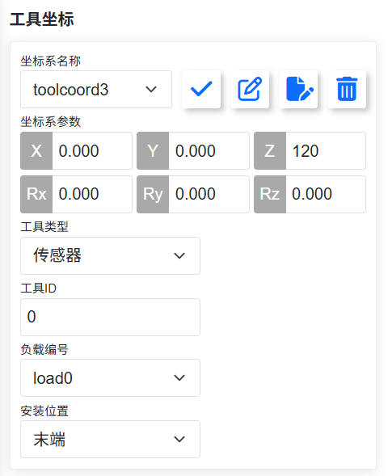

.. centered:: 圖表 8.11‑9 「工具座標」設定

3. 應用

裝置資訊設定成功後，可以獨立實現SmartTool按鍵功能和力感測器的功能，例如：測量力的大小及受力方向和基於力感測器的輔助拖動鎖定。

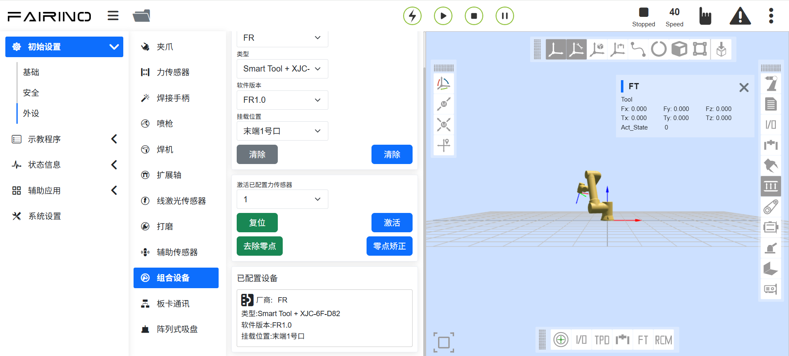

.. centered:: 圖表 8.11‑10 測量力的大小及受力方向

陣列式吸盤
-----------------

概述
~~~~~~~~~~~~~~~~~~~~~~
在機器人末端安裝陣列式吸盤可幫助機器人快速部署不同場景的物料抓取工作站，可針對不同尺寸、形狀的物料自訂吸盤數量和佈局，提高工作效率和穩定性。

協作機器人支援最多20個吸盤組成的吸盤陣列，可以單獨控制其中某個吸盤的抓取和釋放，也可以控制目前連接的整個陣列所有吸盤同步動作。每個吸盤從站號支援1~20設定，設定基於DynamicLAB軟體進行。

硬體描述
+++++++++++++++++++++++++++++++++++++++++++

協作機器人透過乙太網路轉485模組與吸盤陣列進行通訊控制，在WebApp上產生陣列式吸盤通訊協定，協定將控制資料透過TCPIP發送至乙太網路轉485模組，模組再將收到的控制資料透過485發送至各個吸盤，從而實現對陣列式吸盤的控制（上述控制資料格式為ModbusRTU協定格式）。

其中乙太網路轉485模組為乙太網路通訊的伺服器端、485通訊的主站，陣列中的每個吸盤均為485通訊從站，且每個吸盤應設定不同的從站號。

.. figure:: robot_peripherals/202.png
   :align: center
   :width: 6in

.. centered:: 圖表 8.12-1 協作機器人吸盤陣列夾爪應用

乙太網路轉485模組通常有兩個TCPServer埠號對應多個485從站埠號，以CH9121為例，其TCPServer埠號1對應485從站埠號1-10，TCPServer埠號2對應485從站埠號11-20。機器人與乙太網路轉485模組建立兩個TCP通信，最終分別控制20個吸盤。

上述乙太網路轉485模組需進行如下設定：

- ①乙太網路端設定為TCPServer，IP位址為：192.168.58.10，埠號1的埠號為50001，埠號2的埠號為50002；
- ②485端設定鮑率為115200，資料位8，停止位1，無校驗。乙太網路轉485模組通常會配備一個除錯軟體，可以在除錯軟體中進行上述設定，下圖是CH9121型號乙太網路轉485模組的設定工具頁面：

.. figure:: robot_peripherals/203.png
   :align: center
   :width: 6in

.. centered:: 圖表 8.12-2 乙太網路轉485模組除錯工具

功能設定
~~~~~~~~~~~~~~~~~~~~~~~~~~~~~~~~

開啟WebApp，依序點擊「初始設定」->「外設」->「陣列式吸盤」；陣列式吸盤的控制模式有單播模式和廣播模式兩種：

**單播模式**：通訊協定中包含對每個吸盤的通訊控制內容，可實現對陣列中的每個吸盤獨立控制。

**廣播模式**：對陣列中的所有吸盤產生通訊協定，可同步控制陣列中所有吸盤的抓取和釋放，但不能單獨控制其中的某一個吸盤。

工作中可根據實際場景可僅設定單播模式，也可兩種模式同時設定(既可以單獨控制某個吸盤，也可以同步控制所有吸盤)。

.. figure:: robot_peripherals/204.png
   :align: center
   :width: 4in

.. centered:: 圖表 8.12-3 陣列吸盤控制模式

單播模式設定
++++++++++++++++++++++++++++++++++

開啟WebApp，依序點擊「初始設定」->「外設」->「陣列式吸盤」->「單播模式」。單播模式協定設定方式有「自動設定」和「手動設定」兩種：

.. figure:: robot_peripherals/205.png
   :align: center
   :width: 4in

.. centered:: 圖表 8.12-4 單播設定模式

**自動設定**：將已存在的協定檔案直接上傳至機器人控制器，已存在的協定檔案可能來自：①其它已設定和除錯完成陣列式吸盤的機器人中下載得到；②技術人員根據實際場景編寫得到（使用者編寫協定檔案可以實現更靈活、更高效的吸盤控制）。若多台裝置使用相同的陣列式吸盤，透過自動設定直接上傳協定的方式可以提高部署速度。

**手動設定**：根據陣列中吸盤的從站ID和真空度情況設定每個吸盤的通訊協定。手動設定操作步驟如下：

選擇從站號為1，輸入最大真空度、最小真空度、抓取超時時間(超時時間暫未開放)，點擊「設定」按鈕。此時在「裝置操作及狀態」欄中出現協定編號為1的吸盤協定，同時在「手動設定」、「從站號」標籤上會顯示目前已經設定的所有從站號。

.. figure:: robot_peripherals/206.png
   :align: center
   :width: 4in

.. centered:: 圖表 8.12-5 設定單播吸盤

重複上述步驟，可根據需要設定多個從站號的吸盤，每設定一個吸盤，機器人系統都會自動更新「協定編號：1」對應的吸盤通訊協定內容，最多支援設定20個吸盤。所有吸盤都設定完成後，在「協定編號1」框中點擊「連接」按鈕，機器人與吸盤的通訊開始執行，「執行狀態」指示燈亮起(注意：請先設定完成所有的從站號吸盤，再點擊「連接」按鈕，通訊建立後再設定吸盤從站無效)。

機器人與吸盤的通訊建立成功後，在「裝置操作及狀態」欄中出現所有設定的吸盤從站操作框列表；在每個從站號對應吸盤的操作框頁面中可以進行吸盤的控制和狀態監控（包括「吸取狀態」、「目前真空度」、「吸盤壓力」等），下圖中設定的吸盤從站ID分別為2和11。

.. figure:: robot_peripherals/207.png
   :align: center
   :width: 4in

.. centered:: 圖表 8.12-6 單播吸盤連接

在從站號1吸盤的控制框右上角點擊「吸取」按鈕，吸盤即執行「設定真空度吸取」動作。此時「吸取」按鈕變成「釋放」按鈕，再次點擊該按鈕，吸盤即執行釋放動作。吸盤執行上述動作時，對應的「吸取狀態」、「目前真空度」等狀態項將即時顯示吸盤的狀態。

.. note:: 注意：設定吸盤協定並連接完成後，需要點擊一次「吸取」按鈕啟動該吸盤，同時也可以測試機器人與吸盤間的通訊是否正常。

若機器人與吸盤連接失敗，則不會顯示吸盤控制框，且「協定編號：1」中的執行狀態指示燈熄滅。

.. note:: 注意：若使用過程中吸盤與乙太網路轉485模組通訊實體連接斷開再重新連接，可能出現協定無法建立連接的情況，此時可以拔插乙太網路轉485模組的網線，再重新嘗試連接。

.. figure:: robot_peripherals/208.png
   :align: center
   :width: 4in

.. centered:: 圖表 8.12-7 機器人與吸盤連接失敗

單播模式協定下載
++++++++++++++++++++++++++++++++++++++++++

在「手動設定」中點擊「下載」按鈕，即可將吸盤協定下載到本地電腦。吸盤協定為一個循環執行的LUA程式，程式在每個循環執行如下步驟：

- ①從機器人中讀取吸盤控制資料；
- ②透過socket將控制資料寫入到吸盤；
- ③透過socket從吸盤讀取狀態資料；
- ④向機器中回饋吸盤狀態資料；

吸盤通訊協定循環執行實現機器人與吸盤的通訊控制。在通訊協定中使用者可自訂循環週期、控制資料暫存器位址和狀態資料暫存器位址，可根據實際情況對該協定內容進行修改。以下為一個吸盤通訊協定程式碼範例：

吸盤協定程式範例：

.. code-block:: console
    :linenos:

    local id = 1
    local ctrlValues = {0, 0, 0, 0, 0, 0, 0, 0, 0, 0, 0, 0, 0, 0, 0, 0, 0, 0, 0, 0}
    local realTimeState = {0, 0, 0, 0, 0, 0, 0, 0, 0, 0}
    local suckerConfig = {0, 0, 0, 0, 0, 0, 0, 0, 0, 0}
    clearSuckerState()
    socket1 = TCPClientConnect('192.168.58.10', 50001, 500, 10, 2, 3)
    socket2 = TCPClientConnect('192.168.58.10', 50002, 500, 10, 2, 3)
    suckerConfig[1] = 30
    suckerConfig[2] = 20
    suckerConfig[3] = 100
    ModbusRTUOverTCPWriteMultiReg(socket1, 0, 0x0501, 3, suckerConfig)
    ModbusRTUOverTCPWriteMultiReg(socket2, 0, 0x0501, 3, suckerConfig)
    sleep_ms(10)
    while(1) do
      setAllCtrl,ctrlValues[1],ctrlValues[2],ctrlValues[3],ctrlValues[4],ctrlValues[5],ctrlValues[6],ctrlValues[7],ctrlValues[8],ctrlValues[9], ctrlValues[10], ctrlValues[11], ctrlValues[12],ctrlValues[13],ctrlValues[14],ctrlValues[15],ctrlValues[16],ctrlValues[17],ctrlValues[18],ctrlValues[19], ctrlValues[20] = getSuckerCtrlState()
      if(setAllCtrl ~= 0) then
        ModbusRTUOverTCPWriteSingleReg(socket1, 0, 0x0500, setAllCtrl)
        ModbusRTUOverTCPWriteSingleReg(socket2, 0, 0x0500, setAllCtrl)
        ctrlValues = {0, 0, 0, 0, 0, 0, 0, 0, 0, 0, 0, 0, 0, 0, 0, 0, 0, 0, 0, 0}
        sleep_ms(1)
      else
        ModbusRTUOverTCPWriteSingleReg(socket1, 2, 0x0500, ctrlValues[2])
        ModbusRTUOverTCPWriteSingleReg(socket2, 11, 0x0500, ctrlValues[11])
      end
      suckerState, pressValue, error, default1, default2 = ModbusRTUOverTCPReadReg(socket1, 2, 0x0600, 3)
      realTimeState[1] = suckerState
      realTimeState[2] = pressValue
      realTimeState[3] = error
      ctrlState, maxPress, minPress, time, default2 = ModbusRTUOverTCPReadReg(socket1, 2, 0x0500, 4)
      realTimeState[4] = ctrlState
      realTimeState[5] = maxPress
      realTimeState[6] = minPress
      realTimeState[7] = time
      setSuckerRealtimeState(2, realTimeState)
      suckerState, pressValue, error, default1, default2 = ModbusRTUOverTCPReadReg(socket2, 11, 0x0600, 3)
      realTimeState[1] = suckerState
      realTimeState[2] = pressValue
      realTimeState[3] = error
      ctrlState, maxPress, minPress, time, default2 = ModbusRTUOverTCPReadReg(socket2, 11, 0x0500, 4)
      realTimeState[4] = ctrlState
      realTimeState[5] = maxPress
      realTimeState[6] = minPress
      realTimeState[7] = time
      setSuckerRealtimeState(11, realTimeState)
      local stopFlag = GetOpenLUAStopFlag(id)
      if(stopFlag ~= 0) then
        TCPClientDisconnect(socket1)
        TCPClientDisconnect(socket2)
        clearSuckerState()
        break
      end
      sleep_ms(100)
    end

上述協定透過getSuckerCtrlState()指令取得吸盤控制資料，並透過ModbusRTUOverTCPWriteSingleReg()指令將控制資料透過通信寫入到吸盤中，透過ModbusRTUOverTCPReadReg()指令讀取吸盤的狀態資料，再透過setSuckerRealtimeState()將吸盤狀態資料回饋至機器中。上述幾個指令的詳細定義如下：

.. centered:: 表格 8.12-1 getSuckerCtrlState()返回值

.. list-table::
   :widths: 10 10 20 40
   :header-rows: 0
   :align: center
   :class: sheet-center

   * - **序號**
     - **類型**
     - **變數名**
     - **描述**

   * - 1
     - int
     - setAllCtrl
     - 廣播模式控制資料：1-按最大真空度吸取；2-按設定真空度吸取，即吸盤真空度保持在最大真空度和最小真空度之間；3-停止吸取

   * - 2 ~ 21
     - int
     - ctrlValues[i]
     - 從站號1 ~ 20對應的吸盤控制資料：1-按最大真空度吸取；2-按設定真空度吸取，即吸盤真空度保持在最大真空度和最小真空度之間；3-停止吸取

.. centered:: 表格 8.12-2 ModbusRTUOverTCPWriteSingleReg()詳細參數

.. list-table::
   :widths: 10 10 20 40
   :header-rows: 0
   :align: center
   :class: sheet-center

   * - **序號**
     - **類型**
     - **變數名**
     - **描述**

   * - 1
     - int
     - socket
     - socket句柄

   * - 2
     - int
     - slaveID
     - 從站號 0-20；0-廣播；1~20-從站號

   * - 3
     - uint16_t
     - regAddr
     - 寫入暫存器位址

   * - 4
     - uint16_t
     - data
     - 要寫入的資料

.. centered:: 表格 8.12-3 ModbusRTUOverTCPWriteMultiReg()詳細參數

.. list-table::
   :widths: 10 10 20 40
   :header-rows: 0
   :align: center
   :class: sheet-center

   * - **序號**
     - **類型**
     - **變數名**
     - **描述**

   * - 1
     - int
     - socket
     - socket句柄

   * - 2
     - int
     - slaveID
     - 從站號 0-20；0-廣播；1~20-從站號

   * - 3
     - uint16_t
     - regStartAddr
     - 寫入多個暫存器起始位址

   * - 4
     - int
     - num
     - 寫入暫存器數量

   * - 5
     - uint16_t[]
     - data
     - 要寫入的資料內容陣列

.. centered:: 表格 8.12-4 ModbusRTUOverTCPReadReg()詳細參數

.. list-table::
   :widths: 10 10 20 40
   :header-rows: 0
   :align: center
   :class: sheet-center

   * - **序號**
     - **類型**
     - **變數名**
     - **描述**

   * - 1
     - int
     - socket
     - socket句柄

   * - 2
     - int
     - slaveID
     - 從站號 0-20；0-廣播；1~20-從站號

   * - 3
     - uint16_t
     - regStartAddr
     - 讀多個暫存器起始位址

   * - 4
     - int
     - num
     - 讀取暫存器數量

.. centered:: 表格 8.12-5 ModbusRTUOverTCPReadReg()返回值

.. list-table::
   :widths: 10 10 20 40
   :header-rows: 0
   :align: center
   :class: sheet-center

   * - **序號**
     - **類型**
     - **變數名**
     - **描述**

   * - 1
     - int
     - suckState
     - 吸盤目前狀態：0-釋放物體或吸盤啟動成功；1-偵測到工件，吸附到物體；2-沒有吸附到物體；3-物體脫離

   * - 2
     - float
     - pressValue
     - 目前真空度/壓力

   * - 3
     - int
     - err
     - 錯誤碼：0-正常；其它：異常

.. centered:: 表格 8.12-6 setSuckerRealtimeState()詳細參數

.. list-table::
   :widths: 10 10 20 40
   :header-rows: 0
   :align: center
   :class: sheet-center

   * - **序號**
     - **類型**
     - **變數名**
     - **描述**

   * - 1
     - int
     - slaveID
     - 從站ID

   * - 2
     - int[]
     - states
     - states[1]：目前狀態0-釋放物體或吸盤啟動成功；1-偵測到工件，吸附到物體；2-沒有吸附到物體；3-物體脫離。
        states[2]：目前真空度/壓力；
        states[3]：等待暫存器值；
        states[4]：控制狀態；
        states[5]：最大真空度；
        states[6]：最小真空度；
        state[7]：超時時間；
        states[8~10]：預留。

廣播模式
++++++++++++++++++++++++++++++++++

協作機器人透過廣播模式可以同時控制連接的所有吸盤動作。

.. note:: 注意：需要先設定完成單播模式，才能設定廣播模式

開啟WebApp，依序點擊「初始設定」->「外設」->「陣列式吸盤」，先在單播模式設定完成所有需要的吸盤從站(僅設定，不進行通訊協定連接建立)。

點擊「廣播模式」，在「參數設定」中輸入吸盤的「最大真空度」、「最小真空度」、「抓取超時時間」(超時時間暫未開放)，點擊「設定」按鈕，此時在「裝置操作及狀態」框中出現廣播模式通訊協定。在廣播模式下，設定真空度參數對連接的每個吸盤均生效。

.. figure:: robot_peripherals/209.png
   :align: center
   :width: 4in

.. centered:: 圖表 8.12-8 廣播模式參數設定

在「協定編號1」操作框中點擊「連接」按鈕，「執行狀態」指示燈亮起，表示機器人與陣列式吸盤已經建立通訊連接，連接成功後，所有連接的吸盤操作框列表顯示在「裝置操作及狀態」欄中。

在「參數設定」->「一鍵吸取」中點擊「開始」，陣列式吸盤中的每個吸盤即按照「設定真空度吸取」動作，點擊「停止」，陣列式吸盤中的每個吸盤即停止吸取動作。

.. figure:: robot_peripherals/210.png
   :align: center
   :width: 4in

.. centered:: 圖表 8.12-9 廣播模式通信建立

廣播模式下載協定檔案與單播模式操作一致，兩處下載的協定檔案均可以透過單播模式頁面中的「自動設定」處上傳至機器中。

陣列式吸盤LUA程式應用
~~~~~~~~~~~~~~~~~~~~~~~~~~~~~~~~~~~~~~~~~~~~~~~~~~~~~~~~~~~~~~~~

在機器人LUA程式中增加陣列吸盤控制、狀態取得等指令，配合機器人運動指令，可以靈活、便捷的實現物料抓取搬運應用。

開啟WebApp，依序點擊「示教程式」->「程式設計」，新建LUA程式「testSucker.lua」。

.. figure:: robot_peripherals/211.png
   :align: center
   :width: 4in

.. centered:: 圖表 8.12-10 新建「testSucker.lua」程式

選擇指令類型為「外設指令」，在外設指令中點擊「吸盤」按鈕。此時在WebApp右側出現「Sucker」陣列式吸盤指令新增頁面。

.. figure:: robot_peripherals/212.png
   :align: center
   :width: 4in

.. centered:: 圖表 8.12-11 陣列式吸盤指令新增

吸盤控制指令新增
+++++++++++++++++++++++++++++++++++++++++++

在LUA程式中編寫吸盤控制指令可以對吸盤進行吸取控制和釋放控制。單播模式和廣播模式的控制有不同的邏輯效果。

單播模式控制指令新增
***********************************************************

單播模式控制可以根據從站起始位址和數量進行單個或多個吸盤控制，可為每個吸盤設定不同的控制狀態。

在吸盤指令新增頁面中點擊「吸盤控制指令」，選擇控制模式為「單播模式」，輸入從站號為1，寫入數量為2，吸取狀態為「1,2」。點擊「新增」按鈕，即在「程式預覽」中新增一條單播模式的吸盤控制指令。

.. figure:: robot_peripherals/213.png
   :align: center
   :width: 4in

.. centered:: 圖表 8.12-12 新增吸盤控制指令

吸盤控制指令中的各參數含義如下：

- **從站號**：單播模式控制吸盤起始從站號。
- **寫入數量**：單播模式控制從起始從站號開始要控制的吸盤數量。
- **吸取狀態**：單播模式從起始從站號開始，每個吸盤的控制狀態標誌（1-按最大真空度吸取；2-按設定真空度吸取，即吸盤真空度保持在最大真空度和最小真空度之間；3-停止吸取）；其中每個吸盤的控制狀態標誌透過「,」分割，且控制標誌個數與要控制的吸盤個數要一致；若要控制兩個吸盤，其控制操作分別按「最大真空度吸取」和「設定真空度吸取」，則該項輸入內容為「1,2」。

點擊「應用」按鈕，此時「testSucker.lua」程式中即新增一條吸盤控制指令，將機器人切換至自動模式，執行該LUA程式，機器人將控制從站號分別為1和2的兩個吸盤分別按最大真空度和設定真空度進行吸取動作。

.. figure:: robot_peripherals/214.png
   :align: center
   :width: 4in

.. centered:: 圖表 8.12-13 LUA程式中新增吸盤指令

廣播模式控制指令添加
***********************************************************

廣播模式控制指令設定的吸取狀態對目前連接的所有吸盤生效。

點擊「吸盤控制指令」，選擇控制模式為「廣播模式」，輸入吸取狀態為1（按最大真空度吸取）。點擊「添加」按鈕。

.. figure:: robot_peripherals/215.png
   :align: center
   :width: 4in

.. centered:: 圖表 8.12-14 添加一條廣播控制指令

點擊「應用」按鈕，此時「testSucker.lua」中即添加一條廣播模式吸盤控制指令。將機器人切換到自動模式，執行該程式，則連接的所有吸盤均開始按最大真空度吸取動作。

.. figure:: robot_peripherals/216.png
   :align: center
   :width: 4in

.. centered:: 圖表 8.12-15 在LUA程式中添加一條廣播控制指令

吸盤狀態獲取指令添加
+++++++++++++++++++++++++++++++++++++++++++++++++++++++++

點擊「獲取吸盤狀態」，選擇要獲取狀態吸盤的從站號，依次點擊「添加」、「應用」按鈕。即在「testSucker.lua」中添加一條獲取吸盤狀態的指令「GetSuckerState(1)」。

.. figure:: robot_peripherals/217.png
   :align: center
   :width: 4in

.. centered:: 圖表 8.12-16 添加獲取吸盤狀態指令

GetSuckerState()指令返回3個數值，分別如下：

- **state**：吸盤目前狀態：0-釋放物體或吸盤啟動成功；1-檢測到工件，吸附到物體；2-沒有吸附到物體；3-物體脫離。
- **pressValue**：目前真空度/壓力；
- **err**：錯誤碼：0-正常；其它：異常。

在「testSucker.lua」中用三個變數接收GetSuckerState()函數的返回值。並透過Lua變數查詢將上述資訊顯示在WebApp變數查詢顯示區中。

.. figure:: robot_peripherals/218.png
   :align: center
   :width: 4in

.. centered:: 圖表 8.12-17 獲取吸盤狀態程式

等待吸盤吸附狀態指令添加
+++++++++++++++++++++++++++++++++++++++++++++++++++++++++

陣列式吸盤實際場景應用中常需要等待吸盤吸取(釋放)完成後再執行下一動作。協作機器人提供等待吸盤動作完成指令，當吸盤達到設定狀態時指令執行結束，否則在設定超時時間內一直阻塞等待吸盤動作完成。

在陣列式吸盤指令添加頁面中點擊「等待吸盤吸附狀態」，選擇吸盤對應的從站號1，選擇控制模式為「檢測到工件，吸附到物體」，輸入超時時間為10000ms。點擊「添加」按鈕。

.. figure:: robot_peripherals/219.png
   :align: center
   :width: 4in

.. centered:: 圖表 8.12-18 等待吸盤狀態指令添加

點擊「應用」按鈕，「testSucker.lua」中即添加一條等待吸盤吸取到物體的指令。

.. figure:: robot_peripherals/220.png
   :align: center
   :width: 4in

.. centered:: 圖表 8.12-19 LUA程式中添加等待吸盤吸取到物體

應用示例
++++++++++++++++++++++++++++++++++

吸盤搬運控制LUA程式示例：

.. code-block:: console
  :linenos:

  while (1) do 
  ::satety_suck::
  PTP(sucker_safey,100,-1,0)
  PTP(sucker_suck,100,-1,0)
  SetSuckerCtrl(2, 1, {2})
  SetSuckerCtrl(11, 1, {2})
  loop1 = 0 
  while (loop1 < 10) do 
      state, press, errorcode = GetSuckerState(2)
      RegisterVar("number","state")
      RegisterVar("number","press")
      RegisterVar("number","errorcode")
      state11, press11, errorcode11 = GetSuckerState(11)
      RegisterVar("number","state11")
      RegisterVar("number","press11")
      RegisterVar("number","errorcode11")
      loop1 = loop1 + 1
      WaitMs(50)
  end
  
  if(state11 == 1) then
      PTP(sucker_safey,100,-1,0)
      PTP(sucker_release,100,-1,0)
      WaitMs(1000)
      SetSuckerCtrl(2, 1, {3})
      SetSuckerCtrl(11, 1, {3})
      WaitMs(500)
  else
      PTP(sucker_safey,100,-1,0)
      SetSuckerCtrl(2, 1, {3})
      SetSuckerCtrl(11, 1, {3})
      WaitMs(2000)
      goto satety_suck
  end
  ::satety_release::
  PTP(sucker_safey,100,-1,0)
  PTP(sucker_release,100,-1,0)
  SetSuckerCtrl(2, 1, {2})
  SetSuckerCtrl(11, 1, {2})
  loop1 = 0 
  while (loop1 < 10) do 
      state, press, errorcode = GetSuckerState(2)
      RegisterVar("number","state")
      RegisterVar("number","press")
      RegisterVar("number","errorcode")
      state11, press11, errorcode11 = GetSuckerState(11)
      RegisterVar("number","state11")
      RegisterVar("number","press11")
      RegisterVar("number","errorcode11")
      loop1 = loop1 + 1
      WaitMs(50)
  end
  
  if(state11 == 1) then
      PTP(sucker_safey,100,-1,0)
      PTP(sucker_suck,100,-1,0)
      WaitMs(1000)
      SetSuckerCtrl(2, 1, {3})
      SetSuckerCtrl(11, 1, {3})
      WaitMs(500)
  else
      PTP(sucker_safey,100,-1,0)
      SetSuckerCtrl(2, 1, {3})
      SetSuckerCtrl(11, 1, {3})
      WaitMs(2000)
      goto satety_release
  end
  end 

基於FOCAS的CNC功能包（僅在Linux系統下使用）
-------------------------------------------------

概述
~~~~~~~~~~~~~

為了在工具機加工中，實現自動化上下料流程，開發了基於FOCAS通信的CNC功能包，可實現協作機器人與CNC工具機的通信互動與協同運動。

如圖所示，FOCAS通信是基於乙太網路的，透過網路線連接機器人控制箱網口與工具機內嵌網口，即可建立機器人與工具機的FOCAS通信，實現在機器人端的CNC控制和工具機狀態監控。

.. figure:: robot_peripherals/221.png
   :align: center
   :width: 6in

.. centered:: 圖表 8.13‑1 機器人與CNC的FOCAS通信拓撲圖

目前控制箱基於FOCAS通信的CNC功能包支援的工具機控制、狀態反饋的功能如表所示。

.. centered:: 表格 8.13-1 基於FOCAS通信的CNC功能包支援的功能表

.. list-table:: 
   :widths: 15 40 100
   :header-rows: 0
   :align: center
   :class: sheet-center

   * - **序號**
     - **功能名稱**
     - **說明**
   * - 1
     - 工具機類型
     - 狀態反饋
   * - 2
     - FOCAS通信狀態
     - 狀態反饋
   * - 3
     - 自動模式執行
     - 控制、狀態反饋
   * - 4
     - 警報狀態
     - 狀態反饋
   * - 5
     - 安全門
     - 狀態反饋
   * - 6
     - 卡盤
     - 控制、狀態反饋
   * - 7
     - 急停
     - 控制、狀態反饋
 
相關操作說明
~~~~~~~~~~~~~~~~~~~~~~

FOCAS通信建立
+++++++++++++++++++

FOCAS通信是基於乙太網路，需要將機器人、CNC工具機、PC端電腦組成區域網路實現實體鏈路銜接，並透過機器人開放協定實現最終FOCAS的通信建立。

網路配置
*************************

**Step1**：首先將PC端電腦IP位址改為和機器人控制箱同一網段，機器人控制箱的IP位址為"192.168.58.2"。

如果沒有交換器組網，可以用機器人控制箱上自帶的兩個網口進行組網，操作如下：登入機器人的WebAPP，在系統設定->通用設定->網路設定中，設定網口0的IP為：192.168.58.2；網口1的IP為192.168.57.2。同時設定WebAPP為網口0，WebRecovery為網口1，如圖所示。完成全部設定後點擊設定網路。

.. figure:: robot_peripherals/222.png
   :align: center
   :width: 6in

.. centered:: 圖表 8.13‑2 機器人網路配置圖

**Step2**：接著重啟控制箱，並透過網卡0網口與PC端相連，登入機器人WebApp。同時配置需要通信的CNC工具機的IP位址和PC端、機器人控制箱為同一個網段，即192.168.58.xx，同時工具機的連接埠改為8193。即可完成所有網路配置。

開放協定檔案配置
*************************

**Step1**：隨後進行外設開放協定配置，首先需要新建一個以CtrlDev_CNC命名開頭的lua檔案作為建立FOCAS通信的開放協定檔案，如CtrlDev_CNC_demo.lua。

該檔案中需要設定開放協定ID，並透過CNCComSet函數與CNC建立或斷開連接。其中CNCComSet函數參數說明見下表。實例程式碼如下。

.. centered:: 表格 8.13-2 CNCComSet函數參數說明表

.. list-table:: 
   :widths: 15 40 100
   :header-rows: 0
   :align: center
   :class: sheet-center

   * - **序號**
     - **功能名稱**
     - **說明**
   * - 1
     - 工具機廠商
     - 0-無效 1-工具機（FOCAS）
   * - 2
     - 通信指令
     - 1-建立連接 1001-斷開連接
   * - 3
     - 工具機IP位址
     - --
   * - 4
     - 工具機連接埠號
     - --

FOCAS通信建立連接開放協定實例程式碼：

.. code-block:: console
    :linenos:

    local id = 1      --開放LUA協定ID
    --FOCAS斷開連接
    CNCComSet(1, 1001, '192.168.57.100', 8193)
    sleep_ms(1000)
    --FOCAS建立連接
    CNCComSet(1, 1, '192.168.57.100', 8193)
    sleep_ms(1000)
    while(1) do
    sleep_ms(5000)
    end

**Step2**：完成開放協定lua檔案的編寫，選擇剛剛的CtrlDev_CNC_fanuc.lua檔案並上傳，選擇檔案中設定的ID，下拉選擇上傳的開放協定檔案並點擊配置。

.. figure:: robot_peripherals/223.png
   :align: center
   :width: 4in

.. centered:: 圖表 8.13‑3 開放協定檔案上傳與配置

**Step3**：隨後檢查所有通信鏈路正常，並確認CNC工具機處於開機狀態，點擊開放協定中的連接按鈕，透過右側的狀態反饋欄中的CNC->FOCAS通信狀態可確認是否與工具機建立連接（紅燈：建立連接；灰色：斷開連接），如圖所示。

.. figure:: robot_peripherals/224.png
   :align: center
   :width: 4in

.. centered:: 圖表 8.13‑4 FOCAS通信連接建立 

CNC狀態反饋說明
++++++++++++++++++++++++++

CNC工具機的狀態反饋顯示在WebAPP最右側的外設狀態反饋的CNC外形圖示，如圖所示。點擊則會顯示目前工具機全部的狀態，包括設備廠商、工具機類型、FOCAS通信狀態、警報標誌、工具機執行加工狀態、工具機門開關狀態、工具機卡盤狀態、工具機急停狀態。

.. figure:: robot_peripherals/225.png
   :align: center
   :width: 4in

.. centered:: 圖表 8.13‑5 CNC狀態反饋欄 

CNC各狀態反饋顯示燈的含義如下表所示。

.. centered:: 表格 8.13-3 CNC狀態反饋圖示燈含義表

.. list-table:: 
   :widths: 15 40 100
   :header-rows: 0
   :align: center
   :class: sheet-center

   * - **序號**
     - **功能名稱**
     - **說明**
   * - 1
     - FOCAS通信狀態
     - 灰色-通信斷開 紅色-通信正常
   * - 2
     - 警報標誌
     - 灰色-無警告 紅色-存在警告
   * - 3
     - 工具機執行加工狀態
     - 灰色-停機 綠色-執行中
   * - 4
     - 工具機門開關狀態
     - 灰色-關門 綠色-開門
   * - 5
     - 工具機卡盤狀態
     - 灰色-鬆開 綠色-夾緊
   * - 6
     - 工具機急停狀態
     - 灰色-急停無效 綠色-急停生效

CNC狀態反饋說明
++++++++++++++++++++++++++

CNC工具機的控制位於外設開放協定中，當完成FOCAS通信連接後，點擊所配置的外設開放協定右上角，則可開啟CNC的控制頁面，如圖所示。

.. note:: 其中控制按鈕包括門控制（開門、關門），卡盤控制（夾緊、鬆開），啟停控制（執行、停止），急停控制（急停、無效）。所有的控制訊號都是邊沿訊號觸發控制。

.. figure:: robot_peripherals/226.png
   :align: center
   :width: 4in

.. centered:: 圖表 8.13‑6 CNC控制頁面 

CNC示教程式說明
++++++++++++++++++++++++++

CNC功能包支援在示教程式中呼叫控制指令，並即時獲取工具機狀態，依次開啟「示教程式」->「程式設計」->「外設指令」->「CNC」，可以看到全部支援的CNC示教指令，如圖所示。

.. figure:: robot_peripherals/227.png
   :align: center
   :width: 4in

.. centered:: 圖表 8.13‑7 CNC示教指令 

.. note:: 其中控制指令與CNC控制一一對應，均為邊沿訊號生效，即啟動命令執行後一定要執行停機後，下一次啟動命令才會生效。

「工具機目前狀態獲取」為lua函數，該函數返回值為9個參數，含義如下表所示。

.. centered:: 表格 8.13-4 「工具機目前狀態獲取」返回值說明表

.. list-table:: 
   :widths: 15 40 100
   :header-rows: 0
   :align: center
   :class: sheet-center

   * - **序號**
     - **名稱**
     - **含義**
   * - 1
     - 設備廠商
     - 0-無效 1-其他-預留
   * - 2
     - FOCAS通信狀態
     - 0-通信正常 其他-通信斷開
   * - 3
     - 工具機型號(string)
     - '15' : Series 150/150i '16' : Series 160/160i '18' : Series 180/180i '21' : Series 210/210i '30' : Series 300i '31' : Series 310i '32' : Series 320i '0' : Series 0i 
   * - 4
     - 工具機型號(string)
     - '15' : Series 150/150i '16' : Series 160/160i '18' : Series 180/180i '21' : Series 210/210i '30' : Series 300i '31' : Series 310i '32' : Series 320i '0' : Series 0i 
   * - 5
     - 工具機執行狀態
     - 0-停機 1-執行
   * - 6
     - 工具機急停狀態
     - 0-急停生效 其他-急停無效
   * - 7
     - 工具機警告狀態
     - 0-無警告 其他-存在警告
   * - 8
     - 工具機門狀態
     - 0-開門 1-關門
   * - 9
     - 工具機卡盤狀態
     - 0-鬆開 1-夾緊

以機器人上下料流程為例編寫了lua示教程式示例，該示例程式包括了控制CNC關門、開門、執行、停機、卡盤鬆開、卡盤夾緊，並透過獲取CNC目前狀態作為判斷條件，設定機器人在安全點、取料點、放料點三個點運動，如程式碼所示。

機器人與CNC協同運動示教lua程式實例：

.. code-block:: console
    :linenos:

     while (1) do 
        CNCDoorClose()
        CNCWorkStart()
        WaitMs(1000)
        t1,t2,t3,t4,t5,t6,t7,t8,t9=CNCGetStatus()
        if t5 == 1 then
            PTP(CNCsafe,100,-1,0)
        else
            CNCWorkStop()
            CNCDoorOpen()
            WaitMs(1000)
            PTP(CNCg1,100,-1,0)
            WaitMs(1000)
            CNCChuckOpen()
            PTP(CNCg2,100,-1,0)
            PTP(CNCsafe,100,-1,0)
        end
        t1,t2,t3,t4,t5,t6,t7,t8,t9=CNCGetStatus()
        if t8 == 0 then
            if t5 == 0 then
                PTP(CNCg2,100,-1,0)
                 PTP(CNCg1,100,-1,0)
                 CNCChuckFastening()
                 WaitMs(1000)
                 PTP(CNCsafe,100,-1,0)
             end   
         end
    end

基於力感測器的虛擬牆配置
-------------------------------------------------

基於力感測器的虛擬牆功能，可以透過人為設定虛擬牆，用於限制機器人的工作空間，避免直接發生碰撞接觸。

力感測器的安裝配置
~~~~~~~~~~~~~~~~~~~~~~

**Step1**：以「坤維」感測器為例，安裝時需要力感測器的座標系方向與末端法蘭座標系保持一致，如圖1所示（圖1中，紅色為末端法蘭座標系X+方向，綠色為末端法蘭座標系Y+方向，藍色為末端法蘭座標系Z+方向）；

.. figure:: robot_peripherals/228.png
   :align: center
   :width: 4in

.. figure:: robot_peripherals/229.png
   :align: center
   :width: 4in

.. centered:: 圖表 8.14‑1 力感測器安裝

**Step2**：在「初始設定」->「外設」->「力感測器」的選單欄下，點擊「已適配設備」進入力感測器設備配置介面。

力感測器配置資訊分為廠商、類型、軟體版本和掛載位置，使用者可根據具體的生產需求來配置相應的力感測器資訊。若使用者需要更改配置，可先選擇相應的編號，點擊「清除」按鈕，來清除相應的資訊，並重新根據需求配置；具體操作如圖所示。

**Step3**：選擇配置完成的力感測器編號，點擊「復位」按鈕，頁面彈出命令發送成功後，再點擊「啟動」按鈕，可查看力感測器資訊表中的啟動狀態，來判斷是否啟動成功；此外，力感測器會有初始值，使用者根據使用需求選擇「零點校正」和「去除零點」。力感測器零點校正需要確保力感測器水平垂直向下，且機器人未配置負載。

.. figure:: robot_peripherals/016.png
   :align: center
   :width: 4in

.. centered:: 圖表 8.14‑2 力感測器配置與啟動

.. figure:: robot_peripherals/017.png
   :align: center
   :width: 4in

.. centered:: 圖表 8.14‑3 力感測器啟動

虛擬牆配置
~~~~~~~~~~~~~~~~~~~~~~

藉助力感測器進行輔助拖動，需要在力感測器下安裝拖動把手，並配置工具座標系，具體操作如圖4所示。此時，檢測干涉區的方式以設定的工具座標系位置為參考，不設定時以末端法蘭為參考。

**Step1**：在「初始設定」->「安全」->「干涉區」的選單欄下，點擊「單個」進入干涉區配置功能介面；

**Step2**：需要對干涉方式和進入干涉區操作進行配置；點擊「立方體干涉」進入配置介面，進入干涉區拖動配置為「不限制拖動」，進入干涉區運動配置均可；

**Step3**：根據需求，可以對參數配置進行修改。檢測方法分為「指令位置」和「反饋位置」兩種，干涉區模式分為「範圍內干涉」和「範圍外干涉」兩種，參考座標系選擇為「基座標」，根據實際使用選擇設定。詳細操作見圖所示；

.. figure:: robot_peripherals/230.png
   :align: center
   :width: 4in

.. figure:: robot_peripherals/231.png
   :align: center
   :width: 4in

.. centered:: 圖表 8.14‑4 安裝拖動把手並設定工具座標系

.. figure:: robot_peripherals/232.png
   :align: center
   :width: 4in

.. centered:: 圖表 8.14‑5 虛擬牆參數配置

**Step4**：參數配置下的干涉區模式分為「範圍內干涉」和「範圍外干涉」兩種；

.. figure:: robot_peripherals/233.png
   :align: center
   :width: 4in

.. centered:: 圖表 8.14‑6 範圍內干涉

.. figure:: robot_peripherals/234.png
   :align: center
   :width: 4in

.. centered:: 圖表 8.14‑7 範圍外干涉

**Step5**：建立干涉區，具體操作如圖7和圖8所示；建議在選擇「範圍外干涉」時，將干涉區域設定盡可能大。

.. figure:: robot_peripherals/235.png
   :align: center
   :width: 4in

.. centered:: 圖表 8.14‑8 兩點法建立干涉區

.. figure:: robot_peripherals/236.png
   :align: center
   :width: 4in

.. centered:: 圖表 8.14‑9 中心點+邊長法建立干涉區

力感測器輔助拖動
~~~~~~~~~~~~~~~~~~~~~~

**Step1**：在「輔助應用」->「工具應用」的功能表列下，點選「拖動鎖定」進入力感測器輔助鎖定功能介面；

**Step2**：按照如圖所示的參數進行設定，即可實現基於力感測器的虛擬牆功能。具體效果為：靠近虛擬牆，阻力變大；遠離虛擬牆，基於力感測器輔助拖動功能正常。

.. figure:: robot_peripherals/237.png
   :align: center
   :width: 4in

.. figure:: robot_peripherals/238.png
   :align: center
   :width: 4in

.. centered:: 圖表 8.14‑10 力感測器輔助拖動的參數設定

參數的具體作用：

**自適應選擇**：在需要裝配時開啟，開啟後拖動變重；

**慣性參數**：調節拖動過程中的手感，需在技術人員指導下謹慎操作。

**阻尼參數**：

-  平動方向：建議設定參數在[100-200]之間；

-  轉動方向：建議設定參數在[3-10]之間，其中RZ方向設定範圍在[0.1-5]；

-  效果：藉助感測器拖動時，增大阻尼會導致拖動困難，減小阻尼會導致拖動機器人過於輕鬆（建議不要太小）；

-  阻尼參數整體範圍：平動XYZ：[100-1000]；轉動RX、RY：[3-50],RZ:[2-10]；

-  最大拖動力為50，最大拖動速度為180。

**剛度參數**：均設為0；

**拖動力閾值**：平動XYZ為[5-10]；轉動RX、RY、RZ為[0.5-5]；

**最大拖動力**：50；

**最大拖動速度**：180；

六維力和關節阻抗混合拖動功能
~~~~~~~~~~~~~~~~~~~~~~~~~~~~

概述
++++++

六維力和關節阻抗混合拖動功能，是藉助力感測器感知外力，機器人在拖動模式下進行輔助拖動，可以透過調整增益係數獲得不同的拖動體驗。而關節阻抗是採用阻抗控制對拖動力進行限制。

力感測器的安裝配置及校零操作
++++++++++++++++++++++++++++++++++

1. 力感測器的安裝配置

力感測器的安裝配置的詳細操作見上文：基於力感測器的虛擬牆配置。

2. 力感測器的校零

為便於拖動機器人，需要在感測器下方安裝拖動把手，如圖1所示。

.. figure:: robot_peripherals/239.png
   :align: center
   :width: 4in

.. centered:: 圖表 8.14‑11 拖動把手

**Step1**：根據實際把手的長度，設定工具座標系，如圖2所示。

**Step2**：在「初始設定」->「基礎」->「負載」功能表列下，點選「感測器」，進入力/扭矩感測器負載介面。

藉助拖動按鈕，調整機器人末端水平朝下，依次點選「負載」->「感測器辨識」進入介面，找到「感測器自動校零」一欄中的「記錄初始位置」的按鈕。然後，切換機器人模式為自動模式，點選「自動校零」的按鈕。待程式執行結束，即完成感測器校零工作。詳細操作見圖所示。

.. figure:: robot_peripherals/231.png
   :align: center
   :width: 4in

.. centered:: 圖表 8.14‑12 工具座標系設定

.. figure:: robot_peripherals/240.png
   :align: center
   :width: 4in

.. centered:: 圖表 8.14‑13 力/扭矩感測器自動校零

六維力和關節阻抗混合拖動
++++++++++++++++++++++++

1. 輔助拖動

**Step1**：在「輔助應用」->「工具應用」的功能表列下，點選「拖動鎖定」進入拖動鎖定功能介面。

**Step2**：在「六維力和關節阻抗混合拖動」一欄中，設定控制狀態為「開啟」，阻抗開啟狀態為「關閉」，設定拖動增益為，末端線速度為1000mm/s，角速度限制為100°/s，再點選「應用」按鈕，功能即啟用。具體配置如圖4所示。

**Step3**：切換機器人模式為拖動模式，即可拖動機器人。具體效果為：拖動機器人末端，拖動輕鬆，體驗感好；拖動機器人關節，拖動重。

.. figure:: robot_peripherals/241.png
   :align: center
   :width: 4in

.. centered:: 圖表 8.14‑14 六維力輔助拖動的配置參數

2. 關節阻抗控制

阻抗控制的作用是對拖動力和拖動位置進行限制，其預設狀態為「關閉」。

具體操作見圖5所示，設定阻抗開啟狀態為「開啟」，再按照圖5所示設定阻尼係數和剛度係數。其中，剛度係數的功能暫未開放。

.. figure:: robot_peripherals/242.png
   :align: center
   :width: 4in

.. centered:: 圖表 8.14‑15 關節阻抗的配置參數

參數的具體作用：

- **控制狀態**：開啟後，在拖動模式下可使用此功能。

- **阻抗開啟**：開啟後，需要配置剛度參數和阻尼參數。作用是對拖動力和拖動位置進行限制。

- **拖動增益**：參數建議設定在[0-5]之間。參數設定為0，機器人無法拖動。參數設定為1，拖動效果沒有改善。參數大於1，拖動輕，拖動體驗好。參數越大，拖動越輕鬆。

- **剛度增益**：設定為0，其作用是在拖動後恢復到拖動前的初始位置。

- **阻尼增益**：作用是限制拖動力。1-3軸參數範圍為[0-0.5]，4-5軸參數範圍為[0-0.1]；6軸參數範圍為[0-0.05]。

- **末端線速度**：1000mm/s，當超出末端線速度限制，機器人切換模式至手動模式，並提示TCP超速。

- **角速度限制**：100°/s，當超出角速度限制，機器人切換模式至手動模式，並提示TCP超速。

擴展軸加雷射定點追蹤功能
-------------------------------------------------

機器人擴展軸加雷射定點追蹤系統構成
~~~~~~~~~~~~~~~~~~~~~~~~~~~~~~~~~~~~~~~

.. figure:: robot_peripherals/243.png
   :align: center
   :width: 4in

.. centered:: 圖表 8.15‑1 機器人擴展軸加雷射定點追蹤系統構成

系統中，（a）為電腦，（b）為機器人及其控制箱，（c）為變位機及驅動設備，（d）焊縫追蹤雷射感測器，（e）為焊機與配套設備。

.. figure:: robot_peripherals/244.png
   :align: center
   :width: 3in

.. centered:: 圖表 8.15‑2 外設安裝示意圖

焊縫追蹤雷射感測器及焊槍（b）安裝於機器人（a）末端法蘭上，變位機（c）固定安裝於機器人外。

擴展軸通訊配置
~~~~~~~~~~~~~~~~~~~~~~~~~~~~~~~~~~~~~~~

機器人與擴展軸的通訊方式包括使用UDP或RS485這兩種形式。

.. figure:: robot_peripherals/074.png
   :align: center
   :width: 4in

.. centered:: 圖表 8.15‑3 擴展軸配置頁面

在機器人操作介面點選「初始設定」->「外設」->「擴展軸」按鈕，進入擴展軸配置頁面。以使用PLC透過UDP通訊與機器人相連為例，點選「UDP通信」圖示進入UDP通訊的擴展軸配置頁面。

.. figure:: robot_peripherals/110.png
   :align: center
   :width: 6in

.. centered:: 圖表 8.15‑4 UDP通信配置介面

在UDP通訊的擴展軸配置頁面，能夠選擇對應的擴展軸號，連接與配置UDP通訊參數（位址、埠、週期、掉包檢測等），以及擴展軸定位完成時間。

擴展軸配置內容非本功能介紹重點，詳細配置見對應部分使用者手冊。

焊縫追蹤雷射感測器連接配置
~~~~~~~~~~~~~~~~~~~~~~~~~~~~~~~~~~~~~~~

透過以下配置頁面連接焊縫追蹤雷射感測器:

.. figure:: robot_peripherals/245.png
   :align: center
   :width: 4in

.. centered:: 圖表 8.15‑5 雷射感測器連接與配置頁面

點選「初始設定」->「外設」->「線雷射感測器」的「已適配設備」進入配置頁面。配置頁面包括「感測器配置」、「通信配置與載入」、「基準計算」，點選「感測器配置」可設定感測器輸入量濾波參數，點選「通信配置與載入」可輸入對應通信參數連接雷射感測器。

雷射感測器配置內容非本功能介紹重點，詳細配置見對應部分使用者手冊。

焊機連接配置
~~~~~~~~~~~~~~~~~~~~~~~~~~~~~~~~~~~~~~~

透過以下配置頁面配置焊機：

.. figure:: robot_peripherals/246.png
   :align: center
   :width: 6in

.. centered:: 圖表 8.15‑6 焊機配置頁面

焊機通信可使用IO通信或RS485通信，點選「初始設定」、「外設」、「焊機」進入配置與連接介面，可配置「控制類型」、「訊號對應IO」、「焊接工藝參數」、「焊機除錯」等模組。

焊機配置內容非本功能介紹重點，詳細配置見對應部分使用者手冊。

工具座標系與雷射感測器座標系標定
~~~~~~~~~~~~~~~~~~~~~~~~~~~~~~~~~~~~~~~

在機器人末端安裝焊槍後，對焊槍與雷射感測器外參進行標定：

.. figure:: robot_peripherals/247.png
   :align: center
   :width: 6in

.. centered:: 圖表 8.15‑7 工具座標系配置頁面

點選「初始設定」、「基礎」、「座標系」、「工具」進入工件座標系設定頁面。

.. figure:: robot_peripherals/248.png
   :align: center
   :width: 6in

.. centered:: 圖表 8.15‑8 選擇6點法對焊槍進行標定

選擇一個空座標系，選擇工具類型為「工具」，選擇6點法進行焊槍工具標定。

.. figure:: robot_peripherals/148.png
   :align: center
   :width: 6in

.. centered:: 圖表 8.15‑9 選擇5點法對雷射感測器進行標定

選擇一個空座標系，選擇工具類型為「感測器」，選擇5點法進行雷射感測器標定。

工具座標系與雷射感測器座標系標定內容非本功能介紹重點，詳細標定方法見對應部分使用者手冊。

擴展軸與雷射定點追蹤功能
~~~~~~~~~~~~~~~~~~~~~~~~~~~~~~~~~~~~~~~

擴展軸與雷射定點追蹤分兩種方法，雷射資料有變換方式執行「先記錄後復現」的追蹤策略，雷射資料無變換方式執行「邊記錄邊復現」的追蹤策略。

擴展軸座標系標定
+++++++++++++++++++++++++++++

使用擴展軸座標系實現擴展軸與機器人同步雷射追蹤時需要標定擴展軸座標系。

.. figure:: robot_peripherals/077.png
   :align: center
   :width: 6in

.. centered:: 圖表 8.15‑10 擴展軸座標系設定頁面

點選「初始設定」->外設->「擴展軸」進入擴展軸座標系設定介面，選擇需要設定的擴展軸號，點選編輯按鈕，選擇「4-單自由度變位機」並儲存。

.. figure:: robot_peripherals/249.png
   :align: center
   :width: 6in

.. centered:: 圖表 8.15‑11 擴展軸標定頁面

在標定擴展軸時注意選擇「機器人相對擴展軸位置」為「擴展軸外」。對於變位機的情況，選擇4點法進行標定。

擴展軸標定內容非本功能介紹重點，詳細標定方法見對應部分使用者手冊。

擴展軸與機器人同步雷射追蹤
+++++++++++++++++++++++++++++

雷射資料有變換方式
**************************

基座標系下的擴展軸與機器人同步雷射追蹤無需標定外部軸，其餘功能設定和組成與擴展軸座標系下的同步追蹤一致。

先進行雷射追蹤資料配置，將雷射追蹤器資料設定為有變換類型的資料。

.. figure:: robot_peripherals/250.png
   :align: center
   :width: 4in

.. centered:: 圖表 8.15‑12 設定雷射資料有變換類型

點選「初始設定」、「外設」、「追蹤」、「感測器」，在頁面下拉方塊點選「感測器配置」，將「資料處理」調整為有變換類型的資料。

.. figure:: robot_peripherals/251.png
   :align: center
   :width: 6in

.. centered:: 圖表 8.15‑13 雷射追蹤功能頁面

本功能透過多功能模組組合實現，主要功能模組在「雷射追蹤」功能內包含。點選「示教程式」->「程式設計」->「雷射追蹤」進入雷射追蹤頁面，也可點選「雷射記錄」直接進入記錄頁面。

.. figure:: robot_peripherals/252.png
   :align: center
   :width: 6in

.. centered:: 圖表 8.15‑14 新增開始記錄雷射資料指令

在擴展軸運動到焊接起始點後新增開始記錄雷射資料指令。

.. figure:: robot_peripherals/253.png
   :align: center
   :width: 6in

.. centered:: 圖表 8.15‑15 新增結束記錄雷射資料指令

在擴展軸運動到焊接終止點後新增停止記錄雷射資料指令。

機器人在原地記錄完擴展軸運動時焊縫的運動軌跡後，就可使擴展軸回到焊接起始點，準備開始同步追蹤焊接。

焊接開始時需將焊槍運動到雷射感測器記錄資料的起點位置，需新增運動到焊接點指令：

.. figure:: robot_peripherals/254.png
   :align: center
   :width: 6in

.. centered:: 圖表 8.15‑16 新增運動到焊接點指令

點選「示教程式->「程式設計」->「雷射記錄」按鈕，選擇「運動到焊接點」，設定運動方式與運動速度，點選「起點」按鈕並應用。

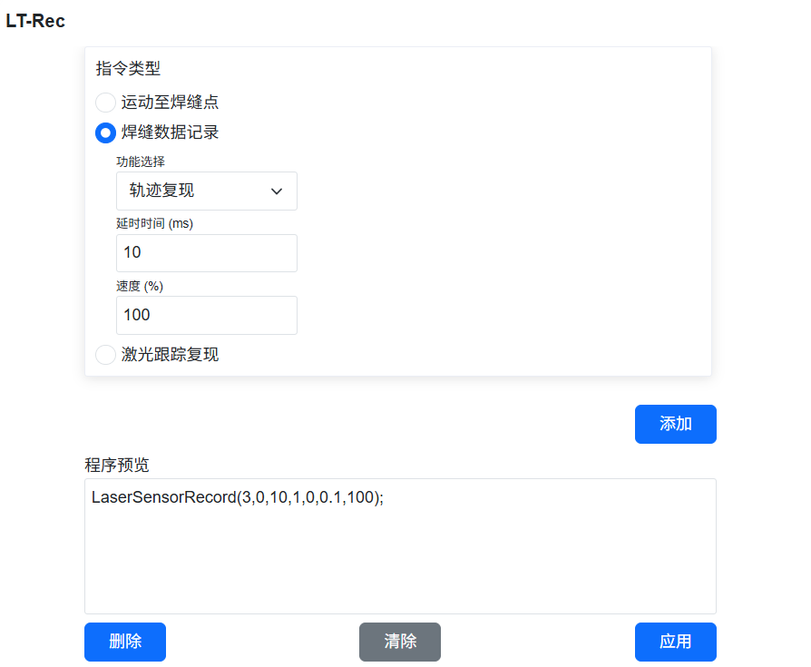

.. centered:: 圖表 8.15‑17 新增軌跡復現雷射記錄的資料指令

在「雷射追蹤」頁面選擇「資料記錄」->「軌跡復現」指令，點選「新增」並應用。指令中，等待時間預設為0ms，速度為復現速度相較記錄速度的比值，建議大於50%。

在「軌跡復現」指令後新增擴展軸運動指令即可實現擴展軸與機器人雷射追蹤同步運動。

以下為一段典型的擴展軸加雷射定點追蹤的LUA程式：

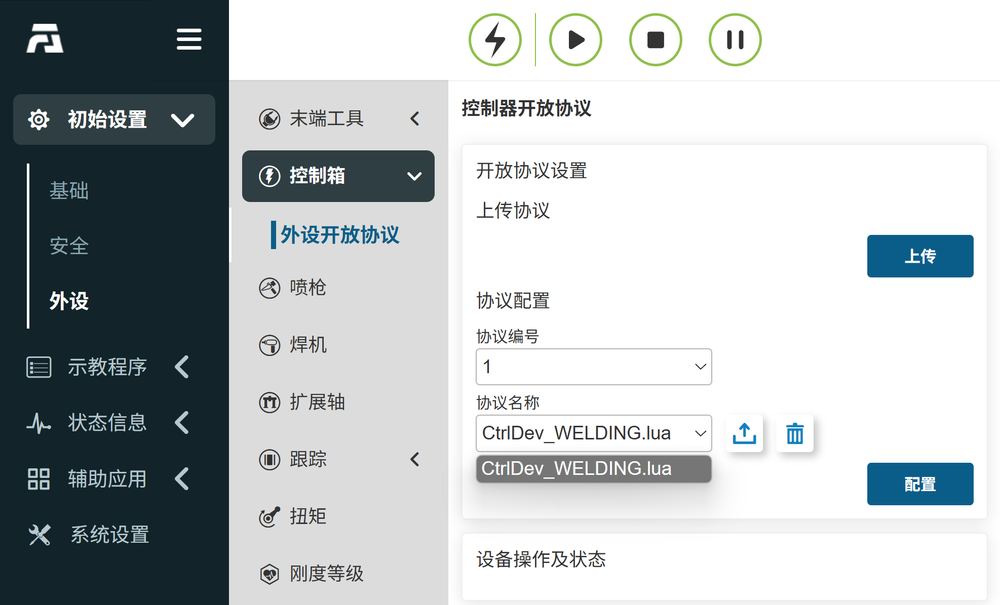

.. centered:: 圖表 8.15‑18 擴展軸加雷射資料有變換定點追蹤範例程式

機器人執行「先記錄後復現」的流程，先記錄擴展軸運動時工件焊縫的變化軌跡，之後在焊接時擴展軸與軌跡復現同步執行。

雷射資料無變換方式
**************************

使用雷射資料無變換方式進行定點追蹤無需標定擴展軸座標系。

將雷射追蹤感測器資料設定為無變換類型。

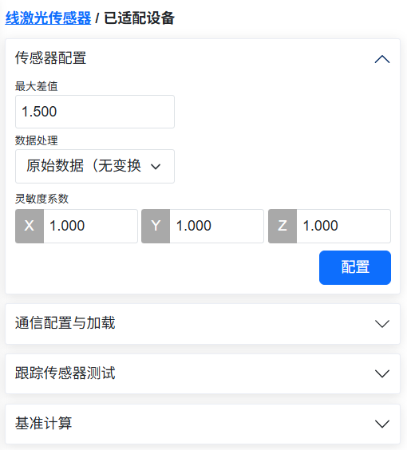

.. centered:: 圖表 8.15‑19 設定雷射資料無變換類型

點選「初始設定」->「外設」->「線雷射感測器」，在頁面下拉方塊點選「感測器配置」，將「資料處理」調整為無變換類型的資料。

.. figure:: robot_peripherals/251.png
   :align: center
   :width: 6in

.. centered:: 圖表 8.15‑20 雷射追蹤功能頁面

點選「示教程式」->「程式設計」->「雷射追蹤」進入雷射追蹤頁面，也可點選「雷射記錄」直接進入記錄頁面。

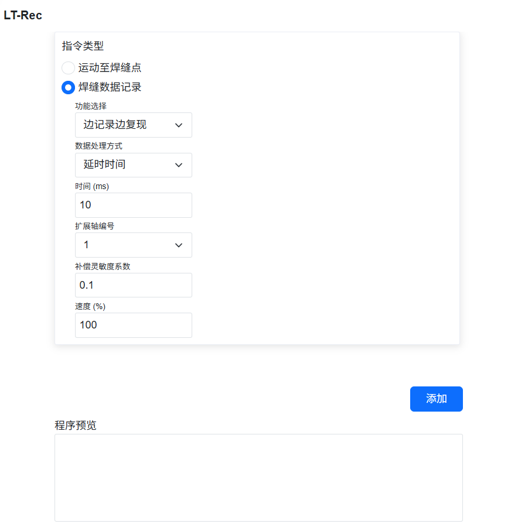

.. centered:: 圖表 8.15‑21 新增邊記錄邊復現指令

在「雷射記錄」頁面選擇「邊記錄邊復現」指令，點選「新增」並應用。指令中，可選擇「延遲時間」或「延遲距離」（推薦選擇距離），補償靈敏度係數根據實際感測器雷射資料進行調整，數值越低調整靈敏度越低抗干擾性越好，復現速度預設100%。

在「邊記錄邊復現」指令後新增擴展軸運動指令即可實現擴展軸與機器人雷射追蹤同步運動。

以下為一段典型的擴展軸加雷射資料無變換定點追蹤的LUA程式：

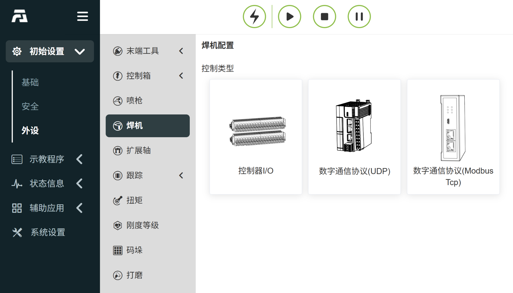

.. centered:: 圖表 8.15‑22 擴展軸加雷射資料無變換定點追蹤範例程式

焊槍對齊前置雷射處的偏移量後，機器人擴展軸運動並執行「邊記錄邊復現」的流程，前置的雷射追蹤器先記錄擴展軸運動時工件焊縫的變化軌跡，經過設定延遲距離或時間後在焊槍處調整。

雷射尋位點位置獲取功能
-----------------------------------------------------------

機器人雷射尋位點位置獲取系統構成
~~~~~~~~~~~~~~~~~~~~~~~~~~~~~~~~~~~~~~~~~~~~~~~~~~~~~~~~~~~~~~~~~~~~~~~~~~~

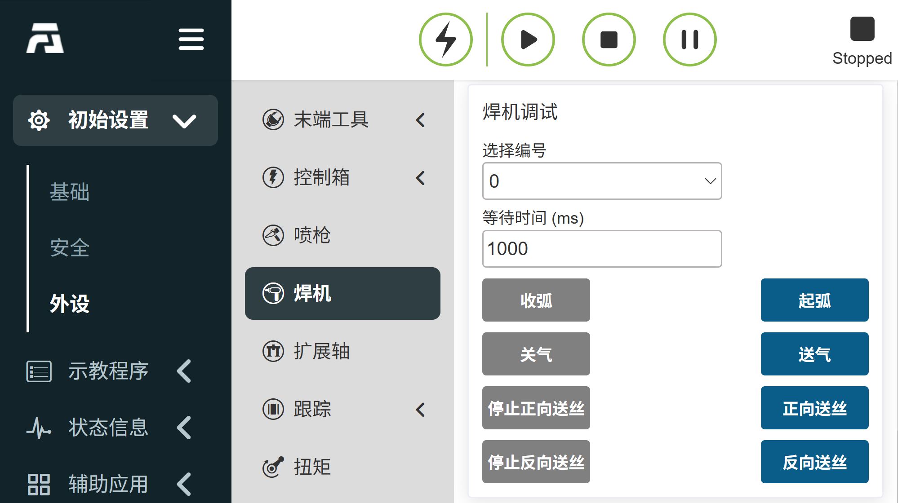

.. centered:: 圖表 8.16‑1 機器人雷射尋位點位置獲取系統構成拓撲圖
.. centered:: 系統中，（a）為電腦，（b）為機器人及其控制箱，（c）為雷射感測器。

雷射感測器通信配置
~~~~~~~~~~~~~~~~~~~~~~~~~~~~~~~~

開啟WebApp，依次點選「初始設定」->「外設」->「線雷射感測器」，對感測器通信進行配置。

.. figure:: robot_peripherals/245.png
   :align: center
   :width: 6in

.. centered:: 圖表 8.16‑2 感測器通信配置

雷射尋位點位置獲取功能
~~~~~~~~~~~~~~~~~~~~~~~~~~~~~~~~

取得雷射尋位點位置的操作流程如下：

**Step 1**:雷射尋位之前首先指定尋位開始點「seamStartPt1」、「seamStartPt2」，然後點選「示教程式」、「程式設計」，選擇「點到點」，讓雷射感測器的光線靠近焊縫1起點附近的尋位開始點1 「seamStartPt1」。

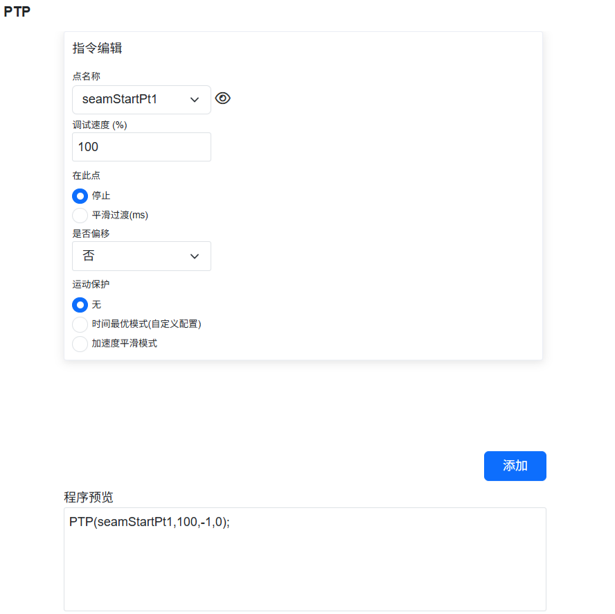

.. centered:: 圖表 8.16‑3 新增移動到尋位開始點1指令

**Step 2**:在指令類型中點選「尋位開始」後，選擇標定的感測器座標系，設定尋位方向、速度、長度以及最大尋位時間，點選「新增」按鈕。然後點選「尋位結束」，點選「新增」按鈕。

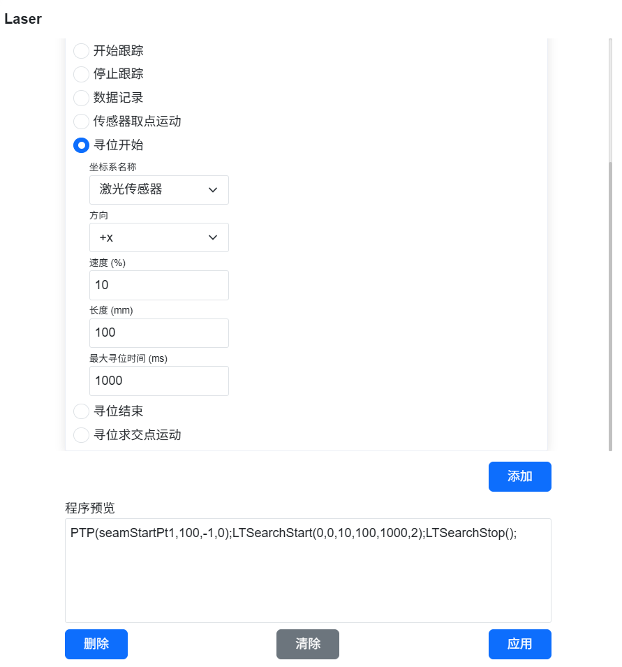

.. centered:: 圖表 8.16‑4 新增尋位開始指令

**Step 3**:選擇「感測器取點運動」，座標系名稱選擇標定的「雷射感測器」，運動方式選擇「PTP」或者「LIN」，設定除錯速度以及選擇「是否配置位姿」，點選「新增」按鈕，點選「應用」按鈕新增至LUA程式。

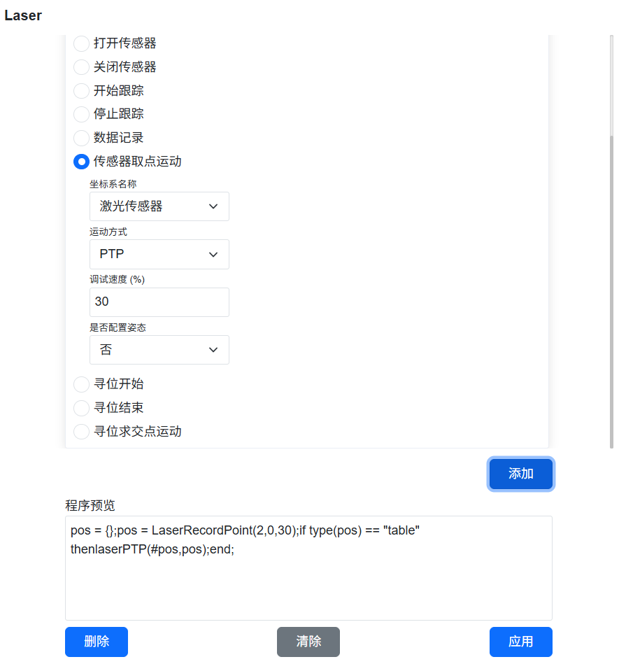

.. centered:: 圖表 8.16‑5 新增感測器取點運動指令

**Step 4**:在「程式設計」介面點選「切換模式」按鈕，將變數「pos」改為「pos1」，並刪除移動到尋位點指令。

.. figure:: robot_peripherals/264.png
   :align: center
   :width: 4in

.. centered:: 圖表 8.16‑6 程式設計切換模式

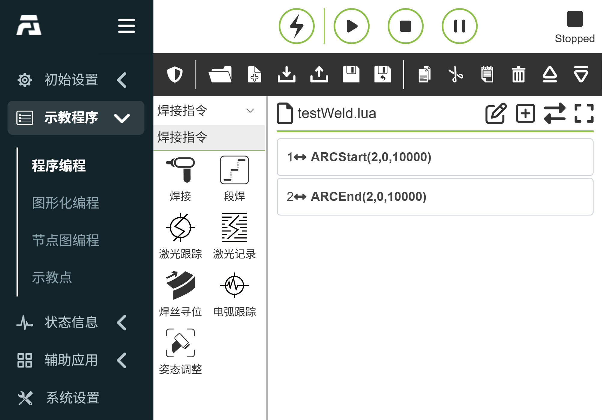

.. centered:: 圖表 8.16‑7 修改取得雷射尋位點程式

**Step 5**:按照步驟Step1-Step4，進行第二條焊縫的尋位，取得雷射尋位點位置。

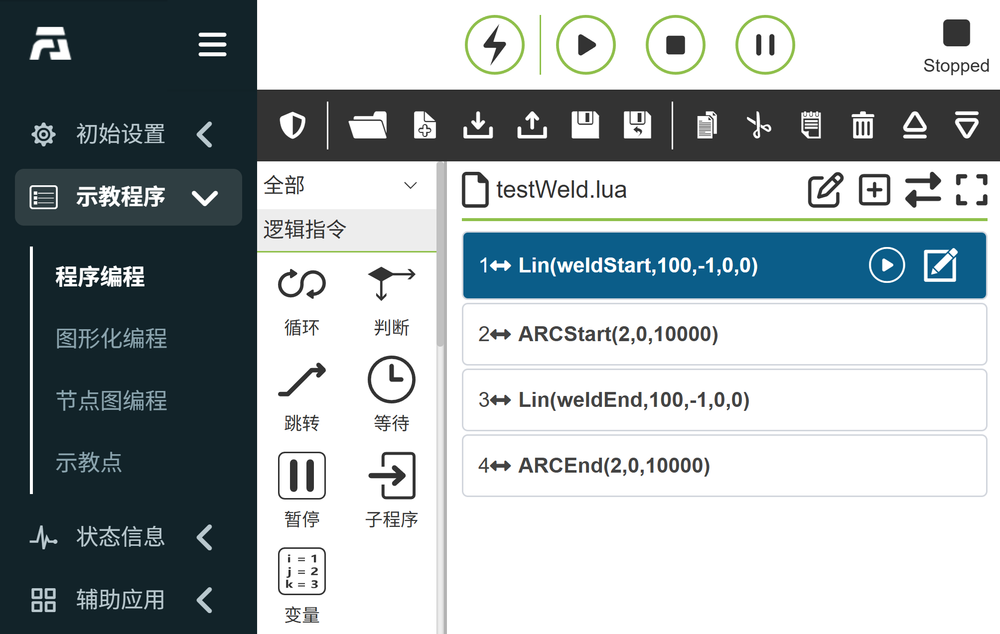

.. centered:: 圖表 8.16‑8 第二條焊縫尋位點取得
