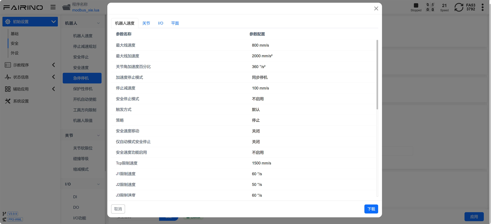
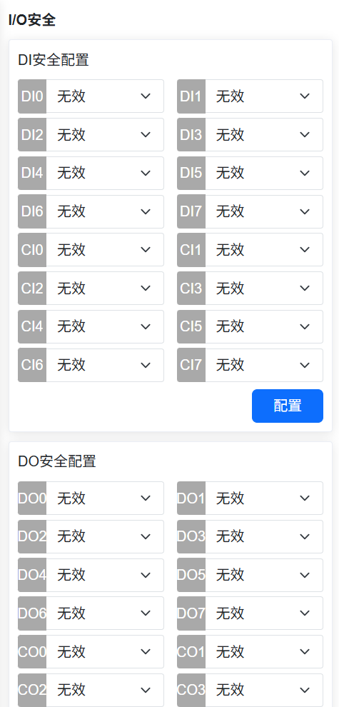
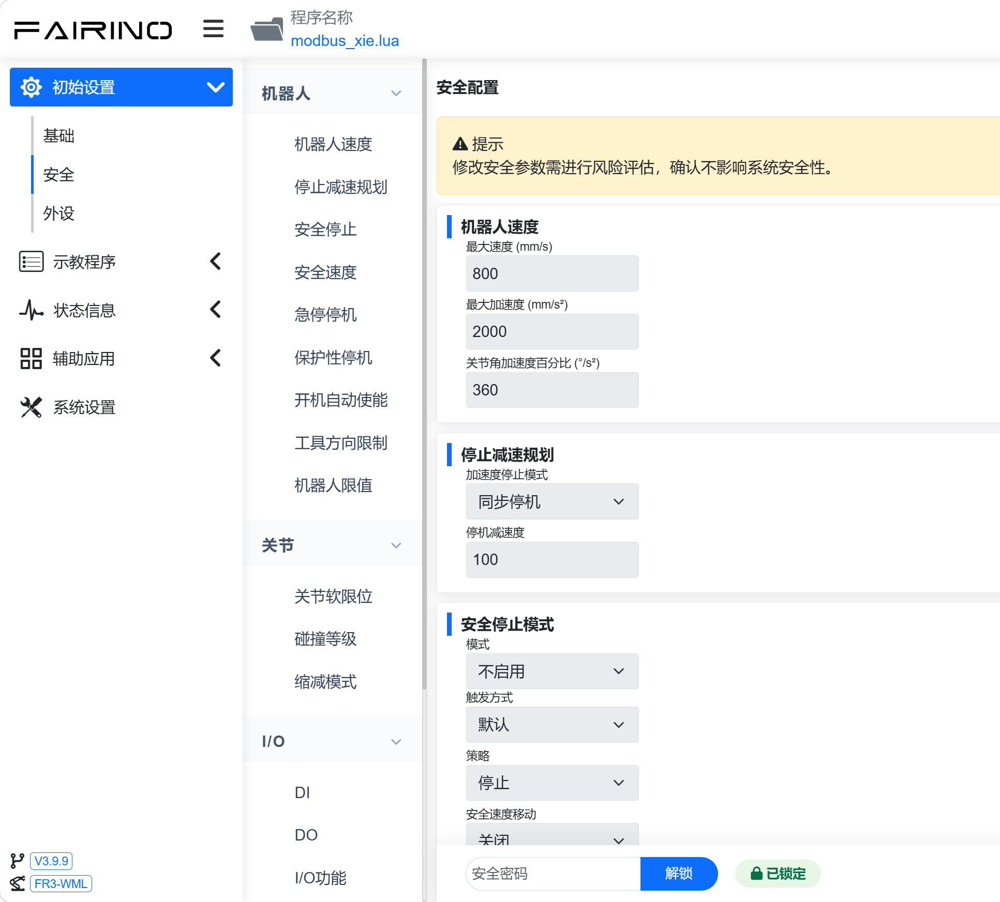
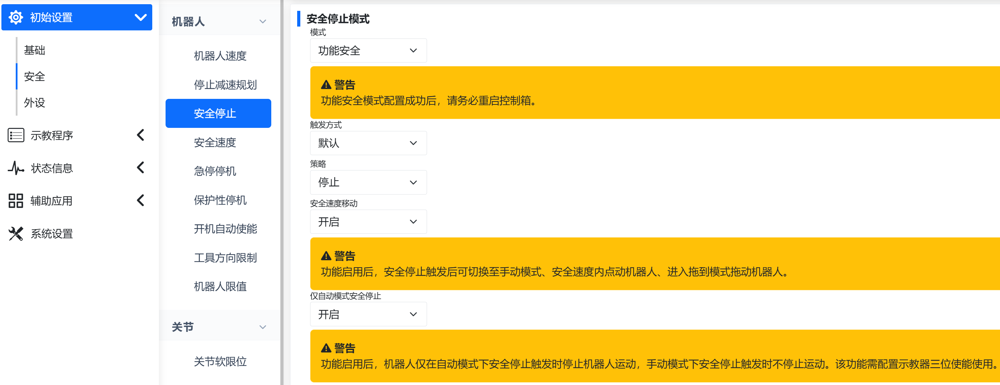
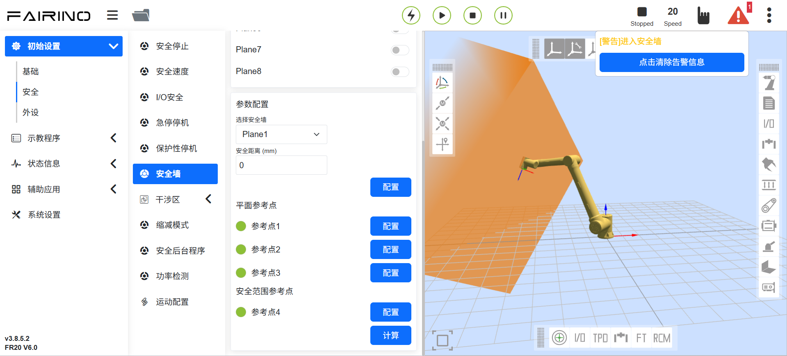
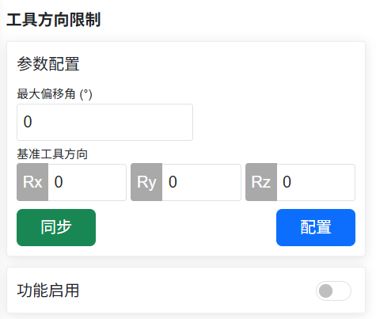
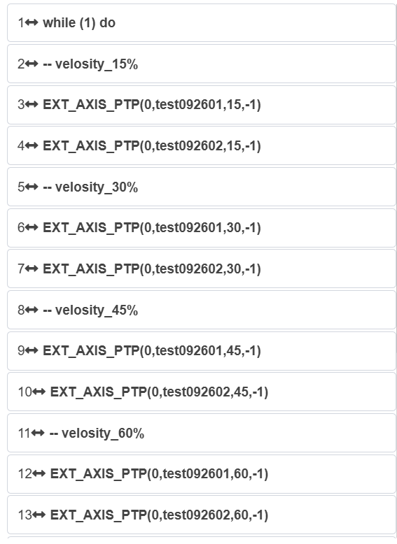
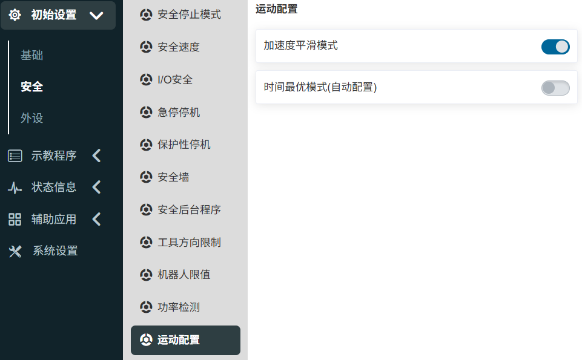
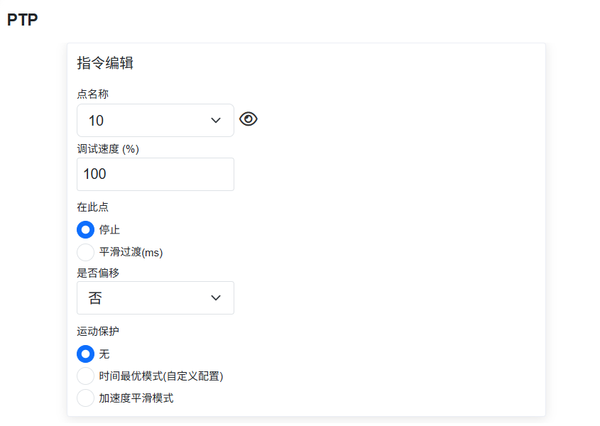
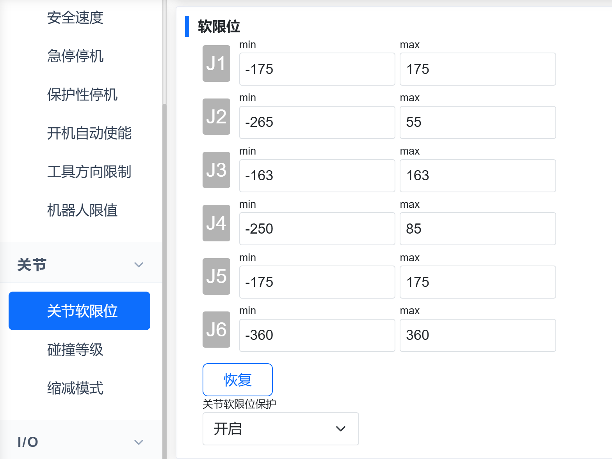

安全設定 
===============

.. toctree:: 
   :maxdepth: 6

安全停止模式
----------------

點選選單列“初始設定”->“安全性”，點選“安全停止模式”子選單進入設定介面，設定安全停止模式參數功能。

.. image:: safety/001.png
   :width: 4in
   :align: center

.. centered:: 圖表 7.1-1 安全停止模式配置

安全速度
----------------

點選選單列“初始設定”->“安全性”，點選“安全速度”子選單進入設定介面，設定安全速度。

.. note:: TCP手動速度小於250mm/s。

.. centered:: 圖表 7.2-1 安全手動速度配置

I/O安全
----------------

點選選單列“初始設定”->“安全性”，點選“I/O安全性”子選單進入設定介面。

HMI提供對16路數字量輸入和16路數字量輸出的安全狀態進行設置，可設置為有效或無效狀態，當控制器判斷到處於安全狀態時，16路數字量輸入和16路數字量輸出被設定成安全狀態。

.. centered:: 圖表 7.3-1 I/O安全狀態配置

在Linux系統下：
 「I/O安全」中提供DIO安全功能，安全功能為雙路DI或DO，當偵測到安全DI訊號或安全狀態標誌觸發時，輸出DO。

.. centered:: 圖表 7.3-2 I/O安全功能配置

急停機
----------------

點選選單列“初始設定”->“安全性”，點選“急停停機”子選單進入設定介面。

急停機類型0、1a、1b、2可設定、停機時間限值可設定、停止距離限值可設定。

- 透過控制器送控制箱板，急停停機類型0控制箱板直接斷電；

- 急停停機類型1a為減速停機後，切斷本體電源；

- 急停停機型1b為減速停機後，不切斷本體電源，本體去使能；

.. image:: safety/005.png
   :width: 4in
   :align: center

.. centered:: 圖表 7.4-1 急停停機配置

安全停止恢復可選自動使能功能
~~~~~~~~~~~~~~~~~~~~~~~~~~~~~~~~~~~~

概述
+++++++++++++++++++++

機器人在經歷過1b類急停停機後，提供了手動使能和自動使能兩種模式，以供使用者自行選擇。當選為手動使能時，使用者需在鬆開急停按鈕後，將機器人的運行模式改為自動，手動點擊使能按鈕進行機器人使能；當選為自動使能時，使用者在鬆開急停按鈕後，機器人即可自動使能。

操作流程
+++++++++++++++++++++++++++

**Step1**：點擊「初始設定」—>「安全」—>「急停停機」按鈕，「停機類型」選為「1b類」，並根據實際需要設定「停機時間限制」和「停機距離限制」參數，「急停復位後使能策略」可選為「手動使能」或「自動使能」，如圖2-1所示。

.. image:: safety/025.png
   :width: 6in
   :align: center

.. centered:: 圖表 7.4-2 使能策略設定

**Step2**：當選為「自動使能」時，使用者在鬆開急停按鈕後，機器人即可自動使能；當選為「手動使能」時，使用者需在鬆開急停按鈕後，在自動模式下，手動點擊使能按鈕進行機器人使能，如圖2-2所示。

.. image:: safety/026.png
   :width: 6in
   :align: center

.. centered:: 圖表 7.4-3 手動使能操作

保護性停機
----------------

點選選單列“初始設定”->“安全性”，點選“保護性停機”子選單進入設定介面。

保護性停機類型0、1、2，保護性停機類型0控制箱板直接斷電，保護性停機類型1控制箱板先通知控制器控制機器人停住然後控制器回授控制箱板斷電，保護性停機類型2控制箱板通知控制器控制機器人停住。

.. image:: safety/006.png
   :width: 4in
   :align: center

.. centered:: 圖表 7.5-1 保護性停機配置

.. important::
 安全資料狀態標誌與控制箱載板故障回饋透過Web端與控制器狀態回饋中獲取，當出現標誌位元為1時在WebAPP警報狀態中提示安全資料狀態異常。控制箱載板故障取得後的依據報錯代碼在WebAPP警報狀態中展示具體報錯訊息。

.. image:: safety/007.png
   :width: 4in
   :align: center

.. centered:: 圖表 7.5-2 WebAPP警報狀態

安全牆配置
---------------

點選選單列“初始設定”->“安全性”，點選“安全牆配置”子選單進入設定介面。

- **安全牆設定**：點選啟用按鈕，可啟用的對應的安全牆。當安全牆未配置安全範圍時，會提示報錯。點選下拉框，選擇想要設定的安全牆，自動帶出安全距離(可不設置，預設為0)，再點選「設定」按鈕，設定成功。
  
.. image:: safety/008.png
   :width: 4in
   :align: center

.. centered:: 圖表 7.6-1 安全牆配置

- **安全牆參考點配置**：選擇安全牆後，可設定四個參考點。前三個點為平面參考點，用來確認設定的安全牆的平面。第四個點為安全範圍參考點，用來確認設定的安全牆的安全範圍。

.. important::
 若參考點設定成功，則亮綠燈。反之，則亮黃燈。直到參考點設定成功後轉為綠燈。當四個參考點都設定成功後，可計算其安全範圍，計算成功後安全範圍參數點狀態恢復預設。

.. centered:: 圖表 7.6-2 安全範圍參考點設定

- 應用效果：啟用配置成功的安全牆。拖曳機器人，若機器人末端TCP處在設定安全範圍內，則系統正常。若處在設定安全範圍之外，則提示報錯。

.. centered:: 圖表 7.6-3 安全範圍設定成功後效果圖

安全後台程式
---------------

點選選單列“初始設定”->“安全性”，點選“安全後台程式”子選單進入設定介面。

使用者點選「功能啟用」按鈕開啟或關閉安全後台程式的設定。選擇"意外狀況 "和"背景程式"，點選「設定」按鈕配置意外狀況處理邏輯的參數。

啟用安全後台程序並設定意外情況場景和後台程序，當使用者開始執行程序，發生的意外情況場景與設定的意外情況相符時，機器人會執行相對應的後台程序，起到安全防護的作用。

.. centered:: 圖表 7.7-1 安全後台程式

工具方向限制（僅在Linux系統下使用）
---------------------------------------------

點選選單列“初始設定”->“安全性”，點選“工具方向限制”子選單進入設定介面。

工具方向限制是作用於機器人工具末端笛卡爾空間的用來限制機器人末端姿態運動範圍的保護性功能，包括了功能啟用設置，基準工具方向設定，最大偏移角設置。最大偏移角定義了工具末端笛卡爾座標系Z軸與基準工具方向的最大夾角限制角度值，通常可理解為圓錐形空間。

.. centered:: 圖表 7.8-1 工具方向限制

機器人限值（僅在Linux系統下使用）
---------------------------------------------

點選選單列“初始設定”->“安全性”，點選“機器人限值”子選單進入設定介面。

機器人限值包括動量和功率，其中動量限值用於限制機器人最大動量，功率限值用於限制機器人所做的機械功。

.. image:: safety/013.png
   :width: 4in
   :align: center

.. centered:: 圖表 7.9-1 機器人限值

功率檢測（僅在QX系統下使用）
---------------------------------------------

點選選單列“初始設定”->“安全性”，點選“功率偵測”子選單進入設定介面。

當直接作用於機器人的電流環（僅有指令servoJT），用來限制機器人做的功。偵測到機器人速度和力矩的積分超過限值，即進行功率保護。

.. image:: safety/014.png
   :width: 4in
   :align: center

.. centered:: 圖表 7.10-1 功率偵測

運動配置
---------------------------------------------

T形速度特性優化+Blending平滑功能
~~~~~~~~~~~~~~~~~~~~~~~~~~~~~~~~~~~~~~~~~~~~~~~~~~~~~

概述
++++++++++++++++++++++

在兩段軌跡之間進行blending，可避免因完全停止而帶來的頻繁啟停問題，從而提升機器人的運動效率。

本功能主要針對PTP-PTP、LIN-LIN、ARC-ARC、LIN-ARC、ARC-LIN指令間進行blending，其餘指令間的blending不生效。

操作流程
++++++++++++++++++++++

因各指令的操作方式類似，本手冊以PTP-PTP間的blending為例說明該功能的操作方法，該功能可通過兩種方式實現：使用Lua指令、使用運動配置開關。

使用Lua指令
*****************************

**步驟1**：選擇要執行PTP功能的示教點，本手冊以「A0」～「A5」作為示教點的名稱。

**步驟2**：點擊「示教程序」→「程序編程」按鈕，選擇「運動指令」中的「點到點」指令，在「指令編輯」中選擇示教點並設置調試速度，運動保護選擇「加速度平滑模式」，在需要平滑的點處設置「平滑過渡」參數。

.. centered:: 圖表 7.11-1 加速度平滑PTP的blending指令設置

**步驟3**：生成Lua程序並運行，即可實現對PTP-PTP的blending功能，該方式僅對`AccSmoothStart()`和`AccSmoothEnd()`之間的指令使用優化後的T形速度進行運動，對其餘指令使用原T形速度進行運動。

.. image:: safety/021.png
   :width: 4in
   :align: center

.. centered:: 圖表 7.11-2 Lua指令方式進行PTP-PTP間blending典型程序

使用運動配置開關
***********************************

**步驟1**：點擊「初始設置」→「安全」→「運動配置」按鈕，打開「加速度平滑模式」的開關。

.. centered:: 圖表 7.11-3 加速度平滑模式配置開關設置

**步驟2**：選擇要執行PTP-PTP功能的示教點，本手冊以「A0」～「A5」作為示教點的名稱。

**步驟3**：點擊「示教程序」→「程序編程」按鈕，選擇「運動指令」中的「點到點」指令，在「指令編輯」中選擇示教點並設置調試速度，運動保護選擇「無」，在需要平滑的點處設置「平滑過渡」參數。

.. centered:: 圖表 7.11-4 常規PTP的blending指令設置

**步驟4**：生成Lua程序並運行，即可實現對PTP-PTP的blending功能，典型程序和常規PTP程序相同，該方式會對所有指令使用優化後的T形速度進行運動。

.. image:: safety/024.png
   :width: 4in
   :align: center

.. centered:: 圖表 7.11-5 使用配置開關進行PTP-PTP間blending的典型程序

FIR自適應參數功能+FIR暫停恢復功能
~~~~~~~~~~~~~~~~~~~~~~~~~~~~~~~~~~~~~~~~~~~~~~~~~~~~~

概述
++++++++++++++++++++++

機器人時間最優模式參數自適應配置功能實現了無需調試配置其各項參數，該功能根據當前機器人的作業狀態，自適應完成時間最優模式的參數配置，提升調試效率。

操作流程
++++++++++++++++++++++

機器人基礎運動指令PTP、LIN及ARC的使用方式類似，本例以時間最優模式的PTP運動指令作為主要示例。

**步驟1**：在機器人Web控制界面，依次點擊「初始設置」→「安全」→「運動配置」，進入「運動配置」界面。

.. image:: safety/015.png
   :width: 6in
   :align: center

.. centered:: 圖表 7.11-6 運動配置界面

**步驟2**：在「運動配置」界面，點擊「時間最優模式」開關，進入「時間最優模式」界面。

.. centered:: 圖表 7.11-7 時間最優模式界面

.. note:: 在「時間最優模式」界面的「參數配置」欄中，在「調節係數」欄中可設置為-100~100，表示為縮放比例，用來控制運動指令的時間最優程度，默認值為1。

**步驟3**：確定要執行PTP運動的示教點，本例以「A0」～「A5」作為示教點的名稱。

**步驟4**：在機器人Web控制界面，依次點擊「示教程序」→「程序編程」，進入「運動指令」界面。

.. image:: safety/017.png
   :width: 2in
   :align: center

.. centered:: 圖表 7.11-8 運動指令界面

**步驟5**：在「運動指令」界面中，點擊「點到點」，進入「PTP」指令編輯界面，分別在「點名稱」下拉框中選擇示教點、「調試速度」欄中設置期望速度比例、「在此點」欄中選擇「停止」、「是否偏移」下拉框中選擇「否」及「運動保護」欄中選擇「無」後，點擊「添加」。

.. image:: safety/018.png
   :width: 6in
   :align: center

.. centered:: 圖表 7.11-9 PTP運動指令編輯界面

**步驟6**：「PTP」運動指令編輯界面，點擊「應用」，即自動生成相應的Lua程序。

.. image:: safety/019.png
   :width: 4in
   :align: center

.. centered:: 圖表 7.11-10 典型時間最優模式的PTP運動Lua程序

.. note:: 
   典型時間最優模式的PTP運動Lua程序與一般PTP運動Lua程序無異，其區別在於步驟2中已開啟了「時間最優模式」功能。

   開啟了「時間最優模式」功能開關，當前機器人基礎運動指令PTP、LIN及ARC均處於時間最優模式，在該界面中關閉「時間最優模式」功能開關，即可恢復基礎運動指令PTP、LIN及ARC狀態。
   在該界面不能同時開啟「加速度平滑模式」功能開關。