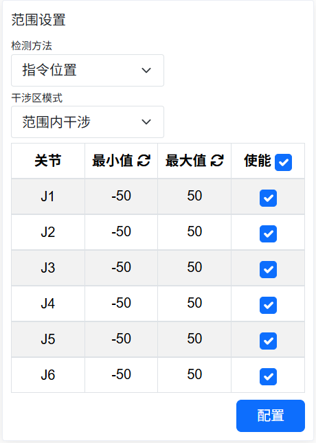
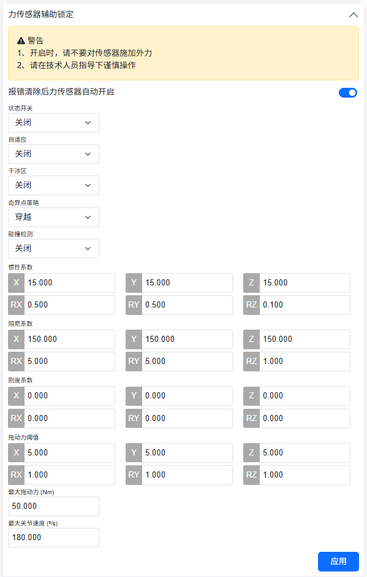
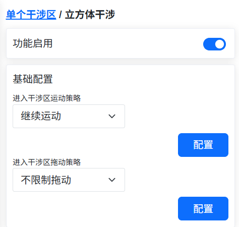
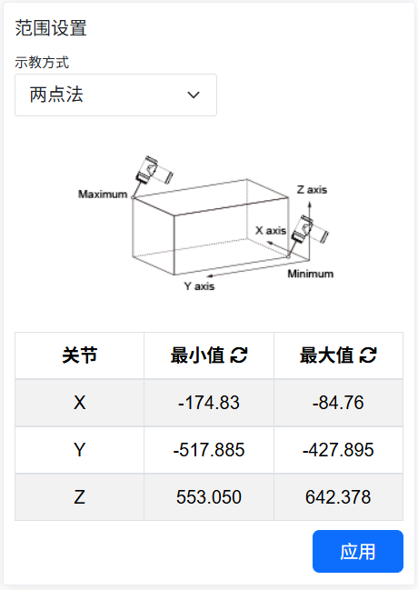
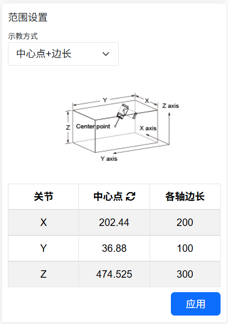
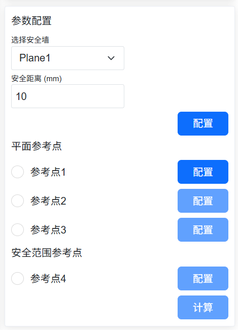
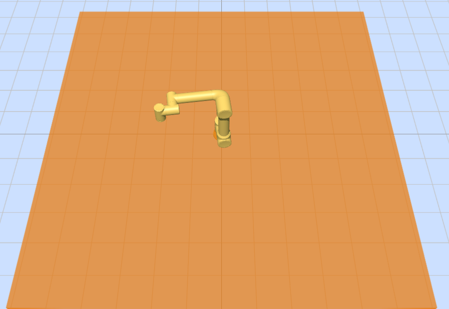
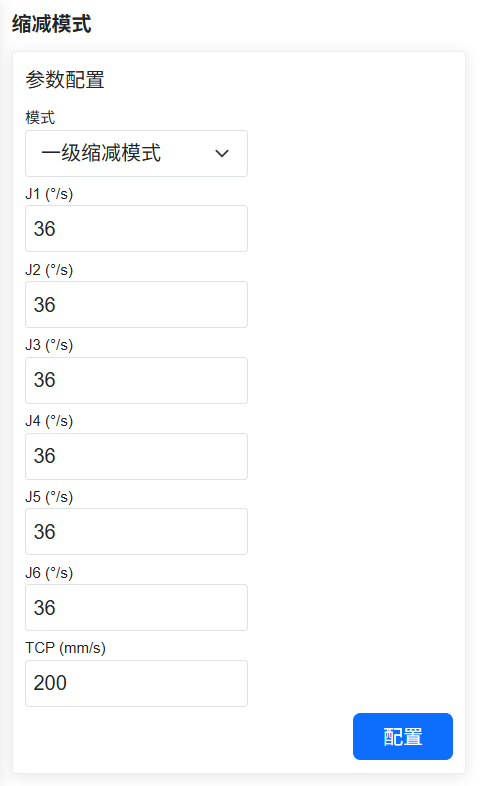

安全
===============

.. toctree::
   :maxdepth: 6

安全停止
----------------

點擊選單列「初始設定」->「安全」，點擊「安全停止」子選單進入配置介面，設定安全停止模式和安全停止策略參數功能。

.. image:: safety/001.png
   :width: 4in
   :align: center

.. centered:: 圖表 7.1-1 安全停止配置

安全速度
----------------

點擊選單列「初始設定」->「安全」，點擊「安全速度」子選單進入配置介面，設定安全速度。

.. note:: TCP手動速度小於250mm/s。

.. image:: safety/002.png
   :width: 4in
   :align: center

.. centered:: 圖表 7.2-1 安全手動速度配置

I/O安全
----------------

點擊選單列「初始設定」->「安全」，點擊「I/O安全」子選單進入配置介面。

HMI提供對16路數位量輸入和16路數位量輸出的安全狀態進行設定，可設定為有效或無效狀態，當控制器判斷到處於安全狀態時，16路數位量輸入和16路數位量輸出被設定成安全狀態。

.. image:: safety/003.png
   :width: 4in
   :align: center

.. centered:: 圖表 7.3-1 I/O安全狀態配置

在LA系統下：
    「I/O安全」中提供DIO安全功能，安全功能為雙路DI或者DO，當檢測到安全DI信號或安全狀態標誌觸發時，輸出DO。

.. image:: safety/004.png
   :width: 4in
   :align: center

.. centered:: 圖表 7.3-2 I/O安全功能配置

急停停機
----------------

點擊選單列「初始設定」->「安全」，點擊「急停停機」子選單進入配置介面。

急停停機類型0、1a、1b、2可設定、停機時間限值可設定、停止距離限值可設定。

- 透過控制器送控制箱板，急停停機類型0控制箱板直接斷電；
  
- 急停停機類型1a為減速停機後，切斷本體電源；
  
- 急停停機類型1b為減速停機後，不切斷本體電源，本體去使能；

.. image:: safety/005.png
   :width: 4in
   :align: center

.. centered:: 圖表 7.4-1 急停停機配置

保護性停機
----------------

點擊選單列「初始設定」->「安全」，點擊「保護性停機」子選單進入配置介面。

保護性停機類型0、1、2，保護性停機類型0控制箱板直接斷電，保護性停機類型1控制箱板先通知控制器控制機器人停住然後控制器回饋控制箱板斷電，保護性停機類型2控制箱板通知控制器控制機器人停住。

.. image:: safety/006.png
   :width: 4in
   :align: center

.. centered:: 圖表 7.5-1 保護性停機配置

.. important::
    安全數據狀態標誌和控制箱載板故障回饋透過Web端與控制器狀態回饋中獲取，當出現標誌位為1時在WebAPP警報狀態中提示安全數據狀態異常。控制箱載板故障獲取後的依據報錯代碼在WebAPP警報狀態中展示具體報錯資訊。

.. image:: safety/007.png
   :width: 4in
   :align: center

.. centered:: 圖表 7.5-2 WebAPP警報狀態

干涉區配置
--------------

在「初始設定」->「安全」->「干涉區」的選單列下，點擊「單個」子選單項進入干涉區配置功能介面。

首先我們需要對干涉方式和進入干涉區操作進行配置，干涉方式分為「軸干涉」和「立方體干涉」。

.. image:: safety/025.png
   :width: 3in
   :align: center

.. centered:: 圖表 7.6‑1 干涉區方式

透過滑塊開關控制是否開啟。首先進行干涉區運動配置「繼續運動」或者「停止」。接下來設定進入干涉區拖動配置，使用者可以根據需求設定拖動模式下進入干涉區後策略，不限制拖動，阻抗回呼和切換回手動模式。

.. image:: safety/026.png
   :width: 3in
   :align: center

.. centered:: 圖表 7.6‑2 干涉區配置

選擇軸干涉，需要對軸干涉的參數進行配置，檢測方法分為「指令位置」和「回饋位置」兩種，干涉區模式分為「範圍內干涉」和「範圍外干涉」兩種，接下來設定每個關節的範圍以及各個關節範圍是否使能，可以輸入數值，也可以透過「最小值」和「最大值」後的「重新整理圖示」將目前機器人的位置記錄到當中，最後點擊配置即可。

.. image:: safety/027.png
   :width: 3in
   :align: center

.. centered:: 圖表 7.6‑3 軸干涉配置

選擇立方體干涉，需要對立方體干涉的參數進行配置，檢測方法分為「指令位置」和「回饋位置」兩種，干涉區模式分為「範圍內干涉」和「範圍外干涉」兩種，參考座標系分為「基座標」和「工件座標」，根據實際使用選擇設定。接下來設進行範圍設定，範圍設定分為兩種方法，首先看第一種方法「兩點法」，即立方體的兩個對角的頂點組成，我們可以透過輸入或者機器人示教記錄位置。最後點擊應用即可。

.. image:: safety/028.png
   :width: 3in
   :align: center

.. centered:: 圖表 7.6‑4 立方體干涉配置

接下來看第二種方法「中心點+邊長」，即立方體的中心位置點和立方體的邊長構成干涉區，我們可以透過輸入或者機器人示教記錄位置。最後點擊應用即可。

.. image:: safety/029.png
   :width: 3in
   :align: center

.. centered:: 圖表 7.6‑5 立方體干涉配置

力感測器輔助拖動下進入軸干涉安全回呼功能
~~~~~~~~~~~~~~~~~~~~~~~~~~~~~~~~~~~~~~~~~~~~~~~~~~~~~~~~~~~~~~~~~~~~~~

概述
+++++++++++++++++++++++++

力感測器輔助拖動下進入軸干涉的安全回呼功能是力感測器輔助拖動與干涉區共存時，當機器人進入干涉區時，機器人自動切換成拖動模式，具有阻抗回呼效果；當機器人退出干涉區後，機器人自動切換成力感測器輔助拖動。可滿足使用者在力感測器輔助拖動下的多種使用場景。

操作流程
++++++++++++++++++++++++

關節限位環
********************************
**Step1**：登入web介面，點擊「關節限位環」開關，機器人關節處出現關節限位環，如下圖所示。

.. image:: safety/030.png
   :width: 4in
   :align: center

.. centered:: 圖表 7.6‑6 web介面關節限位環

**Step2**：關節限位環上白標指針代表關節實際角度；缺口代表對應關節軟限位位置，關節限位環缺口大小隨軟限位大小變化；關節運動時，關節限位環與關節保持相對靜止。

軸干涉配置
********************************
**Step1**：配置並啟動軸干涉。依序點擊「初始設定」—>「安全」—>「干涉區」—>「單個」，進入干涉區配置頁面，點擊「軸干涉」卡片進入介面，開啟「功能開啟」滑塊。

**Step2**：可設定「運動策略」為「繼續運動」，選擇「拖動策略」為「阻抗回呼」並設定阻抗回呼參數，如下圖所示，阻抗回呼參數表示阻抗回呼時的回彈力，數值越大回彈力越大，建議參數配置為「5」。

.. image:: safety/031.png
   :width: 4in
   :align: center

.. centered:: 圖表 7.6‑7 軸干涉配置介面

**Step3**：設定軸干涉區範圍。可設定「檢測模式」為「回饋位置」，「干涉區模式」可選擇「範圍內干涉」及「範圍外干涉」兩種模式；設定各關節干涉區範圍，選擇「使能」開啟對應軸干涉範圍，如下圖所示。

.. centered:: 圖表 7.6‑8 干涉區範圍配置介面

**Step4**：設定「干涉區模式」為「範圍內干涉」，web介面關節限位環綠色為自由運動區域，黃色為干涉區域，白標指針所在區域高亮顯示，如下圖所示。

.. image:: safety/033.png
   :width: 4in
   :align: center

.. centered:: 圖表 7.6‑9 「範圍內干涉」時關節限位環顯示

**Step5**：設定「干涉區模式」為「範圍外干涉」，web介面關節限位環綠色為自由運動區域，黃色為干涉區域，白標指針所在區域高亮顯示，如下圖所示。

.. image:: safety/034.png
   :width: 4in
   :align: center

.. centered:: 圖表 7.6‑10 「範圍外干涉」時關節限位環顯示

力感測器輔助拖動下進入軸干涉區
++++++++++++++++++++++++++++++++++++++++++++++++++

**Step1**：依序點擊「輔助應用」—>「工具應用」—>「拖動鎖定」將力感測器輔助鎖定功能「狀態開關」切換為「開啟」，將干涉區選項選擇「開啟」，設定相關系數並應用，如下圖所示。

.. centered:: 圖表 7.6‑11 力感測器輔助拖動配置介面

**Step2**：在力感測器輔助拖動下拖動機器人，當機器人關節角度到達干涉區範圍時，切換機器人模式為電流環拖動，具有阻抗回呼效果，可遠離軸干涉區；退出軸干涉區範圍後，切換機器人模式為力感測器輔助拖動。

立方體干涉配置
++++++++++++++++++++++++++++++++++

**Step1**：設定立方體干涉區。依序點擊「初始設定」—>「安全」—>「干涉區」—>「單個」，進入干涉區配置頁面，點擊「立方體干涉」卡片進入介面，開啟「功能開啟」滑塊。

**Step2**：可設定「運動策略」為「繼續運動」，選擇「拖動策略」為「不限制拖動」，如下圖所示。

.. centered:: 圖表 7.6‑12 立方體干涉區配置

**Step3**：設定立方體干涉區參數配置。可設定「檢測模式」為「回饋位置」，「干涉區模式」可選擇「範圍內干涉」及「範圍外干涉」兩種模式，「參考座標」設定為「基座標」。

**Step4**：選擇立方體干涉區範圍的示教方式為「兩點法」。示教機器人選擇兩個點位，分別為笛卡爾空間最小點及最大點，點擊「應用」後web介面出現虛擬立方體，如下圖所示。

.. centered:: 圖表 7.6‑13 「兩點法」設定立方體干涉區

.. image:: safety/038.png
   :width: 4in
   :align: center

.. centered:: 圖表 7.6‑14 web介面顯示虛擬立方體

**Step5**：選擇立方體干涉區範圍的示教方式為「中心點+邊長」。示教機器人一個點位，設定以示教點為中心的X、Y、Z三軸邊長，如下圖所示，點擊「應用」後web介面出現虛擬立方體。

.. centered:: 圖表 7.6‑15 「中心點+邊長」設定立方體干涉區

**Step6**：設定「干涉區模式」為「範圍內干涉」，當機器人末端在立方體範圍外，web介面虛擬立方體顯示為透明度40%黃色，當機器人末端在立方體範圍內時，立方體呈90%透明度黃色，並出現「進入干涉區」警告，如下圖所示。

.. image:: safety/040.png
   :width: 4in
   :align: center

.. centered:: 圖表 7.6‑16 「範圍內干涉」模式時進入立方體干涉區

**Step7**：設定「干涉區模式」為「範圍外干涉」，當機器人末端在立方體範圍內，web介面虛擬立方體顯示為透明度40%綠色，當機器人末端在立方體範圍外時，立方體呈90%透明度綠色，並出現「進入干涉區」警告，如下圖所示。

.. image:: safety/041.png
   :width: 4in
   :align: center

.. centered:: 圖表 7.6‑17 「範圍外干涉」模式時立方體干涉區顯示

安全牆配置
++++++++++++++++++++++++++++++++++++++++++
**Step1**：設定安全牆。依序點擊「初始設定」—>「安全」—>「安全牆」進入安全牆配置介面，web介面支援最多同時設定8個安全牆，選擇安全牆並配置安全牆，配置完成後啟用對應安全牆，web介面出現透明度40%橙色虛擬牆體，如下圖所示。

.. centered:: 圖表 7.6‑18 安全牆配置

.. centered:: 圖表 7.6‑19 web介面虛擬牆體顯示

**Step2**：機器人末端進入安全牆，虛擬牆體呈90%透明度橙色，並出現「進入安全牆」警告，如下圖所示。

.. image:: safety/044.png
   :width: 4in
   :align: center

.. centered:: 圖表 7.6‑20 機器人末端進入安全牆web介面虛擬牆體顯示

縮減模式
---------------

點擊選單列「初始設定」->「安全」，點擊「縮減模式」子選單進入配置介面，選擇「一級/二級模式」配置關節速度和末端TCP速度。

.. centered:: 圖表 7.7-1 縮減模式

安全牆
---------------

點擊選單列「初始設定」->「安全」，點擊「安全牆配置」子選單進入配置介面。

-  **安全牆配置**：點擊啟用按鈕，可啟用的相應的安全牆。當安全牆未配置安全範圍時，會提示報錯。點擊下拉框，選擇想要設定的安全牆，自動帶出安全距離(可不設定，預設為0)，再點擊「設定」按鈕，設定成功。
  
.. image:: safety/008.png
   :width: 4in
   :align: center

.. centered:: 圖表 7.8-1 安全牆配置

-  **安全牆參考點配置**：選擇安全牆後，可設定四個參考點。前三個點為平面參考點，用來確認設定的安全牆的平面。第四個點為安全範圍參考點，用來確認設定的安全牆的安全範圍。

.. important::
   若參考點設定成功，則亮綠燈。反之，則亮黃燈。直到參考點設定成功後轉為綠燈。當四個參考點都設定成功後，可計算其安全範圍，計算成功後安全範圍參數點狀態恢復預設。

.. image:: safety/009.png
   :width: 4in
   :align: center

.. centered:: 圖表 7.8-2 安全範圍參考點設定

-  應用效果：啟用配置成功的安全牆。拖動機器人，若機器人末端TCP處在設定安全範圍內，則系統正常。若處在設定安全範圍之外，則提示報錯。

.. image:: safety/010.png
   :width: 6in
   :align: center

.. centered:: 圖表 7.8-3 安全範圍設定成功後效果圖

安全後台程式
---------------

點擊選單列「初始設定」->「安全」，點擊「安全後台程式」子選單進入配置介面。

使用者點擊「功能啟用」按鈕開啟或者關閉安全後台程式的設定。選擇"意外情況 "和"後台程式"，點擊「設定」按鈕配置意外情況處理邏輯的參數。

啟用安全後台程式並設定意外情況場景和後台程式，當使用者開始執行程式，發生的意外情況場景與設定的意外情況匹配時，機器人會執行相對應的後台程式，起到安全防護的作用。

.. image:: safety/011.png
   :width: 4in
   :align: center

.. centered:: 圖表 7.9-1 安全後台程式

工具方向限制（僅在LA系統下使用）
---------------------------------------------

點擊選單列「初始設定」->「安全」，點擊「工具方向限制」子選單進入配置介面。

工具方向限制是作用於機器人工具末端笛卡爾空間的用來限制機器人末端姿態運動範圍的保護性功能，包括了功能啟用設定，基準工具方向設定，最大偏移角設定。最大偏移角定義了工具末端笛卡爾座標系Z軸與基準工具方向的最大夾角限制角度值，通常可理解為圓錐形空間。

.. image:: safety/012.png
   :width: 4in
   :align: center

.. centered:: 圖表 7.10-1 工具方向限制

機器人限值（僅在LA系統下使用）
---------------------------------------------

點擊選單列「初始設定」->「安全」，點擊「機器人限值」子選單進入配置介面。

機器人限值包括動量和功率，其中動量限值用於限制機器人最大動量，功率限值用於限制機器人做的機械功。

.. image:: safety/013.png
   :width: 4in
   :align: center

.. centered:: 圖表 7.11-1 機器人限值

功率檢測（僅在QX系統下使用）
---------------------------------------------

點擊選單列「初始設定」->「安全」，點擊「功率檢測」子選單進入配置介面。

當直接作用於機器人的電流環（僅有指令servoJT），用於限制機器人做的功。檢測到機器人速度和力矩的積分超過限值，即進行功率保護。

.. image:: safety/014.png
   :width: 4in
   :align: center

.. centered:: 圖表 7.12-1 功率檢測

運動配置
---------------------------------------------

T形速度特性優化+blending平滑功能
~~~~~~~~~~~~~~~~~~~~~~~~~~~~~~~~~~~~~~~~~~~~~~~~~~~~~

概述
++++++++++++++++++++++

在兩段軌跡之間進行blending，可避免因完全停止而帶來的頻繁啟停問題，從而提升機器人的運動效率。

本功能主要針對PTP-PTP、LIN-LIN、ARC-ARC、LIN-ARC、ARC-LIN指令間進行blending，其餘指令間的blending不生效。

操作流程
++++++++++++++++++++++

因各指令的操作方式類似，本手冊以PTP-PTP間的blending為例說明該功能的操作方法，該功能可透過兩種方式實現：使用Lua指令、使用運動配置開關。

使用Lua指令方式
*****************************

**Step1**：選擇要執行PTP功能的示教點，本手冊以「A0」~「A5」作為示教點的名稱。

**Step2**：點擊「示教程式」—>「程式設計」按鈕，選擇「運動指令」中的「點到點」指令，在「指令編輯」中選擇示教點並設定調試速度，運動保護選擇「加速度平滑模式」，在需要平滑的點處設定「平滑過渡」參數。

.. image:: safety/020.png
   :width: 6in
   :align: center

.. centered:: 圖表 7.13-1 加速度平滑PTP的blending指令設定

**Step3**：生成Lua程式並執行，即可實現對PTP-PTP的blending功能，該方式僅對AccSmoothStart()和AccSmoothEnd()之間的指令使用優化後的T形速度進行運動，對其餘指令使用原T形速度進行運動。

.. image:: safety/021.png
   :width: 4in
   :align: center

.. centered:: 圖表 7.13-2 Lua指令方式進行PTP-PTP間blending典型程式

使用運動配置開關方
***********************************

**Step1**：點擊「初始設定」—>「安全」—>「運動配置」按鈕，開啟「加速度平滑模式」的開關。

.. image:: safety/022.png
   :width: 6in
   :align: center

.. centered:: 圖表 7.13-3 加速度平滑模式配置開關設定

**Step2**：選擇要執行PTP-PTP功能的示教點，本手冊以「A0」~「A5」作為示教點的名稱。

**Step3**：點擊「示教程式」—>「程式設計」按鈕，選擇「運動指令」中的「點到點」指令，在「指令編輯」中選擇示教點並設定調試速度，運動保護選擇「無」，在需要平滑的點處設定「平滑過渡」參數。

.. image:: safety/023.png
   :width: 6in
   :align: center

.. centered:: 圖表 7.13-4 常規PTP的blending指令設定

**Step4**：生成Lua程式並執行，即可實現對PTP-PTP的blending功能，典型程式和常規PTP程式相同，該方式會對所有指令使用優化後的T形速度進行運動。

.. image:: safety/024.png
   :width: 4in
   :align: center

.. centered:: 圖表 7.13-5 使用配置開關進行PTP-PTP間blending的典型程式

FIR自適應參數功能+FIR暫停恢復功能
~~~~~~~~~~~~~~~~~~~~~~~~~~~~~~~~~~~~~~~~~~~~~~~~~~~~~

概述
++++++++++++++++++++++

機器人時間最優模式參數自適應配置功能實現了無需調試配置其各項參數，該功能根據目前機器人的作業狀態，自適應完成時間最優模式的參數配置，提升調試效率。

操作流程
++++++++++++++++++++++

機器人基礎運動指令PTP、LIN及ARC的使用方式類似，本例以時間最優模式的PTP運動指令作為主要示例。

**Step1**：在機器人Web控制介面，依序點擊「初始設定」->「安全」->「運動配置」，進入「運動配置」介面。

.. image:: safety/015.png
   :width: 6in
   :align: center

.. centered:: 圖表 7.13-6 運動配置介面

**Step2**：在「運動配置」介面，點擊「時間最優模式」開關，進入「時間最優模式」介面。

.. image:: safety/016.png
   :width: 3in
   :align: center

.. centered:: 圖表 7.13-7 時間最優模式介面

.. note:: 在「時間最優模式」介面的「參數配置」欄中，在「調節係數」欄中可設定為-100~100，表示為縮放比例，用來控制運動指令的時間最優程度，預設值為1。

**Step3**：確定要執行PTP運動的示教點，本例以「A0」~「A5」作為示教點的名稱。

**Step4**：在機器人Web控制介面，依序點擊「示教程式」—>「程式設計」，進入「運動指令」介面。

.. image:: safety/017.png
   :width: 2in
   :align: center

.. centered:: 圖表 7.13-8 運動指令介面

**Step5**：在「運動指令」介面中，點擊「點到點」，進入「PTP」指令編輯介面，分別在「點名稱」下拉框中選擇示教點、「調試速度」欄中設定期望速度比例、「在此點」欄中選擇「停止」、「是否偏移」下拉框中選擇「否」及「運動保護」欄中選擇「無」後，點擊「新增」。

.. image:: safety/018.png
   :width: 6in
   :align: center

.. centered:: 圖表 7.13-9 PTP運動指令編輯介面

**Step6**：「PTP」運動指令編輯介面，點擊「應用」，即自動生成相應的LUA程式。

.. image:: safety/019.png
   :width: 4in
   :align: center

.. centered:: 圖表 7.13-10 典型時間最優模式的PTP運動LUA程式

.. note::
   典型時間最優模式的PTP運動LUA程式與一般PTP運動LUA程式無異，其區別在於Step2步驟中已開啟了「時間最優模式」功能。

   開啟了「時間最優模式」功能開關，目前機器人基礎運動指令PTP、LIN及ARC均處於時間最優模式，在該介面中關閉「時間最優模式」功能開關，即可恢復基礎運動指令PTP、LIN及ARC狀態。
   在該介面不能同時開啟「加速度平滑模式」功能開關。
