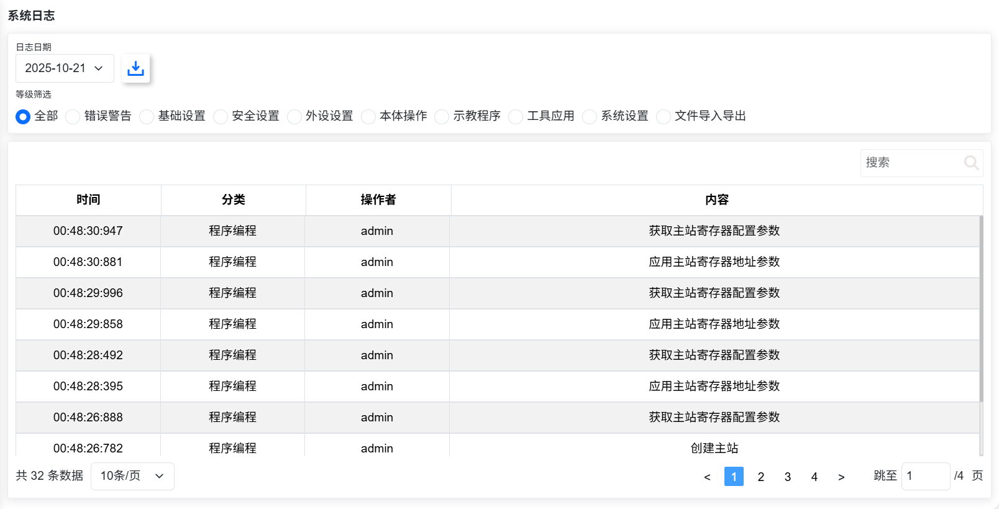
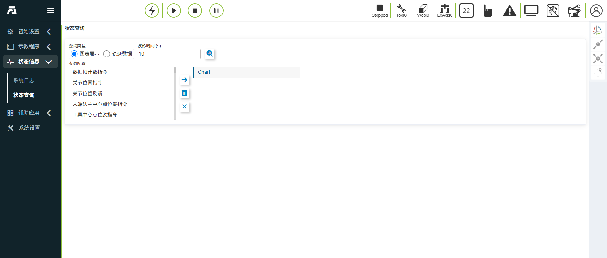
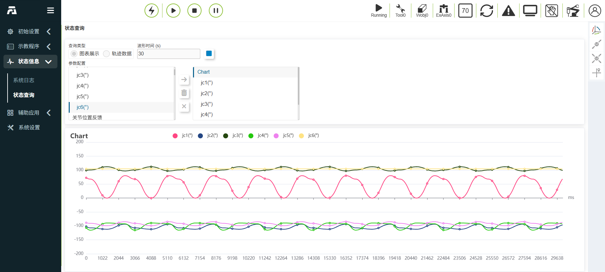
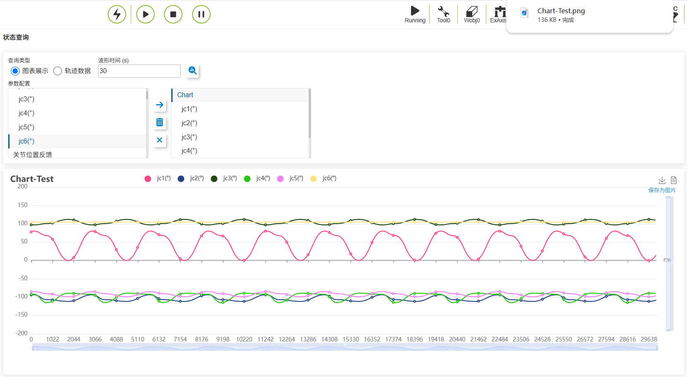
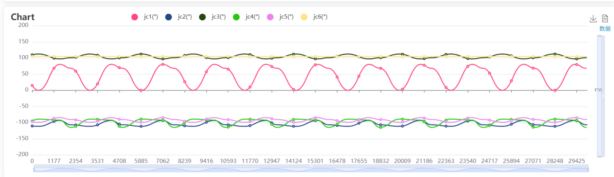
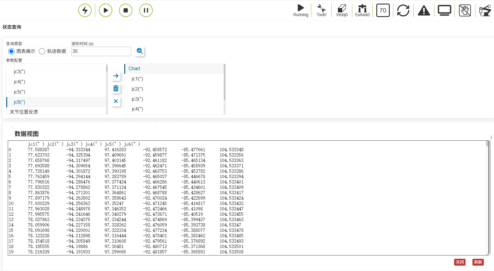

狀態資訊 
===============

.. toctree:: 
   :maxdepth: 6

系統日誌
----------

首次進入「狀態資訊一一系統日誌」介面，預設展示當天全部類型的日誌資料。

對日誌資料進行等級區分，目前分為:全部、錯誤警告、基礎設定、安全設定、週邊設定、本體操作、示教程序、工具應用、系統設定和檔案匯入匯出。

在資料表格右上角有搜尋輸入框,使用者根據搜尋需求，輸入篩選內容進行篩選。介面如下:

.. centered:: 圖表 13.1‑1 系統日誌介面
   
狀態查詢
----------

功能使用
~~~~~~~~~~~~~~~~~~~~~~~~~~~~

1. 開啟控制箱並將網線連接至電腦；
2. 在電腦上打開瀏覽器，訪問目標網址192.168.58.2，登錄帳號admin，密碼123，進入頁面；
3. 點擊左側選單欄中的「狀態資訊」-「狀態查詢」選項，進入狀態查詢界面，如下圖所示；

.. centered:: 圖表 13.2‑1 狀態查詢

.. note:: 
   .. image:: status/006.png
      :width: 0.75in
      :height: 0.75in
      :align: left

   名稱：**查詢按鈕**
   
   作用：點擊下發查詢圖表/軌跡數據的指令，代表未查詢狀態

.. note:: 
   .. image:: status/007.png
      :width: 0.75in
      :height: 0.75in
      :align: left

   名稱：**右移按鈕**
   
   作用：點擊將左側選中項添加到右側的子項中

.. note:: 
   .. image:: status/008.png
      :width: 0.75in
      :height: 0.75in
      :align: left

   名稱：**刪除按鈕**
   
   作用：點擊刪除右側選中的子項

.. note:: 
   .. image:: status/009.png
      :width: 0.75in
      :height: 0.75in
      :align: left

   名稱：**清空按鈕**
   
   作用：點擊清空右側的所有子項

4. 選擇「圖表展示」，填寫波形時間，在參數配置中左側選擇所需查詢的參數，點擊「右移」按鈕即可將參數配置到右側列表中；

.. note:: 波形時間可自定義範圍（10-30秒），參數配置最多選擇6個。

5. 點擊「查詢」按鈕開始查詢，根據參數配置，實時顯示數據折線圖，如下圖；

.. centered:: 圖表13.2‑2 圖表展示

圖表導出
~~~~~~~~~~~~~~~~~~~~~~~~

1. 點擊圖表標題彈框可直接修改圖表標題，如下圖：

.. image:: status/004.png
   :width: 6in
   :align: center

.. centered:: 圖表13.2‑3 重命名圖表標題

2. 點擊停止查詢按鈕成功停止查詢後，顯示下載按鈕，點擊下載，瀏覽器彈出下載名稱為圖表標題的圖表文件。如下圖所示：

.. centered:: 圖表13.2‑4 圖表導出

數據視圖顯示
~~~~~~~~~~~~~~~~~~~~~~~~~~~~~

1. 在停止查詢後，點擊圖表右上角顯示數據視圖按鈕，如下圖：

.. centered:: 圖表13.2‑5 數據視圖按鈕

2. 視圖中數據如圖，其數據內容支持複製。

.. centered:: 圖表13.2‑6 數據視圖顯示