系統設定
===============

.. toctree:: 
   :maxdepth: 6

通用設定
-----------------

點擊左側選單欄「系統設定」，點擊二級選單欄「通用設定」，進入通用設定介面。通用設定可以根據當前電腦時間更新機器人系統時間，以便記錄日誌內容時間準確。

.. centered:: 圖表 15.1‑1 時間設定

網路設定可以設定控制器IP，子網路遮罩，預設閘道，DNS伺服器和示教器IP(使用我們的FR-HMI示教器情況下該IP有效，在使用FR-HMI示教器情況下需要配置示教器啟用狀態為啟用)，方便客戶使用場景。

網路設定
~~~~~~~~~~~~

.. image:: system/001.png
   :width: 6in
   :align: center

.. centered:: 圖表 15.1‑2 網路設定示意圖

-  **設定網卡**：輸入需要通訊的網卡IP、子網路遮罩（與IP聯動，自動填寫）、預設閘道、DNS伺服器。網卡0網口出廠預設IP：192.168.57.2，網卡1網口出廠預設IP：192.168.58.2。

-  **示教器啟用**：控制是否啟用示教器。預設示教器關閉，無法使用示教器操作設備。點擊滑動開關按鈕，則啟用示教器操作設備。
  
-  **訪問IP**：選擇WebAPP和WebRecovery關聯的網卡，示教器啟用時，WebAPP預設選擇網卡1，網卡0不可選。
  
-  **設定網路**：點擊「設定網路」按鈕，提示正在配置中。配置完成後，需要重啟設備。

免登錄操作
++++++++++++++++++++++++++++++++++++++++++++++

功能概述
***************************

開啟實體示教器免登錄操作功能後，可實現以下功能：

- 用戶未登入示教介面時，旋轉實體鑰匙開關，機器人可切換手動/自動模式，末端燈顏色對應切換；
- 用戶未登入示教介面時，在自動模式下，點擊實體啟動開關，機器人可開始運行當前加載程式；
- 用戶未登入示教介面時，在自動模式下，點擊實體停止開關，機器人可停止運行；

使用說明
***************************
登入webapp頁面，點擊「系統設定」，點擊「通用設定」，在網路模組-示教器板塊中，打開「示教器啟用」開關，打開「免登錄操作」開關。開啟功能後，可在未登入示教器頁面時操控實體按鈕進行機器人手動/自動模式切換及控制程式運行/停止。該配置斷電重啟後保持。

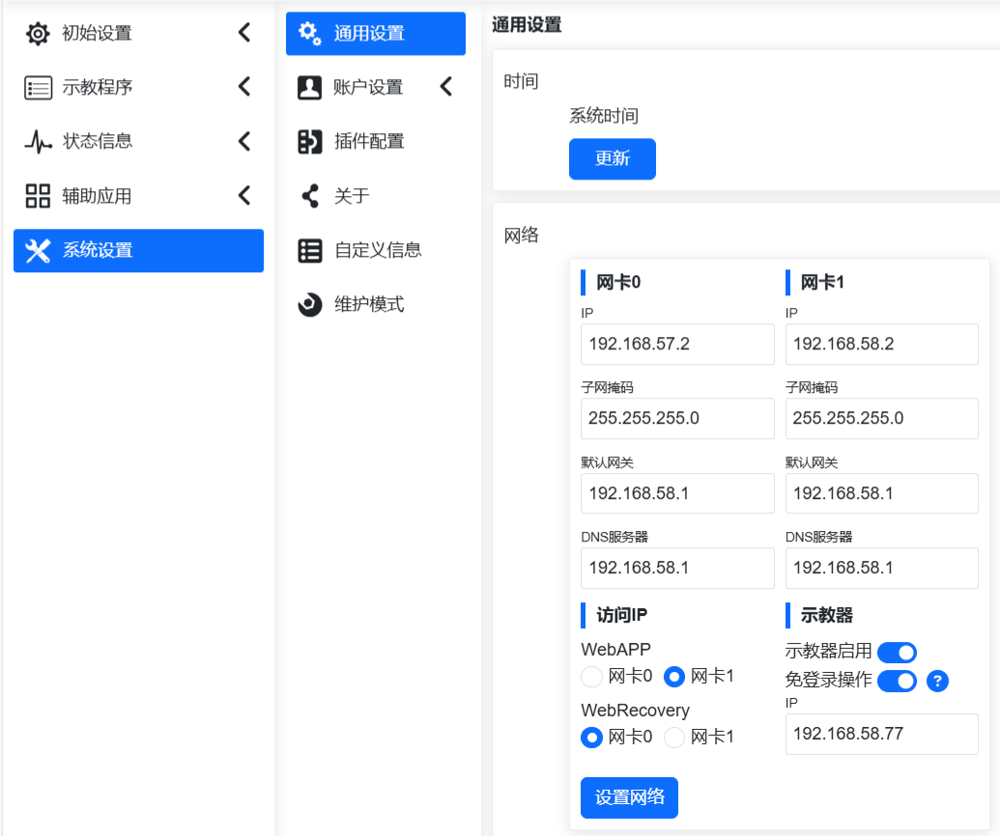

.. centered:: 圖表 15.1‑2-1 開啟免登錄操作功能

示教器觸控式螢幕校準
~~~~~~~~~~~~~~~~~~~~~~~~~~~~~~~~~~~~

啟用示教器後，可對示教器進行校準操作。

.. centered:: 圖表 15.1‑3 示教器觸控式螢幕校準
  
外設工控機配置
~~~~~~~~~~~~~~~~~~

啟用外設工控機，需要輸入IP地址。配置成功後，需要重啟控制箱和工控機。

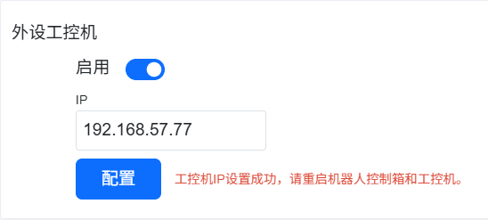

.. centered:: 圖表 15.1‑4 外設工控機配置
  
系統語言
~~~~~~~~~~~~~~~~~~

語言導入
++++++++++++++++

選擇語言包進行導入操作（註：導入檔案格式為[語言代碼].json）。若導入成功，且語言包非系統已有語言，則系統語言新增一條導入的語言包數據。

.. centered:: 圖表 15.1‑5 系統語言介面

語言導出
+++++++++++++++++
選擇系統語言，以英文為例，點擊「導出」按鈕，頁面彈出導出的下載檔案。

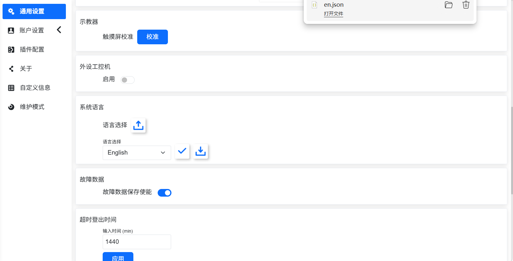

.. centered:: 圖表 15.1‑6 導出系統語言
   
語言應用
++++++++++++++++++++

選擇系統語言，點擊「應用」按鈕來切換系統語言。應用語言成功後，系統自動登出到登入頁面，且系統語言同步切換為目前語言語言。以英文為例：

.. image:: system/036.png
   :width: 6in
   :align: center

.. centered:: 圖表 15.1‑7 語言系統成功後介面

系統安全模式恢復
++++++++++++++++++++

當系統需要進行版本升降級操作、系統語言包導入異常系統無法正常進入時，需要進入「系統安全模式恢復」介面，具體操作如下：
1. 進入系統設定 -> 通用設定 -> 網路設定介面，調整WebRecovery訪問IP到網卡0位置，並點擊「設定網路」。

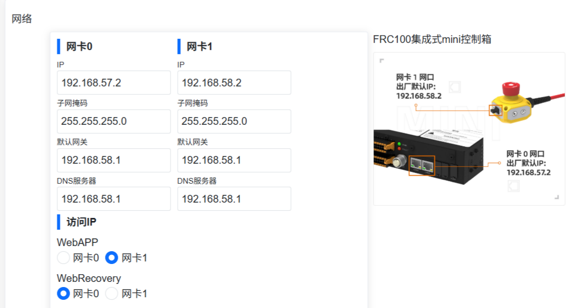

.. centered:: 圖表 15.1‑8 WebRecovery設定網卡介面

2. 網路設定成功後重啟控制箱，切換IP地址192.168.57.xxx，並將網路線連接到控制箱網卡0。
3. 登入網址「192.168.57.2:8050」，進入「系統安全模式恢復」介面。

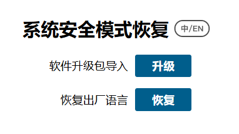

.. centered:: 圖表 15.1‑9 系統安全模式恢復介面

- 軟體升級包導入：系統軟體包升降級；
- 恢復出廠語言：清除導入應用語言包數據，恢復出廠語言包數據，預設語言設定為英文；
  
故障數據
~~~~~~~~~~~~

點擊啟用「故障數據儲存使能」按鈕，當控制器發生故障時，會產生故障數據檔案，儲存故障時刻前後15秒鐘的數據。

當儲存完成後，可在系統設定中選擇所有數據源導出，解壓error_data.tar.gz即可查看故障數據檔案。

.. centered:: 圖表 15.1‑10 故障數據
  
逾時登出時間設定
~~~~~~~~~~~~~~~~~

使用者可以設定逾時登出時間，若滿足時長則自動登出，單位min。

.. centered:: 圖表 15.1‑11 逾時登出時間設定
  
系統設定
~~~~~~~~~~~~

系統恢復下恢復出廠設定可以清除使用者數據，使機器人恢復到出廠配置。

從站日誌產生和控制器日誌導出功能為下載控制器一些重要的狀態或報錯的記錄檔案，方便排查機器人問題。

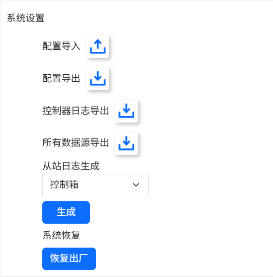

.. centered:: 圖表 15.1‑12 系統設定

帳戶設定
---------------

點擊二級選單欄帳戶設定，進入帳戶設定介面。帳戶管理功能僅限管理員可使用。功能分以下三個模組：

使用者管理
~~~~~~~~~~~~

使用者管理頁面，用來儲存使用者資訊，可以新增使用者的工號、職能等。使用者可透過輸入使用者列表中已有的使用者名稱和密碼進行登入操作。

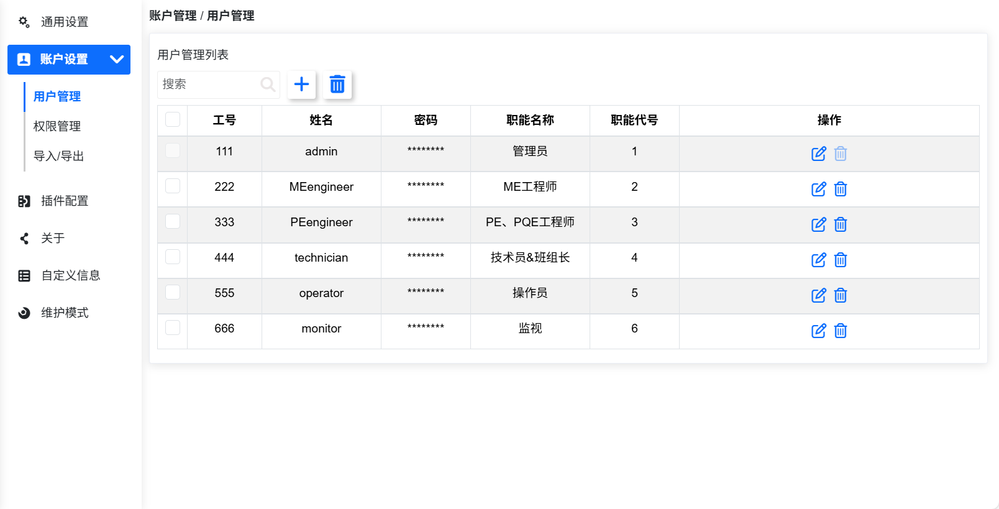

.. centered:: 圖表 15.2‑1 使用者管理

-  **新增使用者**：點擊「新增」按鈕，輸入工號、姓名、密碼並選擇職能。

.. important::
   工號最大為10位整數型，工號和密碼都有唯一性校驗，且密碼透過盲文顯示。使用者新增成功後，可以輸入姓名和密碼進行重新登入。
  
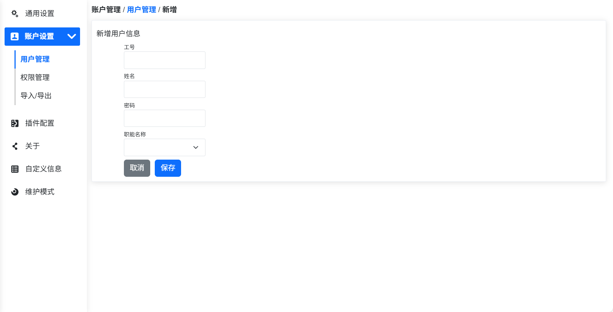

.. centered:: 圖表 15.2‑2 新增管理
  
-  **編輯使用者**：當存在使用者列表時，點擊右側「編輯」按鈕，工號和姓名無法修改，可修改密碼和職能，密碼同樣需要唯一性校驗。
  
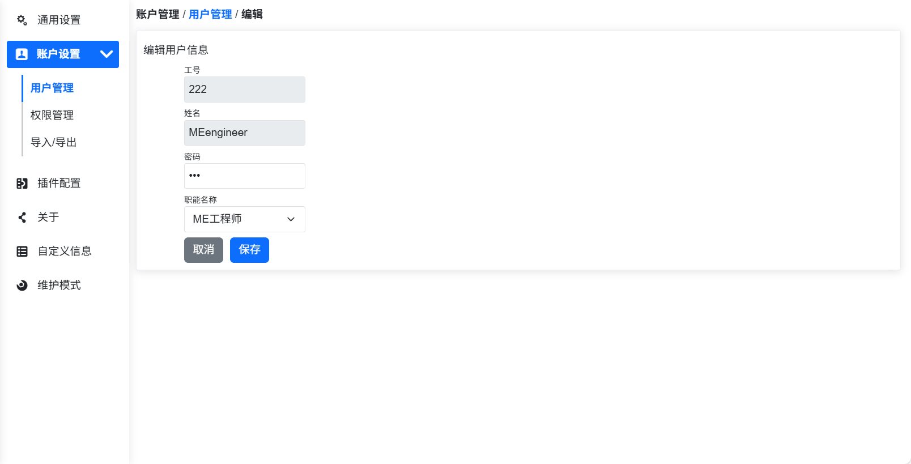

.. centered:: 圖表 15.2‑3 編輯使用者

-  **刪除使用者**：刪除方法分為單條刪除和批次刪除。
  
  1. 點擊列表右側單條「刪除」按鈕，提示「請再次點擊刪除按鈕以確認刪除」，再次點擊該列表刪除成功。

  2. 點擊左側核取方塊，選擇需要刪除的使用者，再點擊列表上方批次「刪除」按鈕兩次後刪除。

.. important::
   初始使用者111以及目前登入使用者無法刪除。

.. centered:: 圖表 15.2‑4 刪除使用者

權限管理
~~~~~~~~~~~~

.. important:: 
   預設的職能數據（職能代號為1-6）不可以刪除，不可修改職能代號，可以修改職能名稱和職能描述以及設定職能的權限。

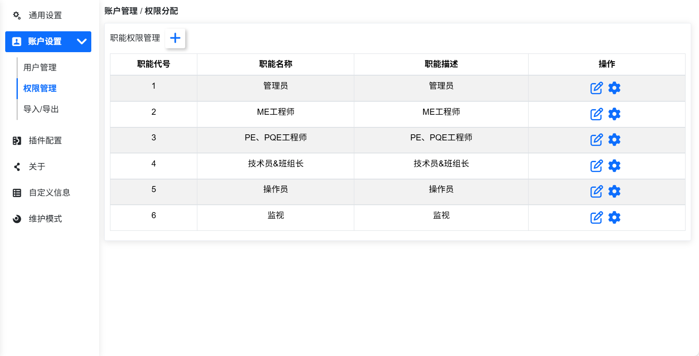

.. centered:: 圖表 15.2‑5 權限管理

預設六個職能，管理員無功能限制，操作員和監視員少部分功能可以使用，ME工程師、PE&PQE工程師和技術員&班組長部分功能限制，管理員無功能限制，具體預設權限如下表所示：

.. important:: 
   預設權限可修改。

.. centered:: 表格 15.2‑1 權限詳情

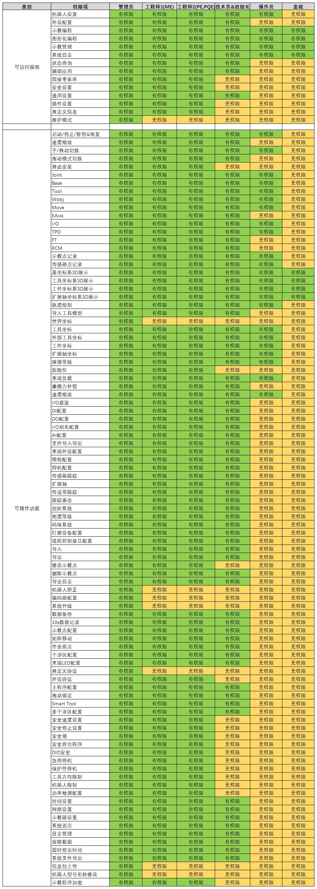

-  **新增職能**：點擊「新增」按鈕，輸入職能代號、職能名稱和職能描述，點擊"儲存"按鈕，成功後返回列表頁面。其中職能代號只能為大於0的整數並且不能和已經存在的職能代號相同，輸入項全部為必填。

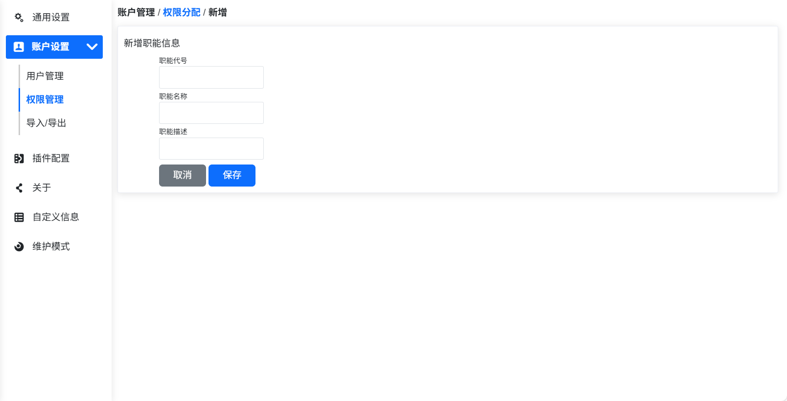

.. centered:: 圖表 15.2‑6 新增職能

-  **編輯職能名稱和描述**：點擊表格操作欄中的「編輯」圖示，可以修改目前職能的職能名稱和職能描述，修改完成後點擊下方"儲存"按鈕確認修改。

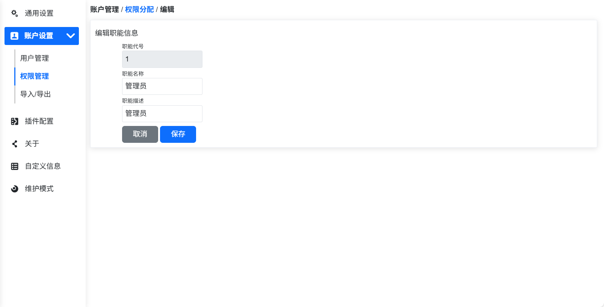

.. centered:: 圖表 15.2‑7 編輯職能

-  **設定職能權限**：點擊表格操作欄中的「設定」圖示，可以設定目前職能的權限，設定完成後點擊下方"儲存"按鈕確實設定。

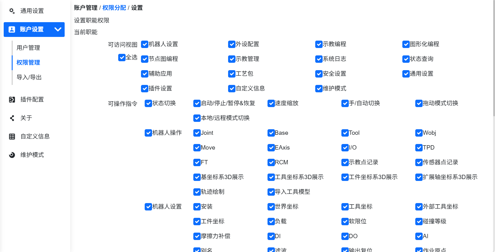

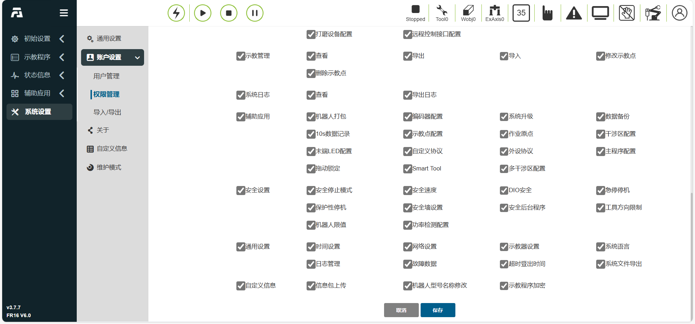

.. centered:: 圖表 15.2‑8 設定職能權限

-  **刪除職能**：點擊表格操作欄中的「刪除」圖示，首先會校驗目前職能是否有使用者使用，沒有使用者使用則可以刪除目前職能，反之不可以刪除。

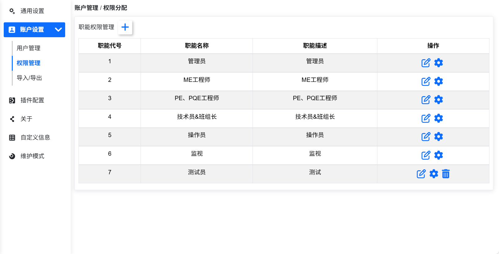

.. centered:: 圖表 15.2‑9 刪除職能

導入/導出
~~~~~~~~~~~~

.. centered:: 圖表 15.2‑10 帳戶設定導入/導出

-  **導入**：點擊「導入」按鈕，可以批次導入使用者管理和權限管理的數據。

-  **導出**：點擊「導出」按鈕，可以批次導出使用者管理和權限管理的數據。

關於
--------------

點擊二級選單欄關於，進入關於介面。該頁面展示了機器人的型號和序號，機器人執行使用的Web版本和控制箱版本，硬體版本和韌體版本。

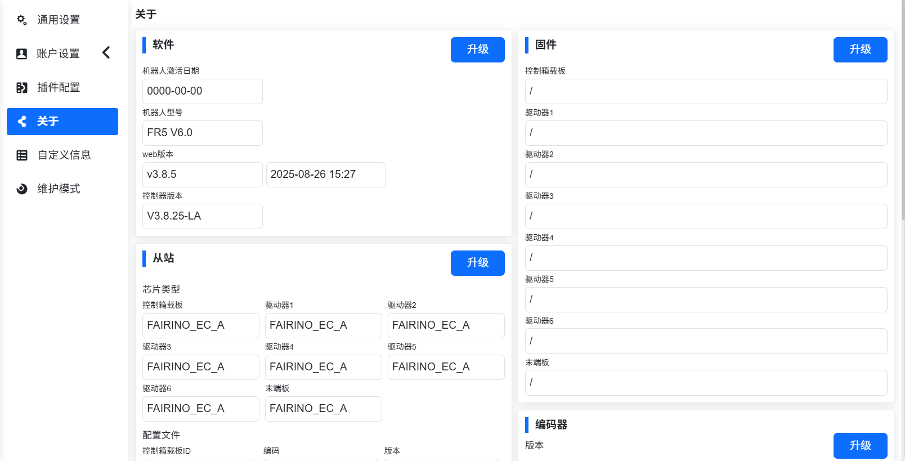

.. centered:: 圖表 15.3‑1 關於示意圖

軟體升級
~~~~~~~~~~~~~~~~~~~~~~~~~

操作準備
+++++++++++++++++++++++++++++++

1. 升級前在《系統設定-關於》中查看並確認當前的軟體版本。
2. 軟體升級包，下載地址見對應版本的法奧文件《資料下載-機器人軟體下載》，解壓後，內容包含對應版本軟體升級包software.tar.gz。

注意事項
+++++++++++++++++++++++++++++++

1. 數據備份：建議在升級前執行備份，方法見3.2.1節，以避免因升級異常導致數據遺失。
2. 版本限制：

.. centered:: 圖表 15.3‑1 版本升級限制

.. list-table::
   :widths: 50 50
   :header-rows: 0
   :align: center

   * - **目前版本** 
     - **最高可升級版本**

   * - <v3.6.1
     - v3.6.1

   * - v3.6.1-v3.6.4
     - v3.6.5

   * - v3.6.5-v3.6.8
     - v3.6.9

   * - v3.6.9 - v3.7.4
     - v3.7.5

   * - v3.7.5
     - v3.7.6

   * - ≥ v3.7.6
     - 無限制

3. 快取清除：每次升級後（特別是跨版本升級時），建議清除瀏覽器快取以確保系統正常執行。

操作步驟
*****************************

**軟體升級**：

1. 在「系統設定」->「關於」選單欄下，點擊「升級」按鈕，進入軟體升級；

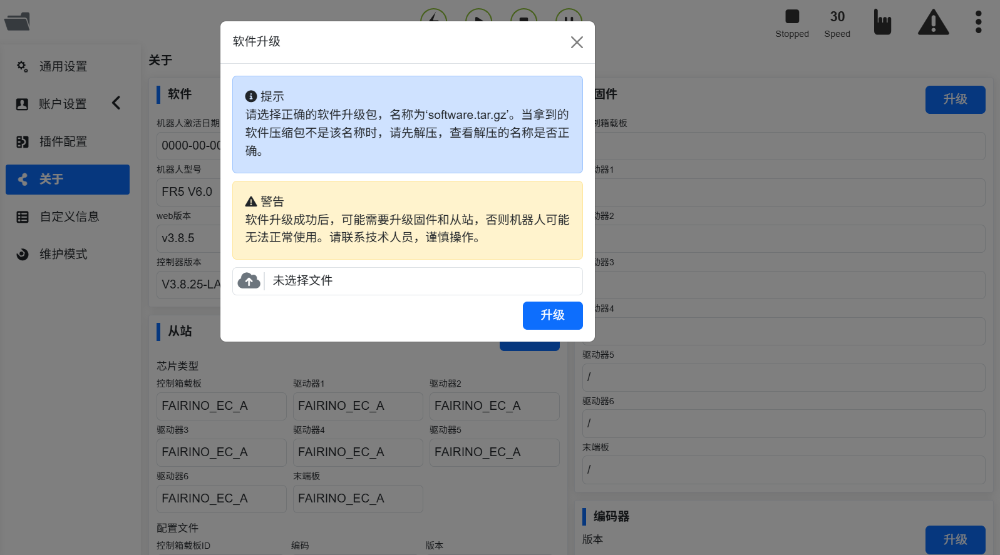

.. centered:: 圖表 15.3‑2 系統升級介面

2. 點擊「選擇檔案」，選擇在官網中下載的軟體包software.tar.gz；

.. important:: 
   軟體升級包名為確定的software.tar.gz，如果升級包名與之不一致，那麼會出現升級失敗，修改為確定的升級包名稱即可。

3. 點擊上傳升級包，則開始升級, 升級過程中會顯示進度條；

4. 當升級進度條為100時，介面將提示「升級成功，請重新啟動控制箱」；

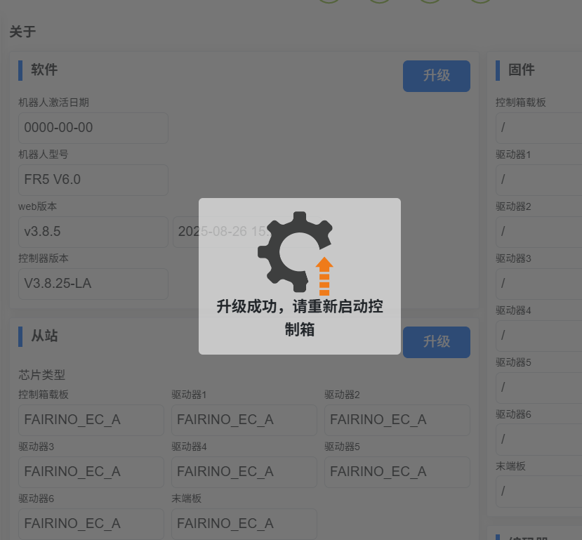

.. centered:: 圖表 15.3‑3 軟體升級成功

5. 重啟控制箱後，升級完成，在關於中確認版本資訊。

**韌體升級**：機器人進入BOOT模式後，上傳升級壓縮包，選擇需要升級的從站（控制箱從站，本體驅動器從站1~6，末端從站），進行升級操作，並顯示升級狀態。

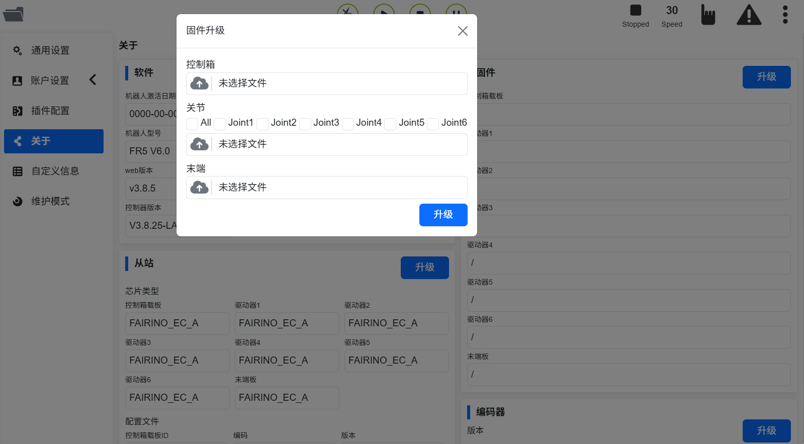

.. centered:: 圖表 15.3‑4 韌體升級

**從站配置檔案升級**：機器人去使能後，上傳升級檔案，選擇需要升級的從站（控制箱從站，本體驅動器從站1~6，末端從站），進行升級操作，並顯示升級狀態。

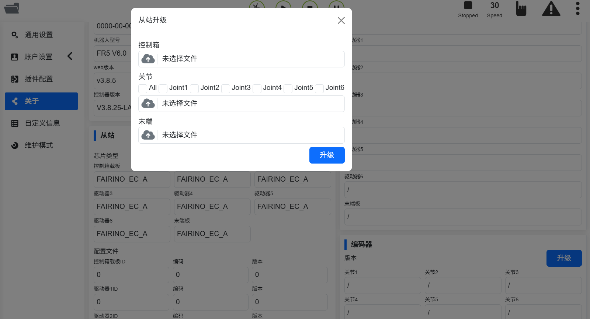

.. centered:: 圖表 15.3-5 從站配置檔案升級

**編碼器升級**：機器人去使能後，上傳升級檔案，選擇需要升級的關節Joint1~Joint6,並配置編碼器模式。

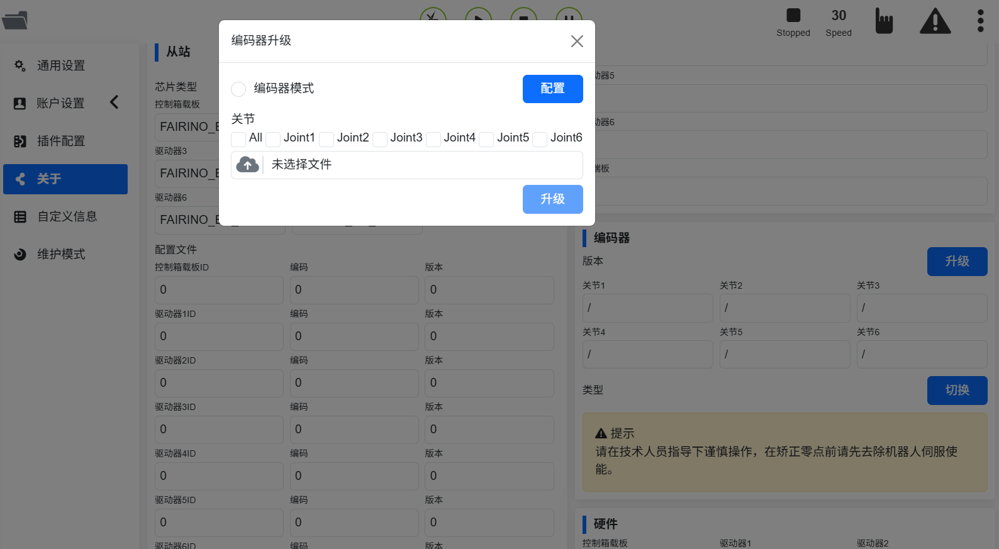

.. centered:: 圖表 15.3-6 編碼器升級

自訂資訊
---------------

點擊二級選單欄自訂資訊，進入自訂資訊介面。自訂資訊功能僅限管理員可使用。該頁面可以上傳使用者資訊包、機器人型號和設定示教程式加密狀態等操作。

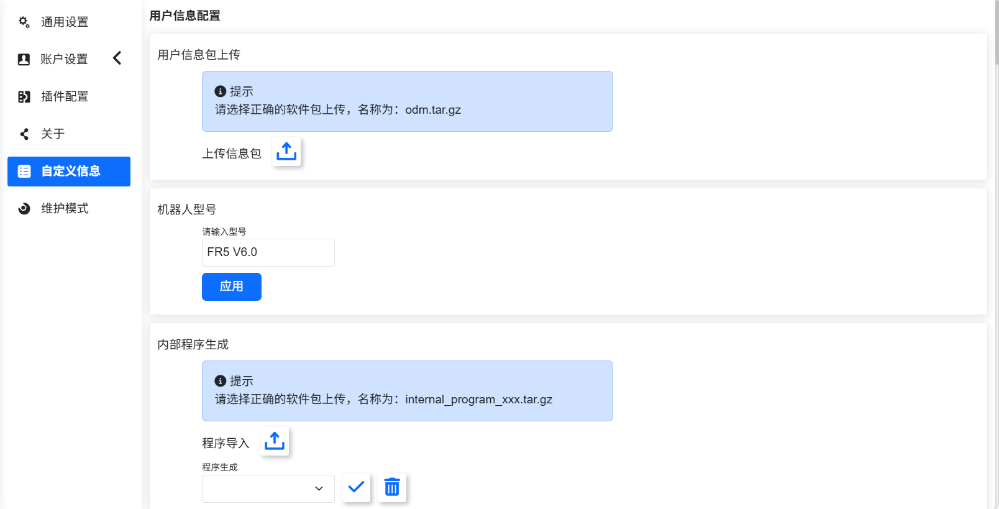

.. centered:: 圖表 15.4‑1 自訂資訊示意圖

機器人型號
~~~~~~~~~~~~~~~

.. important::
   1. 在此配置機器人型號屬於自訂機器人型號名稱，與「系統設定」->「維護模式」->「控制器相容」中配置的機器人型號功能不一致；
   2. 不建議使用以「FR」和「ART」開頭。如果輸入以「FR」和「ART」開頭的自訂機器人型號時，輸入的型號名稱必須與機器人型號目錄表中的「型號簡稱」一致，（機器人型號目錄表詳見於「機器人型號配置」章節）。

參數範圍配置
~~~~~~~~~~~~~~~~

參數範圍配置，只有管理員可進行參數範圍的調節，其他權限成員的參數只可在管理員設定的參數範圍之內設定。

參數設定方式分為兩種：滑塊拖曳和手動輸入。

.. important::
   參數範圍最大值必須大於最小值。參數範圍配置成功3秒後，自動跳轉到登入頁，需重新登入。

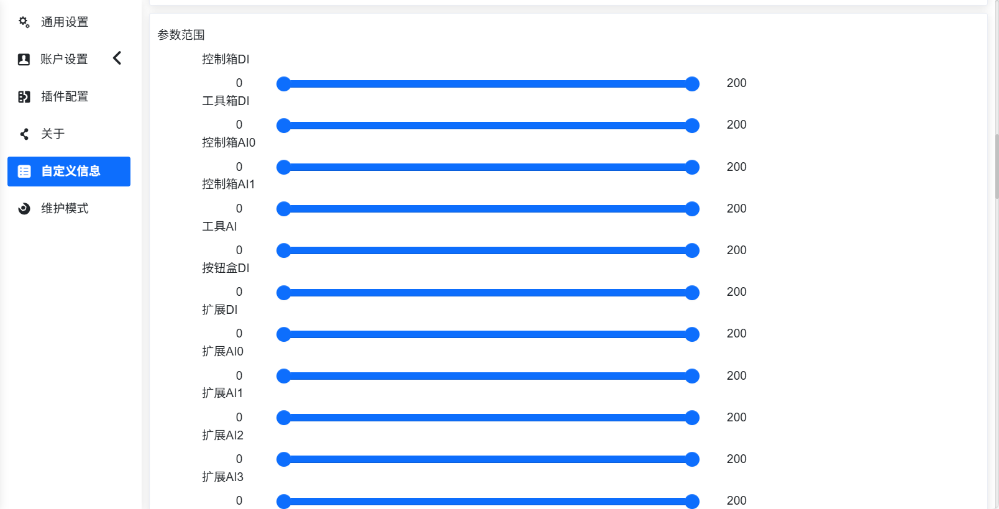

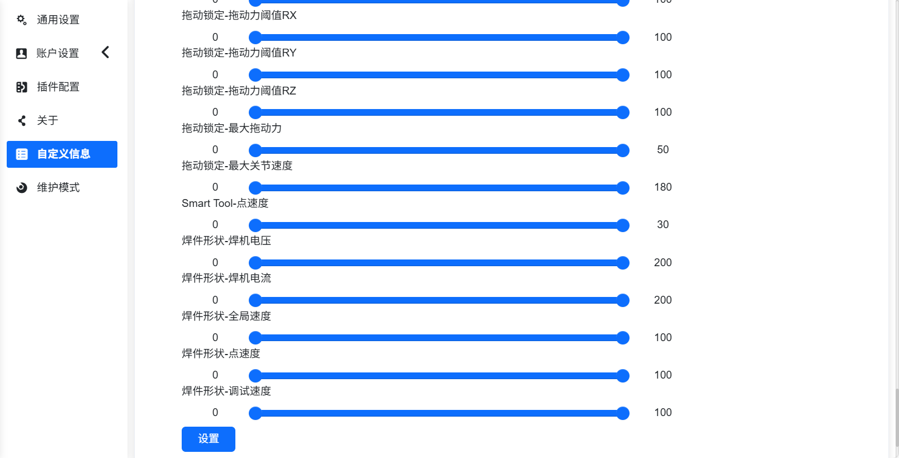

.. centered:: 圖表 15.4‑2 參數範圍配置示意圖

機器人許可使用時間
~~~~~~~~~~~~~~~~~~~~~~~~~~~~~~~~~~~~

1. 鎖屏設定

在「自訂資訊」中查看機器人許可使用時間，設定該功能是否開啟。選擇開啟該功能時，選擇使用期限，如果未選擇則提示「使用期限不能為空」。

.. note:: 如果己開啟鎖屏功能，無法進行二次設定，同時無法更新系統時間。

選擇使用期限後，點擊「配置」按鈕。

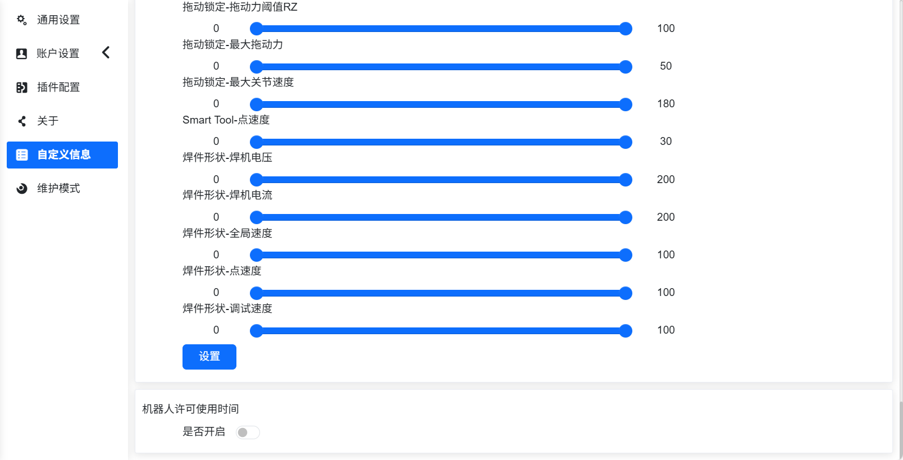

.. centered:: 圖表 15.4‑3 機器人許可使用時間關閉設定

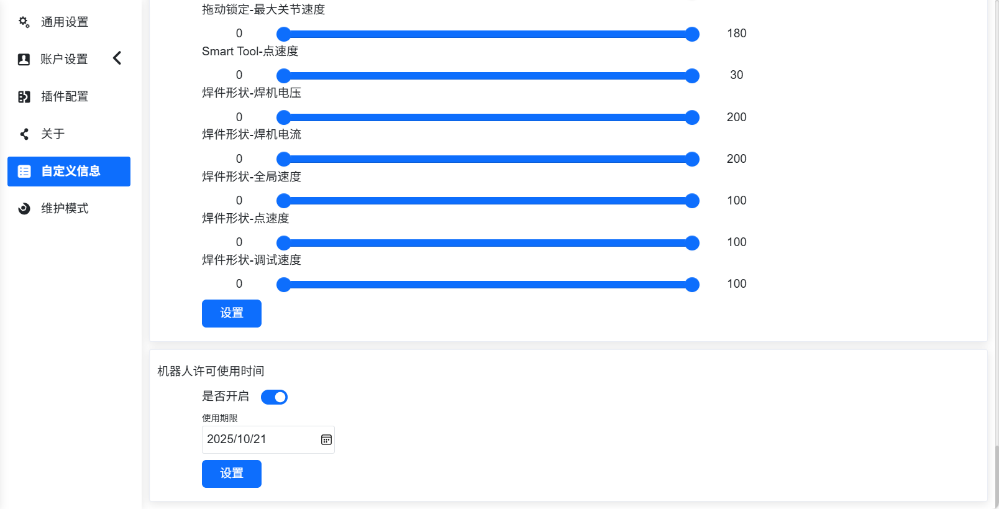

.. centered:: 圖表 15.4‑4 機器人許可使用時間開啟設定

2. 到期提示

當機器人許可使用時間功能開啟時，登入介面後有如下提示：

1)設備到期前 5天，開機登入成功，彈窗提示使用期限剩餘天數，復位可消除。

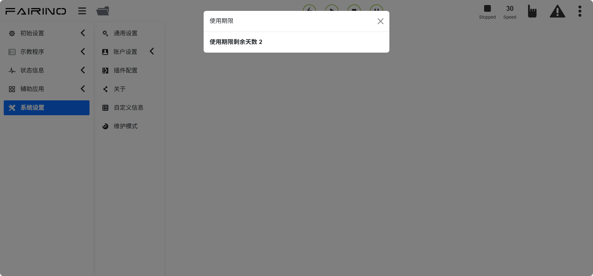

.. centered:: 圖表 15.4‑5 開機提示

2)如設備持續工作中，設備到期前 5天，在零點時自動彈窗提示使用期限剩餘天數，復位可消除。

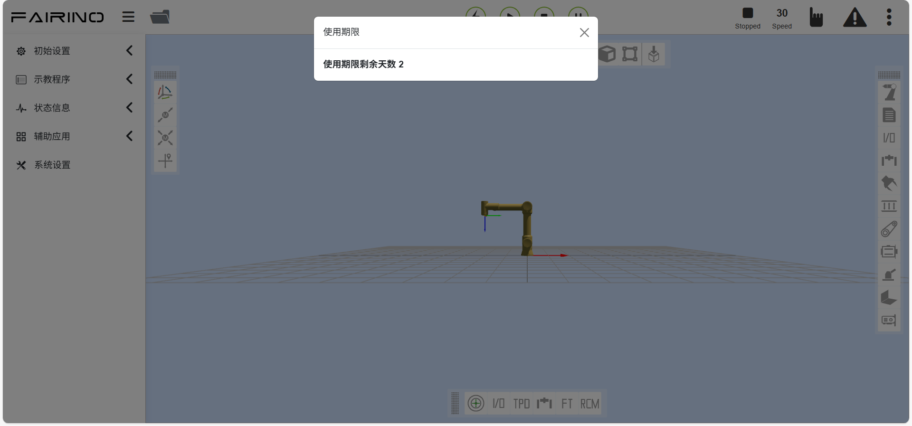

.. centered:: 圖表 15.4‑6 持續工作提示

3. 解鎖登入

當機器人許可使用時間功能開啟時，設備到期後，首次登入webApp直接進入鎖屏介面。設備持續工作時，零點取得鎖屏數據後自動登出，進入鎖屏介面。此時輸入解鎖碼後解鎖進入登入介面，輸入登入資訊進行登入。

.. note:: 整合商操作產生加密的解鎖碼。
 
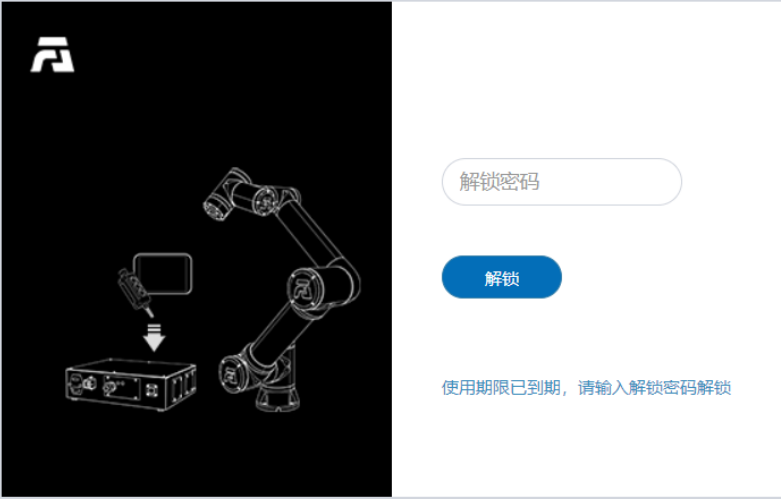

.. centered:: 圖表 15.4‑7 鎖屏介面  

機器人型號配置
-----------------

.. important:: 如果您需要修改機器人型號，請與我們技術工程師取得聯繫並在指導下進行。

登入協作機器人控制台Web後，在「系統設定」->「維護模式」->「控制器相容」配置項中選擇對應型號修改，機器人型號參考下方表格。

機器人型號表如下：

.. list-table::
   :widths: 10 58 32
   :header-rows: 0
   :align: center

   * - **數值**
     - **型號（主型號-主版本號-次版本號）**
     - **型號簡稱**

   * - 0
     - 未配置
     - /

   * - 1
     - FR3-V1-000(V5.0)
     - FR3 V5.0

   * - 2
     - FR3-V1-001(V6.0)
     - FR3 V6.0

   * - 3
     - FR3-V1-002(V6.0 Mirror)
     - FR3 V6.0(Mirror)

   * - ...
     - 預留
     - /

   * - 101
     - FR5-V1-000
     - FR5 V4.0

   * - 102
     - FR5-V1-001(V5.0)
     - FR5 V5.0

   * - 103
     - FR5-V1-002(V6.0)
     - FR5 V6.0
     
   * - ...
     - 預留
     - /
   
   * - 201
     - FR10-V1-000(V5.0)
     - FR10 V5.0

   * - 202
     - FR10-V1-001(V6.0)
     - FR10 V6.0
     
   * - ...
     - 預留
     - /
   
   * - 301
     - FR16-V1-000(V5.0)
     - FR16 V5.0

   * - 302
     - FR16-V1-001(V6.0)
     - FR16 V6.0
     
   * - ...
     - 預留
     - /
   
   * - 401
     - FR20-V1-000(V5.0)
     - FR20 V5.0

   * - 402
     - FR20-V1-001(V6.0)
     - FR20 V6.0
     
   * - ...
     - 預留
     - /

   * - 501
     - ART3-V1-000
     - ART3
     
   * - ...
     - 預留
     - /

   * - 601
     - ART5-V1-000
     - ART5
     
   * - ...
     - 預留
     - /

   * - 702
     - FRCustom(7)-V1-001(FR3-WML)
     - FR3-WML

   * - 703
     - FRCustom(7)-V1-001(FR3-WMS)
     - FR3-WMS
     
   * - ...
     - 預留
     - /
  
   * - 802
     - FRCustom(8)-V1-001(FR5WM)
     - FR5WM
     
   * - 803
     - FRCustom(8)-V1-002(FR5-WML)
     - FR5-WML
       
   * - ...
     - 預留
     - /

   * - 901
     - FRCustom(9)-V1-001(FR3MT)
     - FR3MT

   * - 902
     - FRCustom(9)-V1-001(FR10YD)
     - FR10YD

   * - 904
     - FRCustom(9)-V1-001(FR3-C)
     - FR3-C

   * - 905
     - FRCustom(9)-V01-001(FR30L)
     - FR30L
     
   * - ...
     - 預留
     - /

   * - 1001
     - FR30-V1-001(V6.0)
     - FR30 V6.0
     
   * - ...
     - 預留
     - /

.. note:: 其中，主版本號預留10個（1-10），次版本號預留10個（1-10）。
