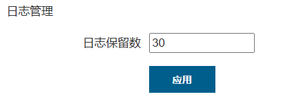
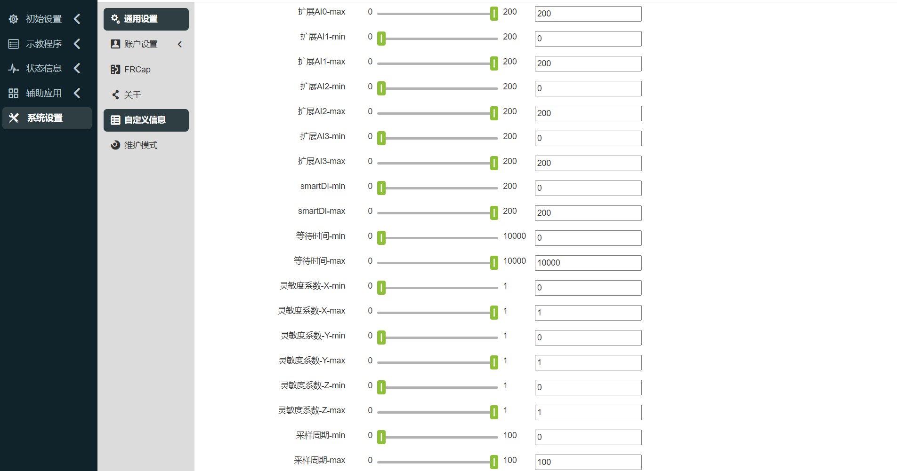
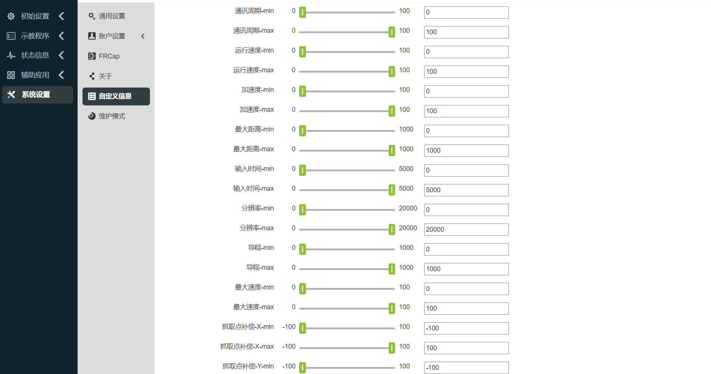
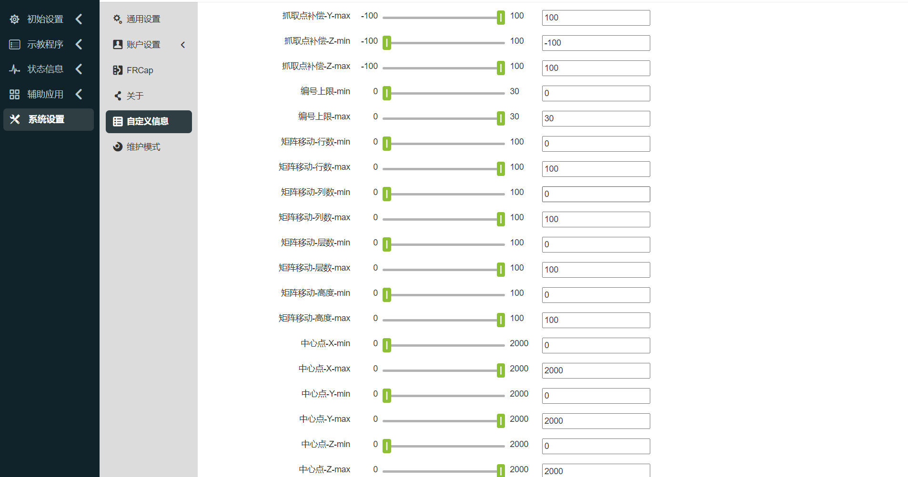
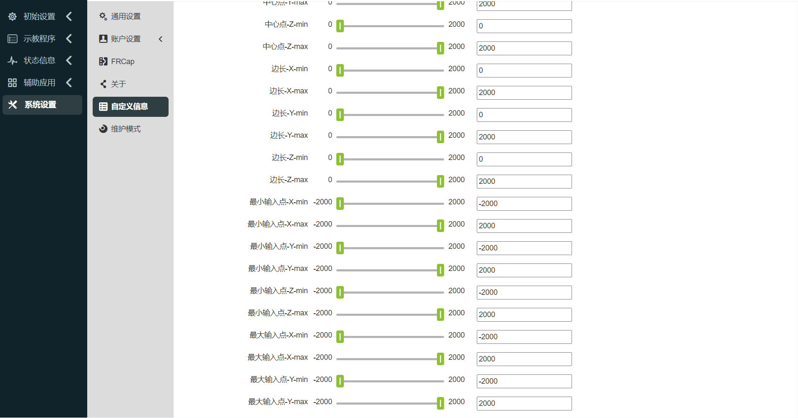
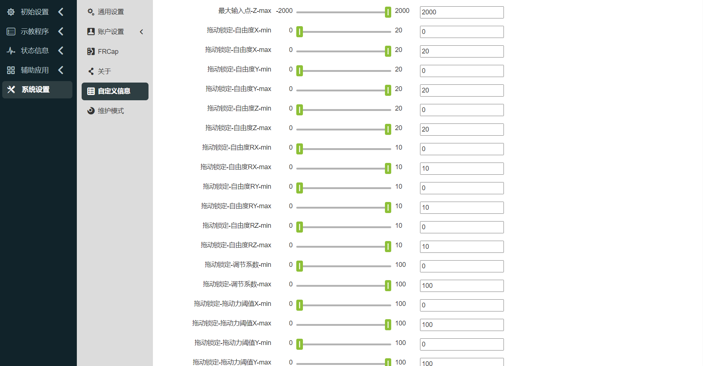

系統設定 
===============

.. toctree:: 
   :maxdepth: 6

通用設定
-----------------

點選左側選單列“系統設定”，點選二級選單列“通用設定”，進入通用設定介面。通用設定可以根據目前電腦時間更新機器人系統時間，以便記錄日誌內容時間準確。

.. image:: system/028.png
   :width: 4in
   :align: center

.. centered:: 圖表 15.1‑1 時間設定

網路設定可以設定控制器IP，子網路掩碼，預設網關，DNS伺服器和示教器IP(使用我們的FR-HMI示教器情況下該IP有效，在使用FR-HMI示教器情況下需要配置示教器啟用狀態為啟用)，方便客戶使用場景。

網路設定
~~~~~~~~~~~~

.. image:: system/001.png
   :width: 6in
   :align: center

.. centered:: 圖表 15.1‑2 網路設置示意圖

- **設定網路卡**：輸入需要通訊的網路卡IP、子網路遮罩（與IP連動，自動填寫）、預設閘道、DNS伺服器。網路卡0網口出廠預設IP：192.168.57.2，網卡1網口出廠預設IP：192.168.58.2。

- **示教器啟用**：控制是否啟用示教器。預設示教器關閉，無法使用示教器操作設備。點選滑動開關按鈕，則啟用示教器操作設備。

- **存取IP**：選擇WebAPP和WebRecovery關聯的網路卡，示教器啟用時，WebAPP預設選擇網卡1，網路卡0不選用。

- **設定網路**：點選「設定網路」按鈕，提示正在設定中。配置完成後，需要重新啟動設備。

示教器觸控螢幕校準
~~~~~~~~~~~~~~~~~~

啟用示教器後，可對示教器進行校準操作。

.. image:: system/029.png
   :width: 4in
   :align: center

.. centered:: 圖表 15.1‑3 示教器觸控螢幕校準

週邊工控機配置
~~~~~~~~~~~~~~~~~~

啟用外設工控機，需輸入IP位址。配置成功後，需要重新啟動控制箱和工控機。

.. image:: system/030.png
   :width: 4in
   :align: center

.. centered:: 圖表 15.1‑4 週邊工控機配置

系統語言
~~~~~~~~~~~~~~~~~~

語言導入
++++++++++++++++

選擇語言包進行導入操作（註：導入文件格式為[語言代碼].json）。若匯入成功，且語言包非系統已有語言，則系統語言新增一條匯入的語言包資料。

.. image:: system/031.png
   :width: 4in
   :align: center

.. centered:: 圖表 15.1‑5 系統語言介面

語言導出
+++++++++++++++++
選擇系統語言，以英文為例，點選「匯出」按鈕，頁面彈出匯出的下載檔案。

.. image:: system/035.png
   :width: 6in
   :align: center

.. centered:: 圖表 15.1‑6 導出系統語言

語言應用
++++++++++++++++++++

選擇系統語言，點選「應用」按鈕來切換系統語言。應用語言成功後，系統會自動登出登入登錄頁面，且係統語言同步切換為目前語言語言。以英文為例：

.. image:: system/036.png
   :width: 6in
   :align: center

.. centered:: 圖表 15.1‑7 語言系統成功後介面

系統安全模式恢復
++++++++++++++++++++

當系統需要進行版本升降級操作、系統語言包導入異常系統無法正常進入時，需要進入「系統安全模式恢復」介面，具體操作如下：
1. 進入系統設定 -> 一般設定 -> 網路設定介面，調整WebRecovery存取IP到網路卡0位置，並點選「設定網路」。

.. image:: system/037.png
   :width: 6in
   :align: center

.. centered:: 圖表 15.1‑8 WebRecovery設定網卡介面

2. 網路設定成功後重新啟動控制箱，切換IP位址192.168.57.xxx，並將網路線連接到控制箱網路卡0。
3. 登入網址“192.168.57.2:8050”，進入“系統安全模式恢復”介面。

.. image:: system/038.png
   :width: 3in
   :align: center

.. centered:: 圖表 15.1‑9 系統安全模式恢復介面

- 軟體升級套件導入：系統軟體套件升降級；
- 恢復出廠語言：清除導入應用語言包數據，恢復出廠語言包數據，預設語言設定為英文；

日誌管理
~~~~~~~~~~~~

使用者可以對日誌保留數進行設定和系統設定檔的匯入匯出，日誌保留數最大為30，系統設定檔記錄該設定數值。

.. centered:: 圖表 15.1‑10 日誌管理

故障數據
~~~~~~~~~~~~

點選啟用「故障資料儲存啟用」按鈕，當控制器發生故障時，會產生故障資料文件，儲存故障時刻前後15秒鐘的資料。

儲存完成後，可在系統設定中選擇所有資料來源匯出，解壓縮error_data.tar.gz即可查看故障資料檔。

.. image:: system/039.png
   :width: 3in
   :align: center

.. centered:: 圖表 15.1‑11 故障數據

超時登出時間設定
~~~~~~~~~~~~~~~~~

使用者可設定逾時登出時間，若滿足時長則自動登出，單位min。

.. image:: system/033.png
   :width: 4in
   :align: center

.. centered:: 圖表 15.1‑12 超時登出時間設定

系統設定
~~~~~~~~~~~~

系統恢復下恢復原廠設定可以清除用戶數據，使機器人恢復到出廠配置。

從站日誌產生和控制器日誌匯出功能為下載控制器一些重要的狀態或報錯的記錄文件，方便排查機器人問題。

.. image:: system/034.png
   :width: 4in
   :align: center

.. centered:: 圖表 15.1‑13 系統設定

帳戶設定
---------------

點選二級選單列帳戶設置，進入帳戶設定介面。帳戶管理功能僅限管理員可使用。功能分以下三個模組：

使用者管理
~~~~~~~~~~~~

使用者管理頁面，用來保存使用者訊息，可以新增使用者的工號、職能等。使用者可透過輸入使用者清單中已有的使用者名稱和密碼進行登入操作。

.. image:: system/002.png
   :width: 6in
   :align: center

.. centered:: 圖表 15.2‑1 使用者管理

- **新增使用者**：點選「新增」按鈕，輸入工號、姓名、密碼並選擇職能。

.. important::
 工號最大為10位元整數型，工號和密碼都有唯一性校驗，且密碼以點字顯示。用戶新增成功後，可以輸入姓名和密碼重新登入。
  
.. image:: system/003.png
   :width: 6in
   :align: center

.. centered:: 圖表 15.2‑2 新增管理

- **編輯使用者**：當有使用者清單時，點選右側「編輯」按鈕，工號和姓名無法修改，可修改密碼和職能，密碼同樣需要唯一性校驗。
  
.. image:: system/004.png
   :width: 6in
   :align: center

.. centered:: 圖表 15.2‑3 編輯使用者

- **刪除使用者**：刪除方法分為單一刪除和批次刪除。

 1. 點選清單右側單條“刪除”按鈕，提示“請再次點選刪除按鈕以確認刪除”，再次點選該清單刪除成功。

 2. 點選左側複選框，選擇需要刪除的用戶，再點擊列表上方批量「刪除」按鈕兩次後刪除。

.. important::
 初始用戶111以及目前登入用戶無法刪除。

.. image:: system/002.png
   :width: 6in
   :align: center

.. centered:: 圖表 15.2‑4 刪除用戶

權限管理
~~~~~~~~~~~~

.. important::
 預設的職能資料（職能代號為1-6）不可以刪除，不可修改職能代號，可以修改職能名稱和職能描述以及設定職能的權限。

.. image:: system/006.png
   :width: 6in
   :align: center

.. centered:: 圖表 15.2‑5 權限管理

預設六個職能，管理員無功能限制，操作員和監視員少部分功能可以使用，ME工程師、PE&PQE工程師和技術員&班組長部分功能限制，管理員無功能限制，具體預設權限如下表所示：

.. important::
 預設權限可修改。

.. centered:: 表格 15.2‑1 權限詳情

.. image:: system/007.png
   :width: 6in
   :align: center

- **新增職能**：點選「新增」按鈕，輸入職能代號、職能名稱和職能描述，點選"儲存"按鈕，成功後返回清單頁面。其中職能代號只能為大於0的整數且無法和已經存在的職能代號相同，輸入項全部為必填。

.. image:: system/008.png
   :width: 6in
   :align: center

.. centered:: 圖表 15.2‑6 新增職能

- **編輯職能名稱和描述**：點擊表格操作欄中的「編輯」圖標，可以修改目前職能的職能名稱和職能描述，修改完成後點擊下方"儲存"按鈕確認修改。

.. image:: system/009.png
   :width: 6in
   :align: center

.. centered:: 圖表 15.2‑7 編輯職能

- **設定職能權限**：點擊表格操作列中的「設定」圖標，可以設定目前職能的權限，設定完成後點擊下方"儲存"按鈕確實設定。

.. image:: system/010.png
   :width: 6in
   :align: center

.. image:: system/011.png
   :width: 6in
   :align: center

.. centered:: 圖表 15.2‑8 設定職能權限

- **刪除職能**：點選表格操作列中的「刪除」圖標，首先會校驗目前職能是否有使用者使用，沒有使用者使用則可以刪除目前職能，反之不可以刪除。

.. image:: system/012.png
   :width: 6in
   :align: center

.. centered:: 圖表 15.2‑9 刪除職能

導入/匯出
~~~~~~~~~~~~

.. image:: system/013.png
   :width: 6in
   :align: center

.. centered:: 圖表 15.2‑10 帳戶設定導入/匯出

- **匯入**：點選「匯入」按鈕，可以批次匯入使用者管理和權限管理的資料。

- **匯出**：點選「匯出」按鈕，可以批次匯出使用者管理和權限管理的資料。

關於
--------------

點選二級選單列關於，進入關於介面。該頁面展示了機器人的型號和序號，機器人運行使用的Web版本和控制箱版本，硬體版本和韌體版本。

.. image:: system/014.png
   :width: 6in
   :align: center

.. centered:: 圖表 15.3‑1 關於示意圖

自訂訊息
---------------

點選二級選單列自訂訊息，進入自訂資訊介面。自訂資訊功能僅限管理員可使用。該頁面可以上傳使用者資訊包、自訂機器人型號和設定示教程式加密狀態等操作。

.. image:: system/015.png
   :width: 6in
   :align: center

.. centered:: 圖表 15.4‑1 自訂資訊示意圖

參數範圍配置
~~~~~~~~~~~~~~~~

參數範圍配置，只有管理者可進行參數範圍的調節，其他權限成員的參數只可在管理員設定的參數範圍內設定。

參數設定方式分為兩種：滑桿拖曳和手動輸入。

.. important::
 參數範圍最大值必須大於最小值。參數範圍配置成功3秒後，自動跳到登入頁，需重新登陸。

.. image:: system/016.png
   :width: 6in
   :align: center

.. image:: system/022.png
   :width: 6in
   :align: center

.. centered:: 圖表 15.4‑2 參數範圍配置示意圖

WEB介面上鎖
~~~~~~~~~~~~~~~~

1. 鎖定螢幕設置

在「自訂資訊」中查看web介面鎖定畫面設置，設定該功能是否開啟。選擇開啟功能時，選擇使用期限，若未選擇則提示「使用期限不能為空」。

.. note:: 若己開啟鎖定畫面功能，無法進行二次設置，同時無法更新系統時間。

選擇使用期限後，點選「配置」按鈕。

.. image:: system/023.png
   :width: 6in
   :align: center

.. centered:: 圖表 15.4‑3 WEB介面鎖定畫面關閉設定

.. image:: system/024.png
   :width: 6in
   :align: center

.. centered:: 圖表 15.4‑4 WEB介面鎖定畫面開啟設定

2. 到期提示

當web介面鎖定畫面功能開啟時，登入介面後有以下提示：

1)設備到期前5天，開機登入成功，彈跳窗提示使用期間剩餘天數，重設可消除。

.. image:: system/025.png
   :width: 6in
   :align: center

.. centered:: 圖表 15.4‑5 開機提示

2)如設備持續工作中，設備到期前 5天，在零點時自動彈跳窗提示使用期限剩餘天數，重設可消除。

.. image:: system/026.png
   :width: 6in
   :align: center

.. centered:: 圖表 15.4‑6 持續工作提示

3. 解鎖登入

當web介面鎖定畫面功能開啟時，裝置到期後，首次登入webApp直接進入鎖定畫面介面。設備持續運作時，零點取得鎖定畫面資料後自動登出，進入鎖定畫面介面。此時輸入解鎖碼後解鎖進入登入介面，輸入登入資訊進行登入。

.. note:: 整合商操作產生加密的解鎖碼。
 
.. image:: system/027.png
   :width: 6in
   :align: center

.. centered:: 圖表 15.4‑7 鎖定螢幕介面

機器人型號配置
-----------------

.. important:: 如果您需要修改機器人型號，請與我們技術工程師取得聯繫並在指導下進行。

登入協作機器人控制台Web後，在「系統設定」->「維護模式」->「控制器相容」設定項目中選擇對應型號修改，機器人型號參考下方表格。

機器人型號表如下：

.. list-table::
   :widths: 70 70
   :header-rows: 0
   :align: center

   * - **數值**
     - **型號（主型號-主版本號-次版本號）**

   * - 0
     - 未配置

   * - 1
     - FR3-V1-000(V5.0)

   * - 2
     - FR3-V1-001(V6.0)

   * - 3
     - FR3-V1-002(V6.0 Mirror)

   * - ...
     - 預留

   * - 101
     - FR5-V1-000

   * - 102
     - FR5-V1-001(V5.0)

   * - 103
     - FR5-V1-002(V6.0)
     
   * - ...
     - 預留
   
   * - 201
     - FR10-V1-000(V5.0)

   * - 202
     - FR10-V1-001(V6.0)
     
   * - ...
     - 預留
   
   * - 301
     - FR16-V1-000(V5.0)

   * - 302
     - FR16-V1-001(V6.0)
     
   * - ...
     - 預留
   
   * - 401
     - FR20-V1-000(V5.0)

   * - 402
     - FR20-V1-001(V6.0)
     
   * - ...
     - 預留

   * - 501
     - ART3-V1-000
     
   * - ...
     - 預留

   * - 601
     - ART5-V1-000
     
   * - ...
     - 預留

   * - 702
     - FRCustom(7)-V1-001(FR3WML)

   * - 703
     - FRCustom(7)-V1-001(FR3WMS)
     
   * - ...
     - 預留
  
   * - 802
     - FRCustom(8)-V1-001(FR5WM)
     
   * - ...
     - 預留

   * - 901
     - FRCustom(9)-V1-001(FR3MT)

   * - 902
     - FRCustom(9)-V1-001(FR10YD)
     
   * - ...
     - 預留

   * - 1001
     - FR30-V1-001(V6.0)
     
   * - ...
     - 預留

.. note:: 其中，主版號碼預留10個（1-10），次版本號預留10個（1-10）。