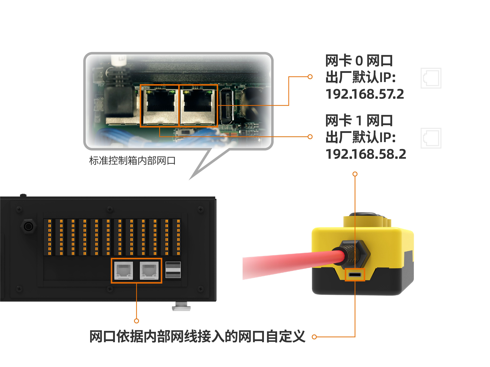
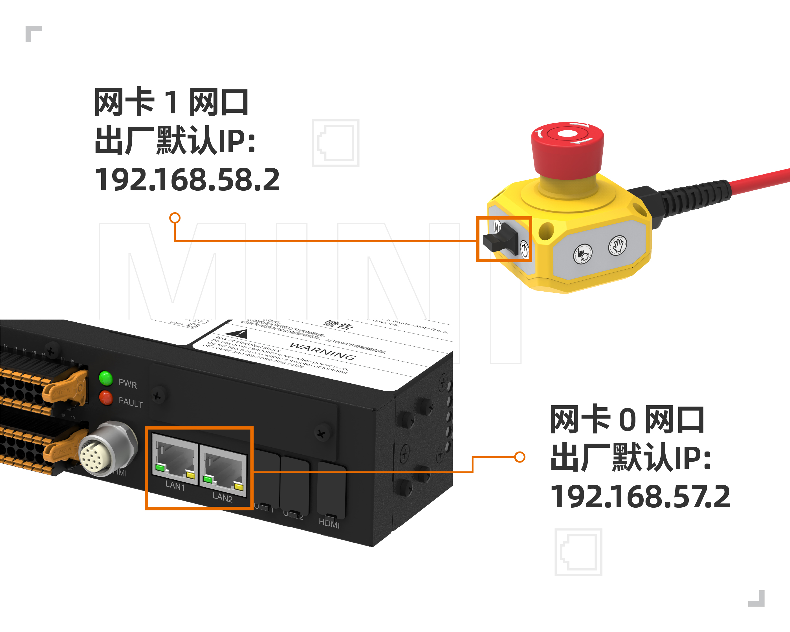
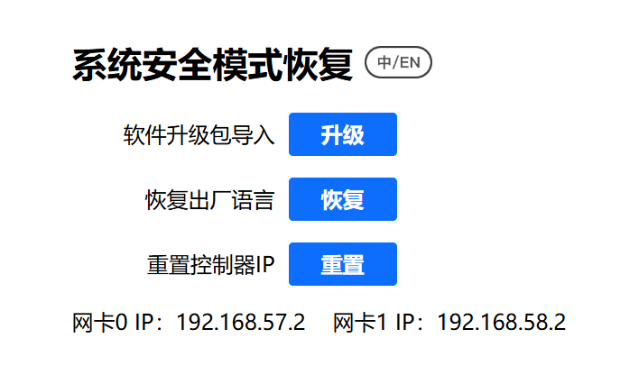
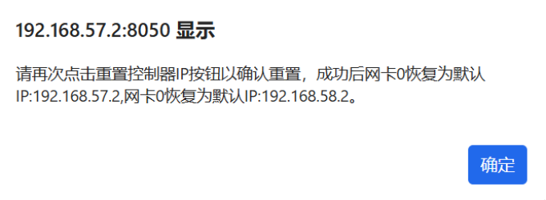
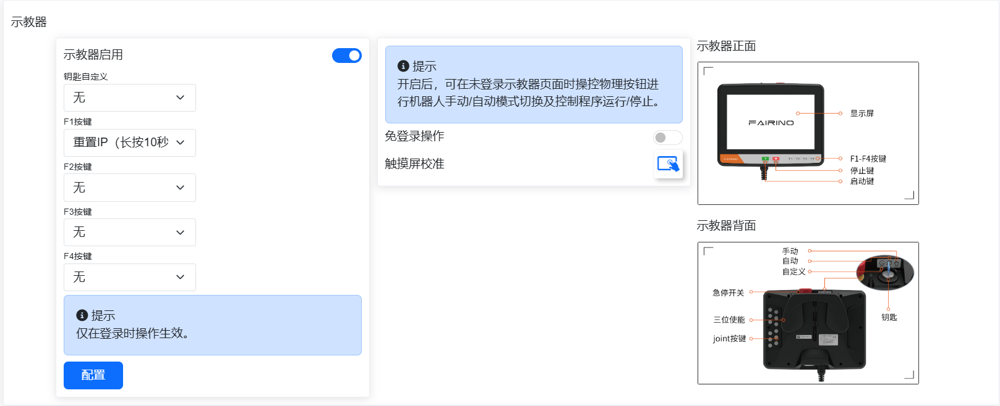
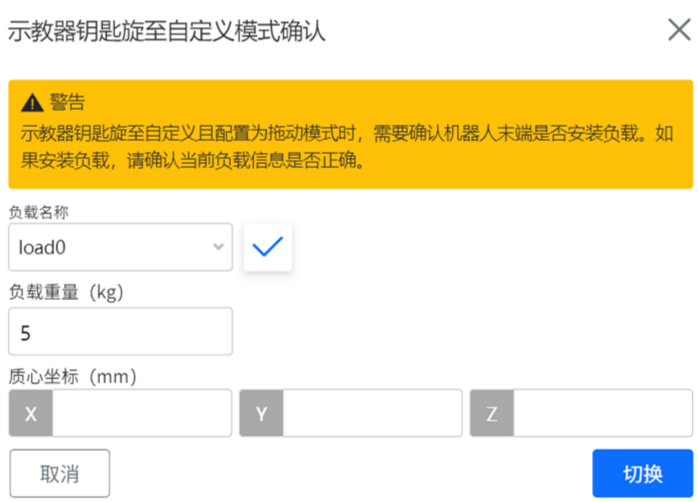

示教器
===============

.. toctree:: 
   :maxdepth: 6

示教器啟用
-------------------

1. 控制箱連接示教器，並啟動。

2. 登入帳號 admin，密碼 123。進入頁面，點擊系統設定-通用設定，確認示教器為啟用狀態。

.. image:: teach_pendant/001.png
   :width: 6in
   :align: center

.. centered:: 圖表 16.1‑1 示教器啟用狀態

示教器多語言設定
--------------------

1. 在登入介面（或首次啟動介面均可設定），在右上角進行語言選擇。

.. image:: teaching_pendant_software/062.png
   :width: 6in
   :align: center

.. centered:: 圖表 16.2‑1 啟動介面設定語言

.. image:: teaching_pendant_software/063.png
   :width: 6in
   :align: center

.. centered:: 圖表 16.2‑2 登入介面設定語言

2. 以登入介面設定多語言為例，選擇語言。出現以下提示（對應不同語言）即為設定成功，重啟控制箱完成語言設定。

.. image:: teach_pendant/004.png
   :width: 6in
   :align: center

.. centered:: 圖表 16.2‑3 設定中文

.. image:: teach_pendant/005.png
   :width: 6in
   :align: center

.. centered:: 圖表 16.2‑4 設定英文

輸入法切換
~~~~~~~~~~~~~~~~~~~~~~~~~~~~~~~~~~~~~~~~~~

預設輸入法為英文輸入法。

1. 開啟右下角軟鍵盤，點擊輸入框，例如點擊使用者名稱輸入框。

2. 切換中文拼音輸入法。

點擊兩次 CTRL 鍵，按鍵狀態變紅色，點擊空格進行選擇輸入法，以下為中文輸入法。

.. image:: teach_pendant/006.png
   :width: 6in
   :align: center

.. centered:: 圖表 16.2‑5 中文拼音輸入法

3. 切換英文輸入法

點擊兩次 CTRL 鍵，按鍵狀態變紅色，點擊空格進行選擇輸入法，以下為英文輸入法。

.. image:: teach_pendant/007.png
   :width: 6in
   :align: center

.. centered:: 圖表 16.2‑6 英文輸入法

登入成功後，系統會載入模型等資料，載入完畢後進入初始頁面。

示教器與 webApp 語言不一致
~~~~~~~~~~~~~~~~~~~~~~~~~~~~~~~~~~~~~~~~~~

啟用示教器後，在登入介面會觸發示教器與 webApp 語言校驗，當示教器語言與 webApp 語言不一致時，出現以下提示。

.. image:: teach_pendant/008.png
   :width: 6in
   :align: center

.. centered:: 圖表 16.2‑7 示教器與 webApp 語言不一致提示

控制器及實體示教器IP重設功能
----------------------------------------------------------------------------------

功能概述
~~~~~~~~~~~~~~~~~~~~~~~~~~~~~~~~~~~~~~~~~~~~

此次優化增加不同途徑的控制器及實體示教器IP復位操作功能，主要透過以下操作可實現以下功能：

- 1. 使用webrecovery介面可進行控制箱網卡0和網卡1的IP重設；
- 2. 使用實體示教器F1自訂按鍵功能配置IP復位（長按10秒）可進行控制箱網卡0、網卡1以及實體示教器的IP重設；
- 3. 使用實體示教器F2和F4組合按鍵，同時長按10秒，可以在實體示教器未登入時進行實體示教器設備的IP重設。

標準控制箱網卡示意圖和mini控制箱網卡示意圖如下所示。

.. centered:: 圖表 16.3‑1 標準控制箱網口示意圖

.. centered:: 圖表 16.3‑2 mini控制箱網口示意圖

Webrecovery介面IP重設
~~~~~~~~~~~~~~~~~~~~~~~~~~~~~~~~~~~~~~~~~~~~~~~~~~~~~~~~~~~~~~

使用8050埠登入webrecovery介面，如預設ip：192.168.57.2：8050登入，點選重設控制器IP「重設」按鈕，頁面會進行二次彈窗確認，點選確定後再次點選重設控制器IP按鈕以確認重設。

.. centered:: 圖表 16.3‑3 Webrecovery介面IP重設功能

二次確認後會提示重啟生效。重啟後控制器網卡0 IP恢復為預設192.168.57.2，網卡1 IP恢復為預設192.168.58.2。

.. centered:: 圖表 16.3‑4 Webrecovery介面IP重設二次確認

實體示教器F1按鍵自訂IP重設
~~~~~~~~~~~~~~~~~~~~~~~~~~~~~~~~~~~~~~~~~~~~~~~~~~~~~~~~~~~~~~~~~~~~~~~~~~~~~

使用實體示教器F1按鍵自訂功能需先登入示教器介面進行F按鍵自訂功能進行配置，點選「系統設定」，點選「通用設定」，選擇示教器模組，開啟啟用示教器開關，配置F1按鍵為重設IP（長按10秒），點選配置。

.. centered:: 圖表 16.3‑5 實體示教器F1按鍵自訂IP重設

此功能僅在實體示教器登入webapp時生效，長按F1按鍵10秒後會提示重啟生效。重啟後控制器網卡0 IP恢復為預設192.168.57.2，網卡1 IP恢復為預設192.168.58.2，實體示教器IP恢復為預設192.168.58.77。

實體示教器F2和F4組合按鍵IP重設
~~~~~~~~~~~~~~~~~~~~~~~~~~~~~~~~~~~~~~~~~~~~~~~~~~~~~~~~~~~~~~~~~~~~~~~~~~~~~

實體示教器設備提供IP重設功能，在未連接webapp情況下也可進行實體示教器IP復位。同時長按F2和F4組合按鍵10秒鐘，可重設實體示教器IP，IP預設恢復為192.168.58.77。恢復後需要重新登入webapp，在系統設定-通用設定中，設定實體示教器IP為192.168.58.77，重啟後重新建立示教器連接。

.. image:: installation/060.png
   :width: 6in
   :align: center

.. centered:: 圖表 16.3‑6 實體示教器F2和F4組合按鍵IP重設

示教器按鍵自訂功能
----------------------------------------------------------------------------------

功能概述
~~~~~~~~~~~~~~~~~~~~~~~~~~~~~~~~~~~~~~~~~~~~

本文檔旨在介紹如何使用示教器按鍵自訂功能。

操作說明
~~~~~~~~~~~~~~~~~~~~~~~~~~~~~~~~~~~~~~~~~~~~

功能配置
++++++++++++++++++++++++++++++++++++++

1. 開啟訪問並登入webApp;
   
2. 點選左側選單欄「系統設定」-「通用設定」選單進入示教器配置模組介面；

.. centered:: 圖表 16.4‑1 示教器按鍵功能配置介面

3. 示教器啟用後，包含鑰匙自訂功能，F1-F4按鍵的功能配置。其中鑰匙自訂功能可設定為拖動模式，F1-F4按鍵可配置重設IP(長按10秒)，一鍵清除報錯，輸出DO，使能切換及啟動指定Lua程式。

鑰匙自訂設定為拖動
++++++++++++++++++++++++++++++++++++++++++++++++++++++++++++++++

1. 當鑰匙自訂配置為拖動模式，且在登入WebApp時，示教器鑰匙旋至自訂時，介面彈窗需確認當前負載，以防負載錯誤導致墜落；

.. image:: installation/061.png
   :width: 6in
   :align: center

.. centered:: 圖表 16.4‑2 示教器模式示例

2. 確認負載設定正確後，點選確認，機器人進入拖動模式。

.. centered:: 圖表 16.4‑3 拖動模式設定前確認負載

F1-F4按鍵功能自訂
++++++++++++++++++++++++++++++++++++++++++++++++++++++++++++++++

.. image:: installation/060.png
   :width: 6in
   :align: center
   
.. centered:: 圖表 16.4‑4 示教器按鍵示例

1. **重設IP（長按10秒）功能**：配置後長按10秒後會提示重啟生效。重啟後控制器網卡0的IP恢復為預設192.168.57.2，網卡1的IP恢復為預設192.168.58.2，實體示教器IP恢復為預設192.168.58.77。
   
2. **一鍵清除報錯功能**：在當介面出現報錯提示時，按壓對應功能F鍵，可清除報錯。
   
3. **輸出DO功能**：配置該功能且設定DO編號後，按壓對應功能F鍵，可將當前DO編號對應狀態切換。
   
4. **使能切換功能**：配置該功能後，按壓對應功能F鍵，可當前使能狀態。
   
5. **啟動Lua程式**：配置該功能且設定Lua程式後，按壓對應功能F鍵，機器人在自動模式下，即可自動執行所設定的Lua程式。