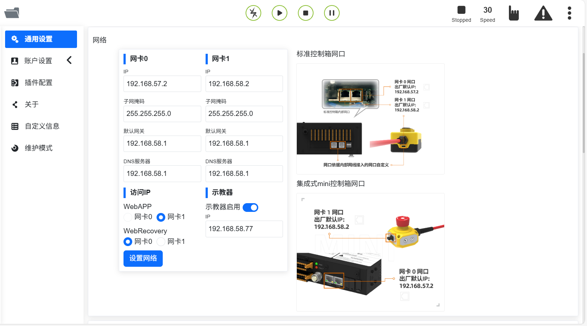
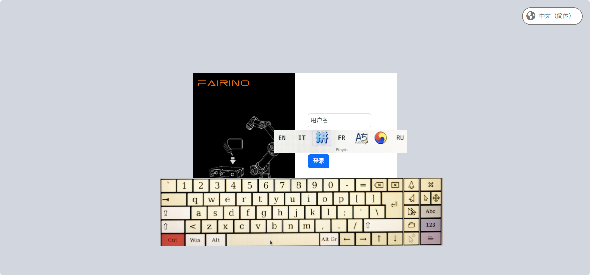
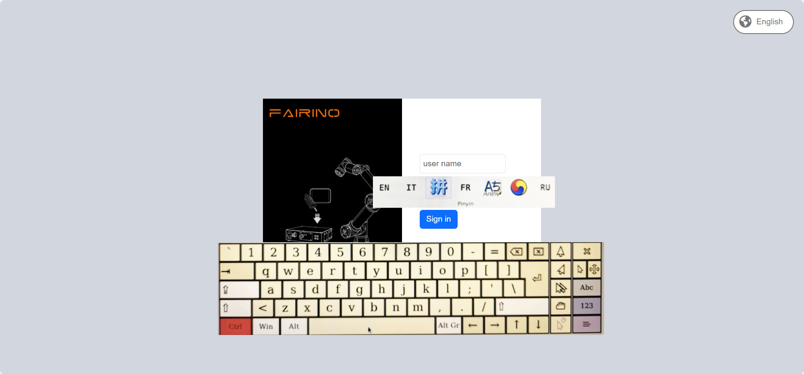

示教器
===============

.. toctree:: 
   :maxdepth: 6

示教器啟用
-------------------

1. 控制箱連接示教器，並啟動。

2. 登入帳號 admin，密碼 123。進入頁面，點擊系統設定-通用設定，確認示教器為啟用狀態。

.. centered:: 圖表 16.1‑1 示教器啟用狀態

示教器多語言設定
--------------------

1. 在登入介面（或首次啟動介面均可設定），在右上角進行語言選擇。

.. image:: teaching_pendant_software/062.png
   :width: 6in
   :align: center

.. centered:: 圖表 16.2‑1 啟動介面設定語言

.. image:: teaching_pendant_software/063.png
   :width: 6in
   :align: center

.. centered:: 圖表 16.2‑2 登入介面設定語言

2. 以登入介面設定多語言為例，選擇語言。出現以下提示（對應不同語言）即為設定成功，重啟控制箱完成語言設定。

.. image:: teach_pendant/004.png
   :width: 6in
   :align: center

.. centered:: 圖表 16.2‑3 設定中文

.. image:: teach_pendant/005.png
   :width: 6in
   :align: center

.. centered:: 圖表 16.2‑4 設定英文

輸入法切換
++++++++++++++++++++++++++++

預設輸入法為英文輸入法。

1. 開啟右下角軟鍵盤，點擊輸入框，例如點擊使用者名稱輸入框。

2. 切換中文拼音輸入法。

點擊兩次 CTRL 鍵，按鍵狀態變紅色，點擊空格進行選擇輸入法，以下為中文輸入法。

.. centered:: 圖表 16.2‑5 中文拼音輸入法

3. 切換英文輸入法

點擊兩次 CTRL 鍵，按鍵狀態變紅色，點擊空格進行選擇輸入法，以下為英文輸入法。

.. centered:: 圖表 16.2‑6 英文輸入法

登入成功後，系統會載入模型等資料，載入完畢後進入初始頁面。

示教器與 webApp 語言不一致
++++++++++++++++++++++++++++

啟用示教器後，在登入介面會觸發示教器與 webApp 語言校驗，當示教器語言與 webApp 語言不一致時，出現以下提示。

.. centered:: 圖表 16.2‑7 示教器與 webApp 語言不一致提示
