示教器軟體基礎功能 
=========================

.. toctree:: 
   :maxdepth: 6

基礎資訊
-----------

系統簡介
~~~~~~~~~~~

示教器軟體是針對機器人開發的配套軟體，運行於示教器作業系統中，其主要功能和技術特點如下：

- 能夠對機器人進行示教程式的編寫；
- 能夠即時顯示機器人位置座標，三維模擬實體機器人，並能控制機器人運動；
- 能夠實現對機器人的單軸點動以及各軸聯動操作；
- 能夠查看控制IO狀態；
- 使用者可以修改密碼、檢視系統資訊等。

機器人首次激活
~~~~~~~~~~~~~~~

1. 開啟控制箱並將網路線連接PC。

2. PC開啟瀏覽器存取目標網址192.168.58.2，機器人首次開機即進入啟動頁面。

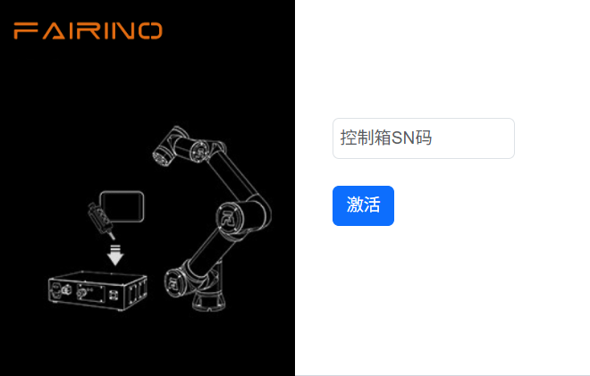

.. centered:: 圖表 5.1‑1 啟用設定

3. 正確輸入裝置箱的SN碼，輸入完畢後點選「啟動」按鈕。

4. 系統將驗證您的SN碼。如果輸入正確，將自動完成啟動程序。

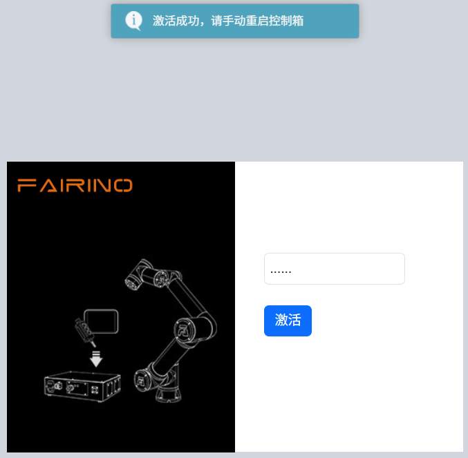

.. centered:: 圖表 5.1‑2 啟動成功介面

5. 啟動成功，請手動重新啟動控制箱。

6. 再次開機存取目標網址192.168.58.2即進入登入頁面。

啟動軟體
~~~~~~~~~~~

1. 控制箱上電；
2. 示教器開啟瀏覽器存取目標網址192.168.58.2；
3. 輸入使用者名稱和密碼點選登入即可登入系統。

使用者登入及權限更新
~~~~~~~~~~~~~~~~~~~~

.. centered:: 表格 5.1-1 初始用戶

.. list-table::
   :widths: 70 70 70 70
   :header-rows: 0
   :align: center

   * - **工號**
     - **初始使用者名稱**
     - **密碼**
     - **職能代號**

   * - 111
     - admin
     - 123
     - 1

   * - 222
     - MEenginer
     - 222
     - 2

   * - 333
     - PEenginer
     - 333
     - 3
   
   * - 444
     - programmer
     - 444
     - 4
   
   * - 555
     - operator
     - 555
     - 5

   * - 666
     - monitor
     - 666
     - 6

使用者（使用者管理參考15.2.1 使用者管理）預設分為六個等級，管理員無功能限制，操作員和監視器一小部分功能可以使用，ME工程師、PE&PQE工程師和技術員&班組長部分功能限制，管理員無功能限制，具體預設職能代號權限參考15.2.2 權限管理。

登入介面如下圖所示：

.. figure:: teaching_pendant_software/001.png
   :width: 4in
   :align: center

.. centered:: 圖表 5.1‑3 登入介面

多語言設定
~~~~~~~~~~~~~~~~~~~~

- 系統目前自帶有中文（簡體）、中文（繁體）、英語（English）、法語（français）、韓語（한국어）、日語（日本語）和俄語（Русский）七種語言。

- 語言套件名稱必須為：[語言代碼].json，例如：es.json，其中語言代碼為ISO 639-1標準

- 以下為語言對照表

.. list-table::
   :widths: 70 70 70 70
   :header-rows: 0
   :align: center

   * - **語言**
     - **當地語言名稱**
     - **語言代碼（ISO 639-1）**
     - **是否繫統自帶**

   * - 中文
     - 中文（汉语）
     - zh
     - 是

   * - 中文
     - 中文（繁體）
     - tc
     - 是

   * - 英語
     - English
     - en
     - 是

   * - 法語
     - français
     - fr
     - 是
   
   * - 日語
     - 日本語
     - ja 
     - 是

   * - 韓語
     - 한국어
     - ko
     - 是

   * - 俄語
     - Русский
     - ru
     - 是

1. 在登入介面（或首次啟動介面均可設定），在右上角進行語言選擇；

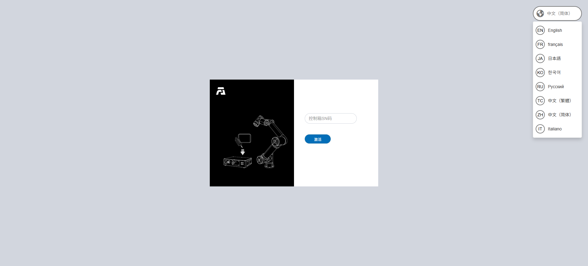

.. centered:: 圖表 5.1‑5 啟動介面設定語言

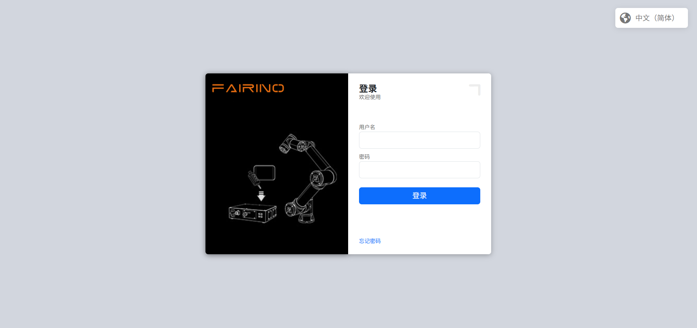

.. centered:: 圖表 5.1‑6 登入介面設定語言

2. 以登入介面設定多語言為例，若選擇語言，則目前頁面語言內容切換為所選語言，例如：

.. image:: teaching_pendant_software/001.png
   :width: 4in
   :align: center

.. centered:: 圖表 5.1‑7 中文登入頁面

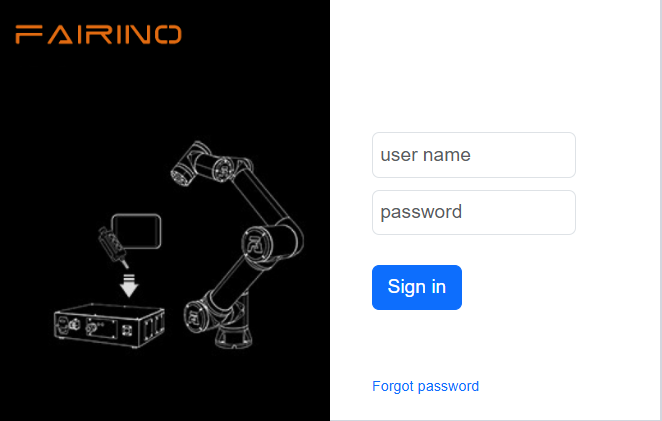

.. centered:: 圖表 5.1‑7 英文登入頁面

登入成功後，系統會載入模型等數據，載入完畢後進入初始頁面。

系統初始介面
------------------

登入成功後系統進入“初始介面”，主要包含：

1. 法奧LOGO；
2. 選單列縮放按鈕；
3. 選單列；
4. 機器人控制區
5. 機器人狀態區；
6. 三維模擬機器人－三維場景操作；
7. 三維模擬機器人－機器人本體操作；
8. 機器人配套功能；
9. 機器人及配套功能狀態。

如下圖系統初始界面示意圖所示：

.. image:: teaching_pendant_software/002.png
   :align: center
   :width: 6in

.. centered:: 圖表 5.2‑1 系統初始界面示意圖

當進入WebApp 的「初始設定」、「示教程式->程式編程」、「示教程式->圖形化程式設計」和輔助應用程式時，此時三維模擬機器人模型頁面是半展開的，點擊鋪開的圖示可重新進入系統初始介面。

.. image:: teaching_pendant_software/054.png
   :align: center
   :width: 6in

.. centered:: 圖表 5.2‑2 三維模擬機器人模型頁面可鋪開圖標

控制區
~~~~~~~~~

.. note:: 
   .. image:: teaching_pendant_software/003.png
      :width: 0.75in
      :height: 0.75in
      :align: left

   名稱：**使能按鈕**

   作用：使能機器人

.. note:: 
   .. image:: teaching_pendant_software/004.png
      :width: 0.75in
      :height: 0.75in
      :align: left

   名稱：**開始按鈕**

   作用：上傳並開始執行示教程序

.. note:: 
   .. image:: teaching_pendant_software/005.png
      :width: 0.75in
      :height: 0.75in
      :align: left

   名稱：**停止按鈕**

   作用：停止目前示教程序運行

.. note:: 
   .. image:: teaching_pendant_software/006.png
      :width: 0.75in
      :height: 0.75in
      :align: left

   名稱：**暫停/恢復按鈕**

   作用：暫停和恢復目前示教程序
   
.. important::
   暫停指令在程式的結尾，無法進行判斷。

狀態列
~~~~~~~~~~~~

.. note:: 
   .. image:: teaching_pendant_software/007.png
      :width: 0.75in
      :height: 0.75in
      :align: left

   名稱：**機器人狀態**

   作用：Stopped-停止，Running-運行，Pause-暫停，Drag-拖曳

.. note:: 
   .. image:: teaching_pendant_software/008.png
      :width: 0.75in
      :height: 0.75in
      :align: left

   名稱：**工具座標系編號**

   作用：展示目前應用的工具座標系編號

.. note:: 
   .. image:: teaching_pendant_software/027.png
      :width: 0.75in
      :height: 0.75in
      :align: left

   名稱：**工件座標系編號**

   作用：展示目前應用的工件座標系編號
   
.. note:: 
   .. image:: teaching_pendant_software/028.png
      :width: 0.75in
      :height: 0.75in
      :align: left

   名稱：**擴充軸座標系編號**

   作用：展示目前應用的擴展軸座標系編號
   
.. note:: 
   .. image:: teaching_pendant_software/009.png
      :width: 0.75in
      :height: 0.75in
      :align: left

   名稱：**運行速度百分比**

   作用：機器人當前模式運作時速度

.. note:: 
   .. image:: teaching_pendant_software/010.png
      :width: 0.75in
      :height: 0.75in
      :align: left

   名稱：**機器人運作正常狀態**

   作用：當前機器人正常運作

.. note:: 
   .. image:: teaching_pendant_software/011.png
      :width: 0.75in
      :height: 0.75in
      :align: left

   名稱：**機器人運作錯誤狀態**

   作用：當前機器人運作有錯誤

.. note:: 
   .. image:: teaching_pendant_software/012.png
      :width: 0.75in
      :height: 0.75in
      :align: left

   名稱：**自動模式**

   作用：機器人自動運作模式，開啟手動切自動模式全域速度調整並指定速度時，全域速度會自動調整為指定速度

.. note:: 
   .. image:: teaching_pendant_software/013.png
      :width: 0.75in
      :height: 0.75in
      :align: left

   名稱：**示教模式**

   作用：機器人示教運作模式

.. note:: 
   .. image:: teaching_pendant_software/014.png
      :width: 0.75in
      :height: 0.75in
      :align: left

   名稱：**機器人拖曳狀態**

   作用：當前機器人可拖曳

.. note:: 
   .. image:: teaching_pendant_software/015.png
      :width: 0.75in
      :height: 0.75in
      :align: left

   名稱：**機器人拖曳狀態**

   作用：當前機器人不可拖曳

.. note:: 
   .. image:: teaching_pendant_software/017.png
      :width: 0.75in
      :height: 0.75in
      :align: left

   名稱：**連線狀態**

   作用：機器人已連接

.. note:: 
   .. image:: teaching_pendant_software/016.png
      :width: 0.75in
      :height: 0.75in
      :align: left

   名稱：**未連線狀態**

   作用：機器人未連接

.. note:: 
   .. image:: teaching_pendant_software/018.png
      :width: 0.75in
      :height: 0.75in
      :align: left

   名稱：**帳戶資訊**

   作用：顯示用戶名及權限及登出用戶

選單列
~~~~~~~~~~~~

選單列如下表格：

.. centered:: 表格 5.2‑1 示教器選單分欄

+----------+------------+
|   一級   |    二級    |
+==========+============+
| 初始設定 | 基礎       |
+          +------------+
|          | 安全       |
+          +------------+
|          | 週邊       |
+----------+------------+
| 示教程式 | 程式編程   |
+          +------------+
|          | 圖形化編程 |
+          +------------+
|          | 節點圖編程 |
+          +------------+
|          | 示教點     |
+----------+------------+
| 狀態資訊 | 系統日誌   |
+          +------------+
|          | 狀態查詢   |
+----------+------------+
| 輔助應用 | 工具應用   |
+          +------------+
|          | 焊接專家庫 |
+----------+------------+
| 系統設定 | /          |
+----------+------------+

三維模擬機器人
----------------

三維場景操作條
~~~~~~~~~~~~~~~~~~~~~~~~~~~

機器人座標系系統三維視覺化展示
++++++++++++++++++++++++++++++++

在WebAPP機器人三維虛擬區域創建各類三維虛擬座標系，以基底座標系展示為例，如下圖所示。其中X軸紅色，Y軸綠色，Z軸藍色。

.. note:: 
   .. image:: teaching_pendant_software/021.png
      :width: 0.75in
      :height: 0.75in
      :align: left

   名稱：**基底座標系**

   說明：基底坐標系WebAPP中系統機器人三維虛擬區域中進行預設開啟展示，固定標記在機器人基座底部中心。三維虛擬基座標係可進行手動關閉展示。

.. note:: 
   .. image:: teaching_pendant_software/022.png
      :width: 0.75in
      :height: 0.75in
      :align: left

名稱：**工具座標系**

 說明：工具座標系預設開啟展示，可手動關閉。在WebAPP啟動且使用者登入成功後，取得目前應用的工具座標系名稱和對應參數數據，初始化目前工具座標系。

.. important::
 使用的過程中應用其他工具座標系時，當應用工具座標係指令成功後，先將機器人三維虛擬區域中已有的工具座標系清除，再將新應用的工具座標系參數資料傳入三維座標系生成API進行工具座標系生成，生成後完成在機器人三維虛擬區域進行對應展示。

.. note:: 
   .. image:: teaching_pendant_software/023.png
      :width: 0.75in
      :height: 0.75in
      :align: left

   名稱：**工件座標系**

   說明：工件座標系預設關閉，可以進行手動開啟展示。流程與工具座標系一致。

.. note:: 
   .. image:: teaching_pendant_software/024.png
      :width: 0.75in
      :height: 0.75in
      :align: left

   名稱：**外部軸座標系**

   說明：外部軸座標系預設為關閉，可進行手動開啟展示。流程與工具座標系一致。

三維虛擬軌跡與導入工具模型
++++++++++++++++++++++++++++++++

.. note:: 
   .. image:: teaching_pendant_software/020.png
      :width: 0.75in
      :height: 0.75in
      :align: left

名稱：**軌跡繪製**

 說明：點選按鈕，開啟軌跡繪製功能。執行示教程式時，機器人三維模型會描繪機器人運動的軌跡路線。

.. note:: 
   .. image:: teaching_pendant_software/029.png
      :width: 0.75in
      :height: 0.75in
      :align: left

名稱：**導入工具模型**

 說明：點選按鈕，彈出導入工具模型模態窗，上傳檔案導入成功後即可在機器人末端進行工具模型展示，目前支援的工具模型檔案格式有STL和DAE。

機器人本體操作條
~~~~~~~~~~~~~~~~~~~~~~~~~~~

TCP
+++++++++++

**Base點動**：在基底座標系下，可以透過長按對應座標係按鈕來控制機器人，在X，Y，Z軸上直線移動或繞著RX，RY，RZ旋轉。 Base點動的功能與Joint運動中單軸點動的功能相似。介面如下圖：

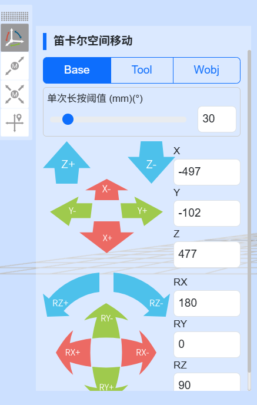

.. centered:: 圖表 5.3-1 Base點動示意圖

.. important::
 可隨時釋放該按鈕，使機器人停止運動。在必要情況下，按下急停按鈕使機器人停止。

**Tool點動**：選擇工具座標系，可以透過長按對應座標係按鈕控制機器人，在X，Y，Z軸上直線移動或繞著RX，RY，RZ旋轉。 Tool點動的功能與Joint運動中單軸點動的功能相似。介面如下圖：

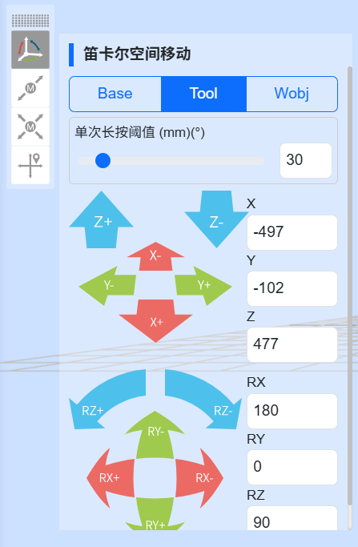

.. centered:: 圖表 5.3-2 Tool點動示意圖

**Wobj點動**：選擇工件點動，可以透過長按對應座標係按鈕控制機器人，在工件座標系下，沿著X，Y，Z軸上直線移動或繞著RX，RY，RZ旋轉。 Wobj點動的功能與Joint運動中單軸點動的功能相似。介面如下圖：

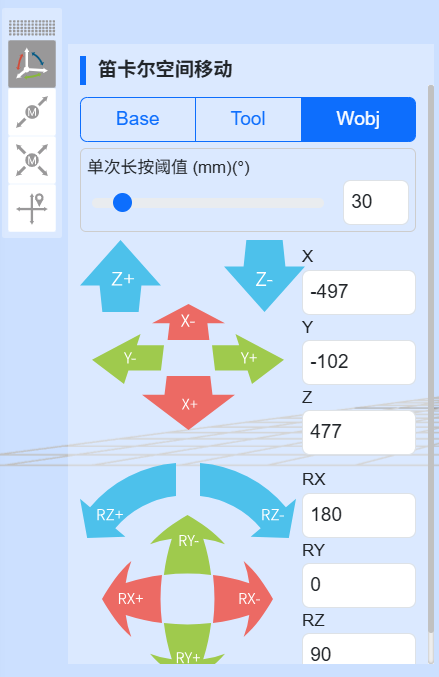

.. centered:: 圖表 5.3-3 Wobj點動示意圖

Joint運動
++++++++++++++++

Joint運作下，中間的6個滑塊條分別表示對應軸的角度，joint運動分單軸點動和多軸連動。

**單軸點動**：使用者可透過操作左右兩邊圓形按鈕來控制機器人運動，如下圖。在手動模式和關節座標系下，對機器人某一關節進行轉動操作。當機器人超出運動範圍（軟限位）而停止時，可以利用單軸點動進行手動操作，將機器人移出超限位置。單軸點動在進行粗略定位和較大幅度移動時，會比其他操作模式更快方便。

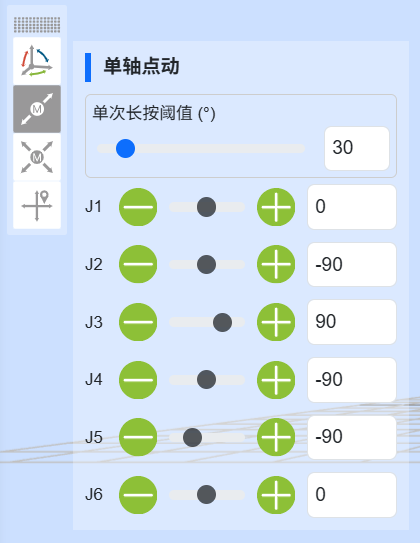

.. centered:: 圖表 5.3-4 單軸點動示意圖

.. important::
 設定「長按運動閾值」（長按按鈕時，機器人運行的最大距離，輸入值得範圍0~300）參數，長按圓形按鈕控制機器人運行，若在機器人運作中放開按鈕，機器人會立即停止運動，若一直按住不放開按鈕，機器人會運行長按運動閾值所設定的值後停止運動。

**多軸連動**：使用者可操作中間六個滑桿來調整機器人對應的目標位置，如下圖。可透過觀察三維虛擬機器人來確定目標位置，若調整的位置不符合自己的預期，點選「還原」按鈕，使得三維虛擬機器人回到初始的位置。當使用者確定目標位置後，可點選「應用」按鈕，實體機器人就會進行對應的運動。

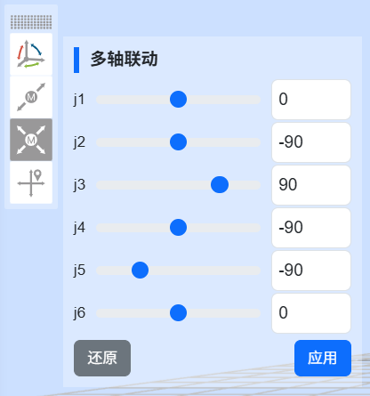

.. centered:: 圖表 5.3-5 多軸聯動示意圖

.. important::
 在多軸聯動中，第5個關節j5的設定值不能小於0.01度，若期望值小於0.01度，則可以先設定為0.011度，再透過單軸點動微調第5個關節j5。

Move移動
++++++++++++++++

選擇Move移動，可以直接輸入笛卡爾座標值，點擊“計算關節位置”，關節位置顯示為計算後結果，確認無危險，可以點擊“移至該點”控制機器人運動至輸入的笛卡爾位姿。

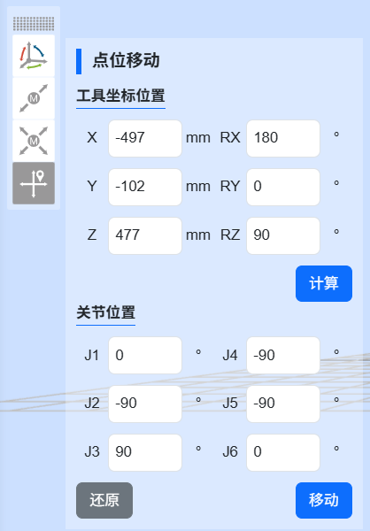

.. centered:: 圖表 5.3‑6 Move移動示意圖

.. important::
 當出現給定位姿無法到達時，首先檢查笛卡爾空間位姿是否超過機器人工作範圍，然後檢查當前位姿到目標位姿過程中是否存在奇異位姿，若存在奇異位置則調整下當前姿態或過程中插入一個新的位姿以避開奇異位姿。

機器人配套功能條
~~~~~~~~~~~~~~~~~~~~~~~~~~~

示教點記錄
++++++++++++++++

手動示教控制區主要是在示教模式中對考坐標系進行設定，並即時顯示機器人各軸角度與坐標值，並可對示教點進行命名保存。

儲存示教點時，此示教點的座標係為目前機器人應用的座標系。

示教點記錄分為「快速記點」和「命名記點」兩種方式。

- 快速記點：示教點自動記錄，名稱自動產生；
- 命名記點：示教點命名自訂，由示教點前綴+示教點名稱構成；

感測器示教點，選擇已經標定的感測器類型工具，輸入點名稱，點選新增，儲存的點的位置為感測器識別到點的位置。

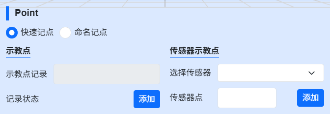

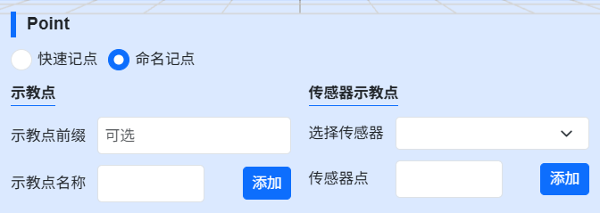

.. centered:: 圖表 5.3‑7 手動操作區示意圖

.. important::
 第一次使用時，請設定30這樣較小的速度值，熟悉機器人運動，以免發生意外狀況。

I/O
++++++++++++++++

此介面中可實現對機器人控制箱中數位輸出、類比輸出（0-10v）和末端工具數位輸出、類比輸出（0-10v）進行手動控制。如下圖所示：

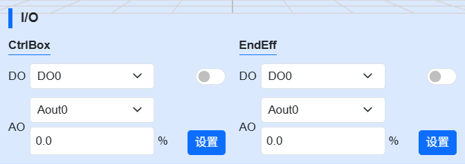

.. centered:: 圖表 5.3‑8 I/O設定示意圖

TPD（示教程式設計）
+++++++++++++++++++++

示教程式設計（TPD）功能操作步驟如下：

- **Step1記錄初始位置**：進入三維模型左側操作區，記錄機器人目前位置。在編輯框內設定好點的名稱，點選「儲存」按鈕，若儲存成功，則提示「儲存點成功」；

- **Step2配置軌跡記錄參數**：點選TPD進入「TPD」功能項目配置軌跡記錄參數，設定好軌跡檔的名稱、位姿類型以及取樣週期，配置DI和DO，可以在記錄TPD軌跡的過程中，透過觸發DI來記錄對應需要輸出的DO；

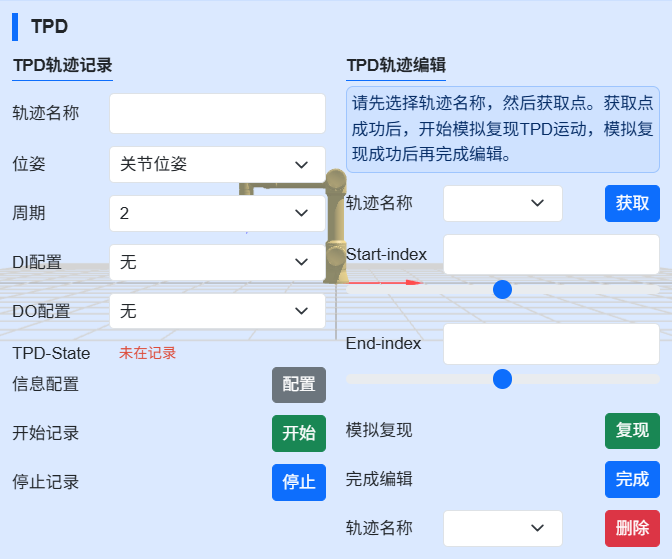

.. centered:: 圖表 5.3‑9 TPD軌跡記錄

- **Step3檢查機器人模式**：檢查機器人模式是否處於手動模式下，若不處於則切換至手動模式，在手動模式下可透過兩種方式切換到托動示教模式，一種是長按末端按鈕，一種是介面拖曳模式切換按鍵，在TPD記錄是建議從介面切換機器人進入托動示教模式。

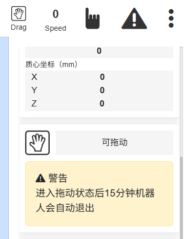

.. centered:: 圖表 5.3‑10 機器人模式

.. important::
 從介面切入拖曳模式時，先確認末端工具負載以及質心是否設定正確、摩檫力補償係數是否設定合理，再透過長按末端按鈕確認拖曳是否正常，確認無誤後從介面切入拖曳模式。

- **Step4開始錄音**：點選「開始錄音」按鈕開始軌跡記錄，拖曳機器人進行動作示教。此外，末端DI配置中有「TPD記錄啟動/停止」功能配置項，透過配置此功能，使用者可以透過外部訊號觸發「開始記錄」軌跡功能，需要注意的是，透過外部訊號開始記錄軌跡，首先得在頁面先進行TPD軌跡的資訊配置。

- **Step5停止記錄**：動作示教完成後，點擊「停止記錄」按鈕，停止軌跡記錄，然後透過拖曳示教切換按鍵使機器人退出拖曳示教模式。示教器接收到「停止軌跡記錄成功」即表示軌跡記錄成功。同步驟4，設定「TPD記錄啟動/停止」功能後，可透過外部訊號觸發停止記錄。

- **Step6示教程式設計**：點選新建，選擇空白模板，點選進入PTP功能程式設計項，選擇剛儲存的初始位置點，點選「新增」按鈕，應用完成後，在程式檔案中會顯示一條PTP指令；然後點選進入TPD功能編程項，選擇剛剛記錄的軌跡，設定是否平滑以及速度縮放比例，點擊「新增」按鈕，應用完成後，在程式檔案中會顯示一條MoveTPD指令，如下圖所示；

.. image:: teaching_pendant_software/040.png
   :width: 5in
   :align: center

.. centered:: 圖表 5.3‑11 TPD程式設計

- **Step7軌跡復現**：示教程序編輯完成後，切換至自動運行模式，點擊界面上方”開始運行”圖標開始運行程序，機器人開始復現示教的動作。

- **Step8軌跡編輯**：TPD軌跡編輯區可將軌跡視覺化展示和編輯裁切，以達到TPD軌跡預分析和精簡。選擇對應軌跡獲取點，那麼使用者記錄的軌跡點就會展示在機器人三維空間內，其次使用者可以拖曳「Start」和「End」捲軸對軌跡的起點和終點進行模擬複現和剪輯。

TPD檔案刪除與異常處理：

- **軌跡文件刪除**：點選進入TPD功能項，選擇需要刪除的軌跡文件，點選」刪除軌跡」按鈕，若刪除成功，則會收到刪除成功提示。

- **異常處理：**

 + **指令點數超限**：一條軌跡最多可記錄2萬個點數，當超過2萬個點時，控制器不再記錄超過的點數，並向示教器發出「指令點數超限」告警提示，此時需點選停止記錄；

 + **TPD指令間隔過大**：若示教器報錯TPD指令間隔過大，則應檢查機器人是否回到了記錄前的初始位置，若機器人回到了初始位置依然報錯TPD指令間隔過大，則刪除目前軌跡重新記錄一條新的軌跡；

 + TPD操作過程中若出現其他異常情況，則應透過示教器或急停按鈕立即停止機器人操作，檢查原因。

.. important::
 TPD功能操作過程中應嚴格遵守示教器上對應的提示進行操作。

Eaxis移動
++++++++++++++++

選擇Eaxis移動，該功能為擴展軸的點動功能，需要在配置好擴展軸的前提下，使用該點動功能控制擴展軸，詳見“第四章-機器人外設-擴展軸外設配置” 。

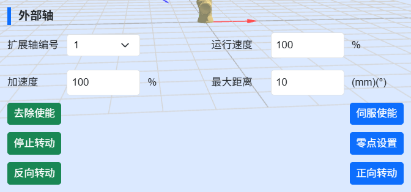

.. centered:: 圖表 5.3‑12 Eaxis移動示意圖

FT
++++++++++++++++

選擇參考座標作為力感測器拖曳時的參考。

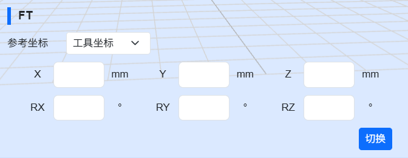

.. centered:: 圖表 5.3‑12 FT示意圖

遠心不動點
++++++++++++++++

此功能主要應用於醫療穿透，設定遠心不動點後，機器人末端始終在該點移動。

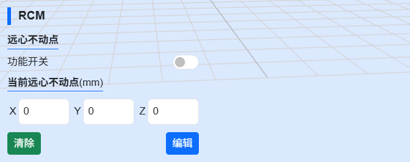

.. centered:: 圖表 5.3‑13 遠心不動點示意圖

機器人及配套功能狀態條
~~~~~~~~~~~~~~~~~~~~~~~~~~~

Robot
++++++++++++++++

顯示目前機器人型號、剛度、關節和座標資料資訊。

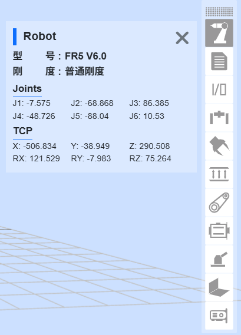

.. centered:: 圖表 5.3‑14 機器人狀態

Program
++++++++++++++++

顯示目前運行程序和子程序的資訊。

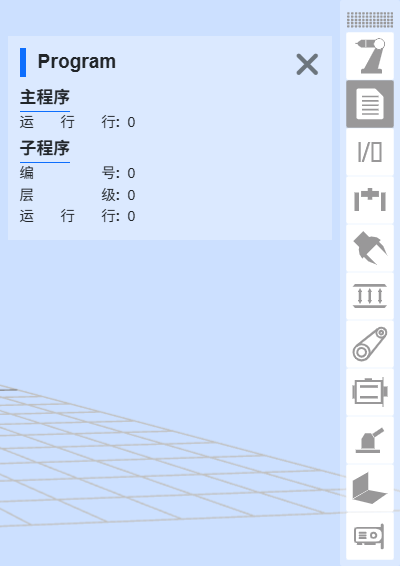

.. centered:: 圖表 5.3‑15 程式狀態

I/O
++++++++++++++++

顯示目前IO的狀態，數位輸入與數位輸出中，若該連接埠電平為高，則該點顯示為綠色，若為低，則顯示為白色；類比輸入和類比輸出顯示值為0-100，100即表示10v。

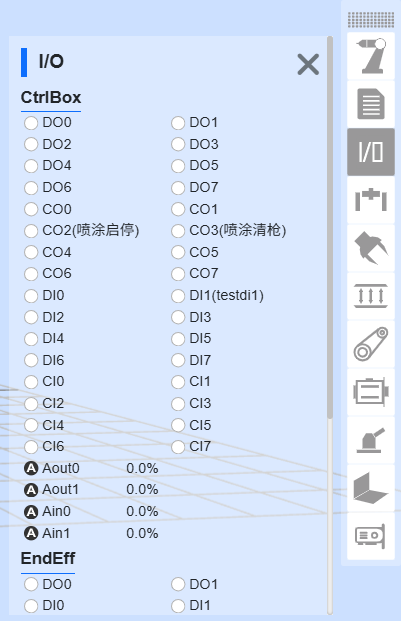

.. centered:: 圖表 5.3‑16 IO狀態

ExAxis
++++++++++++++++

顯示目前擴展軸（控制器+PLC）伺服狀態資訊。

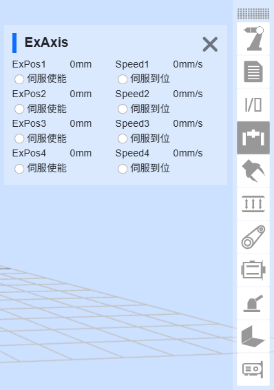

.. centered:: 圖表 5.3‑17 擴展軸（控制器+PLC）狀態

Gripper
++++++++++++++++

顯示目前夾爪狀態資訊。

.. image:: teaching_pendant_software/048.png
   :width: 3in
   :align: center

.. centered:: 圖表 5.3‑18 夾爪狀態

FT
++++++++++++++++

顯示目前力控狀態資訊。

.. image:: teaching_pendant_software/049.png
   :width: 3in
   :align: center

.. centered:: 圖表 5.3‑19 力控狀態

Convery
++++++++++++++++

顯示目前傳送帶狀態資訊。

.. image:: teaching_pendant_software/050.png
   :width: 3in
   :align: center

.. centered:: 圖表 5.3‑20 傳送帶狀態

Servo
++++++++++++++++

顯示目前擴展軸（控制器+伺服控制器）狀態資訊。

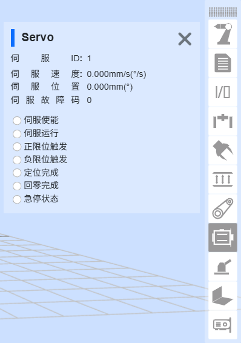

.. centered:: 圖表 5.3‑21 擴展軸（控制器+伺服控制器）狀態

Polish
++++++++++++++++

顯示目前打磨狀態資訊。

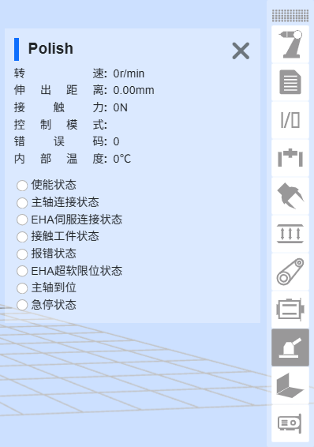

.. centered:: 圖表 5.3‑22 打磨狀態

Weld
++++++++++++++++

顯示目前焊接狀態資訊。

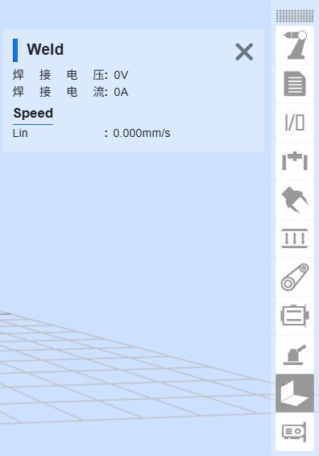

.. centered:: 圖表 5.3‑23 焊接狀態

機器人安裝方式設定與展示
~~~~~~~~~~~~~~~~~~~~~~~~~~~

在Web端示教頁面，點選“初始設定”→“基礎”→“安裝頁面”，其頁面佈局如下所示。具體的說明如下：

1. 快速安裝用於機械手臂常見的安裝設置，由左至右分別對應：正裝、側裝和倒裝。當點擊對應的按鈕後，介面將自動下發並更改基座傾斜和旋轉角。
2. 若所需的安裝方式不符合快速安裝，則可自行設定基座傾斜及旋轉角進行配置。
3. 不論是快速安裝還是自行設置基座傾斜及旋轉角，均需點選應用程式後方可生效。

.. note:: 請確保設定的安裝方式與實際機械手臂一致後，再進行拖曳操作，否則會有安全隱患。

.. image:: teaching_pendant_software/026.png
   :width: 6in
   :align: center
   
.. centered:: 圖表 5.3‑24 360度自由安裝

.. important::
 機器人安裝完成後，必須正確設定機器人的安裝方式，否則會影響機器人的拖曳功能以及碰撞偵測功能使用。
