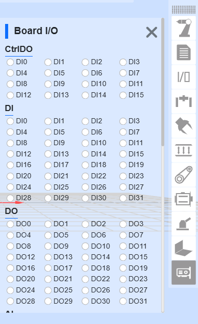

示教器軟體基礎功能
=========================

.. toctree:: 
   :maxdepth: 6

基礎資訊
-----------

系統簡介
~~~~~~~~~~~

示教器軟體是針對機器人開發的配套軟體，執行於示教器作業系統中，其主要功能和技術特點如下：

-  能夠對機器人進行示教程式的編寫；
-  能夠即時顯示機器人位置座標，三維模擬實體機器人，並能控制機器人運動；
-  能夠實現對機器人的單軸點動以及各軸聯動操作；
-  能夠檢視控制IO狀態；
-  使用者可以修改密碼、檢視系統資訊等。

機器人首次啟動
~~~~~~~~~~~~~~~

1. 開啟控制箱並將網路線連接PC。

2. PC開啟瀏覽器存取目標網址192.168.58.2，機器人首次開機即進入啟動頁面。

.. figure:: teaching_pendant_software/058.png
   :width: 4in
   :align: center

.. centered:: 圖表 5.1‑1 啟動介面

3. 正確輸入裝置箱的SN碼，輸入完畢後點選「啟動」按鈕。
   
4. 系統將驗證您的SN碼。如果輸入正確，將自動完成啟動過程。

.. figure:: teaching_pendant_software/059.png
   :width: 4in
   :align: center

.. centered:: 圖表 5.1‑2 啟動成功介面

5. 啟動成功，請手動重啟控制箱。
   
6. 再次開機存取目標網址192.168.58.2即進入登入頁面。

啟動軟體
~~~~~~~~~~~

1. 控制箱上電；
2. 示教器開啟瀏覽器存取目標網址192.168.58.2；
3. 輸入使用者名稱和密碼點選登入即可登入系統。

使用者登入及許可權更新
~~~~~~~~~~~~~~~~~~~~~~~~~~~~~~~~~~~~~~~~

.. centered:: 表格 5.1-1 初始使用者

.. list-table::
   :widths: 70 70 70 70
   :header-rows: 0
   :align: center

   * - **工號**
     - **初始使用者名稱**
     - **密碼**
     - **職能代號**

   * - 111
     - admin
     - 123
     - 1

   * - 222
     - MEenginer
     - 222
     - 2

   * - 333
     - PEenginer
     - 333
     - 3
   
   * - 444
     - programmer
     - 444
     - 4
   
   * - 555
     - operator
     - 555
     - 5

   * - 666
     - monitor
     - 666
     - 6

使用者（使用者管理參考15.2.1 使用者管理）預設分為六個等級，管理員無功能限制，操作員和監視員少部分功能可以使用，ME工程師、PE&PQE工程師和技術員&班組長部分功能限制，管理員無功能限制，具體預設職能代號許可權參考15.2.2 許可權管理。

登入介面如下圖所示：

.. figure:: teaching_pendant_software/001.png
   :width: 4in
   :align: center

.. centered:: 圖表 5.1‑3 登入介面

多語言設定
~~~~~~~~~~~~~~~~~~~~

- 系統目前自帶有中文（簡體）、中文（繁體）、英語（English）、法語（français）、韓語（한국어）、日語（日本語）、俄語（Русский）和義大利語（italiano）八種語言。

- 語言包名稱必須為：[語言程式碼].json，例如：es.json，其中語言程式碼為ISO 639-1標準
  
- 以下為語言對照表

.. list-table::
   :widths: 70 70 70 70
   :header-rows: 0
   :align: center

   * - **語言**
     - **當地語言名稱**
     - **語言程式碼（ISO 639-1）**
     - **是否系統自帶**

   * - 中文
     - 中文（漢語）
     - zh
     - 是

   * - 中文
     - 中文（繁體）
     - tc
     - 是

   * - 英語
     - English
     - en
     - 是

   * - 法語
     - français
     - fr
     - 是
   
   * - 日語
     - 日本語
     - ja 
     - 是

   * - 韓語
     - 한국어
     - ko
     - 是

   * - 俄語
     - Русский
     - ru
     - 是

   * - 義大利語
     - italiano
     - it
     - 是

1. 在登入介面（或首次啟動介面均可設定），在右上角進行語言選擇；

.. image:: teaching_pendant_software/062.png
   :width: 6in
   :align: center

.. centered:: 圖表 5.1‑5 啟動介面設定語言

.. image:: teaching_pendant_software/063.png
   :width: 6in
   :align: center

.. centered:: 圖表 5.1‑6 登入介面設定語言

2. 以登入介面設定多語言為例，若選擇語言，則當前頁面語言內容切換為所選語言，例如：

.. image:: teaching_pendant_software/001.png
   :width: 4in
   :align: center

.. centered:: 圖表 5.1‑7 中文登入頁面

.. image:: teaching_pendant_software/061.png
   :width: 4in
   :align: center

.. centered:: 圖表 5.1‑8 英文登入頁面

登入成功後，系統會載入模型等資料，載入完畢後進入初始頁面。

系統初始介面
------------------

登入成功後系統進入「初始介面」，主要包含：

1. 法奧LOGO；
2. 選單欄縮放按鈕；
3. 選單欄；
4. 機器人控制區
5. 機器人狀態區；
6. 三維模擬機器人——三維場景操作；
7. 三維模擬機器人——機器人本體操作；
8. 機器人配套功能；
9. 機器人及配套功能狀態。

如下圖系統初始介面示意圖所示：

.. image:: teaching_pendant_software/002.png
   :align: center
   :width: 6in

.. centered:: 圖表 5.2‑1 系統初始介面示意圖

當進入 WebApp 的「初始設定」、「示教程式」->「程式設計」、「示教程式」->「圖形化程式設計」和輔助應用時，此時三維模擬機器人模型頁面是半展開的，點選鋪開的圖示可重新進入系統初始介面。

.. image:: teaching_pendant_software/054.png
   :align: center
   :width: 6in

.. centered:: 圖表 5.2‑2 三維模擬機器人模型頁面可鋪開圖示

控制區
~~~~~~~~~

.. note:: 
   .. image:: teaching_pendant_software/003.png
      :width: 0.75in
      :height: 0.75in
      :align: left

   名稱：**使能按鈕**
   
   作用：使能機器人

.. note:: 
   .. image:: teaching_pendant_software/004.png
      :width: 0.75in
      :height: 0.75in
      :align: left

   名稱：**開始按鈕**
   
   作用：上傳並開始執行示教程式

.. note:: 
   .. image:: teaching_pendant_software/005.png
      :width: 0.75in
      :height: 0.75in
      :align: left

   名稱：**停止按鈕**
   
   作用：停止當前示教程式執行

.. note:: 
   .. image:: teaching_pendant_software/006.png
      :width: 0.75in
      :height: 0.75in
      :align: left

   名稱：**暫停/恢復按鈕**
   
   作用：暫停和恢復當前示教程式
   
.. important::
   暫停指令在程式的末尾，無法進行判斷

狀態欄
~~~~~~~~~~~~

.. note:: 
   .. image:: teaching_pendant_software/011.png
      :width: 0.75in
      :height: 0.75in
      :align: left

   名稱：**機器人運行錯誤狀態**
   
   作用：當前機器人運行有錯誤，無錯誤時隱藏

.. note:: 
   .. image:: teaching_pendant_software/007.png
      :width: 0.75in
      :height: 0.75in
      :align: left

   名稱：**機器人狀態**
   
   作用：Stopped-停止，Running-運行，Pause-暫停，Drag-拖動

.. note:: 
   .. image:: teaching_pendant_software/010.png
      :width: 0.75in
      :height: 0.75in
      :align: left

   名稱：**機器人工具座標系、工件座標系、擴展軸座標系和負載編號**
   
   作用：左上——當前工具座標系編號、右上——當前工件座標系編號、左下——當前擴展軸座標系編號、右下——當前負載編號

.. note:: 
   .. image:: teaching_pendant_software/009.png
      :width: 0.75in
      :height: 0.75in
      :align: left

   名稱：**運行速度百分比**
   
   作用：機器人當前模式運行時速度

.. note:: 
   .. image:: teaching_pendant_software/012.png
      :width: 0.75in
      :height: 0.75in
      :align: left

   名稱：**自動模式**
   
   作用：機器人自動運行模式，開啟「手動切自動模式全域速度調整」並指定速度時，全域速度會自動調整為指定速度

.. note:: 
   .. image:: teaching_pendant_software/013.png
      :width: 0.75in
      :height: 0.75in
      :align: left

   名稱：**手動模式**
   
   作用：機器人手動模式，進行機器人示教操作

.. note:: 
   .. image:: teaching_pendant_software/065.png
      :width: 0.75in
      :height: 0.75in
      :align: left

   名稱：**機器人狀態折疊/展開按鈕**
   
   作用：折疊/展開工具座標系、工件座標系、擴展軸座標系、負載、機器人拖動狀態、本機/遠端模式、機器人連接狀態、BOOT模式和帳戶資訊內容

點擊折疊按鈕，查看以下狀態資訊內容。

.. note:: 
   .. image:: teaching_pendant_software/008.png
      :width: 0.75in
      :height: 0.75in
      :align: left

   名稱：**工具座標系編號**
   
   作用：展示當前應用的工具座標系編號

.. note:: 
   .. image:: teaching_pendant_software/027.png
      :width: 0.75in
      :height: 0.75in
      :align: left

   名稱：**工件座標系編號**
   
   作用：展示當前應用的工件座標系編號
   
.. note:: 
   .. image:: teaching_pendant_software/028.png
      :width: 0.75in
      :height: 0.75in
      :align: left

   名稱：**擴展軸座標系編號**
   
   作用：展示當前應用的擴展軸座標系編號

.. note:: 
   .. image:: teaching_pendant_software/066.png
      :width: 0.75in
      :height: 0.75in
      :align: left

   名稱：**負載**
   
   作用：展示當前應用的負載重量和質心座標X、Y、Z

.. note:: 
   .. image:: teaching_pendant_software/014.png
      :width: 0.75in
      :height: 0.75in
      :align: left

   名稱：**機器人拖動狀態**
   
   作用：當前機器人可拖動

.. note:: 
   .. image:: teaching_pendant_software/015.png
      :width: 0.75in
      :height: 0.75in
      :align: left

   名稱：**機器人拖動狀態**
   
   作用：當前機器人不可拖動

.. note:: 
   .. image:: teaching_pendant_software/068.png
      :width: 0.75in
      :height: 0.75in
      :align: left

   名稱：**機器人本機模式**
   
   作用：當前機器人通過控制箱控制

.. note:: 
   .. image:: teaching_pendant_software/067.png
      :width: 0.75in
      :height: 0.75in
      :align: left

   名稱：**機器人遠端模式**
   
   作用：當前機器人只能通過PLC控制

.. note:: 
   .. image:: teaching_pendant_software/017.png
      :width: 0.75in
      :height: 0.75in
      :align: left

   名稱：**連線狀態**
   
   作用：機器人已連線

.. note:: 
   .. image:: teaching_pendant_software/016.png
      :width: 0.75in
      :height: 0.75in
      :align: left

   名稱：**未連線狀態**
   
   作用：機器人未連線

.. note:: 
   .. image:: teaching_pendant_software/018.png
      :width: 0.75in
      :height: 0.75in
      :align: left

   名稱：**賬戶資訊**
   
   作用：顯示使用者名稱和許可權及登出使用者

選單欄
~~~~~~~~~~~~

選單欄如下表格：

.. centered:: 表格 5.2‑1 示教器選單分欄

+----------+----------------+
|   一級   |      二級      |
+==========+================+
| 初始設定 | 基礎           |
+          +----------------+
|          | 安全           |
+          +----------------+
|          | 外設           |
+----------+----------------+
| 示教程式 | 程式設計       |
+          +----------------+
|          | 圖形化程式設計 |
+          +----------------+
|          | 節點圖程式設計 |
+          +----------------+
|          | 示教點         |
+----------+----------------+
| 狀態資訊 | 系統日誌       |
+          +----------------+
|          | 狀態查詢       |
+----------+----------------+
| 輔助應用 | 工具應用       |
+          +----------------+
|          | 工藝包         |
+----------+----------------+
| 系統設定 | /              |
+----------+----------------+

三維模擬機器人
----------------

三維場景操作條
~~~~~~~~~~~~~~~~~~~~~~~~~~~

機器人座標系系統三維視覺化展示
++++++++++++++++++++++++++++++++

在WebAPP機器人三維虛擬區域中建立各類三維虛擬座標系，以基座標系展示為例，如下圖所示。其中X軸紅色，Y軸綠色，Z軸藍色。

.. note:: 
   .. image:: teaching_pendant_software/021.png
      :width: 0.75in
      :height: 0.75in
      :align: left

   名稱：**基座標系**
   
   說明：基座標系WebAPP中系統機器人三維虛擬區域中進行預設開啟展示，固定標記在機器人基座底部中心。三維虛擬基座標系可進行手動關閉展示。

.. note:: 
   .. image:: teaching_pendant_software/022.png
      :width: 0.75in
      :height: 0.75in
      :align: left

   名稱：**工具座標系**
   
   說明：工具座標系預設開啟展示，可手動關閉。在WebAPP啟動並且使用者登入成功後，取得當前應用的工具座標系名稱和對應引數資料，初始化當前工具座標系。

.. important::
   使用的過程中應用其他工具座標系時，當應用工具座標系指令成功後，先將機器人三維虛擬區域中已有的工具座標系清除，再將新應用的工具座標系引數資料傳入三維座標系生成API進行工具座標系生成，生成後完成在機器人三維虛擬區域中進行對應展示。

.. note:: 
   .. image:: teaching_pendant_software/023.png
      :width: 0.75in
      :height: 0.75in
      :align: left

   名稱：**工件座標系**
   
   說明：工件座標系預設關閉，可以進行手動開啟展示。流程與工具座標系一致。

.. note:: 
   .. image:: teaching_pendant_software/024.png
      :width: 0.75in
      :height: 0.75in
      :align: left

   名稱：**外部軸座標系**
   
   說明：外部軸座標系預設關閉，可以進行手動開啟展示。流程與工具座標系一致。

三維虛擬軌跡和匯入工具模型
++++++++++++++++++++++++++++++++

.. note:: 
   .. image:: teaching_pendant_software/020.png
      :width: 0.75in
      :height: 0.75in
      :align: left

   名稱：**軌跡繪製**
   
   說明：點選按鈕，開啟軌跡繪製功能。執行示教程式時，機器人三維模型會描繪機器人運動的軌跡路線。

.. note:: 
   .. image:: teaching_pendant_software/029.png
      :width: 0.75in
      :height: 0.75in
      :align: left

   名稱：**匯入工具模型**
   
   說明：點選按鈕，彈出匯入工具模型模態窗，上傳檔案匯入成功後即可在機器人末端進行工具模型展示，目前支援的工具模型檔案格式有STL和DAE。

機器人本體操作條
~~~~~~~~~~~~~~~~~~~~~~~~~~~

TCP
+++++++++++

**Base點動**：在基座標系下，可以透過長按對應座標系按鈕來控制機器人，在X，Y，Z軸上直線移動或繞著RX，RY，RZ旋轉。Base點動的功能與Joint運動中單軸點動的功能相似。介面如下圖：

.. image:: teaching_pendant_software/030.png
   :width: 3in
   :align: center

.. centered:: 圖表 5.3-1 Base點動示意圖

.. important:: 
   可隨時釋放該按鈕，使機器人停止運動。在必要情況下，按急停按鈕使機器人停止。

**Tool點動**：選擇工具座標系，可以透過長按對應座標系按鈕控制機器人，在X，Y，Z軸上直線移動或繞著RX，RY，RZ旋轉。Tool點動的功能與Joint運動中單軸點動的功能相似。介面如下圖：

.. image:: teaching_pendant_software/031.png
   :width: 3in
   :align: center

.. centered:: 圖表 5.3-2 Tool點動示意圖

**Wobj點動**：選擇工件點動，可以透過長按對應座標系按鈕控制機器人，在工件座標系下，沿著X，Y，Z軸上直線移動或繞著RX，RY，RZ旋轉。Wobj點動的功能與Joint運動中單軸點動的功能相似。介面如下圖：

.. image:: teaching_pendant_software/032.png
   :width: 3in
   :align: center

.. centered:: 圖表 5.3-3 Wobj點動示意圖

Joint運動
++++++++++++++++

Joint運作下，中間的6個滑塊條分別表示對應軸的角度，joint運動分單軸點動和多軸聯動。

**單軸點動**：使用者可透過操作左右兩邊圓形按鈕來控制機器人運動，如下圖。在手動模式和關節座標系下，對機器人某一關節進行轉動操作。當機器人超出運動範圍（軟限位）而停止時，可以利用單軸點動進行手動操作，將機器人移出超限位置。單軸點動在進行粗略定位和較大幅度移動時，會比其他操作模式更快捷方便。

.. image:: teaching_pendant_software/033.png
   :width: 3in
   :align: center

.. centered:: 圖表 5.3-4 單軸點動示意圖

.. important::
   設定「長按運動閾值」（長按按鈕時，機器人執行的最大距離，輸入值得範圍0~300）引數，長按圓形按鈕控制機器人執行，若在機器人執行中鬆開按鈕，機器人會立即停止運動，若一直按住不鬆開按鈕，機器人會執行長按運動閾值所設定的值後停止運動。

**多軸聯動**：使用者可操作中間六個滑塊來調整機器人相應的目標位置，如下圖。可透過觀察三維虛擬機器人來確定目標位置，若調整的位置不符合自己的預期，點選「還原」按鈕，使得三維虛擬機器人回到初始的位置。當使用者確定目標位置後，可點選「應用」按鈕，實體機器人便會進行相應的運動。

.. image:: teaching_pendant_software/034.png
   :width: 3in
   :align: center

.. centered:: 圖表 5.3-5 多軸聯動示意圖

.. important:: 
   多軸聯動中，第5個關節j5的設定值不能小於0.01度，若期望值小於0.01度，則可以先設定為0.011度，然後透過單軸點動微調第5個關節j5。

Move移動
++++++++++++++++

選擇Move移動，可以直接輸入笛卡爾座標值，點選「計算關節位置」，關節位置顯示為計算後結果，確認無危險，可以點選「移至該點」控制機器人運動至輸入的笛卡爾位姿。

.. image:: teaching_pendant_software/035.png
   :width: 3in
   :align: center

.. centered:: 圖表 5.3‑6 Move移動示意圖

.. important:: 
   當出現給定位姿無法到達時，首先檢查笛卡爾空間位姿是否超過機器人工作範圍，然後檢查當前位姿到目標位姿過程中是否存在奇異位姿，若存在奇異位置則調整下當前姿態或過程中插入一個新的位姿以避開奇異位姿。

機器人配套功能條
~~~~~~~~~~~~~~~~~~~~~~~~~~~

示教點記錄
++++++++++++++++

手動示教控制區主要是在示教模式中對考座標系進行設定，並即時顯示機器人各軸角度與座標值，並可對示教點進行命名儲存。

儲存示教點時，該示教點的座標系為當前機器人應用的座標系。

示教點記錄分為「快速記點」和「命名記點」兩種方式。

- 快速記點：示教點自動記錄，名稱自動生成；
- 命名記點：示教點命名自定義，由示教點字首+示教點名稱構成；

感測器示教點，選擇已經標定的感測器型別工具，輸入點名稱，點選新增，儲存的點的位置為感測器識別到點的位置。

.. image:: teaching_pendant_software/036.png
   :width: 5in
   :align: center

.. image:: teaching_pendant_software/060.png
   :width: 5in
   :align: center

.. centered:: 圖表 5.3‑7 手動操作區示意圖

.. important:: 
   第一次使用時，請設定30這樣較小的速度值，熟悉機器人運動，以免發生意外情況。

I/O
++++++++++++++++

該介面中可實現對機器人控制箱中數字輸出、模擬輸出（0-10v）和末端工具數字輸出、模擬輸出（0-10v）進行手動控制。如下圖所示：

.. image:: teaching_pendant_software/037.png
   :width: 5in
   :align: center

.. centered:: 圖表 5.3‑8 I/O設定示意圖

TPD（示教程式設計）
++++++++++++++++++++++++++++++++

示教程式設計（TPD）功能操作步驟如下：

- **Step1記錄初始位置**：進入三維模型左側操作區，記錄機器人當前位置。在編輯框內設定好點的名稱，點選「儲存」按鈕，若儲存成功，則提示「儲存點成功」；

- **Step2配置軌跡記錄引數**：點選TPD進入「TPD」功能項配置軌跡記錄引數，設定好軌跡檔案的名稱、位姿型別以及取樣週期，配置DI和DO，可以在記錄TPD軌跡的過程中，透過觸發DI來記錄對應需要輸出的DO；

.. image:: teaching_pendant_software/038.png
   :width: 5in
   :align: center

.. centered:: 圖表 5.3‑9 TPD軌跡記錄

- **Step3檢查機器人模式**：檢查機器人模式是否處於手動模式下，若不處於則切換至手動模式，在手動模式下可透過兩種方式切換到託動示教模式，一種是長按末端按鈕，一種是介面拖動模式切換按鍵，在TPD記錄是推薦從介面切換機器人進入託動示教模式。

.. image:: teaching_pendant_software/039.png
   :width: 3in
   :align: center

.. centered:: 圖表 5.3‑10 機器人模式

.. important:: 
   從介面切入拖動模式時，先確認末端工具負載以及質心是否設定正確、摩檫力補償係數是否設定合理，然後透過長按末端按鈕確認拖動是否正常，確認無誤後從介面切入拖動模式。

- **Step4開始記錄**：點選「開始記錄」按鈕開始軌跡記錄，拖動機器人進行動作示教。此外，末端DI配置中有「TPD記錄啟動/停止」功能配置項，透過配置此功能，使用者可以透過外部訊號觸發「開始記錄」軌跡功能，需要注意的是，透過外部訊號開始記錄軌跡，首先得在頁面先進行TPD軌跡的資訊配置。

- **Step5停止記錄**：動作示教完成後，點選「停止記錄」按鈕，停止軌跡記錄，然後透過拖動示教切換按鍵使機器人退出拖動示教模式。示教器接收到「停止軌跡記錄成功」即表示軌跡記錄成功同步驟4，在配置「TPD記錄啟動/停止」功能後，可以透過外部訊號觸發停止記錄。

- **Step6示教程式設計**：點選新建，選擇空白模板，點選進入PTP功能程式設計項，選擇剛儲存的初始位置點，點選「新增」按鈕，應用完成後，在程式檔案中會顯示一條PTP指令；然後點選進入TPD功能程式設計項，選擇剛剛記錄的軌跡，設定是否平滑以及速度縮放比例，點選「新增」按鈕，應用完成後，在程式檔案中會顯示一條MoveTPD指令，如下圖所示；

.. image:: teaching_pendant_software/040.png
   :width: 5in
   :align: center

.. centered:: 圖表 5.3‑11 TPD程式設計

- **Step7軌跡復現**：示教程式編輯完成後，切換至自動執行模式，點選介面上方」開始執行」圖示開始執行程式，機器人開始復現示教的動作。

- **Step8軌跡編輯**：TPD軌跡編輯區可對軌跡視覺化展示和編輯裁切，以達到TPD軌跡預分析和精簡。選擇對應軌跡取得點，那麼使用者記錄的軌跡點會展示在機器人三維空間內，其次使用者可以拖動「Start」和「End」滾動條對軌跡的起點和終點進行模擬復現和剪輯。

TPD檔案刪除與異常處理：

- **軌跡檔案刪除**：點選進入TPD功能項，選擇需要刪除的軌跡檔案，點選」刪除軌跡」按鈕，若刪除成功，則會收到刪除成功提示。

- **異常處理：**

  +  **指令點數超限**：一條軌跡最多可記錄2萬個點數，當超過2萬個點時，控制器不再記錄超過的點數，並向示教器發出「指令點數超限」告警提示，此時需點選停止記錄；

  +  **TPD指令間隔過大**：若示教器報錯TPD指令間隔過大，則應檢查機器人是否回到了記錄前的初始位置，若機器人回到了初始位置依然報錯TPD指令間隔過大，則刪除當前軌跡重新記錄一條新的軌跡；

  +  TPD操作過程中若出現其他異常情況，則應透過示教器或急停按鈕立即停止機器人操作，檢查原因。

.. important:: 
   TPD功能操作過程中應嚴格按照示教器上相應的提示進行操作。

Eaxis移動
++++++++++++++++

選擇Eaxis移動，該功能為擴充套件軸的點動功能，需要在配置好擴充套件軸的前提下，使用該點動功能控制擴充套件軸，詳見「第四章-機器人外設-擴充套件軸外設配置」。

.. image:: teaching_pendant_software/041.png
   :width: 5in
   :align: center

.. centered:: 圖表 5.3‑12 Eaxis移動示意圖

FT
++++++++++++++++

選擇參考座標作為力感測器拖動時的參考。

.. image:: teaching_pendant_software/042.png
   :width: 5in
   :align: center

.. centered:: 圖表 5.3‑12 FT示意圖

遠心不動點
++++++++++++++++

該功能主要應用於醫療穿透，設定遠心不動點後，機器人末端始終在該點運動。

.. image:: teaching_pendant_software/043.png
   :width: 5in
   :align: center

.. centered:: 圖表 5.3‑13 遠心不動點示意圖

機器人及配套功能狀態條
~~~~~~~~~~~~~~~~~~~~~~~~~~~

Robot
++++++++++++++++

顯示當前機器人型號、剛度、關節和座標資料資訊。

.. image:: teaching_pendant_software/044.png
   :width: 3in
   :align: center

.. centered:: 圖表 5.3‑14 機器人狀態

Program
++++++++++++++++

顯示當前執行程式和子程式的資訊。

.. image:: teaching_pendant_software/045.png
   :width: 3in
   :align: center

.. centered:: 圖表 5.3‑15 程式狀態

I/O
++++++++++++++++

顯示當前IO的狀態，數字輸入與數字輸出中，若該埠電平為高，則該點顯示為綠色，若為低，則顯示為白色；模擬輸入和模擬輸出顯示值為0-100，100即表示10v。

.. image:: teaching_pendant_software/046.png
   :width: 3in
   :align: center

.. centered:: 圖表 5.3‑16 IO狀態

ExAxis
++++++++++++++++

顯示當前擴充套件軸（控制器+PLC）伺服狀態資訊。

.. image:: teaching_pendant_software/047.png
   :width: 3in
   :align: center

.. centered:: 圖表 5.3‑17 擴充套件軸（控制器+PLC）狀態

Gripper
++++++++++++++++

顯示當前夾爪狀態資訊。

.. image:: teaching_pendant_software/048.png
   :width: 3in
   :align: center

.. centered:: 圖表 5.3‑18 夾爪狀態

FT
++++++++++++++++

顯示當前力控狀態資訊。

.. image:: teaching_pendant_software/049.png
   :width: 3in
   :align: center

.. centered:: 圖表 5.3‑19 力控狀態

Convery
++++++++++++++++

顯示當前傳送帶狀態資訊。

.. image:: teaching_pendant_software/050.png
   :width: 3in
   :align: center

.. centered:: 圖表 5.3‑20 傳送帶狀態

Servo
++++++++++++++++

顯示當前擴充套件軸（控制器+伺服控制器）狀態資訊。

.. image:: teaching_pendant_software/051.png
   :width: 3in
   :align: center

.. centered:: 圖表 5.3‑21 擴充套件軸（控制器+伺服控制器）狀態

Polish
++++++++++++++++

顯示當前打磨狀態資訊。

.. image:: teaching_pendant_software/052.png
   :width: 3in
   :align: center

.. centered:: 圖表 5.3‑22 打磨狀態

Weld
++++++++++++++++

顯示當前焊接狀態資訊。

.. image:: teaching_pendant_software/053.png
   :width: 3in
   :align: center

.. centered:: 圖表 5.3‑23 焊接狀態

Board I/O
++++++++++++++++

顯示當前板卡狀態資訊。

.. centered:: 圖表 5.3‑24 板卡狀態
