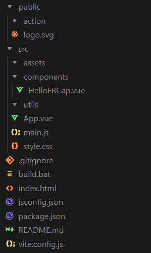

開發指導
=========================

.. toctree:: 
   :maxdepth: 6

開發環境及條件
---------------

開發環境最低需滿足以下配置：

- CPU：1.6 GHz或更快的處理器；
- RAM：>=1 GB（建議2 GB以上）；
- ROM：>=128GB；
- OS：需要 Windows 10或更高版本、macOS 10.15或更高版本、Linux（x64）系統（Ubuntu、Debian等）。
- 控制器版本：在WebApp《系統設置-關於》中查看，開發環境注意區分QX與LA，指令示例QX環境下避免使用ES6+語法等現代JavaScript特性。

我們已經封裝了一些介面和模組，但想要達到一個較好的開發效果，建議對Web開發有一定的了解，最好熟悉以下技術：

- HTML，JavaScript/TypeScript，CSS；
- Vue3；
- Vite；
- Node.js。

開發工具
-------------
我們推薦使用最新的Visual Studio Code（VSCode）軟體進行開發。下載請造訪VSCode官方下載頁面，選擇對應系統下載即可。

同時在本機電腦中需安裝有Node.js執行環境，安裝Node.js時會附帶安裝npm等工具，方便進行套件管理。造訪Node.js官方下載頁面，選擇版本為v20的對應系統下載即可。

在VSCode中開發還有可能會使用到以下的VSCode插件，可以按需進行安裝配置。

- Vue；
- ESlint；
- npm Intellisense；
- Vue Language Features (Volar)；
- TypeScript Vue Plugin (Volar)或Vue.volar；
- Tailwind CSS IntelliSense。

FRCap專案結構
-------------

FRCap的專案文件結構：

.. centered:: 圖表 5-1  FRCap專案結構

- Public：

公共資源資料夾，在建置過程中不會對內部文件進行建置處理，而是直接完整複製到建置目錄下。

內部預設包含了action資料夾和logo.svg。

Action資料夾是用來存放自訂指令後台介面邏輯檔案的。

Logo.svg是插件圖示。

- Src：

Assets資料夾主要用來放置靜態資源。

Components資料夾主要用來放置元件。

Utils資料夾主要用來放置工具類別。

App.vue首頁程式碼。

Main.js主要負責資源全域引入，Vue框架創建等。

Style.css專案基礎樣式檔。

- Build.bat：Windows平台建置腳本。
- Index.html：頁面UI主框架。
- Package.json：套件描述檔和編譯策略等。
- Vite.config.js：Vite設定檔。

前端frcap-ui、frcap-api使用
----------------------------

Frcap-ui提供了一些已經透過Vue元件封裝好的HTML控件，可以導入專案中進行使用，降低頁面UI開發難度和程式碼量，提高程式碼可讀性。當然，您也可以選擇一些優秀開源的UI元件庫，例如Element plus等。

首先在您的專案路徑下開啟終端，安裝frcap-ui。

.. code-block:: c++
   :linenos:

   npm install frcap-ui -s

安裝成功後，在需要使用frcap-ui的元件中引入，以按鈕控制項為例。

.. code-block:: javascript
   :linenos:

   import { AppButton } from 'frcap-ui'

然後在組件的<template>元素中使用。

.. code-block:: c++
   :linenos:

   <AppButton button-text="Start" button-type="primary"></AppButton>

在瀏覽器中預覽開發專案效果。

.. image:: frcap_pictures/009.png
   :width: 6in
   :align: center

.. centered:: 圖表 5-2  AppButton效果

目前我們提供了4種比較常見的控制組件。

- AppButton：按鈕元件。

 - buttonType: 按鈕類型，String，對應不同的按鈕樣式，預設為primary。

 - primary：藍色；
 - secondery：灰色；
 - safety：綠色；
 - warning：黃色；
 - serious：紅。

 - buttonText：按鈕文本，String，預設值為「primary」。

- AppInput：輸入元件。

 - Type：必要項，String，缺省值text。表示輸入框的類型。

 - Number：數字輸入框；
 - Text：文字輸入框。

 - inputLabel：必要項，String，輸入框標籤文字。
 - inputUnit：String，輸入框單位文字。
 - hasUnit：Boolean，缺省false，指示是否需要單位文本。
 - isEmptyErr：Boolean，輸入框是否為空。
 - isReadonly：Boolean，輸入框是否唯讀。

- AppSelect：選擇框組件。

 - selectionLabel：必要項，String，選擇框標籤文字。
 - optionsData：必要項，Array，選項資料。

- Modal：模態窗組件。

 - show：Boolean，是否彈出模態窗。
 - title：String，模態視窗標題。

我們為了方便FRCap中可能會建立自訂指令開發，已經將Http請求和API內建在「建立精靈」下載的初始FRCap專案中。這樣可以將自訂指令和預設提供的指令都放到frcap-api中的api.js檔案中。 api.js具體路徑為「./src/api/api.js」。

Frcap-api的使用與frcap-ui類似，具體如下：

1. 在元件等需要用到api的檔案中導入api。

.. code-block:: javascript
   :linenos:

   import api from '@/api/api';

2. 在介面中呼叫預設提供的指令。

.. code-block:: c++
   :linenos:

   api.getRobotStatus()

3. 在傳回的promise中編寫處理邏輯。

.. code-block:: c++
   :linenos:

    api. getRobotStatus ()
    .then((res) => {
    console.log(res.data);
    })
    .catch((err) => {
        console.error(err);
    });

後端自定義指令開發
----------------------------

數據庫操作示例(LA)
+++++++++++++++++++++++++

1. 引入數據庫模塊

.. code-block:: javascript
   :linenos:

    var node = "/usr/local/etc/node/sys"
    var Sqlite3_Action = require(node + '/better-sqlite3/better-sqlite3.js');
    var sqlite = new Sqlite3_Action();

2. 獲取點位數據庫中內容
   
.. code-block:: javascript
   :linenos:

    // 匹配 cmd
    case 'get_points':
    // 編寫sql語句，按照數字升序 + 首字母開頭升序 + 中文開頭升序 的方式，反饋數據給前端頁面進行顯示
    var sql = "select * from points order by name ASC"; 
    var sql_data = sqlite.queryall(DB_POINTS, sql); 
    // json數據格式化
    for (var i = 0; i < sql_data.length; i++) {
        response_data[sql_data[i].name] = sql_data[i];
    }
    //json數據反饋給前端
    event_socket.emit('response', res, response_status, response_data);
    break;  

數據庫操作示例(QX)
+++++++++++++++++++++++++

.. note:: QX版本使用JSON格式文件存儲數據。

1. 引入數據庫模塊

.. code-block:: javascript
   :linenos:

   var node = "/usr/local/etc/node/sys"
   var sqlite_adapter = require(node + '/jsdb/sqlite_adapter');
   var db = new sqlite_adapter.Database(palletizing_db);

2. 數據庫使用示例
   
.. code-block:: javascript
   :linenos:

   // 執行SELECT查詢並獲取所有行
   var rows = db.queryall('SELECT * FROM box_cfg');
   console.log('result:', rows);

   //執行SELECT查詢並獲取單行
   var row = db.queryget('SELECT * FROM box_cfg WHERE flag=1');
   console.log('result:', row);

   // 執行UPDATE語句
   db.run('UPDATE box_cfg SET height=100 WHERE flag=1', function(err) {
      if (err) {
         console.error('Update failed:', err);
      } else {
         console.log('Update success');
      }
   });

   // 執行參數化查詢
   var params = [100, 200, 300, 1];
   db.run('UPDATE box_cfg SET height=?, width=?, length=? WHERE flag=?', params, function(err) {
      if (err) {
         console.error('update failed:', err);
      } else {
         console.log('update success');
      }
   });

   // 關閉數據庫連接
   db.close();

socket通信操作示例
+++++++++++++++++++++++++

- 引入socket通信模塊
   
.. code-block:: javascript
   :linenos:

    var node = "/usr/local/etc/node/sys"
    var Socket_Cmd = require(node + '/socket/socket_cmd');
    var socket_cmd = new Socket_Cmd();

- 下發設置系統變量指令
  
.. code-block:: javascript
   :linenos:

   // 匹配 cmd
   case 511:
   //獲取發送數據內容
   content = data_json.content;
   //獲取發送數據長度
   len = data_json.content.length;
   //組發送數據
   send_content = '/f/bIII1III511III' + len + 'III' + content + 'III/b/f'
   //socket send
   socket_cmd.send(send_content);
   //socket recv(注意區分LA/QX)
   // LA Version:
   socket_cmd.recv().then((recv_data)=>{
      response_data = recv_data;
   event_socket.emit('response', res, response_status, response_data);
   }).catch((err)=>{
      console.log(err);
   })
   // QX Version 
   // socket_cmd.recv().then(function(recv_data){
   //     response_data = recv_data;
   // event_socket.emit('response', res, response_status, response_data);
   // }).catch (function(err){
   //     console.log(err);
   // })
   break;
