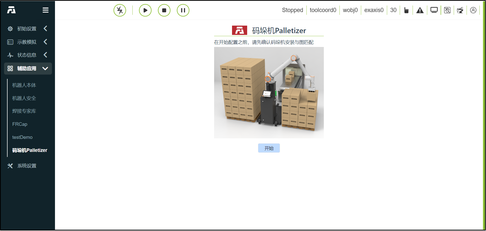

FRCap案例
=========================

.. toctree:: 
   :maxdepth: 6

FAIRINO Palletizer（碼垛機）
-----------------------------

將專案中的build資料夾下的「碼垛機Palletizer.plugin」在WebApp中上傳註冊啟用後即可使用。

.. centered:: 圖表 7.1 碼垛FRCap使用

碼垛工件配置
+++++++++++++++

指令名稱：palletizing_config_box。

指令參數：

.. code-block:: c++
   :linenos:

   /** 
   * @param int length 工件長度
   * @param int width 工件速度
   * @param int height 工件高度
   * @param int payload 工件負載
   * @param string grip_point工件抓取點
   * /

指令案例：

.. code-block:: c++
   :linenos:

   {
      cmd: "palletizing_config_box",
      data: {
         length: 800,
         width: 615,
         height: 312,
         payload: 2.34,
         grip_point: "grippoint"
      }
   } 

指令回饋：

.. code-block:: c++
   :linenos:

   /** 
   * @return status:200 "success"
   * @return status:404 "fail"
   */

碼垛托盤配置
+++++++++++++++

指令名稱：palletizing_config_pallet。

指令參數：

.. code-block:: c++
   :linenos:

   /** 
   * @param int front 托盤前邊
   * @param int side 托盤側邊
   * @param int height 托盤高度
   * @param int left_pallet 左托盤啟用
   * @param int right_pallet 右托盤啟用
   */

指令案例：

.. code-block:: c++
   :linenos:

   {
      cmd: "palletizing_config_pallet",
      data: {
            front: 1200,
            side: 1000,
            height: 110,
            left_pallet: 0,
            right_pallet: 1
         }
   }

指令回饋：

.. code-block:: c++
   :linenos:

   /** 
   * @return status:200 "success"
   * @return status:404 "fail"
   */ 

碼垛高級配置
+++++++++++++++

指令名稱：palletizing_advanced_cfg。

指令參數：

.. code-block:: c++
   :linenos:

   /** 
   * @param string height 碼垛抓取點抬升高度
   * @param string x1 碼垛漸進點1：x 方向偏移,單位mm
   * @param string y1 碼垛漸進點1：y 方向偏移,單位mm
   * @param string z1 碼垛漸進點1：z 方向偏移,單位mm
   * @param string x2 碼垛漸進點2：x 方向偏移,單位mm
   * @param string y2 碼垛漸進點2：y 方向偏移,單位mm
   * @param string z2 碼垛漸進點2：z 方向偏移,單位mm
   * @param string time 吸料等待時間,單位 ms
   */ 

指令案例：

.. code-block:: c++
   :linenos:

   {
      cmd: "palletizing_advanced_cfg",
      data: {
      height: "1000",
            x1: "100",
            y1: "100",
            z1: "100",
            x2: "10",
            y2: "10",
            z2: "10",
            time: "1"
         }
   }

指令回饋：

.. code-block:: c++
   :linenos:

   /** 
   * @return status:200 "success"
   * @return status:404 "fail"
   */

碼垛設備尺寸配置
+++++++++++++++++

指令名稱：palletizing_config_device。

指令參數：

.. code-block:: c++
   :linenos:

   /** 
   * @param int x 左托盤右上角點相對於機器人基座標系座標軸的x方向絕對值
   * @param int y 左托盤右上角點相對於機器人基座標系座標軸的y方向絕對值
   * @param int z 左托盤右上角點相對於機器人基座標系座標軸的z方向絕對值
   * @param int angle 機器人安裝時的旋轉角度
   */ 

指令案例：

.. code-block:: c++
   :linenos:

   {
      cmd: "palletizing_config_device",
      data: {
         x: 2400,
         y: 1800,
         z: 120,
         angle: 0   
      }
   }

指令回饋：

.. code-block:: c++
   :linenos:

   /** 
   * @return status:200 "success"
   * @return status:404 "fail"
   */

碼垛模式配置
+++++++++++++++

指令名稱：palletizing_config_pattern。

指令參數：

.. code-block:: c++
   :linenos:

   /** 
   * @param int layers 碼垛層數
   * @param int box_gap 工件像素點間隔，單位：mm
   * @param string sequence 碼垛工作模式
   * @param int pattern_b_enable 模式b是否開啟，1：開啟，0：不開啟
   * @param string left_pattern_a 左工位模式a笛卡爾座標
   * @param string left_pattern_b 左工位模式b笛卡爾座標
   * @param string right_pattern_a 右工位模式a笛卡爾座標
   * @param string right_pattern_b 右工位模式b笛卡爾座標
   * @param string origin_pattern_a 初始模式a笛卡爾座標
   * @param string origin_pattern_b 初始模式b笛卡爾座標
   */

指令案例：

.. code-block:: c++
   :linenos:

   {
      cmd: "palletizing_config_pattern",
      data: {
         layers: 8,
         box_gap: 0,
         sequence: "a,b,a,b,a,b,a,b",
         pattern_b_enable: 1,
         left_pattern_a: "{\"1\": [[1,2,3,0.1,0.2,0.3],[1,2,3,0.1,0.2,0.3],[1,2,3,0.1,0.2,0.3]]}",
         "left_pattern_b": "{\"1\": [[1,2,3,0.1,0.2,0.3],[1,2,3,0.1,0.2,0.3],[1,2,3,0.1,0.2,0.3]]}",
         "right_pattern_a": "{\"1\": [[1,2,3,0.1,0.2,0.3],[1,2,3,0.1,0.2,0.3],[1,2,3,0.1,0.2,0.3]]}",
         "right_pattern_b": "{\"1\": [[1,2,3,0.1,0.2,0.3],[1,2,3,0.1,0.2,0.3],[1,2,3,0.1,0.2,0.3]]}",
         "origin_pattern_a": "[]",
         "origin_pattern_b": "[]"
      }
   }

指令回饋：

.. code-block:: c++
   :linenos:

   /** 
   * @return status:200 "success"
   * @return status:404 "fail"
   */

码垛程序生成
+++++++++++++++

指令名稱：generate_palletizing_program。

指令參數：

.. code-block:: c++
   :linenos:

   /**
   * @param string palletizing_name 碼垛名稱
   * @param string depalletizing_name 拆垛名稱
   * @param string flag 碼垛或拆垛程序是否生成，0-不生成，1生成
   */ 

指令案例：

.. code-block:: c++
   :linenos:

   {
      cmd: "generate_palletizing_program",
      data: {
         palletizing_name: "palletizing_1",
         depalletizing_name:"depalletizing_1",
         flag:"[0,1]"
      }
   }

指令回饋：

.. code-block:: c++
   :linenos:

   /** 
   * @return status:200 "success"
   * @return status:404 "fail"
   */

取得堆疊配方
+++++++++++++++

指令名稱：get_palletizing_formula。

指令參數：

.. code-block:: c++
   :linenos:

   /** 
   * @param  string name 碼垛配方名稱
   */ 

指令案例：

.. code-block:: c++
   :linenos:

   {
      cmd: "get_palletizing_formula",
      data: {
         name: "palletizing_1"
      }
   }

指令回饋：

.. code-block:: c++
   :linenos:

   /** 
   * @return status:200 
   * @param object box_config 工件配置
   * @param object pallet_config 托盤配置
   * @param object device_config 安裝設備位置
   * @param object pattern_config 模式配置
   * @param object program_config 程式產生配置
   * @param object lefttransitionpoint 左過渡點笛卡爾座標
   * @param object righttransitionpoint 右過渡點笛卡爾座標
   * @param object advanced_config 進階配置
   * @return status:404 "fail"
   */

指令回饋案例：

.. code-block:: c++
   :linenos:

   {
      "box_config": {
        "flag": 1,
        "length": 200,
        "width": 400,
        "height": 300,
        "payload": 2.34,
        "grip_point": "grippoint"
      },
      "pallet_config": {
        "flag": 1,
        "front": 1000,
        "side": 1200,
        "height": 110,
         "left_pallet": 0,
         "right_pallet": 1
      },
      "device_config": {
      "flag": 1,
      "x": 2400,
      "y": 1800,
      "z": 120,
      "angle": 0
      },
      "pattern_config": {
      "flag": 1,
      "layers": 8,
      "box_gap": 0,
      "sequence": "a,b,a,b,a,b,a,b",
      "pattern_b_enable": 1,
      "left_pattern_a": "{\"1\": [[1,2,3,0.1,0.2,0.3],[1,2,3,0.1,0.2,0.3],[1,2,3,0.1,0.2,0.3]]}",
      "left_pattern_b": "{\"1\": [[1,2,3,0.1,0.2,0.3],[1,2,3,0.1,0.2,0.3],[1,2,3,0.1,0.2,0.3]]}",
      "right_pattern_a": "{\"1\": [[1,2,3,0.1,0.2,0.3],[1,2,3,0.1,0.2,0.3],[1,2,3,0.1,0.2,0.3]]}",
      "right_pattern_b": "{\"1\": [[1,2,3,0.1,0.2,0.3],[1,2,3,0.1,0.2,0.3],[1,2,3,0.1,0.2,0.3]]}",
      "origin_pattern_a": "[]",
      "origin_pattern_b": "[]"
      },
      "program_config": {
      "palletizing_name": "palletizing_1",
      "depalletizing_name":"depalletizing_1",
      "flag":"[0,1]"   
      },
      "lefttransitionpoint":{
      "j1":"120",
      "j2":"120",
      "j3":"120",
      "j4":"120",
      "j5":"120",
      "j6":"120"
      },
      "righttransitionpoint":{
      "j1":"120",
      "j2":"120",
      "j3":"120",
      "j4":"120",
      "j5":"120",
      "j6":"120"
      },
      "advanced_config":{
      "height": "1000",
      "x1": "100",
      "y1": "100",
      "z1": "100",
      "x2": "10",
      "y2": "10",
      "z2": "10",
      "time": "1"
      }
   }

取得碼垛已有配方名稱列表
++++++++++++++++++++++++++++

指令名稱：get_palletizing_formula_list。

指令參數：無。

指令案例：

.. code-block:: c++
   :linenos:

   {
      cmd: "get_palletizing_formula_list"
   }

指令回饋：

.. code-block:: c++
   :linenos:

   /** 
   * @return status:200 
   * @param  Array ${name} 碼垛名稱列表
   * @return status:404 "fail"
   */

指令回饋案例：

.. code-block:: c++
   :linenos:

   ["palletizing1"]

