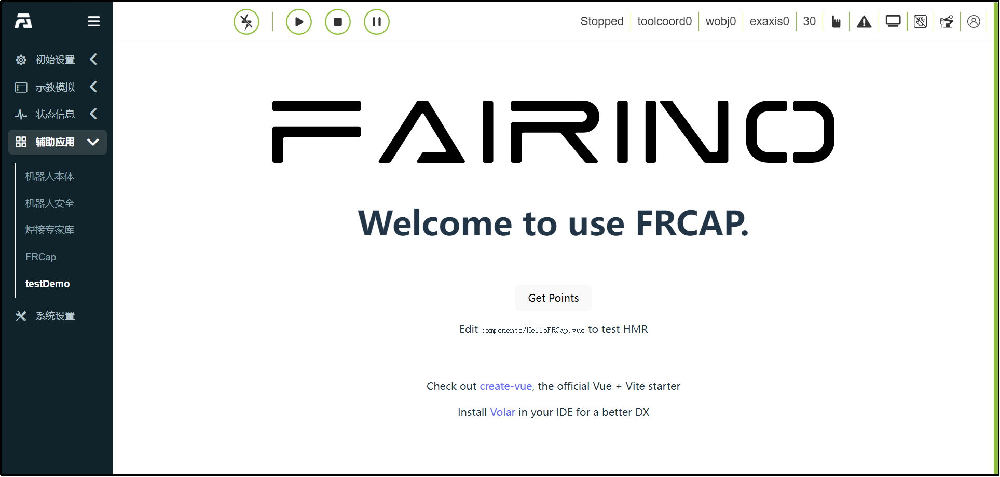

簡介
=====================

FRCap是一個基於Web的插件，可整合到協作機器人WebApp。 FRCap透過基於Node.js和Vue3的Element plus，frcap-ui和frcap-api等模組建立一個協作機器人WebApp設定頁面或應用程式來擴展機器人功能及應用場景。

從本質上講，FRCap是一個運行在Node.js環境下的Web應用，與WebApp相互獨立，WebApp提供管理和存取服務。 FRCap可以透過提供的官方介面與機器人控制器交互，或是客戶依據實際需求編寫自訂介面指令和處理邏輯進行個人化開發。

.. centered:: 圖表 1.1 WebApp + FRCap展示圖