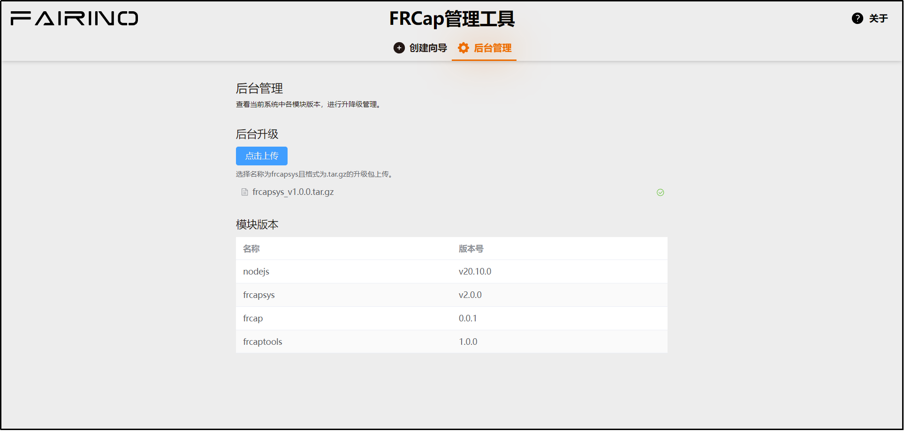

后台管理
=========================

.. toctree:: 
   :maxdepth: 6

后台升级
-------------
在本文档的“软件下载”部分中，可以下载到最新的FRCap后台系统升级包。将下载的升级包上传成功后台即进行自动升级。

升级成功如下图所示。

.. centered:: 图表 4-1  FRCap后台系统升级成功

.. note:: 升级成功后需要重新启动机器人控制箱才会生效。

模块版本
-------------

第一版初始的FRCap后台系统各模块版本：

- Node.js：v20.10.0。
- FRCapSys：v1.0.0。
- FRCap：v0.0.1。
- FRCapTools：v1.0.0。

具体版本更新内容请查看版本更新说明。

.. note:: Node.js目前暂不会随版本进行升级。