码垛FRCap
===========

插件包管理
-------------

在协作机器人WebApp中“系统设置——插件配置”页面，点击“导入”按钮，选择码垛FRCap插件包（名称格式：插件包名称+版本号.frcap，示例：码垛机Palletizer-v0.0.0.frcap）上传。上传成功后列表展示导入成功的码垛FRCap插件包，包括插件启停状态、名称、版本号、描述和作者等。操作栏中可以对码垛FRCap插件包进行“停用”、“启用”和“删除”。

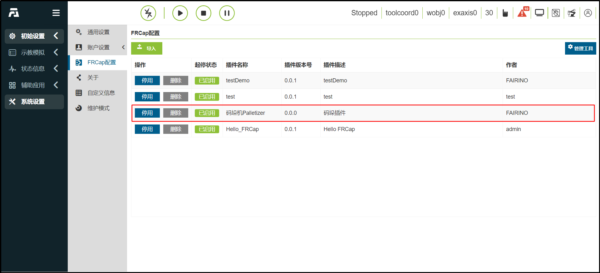

.. centered:: 图表 10-1-1 WebApp插件配置界面

第一次成功导入码垛FRCap插件包后，插件包状态为“已停用”，点击“启用”按钮，启用成功后，协作机器人WebApp的“辅助应用”模块增加码垛FRCap插件包开始页面（例如：码垛机Palletizer-v0.0.0.frcap对应的页面模块名称为“码垛机Palletizer”）。点击“开始”按钮进入首页，查看当前已配置的码垛配方，根据需求进行使用。

.. note:: 
   如果配方为空，请先新增/导入配方。

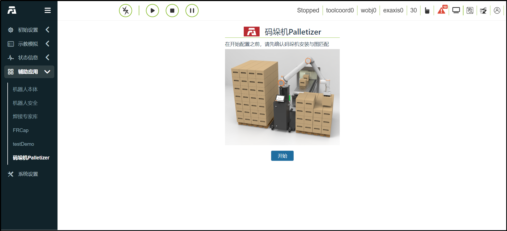

.. centered:: 图表 10-1-2 WebApp + 码垛FRCap展示图

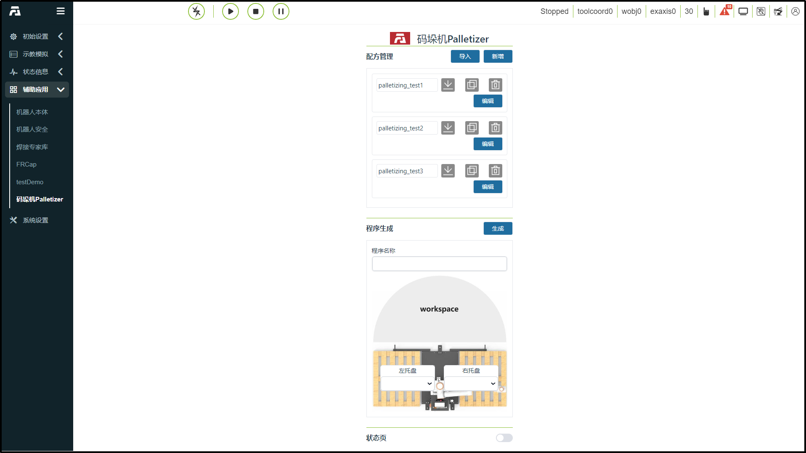

.. centered:: 图表 10-1-3 码垛FRCap首页

配方管理
------------
每个配方分为配方名称、配方操作和配方编辑三大区域。操作区按钮依次为：重命名、导出、复制和删除。

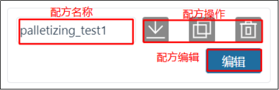

.. centered:: 图表 10-2-1 配方区域划分

.. note:: 
   .. image:: frcap_pictures/045.png
      :width: 0.5in
      :height: 0.5in
      :align: left

   | 名称：**导出配方**
   | 作用：导出当前配方的数据

.. note:: 
   .. image:: frcap_pictures/046.png
      :width: 0.5in
      :height: 0.5in
      :align: left

   | 名称：**复制配方**
   | 作用：复制当前配方的数据

.. note:: 
   .. image:: frcap_pictures/047.png
      :width: 0.5in
      :height: 0.5in
      :align: left

   | 名称：**删除配方**
   | 作用：删除当前配方

获取
~~~~~~~
进入码垛插件包首页后，获取当前所有配方。当配方数大于四时，展示配方区域出现滚动条，用户可上下滚动查看配方。

.. note:: 
   所有配方名称以“palletizing”开头，例如“palletizing_test1”。

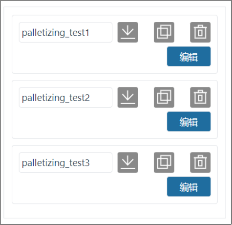

.. centered:: 图表 10-2-2 配方获取

新增
~~~~~~
在任意配方的操作区，点击“新增”按钮，进入“新增配方”弹窗，输入码垛配方名称，点击“确认”按钮。新增成功后，配方展示区域增加新增的码垛配方。

.. note:: 
   所有配方名称以“palletizing”开头，无需输入“palletizing”，只需要输入“_”以后的名称。例如“palletizing_add”，输入“add”即可。

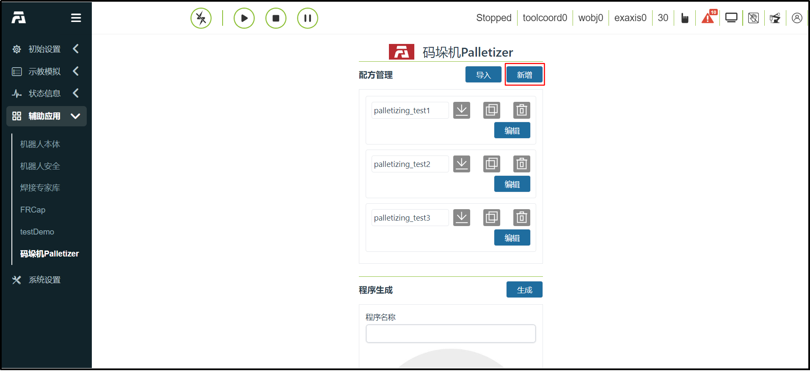

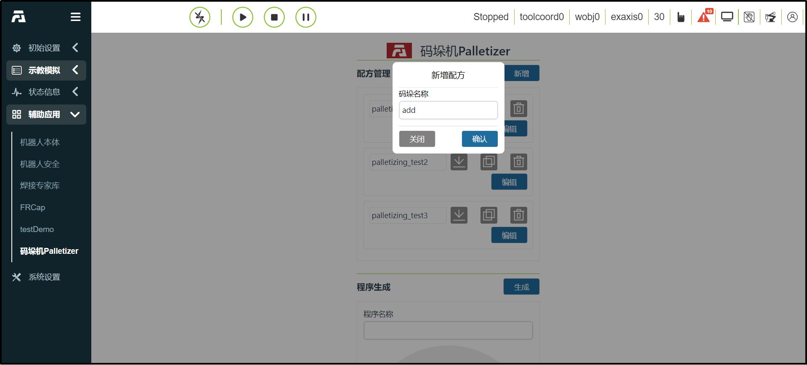

.. centered:: 图表 10-2-3 配方新增

重命名
~~~~~~~~~~
在任意配方的操作区，击配方名称展示输入框，进入“码垛配方重命名”弹窗，输入码垛配方名称，点击“确认”按钮。重命名成功后，配方展示区域原码垛配方名称被重命名。

.. note::
   所有配方名称以“palletizing”开头，无需输入“palletizing”，模态窗自动带出“_”以后的名称。例如“palletizing_rename”，自动带出“rename”。

.. centered:: 图表 10-2-4 配方重命名

导出
~~~~~~~
在任意配方的操作区，点击“导出”图标，即可下载当前配方的所有数据。

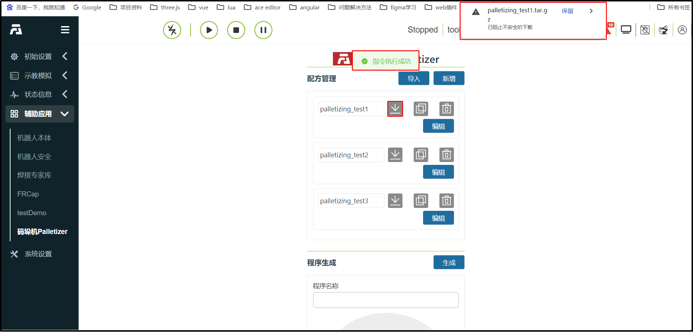

.. centered:: 图表 10-2-5 配方导出

复制
~~~~~~~~~
在任意配方的操作区，点击“复制”图标，进入“码垛配方复制”弹窗，输入码垛配方名称，点击“确认”按钮。复制成功后，配方展示区域增加复制的码垛配方。

.. note:: 
   所有配方名称以“palletizing”开头，无需输入“palletizing”，模态窗自动带出“_”以后的名称。例如“palletizing_copy”，自动带出“copy”。

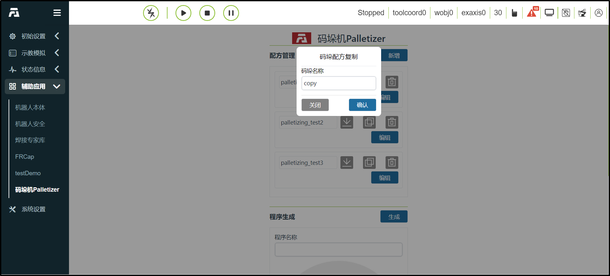

.. centered:: 图表 10-2-6 配方复制

删除
~~~~~~~~~
在任意配方的操作区，点击“删除”图标，即可删除当前配方。

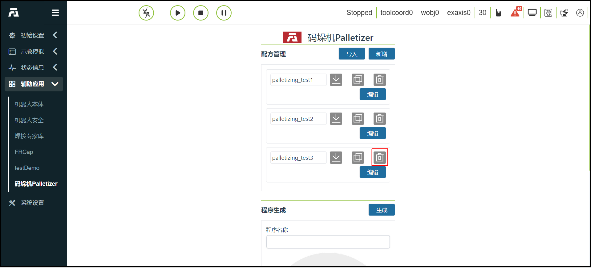

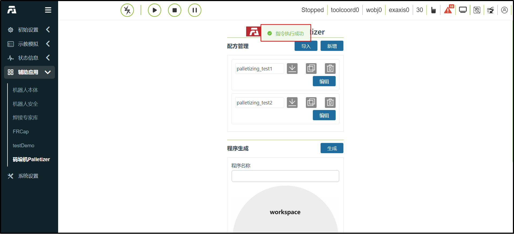

.. centered:: 图表 10-2-7 配方删除

编辑
~~~~~~~~
任意配方，点击“编辑”按钮，进入当前配方的配置界面。

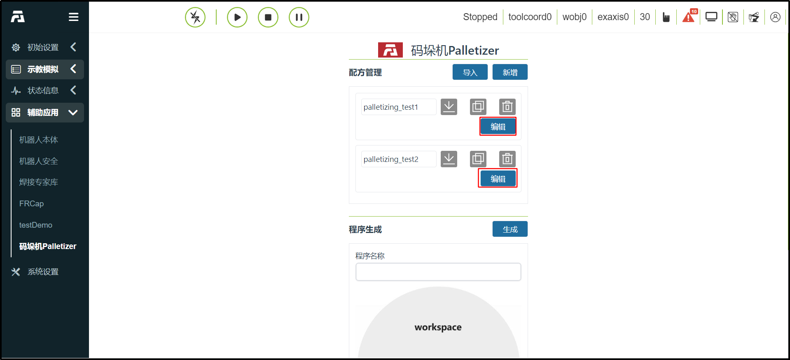

.. centered:: 图表 10-2-8 码垛配方编辑

导入
~~~~~~~~
点击“导入”按钮，选择码垛配方压缩包并上传，导入成功后码垛配方增加导入的配方。

.. note:: 
   所有配方压缩包名称以“palletizing”开头，以“.tar.gz”结尾，例如“palletizing_import.tar.gz”。

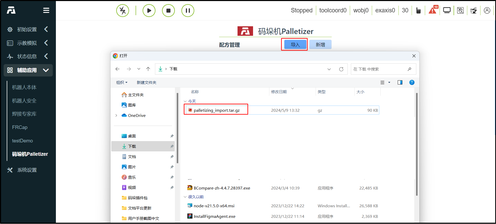

.. centered:: 图表 10-2-9 配方导入

.. important:: 
   码垛配方的“新增”、“重命名”和“复制”，输入已经存在的配方名称提示“已有同名配方”。

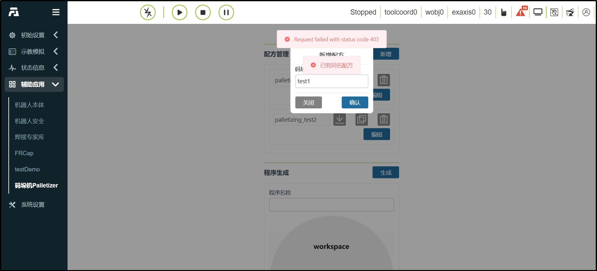

.. centered:: 图表 10-2-10 配方同名提示

配方配置
------------
任意配方的配置界面，显示箱子、托盘、模式和高级配置的基础信息，在对应配置栏中进行具体参数配置。

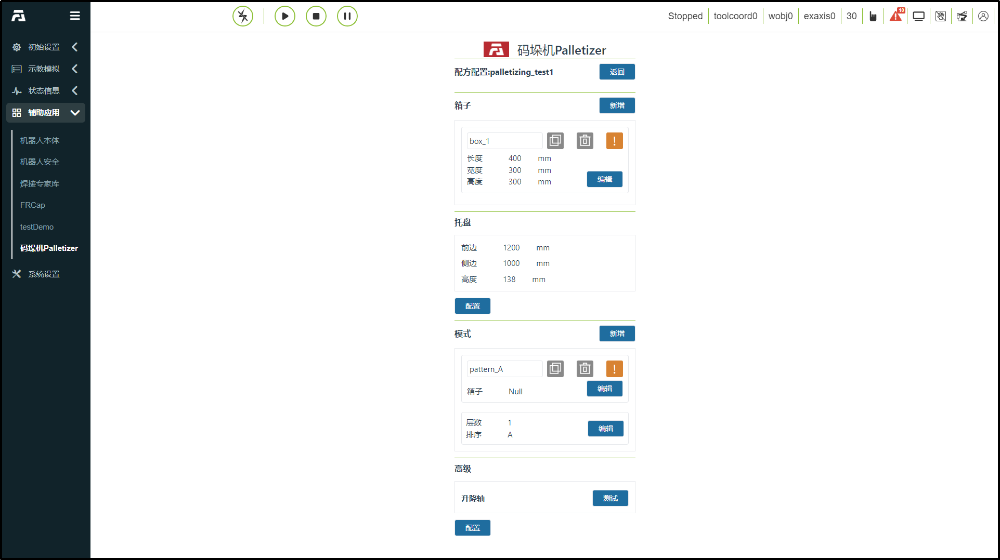

.. centered:: 图表 10-3-1 码垛配方编辑界面

箱子配置
~~~~~~~~~~~

箱子操作
++++++++++

箱子可以配置多个不同类型的箱子。

点击“新增”按钮，新增成功后，按当前顺序新增一个箱子。

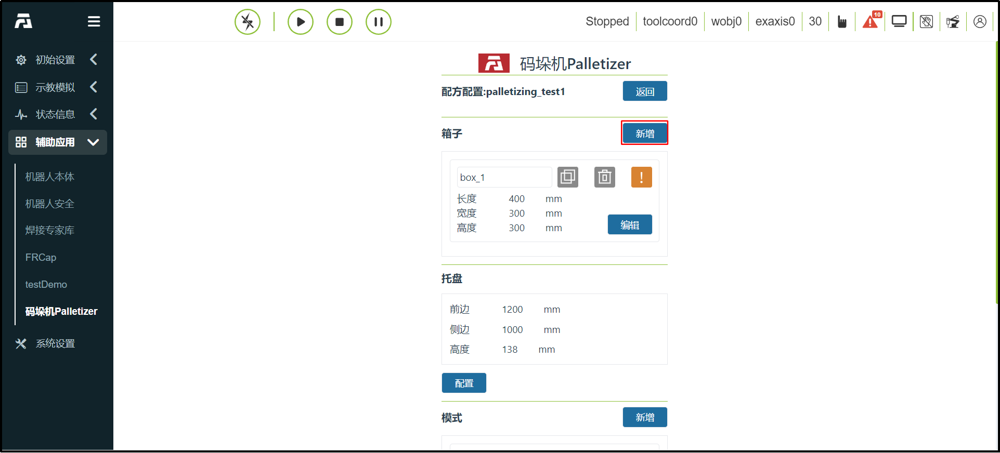

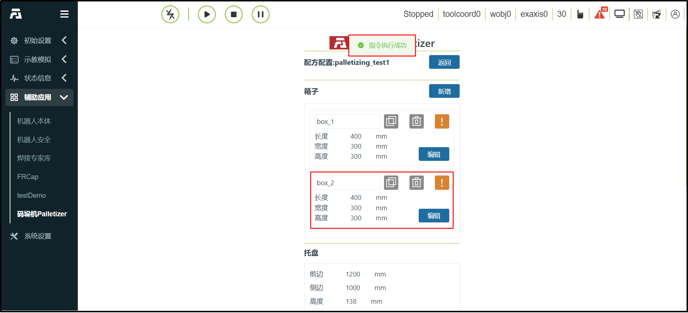

.. centered:: 图表 10-3-2 新增箱子

点击箱子名称展示的输入框区域，弹出“箱子重命名”模态窗，输入名称后，点击“确认”按钮确认重命名。

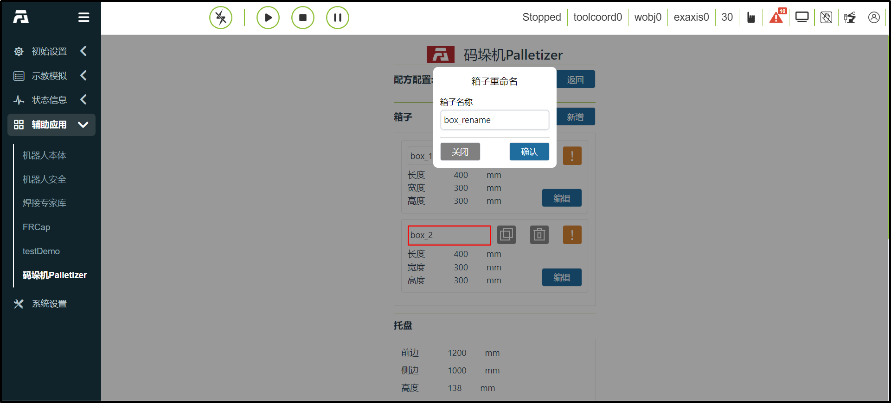

.. centered:: 图表 10-3-3 重命名箱子

点击“复制”图标，复制成功后，根据当前箱子名称复制一个箱子。

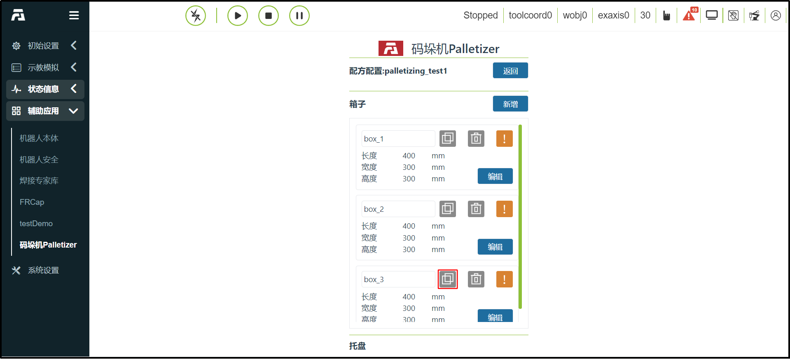

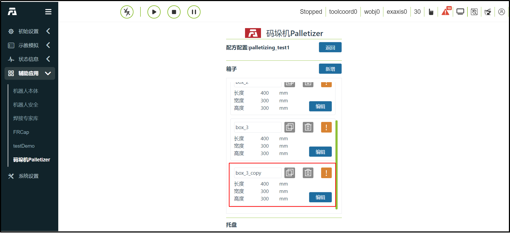

.. centered:: 图表 10-3-4 复制箱子

点击“删除”图标，即可删除箱子数据。

.. note:: 
   请勿删除已经在模式配置中配置的箱子。

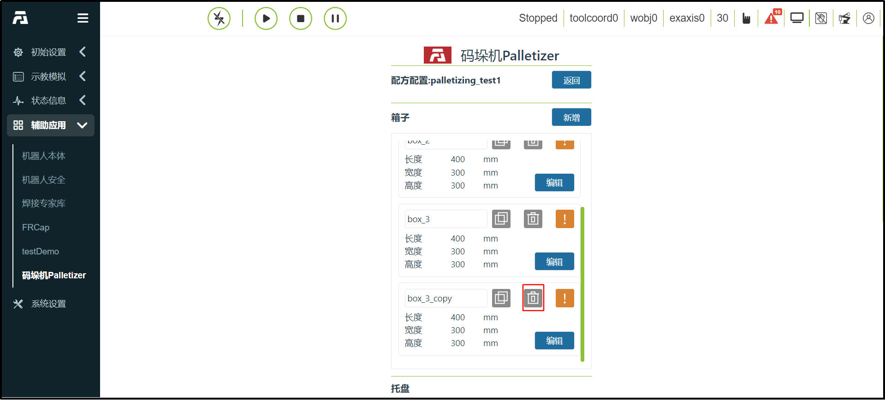

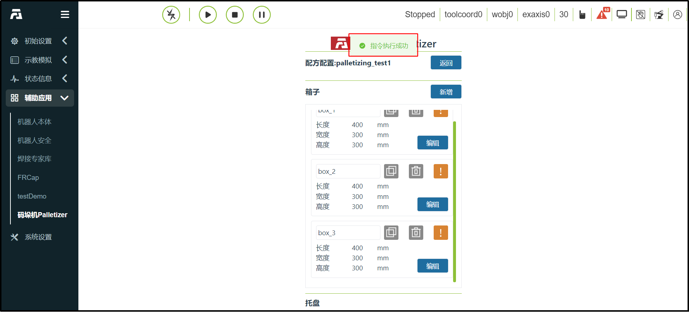

.. centered:: 图表 10-3-5 删除箱子

任意箱子，点击“编辑”按钮，进入配置箱子参数界面。配置成功后，箱子配置状态图表为绿色；配置未完成时，箱子配置状态图标为黄色。

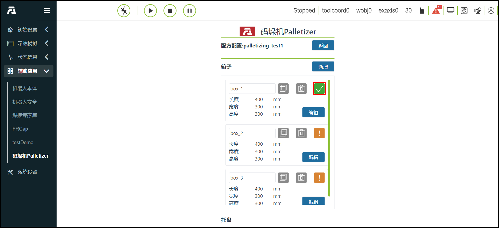

.. centered:: 图表 10-3-6 箱子参数配置完成

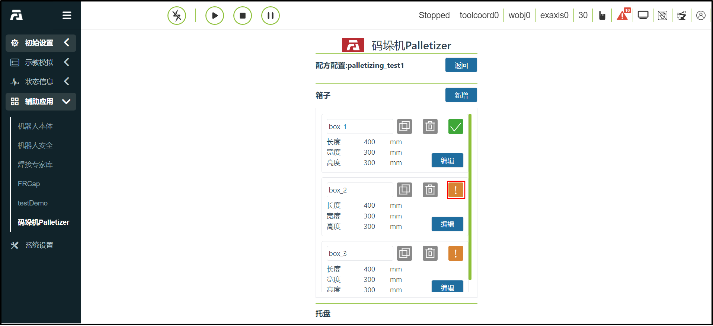

.. centered:: 图表 10-3-7 箱子参数配置未完成

箱子参数
++++++++++

.. note:: 
   .. image:: frcap_pictures/057.png
      :width: 0.5in
      :height: 0.5in
      :align: left

   | 名称：**上一个箱子**
   | 作用：切换选择上一个箱子，当选择为第一个箱子时，再次切换选择为最后一个箱子。

.. note:: 
   .. image:: frcap_pictures/058.png
      :width: 0.5in
      :height: 0.5in
      :align: left

   | 名称：**下一个箱子**
   | 作用：切换选择下一个箱子，当选择为最后一个箱子时，再次切换选择为第一个箱子。

在箱子配置栏中点击“编辑”进入“箱子配置”弹窗，设置箱子的“长”、“宽”、“高”、“负载”、“工件标签朝向”和工件到位信号，点击“确认”按钮完成箱子信息配置；设置箱子的抓取点（保持抓取点在箱子的中心，吸盘底部与箱子接触时呈现挤压状态），点击“记录”按钮完成设置。

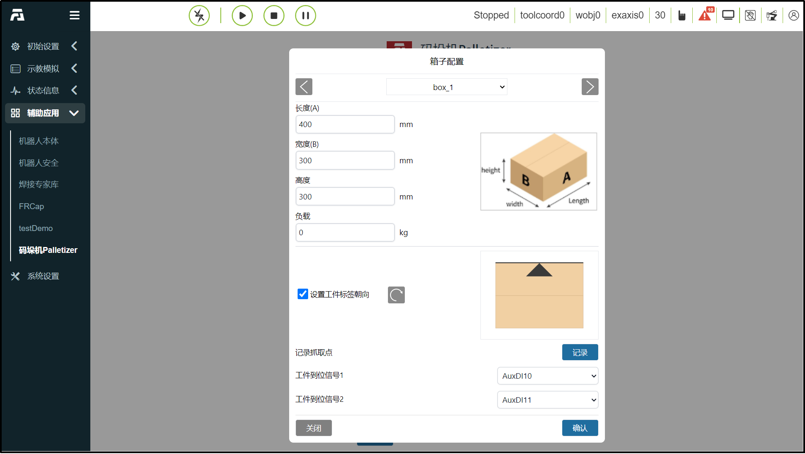

.. centered:: 图表 10-3-8 箱子配置

.. image:: frcap_pictures/030.png
   :width: 3in
   :align: center

.. centered:: 图表 10-3-9 箱子抓取点

.. important:: 必须记录箱子抓取点，否则无法配置箱子的长、宽和高。

托盘配置
+++++++++++
在托盘配置栏中点击“配置”进入“托盘配置”弹窗，设置托盘“前边”、“侧边”和“高度”，接着设置工位过渡点，点击“确认配置”完成托盘信息设置。

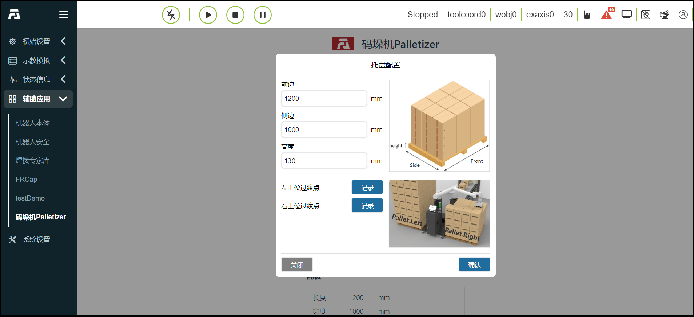

.. centered:: 图表 10-3-10 托盘配置

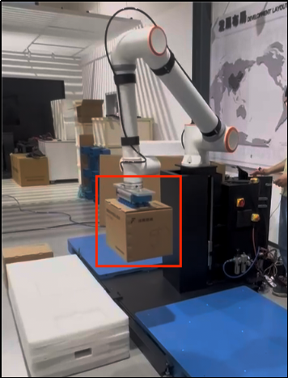

.. centered:: 图表 10-3-11 左工位过渡点

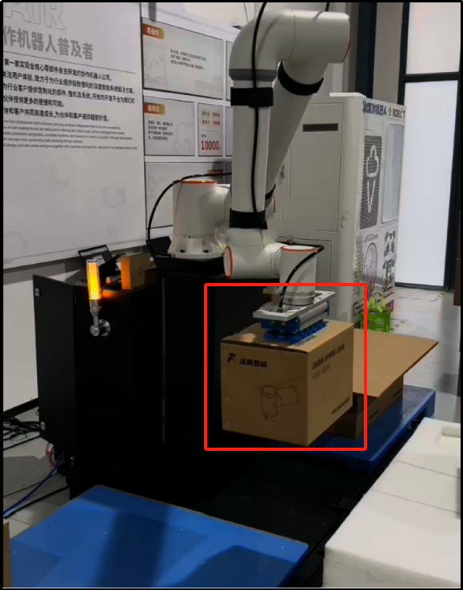

.. centered:: 图表 10-3-12 右工位过渡点

.. important:: 必须记录工位过渡点，否则无法生成的程序无法保存。

模式配置
~~~~~~~~~~

模式操作
++++++++++

在模式配置中选择箱子时，可以选择相同高度不同长宽的箱子。在模式展示区域分为：模式添加（配置码垛垛型）和码垛层数配置。

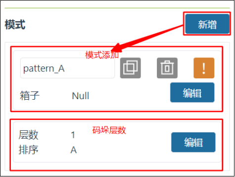

.. centered:: 图表 10-3-13 模式展示区域

点击“新增”按钮，新增成功后，按当前顺序新增一种模式。

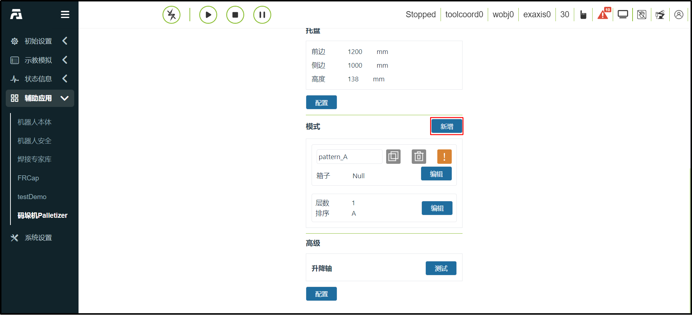

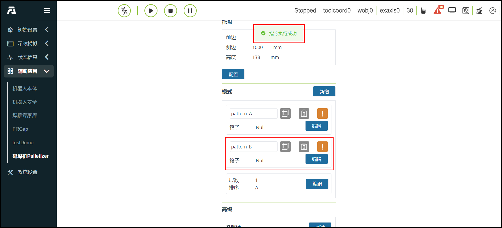

.. centered:: 图表 10-3-14 新增模式

在模式添加区域的任意模式，点击模式名称展示的输入框区域，弹出“模式重命名”模态窗，输入名称后，点击“确认”按钮确认重命名。

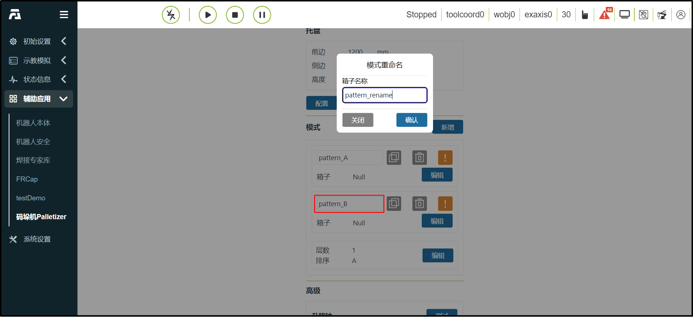

.. centered:: 图表 10-3-15 重命名模式

在模式添加区域的任意模式，点击“复制”图标，复制成功后，根据当前模式名称复制一种模式。

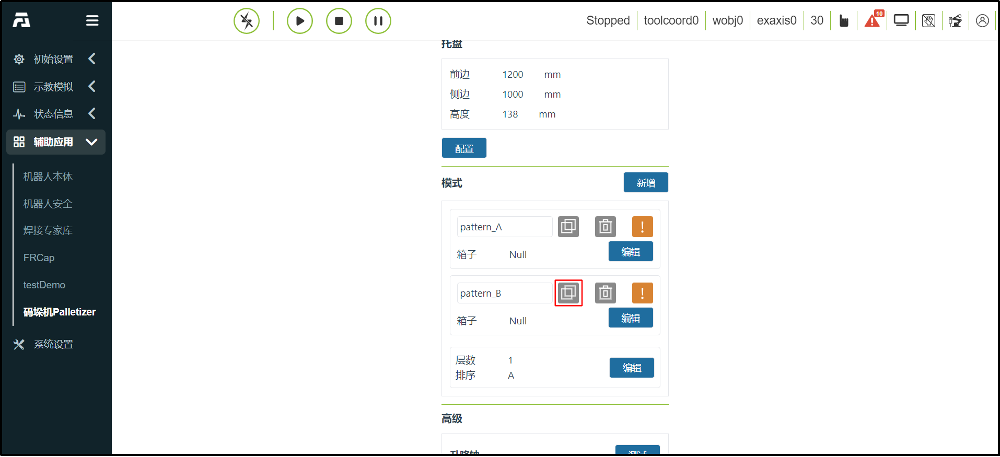

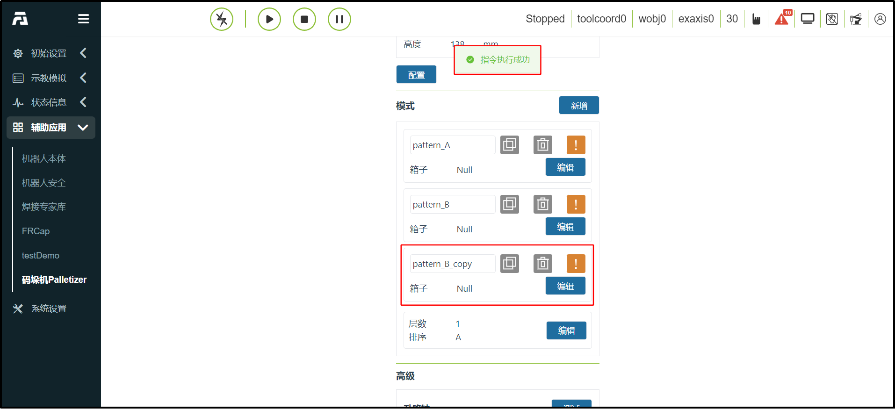

.. centered:: 图表 10-3-16 复制模式

在模式添加区域的任意模式，点击“删除”图标，即可删除当前模式数据。

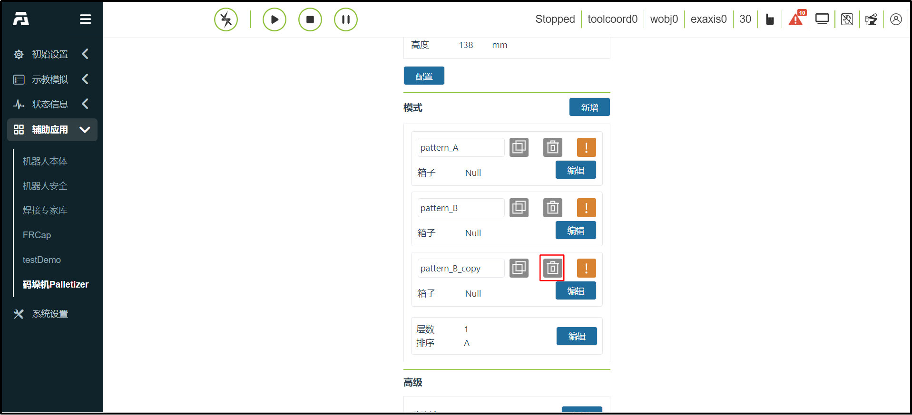

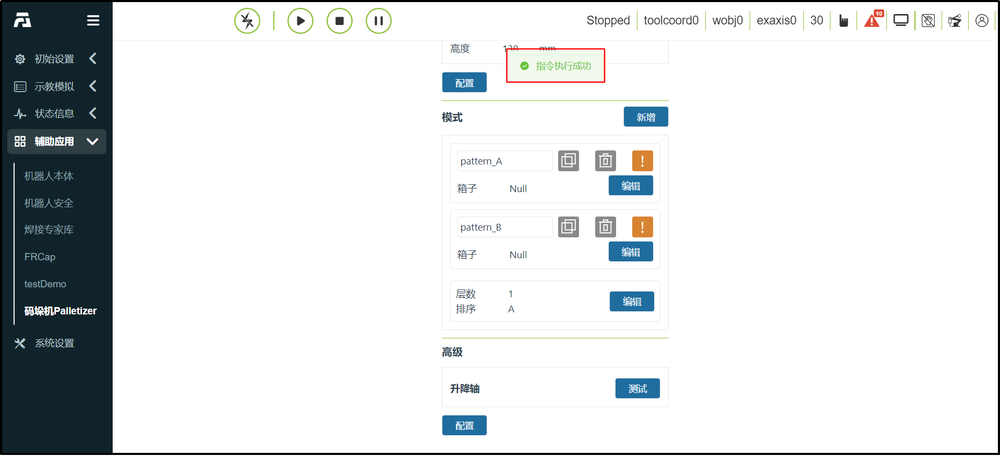

.. centered:: 图表 10-3-17 删除模式

在模式添加区域的任意模式，点击“编辑”按钮，进入“模式配置”模态窗，配置当前模式的码垛垛型。配置成功后，箱子配置状态图表为绿色；配置未完成时，箱子配置状态图标为黄色。

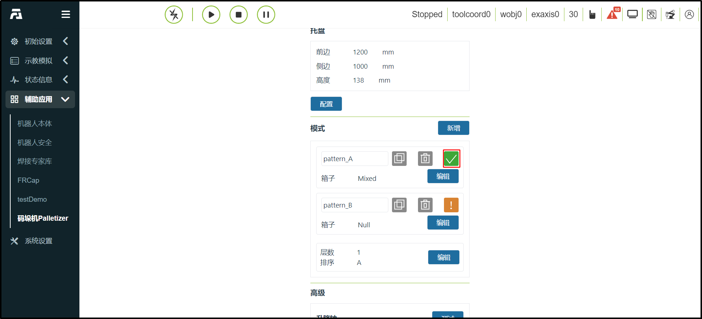

.. centered:: 图表 10-3-18 模式参数配置完成

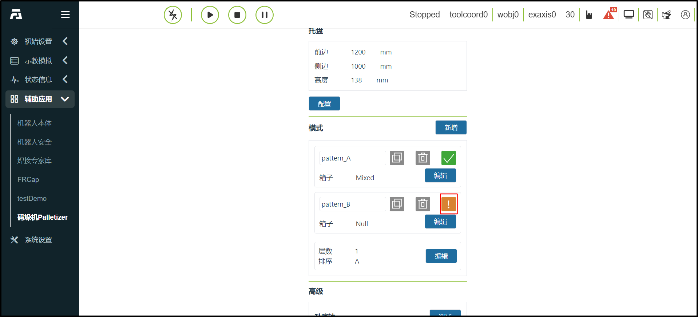

.. centered:: 图表 10-3-19 模式参数配置未完成

在码垛层数配置区域，展示码垛层数和排序。点击“编辑”按钮，进入“垛型序列配置”模态窗，输入“码垛层数”，选择每一层的模式，点击“确认”按钮完成配置。

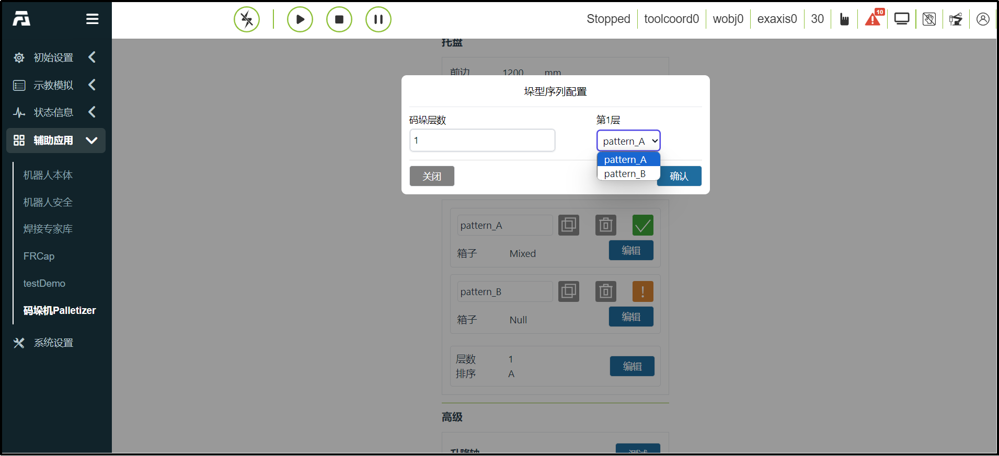

.. centered:: 图表 10-3-20 码垛层数配置

模式参数
++++++++++

.. note:: 
   .. image:: frcap_pictures/057.png
      :width: 0.5in
      :height: 0.5in
      :align: left

   | 名称：**上一种模式**
   | 作用：切换选择上一种模式，当选择为第一种模式时，再次切换选择为最后一种模式。

.. note:: 
   .. image:: frcap_pictures/058.png
      :width: 0.5in
      :height: 0.5in
      :align: left

   | 名称：**下一种模式**
   | 作用：切换选择下一种模式，当选择为最后一种模式时，再次切换选择为第一种模式。

在模式配置栏中点击“配置”进入“模式配置”弹窗。主要分为模式选择、箱子操作和垛型模拟四个区域。

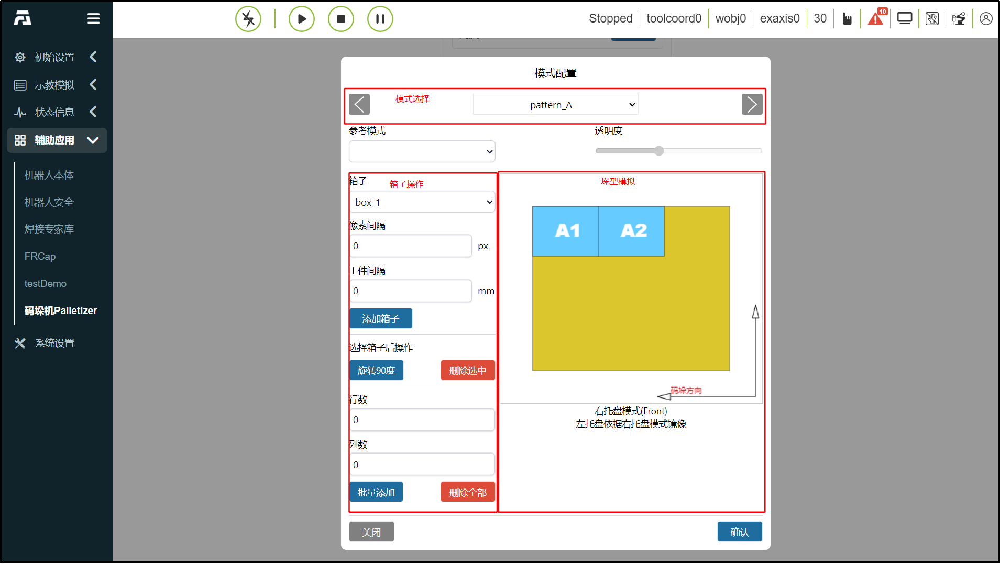

.. centered:: 图表 10-3-21 模式配置

.. important:: 
   添加箱子时，箱子之间有碰撞时工件背景颜色变红，此时以上操作无法进行。如需操作，请调整箱子为无碰撞。

在弹窗头部选择模式，在箱子操作区域选择箱子添加该模式下的箱子，先设置箱子间隔，可以单个添加也可以批量添加，点击“确认”完成模式信息设置。当选择的箱子高度不一致时，无法完成配置，并提示“箱子类型高度不一致，不可被添加在同一模式”。

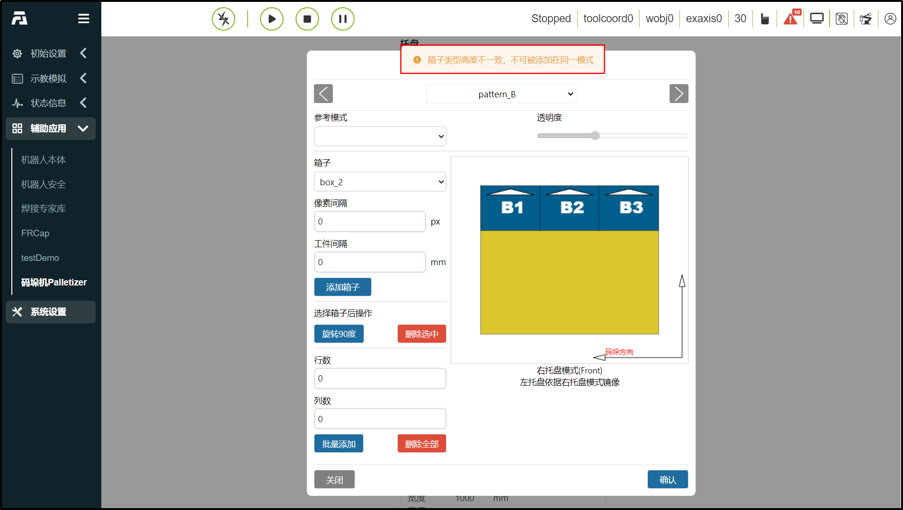

.. centered:: 图表 10-3-22 选择的箱子高度不一致的提示

选择参考模式（无法选中已选择的模式），对比查看当前模式配置情况是否能在该参考模式的基础上码垛，方便客户直观的查看不同模式下的箱子垛型。

.. important:: 
   码垛方向：以右托盘为例，右下角为最远处，从右下角竖向或者横向摆放一排工件，再向上一排横向或竖向摆放工件，以此类推（Web页面已标注码垛方向，请注意查看）。左托盘依据右托盘模式镜像放置工件。

高级配置
~~~~~~~~~~~
在高级配置栏中点击“配置”进入“高级配置”弹窗。配置项如下：

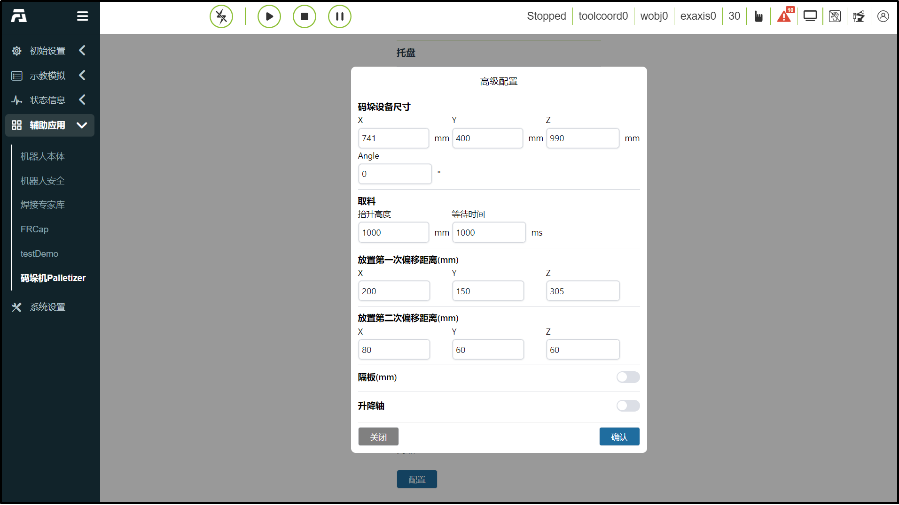

.. centered:: 图表 10-3-23 高级配置

1) 码垛设备尺寸：码垛工作台的尺寸。

.. important::
   X、Y、Z为做托盘右上角或者右托盘左上角点相对于机器人基坐标系坐标值的绝对值，Angle为机器人安装时的旋转角度，推荐安装时为0。

2) 取料抬升高度：用户自定义取料成功后，从抓取点取料成功后抬升的高度。

3) 取料等待时间：用户自定义监控吸料后负压到位信号的等待时间，未到位时重复吸取动作。

4) 第一/二次偏移距离：用户自定义配置机器人倾斜堆放至目标点的偏移距离。

.. note::
   第一次偏移参数Z必须大于箱子高度，否则在堆放过程中会与已经放置的箱子发生碰撞。

5) 隔板配置：设置隔板尺寸“长”、“宽”和“高”以及选择隔板的启停。

.. note::
   当开启隔板功能后，配方管理展示高级配置的内容显示隔板配置的基本参数。

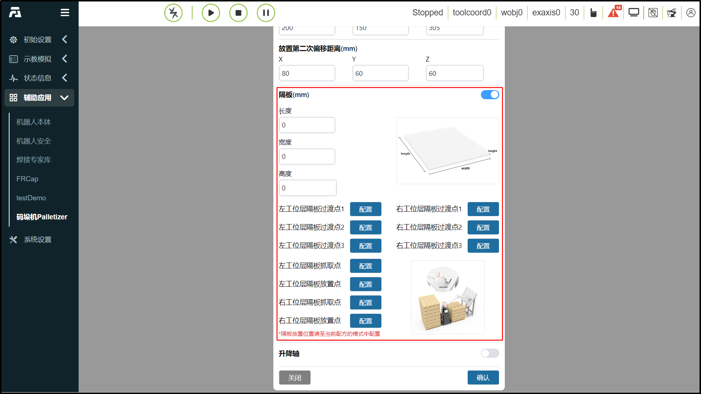

.. centered:: 图表 10-3-24 隔板配置

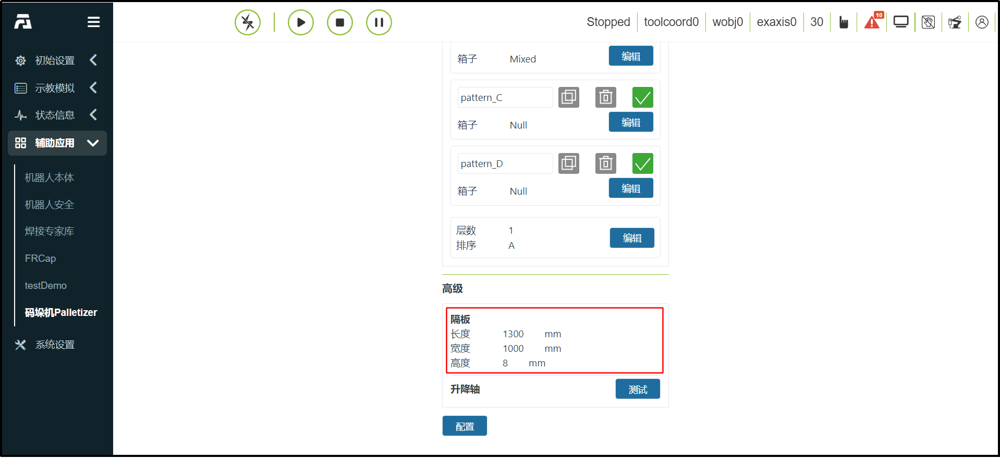

.. centered:: 图表 10-3-25 配方管理——高级配置显示隔板配置

接着设置隔板过渡点，隔板过渡点为三个，设置目的是抓取隔板后大致规划一个运动路径，避免发生碰撞而无法完成放置隔板的动作。

.. note:: 过渡点1从箱子抓取点开始运动一段距离后示教；过渡点2从过渡点1开始运动一段距离开始示教，也可以成为过渡中间点；过渡点3从过渡点2开始运动一段距离，为隔板放置前的最后一个点位。

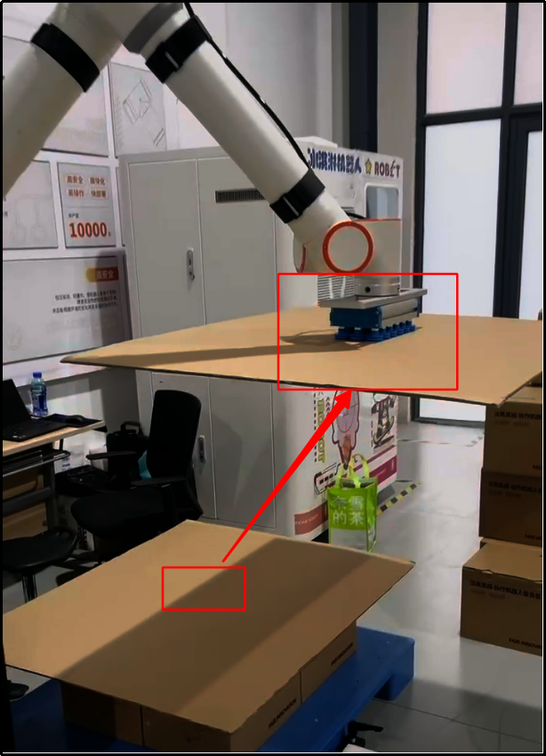

.. centered:: 图表 10-3-26 隔板过渡点1（以右工位为例）

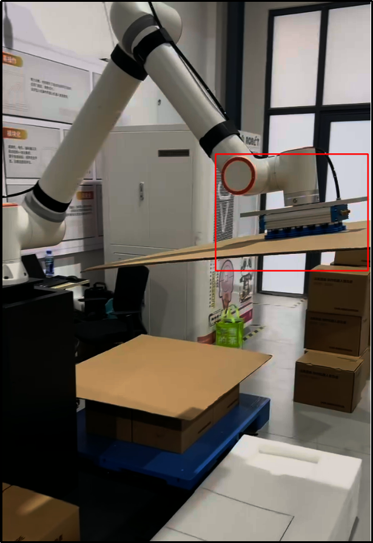

.. centered:: 图表 10-3-27 隔板过渡点2（以右工位为例）

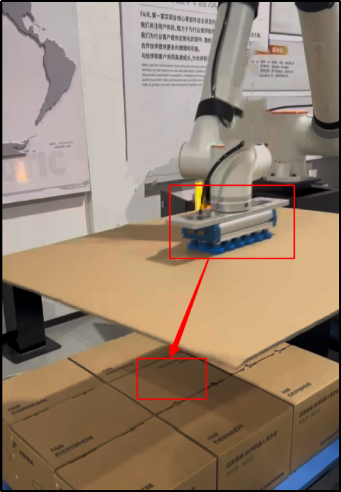

.. centered:: 图表 10-3-28 隔板过渡点3（以右工位为例）

接着设置抓取点（保持抓取点在隔板的中心，吸盘底部与隔板接触时呈现挤压状态）和放置点，点击“确认”完成隔板信息设置。

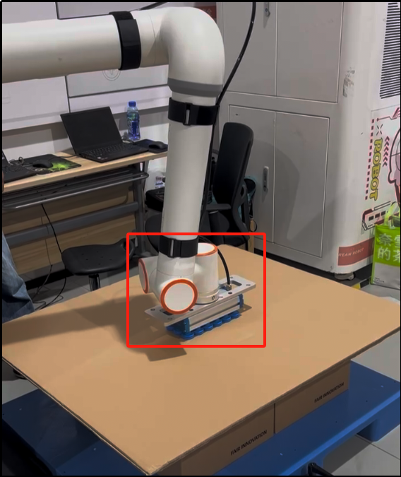

.. centered:: 图表 10-3-29 隔板抓取点（以右工位为例）

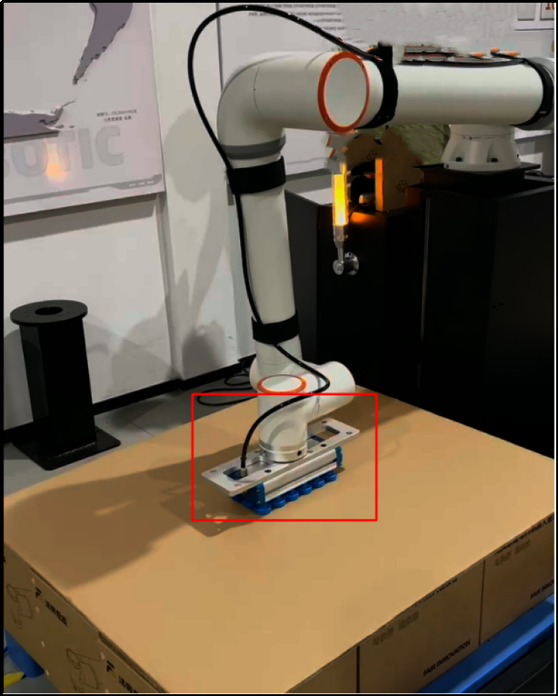

.. centered:: 图表 10-3-30 隔板放置点（以右工位为例）

6) 升降轴：用户自定义配置升降轴启停、通讯参数（IP地址、端口号和通讯周期）、开始升降的层号以及选择升降轴的启停。

.. note::
   - 升降轴工作时每次抬升的高度为箱子的高度。
   - 当开启升降轴功能后，首页展示高级配置的内容显示升降轴测试的按钮，点击“测试”按钮可以进入“升降轴测试”弹窗，对升降轴进行加载通讯、上升和下降的准确性测试，避免直接使用出现无法工作和误差较大的问题。

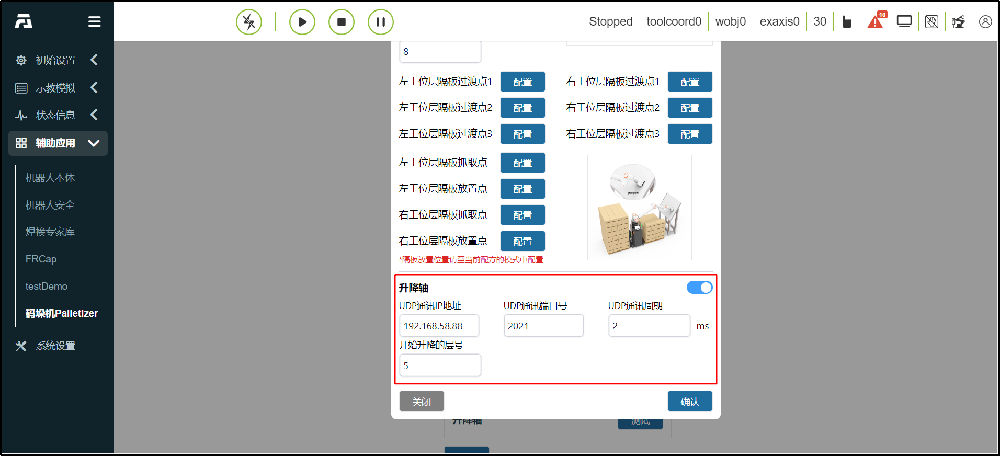

.. centered:: 图表 10-3-31 升降轴配置

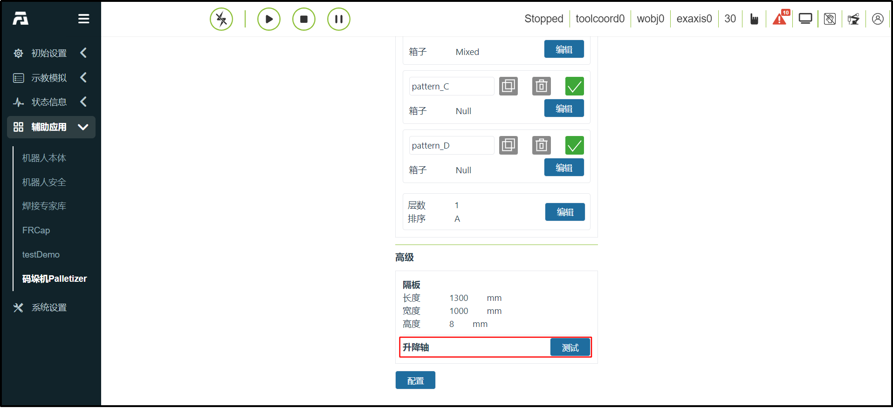

.. centered:: 图表 10-3-32 配方管理——高级配置显示升降轴

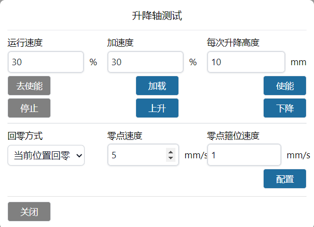

.. centered:: 图表 10-3-33 升降轴测试

程序生成
------------
在配方展示下方查看“程序生成”，输入程序名，根据配方及需求选择配方，左右配方可以相同，也可以不相同，点击“生成”按钮。

.. note:: 所有程序名称以“palletizing”开头，无需输入“palletizing”，只需要输入“_”以后的名称。例如“palletizing_program”，输入“program”即可。

.. important:: 
    1. 如果左工位或右工位未选择码垛配方，则代表该工位不启用。
    2. 生成程序成功后，务必在程序示教中将所有子程序和主程序手动保存。
    3. 拆垛程序以“de”开头，例如码垛程序为“palletizing_program”，拆垛程序则为“depalletizing_program”。

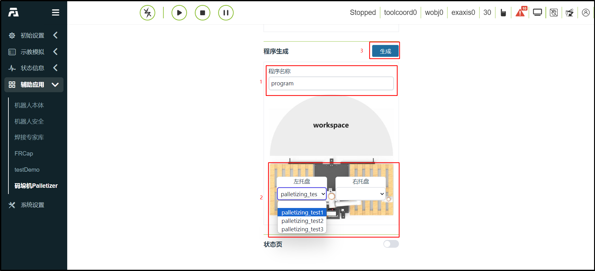

.. centered:: 图表 10-4-1 程序生成

码垛状态页启停
-----------------
在“状态页”栏中启用该功能，进入码垛工作状态页，可以对“生产信息”、“报警信息”和“码垛程序”查看。

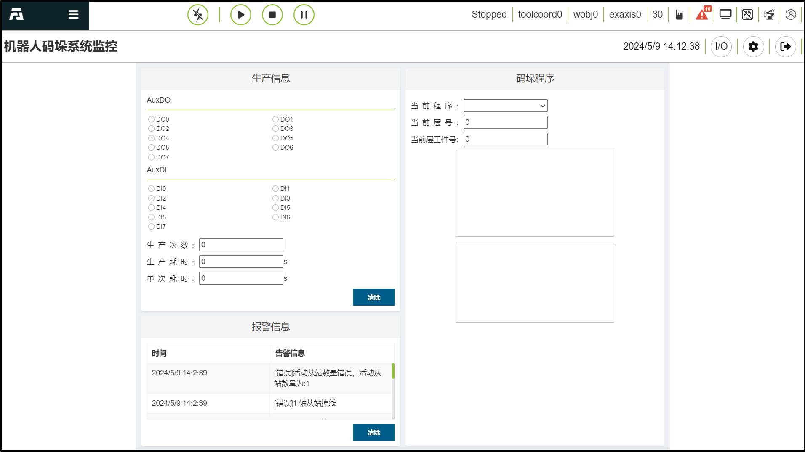

.. centered:: 图表 10-5-1 码垛状态页