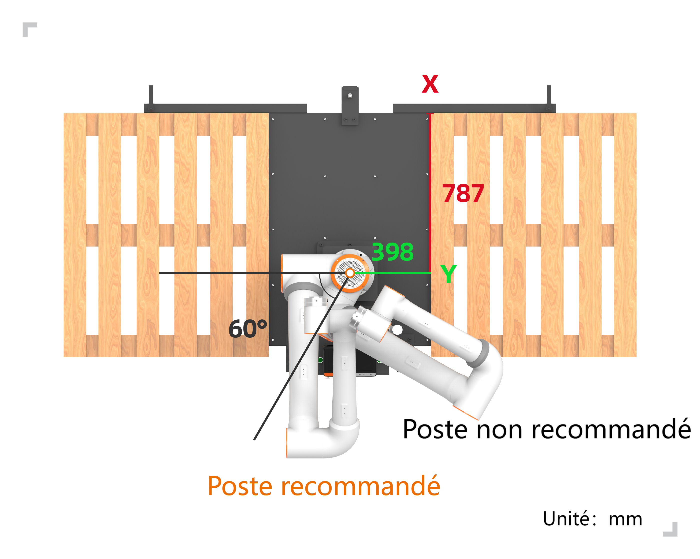
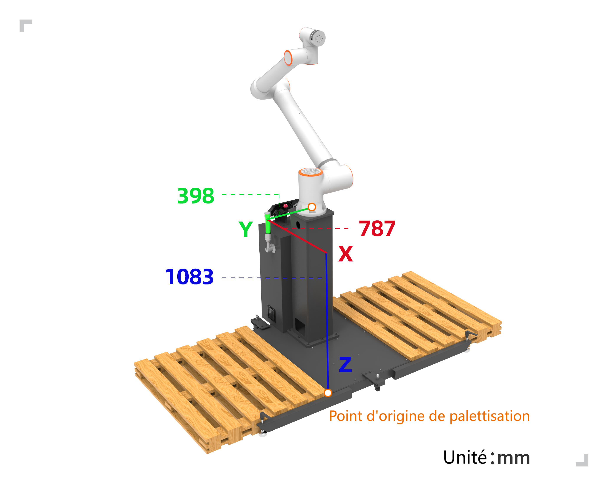

碼垛FRCap
===========

外掛程式包管理
-----------------

在協作機器人WebApp中「系統設定－外掛設定」頁面，點選「匯入」按鈕，選擇碼垛FRCap插件包（名稱格式：插件包名稱+版本號.frcap，範例：碼垛機Palletizer-v0.0.0 .frcap）上傳。上傳成功後清單展示導入成功的碼垛FRCap插件包，包括插件啟動停止狀態、名稱、版本號、描述和作者等。操作列中可以對碼垛FRCap插件包進行「停用」、「啟用」和「刪除」。

.. image:: frcap_pictures/013.png
   :width: 6in
   :align: center

.. centered:: 圖表 10-1-1 WebApp插件設定介面

第一次成功導入碼垛FRCap插件包後，插件包狀態為“已停用”，點擊“啟用”按鈕，啟用成功後，協作機器人WebApp的“輔助應用”模組增加碼垛FRCap插件包開始頁面（例如：碼垛機Palletizer-v0.0.0.frcap對應的頁面模組名稱為「碼垛機Palletizer」）。點擊「開始」按鈕進入首頁，查看目前已配置的碼垛配方，根據需求進行使用。

.. note:: 
   如果配方為空，請先新增/匯入配方。

.. image:: frcap_pictures/014.png
   :width: 6in
   :align: center

.. centered:: 圖表 10-1-2 WebApp + 碼垛FRCap展示圖

.. image:: frcap_pictures/015.png
   :width: 6in
   :align: center

.. centered:: 圖表 10-1-3 碼垛FRCap首頁

配方管理
------------
每個配方分為配方名稱、配方操作和配方編輯三大區域。操作區按鈕依序為：重新命名、匯出、複製和刪除。

.. image:: frcap_pictures/016.png
   :width: 3in
   :align: center

.. centered:: 圖表 10-2-1 配方區域劃分

.. note:: 
   .. image:: frcap_pictures/045.png
      :width: 0.5in
      :height: 0.5in
      :align: left

   | 名稱：**匯出配方**
   | 作用：匯出當前配方的數據

.. note:: 
   .. image:: frcap_pictures/046.png
      :width: 0.5in
      :height: 0.5in
      :align: left

   | 名稱：**複製配方**
   | 作用：複製目前配方的數據

.. note:: 
   .. image:: frcap_pictures/047.png
      :width: 0.5in
      :height: 0.5in
      :align: left

   | 名稱：**删除配方**
   | 作用：刪除目前配方

獲取
~~~~~~~
進入碼垛插件包首頁後，取得當前所有配方。當配方數大於四時，展示配方區域出現捲軸，使用者可上下捲動查看配方。

.. note::
   所有配方名稱以“palletizing”開頭，例如“palletizing_test1”。

.. image:: frcap_pictures/017.png
   :width: 3in
   :align: center

.. centered:: 圖表 10-2-2 配方獲取

新增
~~~~~~
在任何配方的操作區，點選「新增」按鈕，進入「新增配方」彈跳窗，輸入碼垛配方名稱，點選「確認」按鈕。新增成功後，配方展示區域增加新增的碼垛配方。

.. note::
 所有配方名稱以“palletizing”開頭，無需輸入“palletizing”，只需輸入“_”以後的名稱。例如“palletizing_add”，輸入“add”即可。

.. image:: frcap_pictures/018.png
   :width: 6in
   :align: center

.. image:: frcap_pictures/019.png
   :width: 6in
   :align: center

.. centered:: 圖表 10-2-3 配方新增

重新命名
~~~~~~~~~~
在任何配方的操作區，擊配方名稱顯示輸入框，進入「堆疊配方重新命名」彈跳窗，輸入堆疊配方名稱，點選「確認」按鈕。重新命名成功後，配方展示區域原始碼垛配方名稱被重新命名。

.. note::
 所有配方名稱以“palletizing”開頭，無需輸入“palletizing”，模態窗自動帶出“_”以後的名稱。例如“palletizing_rename”，自動帶出“rename”。

.. image:: frcap_pictures/020.png
   :width: 6in
   :align: center

.. centered:: 圖表 10-2-4 配方重命名

匯出
~~~~~~~
在任何配方的操作區，點擊「匯出」圖標，即可下載目前配方的所有資料。

.. image:: frcap_pictures/021.png
   :width: 6in
   :align: center

.. centered:: 圖表 10-2-5 配方導出

複製
~~~~~~~~~
在任何配方的操作區，點選「複製」圖標，進入「堆疊配方複製」彈跳窗，輸入堆疊配方名稱，點選「確認」按鈕。複製成功後，配方展示區域增加複製的碼垛配方。

.. note::
 所有配方名稱以“palletizing”開頭，無需輸入“palletizing”，模態窗自動帶出“_”以後的名稱。例如“palletizing_copy”，自動帶出“copy”。

.. image:: frcap_pictures/022.png
   :width: 6in
   :align: center

.. centered:: 圖表 10-2-6 配方複製

刪除
~~~~~~~~~
在任意配方的操作區，點擊「刪除」圖標，即可刪除目前配方。

.. image:: frcap_pictures/023.png
   :width: 6in
   :align: center

.. image:: frcap_pictures/024.png
   :width: 6in
   :align: center

.. centered:: 圖表 10-2-7 配方刪除

編輯
~~~~~~~~
任一配方，點選「編輯」按鈕，進入目前配方的設定介面。

.. image:: frcap_pictures/025.png
   :width: 6in
   :align: center

.. centered:: 圖表 10-2-8 碼垛配方編輯

導入
~~~~~~~~
點選「導入」按鈕，選擇碼垛配方壓縮包並上傳，導入成功後碼垛配方增加導入的配方。

.. note::
 所有配方壓縮包名稱以“palletizing”開頭，以“.tar.gz”結尾，例如“palletizing_import.tar.gz”。

.. image:: frcap_pictures/026.png
   :width: 6in
   :align: center

.. centered:: 圖表 10-2-9 配方導入

.. important::
 碼垛配方的“新增”、“重新命名”和“複製”，輸入已經存在的配方名稱提示“已有同名配方”。

.. image:: frcap_pictures/027.png
   :width: 6in
   :align: center

.. centered:: 圖表 10-2-10 配方同名提示

配方配置
------------
任意配方的配置介面，顯示箱子、托盤、模式和高級配置的基礎訊息，在對應配置欄中進行具體參數配置。

.. image:: frcap_pictures/028.png
   :width: 6in
   :align: center

.. centered:: 圖表 10-3-1 碼垛配方編輯介面

箱子配置
~~~~~~~~~~~

箱子操作
++++++++++

箱子可以配置多個不同類型的箱子。

點選「新增」按鈕，新增成功後，依照目前順序新增一個箱子。

.. image:: frcap_pictures/048.png
   :width: 6in
   :align: center

.. image:: frcap_pictures/049.png
   :width: 6in
   :align: center

.. centered:: 圖表 10-3-2 新增箱子

點選箱子名稱顯示的輸入框區域，彈出「箱子重新命名」模態窗，輸入名稱後，點選「確認」按鈕確認重新命名。

.. image:: frcap_pictures/050.png
   :width: 6in
   :align: center

.. centered:: 圖表 10-3-3 重新命名箱子

點擊「複製」圖標，複製成功後，根據目前箱子名稱複製一個箱子。

.. image:: frcap_pictures/051.png
   :width: 6in
   :align: center

.. image:: frcap_pictures/052.png
   :width: 6in
   :align: center

.. centered:: 圖表 10-3-4 複製箱子

點擊「刪除」圖標，即可刪除箱子資料。

.. note::
 請勿刪除已經在模式配置中配置的箱子。

.. image:: frcap_pictures/053.png
   :width: 6in
   :align: center

.. image:: frcap_pictures/054.png
   :width: 6in
   :align: center

.. centered:: 圖表 10-3-5 刪除箱子

任一箱子，點選「編輯」按鈕，進入配置箱子參數介面。配置成功後，箱子配置狀態圖表為綠色；配置未完成時，箱子配置狀態圖示為黃色。

.. image:: frcap_pictures/055.png
   :width: 6in
   :align: center

.. centered:: 圖表 10-3-6 箱子參數配置完成

.. image:: frcap_pictures/056.png
   :width: 6in
   :align: center

.. centered:: 圖表 10-3-7 箱子參數配置未完成

箱子參數
++++++++++

.. note:: 
   .. image:: frcap_pictures/057.png
      :width: 0.5in
      :height: 0.5in
      :align: left

   | 名稱：**上一個箱子**
   | 作用：切換選擇上一個箱子，當選擇為第一個箱子時，再次切換選擇為最後一個箱子。

.. note:: 
   .. image:: frcap_pictures/058.png
      :width: 0.5in
      :height: 0.5in
      :align: left

   | 名稱：**下一個箱子**
   | 作用：切換選擇下一個箱子，當選擇為最後一個箱子時，再次切換選擇為第一個箱子。

在箱子配置欄中點擊“編輯”進入“箱子配置”彈窗，設置箱子的“長”、“寬”、“高”、“負載”、“工件標籤朝向”和工件到位信號，點擊“確認”按鈕完成箱子資訊配置；設定箱子的抓取點（保持抓取點在箱子的中心，吸盤底部與箱子接觸時呈現擠壓狀態），點擊「記錄」按鈕完成設定。

.. image:: frcap_pictures/029.png
   :width: 6in
   :align: center

.. centered:: 圖表 10-3-8 箱子配置

.. image:: frcap_pictures/030.png
   :width: 3in
   :align: center

.. centered:: 圖表 10-3-9 箱子抓取點

.. important:: 必須記錄箱子抓取點，否則無法配置箱子的長、寬和高。

托盤配置
+++++++++++
在托盤配置欄中點擊“配置”進入“托盤配置”彈窗，設定托盤“前邊”、“側邊”和“高度”，接著設定工位過渡點，點擊“確認配置”完成托盤資訊設定。

.. image:: frcap_pictures/031.png
   :width: 6in
   :align: center

.. centered:: 圖表 10-3-10 托盤配置

.. image:: frcap_pictures/032.png
   :width: 3in
   :align: center

.. centered:: 圖表 10-3-11 左工位過渡點

.. image:: frcap_pictures/033.png
   :width: 3in
   :align: center

.. centered:: 圖表 10-3-12 右工位過渡點

.. important:: 必須記錄工位過渡點，否則無法產生的程式無法保存。

模式配置
~~~~~~~~~~

模式操作
++++++++++

在模式配置中選擇箱子時，可以選擇相同高度不同長寬的箱子。在模式展示區域分為：模式新增（配置碼垛垛型）和碼垛層數配置。

.. image:: frcap_pictures/059.png
   :width: 3in
   :align: center

.. centered:: 圖表 10-3-13 模式展示區域

點選「新增」按鈕，新增成功後，依照目前順序新增一種模式。

.. image:: frcap_pictures/060.png
   :width: 6in
   :align: center

.. image:: frcap_pictures/061.png
   :width: 6in
   :align: center

.. centered:: 圖表 10-3-14 新增模式

在模式新增區域的任一模式，點選模式名稱顯示的輸入框區域，彈出「模式重新命名」模態窗，輸入名稱後，點選「確認」按鈕確認重新命名。

.. image:: frcap_pictures/062.png
   :width: 6in
   :align: center

.. centered:: 圖表 10-3-15 重新命名模式

在模式新增區域的任意模式，點擊「複製」圖標，複製成功後，根據目前模式名稱複製一種模式。

.. image:: frcap_pictures/063.png
   :width: 6in
   :align: center

.. image:: frcap_pictures/064.png
   :width: 6in
   :align: center

.. centered:: 圖表 10-3-16 複製模式

在模式新增區域的任意模式，點選「刪除」圖標，即可刪除目前模式資料。

.. image:: frcap_pictures/065.png
   :width: 6in
   :align: center

.. image:: frcap_pictures/066.png
   :width: 6in
   :align: center

.. centered:: 圖表 10-3-17 刪除模式

在模式新增區域的任一模式，點選「編輯」按鈕，進入「模式配置」模態窗，配置目前模式的碼垛型。配置成功後，箱子配置狀態圖表為綠色；配置未完成時，箱子配置狀態圖示為黃色。

.. image:: frcap_pictures/067.png
   :width: 6in
   :align: center

.. centered:: 圖表 10-3-18 模式參數配置完成

.. image:: frcap_pictures/068.png
   :width: 6in
   :align: center

.. centered:: 圖表 10-3-19 模式參數配置未完成

在碼垛層數配置區域，展示碼垛層數和排序。點擊“編輯”按鈕，進入“垛型序列配置”模態窗，輸入“碼垛層數”，選擇每一層的模式，點擊“確認”按鈕完成配置。

.. image:: frcap_pictures/069.png
   :width: 6in
   :align: center

.. centered:: 圖表 10-3-20 碼垛層數配置

模式參數
++++++++++

.. note:: 
   .. image:: frcap_pictures/057.png
      :width: 0.5in
      :height: 0.5in
      :align: left

   | 名稱：**上一種模式**
   | 作用：切換選擇上一種模式，當選擇為第一種模式時，再次切換選擇為最後一種模式。

.. note:: 
   .. image:: frcap_pictures/058.png
      :width: 0.5in
      :height: 0.5in
      :align: left

   | 名稱：**下一種模式**
   | 作用：切換選擇下一種模式，當選擇為最後一種模式時，再次切換選擇為第一種模式。

在模式設定列中點選「設定」進入「模式配置」彈跳窗。主要分為模式選擇、箱子操作和垛型模擬四個區域。

.. image:: frcap_pictures/040.png
   :width: 6in
   :align: center

.. centered:: 圖表 10-3-21 模式配置

.. important:: 
   添加箱子时，箱子之间有碰撞时工件背景颜色变红，此时以上操作無法进行。如需操作，请调整箱子為無碰撞。

在弹窗头部選擇模式，在箱子操作区域選擇箱子添加该模式下的箱子，先設定箱子间隔，可以單個添加也可以批量添加，點击“确认”完成模式信息設定。當選擇的箱子高度不一致时，無法完成配置，并提示“箱子類型高度不一致，不可被添加在同一模式”。

.. image:: frcap_pictures/070.png
   :width: 6in
   :align: center

.. centered:: 圖表 10-3-22 選擇的箱子高度不一致的提示

選擇參考模式（無法選取已選取的模式），對比查看當前模式配置情況是否能在該參考模式的基礎上碼垛，方便客戶直觀的查看不同模式下的箱子垛型。

.. important::
 碼垛方向：以右托盤為例，右下角為最遠處，從右下角豎向或橫向擺放一排工件，再向上一排橫向或豎向擺放工件，以此類推（Web頁面已標註碼垛方向，請注意檢視）。左托盤依據右托盤模式鏡像放置工件。

進階配置
~~~~~~~~~~~
在進階配置列中點選「設定」進入「進階配置」彈跳窗。配置項如下：

.. image:: frcap_pictures/041.png
   :width: 6in
   :align: center

.. centered:: 圖表 10-3-23 進階配置

1) 碼垛設備尺寸：碼垛工作台的尺寸。

.. centered:: 圖表 10-3-24 碼垛工作臺

.. important::
 X、Y、Z為左托盤右上角或者右托盤左上角點相對於機器人基座標系座標值的絕對值，Angle為機器人安裝時的旋轉角度，推薦安裝時為0。

2) 取料抬升高度：使用者自訂取料成功後，從抓取點取料成功後抬升的高度。

3) 取料等待時間：使用者自訂監控吸料後負壓到位訊號的等待時間，未到位時重複吸取動作。

4) 第一/二次偏移距離：使用者自訂配置機器人傾斜堆疊至目標點的偏移距離。

.. note::
 第一次偏移參數Z必須大於箱子高度，否則在堆疊過程中會與已放置的箱子發生碰撞。

5) 隔板配置：設定隔板尺寸「長」、「寬」和「高」以及選擇隔板的啟動/停止。

.. note::
 當開啟隔板功能後，配方管理展示進階配置的內容顯示隔板配置的基本參數。

.. image:: frcap_pictures/034.png
   :width: 6in
   :align: center

.. centered:: 圖表 10-3-25 隔板配置

.. image:: frcap_pictures/071.png
   :width: 6in
   :align: center

.. centered:: 圖表 10-3-26 配方管理－進階配置顯示隔板配置

接著設置隔板過渡點，隔板過渡點為三個，設定目的是抓取隔板後大致規劃一個運動路徑，避免碰撞而無法完成放置隔板的動作。

.. note:: 過渡點1從箱子抓取點開始運動一段距離後示教；過渡點2從過渡點1開始運動一段距離開始示教，也可以成為過渡中間點；過渡點3從過渡點2開始移動一段距離，為隔板放置前的最後一個點位。

.. image:: frcap_pictures/035.png
   :width: 3in
   :align: center

.. centered:: 圖表 10-3-27 隔板過渡點1（以右工位為例）

.. image:: frcap_pictures/036.png
   :width: 3in
   :align: center

.. centered:: 圖表 10-3-28 隔板過渡點2（以右工位為例）

.. image:: frcap_pictures/037.png
   :width: 3in
   :align: center

.. centered:: 圖表 10-3-29 隔板過渡點3（以右工位為例）

接著設定抓取點（保持抓取點在隔板的中心，吸盤底部與隔板接觸時呈現擠壓狀態）和放置點，點選「確認」完成隔板資訊設定。

.. image:: frcap_pictures/038.png
   :width: 3in
   :align: center

.. centered:: 圖表 10-3-30 隔板抓取點（以右工位為例）

.. image:: frcap_pictures/039.png
   :width: 3in
   :align: center

.. centered:: 圖表 10-3-31 隔板放置點（以右工位為例）

6) 升降軸：使用者自訂配置升降軸啟動/停止、通訊參數（IP位址、連接埠號和通訊週期）、開始升降的層級以及選擇升降軸的啟動停止。

.. note::
 - 升降軸工作時每次抬升的高度為箱子的高度。
 - 當開啟升降軸功能後，首頁顯示高級配置的內容顯示升降軸測試的按鈕，點擊「測試」按鈕可以進入「升降軸測試」彈窗，對升降軸進行加載通訊、上升和下降的準確性測試，避免直接使用出現無法運作且誤差較大的問題。

.. image:: frcap_pictures/042.png
   :width: 6in
   :align: center

.. centered:: 圖表 10-3-32 升降軸配置

.. image:: frcap_pictures/072.png
   :width: 6in
   :align: center

.. centered:: 圖表 10-3-33 配方管理－進階配置顯示升降軸

.. image:: frcap_pictures/073.png
   :width: 4in
   :align: center

.. centered:: 圖表 10-3-34 升降軸測試

程式生成
------------
在配方展示下方查看“程式生成”，輸入程式名，根據配方及需求選擇配方，左右配方可以相同，也可以不相同，點擊“生成”按鈕。

.. note:: 所有程式名稱以“palletizing”開頭，無需輸入“palletizing”，只需輸入“_”以後的名稱即可。例如“palletizing_program”，輸入“program”即可。

.. important:: 
 1. 若左工位或右工位未選擇堆疊配方，則代表該工位不啟用。
 2. 生成程式成功後，務必在程式示教中將所有子程式和主程式手動儲存。
 3. 拆垛程式以“de”開頭，例如堆疊程式為“palletizing_program”，拆垛程式則為“depalletizing_program”。

.. image:: frcap_pictures/043.png
   :width: 6in
   :align: center

.. centered:: 圖表 10-4-1 程序生成

.. 碼垛狀態頁啟停
.. -----------------
.. 在「狀態頁」欄中啟用此功能，進入碼垛工作狀態頁，可以對「生產資訊」、「警報訊息」和「碼垛程式」檢視。

.. .. image:: frcap_pictures/044.png
..    :width: 6in
..    :align: center

.. .. centered:: 圖表 10-5-1 碼垛狀態頁