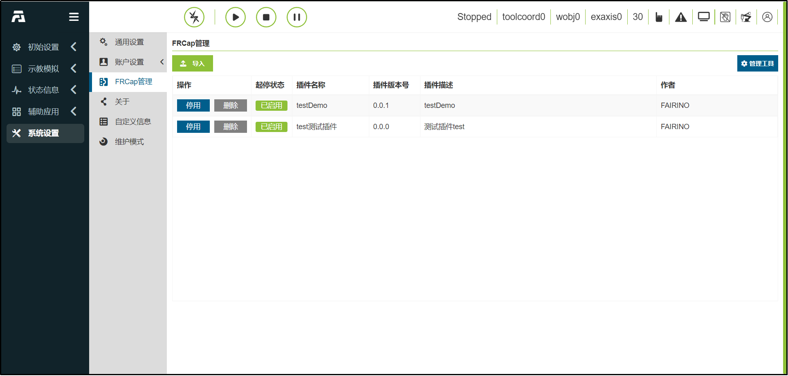
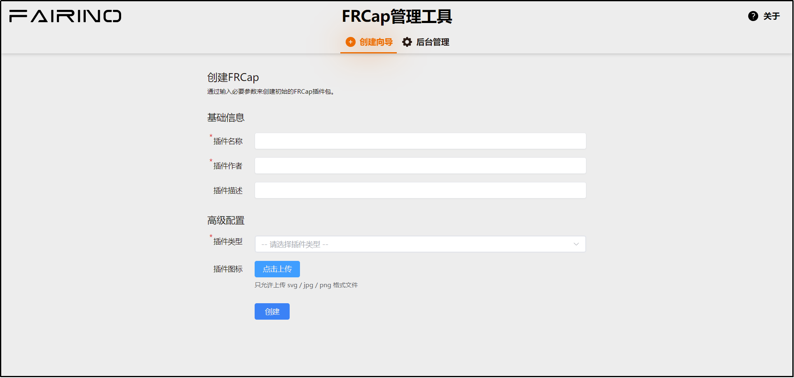
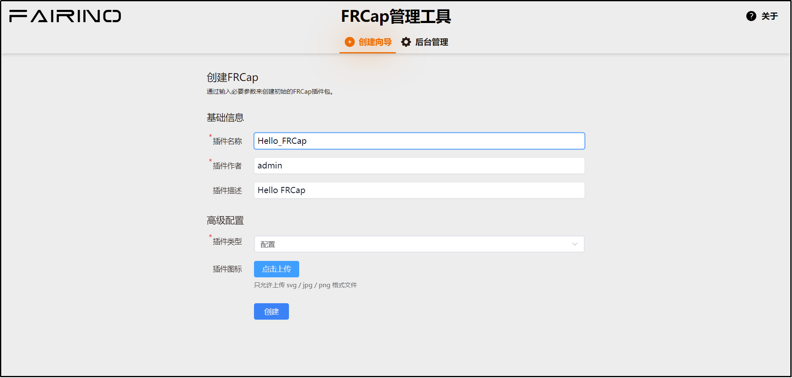
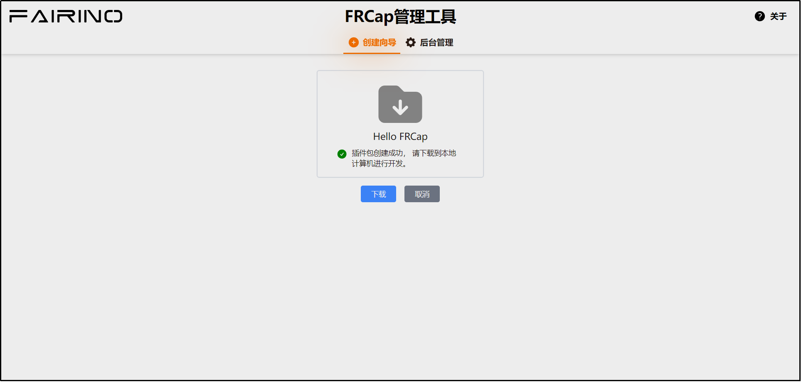
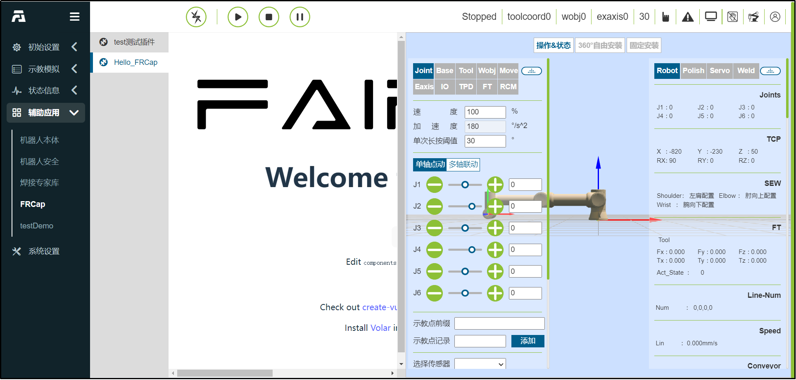

快速开始
=========================

.. toctree:: 
   :maxdepth: 6

我没有FRCap
-------------

如果您目前还没有FRCap，那么可以在本小节快速创建一个FRCap。

首先，我们需要连接机器人并访问WebApp，在本地计算机中打开浏览器并输入机器人默认IP地址（http://192.168.58.2）并登录进入WebApp。

.. centered:: 图表 2-1  WebApp的“FRCap管理”页面

在WebApp中依次点击“系统设置”->“FRCap管理”->“管理工具”后会在浏览器打开一个新的标签页并访问“FRCap管理工具”。

.. centered:: 图表 2-2  FRCap管理工具

在FRCap管理工具中选择“创建向导”，依次输入或选择以下插件内容：

- 插件名称：Hello_FRCap。
- 插件作者：admin。
- 插件描述：Hello FRCap。
- 插件类型：配置。

其中插件图标无需上传，参数输入或选择完毕后，点击“创建”即可完成创建FRCap。

.. centered:: 图表 2-3  FRCap创建向导

创建成功后，跳转至创建成功页面并显示当前创建成功的FRCap名称，点击“下载”即可将创建好的FRCap下载到本地计算机。

.. centered:: 图表 2-4  下载Hello FRCap插件包

我已有FRCap
-------------
如果您已有FRCap项目文件夹，且符合FRCap项目结构，请直接阅读\ `构建FRCap <frcap_quick_start.html#id3>`__\。

如果您已有文件后缀名称为“.frcap”的完整插件包，请直接阅读\ `Hello FRCap <frcap_quick_start.html#hello-frcap>`__\。

构建FRCap
-------------
打开2.1章节下载的FRCap项目，或者是您已有的FRCap项目。

根据当前使用的系统不同，先打开build脚本，修改buildName参数,为你想要的名称，然后保存关闭，在终端执行对应的脚本。

- Window中启动终端，运行以下指令：

.. code-block:: c++
   :linenos:

   ./build.bat

- Linux中启动终端，运行以下指令：
  
.. code-block:: c++
   :linenos:

   ./build.sh

构建完成后，在FRCap项目目录下生成文件名称为FRCap名称的，文件后缀为“.frcap”的包文件。

.. image:: frcap_pictures/006.png
   :width: 6in
   :align: center

.. centered:: 图表 2-5  构建完成的FRCap包文件

Hello FRCap
-------------
FRCap项目构建完成后，在本地计算机中打开浏览器并输入机器人默认IP地址（http://192.168.58.2）并登录进入WebApp，依次点击“系统设置”->“FRCap管理”->“导入”。选择构建完成的“.frcap”后缀的FRCap包文件，打开即可上传。上传成功后在下方的插件信息列表中展示导入的FRCap信息。

通过列表中的操作栏控制FRCap启用与否和删除，在启停状态栏查看FRCap的启用状态。

Hello FRCap启用后可以在“辅助应用”->“FRCap”->“Hello FRCap”使用。该页面承载配置类FRCap，可以全幅，也可以半幅，默认按照半幅展示。

至此，您已经完成了整个插件快速创建和使用流程。

.. centered:: 图表 2-6  Hello FRCap内容

想要了解详细的创建向导指导可以继续查看\ `创建向导 <frcap_create.html#id1>`__\。

想要了解开发FRCap所需的工具环境和指导，请查看\ `开发指导 <frcap_development_guidance.html#id1>`__\。

想要了解FRCap在WebApp中具体的使用指导，请查看\ `WebApp中使用FRCap <frcap_use.html#webappfrcap>`__\。
