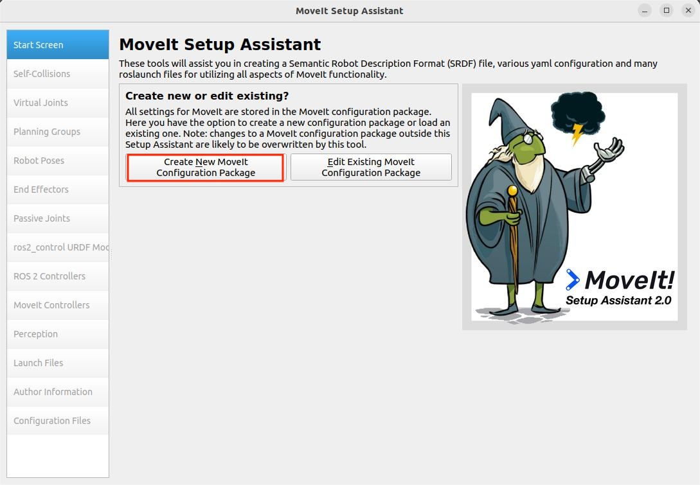
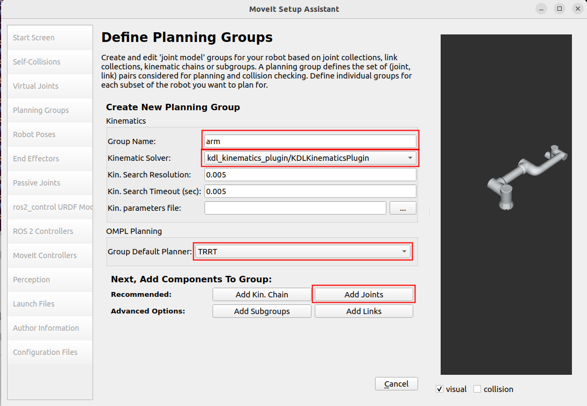
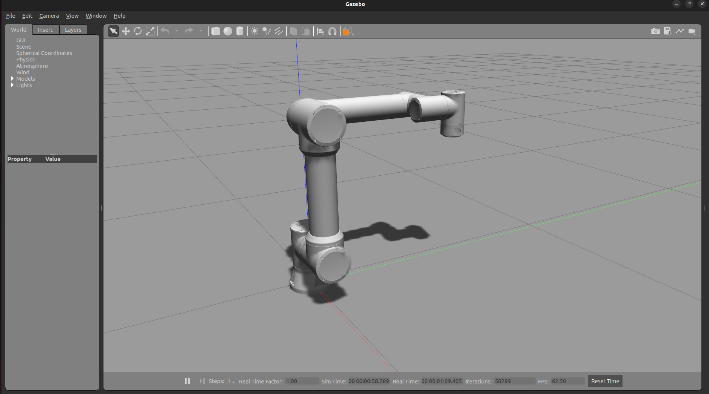
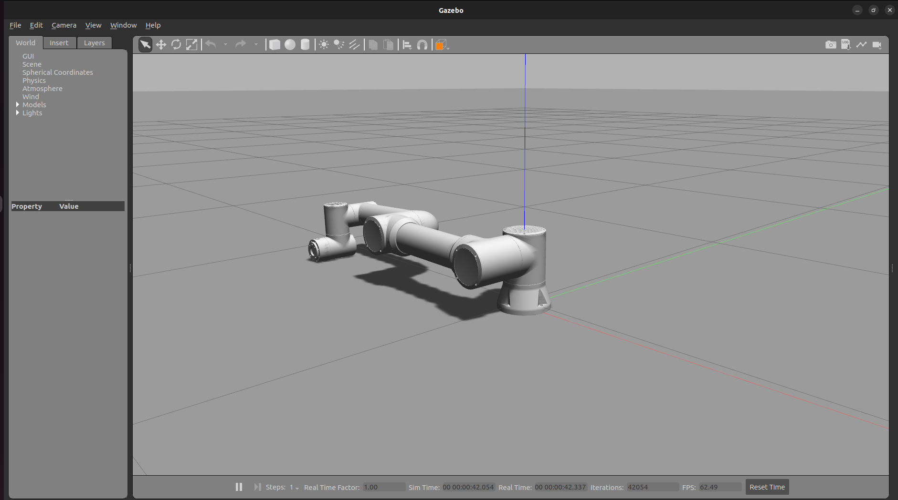
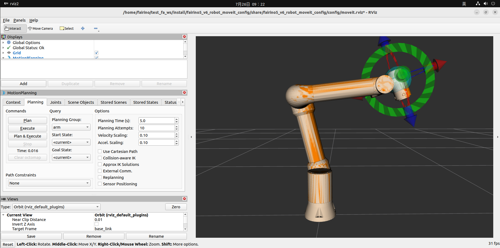
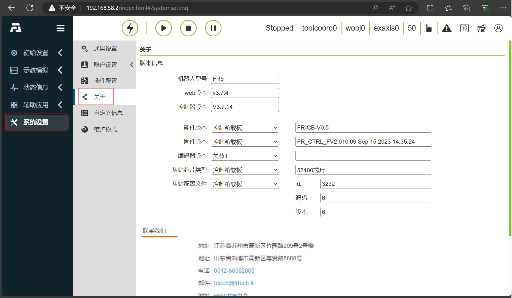

插件簡介
++++++++++++++++++++++++++++++
法奧MoveIt2插件是為法奧機器人的運動控制與路徑規劃提供支援的插件。借助法奧MoveIt2插件能夠實現複雜的機器人運動控制、路徑規劃、逆運動學求解和即時碰撞檢測等功能，適用於多種機械手臂應用場景，如工業、焊接、製造業、自動化上下料、碼垛、醫療等場景。

快速使用
++++++++++++++++++++++++++++++
本章節說明APP運作環境如何設定。

建議在Ubuntu22.04LTS(Jammy)使用，系統安裝完畢後，就可以安裝ROS2，推薦用ros2-humble，ROS2的安裝可以參考教學：https://docs.ros.org/en/humble/index. html。

法奧MoveIt2插件包安裝與配置
------------------------------
克隆法奧MoveIt2插件
""""""""""""""""""""""""""""""""""
克隆法奧MoveIt2插件到本地，然後cd到目標目錄下，其中主要文件包括fairino_msgs法奧機器人資料傳輸資料類型功能包；fairino_hardware法奧機器人fairino_hardware插件功能包；

fairino_robot/fairino_description法奧機器人外觀及urdf檔案功能包；

fairino_robot/fairino3mt_v6_moveit2_config、fairino_robot/fairino3_v6_moveit2_config、fairino_robot/fairino5_v6_moveit2_config、fairino_robot/fairino10_v6_moveit2_config. _config、fairino_robot/fairino30_v6_moveit2_config法奧機器人moveit2配置包，fairino_robot/fairino_mtc_demo法奧mtc範例程式碼包。

.. image:: img/fairino_harware_001.png
    :width: 6in
    :align: center
.. image:: img/fairino_harware_002.png
    :width: 6in
    :align: center

編譯功能包
""""""""""""""""""""""""""""""""""

編譯fairino_msgs功能包

.. code-block:: shell
    :linenos:

    cd ros2_ws
    colcon build --packages-select fairino_msgs
    source install/setup.bash

編譯fairino_hardware功能包

.. code-block:: shell
    :linenos:

    cd ros2_ws
    colcon build --packages-select fairino_hardware
    source install/setup.bash

編譯fairino_description功能包

.. code-block:: shell
    :linenos:

    cd ros2_ws
    colcon build --packages-select fairino_description
    source install/setup.bash

編譯法奧機器人moveit2配置包，以fairino5_v6_moveit2_config為例

.. code-block:: shell
    :linenos:

    cd ros2_ws
    colcon build --packages-select fairino5_v6_moveit2_config
    source install/setup.bash

編譯法奧機器人fairino_mtc_demo範例程式碼包，若該代碼範例包未出現在官方ros2_ws工作空間內，可聯絡售後服務獲取

.. code-block:: shell
    :linenos:

    cd ros2_ws
    colcon build --packages-select fairino_mtc_demo
    source install/setup.bash

配置法奧機械手臂Moveit2模型
------------------------------
若不想使用官方提供的機器人moveit2_config配置包，可以透過moveit_setup_assistant配置自訂機器人moveit2_config配置包。

創建工作空間
""""""""""""""""""""""""""""""""""
建立工作空間，並建立功能包

.. code-block:: shell
    :linenos:

    mkdir -p test_fa_ws/src
    cd test_fa_w/src
    mkdir fairino5_v6_robot_moveit_config
    cd ..
    cd ..

編譯功能包，並source

.. code-block:: shell
    :linenos:

    colcon build
    source install/setup.bash

啟動moveit_setup_assistant進行機器人配置

.. code-block:: shell
    :linenos:

    ros2 launch moveit_setup_assistant setup_assistant.launch.py

配置機器人
""""""""""""""""""""""""""""""""""
啟動配置介面
^^^^^^^^^^^^^^^^^^^^^^^^^^^^^^^^^^^^^^^^
在test_fa_ws目錄下開啟終端，設定介面選擇“Create New Moveit Configuration Package”，建立新的moveit設定功能包。

然後選取機器人的描述文件，也就是.urdf這個文件，然後選擇Load Files，載入機器人模型，就可以看到右邊載入出來了機器人的模型。

.. image:: img/fairino_harware_004.png
    :width: 6in
    :align: center

配置Self-Collisions
^^^^^^^^^^^^^^^^^^^^^^^^^^^^^^^^^^^^^^^^
Self-Collisions為機器人碰撞設置，點擊Generate Collision Matrix既可自動產生關節碰撞矩陣，其會將兩接觸連桿以及永遠接觸不到的連桿之間的碰撞取消，從而配置機器人關節碰撞矩陣的，進而避免計算兩接觸面碰撞，點選Generate Collision Matrix可自動產生。

.. image:: img/fairino_harware_005.png
    :width: 6in
    :align: center

配置Virtual Joints
^^^^^^^^^^^^^^^^^^^^^^^^^^^^^^^^^^^^^^^^
Virtual Joints為機器人虛擬軸，當機器人安裝在移動平台上是就需要為機器人設定虛擬軸，設定虛擬軸的name、子連桿、關節類型等，當移動平台移動時，虛擬軸也同步運動，從而帶動機器人運動，實現機器人隨著移動平台運動的功能本次直接將機器人放置在world座標系中，取名為virtual_joints。

.. image:: img/fairino_harware_006.png
    :width: 6in
    :align: center

配置Planning Groups
^^^^^^^^^^^^^^^^^^^^^^^^^^^^^^^^^^^^^^^^
Planning Groups為機器人的規劃組，它將進行運動學計算時需要同一考慮的關節劃在同一規劃組內，進行統一的正逆向運動學計算，如將一機器人放在AGV小車上，再在機器人末端安裝夾具，測試將AGV小車的四個關節劃在一個規劃組，機器人的六個關節劃在一個規劃組，夾具的一個關節劃在一個規劃組進行運動學計算。

由於此不涉及夾具所以只加入機器人的各個關節組，也就是arm組，先加入arm組，動力學解算器Kinematic Solver選擇kdl_kinematics_plugin/KDLKinematicsPlugin，然後預設的規劃器Group Default Planner選TRRT，然後點選Add Joints為這個規劃組加入關節。

arm的關節按住shift可以進行多選，點擊'>'進行添加，然後點擊save儲存。

.. image:: img/fairino_harware_008.png
    :width: 6in
    :align: center

定義好的規劃組如下圖所示：

.. image:: img/fairino_harware_009.png
    :width: 6in
    :align: center

配置Robot Poses
^^^^^^^^^^^^^^^^^^^^^^^^^^^^^^^^^^^^^^^^
Robot Poses為機器人預設位姿，其為每個規劃組定義一些預設的位姿，為arm定義一個home位姿態，這個姿態可以隨意選擇。

.. image:: img/fairino_harware_010.png
    :width: 6in
    :align: center

Robot Poses可以為每個規劃組定義預設姿態，當機器人中存在夾具時，可在Planning Groups部分添加夾具規劃組，然後在Robot Poses設置姿態時就可為夾具設置預設姿態。

配置End Effectors
^^^^^^^^^^^^^^^^^^^^^^^^^^^^^^^^^^^^^^^^
End Effectors為機器人末端執行機構，末端執行機構的規劃群組為hand，然後預設連接的parent_link是panda_link8，由於本次沒有末端執行器，所以這一步可跳過。

ros2_control URDF Modifications
^^^^^^^^^^^^^^^^^^^^^^^^^^^^^^^^^^^^^^^^
ros2_control URDF Modifications主要用於設定下發和回饋的關節資料類型，可以選擇位置、速度、扭矩三種，本次選擇下發和回饋的關節資料類型都為位置控制，然後直接Add interfaces即可。

.. image:: img/fairino_harware_011.png
    :width: 6in
    :align: center

.. important:: 

    - 注意：

    選擇關節資料類型需要與後續fairino_hardware插件相匹配，根據fairino_hardware插件傳輸資料選擇下發和回饋的關節資料類型，由於本次控制實際機器人運動的fairino_hardware插件使用的是position資料類型，所以本次選擇下發和回饋的關節資料類型都為位置控制。

ROS 2 Controllers
^^^^^^^^^^^^^^^^^^^^^^^^^^^^^^^^^^^^^^^^
ROS 2 Controllers主要用於產生ros2_controllers.yaml文件，該文件設定了發布頻率、關節名稱、控制器名稱、控制器類型等，配置ROS 2 Controllers，為每個規劃組配置控制器，點擊Auto Add JointTrajectoryController Controllers For Each Planning Group即可。

.. image:: img/fairino_harware_012.png
    :width: 6in
    :align: center

Moveit Controllers
^^^^^^^^^^^^^^^^^^^^^^^^^^^^^^^^^^^^^^^^
Moveit Controllers主要用於產生moveit_controllers文件，該文件設定了控制器名稱、控制器類型等，需要注意的是moveit_controllers中的控制器名稱需要與ros2_controllers的控制器名稱相同，否則不能順利運作。

且當moveit_controllers中的控制器名稱與ros2_controllers中的控制器名稱相同時，moveit_controllers中的控制器類型會自動與ros2_controllers中的控制器類型對應在一起，實作下發的控制資料會透過moveit_controllers傳送給ros2_controllers，然後再透過ros2_controllers中的插件驅動實際機器人運動。

.. image:: img/fairino_harware_013.png
    :width: 6in
    :align: center

Launch Files
^^^^^^^^^^^^^^^^^^^^^^^^^^^^^^^^^^^^^^^^
配置Launch Files，使用預設配置即可。

.. image:: img/fairino_harware_014.png
    :width: 6in
    :align: center

作者資訊
^^^^^^^^^^^^^^^^^^^^^^^^^^^^^^^^^^^^^^^^
.. image:: img/fairino_harware_015.png
    :width: 6in
    :align: center

生成Launch文件
^^^^^^^^^^^^^^^^^^^^^^^^^^^^^^^^^^^^^^^^
產生Launch文件，選擇產生位置，本次在test_fa_ws/src檔案路徑下建立一個資料夾fairino5_v6_robot_moveit_config用於存放設定文件，然後選擇產生。

.. image:: img/fairino_harware_016.png
    :width: 6in
    :align: center

由於本次之前已經配置過一遍，若為初次配置Check files you want to be generated部分內容為黑色，表示可以產生Launch檔。

啟動Launch
""""""""""""""""""""""""""""""""""
在配置完成後就可以進行功能包的編譯，可以使用自訂機器人moveit2配置包替換法奧機器人moveit2配置包，實現針對用戶自訂機器人的插件相容使用

.. code-block:: shell
    :linenos:

    colcon build --packages-select fairino5_v6_robot_moveit_config
    source install/setup.bash

然後直接運行剛才配置好的Launch文件

.. code-block:: shell
    :linenos:

    ros2 launch fairino5_v6_robot_moveit_config demo.launch.py

就可以看到設定完成的rviz2介面。

.. image:: img/fairino_harware_017.png
    :width: 6in
    :align: center

Moveit2使用
""""""""""""""""""""""""""""""""""
打開配置的套件後，可以拖曳右側3D介面中機器人末端的藍色球體設定機器人目標位置，然後透過機器人末端紅、綠、藍三個圓環改變機器人末端姿態。

.. image:: img/fairino_harware_018.png
    :width: 6in
    :align: center

點選左側Plan按鈕，規劃機器人運動軌跡。

.. image:: img/fairino_harware_019.png
    :width: 6in
    :align: center

點選左側Execute按鈕，驅動機器人依規劃的軌跡移動到目標位姿。

.. image:: img/fairino_harware_020.png
    :width: 6in
    :align: center

Plan&Execute按鈕是在規劃軌跡後自動控制機器人運動。

然後點選Joints標籤可以透過改變各關節角度改變機器人目標位姿，然後透過Plan、Execute、Plan&Execute按鈕驅動機器人運動。

.. image:: img/fairino_harware_021.png
    :width: 6in
    :align: center

Gazebo模擬環境量產型機器人適配功能包
++++++++++++++++++++++++++++++++++++++++++++++++++++++++++++++++++++++++++++++++++++++++++++++++++++++++++++++++++++++++

簡介
------------------------------------------------------------

本專案提供FR系列量產型6自由度協作機器人在Gazebo Classic模擬環境下的模擬功能包，基於ROS2 Humble及ros2_control架構實現。每個機器人對應一個獨立的ROS2功能包，採用標準ros2_control的GazeboSystem硬體介面，支援關節控制與關節狀態回饋，本手冊工作空間預設名為FR_Gazebo_ws，若自訂請自行替換。

支援的機型（11個功能包）
""""""""""""""""""""""""""""""""""""""""""""""""""""""""""""""""""""""""""""""""""""""""""""""""""""""""""""

表1-1  支援機型與功能包對照表

.. list-table::
   :widths: 50 50
   :header-rows: 0
   :align: center

   * - **機型** 
     - **功能包**

   * - FR3
     - fr3v6_ros2_control

   * - FR5
     - fr5v6_ros2_control

   * - FR10
     - fr10v6_ros2_control

   * - FR16
     - fr16v6_ros2_control

   * - FR20
     - fr20v6_ros2_control

   * - FR30
     - fr30v6_ros2_control

   * - FR3C
     - fr3c_ros2_control

   * - FR5C
     - fr5c_ros2_control

   * - FR5WML
     - fr5l_ros2_control

   * - FR3WML
     - fr3wml_ros2_control

   * - FR3WMS
     - fr3wms_ros2_control

核心特性
""""""""""""""""""""""""""""""""""""""""""""""""""""""""""""""""""""""""""""""""""""""""""""""""""""""""""""

- 統一關節命名：所有機型均為6個旋轉關節，命名為j1 ~ j6，順序為基座→肩→肘→腕1→腕2→腕3。
- 統一控制介面：透過/joint_trajectory_controller/joint_trajectory話題下發trajectory_msgs/msg/JointTrajectory指令（位置控制）。
- 關節狀態回饋：透過各機型命名空間下的joint_states話題即時回饋關節角。
- 示範腳本：每個功能包附帶*_demo.py，自動等待控制器就緒後示範各關節運動。

.. centered:: 圖 1-1  Gazebo模擬環境中機器人載入效果

環境要求
------------------------------

作業系統
""""""""""""""""""""""""""""""""""""""""""""""""""""""""""""""""""""""""""""""""""""""""""""""""""""""""""""

Ubuntu 22.04 LTS（ROS 2 Humble官方支援版本）。

軟體依賴
""""""""""""""""""""""""""""""""""""""""""""""""""""""""""""""""""""""""""""""""""""""""""""""""""""""""""""

表2-1  軟體依賴清單

.. list-table::
   :widths: 30 30 40
   :header-rows: 0
   :align: center

   * - **軟體/元件** 
     - **版本/說明**
     - **安裝位置**

   * - ROS 2
     - Humble
     - /opt/ros/humble

   * - Gazebo
     - Gazebo Classic 11（gzserver / gzclient）
     - 隨gazebo_ros安裝

   * - ros2_control原始碼工作空間
     - 含ros2_control、gazebo_ros2_control、ros2_controllers、controller_manager、joint_trajectory_controller、joint_state_broadcaster等
     - ~/ros2_control_ws

   * - Python 3
     - 執行launch與demo腳本
     - 系統內建
		
.. note:: 本工程依賴的gazebo_ros2_control、joint_trajectory_controller、joint_state_broadcaster等包來自原始碼編譯的~/ros2_control_ws工作空間（ros-controls倉庫）。啟動/編譯前必須source該工作空間，否則會出現「無法找到控制器/外掛」錯誤。且建議使用預設編譯類型，避免因除錯符號導致外掛載入異常。

功能包安裝及編譯步驟
------------------------------------------------------------------------------------------

前置準備：確認ros2_control工作空間
""""""""""""""""""""""""""""""""""""""""""""""""""""""""""""""""""""""""""""""""""""""""""""""""""""""""""""

確認~/ros2_control_ws已存在且已編譯（內含ros-controls倉庫）。若已存在，直接進入3.2節。若需搭建，可執行以下命令：

.. centered:: 程式碼3-1  搭建ros2_control工作空間
    
.. code-block:: console

    # 1. 建立工作空間並拉取 ros-controls 原始碼
    mkdir -p ~/ros2_control_ws/src
    cd ~/ros2_control_ws/src
    git clone https://github.com/ros-controls/ros2_control -b humble

    # 2. 編譯（需已source ROS 2 Humble）
    source /opt/ros/humble/setup.bash
    cd ~/ros2_control_ws
    rosdep install --from-paths src --ignore-src -r -y
    colcon build
    source ~/ros2_control_ws/install/setup.bash

複製倉庫
""""""""""""""""""""""""""""""""""""""""""""""""""""""""""""""""""""""""""""""""""""""""""""""""""""""""""""

首先，複製Gazebo適配功能包到本地，其中功能包包括fr3c_ros2_control、fr3v6_ros2_control、fr3wml_ros2_control、fr3wms_ros2_control、fr5c_ros2_control、fr5l_ros2_control、fr5v6_ros2_control、fr10v6_ros2_control、fr16v6_ros2_control、fr20v6_ros2_control、fr30v6_ros2_control。建立FR_Gazebo_ws/src資料夾，將上述功能包複製到src目錄下。

.. image:: img/040.png
    :width: 6in
    :align: center

.. centered:: 圖3-1  src目錄下機器人適配功能包

編譯本工作空間
""""""""""""""""""""""""""""""""""""""""""""""""""""""""""""""""""""""""""""""""""""""""""""""""""""""""""""

本工程所有功能包均為檔案型包（只安裝URDF/launch/config/meshes）。

.. centered:: 程式碼3-2  編譯FR_Gazebo_ws工作空間
    
.. code-block:: console

    # 1. 依序載入環境（順序不能顛倒）
    source /opt/ros/humble/setup.bash
    source ~/ros2_control_ws/install/setup.bash

    # 2. 進入工作空間並編譯
    cd ~/FR_Gazebo_ws
    colcon build

    # 3. 編譯完成後載入本工作空間環境
    source ~/FR_Gazebo_ws/install/setup.bash

驗證編譯結果
""""""""""""""""""""""""""""""""""""""""""""""""""""""""""""""""""""""""""""""""""""""""""""""""""""""""""""

編譯成功後，install/目錄下應出現全部11個功能包：

程式碼3-3  驗證編譯結果
    
.. code-block:: console

    ls ~/FR_Gazebo_ws/install
    # 應看到：fr3v6_ros2_control  fr5v6_ros2_control  fr10v6_ros2_control  ... 共 11 個

.. image:: img/041.png
    :width: 6in
    :align: center

.. centered:: 圖3-2  編譯成功終端輸出

使用方法
------------------------------------------------------------------------------------------

啟動模擬（以FR5為例）
""""""""""""""""""""""""""""""""""""""""""""""""""""""""""""""""""""""""""""""""""""""""""""""""""""""""""""

.. centered:: 程式碼4-1  啟動FR5模擬
    
.. code-block:: console

    # 1. 依序載入環境
    cd ~/FR_Gazebo_ws
    source /opt/ros/humble/setup.bash
    source ~/ros2_control_ws/install/setup.bash
    source ~/FR_Gazebo_ws/install/setup.bash

    # 2. 啟動（launch會自動啟動gzserver/gzclient、生成機器人並載入控制器，若需清理舊程序，請參考4.2節末尾的提示）
    ros2 launch fr5v6_ros2_control spawn_fr5v6.launch.py
    
啟動過程中，launch會自動輪詢等待controller_manager就緒後載入控制器。看到以下日誌即表示就緒，若等待超過3分鐘仍未顯示「Successfully loaded」，請參考5.2節排查環境source順序：

.. centered:: 程式碼4-2  控制器載入成功日誌
    
.. code-block:: console

    Successfully loaded controller joint_trajectory_controller into state active

.. image:: img/042.png
    :width: 6in
    :align: center

.. centered:: 圖4-1  控制器載入成功終端日誌

.. centered:: 圖4-2  Gazebo介面機器人初始姿態

全機型啟動命令對照表
""""""""""""""""""""""""""""""""""""""""""""""""""""""""""""""""""""""""""""""""""""""""""""""""""""""""""""

所有機型的操作流程一致，僅功能包名、launch檔名、命名空間不同：

表4-1  全機型啟動命令對照表

.. list-table::
   :widths: 20 40 20 20
   :header-rows: 0
   :align: center

   * - **機型** 
     - **啟動命令**
     - **命名空間**
     - **關節狀態話題**

   * - FR3 
     - ros2 launch fr3v6_ros2_control spawn_fr3v6.launch.py
     - fr3v6
     - /fr3v6/joint_states

   * - FR5 
     - ros2 launch fr5v6_ros2_control spawn_fr5v6.launch.py
     - fr5v6
     - /fr5v6/joint_states

   * - FR10 
     - ros2 launch fr10v6_ros2_control spawn_fr10v6.launch.py
     - fr10v6
     - /fr10v6/joint_states

   * - FR16 
     - ros2 launch fr16v6_ros2_control spawn_fr16v6.launch.py
     - fr16v6
     - /fr16v6/joint_states

   * - FR20 
     - ros2 launch fr20v6_ros2_control spawn_fr20v6.launch.py
     - fr20v6
     - /fr20v6/joint_states

   * - FR30 
     - ros2 launch fr30v6_ros2_control spawn_fr30v6.launch.py
     - fr30v6
     - /fr30v6/joint_states

   * - FR3C 
     - ros2 launch fr3c_ros2_control spawn_fr3c.launch.py
     - fr3c
     - /fr3c/joint_states

   * - FR3WML 
     - ros2 launch fr3wml_ros2_control spawn_FR3WML.launch.py
     - fr3wml
     - /fr3wml/joint_states

   * - FR3WMS 
     - ros2 launch fr3wms_ros2_control spawn_FR3WMS.launch.py
     - fr3wms
     - /fr3wms/joint_states

   * - FR5C 
     - ros2 launch fr5c_ros2_control spawn_fr5c.launch.py
     - fr5c
     - /fr5c/joint_states

   * - FR5WML 
     - ros2 launch fr5l_ros2_control spawn_fr5l.launch.py
     - fr5l
     - /fr5l/joint_states
			
.. note:: 一次僅能啟動一個機型。若需切換須先關閉當前Gazebo程序（pkill -9 gzserver; pkill -9 gzclient），否則新實例會因連接埠衝突而失敗。

手動控制（下發目標關節）
""""""""""""""""""""""""""""""""""""""""""""""""""""""""""""""""""""""""""""""""""""""""""""""""""""""""""""

控制器就緒後，向/joint_trajectory_controller/joint_trajectory下發目標關節（6個關節弧度值）：

.. centered:: 程式碼4-3  手動下發關節軌跡指令
    
.. code-block:: console

    # 移動到目標關節 [1.57, -0.78, -1.57, -1.2, 1.57, 1.3]（單位：弧度）
    ros2 topic pub --once /joint_trajectory_controller/joint_trajectory \
    trajectory_msgs/msg/JointTrajectory \
    "{joint_names: [j1,j2,j3,j4,j5,j6],
        points: [{positions: [1.57, -0.78, -1.57, -1.2, 1.57, 1.3],
                time_from_start: {sec: 2, nanosec: 0}}]}"

    # 回零位
    ros2 topic pub --once /joint_trajectory_controller/joint_trajectory \
    trajectory_msgs/msg/JointTrajectory \
    "{joint_names: [j1,j2,j3,j4,j5,j6],
        points: [{positions: [0.0, 0.0, 0.0, 0.0, 0.0, 0.0],
                time_from_start: {sec: 2, nanosec: 0}}]}"

.. note:: 角度換算公式為 弧度 = 角度 × π / 180。常用值：90° ≈ 1.5708，−90° ≈ −1.5708，100° ≈ 1.7453。

執行示範腳本
""""""""""""""""""""""""""""""""""""""""""""""""""""""""""""""""""""""""""""""""""""""""""""""""""""""""""""

每個功能包自帶示範腳本，會自動等待controller_manager就緒後，逐關節完成0→±90°的往復運動：

.. centered:: 程式碼4-4  執行示範腳本
    
.. code-block:: console

    # 以FR5為例（其他機型替換腳本路徑中的包名即可）
    python3 ~/FR_Gazebo_ws/src/fr5v6_ros2_control/scripts/fr5v6_demo.py

表4-2  全機型示範腳本路徑對照表

.. list-table::
   :widths: 30 70
   :header-rows: 0
   :align: center

   * - **機型** 
     - **示範腳本路徑**

   * - FR3
     - ~/FR_Gazebo_ws/src/fr3v6_ros2_control/scripts/fr3v6_demo.py

   * - FR5
     - ~/FR_Gazebo_ws/src/fr5v6_ros2_control/scripts/fr5v6_demo.py

   * - FR10
     - ~/FR_Gazebo_ws/src/fr10v6_ros2_control/scripts/fr10v6_demo.py

   * - FR16
     - ~/FR_Gazebo_ws/src/fr16v6_ros2_control/scripts/fr16v6_demo.py

   * - FR20
     - ~/FR_Gazebo_ws/src/fr20v6_ros2_control/scripts/fr20v6_demo.py

   * - FR30
     - ~/FR_Gazebo_ws/src/fr30v6_ros2_control/scripts/fr30v6_demo.py

   * - FR3C
     - ~/FR_Gazebo_ws/src/fr3c_ros2_control/scripts/fr3c_demo.py

   * - FR3WML
     - ~/FR_Gazebo_ws/src/fr3wml_ros2_control/scripts/fr3wml_demo.py

   * - FR3WMS
     - ~/FR_Gazebo_ws/src/fr3wms_ros2_control/scripts/fr3wms_demo.py

   * - FR5C
     - ~/FR_Gazebo_ws/src/fr5c_ros2_control/scripts/fr5c_demo.py

   * - FR5WML
     - ~/FR_Gazebo_ws/src/fr5l_ros2_control/scripts/fr5l_demo.py

.. image:: img/044.png
    :width: 6in
    :align: center

.. centered:: 圖4-3  示範腳本執行中機器人運動姿態

監控關節狀態
""""""""""""""""""""""""""""""""""""""""""""""""""""""""""""""""""""""""""""""""""""""""""""""""""""""""""""

.. centered:: 程式碼4-5  監控關節狀態
    
.. code-block:: console
        
    # 即時查看關節角
    ros2 topic echo /joint_states

.. image:: img/045.png
    :width: 6in
    :align: center

.. centered:: 圖4-4  關節狀態即時輸出

常見問題
------------------------------------------------------------------------------------------

啟動時報連接埠衝突/Gazebo打不開
""""""""""""""""""""""""""""""""""""""""""""""""""""""""""""""""""""""""""""""""""""""""""""""""""""""""""""

- 原因：上一次的 Gazebo 程序未退出，佔用了連接埠。
- 解決：啟動前先清理殘留程序：pkill -9 gzserver; pkill -9 gzclient

一直卡在Waiting for controller_manager...，超過2分鐘
""""""""""""""""""""""""""""""""""""""""""""""""""""""""""""""""""""""""""""""""""""""""""""""""""""""""""""

- 原因：controller_manager未就緒，常見於未source ~/ros2_control_ws/install/setup.bash，或網格載入過慢。
- 解決：先Ctrl+C退出；確認已按順序source三個環境(ros2→ros2_control_ws→FR_Gazebo_ws）。

手動發送指令但機器人不動
""""""""""""""""""""""""""""""""""""""""""""""""""""""""""""""""""""""""""""""""""""""""""""""""""""""""""""

- 原因：大部分可能為時序問題，控制器尚未完全進入active狀態就發了指令，指令被丟棄。
- 解決：確認終端列印Successfully loaded controller joint_trajectory_controller into state active後再發控制指令；或直接改用4.4節的demo腳本。

提示無joint_trajectory_controller/gazebo_ros2_control外掛
""""""""""""""""""""""""""""""""""""""""""""""""""""""""""""""""""""""""""""""""""""""""""""""""""""""""""""

- 原因：ros2_control相關依賴未載入。
- 解決：確認已source ~/ros2_control_ws/install/setup.bash；並確認~/.bashrc或目前終端載入順序為ROS→ros2_control_ws→本工作空間。

機器人載入後缺部件/關節顯示不完整
""""""""""""""""""""""""""""""""""""""""""""""""""""""""""""""""""""""""""""""""""""""""""""""""""""""""""""

- 原因：URDF引用的網格檔案缺失。
- 解決：確認對應功能包的meshes/目錄存在且完整。

能否同時啟動兩個機型
""""""""""""""""""""""""""""""""""""""""""""""""""""""""""""""""""""""""""""""""""""""""""""""""""""""""""""

- 不能。多個模擬實例會爭用同一Gazebo連接埠，應一次只啟動一個機型。

fairino_hardware外掛（自訂機器人moveit配置套件）
+++++++++++++++++++++++++++++++++++++++++++++++++++++++++++++++++++++++++++++++++++++
fairino_hardware插件為連接moveit與機器人的中間層，透過fairino_hardware插件move_group將運動規劃傳送給moveit_control，然後轉發給ros2_control，ros2_control再透過fairino_hardwareware插件驅動實際機器人運動，並且fairino_hardware插件也會接受實際機器人的回饋資料，從而實際機器人的回饋資料，從而實際機器人的回饋實現rviz2模擬介面機器人模型與實際機器人的同步，從而實現使用者透過rviz2介面驅動實際機器人運動功能。

並且由於fairino_hardware插件的實現，使得法奧機器人能夠接入ros2_control控制框架，使法奧機器人能夠兼容基於ros2_control的第三方功能包。

fairino_hardware外掛程式編譯
------------------------------------------------------------
編譯官方提供的ros2_ws功能包中的fairino_hardware插件功能包，透過上節編譯fairino_hardware插件功能包，然後將會在

.. code-block:: shell
    :linenos:

    ros2_ws/install/fairino_hardware/lib/fairino_hardware
    
下看到外掛程式產生的.so檔libfairino_hardware.so，說明外掛程式編譯成功。

要注意的是需要讓fairino_hardware插件對機器人各關節的命名與moveit2配置的機器人各關節命名相同，本fairino_hardware插件對機器人六個關節的命名由基坐標位置到機器人末端分別為j1、j2、j3、j4 、j5、j6，所以在moveit2配置的機器人時需要將機器人的關節命名為j1、j2、j3、j4、j5、j6。

fairino_hardware插件使用
------------------------------------------------------------
若採用配置的自訂機器人moveit配置包，進入目錄

.. code-block:: shell
    :linenos:

    /home/fairino/test_fa_ws/install/fairino5_v6_robot_moveit_config/share/fairino5_v6_robot_moveit_config/config

下，找到fairino5_v6_robot.ros2_control.xacro文件，將文件第3行的參數

.. code-block:: shell
    :linenos:

    use_fake_hardware:=false

替換為

.. code-block:: shell
    :linenos:

    use_fake_hardware:=true

根據後續的if判斷可以看到，將use_fake_hardware設置成true是啟用fairino_hardware/FairinoHardwareInterface這個插件，保存文件並退出即可。

.. image:: img/fairino_harware_022.png
    :width: 6in
    :align: center

其中「fairino_hardware/FairinoHardwareInterface」hardware插件設置的插件名稱，具體可以在「/home/fairino/ros2_ws/src/fairino_hardware」目錄下的「fairino_hardware.xml」文件查看。

.. image:: img/fairino_harware_023.png
    :width: 6in
    :align: center

注意，在文件第3行中的robot_control_mode參數決定了加載插件時候暴露的指令接口，即參數代表了控制模式，0為位置控制模式，插件會暴露position接口，1為扭矩控制模式，插件會暴露effort接口。針對扭矩控制接口的demo預計會在適配機械臂軟體V3.8.5版本的fairino_hardware功能包中推出。

當前的Moveit2控制器僅支援位置控制模式，請不要將robot_control_mode設置為1。

運行插件
------------------------------------------------------------
打開終端，然後轉到ros2_ws工作空間，並source工作空間，目的是將fairino_hardware插件添加進來，也可以將該路徑加載到“~/.bashrc”文件中，但不建議

.. code-block:: shell
    :linenos:

    cd ros2_ws
    source install/setup.bash

然後回到主目錄，然後到test_fa_ws工作空間，並source工作空間，然後執行demo.launch.py​​文件

.. code-block:: shell
    :linenos:

    cd ..
    cd test_fa_ws
    source install/setup.bash
    ros2 launch fairino5_v6_robot_moveit_config demo.launch.py

運行結果
------------------------------------------------------------
demo.launch.py​​檔案啟動後，rviz2介面如下圖所示：

.. image:: img/fairino_harware_024.png
    :width: 6in
    :align: center

此時rviz2啟動介面與3.3.1節的最大不同為機器人初始位姿，此時由於加入了fairino_hardware插件，該插件會即時接受實際機器人關節狀態，並透過ros2_control反饋給move_group，進而控制rviz2介面上的仿真機器人位姿，進而實現實際機器人與rviz2仿真機器人的同步。

此時實際機器人位姿如下：

.. image:: img/fairino_harware_025.png
    :width: 3in
    :align: center

此時可以透過rviz2介面驅動實際機器人運動，拖曳rviz2介面中的機器人末端藍色球體移動機器人末端到目標位置，然後拖曳機器人末端紅、綠、藍三種顏色的圓環，改變機器人末端姿態，然後點選左側Planning&Execute按鈕，進行運動軌跡規劃並驅動機器人運動，會發現實際機器人與rviz2介面上的模擬機器人進行同步運動，並運動到目標位姿停止。

下圖為透過rviz2介面控制實際機器人和rviz2介面模擬機器人運動到目標位姿：

.. image:: img/fairino_harware_027.png
    :width: 3in
    :align: center

至此可透過moveit2控制實際機器人和rviz2介面上的模擬機器人同步運動。

mtc範例程式碼包
++++++++++++++++++++++++++++++

mtc範例程式碼包簡介
---------------------------------------------------
mtc範例程式碼包提供了一個使用moveit2和fairino_hardware插件進行重構的rviz2介面，將原有的MotionPlanning標籤頁更換為Motion Planning Tasks標籤頁，用於顯示機器人運動各個階段，rviz2介面可以通過

.. code-block:: shell
    :linenos:

    ros2_ws/install/fairino_mtc_demo/share/fairino_mtc_demo/launch

路徑下的「mtc.rviz」檔案進行編輯，使用者可以透過編輯「mtc.rviz」檔案來客製化符合使用者功能需求的rviz2介面。

並且mtc範例程式碼套件還提供了透過moveit2和fairino_hardware插件驅動機器人循環抓取目標的範例，透過該範例用戶可以了解如何透過程式碼的形式更好的利用moveit2和fairino_hardware插件與實際機器人進行交互，在此基礎上使用者可以進行符合需求的個人化客製化。

mtc範例程式碼包編譯
---------------------------------------------------

mtc範例程式碼包克隆
""""""""""""""""""""""""""""""""""
將官方提供的mtc範例程式碼套件「fairino_robot」複製到"ros2_ws"工作空間的src目錄下。

機器人型號選擇
""""""""""""""""""""""""""""""""""
在官方提供的mtc範例程式碼包的

.. code-block:: shell
    :linenos:

    ros2_ws/src/fairino_robot/fairino_mtc_demo/launch

目錄下的mtc_demo_env.launch.py​​檔案中選擇機器人型號，修改該檔案中第9、10、11行以符合需要設定的機器人。

.. image:: img/fairino_harware_030.png
    :width: 6in
    :align: center

具體機器人型號命名可以參考

.. code-block:: shell
    :linenos:

    ros2_ws/src/fairino_robot/

目錄下各機器人型號的功能包。

.. image:: img/fairino_harware_031.png
    :width: 3in
    :align: center

mtc範例程式碼包編譯
""""""""""""""""""""""""""""""""""
編譯fairino_description功能包
^^^^^^^^^^^^^^^^^^^^^^^^^^^^^^^^^^^^^^^^
開啟終端，前往ros2_ws目錄下，編譯fairino_description功能包，然後進行source

.. code-block:: shell
    :linenos:

    cd ros2_ws
    colcon build --packages-select fairino_description
    source install/setup.bash

編譯機器人功能包
^^^^^^^^^^^^^^^^^^^^^^^^^^^^^^^^^^^^^^^^
在ros2_ws目錄下編譯與型號對應的機器人功能包，以fairino5機器人為例

.. code-block:: shell
    :linenos:

    colcon build --packages-select fairino5_v6_moveit2_config
    source install/setup.bash

然後需要添加fairino_hardware插件，用於與實際機器人同步運動，前往

.. code-block:: shell
    :linenos:

    ros2_ws/install/fairino5_v6_moveit2_config/share/fairino5_v6_moveit2_config/config
    
目錄下，找到fairino5_v6_robot.ros2_control.xacro，將檔案第9行的

.. code-block:: shell
    :linenos:

    <plugin>mock_components/GenericSystem</plugin>
    
替換為

.. code-block:: shell
    :linenos:

    <plugin>fairino_hardware/FairinoHardwareInterface</plugin>
    
儲存並退出。

.. image:: img/fairino_harware_032.png
    :width: 6in
    :align: center

編譯fairino_mtc_demo功能包
^^^^^^^^^^^^^^^^^^^^^^^^^^^^^^^^^^^^^^^^
編譯fairino_mtc_demo功能包，並進行source

.. code-block:: shell
    :linenos:

    colcon build --packages-select fairino_mtc_demo
    source install/setup.bash

mtc範例程式碼包運行
---------------------------------------------------
rviz2介面
""""""""""""""""""""""""""""""""""
執行mtc_demo_env.launch.py​​檔案開啟客製化rviz2介面，其中Motion Planning Tasks標籤頁用於顯示自訂的機器人各運動過程

.. code-block:: shell
    :linenos:

    cd ros2_ws
    source install/setup.bash
    ros2 launch fairino_mtc_demo mtc_demo_env.launch.py

.. image:: img/fairino_harware_033.png
    :width: 6in
    :align: center

.. image:: img/fairino_harware_034.png
    :width: 3in
    :align: center

機器人運動
""""""""""""""""""""""""""""""""""
重新開啟一個新終端，前往ros2_ws目錄下，並source文件，執行mtc_demo_app.launch.py​​檔案執行機器人運動

.. code-block:: shell
    :linenos:

    cd ros2_ws
    source install/setup.bash
    ros2 launch fairino_mtc_demo mtc_demo_app.launch.py

接著在rviz2介面Motion Planning Tasks標籤頁將會顯示機器人各運動過程，且實際機器人與rviz2介面模擬機器人將會同步運動。

.. image:: img/fairino_harware_035.png
    :width: 6in
    :align: center

.. image:: img/fairino_harware_036.png
    :width: 3in
    :align: center

注意事項
++++++++++++++++++++++++++++++

fairino_hardware外掛程式版本同步
---------------------------------------------------
使用fairino_hardware插件的前提需要fairino_hardware插件的版本與法奧機器人版本一致；

fairino_hardware插件接受法奧機器人回饋的資料並轉換為ros2_control的指定的指令資料類型，然後將ros2_control發送的機器人運動資料轉換為法奧機器人特定的資料幀；

有鑑於此，fairino_hardware插件的資料類型與法奧機器人資料類型是否一致就至關重要，而插件與機器人的不同版本可能會導致資料類型不同，所以在正式調試fairino_hardware插件前，需確認法奧機器人版本與fairino_hardware插件版本是否一致，若不一致需要升級法奧機器人。

- 首先可以在法奧機器人「WebAPP介面->系統設定->關於」介面查看機器人目前的各個版本型號。

- 然後準備官方提供的機器人軟體包，然後進入法奧機器人「WebAPP介面->輔助應用->機器人本體->系統升級」介面，然後點擊「選擇檔案」按鈕，選擇準備的與fairino_hardware插件版本對應的機器人軟體升級包，選擇“上傳升級包”，等待軟體升級完成。

- 升級完成後，系統會提示需要重新啟動機器人，將機器人控制箱上的開關打到關閉擋位，等待25秒左右，然後啟動機器人，至此機器人軟件版本升級完成，可以進行後續的fairino_hardware插件的編譯與使用。

.. image:: img/fairino_harware_038.png
    :width: 6in
    :align: center

可能遇到的問題
---------------------------------------------------
可能在配置機器人功能包右側載不出來機器人模型。
"""""""""""""""""""""""""""""""""""""""""""""""""""""""""""""""""""""
解決方法：這種錯誤可能是由於.urdf檔案中的路徑沒有寫對，可以透過修改.urdf檔案中的路徑和將meshes檔案加複製進工作空間中的install/test_moveit/share/test_moveit下解決。

產生package後，運行出錯。
""""""""""""""""""""""""""""""""""
解決方法：將launches.py檔案中203行「default_value=moveit_config.move_gro-up_capabilities["capabilities"],」中的「["capabilities"]」刪除即可解決。

總結
++++++++++++++++++++++++++++++
本手冊闡述了MoveIt2插件的安裝、配置與使用；fairino_hardware插件的安裝與使用，實現rviz2仿真機器人與實際機器人的同步運動；以及mtc示例代碼包的編譯與運行，借助moveit2和fairino_hardware插件實現定制化功能。

希望透過本教學的闡述可以讓用戶對MoveIt2和fairino_hardware外掛程式有更全面的了解，希望能幫助用戶更好的個人化客製化法奧機器人服務功能。