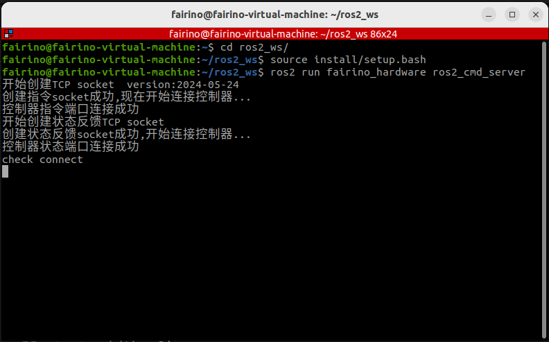
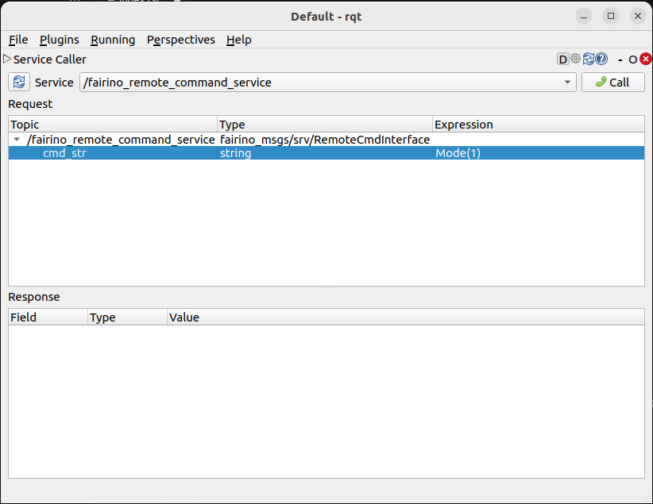

前言
++++++++++
fairino_hardware為法奧協作機器人基於ROS2開發的API接口，旨在針對入門級用戶更便捷的使用法奧SDK。透過參數設定檔對預設參數的配置，即可適應不同的客戶要求。

fairino_hardware
++++++++++++++++++++++++++++
本章節說明APP運作環境如何設定。

基本環境安裝
--------------

建議在Ubuntu22.04LTS(Jammy)使用，系統安裝完畢後，需安裝ROS2，建議用ros2-humble，全部的ROS2的安裝可以參考教學：https://docs.ros.org/en/humble/index .html。
在正式編譯fairino_hardware前，還需要安裝官方ros2_control包，全部的ros2_control安裝可以參考教學：https://control.ros.org/humble/index.html。官方提供兩種ros2_control安裝方式，分別為指令安裝方式和原始碼編譯安裝方式，由於指令安裝方式可能會導致功能包安裝不全，故建議使用原始碼編譯安裝方式。

以下對ROS2(humble)的過程詳細說明：

1.打開shell視窗

.. code-block:: shell
    :linenos:

    locale  # check for UTF-8

    sudo apt update && sudo apt install locales
    sudo locale-gen en_US en_US.UTF-8
    sudo update-locale LC_ALL=en_US.UTF-8 LANG=en_US.UTF-8
    export LANG=en_US.UTF-8

    locale  # verify settings

2.設定源

.. code-block:: shell
    :linenos:
    
    sudo apt install software-properties-common
    sudo add-apt-repository universe

    sudo apt update && sudo apt install curl -y
    sudo curl -sSL https://raw.githubusercontent.com/ros/rosdistro/master/ros.key -o /usr/share/keyrings/ros-archive-keyring.gpg

    echo "deb [arch=$(dpkg --print-architecture) signed-by=/usr/share/keyrings/ros-archive-keyring.gpg] http://packages.ros.org/ros2/ubuntu $(. /etc/os-release && echo $UBUNTU_CODENAME) main" | sudo tee /etc/apt/sources.list.d/ros2.list > /dev/null

3.安裝ROS2

.. code-block:: shell
    :linenos:

    sudo apt update
    sudo apt upgrade
    sudo apt install ros-humble-desktop

4.最後安裝dev工具

.. code-block:: shell
    :linenos:

    sudo apt install ros-dev-tools

以下對ros2_control的安裝過程詳細闡述：

1.首先source ROS2的資源

.. code-block:: shell
    :linenos:

    source /opt/ros/humble/setup.bash

2.建立ros2_control工作空間，下載資源

.. code-block:: shell
    :linenos:

    mkdir -p ~/ros2_control_ws/src
    cd ~/ros2_control_ws/
    wget https://raw.githubusercontent.com/ros-controls/ros2_control_ci/master/ros_controls.$ROS_DISTRO.repos
    vcs import src < ros_controls.$ROS_DISTRO.repos

3.安裝依賴包

.. code-block:: shell
    :linenos:

    rosdep update --rosdistro=$ROS_DISTRO
    sudo apt-get update
    rosdep install --from-paths src --ignore-src -r -y

4.編譯ros2_control

.. code-block:: shell
    :linenos:

    . /opt/ros/${ROS_DISTRO}/setup.sh
    colcon build --symlink-install

編譯及建置fairino_hardware
------------------------------------------
1. 建立colcon工作區
fairino_hardware有兩個功能包組成，一個是自訂資料結構的功能包fairino_msgs，另一個是程式主體fairino_hardware功能包。在安裝好基本環境後，先建立一個colcon工作區，例如:

首先必須source ROS2和ros2_control的資源

.. code-block:: shell
    :linenos:

    source /opt/ros/humble/setup.bash
    source ~/ros2_control_ws/install/setup.bash

然後再創建工作區

.. code-block:: shell
    :linenos:

    cd ~/
    mkdir -p ros2_ws/src

2. 編譯功能包
將安裝套件的程式碼拷貝至ros2_ws/src目錄下，在ros2_ws目錄下執行以下命令：

.. code-block:: shell
    :linenos:

    colcon build --packages-select fairino_msgs

等待上一條指令完成編譯後

.. code-block::  shell
    :linenos:

    colcon build --packages-select fairino_hardware

快速開始
++++++++++++++

啟動流程
-----------------
在Ubuntu下開啟命令列，輸入：

.. code-block::  shell
    :linenos:

    cd ros2_ws
    source install/setup.bash
    ros2 run fairino_hardware ros2_cmd_server

查看機械手臂狀態回饋流程
--------------------------
機械手臂的狀態回饋是透過topic發布的，使用者可以透過ros2自帶的命令觀察到狀態數據刷新，也可以編寫程式獲取該數據，下面展示如何透過ros2命令觀察機械手臂狀態數據。

在ubuntu下開啟命令列，輸入：

.. code-block:: shell
    :linenos:

    cd ros2_ws
    source install/setup.bash
    ros2 topic echo /nonrt_state_data

可以看到命令列視窗中不斷刷新的狀態數據，如下圖所示。

.. image:: img/fr_ros2_002.png
    :width: 6in
    :align: center

下發指令流程
--------------------------
在ubuntu下開啟命令列，輸入：

.. code-block:: shell
    :linenos:

    cd ros2_ws
    source install/setup.bash
    rqt

以上指令執行完畢後，會調出一個rqt GUI介面，如下圖所示。

.. image:: img/fr_ros2_003.png
    :width: 6in
    :align: center

在GUI介面選擇plugins->serivce->serivce caller，調出以下介面，選擇/fairino_remote_command_service這項，在介面expression中輸入指令字串點擊call即可看到下方對話方塊中跳出回覆訊息。

.. important:: 

   - 輸入字串規則說明：

   程式內部對輸入的字串形式進行了篩選，函數輸入的格式必須是[函數名]() 這樣的形式，且圓括號的參數字串必須是由字母，數字，逗號還有負號組成，出現其他字元或空格均會報錯。

   - 指令回饋值說明：

   除了GET指令會回饋一串字串，其餘的函數回授值都是int型，一般0為出現錯誤，1為正確執行，如果出現其他的值那麼參考xmlrpc SDK中定義的錯誤代碼對應的錯誤。

修改參數流程
--------------------------
由於簡化SDK是改進自原生的SDK接口，能夠簡化是因為賦予了一些參數預設值，而在實際使用過程中也會遇到默認參數無法滿足要求的情況，這個時候可以透過修改對應默認參數的數值，然後載入到節點中。

原始碼檔案中存在一個fairino_remotecmdinterface_para.yaml參數文件，檔案中的參數為預先設定的預設參數，用於簡化指令輸入參數，可以根據自己的具體需求修改其中的參數，然後使用指令動態修改參數: ros2 param load fr_command_server ~/ros2_ws/src/fairino_hardware/fairino_remotecmdinterface_para.yaml。

API說明
++++++++++++++

.. code-block:: c++
    :linenos:

    /*
    函數功能描述:儲存一個關節點位訊息
    id - 儲存點位id號,從1開始,注意該id與CARTPoint的點位id號各自獨立
    double j1-j6 - 6個關節位置,單位是度
    */
    int JNTPoint(int id, double j1, double j2, double j3, double j4, double j5, double j6)
    // 例子
    JNTPoint(1,10,11,12,13,14,15)

    /*
    函數功能描述:儲存一個笛卡爾點位訊息
    id - 儲存點位id號,從1開始,注意該id與JNTPoint的點位id號各自獨立
    double x,y,z,rx,ry,yz - 笛卡爾點位資訊,位置單位是mm,角度單位是度
    */
    int CARTPoint(int id, double x,y,z,rx,ry,rz)//存储一個笛卡兒空间點位
    // 例子
    CARTPoint(1,100,110,200,0,0,0)

    /*
    函數功能描述:取得指定序號點的關節或笛卡爾位置資訊
    string name - 'JNT'或'CART',JNT代表獲取關節點位資訊,'CART'代表獲取笛卡爾點位信息
    int id - 點位id,從1開始
    */
    string GET(string name, int id)//獲取对应id序号點位的内容,name可以輸入JNT或者CART
    // 例子
    GET(JNT,1)

    /*
    函數功能描述:拖曳模式開關
    uint8_t state - 1-開啟拖曳模式,0-關閉拖曳模式
    */
    int DragTeachSwitch(uint8_t state)
    // 例子
    DragTeachSwitch(0)

    /*
    函數功能描述:機械手臂使能開關
    uint8_t state - 1-機械手臂使能,0-機械手臂去使能
    */
    int RobotEnable(uint8_t state)
    // 例子
    RobotEnable(1)

    /*
    函數功能描述:模式切換
    uint8_t state - 1-手動模式,0-自動模式
    */
    int Mode(uint8_t state)
    // 例子
    Mode(1)

    /*
    函數功能描述:設定目前模式下機械手臂速度
    float vel - 速度百分比,範圍為1-100
    */
    int SetSpeed(float vel)
    // 例子
    SetSpeed(10)

    /*
    函數功能描述:設定並載入指定序號的工具坐標系
    int id - 工具坐標系編號,範圍1-15
    float x,y,z,rx,ry,rz - 工具坐標系的偏移資訊
    */
    int SetToolCoord(int id, float x,float y, float z,float rx,float ry,float rz)
    // 例子
    SetToolCoord(1,0,0,0,0,0,0)

    /*
    函數功能描述:設定工具坐標系列表
    int id - 工具坐標系編號,範圍1-15
    float x,y,z,rx,ry,rz - 工具坐標系的偏移資訊
    */
    int SetToolList(int id, float x,float y, float z,float rx,float ry,float rz );
    // 例子
    SetToolList(1,0,0,0,0,0,0)

    /*
    函數功能描述:設定外部工具坐標系
    int id - 工具坐標系編號,範圍1-15
    float x,y,z,rx,ry,rz - 外部工具坐標系的偏移量資訊
    */
    int SetExToolCoord(int id, float x,float y, float z,float rx,float ry,float rz);	
    // 例子
    SetExToolCoord(1,0,0,0,0,0,0)

    /*
    函數功能描述:設定外部工具坐標系列表
    int id - 工具坐標系編號,範圍1-15
    float x,y,z,rx,ry,rz - 外部工具坐標系的偏移量資訊
    */
    int SetExToolList(int id, float x,float y, float z,float rx,float ry,float rz);
    // 例子
    SetExToolList(1,0,0,0,0,0,0)

    /*
    函數功能描述:設定工件座標系
    int id - 工件坐標系編號,範圍1-15
    float x,y,z,rx,ry,rz - 工件座標系的偏移量信息
    */
    int SetWObjCoord(int id, float x,float y, float z,float rx,float ry,float rz);
    // 例子
    SetWObjCoord(1,0,0,0,0,0,0)

    /*
    函數功能描述:設定工件座標系列表
    int id - 工件坐標系編號,範圍1-15
    float x,y,z,rx,ry,rz - 工件坐標系的偏移量資訊
    */
    int SetWObjList(int id, float x,float y, float z,float rx,float ry,float rz);
    // 例子
    SetWObjList(1,0,0,0,0,0,0)

    /*
    函數功能描述:設定末端負載重量
    float weight - 負載重量,單位kg
    */
    int SetLoadWeight(float weight);
    // 例子
    SetLoadWeight(3.5)

    /*
    函數功能描述:設定末端負載質心座標
    float x,y,z - 質心座標,單位為mm
    */
    int SetLoadCoord(float x,float y,float z);
    // 例子
    SetLoadCoord(10,20,30)

    /*
    函數功能描述:設定機器人安裝方式
    uint8_t install - 安裝方式,0-正裝,1-側裝,2-倒裝
    */
    int SetRobotInstallPos(uint8_t install);
    // 例子
    SetRobotInstallPos(0)

    /*
    函數功能描述:設定機器人安裝角度,自由安裝
    double yangle - 傾斜角
    double zangle - 旋轉角
    */
    int SetRobotInstallAngle(double yangle,double zangle);
    // 例子
    SetRobotInstallAngle(90,0)

    //安全配置
    /*
    函數功能描述:設定機器人碰撞等級
    float level1-level6 - 1-6軸的碰撞等級,範圍是1-10
    */
    int SetAnticollision(float level1, float level2, float level3, float level4, float level5, folat level6);
    // 例子
    SetAnticollision(1,1,1,1,1,1)

    /*
    函數功能描述:設定碰撞後策略
    int strategy - 0-報錯停止,1-繼續運行
    */
    int SetCollisionStrategy(int strategy);
    // 例子
    SetCollisionStrategy(1)

    /*
    函數功能描述:設定正限位,注意設定值必須在硬限位範圍內
    float limit1-limit6 - 6個關節限位值
    */
    int SetLimitPositive(float limit1, float limit2, float limit3, float limit4, float limit5, float limit6);
    // 例子
    SetLimitPositve(100,90,90,90,90,90)

    /*
    函數功能描述:設定負限位,注意設定值必須在硬限位範圍內
    float limit1-limit6 - 6個關節限位值
    */
    int SetLimitNegative(float limit1, float limit2, float limit3, float limit4, float limit5, float limit6);
    // 例子
    SetLimitNegative(-100,-90,-90,-90,-90,-90)

    /*
    函數功能描述:錯誤狀態清除
    */
    int ResetAllError();

    /*
    函數功能描述:關節摩擦力補償開關
    uint8_t state - 0-關, 1-開
    */
    int FrictionCompensationOnOff(uint8_t state);
    // 例子
    FrictionCompensationOnOff(1)

    /*
    函數功能描述:設定關節摩擦力補償係數-正裝
    float coeff1-coeff6 - 6個關節補償係數,範圍是0-1
    */
    int SetFrictionValue_level(float coeff1,float coeff1,float coeff3,float coeff4,float coeff5,float coeff6);
    // 例子
    SetFrictionValue_level(1,1,1,1,1,1)

    /*
    函數功能描述:設定關節摩擦力補償係數-側裝
    float coeff1-coeff6 - 6個關節補償係數,範圍是0-1
    */
    int SetFrictionValue_wall(float coeff1,float coeff1,float coeff3,float coeff4,float coeff5,float coeff6);
    // 例子
    SetFrictionValue_wall(0.5,0.5,0.5,0.5,0.5,0.5)

    /*
    函數功能描述:設定關節摩擦力補償係數-側裝
    float coeff1-coeff6 - 6個關節補償係數,範圍是0-1
    */
    int SetFrictionValue_ceiling(float coeff1,float coeff1,float coeff3,float coeff4,float coeff5,float coeff6);
    // 例子
    SetFrictionValue_ceiling(0.5,0.5,0.5,0.5,0.5,0.5)

    //週邊控制
    /*
    函數功能描述:啟動夾爪
    int index - 夾爪編號
    uint8_t act - 0-重設, 1-激活
    */
    int ActGripper(int index,uint8_t act);
    // 例子
    ActGripper(1,1)

    /*
    函數功能描述:控制夾爪
    int index - 夾爪編號
    int pos - 位置百分比,範圍0-100
    */
    int MoveGripper(int index,int pos);
    // 例子
    MoveGripper(1,10)

    //IO控制
    /*
    函數功能描述:設定控制箱數字量輸出
    int id - io編號,範圍0-15
    uint_t status - 0-關, 1-開
    */
    int SetDO(int id,uint8_t status);
    // 例子
    SetDO(1,1)

    /*
    函數功能描述:設定工具數位量輸出
    int id - io編號,範圍0-1
    uint_t status - 0-關, 1-開
    */
    int SetToolDO(int id,uint8_t status);
    // 例子
    SetToolDO(0,1)

    /*
    函數功能描述:設定控制箱類比輸出
    int id - io編號,範圍0-1
    float vlaue - 電流或電壓值百分比,範圍0-100
    */
    int SetAO(int id,float value);
    // 例子
    SetAO(1,100)

    /*
    函數功能描述:設定工具類比輸出
    int id - io編號,範圍0
    float vlaue - 電流或電壓值百分比,範圍0-100
    */
    int SetToolAO(int id,float value);
    // 例子
    SetToolAO(0,100)

    //運動指令
    /*
    函數功能描述:機器人點動
    uint8_t ref - 0-關節點動, 2-基坐標系下點動, 4-工具坐標系下點動, 8-工件坐標系下點動
    uint8_t nb - 1-關節1(或x軸),2-關節2(或y軸),3-關節3(或z軸),4-關節4(或繞x軸旋轉),5-關節5(或繞y軸旋轉),6-關節6(或繞z軸旋轉)
    uint8_t dir - 0-負方向, 1-正方向
    float vel - 速度百分比, 範圍為0-100
    */
    int StartJOG(uint8_t ref, uin8_t nb, uint8_t dir, float vel);
    // 例子
    StartJOG(1,1,1,10)

    /*
    函數功能描述:機器人點動停止
    uint8_t ref - 0-關節點動停止, 2-基坐標系下點動停止, 4-工具坐標系下點動停止, 8-工件坐標系下點動停止
    */
    int StopJOG(uint8_t ref);
    // 例子
    StopJOG(1)

    /*
    函數功能描述:機器人點動立即停止
    */
    int ImmStopJOG();

    /*
    函數功能描述:關節空間運動
    string point_name - 預存點位名稱,例如JNT1就是關節點位資訊序號為1的點位,CART1就是笛卡爾點位資訊序號為1的點位,MoveJ指令支持輸入關節點位或是直角點位。需要注意的,MoveJ指令由於默認參數中有指定工具坐標系和工件坐標系,當這兩個坐標系序號與當前加載的不一致時,該指令會導致報錯,需要在默認參數中修改坐標系參數並load參數後再執行此運動指令。
    float vel - 指令速度百分比,範圍0-100
    int tool - 工具座標系序号
    int user - 工件座標系序号
    */
    int MoveJ(string point_name, float vel,int tool, int user);//point_name是輸入预存點位信息,
    // 例子
    MoveJ(JNT1,10,1,1)

    /*
    函數功能描述:笛卡爾空間直線運動
    string point_name - 預存點位名稱,例如JNT1就是關節點位資訊序號為1的點位,CART1就是笛卡爾點位資訊序號為1的點位,MoveL指令支援輸入關節點位或是直角點位。需要注意的,MoveL指令由於默認參數中有指定工具坐標系和工件坐標系,當這兩個坐標系序號與當前加載的不一致時,該指令會導致報錯,需要在默認參數中修改坐標系參數並load參數後再執行該運動指令。
    float vel - 指令速度百分比,範圍0-100
    */
    int MoveL(string point_name,float vel);
    // 例子
    MoveL(CART1,10)

    /*
    函數功能描述:笛卡爾空間圓弧運動
    string point1_name point2_name - 預存點位名稱,例如JNT1就是關節點位訊息序號為1的點位,CART1就是笛卡爾點位訊息序號為1的點位,MoveC指令支持輸入關節點位或笛卡爾點位,但是兩個點位必須同類型的,即不支持第一個點位輸入關節空間點位,第二個點位輸入笛卡爾點位。需要注意的,MoveC指令由於默認參數中有指定工具坐標系和工件坐標系,當這兩個坐標系序號與當前加載的不一致時,該指令會導致報錯,需要在默認參數中修改坐標系參數並load參數後再執行該運動指令。
    float vel - 指令速度百分比,範圍0-100
    */
    int MoveC(string point1_name,string point2_name, float vel);
    // 例子
    MoveC(JNT1,JNT2,10)

    /*
    函數功能描述:樣條運動開始
    */
    int SplineStart();

    /*
    函數功能描述:關節空間樣條運動,此指令只支援輸入JNT1這樣的關節資料,輸入笛卡爾點位會報錯
    string point_name - 預存點位名稱,例如JNT1就是關節點位資訊序號為1的點位。
    float vel - 速度百分比,範圍0-100
    */
    int SplinePTP(string point_name, float vel);
    // 例子
    SplinePTP(JNT2,10)

    /*
    函數功能描述:樣條運動結束
    */
    int SplineEnd();

    /*
    函數功能描述:笛卡爾空間樣條運動開始
    uint8_t ctlpoint - 0-軌跡經過路徑點, 1-軌跡不經過控制點,至少4個點
    */
    int NewSplineStart(uint8_t ctlpoint);
    // 例子
    NewSplineStrart(1)

    /*
    函數功能描述:笛卡爾空間樣條運動,只能輸入CART1這樣的笛卡爾空間點位,輸入關節空間點位會報錯
    string point_name - 預存點位名稱,例如CART1就是笛卡爾空間點位資訊序號為1的點位。
    float vel - 速度百分比,範圍0-100
    int lastflag - 0-不是最後一點, 1-是最後一點
    */
    int NewSplinePoint(string point_name, float vel, int lastflag);
    // 例子
    NewSplinePoint(JNT2,20,0)

    /*
    函數功能描述:笛卡兒空間樣條運動結束
    */
    int NewSplineEnd();

    /*
    函數功能描述:停止運動
    */
    int StopMotion();

    /*
    函數功能描述:點位整體偏移開始
    int flag - 0-基坐標系下/工件座標系下偏移, 2-工具座標系下偏移
    double x,y,z,rx,ry,rz - 偏移位姿量
    */
    int PointsOffsetEnable(int flag,double x,double y,double z,double rx,double ry,double rz);
    // 例子
    PointsOffsetEnable(1,10,10,10,0,0,0)

    /*
    函數功能描述:點位整體偏移結束
    */
    int PointsOffsetDisable();
