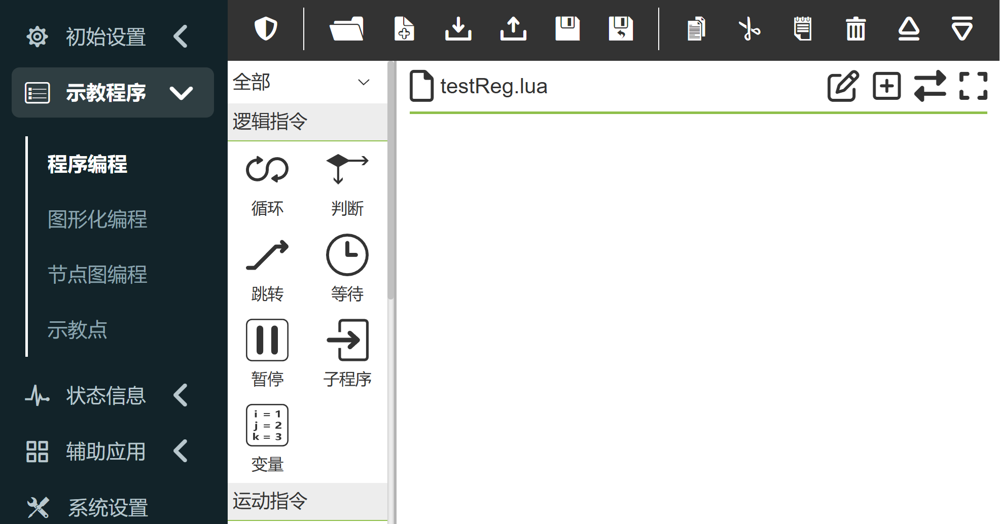
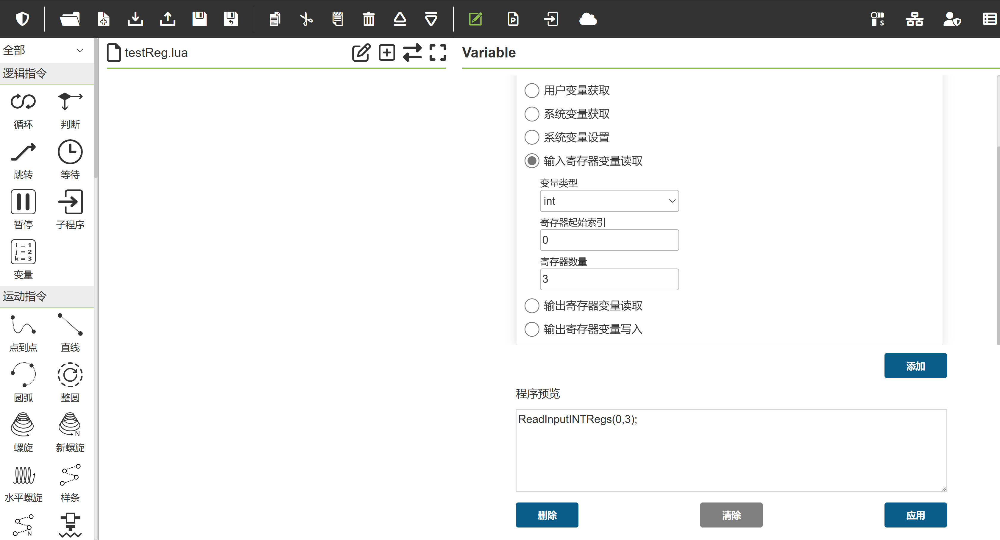
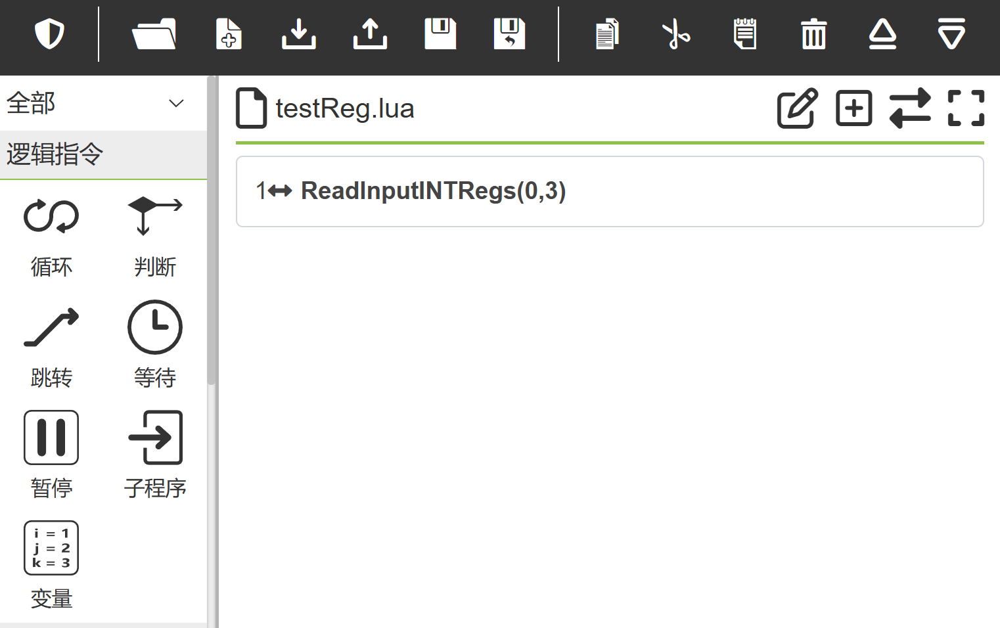
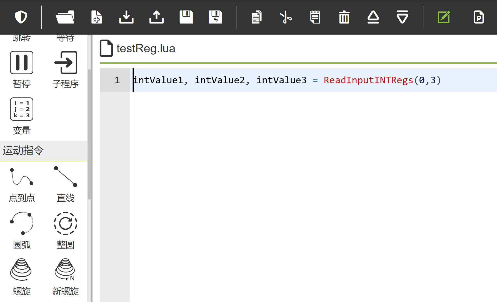
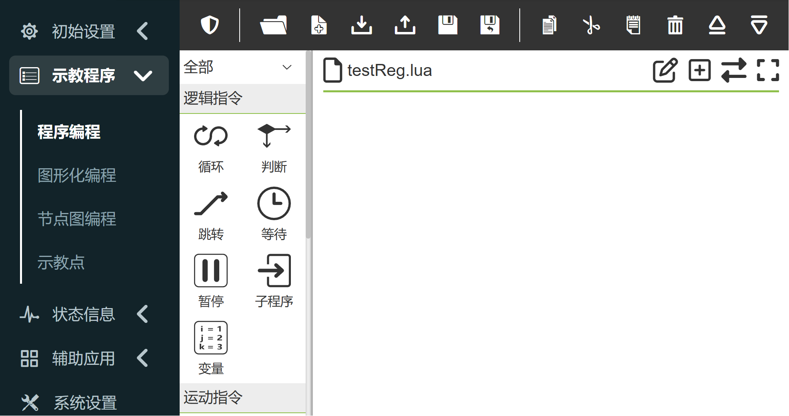
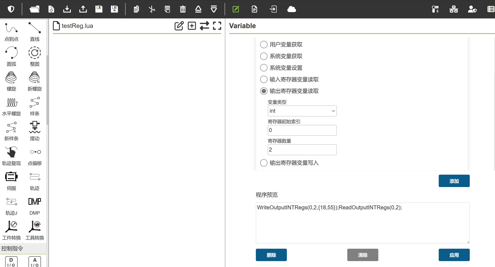
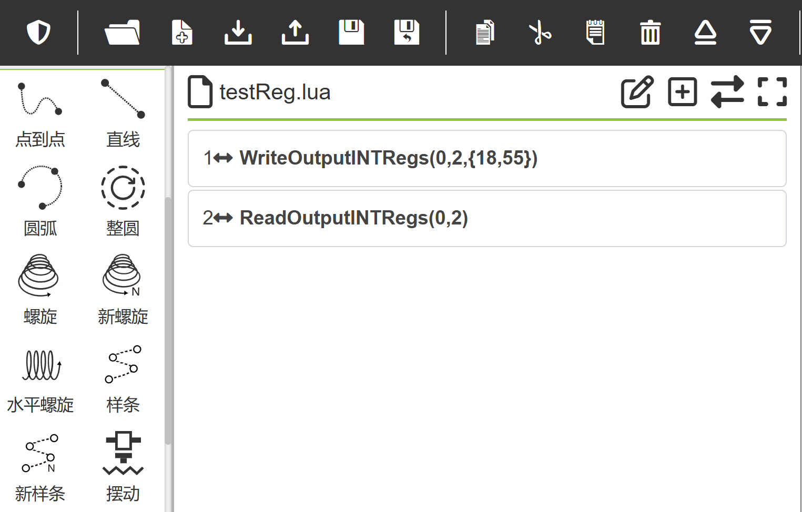
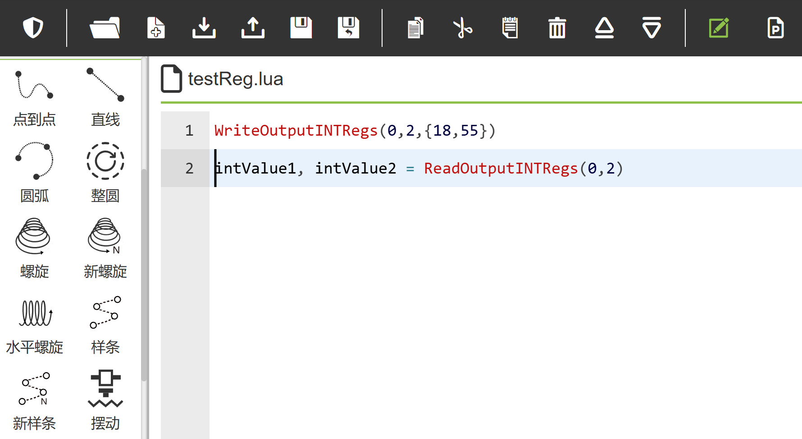
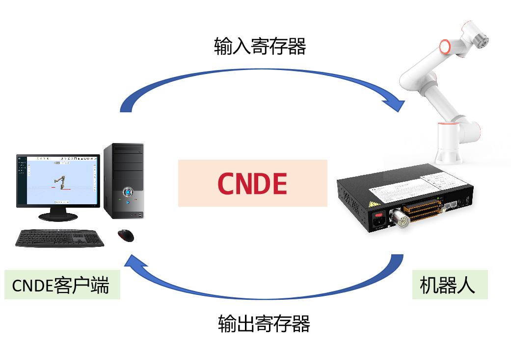

機器人輸入輸出暫存器
===========================

CNDE客戶端與機器人可透過輸入輸出寄存器進行資料交互，具體包含兩個流程：

①CNDE客戶端輸入配置包含輸入暫存器，在輸入資料時修改輸入暫存器數值，機器人LUA程式中加入讀取輸入暫存器指令，執行LUA程式即可讀取到CNDE客戶端修改的輸入暫存器數值。

②機器人LUA程式中加入寫入輸出寄存器指令，執行LUA程式將數值寫入輸出寄存器，CNDE客戶端輸出配置中包含輸出寄存器，啟動機器人CNDE狀態回饋，客戶端接收CNDE輸出資料即可讀取到LUA程式中寫入的輸出暫存器數值。

讀輸入暫存器
~~~~~~~~~~~~~~~~~~

開啟WebApp，依序點選“示教程式”、“程式編程”，新建用戶程式“testReg.lua”。

.. centered:: 圖表 4-1 新建“testReg.lua”程序

點選“變數”，在右側指令新增框中選擇“輸入暫存器變數讀取”，選擇變數類型為“int”，暫存器起始索引為0，暫存器數量為3，點選“新增”按鈕和“應用”按鈕。

.. centered:: 圖表 4-2 新增讀取輸入暫存器指令

此時「testReg.lua」中已經新增一條讀取「int」型輸入暫存器指令。

.. centered:: 圖表 4-3 讀取“int”型輸入暫存器指令添加

點擊切換模式按鈕，切換至程式可編輯模式，在讀取輸入暫存器指令前增加三個lua程式變量，用於接收讀取到的三個輸入暫存器值。

.. centered:: 圖表 4-4 新增讀取輸入暫存器數值

同樣的方式，可分別加入「bit」型和「double」型暫存器資料讀取。

.. image:: cnde/016.png
   :width: 6in
   :align: center

.. centered:: 圖表 4-5 新增“bit”型“double”型輸入暫存器讀取

儲存上述程式並將機器人切換到自動模式，執行該程序，輸入暫存器數值將被讀取至lua程序變數。

寫入輸出暫存器
~~~~~~~~~~~~~~~~~~~~~~

開啟WebApp，依序點選“示教程式”、“程式編程”，新建用戶程式“testReg.lua”。

.. centered:: 圖表 4-6新建“testReg.lua”程序

點選“變數”，在右側指令新增框中選擇“輸出暫存器變數寫入”，選擇變數類型為“int”，暫存器起始索引為0，暫存器數量為2，暫存器值為“18,55”，點選“新增”按鈕；再次選擇“輸出暫存器變數讀取”選擇變數類型為“int”，暫存器起始索引為0，暫存器數量為2，點選“新增”和“應用”按鈕。

.. centered:: 圖表 4-7 新增讀寫輸出暫存器指令

此時「testReg.lua」中已新增「int」型輸出暫存器寫入和讀取指令。

.. centered:: 圖表 4-8 “int”型輸出暫存器寫入和讀取指令添加

點擊切換模式按鈕，切換至程式可編輯模式，在讀取輸出暫存器指令前增加兩個lua程式變量，用於接收讀取到的兩個輸出暫存器值。

.. centered:: 圖表 4-9 新增讀取輸入暫存器數值

儲存上述程式並將機器人切換到自動模式，執行該程序，此時LUA程序變數「intValue1」和「intValue2」的值分別為18和55。 「bit」、「double」型暫存器操作與「int」型暫存器相同。

CNDE輸入輸出寄存器互動應用
~~~~~~~~~~~~~~~~~~~~~~~~~~~~~~~~~~~~~~~~~~

.. centered:: 圖表 4-10 輸入、輸出暫存器資料交互

機器人和CNDE客戶端透過輸入、輸出寄存器的資料互動場景包括但不限於有以下幾種類型：

①輸入寄存器控制機器人運動；CNDE客戶端進行機器人目標位置規劃，將機器人目標位置寫入輸入寄存器中；在機器人LUA程式中讀取輸入寄存器數值獲得機器人目標位置，再透過PTP、LIN、ServoJ等運動指令控制機器人移動到目標位置，LUA範例程式如下：

.. code-block:: lua
    :linenos:

    i = 0;
    oldFlag = 0
    while(1) do
        startFlag = ReadInputINTRegs(0,1)
        if(startFlag ~= oldFlag) then
        oldFlag = startFlag
        x, y, z, a, b, c = ReadInputDBLRegs(0,6)
        ServoJ({x, y, z, a, b, c}, {0, 0, 0, 0}, 10, 10, 0.008, 0, 0)
        end	
    end

②輸入寄存器控制機器人動作：CNDE客戶端向某個輸入寄存器寫入不同的數值，進而控制機器人進行不同的動作，機器人LUA程式中循環獲取對應輸入寄存器數值，根據寄存器數值不同，進行不同的動作，範例程式如下：

.. code-block:: lua
    :linenos:

    runFlag = ReadInputINTRegs(0,1)
    while(runFlag > 0) do
        motion,target = ReadInputINTRegs(1,2)
        if(motion > 0) then
            if(target == 1)then 
                Lin(a1,100,-1,0,0)
            else if(target == 2) then
                Lin(a2,100,-1,0,0)
            else
                Lin(safety,100,-1,0,0)
            end
            end
        else
            sleep_ms(100)
        end
    end

③機器人在運作過程中會向輸出寄存器寫入目前程式狀態，CNDE客戶端透過讀取輸出寄存器狀態，實現對機器人程式運作的監控，範例程式如下：

.. code-block:: lua
    :linenos:

    local weldCount = 0
    runFlag = ReadInputINTRegs(0,1)
    while(runFlag > 0) do
        Lin(safety,100,-1,0,0)
        Lin(a1,100,-1,0,0)
        ARCStart(0, 0, 3000)
        Lin(a2,100,-1,0,0)
        ARCEnd(0, 0, 3000)
        runFlag = ReadInputINTRegs(0,1)
        weldCount = weldCount + 1
        WriteOutputINTRegs(0,1,{weldCount})
    end