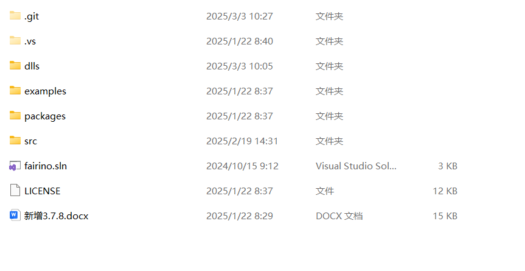
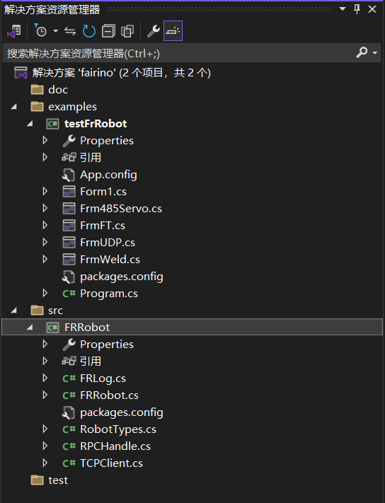
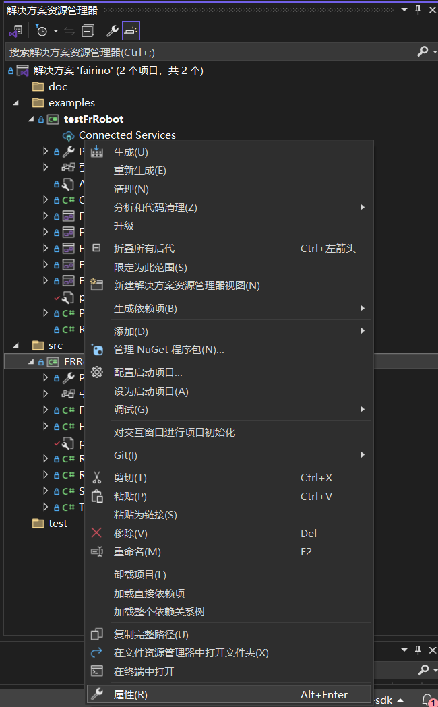
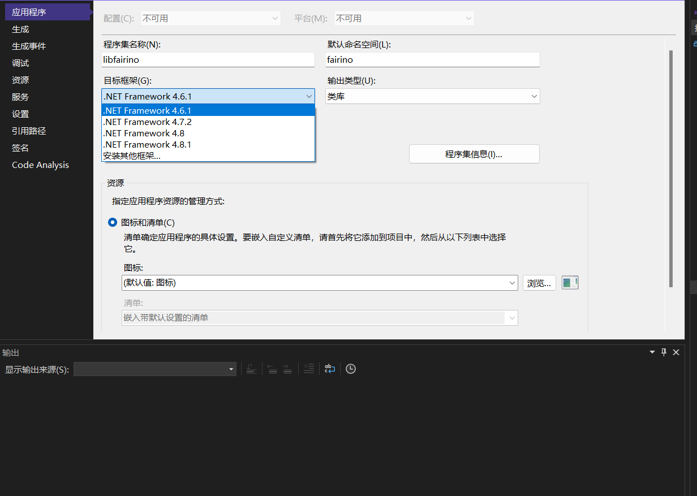
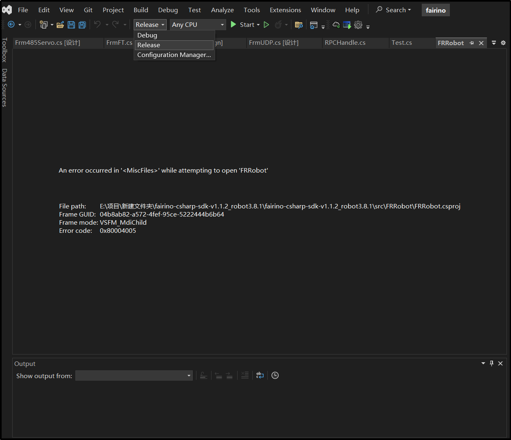
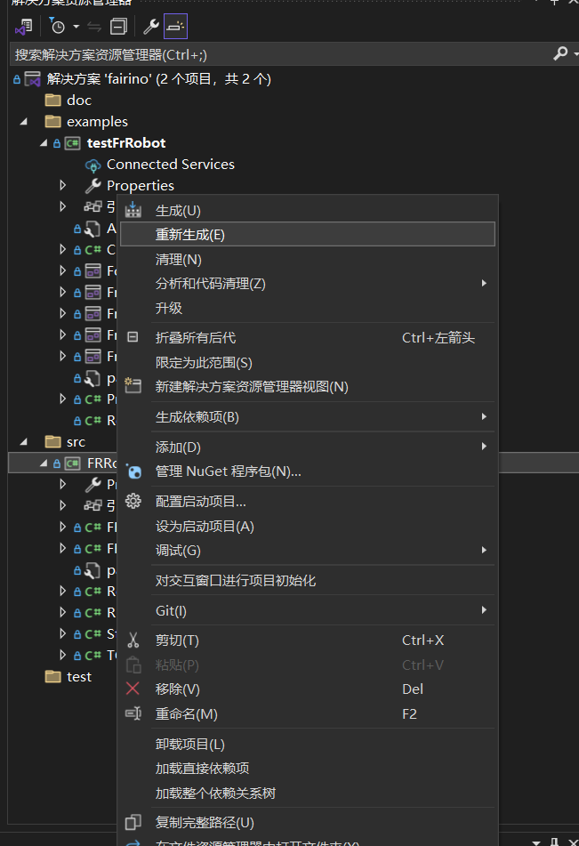
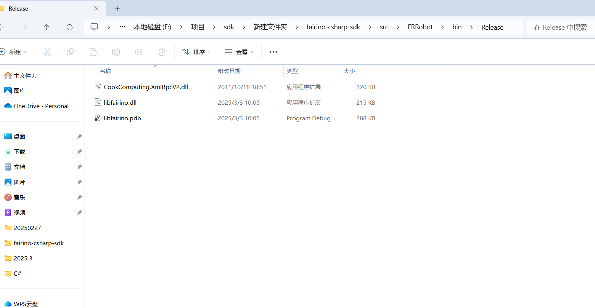
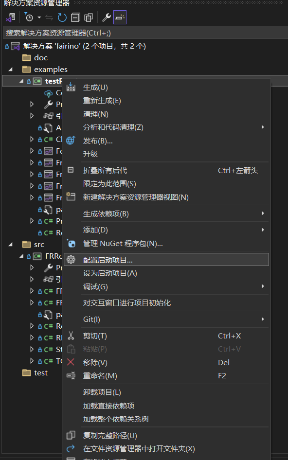

附錄
=================

.. toctree:: 
    :maxdepth: 5

原始碼下載
------------------------------------------------
在法奧文件(https://fairino-doc-zht.readthedocs.io/latest/)中找到「資料下載」模組，點擊「C# SDK」按鈕，在右側頁面中點擊「FAIRINO C# SDK」，等待瀏覽器下載完成。

.. image:: image/001.png
   :width: 6in
   :align: center

.. centered:: 圖表 15.1‑1 C# SDK原始碼下載
    
下載並解壓C# SDK。工程目錄如下圖所示。其中examples文件為測試示例，src文件為C# SDK，Fairino.sln為項目解決方案。Dlls為庫文件。

.. centered:: 圖表 15.1‑2 C# SDK文件結構示例圖

找到名為fairino.sln的解決方案文件，雙擊打開，文件結構如下圖所示。

.. centered:: 圖表 15.1‑3 Visual Studio 2022中項目文件結構示例圖

Windows平台下原始碼編譯
-----------------------------------------------------

C# SDK編譯
~~~~~~~~~~~~~~~~~~~~~~~~~~~~~~~~~~~~~~~~~~~~
點擊FRRobot項目，右鍵選擇屬性，選擇.net框架版本。

.. centered:: 圖表 15.2‑1 設置屬性

.. centered:: 圖表 15.2‑2 選擇.net框架

.. centered:: 圖表 15.2‑3 Release下生成FRRobot項目

將Visual Studio 2022調整成Release模式，重新生成FRRobot項目，在\bin\Release文件中會生成dll動態連結庫。

.. centered:: 圖表 15.2‑4 設置Release模式

.. centered:: 圖表 15.2‑5 Release下重新生成FRRobot項目

.. centered:: 圖表 15.2‑6 生成dll動態連結庫

C# SDK使用
~~~~~~~~~~~~~~~~~~~~~~~~~~~~~~~~~~~~~~~~~~~~~
右鍵選擇testFrRobot項目為啟動項目。

.. centered:: 圖表 15.2‑7 設置為啟動項目
 
C# SDK測試界面如下圖所示。

.. image:: image/018.png
   :width: 6in
   :align: center

.. centered:: 圖表 15.2‑8 C# SDK測試界面

注意事項
---------------------------------------

可能遇到的問題
~~~~~~~~~~~~~~~~~~~~~~~~~~~~~~~~~~~~~~~~~~~~~~~~~~

更新代碼無效果的處理
+++++++++++++++++++++++++++++++++++++++++++++++++++++++++++
在嘗試重寫代碼並重新啟動項目後，如果發現項目仍執行舊代碼，請考慮以下步驟：

重新生成項目：按照步驟3.2的指導，重新生成或更新項目配置和文件。

錯誤碼
+++++++++++++++++++++++++++++++++++++++++++++++++++++++++++
當返回值為0時代表運行正常，若返回值不為0時請查看錯誤碼對照表。