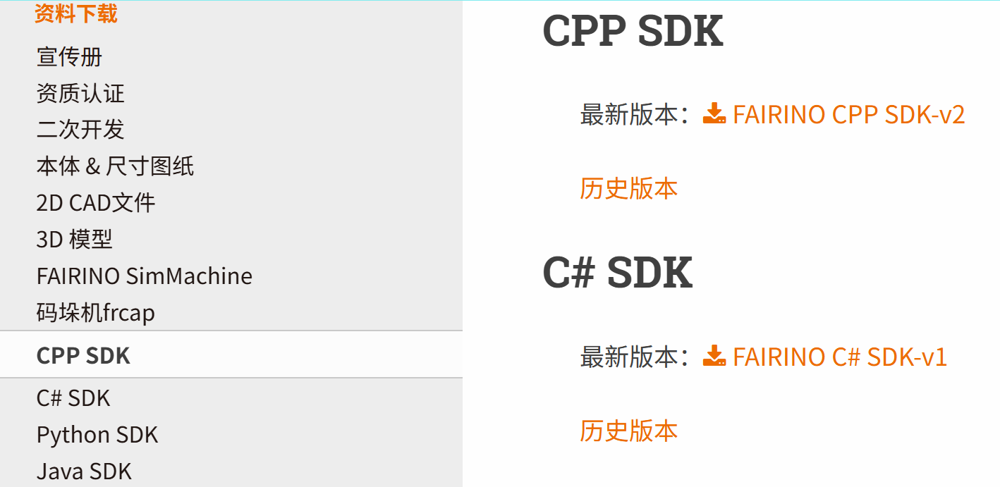
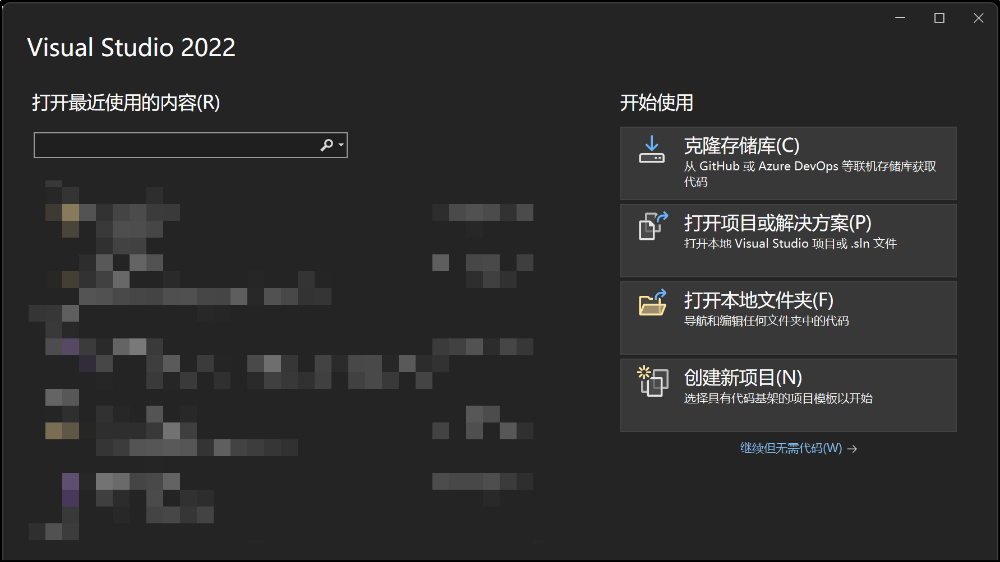
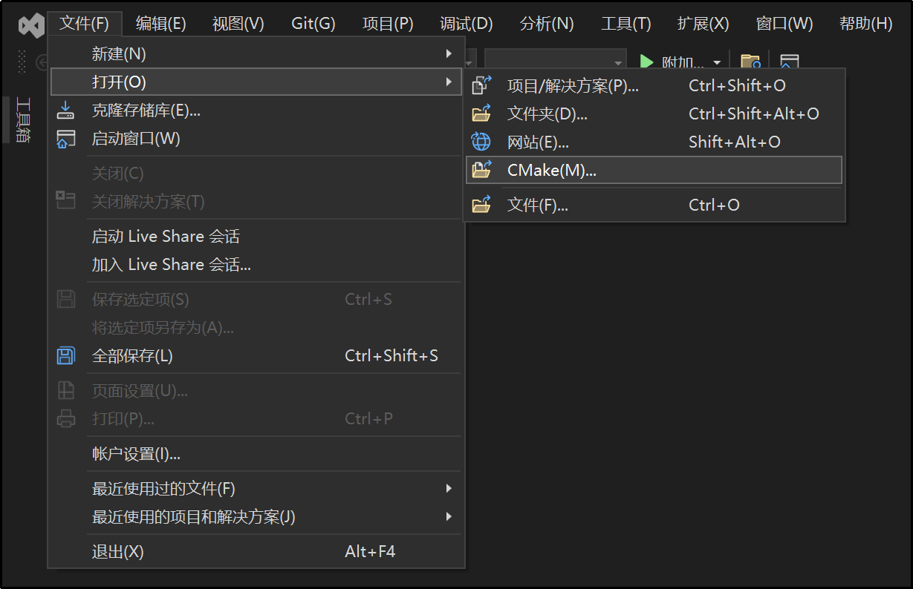
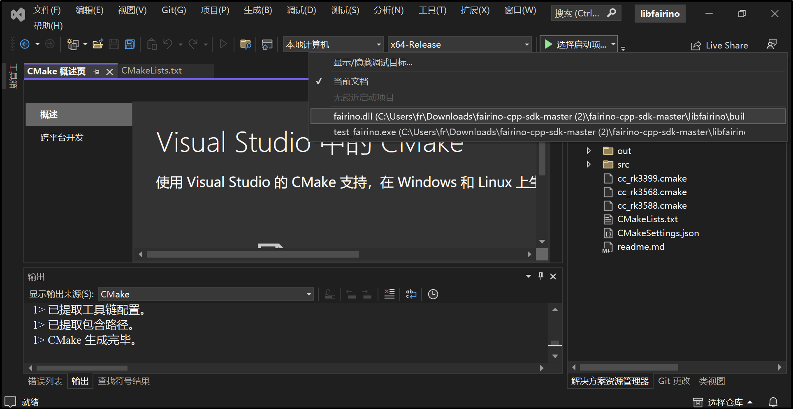
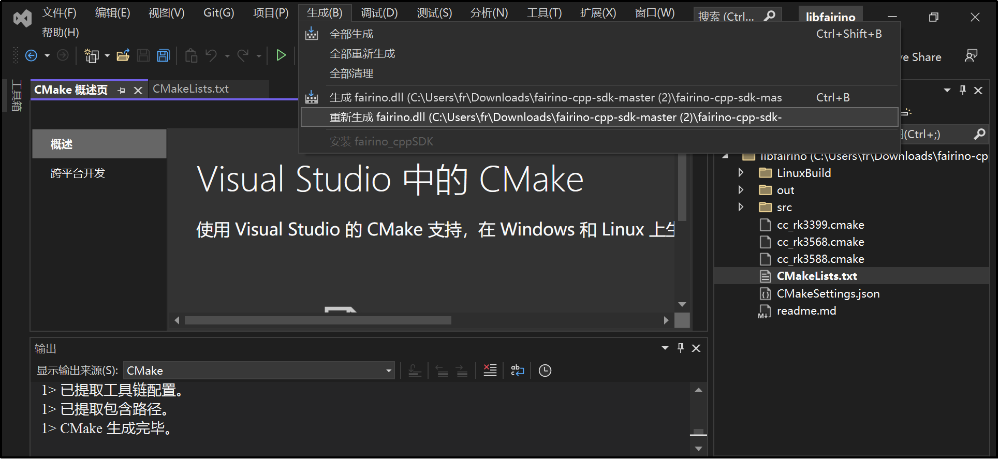
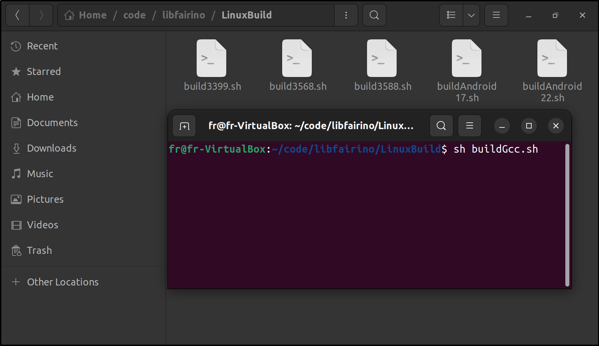

附錄
=================

.. toctree:: 
    :maxdepth: 5

原始碼下載
------------------------------------------------

在法奧文件網站(https://fairino-doc-zht.readthedocs.io/latest/)找到「資料下載」模組，點擊「CPP SDK」按鈕，在右側頁面點擊「FAIRINO CPP SDK」，等待瀏覽器完成下載。

.. centered:: 圖表 15.1‑1 C++SDK原始碼下載

解壓縮後目錄結構如下，包含：

- windows：適用VS2015~VS2019等環境的編譯頭文件和庫文件(.lib和.dll)，含Debug和Release模式
- linux：適用gcc、rk3399、rk3568等環境的頭文件和庫文件(.so)
- libfairino：C++SDK原始碼

.. image:: image/002.png
   :width: 4in
   :align: center

.. centered:: 圖表 15.1‑2 C++SDK原始碼目錄

Windows平台編譯
------------------------------------------------
① 開啟Visual Studio，點擊右下角「繼續但無需代碼(W)」；

.. centered:: 圖表 15.2‑1 開啟Visual Studio

② 依序點擊「檔案」→「開啟」→「CMake(M)」，選擇下載的C++SDK原始碼中的「\libfairino\CMakeLists.txt」文件，Visual Studio將自動載入工程。

.. centered:: 圖表 15.2‑2 開啟Cmake工程

③ 選擇編譯平台（「x64-Debug」或「x64-Release」等），設定啟動項為「fairino.dll」。

.. centered:: 圖表 15.2‑3 選擇啟動項

④ 在選單欄依序點擊「建置」→「重新建置fairino.dll」，編譯器將開始編譯。

.. centered:: 圖表 15.2‑4 生成fairino.dll

⑤ 在工程目錄的「build」資料夾中找到編譯產生的fairino.dll和fairino.lib文件。

.. image:: image/007.png
   :width: 6in
   :align: center

.. centered:: 圖表 15.2‑5 定位fairino.lib和fairino.dll

⑥ 使用協作機器人C++SDK時：先將\libfairino\src\include\Robot-CN\下的三個頭文件（robot.h、robot_error.h、robot_type.h）複製到工程目錄，添加fairino.lib到連結庫，最後將fairino.dll放置到執行檔目錄即可。

Linux平台編譯
------------------------------------------------

編譯前請確保系統已安裝gcc、g++編譯器和cmake構建系統(v3.10以上)。

\libfairino\linuxBuild\中的「buildGcc.sh」腳本包含「cmake..」、「make」及將最終文件複製到\linuxBuild\等指令，執行該腳本即可完成編譯。

① 開啟終端機，進入\libfairino\linuxBuild\目錄，執行命令：「sh buildGcc.sh」並等待編譯完成。

.. centered:: 圖表 15.3‑1 執行編譯腳本

② 編譯完成後，在\libfairino\linuxBuild\目錄下的\include\和\lib\資料夾中可找到所需的頭文件和庫文件。

.. image:: image/009.png
   :width: 6in
   :align: center

.. centered:: 圖表 15.3‑2 編譯結果