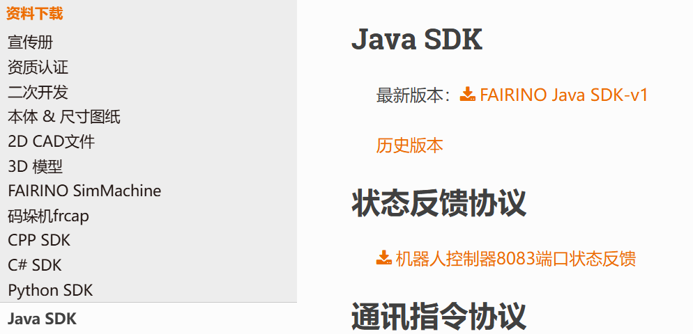
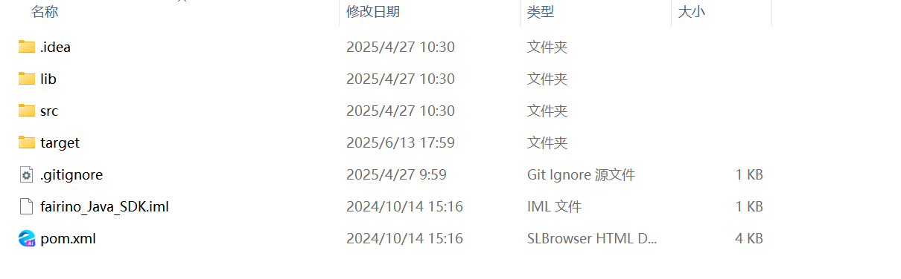

附錄
=================

.. toctree:: 
    :maxdepth: 5

原始碼下載
------------------------------------------------

在法奧文件(https://fairino-doc-zht.readthedocs.io/latest/)中找到「資料下載」模組，點擊「Java SDK」按鈕，在右側頁面中點擊「FAIRINO Java SDK」，等待瀏覽器下載完成。

.. centered:: 圖表 16.1‑1 Java SDK原始碼下載

解開壓縮包，文件目錄如圖所示，其中：

fairino_Java_SDK_maven：Windows系統環境下編譯器編譯的原始碼(.java)和庫文件(.jar)；

.. image:: image/020.png
   :width: 4in
   :align: center

.. centered:: 圖表 16.1‑2 Java SDK文件目錄

進入fairino_Java_SDK_maven文件夾，包含目錄如圖所示，其中：

- lib：原始碼中用到的依賴jar包；
- src：Java SDK原始碼文件；
- target：Java SDK原始碼生成的庫文件（.jar）；

.. centered:: 圖表 16.1‑3 Java SDK原始碼與庫文件目錄

Windows平台下原始碼編譯
-------------------------------------------------------------
①安裝配置構建工具——Maven

Maven下載安裝網址：Welcome to Apache Maven – Maven

安裝配置後如下所示，在終端輸出maven --version會顯示如下信息

.. image:: image/022.png
   :width: 6in
   :align: center

.. centered:: 圖表 16.2‑1 Maven安裝配置

②在Java SDK原始碼目錄下打開終端，輸入mvn package，可生成庫文件（.jar），

.. image:: image/023.png
   :width: 6in
   :align: center

.. centered:: 圖表 16.2‑2 Java SDK編譯為庫文件
 
③在原始碼目錄中找到「target」文件夾，並在文件夾內找到編譯得到的fairino-jar-with-dependencies.jar和fairino.jar文件，如圖所示

.. image:: image/024.png
   :width: 6in
   :align: center

.. centered:: 圖表 16.2‑3 生成jar文件

④使用協作機器人Java SDK時，先在idea的項目中依次點擊File->Project Structure->Libraries,添加上步驟生成的.jar文件，在文件中使用import fairino.*;即可使用生成的.jar文件。