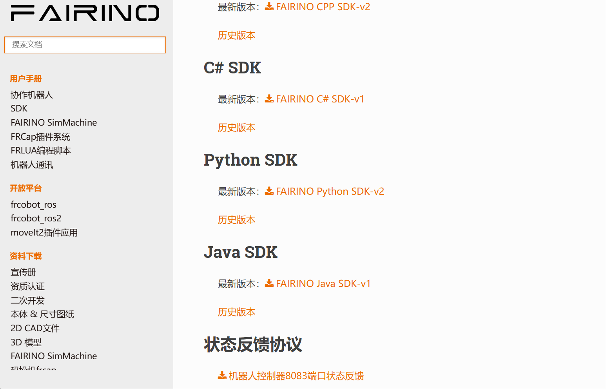
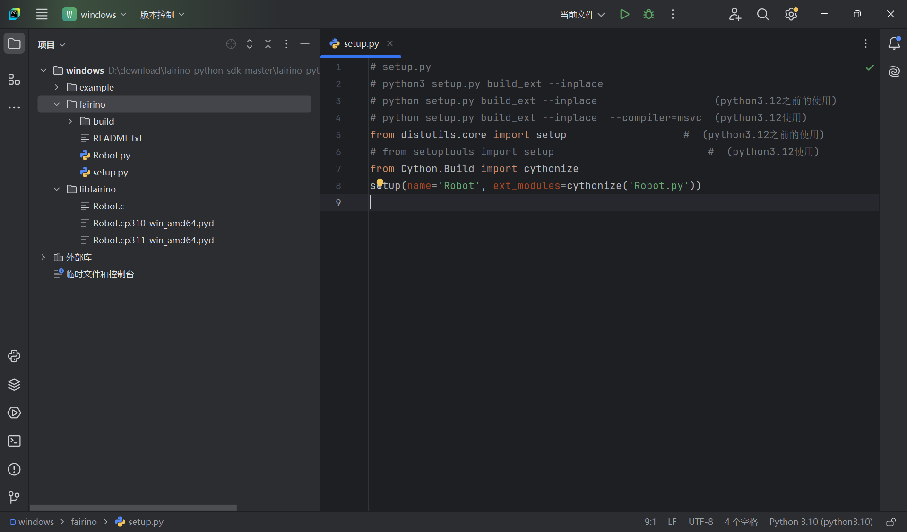

附錄
=================

.. toctree:: 
    :maxdepth: 5

原始碼下載
------------------------------------------------

在法奧文件(https://fairino-doc-zht.readthedocs.io/latest/)中找到「資料下載」模組，點擊「Python SDK」按鈕，在右側頁面中點擊「FAIRINO Python SDK」，等待瀏覽器下載完成。

.. centered:: 圖表 16.1‑1 Python SDK原始碼下載

下載並解壓Python SDK。工程目錄如下圖所示。其中windows文件夾為windows系統下Python SDK；linux文件夾為Linux系統下Python SDK。

.. image:: image/026.png
   :width: 6in
   :align: center

.. centered:: 圖表 16.1‑2 Python SDK文件結構示例圖

以windows系統為例，打開windows文件夾，目錄如下圖所示，example文件為測試示例，fairino文件為Python SDK原始碼，libfairino為庫文件。

.. image:: image/027.png
   :width: 6in
   :align: center

.. centered:: 圖表 16.1‑3 windows系統Python SDK文件結構示例圖

使用Pycharm軟件打開windows文件，結構如下圖所示。

.. image:: image/028.png
   :width: 4in
   :align: center

.. centered:: 圖表 16.1‑4 Pycharm中項目文件結構示例圖
 
原始碼編譯
----------------------------------------
Python動態庫生成根據系統類型和python版本的不同會生成不同的動態庫，例如windows平台下生成庫文件後綴為「.pyd」，linux平台下生成庫文件後綴為「.so」，並且不同python版本生成的動態庫不能混用，所以在生成動態庫前需確定好python版本，使用平台等問題。本手冊以python3.10、windows11、ubuntu22.04版本進行編譯說明。

Windows平台Python SDK編譯
~~~~~~~~~~~~~~~~~~~~~~~~~~~~~~~~~~~~~~~~~~~~~~~~~~~~~~~~~~~~~~~~~~~~~~~~
首先使用pycharm打開下載好的Python SDK文件，並打開setup.py文件；

.. centered:: 圖表 16.2‑1 打開項目文件

然後點擊右下角選擇python解釋器，本次以python3.10為例；

.. image:: image/030.png
   :width: 6in
   :align: center

.. centered:: 圖表 16.2‑2 選擇python版本
 
右鍵fairino文件夾，點擊「打開於」，再點擊「終端」；

.. image:: image/031.png
   :width: 6in
   :align: center

.. centered:: 圖表 16.2‑3 打開終端

然後在終端界面輸入「python setup.py build_ext --inplace」，並點擊「回車」生成Python SDK動態庫；

.. image:: image/032.png
   :width: 6in
   :align: center

.. centered:: 圖表 16.2‑4 運行動態庫生成指令

動態庫生成完成後在fairino文件夾下生成有Robot.c和Robot.cp310-win_amd64.pyd，其中Robot.c為將Robot.py轉換為C語言文件；Robot.cp310-win_amd64.pyd為Python SDK動態庫，其中「cp310」表示適用python3.10版本，「win_amd64」表示適用windows平台

.. image:: image/033.png
   :width: 6in
   :align: center

.. centered:: 圖表 16.2‑5 生成.pyd動態庫
 
Linux平台Python SDK編譯
~~~~~~~~~~~~~~~~~~~~~~~~~~~~~~~~~~~~~~~~~~~~~~~~~~~~~~~~~~~~~~~
首先查看python版本，本手冊中使用pyenv工具管理linux系統下python版本，運行「pyenv versions」命令，查看當前python版本；

.. image:: image/034.png
   :width: 6in
   :align: center

.. centered:: 圖表 16.2‑6 查看python版本

然後切換目標python版本，以python3.10為例，運行「pyenv global 3.10.3」命令，切換python3.10版本；

.. image:: image/035.png
   :width: 6in
   :align: center

.. centered:: 圖表 16.2‑7 選擇python版本

切換至Robot.py文件同級目錄下，運行「cd /home/fairino/fairino-python-sdk-master/fairino-python-sdk-master/linux/fairino」命令，切換目錄到Robot.py下。

.. image:: image/036.png
   :width: 6in
   :align: center

.. centered:: 圖表 16.2‑8 切換至Robot.py文件同級目錄

確認python版本，運行「python --version」命令，查看當前python版本；

.. image:: image/037.png
   :width: 6in
   :align: center

.. centered:: 圖表 16.2‑9 查看python版本
 
在終端界面輸入「python setup.py build_ext --inplace」，並點擊「回車」生成Python SDK動態庫；

.. image:: image/038.png
   :width: 6in
   :align: center

.. centered:: 圖表 16.2‑10 運行動態庫生成指令

動態庫生成完成後在fairino文件夾下生成有Robot.c和Robot.cpython-310-x86_64-linux-gnu.so，其中Robot.c為將Robot.py轉換為C語言文件，「Robot.cpython-310-x86_64-linux-gnu.so」為Python SDK動態庫，其中「python-310」表示適用python3.10版本，「linux-gnu」表示適用Linux平台

.. image:: image/039.png
   :width: 6in
   :align: center

.. centered:: 圖表 16.2‑11 生成.so動態庫

注意事項
----------------------------------

可能遇到的問題
~~~~~~~~~~~~~~~~~~~~~~~~~~~~~~~~~~~~~~~~

版本對應
++++++++++++++++++++++++++++++
python動態庫依賴生成環境與python版本，所以在使用python動態庫是需要檢查動態庫與系統類型是否一致，動態庫與python版本是否一致

錯誤碼
++++++++++++++++++++++++++++++
當返回值為0時代表運行正常，若返回值不為0時請查看錯誤碼對照表。