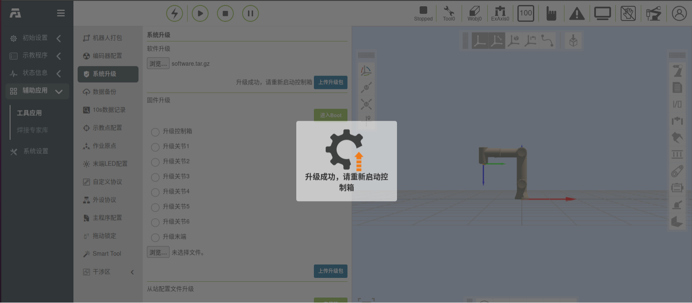
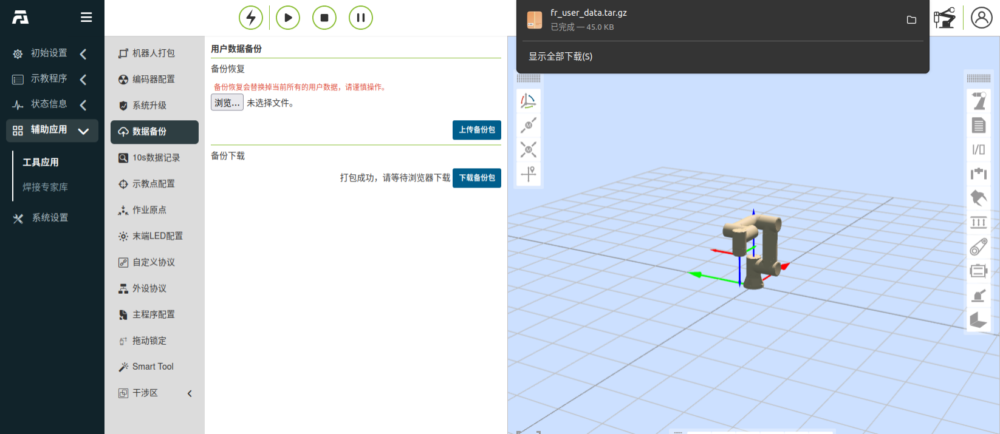
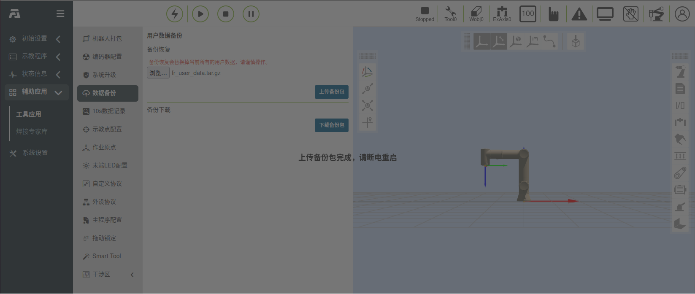
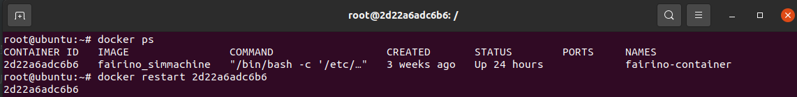

虛擬機-Docker
===================================

Linux部署docker映像
---------------------------

操作環境
~~~~~~~~~~~~~~

虛擬機器運作環境系統：Ubuntu 18.04.6；

虛擬機器運作環境系統：RAM 4G，ROM 50G，6核CPU ；

操作權限：使用超級管理員root權限，設定方法見附錄3；

docker安裝檔：fr_docker.tar.gz；

FAIRINO SimMachine鏡像：FAIRINOSimMachine.tar；

安裝docker
~~~~~~~~~~~~~~

若使用者已安裝部署docker，則跳過此節，進行1.3映像部署。

1.下載fr_docker.tar.gz，放至Ubuntu檔案路徑/opt/。

2.解壓縮fr_docker.tar.gz.，以/opt/目錄下為例：

.. code-block:: console
   :linenos:

   cd /opt/ && tar -zxvf fr_docker.tar.gz

.. image:: controller_virtual_machine/036.png
   :width: 6in
   :align: center

3.執行安裝docker腳本：

.. code-block:: console
   :linenos:

   sh install.sh docker-27.0.3.tgz

待腳本執行完畢後，出現版本號，表示安裝成功。

.. image:: controller_virtual_machine/037.png
   :width: 6in
   :align: center

鏡像配置
~~~~~~~~~~~~~~

導入docker映像
++++++++++++++++++++

1. 下載虛擬機器鏡像FAIRINOSimMachine.tar並解壓縮。

2. 查看docker版本確認已安裝。

.. code-block:: console
   :linenos:

   docker -v

.. image:: controller_virtual_machine/038.png
   :width: 6in
   :align: center   

3. 導入鏡像   

.. code-block:: console
   :linenos:

   docker load -i ./FAIRINOSimMachine.tar

出現fairno_simmachine:latest則表示匯入完成。

.. image:: controller_virtual_machine/039.png
   :width: 6in
   :align: center  

4. 執行docker images查看是否匯入成功。

建立自訂橋接網絡
++++++++++++++++++++

1. 執行以下指令，建立名為fairino-net，網段為192.168.58.0/24的橋接網路。

.. code-block:: console
   :linenos:

   docker network create --driver bridge --subnet 192.168.58.0/24 --gateway 192.168.58.1 fairino-net

2. 查看網路

.. code-block:: console
   :linenos:

   docker network ls

存在fairino-net網路表示創建成功。

.. image:: controller_virtual_machine/040.png
   :width: 6in
   :align: center 

首次啟動docker容器
++++++++++++++++++++

1. 建立容器並啟動

使用fairino-net網絡，fairino_simmachine鏡像啟動容器。

.. code-block:: console
   :linenos:

   docker run -d -P --name fairino-container --privileged -u root --net fairino-net fairino_simmachine

.. image:: controller_virtual_machine/041.png
   :width: 6in
   :align: center 

.. code-block:: console
   :linenos:

   docker ps 

查看容器是否成功啟動，出現fairino-container則表示啟動成功。

.. image:: controller_virtual_machine/042.png
   :width: 6in
   :align: center 

web操作虛擬機器人
----------------------------

容器正常啟動
~~~~~~~~~~~~~~~~~~~~~~~~~~~~~~

此小節針對非首次啟動容器，因重新啟動電腦或docker關閉等原因容器未在背景運作狀況。

1. 啟動docker：

.. code-block:: console
   :linenos:

   systemctl start docker

2. 查看docker狀態：

.. code-block:: console
   :linenos:

   systemctl status docker
   
綠色active(running)表示啟動成功。

.. image:: controller_virtual_machine/043.png
   :width: 6in
   :align: center 

3. 執行docker ps -a查看容器ID。

.. image:: controller_virtual_machine/044.png
   :width: 6in
   :align: center 

4. 執行 docker start [容器ID]。

.. image:: controller_virtual_machine/045.png
   :width: 6in
   :align: center 

5. 執行成功，再次docker ps 查看容器正在運作。

.. image:: controller_virtual_machine/046.png
   :width: 6in
   :align: center 

操作虛擬機器人
~~~~~~~~~~~~~~~~~~~~~~~~~~~~~~

1. 確認docker容器正在運作。

.. code-block:: console
   :linenos:

   docker ps 

出現fairino-container則表示正在運作。

.. image:: controller_virtual_machine/047.png
   :width: 6in
   :align: center 

2. 開啟瀏覽器，輸入預設IP：192.168.58.2，即可存取web介面，操作虛擬機器人。

.. image:: controller_virtual_machine/048.png
   :width: 6in
   :align: center 

3. 使用admin帳號登錄，密碼：123。

.. image:: controller_virtual_machine/049.png
   :width: 6in
   :align: center 

用戶修改IP位址
~~~~~~~~~~~~~~~~~~~~~~

.. image:: controller_virtual_machine/050.png
   :width: 6in
   :align: center 

1. 開啟瀏覽器，輸入預設 IP： 192.168.58.2，開啟 web 頁面；
2. 使用 admin 帳號登錄，密碼： 123；
3. 進入“系統設定” → “通用設定” → “網路設定”， 修改 IP 為目標 IP 位址、遮罩、閘道。點選「設定網路」；
4. 打開終端，關閉容器；

查看容器ID：

.. code-block:: console
   :linenos:
      
   docker ps -a

.. image:: controller_virtual_machine/052.png
   :width: 6in
   :align: center 

關閉容器：

.. code-block:: console
   :linenos:
   
   docker stop [容器ID]

.. image:: controller_virtual_machine/053.png
   :width: 6in
   :align: center 

5. 重新配置容器網路；

刪除原先網路：

.. code-block:: console
   :linenos:
   
   docker network rm fairino-net

建立新網路：

.. code-block:: console
   :linenos:
   
   docker network create --driver bridge --subnet [目標IP/子网掩码] --gateway [网關IP] fairino-net

以192.168.56.0/24為例：docker network create --driver bridge --subnet 192.168.56.0/24 --gateway 192.168.56.1 fairino-net

.. image:: controller_virtual_machine/054.png
   :width: 6in
   :align: center 

6. 將容器重新連接到新建立的網路；

.. code-block:: console
   :linenos:

   docker network connect fairino-net [容器ID]

.. image:: controller_virtual_machine/055.png
   :width: 6in
   :align: center 

7. 重新啟動容器；

.. code-block:: console
   :linenos:
   
   docker start [容器ID]

8. 此時開啟瀏覽器， 輸入修改後 IP 位址，即可存取 web 介面，操作虛擬機器人。

.. image:: controller_virtual_machine/056.png
   :width: 6in
   :align: center 

虛擬機版本升降級
----------------------------

概述
~~~~~~~~~~~~~~~~~~~~~~~~~~~~~~

本手冊詳細闡述了在使用FAIRINO SimMachine Docker虛擬機時，進行軟體升級與降級操作的標準流程，並系統梳理了版本變更過程中需要重點關注的注意事項。

升降級準備及注意事項
~~~~~~~~~~~~~~~~~~~~~~~~~~~~~

操作準備
++++++++++++++++++++++

1. 已部署及正常使用的FAIRINO SimMachine Docker虛擬機。部署教程見《用戶手冊-Linux部署docker鏡像》；
2. Docker虛擬機版本的軟體升級包，下載地址見《資料下載-FAIRINO SimMachine Docker》，解壓後，內容包含最新版本的docker鏡像FAIRINOSimMachine.tar及軟體升級包software.tar.gz。

注意事項
++++++++++++++

1. 資料備份：建議在升級前執行備份，方法見「資料備份」章節，以避免因升級異常導致資料遺失。
2. 版本限制：

.. centered:: 圖表 2.3-1 升降級版本限制

.. list-table::
   :widths: 50 50 50
   :header-rows: 0
   :align: center

   * - **操作類型** 
     - **條件/限制**
     - **步驟說明**

   * - **版本升級** 
     - 當前版本>= 3.7.8
     - 可直接升級

   * - **版本升級** 
     - 當前版本< 3.7.8
     - 需先升級至3.7.5版本或使用兼容方案

   * - **版本降級**
     - 當前且目標版本>= 3.7.8
     - 可直接降級

   * - **版本降級**
     - 當前或目標版本<3.7.8
     - 使用兼容方案

   * - **兼容方案**
     - 同時適用於升級/降級異常情況
     - 見「兼容方案」章節詳細步驟

升降級操作說明
~~~~~~~~~~~~~~~~~~~~~~

軟體版本直接升降級步驟
+++++++++++++++++++++++++++++++++++++++++

1. 登入webApp，選擇選單欄輔助應用-工具應用，軟體升級；
2. 選擇升級包，上傳升級包後開始升級；
3. 升級成功後，如下圖，如遇升級異常，見「兼容方案」章節更新軟體版本；

.. centered:: 圖表 2.3-1 升級成功

4. 打開終端，執行「docker ps」，查詢當前容器ID；
5. 執行「docker restart [容器ID]」，重啟容器，如下圖；

.. image:: controller_virtual_machine/060.png
   :width: 6in
   :align: center 

.. centered:: 圖表 2.3-2 重啟容器

6. 等待重啟完成，刷新頁面即可正常使用。

兼容方案
++++++++++++++++++++++++++

該兼容方案思路：升級前進行資料備份->刪除舊版本的容器及鏡像->重新創建目標版本->資料恢復。

資料備份
********************

1. 登入webApp，選擇選單欄輔助應用-工具應用-資料備份，點擊下載備份包，瀏覽器彈出下載fr_user_data.tar.gz；

.. centered:: 圖表 2.3-3 下載備份包

重新構建目標版本容器
*****************************************

1. 打開終端刪除舊版本鏡像及容器，執行「docker ps」，查詢容器號；
2. 執行「docker rm -f [容器號]」，刪除容器；
3. 執行「docker rmi -f fairino_simmachine」， 刪除版本鏡像；

.. image:: controller_virtual_machine/062.png
   :width: 6in
   :align: center 

.. centered:: 圖表 2.3-4 刪除容器及鏡像

4. 參照使用手冊《FAIRINO SimMachine-虛擬機docker-鏡像配置》，配置並啟動目標版本的docker容器；
5. 登入webApp後，操作資料恢復，見「資料恢復」章節。

資料恢復
*****************************

1. 登入webApp，選擇選單欄輔助應用-工具應用-資料備份，選擇升級前導出的備份包fr_user_data.tar.gz，點擊上傳備份包；
2. 恢復完成，如下圖；

.. centered:: 圖表 2.3-5 用戶資料恢復

3. 打開終端，執行「docker ps」，查詢當前容器ID；
4. 執行「docker restart [容器ID]」，重啟容器，如下圖；

.. centered:: 圖表 2.3-6 重啟容器

5. 等待重啟完成，刷新頁面即可正常使用。